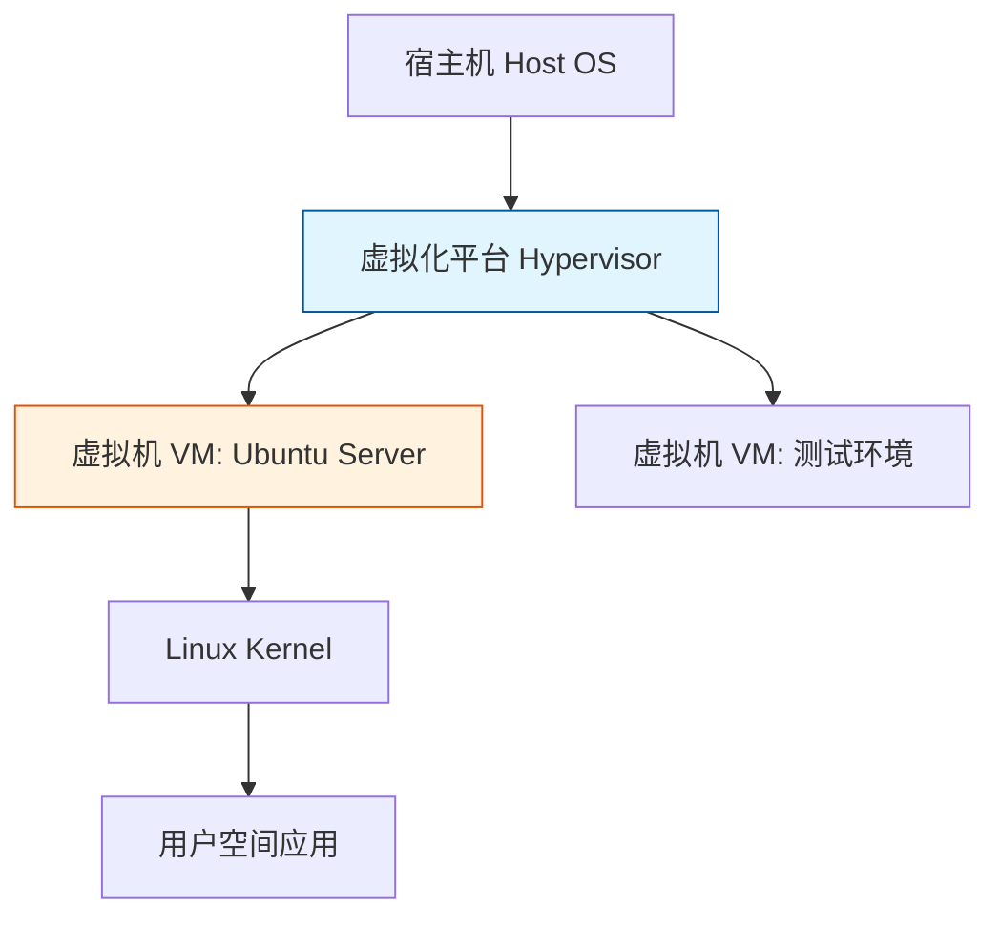
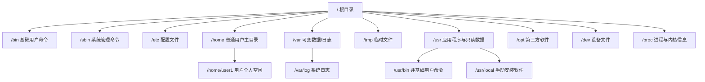
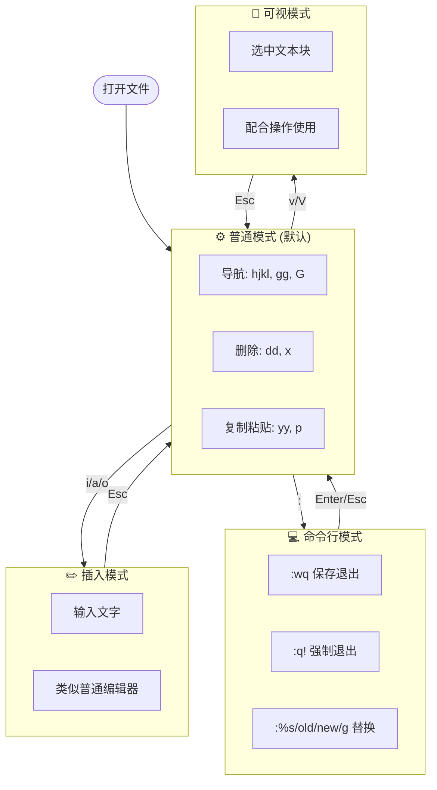
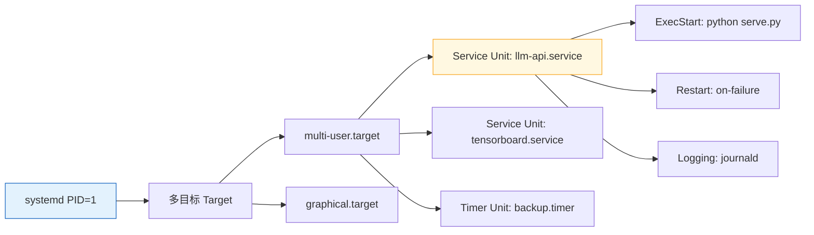
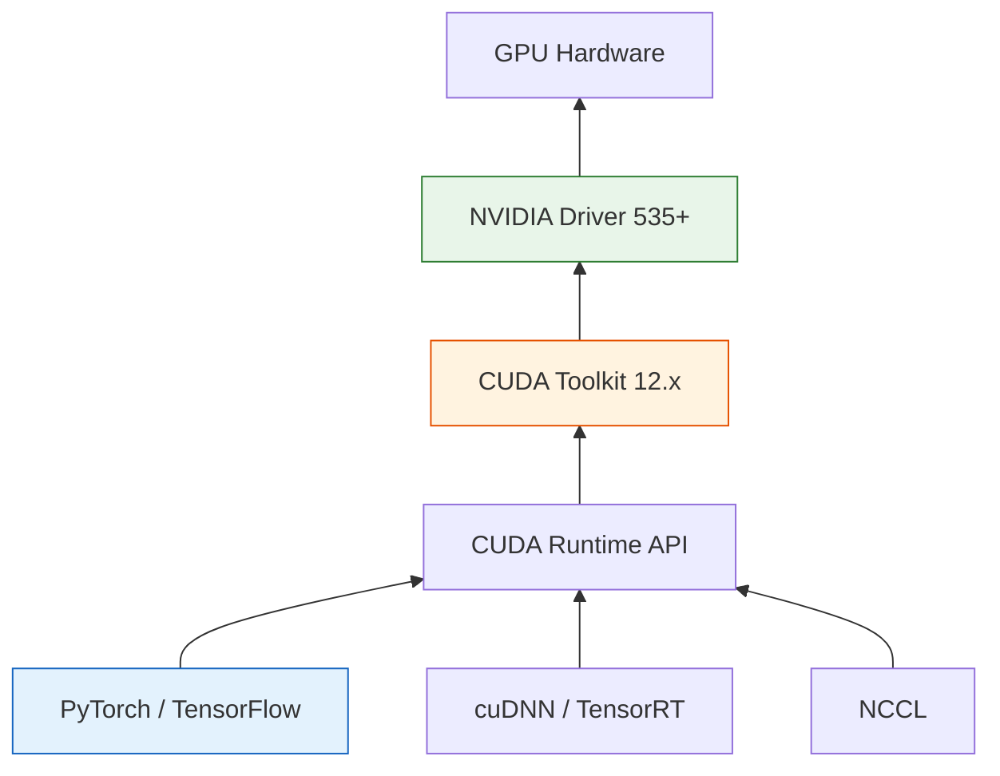
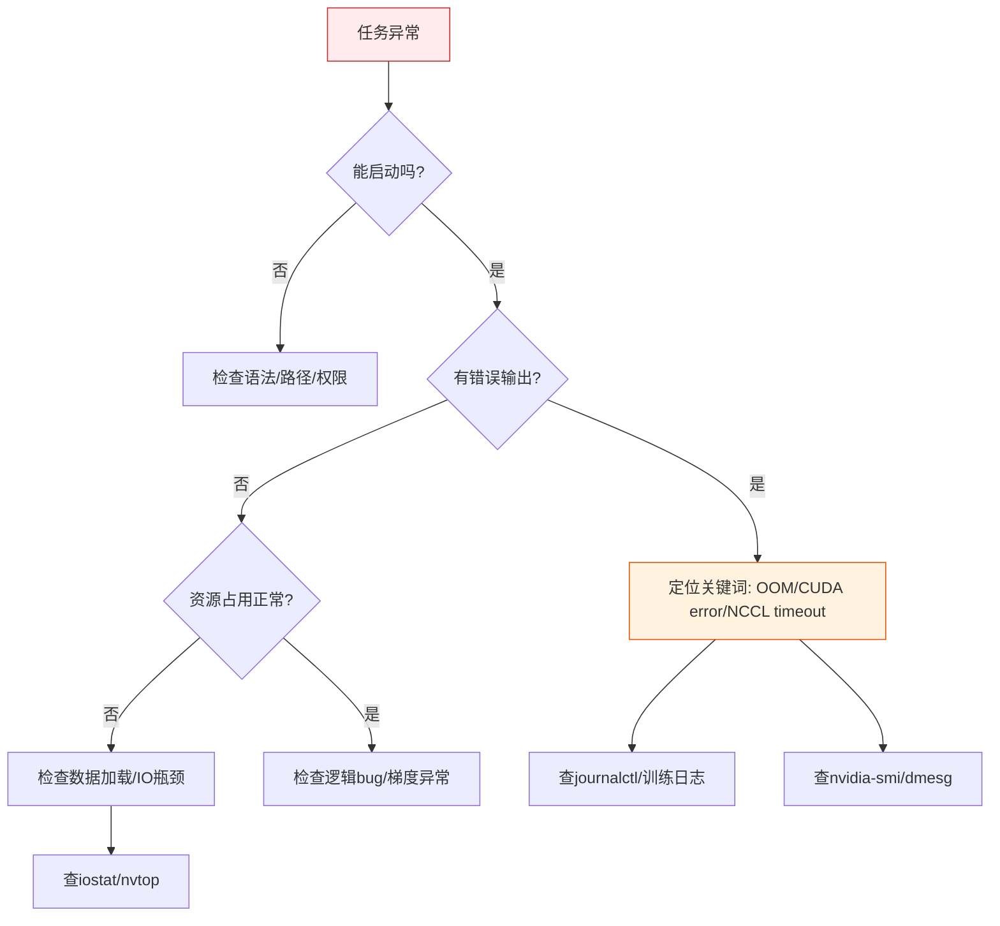

### 一、Linux系统入门与基础环境构建

#### 1.1 Linux操作系统概述与发行版选择

Linux并非单一的操作系统，而是一个基于Unix设计哲学的开源内核。在实际应用中，我们使用的是由“Linux内核 + GNU工具集 + 图形界面 + 应用软件”打包而成的**发行版（Distribution）**。对于大模型技术栈而言，选择合适的发行版至关重要，因为它直接关系到GPU驱动兼容性、深度学习框架支持以及社区资源的丰富度。

目前主流的服务器端发行版主要分为两大阵营：

- **Debian/Ubuntu系：** 使用`.deb`包和`apt`包管理器。Ubuntu是目前人工智能和云计算领域事实上的标准桌面及服务器系统，拥有最广泛的硬件驱动支持和最新的软件源，是大模型开发的首选。
- **RHEL/CentOS/Rocky系：** 使用`.rpm`包和`yum/dnf`包管理器。传统企业级服务器常用，稳定性极高，但在AI生态的更新速度上略逊于Ubuntu。

> **💡 概念解析：内核与发行版的区别**  
> 可以将Linux内核比作汽车的“发动机”，它负责CPU调度、内存管理等核心功能；而发行版则是整车厂组装好的“完整汽车”，包含了方向盘（Shell）、仪表盘（GUI）和维修工具（包管理器）。开发者通常不需要直接操作内核，而是通过发行版提供的接口来使用系统资源。

#### 1.2 虚拟化技术与实验环境搭建

在学习Linux时，直接在物理机上安装双系统存在数据丢失风险且切换不便。**虚拟化技术**允许我们在现有操作系统之上模拟出完整的硬件环境，运行独立的Linux实例。这是构建安全、可复现的大模型实验环境的基石。



**主流虚拟化方案对比：**

|方案|类型|适用场景|优势|注意事项|
|:--|:--|:--|:--|:--|
|**VMware Workstation**|Type-2 虚拟器|本地学习、功能测试|图形化好、快照功能强、兼容性好|个人免费，商用需授权|
|**VirtualBox**|Type-2 虚拟器|开源爱好者、轻量级实验|完全开源免费、跨平台|3D加速和USB支持稍弱|
|**WSL2**|混合架构|Windows下的快速开发|启动秒级、与Win文件互通、原生体验|不支持完整systemd（旧版），GPU直通配置较复杂|
|**KVM/QEMU**|Type-1 虚拟器|生产服务器、云平台底层|性能接近裸机、Linux原生支持|配置门槛高，不适合纯新手入门|

> **⚠️ 关键补充：BIOS/UEFI虚拟化支持**  
> 无论选择哪种Type-2虚拟化软件，都必须确保宿主机的BIOS/UEFI中开启了**Intel VT-x**或**AMD-V**虚拟化技术。若未开启，虚拟机将无法启动或性能极差。这通常是初学者遇到的第一个“坑”。

#### 1.3 Ubuntu系统安装与初始化配置

安装Ubuntu Server是接触Linux的第一步。推荐下载**LTS（Long Term Support）长期支持版本**，如22.04 LTS或24.04 LTS。LTS版本提供5年的安全更新，保证了大模型训练周期的环境稳定性，避免因系统升级导致的依赖断裂。

**安装过程中的关键决策点：**

1. **分区策略：** 学习环境建议使用“Guided - use entire disk”自动分区。但在生产环境中，务必将`/home`、`/var`和数据盘单独挂载，防止日志爆满或用户数据增长导致根分区溢出进而引发系统崩溃。
2. **OpenSSH Server：** 安装时务必勾选安装OpenSSH Server。这是后续通过终端远程管理服务器的唯一入口，漏选则只能依赖虚拟机控制台，效率极低。
3. **用户名规范：** 避免使用`root`作为日常登录账户。创建一个普通用户并赋予`sudo`权限，遵循最小权限原则，这是Linux安全运维的基本素养。

**安装后必做初始化清单：**

```bash
# 1. 更新软件源索引并升级已安装包
sudo apt update && sudo apt upgrade -y

# 2. 设置正确的时区（影响日志时间和定时任务）
sudo timedatectl set-timezone Asia/Shanghai

# 3. 配置静态IP或确认DHCP分配（确保远程连接地址固定）
# Ubuntu 22.04+ 使用 netplan 配置网络
sudo nano /etc/netplan/00-installer-config.yaml
sudo netplan apply

# 4. 更换国内镜像源（大幅提升下载速度）
# 备份原文件后替换为清华/阿里/中科大源
sudo sed -i 's/archive.ubuntu.com/mirrors.aliyun.com/g' /etc/apt/sources.list
sudo apt update
```

> **💡 背景知识：为什么必须换源？**  
> Ubuntu默认官方源服务器位于海外，在国内访问延迟高、丢包严重，甚至可能因网络问题导致`apt install`中途失败。国内各大云厂商和高校提供了同步镜像，内容一致但访问速度快数个数量级。这是国内Linux用户的“第零步”操作。

#### 1.4 远程连接与终端工作流

大模型开发几乎全部在远程服务器上完成，本地仅作为终端接入点。建立高效的远程连接工作流是提升生产力的关键。

**SSH协议核心机制：**  
SSH（Secure Shell）采用非对称加密进行身份验证，对称加密进行数据传输。客户端发起连接后，服务端发送公钥，客户端用公钥加密会话密钥发回，后续通信均使用该会话密钥。这一机制确保了即使网络被监听，密码和数据也不会泄露。

**推荐的终端工具链：**

- **Windows用户：** Tabby / WindTerm / MobaXterm（内置SFTP，方便传文件）
- **macOS/Linux用户：** iTerm2 / Warp / 原生Terminal + tmux
- **跨平台IDE集成：** VS Code Remote SSH（强烈推荐，直接在远程服务器上编辑代码、运行终端，体验与本地无异）

```bash
# 生成SSH密钥对（本地执行）
ssh-keygen -t ed25519 -C "your_email@example.com"

# 将公钥上传至服务器
ssh-copy-id username@server_ip

# 禁用密码登录（服务器端执行，确认密钥登录成功后再操作！）
sudo sed -i 's/#PasswordAuthentication yes/PasswordAuthentication no/' /etc/ssh/sshd_config
sudo systemctl restart sshd
```

> **⚠️ 重要提醒：密钥登录 vs 密码登录**  
> 密码容易被暴力破解，而Ed25519密钥的安全强度远超任何人类可记忆的密码。在大模型服务器上，尤其是开放了公网端口或使用了弱口令的情况下，禁用密码登录是防止服务器被挖矿木马入侵的最有效手段之一。请务必在确认密钥登录正常后再关闭密码认证，否则可能导致自己也被锁在外面。

本阶段完成后，你将拥有一个安全、高速、可远程管理的Ubuntu基础环境，为下一阶段深入学习文件系统与核心命令做好充分准备。

### 二、核心命令与文件系统管理

#### 2.1 Linux目录结构与“一切皆文件”哲学

理解Linux文件系统是掌握所有操作命令的前提。与Windows以盘符（C:、D:）为根的逻辑不同，Linux采用**单一根目录树**结构，所有设备和存储都挂载在这棵树的某个节点上。这种设计体现了“一切皆文件”的核心哲学：硬件设备、进程信息、内核参数都被抽象为文件，可以用统一的接口进行读写。



**大模型开发相关的关键目录：**

| 目录               | 用途                | AI开发注意事项                  |
| :--------------- | :---------------- | :------------------------ |
| `/home/username` | 用户数据、项目代码、Conda环境 | 数据盘通常挂载于此，避免根分区爆满         |
| `/opt`           | 第三方大型软件           | CUDA Toolkit、cuDNN常安装于此   |
| `/usr/local`     | 手动编译安装的软件         | 自定义Python包、C++库的默认前缀      |
| `/var/log`       | 系统与服务日志           | GPU驱动报错、训练崩溃日志的首查位置       |
| `/tmp`           | 临时文件              | 训练产生的checkpoint缓存可能占用大量空间 |
| `/dev/nvidia*`   | NVIDIA GPU设备文件    | 容器内GPU透传是否正常的关键检查点        |

> **💡 概念解析：绝对路径与相对路径**
> 
> - **绝对路径：** 从根目录`/`开始的完整路径，如`/home/user/project/data.csv`。在脚本中应始终使用绝对路径，避免因工作目录变化导致错误。
> - **相对路径：** 相对于当前工作目录的路径。`.`代表当前目录，`..`代表上级目录。交互式操作时常用，但写入自动化脚本时需谨慎。

#### 2.2 文件与目录操作核心命令

以下命令是Linux操作的“肌肉记忆”，必须达到无需思考即可敲出的熟练度。

**导航与查看：**

```bash
pwd                 # 显示当前工作目录的绝对路径
ls -lah             # 列出所有文件（含隐藏），显示详情和人类可读大小
cd /path/to/dir     # 切换到绝对路径
cd ~/projects       # ~ 展开为当前用户主目录
cd -                # 返回上一次所在目录（两个目录间快速切换的神器）
tree -L 2           # 以树状图展示目录结构，深度限制为2层
```

**创建、复制、移动、删除：**

```bash
mkdir -p a/b/c      # 递归创建多级目录，-p 避免父目录不存在时报错
touch file.txt      # 创建空文件或更新时间戳
cp -r src/ dst/     # 递归复制目录，保留结构
mv old.txt new.txt  # 重命名或移动文件
rm -rf dir/         # ⚠️ 强制递归删除，无确认提示！生产环境慎用
ln -s target link   # 创建软链接，类似快捷方式，大模型环境中常用于数据集映射
```

> **⚠️ 安全警示：rm -rf 的正确使用姿势**  
> `rm -rf`是不可逆操作，误删系统目录可导致服务器瞬间瘫痪。建议养成以下习惯：
> 
> 1. 永远不要对变量未加引号的`rm -rf $VAR/`直接执行，若`$VAR`为空则变成`rm -rf /`。
> 2. 重要数据删除前先`mv`到`/tmp/trash`而非直接`rm`，给自己留一个后悔窗口。
> 3. 生产服务器上可安装`trash-cli`替代原生`rm`，实现回收站机制。

#### 2.3 文本查看与Vim编辑器

Linux服务器上绝大多数配置文件和日志都是纯文本格式。高效地查看和编辑文本是运维与开发的基本功。

**文本查看命令族：**

```bash
cat file.txt        # 输出全部内容，适合短文件
head -n 50 file.txt # 查看前50行
tail -f log.txt     # 实时追踪日志输出，调试训练任务时必备
less file.txt       # 分页浏览，支持搜索(/关键词)、翻页，大文件首选
grep -rn "error" /var/log/  # 递归搜索并显示行号，快速定位问题
wc -l file.txt      # 统计行数，验证数据集完整性
```

**Vim编辑器生存指南：**  
Vim是几乎所有Linux发行版预装的编辑器，也是远程服务器上最可靠的文本编辑工具。它采用模式化设计，初学者常因不理解模式切换而陷入困境。



**Vim最小可用操作集：**

| 操作       | 按键                 | 说明                |     |
| :------- | :----------------- | :---------------- | --- |
| 进入插入模式   | `i`                | 在光标前插入            |     |
| 回到普通模式   | `Esc`              | **任何不确定状态下先按Esc** |     |
| 保存并退出    | `:wq`              | Write + Quit      |     |
| 强制退出不保存  | `:q!`              | 修改出错时的逃生通道        |     |
| 跳转到行首/行尾 | `0` / `$`          | 快速定位              |     |
| 搜索       | `/keyword` + `n/N` | 向下/向上查找下一个匹配      |     |
| 撤销/重做    | `u` / `Ctrl+r`     | 误操作恢复             |     |

> **💡 背景补充：为什么还要学Vim？**  
> VS Code Remote等现代工具已能覆盖大部分编辑场景，但在以下情况Vim不可替代：SSH连接中断后的紧急修复、容器内部无GUI环境、批量服务器配置修改、以及当你的IDE插件崩溃时。将Vim视为“安全带”——平时不用，关键时刻救命。建议在`~/.vimrc`中至少配置`set number`（显示行号）和`set paste`（粘贴时不自动缩进）。

#### 2.4 用户、权限与软件包管理

**用户与权限模型：**  
Linux通过UID/GID和rwx权限位控制资源访问。理解权限是避免“Permission denied”错误和安全漏洞的基础。

```bash
# 查看文件权限
ls -la file.txt
# -rw-r--r-- 1 user group 4096 Jan 1 12:00 file.txt
# │├─┤├─┤├─┤
# │ │  │  └── 其他用户: 只读
# │ │  └───── 所属组:   只读  
# │ └──────── 所有者:   读写
# └────────── 文件类型: - 普通文件, d 目录, l 链接

# 修改权限与归属
chmod 755 script.sh     # 所有者rwx，组和其他rx（脚本常用）
chmod +x train.py       # 仅添加执行权限
chown -R user:group dir/# 递归修改目录归属
sudo usermod -aG docker username  # 将用户加入docker组，免sudo运行容器
```

> **💡 概念解析：755与644的含义**  
> 权限数字是rwx的二进制编码：r=4, w=2, x=1。`755 = rwx(7) + rx(5) + rx(5)`，适用于可执行文件和目录；`644 = rw(6) + r(4) + r(4)`，适用于普通数据文件。目录必须有`x`权限才能被`cd`进入，这是初学者常忽略的点。

**APT软件包管理：**  
Ubuntu使用APT作为包管理器，它是安装深度学习依赖（如CUDA、cuDNN、Python库系统级依赖）的主要途径。

```bash
sudo apt update              # 更新本地包索引（安装前必做）
sudo apt install package     # 安装软件包
sudo apt remove package      # 卸载软件包（保留配置）
sudo apt purge package       # 完全卸载（含配置文件）
apt list --installed         # 列出已安装包
apt search keyword           # 搜索可用包
dpkg -l | grep cuda          # 精确查询已安装的CUDA相关包版本
```

> **⚠️ 关键提醒：系统Python vs Conda Python**  
> Ubuntu系统自带的Python是许多系统工具的运行时依赖。**切勿使用`sudo pip install`向系统Python安装深度学习库**，这极易破坏系统稳定性。所有AI开发相关的Python包都应通过Conda虚拟环境或venv管理。APT安装的Python包（如`python3-numpy`）仅用于满足系统工具依赖，与开发环境隔离。这一原则在大模型多版本框架共存的环境中尤为重要。

本阶段完成后，你将能够在Linux文件系统中自如导航，独立完成软件安装、权限配置和文本编辑，为下一阶段学习服务管理、网络配置和Shell脚本编程奠定坚实的操作基础。

### 三、系统服务、网络与进程管理

#### 3.1 Systemd服务管理与后台任务编排

在现代Ubuntu系统中，**Systemd** 是核心的初始化系统和服务管理器。对于大模型开发而言，无论是部署推理API服务、运行数据预处理管道，还是配置GPU监控守护进程，都离不开对Systemd的熟练掌握。它将零散的启动脚本转化为可管理、可追踪、可自动重启的标准服务单元。



**核心服务管理命令：**

```bash
# 服务生命周期控制
sudo systemctl start llm-api        # 启动服务
sudo systemctl stop llm-api         # 停止服务
sudo systemctl restart llm-api      # 重启服务（配置变更后）
sudo systemctl reload llm-api       # 重载配置（不中断服务，推荐）
sudo systemctl enable llm-api       # 设置开机自启
sudo systemctl disable llm-api      # 取消开机自启

# 状态诊断
systemctl status llm-api            # 查看运行状态、最近日志片段
journalctl -u llm-api -f            # 实时追踪服务日志（调试必备）
journalctl -u llm-api --since "1 hour ago"  # 按时间范围检索日志
systemctl list-units --type=service --state=running  # 列出所有运行中的服务
```

**编写一个标准的AI服务Unit文件示例：**

```ini
# /etc/systemd/system/llm-api.service
[Unit]
Description=LLM Inference API Server
After=network.target nvidia-persistenced.service
Wants=nvidia-persistenced.service

[Service]
Type=simple
User=aiuser
Group=aiuser
WorkingDirectory=/home/aiuser/projects/llm-serve
Environment="CUDA_VISIBLE_DEVICES=0,1"
Environment="PATH=/home/aiuser/miniconda3/envs/llm/bin"
ExecStart=/home/aiuser/miniconda3/envs/llm/bin/python serve.py --port 8000
Restart=on-failure
RestartSec=10
StandardOutput=journal
StandardError=journal

[Install]
WantedBy=multi-user.target
```

> **💡 关键补充：为什么不用nohup或screen？**  
> `nohup python serve.py &` 虽然简单，但缺乏自动重启、日志轮转、资源限制和统一管理能力。当服务崩溃时无人知晓，日志文件无限增长撑爆磁盘。Systemd提供了生产级的进程监管能力，是大模型服务从“实验代码”走向“稳定服务”的分水岭。编写Unit文件后务必执行`sudo systemctl daemon-reload`使配置生效。

#### 3.2 网络配置与连通性排查

大模型训练通常涉及多机多卡通信，推理服务需要对外暴露API，网络问题是最常见的故障源之一。掌握网络排查能力，能快速区分是代码问题、防火墙问题还是底层网络问题。

**网络信息查看与配置：**

```bash
ip addr show              # 查看所有网卡IP地址（替代已过时的ifconfig）
ip route show             # 查看路由表，确认默认网关
ss -tlnp                  # 查看TCP监听端口及对应进程（替代netstat）
ss -tnp                   # 查看已建立的TCP连接
ping -c 4 target_ip       # 测试基础连通性
curl -v http://localhost:8000/health  # 测试HTTP服务响应详情
```

**Ubuntu Netplan网络配置（22.04+）：**

```yaml
# /etc/netplan/01-static.yaml
network:
  version: 2
  renderer: networkd
  ethernets:
    ens33:
      dhcp4: no
      addresses:
        - 192.168.1.100/24
      routes:
        - to: default
          via: 192.168.1.1
      nameservers:
        addresses: [223.5.5.5, 119.29.29.29]
```

修改后执行`sudo netplan apply`生效。YAML格式对缩进极其敏感，建议使用`sudo netplan generate`先验证语法再应用。

> **⚠️ 常见陷阱：UFW防火墙与端口开放**  
> Ubuntu默认启用UFW防火墙。部署API服务后若外部无法访问，首先检查防火墙规则：
> 
> ```bash
> sudo ufw status          # 查看当前规则
> sudo ufw allow 8000/tcp  # 开放指定端口
> sudo ufw reload          # 重载规则
> ```
> 
> 在多机训练场景中，还需确保NCCL通信所需的高端口范围未被阻断。云服务商的安全组规则与本机UFW是两层独立防火墙，需同时放行。

#### 3.3 进程监控与GPU资源管理

大模型任务属于计算密集型和显存密集型负载。实时监控CPU、内存、GPU的使用状态，是判断训练是否正常、定位性能瓶颈、防止OOM（Out Of Memory）的核心技能。

**系统级资源监控：**

```bash
top                       # 动态进程监控，按P排序看CPU，按M排序看内存
htop                      # top的增强版，支持树状视图和鼠标操作（推荐安装）
free -h                   # 查看内存使用情况，关注available而非free
df -h                     # 查看磁盘空间，训练前必查
iostat -xz 1              # 磁盘IO监控，判断数据加载是否成为瓶颈
```

**NVIDIA GPU专属监控工具链：**

```bash
nvidia-smi                # GPU状态概览：显存占用、利用率、温度、功耗
watch -n 1 nvidia-smi     # 每秒刷新GPU状态（训练时常驻终端）
nvtop                     # GPU版htop，图形化显示历史利用率和显存曲线
gpustat                   # 轻量级GPU状态，适合嵌入脚本或tmux状态栏
```

**进程级干预与管理：**

```bash
ps aux | grep python      # 查找Python训练进程PID
kill -15 PID              # 优雅终止（SIGTERM），允许程序保存checkpoint
kill -9 PID               # 强制杀死（SIGKILL），仅在进程无响应时使用
lsof -p PID               # 查看进程打开的文件句柄，排查数据加载路径
strace -p PID             # 跟踪系统调用，诊断进程卡死原因（高级）
```

> **💡 背景知识：SIGTERM vs SIGKILL 的区别**  
> `kill -15`发送SIGTERM信号，进程可以捕获该信号并执行清理逻辑（如保存模型权重、关闭数据连接）。`kill -9`发送SIGKILL信号，由内核直接终止进程，进程无任何机会执行清理代码。在大模型训练中，误用`kill -9`可能导致数天的训练成果因未保存checkpoint而丢失。**始终优先使用SIGTERM，等待合理超时后再考虑SIGKILL。**

#### 3.4 Shell脚本编程基础

Shell脚本是将重复性运维操作自动化的利器。在大模型工程中，环境初始化、数据预处理流水线、训练任务批量提交、日志归档等场景都需要Shell脚本支撑。它不是通用编程语言，而是“系统操作的胶水”。

**脚本基本结构与最佳实践：**

```bash
#!/bin/bash
set -euo pipefail  # 严格模式：遇错即停、未定义变量报错、管道错误传播

# === 配置区 ===
MODEL_NAME="qwen2.5-7b"
DATA_DIR="/data/datasets/alpaca"
OUTPUT_DIR="/data/checkpoints/${MODEL_NAME}"
LOG_FILE="${OUTPUT_DIR}/train_$(date +%Y%m%d_%H%M%S).log"

# === 前置检查 ===
if ! command -v nvidia-smi &> /dev/null; then
    echo "ERROR: nvidia-smi not found. Please install NVIDIA drivers." >&2
    exit 1
fi

mkdir -p "${OUTPUT_DIR}"

# === 核心逻辑 ===
echo "[INFO] Starting training for ${MODEL_NAME} at $(date)"
python train.py \
    --model_name "${MODEL_NAME}" \
    --data_dir "${DATA_DIR}" \
    --output_dir "${OUTPUT_DIR}" \
    2>&1 | tee "${LOG_FILE}"

echo "[INFO] Training completed. Log saved to ${LOG_FILE}"
```

**必须掌握的Shell核心概念：**

|概念|语法|说明|
|:--|:--|:--|
|变量赋值|`VAR=value`|等号两侧不能有空格|
|变量引用|`"${VAR}"`|始终加双引号和花括号，防止空格和特殊字符导致分词错误|
|命令替换|`$(command)`|将命令输出作为字符串，替代过时的反引号写法|
|条件判断|``|使用双方括号，支持正则和更安全的字符串比较|
|循环遍历|`for f in *.json; do ... done`|批量处理文件的标配结构|
|函数定义|`func_name() { ... }`|封装可复用逻辑，提升脚本可读性|
|参数传递|`$1 $2 ${@}`|接收命令行参数，`${@}`表示所有参数|

> **⚠️ 关键提醒：Shell脚本的防御性编程**  
> Shell默认“静默失败”——命令出错后继续执行下一条，这在大模型数据处理中可能导致灾难性后果（如在空目录上执行删除）。**每个脚本开头必须加`set -euo pipefail`**。此外，所有变量引用必须加双引号，这是避免路径含空格时脚本崩溃的最有效手段。编写完成后，使用`shellcheck script.sh`进行静态分析，它能发现绝大多数潜在bug。

本阶段完成后，你将具备将大模型相关任务转化为标准化系统服务的能力，能够独立排查网络和性能问题，并通过Shell脚本实现运维自动化。下一阶段将聚焦于GPU驱动、容器化、SSH安全加固等面向大模型开发的专项进阶内容，完成从Linux通用技能到AI工程能力的最终转化。

### 四、面向大模型开发的专项进阶

#### 4.1 NVIDIA GPU驱动与CUDA生态体系

在大模型技术栈中，Linux系统最核心的价值在于其对NVIDIA GPU的原生支持。理解驱动、CUDA Toolkit与深度学习框架之间的版本依赖关系，是避免“环境地狱”的关键。这三者并非独立存在，而是严格分层的软件栈。



**核心组件职责与安装原则：**

|组件|职责|安装方式建议|版本注意事项|
|:--|:--|:--|:--|
|**NVIDIA Driver**|内核级硬件抽象，提供GPU设备节点|Ubuntu PPA或官方.run文件|向下兼容，新驱动可运行旧CUDA|
|**CUDA Toolkit**|编译器(nvcc)、库、头文件|Conda安装（推荐）或apt|必须与PyTorch编译时的CUDA版本匹配|
|**cuDNN**|深度学习原语加速库|Conda或手动拷贝|版本需严格对应CUDA主版本号|
|**NCCL**|多卡/多机通信库|随PyTorch/CUDA自动安装|多机训练时需确保版本一致|

> **💡 关键补充：Conda管理CUDA的优势**  
> 传统做法是通过apt全局安装CUDA Toolkit，但这会导致多项目间版本冲突。现代最佳实践是使用`conda install cuda-toolkit=12.1 -c nvidia`，将CUDA运行时作为环境级依赖隔离管理。这样每个Conda环境可以拥有独立的CUDA版本，彻底解决“升级一个项目导致另一个项目崩溃”的问题。系统级仅需安装NVIDIA Driver即可。

**GPU健康检查标准流程：**

```bash
# 1. 确认驱动加载正常
nvidia-smi   # 应显示GPU型号、驱动版本、CUDA版本

# 2. 验证PyTorch能否调用GPU
python -c "import torch; print(torch.cuda.is_available()); print(torch.version.cuda)"

# 3. 压力测试（新机器或重装后必做）
gpu-burn 60  # 持续60秒满载测试，检测散热和供电稳定性

# 4. 查看GPU持久模式是否开启
nvidia-smi -q | grep Persistence
# Persistence Mode : Enabled （避免首次调用GPU时的延迟）
```

> **⚠️ 常见陷阱：Secure Boot与驱动签名**  
> 在启用UEFI Secure Boot的服务器上安装NVIDIA驱动时，若未对内核模块进行签名，系统将拒绝加载驱动且无明确报错。生产服务器建议在BIOS中关闭Secure Boot，或在安装驱动时配置MOK密钥签名。这是新手装机最常遇到的“黑屏”或`nvidia-smi`报错原因之一。

#### 4.2 环境隔离：Conda与Docker实战

大模型开发涉及复杂的依赖组合（Python版本、CUDA版本、框架版本、C++扩展），裸机开发极易造成环境污染。**Conda用于开发态的环境隔离，Docker用于部署态的环境固化**，两者互补而非替代。

**Conda环境管理规范：**

```bash
# 创建指定Python版本的干净环境
conda create -n llm-dev python=3.10 -y

# 激活环境后安装GPU版PyTorch（以CUDA 12.1为例）
pip install torch torchvision torchaudio --index-url https://download.pytorch.org/whl/cu121

# 导出精确依赖清单（含版本号）
conda env export > environment.yml

# 从清单重建环境（团队协作/服务器迁移）
conda env create -f environment.yml
```

**Docker容器化AI服务要点：**

```dockerfile
# 使用NVIDIA官方基础镜像，已预装CUDA Runtime和cuDNN
FROM nvidia/cuda:12.1.0-cudnn8-runtime-ubuntu22.04

# 设置非root用户（安全最佳实践）
RUN useradd -m -s /bin/bash aiuser
USER aiuser

# 复制依赖文件并安装（利用缓存层加速构建）
COPY requirements.txt .
RUN pip install --no-cache-dir -r requirements.txt

# 暴露API端口
EXPOSE 8000
CMD ["python", "serve.py"]
```

```bash
# 启动容器并挂载GPU和数据卷
docker run --gpus all \
  -v /data/models:/app/models:ro \
  -p 8000:8000 \
  --name llm-service \
  llm-image:latest
```

> **💡 背景知识：为什么AI容器必须用nvidia-container-toolkit？**  
> 普通Docker容器无法访问宿主机的GPU设备。`nvidia-container-toolkit`通过在容器启动时注入GPU设备节点和CUDA库路径，实现GPU透传。安装后需在Docker daemon配置中添加`"runtimes": {"nvidia": {...}}`。忘记这一步是容器内`torch.cuda.is_available()`返回False的最常见原因。

#### 4.3 SSH安全加固与免密集群管理

大模型训练常涉及多台服务器协同工作，SSH既是管理通道也是攻击面。安全加固不仅是为了防入侵，更是为了保障自动化脚本（如分布式训练启动器）的稳定运行。

**SSH服务端加固清单：**

```bash
# /etc/ssh/sshd_config 关键配置项
PermitRootLogin no              # 禁止root直接登录
PasswordAuthentication no       # 禁用密码认证（前提：已配好密钥）
PubkeyAuthentication yes        # 仅允许密钥登录
MaxAuthTries 3                  # 限制失败尝试次数
ClientAliveInterval 300         # 每5分钟发送心跳，防止NAT超时断连
AllowUsers aiuser deploy        # 白名单机制，仅允许指定用户登录
```

修改后执行`sudo systemctl restart sshd`。**务必保留一个已认证的终端会话**，用新窗口测试连接成功后再关闭旧会话，避免配置错误导致自己被锁。

**多机免密互通配置：**

```bash
# 在控制节点生成专用密钥对（不设密码短语以便自动化）
ssh-keygen -t ed25519 -f ~/.ssh/cluster_key -N ""

# 分发公钥到所有计算节点
for node in gpu01 gpu02 gpu03; do
    ssh-copy-id -i ~/.ssh/cluster_key.pub aiuser@${node}
done

# 配置SSH别名简化操作
cat >> ~/.ssh/config << EOF
Host gpu*
    User aiuser
    IdentityFile ~/.ssh/cluster_key
    StrictHostKeyChecking accept-new
EOF
```

> **⚠️ 关键提醒：StrictHostKeyChecking的正确用法**  
> 自动化脚本中常设置`StrictHostKeyChecking=no`来跳过主机指纹验证，但这会遭受中间人攻击。推荐使用`accept-new`：首次连接自动接受并记录指纹，后续若指纹变化则拒绝连接。这在保证自动化流畅性的同时，保留了抵御劫持的能力。

#### 4.4 日志分析与故障排查方法论

大模型训练周期长、资源消耗大，故障不可避免。建立系统化的排查思维比记住具体命令更重要。核心原则是：**从现象到日志，从日志到根因，从根因到修复**。

**分层排查决策树：**



**高频故障速查表：**

| 现象                                                  | 可能原因            | 排查命令/动作                                                        |
| :-------------------------------------------------- | :-------------- | :------------------------------------------------------------- |
| `CUDA out of memory`                                | 显存不足或碎片化        | 减小batch size；设置`PYTORCH_CUDA_ALLOC_CONF=max_split_size_mb:128` |
| `NCCL WARN Socket connect failed`                   | 多机网络不通或防火墙阻断    | `ping`+`telnet`测试；检查UFW和安全组；确认NCCL_SOCKET_IFNAME               |
| 训练速度骤降但无报错                                          | IO瓶颈或CPU预处理跟不上  | `nvtop`看GPU利用率波动；`iostat`看磁盘等待；增加DataLoader workers            |
| `RuntimeError: CUDA driver version is insufficient` | 驱动与CUDA版本不匹配    | `nvidia-smi`对比`torch.version.cuda`；升级驱动或降级CUDA                 |
| 进程静默退出无日志                                           | OOM Killer终止了进程 | `dmesg \| grep -i oom`；检查`/var/log/kern.log`                   |

> **💡 背景补充：dmesg与内核日志的价值**  
> 应用层日志（Python traceback）只能反映程序自身的错误。当GPU硬件故障、驱动崩溃、内存耗尽被内核强杀时，应用层往往来不及输出任何信息。`dmesg`记录了内核环形缓冲区的消息，是诊断底层问题的唯一可靠来源。养成在异常发生后第一时间执行`dmesg -T | tail -100`的习惯，能节省大量盲目猜测的时间。

### 五、练习

本阶段设计了四个递进式实战项目，覆盖前四阶段的核心知识点。每个项目均包含明确的目标、验收标准和延伸思考题，建议读者在独立Ubuntu环境中完成，并记录操作日志与排错过程。

#### 5.1 基础环境搭建与远程接入验证

**项目目标：** 从零构建一个安全、可远程管理的Ubuntu实验环境，验证虚拟化、系统安装、网络配置和SSH加固的全流程掌握程度。

**任务清单：**

1. 使用VMware/VirtualBox/WSL2任一方案部署Ubuntu 22.04 LTS Server虚拟机，分配至少2核4G内存、40G磁盘。
2. 安装时勾选OpenSSH Server，创建普通用户并赋予sudo权限，不使用root直接登录。
3. 配置静态IP或DHCP保留地址，确保重启后IP不变；更换为阿里云/清华镜像源并执行`apt update && apt upgrade`。
4. 生成Ed25519 SSH密钥对，将公钥部署至服务器，确认密钥登录成功后禁用密码认证、禁止root登录。
5. 设置时区为Asia/Shanghai，启用UFW防火墙并仅开放SSH端口（22）。

**验收标准：**

- 从宿主机通过`ssh user@ip`密钥登录成功，密码登录被拒绝。
- `timedatectl`显示正确时区，`apt update`耗时低于10秒。
- UFW状态为active，仅22端口开放。
- 虚拟机重启后所有配置持久生效。

> **💡 延伸思考：** 若后续需要在该服务器上运行Jupyter Notebook（默认端口8888），应如何安全地开放访问？直接`ufw allow 8888`是否是最佳实践？有没有更安全的替代方案（如SSH隧道）？请实际操作对比两种方式的体验与安全性差异。

> [!success]- 点击展开题解
> 
> ## 📖 题解概述
> 
> 本题是 Linux 运维与后端开发的“基石”项目。它不仅仅是安装一个系统，更是构建**生产级安全基线**的完整演练。核心考察点包括：虚拟化资源规划、网络持久化配置、软件源优化、SSH 零信任加固以及主机防火墙策略。
> 
> 以下题解以 **VMware Workstation + Ubuntu 22.04 LTS Server** 为例（VirtualBox/WSL2 逻辑类似），提供从部署到验收的全流程指南，并对延伸思考中的 Jupyter Notebook 安全访问进行深度对比。
> 
> ---
> 
> ## 🏗️ 一、基础环境搭建与系统安装
> 
> ### 1.1 虚拟机资源配置
> 
> |配置项|推荐值|说明|
> |:--|:--|:--|
> |CPU|≥ 2核|满足编译与多任务需求|
> |内存|≥ 4GB|Ubuntu Server 无GUI，4G充裕|
> |磁盘|≥ 40GB|建议 LVM 分区，便于后续扩容|
> |网络模式|NAT 或 桥接|NAT适合隔离实验；桥接适合局域网互访|
> 
> ### 1.2 安装关键选项
> 
> - **镜像选择**：务必下载 `ubuntu-22.04.x-live-server-amd64.iso`（Server版），而非 Desktop 版。
> - **用户创建**：设置用户名（如 `devops`），**不要**启用 root 账户登录。
> - **OpenSSH Server**：在安装向导的 "Profile Setup" 或 "Featured Server Snaps" 步骤中，**勾选 Install OpenSSH server**。若遗漏，可进入系统后执行 `sudo apt install openssh-server`。
> 
> > 💡 **背景知识：为什么禁止 root 直接登录？**  
> > root 是系统的超级管理员，拥有无限权限。攻击者暴力破解时只需猜对一个用户名（root）即可尝试无限密码。使用普通用户 + sudo 机制实现了**最小权限原则**和**操作审计**，即使密钥泄露，攻击者也无法直接获得最高权限。
> 
> ---
> 
> ## 🌐 二、网络配置与软件源优化
> 
> ### 2.1 静态 IP / DHCP 保留
> 
> **推荐方案：DHCP 保留（路由器/VMware层面）**  
> 在 VMware 虚拟网络编辑器或路由器中，将虚拟机 MAC 地址绑定固定 IP。优势是无需修改系统配置文件，重装系统后依然有效。
> 
> **备选方案：Netplan 静态 IP（Ubuntu 22.04）**
> 
> ```yaml
> # /etc/netplan/01-static-ip.yaml
> network:
>   version: 2
>   renderer: networkd
>   ethernets:
>     ens33:  # 替换为实际网卡名 (ip a 查看)
>       dhcp4: no
>       addresses:
>         - 192.168.100.50/24
>       routes:
>         - to: default
>           via: 192.168.100.2
>       nameservers:
>         addresses: [223.5.5.5, 119.29.29.29]
> ```
> 
> 应用配置：`sudo netplan apply`
> 
> ### 2.2 更换国内镜像源
> 
> ```bash
> # 备份原始源
> sudo cp /etc/apt/sources.list /etc/apt/sources.list.bak
> 
> # 替换为阿里云镜像（22.04 jammy）
> sudo sed -i 's/archive.ubuntu.com/mirrors.aliyun.com/g' /etc/apt/sources.list
> sudo sed -i 's/security.ubuntu.com/mirrors.aliyun.com/g' /etc/apt/sources.list
> 
> # 更新并升级
> sudo apt update && sudo apt upgrade -y
> ```
> 
> > ⏱️ **验收提示**：`apt update` 耗时受网络环境影响，更换国内源后通常在 3~8 秒内完成。若超时，检查 DNS 解析或镜像站可用性。
> 
> ---
> 
> ## 🔐 三、SSH 密钥认证与安全加固
> 
> ### 3.1 SSH 加固流程图
> 
> ```mermaid
> flowchart TD
>     A[宿主机生成 Ed25519 密钥对] --> B[ssh-copy-id 部署公钥到服务器]
>     B --> C[测试密钥登录成功]
>     C --> D{密钥登录验证通过?}
>     D -- 否 --> E[排查 authorized_keys 权限/SELinux]
>     D -- 是 --> F[修改 sshd_config]
>     F --> G[PasswordAuthentication no]
>     F --> H[PermitRootLogin no]
>     F --> I[PubkeyAuthentication yes]
>     G --> J[sudo systemctl restart sshd]
>     H --> J
>     I --> J
>     J --> K[新终端测试密钥登录+密码拒绝]
> ```
> 
> ### 3.2 操作步骤详解
> 
> **Step 1：生成密钥（宿主机执行）**
> 
> ```bash
> ssh-keygen -t ed25519 -C "devops@lab" -f ~/.ssh/ubuntu_lab_ed25519
> ```
> 
> > 💡 **为什么选 Ed25519 而非 RSA？**  
> > Ed25519 基于椭圆曲线，密钥仅 256 位，安全性等效于 RSA-3072，但签名/验证速度更快、密钥更短。RSA-2048 已逐渐不被推荐，RSA-4096 性能较差。Ed25519 是当前 SSH 密钥的最佳实践。
> 
> **Step 2：部署公钥**
> 
> ```bash
> ssh-copy-id -i ~/.ssh/ubuntu_lab_ed25519.pub devops@192.168.100.50
> ```
> 
> **Step 3：加固 sshd_config**
> 
> ```bash
> sudo nano /etc/ssh/sshd_config
> ```
> 
> 确保以下配置：
> 
> ```
> PermitRootLogin no
> PasswordAuthentication no
> PubkeyAuthentication yes
> AuthorizedKeysFile .ssh/authorized_keys
> ChallengeResponseAuthentication no
> UsePAM yes
> ```
> 
> **Step 4：重启服务并验证**
> 
> ```bash
> sudo sshd -t          # 语法检查，防止配置错误锁死自己
> sudo systemctl restart sshd
> ```
> 
> > ⚠️ **关键警告**：修改 SSH 配置前，**务必保持当前 SSH 会话不关闭**，另开一个新终端测试。若新终端无法登录，可在旧会话中回滚配置。
> 
> ---
> 
> ## 🛡️ 四、时区与 UFW 防火墙
> 
> ### 4.1 时区设置
> 
> ```bash
> sudo timedatectl set-timezone Asia/Shanghai
> timedatectl  # 验证输出包含 Time zone: Asia/Shanghai (CST, +0800)
> ```
> 
> ### 4.2 UFW 防火墙配置
> 
> ```bash
> # 默认策略：拒绝入站，允许出站
> sudo ufw default deny incoming
> sudo ufw default allow outgoing
> 
> # 仅开放 SSH（必须在启用防火墙前执行！）
> sudo ufw allow 22/tcp comment 'SSH'
> 
> # 启用防火墙
> sudo ufw enable
> 
> # 验证状态
> sudo ufw status verbose
> ```
> 
> 预期输出：
> 
> ```
> Status: active
> To                         Action      From
> --                         ------      ----
> 22/tcp                     ALLOW IN    Anywhere
> ```
> 
> ---
> 
> ## ✅ 五、验收自查清单
> 
> |验收项|验证命令|预期结果|
> |:--|:--|:--|
> |密钥登录|`ssh -i ~/.ssh/ubuntu_lab_ed25519 devops@ip`|免密直接进入|
> |密码拒绝|`ssh -o PubkeyAuthentication=no devops@ip`|Permission denied|
> |时区正确|`timedatectl \| grep "Time zone"`|Asia/Shanghai|
> |源速度|`time apt update`|real < 10s|
> |防火墙|`sudo ufw status`|active, 仅22开放|
> |持久化|重启虚拟机后重复以上验证|全部通过|
> 
> ---
> 
> ## 🔬 六、延伸思考：Jupyter Notebook 的安全访问方案对比
> 
> ### 6.1 两种方案架构对比
> 
> ```mermaid
> flowchart LR
>     subgraph 方案A_直接暴露端口
>         HostA[浏览器] -->|HTTP :8888| FW[UFW :8888 OPEN]
>         FW --> JupyterA[Jupyter Notebook]
>     end
>     
>     subgraph 方案B_SSH隧道
>         HostB[浏览器] -->|localhost:8888| Tunnel[SSH Tunnel]
>         Tunnel -->|加密通道 :22| SSHPort[SSH :22]
>         SSHPort --> JupyterB[Jupyter Notebook]
>         Note[UFW 无需开放8888]
>     end
> ```
> 
> ### 6.2 详细对比分析
> 
> |维度|方案A：UFW 直接开放 8888|方案B：SSH 隧道（推荐）|
> |:--|:--|:--|
> |**安全性**|❌ 低。HTTP 明文传输（除非配HTTPS），Token/密码可被嗅探；暴露额外攻击面|✅ 高。所有流量经 SSH 加密隧道传输，服务器仅暴露 22 端口|
> |**便捷性**|✅ 简单，`ufw allow 8888` 一行命令|⚠️ 需每次建立隧道或使用 SSH config 自动化|
> |**适用场景**|内网可信环境、临时调试|公网/不可信网络、长期运行、生产环境|
> |**证书管理**|需要自签证书或 Let's Encrypt 才能 HTTPS|无需额外证书，复用 SSH 密钥体系|
> |**多用户**|天然支持多人访问|每个用户需独立隧道|
> 
> ### 6.3 SSH 隧道实操
> 
> **宿主机执行：**
> 
> ```bash
> ssh -N -L 8888:localhost:8888 devops@192.168.100.50
> ```
> 
> - `-N`：不执行远程命令，仅做端口转发
> - `-L 8888:localhost:8888`：将本地 8888 映射到远程 localhost:8888
> 
> 然后在宿主机浏览器访问 `http://localhost:8888` 即可。
> 
> **进阶：写入 SSH Config 实现一键连接**
> 
> ```
> # ~/.ssh/config
> Host ubuntu-lab-jupyter
>     HostName 192.168.100.50
>     User devops
>     IdentityFile ~/.ssh/ubuntu_lab_ed25519
>     LocalForward 8888 localhost:8888
>     ServerAliveInterval 60
> ```
> 
> 之后只需 `ssh -N ubuntu-lab-jupyter` 即可建立隧道。
> 
> ### 6.4 结论与建议
> 
> > 🎯 **最佳实践**：对于个人实验环境和大多数开发场景，**SSH 隧道是绝对首选**。它遵循"最小暴露面"原则，无需在服务器上维护额外的 TLS 证书，且与已有的 SSH 密钥体系无缝集成。
> > 
> > 仅在以下情况考虑直接开放端口：① 团队多人同时使用且不便各自建隧道；② 已配置反向代理（Nginx/Caddy）+ 正规 HTTPS 证书 + Token/IP 白名单等多层防护。即便如此，也应避免裸跑 HTTP 8888。
> 
> ---
> 
> ## 📚 补充背景知识
> 
> - **Netplan**：Ubuntu 17.10+ 引入的声明式网络配置工具，取代了传统的 `/etc/network/interfaces`。YAML 格式，支持热加载。
> - **UFW vs iptables/nftables**：UFW 是 iptables/nftables 的前端封装，适合单机快速配置。复杂场景（如 NAT、负载均衡）仍需直接使用 nftables。
> - **Ed25519 算法**：基于 Curve25519 椭圆曲线的数字签名算法，由 Daniel J. Bernstein 设计。OpenSSH 6.5+（2014年）开始支持，现已成为业界标准。
> - **SSH 隧道原理**：利用 SSH 协议的 Port Forwarding 功能，在客户端与服务端之间建立加密 TCP 通道，本质是将远程服务"搬"到本地端口，对应用层完全透明。

#### 5.2 文件系统操作与自动化脚本编写

**项目目标：** 熟练运用文件管理命令与Shell脚本，完成一个模拟数据集的清洗、重组与校验流水线，强化“防御性编程”意识。

**任务清单：**

1. 在`~/data/raw/`下创建100个模拟JSON文件（可用`for i in $(seq 1 100); do echo '{"id":'$i'}' > sample_$i.json; done`），其中随机5个文件内容为空或格式损坏。
2. 编写Shell脚本`clean_data.sh`，实现以下功能：遍历raw目录，跳过空文件和非法JSON，将有效文件复制到`~/data/clean/`，并在`~/data/report.txt`中记录处理总数、成功数、失败文件名及原因。
3. 脚本必须包含`set -euo pipefail`，所有变量加双引号，使用函数封装核心逻辑，支持通过命令行参数指定输入输出目录。
4. 为脚本添加执行权限，使用`shellcheck`检查并修复所有警告。

**验收标准：**

- 脚本执行后`clean/`目录恰好包含95个有效文件，`report.txt`准确列出5个失败文件及原因。
- 修改输入目录参数后脚本仍能正确运行，路径含空格时不崩溃。
- `shellcheck clean_data.sh`无任何warning或error。
- 手动删除某个中间目录后重新执行，脚本能优雅报错而非静默产生错误结果。

> **💡 延伸思考：** 当数据量从100个增长到100万个时，当前脚本的性能瓶颈在哪里？如何使用`find + xargs`或GNU parallel进行并行化处理？请实测优化前后的耗时差异，并分析为何Shell不适合做大规模数据处理，其边界在哪里。

> [!success]- 点击展开题解
> 
> ## 📝 题目概述与核心考点
> 
> 本题是一道典型的 **Linux 系统运维与自动化脚本** 综合实战题。它不仅仅考察 `bash` 语法，更侧重于工程化思维：
> 
> - **防御性编程**：在不可信的数据环境中，假设一切输入都可能出错（空文件、乱码、路径含空格）。
> - **结构化脚本**：拒绝“面条式代码”，要求函数封装、参数化、严格模式。
> - **可观测性**：通过报告文件记录处理结果，而非仅依赖标准输出。
> - **性能边界认知**：理解 Shell 的适用场景及其在大规模数据下的局限性。
> 
> ---
> 
> ## 🏗️ 解题思路架构图
> 
> ```mermaid
> flowchart TD
>     A[开始: 解析命令行参数] --> B{目录是否存在?}
>     B -- 否 --> C[报错退出: 优雅提示]
>     B -- 是 --> D[初始化计数器与报告文件]
>     D --> E[遍历输入目录文件]
>     E --> F{文件是否为空?}
>     F -- 是 --> G[记录失败: Empty File]
>     F -- 否 --> H{JSON格式校验}
>     H -- 失败 --> I[记录失败: Invalid JSON]
>     H -- 成功 --> J[复制到clean目录]
>     J --> K[成功计数+1]
>     G --> L[失败计数+1]
>     I --> L
>     L --> M{还有文件?}
>     K --> M
>     M -- 是 --> E
>     M -- 否 --> N[写入汇总报告]
>     N --> O[结束]
> ```
> 
> ---
> 
> ## 🔧 Step-by-Step 实现详解
> 
> ### 1. 环境准备：生成模拟数据集
> 
> 首先需要创建包含正常数据和损坏数据的测试集。注意使用 `jq` 或 Python 来制造“格式损坏”的文件，而不仅仅是空文件。
> 
> ```bash
> # 创建目录结构
> mkdir -p ~/data/raw ~/data/clean
> 
> # 生成100个基础JSON文件
> for i in $(seq 1 100); do
>     echo "{\"id\": $i, \"value\": \"test_$i\"}" > ~/data/raw/sample_$i.json
> done
> 
> # 随机破坏5个文件（3个置空，2个写入非法JSON）
> # 使用 shuf 随机选取行号
> BAD_INDICES=($(shuf -i 1-100 -n 5))
> for idx in "${BAD_INDICES[@]:0:3}"; do
>     > ~/data/raw/sample_$idx.json  # 截断为空
> done
> for idx in "${BAD_INDICES[@]:3:5}"; do
>     echo "{invalid json content" > ~/data/raw/sample_$idx.json
> done
> ```
> 
> > [!note] 💡 背景知识：为什么要用 `shuf`？  
> > 硬编码破坏第1、2、3个文件会导致测试缺乏代表性。`shuf` 提供伪随机采样，使脚本验证更接近真实生产环境中的无序异常分布。
> 
> ### 2. 核心脚本：`clean_data.sh`
> 
> 以下是符合所有验收标准的完整脚本实现：
> 
> ```bash
> #!/usr/bin/env bash
> set -euo pipefail
> 
> # ==================== 函数定义 ====================
> usage() {
>     echo "Usage: $0 <input_dir> <output_dir>" >&2
>     exit 1
> }
> 
> validate_json() {
>     local file="$1"
>     # 使用 jq 静默校验，返回0表示合法
>     if command -v jq &>/dev/null; then
>         jq empty "$file" 2>/dev/null
>     else
>         # 降级方案：python3 校验
>         python3 -c "import json,sys; json.load(open(sys.argv[1]))" "$file" 2>/dev/null
>     fi
> }
> 
> process_files() {
>     local input_dir="$1"
>     local output_dir="$2"
>     local total=0 success=0 fail=0
>     local report_file="${output_dir}/../report.txt"
>     
>     # 确保输出目录存在
>     mkdir -p "$output_dir"
>     # 清空旧报告
>     : > "$report_file"
>     
>     echo "=== Data Cleaning Report ===" >> "$report_file"
>     echo "Timestamp: $(date -Iseconds)" >> "$report_file"
>     echo "Input: $input_dir" >> "$report_file"
>     echo "Output: $output_dir" >> "$report_file"
>     echo "--- Failed Files ---" >> "$report_file"
>     
>     # 使用 find + while read 安全处理含空格文件名
>     while IFS= read -r -d '' file; do
>         ((total++)) || true
>         local basename
>         basename="$(basename "$file")"
>         
>         # 检查空文件
>         if ; then
>             echo "FAIL: $basename | Reason: Empty file" >> "$report_file"
>             ((fail++)) || true
>             continue
>         fi
>         
>         # 检查JSON合法性
>         if ! validate_json "$file"; then
>             echo "FAIL: $basename | Reason: Invalid JSON format" >> "$report_file"
>             ((fail++)) || true
>             continue
>         fi
>         
>         # 复制有效文件
>         cp -- "$file" "$output_dir/"
>         ((success++)) || true
>         
>     done < <(find "$input_dir" -maxdepth 1 -name '*.json' -print0)
>     
>     # 写入汇总
>     echo "--- Summary ---" >> "$report_file"
>     echo "Total: $total | Success: $success | Failed: $fail" >> "$report_file"
>     
>     echo "Processing complete. Report saved to: $report_file"
> }
> 
> # ==================== 主逻辑 ====================
> main() {
>     if ; then
>         usage
>     fi
>     
>     local input_dir="$1"
>     local output_dir="$2"
>     
>     # 防御性检查：输入目录必须存在且为目录
>     if ; then
>         echo "ERROR: Input directory does not exist: '$input_dir'" >&2
>         exit 1
>     fi
>     
>     process_files "$input_dir" "$output_dir"
> }
> 
> main "$@"
> ```
> 
> ### 3. 关键设计要点解析
> 
> |设计要求|实现方式|为什么这样做|
> |---|---|---|
> |`set -euo pipefail`|脚本首行|`-e`: 遇错即停；`-u`: 未定义变量报错；`-o pipefail`: 管道中任一命令失败则整体失败|
> |变量加双引号|`"$var"` 全覆盖|防止路径含空格时被 word splitting 拆散|
> |安全遍历文件|`find -print0` + `read -d ''`|唯一能正确处理换行符、空格等特殊字符的文件名遍历方式|
> |函数封装|`validate_json`, `process_files`|单一职责，便于单元测试和 shellcheck 分析|
> |优雅报错|`` 前置检查|避免 `set -e` 触发后只留下晦涩的系统错误信息|
> |JSON校验|`jq empty` / `python3` 降级|`jq` 是最快的CLI JSON工具，但需考虑环境兼容性|
> 
> > [!warning] ⚠️ 常见陷阱：`((count++))` 与 `set -e`  
> > 当 `count` 为 0 时，`((count++))` 的返回值是 1（因为表达式结果为0，bash视为false），这会触发 `set -e` 导致脚本意外退出。**解决方案**：写成 `((count++)) || true`。
> 
> ### 4. ShellCheck 检查与修复
> 
> ```bash
> # 安装 shellcheck（如未安装）
> sudo apt install shellcheck  # Debian/Ubuntu
> brew install shellcheck       # macOS
> 
> # 运行检查
> shellcheck clean_data.sh
> ```
> 
> 上述脚本已针对常见 SC 警告做了预防：
> 
> - **SC2086**: 所有变量均已双引号包裹
> - **SC2034**: 无未使用变量
> - **SC2155**: 声明与赋值分离（`local basename; basename=...`）
> - **SC2064**: 无动态 trap 信号问题
> - **SC1091**: 无外部 source 依赖
> 
> ### 5. 验收测试命令
> 
> ```bash
> chmod +x clean_data.sh
> 
> # 基本功能测试
> ./clean_data.sh ~/data/raw ~/data/clean
> ls ~/data/clean/*.json | wc -l   # 应输出 95
> cat ~/data/report.txt            # 检查5条FAIL记录
> 
> # 路径含空格测试
> mkdir -p "/tmp/my data/raw" "/tmp/my data/clean"
> cp ~/data/raw/* "/tmp/my data/raw/"
> ./clean_data.sh "/tmp/my data/raw" "/tmp/my data/clean"
> 
> # 中间目录缺失测试
> rm -rf ~/data/clean
> ./clean_data.sh ~/data/raw ~/data/clean  # 应自动创建并正常运行
> 
> # 无效输入目录测试
> ./clean_data.sh /nonexistent/path ~/data/clean  # 应优雅报错
> ```
> 
> ---
> 
> ## 🚀 延伸思考：百万级数据的性能瓶颈与优化
> 
> ### 瓶颈分析
> 
> ```mermaid
> graph LR
>     A[Shell循环] --> B[fork/exec 每个文件]
>     B --> C[jq/python 子进程]
>     C --> D[串行等待]
>     D --> E[CPU大量时间在进程调度]
>     style E fill:#f66,color:#fff
> ```
> 
> 当数据量从100增长到100万时，主要瓶颈在于：
> 
> 1. **进程创建开销**：每个文件都 fork 一个 `jq` 或 `python3` 子进程，百万次 fork/exec 的开销远超实际校验时间
> 2. **串行执行**：`while read` 是单线程的，无法利用多核 CPU
> 3. **I/O 模式**：逐个打开/关闭小文件，缺乏批量 I/O 优化
> 4. **Bash 解释器本身**：字符串操作、算术运算都是解释执行，比编译型语言慢 2-3 个数量级
> 
> ### 优化方案对比
> 
> |方案|预估耗时(100万文件)|复杂度|说明|
> |---|---|---|---|
> |原始脚本|~8-12小时|低|串行 fork，不可接受|
> |`find \| xargs -P8 jq`|~1-2小时|中|并行化 + 减少 fork 次数|
> |GNU parallel|~40-60分钟|中|智能负载均衡，进度条|
> |Python/Rust 重写|~3-8分钟|高|单进程内校验，零 fork|
> 
> ### 并行化改造示例
> 
> ```bash
> # 使用 xargs 并行校验（8路并发）
> find "$input_dir" -name '*.json' -print0 | \
>     xargs -0 -P8 -I{} bash -c '
>         if  || ! jq empty "{}" 2>/dev/null; then
>             echo "FAIL: {}"
>         else
>             cp -- "{}" "'"$output_dir"'/"
>         fi
>     '
> 
> # 或使用 GNU parallel（推荐）
> parallel -j8 --bar '
>     if  || ! jq empty "{}" 2>/dev/null; then
>         echo "FAIL: {}" >> report.txt
>     else
>         cp -- "{}" "'"$output_dir"'/"
>     fi
> ' ::: "$input_dir"/*.json
> ```
> 
> ### Shell 的能力边界
> 
> > [!important] 🎯 核心结论  
> > Shell 的本质是 **进程编排器（Orchestrator）**，而非 **数据处理器（Processor）**。
> 
> - **适合**：文件移动/重命名、管道串联、服务启停、配置生成、CI/CD 胶水代码
> - **不适合**：逐行文本解析、数值计算、JSON/XML 深度处理、百万级以上文件遍历
> - **经验法则**：当你的 Shell 脚本超过 200 行，或单个循环体需要调用外部程序处理每个元素时，就是切换到 Python/Go/Rust 的信号
> 
> 在实际工程中，最佳实践往往是 **Shell 做外层调度 + 专用语言做内层处理**，例如用 Shell 管理目录结构和并行调度，用 Python 脚本完成实际的 JSON 校验与清洗逻辑。
> 
> ---
> 
> ## ✅ 自检清单
> 
> - [ ]  `clean/` 目录恰好 95 个文件
> - [ ]  `report.txt` 列出 5 个失败文件及具体原因
> - [ ]  路径含空格不崩溃
> - [ ]  `shellcheck clean_data.sh` 零警告
> - [ ]  删除中间目录后重新执行能正常工作
> - [ ]  无效输入目录给出人类可读的错误信息
> - [ ]  所有变量均使用双引号
> - [ ]  核心逻辑已函数化封装

#### 5.3 AI服务Systemd托管与GPU监控

**项目目标：** 将一个Python推理服务封装为Systemd服务，实现自动重启、日志管理和GPU资源监控，体验生产级服务运维流程。

**任务清单：**

1. 创建一个Conda环境`llm-serve`，安装Flask/FastAPI和PyTorch GPU版，编写一个简单的HTTP健康检查接口（返回GPU型号和显存信息）。
2. 编写Systemd Unit文件`llm-health.service`，配置非root用户运行、工作目录、环境变量、失败自动重启（间隔10秒）、日志输出到journald。
3. 启动服务并设置为开机自启，通过`curl localhost:8000/health`验证响应正常。
4. 手动`kill -9`服务进程，观察Systemd是否在10秒内自动拉起；使用`journalctl -u llm-health -f`实时查看重启日志。
5. 安装nvtop，配置tmux会话同时展示服务日志和GPU实时监控面板。

**验收标准：**

- 服务正常运行，`systemctl status`显示active (running)。
- 强杀进程后10秒内自动恢复，journalctl中有完整的重启记录。
- 服务器重启后服务自动启动，无需人工干预。
- tmux中可同时观察服务状态与GPU利用率变化。

> **💡 延伸思考：** 当前Unit文件中`Restart=on-failure`会在进程退出码非零时重启。但如果服务因代码bug陷入无限循环（CPU 100%但退出码为0），Systemd不会触发重启。如何结合`WatchdogSec=`和sd_notify机制实现“假死检测”？请查阅Systemd文档并尝试实现一个带看门狗的健康检查服务。

> [!success]- 点击展开题解
> 
> ## 📘 AI服务Systemd托管与GPU监控实战题解
> 
> 本题旨在模拟生产环境中AI推理服务的标准化运维流程。将Python脚本从“手动运行”升级为“系统级服务”，是实现高可用、可观测性的关键一步。以下将从环境构建、Systemd配置、故障自愈验证及看门狗机制四个维度进行解析。
> 
> ---
> 
> ### 1. 核心架构概览
> 
> 在动手之前，我们需要理解Systemd、应用进程与硬件资源之间的交互关系：
> 
> ```mermaid
> graph TD
>     User[用户/运维] -->|systemctl/journalctl| Systemd[Systemd Init系统]
>     Systemd -->|启动/监控/重启| Service[llm-health.service]
>     Service -->|加载| CondaEnv[Conda: llm-serve]
>     CondaEnv -->|运行| PythonApp[Flask/FastAPI App]
>     PythonApp -->|读取| GPU[NVIDIA GPU]
>     PythonApp -->|健康检查接口| HTTP[HTTP :8000/health]
>     Systemd -.->|日志收集| Journald[journald]
>     User -->|tmux| TmuxPanel[监控面板]
>     TmuxPanel -->|查看| Journald
>     TmuxPanel -->|查看| Nvtop[nvtop GPU监控]
> ```
> 
> ---
> 
> ### 2. 任务分步解析
> 
> #### 2.1 构建Conda环境与推理服务
> 
> **背景知识**：生产环境严禁使用系统全局Python，Conda环境能隔离依赖，避免CUDA版本冲突。
> 
> ```bash
> # 创建环境并安装依赖
> conda create -n llm-serve python=3.10 -y
> conda activate llm-serve
> pip install fastapi uvicorn torch --index-url https://download.pytorch.org/whl/cu121
> ```
> 
> **健康检查服务代码 (`app.py`)**：  
> 该接口不仅返回200状态码，还携带GPU元数据，便于负载均衡器或监控系统判断节点是否具备推理能力。
> 
> ```python
> from fastapi import FastAPI
> import torch
> 
> app = FastAPI()
> 
> @app.get("/health")
> def health_check():
>     if not torch.cuda.is_available():
>         return {"status": "error", "message": "No GPU found"}, 503
>     
>     gpu_name = torch.cuda.get_device_name(0)
>     mem_total = round(torch.cuda.get_device_properties(0).total_mem / 1024**3, 2)
>     mem_free = round((torch.cuda.get_device_properties(0).total_mem - torch.cuda.memory_allocated(0)) / 1024**3, 2)
>     
>     return {
>         "status": "ok",
>         "gpu_model": gpu_name,
>         "vram_total_gb": mem_total,
>         "vram_free_gb": mem_free
>     }
> 
> # 注意：实际运行时通过uvicorn启动
> # uvicorn app:app --host 0.0.0.0 --port 8000
> ```
> 
> #### 2.2 编写Systemd Unit文件
> 
> **关键概念解释**：
> 
> - `Restart=on-failure`: 仅在进程异常退出（非零退出码、信号终止、超时等）时重启，正常退出(0)不重启。
> - `RestartSec=10`: 重启前的冷却时间，防止服务崩溃后频繁重启导致系统负载飙升（即“重启风暴”）。
> - `StandardOutput=journal`: 将stdout/stderr重定向到journald，而非文件，便于统一日志管理。
> 
> **Unit文件 (`/etc/systemd/system/llm-health.service`)**：
> 
> ```ini
> [Unit]
> Description=LLM Health Check Service
> After=network.target nvidia-persistenced.service
> Wants=nvidia-persistenced.service
> 
> [Service]
> Type=simple
> User=aiuser
> Group=aiuser
> WorkingDirectory=/home/aiuser/projects/llm-serve
> Environment="PATH=/home/aiuser/miniconda3/envs/llm-serve/bin"
> ExecStart=/home/aiuser/miniconda3/envs/llm-serve/bin/uvicorn app:app --host 0.0.0.0 --port 8000
> Restart=on-failure
> RestartSec=10
> StandardOutput=journal
> StandardError=journal
> SyslogIdentifier=llm-health
> 
> [Install]
> WantedBy=multi-user.target
> ```
> 
> > ⚠️ **注意事项**：`Environment`中的PATH必须指向Conda环境的bin目录，否则Systemd无法找到正确的Python和CUDA库。建议使用`conda env config vars set`或绝对路径来避免环境变量丢失。
> 
> #### 2.3 部署与验证
> 
> ```bash
> sudo systemctl daemon-reload
> sudo systemctl enable --now llm-health.service
> curl -s localhost:8000/health | jq .
> ```
> 
> 预期输出应包含GPU型号和显存信息，且`systemctl status llm-health`显示为`active (running)`。
> 
> #### 2.4 故障自愈验证
> 
> ```bash
> # 获取PID并强杀
> PID=$(systemctl show llm-health -p MainPID --value)
> kill -9 $PID
> 
> # 实时观察重启日志
> journalctl -u llm-health -f
> ```
> 
> **预期行为**：日志中会出现`Main process exited, code=killed, signal=KILL`，约10秒后出现新的启动日志，服务恢复active状态。
> 
> #### 2.5 tmux + nvtop 双面板监控
> 
> ```bash
> # 安装nvtop
> sudo apt install nvtop  # Debian/Ubuntu
> 
> # 创建tmux会话
> tmux new-session -s llm-monitor
> # 分割窗口
> Ctrl+b %          # 左右分割
> # 左侧：服务日志
> journalctl -u llm-health -f
> # 右侧：GPU监控
> Ctrl+b →          # 切换到右窗格
> nvtop
> ```
> 
> ---
> 
> ### 3. 💡 延伸思考：WatchdogSec 与假死检测
> 
> #### 问题本质
> 
> `Restart=on-failure`只能检测**进程退出**，无法检测**进程存活但无响应**（如死锁、无限循环、GIL阻塞）。此时进程退出码为0或未退出，Systemd认为服务“正常”。
> 
> #### 解决方案：sd_notify + WatchdogSec
> 
> ```mermaid
> sequenceDiagram
>     participant SD as Systemd
>     participant APP as Python App
>     Note over SD: WatchdogSec=30s
>     SD->>APP: 启动服务
>     APP->>SD: sd_notify(READY=1)
>     loop 每15秒
>         APP->>SD: sd_notify(WATCHDOG=1)
>         Note over SD: 重置看门狗计时器
>     end
>     Note over APP: 陷入死循环，停止发送WATCHDOG
>     Note over SD: 30秒未收到心跳
>     SD->>APP: SIGABRT / 强制重启
> ```
> 
> #### 实现要点
> 
> 1. **Unit文件修改**：
>     
>     ```ini
>     Type=notify              # 必须改为notify类型
>     WatchdogSec=30           # 30秒内未收到心跳则判定假死
>     NotifyAccess=all         # 允许子进程发送通知
>     ```
>     
> 2. **Python端集成**：
>     
>     ```python
>     import sdnotify
>     import threading, time
>     
>     notifier = sdnotify.SystemdNotifier()
>     notifier.notify("READY=1")
>     
>     def watchdog_loop():
>         while True:
>             # 在实际推理服务中，此处应检查推理队列是否正常消费
>             notifier.notify("WATCHDOG=1")
>             time.sleep(15)  # 间隔应小于WatchdogSec的一半
>     
>     threading.Thread(target=watchdog_loop, daemon=True).start()
>     ```
>     
> 3. **关键原则**：
>     
>     - 心跳发送频率应为`WatchdogSec`的 **1/2 ~ 1/3**，留出网络/调度抖动余量。
>     - 心跳检测点应放在**业务关键路径**上（如推理请求处理循环），而非简单的定时器，否则无法检测业务逻辑层的假死。
>     - `Type=notify`要求服务必须在就绪后发送`READY=1`，否则Systemd会认为启动失败。
> 
> ---
> 
> ### 4. 验收自查清单
> 
> |验收项|验证命令|预期结果|
> |---|---|---|
> |服务正常运行|`systemctl is-active llm-health`|`active`|
> |健康检查响应|`curl localhost:8000/health`|返回GPU信息的JSON|
> |强杀自动恢复|`kill -9 $PID && sleep 12 && systemctl is-active llm-health`|`active`|
> |重启日志完整|`journalctl -u llm-health --since "5 min ago"`|含killed和restart记录|
> |开机自启|`systemctl is-enabled llm-health`|`enabled`|
> |tmux双面板|进入tmux会话|左侧日志+右侧nvtop同时可见|
> 
> > 📌 **生产建议**：在实际部署中，还应配置`LimitNOFILE=65535`（提高文件描述符上限）、`MemoryMax=`（内存限制防OOM）以及`PrivateTmp=true`（安全沙箱），进一步提升服务的健壮性与安全性。

#### 5.4 多机分布式训练环境端到端部署(选修)

**项目目标：** 整合驱动安装、Docker容器化、SSH免密、NCCL通信验证等进阶技能，搭建一个最小化的多机GPU训练环境，完成从硬件到框架的全链路打通。

**任务清单：**

1. 准备两台Ubuntu服务器（物理机或虚拟机均可，至少各1张GPU），安装相同版本的NVIDIA Driver和nvidia-container-toolkit。
2. 配置SSH免密互通（使用专用集群密钥+config别名），验证双向无密码连接。
3. 拉取`nvidia/cuda:12.1.0-cudnn8-runtime-ubuntu22.04`镜像，编写Dockerfile安装PyTorch和NCCL测试工具，构建自定义镜像。
4. 在两台机器上分别启动容器，挂载GPU和数据卷，设置相同的NCCL环境变量（`NCCL_SOCKET_IFNAME`指向内网网卡）。
5. 运行NCCL all_reduce性能测试，验证双机GPU间通信带宽达到理论值的70%以上。

**验收标准：**

- 两台机器容器内`nvidia-smi`和`torch.cuda.is_available()`均正常。
- SSH免密双向畅通，无主机指纹确认提示。
- NCCL测试输出带宽数据，无socket connect failed或timeout错误。
- 整个过程有完整的操作文档，记录了遇到的每一个问题及解决方案。

> **💡 延伸思考：** 在实际生产集群中，手动配置SSH和启动容器不可扩展。Kubernetes + NVIDIA Device Plugin是如何解决这个问题的？Pod级别的GPU调度与本机Docker有何本质区别？如果暂时没有K8s环境，能否用Ansible/Puppet实现上述多机部署的自动化？请选择一个方向进行调研或实操，将单机Linux技能向集群工程能力延伸。

> [!success]- 点击展开题解
> 
> ## 📘 题解：多机分布式训练环境端到端部署
> 
> 本题旨在打通从**裸金属/虚拟机 → 驱动容器化 → 集群互联 → 分布式通信验证**的完整链路。这不仅是算法工程师调试环境的必备技能，也是AI Infra工程师理解K8s GPU调度原理的前置基础。以下将从实操步骤、核心原理图解及生产级延伸思考三个维度进行解析。
> 
> ---
> 
> ### 一、 核心概念前置补充
> 
> 在动手之前，需理解两个关键抽象概念：
> 
> 1. **NCCL (NVIDIA Collective Communications Library)**：  
>     NVIDIA提供的多GPU/多节点集合通信库。它屏蔽了底层网络拓扑（NVLink、InfiniBand、RoCE、TCP），为PyTorch等框架提供统一的`AllReduce`、`Broadcast`等原语。**NCCL测试带宽 ≠ 网卡理论带宽**，因为包含协议开销、序列化延迟等，通常达到理论值70%即视为环境健康。
>     
> 2. **nvidia-container-toolkit vs nvidia-docker**：  
>     `nvidia-docker`已废弃。现代方案使用`nvidia-container-toolkit`，它通过OCI pre-start hook将GPU设备文件和驱动库注入容器，无需在镜像中安装驱动。**宿主机与容器内的Driver版本必须兼容**（容器内CUDA版本 ≤ 宿主机Driver支持的CUDA版本）。
>     
> 
> ---
> 
> ### 二、 端到端部署流程图
> 
> ```mermaid
> flowchart TD
>     A[准备两台Ubuntu+GPU] --> B[安装相同版本NVIDIA Driver]
>     B --> C[安装nvidia-container-toolkit]
>     C --> D[配置SSH免密互通]
>     D --> E[构建自定义Docker镜像<br/>PyTorch + NCCL Tests]
>     E --> F[双机启动容器<br/>挂载GPU+数据卷+NCCL环境变量]
>     F --> G{NCCL AllReduce测试}
>     G -- 带宽≥70%且无报错 --> H[✅ 验收通过]
>     G -- 失败 --> I[排查: 防火墙/网卡/驱动/SSH]
>     I --> F
> ```
> 
> ---
> 
> ### 三、 关键任务实操要点与踩坑记录
> 
> #### 1. SSH免密配置（易错点）
> 
> ```bash
> # 生成专用集群密钥（避免污染个人密钥）
> ssh-keygen -t ed25519 -f ~/.ssh/cluster_key -N ""
> 
> # 配置~/.ssh/config（双向均需配置）
> Host node0
>     HostName 192.168.1.10
>     User ubuntu
>     IdentityFile ~/.ssh/cluster_key
>     StrictHostKeyChecking no    # ⚠️ 关键：跳过首次连接指纹确认
>     UserKnownHostsFile /dev/null
> 
> Host node1
>     HostName 192.168.1.11
>     User ubuntu
>     IdentityFile ~/.ssh/cluster_key
>     StrictHostKeyChecking no
>     UserKnownHostsFile /dev/null
> ```
> 
> > **⚠️ 注意**：`StrictHostKeyChecking no`仅用于实验环境。生产环境应预先分发known_hosts或使用Ansible管理。
> 
> #### 2. Dockerfile编写要点
> 
> ```dockerfile
> FROM nvidia/cuda:12.1.0-cudnn8-runtime-ubuntu22.04
> 
> # 安装PyTorch（指定与CUDA 12.1兼容的版本）
> RUN pip install torch==2.3.0+cu121 --index-url https://download.pytorch.org/whl/cu121
> 
> # 编译nccl-tests（验证通信必需）
> RUN apt-get update && apt-get install -y git make g++ openmpi-bin libopenmpi-dev \
>     && git clone https://github.com/NVIDIA/nccl-tests.git /opt/nccl-tests \
>     && cd /opt/nccl-tests && make -j$(nproc) MPI=1 MPI_HOME=/usr/lib/x86_64-linux-gnu/openmpi
> ```
> 
> #### 3. NCCL环境变量设置（高频故障源）
> 
> ```bash
> docker run --gpus all \
>   -v /data:/workspace \
>   -e NCCL_SOCKET_IFNAME=eth0 \      # ⚠️ 必须指向内网网卡，不能用lo或docker0
>   -e NCCL_IB_DISABLE=1 \           # 若无RDMA网卡，显式禁用IB避免超时
>   -e NCCL_DEBUG=INFO \             # 调试时开启，定位通信问题
>   --network host \                 # 推荐host网络模式避免端口映射问题
>   my-pytorch-nccl:latest \
>   mpirun -np 2 -host node0:1,node1:1 \
>     /opt/nccl-tests/build/all_reduce_perf -b 1M -e 1G -f 2 -g 1
> ```
> 
> #### 4. 常见问题排查表
> 
> |错误现象|可能原因|解决方案|
> |---|---|---|
> |`socket connect failed`|防火墙阻断/网卡选错|`ufw disable`；检查`NCCL_SOCKET_IFNAME`|
> |`CUDA driver version is insufficient`|宿主机Driver过旧|升级宿主机Driver或降低容器CUDA版本|
> |`torch.cuda.is_available()=False`|未传`--gpus all`或toolkit未装|检查docker run参数及`nvidia-ctk runtime configure`|
> |NCCL带宽极低(<30%)|走了外网/跨NUMA|确认内网IP；用`numactl`绑核|
> 
> ---
> 
> ### 四、 延伸思考：从手动部署到集群工程化
> 
> #### 方向选择：Kubernetes + NVIDIA Device Plugin 的本质区别
> 
> ```mermaid
> graph LR
>     subgraph 本机Docker模式
>         A[手动SSH] --> B[docker run --gpus]
>         B --> C[硬编码节点列表]
>     end
>     subgraph K8s模式
>         D[kubectl apply] --> E[Scheduler + Device Plugin]
>         E --> F[自动发现GPU资源]
>         F --> G[Pod级别隔离与调度]
>         G --> H[Service/Headless DNS替代SSH]
>     end
> ```
> 
> **本质区别在于资源抽象层级：**
> 
> - **本机Docker**：GPU是“设备文件”，调度靠人脑记忆节点IP和GPU编号，扩展性为O(n²)。
> - **K8s + Device Plugin**：GPU是“可扩展资源”（Extended Resource），Device Plugin作为DaemonSet向kubelet注册`nvidia.com/gpu`资源量，Scheduler基于资源声明自动绑定Pod到节点。Pod间通信通过Headless Service + DNS解析，彻底解耦IP依赖。
> 
> **若暂无K8s环境的过渡方案：**  
> 使用**Ansible**可将上述5步完全自动化：
> 
> ```yaml
> # playbook.yml 核心结构示意
> - hosts: gpu_cluster
>   tasks:
>     - name: Install NVIDIA Driver & Container Toolkit
>       ansible.builtin.include_role: nvidia_driver
>     - name: Distribute SSH cluster key
>       ansible.posix.authorized_key: ...
>     - name: Build & push custom image
>       community.docker.docker_image: ...
>     - name: Launch NCCL test containers
>       community.docker.docker_container:
>         env: { NCCL_SOCKET_IFNAME: "{{ ansible_default_ipv4.interface }}" }
> ```
> 
> Ansible实现了**声明式基础设施**，虽不及K8s的动态调度，但已将O(n²)运维复杂度降至O(1)，是向集群工程能力演进的重要中间态。
> 
> ---
> 
> ### 五、 验收自查清单
> 
> - [ ]  双机容器内`nvidia-smi`输出一致且无Xid错误
> - [ ]  `python -c "import torch; print(torch.cuda.is_available())"` 返回True
> - [ ]  `ssh node0 'echo ok'` 与 `ssh node1 'echo ok'` 均无交互提示
> - [ ]  NCCL测试日志含`Avg bus bandwidth`且数值 ≥ 网卡理论带宽×0.7
> - [ ]  操作文档记录了至少3个实际问题及解决过程（体现排障能力）
> 
> > 💡 **学习建议**：完成本题后，尝试将NCCL测试替换为真实的PyTorch DDP训练脚本（如MNIST分布式），观察loss收敛曲线是否与单机一致，这是验证环境正确性的终极标准。

