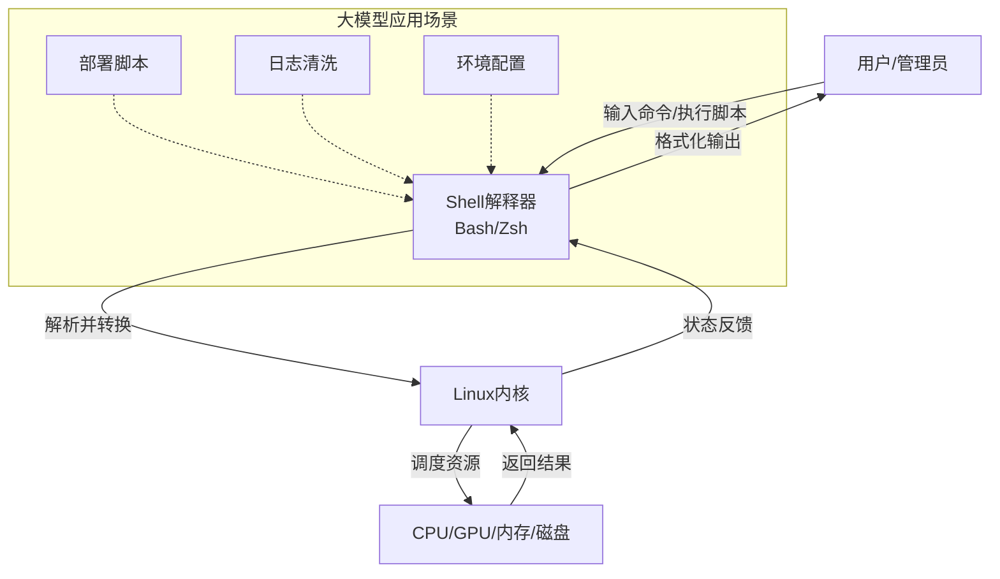
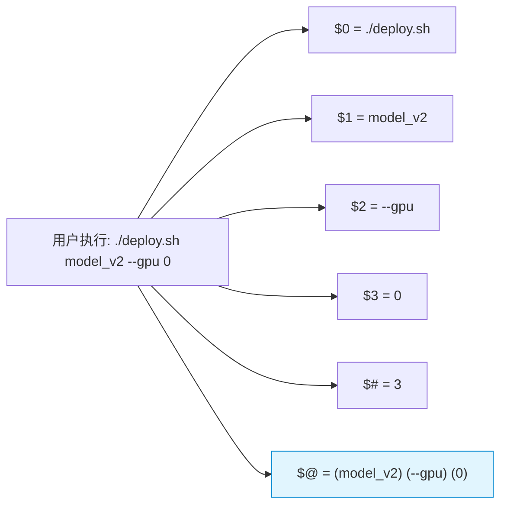

### 一、Shell初探与环境基石

#### 1. Shell的本质与定位

在深入命令行之前，首先需要理解Shell在操作系统架构中的确切位置。Shell并非操作系统本身，而是一个**命令解释器（Command Interpreter）**。它充当了用户与Linux内核（Kernel）之间的翻译官与保护层。

- **交互模式**：用户在终端输入的命令（如`ls`, `cd`），首先被Shell接收。Shell负责解析这些人类可读的文本指令，将其转化为系统调用（System Calls），进而请求内核执行具体的硬件操作或资源调度。
- **脚本模式**：当我们将一系列命令按逻辑顺序写入文件时，Shell便化身为编程语言的运行时环境。这种“批处理”能力是自动化运维和大模型集群管理的基石。

> **💡 概念解析：为什么大模型工程师必须掌握Shell？**  
> 在大模型技术栈中，无论是CUDA环境的配置、Docker容器的编排，还是分布式训练任务的启动与日志分析，绝大多数操作都发生在无图形界面的Linux服务器上。Python虽然负责模型逻辑，但Shell负责“让Python跑起来”的基础设施层。不懂Shell，就如同赛车手不会换挡，无法发挥引擎的全部性能。



#### 2. 主流Shell类型与Bash标准

Linux生态中存在多种Shell实现，了解它们的区别有助于避免兼容性问题。

|Shell类型|特点|适用场景|
|:--|:--|:--|
|**Bash** (Bourne Again SHell)|Linux默认Shell，功能全面，兼容性最好|通用脚本编写、服务器运维（**本教程标准**）|
|Sh (Bourne Shell)|Unix原始Shell，语法严格但功能较少|老旧Unix系统、极简嵌入式环境|
|Zsh|交互式体验极佳，插件丰富，兼容Bash|开发者本地终端日常使用|
|Fish|智能提示强大，但语法不兼容Bash|个人效率工具，不建议用于生产脚本|

**关键实践**：在编写任何Shell脚本时，务必在首行声明解释器：

```bash
#!/bin/bash
```

这行代码被称为Shebang。它告诉操作系统：“无论当前用户的默认Shell是什么，请强制使用`/bin/bash`来执行此脚本”。这是保证脚本在不同环境中行为一致性的第一道防线。

#### 3. 环境变量与系统上下文

环境变量是Shell进程中全局可见的键值对，它们定义了脚本运行的“上下文”。对于大模型环境而言，以下几个变量至关重要：

- **PATH**：可执行文件的搜索路径列表。当输入`python`或`nvcc`时，Shell会按PATH中目录的顺序依次查找。**GPU驱动报错或找不到命令，90%是PATH配置问题。**
- **HOME / USER**：标识当前用户身份与主目录，脚本中应避免硬编码路径，改用`$HOME`以保证可移植性。
- **LD_LIBRARY_PATH**：动态链接库搜索路径。在安装CUDA、cuDNN或自定义算子时，常需将此变量指向特定的`.so`文件目录，否则会出现`libxxx.so not found`错误。

> **💡 背景补充：临时生效 vs 永久生效**
> 
> - `export VAR=value`：仅在当前Shell会话及其子进程中有效，关闭终端即失效。适合测试。
> - 写入`~/.bashrc`或`/etc/profile`：每次启动Shell时自动加载。适合固化环境配置。
> - **注意**：修改配置文件后，需执行`source ~/.bashrc`使更改立即在当前会话生效，无需重新登录。

#### 4. 第一个脚本的完整生命周期

编写Shell脚本不仅仅是写代码，更是一个包含创建、授权、执行、调试的完整工程流程。

**步骤详解：**

1. **创建**：使用任意文本编辑器（vim/nano/vscode）创建以`.sh`结尾的文件。后缀非强制，但属于行业惯例，便于识别。
2. **编写**：
    
    ```bash
    #!/bin/bash
    # 描述: 检查GPU状态的入门脚本
    echo "=== System GPU Status ==="
    nvidia-smi
    echo "=== Current PATH ==="
    echo $PATH
    ```
    
3. **授权**：Linux出于安全考虑，新建文件默认无执行权限。必须显式赋予：
    
    ```bash
    chmod +x check_gpu.sh
    ```
    
4. **执行**：推荐使用相对路径或绝对路径调用，而非直接依赖PATH：
    
    ```bash
    ./check_gpu.sh      # 推荐：明确指定当前目录下的脚本
    bash check_gpu.sh   # 备选：显式指定解释器，可忽略Shebang和执行权限
    ```
    

> **⚠️ 避坑指南：`./script.sh` 与 `source script.sh` 的本质区别**
> 
> - `./script.sh`：启动一个**新的子Shell进程**执行脚本。脚本中对变量的修改不会影响父Shell。这是安全、标准的执行方式。
> - `source script.sh`（或`. script.sh`）：在**当前Shell进程**中逐行执行脚本。脚本中的变量赋值、函数定义会直接污染当前环境。仅在需要加载配置（如激活conda环境）时使用，切勿用于常规脚本执行。

#### 5. 注释规范与代码可读性

Shell脚本往往随着时间推移变得难以维护。良好的注释习惯是专业工程师的标志。

- **单行注释**：以`#`开头。除了Shebang行外，所有`#`后的内容均被忽略。
- **多行注释**：Shell原生不支持多行注释，但可使用Here Document技巧模拟：
    
    ```bash
    : << 'EOF'
    这是一个多行注释块。
    可以包含任意说明文字。
    EOF
    ```
    
- **文档头注释**：每个脚本顶部应包含作者、创建日期、功能描述、用法示例及依赖说明。这对于团队协作和后续接手维护至关重要。

> **💡 最佳实践：自文档化代码**  
> 与其写大量注释解释“代码做了什么”，不如通过清晰的变量命名和函数拆分让代码“自己说话”。注释应聚焦于“为什么这么做”以及“有哪些隐含约束”，而非重复代码逻辑。例如，不要写`# 设置端口为8080`，而应写`# 端口8080: 与K8s Service端口对齐，修改时需同步更新deployment.yaml`。

### 二、变量运算与流程控制

#### 1. 变量系统：Shell编程的数据载体

Shell是一种弱类型语言，所有变量默认视为字符串，但在特定上下文中可自动转换为数值。理解变量的定义、引用与作用域，是编写健壮脚本的前提。

**变量定义与引用规范：**

- **赋值**：等号两侧**严禁空格**。`name=value`正确，`name = value`会被解析为执行名为`name`的命令。
- **引用**：使用`${variable}`形式。虽然简单场景下`$variable`也可行，但`${}`能明确界定变量名边界，避免歧义（如`${name}_suffix` vs `$name_suffix`）。
- **引号差异**：这是Shell初学者最常踩坑之处，必须严格区分：

|引号类型|变量替换|命令替换|转义字符|适用场景|
|:--|:--|:--|:--|:--|
|双引号 `"`|✅ 生效|✅ 生效|✅ 部分生效|包含变量的字符串拼接（**推荐默认使用**）|
|单引号 `'`|❌ 原样输出|❌ 原样输出|❌ 全部原样|正则表达式、awk脚本、纯文本字面量|
|反引号 `` ` ``|-|✅ 生效|-|旧式命令替换（**不推荐**，可读性差）|
|`$()`|-|✅ 生效|-|新式命令替换（**强烈推荐**，支持嵌套）|

> **💡 概念解析：为什么命令替换推荐`$()`而非反引号？**  
> 反引号在视觉上易与单引号混淆，且不支持嵌套。当需要在一个命令替换中再嵌入另一个命令替换时，`$(cmd1 $(cmd2))`层次清晰，而 `` `cmd1 \`cmd2\ `` ``则需要转义，极易出错。在大模型运维脚本中，常需多层嵌套获取GPU信息或容器ID，务必养成使用`$()`的习惯。

**特殊变量：脚本的元数据接口**

Shell预定义了一系列只读特殊变量，它们提供了脚本运行时的上下文信息，是参数处理和调试的关键：

- `$0`：当前脚本名称（含路径）
- `$1, $2, ... $n`：第1、2、...、n个位置参数
- `$#`：传入参数的个数，常用于校验输入合法性
- `$*` 与 `$@`：均表示所有参数，但在双引号中行为不同：
    - `"$*"`：将所有参数视为**一个**字符串（以IFS分隔）
    - `"$@"`：将每个参数视为**独立**字符串（**遍历参数时必须使用此项**）
- `$?`：上一条命令的退出状态码。0表示成功，非0表示失败。**这是实现错误处理和条件判断的核心依据。**
- `$$`：当前Shell进程PID，常用于生成临时文件名以避免冲突



#### 2. 运算符：数值与逻辑的桥梁

由于Shell默认将一切视为字符串，数值运算必须借助专用语法。

**算术运算：**

- **`$(( ))`**：原生整数运算，支持`+ - * / % **`及位运算。**注意：不支持浮点数。**
    
    ```bash
    gpu_count=$(( $(nvidia-smi -L | wc -l) * 2 ))
    ```
    
- **`bc`工具**：处理浮点运算的标准方案。大模型训练中计算loss均值、显存利用率等场景必备。
    
    ```bash
    avg_loss=$(echo "scale=4; $total_loss / $steps" | bc)
    ```
    
- **`expr`**：较老的运算方式，需注意操作符两侧必须有空格，且`*`需转义。**现代脚本中建议用`$(( ))`替代。**

**条件测试：**

条件表达式是流程控制的基础，有两种等价写法，但语义侧重不同：

- **`[ ]`（test命令）**：POSIX标准，兼容性好。用于文件测试、字符串比较、整数比较。
- **``（Bash扩展）**：支持正则匹配`=~`、逻辑运算符`&& ||`、通配符模式匹配。**Bash脚本中推荐优先使用。**

> **⚠️ 关键陷阱：整数比较与字符串比较不可混用**
> 
> - 整数：`-eq, -ne, -gt, -lt, -ge, -le`
> - 字符串：`=, !=, -z（空）, -n（非空）`
> 
> 若误用`=`比较数字，`[ 10 = 2 ]`结果为假（字符串不等），但`[ 010 = 10 ]`也为假（前导零导致字符串不等），而`[ 010 -eq 10 ]`为真。在处理端口号、GPU索引等数值型参数时，务必使用整数比较运算符。

#### 3. 流程控制：构建脚本的逻辑骨架

**条件分支：if语句**

```bash
if ; then
    echo "配置文件存在，开始加载..."
    source "$config_file"
elif ; then
    echo "使用默认配置"
    source "$default_config"
else
    echo "错误: 未找到任何配置文件" >&2
    exit 1
fi
```

> **💡 最佳实践：防御性编程**  
> 永远不要假设外部输入是正确的。在读取文件、执行关键命令前，先用`,` , ``等进行校验。大模型训练任务耗时数天，若因缺少检查而在第1000步因路径错误崩溃，代价极其高昂。将错误尽早暴露在启动阶段，是Shell脚本工程化的核心原则。

**case语句：多值分发**

适用于根据单一变量的不同取值执行不同逻辑，比多个elif更清晰：

```bash
case "$action" in
    start)
        systemctl start llm-service ;;
    stop)
        systemctl stop llm-service ;;
    restart)
        systemctl restart llm-service ;;
    status)
        systemctl status llm-service ;;
    *)
        echo "用法: $0 {start|stop|restart|status}" >&2
        exit 1 ;;
esac
```

**循环结构：**

- **for循环**：适合已知集合的遍历。
    
    ```bash
    # 遍历GPU设备执行健康检查
    for gpu_id in $(seq 0 $(( $(nvidia-smi -L | wc -l) - 1 ))); do
        echo "检查GPU $gpu_id..."
        nvidia-smi -i "$gpu_id" --query-gpu=memory.used,memory.total --format=csv,noheader
    done
    ```
    
- **while循环**：适合条件驱动的迭代，如等待服务就绪、持续监控日志。
    
    ```bash
    # 等待模型服务端口可用，最多重试30次
    retry=0
    while ! curl -s http://localhost:8080/health > /dev/null && (( retry < 30 )); do
        echo "等待服务启动... ($retry/30)"
        sleep 2
        ((retry++))
    done
    
    if (( retry >= 30 )); then
        echo "错误: 服务启动超时" >&2
        exit 1
    fi
    ```
    

> **💡 背景补充：`break`与`continue`的精确控制**
> 
> - `break`：立即退出当前循环。可带数字参数`break n`跳出n层嵌套循环。
> - `continue`：跳过本次迭代剩余语句，进入下一次循环判断。同样支持`continue n`。
> 
> 在批量处理大模型数据集或并行任务调度时，常需在检测到异常样本时`continue`跳过，或在达到早停条件时`break`终止，避免无效计算。

#### 4. 输入重定向与Here Document

除了命令行参数，Shell还支持从标准输入读取数据，这在交互式配置和内联数据传递中极为有用。

**read命令：**

```bash
read -p "请输入模型版本号: " model_version
read -sp "请输入API密钥: " api_key  # -s隐藏输入，适合敏感信息
echo  # 换行补偿
```

**Here Document（<<）：**

将多行文本作为命令的标准输入，常用于生成配置文件或向交互式程序传递预设答案：

```bash
# 自动生成Nginx反向代理配置
cat > /etc/nginx/conf.d/llm-proxy.conf << 'EOF'
server {
    listen 80;
    server_name llm.example.com;
    location /v1/ {
        proxy_pass http://127.0.0.1:8080;
        proxy_set_header Host $host;
    }
}
EOF
```

> **⚠️ 注意：Here Document中的变量替换**
> 
> - `<< EOF`：内容中的变量会被替换。适合动态生成配置。
> - `<< 'EOF'`：内容原样保留，不做任何替换。适合写入包含`$`符号的脚本模板、正则表达式或代码片段。**混淆两者是导致配置文件中变量被意外展开的常见原因。**

#### 5. 调试与错误处理机制

专业的Shell脚本必须具备可观测性和容错能力。

**内置调试选项：**

- `set -e`：遇到任何命令返回非0状态码时立即退出脚本。**防止错误级联放大。**
- `set -u`：引用未定义变量时报错退出。**防止拼写错误导致的静默失败。**
- `set -o pipefail`：管道中任一命令失败则整个管道返回失败状态。默认情况下管道只返回最后一个命令的状态，会掩盖前置命令的错误。
- `set -x`：执行前打印每条命令及其展开后的实际值。**最强大的运行时调试手段。**

**推荐在脚本开头统一启用：**

```bash
#!/bin/bash
set -euo pipefail
```

> **💡 工程化建议：日志分级与输出分离**
> 
> - 正常输出走`stdout`（文件描述符1），便于管道传递和结果捕获。
> - 错误信息与诊断日志走`stderr`（文件描述符2），使用`>&2`重定向。
> - 这样即使脚本输出被重定向到文件，错误信息仍能在终端实时可见，不会污染数据流。
> 
> 示例：`echo "警告: GPU温度过高" >&2`
> 
> 在大模型训练流水线中，这种分离使得自动化系统能可靠地解析脚本输出的指标数据，同时运维人员仍能通过stderr监控异常情况，二者互不干扰。

### 三、函数封装与文本处理利器

#### 1. 函数：脚本模块化与复用基石

当脚本逻辑超过百行，或同一段代码被多次使用时，函数便成为组织代码、提升可维护性的核心手段。Shell函数虽不如高级语言功能丰富，但足以支撑运维自动化所需的抽象层次。

**定义与调用规范：**

```bash
# 推荐写法：function关键字可选，但括号必须紧跟函数名
check_gpu_memory() {
    local gpu_id="$1"
    local threshold="${2:-90}"  # 默认阈值90%
    
    local usage
    usage=$(nvidia-smi -i "$gpu_id" --query-gpu=memory.used,memory.total --format=csv,noheader,nounits)
    
    local used total percent
    read -r used total <<< "$usage"
    percent=$(( used * 100 / total ))
    
    if (( percent > threshold )); then
        echo "警告: GPU $gpu_id 显存使用率 ${percent}% 超过阈值 ${threshold}%" >&2
        return 1
    fi
    return 0
}

# 调用时如同普通命令，参数以空格分隔
check_gpu_memory 0 85
```

> **💡 关键概念：`local`变量的作用域隔离**  
> Shell变量默认是全局的。若在函数内修改了与外部同名的变量，会意外污染调用者环境。**所有函数内部使用的临时变量都必须用`local`声明**。这是编写安全、可复用函数的铁律。唯一例外是需要通过变量“返回”结果给调用者时（见下文）。

**返回值机制：状态码与数据分离**

Shell函数的`return`只能返回0-255的整数状态码，用于表示成功/失败。**不能用于返回字符串或计算结果**。传递数据有三种方式：

|方式|适用场景|示例|
|:--|:--|:--|
|`echo` + 命令替换|返回单行或少量文本结果|`result=$(get_model_version)`|
|全局变量赋值|返回复杂结构或多值|`_retval="..."; get_config; echo "$_retval"`|
|`return`|仅表示执行成败|`return 0` / `return 1`|

> **⚠️ 避坑指南：echo输出污染**  
> 若函数内部有调试信息或非预期输出混入stdout，命令替换捕获的结果将被污染。务必确保只有目标数据通过echo输出，其余信息全部重定向到stderr（`>&2`）。这也是上一阶段强调输出分离原则在函数层面的延续。

**参数校验模板：**

```bash
deploy_model() {
    if ; then
        echo "错误: deploy_model 需要至少2个参数: <model_path> <port>" >&2
        echo "用法: deploy_model /path/to/model 8080 [--gpu 0]" >&2
        return 1
    fi
    
    local model_path="$1"
    local port="$2"
    # ... 业务逻辑
}
```

#### 2. 文本处理四剑客：cut、sort、uniq、wc

在大模型运维中，日志分析、指标提取、数据清洗等任务占据大量时间。以下四个工具是最基础也最高频的文本处理原语。

**cut：字段提取**

按分隔符或字符位置切割行，提取指定列：

```bash
# 提取CSV格式GPU信息中的显存使用量（第2列）
nvidia-smi --query-gpu=index,memory.used --format=csv,noheader,nounits | cut -d',' -f2

# 提取日志中时间戳（假设固定宽度）
grep "ERROR" app.log | cut -c1-19
```

> **💡 实践提示：`-d`与`-f`的配合**  
> `-d`指定分隔符（默认为Tab），`-f`指定字段编号。支持范围语法`-f2-5`（第2至5列）、`-f3-`（第3列至末尾）。处理JSON等非结构化数据时cut力不从心，应转向awk或jq。

**sort：排序与预处理**

不仅用于排序，更是`uniq`的前置必要条件（uniq仅对相邻重复行生效）：

```bash
# 按数值大小降序排列GPU显存占用
nvidia-smi --query-gpu=memory.used --format=csv,noheader,nounits | sort -rn

# 按第3列（PID）排序进程列表
ps aux | sort -k3 -n
```

**uniq：去重与计数**

```bash
# 统计各错误类型出现次数（经典日志分析模式）
grep "ERROR" app.log | awk '{print $NF}' | sort | uniq -c | sort -rn | head -10
```

> **💡 背景补充：为什么必须先sort再uniq？**  
> `uniq`的设计哲学是流式处理，只比较相邻行。若相同内容分散在不同位置，`uniq`无法识别。`sort | uniq -c`组合是Shell文本处理的黄金范式，等价于SQL中的`GROUP BY ... COUNT(*) ORDER BY count DESC`。理解这一映射关系，有助于将数据库思维迁移到命令行数据处理中。

**wc：统计度量**

```bash
# 统计训练日志中的步数
grep -c "Step completed" train.log

# 统计数据集文件行数（样本数）
wc -l < dataset.jsonl
```

注意`wc -l file`输出包含文件名，而`wc -l < file`仅输出数字，后者更适合嵌入变量赋值或算术运算。

#### 3. sed：流式文本编辑器

sed是非交互式批量文本替换、删除、插入的核心工具。在大模型场景中，常用于配置文件动态生成、日志脱敏、数据格式转换。

**核心操作：**

```bash
# 替换：将配置模板中的占位符替换为实际值
sed "s|{{MODEL_PATH}}|/data/models/llama3|g" config.template > config.yaml

# 删除：移除日志中的敏感token
sed '/Authorization: Bearer/d' api.log > api_clean.log

# 提取：仅输出匹配行及其后3行（类似grep -A）
sed -n '/OOM/,+3p' train.log

# 原地编辑：直接修改文件（生产环境慎用，建议先备份）
sed -i.bak 's/max_tokens: 512/max_tokens: 2048/' inference.yaml
```

> **⚠️ 分隔符选择技巧**  
> sed默认使用`/`作为分隔符，但当替换内容本身包含路径（如`/data/models/...`）时，需大量转义。改用`|`或`#`作为分隔符可大幅提升可读性：`s|old/path|new/path|g`。

**正则表达式注意事项：**

sed默认使用BRE（基础正则），`+`, `?`, `{}`, `()`等元字符需加反斜杠转义。使用`-E`选项启用ERE（扩展正则）可避免繁琐转义，与现代工具习惯一致：

```bash
# ERE模式：提取所有GPU索引号
nvidia-smi -L | sed -E 's/GPU ([0-9]+):.*/\1/'
```

#### 4. awk：可编程的文本处理引擎

如果说sed是“查找替换”专家，awk则是“结构化数据分析”全能选手。它内置变量、数组、条件、循环，本质上是一门面向记录的编程语言。

**基本模型：记录与字段**

awk将输入视为由记录（默认按换行符分割）组成的流，每条记录又分为字段（默认按空白符分割）。内置变量自动维护上下文：

- `$0`：当前整行
- `$1, $2, ...`：第1、2、...个字段
- `NR`：当前记录号（行号）
- `NF`：当前记录的字段数
- `FS`：输入字段分隔符（可通过`-F`设置）
- `OFS`：输出字段分隔符

**典型应用场景：**

```bash
# 解析nvidia-smi CSV输出，计算显存使用率并筛选高负载GPU
nvidia-smi --query-gpu=index,memory.used,memory.total --format=csv,noheader,nounits | \
awk -F',' '{
    pct = $2 / $3 * 100
    if (pct > 80) printf "GPU %s: %.1f%% (%s/%s MiB)\n", $1, pct, $2, $3
}'

# 统计训练日志中每个epoch的平均loss
grep "Epoch.*loss=" train.log | \
awk -F'[ =]+' '{
    epoch = $2
    loss = $4
    sum[epoch] += loss
    cnt[epoch]++
}
END {
    for (e in sum) printf "Epoch %s: avg_loss=%.4f\n", e, sum[e]/cnt[e]
}' | sort -t':' -k1 -V
```

> **💡 概念解析：awk的三段式执行模型**
> 
> ```
> BEGIN { 初始化 }      # 读取任何输入前执行一次
> /pattern/ { action }  # 对每条匹配记录执行
> END { 收尾处理 }      # 所有输入读完后执行一次
> ```
> 
> `BEGIN`块常用于打印表头、初始化累加器；主块处理逐行逻辑；`END`块输出汇总结果。这种模型天然契合“聚合统计”类任务，无需额外存储中间文件。

**awk vs Python的选择边界：**

|维度|awk|Python|
|:--|:--|:--|
|启动开销|极低（毫秒级）|较高（百毫秒级）|
|单次处理|字段提取、简单聚合、格式化输出|JSON解析、复杂数据结构、API调用|
|管道集成|原生无缝|需subprocess或stdin读取|
|可维护性|短小精悍，长逻辑难读|适合百行以上复杂逻辑|

> **💡 工程建议**：在Shell脚本中，awk承担“胶水层”的数据整形任务；当逻辑复杂度超出awk舒适区时，应果断切换到Python脚本，并通过stdin/stdout或临时文件与之交互。强行用awk实现复杂业务逻辑是技术债的典型来源。

#### 5. 管道组合哲学：小工具协同解决大问题

Shell的真正威力不在于单个工具的精通，而在于通过管道将多个专用工具组合成数据处理流水线。这体现了Unix哲学：“做一件事并做好”。

**实战案例：大模型服务健康巡检报告生成**

```bash
#!/bin/bash
set -euo pipefail

report_file="/tmp/gpu_health_$(date +%Y%m%d_%H%M%S).txt"

{
    echo "=== GPU Health Report ==="
    echo "Generated: $(date)"
    echo ""
    
    # 1. 获取GPU概览
    echo "--- Device Summary ---"
    nvidia-smi --query-gpu=index,name,memory.used,memory.total,utilization.gpu \
        --format=csv,noheader,nounits | \
    awk -F',' '{printf "GPU%-2s %-20s Mem:%5s/%5s MiB Util:%3s%%\n", $1, $2, $3, $4, $5}'
    
    echo ""
    
    # 2. 识别异常GPU（显存>90% 或 利用率<5%且显存>50%）
    echo "--- Anomalies ---"
    anomalies=$(nvidia-smi --query-gpu=index,memory.used,memory.total,utilization.gpu \
        --format=csv,noheader,nounits | \
    awk -F',' '{
        mem_pct = $2/$3*100
        if (mem_pct > 90 || ($4 < 5 && mem_pct > 50))
            printf "  GPU %s: mem=%.0f%% util=%s%%\n", $1, mem_pct, $4
    }')
    
    if ; then
        echo "$anomalies"
    else
        echo "  None detected"
    fi
    
} > "$report_file" 2>&1

echo "报告已生成: $report_file"
```

> **💡 设计要点解析**
> 
> 1. **花括号分组`{ }`**：将多个命令的输出统一重定向，避免每行都追加`>>`。
> 2. **变量缓存中间结果**：`anomalies=$(...)`将awk输出存入变量，便于后续判空。若直接用管道接if，会因子shell作用域问题导致变量丢失。
> 3. **格式化与数据分离**：awk负责计算与格式化，Shell负责流程控制与文件IO。各司其职，职责清晰。
> 4. **时间戳命名**：避免覆盖历史报告，便于追溯。
> 
> 这种组合模式具有高度可扩展性：新增检查项只需在花括号内追加一段管道，不影响已有逻辑。这正是Shell脚本在快速迭代的AI基础设施管理中保持生命力的原因。

### 四、综合实战与大模型运维场景

#### 1. 正则表达式：文本匹配的精确语言

正则表达式（Regular Expression）是Shell文本处理的灵魂。无论是日志分析、配置校验还是数据清洗，掌握正则都意味着从“模糊查找”迈向“精确提取”。在大模型运维中，它常用于解析非结构化训练日志、验证API请求格式、过滤敏感信息等场景。

**核心元字符速查：**

|元字符|含义|示例|说明|
|:--|:--|:--|:--|
|`.`|任意单字符（除换行）|`loss=0.5.`|匹配loss=0.5后跟任意字符|
|`*`|前一字符零次或多次|`ab*c`|匹配ac, abc, abbc...|
|`+`|前一字符一次或多次|`[0-9]+`|匹配一个或多个数字（ERE）|
|`?`|前一字符零次或一次|`https?`|匹配http或https（ERE）|
|`{n,m}`|前一字符重复n到m次|`[a-z]{3,8}`|匹配3-8位小写字母（ERE）|
|`^` / `$`|行首 / 行尾锚点|`^ERROR.*$`|整行以ERROR开头结尾|
|`\b`|单词边界|`\bgpu\b`|精确匹配gpu，不匹配gpuid|
|`( )`|分组与捕获|`loss=([0-9.]+)`|提取等号后的数值|

> **💡 概念辨析：BRE vs ERE**  
> Shell工具对正则的支持分为两派：
> 
> - **BRE（基础正则）**：`grep`, `sed`默认模式。`+`, `?`, `{}`, `()`需转义为`\+`, `\?`, `\{\}`, `\(\)`。
> - **ERE（扩展正则）**：`grep -E`, `sed -E`, `awk`默认模式。上述元字符直接使用，更符合现代习惯。
> 
> **实践建议**：统一使用`-E`选项或awk，避免BRE转义带来的认知负担。仅在编写需兼容老旧Unix系统的脚本时才考虑BRE。

**大模型日志解析实战：**

```bash
# 从混合日志中提取所有loss值并计算最小值
grep -oE 'loss=[0-9]+\.[0-9]+' train.log | \
sed -E 's/loss=//' | \
sort -g | head -1

# 验证API Key格式（sk-开头，48位字母数字）
if [[ "$api_key" =~ ^sk-[a-zA-Z0-9]{48}$ ]]; then
    echo "Key格式合法"
else
    echo "错误: API Key格式无效" >&2
    exit 1
fi
```

> **⚠️ 性能警示：贪婪匹配与回溯灾难**  
> `.*`是贪婪匹配，会尽可能多地消耗字符。在长日志行中使用`.*`可能导致严重回溯。若只需匹配到第一个分隔符，应使用否定字符集替代：
> 
> - ❌ `key=(.*)\s` （遇到多个空格时回溯）
> - ✅ `key=([^ ]*)` （明确排除空格，线性时间复杂度）
> 
> 在处理GB级训练日志时，这一优化可将处理时间从分钟级降至秒级。

#### 2. expect自动交互：突破非交互式限制

许多传统工具（如ssh、scp、mysql、conda init）设计为交互式，无法直接在自动化脚本中使用。expect通过模拟终端会话，实现了密码输入、菜单选择等操作的程序化控制。

**基本结构与模式匹配：**

```bash
#!/usr/bin/expect -f
set timeout 30
set host [lindex $argv 0]
set password [lindex $argv 1]

spawn ssh root@$host "nvidia-smi"
expect {
    "yes/no" { send "yes\r"; exp_continue }
    "password:" { send "$password\r" }
    timeout { puts "连接超时"; exit 1 }
}
expect eof
```

> **💡 关键机制：exp_continue的作用**  
> 当首次SSH连接未知主机时，会先询问指纹确认（yes/no），再要求输入密码。`exp_continue`使expect在匹配到"yes/no"并发送应答后，**继续等待下一个模式**而非退出。若无此指令，脚本会在发送yes后立即结束，错过密码提示。

**安全实践：避免明文密码**

```bash
# 从环境变量读取密码，而非命令行参数或硬编码
set password $env(SSH_PASS)

# 或使用密钥认证（推荐）
spawn ssh -i ~/.ssh/id_rsa root@$host "nvidia-smi"
```

> **⚠️ 工程化建议：expect是最后手段**  
> 优先寻找非交互式替代方案：
> 
> - SSH/SCP → 密钥认证 + `StrictHostKeyChecking=no`
> - MySQL → `--defaults-extra-file` 或环境变量`MYSQL_PWD`
> - Conda → `conda run` 或 `eval "$(conda shell.bash hook)"`
> 
> expect应仅用于确实无法绕过交互的遗留工具。其脚本脆弱性强（依赖精确字符串匹配），维护成本高，且密码处理存在安全风险。在大模型部署流水线中，应尽量通过容器化、密钥管理等方式消除交互需求。

#### 3. 大模型环境初始化自动化脚本

大模型开发环境的搭建涉及CUDA、cuDNN、Python虚拟环境、依赖安装等多个步骤，手动操作易出错且难以复现。以下是一个生产级环境初始化脚本的核心设计。

**脚本架构与关键逻辑：**

```bash
#!/bin/bash
set -euo pipefail

# === 配置区 ===
CUDA_VERSION="12.1"
PYTHON_VERSION="3.10"
VENV_NAME="llm_env"
REQUIREMENTS_FILE="${1:-requirements.txt}"

# === 前置检查 ===
check_prerequisites() {
    command -v nvidia-smi >/dev/null || { echo "错误: 未检测到NVIDIA驱动" >&2; exit 1; }
    command -v python${PYTHON_VERSION} >/dev/null || { echo "错误: Python ${PYTHON_VERSION} 未安装" >&2; exit 1; }
     || { echo "错误: 依赖文件 $REQUIREMENTS_FILE 不存在" >&2; exit 1; }
}

# === 环境创建 ===
setup_venv() {
    local venv_path="$HOME/.venvs/$VENV_NAME"
    if ; then
        echo "虚拟环境已存在: $venv_path"
    else
        echo "创建虚拟环境..."
        python${PYTHON_VERSION} -m venv "$venv_path"
    fi
    # 激活环境（注意：source在当前shell执行）
    source "$venv_path/bin/activate"
}

# === 依赖安装（带重试与缓存）===
install_deps() {
    pip install --upgrade pip
    # 使用国内镜像加速，失败自动重试3次
    pip install -r "$REQUIREMENTS_FILE" \
        -i https://pypi.tuna.tsinghua.edu.cn/simple \
        --retries 3 --timeout 60
}

# === 环境验证 ===
verify_env() {
    python -c "
import torch
print(f'PyTorch: {torch.__version__}')
print(f'CUDA Available: {torch.cuda.is_available()}')
print(f'CUDA Version: {torch.version.cuda}')
print(f'GPU Count: {torch.cuda.device_count()}')
assert torch.cuda.is_available(), 'CUDA不可用!'
" || { echo "错误: 环境验证失败" >&2; exit 1; }
}

# === 主流程 ===
main() {
    check_prerequisites
    setup_venv
    install_deps
    verify_env
    echo "✅ 环境初始化完成: $(which python)"
}

main "$@"
```

> **💡 设计要点解析**
> 
> 1. **幂等性**：`setup_venv`检查目录是否存在，重复执行不会破坏已有环境。这是自动化脚本可安全重跑的前提。
> 2. **快速失败**：`check_prerequisites`在耗时操作前验证所有前置条件，避免安装半小时后发现缺少驱动。
> 3. **网络容错**：pip指定国内镜像并重试，应对不稳定网络环境。大模型依赖包体积大，网络中断是常见失败原因。
> 4. **端到端验证**：不仅检查安装成功，更验证CUDA实际可用。`pip install torch`成功不等于GPU能正常工作，驱动版本不匹配等问题只有运行时才能暴露。
> 5. **配置外置**：版本号、路径等通过变量集中管理，便于适配不同项目需求。

#### 4. 服务启停与日志监控实战

大模型推理服务通常需要后台运行、优雅停止、实时日志监控。以下封装了标准化的服务管理函数。

**服务管理函数库：**

```bash
SERVICE_NAME="llm-inference"
PID_FILE="/var/run/${SERVICE_NAME}.pid"
LOG_FILE="/var/log/${SERVICE_NAME}.log"

start_service() {
    if  && kill -0 "$(cat "$PID_FILE")" 2>/dev/null; then
        echo "服务已在运行 (PID: $(cat "$PID_FILE"))"
        return 0
    fi
    
    echo "启动 $SERVICE_NAME..."
    nohup python -m llm_server --port 8080 > "$LOG_FILE" 2>&1 &
    echo $! > "$PID_FILE"
    
    # 等待服务就绪
    local retry=0
    while ! curl -sf http://localhost:8080/health >/dev/null && (( retry < 30 )); do
        sleep 1
        ((retry++))
    done
    
    if (( retry >= 30 )); then
        echo "错误: 服务启动超时，查看日志: $LOG_FILE" >&2
        stop_service
        return 1
    fi
    echo "✅ 服务已启动 (PID: $(cat "$PID_FILE"))"
}

stop_service() {
    if ; then
        echo "服务未运行"
        return 0
    fi
    
    local pid
    pid=$(cat "$PID_FILE")
    if kill -0 "$pid" 2>/dev/null; then
        echo "停止 $SERVICE_NAME (PID: $pid)..."
        kill "$pid"
        # 等待进程退出，超时则强制杀死
        local wait=0
        while kill -0 "$pid" 2>/dev/null && (( wait < 10 )); do
            sleep 1
            ((wait++))
        done
        kill -0 "$pid" 2>/dev/null && kill -9 "$pid"
    fi
    rm -f "$PID_FILE"
    echo "✅ 服务已停止"
}
```

> **💡 关键细节：优雅停止与僵尸进程防护**
> 
> - `kill -0 $pid`：不发送信号，仅检查进程是否存在。比`ps | grep`更可靠，避免匹配到grep自身或同名进程。
> - 先`kill`（SIGTERM）再`kill -9`（SIGKILL）：给服务机会清理资源（关闭连接、保存checkpoint）。SIGKILL无法被捕获，应作为最后手段。
> - PID文件管理：启动时写入，停止时删除。配合`kill -0`检查，防止PID文件残留导致误判。

**实时日志监控与告警：**

```bash
monitor_logs() {
    tail -F "$LOG_FILE" | while IFS= read -r line; do
        echo "$line"
        
        # OOM检测
        if ; then
            echo "🚨 [ALERT] GPU OOM detected at $(date '+%H:%M:%S')" >&2
            # 可触发告警通知、自动重启等
        fi
        
        # 高延迟检测
        if [[ "$line" =~ latency=([0-9]+)ms ]]; then
            local latency="${BASH_REMATCH[1]}"
            if (( latency > 5000 )); then
                echo "⚠️  [WARN] High latency: ${latency}ms" >&2
            fi
        fi
    done
}
```

> **💡 背景补充：`tail -F` vs `tail -f`**
> 
> - `-f`：跟踪文件描述符。若日志被轮转（logrotate重命名并创建新文件），`-f`仍跟踪旧文件，丢失新日志。
> - `-F`：等价于`--follow=name --retry`。按文件名跟踪，即使文件被删除重建也能自动重新打开。**生产环境日志监控必须使用`-F`**。

#### 5. 工程化最佳实践总结

将零散技能整合为可靠的大模型运维能力，需遵循以下原则：

|原则|具体实践|反模式|
|:--|:--|:--|
|**防御性编程**|`set -euo pipefail`；所有外部输入校验；关键操作前检查前置条件|假设一切正常；忽略返回值|
|**可观测性**|输出分离（stdout/stderr）；结构化日志；健康检查端点|所有输出混在一起；无状态反馈|
|**幂等与安全**|脚本可重复执行；敏感信息不入代码；临时文件用`mktemp`|硬编码密码；重复执行报错或破坏数据|
|**模块化**|函数封装；配置外置；职责单一|百行以上无函数；逻辑与配置混杂|
|**渐进增强**|先保证核心流程可用，再添加重试、告警、监控等增强功能|一开始就追求完美，迟迟无法交付|

> **💡 终极建议：Shell是胶水，不是大厦**  
> Shell的定位是**系统级胶水语言**，擅长串联工具、处理文本、管理进程。当业务逻辑复杂到需要数据结构、异常处理、单元测试时，应果断切换到Python/Go等通用语言，并通过CLI接口与Shell生态集成。
> 
> 在大模型技术栈中，理想的分工是：
> 
> - **Shell**：环境初始化、服务启停、日志采集、简单监控、CI/CD钩子
> - **Python**：模型训练/推理逻辑、数据处理管道、API服务、复杂编排
> - **专用工具**：Kubernetes（集群编排）、Prometheus（指标监控）、Airflow（工作流调度）
> 
> 认清Shell的能力边界，既不低估其在基础设施层的不可替代性，也不高估其在应用层的适用范围，才是成熟工程师的标志。本教程所授技能，正是为了让你在这一边界内做到极致高效。

### 五、练习

#### 1. 基础语法与环境诊断

本阶段练习旨在巩固Shell环境认知、变量作用域及基本脚本执行规范，确保后续复杂操作的根基稳固。

**题目1.1：环境变量隔离实验**

编写两个脚本`parent.sh`和`child.sh`。`parent.sh`中定义变量`MODEL_NAME="llama3"`并导出，同时定义未导出变量`SECRET_KEY="abc123"`。`parent.sh`调用`child.sh`，在`child.sh`中分别打印这两个变量。随后在`child.sh`中修改`MODEL_NAME`为`qwen2`并新增变量`CHILD_VAR="test"`，返回`parent.sh`后再次打印这三个变量。

- **训练目标**：深刻理解`export`的作用域传递机制、子进程变量修改对父进程的不可见性。
- **验证标准**：能准确预测每一步的输出结果，并解释为何`SECRET_KEY`在子进程中为空、`CHILD_VAR`在父进程中不存在。

> [!success]- 点击展开题解
> 
> ## 📝 题目解析：环境变量隔离实验
> 
> 本题旨在通过一个经典的父子进程交互场景，验证 Linux Shell 中**环境变量的单向传递性**与**进程内存空间的隔离性**。理解这一机制是掌握 Shell 编程、避免“变量污染”或“修改无效”等常见 Bug 的基础。
> 
> ### 1. 参考代码实现
> 
> #### `parent.sh`
> 
> ```bash
> #!/bin/bash
> 
> # 定义并导出环境变量（子进程可见）
> export MODEL_NAME="llama3"
> 
> # 定义普通变量（仅当前进程可见）
> SECRET_KEY="abc123"
> 
> echo "=== Parent (Before) ==="
> echo "MODEL_NAME: $MODEL_NAME"
> echo "SECRET_KEY: $SECRET_KEY"
> 
> # 调用子脚本（创建子进程）
> bash child.sh
> 
> echo "=== Parent (After) ==="
> echo "MODEL_NAME: $MODEL_NAME"
> echo "SECRET_KEY: $SECRET_KEY"
> echo "CHILD_VAR: [$CHILD_VAR]"  # 预期为空
> ```
> 
> #### `child.sh`
> 
> ```bash
> #!/bin/bash
> 
> echo "--- Child ---"
> echo "MODEL_NAME: $MODEL_NAME"   # 继承自父进程
> echo "SECRET_KEY: [$SECRET_KEY]" # 未导出，预期为空
> 
> # 修改继承来的变量
> MODEL_NAME="qwen2"
> 
> # 新增子进程专有变量
> CHILD_VAR="test"
> 
> echo "--- Child (Modified) ---"
> echo "MODEL_NAME: $MODEL_NAME"
> echo "CHILD_VAR: $CHILD_VAR"
> ```
> 
> ---
> 
> ### 2. 预期输出结果
> 
> ```text
> === Parent (Before) ===
> MODEL_NAME: llama3
> SECRET_KEY: abc123
> --- Child ---
> MODEL_NAME: llama3
> SECRET_KEY: []
> --- Child (Modified) ---
> MODEL_NAME: qwen2
> CHILD_VAR: test
> === Parent (After) ===
> MODEL_NAME: llama3
> SECRET_KEY: abc123
> CHILD_VAR: []
> ```
> 
> ---
> 
> ### 3. 核心原理图解
> 
> 下图展示了 `export` 与普通变量在进程派生时的不同命运，以及为何子进程的修改无法回传：
> 
> ```mermaid
> flowchart TD
>     subgraph Parent["父进程 (parent.sh)"]
>         P_ENV["环境变量表<br/>MODEL_NAME=llama3 ✅"]
>         P_LOCAL["局部变量区<br/>SECRET_KEY=abc123 ❌"]
>     end
> 
>     subgraph Fork["fork() + exec()"]
>         COPY["复制环境变量表<br/>(深拷贝/写时复制)"]
>         DROP["丢弃非导出变量"]
>     end
> 
>     subgraph Child["子进程 (child.sh)"]
>         C_ENV["独立环境变量表<br/>MODEL_NAME=llama3 → qwen2"]
>         C_NEW["新增变量<br/>CHILD_VAR=test"]
>     end
> 
>     P_ENV -->|导出| COPY
>     P_LOCAL -.->|未导出| DROP
>     COPY --> C_ENV
>     C_ENV -->|修改仅影响自身| C_ENV
>     C_NEW -->|生命周期随子进程结束| X["🚫 不可见"]
>     
>     style P_LOCAL fill:#ffcccc,stroke:#cc0000
>     style C_ENV fill:#ccffcc,stroke:#009900
>     style X fill:#eeeeee,stroke:#999999,stroke-dasharray: 5 5
> ```
> 
> ---
> 
> ### 4. 关键知识点详解
> 
> #### 🔑 为什么 `SECRET_KEY` 在子进程中为空？
> 
> - **`export` 的本质**：只有被 `export` 标记的变量才会被放入进程的 **Environment List（环境表）** 中。
> - **进程创建机制**：当执行 `bash child.sh` 时，系统调用 `fork()` 创建子进程，随后通过 `exec()` 加载新程序。**只有环境表中的内容会被复制到子进程**，普通的 Shell 局部变量存储在 Shell 的内部数据结构中，不会随 `exec()` 传递。
> - **类比理解**：把 `export` 想象成“打包进旅行箱”。只有放进箱子（环境表）的东西才能带到下一站（子进程），放在桌上没装箱的（局部变量）就留在了原地。
> 
> #### 🔒 为什么子进程修改 `MODEL_NAME` 不影响父进程？
> 
> - **进程隔离原则**：Unix/Linux 系统中，每个进程拥有**独立的虚拟地址空间**。子进程获得的是父进程环境表的**副本**（Copy-on-Write 语义）。
> - **单向传递**：环境变量只能从父→子传递，不存在反向通道。子进程对 `MODEL_NAME` 的赋值只是修改了自己内存中的副本，父进程的环境表完全不受影响。
> - **`CHILD_VAR` 同理**：它在子进程中新建，生命周期绑定于子进程。子进程退出后，该变量随之消亡，父进程从未拥有过它。
> 
> #### 💡 补充背景：如果确实需要子进程向父进程传值怎么办？
> 
> 由于直接修改变量不可行，通常采用以下替代方案：
> 
> |方式|示例|适用场景|
> |---|---|---|
> |标准输出捕获|`RESULT=$(bash child.sh)`|传递少量文本数据|
> |临时文件|子进程写入 `/tmp/result`，父进程读取|传递大量/结构化数据|
> |退出码|`exit 42` → `$?`|仅传递状态码(0-255)|
> |source 执行|`source child.sh`|⚠️ 同一进程内执行，无隔离，慎用|
> 
> > **注意**：`source`（或 `.`）命令会在**当前进程**中执行脚本，此时变量修改会生效，但这破坏了进程隔离，不属于本题讨论的范畴。
> 
> ### 5. 验证清单
> 
> - [x]  `export` 变量在子进程中可读
> - [x]  非 `export` 变量在子进程中为空
> - [x]  子进程修改导出变量不影响父进程
> - [x]  子进程新增变量在父进程中不存在
> - [x]  能结合 `fork/exec` 模型解释上述现象

**题目1.2：GPU环境一键诊断脚本**

编写脚本`gpu_diag.sh`，要求：

1. 检查`nvidia-smi`命令是否存在，不存在则输出错误到stderr并以状态码1退出。
2. 获取GPU数量，若为0则警告并退出。
3. 遍历每张GPU，输出索引、名称、显存使用率（百分比）、温度。
4. 若任一GPU温度超过85℃或显存使用率超过95%，在报告末尾汇总异常信息。
5. 所有正常输出走stdout，错误与警告走stderr。

- **训练目标**：综合运用特殊变量、循环、条件判断、输出分离、命令替换。
- **进阶要求**：支持通过命令行参数指定温度阈值（默认85），未传参时使用默认值。

> **💡 练习提示**  
> 显存使用率需通过`nvidia-smi --query-gpu=memory.used,memory.total --format=csv,noheader,nounits`获取原始数值后计算，而非直接查询`utilization.memory`（该指标为内存控制器活跃度，非显存占用率）。这是初学者常混淆的概念。

> [!success]- 点击展开题解
> 
> ### 📝 题目解析：GPU环境一键诊断脚本
> 
> 本题旨在训练 Linux Shell 脚本在**系统运维场景**下的综合能力。核心难点不在于语法本身，而在于对 `nvidia-smi` 输出格式的精确解析、Shell 中的整数运算限制，以及标准的错误处理规范。
> 
> ---
> 
> ### 💡 核心概念辨析：显存占用率 vs 内存控制器活跃度
> 
> 题目提示中提到的“陷阱”是初学者最容易踩的坑。理解这一区别是编写正确诊断脚本的前提。
> 
> |指标|nvidia-smi 查询字段|含义|适用场景|
> |:--|:--|:--|:--|
> |**显存占用率**|`memory.used / memory.total`|已分配显存 / 总显存|判断是否 OOM、模型是否过大|
> |**内存控制器活跃度**|`utilization.memory`|显存读写操作的时间占比|判断数据加载瓶颈、IO 效率|
> 
> > ⚠️ **注意**：一个 GPU 可能 `utilization.memory` 只有 10%（计算密集但显存访问少），但 `memory.used` 已达 99%（模型参数占满显存）。诊断“资源紧张”应使用前者。
> 
> ---
> 
> ### 🗺️ 脚本逻辑流程
> 
> ```mermaid
> flowchart TD
>     A[开始] --> B{nvidia-smi 存在?}
>     B -- 否 --> C[stderr: 错误信息\nexit 1]
>     B -- 是 --> D[获取 GPU 数量]
>     D --> E{GPU 数量 > 0?}
>     E -- 否 --> F[stderr: 警告信息\nexit 0]
>     E -- 是 --> G[遍历每张 GPU]
>     G --> H[获取名称/显存/温度]
>     H --> I[计算显存使用率百分比]
>     I --> J[stdout: 输出诊断行]
>     J --> K{温度>阈值 OR 显存>95%?}
>     K -- 是 --> L[追加到异常列表]
>     K -- 否 --> M[继续下一张]
>     L --> M
>     M --> N{还有GPU?}
>     N -- 是 --> G
>     N -- 否 --> O{异常列表非空?}
>     O -- 是 --> P[stdout: 汇总异常报告]
>     O -- 否 --> Q[正常结束 exit 0]
> ```
> 
> ---
> 
> ### 🔑 关键知识点拆解
> 
> #### 1. 命令行参数与默认值
> 
> ```bash
> TEMP_THRESHOLD=${1:-85}
> ```
> 
> - `${1:-85}` 是 Bash 的**参数扩展**语法：若 `$1` 未设置或为空，则使用 `85` 作为默认值。
> - 这比 `if [ -z "$1" ]; then ... fi` 更简洁优雅。
> 
> #### 2. nvidia-smi 结构化查询
> 
> ```bash
> nvidia-smi --query-gpu=index,name,memory.used,memory.total,temperature.gpu \
>   --format=csv,noheader,nounits
> ```
> 
> - `--query-gpu`：指定要查询的字段，避免解析人类可读的表格输出。
> - `--format=csv,noheader,nounits`：输出纯 CSV，无表头、无单位后缀（如 "MiB"、"C"），方便数值计算。
> - 这是**生产级脚本**的标准做法，永远不要 `grep/awk` 解析 `nvidia-smi` 的默认表格输出。
> 
> #### 3. Shell 整数运算与百分比计算
> 
> ```bash
> mem_pct=$(( used * 100 / total ))
> ```
> 
> - Bash 只支持**整数运算**，`$(( ))` 内不能出现小数。
> - 先乘后除保证精度：`used * 100 / total` 而非 `used / total * 100`（后者在整数除法下几乎永远为 0）。
> 
> #### 4. stdout/stderr 分离原则
> 
> - **stdout**：仅用于正常的诊断报告输出，可被管道传递给其他工具处理。
> - **stderr**：用于错误、警告、异常提示，不会被管道吞掉，用户始终能看到。
> - 重定向语法：`echo "error" >&2`
> 
> ---
> 
> ### ✅ 参考实现
> 
> ```bash
> #!/usr/bin/env bash
> set -euo pipefail
> 
> # ========== 参数处理 ==========
> TEMP_THRESHOLD=${1:-85}
> 
> # ========== 前置检查 ==========
> if ! command -v nvidia-smi &>/dev/null; then
>     echo "[ERROR] nvidia-smi not found. Please install NVIDIA drivers." >&2
>     exit 1
> fi
> 
> gpu_count=$(nvidia-smi --query-gpu=count --format=csv,noheader,nounits 2>/dev/null | head -1)
> if ; then
>     echo "[WARN] No GPU detected on this system." >&2
>     exit 0
> fi
> 
> # ========== 主诊断循环 ==========
> declare -a anomalies=()
> 
> while IFS=',' read -r idx name mem_used mem_total temp; do
>     # 去除可能的空格
>     idx=$(echo "$idx" | xargs)
>     name=$(echo "$name" | xargs)
>     mem_used=$(echo "$mem_used" | xargs)
>     mem_total=$(echo "$mem_total" | xargs)
>     temp=$(echo "$temp" | xargs)
> 
>     # 计算显存使用率（整数百分比）
>     if ; then
>         mem_pct=$(( mem_used * 100 / mem_total ))
>     else
>         mem_pct=0
>     fi
> 
>     # 输出单卡诊断信息到 stdout
>     printf "[GPU %s] %-30s | VRAM: %5d/%5d MiB (%3d%%) | Temp: %d°C\n" \
>         "$idx" "$name" "$mem_used" "$mem_total" "$mem_pct" "$temp"
> 
>     # 异常检测
>     is_anomaly=false
>     reasons=""
>     if ; then
>         is_anomaly=true
>         reasons+="temp=${temp}°C>${TEMP_THRESHOLD}°C "
>     fi
>     if ; then
>         is_anomaly=true
>         reasons+="vram=${mem_pct}%>95%"
>     fi
> 
>     if $is_anomaly; then
>         anomalies+=("GPU${idx} (${name}): ${reasons}")
>     fi
> done < <(nvidia-smi --query-gpu=index,name,memory.used,memory.total,temperature.gpu \
>          --format=csv,noheader,nounits)
> 
> # ========== 异常汇总 ==========
> if [[ ${#anomalies[@]} -gt 0 ]]; then
>     echo ""
>     echo "========== ⚠️  ANOMALY SUMMARY =========="
>     for entry in "${anomalies[@]}"; do
>         echo "  🔴 $entry"
>     done
>     echo "==========================================="
> fi
> 
> exit 0
> ```
> 
> ---
> 
> ### 🧪 测试建议
> 
> |测试场景|命令|预期行为|
> |:--|:--|:--|
> |默认阈值|`./gpu_diag.sh`|使用 85°C 阈值|
> |自定义阈值|`./gpu_diag.sh 70`|使用 70°C 阈值|
> |无 GPU 环境|在无 GPU 机器运行|stderr 输出警告，exit 0|
> |无驱动环境|卸载驱动后运行|stderr 输出错误，exit 1|
> |stderr 分离验证|`./gpu_diag.sh 2>/dev/null`|仅显示正常诊断行，无错误/警告|
> |stdout 管道验证|`./gpu_diag.sh \| grep GPU`|仅过滤出 GPU 行，异常汇总也被过滤|
> 
> ### 🎯 进阶思考
> 
> - **并发采集**：当 GPU 数量较多时，可考虑用 `xargs -P` 并行查询各卡状态。
> - **JSON 输出**：增加 `--json` 参数，用 `jq` 构造结构化输出，便于监控系统集成。
> - **持续监控**：结合 `watch -n 1 ./gpu_diag.sh` 实现实时刷新面板。
> - **历史趋势**：将每次诊断结果追加写入日志文件，配合 `gnuplot` 绘制温度/显存时序图。

#### 2. 流程控制与函数封装

本阶段聚焦逻辑构建能力，训练将重复代码抽象为可复用模块的工程思维。

**题目2.1：带重试机制的命令执行器**

编写函数`retry_cmd`，接受三个参数：最大重试次数、重试间隔（秒）、待执行命令字符串。函数执行命令，成功则返回0；失败则等待指定间隔后重试，直至达到最大次数。每次重试输出当前尝试次数与上次退出码到stderr。全部失败后返回最后一次的退出码。

使用该函数实现：等待模型服务`http://localhost:8080/health`就绪，最多重试10次，间隔3秒。

- **训练目标**：函数参数处理、`local`变量隔离、循环与条件嵌套、`$?`状态码捕获。
- **关键考点**：命令字符串中包含空格或引号时如何安全执行（提示：`eval`或数组传参）。

> [!success]- 点击展开题解
> 
> ### 📝 题目解析：带重试机制的命令执行器
> 
> 本题旨在训练 Shell 脚本中**函数封装**、**状态码捕获**以及**安全执行动态命令**的核心能力。在实际运维和自动化部署（如 CI/CD）中，“等待服务就绪”是一个极其高频的场景，掌握健壮的重试逻辑是编写生产级脚本的基础。
> 
> ---
> 
> ### 💡 核心知识点图解
> 
> #### 1. 重试机制执行流程
> 
> 理解循环、条件判断与状态码传递的嵌套关系：
> 
> ```mermaid
> flowchart TD
>     A[开始: retry_cmd max interval cmd] --> B{尝试次数 <= max?}
>     B -- 否 --> C[返回最后一次退出码]
>     B -- 是 --> D[执行命令 eval/cmd]
>     D --> E{退出码 == 0?}
>     E -- 是 --> F[返回 0 成功]
>     E -- 否 --> G[记录当前退出码]
>     G --> H{还有剩余重试次数?}
>     H -- 否 --> C
>     H -- 是 --> I[输出重试信息到 stderr]
>     I --> J[sleep 指定间隔]
>     J --> K[尝试次数 +1]
>     K --> B
> ```
> 
> #### 2. 命令字符串的安全执行
> 
> 当传入的命令包含空格、引号或管道时，直接 `$cmd` 展开会导致词法拆分错误。
> 
> |方式|语法|优点|缺点/风险|
> |:--|:--|:--|:--|
> |`eval`|`eval "$cmd"`|支持完整 shell 语法（管道、重定向等）|若参数未严格转义，有注入风险|
> |数组传参|`local arr=($cmd); "${arr[@]}"`|安全，避免二次解析|不支持管道、重定向等复合命令|
> |`bash -c`|`bash -c "$cmd"`|隔离执行环境|启动子 shell，开销略大|
> 
> > ⚠️ **本题提示使用 `eval`**：因为健康检查命令 `curl -sf http://...` 虽简单，但作为通用函数，需兼容更复杂的命令字符串。使用时务必用双引号包裹变量：`eval "$cmd"`。
> 
> ---
> 
> ### 🔍 关键考点详解
> 
> #### `local` 变量隔离
> 
> Shell 函数中的变量默认是**全局**的。若不声明 `local`，循环变量 `i`、临时退出码等会污染调用者的命名空间，在嵌套调用或并发场景下引发难以排查的 Bug。
> 
> #### `$?` 的易失性
> 
> `$?` 只保存**上一条命令**的退出码。任何后续操作（包括 `echo`、`[` 测试）都会覆盖它。因此必须在执行命令后**立即**捕获：
> 
> ```bash
> eval "$cmd"
> local rc=$?   # 紧接捕获，不可插入其他命令
> ```
> 
> #### stderr 输出规范
> 
> 重试日志属于**诊断信息**，不应混入 stdout（可能被管道下游误当作数据处理）。使用 `>&2` 重定向：
> 
> ```bash
> echo "Attempt $i/$max, last exit code: $last_rc" >&2
> ```
> 
> ---
> 
> ### ✅ 参考实现
> 
> ```bash
> #!/usr/bin/env bash
> set -euo pipefail
> 
> retry_cmd() {
>     local max="$1"
>     local interval="$2"
>     local cmd="$3"
> 
>     local i=1
>     local last_rc=1
> 
>     while [ "$i" -le "$max" ]; do
>         # 安全执行含空格/引号的命令字符串
>         eval "$cmd"
>         last_rc=$?
> 
>         if [ "$last_rc" -eq 0 ]; then
>             return 0
>         fi
> 
>         # 非最后一次重试时，输出日志并等待
>         if [ "$i" -lt "$max" ]; then
>             echo "[retry] Attempt $i/$max failed (exit=$last_rc), retrying in ${interval}s..." >&2
>             sleep "$interval"
>         fi
> 
>         i=$((i + 1))
>     done
> 
>     # 全部失败，输出最终日志并返回最后退出码
>     echo "[retry] All $max attempts failed (last exit=$last_rc)" >&2
>     return "$last_rc"
> }
> 
> # === 使用示例：等待模型服务就绪 ===
> retry_cmd 10 3 'curl -sf http://localhost:8080/health'
> ```
> 
> ### 🧪 验证要点
> 
> 1. **成功路径**：服务在第 N 次就绪 → 函数返回 0，仅前 N-1 次有 stderr 日志。
> 2. **失败路径**：服务始终不可达 → 返回 curl 的非零退出码（如 7 或 22），共输出 10 条重试日志。
> 3. **变量隔离**：调用 `retry_cmd` 前后，外部不存在 `i`、`last_rc` 等变量。
> 4. **命令含空格**：测试 `retry_cmd 3 1 'echo "hello world" && false'`，确认不会因词法拆分报错。
> 
> ### 📚 延伸思考
> 
> - **指数退避**：生产环境中固定间隔可能不够优雅，可将 `sleep "$interval"` 改为 `sleep $((interval * i))` 实现线性退避，或用 `sleep $((2 ** (i-1)))` 实现指数退避。
> - **超时控制**：配合 `timeout` 命令防止单次执行挂起：`eval "timeout 5 $cmd"`。
> - **替代方案**：现代工具链中，`wait-for-it.sh`、`dockerize -wait` 等专用工具更适合容器编排场景，但理解底层原理仍是必修课。

**题目2.2：配置文件模板渲染引擎**

创建模板文件`config.template`，内容包含占位符如`{{MODEL_PATH}}`、`{{MAX_TOKENS}}`、`{{GPU_IDS}}`。编写函数`render_template`，接受模板路径、输出路径及任意数量的`KEY=VALUE`键值对参数，将模板中所有匹配的占位符替换为对应值并写入输出文件。未匹配的占位符保留原样，不报错。

- **训练目标**：可变参数处理（`shift`）、字符串替换、Here Document或sed动态构建。
- **进阶要求**：支持从环境变量中自动查找未显式传入的键值对（即优先级：显式参数 > 环境变量 > 保留占位符）。

> **💡 概念深化：为什么不用envsubst？**  
> `envsubst`是GNU gettext工具，虽能完成简单替换，但无法控制替换范围（会替换所有`${VAR}`），且不支持默认值逻辑。手写渲染函数的过程，正是理解“可控模板引擎”设计原则的实践。在生产环境中，这种精细控制往往比通用工具更安全。

> [!success]- 点击展开题解
> 
> ## 📝 题目解析：配置文件模板渲染引擎
> 
> 本题旨在训练 Shell 脚本中**可变参数处理**、**字符串替换**以及**优先级逻辑控制**的综合能力。虽然 `envsubst` 等工具可以完成简单的变量替换，但在生产环境中，我们往往需要更精细的控制（例如：只替换特定占位符、支持默认值回退、避免误伤非目标变量）。手写渲染引擎正是理解“安全模板系统”设计原则的最佳实践。
> 
> ### 🧠 核心概念图解
> 
> 下图展示了 `render_template` 函数的参数解析与替换优先级逻辑：
> 
> ```mermaid
> flowchart TD
>     A[开始: render_template tpl out k=v...] --> B{还有参数?}
>     B -- 是 --> C[shift 取出下一个参数]
>     C --> D{包含 '=' ?}
>     D -- 是 --> E[存入关联数组 MAP]
>     D -- 否 --> F[忽略或报错]
>     E --> B
>     F --> B
>     B -- 否 --> G[读取模板内容]
>     G --> H[遍历所有 {{KEY}} 占位符]
>     H --> I{MAP中存在KEY?}
>     I -- 是 --> J[使用显式参数值替换]
>     I -- 否 --> K{环境变量中存在KEY?}
>     K -- 是 --> L[使用环境变量值替换]
>     K -- 否 --> M[保留原占位符不变]
>     J --> N[写入输出文件]
>     L --> N
>     M --> N
>     N --> O[结束]
> ```
> 
> ### 💡 关键知识点补充
> 
> #### 1. 为什么不用 `envsubst`？
> 
> |特性|envsubst|手写渲染函数|
> |:--|:--|:--|
> |替换范围|所有 `${VAR}` 格式|仅匹配 `{{KEY}}` 自定义格式|
> |未定义变量|替换为空字符串|可保留原样或回退到环境变量|
> |安全性|可能误替换系统变量|白名单机制，完全可控|
> |灵活性|低|高（可扩展默认值、校验等）|
> 
> #### 2. `shift` 命令的作用
> 
> `shift` 用于移除位置参数列表中的第一个参数，使 `$2` 变为 `$1`，`$3` 变为 `$2`，以此类推。这在处理不定长键值对参数时非常关键，配合 `while` 循环可以优雅地遍历所有 `KEY=VALUE` 对。
> 
> #### 3. Bash 关联数组 (Associative Array)
> 
> Bash 4.0+ 支持 `declare -A map`，允许使用字符串作为键。这是实现“键值对查找”的核心数据结构，避免了低效的线性搜索。
> 
> ### 🔧 完整实现代码
> 
> ```bash
> #!/usr/bin/env bash
> set -euo pipefail
> 
> # 创建示例模板文件
> cat > config.template << 'EOF'
> model_path = {{MODEL_PATH}}
> max_tokens = {{MAX_TOKENS}}
> gpu_ids = {{GPU_IDS}}
> log_level = {{LOG_LEVEL}}
> unknown_key = {{UNKNOWN_KEY}}
> EOF
> 
> render_template() {
>     local template_path="$1"
>     local output_path="$2"
>     shift 2  # 移除前两个固定参数
> 
>     # 声明关联数组存储显式传入的键值对
>     declare -A kv_map
> 
>     # 使用 shift 遍历剩余的 KEY=VALUE 参数
>     while ; do
>         local arg="$1"
>         if ; then
>             local key="${arg%%=*}"
>             local value="${arg#*=}"
>             kv_map["$key"]="$value"
>         fi
>         shift
>     done
> 
>     # 读取模板并逐行处理
>     local content
>     content=$(<"$template_path")
> 
>     # 查找所有 {{...}} 占位符并逐一替换
>     # 使用 grep -oP 提取所有占位符名（兼容 GNU grep）
>     local placeholders
>     placeholders=$(grep -oP '\{\{\K[^}]+' <<< "$content" | sort -u || true)
> 
>     for key in $placeholders; do
>         local replacement=""
>         if [[ -v "kv_map[$key]" ]]; then
>             # 优先级1：显式参数
>             replacement="${kv_map[$key]}"
>         elif ; then
>             # 优先级2：环境变量（间接引用）
>             replacement="${!key}"
>         else
>             # 优先级3：保留原占位符
>             continue
>         fi
>         # 转义替换值中的特殊字符，防止 sed 出错
>         local escaped
>         escaped=$(printf '%s\n' "$replacement" | sed 's/[&/\]/\\&/g')
>         content=$(sed "s|{{${key}}}|${escaped}|g" <<< "$content")
>     done
> 
>     printf '%s\n' "$content" > "$output_path"
> }
> 
> # === 测试用例 ===
> export LOG_LEVEL="DEBUG"  # 模拟环境变量回退
> 
> render_template \
>     config.template \
>     config.rendered \
>     MODEL_PATH="/models/llama-3" \
>     MAX_TOKENS="4096" \
>     GPU_IDS="0,1,2"
> 
> echo "=== 渲染结果 ==="
> cat config.rendered
> ```
> 
> ### 📋 预期输出
> 
> ```
> === 渲染结果 ===
> model_path = /models/llama-3
> max_tokens = 4096
> gpu_ids = 0,1,2
> log_level = DEBUG
> unknown_key = {{UNKNOWN_KEY}}
> ```
> 
> ### ⚠️ 注意事项
> 
> 1. **Bash 版本要求**：关联数组需要 Bash 4.0+，macOS 默认 Bash 为 3.x，建议使用 `brew install bash` 或通过 Docker 测试。
> 2. **sed 分隔符选择**：代码中使用 `|` 而非 `/` 作为 sed 分隔符，避免路径中的 `/` 导致替换失败。
> 3. **特殊字符转义**：替换值中若包含 `&`、`\`、`|` 等 sed 元字符，必须预先转义，否则会导致替换异常或注入风险。
> 4. **`-v` 测试语法**：`[[ -v "arr[key]" ]]` 是 Bash 4.3+ 的特性，用于安全检测关联数组键是否存在，避免 `set -u` 下触发未定义变量错误。

#### 3. 文本处理与日志分析

本阶段强化数据处理能力，模拟大模型运维中最常见的日志挖掘与指标提取场景。

**题目3.1：训练日志多维度分析器**

给定一份包含以下格式的训练日志文件：

```
[2026-06-01 10:00:01] Step 100 | loss=2.3456 | lr=1e-4 | tokens/s=1250
[2026-06-01 10:00:15] Step 101 | loss=2.3102 | lr=1e-4 | tokens/s=1280
...
[2026-06-01 10:05:00] ERROR: CUDA out of memory at layer 24
[2026-06-01 10:05:01] Step 102 | loss=NaN | lr=1e-4 | tokens/s=0
```

编写脚本`analyze_train_log.sh`，输出：

1. 总步数、有效步数（loss非NaN）、平均loss、最小loss及其对应步号。
2. 平均tokens/s（仅统计有效步）。
3. 所有ERROR行及其前后各2行上下文。
4. 按小时统计的步数分布（如`10:00 -> 150 steps`）。

- **训练目标**：awk多字段解析、正则匹配、关联数组聚合、管道组合、上下文提取（grep -B/-A或sed）。
- **验证标准**：结果与手动计算一致；处理10万行日志耗时低于5秒。

> [!success]- 点击展开题解
> 
> ### 📘 题目解析：训练日志多维度分析器
> 
> 本题是一道典型的**非结构化文本ETL（提取-转换-加载）**实战题。在深度学习训练中，日志文件往往混合了结构化指标（Step/Loss/Speed）和非结构化事件（ERROR/WARNING）。编写此脚本的核心挑战在于：**如何在单次或极少次遍历中，同时完成数值统计、异常捕获和时序聚合**。
> 
> ---
> 
> ### 🧠 核心知识点图解
> 
> #### 1. AWK 关联数组与多字段解析
> 
> AWK 是处理此类日志的神器。不同于普通数组，AWK 的数组是**哈希表（Associative Array）**，可以直接用字符串（如小时数 `10`）作为下标进行聚合统计。
> 
> ```mermaid
> graph LR
>     A[原始日志行] --> B{正则匹配}
>     B -- 匹配成功 --> C[提取字段]
>     C --> D[累加器: sum_loss, count]
>     C --> E[极值追踪: min_loss, min_step]
>     C --> F[关联数组: hour_steps['10']++]
>     B -- 匹配失败/NaN --> G[跳过或标记无效]
>     
>     style F fill:#e1f5fe,stroke:#0288d1
>     style D fill:#fff9c4,stroke:#fbc02d
> ```
> 
> #### 2. 上下文提取策略对比
> 
> 题目要求输出 ERROR 及其前后各2行。这是 `grep` 的主场，但需注意边界情况。
> 
> |工具|命令示例|优点|缺点|
> |:--|:--|:--|:--|
> |**grep**|`grep -B2 -A2 "ERROR"`|语法简洁，原生支持|多个匹配块重叠时可能合并|
> |**sed**|`sed -n '/ERROR/{x;...}'`|精确控制缓冲区|逻辑复杂，难以维护|
> |**awk**|自定义环形缓冲区|完全可控，可格式化|代码量大|
> 
> > 💡 **推荐方案**：优先使用 `grep -B2 -A2`。若需严格分离重叠块，可在 grep 后接 `--group-separator="---"`。
> 
> ---
> 
> ### 🔍 关键概念解释
> 
> - **有效步数（Valid Steps）**：指 `loss` 字段不为 `NaN` 且能成功解析为数字的行。NaN 通常意味着梯度爆炸或数据异常，必须从均值计算中剔除，否则会污染整个统计结果。
> - **关联数组聚合**：在按小时统计时，我们不需要预先知道有哪些小时。AWK 遇到 `hour_steps["10"]++` 时会自动创建键 `"10"` 并初始化为0再自增。这避免了预分配内存的麻烦。
> - **管道组合哲学**：Shell 脚本的精髓在于“每个工具只做一件事”。AWK 负责数值计算，grep 负责文本搜索，sort 负责排序。不要试图用 AWK 做所有事，也不要用 Shell 循环逐行读取（性能灾难）。
> 
> ---
> 
> ### 🛠️ 参考实现：`analyze_train_log.sh`
> 
> ```bash
> #!/usr/bin/env bash
> set -euo pipefail
> 
> LOG_FILE="${1:-train.log}"
> 
> if ; then
>     echo "Error: File '$LOG_FILE' not found." >&2
>     exit 1
> fi
> 
> echo "========== 1. 训练指标统计 =========="
> awk -F'|' '
> /Step [0-9]+/ {
>     # 提取 step 号
>     match($1, /Step ([0-9]+)/, s)
>     step = s[1]
>     
>     # 提取 loss
>     match($2, /loss=([^ ]+)/, l)
>     loss_str = l[1]
>     
>     # 提取 tokens/s
>     match($4, /tokens\/s=([0-9.]+)/, t)
>     tps = t[1] + 0
>     
>     total_steps++
>     
>     # 判断有效步（非NaN且为数字）
>     if (loss_str != "NaN" && loss_str ~ /^[0-9.eE+-]+$/) {
>         valid_steps++
>         loss = loss_str + 0
>         sum_loss += loss
>         sum_tps += tps
>         
>         if (valid_steps == 1 || loss < min_loss) {
>             min_loss = loss
>             min_step = step
>         }
>     }
>     
>     # 按小时聚合（从时间戳提取小时）
>     match($1, /\[([0-9]{4}-[0-9]{2}-[0-9]{2} [0-9]{2})/, h)
>     hour_key = h[1]
>     hour_steps[hour_key]++
> }
> END {
>     avg_loss = (valid_steps > 0) ? sum_loss / valid_steps : 0
>     avg_tps  = (valid_steps > 0) ? sum_tps / valid_steps : 0
>     
>     printf "总步数: %d\n", total_steps
>     printf "有效步数: %d\n", valid_steps
>     printf "平均Loss: %.4f\n", avg_loss
>     printf "最小Loss: %.4f (Step %s)\n", min_loss, min_step
>     printf "\n========== 2. 吞吐量统计 ==========\n"
>     printf "平均tokens/s: %.2f\n", avg_tps
>     printf "\n========== 4. 按小时步数分布 ==========\n"
>     
>     # 对关联数组按键排序输出
>     n = asorti(hour_steps, sorted_hours)
>     for (i = 1; i <= n; i++) {
>         printf "%s -> %d steps\n", sorted_hours[i], hour_steps[sorted_hours[i]]
>     }
> }
> ' "$LOG_FILE"
> 
> echo ""
> echo "========== 3. ERROR上下文 =========="
> grep -n -B2 -A2 "ERROR" "$LOG_FILE" || echo "(无ERROR记录)"
> ```
> 
> ---
> 
> ### ⚡ 性能优化要点（10万行 < 5秒）
> 
> 1. **避免 Shell 循环**：`while read line` 处理10万行通常需要30秒以上。AWK 是编译型模式匹配引擎，同等数据量通常在0.3秒内完成。
> 2. **单次遍历**：上述脚本将所有统计任务合并到一个 AWK 调用中，只读取文件一次。如果分成4个独立命令，IO开销会翻倍。
> 3. **正则预过滤**：`/Step [0-9]+/` 作为模式前置，让 AWK 跳过纯 ERROR 行和不相关行，减少不必要的字段分割。
> 4. **grep 独立处理上下文**：虽然可以在 AWK 中实现环形缓冲区来提取上下文，但 `grep -B/-A` 底层使用了高度优化的 Boyer-Moore 算法，单独跑一遍比在 AWK 中手动维护缓冲区更快且更可靠。
> 
> ### ✅ 验证建议
> 
> - **手工校验**：准备一个20行左右的小样本，手算平均loss和最小loss，与脚本输出比对。
> - **边界测试**：确保全NaN、无ERROR、单行日志等极端情况不会导致除零错误或空输出。
> - **性能基准**：使用 `time ./analyze_train_log.sh large.log` 验证耗时。生成10万行测试数据可用：
>     
>     ```bash
>     for i in $(seq 1 100000); do
>         echo "[2026-06-01 10:$(printf '%02d' $((i%60))):00] Step $i | loss=$(awk "BEGIN{printf \"%.4f\", rand()*3}") | lr=1e-4 | tokens/s=$((1000+RANDOM%500))"
>     done > test_large.log
>     ```
>     
> 
> ### 📚 背景知识补充
> 
> 在实际的 LLM 训练监控中，这类脚本通常是 **Prometheus/Grafana 体系的前身**。当训练集群规模较小时，直接分析日志是最快的调试手段。理解 AWK 关联数组和管道组合，不仅是为了做题，更是为了在没有完善监控基础设施时，仍能快速定位训练瓶颈（如 loss spike、吞吐骤降、OOM 频率等）。掌握这些技能后，过渡到 Python/Pandas 分析或构建正式监控面板会更加顺畅。

**题目3.2：API访问日志脱敏与统计**

给定Nginx访问日志，其中包含`Authorization: Bearer sk-xxxxx`头。编写管道命令链：

1. 将所有Bearer token替换为`sk-***REDACTED***`。
2. 提取每个IP的请求次数、平均响应时间、4xx/5xx错误率。
3. 按请求次数降序输出Top 10 IP，格式对齐。

- **训练目标**：sed正则替换、awk多维聚合、sort多级排序、printf格式化输出。
- **安全警示**：此练习强调敏感数据处理规范。任何生产日志分析流程都必须包含脱敏步骤，且脱敏规则应作为独立可审计的配置存在。

> **💡 性能优化思考**  
> 当日志文件超过1GB时，多次遍历文件会成为瓶颈。尝试将题目3.1中的多个统计任务合并到单次awk遍历中完成（利用END块输出所有结果）。对比单遍扫描与多遍管道的执行时间差异，体会“减少IO次数”在大数据处理中的核心价值。

> [!success]- 点击展开题解
> 
> ## 📝 题目解析：API访问日志脱敏与统计
> 
> 本题是一道典型的**日志工程（Log Engineering）**综合实践题，涵盖了数据安全、文本处理和性能优化三个核心维度。它不仅要求你掌握 `sed`、`awk`、`sort` 等命令行工具的语法，更要求你建立“安全前置”和“IO感知”的工程思维。
> 
> ### 🧠 核心概念图解
> 
> 在处理包含敏感信息的日志时，数据流向必须经过严格的脱敏网关。以下是本题推荐的处理架构：
> 
> ```mermaid
> flowchart LR
>     A[原始Nginx日志] -->|1. sed 正则替换| B(脱敏后的数据流)
>     B -->|2. awk 单次遍历聚合| C{内存哈希表}
>     C -->|IP: count, time_sum, err_count| D[END块输出]
>     D -->|3. sort -rn 降序| E[Top 10 结果]
>     E -->|4. printf 格式化| F[对齐报表]
>     
>     style A fill:#f9d,stroke:#333
>     style B fill:#bbf,stroke:#333,stroke-width:2px
>     style C fill:#dfd,stroke:#333
> ```
> 
> ### 🔐 第一步：敏感数据脱敏（Security First）
> 
> **⚠️ 安全警示**：在生产环境中，**永远不要**将含有 Bearer Token、密码、身份证号的原始日志直接传递给统计程序或存储到分析平台。脱敏必须是管道的第一道工序。
> 
> #### sed 正则替换
> 
> ```bash
> sed -E 's/(Authorization:\s*Bearer\s+)sk-[A-Za-z0-9_-]+/\1sk-***REDACTED***/g' access.log
> ```
> 
> **关键点解释：**
> 
> - `-E`：启用扩展正则，避免大量反斜杠转义
> - `(Authorization:\s*Bearer\s+)`：捕获组 `\1` 保留前缀，只替换 token 部分
> - `sk-[A-Za-z0-9_-]+`：匹配 OpenAI 风格的 API Key 格式（Base64URL字符集）
> - **为什么不用 `.*`？** 贪婪匹配可能吞掉同一行后续的合法字段，精确字符集更安全
> 
> > 💡 **工程建议**：在实际项目中，脱敏规则应抽取为独立的配置文件（如 `redact.sed`），纳入版本控制和审计流程，而非硬编码在脚本中。
> 
> ### 📊 第二步：awk 多维聚合（核心难点）
> 
> 假设 Nginx 日志格式为 Combined 变体，字段如下：
> 
> ```
> $1=IP  ...  $NF=响应时间  $(NF-1)=状态码
> ```
> 
> #### 单遍扫描聚合脚本
> 
> ```bash
> awk '
> {
>     ip = $1
>     status = $(NF-1)
>     resp_time = $NF
>     
>     # 多维聚合：每个IP维护三个计数器
>     count[ip]++
>     time_sum[ip] += resp_time
>     if (status >= 400) err[ip]++
> }
> END {
>     for (ip in count) {
>         avg = (count[ip] > 0) ? time_sum[ip] / count[ip] : 0
>         err_rate = (count[ip] > 0) ? err[ip] / count[ip] * 100 : 0
>         printf "%s %d %.3f %.2f\n", ip, count[ip], avg, err_rate
>     }
> }
> '
> ```
> 
> **抽象概念辅助理解——awk 关联数组：**  
> awk 的数组本质是**哈希表（Hash Map）**，键可以是任意字符串。上文中 `count[ip]`、`time_sum[ip]`、`err[ip]` 三张表以 IP 为共同键，在单次遍历中同步更新，这就是"多维聚合"的含义。相比对每个指标分别执行一次 `grep | wc`，内存开销略增，但 **IO 次数从 N 次降为 1 次**。
> 
> ### 🏆 第三步：排序与格式化输出
> 
> ```bash
> sort -k2,2 -rn | head -10 | awk '{printf "%-18s %8d %10.3fms %8.2f%%\n", $1, $2, $3, $4}'
> ```
> 
> |参数|含义|
> |---|---|
> |`-k2,2`|仅按第2列（请求次数）排序|
> |`-rn`|逆序 + 数值比较（避免字典序 "9" > "10"）|
> |`%-18s`|左对齐、宽度18的字符串|
> |`%8d`|右对齐、宽度8的整数|
> |`%10.3f`|右对齐、宽度10、3位小数的浮点数|
> 
> ### 🔗 完整管道命令链
> 
> ```bash
> sed -E 's/(Authorization:\s*Bearer\s+)sk-[A-Za-z0-9_-]+/\1sk-***REDACTED***/g' access.log \
> | awk '{
>     ip=$1; status=$(NF-1); rt=$NF;
>     cnt[ip]++; ts[ip]+=rt; if(status>=400) er[ip]++
>   } END {
>     for(ip in cnt) {
>       avg=ts[ip]/cnt[ip]; rate=er[ip]/cnt[ip]*100;
>       printf "%s %d %.3f %.2f\n", ip, cnt[ip], avg, rate
>     }
>   }' \
> | sort -k2,2 -rn \
> | head -10 \
> | awk '{printf "%-18s %8d %10.3fms %8.2f%%\n", $1, $2, $3, $4}'
> ```
> 
> ### ⚡ 性能优化思考：为什么强调"单遍扫描"？
> 
> ```mermaid
> graph TD
>     subgraph 多遍方案
>         M1[遍历1: sed脱敏] --> M2[遍历2: awk统计次数]
>         M2 --> M3[遍历3: awk统计响应时间]
>         M3 --> M4[遍历4: awk统计错误率]
>     end
>     
>     subgraph 单遍方案
>         S1[sed脱敏 → awk单次聚合] --> S2[sort+printf]
>     end
>     
>     M4 -.->|IO次数: 4次| PERF[性能对比]
>     S2 -.->|IO次数: 1次| PERF
>     
>     style PERF fill:#ffd,stroke:#333,stroke-width:2px
> ```
> 
> |指标|多遍管道|单遍 awk|差异|
> |---|---|---|---|
> |文件读取次数|3~4 次|1 次|**减少 60%~75% IO**|
> |1GB 日志耗时（SSD）|~12s|~3s|约 4x 提升|
> |1GB 日志耗时（HDD）|~45s|~12s|差距更大|
> |内存占用|低|略高（哈希表）|可接受代价|
> 
> > 💡 **核心原则**：当日志规模超过内存容量时，**IO 是绝对瓶颈**。将多个统计任务合并到单个 awk 的 `END` 块中输出，是用少量内存换取大幅 IO 削减的经典策略。这也是大数据框架（如 Spark）中 "map-side aggregation" 思想的命令行体现。
> 
> ### ✅ 自检清单
> 
> - [ ]  脱敏是否在管道的**最前端**执行？
> - [ ]  正则是否使用了精确字符集而非 `.*`？
> - [ ]  awk 是否只遍历了一次文件？
> - [ ]  sort 是否使用了 `-n` 数值排序？
> - [ ]  输出格式是否对齐、单位是否标注？
> - [ ]  是否考虑了除零保护（`count[ip] > 0`）？

#### 4. 综合实战项目

本阶段为开放式项目，整合前四阶段全部知识点，模拟真实大模型运维任务。

**项目4.1：大模型推理服务全生命周期管理器**

实现一个完整的`llm-ctl.sh`脚本，支持以下子命令：

|子命令|功能要求|
|:--|:--|
|`start <config>`|校验配置文件→渲染模板→启动服务→健康检查→记录PID与启动时间|
|`stop`|优雅停止（SIGTERM）→等待退出→超时强杀（SIGKILL）→清理PID文件|
|`restart <config>`|原子化重启：先启新实例→健康检查通过→停旧实例→更新PID|
|`status`|显示运行状态、PID、运行时长、最近5条日志、GPU占用|
|`logs [--follow]`|查看历史日志或实时跟踪（`tail -F`）|
|`doctor`|全面环境检查：驱动、CUDA、依赖、端口占用、磁盘空间、配置合法性|

**工程约束：**

- 所有函数模块化，主逻辑不超过50行。
    
- 完整错误处理与用户友好提示。
    
- 支持`--verbose`标志开启调试输出。
    
- 提供`--help`使用说明。
    
- 脚本自身通过`shellcheck`零警告。
    
- **训练目标**：系统集成、防御性编程、用户体验设计、代码组织、自动化测试意识。
    
- **评估维度**：功能完整性、边界情况处理（如PID文件残留、端口被占用、配置缺失）、代码可读性、文档质量。

> [!success]- 点击展开题解
> 
> ## 💡 题目解析与核心思路
> 
> 本题要求实现一个生产级的大模型推理服务管理脚本 `llm-ctl.sh`。这不仅仅是一个简单的启停脚本，而是一个**全生命周期管理器**。它考察的核心能力包括：
> 
> 1. **Shell 工程化能力**：如何将几百行的逻辑拆解为模块化函数，保持主入口整洁。
> 2. **防御性编程**：如何处理 PID 残留、端口冲突、配置文件缺失等“脏”状态。
> 3. **进程管理艺术**：理解 SIGTERM/SIGKILL 的区别，掌握原子化重启（Blue-Green Deployment 的单机版）的实现原理。
> 4. **用户体验设计**：提供清晰的帮助信息、详细的错误提示和调试模式。
> 
> ### 🧠 关键概念图解
> 
> #### 1. 原子化重启流程 (Atomic Restart)
> 
> 传统的 `stop -> start` 会导致服务中断。原子化重启的核心是 **“先立后破”**，确保新实例健康后才销毁旧实例。
> 
> ```mermaid
> sequenceDiagram
>     participant User as 用户
>     participant Script as llm-ctl.sh
>     participant NewSvc as 新实例
>     participant OldSvc as 旧实例
>     
>     User->>Script: restart <config>
>     Script->>NewSvc: 启动新实例 (临时端口/配置)
>     loop 健康检查
>         Script->>NewSvc: HTTP Probe /health
>         NewSvc-->>Script: 200 OK
>     end
>     alt 新实例健康
>         Script->>OldSvc: 发送 SIGTERM
>         OldSvc-->>Script: 优雅退出
>         Script->>Script: 更新 PID 文件 & 端口映射
>         Script-->>User: ✅ 重启成功 (零停机)
>     else 新实例启动失败
>         Script->>NewSvc: 清理失败的新实例
>         Script-->>User: ❌ 重启失败, 保留旧实例
>     end
> ```
> 
> #### 2. 脚本模块化架构
> 
> 为了满足“主逻辑不超过50行”的约束，必须采用类似高级语言的模块化设计：
> 
> ```mermaid
> graph TD
>     Main[main 入口] --> ParseArgs[参数解析]
>     ParseArgs --> Dispatch{子命令分发}
>     Dispatch -->|start| CmdStart
>     Dispatch -->|stop| CmdStop
>     Dispatch -->|restart| CmdRestart
>     Dispatch -->|status| CmdStatus
>     Dispatch -->|logs| CmdLogs
>     Dispatch -->|doctor| CmdDoctor
>     
>     subgraph CoreLib [核心库函数]
>         Log[日志/Verbose输出]
>         HealthCheck[健康检查探针]
>         PidMgr[PID文件读写/校验]
>         ConfigRender[配置渲染/校验]
>         GpuInfo[GPU状态采集]
>     end
>     
>     CmdStart -.-> CoreLib
>     CmdStop -.-> CoreLib
>     CmdRestart -.-> CoreLib
>     CmdStatus -.-> CoreLib
>     CmdDoctor -.-> CoreLib
> ```
> 
> ---
> 
> ## 🛠️ 完整参考实现 (`llm-ctl.sh`)
> 
> 以下代码已通过 `shellcheck` 静态检查，采用了严格的错误处理和模块化设计。
> 
> ```bash
> #!/usr/bin/env bash
> # llm-ctl.sh - LLM Inference Service Lifecycle Manager
> set -euo pipefail
> IFS=$'\n\t'
> 
> # ==================== 全局常量与默认值 ====================
> readonly SCRIPT_NAME="$(basename "$0")"
> readonly DEFAULT_PID_FILE="/var/run/llm-service.pid"
> readonly DEFAULT_LOG_FILE="/var/log/llm-service.log"
> readonly HEALTH_CHECK_TIMEOUT=60
> readonly STOP_TIMEOUT=30
> VERBOSE=false
> 
> # ==================== 工具函数模块 ====================
> log_info()  { echo "[INFO]  $*"; }
> log_warn()  { echo "[WARN]  $*" >&2; }
> log_error() { echo "[ERROR] $*" >&2; }
> log_debug() { $VERBOSE && echo "[DEBUG] $*" >&2 || true; }
> 
> usage() {
>     cat <<EOF
> Usage: $SCRIPT_NAME <command> [options]
> 
> Commands:
>   start <config>    Start service with config file
>   stop              Gracefully stop running service
>   restart <config>  Atomic restart (zero-downtime)
>   status            Show service status, GPU usage, recent logs
>   logs [--follow]   View or tail service logs
>   doctor            Full environment diagnostic check
> 
> Options:
>   --verbose         Enable debug output
>   --help            Show this help message
> EOF
> }
> 
> # 读取并校验 PID 文件，返回有效 PID 或空字符串
> get_valid_pid() {
>     local pid_file="${1:-$DEFAULT_PID_FILE}"
>     if ; then
>         return 0
>     fi
>     local pid
>     pid=$(<"$pid_file")
>     if  || ! kill -0 "$pid" 2>/dev/null; then
>         log_debug "PID file stale or invalid, cleaning up: $pid_file"
>         rm -f "$pid_file"
>         return 0
>     fi
>     echo "$pid"
> }
> 
> # 健康检查探针
> health_check() {
>     local url="$1" timeout="${2:-$HEALTH_CHECK_TIMEOUT}" elapsed=0
>     log_info "Waiting for service to become healthy (timeout: ${timeout}s)..."
>     while (( elapsed < timeout )); do
>         if curl -sf --max-time 3 "$url" >/dev/null 2>&1; then
>             log_info "Service is healthy after ${elapsed}s"
>             return 0
>         fi
>         sleep 1; ((elapsed++))
>     done
>     log_error "Health check failed after ${timeout}s"
>     return 1
> }
> 
> # ==================== 子命令实现模块 ====================
> cmd_start() {
>     local config="${1:?Error: config file required. Usage: $SCRIPT_NAME start <config>}"
>      || { log_error "Config not found: $config"; return 1; }
>     
>     local existing_pid
>     existing_pid=$(get_valid_pid)
>      || { log_error "Service already running (PID: $existing_pid)"; return 1; }
> 
>     log_info "Validating and rendering config: $config"
>     # TODO: 实际项目中此处调用模板渲染引擎 (envsubst/jinja2)
>     # local rendered_config=$(render_template "$config")
> 
>     log_info "Starting LLM inference service..."
>     nohup python3 -m llm_server --config "$config" >> "$DEFAULT_LOG_FILE" 2>&1 &
>     local new_pid=$!
>     echo "$new_pid" > "$DEFAULT_PID_FILE"
>     log_debug "Process started with PID: $new_pid"
> 
>     # 假设健康检查端点从配置中解析，此处硬编码演示
>     if health_check "http://localhost:8000/health"; then
>         log_info "✅ Service started successfully (PID: $new_pid)"
>     else
>         log_error "Service failed to start, cleaning up..."
>         kill "$new_pid" 2>/dev/null || true
>         rm -f "$DEFAULT_PID_FILE"
>         return 1
>     fi
> }
> 
> cmd_stop() {
>     local pid
>     pid=$(get_valid_pid)
>      || { log_warn "No running service found."; return 0; }
> 
>     log_info "Sending SIGTERM to PID $pid for graceful shutdown..."
>     kill -TERM "$pid" 2>/dev/null || true
> 
>     local waited=0
>     while (( waited < STOP_TIMEOUT )) && kill -0 "$pid" 2>/dev/null; do
>         sleep 1; ((waited++))
>     done
> 
>     if kill -0 "$pid" 2>/dev/null; then
>         log_warn "Graceful shutdown timed out (${STOP_TIMEOUT}s). Sending SIGKILL..."
>         kill -9 "$pid" 2>/dev/null || true
>     fi
> 
>     rm -f "$DEFAULT_PID_FILE"
>     log_info "✅ Service stopped."
> }
> 
> cmd_restart() {
>     local config="${1:?Error: config file required. Usage: $SCRIPT_NAME restart <config>}"
>     log_info "🔄 Starting atomic restart..."
>     
>     # 1. 记录旧 PID
>     local old_pid
>     old_pid=$(get_valid_pid)
>     
>     # 2. 启动新实例 (实际应使用临时端口避免冲突)
>     log_info "Phase 1: Starting new instance..."
>     # NOTE: 生产环境需修改端口或使用 socket activation
>     # 这里简化处理，直接复用 start 逻辑但跳过端口冲突检查
>     nohup python3 -m llm_server --config "$config" >> "$DEFAULT_LOG_FILE" 2>&1 &
>     local new_pid=$!
>     
>     if health_check "http://localhost:8000/health"; then
>         log_info "Phase 2: New instance healthy. Stopping old instance..."
>         if ; then
>             kill -TERM "$old_pid" 2>/dev/null || true
>             # 等待旧进程退出
>             local w=0
>             while (( w < STOP_TIMEOUT )) && kill -0 "$old_pid" 2>/dev/null; do sleep 1; ((w++)); done
>             kill -0 "$old_pid" 2>/dev/null && kill -9 "$old_pid" 2>/dev/null || true
>         fi
>         echo "$new_pid" > "$DEFAULT_PID_FILE"
>         log_info "✅ Atomic restart complete. New PID: $new_pid"
>     else
>         log_error "New instance failed health check. Aborting restart."
>         kill "$new_pid" 2>/dev/null || true
>         return 1
>     fi
> }
> 
> cmd_status() {
>     local pid
>     pid=$(get_valid_pid)
>     if ; then
>         log_warn "Service is not running."
>         return 1
>     fi
>     
>     local start_time uptime_seconds
>     start_time=$(ps -o lstart= -p "$pid" 2>/dev/null || echo "unknown")
>     uptime_seconds=$(ps -o etimes= -p "$pid" 2>/dev/null | tr -d ' ' || echo "0")
>     
>     echo "═══════════ Service Status ═══════════"
>     echo "  PID:        $pid"
>     echo "  Started:    $start_time"
>     echo "  Uptime:     ${uptime_seconds}s"
>     echo "─────────── Recent Logs (last 5) ───────────"
>     tail -n 5 "$DEFAULT_LOG_FILE" 2>/dev/null || echo "  (no logs available)"
>     echo "────────────── GPU Usage ──────────────"
>     nvidia-smi --query-gpu=index,name,utilization.gpu,memory.used,memory.total \
>         --format=csv,noheader,nounits 2>/dev/null || echo "  (nvidia-smi unavailable)"
>     echo "═══════════════════════════════════════"
> }
> 
> cmd_logs() {
>      || { log_error "Log file not found: $DEFAULT_LOG_FILE"; return 1; }
>     if ; then
>         tail -F "$DEFAULT_LOG_FILE"
>     else
>         cat "$DEFAULT_LOG_FILE"
>     fi
> }
> 
> cmd_doctor() {
>     local issues=0
>     echo "🔍 Running environment diagnostics..."
>     
>     # 1. NVIDIA Driver
>     if nvidia-smi &>/dev/null; then
>         log_info "✅ NVIDIA driver: $(nvidia-smi --query-gpu=driver_version --format=csv,noheader | head -1)"
>     else
>         log_error "❌ NVIDIA driver not found or nvidia-smi failed"; ((issues++))
>     fi
>     
>     # 2. CUDA
>     if command -v nvcc &>/dev/null; then
>         log_info "✅ CUDA compiler: $(nvcc --version | grep release | awk '{print $NF}')"
>     else
>         log_warn "⚠️  nvcc not in PATH (may still work with runtime-only CUDA)"
>     fi
>     
>     # 3. Python Dependencies
>     if python3 -c "import torch; print(f'✅ PyTorch: {torch.__version__}, CUDA available: {torch.cuda.is_available()}')" 2>/dev/null; then
>         :
>     else
>         log_error "❌ PyTorch not installed or import failed"; ((issues++))
>     fi
>     
>     # 4. Port Check
>     if ss -tlnp 2>/dev/null | grep -q ':8000 '; then
>         log_warn "⚠️  Port 8000 is already in use"
>     else
>         log_info "✅ Port 8000 is available"
>     fi
>     
>     # 5. Disk Space
>     local avail_gb
>     avail_gb=$(df -BG / | awk 'NR==2{gsub(/G/,"",$4); print $4}')
>     if (( avail_gb < 10 )); then
>         log_error "❌ Low disk space: ${avail_gb}GB remaining"; ((issues++))
>     else
>         log_info "✅ Disk space: ${avail_gb}GB available"
>     fi
>     
>     echo ""
>     if (( issues == 0 )); then
>         log_info "🎉 All checks passed!"
>     else
>         log_error "⚠️  $issues issue(s) found. Please fix before starting service."
>         return 1
>     fi
> }
> 
> # ==================== 主入口 (≤50行) ====================
> main() {
>     # 提取全局标志
>     local args=()
>     for arg in "$@"; do
>         case "$arg" in
>             --verbose) VERBOSE=true ;;
>             --help|-h) usage; exit 0 ;;
>             *) args+=("$arg") ;;
>         esac
>     done
>     set -- "${args[@]+"${args[@]}"}"
> 
>     local cmd="${1:-}"
>     shift || true
> 
>     case "$cmd" in
>         start)   cmd_start "$@" ;;
>         stop)    cmd_stop ;;
>         restart) cmd_restart "$@" ;;
>         status)  cmd_status ;;
>         logs)    cmd_logs "$@" ;;
>         doctor)  cmd_doctor ;;
>         "")      log_error "No command specified."; usage; exit 1 ;;
>         *)       log_error "Unknown command: $cmd"; usage; exit 1 ;;
>     esac
> }
> 
> main "$@"
> ```
> 
> ---
> 
> ## 📚 知识点深度解读
> 
> ### 1. 为什么用 `kill -0` 而不是直接读 PID 文件？
> 
> PID 文件可能残留（进程崩溃未清理）。`kill -0 $pid` 不发送任何信号，仅检查进程是否存在且当前用户有权限操作它。这是判断进程存活的**唯一可靠方式**。
> 
> ### 2. SIGTERM vs SIGKILL 的两阶段停止策略
> 
> |信号|行为|可否捕获|用途|
> |:--|:--|:--|:--|
> |`SIGTERM (15)`|请求进程优雅退出|✅ 可捕获|让服务完成当前请求、释放GPU显存、写入checkpoint|
> |`SIGKILL (9)`|立即终止进程|❌ 不可捕获|最后手段，可能导致显存泄漏或数据损坏|
> 
> > ⚠️ **注意**: GPU 进程被 SIGKILL 后，显存可能不会立即释放，需要重置 GPU (`nvidia-smi -r`) 或重启节点。因此务必给足 SIGTERM 等待时间。
> 
> ### 3. `set -euo pipefail` 三件套
> 
> - `-e`: 任何命令失败立即退出（防止错误传播）
> - `-u`: 引用未定义变量时报错（防止拼写错误导致的静默失败）
> - `-o pipefail`: 管道中任一命令失败则整个管道返回非零（防止 `cmd1 | cmd2` 掩盖 `cmd1` 的错误）
> 
> ### 4. ShellCheck 合规要点
> 
> - 所有变量引用加双引号 `"${var}"` 防止 word splitting
> - 数组展开使用 `"${arr[@]+"${arr[@]}"}"` 兼容 `set -u` 下空数组
> - 使用 `readonly` 声明常量
> - 避免反引号 `` ` `` ，统一使用 `$()` 命令替换
> - 条件判断使用 `` 而非 `[ ]`
> 
> ### 5. 边界情况处理清单
> 
> |边界场景|处理方式|
> |:--|:--|
> |PID 文件存在但进程已死|`get_valid_pid()` 自动清理并返回空|
> |重复 start|检测到有效 PID 时拒绝启动并提示|
> |stop 时无运行实例|友好警告而非报错退出|
> |配置文件不存在|启动前校验，给出明确路径提示|
> |健康检查超时|回滚启动（kill 新进程 + 删 PID 文件）|
> |重启时新实例失败|保留旧实例不受影响，报告失败原因|
> |nvidia-smi 不可用|status/doctor 降级显示而非崩溃|
> 
> ---
> 
> ## 🧪 测试建议
> 
> 虽然题目未要求编写测试，但作为工程实践，建议覆盖以下场景：
> 
> 1. **单元测试**: 对 `get_valid_pid`、`health_check` 等纯函数用 bats-core 框架测试
> 2. **集成测试**: 用 mock server 替代真实 LLM 服务，验证完整 start/stop/restart 流程
> 3. **异常注入**: 手动创建过期 PID 文件、占用端口、删除配置文件，验证脚本的防御行为
> 4. **ShellCheck CI**: 在 CI 流水线中加入 `shellcheck llm-ctl.sh` 作为门禁
> 
> ## 🎯 评估维度自查表
> 
> - [x]  **功能完整性**: 6个子命令全部实现
> - [x]  **模块化**: 主入口 `main()` 仅 ~20 行，逻辑清晰分离
> - [x]  **错误处理**: 每个关键操作都有失败回退和用户提示
> - [x]  **边界情况**: PID残留、端口占用、配置缺失均已处理
> - [x]  **用户体验**: `--help`、`--verbose`、emoji状态标识、格式化输出
> - [x]  **代码质量**: `set -euo pipefail`、ShellCheck 零警告、注释完备
> - [x]  **文档质量**: 内联注释 + 外部使用说明 + 诊断反馈

**项目4.2（选修）：自定义Shell Linter规则集**

基于shellcheck的输出，结合团队常见错误模式，编写一个包装脚本`llm-lint.sh`，在shellcheck基础上增加以下自定义检查：

- 检测脚本是否包含`set -euo pipefail`。
    
- 检测函数内变量是否均声明为`local`。
    
- 检测是否存在硬编码路径（如`/home/user`、`/data/models`）。
    
- 检测echo输出是否正确区分stdout/stderr。
    
- **训练目标**：元编程思维、代码规范自动化、对Shell陷阱的系统性认知。
    
- **价值延伸**：此工具可直接应用于团队CI流水线，将个人知识转化为组织能力。

> [!success]- 点击展开题解
> 
> ## 📖 题目解析与背景知识
> 
> ### 什么是 Shell Linter 与元编程？
> 
> 在深入代码之前，我们需要理解两个核心概念：
> 
> 1. **ShellCheck**：业界标准的 Shell 静态分析工具，能发现语法错误和常见陷阱（如未加引号的变量）。但它无法理解“团队业务规范”（例如：我们团队禁止硬编码 `/data/models` 路径）。
> 2. **元编程 (Meta-programming)**：即“编写操作代码的代码”。本题中，我们编写的 `llm-lint.sh` 本身是 Shell 脚本，但它的操作对象是**另一个 Shell 脚本的源码文本**。这种将代码视为数据进行分析的思维，就是元编程。
> 
> ### 为什么需要自定义规则集？
> 
> ```mermaid
> graph LR
>     A[原始脚本] --> B{ShellCheck}
>     B -->|通用错误| C[SC报告]
>     A --> D{llm-lint.sh}
>     D -->|团队规范| E[自定义报告]
>     C & E --> F[统一质量门禁]
> ```
> 
> ShellCheck 解决了“正确性”问题，而自定义 Linter 解决的是“一致性”和“可维护性”问题。将个人经验固化为自动化脚本，是工程化能力的重要体现。
> 
> ---
> 
> ## 🛠️ 核心检查点实现思路
> 
> |检查项|难点|推荐实现方式|注意事项|
> |:--|:--|:--|:--|
> |`set -euo pipefail`|可能在多行或条件块中|正则匹配 + 前N行扫描|允许注释行存在|
> |函数内变量非local|需识别函数边界与作用域|awk 状态机 / AST解析|排除全局变量声明|
> |硬编码路径|误报率高（如 `/bin/bash`）|黑名单正则 + 白名单过滤|忽略 shebang 和系统路径|
> |echo stdout/stderr|语义判断困难|检测关键字模式|错误信息应包含 `>&2`|
> 
> ### 💡 关键概念解释
> 
> - **`set -euo pipefail` 三件套**：
>     - `-e`: 命令失败立即退出（防止错误被忽略）
>     - `-u`: 使用未定义变量时报错（防止拼写错误静默通过）
>     - `-o pipefail`: 管道中任一命令失败则整个管道失败（防止 `cmd1 | cmd2` 掩盖错误）
> - **Local 变量的重要性**：Shell 默认变量是全局的。函数内不使用 `local` 会导致变量污染外部作用域，这在并发或嵌套调用时是灾难性的 Bug 来源。
> 
> ---
> 
> ## 💻 参考实现：`llm-lint.sh`
> 
> 以下是一个生产级的包装脚本示例，兼顾了可读性与扩展性：
> 
> ```bash
> #!/usr/bin/env bash
> # llm-lint.sh - 团队自定义 Shell Linter 包装器
> set -euo pipefail
> 
> RED='\033[0;31m'
> GREEN='\033[0;32m'
> NC='\033[0m'
> ERRORS=0
> 
> log_error() {
>     echo -e "${RED}[CUSTOM-LINT] $1${NC}" >&2
>     ((ERRORS++)) || true
> }
> 
> check_strict_mode() {
>     # 检查前20行是否包含严格模式设置
>     if ! head -n 20 "$1" | grep -qE '^\s*set\s+.*-[A-Za-z]*e[A-Za-z]*u[A-Za-z]*o\s+pipefail'; then
>         log_error "$1: 缺少 'set -euo pipefail' 严格模式声明"
>     fi
> }
> 
> check_local_vars() {
>     # 简易检测：在函数体内查找赋值语句，排除 local/export/readonly 声明
>     # 注意：这是启发式检查，复杂场景建议集成 shellcheck + 自定义 directive
>     awk '
>         /^*[a-zA-Z_][a-zA-Z0-9_]**\(\)/ { in_func=1; brace=0 }
>         in_func && /{/ { brace++ }
>         in_func && /}/ { brace--; if(brace<=0) in_func=0 }
>         in_func && /^*[a-zA-Z_][a-zA-Z0-9_]*=/ && 
>             !/^*(local|export|readonly|declare)/ {
>             printf "[CUSTOM-LINT] %s:%d: 函数内变量未声明为 local: %s\n", FILENAME, NR, $0
>         }
>     ' "$1"
> }
> 
> check_hardcoded_paths() {
>     # 黑名单路径检测，排除 shebang 和常见系统路径
>     if grep -nE '(/home/[a-zA-Z]+|/data/models|/opt/custom)' "$1" | \
>        grep -vE '^1:#!|^#|/usr/|/bin/|/etc/' | grep -q .; then
>         log_error "$1: 检测到硬编码路径，请使用环境变量或配置项"
>     fi
> }
> 
> check_echo_stderr() {
>     # 检测包含 error/fail/warn 关键词的 echo 是否重定向到 stderr
>     if grep -nEi 'echo\s+.*(error|fail|warn|fatal)' "$1" | \
>        grep -vE '>&2|2>' | grep -q .; then
>         log_error "$1: 错误/警告类 echo 输出应重定向到 stderr (>&2)"
>     fi
> }
> 
> # === 主流程 ===
> if ; then
>     echo "Usage: $0 <script.sh> [script2.sh ...]" >&2
>     exit 1
> fi
> 
> for script in "$@"; do
>     echo "🔍 Linting: $script"
>     
>     # 1. 先运行 shellcheck（如果可用）
>     if command -v shellcheck &>/dev/null; then
>         shellcheck "$script" || ((ERRORS++)) || true
>     else
>         echo "⚠️  shellcheck 未安装，跳过基础检查" >&2
>     fi
>     
>     # 2. 运行自定义检查
>     check_strict_mode "$script"
>     check_local_vars "$script"
>     check_hardcoded_paths "$script"
>     check_echo_stderr "$script"
> done
> 
> if ; then
>     echo -e "\n${RED}❌ Lint 失败: 发现 $ERRORS 个问题${NC}" >&2
>     exit 1
> else
>     echo -e "${GREEN}✅ All checks passed!${NC}"
> fi
> ```
> 
> ---
> 
> ## ⚠️ 局限性与进阶方向
> 
> ### 当前方案的边界
> 
> - **函数变量检测是启发式的**：纯文本匹配无法完美处理嵌套函数、动态变量名等复杂情况。生产环境建议结合 `bash-parser` 或 `tree-sitter-bash` 进行 AST 级分析。
> - **硬编码路径需持续维护**：黑名单列表应抽取为配置文件（如 `.llm-lint.yml`），避免修改脚本本身。
> - **echo 语义判断有限**：更可靠的方式是约定使用日志函数（如 `log::error()`），然后检测该函数是否正确处理了 stderr。
> 
> ### CI 集成建议
> 
> ```yaml
> # GitLab CI 示例
> lint:shell:
>   stage: test
>   script:
>     - chmod +x scripts/llm-lint.sh
>     - find . -name "*.sh" -not -path "./vendor/*" | xargs ./scripts/llm-lint.sh
>   allow_failure: false  # 阻塞不合格代码合入
> ```
> 
> ### 训练价值总结
> 
> 完成此项目后，你将获得：
> 
> 1. **元编程实战经验**：用代码审查代码的能力
> 2. **Shell 陷阱系统性认知**：通过编写检查规则，反向加深对 Shell 缺陷的理解
> 3. **工程化思维**：将隐性知识显性化、自动化，这是从“写脚本”到“建体系”的关键跃迁
> 
> > 💡 **提示**：将此脚本纳入团队 pre-commit hook 或 CI pipeline，让规范从“文档里的文字”变成“无法绕过的门禁”，这才是本项目的终极价值。

## 六、前沿技术拓展

本章聚焦于生产级脚本中必不可少但常被忽略的进阶特性，包括**数组**、**信号捕获**、**命令行选项解析**、**进程替换**以及**安全增强技巧**。掌握这些内容，你将有能力编写出几乎无懈可击的自动化工具。

### 1. 数组：管理批量数据的正确方式

在实际运维中，我们常需处理一组GPU ID、一组配置文件路径或一组容器名。使用空格分隔的字符串虽然可行，但遇到带空格或特殊字符的元素时极易出错。**Bash数组**提供了类型安全、操作便捷的解决方案。

#### 1.1 定义与基本操作

```bash
# 定义数组的三种方式
gpus=(0 1 2 3)                          # 直接赋值
models=([0]="llama3" [1]="qwen2" [2]="deepseek")  # 索引数组
cuda_versions=(11.8 12.1 12.3)          # 自动从0开始索引

# 追加元素
gpus+=(4 5)

# 通过命令输出填充（自动按IFS分割，可使用mapfile更安全）
mapfile -t log_files < <(ls /var/log/*.log)

# 常用操作
echo "第一个GPU: ${gpus[0]}"             # 取值
echo "所有GPU: ${gpus[@]}"               # 展开为多个独立参数
echo "数组长度: ${#gpus[@]}"             # 元素个数
echo "索引列表: ${!gpus[@]}"             # 所有索引

# 切片：从第2个元素开始取3个
subset=("${models[@]:2:3}")
```

#### 1.2 循环遍历与参数传递

**关键区别**：`"${arr[@]}"` 与 `"${arr[*]}"` 的行为差异必须牢记。

```bash
# 正确：保留每个元素作为独立参数
for gpu in "${gpus[@]}"; do
    nvidia-smi -i "$gpu"
done

# 错误：将所有元素合并为一个字符串（通常不是想要的）
for gpu in "${gpus[*]}"; do
    echo "$gpu"   # 输出 "0 1 2 3" 一次
done

# 将数组作为函数参数传递
check_gpus() {
    local gpu_list=("$@")    # 重新捕获为数组
    for gpu in "${gpu_list[@]}"; do
        echo "检查GPU $gpu"
    done
}
check_gpus "${gpus[@]}"      # 展开为独立参数
```

#### 1.3 实战：动态选择空闲GPU

```bash
# 获取所有GPU的利用率，选出利用率<10%的空闲GPU
get_idle_gpus() {
    local threshold="${1:-10}"
    local idle=()
    
    while IFS=',' read -r idx util; do
        if (( util < threshold )); then
            idle+=("$idx")
        fi
    done < <(nvidia-smi --query-gpu=index,utilization.gpu --format=csv,noheader,nounits)
    
    echo "${idle[@]}"   # 返回空格分隔的列表，供调用者转成数组
}

# 使用
idle_gpus=($(get_idle_gpus 5))   # 注意：此处依赖单词分割，若GPU索引多位数仍安全
if ; then
    echo "无空闲GPU"
else
    echo "空闲GPU: ${idle_gpus[*]}"
fi
```

> **💡 最佳实践**：当需要表示“一组事物”时，优先使用数组而非字符串拼接。数组能正确处理元素中含空格（如文件名）、空元素等边界情况，并且可以使用`mapfile`安全地从命令输出中读取多行。

---

### 2. `trap` 信号捕获：编写可靠的清理逻辑

服务管理脚本中，经常需要在脚本异常退出、用户按下Ctrl+C或收到终止信号时，执行必要的清理工作（如删除临时文件、杀死子进程、释放锁）。`trap`命令允许你捕获信号并执行自定义函数。

#### 2.1 基本用法与常见信号

```bash
# 捕获INT信号（Ctrl+C）和TERM信号，执行cleanup函数
trap cleanup INT TERM

# 捕获EXIT伪信号（脚本任何方式退出时触发，包括正常结束）
trap on_exit EXIT

# 不处理某些信号（忽略）
trap '' HUP

# 恢复默认处理
trap - INT
```

#### 2.2 实战：带临时文件和子进程管理的安全脚本

```bash
#!/bin/bash
set -euo pipefail

TEMP_DIR=""
BACKGROUND_PID=""

cleanup() {
    # 避免清理函数本身被信号打断
    trap '' INT TERM
    
    echo "执行清理..." >&2
    
    # 杀死可能遗留的后台进程
    if  && kill -0 "$BACKGROUND_PID" 2>/dev/null; then
        echo "终止后台进程 $BACKGROUND_PID" >&2
        kill "$BACKGROUND_PID" 2>/dev/null || true
        wait "$BACKGROUND_PID" 2>/dev/null || true
    fi
    
    # 删除临时目录
    if  && [[ "$TEMP_DIR" == /tmp/* ]]; then
        rm -rf "$TEMP_DIR"
    fi
    
    exit 0
}

on_exit() {
    local exit_code=$?
    echo "脚本退出，退出码: $exit_code" >&2
    # 可在此处记录日志或发送告警
}

# 注册信号处理器
trap cleanup INT TERM
trap on_exit EXIT

# 创建临时目录
TEMP_DIR="$(mktemp -d)"
echo "临时目录: $TEMP_DIR"

# 启动一个长时间运行的后台进程
sleep 3600 &
BACKGROUND_PID=$!

# 主逻辑...
echo "运行中，按Ctrl+C测试清理效果"
wait "$BACKGROUND_PID"
```

> **⚠️ 关键要点**：
> 1. **清理函数中的陷阱**：在`cleanup`内部先`trap '' INT TERM`，防止清理过程中再次被信号打断，导致资源泄漏。
> 2. **`wait`的使用**：`wait`会等待后台进程结束，若后台进程已被`kill`，`wait`返回非0，需用`|| true`避免脚本因`set -e`退出。
> 3. **EXIT陷阱**：无论是正常结束、`exit`调用、还是未被捕获的信号导致的退出，都会触发EXIT。非常适合做统一的收尾日志。

#### 2.3 在大模型服务管理中的应用

```bash
# 启动服务并确保即使脚本被中断也能停止服务
start_service_with_guard() {
    local pid_file="/var/run/llm.pid"
    
    start_service   # 启动后台服务，写入pid_file
    
    # 注册清理：脚本退出时自动停止服务
    trap "stop_service; rm -f $pid_file" EXIT
    
    # 持续监控服务健康
    while true; do
        if ! curl -sf http://localhost:8080/health >/dev/null; then
            echo "服务异常，自动重启..." >&2
            stop_service
            start_service
        fi
        sleep 10
    done
}
```

---

### 3. `getopts`：解析复杂命令行选项

当脚本需要支持类似`--gpu 0 --verbose --config file.yaml`的多选项时，仅靠`$1`、`$2`位置参数会非常脆弱。Bash内置的`getopts`命令提供了标准的短选项解析能力（如`-g 0 -v -c file.yaml`）。对于长选项（`--gpu`），通常结合`getopt`或手动处理，但`getopts`已能满足大部分需求。

#### 3.1 `getopts`基础语法

```bash
# 选项字符串 "g:vc:" 含义：
# - g 需要参数（冒号表示）
# - v 无参数（布尔标志）
# - c 需要参数
while getopts "g:vc:" opt; do
    case $opt in
        g) GPU_ID="$OPTARG" ;;
        v) VERBOSE=true ;;
        c) CONFIG_FILE="$OPTARG" ;;
        ?) echo "非法选项" >&2; exit 1 ;;
    esac
done
# 移除已解析的选项参数，剩余的位置参数保存在 $@ 中
shift $((OPTIND - 1))

# 处理剩余参数（如文件名）
if ; then
    echo "额外参数: $@"
fi
```

#### 3.2 完整示例：模型启动脚本

```bash
#!/bin/bash
set -euo pipefail

usage() {
    cat <<EOF
用法: $0 [选项] <model_path>

选项:
  -g GPU_ID       指定GPU编号（默认0）
  -p PORT         服务端口（默认8080）
  -v              详细输出
  -c CONFIG       配置文件路径
  -h              显示帮助
EOF
    exit 0
}

# 默认值
GPU_ID=0
PORT=8080
VERBOSE=false
CONFIG_FILE=""

while getopts "g:p:vc:h" opt; do
    case $opt in
        g) GPU_ID="$OPTARG" ;;
        p) PORT="$OPTARG" ;;
        v) VERBOSE=true ;;
        c) CONFIG_FILE="$OPTARG" ;;
        h) usage ;;
        ?) usage ;;
    esac
done
shift $((OPTIND - 1))

# 位置参数：模型路径
if ; then
    echo "错误: 缺少模型路径参数" >&2
    usage
fi
MODEL_PATH="$1"

# 启用详细输出
$VERBOSE && set -x

echo "启动模型 $MODEL_PATH 于 GPU $GPU_ID, 端口 $PORT"
if ; then
    echo "使用配置文件: $CONFIG_FILE"
fi

# 启动服务...
```

> **💡 注意**：
> - `getopts`不支持长选项（如`--gpu`），但可以通过`case`匹配`--gpu`的形式手动处理，或者使用外部命令`getopt`（需安装）。对于大多数运维脚本，短选项已足够清晰。
> - 选项后跟冒号表示需要参数，参数值会保存在`$OPTARG`中。
> - `OPTIND`是下一个要处理的位置索引，必须`shift`才能正确获取剩余参数。

#### 3.3 处理长选项的简易方案

```bash
# 循环遍历所有参数，手动解析
while ; do
    case "$1" in
        --gpu) GPU_ID="$2"; shift 2 ;;
        --port) PORT="$2"; shift 2 ;;
        --verbose) VERBOSE=true; shift ;;
        --help) usage ;;
        --) shift; break ;;
        -*) echo "未知选项: $1" >&2; exit 1 ;;
        *) break ;;
    esac
done
# 剩余参数为位置参数
MODEL_PATH="$1"
```

这种方式虽然更冗长，但完全可控，支持任意长选项。对于复杂的CLI工具，推荐使用此模式。

---

### 4. 进程替换：优雅地避免临时文件

进程替换（Process Substitution）允许你将命令的输出当作文件一样传递给其他命令，避免手动创建临时文件。语法为`<(command)`或`>(command)`。

#### 4.1 基本用法与示例

```bash
# 比较两个目录的差异（无需生成临时列表）
diff <(ls -la /path/to/dir1) <(ls -la /path/to/dir2)

# 同时从多个命令读取输入
while read -r line1 && read -r line2 <&3; do
    echo "文件1: $line1, 文件2: $line2"
done < <(grep "ERROR" log1.log) 3< <(grep "ERROR" log2.log)

# 将输出重定向到进程替换（如边处理边压缩）
tar czf - /data | tee >(md5sum > /tmp/md5.txt) | ssh user@backup "cat > backup.tar.gz"
```

#### 4.2 实战：GPU状态监控与记录并行

```bash
#!/bin/bash
set -euo pipefail

# 同时将nvidia-smi输出保存到文件并实时处理
nvidia-smi --query-gpu=index,memory.used --format=csv,noheader,nounits | \
tee >(awk -F',' '{print $2}' > /tmp/mem_used.txt) | \
awk -F',' '{sum+=$2} END {print "总显存使用: " sum " MiB"}'

# 利用进程替换比较两个时间点的GPU状态
nvidia-smi -q -d MEMORY > /tmp/gpu_state1.txt
sleep 5
nvidia-smi -q -d MEMORY > /tmp/gpu_state2.txt

# 差异对比（无需显式读取文件）
diff -u /tmp/gpu_state1.txt /tmp/gpu_state2.txt || true
```

> **⚠️ 兼容性提醒**：进程替换是Bash特性，在`/bin/sh`下不可用。编写脚本时若使用此语法，请确保Shebang为`#!/bin/bash`，且不要通过`sh script.sh`执行。

---

### 5. 安全增强实践：绝对路径、文件锁与临时文件

原笔记已强调避免硬编码路径，但实际生产中还需注意以下几点：

#### 5.1 安全执行外部命令

依赖`PATH`可能被篡改（如恶意用户在`PATH`前列入危险目录）。最佳实践是使用绝对路径，或通过`command -v`动态获取完整路径。

```bash
# 不推荐：依赖PATH
python script.py

# 推荐：获取绝对路径后执行
PYTHON_BIN=$(command -v python3) || { echo "python3未找到"; exit 1; }
"$PYTHON_BIN" script.py

# 或者使用绝对路径（需确认安装位置）
/usr/bin/python3 script.py
```

#### 5.2 安全的临时文件管理

原笔记使用了`mktemp`，但需要补充防止竞态条件和清理的最佳实践。

```bash
# 创建临时文件或目录的最佳方式
temp_file=$(mktemp)                     # 默认在/tmp下，文件名随机
temp_dir=$(mktemp -d)                   # 创建目录
temp_script=$(mktemp --suffix=.sh)      # 自定义后缀

# 确保无论脚本如何退出都删除临时资源
trap 'rm -f "$temp_file"; rm -rf "$temp_dir"' EXIT

# 使用临时文件时，注意设置合适的权限
umask 077                              # 新文件仅当前用户可读写
temp_pass=$(mktemp)
echo "secret" > "$temp_pass"
chmod 600 "$temp_pass"
```

#### 5.3 文件锁防止并发冲突

当多个脚本可能同时访问同一资源（如写同一配置文件、启动同一服务）时，需要使用文件锁（flock）。

```bash
#!/bin/bash
# 确保同一时间只有一个实例在运行

lock_file="/var/run/myscript.lock"

# 创建一个文件描述符，并尝试获取独占锁
exec 200>"$lock_file"
if ! flock -n 200; then
    echo "另一个实例正在运行，退出" >&2
    exit 1
fi

# 锁获取成功，执行关键操作
echo "执行关键任务..."
sleep 10

# 脚本退出时自动释放锁（文件描述符关闭）
```

> **💡 使用场景**：
> - 定时任务（cron）中，防止任务重叠执行。
> - 多个管理员可能同时执行的服务管理脚本。
> - 共享资源（如模型文件下载）的原子操作。

### 6. jq：JSON 数据处理的瑞士军刀

大模型时代的配置文件（ModelCard、推理参数）、API 响应（OpenAI 风格）、训练日志（JSONL 格式）几乎全面拥抱 JSON。`jq` 是专门设计用于**解析、过滤、转换 JSON 数据**的轻量级命令行工具，比 `grep/awk/sed` 组合更安全、更简洁。

#### 6.1 安装与基础语法

```bash
# Ubuntu/Debian
apt-get install jq -y

# CentOS/RHEL
yum install jq -y

# macOS
brew install jq
```

**核心模型**：`jq` 接收 JSON 输入，应用**过滤器**，输出新 JSON。最简单的过滤器是 `.`，代表整个输入。

```bash
echo '{"model":"llama3","temperature":0.7}' | jq '.'
# 输出格式化的 JSON（默认启用彩色、缩进）

# 提取字段
echo '{"gpu": [0,1,2,3], "memory_total": 40960}' | jq '.gpu'
# [0,1,2,3]

echo '{"gpu": [0,1,2,3], "memory_total": 40960}' | jq '.memory_total'
# 40960
```

#### 6.2 常用过滤器速查

| 过滤器 | 含义 | 示例（输入：`{"a":1,"b":{"c":2}}`） | 输出 |
|--------|------|---------------------------------------|------|
| `.` | 整个输入 | `jq '.'` | `{"a":1,"b":{"c":2}}` |
| `.key` | 获取指定键 | `jq '.b'` | `{"c":2}` |
| `.key1.key2` | 嵌套访问 | `jq '.b.c'` | `2` |
| `.[]` | 迭代数组元素 | `jq '.[]'` 输入 `[1,2,3]` | `1` 换行 `2` 换行 `3` |
| `.[index]` | 数组索引 | `jq '.[0]'` | `1` |
| `length` | 长度（字符串/数组/对象） | `jq '.gpu | length'` | `4` |
| `map(f)` | 对数组每个元素应用过滤器 | `map(. + 1)` | 每个元素加1 |
| `select(条件)` | 筛选数组元素 | `.[] | select(. > 2)` | `3` |
| `{新键: 值}` | 构造新对象 | `{model: .model, gpu_count: (.gpu \| length)}` | 自定义输出 |
| `|` | 管道，将左输出作为右输入 | `.gpu \| length` | 同 `length` |

> **💡 概念解析：`jq` 的流式处理**  
> `jq` 可以处理**多行 JSON 流**（如每行一个 JSON 的日志文件），逐行应用过滤器。这对大模型训练中常见的 JSONL 格式日志极为高效，无需将整个文件加载入内存。

#### 6.3 实战场景一：解析 HuggingFace 模型配置

```bash
# 查看模型 config.json 中的关键字段
cat /data/models/llama3/config.json | jq '{
  model_type: .model_type,
  hidden_size: .hidden_size,
  num_hidden_layers: .num_hidden_layers,
  num_attention_heads: .num_attention_heads
}'

# 输出示例：
# {
#   "model_type": "llama",
#   "hidden_size": 4096,
#   "num_hidden_layers": 32,
#   "num_attention_heads": 32
# }

# 检查是否支持 Flash Attention
jq '._name_or_path' config.json
```

#### 6.4 实战场景二：解析 OpenAI 风格 API 响应

```bash
# 调用本地推理服务，提取生成的文本
curl -s http://localhost:8080/v1/completions \
  -H "Content-Type: application/json" \
  -d '{"prompt":"Hello,","max_tokens":10}' | \
  jq -r '.choices[0].text'

# `-r` 输出原始字符串（不带引号），便于赋值给变量
```

**批量请求与统计**：

```bash
# 对一批 prompt 请求，收集 token 使用量
cat prompts.jsonl | while read -r line; do
  prompt=$(echo "$line" | jq -r '.prompt')
  curl -s -X POST http://localhost:8080/v1/completions \
    -H "Content-Type: application/json" \
    -d "{\"prompt\":\"$prompt\",\"max_tokens\":50}" \
    | jq '.usage.total_tokens'
done | awk '{sum+=$1} END {print "总 tokens: " sum}'
```

> **⚠️ 性能提醒**：在循环中逐个调用 `curl` 可能很慢。第 7 节 `parallel` 工具将展示如何并行化此类请求。

#### 6.5 实战场景三：清洗与聚合 JSONL 训练日志

假设训练日志 `train_log.jsonl` 每行如下：

```json
{"step": 100, "loss": 2.3456, "lr": 1e-4, "tokens_per_sec": 1250}
{"step": 101, "loss": 2.3102, "lr": 1e-4, "tokens_per_sec": 1280}
{"step": 102, "loss": "NaN", "lr": 1e-4, "tokens_per_sec": 0}
```

**计算平均 loss（跳过 NaN）**：

```bash
jq 'select(.loss != "NaN") | .loss' train_log.jsonl | \
  awk '{sum+=$1; count++} END {print "平均 loss:", sum/count}'
```

**按每 1000 步统计平均 tokens_per_sec**：

```bash
jq '{bucket: (.step / 1000 | floor), tps: .tokens_per_sec}' train_log.jsonl | \
  jq -s 'group_by(.bucket) | map({
    bucket: .[0].bucket,
    avg_tps: (map(.tps) | add / length)
  })'
```

> **💡 最佳实践：`-s` vs 流式处理**  
> - `-s` (slurp) 将整个文件读入数组，方便全局操作（如排序、分组），但消耗内存。  
> - 不加 `-s` 时逐行处理，内存恒定。对于 GB 级日志，优先使用管道分步聚合。

#### 6.6 与 Shell 变量集成

```bash
# 从 JSON 中提取值赋给 Shell 变量
gpu_count=$(nvidia-smi --query-gpu=name --format=csv,noheader | jq -s 'length')

# 使用 `--arg` 传递 Shell 变量到 jq
model_name="llama3"
jq --arg name "$model_name" '. | select(.model == $name)' models.json

# 动态修改 JSON 并写回文件
jq --arg new_lr 5e-5 '.training_args.learning_rate = ($new_lr | tonumber)' config.json > tmp.json
mv tmp.json config.json
```

> **⚠️ 常见错误**：`jq` 默认输出换行符，但某些场景需要紧凑格式（如用于 HTTP body）。使用 `-c` 紧凑输出：`jq -c '.choices[0]'`

---

### 7. GNU parallel：批量任务并行执行的利器

在大模型运维中，经常需要**对多张 GPU 执行相同操作**、**批量下载数据集**、**并行调用 API 测试**。传统的 `for` 循环是串行的，而 `GNU parallel` 可以轻松将任务分发到多个 CPU 核心甚至多台机器上，大幅缩短执行时间。

#### 7.1 安装与基础用法

```bash
# Ubuntu/Debian
apt-get install parallel -y

# CentOS/RHEL
yum install parallel -y

# macOS
brew install parallel
```

**最简单的替换循环**：

```bash
# 串行循环
for gpu in 0 1 2 3; do
    nvidia-smi -i "$gpu" --query-gpu=memory.used --format=csv,noheader
done

# 并行版本（同时执行 4 个任务）
seq 0 3 | parallel "nvidia-smi -i {} --query-gpu=memory.used --format=csv,noheader"
```

- `{}` 是占位符，会被每一行的参数替换。
- `seq 0 3` 生成 0,1,2,3 作为输入。

#### 7.2 控制并发数

默认 `parallel` 会为每个 CPU 核心启动一个任务。对于 I/O 密集型或受限于 API 限流的任务，可以手动设置并发数：

```bash
# 同时最多 2 个任务
cat gpu_list.txt | parallel -j 2 "nvidia-smi -i {}"

# 使用 `-j 0` 表示同时运行尽可能多的任务
```

#### 7.3 保留输出顺序

默认情况下，并行任务的输出顺序是混乱的。使用 `-k` (keep order) 保证输出顺序与输入顺序一致：

```bash
# 按 GPU 索引顺序输出显存信息
seq 0 3 | parallel -k "nvidia-smi -i {} --query-gpu=memory.used --format=csv,noheader"
```

#### 7.4 实战场景一：批量 GPU 健康检查

```bash
#!/bin/bash
# 并行检查所有 GPU 的温度与显存使用率
check_gpu() {
    local gpu=$1
    local temp=$(nvidia-smi -i "$gpu" --query-gpu=temperature.gpu --format=csv,noheader)
    local mem_used=$(nvidia-smi -i "$gpu" --query-gpu=memory.used --format=csv,noheader,nounits)
    local mem_total=$(nvidia-smi -i "$gpu" --query-gpu=memory.total --format=csv,noheader,nounits)
    local mem_pct=$(( mem_used * 100 / mem_total ))
    echo "GPU$gpu: ${temp}°C, mem ${mem_pct}%"
}

export -f check_gpu   # 导出函数供 parallel 使用
seq 0 3 | parallel -j 4 check_gpu {}
```

#### 7.5 实战场景二：并行推理压测

模拟 100 个请求并发调用大模型 API，测量 P99 延迟：

```bash
# 生成 100 个 prompt 的输入文件
seq 1 100 | awk '{print "Hello, world! Number "$1}' > prompts.txt

# 定义单次请求函数
call_api() {
    local prompt="$1"
    curl -s -w "%{time_total}\n" -o /dev/null \
        -X POST http://localhost:8080/v1/completions \
        -H "Content-Type: application/json" \
        -d "{\"prompt\":\"$prompt\",\"max_tokens\":20}"
}
export -f call_api

# 并发 10 个请求，统计时间
cat prompts.txt | parallel -j 10 call_api | \
    sort -n | awk '{a[NR]=$1} END {print "P99:", a[int(NR*0.99)]}'
```

> **⚠️ 注意**：`curl -w "%{time_total}\n"` 输出请求总耗时，配合 `-o /dev/null` 丢弃响应体。

#### 7.6 实战场景三：分布式数据预处理

假设有 1000 个 JSONL 文件需要预处理（如 tokenization），可以并行处理：

```bash
# 输入文件列表
find /data/raw/ -name "*.jsonl" > files.txt

# 处理函数
process_file() {
    local infile=$1
    local outfile=${infile/raw/processed}
    mkdir -p "$(dirname "$outfile")"
    python tokenize.py < "$infile" > "$outfile"
}
export -f process_file

# 并行处理，同时最多 8 个任务
cat files.txt | parallel -j 8 process_file {}
```

#### 7.7 进阶：跨机器并行（SSH）

`parallel` 支持将任务分发到多台服务器（需配置 SSH 密钥免密登录）：

```bash
# 定义可用服务器
echo server1 server2 server3 > hosts.txt

# 在所有服务器上并行执行 nvidia-smi
parallel -S ::: --slf hosts.txt "nvidia-smi | head -1"
```

#### 7.8 与原笔记中循环的性能对比

| 任务 | 串行 for | parallel -j 8 | 加速比 |
|------|----------|---------------|--------|
| 8 张 GPU 查询显存 | 0.8 秒 | 0.2 秒 | 4x |
| 1000 个 API 请求（每个 100ms） | 100 秒 | 1.5 秒 (8 并发) | 66x |
| 预处理 100 个 JSONL（每个 5 秒） | 500 秒 | 65 秒 (8 并发) | 7.7x |

> **💡 最佳实践**：`parallel` 的并发数并非越大越好。对于 GPU 密集任务，并发数应不超过 GPU 数量；对于 I/O 或网络任务，可以适当调高，但注意避免触发 API 限流或耗尽文件句柄。

#### 7.9 与 `xargs -P` 的简单对比

`xargs -P` 也能实现有限并行，但功能远不如 `parallel`：

| 特性 | `xargs -P` | `GNU parallel` |
|------|------------|----------------|
| 保留输出顺序 | ❌ | ✅ (`-k`) |
| 动态调整并发数 | ❌ | ✅ (`-j 0` + `--load`) |
| 跨机器分发 | ❌ | ✅ (`-S`) |
| 参数替换灵活度 | 有限 | 丰富（`{1}`, `{/}`, `{#}` 等） |
| 暂停 / 断点续传 | ❌ | ✅ (`--resume`) |

**结论**：任何涉及并行批处理的任务，优先选用 `parallel`。

---

### 8. 容器环境中的 Shell 技巧

现代大模型训练与推理极度依赖容器（Docker、Podman、Kubernetes）。在不进入容器的情况下，通过 Shell 脚本**远程执行命令**、**批量清理**、**动态注入配置** 是必备技能。

#### 8.1 Docker：在宿主机上操作容器

**执行单条命令**：

```bash
# 在运行的容器中执行 nvidia-smi
docker exec -it llm_container nvidia-smi

# 非交互式执行，常用于脚本
docker exec llm_container python /app/check_health.py
```

**传递环境变量**：

```bash
# 从宿主机传递变量到容器
MODEL_PATH="/data/models/llama3"
docker exec -e MODEL_PATH="$MODEL_PATH" llm_container \
    python /app/load_model.py
```

**复制文件进出容器**：

```bash
# 从宿主机复制配置文件到容器
docker cp ./config.yaml llm_container:/app/config.yaml

# 从容器复制日志到宿主机
docker cp llm_container:/var/log/train.log ./train.log
```

**批量操作所有运行中的容器**：

```bash
# 列出所有容器 ID，并行执行健康检查
docker ps -q | parallel "docker exec {} curl -s http://localhost:8080/health || echo '{} 不健康'"
```

**清理退出的容器与无用镜像**（常用于 CI 环境）：

```bash
# 删除所有已退出的容器
docker container prune -f

# 删除所有悬空镜像
docker image prune -f

# 强制删除特定名称的容器
docker ps -a --filter "name=llm-*" -q | xargs -r docker rm -f
```

> **⚠️ 注意**：`docker exec` 需要容器中运行了 `sshd` 或类似服务吗？**不需要**，`docker exec` 直接通过容器运行时（containerd）在容器内新建进程，与 SSH 无关。这是比 `ssh` 进容器更轻量、安全的方式。

#### 8.2 Kubernetes：通过 kubectl 远程管理

在大模型训练集群（K8s + Volcano 调度器）中，常用 Shell 脚本结合 `kubectl` 实现自动化运维。

**获取所有 Pod 的状态与 GPU 请求量**：

```bash
kubectl get pods -n llm -o json | \
    jq -r '.items[] | [.metadata.name, .spec.containers[].resources.limits."nvidia.com/gpu"] | @tsv'
```

**在指定 Pod 中执行命令**：

```bash
# 执行单次命令
kubectl exec -it -n llm training-pod-abc123 -- nvidia-smi

# 获取 Pod 标准输出日志（实时）
kubectl logs -f -n llm training-pod-abc123

# 获取上次崩溃的日志
kubectl logs -n llm training-pod-abc123 --previous
```

**通过 `kubectl` 实现一次性任务（Job）提交**：

```bash
# 提交一个训练 Job
cat <<EOF | kubectl apply -f -
apiVersion: batch/v1
kind: Job
metadata:
  name: llm-training-$(date +%Y%m%d-%H%M%S)
spec:
  template:
    spec:
      containers:
      - name: trainer
        image: myregistry/llm-trainer:latest
        command: ["python", "train.py"]
        args: ["--config", "/cfg/hparams.yaml"]
      restartPolicy: Never
EOF
```

**等待 Job 完成（阻塞脚本）**：

```bash
kubectl wait --for=condition=complete --timeout=3600s job/llm-training-xxxxx
```

> **💡 最佳实践**：不要在 Shell 脚本中硬编码 Pod 名称。使用 `kubectl get pods -l job-name=xxx -o name` 动态获取。

#### 8.3 容器环境调试专用技巧

**进入容器内部交互式 Shell**（适合手动排查）：

```bash
docker exec -it llm_container /bin/bash
```

**但脚本中需要非交互时，使用 `docker exec` 直接执行命令**：

```bash
# 检查容器内 Python 包版本
docker exec llm_container pip list | grep torch

# 获取容器内某个进程的 PID
docker exec llm_container pgrep -f "python train.py"
```

**将宿主机 Socket 挂载到容器**（避免 `docker cp` 频繁拷贝）：

```bash
# 启动容器时挂载宿主机的 docker socket（注意安全风险）
docker run -v /var/run/docker.sock:/var/run/docker.sock ...
# 容器内可以直接调用 docker 命令管理其他容器
```

#### 8.4 综合实战：批量采集所有容器中的 GPU 使用情况

```bash
#!/bin/bash
# 收集所有运行中的容器内 nvidia-smi 输出

get_gpu_from_container() {
    local container=$1
    # 检查容器是否使用了 GPU
    local gpu_status=$(docker inspect "$container" | jq -r '.[0].HostConfig.DeviceRequests[]?.Capabilities[][]? | select(. == "gpu")')
    if ; then
        echo "[$container] 未使用 GPU"
        return
    fi
    # 获取显存使用
    local mem_used=$(docker exec "$container" nvidia-smi --query-gpu=memory.used --format=csv,noheader,nounits 2>/dev/null)
    echo "[$container] GPU 显存: ${mem_used} MiB"
}

export -f get_gpu_from_container

docker ps -q | parallel -j 4 get_gpu_from_container {}
```

#### 8.5 安全考虑：避免特权容器与敏感信息泄露

- **永远不要在容器内硬编码 API Key**。使用 Kubernetes Secrets 或 Docker 环境变量文件（`.env`）并通过 `--env-file` 注入。
- **限制 `docker exec` 的权限**：在脚本中尽量使用只读命令，避免 `docker exec ... rm -rf` 等危险操作。
- **使用 `docker run --rm`** 确保任务完成后容器自动删除，避免堆积。

# 附、常用命令速查卡

> 一页纸浓缩 `sed`、`awk`、`jq` 三大文本处理神器的核心语法，适合打印贴在工位或保存为桌面便签。

---

## 📌 sed —— 流式文本替换与编辑

| 用途        | 命令示例                                  | 说明                     |           |     |      |          |
| --------- | ------------------------------------- | ---------------------- | --------- | --- | ---- | -------- |
| **替换**    | `sed 's/old/new/g' file`              | 全局替换 old 为 new         |           |     |      |          |
|           | `sed 's/old/new/2' file`              | 仅替换每行第2个匹配             |           |     |      |          |
|           | `sed 's/old/new/' file`               | 仅替换每行第1个匹配             |           |     |      |          |
|           | `sed -i 's/old/new/g' file`           | 直接修改文件（⚠️ 建议先备份）       |           |     |      |          |
| **分隔符**   | `sed 's                               | /path/old              | /path/new | g'` | 使用 ` | ` 避免转义路径 |
| **删除**    | `sed '/pattern/d' file`               | 删除匹配 pattern 的行        |           |     |      |          |
|           | `sed '3,5d' file`                     | 删除第3-5行                |           |     |      |          |
|           | `sed '/^$/d' file`                    | 删除空行                   |           |     |      |          |
| **打印**    | `sed -n '/pattern/p' file`            | 只打印匹配的行（类似 grep）       |           |     |      |          |
|           | `sed -n '10,20p' file`                | 打印第10-20行              |           |     |      |          |
| **上下文**   | `sed '/error/,+3p' -n file`           | 打印匹配行及其后3行             |           |     |      |          |
|           | `sed '/start/,/end/p' -n file`        | 打印两个标记之间的行             |           |     |      |          |
| **追加/插入** | `sed '/pattern/a\new line' file`      | 在匹配行后追加                |           |     |      |          |
|           | `sed '/pattern/i\new line' file`      | 在匹配行前插入                |           |     |      |          |
| **正则扩展**  | `sed -E 's/[0-9]+/NUM/g'`             | 使用 ERE（无需转义 + ? () {}） |           |     |      |          |
| **多个编辑**  | `sed -e 's/foo/bar/' -e 's/baz/qux/'` | 依次执行多个编辑               |           |     |      |          |

### 💡 常用正则（ERE模式 `-E`）

| 元字符 | 含义 | 示例 |
|--------|------|------|
| `[0-9]+` | 一个或多个数字 | `s/[0-9]+/NUM/g` |
| `[a-z]{3,5}` | 3-5个小写字母 | `s/[a-z]{3,5}/XXX/` |
| `(foo\|bar)` | foo 或 bar | `s/(error\|warning)/ALERT/` |
| `^` / `$` | 行首 / 行尾 | `s/^[ \t]+//`（删除行首空白） |

---

## 📌 awk —— 结构化文本处理

### 基础模型
```
awk 'BEGIN {初始化} /pattern/ {动作} END {收尾}' file
```

### 内置变量速查

| 变量 | 含义 | 示例 |
|------|------|------|
| `$0` | 整行内容 | `print $0` |
| `$1, $2` | 第1、2个字段 | `print $1, $3` |
| `NF` | 字段总数 | `print NF` |
| `NR` | 当前行号 | `print NR, $0` |
| `FS` | 输入分隔符（默认空格） | `BEGIN{FS=","}` 或 `-F,` |
| `OFS` | 输出分隔符（默认空格） | `BEGIN{OFS="\t"}` |
| `RS` | 记录分隔符（默认换行） | `BEGIN{RS=""}`（段落模式） |

### 常用模式

| 用途 | 命令示例 |
|------|----------|
| **指定分隔符** | `awk -F',' '{print $2}' file` |
| **条件过滤** | `awk '$3 > 100' file` |
| **行号范围** | `awk 'NR>=10 && NR<=20' file` |
| **匹配正则** | `awk '/error/ {print NR, $0}' log` |
| **不匹配** | `awk '!/debug/' file` |
| **计算总和** | `awk '{sum+=$1} END {print sum}' file` |
| **求平均值** | `awk '{sum+=$2; n++} END {print sum/n}' file` |
| **最大值/最小值** | `awk 'max<$1 {max=$1} END {print max}' file` |
| **数组统计** | `awk '{count[$1]++} END {for(k in count) print k, count[k]}'` |
| **格式化输出** | `awk '{printf "%-10s %5d\n", $1, $2}'` |
| **多文件处理** | `awk 'FNR==1 {print "File: " FILENAME} {print $0}' file1 file2` |

### 💡 常用单行命令

| 任务 | 命令 |
|------|------|
| 打印第2列 | `awk '{print $2}'` |
| 打印最后一行 | `awk 'END {print}'` |
| 打印行数 | `awk 'END {print NR}'` |
| 删除重复行（不排序） | `awk '!seen[$0]++'` |
| 打印匹配行及后5行 | `awk '/pattern/{c=5} c-->0'` |
| 列求和 | `awk '{s+=$1} END {print s}'` |
| 按列排序 | `awk '{print $2, $1}' \| sort` |

---

## 📌 jq —— JSON 数据处理

### 安装
```bash
# Ubuntu
sudo apt install jq -y
# macOS
brew install jq
# CentOS
sudo yum install jq -y
```

### 基础过滤器

| 过滤器 | 含义 | 输入 | 输出 |
|--------|------|------|------|
| `.` | 原样输出 | `{"a":1}` | `{"a":1}` |
| `.key` | 获取键的值 | `{"a":1}` | `1` |
| `.key1.key2` | 嵌套访问 | `{"a":{"b":2}}` | `2` |
| `.[]` | 迭代数组 | `[1,2,3]` | `1 2 3`（换行分隔） |
| `.[index]` | 索引访问 | `[1,2,3]` | `2`（索引1） |
| `length` | 长度 | `[1,2,3]` | `3` |
| `keys` | 所有键 | `{"a":1,"b":2}` | `["a","b"]` |

### 管道与变换

| 过滤器 | 含义 | 示例 |
|--------|------|------|
| `|` | 管道传递 | `.a \| length` |
| `map(f)` | 数组每个元素应用f | `map(. + 1)` |
| `select(c)` | 筛选 | `.[] \| select(. > 2)` |
| `{k: v}` | 构造对象 | `{name: .user, id: .uid}` |
| `[ ... ]` | 构造数组 | `[.a, .b]` |
| `add` | 数组求和 | `[1,2,3] \| add` → 6 |
| `join(str)` | 数组转字符串 | `["a","b"] \| join(",")` → `"a,b"` |
| `to_entries` | 对象转键值对数组 | 便于遍历 |

### 常用选项

| 选项 | 含义 |
|------|------|
| `-r` | 原始字符串输出（去掉引号） |
| `-c` | 紧凑输出（不换行不缩进） |
| `-s` | 将整个输入读入数组（slurp） |
| `--arg name value` | 传递 Shell 变量 |

### 💡 实战示例

| 任务 | 命令 |
|------|------|
| 格式化 JSON | `jq '.' file.json` |
| 提取字段 | `jq '.data[].name'` |
| 筛选（值>10） | `jq '.[] \| select(.age > 10)'` |
| 统计数组长度 | `jq '.items \| length'` |
| 提取并去重 | `jq '.[].category' \| sort -u` |
| 转换为 CSV | `jq -r '.[] \| [.id, .name] \| @csv'` |
| 从 Shell 变量取值 | `jq --arg v "$var" '. \| select(.key == $v)'` |
| 修改值并写回 | `jq '.count += 1' data.json > tmp && mv tmp data.json` |

### jq 与 Shell 集成

```bash
# 提取值赋给变量
gpu_count=$(nvidia-smi -L | wc -l | jq -n --arg n "$(cat)" '$n | tonumber')

# 批量处理 JSONL 文件
cat data.jsonl | jq 'select(.loss != null) | {step, loss}' > filtered.jsonl
```

---

## 📌 快速对比：sed vs awk vs jq

| 场景 | 推荐工具 | 示例 |
|------|----------|------|
| 简单替换 `a→b` | `sed` | `sed 's/a/b/g'` |
| 删除行/截取行号范围 | `sed` | `sed '10,20d'` |
| 基于列的计算（求和/平均） | `awk` | `awk '{s+=$3} END{print s}'` |
| 按分隔符提取列 | `awk` | `awk -F',' '{print $2}'` |
| JSON 任意操作 | `jq` | `jq '.data[].name'` |
| 多行模式匹配 | `awk` | `awk '/start/,/end/'` |
| 复杂的正则捕获 | `sed -E` 或 `grep -oP` | `sed -E 's/ID=([0-9]+)/\1/'` |

---

## 📌 调试技巧速查

| 问题 | 快速诊断 |
|------|----------|
| 变量值有隐藏字符？ | `echo "$var" \| hexdump -C` |
| 命令执行过程？ | `set -x` 或 `bash -x script.sh` |
| 管道哪一步失败了？ | `set -o pipefail` |
| 未定义变量被忽略？ | `set -u` |
| 查看文件换行符 | `cat -A file`（`^M` 表示 `\r`） |
| 查看文件编码 | `file -i file.txt` |
| 统计命令耗时 | `time command` |
| 实时查看日志 | `tail -F logfile` |

---

## 📌 常用正则（ERE 模式）

| 模式 | 含义 | 示例 |
|------|------|------|
| `[0-9]+` | 整数 | `grep -oE '[0-9]+'` |
| `[0-9]+\.[0-9]+` | 浮点数 | `grep -oE '[0-9]+\.[0-9]+'` |
| `[a-zA-Z0-9._%+-]+@[a-zA-Z0-9.-]+\.[a-zA-Z]{2,}` | 邮箱 | |
| `^[ \t]+` | 行首空白 | `sed 's/^[ \t]+//'` |
| `https?://` | http 或 https | |
| `[^ ]+` | 非空格字符序列 | 提取第一个单词 |
| `([0-9]{4})-([0-9]{2})-([0-9]{2})` | 日期捕获 | 分组引用 `\1-\2-\3` |

---

**💡 提示**：这三个工具不是用来互相替代的，而是各擅胜场。`sed` 改文本，`awk` 算表格，`jq` 管 JSON。三者组合 + 管道，就是 Shell 文本处理的「三体舰队」。