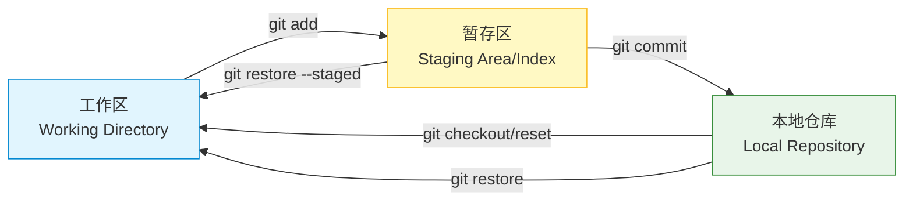
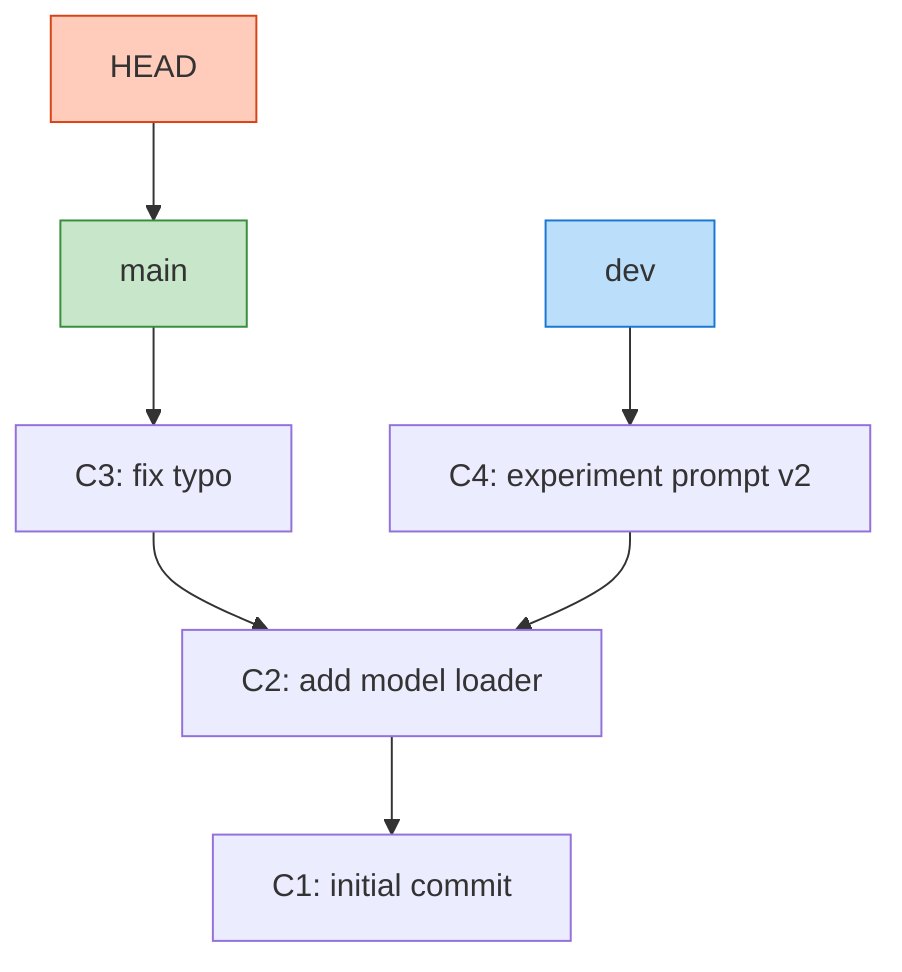
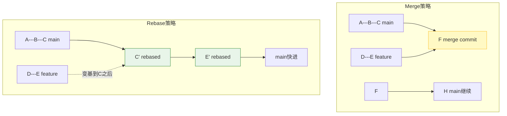
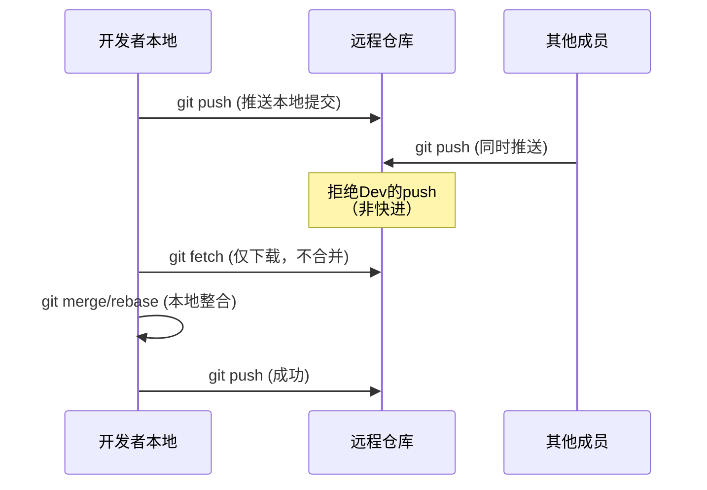
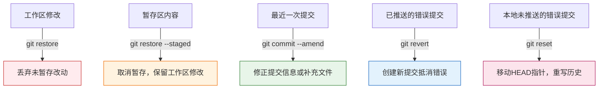
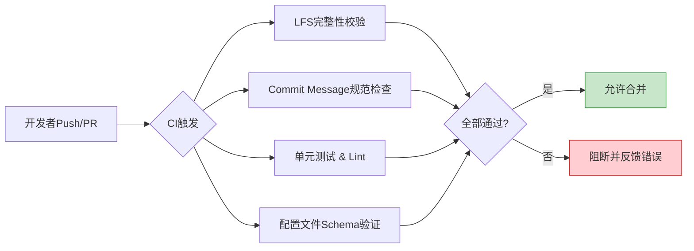

### 一、Git核心基础与版本控制理念

#### 1.1 为什么需要版本控制系统

在软件开发尤其是大模型应用研发中，代码与配置的迭代频率极高。若仅依靠手动备份或文件夹命名（如`final_v2_real.py`）来管理变更，极易导致版本混乱、协作冲突及历史追溯困难。版本控制系统（Version Control System, VCS）正是为解决此类问题而生，它完整记录文件的每一次修改，支持随时回溯、对比差异及多人协同。

> **💡 概念解析：集中式 vs 分布式**
> 
> - **集中式VCS（如SVN）**：所有版本历史存储在中央服务器。开发者每次操作都需联网，服务器故障则面临数据丢失风险。适合权限管控严格但网络稳定的传统企业环境。
> - **分布式VCS（如Git）**：每个开发者本地都拥有完整的版本库副本。离线亦可提交、查看历史，仅在推送/拉取时需联网。天然具备容灾能力，且分支操作极其轻量，是现代开源及AI项目的事实标准。

#### 1.2 Git的安装与身份配置

Git安装后，首要任务是配置用户身份信息。该信息会写入每次提交记录，是团队协作中标识贡献者的关键依据。

```bash
# 全局配置用户名与邮箱（对所有仓库生效）
git config --global user.name "Your Name"
git config --global user.email "your.email@example.com"

# 验证配置是否成功
git config --list
```

> **⚠️ 注意事项**  
> `--global`参数表示全局配置，适用于个人电脑上的所有项目。若某项目需使用不同身份（如公司项目与个人开源项目区分），可在该项目根目录下执行不带`--global`的命令进行局部覆盖。

#### 1.3 Git的核心三区架构

理解Git的关键在于掌握其独特的“三区”数据流转模型。这不仅是操作命令的基础，更是理解后续所有高级功能的底层逻辑。



- **工作区（Working Directory）**：即你在电脑上看到的实际文件目录。在此处编辑代码、新增文件，这些改动尚未被Git正式追踪。
- **暂存区（Staging Area / Index）**：一个准备提交的“草稿箱”。通过`git add`将工作区的改动放入此处，意味着你已确认这些变更属于下一次提交的范围。这一设计允许你精确控制每次提交包含哪些修改，而非一股脑全部提交。
- **本地仓库（Local Repository）**：Git数据库本体，存储了所有提交历史、分支指针及元数据。`git commit`将暂存区的内容永久快照至此区域。

> **💡 背景知识补充：为什么需要暂存区？**  
> 许多初学者认为暂存区多余，但它实际上是Git强大灵活性的来源。例如，你同时修改了Bug修复和新功能代码，但希望分两次提交以保持历史清晰。暂存区允许你先`add` Bug修复相关文件并提交，再`add`新功能文件单独提交，实现原子化、语义化的提交粒度。这在Code Review和自动化测试中至关重要。

#### 1.4 基础操作流程与状态检查

日常开发中最频繁使用的命令组合如下：

```bash
# 1. 初始化仓库（在项目根目录执行一次即可）
git init

# 2. 查看当前状态（最常用命令，建议养成习惯）
git status

# 3. 添加文件到暂存区（. 表示当前目录所有改动）
git add .              # 添加所有改动
git add filename.py    # 添加指定文件

# 4. 提交到本地仓库（附带有意义的提交信息）
git commit -m "feat: 添加数据预处理脚本"

# 5. 查看提交历史
git log                # 详细模式
git log --oneline      # 精简单行模式，推荐日常使用
```

> **📝 提交信息规范建议**  
> 良好的提交信息应遵循约定式规范（Conventional Commits），格式为`<type>: <description>`。常见类型包括：
> 
> - `feat`: 新功能
> - `fix`: 修复Bug
> - `docs`: 文档更新
> - `refactor`: 重构（不影响功能）
> - `chore`: 构建/工具链变动
> 
> 示例：`feat: 实现基于LoRA的微调训练循环`。这种规范化写法便于后续自动生成CHANGELOG、语义化版本发布及团队快速理解历史变更意图。

#### 1.5 关键概念辨析：HEAD、分支与提交

- **提交（Commit）**：Git中不可变的数据快照，由SHA-1哈希值唯一标识。每个提交记录了父提交指针、作者信息及树对象（文件快照）。
- **分支（Branch）**：本质上只是一个指向某个提交的可移动指针。创建分支仅是新建一个指针，几乎零开销，这是Git鼓励频繁使用分支的根本原因。
- **HEAD**：一个特殊指针，始终指向当前所在的分支（或直接指向某个提交，称为“分离头指针”状态）。大多数操作都是相对于HEAD进行的。



> **💡 理解要点**  
> 当执行`git checkout dev`时，HEAD从`main`移动到`dev`指针，工作区随之更新为`C4`对应的文件状态。分支不是独立的代码副本，只是指向历史长河中某个节点的标签。这种设计使得切换分支、创建分支成为毫秒级操作，极大促进了实验性开发——在大模型调优中，你可以为每次Prompt调整或超参实验创建独立分支，失败则直接删除，成功则合并，全程无心理负担。

### 二、分支管理与团队协作流程

#### 2.1 分支的本质与创建策略

在Git中，分支并非代码的完整拷贝，而是一个仅41字节的指针文件，指向某个特定的提交对象。这种轻量级设计使得创建、切换和删除分支的成本极低，鼓励开发者为每个功能、修复或实验创建独立分支，避免在主线上直接开发带来的风险。

```bash
# 创建并切换到新分支（推荐一步完成）
git checkout -b feature/prompt-optimization

# 仅创建分支但不切换
git branch feature/data-loader

# 查看所有分支（本地 + 远程）
git branch -a

# 删除已合并的分支
git branch -d feature/prompt-optimization

# 强制删除未合并的分支（谨慎使用）
git branch -D feature/experiment-failed
```

> **💡 概念解析：为什么Git分支如此轻量？**  
> 传统版本控制系统（如SVN）创建分支需要复制整个目录树，耗时且占用空间。而Git的分支只是一个指向提交的引用，创建操作仅写入一个文本文件。实际的代码差异通过提交对象的有向无环图（DAG）动态计算得出。这意味着即使项目包含数万文件，创建分支也只需毫秒级时间。这一特性是Git支持“分支即工作流”理念的技术基石。

#### 2.2 分支合并策略：Merge vs Rebase

当功能开发完成后，需将分支变更整合回主线。Git提供两种核心合并方式，适用场景截然不同。



- **Merge（合并）**：创建一个额外的“合并提交”，保留完整的分支历史拓扑。优点是真实反映开发过程，缺点是历史线可能变得复杂交错。
    
    ```bash
    git checkout main
    git merge feature/prompt-optimization
    ```
    
- **Rebase（变基）**：将当前分支的提交“重放”到目标分支最新提交之后，形成线性历史。优点是历史整洁、便于Code Review，缺点是改写历史，**严禁对已推送到远程的公共分支执行**。
    
    ```bash
    # 在feature分支上执行
    git rebase main
    # 然后切回main快进合并
    git checkout main
    git merge feature/prompt-optimization  # 此时自动变为fast-forward
    ```
    

> **⚠️ 黄金法则**
> 
> - **本地私有分支**：可自由使用rebase整理提交历史。
> - **远程共享分支**：永远只用merge，绝不rebase。否则会导致协作者的历史不一致，引发灾难性冲突。
> - **大模型项目建议**：个人实验分支用rebase保持简洁；合入主干时用merge保留上下文；发布版本前可用交互式rebase（`git rebase -i`）压缩琐碎提交。

#### 2.3 冲突的产生与解决机制

当两个分支对同一文件的相同区域做出不同修改时，Git无法自动判断应保留哪一方，从而产生冲突。冲突不是错误，而是协作中的正常现象。

```bash
# 合并时若出现冲突，Git会标记冲突文件
git merge feature/data-loader

# 查看冲突状态
git status

# 手动编辑冲突文件，解决标记如下：
# <<<<<<< HEAD
# 当前分支的内容
# =======
# 传入分支的内容
# >>>>>>> feature/data-loader

# 解决后添加并提交
git add resolved_file.py
git commit  # 无需-m参数，Git自动生成合并提交信息
```

> **💡 高效解决冲突的实践建议**
> 
> - **预防优于解决**：频繁同步主线（每日rebase或merge main），避免分歧积累过大。
> - **工具辅助**：使用VS Code、IntelliJ等IDE的可视化冲突解决面板，比纯文本编辑更直观安全。
> - **语义理解优先**：不要机械选择“保留当前”或“保留传入”，务必理解双方修改意图后再决策。在大模型项目中，Prompt模板或配置文件的冲突尤其需要结合业务逻辑判断。
> - **测试验证**：冲突解决后必须运行测试或验证脚本，确保合并结果功能正确。

#### 2.4 远程仓库交互与协作规范

团队协作依赖远程仓库（如GitHub/GitLab）作为中心枢纽。理解`fetch`、`pull`、`push`的区别是避免误操作的关键。



- **git fetch**：仅从远程下载新提交和分支信息到本地的远程跟踪分支（如`origin/main`），**不修改工作区和本地分支**。这是最安全的同步方式，允许你先审查远程变更再决定如何整合。
- **git pull**：等价于`git fetch` + `git merge`（或`--rebase`模式下的`git rebase`）。便捷但隐含风险，可能在未察觉的情况下引入合并提交或冲突。
- **git push**：将本地提交推送到远程。默认仅推送当前分支，建议使用`git push -u origin branch-name`建立上游跟踪关系，后续可直接`git push`。

> **📝 团队协作最佳实践**
> 
> 1. **推送前先拉取**：养成`git pull --rebase`或`git fetch && git rebase`的习惯，保持本地与远程同步。
> 2. **小步提交，频繁推送**：避免长时间离线开发导致大规模冲突。
> 3. **保护主分支**：在Git平台设置分支保护规则，禁止直接push到main/master，强制通过Pull Request/Merge Request合并。
> 4. **清理远程分支**：功能合并后及时删除远程分支，避免分支列表臃肿。可使用`git fetch -p`清理本地过期的远程跟踪分支。
> 5. **大模型项目特别注意**：模型权重、数据集等大文件**切勿**直接存入Git仓库。应使用Git LFS（Large File Storage）或外部对象存储（如S3/OSS），Git中仅保留指针文件或下载脚本。否则仓库体积膨胀将严重拖慢克隆与拉取速度。

### 三、Git进阶技巧与工程化实践

#### 3.1 标签管理与版本发布

在软件开发中，仅靠提交哈希难以直观标识重要节点。标签（Tag）为特定提交赋予人类可读的名称，是版本发布、模型快照及里程碑记录的核心机制。

```bash
# 创建轻量标签（仅指针，无额外元数据）
git tag v0.1.0-alpha

# 创建附注标签（推荐，包含作者、日期、备注信息）
git tag -a v1.0.0 -m "Release: 首个稳定版Prompt模板"

# 推送标签到远程（默认push不包含标签）
git push origin v1.0.0       # 推送单个标签
git push origin --tags       # 推送所有标签

# 查看标签列表及详情
git tag -l                   # 列出所有标签
git show v1.0.0              # 查看附注标签的完整信息
```

> **💡 概念解析：轻量标签 vs 附注标签**
> 
> - **轻量标签**：本质上只是一个指向提交的引用，与分支指针无异，仅作为书签使用。
> - **附注标签**：是一个完整的Git对象，存储了打标签者信息、时间戳、备注消息，甚至支持GPG签名验证。
> 
> 在正式发布或关键模型检查点时，务必使用附注标签。它不仅提供可追溯的上下文，还能被`git describe`等工具自动识别用于生成版本号。轻量标签仅适合临时标记调试位置。

#### 3.2 忽略文件配置与仓库清洁

并非所有文件都应纳入版本控制。构建产物、环境变量、IDE配置、大模型权重文件等若误入仓库，会导致体积膨胀、敏感信息泄露及协作冲突。`.gitignore`文件定义了Git应主动忽略的文件模式。

```gitignore
# Python相关
__pycache__/
*.pyc
.env
.venv/

# 大模型项目特有
*.bin
*.pt
*.safetensors
checkpoints/
wandb/
*.csv
*.parquet

# IDE与系统文件
.idea/
.vscode/
.DS_Store
Thumbs.db
```

> **⚠️ 关键注意事项**  
> `.gitignore`仅对**未跟踪**文件生效。若文件已被提交过，后续添加忽略规则不会自动移除该文件。需先执行以下命令从索引中删除（但保留本地文件），再提交变更：
> 
> ```bash
> git rm --cached -r checkpoints/
> git commit -m "chore: 移除误提交的模型检查点目录"
> ```
> 
> 建议在项目初始化时就创建完善的`.gitignore`，避免事后清理的麻烦。对于大模型项目，还应考虑将数据集路径、API密钥等通过环境变量注入，而非硬编码或存入配置文件。

#### 3.3 别名设置与日志美化

高频命令可通过别名简化输入，提升操作流畅度；原始日志输出冗长难读，定制化格式能显著提升历史追溯效率。

```bash
# 配置常用别名（全局生效）
git config --global alias.st status
git config --global alias.co checkout
git config --global alias.br branch
git config --global alias.ci commit
git config --global alias.lg "log --graph --pretty=format:'%Cred%h%Creset -%C(yellow)%d%Creset %s %Cgreen(%cr) %C(bold blue)<%an>%Creset' --abbrev-commit"

# 使用效果
git lg          # 等价于上述美化的log命令
git st          # 等价于git status
```

> **📝 日志格式化参数速查**
> 
> - `%h`: 简短哈希
> - `%d`: 引用名（分支/标签）
> - `%s`: 提交主题
> - `%cr`: 相对时间（如“3天前”）
> - `%an`: 作者姓名
> - `%C(...)`: 颜色控制
> 
> 美观的日志不仅便于个人回顾，在团队Code Review和问题排查时也能快速定位关键变更。建议将优化后的`lg`别名写入团队共享的配置文档，统一视觉体验。

#### 3.4 撤销与回退的高级用法

误操作不可避免，Git提供了多层次的修正机制。理解各命令的作用范围与安全性，是避免数据丢失的关键。



- **git restore**：安全地恢复工作区或暂存区状态，替代了易混淆的`checkout`部分功能。
- **git commit --amend**：修改最近一次提交。可更新提交信息、增补遗漏文件或移除误加文件。**仅限未推送的提交**。
- **git revert**：创建一个新提交来“反向应用”指定提交的变更。历史保持线性且完整，适用于已推送到远程的公共分支纠错。
- **git reset**：移动HEAD指针并可选择性地重置暂存区和工作区。三种模式区别至关重要：
    - `--soft`: 仅移动HEAD，保留暂存区和工作区（相当于撤销commit但保留add）。
    - `--mixed`（默认）: 移动HEAD并清空暂存区，保留工作区（相当于撤销commit和add）。
    - `--hard`: 移动HEAD并彻底丢弃暂存区和工作区的所有改动。**高危操作，不可逆**。

> **⚠️ 安全操作准则**
> 
> - 优先使用`restore`和`revert`等安全命令。
> - `reset --hard`前务必确认目标提交哈希正确，且无未保存的重要改动。
> - 对已推送的提交，永远使用`revert`而非`reset`，除非你明确知道自己在做什么并已通知所有协作者强制同步。
> - 大模型训练中若误提交了数GB的检查点文件，应立即用`git rm --cached`移除并`amend`或`revert`，切勿等待下次提交覆盖。

#### 3.5 子模块基础与多仓库管理

大模型项目常依赖外部组件：自定义算子库、评估框架、Prompt模板集合等。若直接复制代码会导致版本脱节；若作为独立仓库又难以统一管理。Git子模块（Submodule）允许在一个仓库中嵌套引用另一个仓库的特定提交，实现依赖的精确锁定。

```bash
# 添加子模块
git submodule add https://github.com/org/custom-kernels.git libs/kernels

# 克隆含子模块的项目（必须递归）
git clone --recurse-submodules <repo-url>

# 更新子模块到记录的提交
git submodule update --init --recursive

# 进入子模块目录正常操作Git
cd libs/kernels
git pull origin main
cd ../..
git add libs/kernels
git commit -m "chore: 更新custom-kernels至最新版"
```

> **💡 使用场景与局限性**
> 
> - **适用**：强版本绑定的内部库、第三方 fork 的定制修改、跨项目共享的配置/模板。
> - **不适用**：频繁变动的活跃依赖、纯运行时依赖（应使用pip/conda）、大型二进制资源（应使用LFS或外部存储）。
> - **痛点提醒**：子模块增加了操作复杂度，新成员易忘记`--recurse-submodules`导致构建失败。建议在README中明确说明，并在CI脚本中加入自动初始化步骤。对于大模型项目，若子模块本身包含大文件，需在子模块内单独配置LFS，主仓库不会继承其LFS设置。

### 四、面向大模型开发的Git最佳实践

#### 4.1 大文件存储（Git LFS）原理与应用

Git的设计初衷是管理文本代码，其差异压缩算法对二进制大文件完全失效。若直接将数GB的模型权重或数据集纳入仓库，会导致克隆耗时数十分钟、推送频繁超时，且历史体积永久膨胀无法缩减。Git LFS（Large File Storage）通过将大文件替换为轻量级指针文本，并将实际内容存储在独立对象服务器中，从根本上解决了这一问题。

```bash
# 安装并初始化LFS
git lfs install

# 追踪指定文件类型
git lfs track "*.safetensors"
git lfs track "*.bin"
git lfs track "datasets/*.parquet"

# ⚠️ 关键步骤：必须提交.gitattributes
git add .gitattributes
git commit -m "chore: 配置Git LFS追踪规则"

# 后续正常add/commit/push，LFS自动处理
git add model.safetensors
git commit -m "feat: 添加微调后的LoRA权重"
git push
```

> **💡 概念解析：指针文件与透明代理**  
> 当启用LFS后，工作区中的大文件仍是完整二进制，但暂存区和仓库中存储的是一个约130字节的文本指针：
> 
> ```
> version https://git-lfs.github.com/spec/v1
> oid sha256:4d7a...
> size 3891204567
> ```
> 
> `git checkout`时LFS过滤器自动下载真实文件替换指针；`git push`时先上传大文件至LFS服务器，再推送指针提交。整个过程对用户透明，但需注意：CI/CD环境、新成员克隆时必须确保LFS已安装并执行`git lfs pull`，否则得到的只是无效指针文件。

#### 4.2 Prompt与配置文件的版本管理策略

在大模型应用中，Prompt模板、超参数配置、评估指标定义等“非代码资产”的变更频率往往高于代码本身，且直接影响模型行为。这类文件需要比代码更精细的版本管控。

```yaml
# configs/prompt_v2.3.yaml 示例
version: "2.3"
author: "alice"
date: "2026-06-03"
changelog: "增加few-shot示例，优化输出格式约束"

system_prompt: |
  你是一个专业的数据分析助手...
  
user_template: |
  请分析以下数据：{data}
  
parameters:
  temperature: 0.3
  max_tokens: 2048
```

> **📝 工程化实践建议**
> 
> 1. **结构化优于纯文本**：使用YAML/JSON/TOML等结构化格式存储Prompt和配置，便于程序读取、Diff对比及自动化验证。避免将Prompt硬编码在Python字符串中。
> 2. **元数据内嵌**：在每个配置文件头部包含版本号、作者、变更日期及简要说明。这弥补了Git提交信息粒度不足的问题，使单次提交内多个配置的变更可独立追溯。
> 3. **分支即实验**：为每次重要的Prompt调优创建独立分支（如`exp/prompt-cot-v3`），配合附注标签记录评估指标。失败实验可直接删除分支，成功则合并并打标签，形成清晰的实验谱系。
> 4. **敏感信息隔离**：API密钥、数据库密码等绝不存入版本库。使用`.env`文件 + `.gitignore`，或通过Secrets Manager注入。配置文件中仅保留占位符（如`${OPENAI_API_KEY}`）。

#### 4.3 CI/CD集成基础与自动化门禁

人工审查难以覆盖所有规范，将Git操作与持续集成流水线绑定，可在代码合入前自动执行质量检查，防止低质变更污染主线。



- **Pre-commit Hooks**：在本地`git commit`时自动运行格式化、敏感信息扫描、LFS指针校验等检查，将问题拦截在推送之前。推荐使用`pre-commit`框架统一管理钩子脚本。
- **PR/MR流水线**：在合并请求触发时执行完整测试套件、文档构建、配置合法性验证。设置必需的状态检查（Required Status Checks），未通过则禁止合并。
- **自动化发布**：合入主分支后自动打标签、生成CHANGELOG、构建Docker镜像或上传模型产物。减少人工操作失误，确保发布过程可重复、可审计。

> **⚠️ 大模型项目CI特殊考量**
> 
> - **GPU资源昂贵**：完整训练不宜放入CI。应设计分层测试：CI仅运行小样本Smoke Test和单元测试；全量评估由手动触发的Nightly Pipeline或专用评估集群执行。
> - **LFS带宽成本**：CI中频繁拉取大文件会产生高额流量费用。配置LFS缓存或使用内部LFS服务器，避免每次构建都从远端重新下载。
> - **环境一致性**：模型推理结果高度依赖CUDA、PyTorch版本。CI容器镜像必须锁定精确版本，并与开发环境保持一致，避免“本地正常、线上异常”的幽灵Bug。

#### 4.4 常见陷阱与调试技巧

即使熟练掌握Git，仍可能遭遇隐蔽问题。以下是大模型开发中高频出现的陷阱及应对方案。

|陷阱现象|根本原因|解决方案|
|:--|:--|:--|
|克隆后模型加载报错|LFS未安装或未拉取真实文件|`git lfs install && git lfs pull`|
|Push被拒但本地无冲突|远程有新提交且未同步|`git pull --rebase` 后再push|
|切换分支后大文件未更新|LFS过滤器未正确触发|`git lfs checkout` 强制刷新|
|历史中出现数百MB提交|误提交大文件后才加.gitignore|使用`git filter-repo`彻底清除历史|
|Rebase后子模块指向错误|子模块未随主仓库同步更新|`git submodule update --init --recursive`|

> **💡 调试工具箱**
> 
> - **git bisect**：当不确定哪个提交引入了回归Bug时，用二分法自动定位。尤其适用于模型效果突然下降的场景。
>     
>     ```bash
>     git bisect start
>     git bisect bad HEAD           # 当前版本有问题
>     git bisect good v1.0.0        # v1.0.0是正常的
>     # Git自动checkout中间提交，你验证后标记good/bad
>     # 重复直至定位到首个bad commit
>     git bisect reset              # 完成后退出bisect模式
>     ```
>     
> - **git reflog**：记录了HEAD的所有移动历史，包括reset、rebase等“消失”的操作。是误删分支或丢失提交的最后救命稻草。
>     
>     ```bash
>     git reflog                    # 查看HEAD移动记录
>     git reset --hard abc1234      # 恢复到reflog中显示的某个状态
>     ```
>     
> - **GIT_TRACE=1**：在执行Git命令前设置此环境变量，可输出底层协议交互细节，用于诊断网络、认证、LFS传输等疑难问题。

> **📝 终极原则**  
> Git是工具而非目的。在大模型快速迭代的语境下，版本管理的核心价值是**可复现性**与**协作效率**。当规范阻碍了实验速度时，应反思规范本身是否合理；当操作复杂到频繁出错时，应优先投资于自动化而非要求人人成为Git专家。保持仓库轻量、历史清晰、变更可追溯，便是最适合你的最佳实践。

### 五、练习

本阶段旨在通过分层递进的实操任务，将前四个阶段的理论知识转化为肌肉记忆。所有练习均围绕大模型开发真实场景设计，建议读者在本地创建专用练习仓库逐步完成。每道题后附有验证标准与思考提示，帮助自我评估掌握程度。

#### 5.1 基础操作与三区模型验证

**目标**：巩固工作区、暂存区、本地仓库的数据流转理解，建立原子化提交习惯。

1. **精准暂存练习**
    
    - 创建一个Python文件`train.py`，写入三行代码并保存。
    - 仅将前两行添加到暂存区，第三行保留在工作区。
    - 提交暂存区内容，提交信息为`feat: 初始化训练脚本框架`。
    - 再将第三行添加并提交，提交信息为`feat: 添加学习率配置`。
    - **验证标准**：执行`git log --oneline`应显示两条独立提交；`git show HEAD~1`仅包含前两行代码变更。
    - **思考提示**：若误将三行全部`add`，如何在不丢失任何修改的前提下拆分为两次提交？回顾暂存区的核心设计意图。
2. **状态感知训练**
    
    - 连续执行以下操作序列，每步之后立即运行`git status`并口头解释输出含义：新建未跟踪文件 → `add`该文件 → 修改已暂存文件 → `commit` → 再次修改已提交文件。
    - **验证标准**：能准确区分“未跟踪”“已暂存待提交”“已修改未暂存”三种状态的视觉标识与语义差异。
    - **背景补充**：`git status`是Git最安全的诊断命令，永远不会修改仓库状态。养成每次操作前后查看状态的习惯，可预防90%的误操作。

> [!success]- 点击展开题解
> 
> ## 5.1 基础操作与三区模型验证：题解与深度解析
> 
> 本练习的核心目的不仅仅是记忆 Git 命令，而是通过肌肉记忆建立对 **Git 三区模型（Three-Stage Model）** 的直觉理解。很多初学者将 Git 视为“云盘”，而忽略了其作为“内容寻址文件系统”和“快照管理器”的本质。以下是对两道题目的详细拆解。
> 
> ---
> 
> ### 1. 精准暂存练习：原子化提交的实践
> 
> #### 💡 核心概念：什么是“原子化提交”？
> 
> 一个提交（Commit）应当只做一件事，且这件事是完整的。如果未来需要回滚“学习率配置”，你不希望连“训练脚本框架”一起被撤销。**暂存区（Staging Area / Index）** 的存在，正是为了让你拥有“组装快照”的权利，而不是被迫提交工作区的当前全貌。
> 
> #### 🛠️ 操作步骤详解
> 
> ```bash
> # 1. 创建文件并写入三行代码
> echo -e "import torch\nmodel = Net()\nlr = 0.001" > train.py
> 
> # 2. 【关键】仅暂存前两行（使用 patch 模式）
> git add -p train.py
> # 交互提示中选 'y' 接受前两个 hunk，选 'n' 拒绝第三个 hunk
> 
> # 3. 确认暂存区状态（养成习惯！）
> git diff --cached  # 应只显示前两行
> 
> # 4. 第一次提交
> git commit -m "feat: 初始化训练脚本框架"
> 
> # 5. 暂存剩余修改并提交
> git add train.py
> git commit -m "feat: 添加学习率配置"
> ```
> 
> #### ✅ 验证方法
> 
> ```bash
> # 查看提交历史
> git log --oneline
> # 预期输出：
> # a1b2c3d feat: 添加学习率配置
> # e4f5g6h feat: 初始化训练脚本框架
> 
> # 验证倒数第二次提交的内容
> git show HEAD~1
> # 预期：diff 中仅包含 import torch 和 model = Net() 两行新增
> ```
> 
> #### 🤔 思考题解答：误 add 全部后如何拆分？
> 
> 如果你已经执行了 `git add train.py`（三行全部进入暂存区），**不要慌，你的代码没有丢失**。有两种安全的补救方式：
> 
> |方法|命令|适用场景|
> |:--|:--|:--|
> |**方法A：交互式取消暂存**|`git restore --staged -p train.py`|推荐。精确控制哪些 hunk 移出暂存区|
> |**方法B：软重置**|`git reset --soft HEAD` + 重新 `add -p`|适合尚未提交时整体重来|
> 
> > ⚠️ **注意**：切勿使用 `git reset --hard`，这会丢弃工作区修改！`--soft` 仅移动 HEAD 指针，保留暂存区和工作区内容。
> 
> #### 📊 三区数据流转示意图
> 
> ```mermaid
> flowchart LR
>     A["🗂️ 工作区<br/>Working Directory"] -->|git add -p<br/>部分暂存| B["📋 暂存区<br/>Staging Area"]
>     A -->|git add .<br/>全部暂存| B
>     B -->|git commit| C["🏛️ 本地仓库<br/>Repository"]
>     C -->|git checkout / restore| A
>     B -->|git restore --staged| A
>     
>     style A fill:#fff3cd,stroke:#856404
>     style B fill:#d1ecf1,stroke:#0c5460
>     style C fill:#d4edda,stroke:#155724
> ```
> 
> ---
> 
> ### 2. 状态感知训练：读懂 Git 的“仪表盘”
> 
> `git status` 是 Git 最安全、最重要的诊断命令。它永远不会修改任何数据，只会读取三个区域的状态并生成报告。
> 
> #### 🔄 五步状态变化全流程
> 
> ```mermaid
> stateDiagram-v2
>     [*] --> Untracked: 新建文件
>     Untracked --> Staged: git add
>     Staged --> ModifiedNotStaged: 再次修改已暂存文件
>     ModifiedNotStaged --> Committed: git commit (仅提交暂存部分)
>     Committed --> ModifiedNotStaged: 修改已提交文件
> ```
> 
> #### 📖 每步 `git status` 输出解读
> 
> |步骤|操作|`git status` 关键标识|语义解释|
> |:--|:--|:--|:--|
> |①|新建 `data.py`|🔴 `Untracked files: data.py`|Git 知道该文件存在，但未纳入版本控制。不会被自动提交。|
> |②|`git add data.py`|🟢 `Changes to be committed: new file: data.py`|文件快照已进入暂存区，下次 commit 将包含此内容。|
> |③|修改 `data.py`|🟢 `to be committed` + 🟡 `Changes not staged: modified: data.py`|**同一文件同时出现在两个区域！** 暂存区是旧版本，工作区是新版本。commit 只会提交旧版本。|
> |④|`git commit`|🟡 `Changes not staged: modified: data.py`|暂存区清空（变为干净），但工作区的修改仍在。这是新手最容易困惑的状态：“我刚提交了为什么还有修改？”|
> |⑤|再次修改|🟡 `Changes not staged: modified: data.py`|纯工作区变更，与上次提交无关。需重新 add 才能进入下一次提交流程。|
> 
> #### 🎯 三种状态的视觉与语义对照
> 
> ```mermaid
> graph TD
>     subgraph 状态识别
>         U["🔴 Untracked<br/>未跟踪"]
>         S["🟢 Staged<br/>已暂存待提交"]
>         M["🟡 Modified (not staged)<br/>已修改未暂存"]
>     end
>     
>     U -->|"git add"| S
>     S -->|"修改文件"| M
>     M -->|"git add"| S
>     M -->|"git restore"| Clean["✅ Clean"]
>     S -->|"git commit"| Clean
>     Clean -->|"编辑文件"| M
>     Clean -->|"新建文件"| U
> ```
> 
> > 💡 **经验法则**：每次执行 `add`、`commit`、`restore` 等写操作前后，都运行一次 `git status`。这就像开车时看后视镜——不是因为你怀疑自己，而是因为这是安全驾驶的基本素养。90% 的 Git 事故源于“我以为文件已经暂存了”或“我以为修改已经被提交了”。
> 
> ---
> 
> ### 📚 补充背景知识
> 
> - **暂存区的本质**：它是一个二进制索引文件（`.git/index`），记录了每个路径对应的 blob hash、文件模式和元数据。`git add` 实际上是将工作区文件计算 SHA-1 哈希后写入这个索引。
> - **为什么 Git 要设计暂存区？** SVN 等集中式 VCS 没有暂存区，提交即全量。Git 的暂存区赋予了开发者“策展人”角色——你可以精心挑选每个提交包含的内容，使历史记录成为一份可读的技术文档，而非混乱的工作日志。
> - **Conventional Commits**：题目中使用 `feat:` 前缀遵循了约定式提交规范。这种格式便于自动生成 CHANGELOG、语义化版本号判定和 CI 流程触发。建议在团队项目中始终遵守。

#### 5.2 分支协作与冲突解决实战

**目标**：掌握并行开发流程，安全处理合并冲突，理解merge与rebase的适用边界。

1. **模拟双人协作冲突**
    
    - 从main创建两个分支`dev/prompt-a`和`dev/prompt-b`。
    - 在两个分支中分别修改同一配置文件`config.yaml`的相同字段（如`temperature`值）。
    - 先将`dev/prompt-a`合并回main，再尝试合并`dev/prompt-b`，触发冲突。
    - 手动解决冲突后提交，确保最终配置值符合业务预期而非机械选择某一方。
    - **验证标准**：`git log --graph --oneline`显示合并提交节点；冲突文件中无残留标记；配置文件语法有效。
    - **思考提示**：若冲突涉及Prompt模板的多行文本，纯文本编辑器难以判断语义完整性，应借助IDE的三路合并视图或专用Diff工具。
2. **Rebase整理私有分支**
    
    - 在本地实验分支上产生5个琐碎提交（如“fix typo”“adjust param”“update comment”）。
    - 使用交互式rebase将其压缩为1个语义清晰的提交。
    - 将该分支rebase到最新main后快进合并。
    - **验证标准**：main历史呈线性，仅新增一个提交；原5个提交的哈希值不再存在于任何分支中。
    - **⚠️ 安全红线**：此练习仅限本地未推送分支。若已推送，必须改用`git revert`或团队协商强制同步，绝不可对远程分支执行rebase。

> [!success]- 点击展开题解
> 
> ### 🎯 题解概述
> 
> 本题旨在通过实战演练，帮助读者跨越 Git 协作中的两道核心门槛：**冲突解决的语义化判断**与 **Rebase 的安全边界认知**。这不仅是命令行的操作练习，更是团队协作规范的预演。以下题解将结合原理图解、操作步骤与安全警示，为你提供一份可落地的实战指南。
> 
> ---
> 
> ### 1. 模拟双人协作冲突：从“机械合并”到“语义决策”
> 
> #### 💡 核心概念解析
> 
> Git 的合并冲突本质上是**文本层面的歧义**，而非逻辑层面的错误。当两个分支修改了同一文件的相同行时，Git 无法自动判断哪个版本是“正确”的，它只能标记出差异。**解决冲突的过程，实际上是开发者根据业务上下文进行“语义仲裁”的过程。**
> 
> #### 🗺️ 冲突产生与解决流程
> 
> ```mermaid
> graph LR
>     A[main] --> B(dev/prompt-a)
>     A --> C(dev/prompt-b)
>     B -->|修改 temperature=0.7| D{Merge to main}
>     D -->|成功| E[main v2]
>     C -->|修改 temperature=0.9| F{Merge to main}
>     E --> F
>     F -->|CONFLICT| G[手动解决冲突]
>     G -->|语义决策: 取0.8或新值| H[Commit Merge]
>     H --> I[main v3]
> ```
> 
> #### 🛠️ 实战步骤详解
> 
> 1. **环境准备**
>     
>     ```bash
>     git checkout main
>     git checkout -b dev/prompt-a
>     # 修改 config.yaml: temperature: 0.7
>     git add config.yaml && git commit -m "feat: set temperature to 0.7 for creative tasks"
>     
>     git checkout main
>     git checkout -b dev/prompt-b
>     # 修改 config.yaml: temperature: 0.9
>     git add config.yaml && git commit -m "feat: increase temperature to 0.9 for diversity"
>     ```
>     
> 2. **触发并解决冲突**
>     
>     ```bash
>     # 先合并 prompt-a（无冲突）
>     git checkout main
>     git merge dev/prompt-a
>     
>     # 再合并 prompt-b（触发冲突）
>     git merge dev/prompt-b
>     # 输出: CONFLICT (content): Merge conflict in config.yaml
>     ```
>     
> 3. **语义化解决（关键）**  
>     打开 `config.yaml`，你会看到如下标记：
>     
>     ```yaml
>     <<<<<<< HEAD
>     temperature: 0.7
>     =======
>     temperature: 0.9
>     >>>>>>> dev/prompt-b
>     ```
>     
>     > ⚠️ **避坑指南**：不要简单地保留 HEAD 或 incoming change。应思考业务需求：
>     > 
>     > - 若两者分别服务于不同场景 → 改为结构化配置（如 `temperature_creative: 0.7`, `temperature_diverse: 0.9`）
>     > - 若需折中 → 设为 `0.8` 并添加注释说明决策依据
>     > - **验证语法**：修改后务必用 `yamllint config.yaml` 或 IDE 插件校验 YAML 合法性
>     
> 4. **完成合并与验证**
>     
>     ```bash
>     git add config.yaml
>     git commit -m "merge: resolve temperature conflict with balanced value 0.8"
>     
>     # 验证标准检查
>     git log --graph --oneline  # 应显示合并节点
>     grep -c "<<<<<<\|======\|>>>>>>" config.yaml  # 应返回 0
>     ```
>     
> 
> #### 🔧 工具推荐
> 
> 对于多行 Prompt 模板等复杂文本冲突，强烈建议使用 **VS Code 的三路合并视图** 或 **Meld / Beyond Compare**。这些工具能高亮显示 base、ours、theirs 三个版本，避免在纯文本编辑器中误删上下文导致语义断裂。
> 
> ---
> 
> ### 2. Rebase 整理私有分支：线性历史的艺术与安全红线
> 
> #### 💡 核心概念解析
> 
> **Rebase ≠ Merge**。Merge 保留完整历史拓扑，而 Rebase 是**重写提交历史**。交互式 Rebase (`git rebase -i`) 允许你像编辑文本一样编辑提交序列：压缩(squash)、重排(reorder)、修正(amend)。但正因其“重写”特性，它对已共享的分支具有破坏性。
> 
> #### 🗺️ Rebase 前后对比
> 
> ```mermaid
> graph TD
>     subgraph Before_Rebase
>         M1[main: A-B-C] 
>         F1[feature: D-E-F-G-H]
>         C --> D
>     end
>     
>     subgraph After_Rebase_Squash
>         M2[main: A-B-C]
>         F2[feature: D'-E']
>         C --> D'
>         style F2 fill:#d4edda
>     end
>     
>     Before_Rebase -.->|rebase -i + squash| After_Rebase_Squash
> ```
> 
> #### 🛠️ 实战步骤详解
> 
> 1. **创建琐碎提交**
>     
>     ```bash
>     git checkout -b experiment/local-only
>     echo "# fix typo" >> README.md && git add . && git commit -m "fix typo"
>     echo "# adjust param" >> config.yaml && git add . && git commit -m "adjust param"
>     echo "// update comment" >> main.py && git add . && git commit -m "update comment"
>     echo "# another fix" >> README.md && git add . && git commit -m "another fix"
>     echo "# final tweak" >> config.yaml && git add . && git commit -m "final tweak"
>     ```
>     
> 2. **交互式 Rebase 压缩**
>     
>     ```bash
>     # 回溯最近5个提交
>     git rebase -i HEAD~5
>     ```
>     
>     在编辑器中将后4个提交的 `pick` 改为 `squash`（或 `s`）：
>     
>     ```text
>     pick a1b2c3d fix typo
>     squash d4e5f6g adjust param
>     squash h7i8j9k update comment
>     squash l0m1n2o another fix
>     squash p3q4r5s final tweak
>     ```
>     
>     保存退出后，编辑新的提交信息为语义清晰的描述，如：`refactor: optimize config and documentation`
>     
> 3. **Rebase 到最新 main 并快进合并**
>     
>     ```bash
>     git checkout main
>     git pull origin main  # 确保本地 main 最新
>     git checkout experiment/local-only
>     git rebase main       # 将分支变基到 main 顶端
>     
>     git checkout main
>     git merge experiment/local-only  # 此时应为 Fast-forward
>     ```
>     
> 4. **验证标准**
>     
>     ```bash
>     git log --oneline main  # 仅新增1个提交
>     # 原5个提交的哈希值应完全消失
>     git reflog | grep -E "a1b2c3d|d4e5f6g|h7i8j9k|l0m1n2o|p3q4r5s"  # 应无匹配
>     ```
>     
> 
> #### 🚨 安全红线深度解读
> 
> |场景|是否可 Rebase|原因|替代方案|
> |---|---|---|---|
> |本地未推送分支|✅ 安全|历史仅存在于本地，不影响他人|—|
> |已推送的个人分支|⚠️ 谨慎|若他人未基于此分支开发，可 force-push；否则风险极高|`git revert`|
> |团队共享分支|❌ 禁止|重写历史会导致协作者本地分支与远程分叉，引发连锁混乱|使用 merge commit|
> |已合入 main 的提交|❌ 绝对禁止|破坏主干历史完整性，可能丢失生产环境追溯能力|`git revert`|
> 
> > 💬 **经验之谈**：Rebase 是一把手术刀——精准但危险。养成习惯：**只在本地实验阶段使用 rebase 整理提交；一旦推送到远程或进入协作流程，切换为 merge 策略**。若不慎对远程分支执行了 rebase，立即停止 force-push，转而与团队协商同步方案。
> 
> ---
> 
> ### 📚 延伸背景知识
> 
> - **为什么 Merge 会产生额外提交？**  
>     Merge commit 记录了“何时、谁、将哪两个分支合并”的元信息，这是审计追踪的关键。而 fast-forward merge 不产生额外节点，因此 rebase 后的分支才能实现线性合并。
>     
> - **YAML 冲突为何特别危险？**  
>     YAML 依赖缩进表达结构，冲突标记 `<<<<<<<` 会破坏缩进层级，即使手动删除标记也可能遗留语法错误。建议配置 CI 中的 `yamllint` 作为合并门禁。
>     
> - **IDE 三路合并的原理**  
>     三路合并同时展示 Base（共同祖先）、Ours（当前分支）、Theirs（传入分支），让你理解“双方各自从哪个共同点出发做了何种修改”，从而做出更准确的语义判断。这比单纯看 diff 高效得多。
>

#### 5.3 进阶技巧与工程规范应用

**目标**：熟练运用标签、忽略规则、撤销机制及子模块，构建规范化项目结构。

1. **版本发布全流程**
    
    - 为当前稳定状态创建附注标签`v0.1.0`，备注包含功能摘要与已知限制。
    - 推送标签至远程。
    - 后续修改后创建轻量标签`debug-temp`用于临时调试。
    - **验证标准**：`git show v0.1.0`显示完整元数据；`git show debug-temp`仅显示提交信息；远程仓库可见`v0.1.0`但无`debug-temp`（除非显式推送）。
    - **背景补充**：CI/CD流水线通常仅响应附注标签触发发布，轻量标签被忽略。这一约定避免了调试标记意外触发生产部署。
2. **误提交大文件的紧急修复**
    
    - 故意将一个100MB的假模型文件`fake_model.bin`提交并推送到远程（练习用仓库！）。
    - 发现错误后，使用`git filter-repo`彻底从历史中移除该文件（注意：不是`git rm --cached`，后者仅影响未来提交）。
    - 重新配置`.gitignore`和LFS追踪规则，验证后续同类文件自动走LFS通道。
    - **验证标准**：`git log --all --full-history -- fake_model.bin`无输出；仓库`.git`目录大小显著减小；新提交的`.bin`文件在远程显示为LFS指针。
    - **⚠️ 高危警告**：`filter-repo`会重写整个历史，所有协作者必须重新克隆仓库。仅在确认无其他分支依赖旧历史时执行，且务必提前备份。

> [!success]- 点击展开题解
> 
> ### 📘 5.3 进阶技巧与工程规范应用题解
> 
> 本章节聚焦于 Git 在**版本发布管理**与**仓库历史清洗**两个核心工程场景下的最佳实践。这两项技能是区分“会用 Git”与“能维护企业级项目”的关键分水岭。以下是对题目中两个实战任务的深度解析。
> 
> ---
> 
> ### 1. 版本发布全流程：附注标签 vs 轻量标签
> 
> #### 💡 核心概念辨析
> 
> 很多初学者认为 Tag 只是一个“别名”，但在 Git 内部对象模型中，**附注标签（Annotated Tag）** 和 **轻量标签（Lightweight Tag）** 是完全不同的两种存在：
> 
> ```mermaid
> graph LR
>     A[Commit Object] -->|被指向| B(Lightweight Tag)
>     C[Tag Object] -->|包含元数据: 作者/日期/消息/GPG签名| D[Commit Object]
>     E[Annotated Tag Ref] -->|指向| C
>     
>     style B fill:#f9f,stroke:#333,stroke-width:2px
>     style C fill:#bbf,stroke:#333,stroke-width:2px
>     style E fill:#bbf,stroke:#333,stroke-width:2px
> ```
> 
> - **轻量标签 (`debug-temp`)**: 仅仅是一个指向 Commit 的引用指针（类似分支但不移动）。它不包含任何额外信息，`git show` 只会显示它所指向的提交内容。
> - **附注标签 (`v0.1.0`)**: 是一个独立的 Git 对象（Tag Object），存储在数据库中。它包含打标签者、日期、备注信息，甚至可以包含 GPG 签名。**CI/CD 系统正是通过检测这个独立对象来判断是否为正式发布的。**
> 
> #### 🛠️ 操作步骤详解
> 
> **Step 1: 创建附注标签**
> 
> ```bash
> # -a 指定附注标签，-m 指定备注信息
> git tag -a v0.1.0 -m "Release v0.1.0: 完成用户认证模块; 已知限制: 暂不支持OAuth2"
> ```
> 
> **Step 2: 推送标签至远程**
> 
> ```bash
> # ⚠️ 注意：git push 默认不会推送标签！必须显式指定
> git push origin v0.1.0
> # 或者推送所有标签（慎用，可能误推调试标签）
> # git push origin --tags
> ```
> 
> **Step 3: 创建本地轻量标签（用于调试）**
> 
> ```bash
> # 不加 -a/-s/-m 参数即为轻量标签
> git tag debug-temp
> ```
> 
> **Step 4: 验证差异**
> 
> ```bash
> # ✅ 附注标签：显示 Tagger、Date、Message 等完整元数据
> git show v0.1.0
> 
> # ✅ 轻量标签：仅显示 commit 信息，无 tag 专属头部
> git show debug-temp
> 
> # ✅ 远程检查：确认 debug-temp 未被推送
> git ls-remote --tags origin
> ```
> 
> #### 📌 工程背景补充
> 
> > 在 GitHub Actions / GitLab CI 等主流流水线中，触发条件通常配置为：
> > 
> > ```yaml
> > on:
> >   push:
> >     tags:
> >       - 'v*'  # 仅匹配以 v 开头的附注标签
> > ```
> > 
> > 轻量标签因为没有 Tag Object，某些 CI 系统在 webhook 事件中无法获取到足够的元数据（如 release notes），因此会被自动过滤。这实际上是一种**安全机制**，防止开发者随手打的 `fix-typo` 或 `debug-temp` 标签意外触发生产环境的构建部署流程。
> 
> ---
> 
> ### 2. 误提交大文件的紧急修复：git filter-repo
> 
> #### ⚠️ 为什么不能用 `git rm --cached`？
> 
> 这是一个极其常见的误区。`git rm --cached fake_model.bin` 只是让文件在**下一次提交**中从索引移除，但该文件的二进制数据**仍然永久存在于之前的所有历史提交中**。任何人克隆仓库时仍会下载这 100MB 的垃圾数据，仓库体积不会减小。
> 
> #### 🔧 正确方案：git filter-repo
> 
> `git filter-repo` 是官方推荐的 `git filter-branch` 替代品，速度更快、更安全。
> 
> ```mermaid
> flowchart TD
>     A[发现误提交大文件] --> B{是否已推送到远程?}
>     B -->|否| C[git reset --hard HEAD~1]
>     B -->|是| D[备份仓库!]
>     D --> E[安装 git-filter-repo]
>     E --> F["git filter-repo --invert-paths --path fake_model.bin"]
>     F --> G[重写全部历史]
>     G --> H[重新配置 .gitignore + LFS]
>     H --> I[强制推送 force-push]
>     I --> J[通知所有协作者重新克隆]
>     
>     style D fill:#f66,stroke:#333,color:#fff
>     style J fill:#f66,stroke:#333,color:#fff
> ```
> 
> #### 🛠️ 操作步骤详解
> 
> **Step 1: 模拟误提交（练习环境）**
> 
> ```bash
> dd if=/dev/zero of=fake_model.bin bs=1M count=100
> git add fake_model.bin && git commit -m "oops: add large model file"
> git push origin main
> ```
> 
> **Step 2: 使用 filter-repo 彻底清除**
> 
> ```bash
> # 安装工具（推荐 pip）
> pip install git-filter-repo
> 
> # 从所有历史中删除该文件
> # --invert-paths 表示"排除指定路径"，即删除它
> # --force 跳过安全检查（练习用，生产环境建议先备份）
> git filter-repo --invert-paths --path fake_model.bin --force
> ```
> 
> **Step 3: 验证清理结果**
> 
> ```bash
> # ✅ 应无任何输出，说明历史中已不存在该文件
> git log --all --full-history -- fake_model.bin
> 
> # ✅ 检查 .git 目录大小是否显著缩小
> du -sh .git
> ```
> 
> **Step 4: 配置 LFS 防止再犯**
> 
> ```bash
> # 安装并初始化 LFS
> git lfs install
> 
> # 追踪所有 .bin 文件
> git lfs track "*.bin"
> 
> # ⚠️ 关键：.gitattributes 必须被提交！
> git add .gitattributes
> git commit -m "chore: configure LFS for binary files"
> ```
> 
> **Step 5: 强制推送并通知团队**
> 
> ```bash
> # filter-repo 会移除 remote 配置，需重新添加
> git remote add origin <your-repo-url>
> git push origin main --force-with-lease
> ```
> 
> #### 📌 高危操作须知
> 
> |风险点|说明|缓解措施|
> |---|---|---|
> |历史重写|所有 commit hash 都会改变|操作前 `git clone --mirror` 完整备份|
> |协作者冲突|旧分支与新历史不兼容|**必须**通知所有人删除本地仓库重新 clone|
> |Remote 丢失|filter-repo 默认移除 remote|手动重新 `git remote add`|
> |PR/MR 失效|所有未合并的 PR 需要 rebase|提前冻结开发窗口|
> 
> > 💡 **LFS 工作原理简述**：Git LFS 并不会把大文件存入 Git 历史。它在提交时替换为一个约 130 字节的**文本指针文件**（包含 SHA256 哈希和文件大小），真正的二进制文件存储在独立的 LFS Server 上。克隆时 Git 自动下载指针，按需拉取实际文件。这就是为什么验证标准要求“远程显示为 LFS 指针”。
> 
> ---
> 
> ### 🎯 学习检查清单
> 
> - [ ]  能清晰解释附注标签与轻量标签在 Git 对象模型中的区别
> - [ ]  理解为什么 CI/CD 偏好附注标签
> - [ ]  知道 `git rm --cached` 无法缩减仓库体积的根本原因
> - [ ]  能独立完成 `filter-repo` 清洗 + LFS 迁移全流程
> - [ ]  了解历史重写操作的风险边界与团队协作协议

#### 5.4 大模型场景综合挑战

**目标**：整合LFS、配置管理、CI思维及调试技能，解决端到端实际问题。

1. **构建可复现实验仓库**
    
    - 初始化一个新仓库，包含以下要素：
        - `.gitattributes`正确追踪`*.safetensors`和`datasets/*.jsonl`。
        - `configs/`目录下结构化Prompt配置文件，含版本号与changelog字段。
        - `.env.example`模板（不含真实密钥）+ `.gitignore`排除`.env`。
        - 子模块引用一个公开的评估工具库。
        - Pre-commit钩子检查YAML语法与commit message规范。
    - 完成一次完整流程：添加模型权重 → 更新Prompt配置 → 提交 → 打附注标签 → 验证LFS指针与子模块状态。
    - **验证标准**：新成员按README指引克隆后，能一键获得可运行环境；所有大文件为真实内容；配置文件变更历史清晰可读；pre-commit拦截不规范提交。
2. **回归问题定位演练**
    
    - 在练习仓库中制造一个隐蔽Bug：在第N次提交中将某个关键超参从0.7误改为7.0，后续又有10次正常提交。
    - 使用`git bisect`自动定位引入Bug的首次提交。
    - 找到后用`git show <bad-commit>`确认变更内容，并用`git revert`生成修复提交。
    - **验证标准**：bisect过程少于5次验证即定位目标；revert提交正确抵消错误变更；历史保持线性无断裂。
    - **思考提示**：在大模型场景中，“Bug”可能是效果下降而非程序崩溃。bisect的验证步骤可替换为自动化评估脚本返回指标阈值，实现全自动回归检测。

> [!success]- 点击展开题解
> 
> ## 📘 大模型场景综合挑战题解
> 
> 本章节旨在将 Git 工程化能力与大模型（LLM）研发的实际痛点相结合。在大模型开发中，**“代码”只是冰山一角**，模型权重、数据集、Prompt 配置以及评估指标共同构成了完整的实验资产。以下是对两道综合挑战题的深度解析。
> 
> ---
> 
> ### 1. 构建可复现实验仓库
> 
> #### 💡 核心概念解析
> 
> - **Git LFS (Large File Storage)**: Git 原生设计用于处理文本差异，对二进制大文件（如 `.safetensors` 模型权重）效率极低。LFS 通过将大文件替换为轻量级“指针文件”，并将真实内容存储在独立服务器上，解决了仓库膨胀和克隆缓慢的问题。
> - **配置即代码 (Configuration as Code)**: 将 Prompt、超参数等从代码中剥离，放入 `configs/` 目录并纳入版本控制。这确保了“哪个版本的代码 + 哪个版本的配置 = 哪个实验结果”的可追溯性。
> - **子模块 (Submodule)**: 允许在一个 Git 仓库中嵌套另一个独立的 Git 仓库。常用于引用团队共享的评估工具库或第三方依赖，保持主仓库轻量的同时锁定依赖版本。
> - **Pre-commit Hooks**: 在 `git commit` 执行前自动运行的脚本。用于拦截格式错误、敏感信息泄露或不规范的提交信息，是 CI/CD 左移（Shift-Left）质量保障的第一道防线。
> 
> #### 🏗️ 仓库结构设计示意图
> 
> ```mermaid
> graph TD
>     Root[项目根目录] --> GA[.gitattributes<br/>定义LFS追踪规则]
>     Root --> GI[.gitignore<br/>排除.env/缓存/日志]
>     Root --> ENV[.env.example<br/>环境变量模板]
>     Root --> CFG[configs/<br/>Prompt与超参配置]
>     Root --> SUB[submodules/<br/>评估工具库引用]
>     Root --> HOOK[.pre-commit-config.yaml<br/>钩子配置]
>     Root --> README[README.md<br/>一键环境搭建指南]
>     
>     style GA fill:#e1f5fe,stroke:#0277bd
>     style CFG fill:#fff9c4,stroke:#fbc02d
>     style SUB fill:#e8f5e9,stroke:#388e3c
>     style HOOK fill:#fce4ec,stroke:#c2185b
> ```
> 
> #### 🛠️ 关键实施步骤
> 
> 1. **初始化 LFS 追踪**：
>     
>     ```bash
>     git lfs install
>     # 追踪模型权重和数据集
>     git lfs track "*.safetensors"
>     git lfs track "datasets/*.jsonl"
>     # ⚠️ 务必将 .gitattributes 纳入版本控制
>     git add .gitattributes
>     ```
>     
> 2. **结构化 Prompt 配置**：  
>     在 `configs/prompt_v1.yaml` 中包含元数据：
>     
>     ```yaml
>     version: "1.2.0"
>     changelog: "优化了Few-shot示例，提升数学推理准确率3%"
>     system_prompt: |
>       You are a helpful assistant...
>     temperature: 0.7
>     ```
>     
> 3. **安全与环境隔离**：
>     
>     - `.env.example`: 包含 `OPENAI_API_KEY=sk-xxx-placeholder` 等占位符。
>     - `.gitignore`: 添加 `.env`、`*.pth`、`__pycache__/` 等。
> 4. **添加子模块**：
>     
>     ```bash
>     git submodule add https://github.com/org/llm-eval-tools.git submodules/eval-tools
>     git commit -m "feat: add eval-tools submodule"
>     ```
>     
> 5. **配置 Pre-commit**：  
>     安装 `pre-commit` 并配置 `.pre-commit-config.yaml`，推荐包含：
>     
>     - `yamllint`: 检查 YAML 语法
>     - `commitlint`: 校验 Conventional Commits 规范
>     - `detect-secrets`: 防止误提交密钥
> 6. **完整流程验证**：
>     
>     ```bash
>     # 添加大文件 → 更新配置 → 提交 → 打标签
>     git add models/model.safetensors configs/prompt_v1.yaml
>     git commit -m "feat: add base model and v1 prompt config"
>     git tag -a v1.0.0 -m "Release v1.0.0: Base model with v1 prompt"
>     
>     # 验证 LFS 指针（应显示 sha256 和 size，而非乱码）
>     git lfs ls-files
>     # 验证子模块状态
>     git submodule status
>     ```
>     
> 
> #### ✅ 验证标准自查清单
> 
> |检查项|预期结果|
> |:--|:--|
> |新成员克隆|`git clone --recurse-submodules` 后按 README 操作即可运行|
> |大文件完整性|`git lfs pull` 后文件大小正常，可被加载|
> |配置变更历史|`git log configs/` 清晰展示每次 Prompt 调整及原因|
> |Pre-commit 拦截|故意写错 YAML 或用不规范 message 提交时被阻止|
> 
> ---
> 
> ### 2. 回归问题定位演练
> 
> #### 💡 核心概念解析
> 
> - **Git Bisect（二分查找）**：一种基于二分搜索算法的调试策略。当你知道“某个版本是好的”且“当前版本是坏的”，bisect 会自动在两者之间选取中间版本进行测试，将搜索范围逐次减半，从而以 **O(log n)** 的时间复杂度定位引入 Bug 的首次提交。
> - **自动化回归检测**：在大模型场景中，“Bug”往往不是程序崩溃，而是**效果退化**（如准确率下降）。因此 bisect 的验证步骤不应是人工判断，而应是一个返回退出码的自动化评估脚本：
>     - 退出码 `0` = good（指标达标）
>     - 退出码 `1` = bad（指标低于阈值）
> 
> #### 🔍 Bisect 工作流程图
> 
> ```mermaid
> flowchart LR
>     A[v1.0 Good] --> B{Bisect 选中间点}
>     B -->|测试| C[Commit #5]
>     C -->|Bad| D{缩小范围<br/>A~C}
>     C -->|Good| E{缩小范围<br/>C~当前}
>     D --> F{再选中间点}
>     E --> F
>     F -->|测试| G[Commit #3]
>     G -->|Bad| H[✅ 定位到 Commit #3]
>     
>     style A fill:#c8e6c9,stroke:#388e3c
>     style H fill:#ffcdd2,stroke:#c62828
>     style B fill:#fff9c4,stroke:#fbc02d
>     style F fill:#fff9c4,stroke:#fbc02d
> ```
> 
> #### 🛠️ 实操步骤详解
> 
> **Step 1: 制造隐蔽 Bug**
> 
> 假设在第 15 次提交中将 `temperature` 从 `0.7` 误改为 `7.0`，之后又有 10 次正常提交（共 25 次提交）。
> 
> **Step 2: 编写自动化评估脚本**
> 
> 创建 `scripts/eval_check.sh`：
> 
> ```bash
> #!/bin/bash
> # 读取当前版本的配置并运行评估
> TEMP=$(grep 'temperature:' configs/prompt.yaml | awk '{print $2}')
> 
> # 模拟评估：temperature > 1.0 视为异常
> if (( $(echo "$TEMP > 1.0" | bc -l) )); then
>     echo "❌ BAD: temperature=$TEMP exceeds threshold"
>     exit 1  # bad
> else
>     echo "✅ GOOD: temperature=$TEMP"
>     exit 0  # good
> fi
> ```
> 
> **Step 3: 启动自动 Bisect**
> 
> ```bash
> # 标记当前为 bad，v1.0.0 为 good
> git bisect start
> git bisect bad HEAD
> git bisect good v1.0.0
> 
> # 自动运行评估脚本进行二分查找
> git bisect run ./scripts/eval_check.sh
> ```
> 
> > 📌 **为什么少于 5 次？**  
> > 在 25 次提交中，二分查找最多需要 ⌈log₂(25)⌉ = 5 次验证。若 Bug 位置靠近端点，实际次数更少。这正是 bisect 相比逐个检查（O(n)）的巨大优势。
> 
> **Step 4: 确认并修复**
> 
> ```bash
> # bisect 结束后查看定位到的提交
> git show <bad-commit-hash>
> # 确认是 temperature 0.7 → 7.0 的变更
> 
> # 生成修复提交（不改变历史，安全回滚）
> git revert <bad-commit-hash>
> git commit -m "revert: fix temperature regression introduced in <bad-commit-short>"
> 
> # 重置 bisect 状态
> git bisect reset
> ```
> 
> #### ⚠️ 注意事项与最佳实践
> 
> - **Revert vs Reset**: 在协作分支上**永远使用 `revert`** 而非 `reset`。`revert` 生成一个新的反向提交，保持历史线性且不破坏他人已拉取的记录；`reset` 会改写历史，导致协作者冲突。
> - **评估脚本幂等性**: bisect 过程中会频繁切换 commit，评估脚本必须是自包含的，不能依赖外部状态或手动干预。
> - **大模型特有考量**: 实际场景中评估可能耗时较长。可考虑：
>     - 使用小型验证集加速 bisect 阶段
>     - 缓存中间评估结果
>     - 设置合理的超时机制
> - **非线性历史**: 如果存在大量 merge commit，bisect 仍可工作，但建议在合并前保证每个分支自身是 clean 的，或使用 `--first-parent` 选项沿主线搜索。
> 
> ---
> 
> ### 🎯 总结：大模型工程化的 Git 思维
> 
> |传统软件工程|大模型工程|Git 应对策略|
> |:--|:--|:--|
> |代码即全部|代码+权重+数据+配置=完整资产|LFS + 结构化配置 + 子模块|
> |Bug = 崩溃/报错|Bug = 效果退化/指标波动|自动化评估 + bisect|
> |版本号对应代码|版本号对应完整实验快照|Annotated Tag + 配置版本字段|
> |CI 检查编译/测试|CI 还需检查配置合法性/数据安全|Pre-commit + detect-secrets|
> 
> 掌握这些技能，意味着你不仅能“用 Git”，更能**用 Git 管理大模型研发的全生命周期复杂性**。这是从“跑通实验”到“可复现、可追溯、可协作的工程化研发”的关键跃迁。
