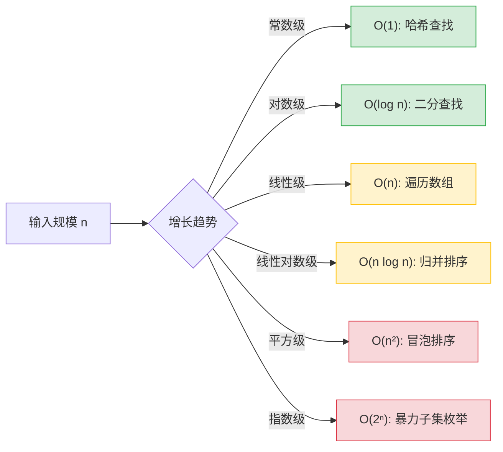
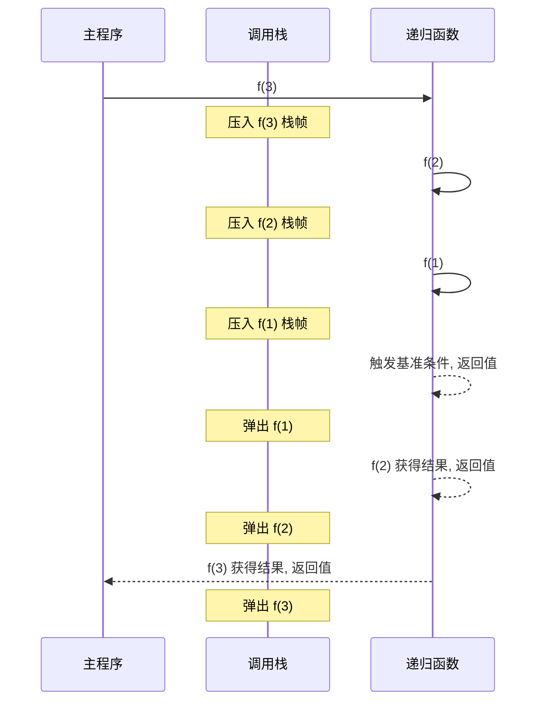
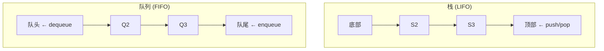
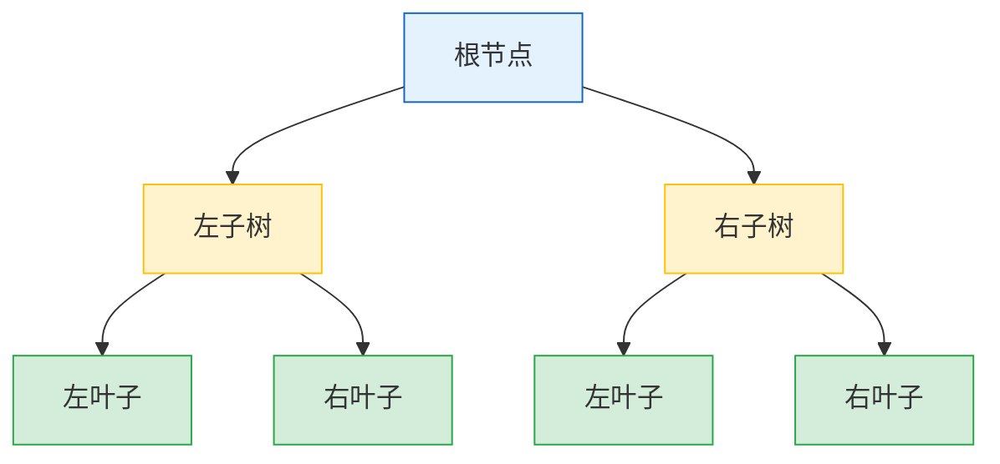
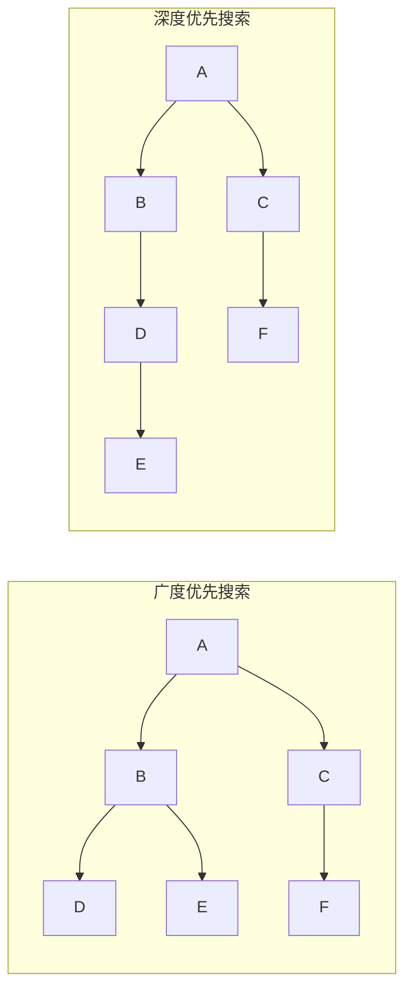
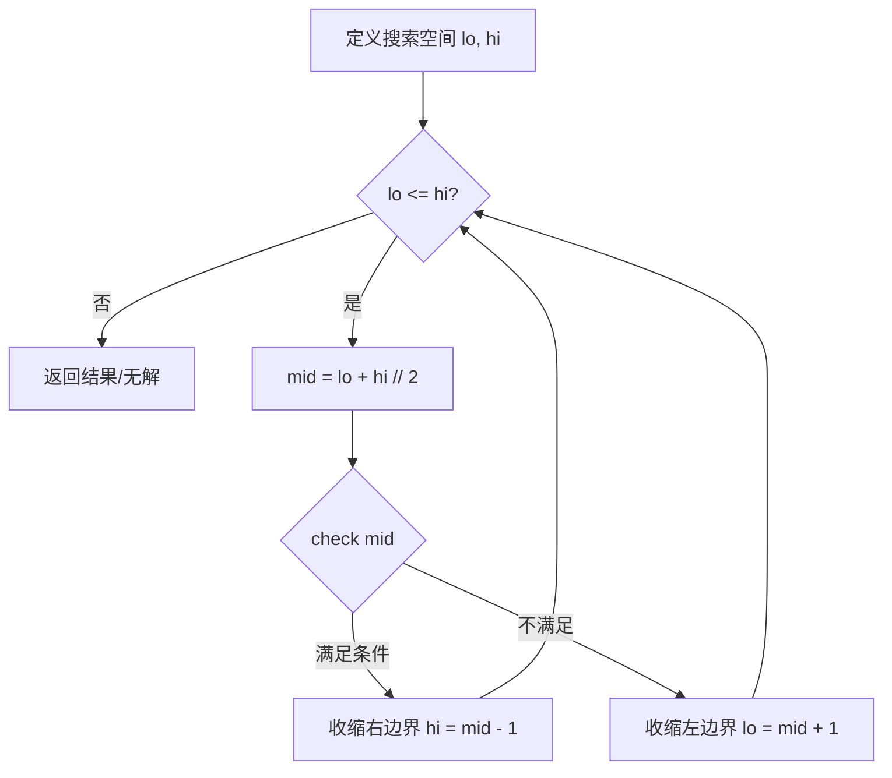
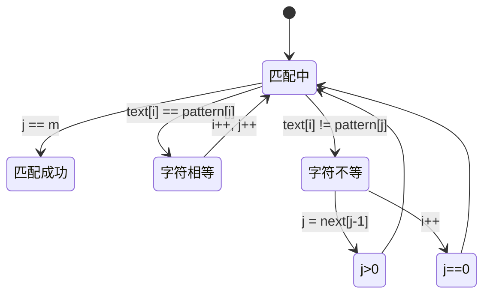
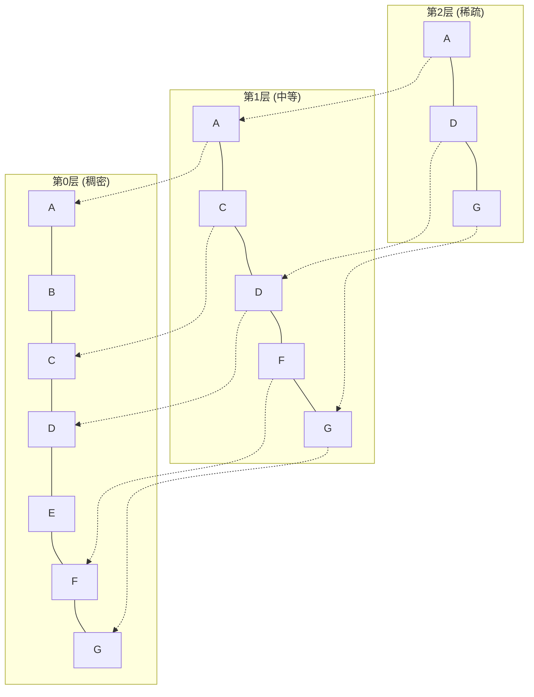

### 一、算法基石与线性结构

#### 1. 算法效率的度量衡：时间与空间复杂度

在深入具体数据结构之前，必须首先建立一套评估算法优劣的标准。这并非为了精确计算运行时间，而是为了洞察算法性能随数据规模增长的变化趋势。

##### 1.1 大O表示法（Big O Notation）



##### 1.2 常见复杂度速查与直觉理解

|复杂度|名称|典型场景|数据规模上限参考 (1秒内)|
|:--|:--|:--|:--|
||常数|数组索引访问、哈希表读写|任意规模|
||对数|二分查找、平衡树操作||
||线性|单次遍历、双指针||
||线性对数|高效排序、堆构建||
||平方|简单排序、DP预处理||
||指数|组合搜索、未优化的递归||

> **📚 背景补充：最好、最坏与平均情况**  
> 仅关注最坏情况有时过于悲观。例如快速排序最坏为 $O(n^2)$，但平均为 $O(n \log n)$。在系统设计中，若最坏情况不可接受（如实时系统），则需选择有严格上界保证的算法；若追求吞吐且能容忍偶发抖动，则可优先考虑平均性能优异的算法。

#### 2. 递归：自我调用的艺术

递归是贯穿整个数据结构与算法体系的核心思想，也是理解树、图、分治、动态规划的必要前置技能。

##### 2.1 递归的本质模型

递归并非简单的“函数调用自己”，其底层依赖于**调用栈（Call Stack）** 这一内存结构。每一次递归调用都会在栈上压入一个新的栈帧，保存当前函数的局部变量、参数和返回地址。



##### 2.2 编写正确递归的两个铁律

1. **基准条件（Base Case）**：必须存在至少一个不再递归调用的终止分支，否则将导致栈溢出（Stack Overflow）。
2. **收敛性（Convergence）**：每次递归调用都必须使问题规模向基准条件靠近，确保递归必然终止。

> **💡 概念解析：递归 vs 迭代**  
> 递归代码通常更简洁、更接近问题的数学定义，但存在函数调用开销和栈空间限制。迭代（循环）效率更高，但代码可能更复杂。在实际工程中，对于深度可控的问题优先使用递归以提升可读性；对于深度可能极大的场景，应考虑改写为迭代或使用尾递归优化（若语言支持）。

##### 2.3 递归的思维训练方法

不要试图在脑中展开每一层递归调用，人脑不擅长模拟栈。正确的思维方式是：

1. **信任假设**：假设 `f(n-1)` 已经正确返回了结果。
2. **专注当前层**：只思考如何利用 `f(n-1)` 的结果来构造 `f(n)` 的答案。
3. **验证基准**：手动验证最小规模输入是否正确。

#### 3. 线性数据结构：数据的有序组织

线性结构是最基础的数据组织形式，元素之间存在一对一的前后关系。不同的线性结构通过限制访问方式来适配不同的应用场景。

##### 3.1 数组与链表：连续与离散的权衡

|特性|数组（Array）|链表（Linked List）|
|:--|:--|:--|
|内存布局|连续分配|离散节点 + 指针链接|
|随机访问|||
|头部插入/删除|||
|尾部插入||$O(1)$（若有尾指针）|
|缓存友好度|高（空间局部性）✅|低（指针跳转导致缓存未命中）❌|
|适用场景|频繁读取、固定大小|频繁增删、动态大小|

> **📚 背景补充：缓存局部性原理**  
> 现代CPU通过多级缓存弥补内存访问延迟。数组的连续内存布局使得一次缓存行加载可预取多个相邻元素，极大减少缓存未命中。链表节点分散在堆内存中，遍历时频繁触发缓存未命中，实际性能差距远大于理论复杂度所暗示的倍数。这也是为何在许多高性能场景中，即使需要频繁插入，仍倾向于使用数组+移动而非链表的原因。

##### 3.2 栈与队列：受限的访问接口

栈和队列并非新的存储结构，而是对数组或链表的**访问约束**。这种约束恰恰是其价值所在——通过限制自由度来保证操作的语义正确性。

- **栈（Stack）**：后进先出（LIFO）。核心隐喻是“叠盘子”。
    - 典型应用：函数调用栈、表达式求值、括号匹配、浏览器前进后退、DFS。
- **队列（Queue）**：先进先出（FIFO）。核心隐喻是“排队买票”。
    - 典型应用：BFS、消息缓冲、任务调度、滑动窗口。



##### 3.3 哈希表：以空间换时间的极致

- **核心机制**：通过哈希函数将键（Key）映射到数组下标，直接定位存储位置。
- **冲突解决**：
    - **链地址法**：每个桶维护一个链表（或红黑树），冲突元素追加到链表中。Java HashMap、Python dict 采用此法。
    - **开放寻址法**：冲突时按某种探测序列寻找下一个空槽。Go map、C++ unordered_map 采用此法。

### 二、非线性结构与层次化思维

线性结构解决了数据的顺序存储与访问问题，但现实世界中的关系往往是层级化或网状的。树与图作为非线性数据结构，是理解文件系统、数据库索引、社交网络、知识图谱以及大模型中注意力机制的底层基石。本阶段的核心目标是完成从“线性序列”到“拓扑关系”的思维跃迁。

#### 1. 树：层级关系的抽象表达

树是一种递归定义的嵌套结构，由节点与边组成，任意两个节点之间有且仅有一条路径。这种无环连通性使其成为表达层级、分类与决策过程的自然载体。

##### 1.1 二叉树及其遍历范式

二叉树是每个节点最多拥有两个子节点的树结构。尽管形态简单，它却是所有高级树结构的理论基础。掌握二叉树的关键不在于存储，而在于**遍历顺序所承载的语义**。



|遍历方式|访问顺序|核心语义与应用场景|
|:--|:--|:--|
|前序遍历|根 → 左 → 右|**序列化/复制树**：先处理父节点再处理子节点，适合构建树结构|
|中序遍历|左 → 根 → 右|**有序输出**：对BST进行中序遍历得到升序序列，是验证BST性质的标准方法|
|后序遍历|左 → 右 → 根|**自底向上计算**：子节点结果汇总到父节点，适用于目录大小统计、表达式求值、内存释放|
|层序遍历|逐层从左到右|**最短路径/BFS**：按距离根节点的层级访问，用于无权图最短路、树的宽度计算|

> **💡 概念解析：遍历顺序为何如此重要？**  
> 遍历顺序本质上定义了“信息流动的方向”。前序是**自顶向下**传递上下文（如继承属性），后序是**自底向上**聚合结果（如综合属性），中序则是**局部有序性**的体现。在编译器设计、AST处理、动态规划树形DP等场景中，选择正确的遍历顺序直接决定了算法的正确性与简洁性。不要机械记忆代码模板，而应根据问题的信息依赖方向来选择遍历策略。

##### 1.2 二叉搜索树与平衡性危机

二叉搜索树（BST）通过“左子树所有键 < 根 < 右子树所有键”的有序约束，将查找、插入、删除的平均复杂度降至 $O(\log n)$。然而，这一性能保证高度依赖于树的**平衡性**。

- **退化风险**：当数据按有序或近似有序方式插入时，BST退化为链表，操作复杂度恶化至 $O(n)$。
- **平衡的定义**：一棵树是平衡的，当且仅当任意节点的左右子树高度差不超过某个常数（通常为1）。平衡保证了树高始终为 $O(\log n)$。

##### 1.3 AVL树与红黑树：两种平衡哲学

|特性|AVL树|红黑树|
|:--|:--|:--|
|平衡严格度|严格平衡（高度差 ≤ 1）|近似平衡（最长路径 ≤ 2×最短路径）|
|查找性能|更优（树更矮）✅|略逊|
|插入/删除性能|旋转频繁 ❌|旋转较少 ✅|
|适用场景|读多写少（静态索引、字典）|读写均衡（语言标准库、内核调度）|
|实现复杂度|较高|中等|

> **💡 概念解析：红黑树的五条性质如何保证平衡？**  
> 红黑树通过颜色约束间接控制高度：①节点非红即黑；②根为黑；③叶子NIL为黑；④红节点的子节点必为黑（无连续红）；⑤任一节点到其所有后代叶子的黑色节点数相同（黑高一致）。性质④和⑤共同保证了最长路径不超过最短路径的两倍。相比AVL直接维护高度差，红黑树用更宽松的约束换取了更少的结构调整次数，这是一种典型的**工程权衡**。

#### 2. 堆：优先级的高效管理

堆是一种特殊的完全二叉树，满足**堆序性质**：最大堆中父节点 ≥ 子节点，最小堆中父节点 ≤ 子节点。堆不关心全局有序，只保证极值在根节点，这使其成为优先级队列的最优实现。

##### 2.1 堆的核心操作与数组表示

由于堆是完全二叉树，可以用数组紧凑存储而无需指针。对于下标为 `i` 的节点：

- 父节点：`(i - 1) / 2`
- 左子节点：`2 * i + 1`
- 右子节点：`2 * i + 2`

|操作|时间复杂度|关键动作|
|:--|:--|:--|
|获取极值||直接返回根节点|
|插入||追加到末尾 + 上浮调整|
|删除极值||末尾元素覆盖根 + 下沉调整|
|建堆||自底向上批量下沉（非逐个插入！）|

> **💡 概念解析：建堆为何是 O(n) 而非 O(n log n)？**  
> 直觉上，n个元素逐个插入似乎是 $O(n \log n)$。但自底向上建堆利用了“底层节点多但下沉距离短，顶层节点少但下沉距离长”的特性。数学推导表明总比较次数为 $\sum_{h=0}^{\log n} \frac{n}{2^{h+1}} \cdot h = O(n)$。这一优化在实际工程中意义重大，例如Top-K问题中构建初始堆的开销可忽略不计。

##### 2.2 堆的典型应用场景

- **Top-K问题**：维护大小为K的最小堆，流式处理海量数据中的前K大元素，空间 $O(K)$，时间 $O(N \log K)$。
- **Dijkstra/A*算法**：作为优先队列高效选取当前最短距离节点。
- **定时器管理**：操作系统内核与事件循环中使用最小堆管理超时任务。
- **外部排序**：多路归并时使用堆选择当前最小记录。

#### 3. 图论基础：网状关系的建模与探索

图是最通用的非线性结构，由顶点集V和边集E组成。树是图的特例（无环连通图），而图能表达更复杂的关联：社交关系、网页链接、交通网络、依赖关系、知识图谱等。

##### 3.1 图的表示方法选择

|表示法|空间复杂度|邻接查询|遍历邻居|适用场景|
|:--|:--|:--|:--|:--|
|邻接矩阵||||稠密图、Floyd算法、小图|
|邻接表||||稀疏图、BFS/DFS、大规模图|

##### 3.2 图的遍历：BFS与DFS的语义差异



|维度|BFS|DFS|
|:--|:--|:--|
|数据结构|队列|栈（显式或调用栈）|
|探索模式|逐层扩散，像水波|一条路走到黑，回溯再换路|
|最短路径|无权图最短路径 ✅|不保证最短|
|连通性检测|可达性|可达性 + 环检测 + 拓扑排序|
|空间消耗|$O(W)$，W为最大层宽|$O(H)$，H为最大深度|
|典型应用|社交推荐、迷宫最短路、层序遍历|依赖解析、环检测、连通分量、回溯搜索|

> **💡 概念解析：何时选BFS，何时选DFS？**  
> 核心判断依据是**解的位置特征**。若目标大概率离起点近，或需要最短路径，选BFS；若解可能在深处，或需要枚举所有方案、检测全局结构（环、强连通分量），选DFS。在大模型相关的知识图谱检索中，BFS常用于多跳推理的逐层扩展，DFS则用于路径挖掘与子图匹配。

##### 3.3 最短路径与最小生成树初探

- **Dijkstra算法**：贪心策略求解单源非负权最短路径。核心思想是每次从未确定节点中选取距离最小者，松弛其邻居。配合优先队列可达 $O((V+E)\log V)$。
- **最小生成树（MST）**：连接所有顶点的边权和最小的树。Kruskal（按边排序+并查集）与Prim（类似Dijkstra的点扩展）是两大经典算法。MST在网络设计、聚类分析中有广泛应用。

> **📚 背景补充：负权边为何使Dijkstra失效？**  
> Dijkstra的贪心假设“已确定最短路的节点不会再被更新”依赖于非负权。负权边可能导致经由未确定节点的路径反而更短，破坏贪心的正确性。此时需使用Bellman-Ford（$O(VE)$）或SPFA。在大模型应用中，若将相似度转换为距离，需注意度量函数是否满足非负性，否则相关检索算法可能产生错误结果。

### 三、经典算法策略与问题求解

掌握了数据结构这一“容器”后，本阶段将聚焦于“如何使用容器解决问题”。算法策略是连接现实问题与代码实现的桥梁。不同的策略代表了不同的思维范式：分治是拆解，贪心是局部最优，动态规划是状态记忆，回溯是系统性试错。理解这些策略的适用边界与内在联系，比背诵具体算法模板更为关键。

#### 1. 排序与查找：算法设计的微缩实验室

排序和查找不仅是基础操作，更是各种算法设计思想的集中演练场。几乎所有高级策略都能在这两类问题中找到原型。

##### 1.1 排序算法的策略谱系

|算法|时间（平均/最坏）|空间|稳定性|核心策略|适用场景|
|:--|:--|:--|:--|:--|:--|
|冒泡/插入|||✅ 稳定|相邻比较交换|小规模、近乎有序数据|
|归并排序|||✅ 稳定|分治法|外部排序、链表排序、需要稳定性|
|快速排序|||❌ 不稳定|分治+分区|内存排序首选、缓存友好|
|堆排序|||❌ 不稳定|堆结构|内存受限、Top-K预处理|
|计数/基数|||✅ 稳定|非比较排序|整数/字符串、值域有限|

> **💡 概念解析：稳定性为何重要？**  
> 排序稳定性指相等元素在排序后保持原有相对顺序。这在多关键字排序中至关重要：例如先按成绩排序，再按姓名排序时，若第二次排序不稳定，相同姓名的学生成绩顺序会被打乱。在大模型数据处理中，对文档块按相关性排序后再按时间戳二次排序时，稳定性保证了相同时间戳的文档仍按相关性排列。

##### 1.2 二分查找：不止于有序数组

二分查找的本质是在**单调搜索空间**中每次排除一半候选解。其应用远超数组查找：

- **答案二分**：当直接求解困难但验证容易时，二分枚举答案并验证可行性（如“最小化最大值”问题）。
- **实数二分**：在连续空间中逼近最优解，需注意精度控制与终止条件。
- **旋转数组/峰值查找**：在非全局有序但局部有序的结构中定位目标。



> **📚 背景补充：二分的陷阱与防御**  
> `mid = (lo + hi) / 2` 在语言中可能整数溢出，应写作 `lo + (hi - lo) / 2`。循环不变式的选择（闭区间 `[lo, hi]` vs 半开区间 `[lo, hi)`）直接影响边界更新逻辑与终止条件。建议固定使用一种风格并形成肌肉记忆，而非每次重新推导。

#### 2. 分治法：分解、解决、合并

分治法是递归思想的系统化应用，适用于子问题独立且可合并的场景。其三步范式为：

1. **分解**：将原问题划分为若干规模更小的子问题。
2. **解决**：递归求解子问题（基准条件直接返回）。
3. **合并**：将子问题的解组合为原问题的解。

##### 2.1 分治的经典案例

- **归并排序**：分解为两半 → 递归排序 → 合并两个有序序列。合并步骤是核心。
- **快速排序**：选取pivot分区 → 递归排序左右分区 → 无需显式合并（原地分区即完成归位）。

- **最近点对问题**：利用几何性质在合并步骤中仅检查常数个候选点，避免暴力 $O(n^2)$。

> **💡 概念解析：分治 vs 动态规划**  
> 两者都分解子问题，关键区别在于**子问题是否重叠**。分治的子问题相互独立，各自求解一次；DP的子问题高度重叠，需记忆化避免重复计算。若画出递归调用树，分治是满二叉树，DP则是大量节点共享的DAG。判断标准：若发现相同参数的递归调用反复出现，就应考虑DP。

#### 3. 动态规划：重叠子问题的最优记忆

动态规划是解决最优化问题的核心框架，其本质是将指数级递归转化为多项式级迭代，代价是额外的存储空间。

##### 3.1 DP的四要素

1. **状态定义**：明确 `dp[i][j]` 代表什么含义。状态设计决定了转移方程的形式与复杂度。
2. **转移方程**：描述状态之间的递推关系，是DP的灵魂。
3. **初始条件**：基准状态的取值，对应递归的Base Case。
4. **计算顺序**：确保计算当前状态时，所依赖的前置状态已被计算。

##### 3.2 常见DP模型速览

|模型|状态定义示例|转移特征|典型问题|
|:--|:--|:--|:--|
|线性DP|`dp[i]`: 以i结尾的最优解|从前i-1个状态转移|LIS、最大子段和|
|背包DP|`dp[i][w]`: 前i件物品容量w的最优值|选或不选第i件|0/1背包、完全背包|
|区间DP|`dp[l][r]`: 区间[l,r]的最优解|枚举分割点k合并|矩阵链乘、石子合并|
|树形DP|`dp[u][0/1]`: 节点u选/不选的最优解|子节点向父节点聚合|树上独立集、重心的|
|状态压缩DP|`dp[S][i]`: 状态集合S下以i结尾|位运算枚举子集|TSP、铺砖问题|

> **💡 概念解析：自顶向下 vs 自底向上**  
> 自顶向下（记忆化搜索）保留递归结构，仅缓存已计算结果，代码更接近数学定义，且只计算实际到达的状态。自底向上（递推表）用循环填表，常数更小，可优化空间（滚动数组）。实践中建议先用记忆化搜索验证正确性，再根据需要改写为递推形式。在大模型的序列标注、解码束搜索等场景中，DP思想无处不在。

##### 3.3 状态设计的艺术

好的状态设计应满足：

- **完备性**：包含做出决策所需的全部信息。
- **无后效性**：未来决策只依赖当前状态值，不依赖到达该状态的路径。
- **紧凑性**：维度尽可能少，每维范围尽可能小。

> **📚 背景补充：如何培养DP直觉？**  
> DP没有万能模板，但有训练路径：①先从经典模型入手建立模式识别能力；②遇到新问题时尝试写出暴力递归，观察哪些参数重复出现；③刻意练习状态定义的多种可能性，比较优劣；④阅读题解时重点关注“为什么这样定义状态”而非“转移方程是什么”。DP能力的提升是量变到质变的过程，初期痛苦是正常的。

#### 4. 贪心算法：局部最优的全局赌注

贪心策略在每一步都做出当前看起来最好的选择，期望最终得到全局最优解。它高效但危险——并非所有问题都具有贪心选择性。

##### 4.1 贪心的适用条件

贪心正确的充要条件是问题同时满足：

- **贪心选择性质**：全局最优解可以通过一系列局部最优选择达到。
- **最优子结构**：子问题的最优解能构成原问题的最优解。

> **💡 概念解析：如何验证贪心的正确性？**  
> 常用方法包括：①**交换论证**：假设存在更优解，通过交换操作证明贪心解不差于它；②**反证法**：假设贪心选择不在某个最优解中，导出矛盾；③**拟阵理论**：提供严格的数学框架（较高级）。在实践中，若无法严格证明，应构造反例测试或回退到DP。

##### 4.2 经典贪心问题

- **活动选择**：按结束时间排序，每次选最早结束且不与已选冲突的活动。
- **Huffman编码**：每次合并频率最小的两棵树，构建最优前缀码。
- **Dijkstra算法**：每次选取距离最小的未确定节点（依赖非负权保证贪心正确）。
- **分数背包**：按单位价值降序选取（0/1背包不可贪心！）。

#### 5. 回溯法：系统化的穷举与剪枝

回溯是DFS在搜索问题中的应用，用于枚举所有可行解或寻找满足约束的解。其核心价值在于**剪枝**——提前排除不可能产生有效解的分支，将指数级搜索降至可接受范围。

##### 5.1 回溯框架

```python
def backtrack(path, choices):
    if 满足结束条件:
        收集path的副本
        return
    for choice in choices:
        if 剪枝条件: continue      # 关键优化点
        做选择(path.append(choice))
        backtrack(path, choices)
        撤销选择(path.pop())        # 恢复现场
```

##### 5.2 剪枝策略

- **约束剪枝**：违反问题硬性约束立即返回（如N皇后同行同列冲突）。
- **最优性剪枝**：当前路径已不可能优于已知最优解时放弃（如搜索最短路径时超过当前最优长度）。
- **对称性剪枝**：避免搜索等价的解空间区域（如组合问题中强制升序选取）。
- **记忆化剪枝**：记录已访问的状态，避免重复搜索（与DP融合）。

> **📚 背景补充：回溯与大模型生成**  
> 大模型的文本生成本质上是在token空间中进行搜索。贪婪解码是纯贪心，Beam Search是带回溯限制的BFS，而Self-Consistency等方法则引入了采样+投票的回溯思想。理解传统回溯算法有助于深入理解LLM解码策略的设计动机与局限性。

### 四、进阶优化与大模型应用衔接

在掌握了基础数据结构与经典算法策略后，本阶段将视野从“教科书级问题”拓展至“工业级系统”与“AI前沿技术”。传统算法并未因大模型的兴起而过时，相反，它们以更隐蔽、更关键的方式支撑着现代AI基础设施。理解这些进阶内容，是打通算法理论与大模型工程实践的最后一公里。

#### 1. 字符串匹配：文本处理的底层引擎

字符串是自然语言处理的基本单元。高效的字符串匹配算法不仅是搜索引擎的核心，也是大模型分词器（Tokenizer）、数据清洗管线与RAG检索系统的性能基石。

##### 1.1 KMP算法：失配函数的精妙设计



##### 1.2 Aho-Corasick自动机：多模式匹配的终极方案

> **📚 背景补充：AC自动机在大模型数据管线中的应用**  
> 大规模预训练数据的清洗常涉及数百万条去重规则、隐私正则与质量过滤关键词。AC自动机将这些规则编译为单一状态机，使清洗吞吐量提升数个数量级。此外，字节级BPE分词器的训练过程中，高频子串的统计也依赖高效的多模式匹配。

#### 2. 高级数据结构：工业级存储的支柱

教科书中的BST和哈希表在面对磁盘IO、海量写入、范围查询等现实约束时往往力不从心。以下结构是数据库、搜索引擎与大模型向量存储的实际选择。

##### 2.1 B+树：磁盘友好的索引之王

B+树是B树的变体，专为块存储设备优化：

- **矮胖结构**：高扇出（每个节点包含数百至上千个键）使树高通常不超过4层，极大减少磁盘IO次数。
- **数据仅存于叶子**：内部节点只存索引键，最大化扇出；叶子节点通过链表连接，支持高效范围扫描。
- **顺序IO友好**：叶子节点的物理相邻性使范围查询转化为顺序读，充分利用磁盘预读机制。

##### 2.2 LSM-Tree：写密集型场景的利器

LSM-Tree（Log-Structured Merge-Tree）牺牲读性能换取极致写入吞吐，是Cassandra、RocksDB、TiKV等系统的核心：

- **批量刷盘**：MemTable满后整体flush为磁盘上的有序文件（SSTable），将随机写转化为顺序写。
- **后台合并（Compaction）**：异步合并多层SSTable，消除冗余、维持读性能。

> **📚 背景补充：LSM-Tree与大模型训练检查点**  
> 大模型训练中频繁的Checkpoint保存本质上是大规模顺序写入。许多分布式训练框架的元数据存储与实验追踪系统底层采用LSM-Tree，因其写入吞吐远高于B+树。此外，向量数据库（如Milvus）的增量索引也借鉴了LSM思想，平衡实时写入与查询延迟。

#### 3. 向量检索：连接传统算法与大模型的桥梁

大模型将语义编码为高维向量，而向量检索则是让模型“记住”外部知识的关键技术。这一领域深度融合了传统算法与现代近似方法。

##### 3.1 精确搜索的瓶颈与ANN的必要性

##### 3.2 主流ANN算法对比

|算法|核心思想|构建开销|查询速度|内存占用|适用场景|
|:--|:--|:--|:--|:--|:--|
|HNSW|多层可导航小世界图|高|极快 ✅|高（存图边）|高性能在线检索|
|IVF|倒排索引+聚类量化|中|快|低|大规模离线/混合检索|
|ScaNN|各向异性向量量化|中|快|极低|超大规模、内存敏感|
|DiskANN|SSD感知的图索引|极高|中等|极低（数据驻盘）|单机十亿级、成本敏感|

> **💡 概念解析：HNSW为何成为事实标准？**  
> HNSW结合了跳表的层级结构与NSW图的贪心导航特性。高层稀疏图提供快速粗定位，低层稠密图保证精细召回。其优势在于：①纯内存操作，无IO瓶颈；②构建可并行化；③参数（M、efConstruction、efSearch）提供灵活的速度-召回率权衡。缺点是内存占用随数据量线性增长，这也是DiskANN等磁盘索引兴起的动因。



##### 3.3 向量检索与传统算法的血脉联系

ANN并非凭空诞生，而是经典算法在高维空间的适应性演化：

- **HNSW ↔ 跳表 + 贪心搜索**：层级结构继承自跳表，导航策略源自Dijkstra的贪心思想。
- **IVF ↔ 倒排索引 + K-Means**：聚类划分空间对应倒排列表，量化压缩对应词项编码。
- **PQ量化 ↔ 信息论编码**：将高维向量拆分子空间并独立量化，本质是有损压缩的率失真优化。

> **📚 背景补充：RAG系统中的算法选型实践**  
> 构建RAG系统时，向量检索只是起点。实际部署需综合考虑：①数据规模决定索引类型（百万级HNSW，十亿级DiskANN/IVF）；②更新频率决定是否需要支持增量索引；③精度要求决定是否引入重排序（Cross-Encoder）作为第二阶段；④成本约束决定是否使用量化或磁盘索引。算法选择永远是业务需求、硬件条件与工程复杂度的三角权衡，不存在银弹。

#### 4. 算法思维的迁移：从解题到系统设计

学习数据结构与算法的终极目标不是通过面试，而是培养一种**结构化解决问题的能力**。这种能力在大模型时代尤为珍贵：

- **复杂度意识**：评估Prompt工程、微调数据管线、推理服务的资源消耗时，本能地思考时间与空间的增长趋势。
- **抽象建模**：将模糊的业务需求（如“智能客服”）分解为可计算的子问题（意图分类→知识检索→生成→校验），并为每个环节选择合适的数据结构与算法。
- **权衡思维**：理解没有完美方案，只有适配场景的取舍。在准确率、延迟、成本、可维护性之间做出有理有据的决策。
- **调试直觉**：当系统表现异常时，能从算法层面定位根因（如哈希冲突导致缓存击穿、不平衡树导致查询超时、贪心策略陷入局部最优），而非盲目调参。

> **💡 结语：算法是大模型时代的隐形骨架**  
> 大模型看似颠覆了传统编程范式，但其训练、部署、应用的每一环都深深扎根于经典算法土壤。Transformer的注意力机制是动态规划的变体，RLHF的PPO算法依赖堆与优先队列，RAG检索是图搜索与量化的融合，甚至模型本身的压缩与加速也离不开矩阵分解与稀疏化算法。掌握这些基础，你看到的不再是一个黑盒，而是一个由精妙算法编织而成的、可理解、可优化、可信赖的智能系统。

### 五、练习

理论学习与工程实践之间存在一道鸿沟，唯有通过刻意练习才能跨越。本阶段习题设计遵循“概念验证→代码实现→系统分析→开放探究”的递进逻辑，覆盖前四个阶段的核心知识点。每道题均附带设计意图与思考指引，旨在引导深度反思而非机械刷题。建议配合AI伴读模式使用：先独立完成，再与AI讨论解题思路、代码优化与延伸问题。

#### 1. 基础概念与复杂度分析

##### 1.1 复杂度推导实战

给定以下三段伪代码，分别分析其时间复杂度与空间复杂度，并给出严谨的推导过程（非直觉猜测）。

```text
// 代码A
for i = 1 to n:
    for j = 1 to i:
        k = 1
        while k <= n:
            k = k * 2
            do_something()

// 代码B
function f(n):
    if n <= 1: return 1
    return f(n-1) + f(n-1)

// 代码C
for i = 0 to n-1:
    for j = 0 to n-1:
        if i == j: continue
        matrix[i][j] = matrix[i][j-1] + matrix[i-1][j]
```

> **🎯 设计意图**：检验对嵌套循环、递归展开、条件分支下复杂度分析的精确性。代码A考察内外层变量耦合与对数级内层循环的组合；代码B暴露朴素递归的指数爆炸本质；代码C测试对稀疏计算与稠密计算的区分能力。
> 
> **💡 思考指引**：不要仅给出大O结果，尝试写出精确的操作次数表达式再化简。对于代码B，画出递归树并计算节点总数；思考如何通过记忆化将其优化至何种复杂度，空间代价是什么。

> [!success]- 点击展开题解
> 
> ## 📚 复杂度分析实战题解
> 
> 本解析针对三段经典伪代码进行严谨的复杂度推导。我们不仅给出大 $O$ 结果，更侧重于展示**如何从操作次数表达式推导出渐近复杂度**的过程，帮助读者建立扎实的分析直觉。
> 
> ---
> 
> ### 1. 代码 A：嵌套循环与对数级内层
> 
> ```text
> for i = 1 to n:
>     for j = 1 to i:
>         k = 1
>         while k <= n:
>             k = k * 2
>             do_something()
> ```
> 
> #### ⏱️ 时间复杂度推导
> 
> **核心观察**：最内层 `while` 循环的执行次数**仅取决于 $n$**，与外层变量 $i, j$ 无关。
> 
> 1. **分析最内层循环**：  
>     变量 $k$ 从 1 开始，每次乘以 2，直到超过 $n$。这是一个典型的对数级循环。  
>     设执行次数为 $T_{inner}$，则满足 $2^{T_{inner}} > n$，即：  
>     $$ T_{inner} = \lfloor \log_2 n \rfloor + 1 = \Theta(\log n) $$
>     
> 2. **分析中间层循环**：  
>     对于固定的 $i$，`j` 从 1 遍历到 $i$，执行 $i$ 次。每次执行都触发上述 $\Theta(\log n)$ 的操作。  
>     因此，当外层变量为 $i$ 时，操作次数为：$i \cdot \Theta(\log n)$
>     
> 3. **分析最外层循环并求和**：  
>     $i$ 从 1 遍历到 $n$，总操作次数 $T(n)$ 为：  
>     $$ T(n) = \sum_{i=1}^{n} \left( i \cdot (\lfloor \log_2 n \rfloor + 1) \right) $$  
>     由于 $(\lfloor \log_2 n \rfloor + 1)$ 是相对于求和变量 $i$ 的常数因子，可以提取：  
>     $$ T(n) = (\lfloor \log_2 n \rfloor + 1) \cdot \sum_{i=1}^{n} i = (\lfloor \log_2 n \rfloor + 1) \cdot \frac{n(n+1)}{2} $$
>     
> 4. **化简得渐近复杂度**：  
>     $$ T(n) = \Theta(n^2 \log n) $$
>     
> 
> #### 💾 空间复杂度
> 
> - 仅使用了固定数量的辅助变量 ($i, j, k$)。
> - **空间复杂度：$O(1)$**
> 
> > [!tip] 💡 易错点提示  
> > 很多初学者看到三层嵌套就直觉判断为 $O(n^3)$ 或 $O(n^2)$。**关键在于识别内层循环是否与外层变量耦合**。本题中 `while k <= n` 的边界是全局的 $n$ 而非局部的 $i$ 或 $j$，这是解题的关键突破口。
> 
> ---
> 
> ### 2. 代码 B：朴素递归的指数爆炸
> 
> ```text
> function f(n):
>     if n <= 1: return 1
>     return f(n-1) + f(n-1)
> ```
> 
> #### ⏱️ 时间复杂度推导（递归树法）
> 
> 这不是斐波那契数列（那是 `f(n-1) + f(n-2)`），而是**完全二叉递归树**。
> 
> 1. **构建递归树**：  
>     每个节点产生 **2个** 子节点，问题规模减 1。
> 
> ```mermaid
> graph TD
>     A["f(n)"] --> B["f(n-1)"]
>     A --> C["f(n-1)"]
>     B --> D["f(n-2)"]
>     B --> E["f(n-2)"]
>     C --> F["f(n-2)"]
>     C --> G["f(n-2)"]
>     D --> H["..."]
>     E --> I["..."]
>     F --> J["..."]
>     G --> K["..."]
>     style A fill:#e1f5fe
>     style H fill:#fff9c4
>     style I fill:#fff9c4
>     style J fill:#fff9c4
>     style K fill:#fff9c4
> ```
> 
> 2. **计算节点总数**：
>     
>     - 树的深度为 $n$（从 $n$ 递减到基准情形 $n \leq 1$）
>     - 第 $d$ 层（根为第0层）有 $2^d$ 个节点
>     - 叶子节点位于第 $n-1$ 层（对应 $f(1)$），共 $2^{n-1}$ 个
>     
>     总节点数（即总函数调用次数）：  
>     $$ T(n) = \sum_{d=0}^{n-1} 2^d = 2^n - 1 $$
>     
> 3. **精确表达式与渐近复杂度**：  
>     $$ T(n) = 2^n - 1 = \Theta(2^n) $$
>     
> 
> #### 💾 空间复杂度
> 
> - 递归调用栈的最大深度等于递归树的高度。
> - **空间复杂度：$O(n)$**
> 
> #### 🔧 记忆化优化分析
> 
> |维度|朴素递归|记忆化后|
> |:--|:--|:--|
> |时间复杂度|$\Theta(2^n)$|$\Theta(n)$|
> |空间复杂度|$O(n)$ (栈)|$O(n)$ (栈 + 缓存表)|
> |本质变化|大量重复子问题被反复计算|每个子问题只算一次，查表 $O(1)$|
> 
> > [!note] 🧠 为什么记忆化能降到 $O(n)$？  
> > 虽然递归树有 $2^n$ 个节点，但**不同的子问题只有 $n$ 个**：$f(n), f(n-1), \dots, f(1)$。记忆化将"树形展开"压缩为"线性链式计算"，用 $O(n)$ 额外空间换取了指数级的时间提升。这正是**动态规划自顶向下实现**的核心思想。
> 
> ---
> 
> ### 3. 代码 C：条件分支下的稠密计算
> 
> ```text
> for i = 0 to n-1:
>     for j = 0 to n-1:
>         if i == j: continue
>         matrix[i][j] = matrix[i][j-1] + matrix[i-1][j]
> ```
> 
> #### ⏱️ 时间复杂度推导
> 
> **关键辨析**：`if i == j: continue` 是否改变了复杂度量级？
> 
> 1. **统计实际执行赋值的次数**：  
>     双重循环总共迭代 $n \times n = n^2$ 次。  
>     其中 `i == j` 的情况恰好有 $n$ 次（对角线元素）。  
>     因此实际执行赋值操作的次数为：  
>     $$ T(n) = n^2 - n $$
>     
> 2. **渐近分析**：  
>     $$ n^2 - n = \Theta(n^2) $$  
>     跳过 $n$ 次操作相对于 $n^2$ 总量而言是低阶项，**不改变主阶**。
>     
> 3. **关于 `continue` 本身的开销**：  
>     即使跳过了赋值，`if` 条件判断本身仍然在每次迭代中执行。所以从"CPU指令"角度看，循环体始终执行 $n^2$ 次判断，只是部分迭代的"有效工作量"较少。无论哪种计算口径，结果都是 $\Theta(n^2)$。
>     
> 
> #### 💾 空间复杂度
> 
> - `matrix` 是输入/输出数据结构，通常不计入额外空间。
> - 除循环变量外无额外分配。
> - **额外空间复杂度：$O(1)$**
> 
> > [!warning] ⚠️ "稀疏 vs 稠密"的思维陷阱  
> > 本题的设计意图是测试你是否会被 `continue` 误导而认为这是"稀疏计算"。真正的稀疏计算是指**有效操作数量级低于循环上界**（例如只在 $O(n)$ 个位置上做工作，却用了 $O(n^2)$ 的循环框架）。而此处跳过的仅是 $O(n)$ 量级，剩余 $O(n^2)$ 仍是稠密的。
> > 
> > **判别准则**：若跳过次数 $S(n)$ 满足 $\lim_{n\to\infty} \frac{S(n)}{n^2} = 0$，则 `continue` 不影响主阶复杂度。
> 
> ---
> 
> ### 📊 总结对比
> 
> |代码|时间复杂度|空间复杂度|核心考点|
> |:--|:--|:--|:--|
> |A|$\Theta(n^2 \log n)$|$O(1)$|内外层变量解耦 + 对数循环|
> |B|$\Theta(2^n)$|$O(n)$|完全二叉递归树 + 记忆化优化|
> |C|$\Theta(n^2)$|$O(1)$|条件跳过不改主阶 + 稠密判定|
> 
> > [!abstract] 🎯 方法论提炼
> > 
> > 1. **先写精确表达式，再取渐近**：避免凭感觉猜答案。
> > 2. **识别循环边界依赖关系**：内层边界是常量、外层变量还是全局 $n$，直接决定复杂度。
> > 3. **递归问题画树**：区分"分支因子"和"深度"，二者共同决定节点总数。
> > 4. **条件分支看比例**：只有被跳过的部分占总量的**非零常数比例以上**时，才可能改变主阶。

##### 1.2 最佳/最坏/平均情况辨析

快速排序在随机数据上平均 $O(n\log n)$，但在有序数据上退化为 $O(n^2)$。请回答：

1. 为何实际工程中仍广泛使用快排而非堆排序（严格 $O(n\log n)$）？
2. 列举至少三种缓解快排最坏情况的工程手段，并分析各自的代价。
3. 在什么场景下你会坚决放弃快排而选择堆排序或归并排序？

> **🎯 设计意图**：打破“复杂度越低越好”的思维定式，建立工程权衡意识。理解常数因子、缓存局部性、内存分配等隐性因素对实际性能的影响。
> 
> **💡 思考指引**：从CPU缓存行、分支预测、内存访问模式等底层机制解释快排的实测优势。工程手段可包括三数取中、随机pivot、小数组切换插入排序、尾递归优化等。场景判断需结合稳定性需求、内存限制、实时性要求等维度。

> [!success]- 点击展开题解
> 
> ## 📖 题解：快速排序的工程权衡与算法选择
> 
> 在算法理论中，我们习惯于用大 $O$ 符号来评判优劣。然而在实际工程中，**“理论最优”往往不等于“实测最快”**。本题旨在打破对时间复杂度的单一迷信，建立包含硬件特性、内存模型和业务约束在内的多维工程视角。
> 
> ---
> 
> ### 1. 为何实际工程中仍广泛使用快排而非堆排序？
> 
> 尽管堆排序（Heapsort）在最坏情况下也能保证 $O(n\log n)$，且是原地排序（In-place），但在绝大多数通用场景下，快速排序（Quicksort）的实测性能要优于堆排序 2~3 倍甚至更多。核心原因并非比较次数，而是**现代计算机体系结构下的隐性开销**。
> 
> #### 🔍 核心差异对比
> 
> |维度|快速排序 (Quicksort)|堆排序 (Heapsort)|工程影响|
> |:--|:--|:--|:--|
> |**内存访问模式**|顺序扫描（Sequential）|随机跳跃（Random/Strided）|快排充分利用 CPU Cache Line，命中率高|
> |**分支预测**|高度可预测（Partition 后一侧全小一侧全大）|难以预测（父子节点大小关系随机）|快排流水线停顿少，IPC 更高|
> |**常数因子**|内循环极简（仅比较+交换）|涉及多次索引计算、下沉操作|快排指令级并行度更好|
> |**缓存局部性**|⭐⭐⭐⭐⭐ 极佳|⭐⭐ 较差|数据规模越大，差距越明显|
> 
> #### 💡 关键概念解释
> 
> - **Cache Line（缓存行）**：CPU 从主存读取数据的最小单位（通常 64B）。快排的 Partition 过程是线性扫描数组，每次加载一个 Cache Line 就能处理多个元素；而堆排序在 `siftDown` 时，访问的是 `i → 2i → 4i...` 这种指数级跳跃的地址，极易导致 Cache Miss。当数据量超过 L2/L3 Cache 容量时，堆排序的性能会断崖式下跌。
> - **分支预测（Branch Prediction）**：现代 CPU 采用流水线执行。快排在 Partition 时，对于已选定的 pivot，大部分元素的比较结果呈现规律性（连续小于或连续大于），CPU 能准确预测分支走向；堆排序的父子比较结果几乎随机，频繁触发流水线冲刷（Pipeline Flush）。
> 
> ```mermaid
> graph LR
>     subgraph QS["快速排序 - 顺序访问"]
>         A1[Addr] --> A2[Addr+1] --> A3[Addr+2] --> A4[Addr+3]
>     end
>     subgraph HS["堆排序 - 跳跃访问"]
>         B1[Addr] --> B2[Addr*2] --> B3[Addr*4] --> B4[Addr*8]
>     end
>     style QS fill:#d4edda,stroke:#28a745
>     style HS fill:#f8d7da,stroke:#dc3545
> ```
> 
> > **📌 小结**：快排赢在“对硬件友好”。在大 $O$ 相同的前提下，**常数因子和缓存行为决定了实际运行时间**。这也是为什么 C++ STL 的 `std::sort`、Java 的 `Arrays.sort`（基本类型）底层都以快排为基石。
> 
> ---
> 
> ### 2. 缓解快排最坏情况的三种工程手段及代价分析
> 
> 快排的 $O(n^2)$ 退化源于 Pivot 选取不当导致的极度不平衡划分。以下是工业界常用的防御策略：
> 
> #### ① 三数取中法（Median-of-Three）
> 
> - **做法**：取首、尾、中间三个元素的中位数作为 Pivot。
> - **效果**：避免在有序/逆序数据上直接退化为 $O(n^2)$，使划分更均匀。
> - **代价**：每次 Partition 增加 3 次比较和可能的交换操作；对于特定构造的“杀手序列”（如 McIlroy 构造的数据），仍可被恶意触发最坏情况。
> 
> #### ② 随机化 Pivot（Randomized Pivot）
> 
> - **做法**：在当前区间内随机选择一个元素作为 Pivot。
> - **效果**：将最坏情况从“确定性输入”转化为“概率事件”，期望复杂度稳定为 $O(n\log n)$，不受输入分布影响。
> - **代价**：引入随机数生成器（RNG）开销。高质量 RNG 较慢，低质量 RNG 可能被预测攻击；在嵌入式等无良好熵源的环境中不适用。
> 
> #### ③ 小数组切换插入排序 + 尾递归优化
> 
> - **做法**：
>     - 当子数组长度 ≤ 阈值（通常 8~32）时，切换为插入排序。
>     - 对较长的分区使用循环代替递归，仅对较短分区递归。
> - **效果**：减少递归调用栈深度至 $O(\log n)$，避免栈溢出；利用插入排序在小规模数据上的低常数优势。
> - **代价**：增加了代码复杂度和调参成本（阈值需针对具体架构 benchmark）；并不能从根本上消除最坏情况的比较次数，只是降低了系统级风险。
> 
> ```mermaid
> flowchart TD
>     Start([开始排序]) --> CheckLen{len <= threshold?}
>     CheckLen -- Yes --> InsertionSort[插入排序]
>     CheckLen -- No --> SelectPivot[三数取中 / 随机Pivot]
>     SelectPivot --> Partition[Partition 划分]
>     Partition --> TailRec{尾递归优化}
>     TailRec --> LoopShort[循环处理短分区]
>     TailRec --> RecurseLong[递归处理长分区]
>     LoopShort --> End([结束])
>     RecurseLong --> End
>     InsertionSort --> End
>     style Start fill:#e2e3f1,stroke:#6c63ff
>     style End fill:#e2e3f1,stroke:#6c63ff
> ```
> 
> > **⚠️ 注意**：以上手段可以组合使用（如 Introsort = 快排 + 堆排兜底 + 插入排序），但没有任何单一手段能零成本地完全消除最坏情况。工程本质是**在可接受的成本下将风险降至足够低**。
> 
> ---
> 
> ### 3. 坚决放弃快排的场景
> 
> 尽管快排在通用场景称王，但在以下场景中应果断选择其他算法：
> 
> |场景|推荐算法|核心理由|
> |:--|:--|:--|
> |**要求稳定性**|归并排序 / TimSort|快排是不稳定排序。若需保持相等元素的原始相对顺序（如多关键字排序、数据库 ORDER BY），必须用归并系列。|
> |**硬实时系统**|堆排序|航空航天、医疗设备等不允许任何 $O(n^2)$ 的可能性。堆排序提供**严格的最坏情况上界保证**，满足 WCET（Worst-Case Execution Time）分析需求。|
> |**外部排序 / 海量数据**|归并排序|数据无法全部装入内存时，归并排序的顺序 I/O 模式天然适配磁盘/SSD 读写；快排的随机访问在外存上性能灾难级下降。|
> |**链表结构**|归并排序|链表不支持随机访问，快排的 Partition 效率极低；归并排序仅需指针操作，且无需额外空间（链表版可做到 $O(1)$ 辅助空间）。|
> |**近乎有序数据**|TimSort / 插入排序|自适应算法能在 $O(n)$ 时间内完成近乎有序数据的排序，快排即使有三数取中也难以达到此效率。|
> 
> #### 🧭 决策流程图
> 
> ```mermaid
> flowchart TD
>     Q1{需要稳定性?}
>     Q1 -- Yes --> Merge[归并排序 / TimSort]
>     Q1 -- No --> Q2{硬实时/WCET要求?}
>     Q2 -- Yes --> Heap[堆排序]
>     Q2 -- No --> Q3{数据在外存/链表?}
>     Q3 -- Yes --> Merge2[归并排序]
>     Q3 -- No --> Q4{数据近乎有序?}
>     Q4 -- Yes --> Adaptive[TimSort / 插入排序]
>     Q4 -- No --> Quick[✅ 快速排序]
>     style Quick fill:#d4edda,stroke:#28a745
>     style Heap fill:#fff3cd,stroke:#ffc107
>     style Merge fill:#cce5ff,stroke:#004085
>     style Merge2 fill:#cce5ff,stroke:#004085
>     style Adaptive fill:#e2e3f1,stroke:#6c63ff
> ```
> 
> ---
> 
> ### 🎯 总结：建立工程权衡意识
> 
> 1. **复杂度 ≠ 性能**：大 $O$ 描述的是增长趋势，隐藏了常数因子、缓存行为和硬件交互。在同等复杂度下，这些隐性因素才是胜负手。
> 2. **没有银弹**：每种优化都有代价。三数取中增加了比较次数，随机化引入了 RNG 开销，混合排序增加了代码复杂度。选择取决于你的约束条件。
> 3. **场景驱动选型**：脱离业务谈算法是空谈。稳定性、实时性、I/O 模式、数据结构形态都是比“平均复杂度”更重要的决策依据。
> 
> > **💬 写给读者**：面试中能答出“快排比堆排快因为缓存”是加分项；在生产环境中能根据数据特征和业务SLA正确选型，才是真正的工程能力。算法学习的终点不是背诵复杂度表，而是培养在约束条件下做出合理 trade-off 的直觉。

#### 2. 数据结构实现与调试

##### 2.1 手写LRU缓存

**约束条件**：

- 不得使用语言内置的OrderedDict/LRU Cache等高级封装。
- 必须自行实现双向链表与哈希表的组合。
- 处理边界情况：容量为0、重复put同一key、get不存在的key。

> **🎯 设计意图**：综合考察哈希表、双向链表、指针操作与API设计能力。LRU是操作系统、数据库、Web缓存的核心组件，也是面试高频题，但更重要的是理解其“以空间换时间”与“局部性原理”的设计哲学。
> 
> **💡 思考指引**：先画图明确节点移动逻辑，再写代码。注意哨兵节点的使用可大幅简化边界处理。完成后思考：若并发访问如何加锁？若需支持过期时间如何扩展？若容量极大导致哈希表内存过高，有哪些替代方案？

> [!success]- 点击展开题解
> 
> ## 📚 LRU缓存机制：从原理到手工实现
> 
> ### 1. 核心概念与设计哲学
> 
> **LRU (Least Recently Used)** 即“最近最少使用”算法。它的核心设计哲学基于**局部性原理（Locality of Reference）**：如果一个数据项最近被访问过，那么它在不久的将来再次被访问的概率很高；反之，长时间未被访问的数据，未来被访问的可能性较低。
> 
> 在工程实践中，LRU 是操作系统页面置换、数据库 Buffer Pool、Redis 内存淘汰等场景的基石。本题要求手写 LRU，旨在考察以下能力：
> 
> - **数据结构组合**：哈希表（$O(1)$ 查找）+ 双向链表（$O(1)$ 插入/删除/移动）。
> - **指针操作**：安全地维护链表节点的前后关系，避免野指针或断链。
> - **边界处理**：哨兵节点的使用、容量为0、Key重复更新等鲁棒性设计。
> 
> ---
> 
> ### 2. 数据结构可视化
> 
> 为了简化边界条件（如链表为空、删除头尾节点），我们引入**虚拟哨兵节点（Dummy Node）**：`head` 和 `tail`。它们不存储实际数据，仅作为链表的固定端点。
> 
> ```mermaid
> graph LR
>     subgraph "LRU Cache 内部结构"
>         H((Head<br/>Sentinel)) <--> A[Key:1, Val:A]
>         A <--> B[Key:2, Val:B]
>         B <--> C[Key:3, Val:C]
>         C <--> T((Tail<br/>Sentinel))
>     end
>     
>     subgraph "HashMap"
>         M1[1 -> NodeA]
>         M2[2 -> NodeB]
>         M3[3 -> NodeC]
>     end
>     
>     M1 -.-> A
>     M2 -.-> B
>     M3 -.-> C
> ```
> 
> **约定方向**：
> 
> - **Head 侧** = 最近使用（Most Recently Used）
> - **Tail 侧** = 最久未用（Least Recently Used）
> - 当需要淘汰时，移除 `tail.prev` 指向的节点。
> 
> ---
> 
> ### 3. 关键操作逻辑解析
> 
> #### 3.1 Get 操作
> 
> 1. 在 HashMap 中查找 Key。
> 2. 若不存在，返回 -1（或 null）。
> 3. 若存在，将该节点**移动到 Head 之后**（标记为“刚刚使用”），并返回值。
> 
> #### 3.2 Put 操作
> 
> 4. 若 Key 已存在：更新 Value，并将节点移到 Head 之后。
> 5. 若 Key 不存在：
>     - 检查当前大小是否已达容量上限。若是，删除 `tail.prev` 节点，并从 HashMap 中移除对应 Key。
>     - 创建新节点，插入到 Head 之后，并在 HashMap 中添加映射。
> 6. **特殊边界**：若 `capacity <= 0`，直接返回，不做任何操作。
> 
> #### 3.3 为什么必须用双向链表？
> 
> 单向链表删除一个节点需要知道其前驱节点，而获取前驱需要 $O(n)$ 遍历。双向链表每个节点持有 `prev` 指针，配合 HashMap 直接定位节点，可实现 $O(1)$ 的删除与移动。
> 
> ---
> 
> ### 4. Python 参考实现
> 
> ```python
> class DLinkedNode:
>     """双向链表节点"""
>     __slots__ = ('key', 'value', 'prev', 'next')
>     
>     def __init__(self, key=0, value=0):
>         self.key = key      # 存储key是为了在淘汰时能从hashmap反向删除
>         self.value = value
>         self.prev = None
>         self.next = None
> 
> 
> class LRUCache:
>     def __init__(self, capacity: int):
>         self.capacity = max(0, capacity)  # 防御性编程：容量非负
>         self.size = 0
>         self.cache = {}                   # HashMap: key -> DLinkedNode
>         
>         # 初始化哨兵节点
>         self.head = DLinkedNode()
>         self.tail = DLinkedNode()
>         self.head.next = self.tail
>         self.tail.prev = self.head
> 
>     def _add_to_head(self, node: DLinkedNode):
>         """将节点添加到 head 之后（标记为最近使用）"""
>         node.prev = self.head
>         node.next = self.head.next
>         self.head.next.prev = node
>         self.head.next = node
> 
>     def _remove_node(self, node: DLinkedNode):
>         """从链表中摘除节点"""
>         node.prev.next = node.next
>         node.next.prev = node.prev
> 
>     def _move_to_head(self, node: DLinkedNode):
>         """将已有节点移动到头部"""
>         self._remove_node(node)
>         self._add_to_head(node)
> 
>     def _pop_tail(self) -> DLinkedNode:
>         """移除并返回尾部节点（最久未用）"""
>         node = self.tail.prev
>         self._remove_node(node)
>         return node
> 
>     def get(self, key: int) -> int:
>         if self.capacity == 0 or key not in self.cache:
>             return -1
>         node = self.cache[key]
>         self._move_to_head(node)
>         return node.value
> 
>     def put(self, key: int, value: int) -> None:
>         if self.capacity == 0:
>             return
>             
>         if key in self.cache:
>             # Key已存在：更新值 + 移到头部
>             node = self.cache[key]
>             node.value = value
>             self._move_to_head(node)
>         else:
>             # Key不存在：新建节点
>             new_node = DLinkedNode(key, value)
>             self.cache[key] = new_node
>             self._add_to_head(new_node)
>             self.size += 1
>             
>             # 超容量则淘汰尾部
>             if self.size > self.capacity:
>                 removed = self._pop_tail()
>                 del self.cache[removed.key]  # 这就是node存key的原因
>                 self.size -= 1
> ```
> 
> ---
> 
> ### 5. 复杂度分析
> 
> |操作|时间复杂度|空间复杂度|
> |---|---|---|
> |`get`|$O(1)$|$O(capacity)$|
> |`put`|$O(1)$|$O(capacity)$|
> 
> 哈希表提供 $O(1)$ 查找，双向链表提供 $O(1)$ 增删移，两者配合实现了整体 $O(1)$ 的时间效率。这正是“以空间换时间”的典型体现。
> 
> ---
> 
> ### 6. 进阶思考与扩展
> 
> #### 🔒 并发安全
> 
> 上述实现非线程安全。在高并发场景下：
> 
> - **粗粒度锁**：对整个 Cache 加一把读写锁（ReadWriteLock），读共享、写独占。简单但竞争大。
> - **分段锁（Segmented LRU）**：将 Cache 按 Key Hash 分成 N 个段，每段独立加锁，降低锁竞争。Java 的 `ConcurrentHashMap` 早期版本即采用此思路。
> - **无锁/乐观方案**：使用 CAS + AtomicReference 维护链表，但实现极其复杂，通常不如分段锁实用。
> 
> #### ⏰ 支持过期时间（TTL）
> 
> - **惰性删除**：`get` 时检查节点是否过期，过期则删除并返回 miss。
> - **定时清理**：后台线程周期性扫描链表尾部（冷数据区），批量清除过期节点。
> - **混合策略**：Redis 即采用惰性删除 + 定期采样删除的组合方案，平衡实时性与CPU开销。
> 
> #### 💾 超大容量下的替代方案
> 
> 当容量极大导致 HashMap 内存不可接受时：
> 
> - **布隆过滤器前置**：先用 Bloom Filter 快速判断 Key 是否_可能_存在，减少无效 HashMap 查询。
> - **近似 LRU**：如 Redis 的随机采样淘汰、TinyLFU（Caffeine 库）、W-TinyLFU 等，用有限元数据近似 LRU 行为，内存占用远小于精确 LRU。
> - **外部存储 + 索引分离**：数据落盘，HashMap 仅存 `(key, offset)` 索引，或使用 B+Tree / LSM-Tree 等磁盘友好结构替代纯内存 HashMap。
> 
> ---
> 
> ### 7. 常见陷阱提醒
> 
> - **节点必须存储 Key**：淘汰尾部节点时，需要用 Key 去 HashMap 中删除映射。如果节点只存 Value，就无法完成反向删除。
> - **Move ≠ Remove + Add**：虽然逻辑上等价，但务必确保 `_move_to_head` 先摘除再插入，否则会出现环或重复链接。
> - **Capacity = 0**：这是一个容易被忽略的边界。所有操作应直接短路返回，避免除零或空指针异常。
> - **Python 中的 `__slots__`**：在高频创建节点的场景下，使用 `__slots__` 可显著减少内存开销并提升属性访问速度。

##### 2.2 二叉树序列化与反序列化

设计一个算法，将任意二叉树序列化为字符串，并能从该字符串唯一还原原始树结构。

**评估标准**：

- 序列化结果尽可能紧凑。
- 支持包含空节点的任意形态二叉树。
- 时间复杂度 $O(n)$，空间复杂度 $O(n)$。
- 提供至少两种不同遍历策略的实现，并比较优劣。

> **🎯 设计意图**：深化对遍历语义的理解。前序+空标记、层序+空标记、后序+空标记各有特点，选择哪种取决于存储介质、流式处理需求与人类可读性。此题也是文件系统、网络传输、模型权重保存的微观原型。
> 
> **💡 思考指引**：尝试用括号表示法、JSON、自定义二进制格式等多种编码方式。思考如何处理特殊字符转义、大整数压缩、版本兼容性。若树极度不平衡（退化为链），层序序列化会产生大量冗余空标记，如何优化？

> [!success]- 点击展开题解
> 
> ## 📌 题目核心解析
> 
> **二叉树序列化与反序列化**本质上是在解决一个**信息编码与解码**的问题。二叉树是一种非线性的递归数据结构，而字符串（或字节流）是线性的。本题要求我们设计一种映射关系，使得：  
> $$ \text{Tree} \xrightarrow{\text{serialize}} \text{String} \xrightarrow{\text{deserialize}} \text{Tree} $$  
> 且该映射是**双射**（一一对应），即任意形态的二叉树都能被唯一还原。
> 
> ### ⚠️ 关键难点：为什么需要标记空节点？
> 
> 对于包含 $n$ 个节点的二叉树，如果只记录节点值，前序、中序、后序遍历中的任意一种都**无法**唯一确定树的结构。必须引入“空标记”（如 `null`, `#`, `N`）来显式表达树的拓扑结构。
> 
> > **💡 直观理解**：想象你在电话里向别人描述一棵树。如果你只说“根是1，左孩子是2”，对方不知道2下面还有没有孩子。只有当你明确说出“2的左孩子是空，右孩子是空”时，对方才能画出完全一样的树。
> 
> ---
> 
> ## 🏗️ 方案一：前序遍历 + 空标记（推荐首选）
> 
> ### 核心思想
> 
> 利用前序遍历（根 → 左 → 右）天然契合递归定义的特点。遇到空节点时写入特殊标记，序列化结果本身就是树的**递归定义文本**。
> 
> ```mermaid
> graph TD
>     A["1"] --> B["2"]
>     A --> C["3"]
>     C --> D["4"]
>     C --> E["5"]
>     B -.-> N1["null"]
>     B -.-> N2["null"]
>     D -.-> N3["null"]
>     D -.-> N4["null"]
>     E -.-> N5["null"]
>     E -.-> N6["null"]
> ```
> 
> 上图所示树的序列化结果为：`1,2,#,#,3,4,#,#,5,#,#`
> 
> ### 代码实现（Python）
> 
> ```python
> class Codec:
>     def serialize(self, root):
>         """前序序列化 - O(n)时间, O(n)空间"""
>         tokens = []
>         
>         def dfs(node):
>             if not node:
>                 tokens.append("#")
>                 return
>             tokens.append(str(node.val))
>             dfs(node.left)
>             dfs(node.right)
>         
>         dfs(root)
>         return ",".join(tokens)
>     
>     def deserialize(self, data):
>         """前序反序列化 - O(n)时间, O(n)空间"""
>         tokens = iter(data.split(","))
>         
>         def build():
>             val = next(tokens)
>             if val == "#":
>                 return None
>             node = TreeNode(int(val))
>             node.left = build()   # 先构建左子树
>             node.right = build()  # 再构建右子树
>             return node
>         
>         return build()
> ```
> 
> ### ✅ 优势分析
> 
> - **代码极简**：序列化和反序列化都是标准递归模板，面试友好度高。
> - **流式友好**：反序列化时只需一个迭代器，无需预知总长度，适合网络流/文件流场景。
> - **人类可读**：输出结构与树的递归定义一致，便于调试。
> 
> ---
> 
> ## 🏗️ 方案二：层序遍历（BFS）+ 空标记
> 
> ### 核心思想
> 
> 按层级从上到下、从左到右遍历。空节点也入队并标记，保证每个非空节点的左右孩子在序列化串中的位置是**可计算的**。
> 
> ```mermaid
> graph LR
>     subgraph "层序序列化过程"
>         L1["第1层: 1"]
>         L2["第2层: 2, 3"]
>         L3["第3层: #, #, 4, 5"]
>         L4["第4层: #, #, #, #"]
>     end
>     L1 --> L2 --> L3 --> L4
> ```
> 
> 序列化结果：`1,2,3,#,#,4,5,#,#,#,#`
> 
> ### 代码实现（Python）
> 
> ```python
> from collections import deque
> 
> class CodecBFS:
>     def serialize(self, root):
>         if not root:
>             return ""
>         result = []
>         queue = deque([root])
>         while queue:
>             node = queue.popleft()
>             if node:
>                 result.append(str(node.val))
>                 queue.append(node.left)   # 即使为空也入队
>                 queue.append(node.right)
>             else:
>                 result.append("#")
>         # 去除尾部冗余的 # （优化紧凑度）
>         while result and result[-1] == "#":
>             result.pop()
>         return ",".join(result)
>     
>     def deserialize(self, data):
>         if not data:
>             return None
>         tokens = data.split(",")
>         root = TreeNode(int(tokens[0]))
>         queue = deque([root])
>         i = 1
>         while queue and i < len(tokens):
>             node = queue.popleft()
>             # 左孩子
>             if i < len(tokens) and tokens[i] != "#":
>                 node.left = TreeNode(int(tokens[i]))
>                 queue.append(node.left)
>             i += 1
>             # 右孩子
>             if i < len(tokens) and tokens[i] != "#":
>                 node.right = TreeNode(int(tokens[i]))
>                 queue.append(node.right)
>             i += 1
>         return root
> ```
> 
> ### ✅ 优势分析
> 
> - **直观对应视觉结构**：序列化结果与树的层级图直接对应。
> - **无递归栈溢出风险**：纯迭代实现，对极度不平衡（退化为链表）的树更安全。
> - **可截断恢复部分树**：若只需前 k 层，截取前若干token即可。
> 
> ---
> 
> ## 📊 两种策略全面对比
> 
> |维度|前序+空标记|层序+空标记|
> |:--|:--|:--|
> |**时间复杂度**|$O(n)$|$O(n)$|
> |**空间复杂度**|$O(n)$ 递归栈 + 结果|$O(n)$ 队列 + 结果|
> |**序列化长度**|恰好 $2n+1$ 个token|$\geq 2n+1$，退化链时可达 $O(2^h)$|
> |**反序列化方式**|递归（隐式栈）|迭代（显式队列）|
> |**流式处理**|✅ 天然支持|❌ 需缓冲整层|
> |**人类可读性**|⭐⭐⭐ 递归结构清晰|⭐⭐ 层级直观但冗长|
> |**极端不平衡树**|栈深度 $O(n)$，可能溢出|队列大小 $O(1)$，安全|
> |**尾部优化空间**|无|✅ 可去除末尾冗余null|
> |**适用场景**|通用存储、递归处理|可视化、浅层操作、深链树|
> 
> > **🎯 选型建议**：
> > 
> > - **面试/通用场景** → 选前序，代码最短最优雅
> > - **树可能退化为链** → 选层序，避免栈溢出
> > - **需要流式传输** → 选前序，边读边建
> > - **需要人类审查数据** → 选层序或括号表示法
> 
> ---
> 
> ## 🔬 进阶思考：紧凑性与工程实践
> 
> ### 1. 退化链的层序灾难
> 
> 当二叉树退化为右链（每个节点只有右孩子）时，层序序列化会产生大量冗余空标记：
> 
> ```
> 链: 1→2→3→4  (4个节点)
> 层序: 1,#,2,#,#,3,#,#,#,4,#,#,#,#  (15个token!)
> 前序: 1,#,2,#,3,#,4,#,#           (9个token = 2×4+1)
> ```
> 
> 层序的token数随高度指数增长，而前序始终为 $2n+1$。**这就是前序在紧凑性上的根本优势。**
> 
> ### 2. 更紧凑的编码方案
> 
> |方案|特点|适用场景|
> |:--|:--|:--|
> |**括号表示法**|`(1(2)(3(4)(5)))` 省略null|人类可读、数学表达式|
> |**JSON**|结构化、自描述|Web API、跨语言交互|
> |**自定义二进制**|varint压缩整数+位图标记null|高性能存储、模型权重|
> |**后序+空标记**|类似前序但根在最后|需要先处理子树的场景|
> 
> ### 3. 工程注意事项
> 
> - **特殊字符转义**：若节点值为字符串，需处理分隔符冲突（如用 `\,` 转义）
> - **版本兼容**：在序列化头部加入版本号，便于未来格式演进
> - **大整数压缩**：使用 VarInt 编码可将小整数压缩至1字节
> - **校验和**：追加 CRC32/MD5 防止传输损坏导致静默错误
> 
> ---
> 
> ## 🧠 总结记忆口诀
> 
> > **前序递归最简洁，流式处理天然适；**  
> > **层序迭代防栈溢，退化链时要警惕；**  
> > **空标记是双射钥，无它结构不可逆；**  
> > **紧凑首选前序走，可视才把层序提。**

#### 3. 算法策略应用与建模

##### 3.1 编辑距离变体：带权重的模糊匹配

标准编辑距离假设插入、删除、替换代价均为1。现扩展为：

- 相邻字符交换代价为1（模拟打字误触）。
- 元音间替换代价为0.5，辅音间替换代价为1.5。
- 连续k次相同操作代价为 $\sqrt{k}$（模拟长按重复输入）。

请设计算法计算两个字符串的最小带权编辑距离，并分析复杂度变化。

> **🎯 设计意图**：跳出经典DP模板，训练状态设计与转移方程的调整能力。真实世界的相似度度量从来不是标准的，需要根据领域知识定制代价函数。此题直接关联拼写纠错、DNA序列比对、大模型Token对齐等场景。
> 
> **💡 思考指引**：新增的“交换”操作使状态转移不再仅依赖左、上、左上三个方向，可能需要额外状态维度。“连续操作折扣”破坏了最优子结构的无后效性，考虑如何将“连续次数”纳入状态定义，或改用其他策略。

> [!success]- 点击展开题解
> 
> ## 📖 题目解析与核心难点
> 
> 本题是对经典编辑距离（Levenshtein Distance）的深度扩展。在标准的动态规划（DP）模型中，我们通常假设操作代价是固定的且满足最优子结构的无后效性。然而，本题引入的三个变体打破了这些常规假设：
> 
> 1. **相邻交换（Transposition）**：这是 Damerau-Levenshtein 距离的特征，使得状态转移不仅依赖 $(i-1, j), (i, j-1), (i-1, j-1)$，还需要检查 $(i-2, j-2)$。
> 2. **语音学权重**：元音/辅音替换代价不同，这属于**局部代价定制**，不影响DP结构，但增加了常数时间的判断逻辑。
> 3. **连续操作折扣（$\sqrt{k}$）**：**这是本题最大的陷阱**。标准DP基于“当前步代价固定”的假设，而 $\sqrt{k}$ 意味着当前操作的边际成本取决于“之前已经连续进行了多少次相同操作”。这破坏了无后效性，必须将“连续次数”或“上次操作类型”纳入状态定义。
> 
> ---
> 
> ## 🧠 算法设计思路
> 
> ### 1. 预处理：字符分类
> 
> 为了高效计算替换代价，首先建立字符映射表：
> 
> - 元音集合 $V = {a, e, i, o, u}$（根据实际需求可扩展）
> - 替换代价函数：  
>     $$  
>     Cost_{sub}(a, b) =  
>     \begin{cases}  
>     0 & a = b \  
>     0.5 & a \neq b \land (a \in V \land b \in V) \  
>     1.5 & a \neq b \land (a \notin V \land b \notin V) \  
>     1.0 & \text{其他情况（元音↔辅音）}  
>     \end{cases}  
>     $$
> 
> ### 2. 状态定义的重构
> 
> 由于连续相同操作有折扣，我们需要知道“到达当前状态时，最后一步是什么操作”以及“该操作连续了多少次”。
> 
> 定义状态：$dp[i][j][op][k]$
> 
> - $i, j$：字符串 $A$ 的前 $i$ 个字符匹配到字符串 $B$ 的前 $j$ 个字符
> - $op$：最后一步操作类型（0:插入, 1:删除, 2:替换, 3:交换）
> - $k$：操作 $op$ 已连续执行的次数
> 
> > ⚠️ **复杂度警告**：若 $k$ 无上界，状态空间为 $O(nm \cdot 4 \cdot \max(n,m))$，这在长字符串下不可接受。
> 
> ### 3. 关键优化：截断连续计数
> 
> 观察代价函数 $\sqrt{k}$ 的性质：
> 
> - 第 $k$ 次连续操作的**边际代价**为 $\Delta_k = \sqrt{k} - \sqrt{k-1}$
> - $\Delta_k$ 随 $k$ 增大单调递减，当 $k$ 足够大时，$\Delta_k \to 0$
> - 实际上，当 $\Delta_k < \epsilon$（如 $0.01$）时，继续增加 $k$ 对总代价的影响可忽略
> 
> 解不等式 $\sqrt{k} - \sqrt{k-1} < 0.01$，得 $k > 2500$。在实际拼写纠错场景中，连续重复输入很少超过 20 次。因此我们可以设定一个**实际阈值** $K_{max}$（如 50 或 100），将 $k$ 截断到此范围。
> 
> ### 4. 状态转移方程
> 
> ```mermaid
> flowchart TD
>     A["dp[i][j][op][k]"] --> B{当前操作类型?}
>     B -->|插入 ins| C["从 dp[i][j-1][ins][k-1] 转移<br/>代价 += √k - √(k-1)"]
>     B -->|删除 del| D["从 dp[i-1][j][del][k-1] 转移<br/>代价 += √k - √(k-1)"]
>     B -->|替换 sub| E["从 dp[i-1][j-1][sub][k-1] 转移<br/>代价 += Cost_sub × (√k - √(k-1))"]
>     B -->|交换 trans| F["从 dp[i-2][j-2][trans][1] 转移<br/>代价 += 1.0<br/>⚠️ 仅当 A[i-1]=B[j-2] 且 A[i-2]=B[j-1]"]
>     C --> G["同时考虑从其他操作切换而来<br/>此时 k=1, 代价 += √1 = 1.0"]
>     D --> G
>     E --> G
>     F --> G
> ```
> 
> 以**插入操作**为例，完整转移为：  
> $$  
> dp[i][j][ins][k] = \min \begin{cases}  
> dp[i][j-1][ins][k-1] + (\sqrt{k} - \sqrt{k-1}) & k > 1 \  
> \min_{op' \neq ins} { dp[i][j-1][op'][*] } + 1.0 & k = 1 \text{（新开始一段插入）}  
> \end{cases}  
> $$
> 
> 其中 $dp[i][j-1][op'][*]$ 表示对任意合法 $k'$ 取最小值。为避免每次遍历所有 $k'$，可以维护辅助数组：  
> $$best[i][j][op] = \min_{k} dp[i][j][op][k]$$
> 
> ### 5. 交换操作的特殊处理
> 
> 交换操作作用于两个字符，因此：
> 
> - 仅在 $i \geq 2 \land j \geq 2 \land A[i-1]=B[j-2] \land A[i-2]=B[j-1]$ 时有效
> - 交换操作一般不参与“连续折扣”（连续交换语义不明确），可固定 $k=1$，代价恒为 1.0
> - 转移来源为 $best[i-2][j-2][*]$（任意前驱操作）
> 
> ---
> 
> ## ⏱️ 复杂度分析
> 
> |维度|标准编辑距离|本题算法|
> |:--|:--|:--|
> |状态数|$O(nm)$|$O(nm \cdot 4 \cdot K_{max})$|
> |单状态转移|$O(1)$|$O(1)$（借助 best 数组）|
> |总时间复杂度|$O(nm)$|$O(nm \cdot K_{max})$|
> |空间复杂度|$O(nm)$|$O(nm \cdot K_{max})$，可滚动优化至 $O(m \cdot K_{max})$|
> 
> 其中 $K_{max}$ 为连续操作计数的截断阈值。若取 $K_{max}=50$，则常数因子约为 200，对于 $n,m \leq 1000$ 的场景完全可行。
> 
> ---
> 
> ## 💡 延伸思考与实际应用
> 
> ### 为什么不用图最短路？
> 
> 可以将每个 $(i,j,op,k)$ 视为图节点，操作视为带权边，跑 Dijkstra。但节点数与DP相同，且Dijkstra有 $\log$ 因子开销。**DP的优势在于拓扑序天然确定**（$i+j$ 单调递增），无需优先队列。
> 
> ### 工业界替代方案
> 
> 在实际拼写纠错系统中，精确计算带权编辑距离往往过于昂贵。常见折中策略包括：
> 
> - **SymSpell / BK-Tree**：用标准编辑距离做粗筛，再用带权距离精排 Top-K
> - **学习式代价**：用神经网络预测替换/插入概率，替代手工设计的 $\sqrt{k}$ 规则
> - **Token级对齐**：在大模型场景中，通常在 Token 层面而非字符层面计算编辑距离，大幅降低序列长度
> 
> ### 代码实现要点
> 
> ```python
> # 伪代码核心片段
> INF = float('inf')
> K_MAX = 50
> 
> # best[i][j][op] = min over k of dp[i][j][op][k]
> # 初始化 best[0][0][*] = 0, 其余 INF
> 
> for i in range(n+1):
>     for j in range(m+1):
>         if i == 0 and j == 0: continue
>         for op in range(4):
>             for k in range(1, K_MAX+1):
>                 if op == INS and j >= 1:
>                     if k == 1:
>                         val = min(best[i][j-1][o] for o in range(4) if o != INS) + 1.0
>                     else:
>                         val = dp[i][j-1][INS][k-1] + (k**0.5 - (k-1)**0.5)
>                 elif op == DEL and i >= 1:
>                     # 类似处理...
>                 elif op == SUB and i >= 1 and j >= 1:
>                     # 类似处理，乘以 Cost_sub(A[i-1], B[j-1])
>                 elif op == TRANS and i >= 2 and j >= 2:
>                     # 仅 k==1 有效
>                     pass
>                 else:
>                     val = INF
>                 dp[i][j][op][k] = val
>                 best[i][j][op] = min(best[i][j][op], val)
> 
> answer = min(best[n][m][op] for op in range(4))
> ```
> 
> > 📌 **总结**：本题的核心训练价值在于理解**当最优子结构被破坏时如何通过状态扩充恢复它**，以及**如何利用数学性质对状态空间进行合理剪枝**。这种“建模→发现问题→优化状态”的思维链路，远比记住某个具体算法更重要。

##### 3.2 贪心vs DP：活动选择的资源约束扩展

经典活动选择问题中每个活动占用单一资源且互斥。现扩展为：

- 有m种资源，每个活动声明所需资源子集。
- 同一时刻每种资源最多被一个活动占用。
- 每个活动有权重，目标是最大化总权重。

请判断此问题是否仍可用贪心解决。若不能，设计DP或近似算法，并分析复杂度随m的变化。

> **🎯 设计意图**：识别贪心适用条件的脆弱性。当约束从一维扩展到多维，贪心选择性往往失效。此题是区间调度→背包→集合打包问题的自然演进，对应云计算任务调度、会议室预订、频谱分配等现实问题。
> 
> **💡 思考指引**：尝试构造反例证明贪心失败。若m很小（如≤3），可考虑状态压缩DP；若m较大，问题变为NP-hard，需设计贪心启发式或LP松弛近似算法。思考在大模型推理服务调度中，GPU显存、算力、带宽的多维约束如何建模。

> [!success]- 点击展开题解
> 
> ## 📌 核心结论速览
> 
> **贪心算法失效**。当资源维度 $m \geq 2$ 时，该问题从 P 类问题退化为 **NP-Hard** 问题（本质是加权集合打包问题的时序扩展）。
> 
> - **$m=1$**：经典活动选择，贪心（最早结束时间）最优。
> - **$m$ 较小 ($\leq 3$)**：可用状态压缩 DP 或区间 DP 求解，复杂度含 $2^m$ 因子。
> - **$m$ 较大**：需采用 LP 松弛 + 舍入、或基于密度的贪心启发式算法。
> 
> ---
> 
> ## 1. 为什么贪心不再适用？（反例证明）
> 
> ### 💡 背景知识：贪心的"短视"陷阱
> 
> 在一维情况下，"最早结束"策略之所以有效，是因为它利用了区间的**拟阵结构**（Matroid Structure），保证了局部最优能推导全局最优。但在多维资源约束下，这种结构被破坏。一个活动在某一资源上"结束早"，可能在另一资源上阻塞了高权重组合。
> 
> ### 🔴 构造反例
> 
> 假设 $m=2$（资源 A, B），有以下 3 个活动：
> 
> |活动|时间段|占用资源|权重|
> |:--|:--|:--|:--|
> |$T_1$|[0, 5]|{A}|4|
> |$T_2$|[0, 5]|{B}|4|
> |$T_3$|[0, 3]|{A, B}|5|
> 
> - **贪心视角**：若按"单位时间权重密度"或"最早结束"，$T_3$ (密度 5/3 ≈ 1.67) 优于 $T_1, T_2$ (密度 4/5 = 0.8)。贪心选择 $T_3$，获得收益 **5**。
> - **全局最优**：选择 $T_1 + T_2$，两者资源互斥且时间并行，总收益 **8**。
> 
> > ⚠️ **关键洞察**：多维约束引入了**资源互补性**。低权重的活动组合可能通过"拼凑"不同资源实现超越单一高权重活动的效果，这是任何仅基于单活动属性的贪心策略无法预见的。
> 
> ---
> 
> ## 2. 算法设计：随 $m$ 变化的策略谱系
> 
> ```mermaid
> graph TD
>     A[多维资源活动选择] --> B{资源数 m 大小?}
>     B -->|m = 1| C[贪心: 最早结束<br/>O n log n]
>     B -->|m ≤ 3 小常数| D[状态压缩DP / 区间DP<br/>O n·2^m 或 O n^2·2^m]
>     B -->|m 中等 4~10| E[分支定界 / ILP精确求解<br/>指数级但可剪枝]
>     B -->|m 较大| F[LP松弛+随机舍入<br/>近似比 O 1/m]
>     B -->|工程实践| G[贪心启发式+回溯<br/>如DRF/优先级调度]
> ```
> 
> ### 方案一：小规模精确解 —— 状态压缩 DP
> 
> 适用于 $m \leq 20$ 且活动时间点离散化后数量可控的场景。
> 
> **状态定义**：  
> $$dp[t][S] = \text{在时刻 } t \text{，资源占用状态为 bitmask } S \text{ 时的最大累计权重}$$
> 
> **转移逻辑**：
> 
> 1. **不选**：$dp[t][S] \leftarrow dp[t-1][S]$
> 2. **选活动 $a$**（要求 $start_a = t$ 且 $res_a \cap S = \emptyset$）：  
>     $$dp[t][S \cup res_a] \leftarrow \max(dp[t][S \cup res_a], \ dp[t-1][S] + w_a)$$
> 
> **复杂度**：$O(T \cdot 2^m \cdot n)$，其中 $T$ 为离散时间点。**对 $m$ 呈指数增长**。
> 
> ### 方案二：大规模近似解 —— LP 松弛 + 舍入
> 
> 将问题建模为整数线性规划（ILP），松弛为 LP 求解分数解，再舍入为整数解。
> 
> **ILP 建模**：  
> $$\max \sum_{i} w_i x_i$$  
> $$\text{s.t. } \sum_{i: t \in [s_i, e_i), \ r \in R_i} x_i \leq 1, \quad \forall t \in \mathcal{T}, \forall r \in {1..m}$$  
> $$x_i \in {0, 1}$$
> 
> **近似保证**：对于 $m$ 维资源约束的加权集合打包，LP 松弛配合适当的舍入方案可达到 $O(1/m)$ 或 $O(1/\log m)$ 近似比。这在云计算调度中已被广泛验证。
> 
> ---
> 
> ## 3. 复杂度随 $m$ 的变化分析
> 
> |$m$ 范围|问题分类|最优算法|时间复杂度|备注|
> |:--|:--|:--|:--|:--|
> |$m = 1$|P|贪心|$O(n \log n)$|经典结果|
> |$m = 2,3$|弱 NP-Hard|状态压缩 DP|$O(T \cdot 2^m \cdot n)$|FPT in $m$|
> |$m \geq 4$ (输入)|强 NP-Hard|无多项式精确解|—|除非 P=NP|
> |$m$ 任意|NP-Hard|LP 松弛近似|poly$(n, m)$|近似比依赖 $m$|
> 
> > 📝 **FPT 解释**：Fixed-Parameter Tractable（固定参数可解）。当 $m$ 视为固定常数而非输入变量时，$2^m$ 是常数因子，算法对 $n$ 仍是多项式的。这解释了为何 $m \leq 3$ 时 DP 在实践中可行。
> 
> ---
> 
> ## 4. 现实映射：大模型推理服务调度
> 
> 本题直接对应 LLM Serving 中的多请求并发调度问题：
> 
> |抽象模型元素|LLM 推理系统实例|
> |:--|:--|
> |活动|一次生成请求（prefill + decode 阶段）|
> |资源 $R_1$|GPU HBM 显存（KV Cache 占用量）|
> |资源 $R_2$|Tensor Core 算力（FLOPS 需求）|
> |资源 $R_3$|NVLink / PCIe 带宽（TP/PP 通信）|
> |权重|SLA 优先级 / Token 单价 / QoS 等级|
> |时间区间|请求实际占用资源的动态生命周期|
> 
> **工程启示**：
> 
> - vLLM 的 **PagedAttention** 通过将显存离散化为页，降低了资源分配的粒度，使问题更接近可管理的组合优化
> - 工业界调度器（如 TGI, Triton Server）普遍采用**多级策略**：先用贪心启发式做毫秒级在线决策，再用 LP/MIP 做分钟级离线重排
> - 理解本题的理论边界，有助于避免在生产系统中盲目追求"最优调度"而陷入计算陷阱
> 
> ---
> 
> ## 📚 延伸阅读
> 
> - Garey & Johnson, _Computers and Intractability_, SP8 (Weighted Set Packing)
> - Bar-Noy et al., "Approximating the Throughput of Multiple Machines under Real-Time Scheduling", STOC'99
> - Ghodsi et al., "Dominant Resource Fairness: Fair Allocation of Multiple Resource Types", NSDI'11
> - Kwon et al., "Efficient Memory Management for Large Language Model Serving with PagedAttention", SOSP'23

#### 4. 系统设计与大模型衔接

##### 4.1 RAG检索链路性能瓶颈诊断

某RAG系统响应延迟过高，经排查发现向量检索阶段耗时占80%。当前配置：HNSW索引，1亿条768维向量，单机64GB内存，查询QPS=50，召回率95%。请提出至少三种优化方案，按实施难度与收益排序，并说明每种方案的潜在风险。

> **🎯 设计意图**：将算法知识置于真实系统约束下进行权衡。没有银弹，只有适配场景的取舍。考察对ANN算法参数、硬件特性、业务指标的综合理解。
> 
> **💡 思考指引**：可从索引结构（换DiskANN/IVF）、量化压缩（PQ/SQ）、硬件加速（GPU/FPGA）、架构分层（粗排+精排）、缓存策略等角度切入。每种方案需量化预期收益（如内存降低X倍、延迟减少Y ms）与风险（召回率下降Z%、构建时间增加W小时）。避免泛泛而谈“加机器”或“换算法”。

> [!success]- 点击展开题解
> 
> ## 📝 题目背景与核心矛盾分析
> 
> 在深入优化方案之前，我们需要先对当前系统的瓶颈进行量化诊断。这不仅是解题的前提，也是实际工程中避免“盲目优化”的关键步骤。
> 
> ### 1.1 现状数据核算
> 
> - **数据规模**：1亿条 × 768维 × 4字节 (float32) ≈ **286 GB** 原始向量数据。
> - **硬件约束**：单机 64GB 内存。
> - **核心矛盾**：HNSW 是典型的**内存驻留型（In-Memory）**索引。要维持 95% 的高召回率，通常需要加载全量原始向量或高精度压缩向量用于重排序（Rerank）。286GB 的数据远超 64GB 内存上限，这意味着系统当前极可能处于以下两种病态之一：
>     1. **严重 Swap/缺页中断**：OS 频繁在磁盘与内存间交换数据，导致延迟从毫秒级飙升至百毫秒甚至秒级。
>     2. **过度量化**：为了塞进内存使用了极低精度的量化（如 OPQ+PQ），但即便如此，HNSW 的图结构开销（每个节点约 64-128 字节邻居指针）加上压缩向量，依然难以在 64GB 内舒适容纳 1 亿数据并保持高召回。
> 
> > [!info] 💡 关键概念：HNSW 的内存构成  
> > HNSW 索引内存 = `向量存储` + `图结构开销`。  
> > 对于 1 亿数据，仅图结构的邻居列表（假设 M=16）就需要约 $10^8 \times 16 \times 4B \approx 6.4GB$。若使用 float32 存向量需 286GB；若使用 PQ (64x8bit) 压缩至 ~64MB/百万条，则向量部分约 6.4GB。**理论上 PQ+HNSW 可以塞入 64GB，但 95% 召回率要求极高的 PQ 码本质量或 Rerank 机制，这在纯内存受限场景下极难平衡。**
> 
> ---
> 
> ## 🚀 三种优化方案详解（按实施难度与收益排序）
> 
> 基于上述诊断，优化的核心目标是：**在不增加单机内存的前提下，消除 I/O 瓶颈或降低内存占用，同时保住 95% 召回率**。
> 
> ### 方案一：标量量化 (SQ8) + HNSW 参数调优
> 
> **定位**：低成本、快速见效的“止血”方案。
> 
> #### 实施细节
> 
> 将 float32 向量转换为 int8 (SQ8)，内存占用降至原来的 1/4。同时调整 HNSW 的 `efConstruction` 和 `M` 参数以弥补量化带来的精度损失。
> 
> ```mermaid
> graph LR
>     A[Float32 向量<br/>286GB] -->|SQ8 转换| B[Int8 向量<br/>~71.5GB]
>     B -->|加载至内存| C[HNSW Index]
>     C -->|查询时| D[Int8 SIMD 计算]
>     D -->|可选: TopK Rerank| E[Float32 精排]
> ```
> 
> #### 预期收益与风险
> 
> |指标|预期变化|说明|
> |:--|:--|:--|
> |内存占用|286GB → ~78GB|含图结构开销，勉强适配 64GB 或需轻微扩容|
> |检索延迟|降低 30%-50%|INT8 SIMD 指令集吞吐远高于 FP32|
> |构建时间|基本不变|SQ8 转换开销可忽略|
> |**潜在风险**|**召回率下降 2%-5%**|768 维 SQ8 通常安全，但若数据分布极端不均匀，边界点精度会受损|
> 
> > [!warning] ⚠️ 风险提示  
> > SQ8 是线性量化，对异常值敏感。若向量各维度方差差异大，需先做 PCA 白化或使用 per-channel 量化，否则召回率可能跌破 90%。建议上线前用真实 Query 集做 A/B 测试。
> 
> ---
> 
> ### 方案二：DiskANN / Vamana 磁盘索引架构
> 
> **定位**：根治内存瓶颈的“治本”方案，业界大规模 RAG 主流选择。
> 
> #### 核心原理
> 
> DiskANN 专为 SSD 设计，通过 **Vamana 图算法** 保证每次查询仅需少量随机 I/O（通常 3-5 次 4KB 读），将热数据（图导航层）驻留内存，冷数据（原始向量）按需从 NVMe SSD 读取。
> 
> ```mermaid
> graph TD
>     Q[Query] --> RAM{内存: 导航图<br/>~8-16GB}
>     RAM -->|Beam Search| SSD
>     SSD -->|异步IO 3-5次| RAM
>     RAM -->|候选集| Rerank[内存中 Float32 Rerank]
>     Rerank --> Result[Top-K Results]
>     
>     style RAM fill:#e1f5fe
>     style SSD fill:#fff3e0
> ```
> 
> #### 预期收益与风险
> 
> |指标|预期变化|说明|
> |:--|:--|:--|
> |内存占用|286GB → 8-16GB|仅驻留导航图 + PQ 粗筛码本|
> |P99 延迟|稳定在 5-15ms|依赖 NVMe SSD 性能，消除 Swap 抖动|
> |QPS 容量|提升至 200-500|I/O 并行度远高于内存带宽瓶颈|
> |**潜在风险**|**SSD 寿命磨损**|高频写入/更新场景下 SSD TBW 消耗快|
> |**潜在风险**|**构建时间长**|1 亿数据 DiskANN 构建需 4-8 小时|
> 
> > [!tip] 💡 为什么不是 IVF？  
> > IVF 类索引（如 IVFPQ）虽然也能省内存，但在 1 亿规模下为保证 95% 召回率需要扫描大量 nprobe，导致延迟不稳定。DiskANN 的图遍历特性使其在高召回率下延迟更可预测，更适合 RAG 这种对尾部延迟敏感的场景。
> 
> ---
> 
> ### 方案三：两阶段检索（粗排 + 精排）+ 语义缓存
> 
> **定位**：架构级优化，兼顾性能与成本，适合业务已稳定的阶段。
> 
> #### 实施细节
> 
> 1. **第一阶段（粗排）**：使用激进压缩的索引（如 PQ 64x8bit 或 Binary Hash）快速召回 Top-200 候选，内存占用 < 20GB。
> 2. **第二阶段（精排）**：对 Top-200 候选从磁盘/对象存储加载原始向量做精确距离计算或 Cross-Encoder Rerank。
> 3. **语义缓存**：对高频相似 Query 直接返回缓存结果，跳过检索链路。
> 
> ```mermaid
> flowchart LR
>     User[用户Query] --> Cache{语义缓存命中?}
>     Cache -->|Yes| Direct[直接返回]
>     Cache -->|No| Stage1[Stage1: PQ/Binary<br/>召回Top200]
>     Stage1 --> Stage2[Stage2: Fetch Raw Vec<br/>Exact/Cross-Encoder]
>     Stage2 --> WriteCache[写入缓存]
>     WriteCache --> Response[返回结果]
> ```
> 
> #### 预期收益与风险
> 
> |指标|预期变化|说明|
> |:--|:--|:--|
> |平均延迟|降低 40%-70%|缓存命中时 < 1ms；未命中时精排仅处理 200 条|
> |内存占用|< 20GB|粗排索引极小|
> |召回率|维持 95%+|精排阶段保证了最终精度|
> |**潜在风险**|**缓存一致性复杂**|知识库更新时需失效相关缓存，否则返回过期信息|
> |**潜在风险**|**工程复杂度显著增加**|需维护两套索引 + 缓存服务 + 异步 Fetch 管线|
> 
> > [!note] 📌 关于语义缓存的实现  
> > 不要使用精确匹配。推荐将 Query Embedding 存入 Redis/Zilliz 等支持向量检索的缓存层，设置相似度阈值（如 cosine > 0.95）作为命中条件。注意设置 TTL 和基于文档版本号的失效策略。
> 
> ---
> 
> ## 📊 方案对比总结
> 
> |维度|方案一: SQ8+HNSW|方案二: DiskANN|方案三: 两阶段+缓存|
> |:--|:--|:--|:--|
> |**实施难度**|⭐⭐ 低|⭐⭐⭐ 中|⭐⭐⭐⭐⭐ 高|
> |**延迟改善**|中等|显著且稳定|最优（含缓存加速）|
> |**内存节省**|4x|15-30x|15x+|
> |**召回率保障**|需调参验证|原生支持高召回|精排兜底，最可靠|
> |**适用阶段**|紧急止血 / 原型验证|生产环境主力方案|成熟期精细化运营|
> |**首要风险**|精度退化|SSD 磨损 / 构建耗时|缓存脏数据 / 运维复杂度|
> 
> ## 🔧 补充建议：诊断先行
> 
> 在执行任何优化前，强烈建议补充以下诊断动作：
> 
> 4. **Profile I/O Wait**：确认延迟确实来自 Swap/Disk I/O 而非 CPU 计算。使用 `perf` 或 `bpftrace` 追踪 page fault 频率。
> 5. **Recall-Latency 曲线测绘**：在当前系统上扫描不同 `efSearch` 参数，绘制 Pareto 前沿图，明确当前工作点距离理论最优的差距。
> 6. **数据分布分析**：检查向量是否均匀分布。若存在聚类倾向，IVF 类方案可能比 DiskANN 更合适；若分布均匀，DiskANN 优势更大。
> 
> > [!quote] 🎯 核心 takeaway  
> > RAG 检索优化没有银弹。**SQ8 是性价比最高的第一步，DiskANN 是亿级规模的工业标准答案，两阶段架构是追求极致体验的终局形态**。选择哪条路径，取决于你的团队工程能力、硬件预算以及对召回率的容忍底线。永远用真实 Query 集的 Recall@K vs Latency 曲线来指导决策，而非理论估算。

##### 4.2 大模型Tokenizer的算法剖析

选择一个主流开源大模型（如LLaMA、Qwen、GLM），深入研究其Tokenizer实现，回答：

1. 采用了哪种分词算法（BPE/Unigram/SentencePiece）？训练时的合并/分割策略是什么？
2. 词表大小与平均Token长度如何影响训练效率与生成质量？
3. 针对中文、代码、数学公式等特殊领域，Tokenizer做了哪些针对性优化？这些优化背后的算法思想是什么？
4. 若要将该Tokenizer适配到一个新的垂直领域（如法律条文），你会如何调整训练数据与算法参数？

> **🎯 设计意图**：打通“字符串算法”与“大模型前端”的认知链路。Tokenizer是大模型最容易被忽视却影响深远的组件，其设计融合了统计、信息论、语言学与传统算法。此题促使读者从使用者转变为理解者乃至改进者。
> 
> **💡 思考指引**：阅读源码与技术报告，而非仅依赖二手博客。关注预处理规则（Unicode规范化、空格处理）、特殊Token设计、字节级fallback机制等细节。思考BPE的贪心合并是否总是最优，Unigram的EM迭代如何收敛，以及这些选择对下游任务的具体影响。

> [!success]- 点击展开题解
> 
> ### 📝 4.2 大模型Tokenizer算法剖析：以Qwen/LLaMA为例
> 
> Tokenizer（分词器）是大语言模型（LLM）的“咽喉”，它决定了模型如何“看”世界。本题解将以目前开源社区最具代表性的 **Qwen (通义千问)** 和 **LLaMA** 系列为蓝本，深入剖析其背后的算法原理与工程权衡。
> 
> ---
> 
> #### 1. 分词算法核心：BPE + SentencePiece + Byte-Fallback
> 
> 主流开源大模型（LLaMA, Qwen, GLM等）几乎无一例外地选择了 **SentencePiece** 框架下的 **BPE (Byte-Pair Encoding)** 算法。
> 
> ##### 🔍 算法执行流程
> 
> BPE 是一种自底向上的贪心合并算法。其核心思想是：**频繁出现的字符对应该被合并为一个新Token**。
> 
> ```mermaid
> graph TD
>     A[原始语料] -->|Unicode规范化 & 预分词| B(字节序列/子词单元)
>     B --> C{统计相邻Pair频率}
>     C -->|最高频Pair: 't'+'h'| D[合并为新Token 'th']
>     D --> E[更新词表 & 替换语料中的't''h']
>     E --> F{达到目标词表大小?}
>     F -->|否| C
>     F -->|是| G[输出最终Vocab & Merge Rules]
>     
>     style A fill:#e1f5fe,stroke:#01579b
>     style G fill:#e8f5e9,stroke:#2e7d32
>     style D fill:#fff9c4,stroke:#fbc02d
> ```
> 
> ##### 💡 关键细节解析
> 
> - **为什么选BPE而非Unigram？** Unigram基于EM算法从大词表开始“剪枝”，理论上能逼近最优子词分割，但训练开销大且对超参敏感。BPE虽然贪心非全局最优，但**训练快、确定性强、易于复现**，更适合大规模预训练。
> - **Byte-Level BPE (字节级兜底)**：这是现代LLM Tokenizer最重要的改进。传统BPE在遇到未登录字符（如生僻汉字、emoji）时会返回`<UNK>`，导致信息丢失。Byte-Level BPE将UTF-8字节作为最小原子单元，**保证了对任意文本的无损编码**。Qwen和LLaMA均采用此策略，这也是为什么你永远不会在它们的输出中看到`<UNK>`。
> - **预分词规则 (Pre-tokenization)**：SentencePiece默认按空格分割，但针对中英文混合场景，Qwen等模型自定义了正则表达式，确保数字、标点、中文单字不会被错误粘连。例如，`"价格:¥100"`会被正确切分为`["价格", ":", "¥", "100"]`而非一个整体。
> 
> ---
> 
> #### 2. 词表大小与Token长度的“双刃剑”效应
> 
> |维度|小词表 (e.g., 32k)|大词表 (e.g., 150k+)|影响分析|
> |:--|:--|:--|:--|
> |**Embedding层参数**|少|多 (可能占总参数10%+)|词表过大挤占Transformer层预算|
> |**平均Token长度**|长 (压缩率低)|短 (压缩率高)|压缩率高→同等上下文窗口容纳更多信息|
> |**推理速度**|Embedding查找快|Embedding查找慢，但生成步数少|存在Trade-off拐点|
> |**稀疏性**|高频Token过拟合风险低|低频Token学习不充分|大词表需要更多数据支撑|
> 
> > **🧠 深度理解**：Qwen2.5将词表从Qwen1.5的约15万扩充至约15.2万，看似微小调整，实则针对中文和多语言做了精细平衡。更大的词表让中文平均Token长度缩短约20%，意味着同样的8K上下文窗口能处理更多中文内容，**直接提升了中文任务的“有效上下文容量”**。
> 
> ---
> 
> #### 3. 特殊领域的针对性优化及算法思想
> 
> ##### 🇨🇳 中文优化
> 
> - **做法**：大幅增加中文语料在BPE训练数据中的比例；保留高频中文词语（如“人工智能”、“社会主义”）作为独立Token；使用jieba等分词工具辅助构建初始种子词表。
> - **算法思想**：BPE的频率统计天然偏向英文（因英文语料通常占主导）。通过**加权采样**或**分层训练**，人为提升中文n-gram的合并优先级，避免中文被过度切分为单字甚至字节。
> 
> ##### 💻 代码优化
> 
> - **做法**：将编程语言关键字、常见API名、缩进符（`\t`, ）加入保护列表；对代码语料单独进行BPE训练后合并词表。
> - **算法思想**：代码具有严格的语法结构，`def`, `return`, `__init__`等token不应被拆分。通过**领域感知的预分词规则**和**受控合并**，保持代码语义单元的完整性，减少模型学习语法结构的负担。
> 
> ##### 📐 数学公式优化
> 
> - **做法**：LaTeX命令（如`\frac`, `\sum`）作为原子Token；数字与运算符分离；变量名单独处理。
> - **算法思想**：数学符号的组合意义远大于字符本身。将`\frac{a}{b}`切分为`["\frac", "{", "a", "}", "{", "b", "}"]`比切分为字节序列更能保留**结构化语义**，使模型更容易学会数学推理模式。
> 
> ---
> 
> #### 4. 垂直领域适配实战：法律条文Tokenizer微调
> 
> 若要将通用Tokenizer适配到法律领域，建议采取以下策略：
> 
> ##### 📊 Step 1: 领域数据分析
> 
> - 收集高质量法律语料（法条、判决书、合同模板），规模建议≥1GB纯文本。
> - 分析特有术语分布：“不可抗力”、“善意取得”、“连带责任”等应为高频n-gram。
> 
> ##### ⚙️ Step 2: 增量训练BPE
> 
> ```python
> # 伪代码示意：使用sentencepiece增量训练
> sp = sentencepiece.SentencePieceTrainer.train(
>     input='legal_corpus.txt',
>     model_prefix='legal_bpe',
>     vocab_size=5000,          # 仅新增5k领域词
>     character_coverage=0.9999,
>     byte_fallback=True,
>     pad_id=0, unk_id=1, bos_id=2, eos_id=3,
>     user_defined_symbols=['不可抗力','善意取得','连带责任'],  # 强制保留
>     split_digits=True,        # 数字逐位切分，适应金额/日期
>     normalization_rule_name='nmt_nfkc_cf'  # Unicode兼容归一化
> )
> ```
> 
> ##### 🔗 Step 3: 词表融合与Embedding对齐
> 
> - 将新训练的5k法律Token合并入原词表，去重后得到扩展词表。
> - **关键**：新增Token的Embedding不能随机初始化！应使用**语义相近的原词表Token Embedding均值**作为初始值（如“不可抗力”≈“不可”+“抗力”的均值），加速收敛。
> 
> ##### ✅ Step 4: 验证指标
> 
> - **压缩率**：法律文本的平均Token长度应显著下降（目标↓15%以上）。
> - **术语完整性**：抽样检查Top1000法律术语是否被完整保留为单一Token。
> - **下游任务**：在法律NLU/NLG基准上对比微调前后性能。
> 
> > **⚠️ 避坑提醒**：不要从头训练全新Tokenizer！这会导致与原模型权重完全不兼容。务必采用**增量扩展+Embedding热启动**策略，最大限度继承预训练知识。
> 
> ---
> 
> #### 🎯 总结：从使用者到改进者的认知跃迁
> 
> Tokenizer绝非简单的“字符串切分工具”，它是**信息论、语言学、工程约束三者博弈的产物**。理解BPE的贪心本质、Byte-Fallback的安全网作用、以及领域适配中的数据驱动思维，才能真正掌握大模型的“前端命脉”。当你下次看到模型把“民法典”切成三个字时，你就知道该去检查预分词规则和训练语料的配比了。

### 六、前沿技术拓展

在掌握了经典数据结构与算法策略，并理解了其与工业级存储、向量检索的衔接后，本阶段将视野进一步拓展至**分布式环境、图神经网络、模型高效化及精细化算法分析**。这些内容是构建大规模AI系统、优化推理性能以及深入理解现代算法理论的必经之路。它们不再是孤立的知识点，而是解决“规模”、“效率”与“智能”三大核心挑战的综合武器库。

#### 1. 并发与分布式环境下的数据结构

大模型系统天然是分布式的。当数据规模超越单机内存、计算任务需要多卡/多机协同时，传统单机数据结构面临并发安全、网络分区与一致性等新约束。理解这些结构，是从“算法工程师”迈向“AI系统架构师”的关键。

##### 1.1 并发安全的数据结构

多线程环境下，共享数据的读写必须同步，但粗粒度锁会严重限制吞吐。现代并发数据结构通过更精细的同步机制平衡安全性与性能。

- **ConcurrentHashMap（分段锁/CAS）**：Java 7采用Segment分段锁降低竞争；Java 8+改用Node数组+CAS+synchronized，仅锁定单个桶的头节点，实现近乎线性的并发扩展。其核心思想是**锁粒度细化**与**无锁编程**。
- **SkipList在并发中的应用**：Redis的ZSet、Java的ConcurrentSkipListMap均基于跳表。相比平衡树，跳表的局部修改范围小、无需全局旋转，更适合并发插入/删除。配合CAS操作可实现无锁或细粒度锁版本。
- **无锁编程基础**：CAS（Compare-And-Swap）是原子操作的核心，但存在ABA问题（需版本号解决）与自旋开销。Memory Barrier（内存屏障）确保指令重排序不会破坏可见性。理解这些底层原语，才能正确评估并发结构的实际性能。

💡 **概念解析：为何并发结构比串行结构难设计？**  
难点不在于“加锁”，而在于**在保证正确性的前提下最大化并行度**。这需要深入理解内存模型（如Java Memory Model）、缓存一致性协议（MESI）以及硬件原子指令。一个看似正确的无锁实现，可能在特定CPU架构上因指令重排而失效。因此，生产环境中应优先使用经过验证的标准库，而非自行造轮子。

##### 1.2 分布式一致性与数据分片

当数据分布在多个节点时，如何保证所有节点看到“相同”的数据视图？如何在节点增删时最小化数据迁移？

- **Raft/Paxos共识算法**：解决多副本元数据一致性问题。Raft通过Leader选举、日志复制与安全性证明，提供了比Paxos更易理解的工程实现。etcd、Consul、向量数据库集群的元数据管理均依赖此类算法。

- **分布式哈希表（DHT）**：如Chord、Kademlia，提供去中心化的键值查找服务。每个节点仅维护少量路由信息，查询复杂度为 $O(\log N)$。P2P网络、区块链存储、部分向量数据库的分布式索引均采用此范式。

📚 **背景补充：CAP定理与AI系统的取舍**  
CAP定理指出分布式系统无法同时满足一致性（C）、可用性（A）与分区容错性（P）。AI系统通常根据场景做差异化选择：

- **训练元数据/Checkpoint管理**：强一致性优先（CP），避免训练状态损坏。
- **在线推理缓存/向量检索**：可用性优先（AP），允许短暂不一致以换取低延迟与高吞吐。
- **RAG知识库更新**：最终一致性即可，新文档可在秒级延迟后被检索到。

#### 2. 图神经网络（GNN）与消息传递机制

图遍历（BFS/DFS）解决了“探索”问题，但未解决“学习”问题。GNN将深度学习引入图结构，使模型能从拓扑关系中提取特征，广泛应用于知识图谱补全、分子生成、推荐系统及代码理解。

##### 2.1 消息传递范式（MPNN）

绝大多数GNN可统一为消息传递框架：每个节点通过聚合邻居信息来更新自身表示。

|模型|聚合方式|核心特点|适用场景|
|:--|:--|:--|:--|
|GCN|均值/归一化和|简单高效，等价于谱卷积近似|节点分类、半监督学习|
|GAT|注意力加权|自适应邻居重要性，可并行|异质图、长尾分布|
|GraphSAGE|采样+聚合|归纳式学习，支持动态图|大规模图、在线推理|
|GIN|求和+MLP|表达能力最强（同构测试）|图分类、分子性质预测|

💡 **概念解析：GNN vs Transformer**  
两者本质都是“消息传递”：Transformer是全连接图上的注意力聚合，GNN是稀疏图上的局部聚合。Transformer擅长捕获长程依赖但计算代价高（$O(n^2)$），GNN利用图的稀疏性实现线性复杂度但受限于过平滑问题（层数加深后节点表示趋同）。近年趋势是融合二者优势，如Graph Transformer、Sparse Attention。

##### 2.2 大图训练的算法挑战

真实世界图动辄亿级节点，全图训练不可行。以下算法解决了可扩展性问题：

- **图采样（Graph Sampling）**：GraphSAGE对每层邻居进行固定数量采样，使Mini-batch大小可控。Cluster-GCN先将图聚类为子图，再在子图上训练，保留稠密连接的同时降低计算量。
- **历史嵌入缓存**：对于采样不到的邻居，使用上一轮迭代的嵌入作为近似，避免重复计算。需在新鲜度与计算效率间权衡。
- **分布式图训练**：将图切分到多台机器，通过All-to-All通信交换边界节点的嵌入。切分策略（边切vs点切）直接影响通信开销与负载均衡。

📚 **背景补充：GNN在大模型生态中的角色**

- **知识增强RAG**：用GNN对知识图谱中的实体/关系编码，生成结构化语义表示，弥补纯文本检索的推理短板。
- **代码大模型**：将AST/CFG视为图，用GNN提取程序结构特征，辅助代码生成、漏洞检测。
- **多模态对齐**：构建图像-文本-知识的异构图，用GNN学习跨模态关联，提升VQA、图文检索效果。

#### 3. 模型压缩与加速算法

大模型的部署成本高昂。压缩与加速算法旨在保持模型能力的同时，显著降低计算、内存与能耗开销，是实现端侧部署与实时服务的核心技术。

##### 3.1 量化（Quantization）

将浮点数权重/激活映射到低比特整数表示，减少内存占用与计算延迟。

| 类型          | 校准方式    | 精度损失 | 速度提升 | 典型算法                 |
| :---------- | :------ | :--- | :--- | :------------------- |
| PTQ（训练后量化）  | 少量校准数据  | 中等   | 高    | MinMax、KL散度、AWQ、GPTQ |
| QAT（量化感知训练） | 全量微调    | 极低   | 高    | STE、LSQ、AdaRound     |
| 混合精度        | 逐层敏感度分析 | 低    | 中高   | HAWQ、AutoQ           |

💡 **概念解析：权重量化 vs 激活量化**

- **权重量化**：权重静态分布，易量化。GPTQ/AWQ等专为LLM设计的算法通过二阶信息或激活感知校准，可将权重压至4-bit甚至3-bit而几乎无损。
- **激活量化**：激活动态变化、含异常值，难量化。SmoothQuant等方法通过将激活的量化难度“转移”到权重上，实现了INT8激活+INT8权重的全量化推理。

##### 3.2 剪枝（Pruning）

移除模型中冗余的连接或结构，获得稀疏模型。

- **非结构化剪枝**：按权重幅度/梯度裁剪单个参数，可达极高稀疏率（90%+），但产生的不规则稀疏难以被硬件加速，需专用编译器/内核支持。
- **结构化剪枝**：裁剪整个注意力头、FFN通道或Transformer层，产生规则稀疏，可直接在通用硬件上加速。Flare、LLM-Pruner等方法结合重要性评分与依赖分析，在保持性能的同时大幅缩减模型尺寸。
- **重训练策略**：剪枝后通常需要微调恢复性能。迭代剪枝（剪→训→剪）效果优于一次性剪枝，但成本更高。彩票假说（Lottery Ticket Hypothesis）指出存在初始子网络可达到完整模型性能，启发了早期剪枝研究。

##### 3.3 高效注意力机制

- **Linear Attention**：将Softmax替换为核函数近似，使复杂度降为 $O(n)$。代表工作有Performer、RWKV、Mamba（状态空间模型）。牺牲部分精度换取超长上下文能力。
- **Sparse Attention**：仅计算部分Token对的注意力，如BigBird（滑动窗口+全局Token）、Longformer。适合具有局部性或特定模式的长文本。

📚 **背景补充：压缩加速的工程落地考量**  
算法选择必须结合目标硬件：

- **GPU服务端**：FlashAttention + INT8/FP8量化（TensorRT-LLM/vLLM）是主流组合。
- **移动端/边缘设备**：结构化剪枝 + INT4量化 + MLIR/TVM编译优化。
- **超长上下文场景**：Linear Attention/Mamba + KV Cache压缩（如StreamingLLM、H2O）。  
    永远以**端到端延迟/吞吐**为优化目标，而非单一指标（如FLOPs减少率）。某些算法理论FLOPs低但因内存访问模式差，实测反而更慢。

#### 4. 算法复杂度分析的进阶工具

大O表示法描述了渐近上界，但在精细优化与理论研究中，我们需要更强大的分析工具来刻画算法的真实性能。

##### 4.1 摊还分析（Amortized Analysis）

某些操作偶尔昂贵但多数时候廉价，最坏情况分析过于悲观。摊还分析给出**操作序列的平均代价上界**。

- **聚合法**：计算n次操作的总代价T(n)，摊还代价为T(n)/n。例：动态数组扩容，n次push总代价为O(n)，摊还O(1)。
- **核算法**：给每次操作赋予一个“摊还代价”，多余部分存为“信用”，用于支付未来的昂贵操作。例：栈的multipop，push存1信用，pop消耗0信用，multipop消耗信用但不超过已存总额。
- **势能法**：定义数据结构的状态势能Φ，摊还代价 = 实际代价 + ΔΦ。例：并查集路径压缩，势能定义为树高的某种函数，证明单次操作摊还接近O(α(n))。

💡 **概念解析：摊还 vs 平均**  
摊还分析是**确定性**的上界保证，不依赖输入分布假设；平均情况分析依赖概率分布，给出期望值。在实时系统中，若单次操作的极端延迟不可接受（即使摊还好），仍需考虑最坏情况或使用惰性策略平滑开销。

##### 4.2 主定理（Master Theorem）及其扩展

- **Akra-Bazzi方法**：处理更一般形式 $T(n) = \sum a_i T(b_i n + h_i(n)) + f(n)$，其中子问题规模不必精确相等、可有扰动项。适用于Karatsuba乘法、Strassen矩阵乘等非均匀分治算法。
- **递归树法**：当主定理不适用时（如f(n)与临界函数多项式不可比），展开递归树逐层求和，是更通用的手工分析方法。

##### 4.3 概率分析与随机算法

许多高效算法依赖随机性，其性能需用概率工具刻画。

- **期望复杂度**：算法运行时间的期望值。例：快速排序期望O(n log n)，随机化QuickSelect期望O(n)。
- **高概率界（w.h.p.）**：事件以至少 $1 - n^{-c}$（c>0常数）的概率成立。例：哈希表链地址法最长链长度w.h.p.为O(log n / log log n)；Randomized SVD的误差界w.h.p.成立。
- **切尔诺夫界（Chernoff Bound）**：独立随机变量之和偏离期望的概率呈指数衰减。是分析采样算法、负载均衡、随机投影等工具的核心不等式。

📚 **背景补充：为何AI工程师需要掌握这些进阶工具？**

- **摊还分析**：理解动态Batching、KV Cache增长、异步Compaction等系统的真实性能表现。
- **主定理/Akra-Bazzi**：快速评估新型分治算法（如分布式训练中的数据并行切分、递归式模型压缩）的理论可行性。
- **概率分析**：设计采样策略（数据采样、Token采样）、评估近似算法（ANN检索、Sketch计数）的可靠性边界，避免在生产环境中遭遇“小概率灾难”。
