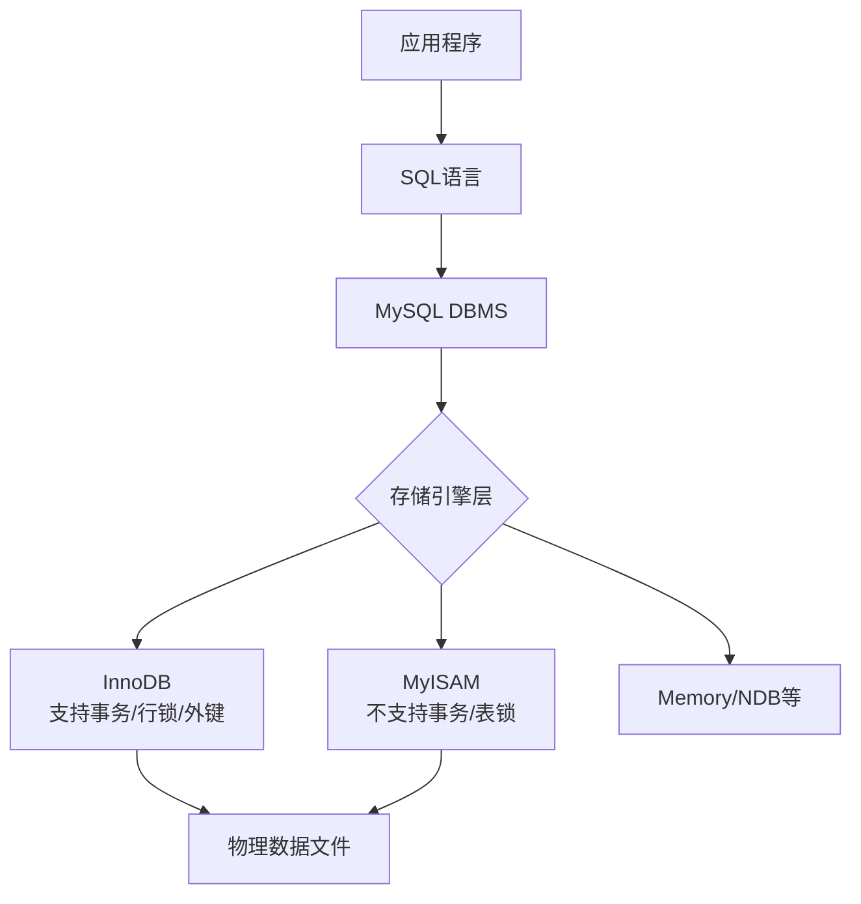
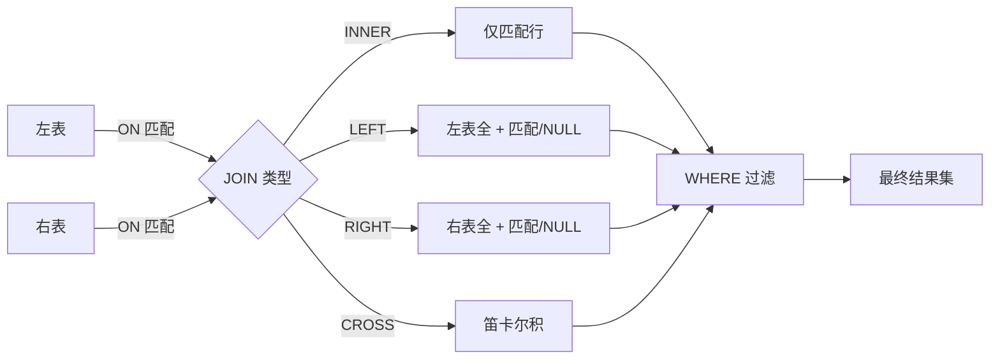
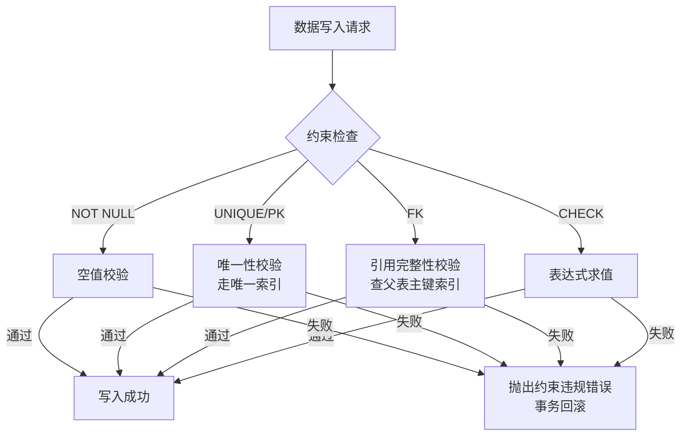
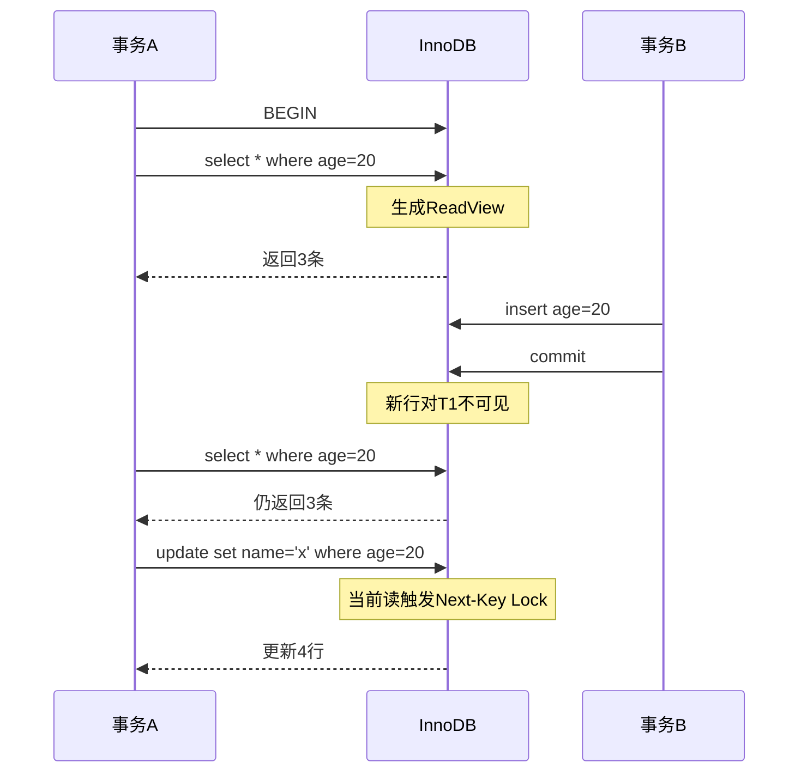
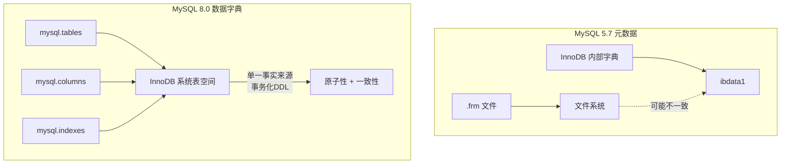

### 一、MySQL基础入门与环境构建

#### 1. 数据库核心概念与MySQL概述

数据库（Database）是持久化存储数据的仓库，相较于内存存储和普通文件存储，数据库管理系统（DBMS）提供了更高效的数据检索、管理和安全保障能力。MySQL作为互联网行业最主流的关系型数据库，以其开源、免费、高性能和跨平台等特性著称。其独特的存储引擎架构将查询处理与数据存储分离，允许根据业务需求灵活选择InnoDB（默认，支持事务）或MyISAM等引擎。

> **💡 背景知识补充：关系型 vs 非关系型**
>
> - **关系型数据库（RDBMS）**：如MySQL、Oracle，采用二维表格模型组织数据，强调数据间的关联和ACID特性，适合结构化数据和复杂查询。
> - **非关系型数据库（NoSQL）**：如Redis、MongoDB，基于键值对、文档或图模型，牺牲部分一致性以换取高并发和水平扩展能力，适合缓存、海量非结构化数据场景。
> 


#### 2. 环境安装与客户端连接

MySQL的安装需注意路径避免中文、端口号冲突及身份认证插件的选择。MySQL 8.x默认使用`caching_sha2_password`加密规则，若旧版客户端连接报错，可修改为`mysql_native_password`或升级客户端。服务启动可通过命令行`net start/stop MySQL80`或服务面板管理。

常用客户端包括：

- **命令行客户端**：`mysql -h主机 -P端口 -u用户 -p`，轻量级，适合脚本执行。
- **Navicat / SQLyog / Workbench**：图形化工具，提供可视化建模、数据同步和智能提示，推荐初学者使用Workbench（官方免费）或Navicat（功能强大）。

> **⚠️ 常见问题解析**
> 
> - **初始化失败/乱码**：通常因计算机名含中文导致，需重命名为纯英文。
> - **缺少DLL文件**：需安装Microsoft Visual C++ Redistributable运行库。
> - **忘记密码**：可通过`mysqld --init-file`方式跳过权限验证重置root密码。

#### 3. SQL语法规范与DDL操作

SQL（Structured Query Language）分为DDL（定义）、DML（操作）、DCL（控制）三类。MySQL中SQL不区分大小写，但建议关键字大写、标识符小写以提升可读性。命名应避免保留字，必要时用反引号`` ` ``包裹。

**库管理核心命令：**

- 创建：`CREATE DATABASE [IF NOT EXISTS] db_name CHARACTER SET utf8mb4;`
- 查看：`SHOW DATABASES; SHOW CREATE DATABASE db_name;`
- 切换：`USE db_name;` （后续操作前必须指定库，否则报"No database selected"）
- 删除：`DROP DATABASE [IF EXISTS] db_name;`

**表管理核心命令：**

- 创建：`CREATE TABLE t_name (col1 type, col2 type, ...);`
- 结构查看：`DESC t_name; SHOW CREATE TABLE t_name;`
- 修改：`ALTER TABLE t_name ADD/MODIFY/CHANGE/DROP COLUMN ...;`
- 删除：`DROP TABLE [IF EXISTS] t_name;`

> **💡 抽象概念解释：字符集与校对规则**
> 
> - **字符集（Character Set）**：字符编码的集合，如`utf8mb4`支持Emoji表情，而`utf8`仅支持3字节字符。建库建表时务必统一使用`utf8mb4`以避免存储异常。
> - **校对规则（Collation）**：定义字符比较和排序的规则。例如`utf8mb4_general_ci`不区分大小写（ci=case insensitive），`utf8mb4_bin`按二进制值精确比较。

#### 4. DML数据操作与数据类型

**增删改查要点：**

- **INSERT**：支持批量插入`VALUES (...), (...)`；字段列表与值列表必须一一对应。
- **UPDATE/DELETE**：务必带`WHERE`条件，否则影响全表。`TRUNCATE`比`DELETE`效率更高且不可回滚，适用于清空大表。
- **SELECT基础**：`DISTINCT`去重；别名`AS`可省略；`+`在MySQL中仅作加法运算，字符串拼接需用`CONCAT()`。

**关键数据类型辨析：**

|类型|特点|适用场景|注意事项|
|:--|:--|:--|:--|
|INT(M)|M仅为显示宽度，不影响存储范围|整数ID、计数|MySQL8起已弃用显示宽度|
|DECIMAL(M,D)|精确数值，字符串形式存储|金额、科学计算|避免浮点精度丢失|
|VARCHAR(M)|变长，节省空间|文本、描述|InnoDB下优于CHAR|
|CHAR(M)|定长，右侧补空格|手机号、身份证号|MyISAM下检索更快|
|DATETIME|8字节，范围广|业务时间记录|不受时区影响|
|TIMESTAMP|4字节，自动转换时区|系统审计时间|2038年问题|

> **💡 背景知识：为什么金额要用DECIMAL？**  
> FLOAT/DOUBLE采用IEEE754浮点标准，存在二进制无法精确表示十进制小数的问题（如0.1+0.2≠0.3）。DECIMAL以字符串形式存储每一位数字，确保金融计算的绝对精确性。

#### 5. 系统预定义函数

MySQL内置丰富函数，分为单行函数（每行返回一个结果）和分组函数（多行聚合为一个结果）。

- **数学函数**：`ROUND()`四舍五入、`CEIL()/FLOOR()`取整、`MOD()`取余。
- **字符串函数**：`CONCAT_WS()`带分隔符拼接、`SUBSTRING()`截取、`REPLACE()`替换、`LENGTH()/CHAR_LENGTH()`区分字节数与字符数。
- **日期函数**：`NOW()/CURDATE()/CURTIME()`获取时间；`DATEDIFF()`计算天数差；`DATE_FORMAT()`格式化输出。
- **条件判断**：`IFNULL(x,y)`空值替换；`CASE WHEN...THEN...ELSE...END`实现分支逻辑，常用于报表字段映射。
- **加密函数**：`MD5()/SHA2()`用于密码哈希存储，**切勿明文保存密码**。

> **⚠️ NULL值的陷阱**  
> NULL参与任何算术运算结果均为NULL；比较运算需用`IS NULL / IS NOT NULL`而非`= NULL`；`COUNT(列名)`会忽略NULL值，而`COUNT(*)`统计所有行。使用`IFNULL()`或`COALESCE()`预处理空值是良好实践。

### 二、高级查询与数据处理

#### 1. 多表关联查询核心机制

在实际业务中，数据通常遵循范式化设计分散存储于多张表中，关联查询（JOIN）是整合这些数据的核心手段。理解JOIN的本质是掌握复杂查询的前提：所有JOIN操作在逻辑上都基于“笛卡尔积+过滤条件”，但不同JOIN类型决定了结果集的保留策略。

- **内连接（INNER JOIN）**：仅返回两表中满足连接条件的匹配行，等价于`WHERE a.id = b.a_id`的隐式写法，但显式JOIN语法可读性更强且便于维护。
- **左外连接（LEFT JOIN）**：保留左表全部记录，右表无匹配时填充NULL。常用于“查询所有用户及其订单（包括未下单用户）”等场景。
- **右外连接（RIGHT JOIN）**：保留右表全部记录，实际开发中较少使用，通常可通过交换表顺序改写为LEFT JOIN以统一风格。
- **自连接（SELF JOIN）**：同一张表与自身关联，典型应用为树形结构查询（如员工-上级关系、分类层级）。需为表指定不同别名以区分角色。
- **交叉连接（CROSS JOIN）**：生成笛卡尔积，无条件组合两表所有行。除特定测试或组合生成场景外应谨慎使用，大数据量下极易引发性能灾难。

> **💡 抽象概念解释：ON vs WHERE 在 OUTER JOIN 中的区别**  
> 这是初学者最易混淆的点：
> 
> - **ON条件**：决定“如何匹配”，在生成临时结果集阶段生效。对于OUTER JOIN，即使ON条件不满足，驱动表的行仍会保留（右表补NULL）。
> - **WHERE条件**：决定“最终保留哪些行”，在JOIN完成后对结果集过滤。若在WHERE中对右表字段加非NULL条件，会将LEFT JOIN退化为INNER JOIN效果。
> 
> **原则**：关联条件放ON，业务过滤放WHERE；仅在明确需要过滤掉未匹配行时才在WHERE中限制右表字段。



#### 2. SELECT子句执行顺序与高级用法

SQL的书写顺序与数据库引擎的实际执行顺序并不一致，理解这一点是编写正确且高效查询的关键。

**逻辑执行顺序：**  
`FROM → ON → JOIN → WHERE → GROUP BY → HAVING → SELECT → DISTINCT → ORDER BY → LIMIT`

这一顺序解释了诸多常见疑问：

- 为何WHERE中不能使用SELECT定义的别名？因为SELECT在WHERE之后执行。
- 为何HAVING可以过滤聚合结果而WHERE不能？因为GROUP BY在WHERE之后、HAVING之前执行。
- 为何ORDER BY可以使用别名？因为它在SELECT之后执行。

**SELECT高级技巧：**

- **表达式计算**：直接在SELECT中进行运算或函数调用，如`price * quantity AS total_amount`。
- **条件投影**：结合`CASE WHEN`实现行转列或状态码翻译，避免应用层二次处理。
- **LIMIT分页优化**：深分页（如`LIMIT 100000, 10`）性能极差，因MySQL需扫描前100010行再丢弃。推荐采用“延迟关联”或“游标分页”策略：先通过覆盖索引获取ID列表，再回表查完整数据；或使用`WHERE id > last_seen_id LIMIT 10`替代OFFSET。

> **⚠️ 背景知识补充：为什么不建议 SELECT ***
> 
> 1. **网络开销**：传输不必要的列增加带宽消耗。
> 2. **索引失效**：无法利用覆盖索引，强制回表查询。
> 3. **维护风险**：表结构变更后可能导致应用解析错位。
> 4. **权限泄露**：可能暴露敏感字段。  
>     始终显式列出所需字段，既是性能最佳实践，也是安全编码规范。

#### 3. 子查询与通用表达式（CTE）

子查询允许将一个查询的结果作为另一个查询的输入，但嵌套过深会导致可读性差且优化器难以高效处理。MySQL 8.0引入的通用表达式（Common Table Expression, CTE）提供了更优雅的解决方案。

**子查询分类与陷阱：**

- **标量子查询**：返回单值，可用于SELECT/WHERE/HAVING。注意若返回多行会报错。
- **列子查询**：返回单列多行，配合`IN/ANY/ALL/SOME`使用。`NOT IN`遇到NULL值时整个表达式结果为UNKNOWN，可能导致意外空结果，建议改用`NOT EXISTS`。
- **行子查询**：返回多列单行，用于复合条件比较。
- **表子查询**：返回多列多行，必须置于FROM子句并赋予别名。

**CTE优势：**

- **可读性**：将复杂逻辑拆解为命名临时结果集，自顶向下阅读。
- **复用性**：同一CTE可在主查询中多次引用，避免重复代码。
- **递归能力**：`RECURSIVE CTE`原生支持树形遍历、序列生成等场景，替代传统存储过程或应用层循环。

```sql
-- 递归CTE示例：查询员工及其所有下属
WITH RECURSIVE emp_tree AS (
    -- 锚点成员：顶级节点
    SELECT id, name, manager_id, 1 AS level
    FROM employees WHERE manager_id IS NULL
    UNION ALL
    -- 递归成员：逐层展开
    SELECT e.id, e.name, e.manager_id, t.level + 1
    FROM employees e
    INNER JOIN emp_tree t ON e.manager_id = t.id
)
SELECT * FROM emp_tree;
```

> **💡 性能提示**  
> MySQL优化器对CTE的处理策略取决于是否被多次引用：单次引用时通常内联展开（等同子查询），多次引用时物化为临时表。对于大型递归CTE，务必设置`cte_max_recursion_depth`防止无限循环，并在递归成员中加入合理的终止条件。

#### 4. 窗口函数：分析型查询利器

窗口函数（Window Function）是MySQL 8.0最重要的新特性之一，它在不减少行数的前提下对“窗口”内的数据进行聚合或排名计算，完美解决了传统GROUP BY丢失明细数据的痛点。

**核心语法：** `FUNCTION() OVER (PARTITION BY ... ORDER BY ... ROWS/RANGE ...)`

- **PARTITION BY**：定义窗口分区，类似GROUP BY但不折叠行。
- **ORDER BY**：定义窗口内排序，对排名函数必需，对聚合函数可选。
- **窗口帧（Frame）**：精细控制参与计算的行范围，如`ROWS BETWEEN 2 PRECEDING AND CURRENT ROW`表示当前行及前两行。

**常用窗口函数：**

- **排名类**：`ROW_NUMBER()`连续序号；`RANK()`并列跳号；`DENSE_RANK()`并列不跳号。三者选择取决于业务对“名次相同”的处理需求。
- **聚合类**：`SUM()/AVG()/COUNT() OVER(...)`实现累计求和、移动平均、占比计算等。
- **偏移类**：`LAG()/LEAD()`访问前后行数据，用于同比环比、会话间隔分析。
- **分布类**：`NTILE(n)`将分区分为n桶，用于分位数分析；`PERCENT_RANK()/CUME_DIST()`计算相对位置。

> **💡 抽象概念解释：窗口 vs 分组**
> 
> - **GROUP BY**：将多行压缩为一行，丢失原始明细，适合汇总报表。
> - **WINDOW FUNCTION**：保持原始行数不变，在每行上附加一个基于窗口的计算结果，适合“既要明细又要统计”的分析场景，如“显示每个员工薪资及其部门平均薪资”。
> 
> 窗口函数不会改变结果集行数，因此可与其他窗口函数、普通列自由组合，极大简化了复杂分析SQL的编写。

### 三、数据库设计、安全与事务管理

#### 1. 数据完整性约束体系

约束（Constraint）是数据库保障数据正确性、一致性和有效性的第一道防线。相较于应用层校验，数据库级约束具有不可绕过、原子性强和性能更优的特点。合理运用约束既是设计规范，也是防御性编程的核心实践。

- **主键约束（PRIMARY KEY）**：唯一标识表中每一行记录，自动隐含NOT NULL和UNIQUE特性。推荐采用自增整数或雪花算法生成的BIGINT作为主键，避免使用业务字段（如身份证号、手机号），以防业务变更导致主键重构。复合主键虽语法支持，但会显著增加索引体积和JOIN复杂度，应谨慎使用。
- **外键约束（FOREIGN KEY）**：维护表间引用完整性，确保子表外键值必须在父表主键中存在。尽管InnoDB原生支持外键，但在高并发互联网架构中常被禁用，原因在于：级联操作易引发锁竞争、分布式环境下无法跨库生效、DDL变更困难。替代方案是在应用层通过代码逻辑+定时对账脚本保障一致性。
- **唯一约束（UNIQUE）**：保证列或列组合的值不重复，允许NULL值（多个NULL互不冲突）。常用于邮箱、用户名等业务唯一性校验。注意：UNIQUE约束会自动创建唯一索引，兼具查询加速功能。
- **检查约束（CHECK）**：MySQL 8.0.16起真正强制执行，此前版本仅解析不校验。可用于限定取值范围（如`age BETWEEN 0 AND 150`）、枚举值或复杂表达式。对于早期版本，需依赖触发器或应用层实现等效逻辑。
- **非空约束（NOT NULL）**：明确字段必填语义，减少NULL带来的三值逻辑陷阱。建议尽可能为所有业务字段设置NOT NULL并赋予合理默认值，仅在确实表示“未知/不适用”时才允许NULL。

> **💡 背景知识补充：约束 vs 索引**  
> 约束是逻辑层面的规则声明，索引是物理层面的数据结构。主键和唯一约束会自动创建对应索引，但普通索引不具备约束能力。理解这一区别有助于在设计时权衡：若仅需查询加速而无完整性要求，直接建索引即可；若需强制数据规则，则通过约束间接获得索引收益。



#### 2. 索引原理与优化策略

索引是MySQL性能优化的核心杠杆，其本质是以空间换时间的有序数据结构。InnoDB默认采用B+树索引，理解其结构特征是编写高效SQL的前提。

**B+树核心特性：**

- **非叶子节点仅存键值**：最大化扇出比，降低树高（通常3-4层即可支撑千万级数据），减少磁盘IO次数。
- **叶子节点双向链表连接**：支持高效的范围扫描和排序操作，无需回溯父节点。
- **聚簇索引（Clustered Index）**：InnoDB表数据按主键顺序物理存储，主键查询只需一次IO即可获取完整行。若无显式主键，InnoDB会选择第一个非NULL唯一索引，否则自动生成隐藏ROW_ID。
- **二级索引（Secondary Index）**：叶子节点存储主键值而非行指针，查询非覆盖字段时需“回表”——先查二级索引得主键，再查聚簇索引得数据。回表是随机IO，代价高昂。

**索引设计黄金法则：**

- **最左前缀原则**：联合索引`(a,b,c)`可支持`a`、`a,b`、`a,b,c`的查询，但不支持`b`、`c`、`b,c`单独作为起始条件。设计时应将区分度高、查询频率高的列置于左侧。
- **覆盖索引优先**：SELECT字段尽量包含在索引中，避免回表。例如查询用户列表仅需id和name时，建立`(name)`索引不如`(name, id)`或直接`(name)`配合SELECT name,id。
- **避免索引失效场景**：函数包裹列（`YEAR(create_time)`）、隐式类型转换（字符串列传数字）、LIKE左模糊（`'%abc'`）、OR连接非索引列、!=/<>/NOT IN在某些情况下均会导致全表扫描。
- **基数评估**：区分度低的列（如性别、状态）单独建索引意义不大，应考虑纳入联合索引或放弃索引。可通过`COUNT(DISTINCT col)/COUNT(*)`估算基数。

> **⚠️ 抽象概念解释：为什么B+树优于B树/Hash？**
> 
> - **vs B树**：B树非叶子节点也存数据，导致单页容纳键值少、树更高、IO更多；且无叶子链表，范围查询需中序遍历整棵树。
> - **vs Hash**：Hash等值查询O(1)，但不支持范围、排序、最左前缀；且哈希冲突时退化为链表扫描。InnoDB自适应哈希索引仅对热点等值查询自动启用，不可控。  
>     B+树在等值、范围、排序、IO效率之间取得了最佳平衡，成为关系型数据库的事实标准。

#### 3. 事务机制与并发控制

事务是保障多步操作原子性和一致性的基石。InnoDB通过MVCC（多版本并发控制）+锁机制实现ACID特性，理解其内部运作对排查死锁、幻读等问题至关重要。

**ACID实现原理：**

- **原子性（Atomicity）**：由Undo Log保障。事务修改前先记录旧值到Undo Log，失败时反向回放恢复原状。Undo Log本身也受Redo Log保护，确保崩溃后可重做。
- **持久性（Durability）**：由Redo Log保障。WAL（Write-Ahead Logging）策略下，事务提交时仅刷Redo Log到磁盘，数据页异步刷新。即使宕机，重启后通过Redo Log重放已提交事务。
- **隔离性（Isolation）**：由MVCC + 锁共同保障。MVCC解决快照读（普通SELECT）的并发问题，锁解决当前读（SELECT FOR UPDATE/INSERT/UPDATE/DELETE）的冲突。
- **一致性（Consistency）**：是前三者共同作用的结果，而非独立机制。

**隔离级别与MVCC：**  
InnoDB默认REPEATABLE READ（RR）级别下，MVCC通过ReadView实现：

- **RC（读已提交）**：每次SELECT生成新ReadView，可见其他事务已提交的最新值。存在不可重复读。
- **RR（可重复读）**：事务首次SELECT生成ReadView并保持至结束，整个事务内看到的数据快照一致。配合Next-Key Lock解决幻读（仅限当前读场景）。
- **SERIALIZABLE**：强制串行化，所有SELECT加共享锁，性能极低，生产环境极少使用。

> **💡 关键澄清：RR级别是否完全解决幻读？**  
> 这是一个常见误解。RR级别下：
> 
> - **快照读**：MVCC天然避免幻读，因为ReadView固定。
> - **当前读**：需依赖Next-Key Lock（记录锁+间隙锁）阻塞其他事务在范围内插入。但若事务A快照读后，事务B插入并提交，事务A再执行UPDATE该新行（触发当前读），则会“看见”该行，表现为幻读。  
>     因此，严格防幻读仍需应用层幂等设计或升级至SERIALIZABLE。



#### 4. 用户管理与权限安全

数据库安全是生产环境的底线。MySQL采用“用户+主机”二元组标识身份，权限模型细粒度到库、表、列乃至存储过程级别。

**账户管理最佳实践：**

- **最小权限原则**：应用程序账户仅授予必要权限（如DML+特定表SELECT），禁止GRANT ALL或SUPER。DBA操作使用独立高权账户。
- **主机白名单**：创建用户时指定具体IP或网段（如`'app'@'10.0.1.%'`），避免使用`'%'`通配符。本地管理账户限定`'localhost'`。
- **密码策略强化**：启用`validate_password`组件，强制长度、大小写、特殊字符及字典检查。定期轮换密码，历史密码复用限制。
- **角色管理（MySQL 8.0+）**：通过ROLE批量授权，简化权限变更。如创建`readonly_role`、`app_write_role`，再将角色授予用户，避免逐人维护。

**安全防护要点：**

- **SSL/TLS加密传输**：防止网络嗅探窃取凭据和数据。生产环境强制要求`REQUIRE SSL`。
- **审计日志**：开启general_log或企业版audit插件，记录敏感操作（DROP/TRUNCATE/GRANT等），满足合规与事后追溯需求。
- **SQL注入防御**：永远使用参数化查询（Prepared Statement），杜绝字符串拼接SQL。ORM框架默认开启此机制，手写SQL时需格外警惕。
- **备份加密与访问控制**：备份文件包含全量数据，必须加密存储并严格限制访问权限。恢复演练定期进行，验证备份有效性。

> **⚠️ 高危操作警示**
> 
> - `GRANT ... WITH GRANT OPTION`：允许被授权者转授权限，极易导致权限扩散失控，仅限DBA管理员使用。
> - `FLUSH PRIVILEGES`：修改mysql系统表后需手动刷新，但正常使用GRANT/REVOKE命令会自动生效，无需额外调用。误用可能导致权限缓存不一致。
> - root远程登录：生产环境务必禁用`root@'%'`，日常运维通过跳板机+sudo提权或专用管理账户操作。

### 四、MySQL8新特性与实战演练

#### 1. MySQL 8.0 核心架构演进

MySQL 8.0 并非简单的功能叠加，而是对底层存储、字符集、权限模型及优化器进行了系统性重构。理解这些变更对于从旧版本平滑迁移及充分发挥新版本性能至关重要。

- **数据字典（Data Dictionary）**：彻底移除了`.frm`、`.par`等文件级元数据存储，将所有表结构、视图、存储过程等元数据统一存入InnoDB系统表中。这解决了长期存在的DDL原子性问题——过去创建表时若中途崩溃可能留下残留文件，现在DDL操作完全事务化，要么成功要么完全回滚。同时，元数据查询性能显著提升，`INFORMATION_SCHEMA`不再依赖文件系统扫描。
- **默认字符集升级为 utf8mb4**：新建库表默认使用`utf8mb4`字符集与`utf8mb4_0900_ai_ci`校对规则。`0900`对应Unicode 9.0标准，支持更多Emoji及生僻字；`ai`表示重音不敏感（accent insensitive），更符合自然语言排序习惯。这一变更消除了长期以来因`utf8`仅支持3字节导致的表情符号存储失败问题。
- **优化器增强**：引入直方图（Histogram）统计信息，使优化器能更准确评估数据分布倾斜情况，避免因统计信息失真选错执行计划。新增降序索引（Descending Index），真正支持`ORDER BY a ASC, b DESC`混合排序场景，此前版本虽语法允许但实际仍按升序存储后反向扫描，效率低下。
- **JSON增强**：支持多值索引（Multi-Valued Index），可对JSON数组元素建立索引，配合`MEMBER OF()`、`JSON_CONTAINS()`等函数实现高效数组检索。此前JSON字段只能整体存储，无法对内部元素单独索引，复杂查询被迫全表扫描。

> **💡 背景知识补充：为何移除 .frm 文件是里程碑？**  
> 在MySQL 5.7及之前，表结构分散于`.frm`文件与InnoDB内部字典中，两者可能不一致（如崩溃恢复期间）。这种“双源真相”导致诸多诡异Bug。8.0将元数据完全收敛至InnoDB事务表内，不仅提升可靠性，还为在线DDL、快速克隆、即时加列等新特性奠定基础——所有元数据变更都走标准事务流程，无需额外文件操作。



#### 2. 角色管理与窗口函数实战深化

MySQL 8.0 的角色（Role）机制与窗口函数在前序阶段已有介绍，本节聚焦其在真实业务中的组合应用与进阶技巧。

**角色管理工程实践：**

- **动态权限继承**：角色可嵌套授予其他角色，形成权限树。例如`app_read_role`授予`base_select_role`+`audit_log_select_role`，当基础权限调整时只需修改叶子角色，上层自动继承。
- **强制激活策略**：通过`SET DEFAULT ROLE ALL TO user`或全局变量`activate_all_roles_on_login=ON`确保用户登录即激活所有已授角色，避免应用连接后因未执行`SET ROLE`导致权限缺失。
- **临时提权审计**：DBA可通过`GRANT role TO user WITH ADMIN OPTION`允许用户在会话内临时激活高权角色完成紧急操作，事后立即`REVOKE`，全程留痕且无需共享密码。

**窗口函数高阶应用场景：**

- **会话识别（Sessionization）**：用户行为日志中，相邻事件间隔超过30分钟视为新会话。利用`LAG(event_time) OVER(PARTITION BY user_id ORDER BY event_time)`计算时间差，再用`SUM(CASE WHEN gap > 1800 THEN 1 ELSE 0 END) OVER(...)`生成会话ID，替代复杂的自连接或存储过程。
- **Top-N per Group 优化**：查询每个部门薪资前3名员工。传统写法需相关子查询或变量模拟，8.0直接用`ROW_NUMBER() OVER(PARTITION BY dept ORDER BY salary DESC) AS rn`外层过滤`rn <= 3`即可。注意：若需包含并列第3名，应改用`DENSE_RANK()`。
- **累计占比与帕累托分析**：`SUM(amount) OVER(ORDER BY amount DESC) / SUM(amount) OVER()`计算累计销售额占比，快速定位贡献80%营收的头部商品，支撑运营决策。

> **⚠️ 实战陷阱提醒**  
> 窗口函数的`PARTITION BY`和`ORDER BY`子句不接受别名引用（与SELECT列表不同），必须使用原始表达式或列名。若在复杂表达式上开窗，建议先用CTE预处理出中间列，再在CTE结果上开窗，既提升可读性又避免重复计算。

#### 3. 综合实战：电商订单分析系统

以下案例整合本教程全部核心知识点，模拟真实业务需求，检验综合运用能力。

**需求描述：**  
统计2025年各季度活跃用户数、人均订单金额、复购率，并按城市维度下钻；要求查询响应<2秒，数据量千万级。

**解题思路分解：**

1. **表设计与索引规划**
    
    - 订单表采用分区表按`order_date` RANGE分区，加速时间范围过滤。
    - 建立联合索引`(city, order_date, user_id, amount)`覆盖城市筛选、时间过滤、用户去重及金额聚合，避免回表。
    - 用户表主键为雪花ID，避免自增热点；`city`字段冗余至订单表，避免JOIN用户表。
2. **查询构建（CTE + 窗口函数）**
    
    ```sql
    WITH quarterly_orders AS (
        SELECT 
            city,
            QUARTER(order_date) AS qtr,
            user_id,
            amount,
            ROW_NUMBER() OVER(PARTITION BY city, QUARTER(order_date), user_id ORDER BY order_date) AS order_seq
        FROM orders
        WHERE order_date >= '2025-01-01' AND order_date < '2026-01-01'
    ),
    metrics AS (
        SELECT 
            city,
            qtr,
            COUNT(DISTINCT user_id) AS active_users,
            ROUND(SUM(amount) / COUNT(DISTINCT user_id), 2) AS avg_order_amount,
            ROUND(
                SUM(CASE WHEN order_seq > 1 THEN 1 ELSE 0 END) * 100.0 
                / COUNT(DISTINCT user_id), 2
            ) AS repurchase_rate
        FROM quarterly_orders
        GROUP BY city, qtr
    )
    SELECT * FROM metrics ORDER BY city, qtr;
    ```
    
3. **性能验证与调优**
    
    - `EXPLAIN`确认使用了联合索引且Extra显示`Using index`（覆盖索引）。
    - 若`COUNT(DISTINCT)`成为瓶颈，考虑近似算法`APPROX_COUNT_DISTINCT()`（8.0.32+）或预聚合中间表。
    - 复购率计算中`order_seq > 1`巧妙利用窗口函数序号，避免自连接判断是否首单。

> **💡 设计反思**  
> 此方案牺牲了部分范式（城市冗余），换取查询性能。在OLAP场景中，适度反范式化是合理权衡。但若城市信息频繁变更，需增加ETL同步机制或采用CDC实时更新冗余字段。**没有绝对正确的范式，只有适配业务负载的设计。**

> [!success]- 点击展开题解
> 
> ### 📊 千万级订单数据季度指标统计题解
> 
> 本题是一道典型的 **OLAP（联机分析处理）性能优化题**。核心难点在于：在千万级数据量下，同时满足“多维度聚合（城市+季度）”、“多指标计算（活跃数、人均金额、复购率）”以及“2秒响应”这三个苛刻条件。
> 
> 下面从架构设计、SQL实现原理及调优策略三个层面进行深度解析。
> 
> ---
> 
> ### 1. 核心解题思路可视化
> 
> 为了直观理解为何要这样设计表和索引，请参考以下数据流转示意图：
> 
> ```mermaid
> graph TD
>     A[原始订单表 Orders] -->|RANGE分区 by order_date| B(分区裁剪 Partition Pruning)
>     B -->|联合索引覆盖扫描| C{Index Only Scan}
>     C -->|避免回表| D[内存中构建 CTE]
>     D -->|窗口函数 ROW_NUMBER| E[标记用户订单序号]
>     E -->|GROUP BY city, qtr| F[聚合计算三大指标]
>     F --> G[<2s 返回结果]
>     
>     style A fill:#e1f5fe,stroke:#01579b
>     style C fill:#fff9c4,stroke:#fbc02d
>     style G fill:#e8f5e9,stroke:#2e7d32
> ```
> 
> > **💡 图解说明**：整个查询链路的关键在于“减少IO”。通过分区裁剪只扫描2025年数据，通过覆盖索引避免回表查原数据，通过CTE+窗口函数在单次扫描中完成复购标记，避免多次JOIN或子查询。
> 
> ---
> 
> ### 2. 关键知识点详解
> 
> #### 2.1 为什么城市字段要冗余到订单表？
> 
> 在传统OLTP范式中，`city` 应存储在用户表中，订单表仅存 `user_id`。但在OLAP场景下：
> 
> - **JOIN代价极高**：千万级订单表 JOIN 百万级用户表，即使有索引，Hash Join 或 Nested Loop 的内存/CPU开销也极易超过2秒预算。
> - **反范式化权衡**：将 `city` 冗余至订单表，虽然增加了存储成本和ETL同步复杂度，但换取了**单表聚合**的能力。这是分析型系统中“以空间换时间”的经典实践。
> 
> #### 2.2 联合索引 `(city, order_date, user_id, amount)` 的设计逻辑
> 
> |索引列|作用|说明|
> |:--|:--|:--|
> |`city`|等值/范围过滤 + GROUP BY 分组键|放在最左，支持按城市前缀匹配|
> |`order_date`|范围过滤 + 分区对齐|第二列，配合分区裁剪进一步缩小扫描范围|
> |`user_id`|COUNT DISTINCT 去重|索引有序，加速去重操作|
> |`amount`|SUM 聚合|包含在索引中实现覆盖扫描|
> 
> > ⚠️ **注意**：该索引顺序不可随意调换。若将 `amount` 提前，则无法有效利用 `order_date` 的范围过滤特性，导致索引效率大幅下降。
> 
> #### 2.3 复购率计算的巧妙之处
> 
> 传统做法可能需要自连接判断用户是否有多笔订单：
> 
> ```sql
> -- ❌ 低效写法：自连接
> SELECT a.user_id FROM orders a 
> INNER JOIN orders b ON a.user_id = b.user_id 
> WHERE a.order_date <> b.order_date
> ```
> 
> 而题解中使用 `ROW_NUMBER() OVER(PARTITION BY city, qtr, user_id ORDER BY order_date)` 生成序号后，只需判断 `order_seq > 1` 即可识别非首单。**将O(n²)的自连接转化为O(n)的窗口扫描**，是性能提升的关键点。
> 
> ---
> 
> ### 3. 性能瓶颈与进阶调优
> 
> 当数据量持续增长或基数（Cardinality）过高时，仍需考虑以下兜底方案：
> 
> - **`COUNT(DISTINCT)` 瓶颈**：MySQL 的精确去重在高基数下极慢。可改用：
>     - `APPROX_COUNT_DISTINCT()`（MySQL 8.0.32+），误差约2-3%，速度提升10倍+
>     - HyperLogLog 预计算中间表，适合固定维度组合
> - **物化视图/预聚合表**：若查询模式固定，可定时预计算 `(city, quarter)` 粒度的汇总结果，查询直接读汇总表，响应可达毫秒级
> - **执行计划验证**：务必通过 `EXPLAIN ANALYZE` 确认：
>     - `type` 为 `range` 或 `index`
>     - `Extra` 包含 `Using index`（覆盖索引生效）
>     - `rows` 估算值远小于总行数（分区+索引裁剪生效）
> 
> ---
> 
> ### 4. 设计哲学总结
> 
> > **没有绝对正确的范式，只有适配业务负载的设计。**
> 
> 本题完美诠释了OLAP与OLTP的设计差异：
> 
> - OLTP追求**写入高效、数据一致** → 严格范式化
> - OLAP追求**读取极速、分析灵活** → 适度反范式 + 预计算 + 近似算法
> 
> 在实际工程中，应根据查询频率、数据时效性要求、存储成本三者动态权衡，而非教条式遵循某一原则。