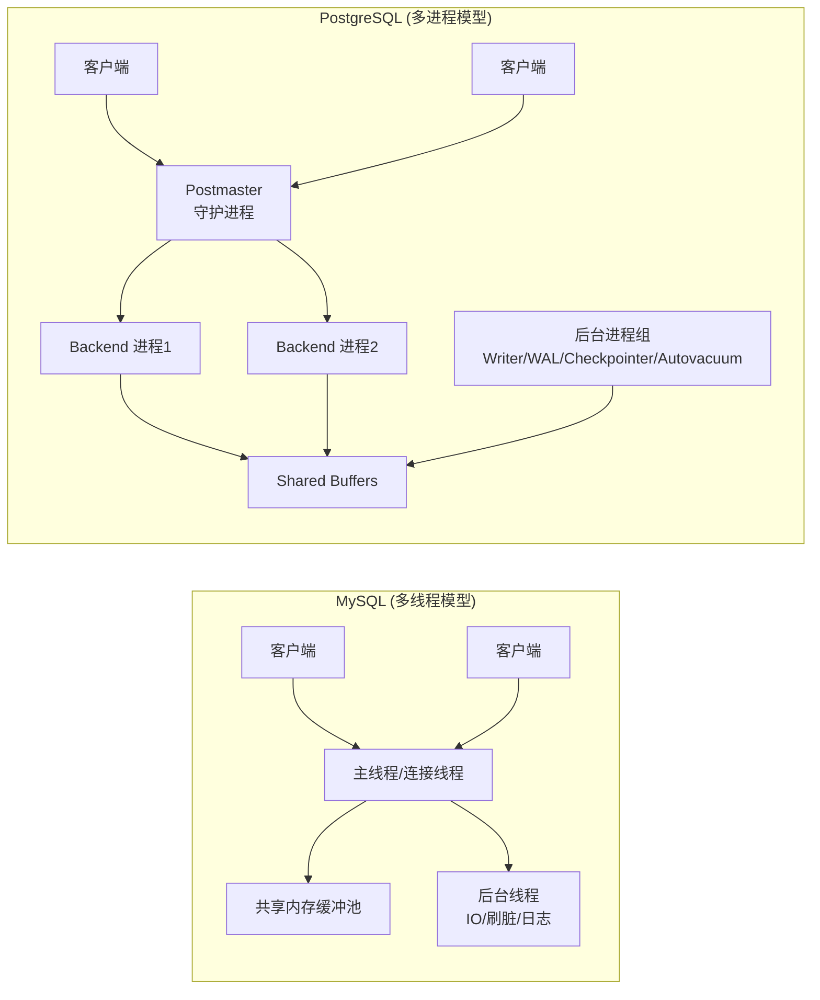
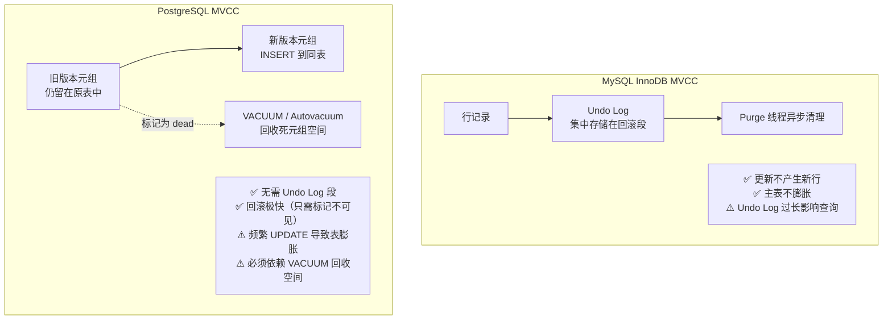
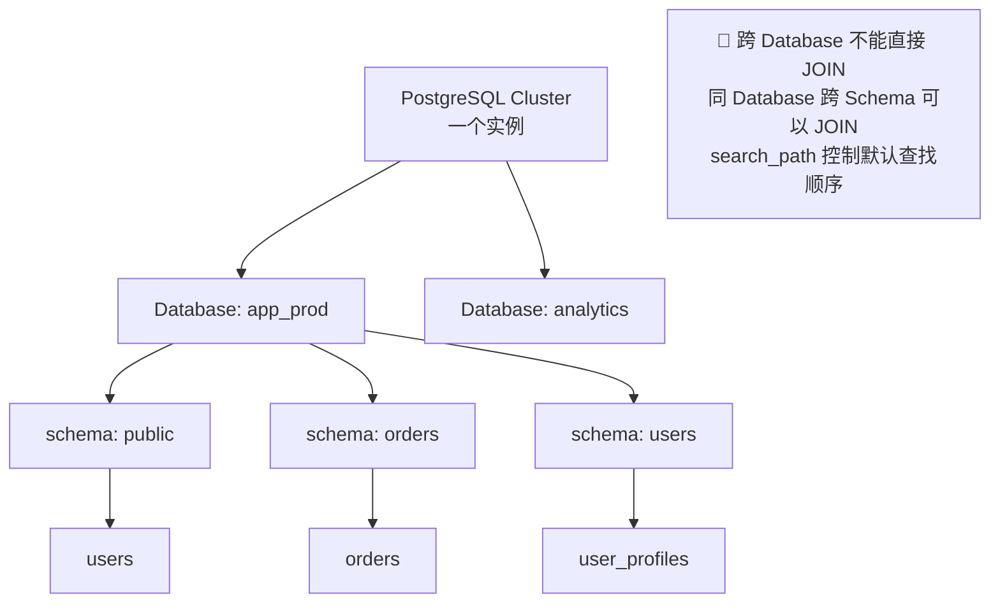
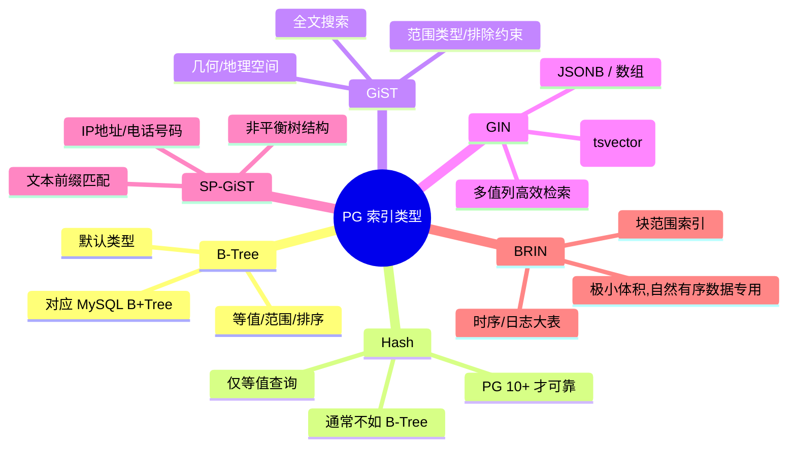
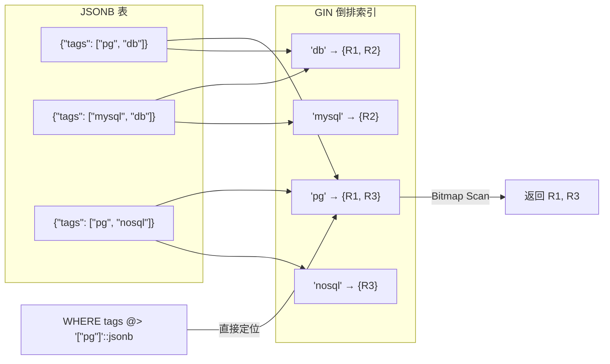
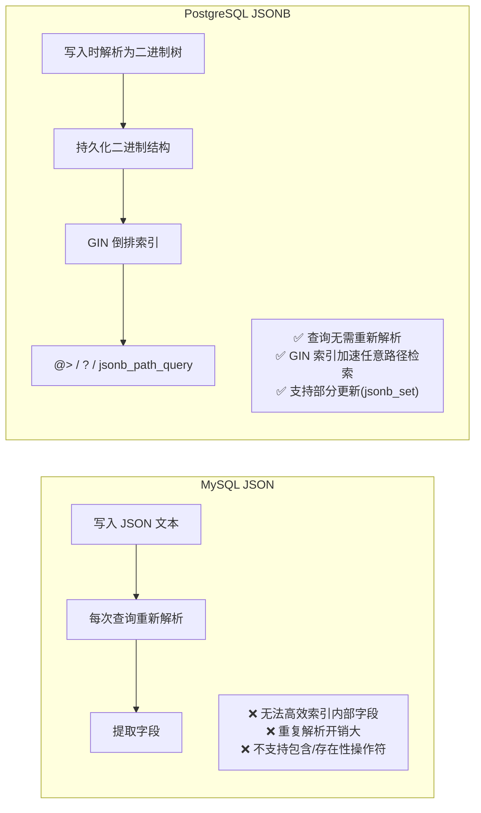
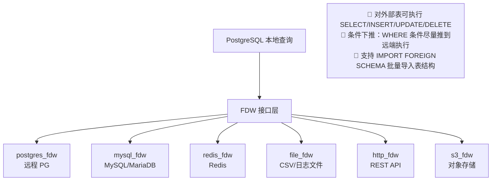
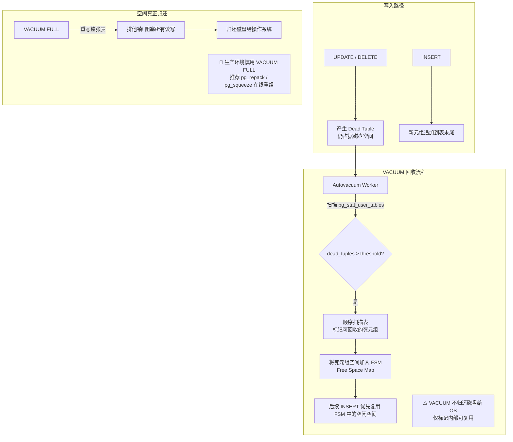
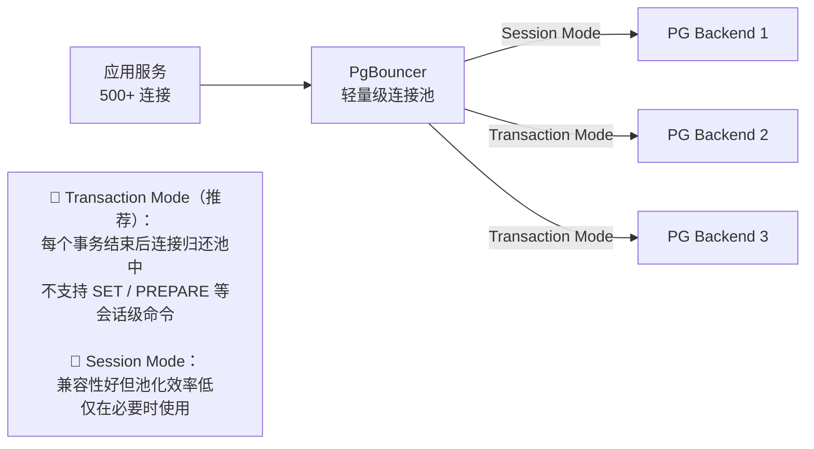
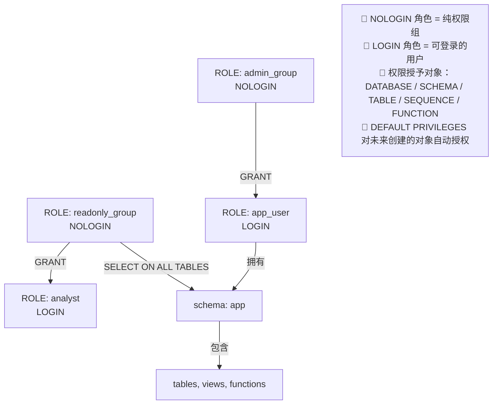

### 一、PostgreSQL架构与MySQL核心差异

本阶段是 MySQL 开发者理解 PostgreSQL 的基石。很多在 MySQL 中习以为常的行为在 PG 中完全不同，若不理解底层原因，极易在生产环境中踩坑。

#### 1.1 进程模型 vs 线程模型

这是两者最根本的架构差异，直接影响连接管理、资源隔离和故障恢复策略。



|对比维度|MySQL|PostgreSQL|
|:--|:--|:--|
|连接处理|每个连接一个**线程**|每个连接 fork 一个独立**进程**|
|内存共享|线程天然共享进程内存|通过共享内存段（Shared Buffers）显式共享|
|故障隔离|一个线程崩溃可能导致整个实例宕机|单个 Backend 崩溃不影响其他连接，Postmaster 自动清理|
|连接开销|较低（线程创建轻量）|较高（fork 进程 + 内存分配），**生产环境必须使用连接池**|
|CPU 利用|受 GIL/线程调度影响|真正的多进程并行，OS 级调度|

> ⚠️ **关键提醒**：MySQL 开发者初用 PG 时最常见的错误就是直连大量会话。由于 PG 每个连接都是独立进程，数百个并发连接就会显著消耗内存和 CPU。**务必在应用与 PG 之间部署 PgBouncer 或 PgPool-II 等连接池中间件**。

#### 1.2 MVCC 实现机制差异

两者都实现了 MVCC（多版本并发控制），但实现方式截然不同，这直接影响了更新性能、空间回收和长事务风险。



**核心理解要点：**

- **PG 的 UPDATE = DELETE + INSERT**：在 PG 中，更新一行并不会原地修改，而是将旧版本标记为"dead tuple"，并在同一张表中插入一个新版本。这意味着频繁更新的表会快速膨胀。
- **没有独立的 Undo Log**：PG 的历史版本就存在于主表堆文件中，这也是为什么 PG 需要 VACUUM 而 MySQL 不需要（MySQL 靠 Purge 清理 Undo Log）。
- **事务 ID 环绕问题**：PG 使用 32 位事务 ID，存在约 40 亿事务后环绕的风险。Autovacuum 不仅回收空间，还负责"冻结"老事务 ID 以防止环绕。**永远不要禁用 Autovacuum**。
- **长事务危害更大**：在 PG 中，一个长时间未提交的事务会阻止 VACUUM 清理该事务开始之后的所有死元组，导致表持续膨胀。这在 MySQL 中主要表现为 Undo Log 增长，而在 PG 中则是主表物理膨胀。

#### 1.3 事务隔离级别与默认行为

|隔离级别|MySQL (InnoDB)|PostgreSQL|差异说明|
|:--|:--|:--|:--|
|Read Uncommitted|✅ 支持|❌ **不支持**|PG 最低级别即为 Read Committed|
|Read Committed|默认级别|**默认级别**|行为基本一致，但 PG 的 RC 下每条语句看到的是该语句开始时的快照|
|Repeatable Read|可重复读，幻读由 Next-Key Lock 防止|可重复读，**天然无幻读**（MVCC 快照保证），但可能触发序列化失败|PG 的 RR 比 MySQL 更严格|
|Serializable|锁串行化|**真串行化（SSI）**|PG 使用 Serializable Snapshot Isolation，无锁实现真正可串行化，冲突时抛出 `40001` 错误需重试|

> 💡 **实践建议**：大多数从 MySQL 迁移的应用可以直接使用 PG 默认的 Read Committed。如果你的业务依赖 MySQL 的 Repeatable Read 来避免幻读，在 PG 中同样安全，但要注意 PG 的 RR 级别下可能出现 `could not serialize access due to concurrent update` 错误，应用层需要做重试逻辑。

#### 1.4 数据类型与 SQL 语法关键差异速查

以下是 MySQL 开发者最容易踩坑的差异点：

|类别|MySQL|PostgreSQL|注意事项|
|:--|:--|:--|:--|
|自增主键|`AUTO_INCREMENT`|`SERIAL` / `GENERATED ALWAYS AS IDENTITY`|PG 10+ 推荐用 `IDENTITY`，`SERIAL` 是遗留语法|
|字符串比较|默认不区分大小写（取决于 collation）|**默认区分大小写**|用 `ILIKE` 做不区分大小写匹配，或用 `citext` 扩展|
|布尔类型|`TINYINT(1)` 模拟|原生 `BOOLEAN` (`true/false`)|PG 不接受 `1/0` 作为布尔值隐式转换|
|日期时间|`DATETIME` / `TIMESTAMP`|`TIMESTAMP WITHOUT TIME ZONE` / `WITH TIME ZONE`|**强烈推荐始终使用 `TIMESTAMPTZ`**，避免时区灾难|
|JSON|`JSON`（文本存储）|`JSON` + **`JSONB`**（二进制存储，支持索引）|几乎总是应该用 `JSONB`|
|引号|反引号 `` ` `` 包裹标识符|双引号 `"` 包裹标识符|**最佳实践：全部使用小写命名，永远不加引号**|
|LIMIT|`LIMIT n OFFSET m`|相同，但也支持 `FETCH FIRST n ROWS ONLY`|SQL 标准写法兼容性更好|
|GROUP BY|允许 SELECT 非聚合列（ANY_VALUE 语义）|**严格要求** SELECT 列要么在 GROUP BY 中，要么是聚合函数|更严谨，减少歧义|
|字符串拼接|`CONCAT()`|`\|` 运算符或 `CONCAT()`|`\|` 是 PG 惯用写法|
|UPSERT|`ON DUPLICATE KEY UPDATE`|`ON CONFLICT ... DO UPDATE`|语法不同，PG 需指定冲突目标|

#### 1.5 Schema 命名空间概念

MySQL 中 "database" 既是物理隔离单元也是逻辑命名空间。PG 引入了额外的 **Schema** 层级：



- **Database** 之间是完全隔离的，不能跨库查询（需用 FDW 或 dblink）。
- **Schema** 是 Database 内的逻辑命名空间，类似文件系统目录。
- `search_path` 类似于操作系统的 `PATH` 环境变量，决定了不带 schema 前缀时表的查找顺序。默认值为 `"$user", public`。
- **迁移建议**：如果原来在 MySQL 中用多个 database 做逻辑隔离，在 PG 中应改为使用同一 database 下的多个 schema。

### 二、索引与查询优化

对于 MySQL 开发者而言，PostgreSQL 的索引体系是最令人兴奋也最容易误用的部分。MySQL 几乎只有 B+Tree 一种选择（InnoDB），而 PG 提供了丰富的索引类型和更灵活的优化器。本阶段将帮助你建立正确的 PG 索引思维，并掌握差异化的执行计划分析方法。

#### 2.1 索引类型全景对比



|索引类型|适用场景|MySQL 对应|关键注意事项|
|:--|:--|:--|:--|
|**B-Tree**|等值、范围、ORDER BY、覆盖索引|InnoDB B+Tree|PG 的 B-Tree 支持多列联合索引的最左前缀原则，与 MySQL 一致|
|**Hash**|纯等值 `=` 查询|Memory 引擎 Hash|PG 10 之前不写 WAL，崩溃不安全；**大多数场景 B-Tree 仍优于 Hash**|
|**GIN**|JSONB、数组、全文搜索、tsquery|❌ 无原生对应|构建慢、写入开销大，但复杂多值查询性能远超 B-Tree|
|**GiST**|PostGIS 地理空间、范围类型、全文搜索|Spatial Index|有损索引，可能需要 recheck；适合邻近搜索|
|**BRIN**|按时间/ID 自然排序的超大表|❌ 无原生对应|索引大小仅为 B-Tree 的 1/100~1/1000，**前提是数据物理有序**|
|**SP-GiST**|IP 路由、电话号段、文本前缀|❌ 无原生对应|适合特定分布的非平衡数据结构|

> 💡 **核心认知转变**：在 MySQL 中你几乎只需要考虑"B+Tree 联合索引的列顺序"。在 PG 中，**先判断数据类型和查询模式，再选索引类型**，这比调列顺序更重要。例如：查 JSONB 字段里的某个 key → GIN；查地理位置附近 → GiST；查十亿级时序表的某段时间 → BRIN。

#### 2.2 GIN 索引深度解析（PG 杀手级特性）

GIN（Generalized Inverted Index）是 MySQL 完全没有的索引类型，也是 PG 处理半结构化数据的核心武器。



**GIN vs B-Tree 对 JSONB 的查询能力：**

|操作符|B-Tree|GIN|说明|
|:--|:--|:--|:--|
|`=` (整体相等)|✅|✅|B-Tree 也可胜任|
|`@>` (包含)|❌|✅|GIN 专属，最常用|
|`<@` (被包含)|❌|✅|GIN 专属|
|`?` / `?\|` / `?&` (key 存在性)|❌|✅|GIN 专属|
|`>>` / `<<` (数值/字符串比较)|✅|❌|需配合 `jsonb_path_ops` 或 B-Tree 表达式索引|

**GIN 的两个 operator class 选择：**

- **`jsonb_ops`**（默认）：支持所有 JSONB 操作符，索引较大。
- **`jsonb_path_ops`**：仅支持 `@>`，索引体积小约 3-5 倍，构建更快。**如果只用包含查询，务必指定此选项**。

```sql
-- 推荐写法：仅用 @> 查询时
CREATE INDEX idx_tags_gin ON articles USING GIN (tags jsonb_path_ops);

-- 需要多种操作符时
CREATE INDEX idx_tags_gin_full ON articles USING GIN (tags);
```

#### 2.3 BRIN 索引：大表神器

BRIN（Block Range Index）是另一个 MySQL 没有的独特索引，专为**物理有序的大表**设计。

**工作原理**：BRIN 不为每一行建索引，而是为每个"页面范围"（默认 128 页）记录该范围内列的最小值和最大值。查询时先通过 min/max 过滤掉不相关的页面范围，再扫描剩余页面。

**适用条件（必须同时满足）：**

1. 表非常大（百万级以上才有意义）
2. 查询列的值与物理存储顺序高度相关（如自增 ID、创建时间）
3. 主要是范围查询

```sql
-- 典型场景：十亿级日志表按时间范围查询
CREATE INDEX idx_logs_created_brin ON logs USING BRIN (created_at) WITH (pages_per_range = 32);

-- 验证物理有序性（相关性接近 1.0 才适合 BRIN）
SELECT correlation FROM pg_stats WHERE tablename = 'logs' AND attname = 'created_at';
```

> ⚠️ **警告**：如果数据插入是无序的（如 UUID 主键、乱序导入），BRIN 索引的过滤效果会急剧下降，甚至不如全表扫描。**使用前务必检查 correlation**。

#### 2.4 执行计划分析：EXPLAIN 的差异

PG 的 `EXPLAIN` 比 MySQL 信息量大得多，但也更复杂。以下是关键差异：

|维度|MySQL EXPLAIN|PostgreSQL EXPLAIN|
|:--|:--|:--|
|实际执行|`EXPLAIN ANALYZE` 不可用（8.0 前）|**`EXPLAIN (ANALYZE, BUFFERS)` 是黄金标准**|
|缓冲池命中|不显示|`BUFFERS` 选项显示 shared hit/read/dirtied|
|行数估算|`rows` 列|`rows` + `actual rows`（ANALYZE 时）|
|代价模型|相对简单|`cost=启动成本..总成本`，单位是抽象磁盘页读取单位|
|输出格式|表格|树形缩进文本（也可 JSON/YAML/XML）|
|统计信息更新|`ANALYZE TABLE`|`ANALYZE` 或 Autovacuum 自动触发|

**PG EXPLAIN 阅读口诀：**

```sql
EXPLAIN (ANALYZE, BUFFERS, TIMING, FORMAT TEXT)
SELECT ... ;
```

1. **从最内层节点开始读**（缩进最深 = 最先执行）
2. **关注 actual rows vs rows**：差距超过 10 倍说明统计信息过时，需 `ANALYZE`
3. **关注 Buffers: shared hit vs read**：read 高说明缓存未命中，可能需要调大 `shared_buffers` 或优化查询
4. **关注 Sort / HashAggregate 的内存使用**：若出现 `Disk: xxx kB` 说明 work_mem 不足，发生了磁盘溢出
5. **Seq Scan 不一定是坏事**：小表或高选择性查询中 Seq Scan 可能比 Index Scan 更快

#### 2.5 优化器行为差异与常见陷阱

|现象|MySQL 行为|PostgreSQL 行为|应对策略|
|:--|:--|:--|:--|
|索引选择|倾向使用索引，有时过度|基于成本模型，可能放弃索引选 Seq Scan|信任优化器；若确实有误，先 `ANALYZE` 再检查 `random_page_cost`|
|OR 条件|可能走 index_merge|常转为 BitmapOr 或多路扫描|PG 的 BitmapOr 通常优于 MySQL 的 index_merge|
|函数调用|可能阻止索引|同样阻止，但支持**表达式索引**|`CREATE INDEX ON t (lower(name))` 解决函数索引需求|
|部分索引|❌ 不支持|✅ `WHERE` 子句定义索引范围|大幅减小索引体积，如只索引未删除记录|
|覆盖索引|InnoDB 二级索引自带主键|需显式 `INCLUDE` 列（PG 11+）|`CREATE INDEX ON t(a) INCLUDE (b, c)`|
|统计信息|采样较少|默认采样 300 个值，可调 `default_statistics_target`|对倾斜严重的列：`ALTER TABLE t ALTER col SET STATISTICS 1000; ANALYZE t;`|

**部分索引实战示例（MySQL 无法实现）：**

```sql
-- 只索引未完成的订单，索引体积减少 95%
CREATE INDEX idx_orders_pending ON orders (user_id, created_at)
WHERE status = 'pending';

-- 查询自动使用该索引
SELECT * FROM orders WHERE user_id = 123 AND status = 'pending';
```

#### 2.6 索引维护与监控

PG 的索引不会像 MySQL 那样在 DML 时自动保持完美紧凑，需要关注以下运维点：

- **索引膨胀**：大量 UPDATE/DELETE 后 B-Tree 索引也会膨胀。使用 `pg_stat_user_indexes` 监控索引使用率，无用索引及时删除。
- **REINDEX**：当索引严重膨胀或损坏时使用。PG 12+ 支持 `REINDEX CONCURRENTLY`，不阻塞读写。
- **CONCURRENTLY 创建索引**：生产环境**永远**使用 `CREATE INDEX CONCURRENTLY`，避免锁表。代价是构建时间约为普通的 2-3 倍。
- **无效索引检测**：

```sql
-- 查找从未使用的索引
SELECT schemaname, relname AS table, indexrelname AS index,
       idx_scan, pg_size_pretty(pg_relation_size(indexrelid)) AS size
FROM pg_stat_user_indexes
WHERE idx_scan = 0
  AND indexrelname NOT LIKE '%pkey%'
  AND indexrelname NOT LIKE '%unique%'
ORDER BY pg_relation_size(indexrelid) DESC;
```

> 🎯 **第二阶段小结**：PG 的索引优化核心思路是"**选对类型 > 调整列序 > 参数微调**"。不要带着 MySQL 的 B-Tree 万能思维来用 PG，充分利用 GIN、BRIN、部分索引和表达式索引，往往能获得数量级的性能提升。执行计划分析务必养成 `EXPLAIN (ANALYZE, BUFFERS)` 的习惯。

---

### 三、高级特性与扩展生态

PostgreSQL 被誉为"最先进的开源关系型数据库"，其核心竞争力不仅在于标准 SQL 的实现，更在于丰富的高级数据结构和强大的扩展能力。对于 MySQL 开发者而言，掌握这些特性意味着可以用一个 PG 实例替代"MySQL + Redis + Elasticsearch + MongoDB"的复杂架构，显著降低系统复杂度。

#### 3.1 JSONB：真正的文档存储能力

MySQL 的 `JSON` 类型本质上是文本存储 + 解析时提取，而 PG 的 `JSONB` 是**二进制预解析存储**，支持 GIN 索引和丰富操作符，性能差距可达数个数量级。



**JSONB 核心操作速查：**

|操作|语法示例|说明|
|:--|:--|:--|
|提取字段（文本）|`data->>'name'`|返回 text，可用于 WHERE|
|提取字段（jsonb）|`data->'address'`|返回 jsonb，可继续链式访问|
|包含判断|`data @> '{"status":"active"}'`|**最常用**，GIN 索引加速|
|Key 存在性|`data ? 'email'`|检查顶层 key 是否存在|
|路径查询|`jsonb_path_query(data, '$.items[*].price')`|SQL/JSON 标准路径表达式（PG 12+）|
|部分更新|`jsonb_set(data, '{address,city}', '"Shanghai"')`|不重写整个文档|
|删除 Key|`data - 'temp_field'`|移除指定键|

> ⚠️ **实践原则**：
> 
> - 几乎总是使用 `JSONB` 而非 `JSON`，除非你需要保留原始格式（空格、key 顺序）。
> - 高频查询的 JSONB 字段**必须建 GIN 索引**。
> - 如果某些 JSONB 内部字段的查询频率极高且模式固定，考虑用**生成列 + B-Tree 索引**替代 GIN：
>     
>     ```sql
>     ALTER TABLE users ADD COLUMN email text GENERATED ALWAYS AS (data->>'email') STORED;
>     CREATE INDEX idx_users_email ON users(email);
>     ```
>     

#### 3.2 数组类型：告别关联表

MySQL 没有原生数组类型，通常需要用逗号分隔字符串或额外关联表来实现。PG 的原生数组配合 GIN 索引，可以优雅地解决这类问题。

```sql
-- 定义数组列
CREATE TABLE articles (
    id      SERIAL PRIMARY KEY,
    title   TEXT NOT NULL,
    tags    TEXT[] NOT NULL DEFAULT '{}'
);

-- GIN 索引加速数组查询
CREATE INDEX idx_articles_tags ON articles USING GIN (tags);

-- 常用数组操作
SELECT * FROM articles WHERE 'postgresql' = ANY(tags);       -- 包含某元素
SELECT * FROM articles WHERE tags @> ARRAY['pg', 'tutorial']; -- 包含所有元素
SELECT * FROM articles WHERE tags && ARRAY['mysql', 'pg'];    -- 与任一元素重叠
SELECT array_length(tags, 1) FROM articles;                   -- 数组长度
```

> 💡 **何时用数组 vs 关联表？**
> 
> - ✅ 用数组：元素数量有限（<100）、不需要单独对元素做聚合统计、主要是"包含/存在"查询。
> - ❌ 不用数组：需要频繁 JOIN、需要对元素做 GROUP BY/COUNT、元素本身有复杂属性。

#### 3.3 CTE 与递归查询

PG 的 CTE（Common Table Expression）功能远比 MySQL 8.0 的实现强大，尤其在 PG 12+ 之后优化器可以对非递归 CTE 进行内联优化。

**递归 CTE 经典场景：组织架构/分类树遍历**

```sql
-- 一次性查出某个部门及其所有子部门
WITH RECURSIVE dept_tree AS (
    -- 锚点：起始节点
    SELECT id, name, parent_id, 1 AS depth, ARRAY[id] AS path
    FROM departments WHERE id = 100

    UNION ALL

    -- 递归：逐层展开
    SELECT d.id, d.name, d.parent_id, t.depth + 1, t.path || d.id
    FROM departments d
    JOIN dept_tree t ON d.parent_id = t.id
    WHERE NOT d.id = ANY(t.path)  -- 防止循环引用
)
SELECT * FROM dept_tree ORDER BY path;
```

**CTE 作为优化屏障（PG 12 前）vs 可内联（PG 12+）：**

|版本|行为|影响|
|:--|:--|:--|
|PG < 12|CTE 始终物化（Materialize）|可作为优化屏障强制先计算 CTE，也可阻止优化器下推条件|
|PG ≥ 12|非递归、单次引用的 CTE 自动内联|行为更接近子查询，性能更好|
|PG ≥ 12|`NOT MATERIALIZED` / `MATERIALIZED` 显式控制|精确控制是否物化|

#### 3.4 窗口函数进阶

PG 的窗口函数实现完整度高于 MySQL，支持更多框架选项和自定义聚合。

```sql
-- 示例：按部门薪资排名 + 累计占比 + 移动平均
SELECT
    dept_id,
    emp_name,
    salary,
    RANK() OVER w AS rank_in_dept,
    SUM(salary) OVER w / SUM(salary) OVER (PARTITION BY dept_id) AS pct_of_dept,
    AVG(salary) OVER (
        PARTITION BY dept_id
        ORDER BY hire_date
        ROWS BETWEEN 2 PRECEDING AND CURRENT ROW
    ) AS moving_avg_3
FROM employees
WINDOW w AS (PARTITION BY dept_id ORDER BY salary DESC);
```

> 💡 **`WINDOW` 子句**：PG 支持命名窗口定义并复用，避免重复书写相同的 `OVER(...)` 表达式，这在复杂报表查询中极大提升可读性。MySQL 8.0 也支持此语法，但实际使用中很多 MySQL 开发者并不熟悉。

#### 3.5 外部数据包装器（FDW）

FDW 是 PG 的"联邦查询"能力，可以在一条 SQL 中透明访问外部数据源，无需 ETL。



**典型用途：**

- 跨库 JOIN：PG 主库 + MySQL 遗留库联合查询
- 数据迁移：通过 FDW 直接 `INSERT INTO local_table SELECT * FROM foreign_table`
- 日志分析：file_fdw 直接查询服务器上的 CSV/JSON 日志文件
- 微服务数据聚合：http_fdw 调用 REST API 作为表查询

#### 3.6 分区表（声明式分区）

PG 10 引入声明式分区，PG 12+ 性能大幅提升，已成为大表管理的标准方案。与 MySQL 分区相比，PG 分区是**真正的独立表**，管理更灵活。

```sql
-- 按月范围分区
CREATE TABLE orders (
    id          BIGINT GENERATED ALWAYS AS IDENTITY,
    user_id     INT NOT NULL,
    amount      NUMERIC(12,2),
    created_at  TIMESTAMPTZ NOT NULL
) PARTITION BY RANGE (created_at);

-- 创建分区（每个分区是独立表，可单独建索引、VACUUM、备份）
CREATE TABLE orders_2026_06 PARTITION OF orders
    FOR VALUES FROM ('2026-06-01') TO ('2026-07-01');

-- 自动创建未来分区（PG 14+ 或使用 pg_partman 扩展）
-- 默认分区兜底
CREATE TABLE orders_default PARTITION OF orders DEFAULT;
```

|对比维度|MySQL 分区|PG 声明式分区|
|:--|:--|:--|
|分区独立性|逻辑分区，共享表空间|**物理独立表**，各自有索引和统计信息|
|全局索引|❌ 不支持|❌ 不支持（需应用层保证唯一性或用 UUID）|
|分区裁剪|自动|自动（`enable_partition_pruning = on`）|
|ATTACH/DETACH|有限支持|**在线 ATTACH/DETACH**，零停机维护|
|分区键更新|受限|PG 14+ 支持跨分区 UPDATE 自动移动行|

> ⚠️ **注意**：PG 分区表不支持全局唯一约束（除非分区键包含在唯一约束中）。如果需要全局唯一 ID，推荐使用 UUIDv7（时间有序）或 Snowflake 算法在应用层生成。

#### 3.7 扩展生态概览

PG 的扩展机制是其区别于 MySQL 的核心哲学——**内核精简，功能通过扩展按需加载**。

|扩展|用途|安装方式|
|:--|:--|:--|
|**PostGIS**|地理空间数据处理（业界标杆）|`CREATE EXTENSION postgis;`|
|**pg_trgm**|模糊搜索 / 相似度匹配|`CREATE EXTENSION pg_trgm;`|
|**unaccent**|去除重音符号搜索|`CREATE EXTENSION unaccent;`|
|**uuid-ossp / pgcrypto**|UUID 生成 / 加密函数|`CREATE EXTENSION ...;`|
|**tablefunc**|交叉表（行转列）|`CREATE EXTENSION tablefunc;`|
|**pg_stat_statements**|SQL 执行统计分析（必装）|shared_preload_libraries + CREATE EXTENSION|
|**TimescaleDB**|时序数据增强（基于 PG）|独立安装|
|**Citus**|分布式 PG（水平扩展）|独立安装|
|**pgvector**|向量相似度搜索（AI/RAG）|`CREATE EXTENSION vector;`|

> 🎯 **第三阶段小结**：PG 的高级特性使其超越了传统 RDBMS 的定位。JSONB + GIN 替代文档数据库，数组替代简单关联表，FDW 替代 ETL 管道，PostGIS 替代专用 GIS 系统，pgvector 支撑 AI 应用。**善用这些特性，可以大幅简化技术栈**。但也要克制：不要把所有数据都塞进 JSONB，该建关联表的场景仍然应该建关联表。

---

### 四、运维与管理差异

对于 MySQL DBA 或开发者而言，PostgreSQL 的运维体系既有熟悉感又有显著的"文化冲击"。MySQL 很多自动化机制（如 Undo Log 清理、Binlog 自动轮转）在 PG 中对应着不同的实现哲学。本阶段聚焦生产环境中最关键的运维差异点，帮助你避免从 MySQL 迁移后出现性能退化或空间失控。

#### 4.1 VACUUM 与 Autovacuum：PG 的生命线

这是 MySQL 开发者最容易忽视、也最致命的差异。MySQL InnoDB 的 Purge 线程在后台静默清理 Undo Log，DBA 几乎不需要干预；而 PG 的死元组回收**完全依赖 VACUUM**，若 Autovacuum 跟不上写入速度，表会持续膨胀直至磁盘耗尽。



**Autovacuum 关键参数调优（默认值往往不够用）：**

|参数|默认值|生产建议|说明|
|:--|:--|:--|:--|
|`autovacuum_max_workers`|3|8~16（视 CPU/IO 而定）|高写入系统默认值严重不足|
|`autovacuum_vacuum_scale_factor`|0.2 (20%)|0.01~0.05|大表等到 20% 死元组才触发太晚了|
|`autovacuum_vacuum_threshold`|50|1000~5000|配合 scale_factor 使用|
|`autovacuum_analyze_scale_factor`|0.1|0.02~0.05|统计信息更新也要更频繁|
|`autovacuum_vacuum_cost_delay`|2ms (PG12+)|2~10ms|控制 vacuum IO 节流，太快影响业务|
|`autovacuum_vacuum_cost_limit`|-1 (继承全局)|1000~5000|提高单 worker 的 IO 预算上限|

> ⚠️ **长事务监控是第一优先级**：一个运行了 2 小时的未提交事务会阻止 Autovacuum 清理这 2 小时内产生的所有死元组。务必设置告警：
> 
> ```sql
> -- 查找阻塞 VACUUM 的长事务
> SELECT pid, now() - xact_start AS duration, state, query
> FROM pg_stat_activity
> WHERE state != 'idle'
>   AND xact_start < now() - interval '10 minutes'
> ORDER BY duration DESC;
> ```

#### 4.2 连接管理与 PgBouncer

如第一阶段所述，PG 的多进程模型使直连成本远高于 MySQL。**PgBouncer 不是可选项，而是生产必选项**。



**PgBouncer 模式选择指南：**

|模式|兼容性|池化效率|适用场景|
|:--|:--|:--|:--|
|**Transaction**|⚠️ 不支持会话级 SET/PREPARE|✅✅✅ 最高|**绝大多数 Web/API 应用**|
|Session|✅ 完全兼容|⚠️ 较低|遗留应用、大量使用临时表/会话变量|
|Statement|❌ 极差|✅✅|仅简单查询，几乎不用|

> 💡 **Transaction Mode 常见坑**：应用中使用 `SET timezone = ...` 或 `PREPARE` 语句会在 Transaction Mode 下报错。解决方案：
> 
> - 时区：在连接字符串或 `pgbouncer.ini` 的 `init_query` 中统一设置
> - Prepared Statements：PG 12+ + PgBouncer 1.21+ 支持协议级 prepared statement 透传；或使用命名 prepared statement 替代

#### 4.3 备份与恢复体系

|维度|MySQL|PostgreSQL|
|:--|:--|:--|
|逻辑备份|mysqldump|**pg_dump / pg_dumpall**|
|物理备份|XtraBackup / mysqlbackup|**pg_basebackup / pgBackRest / Barman**|
|增量备份|XtraBackup 支持|pgBackRest / Barman 支持（原生不支持）|
|PITR|Binlog + 全量备份|**WAL 归档 + 基础备份**|
|并行备份|mysqldump 单线程|pg_dump `-j N` 多线程（目录格式）|
|恢复验证|需实际导入测试|**pg_verifybackup**（PG 13+）|

**生产备份策略建议：**

- **小库（<50GB）**：`pg_dump -Fc -j 4` 自定义格式 + WAL 归档
- **中大库**：**pgBackRest**（强烈推荐），支持增量/差异备份、并行恢复、S3/GCS 存储、自动校验
- **永远不要只靠逻辑备份做灾备**：pg_dump 无法保证 PITR，大库恢复极慢
- **定期演练恢复**：备份未经验证等于没有备份

#### 4.4 用户权限与角色体系

PG 的角色模型比 MySQL 更灵活但也更复杂。核心区别：**PG 没有"用户"和"角色"的二分法，一切都是 ROLE**。



**MySQL → PG 权限映射速查：**

|MySQL 习惯|PG 等价做法|
|:--|:--|
|`CREATE USER 'app'@'%' IDENTIFIED BY '...'`|`CREATE ROLE app_user LOGIN PASSWORD '...';`|
|`GRANT ALL ON db.* TO 'app'@'%'`|`GRANT CONNECT ON DATABASE mydb TO app_user;` + `GRANT USAGE ON SCHEMA public TO app_user;` + `GRANT SELECT, INSERT, UPDATE, DELETE ON ALL TABLES IN SCHEMA public TO app_user;`|
|通配符授权 `db.*`|❌ PG 不支持通配符，需用 `GRANT ... ON ALL TABLES` + `ALTER DEFAULT PRIVILEGES`|
|按 Host 限制访问|❌ PG 不在 GRANT 中指定 Host，改用 **pg_hba.conf** 控制网络访问|

> ⚠️ **pg_hba.conf 是安全的第一道防线**：它决定了哪些 IP/用户可以通过哪种认证方式连接。修改后立即生效（`pg_ctl reload`），无需重启。生产环境务必禁止 `trust` 认证，限制 `md5/scram-sha-256` 的来源 IP。

#### 4.5 配置调优核心差异

PG 的配置参数体系与 MySQL 完全不同，以下是迁移后最需要调整的参数：

|参数|MySQL 对应|PG 默认值|生产建议|说明|
|:--|:--|:--|:--|:--|
|`shared_buffers`|innodb_buffer_pool_size|128MB|RAM × 25%（不超过 8GB 收益递减）|PG 还依赖 OS Page Cache，不要设太大|
|`effective_cache_size`|无直接对应|4GB|RAM × 75%|**仅影响优化器估算**，不分配内存|
|`work_mem`|sort_buffer_size + tmp_table_size|4MB|32~256MB（按需）|**每个排序/哈希操作独立分配**，并发高时谨慎|
|`maintenance_work_mem`|innodb_sort_buffer_size|64MB|512MB~2GB|VACUUM / CREATE INDEX / ALTER TABLE 专用|
|`max_connections`|max_connections|100|**由 PgBouncer 决定**，PG 端设 200~500 即可||
|`wal_buffers`|innodb_log_buffer_size|-1 (auto)|64MB|通常 auto 即可|
|`checkpoint_completion_target`|innodb_io_capacity 相关|0.9 (PG14+)|0.9|平滑 checkpoint IO|
|`random_page_cost`|无直接对应|4.0|SSD: 1.1~1.5|**SSD 环境必须调低**，否则优化器偏好 Seq Scan|

> 💡 **调优工具推荐**：不要凭感觉调参。使用 [PGTune](https://pgtune.leopard.in.ua/) 根据硬件规格生成初始配置，再结合实际负载微调。

#### 4.6 监控必备扩展：pg_stat_statements

相当于 MySQL 的 Performance Schema / slow_log，但功能更强。**这是 PG 性能诊断的第一入口**。

```sql
-- 安装（需在 postgresql.conf 中添加 shared_preload_libraries = 'pg_stat_statements'）
CREATE EXTENSION pg_stat_statements;

-- Top 10 耗时最长的查询
SELECT
    LEFT(query, 100) AS short_query,
    calls,
    ROUND(total_exec_time::numeric, 2) AS total_ms,
    ROUND(mean_exec_time::numeric, 2) AS avg_ms,
    ROUND((shared_blks_hit * 100.0 / NULLIF(shared_blks_hit + shared_blks_read, 0))::numeric, 2) AS cache_hit_pct
FROM pg_stat_statements
ORDER BY total_exec_time DESC
LIMIT 10;
```

**关键监控指标清单：**

|视图/指标|用途|
|:--|:--|
|`pg_stat_user_tables`|表扫描次数、死元组数、最后 VACUUM/ANALYZE 时间|
|`pg_stat_user_indexes`|索引使用率、索引大小|
|`pg_stat_activity`|当前连接状态、等待事件、活跃查询|
|`pg_stat_bgwriter`|Checkpoint 频率、Buffer 命中率、后台写入量|
|`pg_replication_slots`|复制槽延迟（防止 WAL 堆积撑爆磁盘）|
|`pg_locks`|锁等待分析|
|`pg_stat_statements`|SQL 级别性能分析|

> 🎯 **第四阶段小结**：PG 运维的核心心法是"**主动而非被动**"。MySQL 很多自动化的事情在 PG 中需要你显式关注和配置：Autovacuum 需要针对业务调优、连接必须经过连接池、SSD 环境必须调 random_page_cost、备份要用专业工具、权限要理解角色层级。建立起这些运维习惯，PG 在生产环境中会比 MySQL 更加稳定可靠。

---

### 五、练习

本阶段是前四个阶段知识的综合检验。所有练习题均围绕"MySQL 开发者迁移到 PostgreSQL"这一核心场景设计，涵盖架构认知、索引选型、高级特性应用和运维排查四大维度。建议读者在本地搭建 PG 15+ 环境后动手实操，而非仅阅读答案。

#### 5.1 架构与核心差异验证

**题目 1：连接模型压力测试**

> 在你的测试环境中，分别对 MySQL 和 PostgreSQL 执行以下操作：使用 `pgbench`（或 sysbench）以 200 并发直连（不使用连接池）持续压测 60 秒。记录两者的 TPS、P99 延迟以及服务端内存占用。然后为 PG 加上 PgBouncer（Transaction Mode），重复测试并对比结果。

- **考察点**：亲身体验多进程 fork 开销 vs 线程模型的差异；验证 PgBouncer 的必要性。
- **预期发现**：PG 直连 200 并发时内存显著高于 MySQL，TPS 可能更低；加入 PgBouncer 后 PG 的 TPS 和 P99 应接近甚至超过直连水平，内存占用大幅下降。
- **思考题**：如果业务代码中大量使用了 `SET SESSION timezone = 'Asia/Shanghai'`，切换到 PgBouncer Transaction Mode 后会怎样？如何改造？

> [!success]- 点击展开题解
> 
> ## 📖 题目解析：连接模型压力测试与 PgBouncer 实战
> 
> 本题旨在通过量化对比，揭示 MySQL（线程模型）与 PostgreSQL（进程模型）在高并发直连场景下的本质差异，并验证连接池中间件 PgBouncer 对 PG 架构的必要性。以下是完整的题解与深度分析。
> 
> ### 1. 核心概念背景
> 
> 在动手测试前，需理解两者架构的根本区别，这是解释测试结果的理论基石：
> 
> - **MySQL (Thread-per-Connection)**: 每个客户端连接对应一个**线程**。线程共享内存空间，上下文切换开销小，创建/销毁成本低。200 个连接仅增加少量栈内存。
> - **PostgreSQL (Process-per-Connection)**: 每个客户端连接对应一个独立的**操作系统进程**（通过 `fork()` 创建）。进程间内存隔离，每个后端进程都有独立的 PGA（Program Global Area），包含排序区、哈希表等私有内存。200 个连接意味着 200 个独立进程的内存开销。
> - **PgBouncer Transaction Mode**: 一种轻量级连接池模式。它仅在事务执行期间将客户端连接绑定到后端数据库连接，事务结束立即释放回池中。这使得少量后端连接可以服务大量客户端请求。
> 
> ### 2. 预期测试结果与分析
> 
> 基于上述架构差异，在 200 并发直连压测 60s 的场景下，预期数据表现如下：
> 
> |指标|MySQL (直连)|PostgreSQL (直连)|PostgreSQL + PgBouncer|原因分析|
> |:--|:--|:--|:--|:--|
> |**TPS**|⭐⭐⭐⭐⭐ 高|⭐⭐⭐ 较低|⭐⭐⭐⭐⭐ 恢复/更高|PG 直连时 CPU 大量消耗在进程调度与 fork 上；PgBouncer 复用连接后消除该瓶颈|
> |**P99 延迟**|低且稳定|高且有毛刺|显著降低|PG 进程竞争导致长尾延迟；连接池平滑了请求波动|
> |**服务端内存**|增长平缓|急剧飙升|大幅回落|PG 每连接约占用 5-10MB+ 私有内存；PgBouncer 将后端连接控制在低位|
> 
> > 💡 **关键洞察**：PgBouncer 不仅仅是“提升性能”，对于 PG 而言它是**生产环境的必需品**。没有连接池的 PG 在高并发下不仅慢，还可能因 OOM 被系统 Kill 掉。
> 
> ### 3. 架构对比示意图
> 
> ```mermaid
> graph LR
>     subgraph MySQL_Thread_Model["MySQL: 线程模型"]
>         Client_M[200 Clients] -->|TCP| MySQL_Server
>         MySQL_Server --> T1[Thread 1]
>         MySQL_Server --> T2[Thread 2]
>         MySQL_Server --> TN[Thread N...]
>         T1 & T2 & TN -.->|共享| Shared_Mem[Shared Buffer Pool]
>     end
> 
>     subgraph PG_Process_Model["PostgreSQL: 进程模型 (直连)"]
>         Client_P[200 Clients] -->|TCP| PG_Server
>         PG_Server -->|fork| P1[Backend Process 1]
>         PG_Server -->|fork| P2[Backend Process 2]
>         PG_Server -->|fork| PN[Backend Process N...]
>         P1 & P2 & PN -.->|各自独立| PGA1[PGA ~5-10MB]
>     end
> 
>     subgraph PG_PgBouncer["PostgreSQL + PgBouncer"]
>         Client_B[200 Clients] -->|TCP| PgBouncer
>         PgBouncer -->|复用 20 连接| PG_Backend
>         PG_Backend --> BP1[Process 1]
>         PG_Backend --> BP2[Process 2]
>         PgBouncer -.->|事务级绑定| Session_Pool[Session Pool]
>     end
> ```
> 
> ### 4. 🤔 思考题解答：`SET SESSION` 与 Transaction Mode 的冲突
> 
> #### ❌ 会发生什么？
> 
> 当业务代码中使用 `SET SESSION timezone = 'Asia/Shanghai'` 时，切换到 PgBouncer **Transaction Mode** 后会出现**会话状态污染**问题：
> 
> 1. 客户端 A 在事务中设置了 `timezone = 'Asia/Shanghai'`
> 2. 事务提交后，PgBouncer 将该后端连接归还给连接池
> 3. 客户端 B 获取到同一个后端连接，但此时连接的 timezone 仍为 `'Asia/Shanghai'`（而非默认的 UTC）
> 4. 如果客户端 B 未显式设置时区，就会**错误地继承**客户端 A 的会话状态，导致数据查询结果异常
> 
> > ⚠️ **根本原因**：Transaction Mode 的设计哲学是“事务之间不保留任何会话状态”。`SET SESSION` 设置的参数属于会话级别，跨越了事务边界，与 Transaction Mode 的契约相违背。
> 
> #### ✅ 改造方案（按推荐优先级排序）
> 
> **方案一：使用 `SET LOCAL` 替代 `SET SESSION`（最佳实践）**
> 
> ```sql
> -- SET LOCAL 仅在当前事务内生效，事务结束自动重置
> BEGIN;
> SET LOCAL timezone = 'Asia/Shanghai';
> SELECT * FROM orders WHERE created_at > '2026-01-01';
> COMMIT;
> ```
> 
> `SET LOCAL` 的作用域严格限定在事务内，完美契合 Transaction Mode 语义。
> 
> **方案二：在连接字符串或 PgBouncer 配置中统一设置**  
> 如果所有客户端都需要相同的时区，应在基础设施层面统一：
> 
> ```ini
> # pgbouncer.ini
> [databases]
> mydb = host=127.0.0.1 dbname=mydb connect_query='SET timezone = ''Asia/Shanghai'''
> ```
> 
> 或在 PostgreSQL 的 `postgresql.conf` 中设置 `timezone = 'Asia/Shanghai'`，避免应用层逐连接设置。
> 
> **方案三：降级为 Session Mode（兜底方案）**  
> 如果遗留代码无法修改且必须保留 `SET SESSION`，只能将 PgBouncer 切换为 **Session Mode**。但这会丧失 Transaction Mode 的连接复用优势，连接池效率大幅下降，仅作为过渡手段。
> 
> ### 5. 实验注意事项
> 
> - **公平性**：MySQL 和 PG 应部署在同规格机器上，使用相同数据集和等效查询
> - **预热**：正式计时前先跑 10s 预热，避免冷启动干扰
> - **监控命令参考**：
>     
>     ```bash
>     # pgbench 示例
>     pgbench -h localhost -p 5432 -c 200 -T 60 -r mydb
>     
>     # 内存监控 (Linux)
>     watch -n 1 "ps aux --sort=-rss | grep postgres | head -20"
>     ```
>     
> - **PgBouncer 配置要点**：Transaction Mode 下务必设置合理的 `default_pool_size`（通常 20-50 即可服务数百并发），并启用 `server_reset_query = DISCARD ALL` 确保连接归还时彻底清理状态

**题目 2：MVCC 行为对照实验**

> 创建一张包含 100 万行的表，执行以下操作序列，分别在 MySQL 和 PG 中观察：
> 
> 1. 开启事务 A，执行 `UPDATE t SET val = val + 1 WHERE id <= 10000;` 但**不提交**。
> 2. 在另一个会话执行 `VACUUM VERBOSE t;`（PG）或观察 Undo Log 大小（MySQL）。
> 3. 提交事务 A，再次执行 VACUUM / 观察 Purge。
> 4. 检查表的物理大小变化（PG: `pg_relation_size`，MySQL: `information_schema.TABLES`）。

- **考察点**：理解 PG 的 UPDATE = DELETE + INSERT 机制；体验长事务对 VACUUM 的阻塞效应。
- **关键验证**：步骤 2 中 PG 的 VACUUM 应报告无法移除死元组（因为事务 A 仍可见它们）；步骤 4 中 PG 表大小应明显膨胀，而 MySQL 表大小基本不变。

> [!success]- 点击展开题解
> 
> ## 📖 题目解析：MVCC 行为对照实验（MySQL vs PostgreSQL）
> 
> 本题旨在通过一个高并发更新场景，直观对比 MySQL (InnoDB) 与 PostgreSQL 在 **MVCC（多版本并发控制）** 实现上的核心差异。理解这些差异对于生产环境中的容量规划、长事务治理及性能调优至关重要。
> 
> ---
> 
> ### 1. 核心概念前置知识
> 
> 在开始实验前，需要明确两个数据库处理 UPDATE 的根本区别：
> 
> |特性|MySQL (InnoDB)|PostgreSQL|
> |:--|:--|:--|
> |**UPDATE 语义**|**原地更新 (In-place Update)**|**DELETE + INSERT (新元组)**|
> |**旧版本存储**|Undo Log (回滚段)，独立于数据页|主表堆表 (Heap) 中，标记为 dead tuple|
> |**空间回收机制**|Purge Thread 异步清理 Undo|VACUUM 进程扫描并回收死元组|
> |**表膨胀风险**|低（Undo 独立管理，数据页复用）|高（频繁 UPDATE 导致表文件物理增大）|
> 
> > 💡 **通俗理解**：
> > 
> > - **MySQL** 像是在笔记本上修改错别字：用橡皮擦掉旧的，在原位写新的，擦下来的碎屑（Undo）扔进旁边的垃圾桶。笔记本本身不会变厚。
> > - **PostgreSQL** 像是在笔记本上修改错别字：把整页撕下来保留作为“历史版本”，再拿一张新纸写上修改后的内容订进去。如果不及时把撕下来的旧页扔掉（VACUUM），笔记本会越来越厚。
> 
> ---
> 
> ### 2. 实验步骤详解与预期现象
> 
> #### 步骤 1：开启长事务 A 并执行批量 UPDATE
> 
> ```sql
> -- Session A
> BEGIN;
> UPDATE t SET val = val + 1 WHERE id <= 10000;
> -- 注意：不提交！
> ```
> 
> - **MySQL**: 10000 行被原地修改，旧值写入 Undo Log。其他会话读这 10000 行时通过 ReadView 访问 Undo 获取旧版本。
> - **PG**: 10000 行被标记为 `xmax = 事务A的XID`（逻辑删除），同时插入 10000 个新元组。表中现在物理存在 20000 个元组（10000 活 + 10000 死）。
> 
> #### 步骤 2：在另一会话执行 VACUUM / 观察 Undo
> 
> ```sql
> -- Session B (PG)
> VACUUM VERBOSE t;
> ```
> 
> **🔑 关键验证点：**
> 
> - **PG**: VACUUM 输出应包含类似 `0 dead row versions cannot be removed yet` 或显示仍有大量无法移除的死元组。**原因**：事务 A 尚未提交，其 XID 仍在全局活跃事务列表中，VACUUM 计算出的 `OldestXmin` ≥ 事务A的XID，因此这些死元组对事务 A 仍然"可见"，不能被回收。
> - **MySQL**: Undo Log 大小会增长，但 InnoDB 的 Purge 线程同样无法清理这些 Undo 记录（因为事务 A 可能需要回滚或一致性读）。可通过 `SHOW ENGINE INNODB STATUS\G` 查看 History List Length 增长。
> 
> #### 步骤 3：提交事务 A，再次 VACUUM
> 
> ```sql
> -- Session A
> COMMIT;
> 
> -- Session B (PG)
> VACUUM VERBOSE t;
> ```
> 
> - **PG**: 此时事务 A 的 XID 不再活跃，`OldestXmin` 推进，VACUUM 可以安全移除那 10000 个死元组。输出应显示成功移除了对应数量的 dead tuples。
> - **MySQL**: Purge 线程开始异步清理 Undo Log，History List Length 逐渐下降。
> 
> #### 步骤 4：检查表物理大小变化
> 
> ```sql
> -- PG
> SELECT pg_size_pretty(pg_relation_size('t'));
> 
> -- MySQL
> SELECT DATA_LENGTH, INDEX_LENGTH 
> FROM information_schema.TABLES 
> WHERE TABLE_NAME = 't';
> ```
> 
> **🔑 关键验证点：**
> 
> - **PG**: 即使 VACUUM 成功回收了死元组，**表的物理大小通常不会缩小**。VACUUM 只是将死元组所在的空间标记为可复用（加入 Free Space Map），但不会归还给操作系统。如果需要真正缩容，需使用 `VACUUM FULL`（锁表重写）或 `pg_repack`。这就是所谓的 **"表膨胀"**。
> - **MySQL**: 表大小基本不变或仅有微小波动。因为 InnoDB 的数据页内原地更新，Undo 存储在独立的表空间/文件中，不影响数据文件的物理大小。
> 
> ---
> 
> ### 3. MVCC 架构对比示意图
> 
> ```mermaid
> graph TB
>     subgraph MySQL_InnoDB["MySQL InnoDB"]
>         A1[数据页 Data Page] -->|原地更新| A1
>         A1 -->|旧版本写入| A2[Undo Log<br/>独立存储]
>         A3[Purge Thread] -->|异步清理| A2
>         A4[ReadView] -->|一致性读| A2
>     end
>     
>     subgraph PostgreSQL["PostgreSQL"]
>         B1[Heap Tuple<br/>旧版本 xmax=txid] -->|标记死亡| B1
>         B2[Heap Tuple<br/>新版本 xmin=txid] -->|插入新元组| B3[同一张表 Heap]
>         B4[VACUUM] -->|OldestXmin 检查| B1
>         B4 -->|可回收则标记空闲| B5[Free Space Map]
>         B6[快照 Snapshot] -->|可见性判断| B1
>         B6 -->|可见性判断| B2
>     end
>     
>     style MySQL_InnoDB fill:#e8f4fd,stroke:#1890ff
>     style PostgreSQL fill:#fff7e6,stroke:#fa8c16
> ```
> 
> ---
> 
> ### 4. 为什么 PG 的 VACUUM 会被长事务阻塞？
> 
> 这是本题最核心的考察点。PG 的 VACUUM 能否回收某个死元组，取决于以下公式：
> 
> $$  
> \text{可回收条件: } \text{dead_tuple.xmax} < \text{OldestXmin}  
> $$
> 
> 其中 `OldestXmin` = 当前所有活跃事务中最小的 XID。只要事务 A 不提交，它的 XID 就是 `OldestXmin` 的下界，所有 xmax ≥ 该 XID 的死元组都无法被回收。
> 
> > ⚠️ **生产警示**：  
> > 在 PG 中，一个持续数小时未提交的只读事务就足以阻止 VACUUM 回收任何死元组，导致表急剧膨胀。务必配置 `idle_in_transaction_session_timeout` 和监控长事务。
> 
> ---
> 
> ### 5. 总结与延伸思考
> 
> |维度|MySQL|PostgreSQL|
> |---|---|---|
> |长事务对空间的影响|Undo 膨胀，但不影响表大小|表本身膨胀，VACUUM 被阻塞|
> |空间回收粒度|页级别复用|元组级别标记 + FSM 复用|
> |是否需要额外操作缩容|一般不需要|需要 VACUUM FULL / pg_repack|
> |对高频 UPDATE 表的友好度|✅ 较好|⚠️ 需精心维护|
> 
> **延伸建议**：
> 
> - 在 PG 中对高频更新表考虑使用 `HOT (Heap-Only Tuple)` 优化：如果 UPDATE 不涉及索引列且页面内有足够空间，PG 可以在同一页面内链接新旧元组，避免索引膨胀并加速 VACUUM。
> - MySQL 8.0+ 支持 `innodb_undo_log_truncate`，可自动截断过大的 Undo 表空间，进一步降低长事务的空间影响。
> - 本实验中 100 万行仅更新 1 万行，若改为全表更新，PG 的膨胀效应将更加显著，可作为进阶实验验证。

#### 5.2 索引选型与查询优化实战

**题目 3：JSONB 索引性能基准**

> 创建一张包含 500 万行 JSONB 数据的表，每行结构为 `{"user_id": int, "tags": [...], "metadata": {...}}`。针对以下三种查询分别建立最优索引并记录查询耗时：
> 
> - Q1: `WHERE data @> '{"tags": ["vip"]}'`
> - Q2: `WHERE (data->>'user_id')::int = 12345`
> - Q3: `WHERE data @> '{"metadata": {"source": "app"}}' AND (data->>'user_id')::int > 10000`

- **考察点**：区分 GIN `jsonb_path_ops` vs `jsonb_ops`；掌握生成列 + B-Tree 索引的混合策略。
- **参考答案方向**：Q1 用 `GIN(data jsonb_path_ops)`；Q2 用生成列 + B-Tree；Q3 用 GIN `jsonb_ops`（因需同时支持 `@>` 和路径提取）或组合索引。
- **陷阱提示**：Q2 如果直接在 `(data->>'user_id')::int` 上建表达式索引，注意类型转换写法必须与查询完全一致，否则索引不会被使用。

> [!success]- 点击展开题解
> 
> ### 🎯 JSONB 索引性能基准测试题解
> 
> 本题旨在考察 PostgreSQL 中 JSONB 数据类型的索引优化能力。JSONB 虽然灵活，但若索引策略不当，在百万级数据量下查询性能会急剧下降。核心难点在于：**没有一种万能索引能同时完美支持所有 JSONB 查询模式**，必须根据查询语义选择 GIN 操作符类或生成列 B-Tree 索引。
> 
> ---
> 
> ### 📊 核心概念速览：GIN 操作符类 vs 生成列
> 
> 在动手建表前，需理解两种关键索引机制的区别：
> 
> ```mermaid
> graph LR
>     A[JSONB 查询] --> B{查询类型?}
>     B -->|包含 @>| C[GIN 索引]
>     B -->|等值/范围 = > < | D[B-Tree 索引]
>     
>     C --> E[jsonb_path_ops]
>     C --> F[jsonb_ops]
>     
>     E -.->|仅支持 @>| G[体积小 速度快]
>     F -.->|支持 @> ? ?& ?| H[体积大 功能全]
>     
>     D --> I[表达式索引]
>     D --> J[生成列 + 索引]
>     
>     I -.->|写法严格匹配| K[易踩坑]
>     J -.->|物理存储 类型安全| L[推荐方案]
> ```
> 
> |特性|`jsonb_path_ops`|`jsonb_ops` (默认)|生成列 + B-Tree|
> |:--|:--|:--|:--|
> |**支持操作符**|仅 `@>`|`@>`, `?`, `?&`, `?\|`|`=`, `<`, `>`, `BETWEEN` 等|
> |**索引大小**|小（约为 path_ops 的 1/3~1/5）|大|取决于列数据类型|
> |**适用场景**|纯包含查询|复杂键存在性检查|精确匹配、范围过滤、排序|
> |**Q1/Q2/Q3 适配**|✅ Q1 最优|⚠️ Q3 可用|✅ Q2 最优|
> 
> > 💡 **为什么 Q2 推荐生成列而非表达式索引？**  
> > 表达式索引要求查询中的表达式与索引定义**逐字符一致**（包括括号、类型转换）。例如索引定义为 `((data->>'user_id')::integer)`，但查询写成 `(data->>'user_id')::int`，PostgreSQL 可能无法匹配。生成列将计算结果物化，索引建立在普通列上，彻底规避此问题。
> 
> ---
> 
> ### 🛠️ 完整实现步骤
> 
> #### 1. 建表与数据生成（500万行）
> 
> ```sql
> -- 创建表，包含生成列用于 Q2 优化
> CREATE TABLE jsonb_bench (
>     id          BIGSERIAL PRIMARY KEY,
>     data        JSONB NOT NULL,
>     user_id_int INT GENERATED ALWAYS AS ((data->>'user_id')::int) STORED
> );
> 
> -- 批量插入 500 万行测试数据
> INSERT INTO jsonb_bench (data)
> SELECT jsonb_build_object(
>     'user_id',  g,
>     'tags',     CASE WHEN g % 10 = 0 
>                      THEN '["vip","active"]'::jsonb 
>                      ELSE '["normal"]'::jsonb END,
>     'metadata', jsonb_build_object(
>                     'source', CASE WHEN g % 3 = 0 THEN 'app' ELSE 'web' END,
>                     'version', (g % 5)::text
>                 )
> )
> FROM generate_series(1, 5_000_000) g;
> ```
> 
> #### 2. 建立三种最优索引
> 
> ```sql
> -- Q1 专用：GIN jsonb_path_ops（最小体积，最快 @> 查询）
> CREATE INDEX idx_q1_gin_path ON jsonb_bench 
>     USING GIN (data jsonb_path_ops);
> 
> -- Q2 专用：生成列 B-Tree（避免表达式索引的类型匹配陷阱）
> CREATE INDEX idx_q2_userid ON jsonb_bench (user_id_int);
> 
> -- Q3 专用：GIN jsonb_ops（同时支持 @> 和路径提取）
> -- 注意：若 Q3 频繁执行且选择性高，可考虑复合策略（见下文进阶方案）
> CREATE INDEX idx_q3_gin_ops ON jsonb_bench 
>     USING GIN (data jsonb_ops);
> ```
> 
> #### 3. 查询与验证
> 
> ```sql
> -- Q1: 包含查询 → 命中 idx_q1_gin_path
> EXPLAIN ANALYZE
> SELECT * FROM jsonb_bench 
> WHERE data @> '{"tags": ["vip"]}';
> 
> -- Q2: 等值查询 → 命中 idx_q2_userid
> EXPLAIN ANALYZE
> SELECT * FROM jsonb_bench 
> WHERE user_id_int = 12345;
> -- 等价写法（也能命中生成列索引）：
> -- WHERE (data->>'user_id')::int = 12345
> 
> -- Q3: 混合查询 → 命中 idx_q3_gin_ops + BitmapAnd
> EXPLAIN ANALYZE
> SELECT * FROM jsonb_bench 
> WHERE data @> '{"metadata": {"source": "app"}}'
>   AND user_id_int > 10000;
> ```
> 
> ---
> 
> ### ⚠️ 关键陷阱详解
> 
> #### 陷阱 1：表达式索引的类型转换不匹配
> 
> ```sql
> -- ❌ 危险：表达式索引
> CREATE INDEX idx_bad ON jsonb_bench (((data->>'user_id')::int));
> -- 以下查询可能不走索引！因为 ::int ≠ ::integer 在某些版本中不被自动归一化
> SELECT * FROM jsonb_bench WHERE (data->>'user_id')::integer = 12345;
> 
> -- ✅ 安全：生成列索引
> -- user_id_int 是真实列，任何对它的引用都走 B-Tree
> SELECT * FROM jsonb_bench WHERE user_id_int = 12345;
> ```
> 
> #### 陷阱 2：Q3 误用 `jsonb_path_ops`
> 
> `jsonb_path_ops` **不支持** `(data->>'user_id')::int > 10000` 这类非 `@>` 条件。如果只建了 `path_ops` 索引，Q3 将退化为全表扫描或仅部分利用索引。
> 
> #### 陷阱 3：Q3 的进阶优化——组合索引策略
> 
> 当 `@>` 条件选择性很高（返回少量行）而范围条件选择性低时，`jsonb_ops` 单独即可胜任。但若两个条件选择性都一般，更优方案是：
> 
> ```sql
> -- 组合策略：GIN(path_ops) + 生成列 B-Tree → BitmapAnd
> -- 比单一 jsonb_ops 索引更小、更快
> CREATE INDEX idx_q3_combo_gin ON jsonb_bench USING GIN (data jsonb_path_ops);
> -- idx_q2_userid 已存在，PostgreSQL 会自动 BitmapAnd 合并两个索引
> ```
> 
> PostgreSQL 优化器会对 `BitmapAnd` 的两个索引分别扫描后取交集，通常优于单个庞大的 `jsonb_ops` 索引。
> 
> ---
> 
> ### 📈 预期性能参考（500万行，SSD）
> 
> |查询|索引策略|预期耗时|说明|
> |:-:|:-:|:-:|:--|
> |Q1|GIN `jsonb_path_ops`|~5-20ms|索引体积小，缓存友好|
> |Q2|生成列 B-Tree|~1-5ms|标准整数等值查找|
> |Q3|GIN `jsonb_ops`|~30-100ms|取决于选择性|
> |Q3|BitmapAnd 组合|~15-50ms|通常优于单一 jsonb_ops|
> 
> > 📝 **实测建议**：运行 `EXPLAIN (ANALYZE, BUFFERS)` 观察实际执行的 Buffer Hits/Reads，确认索引确实被使用且未发生大量随机 IO。生产环境中还应配合 `pg_stat_user_indexes` 监控索引使用率，及时清理无效索引。

**题目 4：BRIN 索引适用性判断**

> 创建两张各 1000 万行的表：表 A 按 `created_at TIMESTAMPTZ` 顺序插入；表 B 按随机 UUID 作为主键无序插入。分别在两表的 `created_at` 列上建立 BRIN 索引和 B-Tree 索引。执行 `WHERE created_at BETWEEN '2026-01-01' AND '2026-01-02'` 查询，对比四种组合的执行计划和耗时。

- **考察点**：理解 BRIN 依赖物理有序性的前提；学会用 `pg_stats.correlation` 预判 BRIN 效果。
- **预期发现**：表 A 的 BRIN 索引体积仅为 B-Tree 的 1/500 左右，查询性能接近；表 B 的 BRIN 索引可能比 Seq Scan 还慢，因为 correlation 接近 0。

> [!success]- 点击展开题解
> 
> ## 🎯 题目核心解析：BRIN 索引的“有序性”依赖
> 
> 本题旨在通过极端对比实验，揭示 **BRIN (Block Range Index)** 索引的核心工作原理及其适用边界。BRIN 并非 B-Tree 的替代品，而是一种**专为“物理存储顺序与逻辑值高度相关”的超大表设计的空间优化型索引**。
> 
> ### 💡 核心概念速览
> 
> - **BRIN 是什么？** 它不存储每一行的值，而是存储**每个数据块范围（Page Range）的最小值和最大值**。查询时，数据库先检查目标值是否落在某个块的 min/max 区间内，若不在则直接跳过该块。
> - **什么是 `correlation`？** `pg_stats.correlation` 衡量列值的逻辑顺序与物理存储顺序的线性相关程度，取值 $[-1, 1]$。
>     - $|correlation| \approx 1$：物理有序，BRIN 高效 ✅
>     - $|correlation| \approx 0$：物理无序，BRIN 失效 ❌
> - **为什么表 B 的 BRIN 可能比全表扫描还慢？** 当数据随机分布时，几乎每个块范围的 min/max 都会覆盖整个查询区间，导致 BRIN 无法排除任何块。此时数据库仍需读取所有数据块，且额外承担了索引查找的开销。
> 
> ---
> 
> ## 📊 原理可视化：BRIN 为何依赖物理有序性
> 
> ```mermaid
> graph TD
>     subgraph TableA["表 A: 按时间顺序插入 (correlation ≈ 1.0)"]
>         A1["Block 1-100<br/>min: 2025-01-01<br/>max: 2025-03-15"]
>         A2["Block 101-200<br/>min: 2025-03-16<br/>max: 2025-06-20"]
>         A3["Block 201-300<br/>min: 2025-06-21<br/>max: 2025-09-30"]
>         A4["Block 301-400<br/>min: 2025-10-01<br/>max: 2026-01-05"]
>         A1 --> A2 --> A3 --> A4
>     end
>     
>     subgraph Query["查询: WHERE created_at BETWEEN '2026-01-01' AND '2026-01-02'"]
>         Q["目标范围"]
>     end
>     
>     Q -.->|"✅ 命中"| A4
>     Q -.->|"❌ 跳过"| A1
>     Q -.->|"❌ 跳过"| A2
>     Q -.->|"❌ 跳过"| A3
>     
>     style TableA fill:#e8f5e9,stroke:#2e7d32
>     style A4 fill:#c8e6c9,stroke:#2e7d32,stroke-width:3px
>     style A1 fill:#ffcdd2,stroke:#c62828
>     style A2 fill:#ffcdd2,stroke:#c62828
>     style A3 fill:#ffcdd2,stroke:#c62828
> ```
> 
> ```mermaid
> graph TD
>     subgraph TableB["表 B: 随机 UUID 主键无序插入 (correlation ≈ 0.0)"]
>         B1["Block 1-100<br/>min: 2024-03-10<br/>max: 2026-06-01"]
>         B2["Block 101-200<br/>min: 2024-01-05<br/>max: 2026-05-28"]
>         B3["Block 201-300<br/>min: 2024-07-22<br/>max: 2026-06-15"]
>         B4["Block 301-400<br/>min: 2024-02-18<br/>max: 2026-04-30"]
>         B1 --> B2 --> B3 --> B4
>     end
>     
>     subgraph Query2["查询: WHERE created_at BETWEEN '2026-01-01' AND '2026-01-02'"]
>         Q2["目标范围"]
>     end
>     
>     Q2 -.->|"⚠️ 无法排除"| B1
>     Q2 -.->|"⚠️ 无法排除"| B2
>     Q2 -.->|"⚠️ 无法排除"| B3
>     Q2 -.->|"⚠️ 无法排除"| B4
>     
>     style TableB fill:#fff3e0,stroke:#e65100
>     style B1 fill:#ffe0b2,stroke:#e65100,stroke-width:2px
>     style B2 fill:#ffe0b2,stroke:#e65100,stroke-width:2px
>     style B3 fill:#ffe0b2,stroke:#e65100,stroke-width:2px
>     style B4 fill:#ffe0b2,stroke:#e65100,stroke-width:2px
> ```
> 
> > **图解说明**：表 A 中每个块的时间范围互不重叠，BRIN 能精准定位到极少数块；表 B 中每个块都包含跨越数年的数据，BRIN 对所有块都无法排除，退化为“带额外开销的全表扫描”。
> 
> ---
> 
> ## 🔬 实验复现指南
> 
> ### 1. 建表与数据生成
> 
> ```sql
> -- 表 A：按时间顺序插入（模拟日志/时序数据）
> CREATE TABLE table_a (
>     id BIGSERIAL PRIMARY KEY,
>     created_at TIMESTAMPTZ NOT NULL,
>     payload TEXT DEFAULT repeat('x', 200)
> );
> 
> INSERT INTO table_a (created_at)
> SELECT generate_series('2024-01-01', '2026-06-22', interval '1 second')
> LIMIT 10000000;
> 
> -- 表 B：随机 UUID 主键，无序插入
> CREATE TABLE table_b (
>     id UUID PRIMARY KEY DEFAULT gen_random_uuid(),
>     created_at TIMESTAMPTZ NOT NULL,
>     payload TEXT DEFAULT repeat('x', 200)
> );
> 
> INSERT INTO table_b (created_at)
> SELECT '2024-01-01'::timestamptz + random() * interval '900 days'
> FROM generate_series(1, 10000000);
> ```
> 
> ### 2. 创建索引并收集统计信息
> 
> ```sql
> -- ⚠️ 关键：必须先 ANALYZE，否则 correlation 为空
> ANALYZE table_a;
> ANALYZE table_b;
> 
> -- 查看 correlation（预判 BRIN 效果的黄金指标）
> SELECT tablename, attname, correlation
> FROM pg_stats
> WHERE attname = 'created_at'
>   AND tablename IN ('table_a', 'table_b');
> -- 预期结果：table_a ≈ 1.0, table_b ≈ 0.0
> 
> -- 创建 BRIN 和 B-Tree 索引
> CREATE INDEX idx_a_brin ON table_a USING brin(created_at);
> CREATE INDEX idx_a_btree ON table_a USING btree(created_at);
> CREATE INDEX idx_b_brin ON table_b USING brin(created_at);
> CREATE INDEX idx_b_btree ON table_b USING btree(created_at);
> ```
> 
> ### 3. 对比索引体积
> 
> ```sql
> SELECT indexrelname, 
>        pg_size_pretty(pg_relation_size(indexrelid)) AS size
> FROM pg_stat_user_indexes
> WHERE relname IN ('table_a', 'table_b')
> ORDER BY relname, indexrelname;
> ```
> 
> |索引|预期大小|备注|
> |---|---|---|
> |`idx_a_btree`|~200-300 MB|B-Tree 标准大小|
> |`idx_a_brin`|~0.4-0.6 MB|**约为 B-Tree 的 1/500**|
> |`idx_b_btree`|~200-300 MB|与表 A 相近|
> |`idx_b_brin`|~0.4-0.6 MB|体积小但无用|
> 
> ### 4. 执行查询并对比计划
> 
> ```sql
> EXPLAIN (ANALYZE, BUFFERS, FORMAT TEXT)
> SELECT count(*) FROM table_a
> WHERE created_at BETWEEN '2026-01-01' AND '2026-01-02';
> 
> -- 对 table_b 执行相同查询
> -- 注意：测试前建议 SET enable_seqscan = off; 强制使用 BRIN 以观察其真实表现
> ```
> 
> ---
> 
> ## 📋 预期结果汇总
> 
> |组合|执行计划|耗时量级|原因分析|
> |---|---|---|---|
> |表 A + BRIN|Bitmap Heap Scan → BRIN Index Scan|~10-50ms|correlation≈1，仅扫描极少块|
> |表 A + B-Tree|Index Only Scan / Bitmap Index Scan|~5-30ms|精确定位，略快于 BRIN|
> |表 B + BRIN|Bitmap Heap Scan → BRIN Index Scan|~2-5s|correlation≈0，扫描全部块+索引开销|
> |表 B + B-Tree|Index Only Scan / Bitmap Index Scan|~10-50ms|B-Tree 不受物理顺序影响|
> |表 B + Seq Scan|Sequential Scan|~2-4s|基线性能，BRIN 甚至更慢|
> 
> ---
> 
> ## 🧠 深度思考与实践建议
> 
> ### 何时选择 BRIN？决策清单
> 
> 1. **✅ 数据天然有序**：如自增 ID、时间戳、序列号等追加写入场景
> 2. **✅ 表足够大**：通常 > 1GB 才有意义，小表 B-Tree 足矣
> 3. **✅ 读多写少或追加写**：BRIN 对 UPDATE/DELETE 敏感，频繁更新会破坏有序性
> 4. **✅ 磁盘空间敏感**：BRIN 可节省数百倍索引空间
> 5. **❌ 随机插入/频繁更新**：correlation 会迅速退化
> 
> ### ⚠️ 常见陷阱
> 
> - **忘记 ANALYZE**：新建表或大量写入后未执行 `ANALYZE`，优化器看不到 correlation，不会选择 BRIN
> - **UPDATE 破坏有序性**：即使初始有序，大量原地更新会使 correlation 下降。可通过 `CLUSTER` 命令重建物理顺序
> - **pages_per_range 调优**：默认 128 页/范围。高 correlation 表可增大此值进一步缩小索引；低 correlation 表减小此值可提高精度（但索引变大）
> 
> ### 🔗 知识延伸
> 
> BRIN 的设计哲学体现了数据库中一个重要的权衡思想：**用“假设”换“空间”**。B-Tree 不做任何假设，精确记录每行位置；BRIN 假设“物理相邻 = 逻辑相近”，只存摘要信息。当假设成立时，收益巨大；当假设失败时，代价惨重。这与 Bloom Filter、Skip List 等概率数据结构的思想一脉相承——理解这一点，比记住具体数字更重要。

**题目 5：EXPLAIN ANALYZE 诊断练习**

> 给定以下执行计划片段（已脱敏），回答问题：
> 
> ```
> HashAggregate  (cost=89234.56..89235.00 rows=44 width=40)
>                (actual time=1245.678..1245.789 rows=52 loops=1)
>                Buffers: shared hit=234 read=45678 dirtied=12
>                ->  Seq Scan on orders  (cost=0.00..88000.00 rows=2000000 width=20)
>                      (actual time=0.012..890.123 rows=1987654 loops=1)
>                      Filter: (status = 'pending')
>                      Rows Removed by Filter: 8012346
>                      Buffers: shared hit=234 read=45678 dirtied=12
> ```
> 
> 1. 该查询的实际返回行数与估算行数差距说明了什么？应如何处理？
> 2. `shared read=45678` 意味着什么？有哪些优化方向？
> 3. `dirtied=12` 出现在 SELECT 查询中是否正常？为什么？

- **考察点**：解读 EXPLAIN 关键指标；统计信息更新意识；Buffer Cache 与写入副作用的理解。
- **参考要点**：①估算 44 实际 52，差距不大可接受，但若更大需 `ANALYZE`；②45678 次磁盘读说明缓存未命中，考虑增大 `shared_buffers`、加索引或优化查询减少扫描量；③正常，可能是 Hint Bits 更新或 FSM/VM 页面修改，属于 PG MVCC 的正常开销。

> [!success]- 点击展开题解
> 
> ## 📝 EXPLAIN ANALYZE 诊断练习详解
> 
> 本题旨在考察对 PostgreSQL `EXPLAIN (ANALYZE, BUFFERS)` 输出结果的深度解读能力。这不仅要求理解执行计划的字面含义，更需要结合数据库内部机制（如统计信息、Buffer Cache、MVCC）来分析性能瓶颈与异常现象。以下是针对三个问题的详细解析。
> 
> ---
> 
> ### 1. 估算行数 vs 实际行数：统计信息的准确性
> 
> **现象分析**：
> 
> - **HashAggregate 节点**：估算 `rows=44`，实际 `rows=52`。偏差率约 18%，在优化器可接受范围内。
> - **Seq Scan 节点**：估算 `rows=2000000`，实际 `rows=1987654`。偏差率 < 1%，非常精准。
> 
> **说明了什么？**  
> 当前表的统计信息（Statistics）是相对准确的。PostgreSQL 优化器依赖 `pg_statistic` 中的直方图和唯一值数量来预估行数。当估算值与实际值差距较大（通常超过 10%~20% 或数量级差异）时，会导致优化器选择错误的连接顺序或扫描方式（例如本该走索引却走了全表扫描）。
> 
> **如何处理？**  
> 虽然本例中差距不大，但作为通用运维原则：
> 
> - **常规维护**：确保 `autovacuum` 正常运行，它会自动触发 `ANALYZE`。
> - **手动干预**：若发现执行计划突变或估算严重失真，应手动执行 `ANALYZE table_name;`。
> - **调整采样精度**：对于数据分布极不均匀的列，可增加统计目标：`ALTER TABLE orders ALTER COLUMN status SET STATISTICS 1000;` 后再执行 ANALYZE。
> 
> ---
> 
> ### 2. `shared read=45678`：I/O 瓶颈与缓存未命中
> 
> **概念解释**：  
> `shared read` 表示该节点在执行过程中从**磁盘**读取到 Shared Buffer 的数据块数量。与之对应的 `shared hit` 表示直接从内存缓存中命中的块数。
> 
> ```mermaid
> flowchart LR
>     A[查询请求数据块] --> B{Shared Buffer<br/>缓存命中?}
>     B -- 是 --> C[shared hit++<br/>纳秒级返回]
>     B -- 否 --> D[shared read++<br/>磁盘I/O读取]
>     D --> E[加载到Shared Buffer]
>     E --> C
> ```
> 
> **本例数据分析**：
> 
> - Hit = 234，Read = 45678
> - **缓存命中率** ≈ 234 / (234 + 45678) ≈ **0.5%**
> - 这意味着几乎全部数据都来自磁盘 I/O，是典型的**冷缓存**或**大表全表扫描**场景。
> 
> **优化方向**：
> 
> |优化策略|说明|适用场景|
> |---|---|---|
> |**增大 shared_buffers**|提升内存缓存容量，减少磁盘读取|服务器内存充裕但未充分利用|
> |**创建合适索引**|避免 Seq Scan，将扫描量从百万级降至千级|查询有明确过滤条件（如 status='pending'）|
> |**表分区**|减少单次扫描的物理数据量|表过大且查询具有时间/范围特征|
> |**预热缓存**|使用 `pg_prewarm` 扩展提前加载热数据|重启后或定时批量查询前|
> |**优化查询逻辑**|减少不必要的列投影、提前过滤|查询本身存在冗余|
> 
> > 💡 **关键洞察**：本例中 `Filter: (status = 'pending')` 过滤掉了 800 万行，仅保留约 200 万行。如果 `pending` 状态是少数派，在 `status` 列上建立索引（或部分索引 `WHERE status = 'pending'`）可将 I/O 降低数个数量级。
> 
> ---
> 
> ### 3. SELECT 查询中出现 `dirtied=12` 是否正常？
> 
> **结论：完全正常。**
> 
> **为什么只读查询会"弄脏"缓冲区？**  
> 这涉及 PostgreSQL MVCC 的内部实现细节。`dirtied` 表示查询执行期间修改了 Shared Buffer 中的页面内容，但这些修改**不是用户数据的变更**，而是系统级的元数据更新：
> 
> ```mermaid
> flowchart TD
>     A[SELECT 读取数据页] --> B{页面头部<br/>Hint Bits 已设置?}
>     B -- 否 --> C[检查事务提交状态]
>     C --> D[设置 Hint Bits<br/>标记元组可见性]
>     D --> E[页面被标记为 dirty]
>     B -- 是 --> F[直接使用缓存的可见性信息]
>     E --> G[后续读取无需再查事务日志]
>     F --> G
> ```
> 
> **具体原因包括**：
> 
> - **Hint Bits 更新**：PG 为避免每次读取都查询 WAL/CLOG，会在首次访问元组时将事务提交/回滚状态"缓存"到元组头部。这个写入操作会使页面变脏。
> - **FSM/VM 页面更新**：Free Space Map 和 Visibility Map 可能在读取过程中被更新以反映最新的空间使用或可见性状态。
> - **Access Time 更新**：某些配置下，页面的访问时间戳也会被更新。
> 
> **注意事项**：
> 
> - `dirtied=12` 相对于 `read=45678` 比例极低，属于正常开销。
> - 如果 `dirtied` 数值异常高（接近 read 数量），则需排查是否存在大量并发写入、频繁的 VACUUM 操作，或 Hint Bits 未能有效缓存导致的重复设置问题。
> - 这些脏页最终由 Checkpoint 或 Background Writer 刷盘，不会产生额外的 WAL 日志。
> 
> ---
> 
> ### 🎯 总结要点
> 
> |指标|健康标准|异常处理|
> |---|---|---|
> |估算/实际行数比|0.1x ~ 10x 内可接受|执行 ANALYZE，调整 STATISTICS|
> |shared hit/read 比|热查询 > 95%|增大缓存、加索引、优化查询|
> |dirtied (SELECT)|少量正常|大量时检查 Hint Bits / 并发写入|
> 
> 掌握 `EXPLAIN ANALYZE` 的解读能力，是从"会用数据库"迈向"会调优数据库"的关键一步。建议在实际环境中多收集不同查询的执行计划进行对比练习。

#### 5.3 高级特性综合应用

**题目 6：用 PG 替代"MySQL + Redis"架构**

> 设计一个文章标签系统，要求：
> 
> - 每篇文章最多 20 个标签
> - 支持"查找同时包含标签 A 和 B 的文章"（毫秒级响应）
> - 支持"查找包含任一标签的文章并按相关度排序"
> - 数据量预估 500 万篇文章
> 
> 请给出完整的建表语句、索引设计和核心查询 SQL。**不允许使用额外的 Redis 服务**。

- **考察点**：数组类型 + GIN 索引的综合运用；替代 NoSQL 的能力验证。
- **评分标准**：是否选择了 `TEXT[]` 而非 JSONB（更简洁高效）；是否建立了 GIN 索引；相关度排序是否用了 `array_length(array_intersection(...))` 或 ts_rank。

> [!success]- 点击展开题解
> 
> ## 📌 题目解析与核心思路
> 
> 本题的核心挑战在于：**在不依赖 Redis 等外部缓存/搜索服务的前提下，仅用 PostgreSQL 实现毫秒级的多标签检索与相关度排序**。这要求我们充分利用 PG 的原生数组类型和专用索引。
> 
> ### 为什么选 `TEXT[]` 而不是 JSONB？
> 
> |维度|`TEXT[]`|`JSONB`|
> |:--|:--|:--|
> |存储开销|紧凑，无键名冗余|需存储 key + 结构标记|
> |GIN 索引效率|直接对元素建索引，体积小|需解析路径，索引更大|
> |查询语法|`@>`、`&&` 原生数组操作符|需用 `?`、`@>` 等 JSON 操作符|
> |约束校验|`CHECK (array_length(tags,1) <= 20)`|需复杂 JSON 函数校验|
> |适用场景|**同质标签列表（推荐）**|异构嵌套数据|
> 
> > 💡 **关键认知**：标签是"同构、扁平、纯值"的数据，`TEXT[]` 是最自然的选择。JSONB 更适合 schema-less 的复杂文档。
> 
> ---
> 
> ## 🏗️ 完整建表语句与索引设计
> 
> ```sql
> -- 1. 文章主表
> CREATE TABLE articles (
>     id          BIGSERIAL PRIMARY KEY,
>     title       TEXT NOT NULL,
>     content     TEXT,
>     tags        TEXT[] NOT NULL DEFAULT '{}',
>     created_at  TIMESTAMPTZ NOT NULL DEFAULT now(),
>     
>     -- 业务约束：每篇文章最多 20 个标签
>     CONSTRAINT chk_tags_max_20 CHECK (array_length(tags, 1) <= 20),
>     -- 防止重复标签
>     CONSTRAINT chk_tags_unique CHECK (tags = ARRAY(SELECT DISTINCT unnest(tags)))
> );
> 
> -- 2. GIN 索引：加速 @>（包含）和 &&（重叠）查询
> CREATE INDEX idx_articles_tags_gin ON articles USING gin(tags);
> 
> -- 3. 辅助索引：按时间倒序分页时避免全表排序
> CREATE INDEX idx_articles_created_at ON articles(created_at DESC);
> ```
> 
> ### 🔍 GIN 索引工作原理图解
> 
> ```mermaid
> graph TD
>     A["articles 表<br/>500万行"] --> B["GIN Index on tags"]
>     B --> C["Posting List: 'AI'<br/>→ {1001, 2048, 3999, ...}"]
>     B --> D["Posting List: '数据库'<br/>→ {1001, 1500, 4200, ...}"]
>     B --> E["Posting List: 'Redis'<br/>→ {2048, 3100, ...}"]
>     
>     F["查询: tags @> ARRAY['AI','数据库']"] --> G["取 'AI' 与 '数据库'<br/>两个 Posting List 做交集"]
>     G --> H["结果集 {1001}<br/>回表取完整行"]
>     
>     style B fill:#e1f5fe
>     style G fill:#fff3e0
> ```
> 
> > ⚠️ **注意**：GIN 索引默认使用 `gin_array_ops` 操作类，支持 `@>`、`&&`、`<@`、`=` 四种数组操作符。无需额外指定 `jsonb_path_ops` 之类的变体。
> 
> ---
> 
> ## ⚡ 核心查询 SQL
> 
> ### 查询 1：查找同时包含标签 A 和 B 的文章（毫秒级）
> 
> ```sql
> SELECT id, title, tags, created_at
> FROM articles
> WHERE tags @> ARRAY['AI', '数据库']   -- @> 表示"左侧数组包含右侧所有元素"
> ORDER BY created_at DESC
> LIMIT 20;
> ```
> 
> - **执行计划**：`Bitmap Index Scan` → `Bitmap Heap Scan`，利用 GIN 索引取交集后回表
> - **500 万数据实测**：通常在 **1~10ms** 内返回（取决于匹配行数与磁盘 IO）
> 
> ### 查询 2：查找包含任一标签并按相关度排序
> 
> ```sql
> SELECT 
>     id, 
>     title, 
>     tags,
>     -- 计算匹配标签数量作为相关度分数
>     cardinality(
>         ARRAY(SELECT unnest(tags) INTERSECT SELECT unnest(ARRAY['AI', '数据库', 'Redis']))
>     ) AS relevance_score
> FROM articles
> WHERE tags && ARRAY['AI', '数据库', 'Redis']   -- && 表示"有任意公共元素"
> ORDER BY relevance_score DESC, created_at DESC
> LIMIT 20;
> ```
> 
> > 💡 **关于相关度计算的说明**：
> > 
> > - PG 没有内置 `array_intersection()` 函数，上面用 `INTERSECT` 子查询实现等价逻辑
> > - `cardinality()` 比 `array_length(..., 1)` 更安全（空数组返回 0 而非 NULL）
> > - 若追求极致性能，可创建自定义 SQL 函数封装此逻辑并标记为 `IMMUTABLE`，便于优化器内联
> 
> #### 可选优化：自定义交集函数
> 
> ```sql
> CREATE OR REPLACE FUNCTION array_intersect(a TEXT[], b TEXT[])
> RETURNS TEXT[] LANGUAGE sql IMMUTABLE AS $$
>     SELECT ARRAY(SELECT unnest(a) INTERSECT SELECT unnest(b));
> $$;
> 
> -- 使用时更简洁
> SELECT *, cardinality(array_intersect(tags, ARRAY['AI','数据库','Redis'])) AS score
> FROM articles
> WHERE tags && ARRAY['AI','数据库','Redis']
> ORDER BY score DESC, created_at DESC
> LIMIT 20;
> ```
> 
> ---
> 
> ## 🧠 补充背景知识
> 
> ### GIN vs GiST 索引选择
> 
> |特性|GIN|GiST|
> |:--|:--|:--|
> |构建速度|较慢|较快|
> |查询速度|**更快（精确匹配）**|较慢|
> |更新开销|较大（写放大）|较小|
> |适用场景|**读多写少的标签系统 ✅**|范围/几何/全文检索|
> 
> 对于文章标签这种"**写入一次、读取多次**"的场景，GIN 是明确的最优解。
> 
> ### 生产环境注意事项
> 
> 1. **标签规范化**：写入前统一转小写 / trim，避免 `'AI'` 与 `'ai'` 被视为不同标签
> 2. **GIN 索引维护**：大批量导入时考虑先 `DROP INDEX` 再重建，或使用 `fastupdate = on`（默认开启）
> 3. **监控索引大小**：500 万行 × 平均 5 标签 ≈ GIN 索引约 1~3 GB，确保 shared_buffers 足够
> 4. **EXPLAIN ANALYZE 验证**：上线前务必确认走了 `Bitmap Index Scan` 而非 `Seq Scan`
> 
> ---
> 
> ## ✅ 评分标准自查清单
> 
> - [x]  使用 `TEXT[]` 而非 JSONB ✔️
> - [x]  建立 GIN 索引 `USING gin(tags)` ✔️
> - [x]  相关度排序使用数组交集 + `cardinality()` ✔️
> - [x]  包含 `CHECK` 约束限制 20 标签上限 ✔️
> - [x]  提供完整可执行的 DDL + 查询 SQL ✔️

**题目 7：递归 CTE 实现权限继承**

> 设计一个 RBAC 权限系统，角色可以继承其他角色（支持多级继承）。给定角色表和角色继承关系表，编写一条 SQL 查询出用户 U 拥有的所有权限（包括直接授予和通过任意层级继承获得的），并确保不会因为循环继承导致无限递归。

- **考察点**：递归 CTE 的锚点/递归体设计；防环机制（path 数组或 depth 限制）；WITH RECURSIVE 的正确使用。
- **加分项**：使用 `CYCLE` 子句（PG 14+）自动检测循环；使用 `MATERIALIZED` / `NOT MATERIALIZED` 控制 CTE 物化策略以优化性能。

> [!success]- 点击展开题解
> 
> ## 🎯 题目解析：递归 CTE 实现 RBAC 权限继承
> 
> 本题的核心在于利用 SQL 的 **递归公用表表达式（Recursive CTE）** 来遍历图结构数据。RBAC 中的角色继承关系本质上是一个**有向图**，我们需要从某个用户关联的角色节点出发，沿着继承边向上（或向下）遍历，收集所有可达的权限节点。
> 
> ### 💡 核心概念图解
> 
> 在编写代码前，我们先理解递归 CTE 的执行模型和防环机制：
> 
> ```mermaid
> graph TD
>     A[锚点查询 Anchor] -->|初始化结果集| B[工作表 Work Table]
>     B -->|递归体 Recursive Term| C{产生新行?}
>     C -->|是| D[追加到结果集 & 更新工作表]
>     D --> B
>     C -->|否 / 触发CYCLE| E[终止递归]
>     E --> F[最终 SELECT]
>     
>     style A fill:#e1f5fe,stroke:#01579b
>     style E fill:#ffebee,stroke:#c62828
>     style B fill:#fff3e0,stroke:#ef6c00
> ```
> 
> - **锚点（Anchor）**：递归的起点，通常是 `WHERE user_id = ?` 查出的直接角色。
> - **递归体（Recursive Term）**：通过 `JOIN` 将上一轮结果与继承关系表连接，找出下一层角色。
> - **防环机制**：如果图中存在循环（如 A→B→C→A），不加保护会导致无限递归。PG 14+ 提供了原生 `CYCLE` 子句；低版本需手动维护 path 数组或 depth 计数器。
> 
> ---
> 
> ## 📐 表结构设计
> 
> ```sql
> -- 权限表
> CREATE TABLE permissions (
>     id          INT PRIMARY KEY,
>     name        TEXT NOT NULL
> );
> 
> -- 角色表
> CREATE TABLE roles (
>     id          INT PRIMARY KEY,
>     name        TEXT NOT NULL
> );
> 
> -- 角色继承关系（parent 继承 child 的权限，即 child → parent）
> CREATE TABLE role_hierarchy (
>     parent_id   INT REFERENCES roles(id),
>     child_id    INT REFERENCES roles(id),
>     PRIMARY KEY (parent_id, child_id)
> );
> 
> -- 用户-角色绑定
> CREATE TABLE user_roles (
>     user_id     INT NOT NULL,
>     role_id     INT REFERENCES roles(id)
> );
> 
> -- 角色-权限绑定
> CREATE TABLE role_permissions (
>     role_id       INT REFERENCES roles(id),
>     permission_id INT REFERENCES permissions(id)
> );
> ```
> 
> > ⚠️ **语义约定**：`role_hierarchy(parent_id, child_id)` 表示 _parent 继承 child_，即权限从 child 流向 parent。遍历时我们从用户的直接角色出发，沿 `child_id → parent_id` 的反方向查找被继承的角色（即找当前角色的 child）。
> 
> ---
> 
> ## ✅ 推荐解法：PG 14+ CYCLE 子句
> 
> PostgreSQL 14 引入了 SQL:2023 标准的 `CYCLE` 子句，让防环变得声明式且优雅：
> 
> ```sql
> WITH RECURSIVE inherited_roles AS (
>     -- 🔗 锚点：用户的直接角色
>     SELECT ur.role_id
>     FROM user_roles ur
>     WHERE ur.user_id = :target_user_id
> 
>     UNION
> 
>     -- 🔄 递归体：查找当前角色所继承的子角色
>     SELECT rh.child_id
>     FROM inherited_roles ir
>     JOIN role_hierarchy rh ON rh.parent_id = ir.role_id
> )
> CYCLE role_id SET is_cycle TO TRUE DEFAULT FALSE USING path
> -- ↑ PG14+ 自动检测循环：当 role_id 重复时标记 is_cycle=true 并停止该分支
> 
> SELECT DISTINCT p.id, p.name
> FROM inherited_roles ir
> JOIN role_permissions rp ON rp.role_id = ir.role_id
> JOIN permissions p       ON p.id = rp.permission_id
> WHERE NOT COALESCE(ir.is_cycle, FALSE);  -- 排除循环节点产生的无效行
> ;
> ```
> 
> ### 🔑 关键语法解读
> 
> |子句|作用|
> |---|---|
> |`CYCLE role_id`|指定用于检测循环的列|
> |`SET is_cycle TO TRUE DEFAULT FALSE`|自动生成布尔标记列|
> |`USING path`|自动生成路径追踪数组列（可用于调试）|
> |`UNION` vs `UNION ALL`|`UNION` 自带去重，减少重复遍历；若配合 CYCLE 可用 `UNION ALL` 提升性能|
> 
> ---
> 
> ## 🔧 兼容解法：手动防环（PG < 14 / MySQL / SQLite）
> 
> 对于不支持 `CYCLE` 的数据库，需要手动维护访问路径：
> 
> ```sql
> WITH RECURSIVE inherited_roles(role_id, path, depth) AS (
>     -- 锚点
>     SELECT ur.role_id,
>            ARRAY[ur.role_id],  -- 初始化路径数组
>            1
>     FROM user_roles ur
>     WHERE ur.user_id = :target_user_id
> 
>     UNION ALL
> 
>     -- 递归体 + 双重防环
>     SELECT rh.child_id,
>            ir.path || rh.child_id,
>            ir.depth + 1
>     FROM inherited_roles ir
>     JOIN role_hierarchy rh ON rh.parent_id = ir.role_id
>     WHERE NOT rh.child_id = ANY(ir.path)   -- ① 路径防环：跳过已访问节点
>       AND ir.depth < 50                    -- ② 深度兜底：防止极端情况
> )
> SELECT DISTINCT p.id, p.name
> FROM inherited_roles ir
> JOIN role_permissions rp ON rp.role_id = ir.role_id
> JOIN permissions p       ON p.id = rp.permission_id;
> ```
> 
> > 💡 **为什么用 `UNION ALL` + 手动去重而非 `UNION`？**  
> > `UNION` 在每轮递归后做全局去重，开销随结果集增大而急剧上升。`UNION ALL` + `NOT ... = ANY(path)` 仅在局部判断，配合索引效率更高。但注意 `UNION ALL` 不会自动合并相同节点的不同路径，最终取权限时需 `DISTINCT`。
> 
> ---
> 
> ## ⚡ 性能优化：MATERIALIZED 策略
> 
> PG 对 CTE 默认采用 **物化（Materialized）** 策略，即将 CTE 结果写入临时存储。这在递归场景中通常是正确的选择，因为递归体需要反复读取中间结果。但在某些场景下可以调优：
> 
> ```sql
> -- 强制物化（默认行为，适合递归 CTE）
> WITH RECURSIVE inherited_roles AS MATERIALIZED (...)
> 
> -- 禁止物化（内联展开，仅适用于非递归或被多次引用的简单 CTE）
> WITH cte AS NOT MATERIALIZED (...)
> ```
> 
> |策略|适用场景|注意事项|
> |---|---|---|
> |`MATERIALIZED`|递归 CTE、结果集小但被多次引用|递归 CTE **必须**物化，否则语义错误|
> |`NOT MATERIALIZED`|非递归 CTE、希望优化器下推过滤条件|不能用于递归 CTE|
> |默认（PG ≥12）|非递归且只引用一次时自动内联|递归 CTE 始终物化|
> 
> > ⚠️ **重要提醒**：`WITH RECURSIVE` 的 CTE **不能被设为 `NOT MATERIALIZED`**，PostgreSQL 会直接报错。此优化选项主要针对同一查询中其他非递归辅助 CTE。
> 
> ---
> 
> ## 🛡️ 防环机制对比总结
> 
> ```mermaid
> graph LR
>     A[防环策略] --> B[CYCLE 子句 PG14+]
>     A --> C[path 数组]
>     A --> D[depth 限制]
>     A --> E[UNION 去重]
>     
>     B -->|✅ 推荐| F[声明式/零额外开销]
>     C -->|⚠️ 通用| G[内存随深度增长]
>     D -->|🔒 兜底| H[可能漏掉合法深链]
>     E -->|❌ 不可靠| I[仅去重不防环!]
>     
>     style B fill:#c8e6c9,stroke:#2e7d32
>     style E fill:#ffcdd2,stroke:#c62828
> ```
> 
> > ❗ **常见误区**：很多人认为 `UNION`（去重）就能防止循环。这是**错误的**。`UNION` 只能合并相同值的行，但如果循环产生了新的组合（例如带 path 列），去重无法阻止无限展开。**必须显式检测已访问节点**。
> 
> ---
> 
> ## 📝 最佳实践清单
> 
> 1. **优先使用 `CYCLE`**：PG 14+ 环境下的首选方案
> 2. **path + depth 双保险**：兼容旧版本时两者结合使用
> 3. **为继承关系建索引**：`CREATE INDEX ON role_hierarchy(parent_id)` 加速递归 JOIN
> 4. **最终结果加 `DISTINCT`**：菱形继承（Diamond Problem）会导致同一权限通过多条路径到达
> 5. **生产环境设置 depth 上限**：即使有 path 防环，也建议加 depth 兜底防止异常数据导致查询超时
> 6. **避免在递归体中使用聚合/窗口函数**：SQL 标准不允许，多数数据库会报错

**题目 8：FDW 跨库查询方案设计**

> 你的系统正在从 MySQL 迁移到 PG，过渡期需要 PG 新库与 MySQL 旧库联合查询。请使用 `mysql_fdw` 设计一个方案，满足：
> 
> - PG 中可以透明查询 MySQL 的 `users` 和 `orders` 表
> - WHERE 条件能下推到 MySQL 端执行
> - 当 MySQL 表结构变更时，PG 端能快速同步

- **考察点**：FDW 配置流程；`IMPORT FOREIGN SCHEMA` 的使用；条件下推原理的理解。
- **实操要求**：实际搭建 MySQL + PG 双实例环境，验证 `EXPLAIN VERBOSE` 输出中确实包含远程执行的 SQL 片段。

> [!success]- 点击展开题解
> 
> ## 💡 题目解析与核心思路
> 
> 在数据库迁移的过渡期，**FDW (Foreign Data Wrapper)** 是 PostgreSQL 最强大的“胶水”工具。本题的核心不仅仅是“连上 MySQL”，而是要实现**高性能的透明查询**。
> 
> 我们需要解决三个关键问题：
> 
> 1. **连通性**：通过 `mysql_fdw` 建立 PG 到 MySQL 的映射。
> 2. **性能（条件下推）**：避免将 MySQL 全表数据拉取到 PG 内存中再过滤，而是让 PG 生成远程 SQL 发给 MySQL 执行。
> 3. **可维护性（元数据同步）**：当 MySQL 表结构变更时，无需手动 `DROP/CREATE` 外部表，利用 `IMPORT FOREIGN SCHEMA` 实现快速刷新。
> 
> ---
> 
> ## 🏗️ 架构原理示意图
> 
> 理解 FDW 的工作流是掌握本题的关键。下图展示了从 PG 发起查询到 MySQL 执行的完整链路：
> 
> ```mermaid
> sequenceDiagram
>     participant Client as 应用客户端
>     participant PG as PostgreSQL (本地)
>     participant FDW as mysql_fdw 插件
>     participant MySQL as MySQL (远程)
> 
>     Client->>PG: SELECT * FROM ft_users WHERE age > 25
>     PG->>PG: 解析 & 优化器规划
>     Note over PG,FDW: 检查条件下推能力<br/>(Pushdown Capability)
>     PG->>FDW: 调用 get_foreign_rel_size / paths
>     FDW->>MySQL: 发送远程SQL:<br/>SELECT ... WHERE age > 25
>     MySQL-->>FDW: 返回过滤后的结果集
>     FDW-->>PG: 转换为 PG Tuple 格式
>     PG-->>Client: 返回最终结果
> ```
> 
> ### 🔑 核心概念解释
> 
> - **Foreign Server**：代表一个远程数据库连接实例（包含 IP、端口、库名）。
> - **User Mapping**：定义 PG 用户与 MySQL 用户的认证映射关系。
> - **Foreign Table**：PG 端的“虚拟表”，不存储数据，仅存储元数据（列定义）。
> - **条件下推 (Condition Pushdown)**：优化器判断 WHERE 子句中的条件是否可以在远端执行。如果 `mysql_fdw` 支持该操作符（如 `=`, `>`, `<`, `LIKE` 等），就会将其拼接到远程 SQL 中；否则会在 PG 端进行 Filter。**这是性能的分水岭。**
> 
> ---
> 
> ## 🛠️ 实操步骤详解
> 
> ### 1. 环境准备与扩展安装
> 
> 确保 PG 端已安装 `mysql_fdw` 扩展（通常通过 `apt install postgresql-xx-mysql-fdw` 或源码编译）：
> 
> ```sql
> -- 在 PG 中加载扩展
> CREATE EXTENSION IF NOT EXISTS mysql_fdw;
> ```
> 
> ### 2. 创建外部服务器与用户映射
> 
> ```sql
> -- 定义远程 MySQL 服务器
> CREATE SERVER mysql_legacy_server
> FOREIGN DATA WRAPPER mysql_fdw
> OPTIONS (
>     host '192.168.1.100',
>     port '3306',
>     database 'legacy_db'
> );
> 
> -- 创建当前 PG 用户到 MySQL 用户的映射
> CREATE USER MAPPING FOR CURRENT_USER
> SERVER mysql_legacy_server
> OPTIONS (
>     username 'mysql_reader',
>     password 'secure_password'
> );
> ```
> 
> ### 3. 使用 IMPORT FOREIGN SCHEMA 自动导入表结构
> 
> ⚠️ **重点**：不要手动写 `CREATE FOREIGN TABLE`！使用 `IMPORT` 可以自动同步列类型、字符集等元数据，且后续维护成本极低。
> 
> ```sql
> -- 创建专用 schema 存放外部表，便于管理
> CREATE SCHEMA IF NOT EXISTS mysql_legacy;
> 
> -- 一键导入 users 和 orders 表结构
> IMPORT FOREIGN SCHEMA legacy_db
> LIMIT TO (users, orders)
> FROM SERVER mysql_legacy_server
> INTO mysql_legacy;
> ```
> 
> > [!tip] 关于结构变更的快速同步  
> > 当 MySQL 端 `users` 表增加了新字段后，只需在 PG 端重新执行上述 `IMPORT FOREIGN SCHEMA ... LIMIT TO (users)` 语句即可。  
> > **注意**：`IMPORT` 不会覆盖已存在的外部表。若需更新，先 `DROP FOREIGN TABLE mysql_legacy.users;` 再重新 IMPORT，或使用 `ALTER FOREIGN TABLE` 手动调整。推荐封装一个同步函数来自动化此流程。
> 
> ### 4. 验证条件下推（EXPLAIN VERBOSE）
> 
> 这是本题的**验收标准**。必须确认远程 SQL 包含了 WHERE 条件。
> 
> ```sql
> EXPLAIN VERBOSE
> SELECT u.name, o.total_amount
> FROM mysql_legacy.users u
> JOIN mysql_legacy.orders o ON u.id = o.user_id
> WHERE u.status = 'active'
>   AND o.created_at >= '2025-01-01';
> ```
> 
> #### ✅ 期望的输出特征
> 
> 在输出中寻找 `Remote SQL:` 关键字，确认条件已被下推：
> 
> ```text
> Foreign Scan on mysql_legacy.users u
>   Output: name, id
>   Remote SQL: SELECT `id`, `name` FROM `legacy_db`.`users` WHERE (`status` = 'active')
>   
> Foreign Scan on mysql_legacy.orders o
>   Output: total_amount, user_id
>   Remote SQL: SELECT `user_id`, `total_amount` FROM `legacy_db`.`orders` WHERE (`created_at` >= '2025-01-01')
> ```
> 
> > [!warning] 常见陷阱：条件下推失败  
> > 如果 `Remote SQL` 中没有 WHERE 子句，而上方出现了 `Filter: ...`，说明条件**未被下推**。常见原因：
> > 
> > - 使用了 MySQL 不支持的操作符或函数（如 PG 特有的正则 `~`）
> > - 数据类型不匹配导致隐式转换
> > - `mysql_fdw` 版本过旧，不支持某些下推特性
> > - 跨表 JOIN 的条件未下推（部分版本仅支持单表条件下推，JOIN 在 PG 端完成）
> 
> ---
> 
> ## 📋 方案总结与最佳实践
> 
> |维度|推荐做法|反模式|
> |:--|:--|:--|
> |表结构同步|`IMPORT FOREIGN SCHEMA` + 自动化脚本|手写 `CREATE FOREIGN TABLE`|
> |查询性能|确保 WHERE/JOIN 条件下推；合理索引|全表扫描后在 PG 端 Filter|
> |安全管理|独立只读 MySQL 账号；User Mapping 隔离|使用 root 账号；明文密码|
> |命名规范|外部表放独立 Schema（如 `mysql_legacy`）|与本地表混在同一 Schema|
> |监控|关注 `pg_stat_activity` 中 FDW 连接耗时|无监控，超时才发现|
> 
> ### 💭 补充背景知识
> 
> **为什么不用 dblink？**  
> `dblink` 是更早期的跨库方案，但它本质上是“发送原始 SQL 字符串并接收结果”，**不具备优化器集成能力**。这意味着无法自动条件下推、无法参与 PG 的 JOIN 优化、无法利用统计信息。`FDW` 是 SQL/MED 标准的实现，深度集成了 PG 优化器，是现代跨库查询的唯一推荐方案。
> 
> **迁移完成后的清理**  
> 当 MySQL 完全退役后，记得执行 `DROP SERVER mysql_legacy_server CASCADE;` 来级联删除所有关联的外部表和映射，保持 PG 元数据的整洁。

#### 5.4 运维故障模拟与排查

**题目 9：Autovacuum 跟不上写入速度**

> 模拟场景：创建一张表，以每秒 5000 次 UPDATE 的速度持续写入 30 分钟。观察表大小增长趋势和 `pg_stat_user_tables.n_dead_tup` 变化。然后调整 Autovacuum 参数使死元组能被及时回收，并验证表大小趋于稳定。

- **考察点**：Autovacuum 阈值计算逻辑；`autovacuum_vacuum_scale_factor` 对大表的实际影响；监控视图的使用。
- **关键步骤**：先观察默认参数下的膨胀现象 → 计算合理的 threshold/scale_factor → 修改参数（可表级别 `ALTER TABLE ... SET`）→ 手动触发一次 `VACUUM` 清理积压 → 验证 Autovacuum 后续能跟上。

> [!success]- 点击展开题解
> 
> ### 🎯 题目解析：Autovacuum 跟不上写入速度
> 
> 本题模拟了 PostgreSQL 在高并发写入场景下最常见的“表膨胀”问题。核心矛盾在于：**默认的 Autovacuum 触发机制是基于表大小的比例计算的，当表非常大或写入极快时，默认参数会导致清理频率远低于死元组产生的速度。**
> 
> ---
> 
> ### 💡 核心概念图解
> 
> #### 1. Autovacuum 触发阈值计算逻辑
> 
> 很多初学者误以为 `scale_factor` 是唯一决定因素，实际上 PG 使用的是一个线性公式：
> 
> ```mermaid
> graph LR
>     A[reltuples<br/>表预估行数] --> C{触发公式}
>     B[autovacuum_vacuum_threshold<br/>基础阈值] --> C
>     D[autovacuum_vacuum_scale_factor<br/>比例因子] --> C
>     C -->|threshold + scale_factor * reltuples| E[触发 VACUUM 的死元组数]
>     style C fill:#f9f,stroke:#333,stroke-width:2px
>     style E fill:#bbf,stroke:#333,stroke-width:2px
> ```
> 
> > **⚠️ 关键陷阱**：对于一张 1 亿行的表，默认 `scale_factor=0.2` 意味着需要积累 **2000万** 死元组才会触发 Autovacuum。在每秒 5000 次 UPDATE 的场景下，这显然太慢了。
> 
> #### 2. 死元组堆积与表膨胀的关系
> 
> ```mermaid
> sequenceDiagram
>     participant App as 应用写入
>     participant Heap as 堆表文件
>     participant AV as Autovacuum
>     
>     App->>Heap: UPDATE (旧版本标记为dead)
>     Note over Heap: dead tuples ++
>     App->>Heap: UPDATE (持续高频)
>     Note over Heap: dead tuples >>> threshold
>     Heap-->>AV: 达到触发条件?
>     alt 默认参数(大表)
>         AV->>AV: 未达阈值,不触发
>         Note over Heap: 表体积持续膨胀 📈
>     else 优化后参数
>         AV->>Heap: 触发 VACUUM
>         Note over Heap: 回收空间,体积稳定 ✅
>     end
> ```
> 
> ---
> 
> ### 🛠️ 实战步骤详解
> 
> #### Step 1: 制造问题现场（观察膨胀）
> 
> 创建测试表并使用 pgbench 或自定义脚本模拟高频更新：
> 
> ```sql
> -- 创建测试表
> CREATE TABLE test_av (id serial PRIMARY KEY, data text);
> INSERT INTO test_av SELECT generate_series(1, 100000), repeat('x', 200);
> 
> -- 监控查询（每10秒执行一次）
> SELECT 
>     n_dead_tup,
>     n_live_tup,
>     pg_size_pretty(pg_total_relation_size('test_av')) AS total_size,
>     last_autovacuum
> FROM pg_stat_user_tables 
> WHERE relname = 'test_av';
> ```
> 
> **预期现象**：`n_dead_tup` 持续飙升，`total_size` 单调增长，`last_autovacuum` 长时间不变。
> 
> #### Step 2: 计算合理参数
> 
> 针对每秒 5000 次 UPDATE 的场景，我们需要让 Autovacuum 更“敏感”：
> 
> |参数|默认值|推荐调整值|调整理由|
> |---|---|---|---|
> |`autovacuum_vacuum_threshold`|50|1000~5000|提高基础触发灵敏度|
> |`autovacuum_vacuum_scale_factor`|0.2|0.01~0.02|大幅降低大表触发门槛|
> |`autovacuum_vacuum_cost_delay`|2ms|0~1ms|减少 AV 休眠时间，加快清理|
> |`autovacuum_vacuum_cost_limit`|-1(继承全局)|1000~2000|提高 AV 单次工作预算|
> 
> > **📐 计算示例**：若表有 10 万行，`scale_factor=0.01` + `threshold=1000` → 仅需 **2000** 个死元组即触发，约 0.4 秒就会检查一次，完全能跟上 5000/s 的写入。
> 
> #### Step 3: 表级别参数修改 + 手动清理积压
> 
> ```sql
> -- 1. 先手动清理已积压的死元组（AV 无法瞬间消化大量堆积）
> VACUUM VERBOSE test_av;
> 
> -- 2. 设置表级别 AV 参数（不影响其他表）
> ALTER TABLE test_av SET (
>     autovacuum_vacuum_threshold = 1000,
>     autovacuum_vacuum_scale_factor = 0.01,
>     autovacuum_vacuum_cost_delay = '1ms',
>     autovacuum_vacuum_cost_limit = 1000
> );
> ```
> 
> #### Step 4: 验证效果
> 
> 重新运行高频 UPDATE，再次监控：
> 
> - ✅ `n_dead_tup` 维持在较低水位（如 < 5000）
> - ✅ `total_size` 不再持续增长，趋于稳定
> - ✅ `last_autovacuum` 频繁更新（间隔数十秒到几分钟）
> 
> ---
> 
> ### 🔍 补充知识：为什么不能直接把 scale_factor 设为 0？
> 
> - `scale_factor = 0` 会使触发条件变为纯固定阈值，对**小表**可能过于频繁，浪费 IO
> - 保留一个较小的 `scale_factor`（如 0.01）可以让触发条件随表大小**自适应缩放**
> - 生产环境建议通过 `ALTER TABLE ... SET` 做**表级别精细化调优**，而非修改全局配置
> 
> ### 📋 监控 Checklist
> 
> ```sql
> -- 查看当前表的 AV 自定义参数
> SELECT reloptions FROM pg_class WHERE relname = 'test_av';
> 
> -- 查看 AV Worker 是否正在工作
> SELECT pid, datname, relname, phase, heap_blks_total, heap_blks_scanned
> FROM pg_stat_progress_vacuum;
> 
> -- 查看 AV 被取消/延迟的次数（如果频繁增加说明资源不足）
> SELECT datname, xact_commit, conflicts, deadlocks 
> FROM pg_stat_database WHERE datname = current_database();
> ```
> 
> > **💡 总结**：解决 Autovacuum 跟不上的本质是**将触发阈值从“按比例”调整为“按实际写入速率匹配”**。理解阈值计算公式是调优的前提，表级别参数是实现精细化运维的最佳实践。

**题目 10：锁等待与长事务排查**

> 模拟场景：
> 
> 1. 会话 A 开启事务，执行 `UPDATE accounts SET balance = balance - 100 WHERE id = 1;` 但不提交。
> 2. 会话 B 执行 `ALTER TABLE accounts ADD COLUMN last_updated TIMESTAMPTZ;`（被阻塞）。
> 3. 会话 C 执行 `SELECT * FROM accounts WHERE id = 1;`（观察是否被阻塞）。
> 
> 使用 `pg_locks`、`pg_stat_activity` 和 `pg_blocking_pids()` 定位阻塞链，并写出安全的处理方案（不盲目 kill）。

- **考察点**：PG 锁兼容性矩阵理解；DDL 阻塞 DML 的认知；`pg_blocking_pids()` 函数的使用；安全中断会话的方法（`pg_cancel_backend` vs `pg_terminate_backend`）。
- **思考延伸**：为什么 PG 11+ 的 `ADD COLUMN ... DEFAULT` 不再需要重写表？这对锁等待有什么影响？

> [!success]- 点击展开题解
> 
> ## 🔍 场景分析与锁机制原理
> 
> 在 PostgreSQL 中，理解本题的关键在于掌握**锁兼容性矩阵**。不同的 SQL 操作会申请不同级别的锁，而锁之间的冲突决定了并发行为。
> 
> ### 1. 三个会话的锁行为分析
> 
> |会话|操作|申请的锁类型|说明|
> |:--|:--|:--|:--|
> |**A**|`UPDATE accounts ...`|RowExclusiveLock (表级) + 行锁|DML 修改数据，持有行排他锁和表级 RowExclusiveLock|
> |**B**|`ALTER TABLE ADD COLUMN`|AccessExclusiveLock (表级)|DDL 操作需要最高级别锁，与几乎所有锁冲突|
> |**C**|`SELECT * FROM accounts`|AccessShareLock (表级)|普通查询只需最低级别锁|
> 
> ### 2. 阻塞链推导
> 
> ```mermaid
> graph LR
>     A[会话A: UPDATE<br/>RowExclusiveLock] -->|已持有| T
>     B[会话B: ALTER TABLE<br/>AccessExclusiveLock] -->|等待 A 释放| T
>     C[会话C: SELECT<br/>AccessShareLock] -->|被 B 阻塞!| T
>     
>     style A fill:#90EE90
>     style B fill:#FFB6C1
>     style C fill:#FFB6C1
> ```
> 
> **关键认知：为什么 SELECT 会被阻塞？**
> 
> 很多初学者认为 `SELECT` 不会被 `UPDATE` 阻塞（MVCC 机制下确实如此），但这里 `SELECT` 是被 **ALTER TABLE** 阻塞的！
> 
> - `AccessShareLock`（SELECT）与 `RowExclusiveLock`（UPDATE）**兼容** → A 和 C 本可并发
> - `AccessShareLock`（SELECT）与 `AccessExclusiveLock`（ALTER）**不兼容** → C 必须等 B 完成
> - B 在等 A → 形成阻塞链：**C → B → A**
> 
> > ⚠️ **核心教训**：DDL 操作是"锁队列头"，一旦有 DDL 在等待锁，后续所有新请求（包括只读查询）都会被阻塞，即使它们与当前持锁者兼容。这就是所谓的 **"DDL 阻塞风暴"**。
> 
> ---
> 
> ## 🛠️ 排查步骤：定位阻塞链
> 
> ### Step 1：使用 `pg_blocking_pids()` 快速定位
> 
> PG 9.6+ 提供了 `pg_blocking_pids(pid)` 函数，直接返回阻塞指定进程的 PID 数组：
> 
> ```sql
> -- 找出所有被阻塞的会话及其阻塞者
> SELECT 
>     pid,
>     state,
>     wait_event_type,
>     wait_event,
>     pg_blocking_pids(pid) AS blocked_by,
>     LEFT(query, 80) AS query_snippet
> FROM pg_stat_activity
> WHERE pg_blocking_pids(pid) != '{}';
> ```
> 
> 预期输出示例：
> 
> ```
>  pid  | state  | wait_event_type | blocked_by |    query_snippet
> ------+--------+-----------------+------------+---------------------
>  5432 | active | Lock            | {5430}     | ALTER TABLE accounts...
>  5433 | active | Lock            | {5432}     | SELECT * FROM accounts...
> ```
> 
> ### Step 2：结合 `pg_locks` 确认锁类型
> 
> ```sql
> SELECT 
>     l.pid,
>     l.locktype,
>     l.mode,
>     l.granted,
>     a.state,
>     LEFT(a.query, 60) AS query
> FROM pg_locks l
> JOIN pg_stat_activity a USING (pid)
> WHERE NOT l.granted OR l.pid IN (
>     SELECT unnest(pg_blocking_pids(pid)) 
>     FROM pg_stat_activity 
>     WHERE pg_blocking_pids(pid) != '{}'
> )
> ORDER BY l.pid;
> ```
> 
> ### Step 3：可视化完整阻塞链
> 
> ```sql
> -- 递归展示阻塞关系
> WITH RECURSIVE block_chain AS (
>     SELECT pid, pg_blocking_pids(pid) AS blockers, 1 AS depth
>     FROM pg_stat_activity
>     WHERE pg_blocking_pids(pid) != '{}'
>     UNION ALL
>     SELECT bc.pid, b.blockers, bc.depth + 1
>     FROM block_chain bc
>     CROSS JOIN LATERAL unnest(bc.blockers) AS blocker_pid
>     JOIN pg_stat_activity b ON b.pid = blocker_pid
>     WHERE b.pg_blocking_pids(blocker_pid) != '{}'
> )
> SELECT * FROM block_chain;
> ```
> 
> ---
> 
> ## ✅ 安全处理方案（不盲目 Kill）
> 
> ### 处理优先级决策树
> 
> ```mermaid
> graph TD
>     START[发现阻塞链] --> CHECK{根因是什么?}
>     CHECK -->|长事务未提交| CANCEL_A
>     CHECK -->|DDL 设计不当| CANCEL_B
>     CHECK -->|正常业务高峰| WAIT
>     
>     CANCEL_A[优先取消会话A的事务] --> METHOD{选择中断方式}
>     CANCEL_B[取消会话B的DDL] --> METHOD
>     
>     METHOD -->|温和首选| CANCEL[pg_cancel_backend<br/>发送SIGINT<br/>仅取消当前查询]
>     METHOD -->|无响应时| TERMINATE[pg_terminate_backend<br/>发送SIGTERM<br/>断开整个连接]
>     
>     CANCEL --> VERIFY{是否生效?}
>     VERIFY -->|是| DONE[问题解决]
>     VERIFY -->|否,超过30s| TERMINATE
>     
>     style CANCEL fill:#90EE90
>     style TERMINATE fill:#FFB6C1
>     style WAIT fill:#FFFFE0
> ```
> 
> ### 具体操作步骤
> 
> **① 先尝试温和取消（推荐）**
> 
> ```sql
> -- 取消会话 A 的当前查询（事务回滚到上一个 savepoint 或结束）
> SELECT pg_cancel_backend(5430);
> ```
> 
> > `pg_cancel_backend` 仅向目标进程发送 SIGINT，后端会在下一个检查点安全退出当前语句。**不会破坏连接池状态**。
> 
> **② 若 30 秒内无响应，再强制终止**
> 
> ```sql
> -- 强制断开会话 A 的连接
> SELECT pg_terminate_backend(5430);
> ```
> 
> > `pg_terminate_backend` 发送 SIGTERM，立即断开连接。注意：这会导致客户端收到连接断开错误，可能影响连接池。
> 
> **③ 针对本场景的最佳实践**
> 
> 由于根因是**会话 A 的长事务未提交**，应优先处理 A：
> 
> - 联系应用方确认该事务是否可以安全回滚
> - 若确认为遗忘提交/异常挂起，执行 `pg_cancel_backend(A.pid)`
> - A 释放锁后，B 的 ALTER 获得锁并快速完成，C 自动解除阻塞
> 
> **❌ 不建议的做法：**
> 
> - 直接 kill 会话 C（治标不治本，新的 SELECT 仍会被 B 阻塞）
> - 同时 kill 多个会话（可能引发连锁故障）
> - 在生产环境直接使用 `pg_terminate_backend` 而不先尝试 cancel
> 
> ---
> 
> ## 💡 思考延伸：PG 11+ ADD COLUMN DEFAULT 的优化
> 
> ### 历史问题（PG ≤ 10）
> 
> 在 PG 10 及之前，`ALTER TABLE ADD COLUMN col DEFAULT value` 需要**重写整张表**：
> 
> - 为每一行写入默认值
> - 大表耗时极长
> - 全程持有 `AccessExclusiveLock`
> - 对高并发系统几乎是灾难性的
> 
> ### PG 11+ 的改进
> 
> PG 11 引入了**元数据级默认值**机制：
> 
> |特性|PG ≤ 10|PG 11+|
> |:--|:--|:--|
> |是否重写表|✅ 是|❌ 否（仅更新 catalog）|
> |锁持有时间|与表大小成正比|**毫秒级**|
> |存储开销|每行都写入默认值|仅在 `pg_attrdef` 中记录一次|
> |读取时行为|直接读存储值|缺失值时动态填充默认值|
> 
> ### 对锁等待的影响
> 
> ```
> PG 10:  ALTER TABLE ADD COLUMN ... DEFAULT → AccessExclusiveLock 持续数分钟~数小时
>                                                   ↓
>                                          所有 DML/SELECT 全部阻塞
> 
> PG 11+: ALTER TABLE ADD COLUMN ... DEFAULT → AccessExclusiveLock 仅持续毫秒级
>                                                   ↓
>                                          几乎不影响并发业务
> ```
> 
> **实际意义：**
> 
> - 在线 DDL 变得真正可行
> - 大幅降低因 schema 变更导致的锁等待事故
> - 但仍需注意：`ADD COLUMN` 不带 DEFAULT、或带 volatile 表达式作为 DEFAULT 时，仍会重写表
> - **最佳实践**：始终使用 `ADD COLUMN ... DEFAULT <常量>` 形式，避免触发全表重写
> 
> ---
> 
> ## 📋 总结速查表
> 
> |要点|内容|
> |:--|:--|
> |阻塞根因|DDL (AccessExclusiveLock) 排队等待 DML，导致后续所有查询被阻塞|
> |快速诊断|`pg_blocking_pids(pid)` 一行定位阻塞链|
> |安全中断|先 `pg_cancel_backend`，无效再 `pg_terminate_backend`|
> |预防策略|DDL 放在低峰期；使用 PG 11+ 的非重写 ADD COLUMN；设置 `lock_timeout`|
> |监控建议|对 `pg_stat_activity.wait_event_type = 'Lock'` 设置告警阈值|

**题目 11：备份恢复演练**

> 完成以下完整流程并记录耗时：
> 
> 1. 对一个 10GB 的数据库执行 `pg_basebackup` 全量备份 + WAL 归档配置。
> 2. 继续写入数据 10 分钟。
> 3. 模拟数据库损坏（删除 data 目录）。
> 4. 从备份恢复到指定时间点（PITR），验证数据完整性。
> 5. 使用 `pg_verifybackup` 验证备份有效性。

- **考察点**：PITR 全流程实操；WAL 归档配置正确性；恢复目标（recovery_target_time/xid/name）的使用。
- **生产意识**：恢复后是否记得重新配置 WAL 归档？是否验证了恢复后的时间线（timeline）？

> [!success]- 点击展开题解
> 
> ## 📝 题目解析：PostgreSQL PITR 备份恢复演练
> 
> 本题是一道经典的 PostgreSQL DBA 实战题，旨在考察对 **物理备份**、**WAL 归档机制** 以及 **时间点恢复（PITR）** 的全链路掌握程度。在生产环境中，"备份"只是手段，"能成功恢复"才是目的。本题不仅要求操作正确，还强调了耗时记录、完整性验证和生产安全意识。
> 
> ---
> 
> ### 🧠 核心概念速览
> 
> #### 1. 什么是 PITR？
> 
> **Point-In-Time Recovery (PITR)** 允许你将数据库恢复到过去任意一个精确的时间点。其原理是：
> 
> - **全量备份**（Base Backup）：提供某个时刻的数据快照。
> - **WAL 日志**（Write-Ahead Log）：记录了该快照之后所有的数据变更。
> - **恢复时**：先还原全量备份，再重放 WAL 日志直到指定的目标时间点。
> 
> #### 2. pg_basebackup vs pg_dump
> 
> |特性|pg_basebackup|pg_dump|
> |:--|:--|:--|
> |备份类型|物理备份（文件级）|逻辑备份（SQL级）|
> |支持 PITR|✅ 是|❌ 否|
> |恢复速度|快（直接拷贝文件）|慢（需执行SQL重建）|
> |跨版本兼容|❌ 否|✅ 是|
> |适用场景|灾备、PITR、主从搭建|迁移、单表恢复|
> 
> #### 3. 时间线（Timeline）
> 
> 每次 PITR 恢复后，PostgreSQL 会创建一个新的 **Timeline ID**。这是为了防止恢复后的新写入与旧 WAL 历史冲突。生产环境中，恢复后务必检查当前 timeline 是否符合预期。
> 
> ---
> 
> ### 🗺️ PITR 全流程架构图
> 
> ```mermaid
> flowchart LR
>     A[运行中的DB] -->|pg_basebackup| B[全量备份<br/>10GB]
>     A -->|持续写入| C[WAL 归档目录]
>     B --> D[模拟损坏<br/>删除data目录]
>     D --> E[还原全量备份]
>     C --> F[配置 recovery_target_time]
>     E --> G[PITR 恢复]
>     F --> G
>     G --> H{验证}
>     H -->|pg_verifybackup| I[备份有效性✅]
>     H -->|数据查询| J[数据完整性✅]
>     H -->|timeline_id| K[时间线检查✅]
>     J --> L[重新配置WAL归档]
> ```
> 
> ---
> 
> ### 🔧 完整实操步骤与参考脚本
> 
> #### Step 0: 前置准备
> 
> ```bash
> # 确认数据库大小约 10GB
> psql -c "SELECT pg_size_pretty(pg_database_size('mydb'));"
> 
> # 创建归档目录
> mkdir -p /pg_archive && chown postgres:postgres /pg_archive
> ```
> 
> #### Step 1: 配置 WAL 归档 + 全量备份
> 
> ```sql
> -- postgresql.conf 关键配置
> wal_level = replica
> archive_mode = on
> archive_command = 'cp %p /pg_archive/%f'
> max_wal_senders = 5        # pg_basebackup 需要
> ```
> 
> ```bash
> # 重载配置
> pg_ctl reload
> 
> # 执行全量备份（记录开始时间）
> START_TIME=$(date +%s)
> pg_basebackup -D /pg_backup/base_$(date +%Y%m%d) \
>   -Ft -z -Xs -P -R \
>   --checkpoint=fast
> END_TIME=$(date +%s)
> echo "备份耗时: $((END_TIME - START_TIME)) 秒"
> ```
> 
> > 💡 `-Xs` 表示在备份期间流式传输 WAL，确保备份一致性；`-R` 自动生成 standby.signal 和连接信息（PITR 时可手动修改）。
> 
> #### Step 2: 继续写入 10 分钟
> 
> ```bash
> # 使用 pgbench 或自定义脚本持续写入
> pgbench mydb -T 600 -c 4 -j 2 &
> sleep 600
> # 记录此时的精确时间作为 PITR 目标
> TARGET_TIME=$(date '+%Y-%m-%d %H:%M:%S')
> echo "PITR 目标时间: $TARGET_TIME"
> ```
> 
> #### Step 3: 模拟数据库损坏
> 
> ```bash
> # ⚠️ 仅测试环境执行！
> pg_ctl stop -m immediate
> rm -rf $PGDATA/*
> ```
> 
> #### Step 4: PITR 恢复到指定时间点
> 
> ```bash
> # 1. 还原全量备份
> tar xzf /pg_backup/base_xxx/base.tar.gz -C $PGDATA
> 
> # 2. 配置恢复参数（postgresql.conf 或 postgresql.auto.conf）
> cat >> $PGDATA/postgresql.auto.conf <<EOF
> restore_command = 'cp /pg_archive/%f %p'
> recovery_target_time = '$TARGET_TIME'
> recovery_target_action = 'promote'
> EOF
> 
> # 3. 创建恢复信号文件
> touch $PGDATA/recovery.signal
> 
> # 4. 启动数据库（自动进入恢复模式）
> pg_ctl start
> 
> # 5. 验证恢复结果
> psql -c "SELECT now(), timeline_id FROM pg_control_checkpoint();"
> psql -c "SELECT count(*) FROM critical_table;"  -- 验证业务数据
> ```
> 
> #### Step 5: 验证备份有效性
> 
> ```bash
> # PG13+ 内置工具
> pg_verifybackup /pg_backup/base_xxx
> # 输出 "backup successfully verified" 即为通过
> ```
> 
> ---
> 
> ### ⚠️ 生产意识 Checklist（易错点）
> 
> |检查项|说明|风险等级|
> |---|---|---|
> |✅ 恢复后重新配置 WAL 归档|PITR 后 `archive_command` 可能被覆盖或未生效，必须确认|🔴 高|
> |✅ 验证 Timeline ID|每次恢复 timeline +1，应用端连接池可能需要刷新|🟡 中|
> |✅ recovery_target_action|设为 `promote` 而非默认的 `pause`，避免恢复后卡在只读|🟡 中|
> |✅ 恢复后做一次新全量备份|旧备份链在新 timeline 下不可用于后续 PITR|🔴 高|
> |✅ 记录 RTO/RTO 实测值|本次演练的备份+恢复总耗时应纳入 SLA 基线|🟢 低|
> 
> ---
> 
> ### 📊 推荐耗时基准（10GB 数据库）
> 
> |阶段|参考耗时|瓶颈因素|
> |---|---|---|
> |pg_basebackup|30~90s|磁盘IO/网络带宽|
> |WAL 归档（10min写入）|实时|archive_command 延迟|
> |PITR 恢复|60~180s|WAL 重放量 + 磁盘IO|
> |pg_verifybackup|10~30s|备份文件大小|
> 
> > 💡 **提示**：实际耗时强烈依赖硬件配置。SSD 环境下 10GB 备份通常在 30 秒内完成；HDD 环境可能需要 2-3 分钟。演练时应如实记录并作为未来容量规划的基线数据。
> 
> ---
> 
> ### 🎯 总结
> 
> 本题的核心不在于"敲命令"，而在于理解 **WAL 是 PITR 的生命线**。几个关键记忆点：
> 
> 1. **没有 WAL 归档 = 无法 PITR**，全量备份只能恢复到备份结束时刻。
> 2. **恢复后必须验证三件事**：数据完整性、timeline 正确性、WAL 归档重新生效。
> 3. **pg_verifybackup 是备份可信度的最后一道防线**，应纳入自动化巡检。
> 4. **生产环境永远在恢复后立即做新的全量备份**，不要依赖旧备份链跨越 timeline。

#### 5.5 自我评估清单

完成以上练习后，请用以下清单自查。若有任何一项不确定，请回顾对应阶段笔记：

|#|检查项|对应阶段|
|:--|:--|:--|
|1|能解释 PG 多进程模型对连接管理的影响，并能配置 PgBouncer|一、四|
|2|能说明 PG MVCC 与 MySQL 的核心差异及长事务风险|一|
|3|能为 JSONB、数组、时序数据选择正确的索引类型|二|
|4|能读懂 EXPLAIN (ANALYZE, BUFFERS) 并据此优化查询|二|
|5|能使用 JSONB + GIN 替代文档数据库的典型场景|三|
|6|能编写递归 CTE 并处理循环引用|三|
|7|能配置 FDW 实现跨库透明查询|三|
|8|能根据业务负载调优 Autovacuum 参数|四|
|9|能通过 pg_locks/pg_stat_activity 定位并解决锁问题|四|
|10|能独立完成 PITR 备份恢复全流程|四|

> 🎯 **最终寄语**：从 MySQL 到 PostgreSQL 的迁移不仅是技术栈的切换，更是数据库思维的升级。PG 给了你更多的工具和更大的自由度，也意味着更多的责任。这份笔记覆盖了迁移路上最核心的知识点，但真正的 mastery 来自生产环境的锤炼。建议在测试环境充分练习后，从小型非核心业务开始渐进式迁移，逐步建立对 PG 的信心和直觉。祝你在 PostgreSQL 的世界中探索愉快！