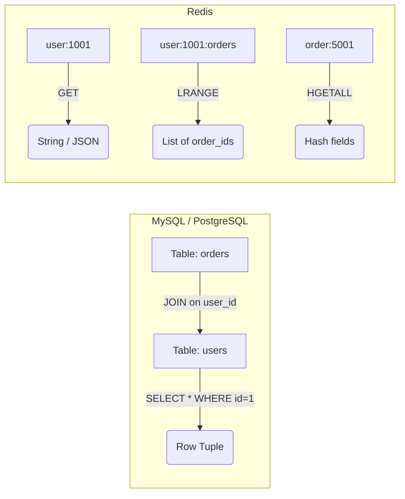
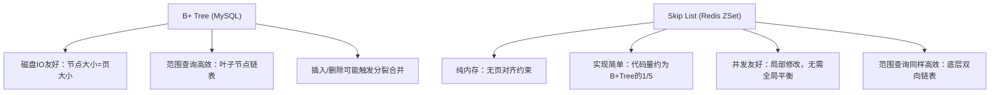
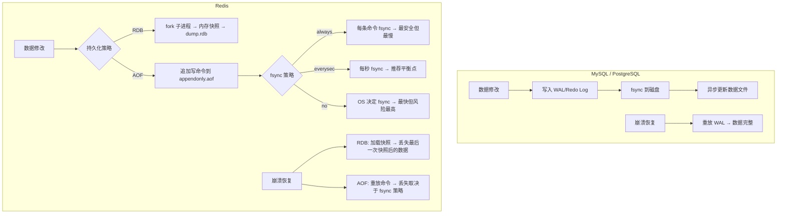
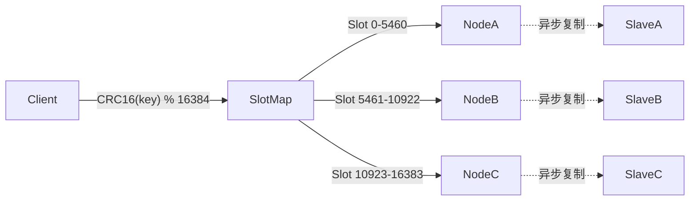
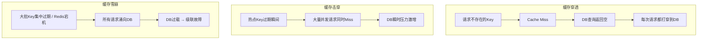

### 一、核心数据结构与内存模型

对于已有 MySQL/PostgreSQL 基础的开发者而言，学习 Redis 的首要任务不是记忆命令，而是完成从“关系型表结构”到“内存原生数据结构”的思维范式迁移。本阶段将帮助你建立正确的 Redis 数据建模认知，避免将 Redis 误用为“内存版 MySQL”。

#### 1.1 思维范式转换：从“二维表”到“Key-Value 命名空间”

在关系型数据库中，数据以规范化的二维表组织，查询依赖声明式 SQL，数据关联通过外键与 JOIN 实现。而 Redis 是一个**扁平的 Key-Value 命名空间**，没有 Schema、没有 JOIN、没有声明式查询语言，也没有传统意义上的事务回滚。



> ⚠️ **关键提醒**：不要试图在 Redis 中模拟关系模型。Redis 的设计哲学是 **“用合适的数据结构直接表达业务语义”**。例如，用户好友列表应直接用 Set 或 Sorted Set 存储，而非存一张 `friendship` 表再做查询。将 Redis 当作缓存层时，也应围绕访问模式设计数据结构，而非简单地将表行序列化为 String。

#### 1.2 五大基础数据类型与 RDBMS 对照

理解 Redis 数据类型的关键，在于将其与 RDBMS （**Relational Database Management System** 关系型数据库管理系统）中的概念进行**功能性对照**，同时明确其独有优势：

| 类型             | 底层编码（小 → 大）                    | RDBMS 功能对照                | Redis 独有优势场景                        |
| :------------- | :----------------------------- | :------------------------ | :---------------------------------- |
| **String**     | int → embstr → raw (SDS)       | VARCHAR / TEXT / INT      | 原子计数器、分布式锁、Bitmap 位运算、JSON 缓存       |
| **List**       | ziplist → quicklist            | 无直接对应（类似未索引顺序表）           | 轻量消息队列、最新 N 条记录、分页流                 |
| **Hash**       | ziplist → hashtable            | 单行记录（Row）                 | 对象属性存储，支持字段级读写，比 String 存 JSON 更省内存 |
| **Set**        | intset → hashtable             | 去重后的单列值集合                 | 标签系统、共同好友、抽奖池、去重校验                  |
| **Sorted Set** | ziplist → skiplist + hashtable | 带索引的有序表（ORDER BY + LIMIT） | 排行榜、延迟队列、滑动窗口限流、范围查询                |

> 📌 **背景补充：自适应编码机制**  
> MySQL InnoDB 对所有数据统一使用 B+ Tree 页存储，牺牲小数据的空间效率换取通用性。Redis 作为内存数据库，**内存效率是第一优先级**。当元素数量少或值短时，使用紧凑的连续内存结构（如 ziplist、intset）减少指针开销；数据增长到阈值后，自动升级为 O(1) 或 O(log N) 的高效结构。可通过 `OBJECT ENCODING key` 命令实时查看某个 Key 的底层编码。

#### 1.3 底层核心结构深度解析

##### 1.3.1 SDS vs VARCHAR：为什么 Redis 字符串不一样？

MySQL 的 VARCHAR 使用长度前缀+变长存储，但仍是面向文本的定界格式。Redis 的 SDS（Simple Dynamic String）在此基础上做了三项关键改进：

- **O(1) 获取长度**：显式存储 `len` 字段，无需遍历（C 字符串需 O(n)）
- **二进制安全**：可存储任意字节（包括 `\0`），适合存序列化数据、Token、图片摘要
- **预分配与惰性释放**：减少 `realloc` 次数，写入性能优于频繁 UPDATE 的 VARCHAR

```c
// Redis 3.2+ sdshdr8 示例（根据长度自动选择 hdr 类型）
struct __attribute__ ((__packed__)) sdshdr8 {
    uint8_t len;         // 已使用长度
    uint8_t alloc;       // 分配的总长度（不含头部和\0）
    unsigned char flags; // 低3位表示hdr类型，高5位保留
    char buf[];          // 实际字节数组（二进制安全）
};
```

##### 1.3.2 Skip List vs B+ Tree：ZSet 为何不用 B+ Tree？

这是有 RDBMS 背景者最常见的疑问。核心原因在于**存储介质与设计目标的根本差异**：



> 🔍 **深度解释**：B+ Tree 的核心优势是**减少磁盘 IO 次数**，节点大小与操作系统页对齐。但在纯内存场景中，该优势消失。Skip List 的随机层级结构在内存中常数因子极小，且实现复杂度远低于 B+ Tree（Redis 源码中 zset 相关代码仅数百行）。对内存数据库而言，**工程简洁性与维护成本**比理论最优更重要。此外，Skip List 的插入/删除仅需修改相邻指针，不涉及树旋转或节点分裂，在高并发写入时抖动更小。

##### 1.3.3 Hash 的 ziplist 压缩：与 MySQL 行压缩的区别

当 Hash 满足 `hash-max-ziplist-entries ≤ 512` 且 `hash-max-ziplist-value ≤ 64 bytes` 时，Redis 使用 ziplist 存储。这是一种**结构感知的紧凑编码**，所有元素连续存储，无指针开销。

- **MySQL ROW_FORMAT=COMPRESSED**：页级别通用压缩算法（zlib/lz4），解压需整页操作
- **Redis ziplist**：每个 entry 自描述长度，支持 O(N) 顺序访问和 O(1) 尾部追加。代价是中间插入/删除需 `memmove`，因此仅适用于小数据集

> ⚙️ **生产提示**：若 Hash 对象普遍较小（如用户会话、配置项），保持默认 ziplist 阈值可节省 30%-70% 内存。但若单个 Hash 频繁更新中间字段，过大的 ziplist 会导致 CPU 飙升。建议通过 `DEBUG OBJECT key` 观察实际编码状态，结合业务访问模式调整阈值。

#### 1.4 Key 设计规范：区别于 RDBMS 表命名

|原则|RDBMS 习惯|Redis 推荐实践|原因|
|:--|:--|:--|:--|
|命名风格|snake_case 表名|`业务:实体:ID` 冒号分隔|便于前缀扫描、ACL 权限控制、Keyspace Notification 过滤|
|长度控制|表名通常 < 64 字符|Key 尽量 < 128 字节|Key 本身占用内存，过长影响网络传输与哈希表性能|
|字符集|允许 Unicode|仅用 ASCII 可打印字符|防止命令行解析错误、日志乱码、客户端兼容问题|
|生命周期|通常不设 TTL|**必须评估是否设置 TTL**|Redis 内存有限，无 TTL 的 Key 是内存泄漏主因|

> 💡 **迁移经验**：避免使用纯数字 Key（易与内部优化冲突），推荐加业务前缀如 `usr:1001`。**永远不要在生产环境使用 `KEYS *`**，其 O(N) 复杂度会阻塞主线程。应使用 `SCAN` 游标迭代，或在设计时预留辅助索引 Key（如用 Set 记录某类实体的所有 ID）。

#### 1.5 内存模型初探：为什么同样的数据 Redis 比 MySQL “占地方”？

许多开发者发现：100 万条用户记录在 MySQL 中占 500MB，导入 Redis 后却用了 2GB。这并非 Redis 低效，而是**存储模型本质不同**：

- **MySQL**：数据以页为单位紧凑排列，行内无额外元数据，NULL 值用 bitmap 标记
- **Redis**：每个 Key-Value 都是独立内存分配单元，包含 dictEntry（24B）、redisObject（16B）、SDS 头部、分配器最小块等开销

> 📊 **量化参考**：一个空 String Key 的最小内存开销约 65-80 字节。若存储大量小对象，应考虑：
> 
> 1. 合并为 Hash（多个 field 共享一个 Key 的元数据开销）
> 2. 使用 Bitmap / HyperLogLog 等概率数据结构
> 3. 启用 `activedefrag yes`（Redis 4.0+）缓解内存碎片
> 4. 评估冷热分离架构，非热数据不必全部驻留内存

本阶段旨在建立 Redis 作为**内存原生数据结构服务器**的认知框架。掌握以上内容后，你已具备正确选型和设计 Redis 数据模型的能力。下一阶段将深入持久化机制与高可用架构，探讨如何在享受内存性能的同时保障数据安全与服务连续性。

### 二、持久化、高可用与分布式架构

对于熟悉 MySQL/PostgreSQL 的开发者而言，Redis 的持久化与高可用机制既熟悉又陌生。熟悉在于它们解决的核心问题（数据不丢失、服务不中断）与 RDBMS 一致；陌生在于 Redis 作为内存数据库，在性能与安全性之间做出了截然不同的权衡。本阶段将帮助你理解这些权衡背后的设计哲学，避免用 RDBMS 的“零丢失”标准误判 Redis 的架构选型。

#### 2.1 持久化机制：RDB 与 AOF 的本质差异

MySQL/PostgreSQL 采用 **WAL（Write-Ahead Logging）** 机制：所有修改先写 Redo Log/WAL，再异步刷盘，崩溃恢复时通过重放日志保证数据完整性。这是一种 **“日志即真相”** 的设计。

Redis 则提供了两种互补的持久化策略，且默认行为与 RDBMS 有显著不同：



> ⚠️ **关键认知纠偏**：  
> Redis **不是**为“零数据丢失”设计的。即使开启 `appendfsync always`，其吞吐量也会从 10万+ QPS 骤降至数百 QPS，失去作为缓存的意义。生产环境中，Redis 通常被定位为 **“允许少量数据丢失的高速数据层”**，核心业务数据必须以 RDBMS 为权威来源。若你的场景要求金融级持久性，请重新评估是否应使用 Redis。

##### 2.1.1 RDB 快照：fork 的代价与优化

RDB 通过 `fork()` 创建子进程生成内存快照。`fork()` 本身是 O(1) 的（仅复制页表），但后续写入会触发 **Copy-on-Write（COW）**，导致实际内存占用翻倍。

- **对比 MySQL mysqldump**：mysqldump 是逻辑导出，持锁时间长；RDB 是物理快照，fork 瞬间完成，对主线程阻塞极短
- **生产风险**：在内存使用率 > 50% 的实例上执行 BGSAVE，可能因 COW 触发 OOM Killer。建议预留至少 30%-50% 内存余量，或使用 `save ""` 禁用自动 RDB，仅在低峰期手动触发
- **Redis 4.0+ 混合持久化**：AOF 重写时将 RDB 快照嵌入 AOF 文件头部，兼顾快速恢复与数据完整性，**强烈推荐开启**

##### 2.1.2 AOF 重写：与 MySQL Binlog 的区别

|特性|MySQL Binlog|Redis AOF|
|:--|:--|:--|
|内容|逻辑变更事件（行级/语句级）|重建数据集的最小写命令集|
|用途|主从复制 + 时间点恢复|仅用于持久化恢复|
|重写机制|无（文件无限增长，靠 rotate）|定期重写压缩，消除冗余命令|
|一致性|严格顺序，支持 GTID|重写期间新命令追加到缓冲区，重写完成后合并|

> 📌 **背景补充**：AOF 重写不是“压缩日志”，而是**重新生成一份能还原当前状态的最简命令集**。例如，对同一个 Key 执行了 100 次 INCR，重写后只保留一条 `SET key 100`。这使得 AOF 文件远小于等效的 Binlog，但也意味着它无法用于时间点恢复（PITR）。

#### 2.2 高可用架构：Sentinel vs Cluster

MySQL 的主从复制是**同步/半同步**的，强一致；Redis 的主从复制是**纯异步**的，最终一致。这一根本差异决定了 Redis 高可用方案的边界。

##### 2.2.1 Sentinel（哨兵）：自动故障转移

Sentinel 监控一组 Redis 主从实例，当主节点不可达时自动选举新主并通知客户端。

- **适用场景**：数据量 < 单机内存上限、读写分离、简单高可用
- **对比 MHA/Orchestrator**：功能类似，但 Sentinel 内置于 Redis 生态，无需额外部署；缺点是元数据管理较弱，不适合大规模集群
- **脑裂防护**：通过 `min-replicas-to-write` 和 `min-replicas-max-lag` 配置，防止网络分区时旧主继续接受写入导致数据丢失。**务必配置！**

##### 2.2.2 Redis Cluster：数据分片与去中心化

当数据量超过单机内存或写入瓶颈时，需使用 Cluster 模式。它将 16384 个哈希槽分配到多个主节点，每个主节点可有从节点。



> 🔍 **深度解释：为什么是 16384 个槽？**  
> Redis Cluster 使用 Gossip 协议交换节点状态，心跳包中包含槽位映射信息。16384 个槽的位图仅需 2KB，可在心跳中高效传输。若槽数过多（如 65536），位图增大至 8KB，心跳带宽开销显著上升；若过少，则数据分布粒度粗糙，扩容时迁移成本高。16384 是工程实践中的平衡点。

- **对比 MySQL ShardingSphere/Vitess**：Redis Cluster 是**原生去中心化**，无代理层，客户端直连节点；而多数 MySQL 分片方案依赖中间件。优势是延迟低、无单点；劣势是客户端需实现 MOVED/ASK 重定向逻辑
- **跨槽操作限制**：多 Key 命令（如 MGET、SUNION）要求所有 Key 在同一槽内，否则报错。可通过 **Hash Tag** `{user:1001}.profile` 和 `{user:1001}.orders` 强制同槽，但需警惕热点 Key 风险
- **扩缩容**：在线迁移槽位，无需停机。但迁移期间涉及该槽的请求可能被 ASK 重定向，客户端必须正确处理

#### 2.3 与 MySQL 协同的架构模式

Redis 极少独立承担核心数据存储，通常作为 MySQL 的前置缓存层。以下是三种经典模式及其一致性权衡：

|模式|读路径|写路径|一致性|适用场景|
|:--|:--|:--|:--|:--|
|**Cache-Aside**|先查 Cache，miss 则查 DB 并回填|先更新 DB，再删除 Cache|弱一致（删除失败可重试/订阅 Binlog 补偿）|通用读多写少场景|
|**Read-Through**|Cache 层自动加载 DB 数据|应用只写 Cache，Cache 同步 DB|由 Cache 层保证|封装数据访问层，简化业务代码|
|**Write-Behind**|同 Read-Through|应用只写 Cache，异步批量写 DB|弱一致（Cache 宕机可能丢数据）|高频写入、容忍丢失（如计数器、点赞）|

> 💡 **生产经验**：
> 
> - **永远优先选择 Cache-Aside**，因其逻辑透明、故障影响可控
> - **删除 Cache 优于更新 Cache**：并发写时更新 Cache 易产生脏数据；删除后下次读取自然重建，配合 Binlog 订阅（如 Canal）可实现准实时缓存失效
> - **设置合理的 TTL**：即使有主动失效机制，TTL 仍是兜底保障，防止极端情况下缓存永久不一致
> - **避免大 Key 回填**：单次查询返回 MB 级数据时，考虑拆分 Key 或使用 Hash 存储，防止网络阻塞与内存抖动

#### 2.4 容量规划与监控要点

从 RDBMS 迁移到 Redis 时，容量评估维度完全不同：

- **内存 ≠ 数据大小**：需计入 Key 元数据、分配器碎片、复制缓冲区、AOF 重写缓冲等。建议使用 `redis-cli --bigkeys` 和 `MEMORY USAGE` 采样评估
- **连接数敏感**：Redis 单线程处理请求，过多连接会导致上下文切换开销。推荐使用连接池，并设置 `maxclients` 上限
- **慢查询危害更大**：MySQL 慢查询可能只影响单个会话；Redis 一个 KEYS * 或 HGETALL 大 Hash 会阻塞整个实例。**必须开启 slowlog 并设置告警**
- **监控指标优先级**：内存使用率 > 命中率 > 延迟 P99 > 连接数 > QPS。内存耗尽是 Redis 最常见的生产事故

本阶段覆盖了 Redis 在生产环境中安全运行的核心基础设施知识。掌握以上内容后，你已具备设计和运维中等规模 Redis 系统的能力。下一阶段将聚焦高阶特性与实战模式，包括分布式锁、Lua 脚本、Pipeline 优化及典型业务场景的最佳实践。

### 三、高阶特性与生产实战

在掌握了数据结构与架构基础后，本阶段将聚焦于 Redis 在生产环境中的“深水区”。对于有 RDBMS 背景的开发者而言，这一阶段的核心挑战在于：**放弃 SQL 的思维惯性，学会用原子操作、脚本和数据结构组合来解决并发、性能与业务逻辑问题**。以下内容均围绕真实生产场景展开，避免脱离实际的 API 罗列。

#### 3.1 缓存异常三大经典问题与防御体系

这是 Redis 作为缓存层时最高频的面试题，更是生产事故的常见根源。理解它们的关键，是将其视为**系统级风险**而非单纯的代码 Bug。



|问题|根因|防御方案（按优先级）|RDBMS 对比视角|
|:--|:--|:--|:--|
|**穿透**|恶意攻击或脏数据导致查询永远 Miss|① 布隆过滤器前置拦截  <br>② 缓存空值（TTL ≤ 5min）  <br>③ 接口参数校验|类似全表扫描防护，但 Redis 层需主动构建“负缓存”|
|**击穿**|热点 Key 过期 + 高并发|① 互斥锁（SETNX）重建缓存  <br>② 逻辑过期（不设 TTL，后台异步刷新）  <br>③ 永不过期 + 主动更新|类似数据库连接池耗尽，需在应用层实现“单飞”机制|
|**雪崩**|批量过期 / 实例故障|① TTL 加随机偏移量  <br>② 多级缓存（本地 + Redis）  <br>③ 限流降级 + 熔断  <br>④ Cluster/Sentinel 高可用|类似 DB 主库宕机，但 Redis 恢复更快，重点在“防冲击”|

> ⚠️ **生产警示**：
> 
> - **布隆过滤器有误判率**：它可能把“不存在”误判为“存在”，但绝不会把“存在”误判为“不存在”。因此只能用于拦截非法请求，不能作为数据正确性的依据。RedisBloom 模块提供原生支持，无需自行实现哈希函数。
> - **互斥锁慎用 SETNX**：必须设置过期时间防止死锁，且释放锁时需验证持有者身份（Lua 脚本原子操作）。更推荐使用 Redlock 算法或 Redisson 等成熟客户端封装。
> - **逻辑过期牺牲一致性换可用性**：适用于允许短暂读到旧数据的场景（如商品详情页），不适用于价格、库存等强一致字段。

#### 3.2 分布式锁：从 SETNX 到工业级实践

MySQL 可通过 `SELECT ... FOR UPDATE` 或唯一索引实现分布式锁，但性能差、持锁时间长。Redis 分布式锁的优势在于**轻量、高性能、自动超时释放**，但正确实现远比想象中复杂。

##### 3.2.1 基础实现的三大陷阱

1. **非原子加锁**：`SET key value` + `EXPIRE key ttl` 两条命令之间若崩溃，锁永不释放 → **必须使用 `SET key value NX PX ttl` 单条命令**
2. **误删他人锁**：业务执行超时，锁已自动释放，后续删除操作误删新持有者的锁 → **value 必须包含唯一标识（UUID+线程ID），删除前 Lua 校验**
3. **锁续期缺失**：业务未完成但锁已过期 → **需看门狗机制自动续期（Redisson 默认 30s，每 10s 续一次）**

##### 3.2.2 Redlock 与多节点共识

单节点 Redis 锁在主从切换时可能丢失（主写入锁后未同步到从就宕机，从晋升为新主后锁消失）。Redlock 算法要求向 N 个独立 Redis 实例申请锁，多数成功才算获锁。

> 🔍 **客观评价**：  
> Redlock 在学术界存在争议（Martin Kleppmann 指出其依赖时钟假设，在 GC 暂停或网络延迟下仍不安全）。**生产建议**：
> 
> - 若锁仅用于**防重/效率优化**（如防止重复提交），单节点锁 + 兜底校验即可
> - 若锁用于**安全关键场景**（如资金扣减），应使用 ZooKeeper/etcd 等强一致协调服务，而非 Redis
> - 永远不要将 Redis 锁作为数据一致性的唯一保障，必须有数据库层面的最终校验

#### 3.3 Lua 脚本：原子性与性能的平衡点

Redis 单线程模型保证了单命令原子性，但多命令组合无法保证。Lua 脚本在 Redis 中以**原子方式执行**，期间不会插入其他命令，是解决复杂原子操作的唯一可靠手段。

```lua
-- 示例：安全的分布式锁释放
local lock_key = KEYS[1]
local expected_token = ARGV[1]
if redis.call("GET", lock_key) == expected_token then
    return redis.call("DEL", lock_key)
else
    return 0
end
```

- **对比 MySQL 存储过程**：Lua 脚本无事务回滚、无游标、无复杂控制流，仅适合**短小、确定、高频**的原子操作
- **性能红线**：脚本执行时间过长会阻塞整个 Redis 实例。生产环境建议控制在 **5ms 以内**，超过则考虑拆分或使用 Stream/List 异步处理
- **EVALSHA 优化**：首次用 EVAL 加载脚本后，后续用 EVALSHA + SHA1 调用，避免重复传输脚本体。客户端库通常自动处理
- **禁止全局变量**：Redis Lua 沙箱禁用 os、io 等危险模块，且全局变量可能导致内存泄漏。务必使用 local 声明所有变量

#### 3.4 Pipeline 与批量操作：突破网络瓶颈

Redis 单次 RTT 约 0.1-1ms，但 1000 次串行 GET 的总耗时可达 100-1000ms。Pipeline 将多条命令打包发送，**一次 RTT 完成多个操作**，吞吐量提升 5-10 倍。

- **对比 MySQL 批量 INSERT**：Pipeline 不是事务，中间失败不会回滚；仅减少网络往返，不减少服务端处理时间
- **批次大小控制**：建议每批 500-1000 条命令或 ≤ 1MB 数据量。过大导致客户端缓冲溢出、服务端响应延迟尖刺
- **Cluster 模式限制**：Pipeline 中所有 Key 必须在同一槽位，否则部分命令被 MOVED/ASK 重定向，失去批量意义。需按槽位分组发送
- **MGET/MSET 的替代性**：对于纯读写同类型操作，优先使用 MGET/MSET（天然同槽校验）；混合操作才用 Pipeline

#### 3.5 典型业务场景最佳实践

|场景|推荐方案|避坑指南|
|:--|:--|:--|
|**排行榜**|Sorted Set（ZADD + ZREVRANGE）|分数相同时按时间排序：score = timestamp + 业务分值小数部分|
|**延迟队列**|Sorted Set（score=执行时间戳） + 轮询/ZPOPMIN|避免频繁轮询：结合 Keyspace Notification 或外部调度器触发|
|**滑动窗口限流**|Sorted Set（member=请求ID, score=时间戳） + ZRANGEBYSCORE + ZCARD|窗口内请求数超限则拒绝；定期清理过期成员防内存膨胀|
|**计数器/点赞**|String INCRBY / Hash HINCRBY|高频写入时用 Write-Behind 异步落库；防刷需结合 IP/用户维度限流|
|**会话管理**|Hash（field=session_attr） + TTL|避免大 Session：拆分冷热属性；TTL 随活跃动态续期|
|**消息通知**|Stream（XADD/XREADGROUP）|优于 List：支持消费者组、ACK 机制、持久化；List 仅适合简单 FIFO|

> 💡 **架构原则**：  
> Redis 是 **“胶水”而非“基石”**。它擅长加速、解耦、临时状态管理，但不应承担核心业务逻辑或长期数据存储。每个 Redis 用法都应回答：“如果 Redis 此刻完全不可用，系统能否降级运行？” 若答案是否定的，说明架构过度依赖 Redis，需重新设计。

#### 3.6 生产运维 Checklist

- [ ]  所有 Key 设置合理 TTL，无 TTL 的 Key 有明确文档说明
- [ ]  禁用 KEYS *，改用 SCAN；生产环境配置 rename-command KEYS ""
- [ ]  slowlog-log-slower-than ≤ 10ms，slowlog-max-len ≥ 128
- [ ]  maxmemory-policy 根据业务选择（volatile-lru / allkeys-lru / noeviction）
- [ ]  开启 AOF + 混合持久化，RDB 仅作备份
- [ ]  Cluster 模式下客户端正确处理 MOVED/ASK 重定向
- [ ]  监控告警覆盖：内存使用率 > 80%、命中率 < 90%、P99 延迟 > 10ms、连接数 > 80% maxclients
- [ ]  定期执行 MEMORY DOCTOR 检查内存健康度

本阶段覆盖了 Redis 在高并发生产环境中的核心实战知识。掌握以上内容后，你已具备设计和优化复杂 Redis 应用的能力。

### 四、综合实战练习与能力自测

本阶段旨在通过贴近真实业务的场景题，检验你是否真正完成了从 RDBMS 到 Redis 的思维迁移。每道题均设计为“陷阱式”问题，故意诱导常见的错误解法，再给出生产级正解与原理剖析。建议先独立思考，再对照解析查漏补缺。

#### 4.1 场景设计题：电商秒杀库存扣减

**题目描述**：  
某电商平台大促期间，一款限量 1000 件的商品在 10:00 开售。预估 QPS 峰值达 5万+。请设计基于 Redis 的库存扣减方案，要求：

1. 防止超卖
2. 支持高并发写入
3. 允许少量数据不一致（最终以 DB 为准），但绝不能出现负库存

**❌ 典型错误解法**：

```lua
-- 伪代码：先查后扣
local stock = redis.call("GET", "stock:item:1001")
if tonumber(stock) > 0 then
    redis.call("DECR", "stock:item:1001")
    return 1 -- 扣减成功
end
return 0 -- 库存不足
```

> **错误原因**：`GET` 与 `DECR` 非原子操作。在高并发下，多个请求同时读到相同库存值，导致超卖。即使使用 Lua 脚本包裹这两条命令，若未做边界校验，仍可能在 DECR 后产生负数。

**✅ 生产级正解**：

```lua
-- KEYS[1] = "stock:item:1001"
local current = tonumber(redis.call("GET", KEYS[1]))
if current == nil then
    return -1 -- 库存Key不存在，异常
end
if current <= 0 then
    return 0 -- 库存已耗尽
end
-- 原子扣减，且保证结果 >= 0
redis.call("DECR", KEYS[1])
return 1
```

**🔍 深度解析**：

- **为什么不用 DECRBY + 判断？** `DECRBY` 本身是原子的，但若扣减后值为负，仍需回滚（INCRBY），这又引入了非原子窗口。上述 Lua 脚本在单线程中执行，`GET → 判断 → DECR` 全程无中断，天然安全。
- **性能考量**：Lua 脚本执行时间 < 1ms，远低于网络 RTT。相比分布式锁（需多次 RTT + 续期开销），此方案吞吐量高一个数量级。
- **兜底机制**：Redis 仅做前置拦截，实际订单创建仍需 DB 层 `UPDATE stock SET qty = qty - 1 WHERE item_id = 1001 AND qty > 0` 二次校验。Redis 的作用是**将 5万 QPS 过滤为 ≤1000 次有效 DB 写入**。
- **预热与监控**：活动开始前必须 `SET stock:item:1001 1000`；活动中监控该 Key 的 QPS 与剩余量，设置告警阈值。

> [!success]- 点击展开题解
> 
> ### 🎯 核心考点与解题思路
> 
> 本题是电商高并发架构中的经典“守门员”问题。核心矛盾在于：**Redis 的极高吞吐能力**与**库存数据的强一致性要求**之间的平衡。
> 
> - **为什么不能只用 DB？** 5万 QPS 直接打 DB，行锁竞争会导致数据库瞬间崩溃。
> - **为什么 Redis 只是“前置拦截”？** Redis 是内存型存储，存在丢失风险（如宕机、主从延迟），因此它只能作为“高性能过滤器”，最终扣减必须以 DB 为准。
> - **核心原则：** Redis 层保证“不超卖、不负数”，DB 层保证“最终一致”。
> 
> ---
> 
> ### 🏗️ 架构设计全景图
> 
> 下图展示了秒杀请求从接入到落库的完整链路，重点突出 Redis Lua 脚本的“原子过滤”作用：
> 
> ```mermaid
> flowchart TD
>     A[用户发起秒杀请求] --> B{网关/限流层}
>     B -- 被限流 --> Z[返回: 活动太火爆]
>     B -- 放行 --> C[执行 Redis Lua 脚本]
>     
>     subgraph Redis_Cluster [Redis 集群 - 前置拦截]
>         C --> D{Lua 原子校验}
>         D -- Key不存在/异常 --> E[返回 -1: 系统异常]
>         D -- 库存 <= 0 --> F[返回 0: 已售罄]
>         D -- 库存 > 0 --> G[DECR 扣减并返回 1]
>     end
>     
>     G --> H[发送 MQ 消息 / 异步创建订单]
>     H --> I{DB 二次校验扣减}
>     I -- qty > 0 --> J[扣减成功, 生成订单]
>     I -- qty <= 0 --> K[回滚: Redis 补偿 INCR]
>     
>     style Redis_Cluster fill:#fff3cd,stroke:#856404,stroke-width:2px
>     style D fill:#d4edda,stroke:#155724,stroke-width:2px
>     style I fill:#cce5ff,stroke:#004085,stroke-width:2px
> ```
> 
> ---
> 
> ### 🔑 关键知识点深度解析
> 
> #### 1. 为什么 Lua 脚本能保证原子性？
> 
> 很多初学者误以为“Lua 脚本 = 事务”，其实更准确的理解是：
> 
> > **Redis 以单线程模型执行命令。当一个 Lua 脚本被 `EVAL` 调用时，Redis 会将整个脚本作为一个“不可分割的整体”串行执行，期间不会插入任何其他客户端的命令。**
> 
> 这意味着 `GET → 判断 → DECR` 三步操作之间**不存在任何时间窗口**，从根本上杜绝了并发读写导致的竞态条件（Race Condition）。这比分布式锁（如 Redisson）少了加锁/解锁的网络开销，性能高出数十倍。
> 
> #### 2. 为什么不用 `DECRBY` + 负数回滚？
> 
> |方案|优点|致命缺陷|
> |:--|:--|:--|
> |GET+判断+DECR (非Lua)|逻辑直观|非原子，必然超卖|
> |DECRBY + 负数回滚|代码简单|回滚(INCRBY)本身非原子；高并发下大量无效负数→回滚，浪费性能|
> |**Lua 先判后扣** ✅|**原子、无负数、高性能**|需维护脚本版本|
> 
> 💡 **通俗理解**：`DECRBY` 方案就像“先拿货再检查有没有多拿，多了就放回去”；而 Lua 方案是“先看仓库还有没有货，有才伸手拿”。在 5万 QPS 下，“拿了又放回”的动作本身就是巨大的性能损耗。
> 
> #### 3. DB 二次校验为何不可或缺？
> 
> Redis 扣减成功 ≠ 订单一定创建成功。以下场景会导致数据不一致：
> 
> - Redis 扣减后，应用服务器宕机，未写入 DB
> - MQ 消息丢失或消费失败
> - DB 写入时因其他业务约束失败
> 
> 因此 DB 层必须使用**乐观锁语义**进行兜底：
> 
> ```sql
> UPDATE stock 
> SET qty = qty - 1 
> WHERE item_id = 1001 AND qty > 0;
> ```
> 
> 若影响行数为 0，说明 DB 已无库存，此时需**异步补偿 Redis**（`INCR` 归还），避免 Redis 库存永久少计。
> 
> ---
> 
> ### ⚠️ 生产环境注意事项清单
> 
> - **预热必须在活动前完成**：通过管理后台或定时任务提前 `SET stock:item:{id} {total}`，严禁秒杀开始时才初始化
> - **Lua 脚本使用 `EVALSHA`**：首次加载后用 SHA1 缓存，避免每次传输完整脚本，减少网络带宽消耗
> - **Key 设计要隔离**：使用 `stock:sec:{itemId}` 而非通用 key，防止与其他业务互相干扰
> - **监控告警三件套**：
>     - Redis Key 剩余量 ≤ 阈值时告警（防突发售罄无感知）
>     - Lua 脚本执行耗时 P99 > 2ms 时告警（防阻塞 Redis）
>     - Redis 与 DB 库存差异 > 容忍值时告警（防数据漂移）
> - **兜底降级策略**：当 Redis 不可用时，可临时切换为 DB 直扣 + 令牌桶限流，牺牲部分性能保可用性
> 
> ---
> 
> ### 📝 总结
> 
> 秒杀库存扣减的本质是 **“用空间换时间、用前置过滤保护后端”**。Redis Lua 脚本承担了 99% 的无效请求过滤，将真正的有效写入压力降至商品总量级别（本例中 ≤1000 次）。记住：**Redis 负责快，DB 负责对，两者协同才是生产级方案。**

#### 4.2 故障排查题：Redis 延迟突增

**题目描述**：  
线上 Redis Cluster 某节点 P99 延迟从 2ms 飙升至 200ms，持续约 30 秒后恢复。`SLOWLOG` 显示多条 `KEYS user:*` 命令，耗时 180ms+。但应用代码中从未显式调用 `KEYS`。请分析根因并给出修复方案。

**❌ 典型误判**：

- “一定是运维手动执行了 KEYS” → 忽略自动化任务或第三方工具
- “升级 Redis 版本就能解决” → 未定位根本原因

**✅ 正确排查路径**：

1. **确认命令来源**：检查 `CLIENT LIST` 中执行 `KEYS` 的连接 IP/端口，发现是内部监控平台在采集 Key 数量
2. **理解阻塞本质**：`KEYS` 是 O(N) 全量扫描，N=500万时必然阻塞主线程。Cluster 模式下还会影响 Gossip 心跳，可能触发误故障转移
3. **立即止血**：`KILL` 对应客户端连接；临时禁用监控平台的 Key 统计功能
4. **根治方案**：
    - 监控改用 `INFO keyspace` 获取各 DB 的 Key 总数（O(1)）
    - 若需按前缀统计，改用 `SCAN` 游标迭代 + 本地聚合，或在写入时维护辅助计数器（如 `HINCRBY stats:prefix_count user 1`）
    - 生产环境配置 `rename-command KEYS ""` 彻底禁用

> 💡 **延伸思考**：除 `KEYS` 外，以下操作同样危险：`HGETALL` / `SMEMBERS` / `LRANGE` 作用于大 Key、`FLUSHALL`、复杂 Lua 脚本。应建立 **“高危命令清单”** 并在 CI/CD 中静态扫描代码。

> [!success]- 点击展开题解
> 
> ### 🔍 Redis Cluster 延迟突增深度复盘：当 KEYS 命令成为“隐形杀手”
> 
> 在生产环境中，Redis P99 延迟从 2ms 飙升至 200ms 属于**严重性能事故**。本题的核心难点不在于 `KEYS` 命令本身的危害（这是基础知识），而在于 **“代码未调用但慢日志存在”** 这一矛盾现象。这要求排查者跳出应用代码视角，建立包含基础设施、第三方工具、集群协议在内的全链路诊断思维。
> 
> 以下是针对该故障的深度题解，涵盖原理剖析、排查实操、修复方案及防御体系建设。
> 
> ---
> 
> ### 一、 核心原理：为什么 KEYS 是集群环境的“剧毒”？
> 
> 很多开发者知道 `KEYS` 慢，但在 Cluster 环境下，其危害会被**非线性放大**。我们需要从三个维度理解其破坏力。
> 
> #### 1. 单线程阻塞模型（根本原因）
> 
> Redis 的命令执行是单线程的。`KEYS user:*` 是 O(N) 复杂度操作，N 为数据库中键的总数（而非匹配到的数量）。当 N=500万时，CPU 会持续进行模式匹配计算约 180ms。在此期间，**事件循环被完全占用**，所有其他客户端的 GET/SET 请求、甚至集群内部通信都会被强制挂起。
> 
> #### 2. Cluster Gossip 协议的连锁反应
> 
> Redis Cluster 节点间通过 Gossip 协议交换状态（PING/PONG/MEET/FAIL）。这些消息的处理也依赖主线程。
> 
> ```mermaid
> sequenceDiagram
>     participant App as 业务客户端
>     participant NodeA as Redis Node A<br/>(执行KEYS中)
>     participant NodeB as Redis Node B
>     participant NodeC as Redis Node C
>     
>     Note over NodeA: ⚠️ KEYS user:* 开始<br/>主线程阻塞 180ms
>     App->>NodeA: GET session:abc
>     Note over App: ❌ 请求排队等待...
>     NodeB->>NodeA: PING (Gossip心跳)
>     Note over NodeA: ❌ 无法处理心跳
>     NodeC->>NodeA: PING (Gossip心跳)
>     Note over NodeA: ❌ 无法处理心跳
>     Note over NodeB,NodeC: 超过 cluster-node-timeout<br/>标记 NodeA 为 PFAIL
>     NodeB->>NodeC: FAIL msg for NodeA
>     Note over NodeB,NodeC: ⚠️ 可能触发误故障转移!
>     Note over NodeA: KEYS 执行完毕
>     NodeA-->>App: 返回结果 (延迟 180ms+)
> ```
> 
> > 💡 **关键概念解释：PFAIL vs FAIL**
> > 
> > - **PFAIL (Possible Failure)**：单个节点在 `cluster-node-timeout` 内未收到目标节点的有效回复，将其标记为“疑似下线”。这是局部判断。
> > - **FAIL**：当集群中**大多数主节点**都将某节点标记为 PFAIL 后，会通过 Gossip 传播并升级为 FAIL，此时才会真正触发故障转移。
> > - **本题风险**：若 `KEYS` 阻塞时间接近或超过 `cluster-node-timeout`（默认15秒），虽单次不至于触发 FAIL，但若监控平台**周期性**执行 `KEYS`，会导致节点频繁处于 PFAIL 边缘，极大增加集群不稳定性。
> 
> #### 3. 内存与 CPU 的双重压力
> 
> `KEYS` 不仅消耗 CPU，还会在短时间内构建一个包含所有匹配键的**巨大响应缓冲区**。若匹配键数量达数十万，这个临时列表会占用大量内存，甚至触发 `maxmemory` 淘汰策略或 OOM。
> 
> ---
> 
> ### 二、 标准化排查路径：从矛盾现象到精准定位
> 
> 面对“代码无调用但日志有记录”的场景，应遵循以下四步排查法：
> 
> ```mermaid
> flowchart TD
>     A["🚨 P99延迟突增至200ms"] --> B{"SLOWLOG GET 20"}
>     B -->|"发现多条 KEYS user:*<br/>耗时180ms+"| C["CLIENT LIST | grep KEYS"]
>     C --> D{"匹配连接 addr 字段"}
>     D -->|"IP属于内部监控平台"| E["✅ 根因确认:<br/>监控采集Key统计"]
>     D -->|"IP属于运维跳板机"| F["排查Ansible/SaltStack等<br/>自动化巡检脚本"]
>     D -->|"IP属于未知来源"| G["检查云厂商控制台/<br/>DMS/安全审计工具"]
>     E --> H["🩹 立即止血"]
>     F --> H
>     G --> H
>     H --> H1["CLIENT KILL <addr>"]
>     H --> H2["禁用监控平台Key统计功能"]
>     H1 --> I["🔧 根治方案设计"]
>     H2 --> I
> ```
> 
> #### 🛠️ 实战命令详解
> 
> **Step 1: 确认慢查询详情**
> 
> ```bash
> # 获取最近20条慢查询，关注 cmd、duration、client_ip_port 字段
> SLOWLOG GET 20
> 
> # 输出示例：
> # 1) 1) (integer) 14
> #    2) (integer) 1719062400
> #    3) (integer) 182345        ← 耗时 182ms
> #    4) 1) "KEYS"
> #       2) "user:*"
> #    5) "10.0.1.50:43210"       ← ⭐ 关键：执行该命令的客户端地址
> #    6) ""
> ```
> 
> **Step 2: 追溯客户端身份**
> 
> ```bash
> # 根据上一步获取的 IP:PORT 精确查找连接信息
> CLIENT LIST | grep "10.0.1.50:43210"
> 
> # 关注字段：
> # addr=10.0.1.50:43210  ← 客户端地址
> # name=monitor-agent    ← ⭐ 若设置了CLIENT SETNAME，可直接识别身份
> # cmd=keys              ← 当前正在执行的命令
> # age=3600              ← 连接存活时间(秒)，判断是否为长连接监控
> # idle=0                ← 空闲时间，0表示正在执行命令
> ```
> 
> **Step 3: 紧急止血**
> 
> ```bash
> # 立即断开问题连接（不影响其他正常连接）
> CLIENT KILL ADDR 10.0.1.50:43210
> 
> # 若同一IP有多个连接，可按条件批量KILL
> CLIENT KILL MAXAGE 3600 ADDR 10.0.1.50:43210
> ```
> 
> > ⚠️ **注意**：`CLIENT KILL` 是即时生效的，被 KILL 的连接上未完成的命令会返回错误。对于监控类连接，这通常是可接受的。
> 
> ---
> 
> ### 三、 根治方案：分级替代策略
> 
> 根据不同的业务需求，选择最合适的替代方案：
> 
> |需求场景|❌ 错误做法|✅ 推荐方案|时间复杂度|一致性|适用说明|
> |:--|:--|:--|:--|:--|:--|
> |获取 DB 总 Key 数|`KEYS *` / `DBSIZE`|`INFO keyspace`|O(1)|强一致|直接读取元数据，零开销，监控首选|
> |按前缀模糊统计|`KEYS prefix:*`|`SCAN` + 本地聚合|O(N) 分批|弱一致|游标迭代，每次 COUNT 建议 100-500|
> |实时精确前缀计数|定时 `KEYS`|写入时 `HINCRBY`|O(1) 写|强一致|空间换时间，适合高频读取场景|
> |调试/临时排查|`KEYS pattern`|`SCAN MATCH pattern`|O(N) 分批|弱一致|仅限开发/测试环境或低峰期|
> |彻底杜绝风险|依赖人工规范|`rename-command`|-|-|生产环境配置层面物理禁用|
> 
> #### 方案详解
> 
> **方案 A：`INFO keyspace`（监控统计首选）**
> 
> ```bash
> # 返回各DB的键数量、过期键数量等元数据
> INFO keyspace
> 
> # 输出示例：
> # # Keyspace
> # db0:keys=5000000,expires=120000,avg_ttl=3600000
> # db1:keys=230,expires=0,avg_ttl=0
> ```
> 
> 该命令直接从 Redis 内部数据结构读取计数器，**完全不遍历键空间**，是监控平台采集 Key 总数的唯一正确方式。
> 
> **方案 B：`SCAN` 游标迭代（按前缀统计）**
> 
> ```python
> # Python 伪代码示例
> cursor = 0
> count = 0
> while True:
>     cursor, keys = redis.scan(cursor=cursor, match="user:*", count=200)
>     count += len(keys)
>     if cursor == 0:
>         break
> print(f"Total user keys: {count}")
> ```
> 
> > 📝 **SCAN 的关键参数**：`COUNT` 不是精确返回数量，而是**提示**Redis 每次迭代检查多少个桶。实际返回可能多于或少于该值。建议设为 100-500，避免单次迭代耗时过长。
> 
> **方案 C：辅助计数器（实时精确计数）**
> 
> ```bash
> # 写入时同步维护计数
> SET user:10086 "value"
> HINCRBY stats:prefix_count user 1
> 
> # 删除时同步递减
> DEL user:10086
> HDECRBY stats:prefix_count user 1
> 
> # 读取时 O(1) 获取
> HGET stats:prefix_count user  # 返回 "5000000"
> ```
> 
> 此方案将统计成本**分摊到每次写操作**中，读取时为 O(1)。需注意保证业务操作与计数操作的原子性（可使用 Lua 脚本或事务）。
> 
> **方案 D：`rename-command` 物理禁用**
> 
> ```conf
> # redis.conf
> rename-command KEYS ""
> rename-command FLUSHALL ""
> rename-command FLUSHDB ""
> ```
> 
> 配置后，任何客户端执行 `KEYS` 都会收到 `ERR unknown command` 错误。**注意**：此配置需在所有集群节点上一致部署，且重启后生效。部分云托管 Redis 可能不支持此配置，需使用安全组/ACL 替代。
> 
> ---
> 
> ### 四、 延伸思考：构建高危命令防御体系
> 
> `KEYS` 只是冰山一角。以下命令同样具有 O(N) 阻塞风险，应纳入统一的治理框架：
> 
> #### 🚨 高危命令清单
> 
> |命令|风险等级|触发条件|安全替代|
> |:--|:--|:--|:--|
> |`KEYS *`|🔴 极高|任何生产环境|`SCAN` / `INFO keyspace`|
> |`FLUSHALL` / `FLUSHDB`|🔴 极高|任何生产环境|`FLUSHALL ASYNC` (4.0+)|
> |`HGETALL` / `SMEMBERS`|🟠 高|作用于大 Key (>1万元素)|`HSCAN` / `SSCAN`|
> |`LRANGE key 0 -1`|🟠 高|作用于大 List|分页 `LRANGE` / `LPOP`|
> |`EVAL` / `EVALSHA`|🟡 中|Lua 脚本执行 >10ms|优化脚本逻辑 / 拆分|
> |`SORT`|🟡 中|大数据集排序|应用层排序|
> |`SAVE`|🔴 极高|任何生产环境|`BGSAVE`|
> 
> #### 🛡️ 四层防御架构
> 
> ```mermaid
> flowchart LR
>     A["🏗️ 架构层"] --> B["大Key拆分 / 热Key本地缓存<br/>读写分离 / 多DB隔离"]
>     C["⚙️ 配置层"] --> D["rename-command 禁用高危命令<br/>maxmemory-policy 合理淘汰"]
>     E["🔄 CI/CD层"] --> F["静态代码扫描(redis-lint)<br/>Code Review Checklist"]
>     G["📊 监控层"] --> H["SLOWLOG 告警(阈值50ms)<br/>大Key实时监控(rdb分析)"]
>     
>     B & D & F & H --> I["✅ 生产安全基线"]
> ```
> 
> 1. **架构层**：从根本上减少大 Key 和热点 Key 的产生
> 2. **配置层**：通过 Redis 自身配置做最后一道防线
> 3. **CI/CD 层**：在代码合入前拦截高危调用，左移安全风险
> 4. **监控层**：建立 SLOWLOG 主动告警（而非仅依赖 P99 延迟被动发现），定期分析 RDB/AOF 文件识别大 Key
> 
> ---
> 
> ### 五、 背景知识补充
> 
> **Q1: 为什么监控平台会用 KEYS 而不是 INFO？**  
> 早期版本的开源监控工具（如 Prometheus Redis Exporter < v1.0、某些云厂商旧版控制台）为了提供“按前缀分类统计 Key 数量”的功能，选择了最简单的实现方式——`KEYS` 遍历后在应用层正则匹配分组。这在测试环境数据量小时毫无问题，但在生产环境百万级键下就会成为定时炸弹。**部署任何监控工具前，务必审查其 Redis 交互行为，优先选用成熟版本。**
> 
> **Q2: Redis 7.0+ 升级能解决 KEYS 问题吗？**  
> **不能。** Redis 7.0 引入了 Function、Sharded Pub/Sub、Multi-part AOF 等新特性，但**单线程命令执行模型未变**。`KEYS` 的 O(N) 阻塞本质是由算法复杂度决定的，与版本无关。版本升级可以改善持久化、内存效率等，但不会改变危险命令的阻塞特性。**正确的使用方式永远比版本升级更重要。**
> 
> **Q3: SCAN 真的完全安全吗？**  
> `SCAN` 是**非阻塞**的，但不是**无代价**的：
> 
> - **弱一致性**：迭代期间新增的键可能被遗漏，删除的键可能被重复返回
> - **累计开销**：虽然单次不阻塞，但大量 `SCAN` 请求仍会累积 CPU 消耗
> - **网络带宽**：若匹配键极多，传输结果集本身也会占用带宽  
>     因此，`SCAN` 应设置合理的 `COUNT` 值，避免在业务高峰期执行全量扫描，并在应用层做好去重和容错处理。
> 
> ---
> 
> ### 📋 总结 Checklist
> 
> 遇到类似延迟突增问题时，可按此清单逐项确认：
> 
> - [ ]  `SLOWLOG` 确认具体命令及耗时
> - [ ]  `CLIENT LIST` 追溯命令来源 IP/端口/连接名
> - [ ]  识别是否为监控/运维/第三方工具触发
> - [ ]  立即 `CLIENT KILL` 止血
> - [ ]  评估替代方案（INFO / SCAN / 辅助计数器）
> - [ ]  生产环境禁用高危命令
> - [ ]  建立 SLOWLOG 主动告警机制
> - [ ]  CI/CD 集成高危命令静态扫描
> - [ ]  定期大 Key 分析与治理

#### 4.3 架构决策题：是否引入 Redis？

**题目描述**：  
团队开发一个内部审批系统，日均请求量 2000 次，峰值 QPS < 10。数据量小（< 10万条记录），读多写少。有同事提议“加个 Redis 缓存提升性能”。你作为技术负责人，如何决策？

**❌ 盲目跟风**：  
“Redis 快，加了肯定没错” → 忽略运维成本与复杂度收益比

**✅ 理性评估框架**：

|评估维度|本场景现状|Redis 带来的价值|引入成本|
|:--|:--|:--|:--|
|性能瓶颈|QPS < 10，MySQL 单机轻松承载|几乎无感知提升|新增组件部署、监控、故障预案|
|数据一致性|审批流程强一致|增加缓存失效/同步逻辑|开发测试成本 + 潜在 Bug 风险|
|运维负担|仅 MySQL 一套存储|双组件运维、容量规划、备份策略|人力成本显著上升|
|未来扩展性|业务稳定，增长缓慢|过度设计|技术债累积|

**决策结论**：**不引入 Redis**。  
当前 MySQL + 合理索引 + 连接池已完全满足需求。若未来出现以下任一条件，再重新评估：

- QPS 持续增长至 MySQL 单实例瓶颈（通常 > 1000 QPS）
- 出现高频读取且可容忍短暂不一致的场景（如审批列表预览）
- 需要实时排行榜、会话管理等 Redis 独有功能

> 📌 **核心原则**：**“如无必要，勿增实体”**。Redis 是利器，但不是万能药。对于有 RDBMS 背景的开发者，最大的成长不是学会用 Redis，而是学会**克制地使用 Redis**。

> [!success]- 点击展开题解
> 
> ## 🎯 题解核心：架构决策中的“克制”哲学
> 
> 这道题表面上是在问“要不要用 Redis”，实际上考察的是**技术选型方法论**。作为技术负责人，在面对低负载场景下的“性能优化”提议时，必须跳出“唯性能论”的陷阱，从**ROI（投入产出比）**和**系统复杂度**的全局视角进行决策。
> 
> ### 💡 核心概念解析
> 
> - **QPS (Queries Per Second)**：每秒查询率。本题中 QPS < 10 意味着平均 100ms 才有一个请求，这对于现代关系型数据库而言属于“空载”状态。
> - **强一致性 vs 最终一致性**：审批系统涉及业务流转与权限校验，通常要求数据绝对准确（强一致）。引入缓存后，若采用 Cache-Aside 等模式，必然存在短暂的“脏读”窗口或复杂的同步逻辑，这与业务本质冲突。
> - **奥卡姆剃刀原则**：在软件工程中体现为“如无必要，勿增实体”。每一个新组件的引入，都伴随着部署、监控、故障排查、数据同步等隐性成本。
> 
> ---
> 
> ### 📊 决策评估模型可视化
> 
> 下图展示了在本场景下，引入 Redis 前后系统复杂度与收益的非线性关系：
> 
> ```mermaid
> graph LR
>     A[当前需求:<br/>QPS<10, 强一致] --> B{评估维度}
>     
>     B --> C[性能收益]
>     B --> D[运维成本]
>     B --> E[开发复杂度]
>     B --> F[数据风险]
>     
>     C -.->|极低| G[MySQL单机已溢出]
>     D -->|显著增加| H[新增组件/监控/备份]
>     E -->|显著增加| I[缓存失效/双写逻辑]
>     F -->|潜在隐患| J[审批流数据不一致]
>     
>     G & H & I & J --> K[决策: ❌ 不引入Redis]
>     
>     style K fill:#f9d0c4,stroke:#333,stroke-width:2px
>     style G fill:#d4edda,stroke:#333
>     style H fill:#fff3cd,stroke:#333
>     style I fill:#fff3cd,stroke:#333
>     style J fill:#f8d7da,stroke:#333
> ```
> 
> ### 🔍 深度背景补充：为什么 MySQL 在这里够用？
> 
> 很多开发者对 MySQL 的性能存在误解，认为它“慢”。事实上，在合理索引和连接池配置下：
> 
> - **单表 10 万级数据**：B+ 树索引高度通常仅为 3-4 层，单次查询 IO 次数极少，响应时间通常在 **1ms~5ms** 级别。
> - **QPS < 10**：远低于 MySQL 单实例数千甚至上万 QPS 的理论上限。此时瓶颈根本不在数据库，甚至不在网络，而在“没有请求”。
> - **连接池复用**：避免了频繁创建/销毁连接的开销，使得低频访问依然保持低延迟。
> 
> > ⚠️ **认知纠偏**：缓存解决的是“数据库扛不住”的问题，而不是“让系统更快”的万能钥匙。当数据库本身毫无压力时，加缓存只是把“数据库的简单查询”变成了“缓存+数据库的双重维护难题”。
> 
> ### 🛠️ 何时才应该重新考虑 Redis？
> 
> 架构是演进的，当前的“不引入”不代表永远排斥。建议设置明确的**触发阈值**：
> 
> |触发条件|说明|推荐 Redis 用法|
> |:--|:--|:--|
> |QPS > 1000 且持续增长|MySQL 单实例出现 CPU/IO 瓶颈|热点数据缓存（Cache-Aside）|
> |出现高频读、容忍秒级延迟|如审批列表预览、统计看板|只读副本 + TTL 过期策略|
> |需要原子计数/排行榜/分布式锁|RDBMS 实现成本高或性能差|String/ZSet/Set 原生数据结构|
> |会话/临时状态管理|无状态服务横向扩展需求|Hash + EXPIRE|
> 
> ### 📝 总结与建议
> 
> 对于有 RDBMS 背景的工程师，成长的关键里程碑不是“学会了 Redis”，而是**学会了判断什么时候不需要 Redis**。
> 
> 在面试或实际工作中回答此类问题时，建议遵循以下表达结构：
> 
> 1. **量化现状**：先摆数据（QPS、数据量、一致性要求）。
> 2. **评估收益**：诚实指出在当前规模下收益趋近于零。
> 3. **列举成本**：具体说明运维、开发、风险三方面的代价。
> 4. **给出结论**：明确拒绝，并给出未来重新评估的客观标准。
> 
> 这种回答方式体现了**工程思维**而非**工具崇拜**，正是高级技术人才的核心素养。

#### 4.4 自测 Checklist

完成以上练习后，请诚实回答以下问题。若超过 3 项不确定，建议回顾对应章节：

- [ ]  能否清晰解释 SDS、Skip List 与 MySQL VARCHAR/B+Tree 的设计差异及背后原因？
- [ ]  能否根据业务特征选择 RDB/AOF/混合持久化，并说明权衡依据？
- [ ]  能否独立写出安全的分布式锁 Lua 脚本，并说明 Redlock 的适用边界？
- [ ]  能否区分缓存穿透/击穿/雪崩，并为每种问题提供至少两种防御手段？
- [ ]  能否在不使用 KEYS 的前提下，实现前缀扫描、Key 统计、大 Key 发现？
- [ ]  面对新需求时，是否能先评估“是否真的需要 Redis”，而非直接设计 Redis 方案？
- [ ]  能否说出至少三个生产环境中因误用 Redis 导致的事故案例及教训？

#### 4.5 进阶学习方向指引

当你扎实掌握本教程全部内容后，可根据职业发展选择深入方向：

- **内核开发**：阅读 Redis 源码（推荐 7.x），重点关注 dict.c、t_zset.c、replication.c、cluster.c
- **云原生 Redis**：研究 KubeBlocks、Redis Operator、AWS MemoryDB 等托管方案的架构差异
- **替代生态**：了解 KeyDB（多线程）、Dragonfly（共享内存）、Garnet（C#/.NET）等新锐项目的创新点
- **数据平台**：探索 Redis + Flink/Kafka 构建实时数仓、CDC 缓存同步等流批一体架构

> 🎯 **最终寄语**：  
> Redis 的学习终点不是记住所有命令，而是建立一种 **“内存优先、结构驱动、权衡取舍”** 的系统设计直觉。这种直觉不仅适用于 Redis，也将深刻影响你对所有存储系统的理解与运用。愿你在内存与磁盘、速度与持久、简单与复杂之间，找到属于自己的平衡点。