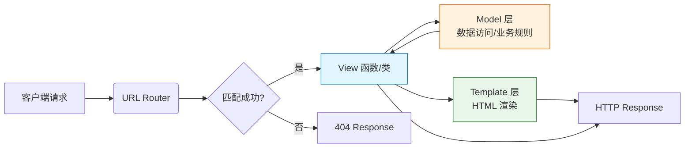
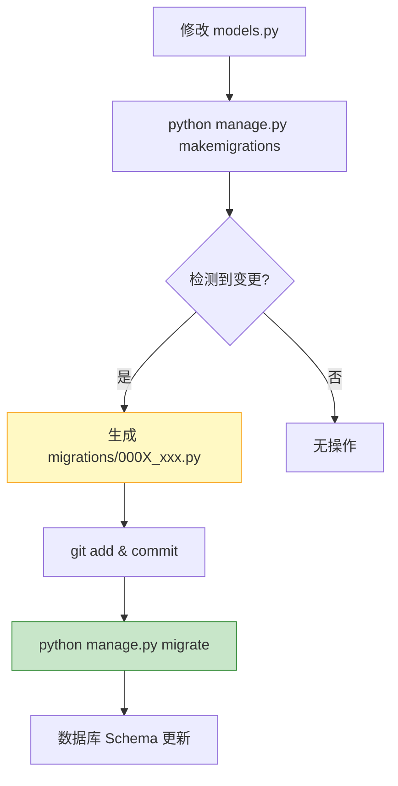
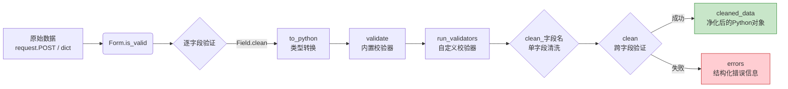
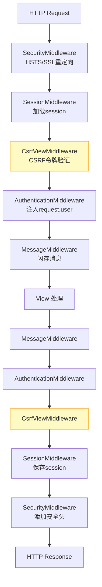
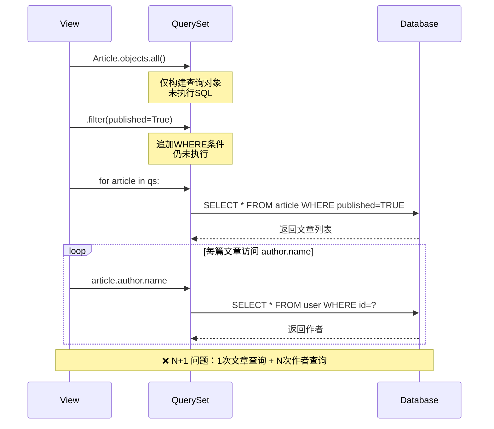
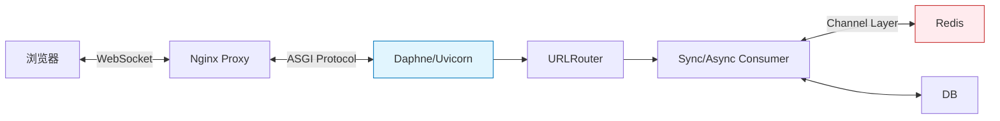
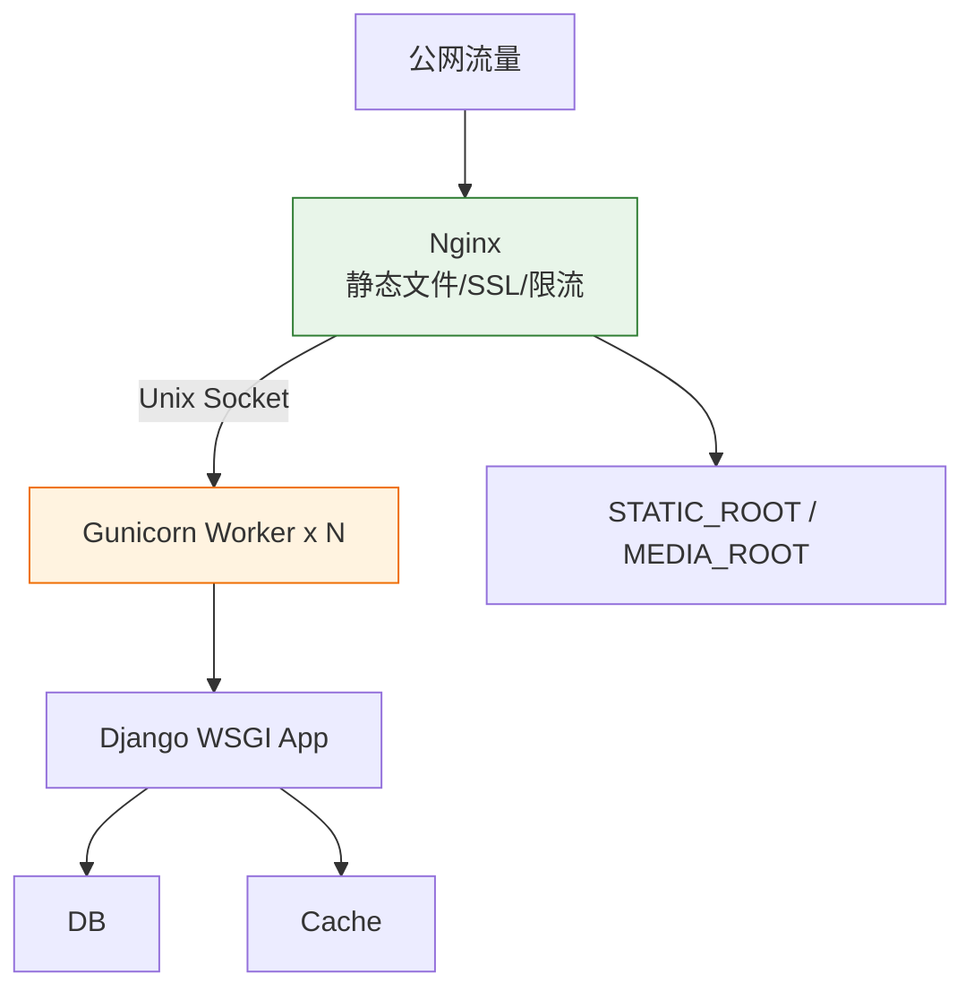
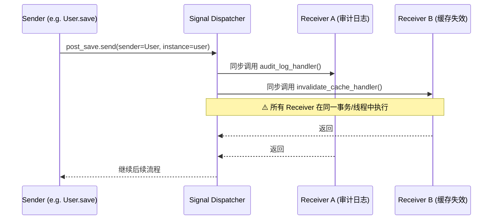
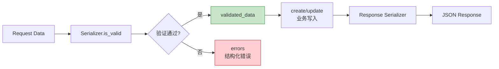
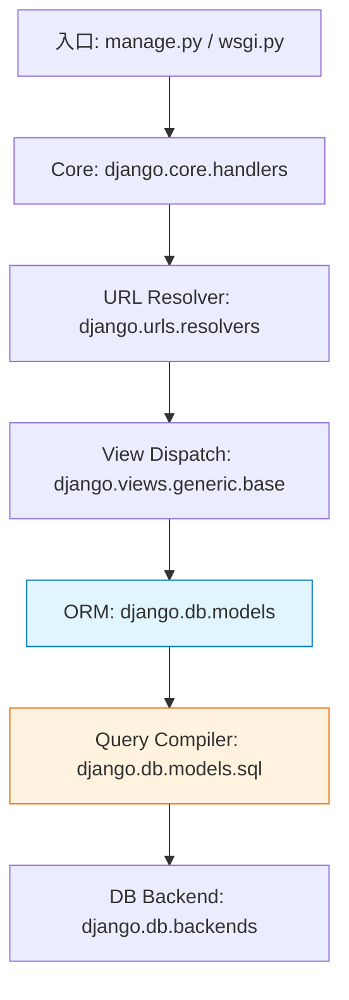

### 一、核心机制与 MTV 架构落地

#### 1.1 Django 的设计哲学与项目结构

Django 遵循 **"Batteries Included"**（电池内置）与 **"Explicit is better than implicit"**（显式优于隐式）两大原则。前者意味着框架自带 ORM、Auth、Admin、缓存等组件，减少第三方依赖选型成本；后者要求开发者在配置与代码中明确表达意图，避免魔法行为带来的调试困难。

一个标准 Django 项目的目录结构如下（以 `myproject` 为例）：

```text
myproject/
├── manage.py            # 项目管理入口，封装了 django-admin 命令
├── myproject/           # 项目级配置包
│   ├── __init__.py
│   ├── settings.py      # 全局配置（数据库、中间件、INSTALLED_APPS 等）
│   ├── urls.py          # 根 URL 路由表
│   ├── asgi.py / wsgi.py # ASGI/WSGI 应用入口，供生产服务器调用
└── apps/                # 业务应用目录（推荐独立于项目配置包）
    └── blog/
        ├── models.py    # 数据模型定义
        ├── views.py     # 视图逻辑（业务处理）
        ├── urls.py      # 应用级路由
        ├── templates/   # 模板文件
        ├── admin.py     # Admin 后台注册
        └── migrations/  # 数据库迁移文件
```

> **关键区分**：Django 中 "Project" 是部署单元（含配置与多个 App），"App" 是可复用的功能模块（如博客、评论、用户中心）。一个 Project 可包含多个 App，一个 App 也可被多个 Project 引用。**切勿将所有代码塞入单个 App**——这违背了 Django 的模块化设计初衷。

#### 1.2 MTV 架构模式详解

Django 自称 MTV（Model-Template-View），而非传统 MVC。这一命名差异常引发混淆，其本质是职责划分的重新映射：



|MTV 组件|对应传统 MVC|核心职责|读者已有基础的衔接点|
|:--|:--|:--|:--|
|**Model**|Model|定义数据结构、字段约束、关联关系；封装数据访问逻辑（Manager/QuerySet）|SQL 表结构 → Python 类映射；理解 ORM 不是替代 SQL，而是抽象层|
|**Template**|View (展示层)|HTML 模板 + 变量插值 + 控制标签；**仅负责展示，不含业务逻辑**|类似 Jinja2/Mako，但语法更受限以强制逻辑分离|
|**View**|Controller|接收请求、调用 Model、选择 Template、返回响应；**是业务编排层**|类比 Flask 的 route handler，但 Django View 更强调“薄控制器”|

> **概念辨析**：为何 Django 的 View 不叫 Controller？因为 Django 诞生时（2005年）MVC 术语在 Web 领域尚未标准化，且其 View 确实承担了部分“视图选择”职责。现代实践中，可将 Django View 理解为 **“Request Handler”**，避免与前端 MVVM 中的 View 混淆。

#### 1.3 URL 路由系统：从正则到路径转换器

Django 2.0+ 推荐使用 `path()` 替代旧版 `re_path()`，通过**路径转换器**（Path Converters）实现类型安全的参数捕获：

```python
# urls.py
from django.urls import path, include
from . import views

urlpatterns = [
    # <converter:variable_name> 语法
    path('articles/<int:year>/<slug:slug>/', views.article_detail, name='article-detail'),
    
    # 嵌套路由：将 app 级路由委托给子模块
    path('api/', include('apps.blog.api_urls')),
]
```

内置转换器包括 `str`（默认）、`int`、`slug`、`uuid`、`path`（含斜杠）。自定义转换器需实现 `regex`、`to_python()`、`to_url()` 三方法——这对熟悉 Python 描述符协议的读者而言是自然的扩展点。

> **工程提示**：始终为 URL 命名（`name=` 参数）。模板中使用 `` 反向解析，**硬编码 URL 是技术债的主要来源**。

#### 1.4 Model 层：ORM 的核心抽象与迁移机制

Django ORM 的设计目标是 **“让简单查询无需写 SQL，复杂查询仍可回退 SQL”**。关键概念：

- **Field 即声明**：每个 Field 实例同时定义了 Python 属性类型、数据库列类型、表单验证规则三层语义。
- **Manager 是查询入口**：`objects` 是默认 Manager，所有 QuerySet 操作由此发起。可自定义 Manager 封装常用过滤逻辑（如 `published_objects = PublishedManager()`）。
- **Migration 是版本化的 Schema**：`makemigrations` 生成 Python 描述的变更脚本，`migrate` 执行变更。**迁移文件必须纳入 Git 管理**——它是团队协作与部署一致性的基石。



> **背景补充**：Django Migration 采用**线性历史 + 依赖图**模型。当多分支并行开发导致迁移冲突时，使用 `makemigrations --merge` 生成合并迁移，而非手动编辑文件。这与 Git merge 思想一致，但作用于 Schema 维度。

#### 1.5 View 层：函数视图与类视图的选择

Django 提供两种视图范式，适用场景不同：

|维度|函数视图 (FBV)|类视图 (CBV)|
|:--|:--|:--|
|可读性|流程直观，适合简单逻辑|继承链较深，需熟悉 MRO|
|复用性|依赖装饰器|通过 Mixin 组合行为|
|HTTP 方法分发|手动 if/else|自动 dispatch 到 get/post 等方法|
|推荐场景|API 端点、一次性逻辑|CRUD 页面、标准化资源操作|

对于已有 OOP 基础的读者，建议**优先掌握 CBV + Mixin 模式**，但保留 FBV 作为轻量选项。例如 `ListView` + `PaginationMixin` + `SearchMixin` 的组合远比手写分页搜索逻辑健壮。

> **实践警示**：避免在 View 中编写超过 30 行的业务逻辑。应将数据处理下沉至 Model Manager、Service 层或 Serializer。View 的职责是**协调**，而非**计算**。

#### 1.6 Admin 后台：被低估的开发加速器

Django Admin 不是玩具，而是**内部工具的快速原型平台**。通过 `admin.py` 的声明式配置，可在数分钟内获得带搜索、过滤、批量操作的数据管理界面。高级定制包括：

- `list_display` / `list_filter` / `search_fields` 控制列表页
- `inlines` 实现关联对象内联编辑
- `formfield_overrides` 替换默认表单控件
- 自定义 Admin Action 执行批量业务操作

> **安全边界**：Admin 仅用于可信用户（内部运营/管理员）。**绝不可将 Admin 暴露给终端用户**——它不具备细粒度权限与 UI 定制能力，强行改造的成本远高于从头构建。

#### 1.7 阶段学习验证清单

完成本阶段后，读者应能独立完成以下任务（建议作为博客配套练习）：

1. 创建一个包含至少两个 App 的项目，正确划分职责边界
2. 定义含外键、多对多关系的 Model，并生成/应用迁移
3. 实现一个带分页、搜索的文章列表页（CBV + Mixin）
4. 配置 Admin 后台支持文章的内联评论编辑
5. 使用 `` 和 `reverse()` 消除所有硬编码 URL
6. 解释 MTV 各组件在一次完整请求中的数据流向

### 二、表单系统、认证授权与安全防御

#### 2.1 表单系统：从数据清洗到验证管道

Django Form 的核心价值不是生成 HTML，而是提供了一套**声明式数据验证与清洗管道**。无论数据来自 HTTP POST、API 请求还是命令行输入，Form 都是统一的数据入口守卫。



> **关键概念辨析**：`cleaned_data` 中的值**永远是 Python 对象**（如 `datetime.date`、`UUID`），而非字符串。这是 Django Form 与原生 CGI/PHP 处理方式的本质区别——验证与类型转换是原子操作，不可分割。

**ModelForm 的隐式契约**：当使用 `ModelForm` 时，Django 自动从 Model Field 推导表单字段、验证规则与 Widget。但需注意：

- `exclude` 比 `fields = '__all__'` 更安全（防止新增敏感字段被意外暴露）
- Model 的 `blank=False` 对应表单 `required=True`，但 `null=True` **不**影响表单验证（`null` 是数据库层概念，`blank` 才是验证层概念）
- 重写 `save()` 时务必调用 `super().save(commit=False)` 以保留 M2M 关系的延迟保存机制

#### 2.2 认证系统：User、Session 与权限模型

Django Auth 不是单一组件，而是由四个协作子系统构成的身份基础设施：

|子系统|职责|读者已有基础的衔接点|
|:--|:--|:--|
|**User Model**|身份载体，支持抽象基类替换|理解为何推荐项目初始化时就自定义 User（避免后期迁移灾难）|
|**Authentication Backend**|凭证验证策略（密码/LDAP/OAuth）|类似策略模式，可叠加多个 Backend 实现 fallback|
|**Session Framework**|会话状态持久化（DB/Cache/Cookie）|衔接 Linux/Redis 知识，理解 sessionid cookie 与服务端存储的关系|
|**Permission & Group**|RBAC 权限模型（app_label.codename）|对应 SQL 中的角色-权限表设计，但通过 ORM 抽象为对象级 API|

> **背景补充**：Django 默认 Session 使用数据库后端（`django.contrib.sessions.backends.db`）。在高并发场景下，应切换为 Redis 后端（`django-redis-sessions`）并配置 `SESSION_ENGINE = "django.contrib.sessions.backends.cache"`。这直接利用了读者的 Linux/缓存基础设施知识。

**密码安全细节**：Django 默认使用 `PBKDF2-SHA256` + 盐值哈希，迭代次数随版本递增。`check_password()` 会自动检测旧哈希并触发升级——这意味着用户登录行为本身也是安全加固过程。**切勿自行实现密码哈希**。

#### 2.3 中间件链：请求/响应的全局拦截器

中间件是 Django 安全防御的**执行层**。每个中间件是一个实现了特定钩子的类，按 `MIDDLEWARE` 列表顺序构成洋葱模型：



> **工程警示**：中间件顺序**严格敏感**。例如 `AuthenticationMiddleware` 必须在 `SessionMiddleware` 之后（依赖 session 加载 user）；`CsrfViewMiddleware` 必须在认证中间件之前（防止未认证请求消耗资源）。调整顺序前务必查阅官方文档的依赖矩阵。

**自定义中间件模板**（基于读者的 Python 类基础）：

```python
class TimingMiddleware:
    def __init__(self, get_response):
        self.get_response = get_response  # 必须保存下一层引用

    def __call__(self, request):
        start = time.monotonic()
        response = self.get_response(request)  # 调用内层
        duration = time.monotonic() - start
        response['X-Timing'] = f'{duration:.3f}s'
        return response
```

#### 2.4 Web 安全防御：Django 的默认保护与边界

Django 的安全哲学是 **“默认安全，显式放宽”**。以下是核心防御机制及其失效场景：

|威胁|Django 防御机制|常见绕过/失效场景|
|:--|:--|:--|
|**CSRF**|`CsrfViewMiddleware` + ``|AJAX 请求未携带 header；禁用中间件后忘记手动验证|
|**XSS**|模板自动转义 + `mark_safe()` 显式标记|滥用 `mark_safe()`；JSON 响应中嵌入未转义用户输入|
|**SQL注入**|ORM 参数化查询 + DB Backend 转义|使用 `raw()` / `extra()` 时拼接字符串；自定义 SQL 未用 `%s` 占位符|
|**点击劫持**|`X-Frame-Options: DENY/SAMEORIGIN`|需要 iframe 嵌入时未配置 `@xframe_options_exempt`|
|**敏感数据泄露**|`DEBUG=False` 时隐藏错误详情|生产环境误开 DEBUG；日志中打印密码/token|

> **概念深化**：Django 的 CSRF 防护采用 **Double Submit Cookie** 模式。服务端在 cookie 中设置 `csrftoken`，表单提交时需同时携带同名隐藏字段或 `X-CSRFToken` header。两者匹配才放行。这避免了服务端存储 CSRF token 的状态开销，但要求客户端能读取 cookie（SameSite 属性需正确配置）。

**安全审计清单**（适用于博客读者自查）：

1. 生产环境 `DEBUG = False` 且 `ALLOWED_HOSTS` 精确配置
2. `SECRET_KEY` 从环境变量读取，不纳入 Git
3. 所有用户输入经 Form 验证或序列化器清洗
4. `raw()` SQL 查询全部使用参数绑定
5. 敏感视图添加 `@login_required` 或权限装饰器
6. 定期运行 `manage.py check --deploy` 获取部署安全建议

#### 2.5 阶段学习验证清单

完成本阶段后，读者应能：

1. 编写包含跨字段验证的自定义 Form，并解释 `clean()` 与 `clean_<field>()` 的执行时序
2. 实现自定义 Authentication Backend（如邮箱登录），并注册到 `AUTHENTICATION_BACKENDS`
3. 编写一个记录请求耗时的中间件，正确处理异常路径下的计时
4. 在不使用 `` 的纯 API 场景中，手动实现 CSRF 验证
5. 对现有项目进行 `check --deploy` 审计，修复所有警告项
6. 解释为何 `Model.save()` 不会触发权限检查，而 Admin 会

### 三、性能优化、异步支持与生产部署

#### 3.1 QuerySet 惰性求值与 N+1 问题根治

Django ORM 的核心设计是 **Lazy Evaluation（惰性求值）**：QuerySet 在定义时不会执行 SQL，仅在迭代、切片、序列化或调用 `len()`/`list()` 时才触发数据库查询。这一机制支持链式过滤，但也埋下了 N+1 查询陷阱。



**解决方案矩阵**（基于读者的 SQL 基础）：

|方法|生成的 SQL|适用场景|注意事项|
|:--|:--|:--|:--|
|`select_related('author')`|`JOIN` 单表关联|ForeignKey / OneToOneField|仅支持正向关系；多 JOIN 可能导致笛卡尔积|
|`prefetch_related('tags')`|额外 `IN` 查询 + Python 内存拼接|ManyToManyField / 反向FK|可嵌套 `Prefetch()` 自定义子查询|
|`only('title', 'id')`|`SELECT title, id`|大表仅需少数字段|访问未加载字段会触发额外查询（defer 行为）|
|`values('author__name')`|`SELECT author.name`|聚合/导出无需 Model 实例|返回字典而非对象，绕过 Model 层逻辑|

> **工程实践**：安装 `django-debug-toolbar` 或 `nplusone` 库进行运行时检测。**永远不要凭直觉判断查询数量**——ORM 的抽象层级足以掩盖低效 SQL。对于复杂报表，考虑使用 `annotate()` + 数据库函数替代 Python 循环计算。

#### 3.2 缓存策略：分层防御与失效哲学

Django 提供四级缓存粒度，但盲目使用会导致数据一致性灾难。推荐按以下优先级选择：

```mermaid
graph TD
    A[请求进入] --> B{Per-view Cache?<br/>@cache_page}
    B -- 命中 --> Z[直接返回响应]
    B -- 未命中 --> C{Template Fragment Cache?<br/>}
    C -- 命中 --> D[View 逻辑执行]
    C -- 未命中 --> E{Low-level Cache?<br/>cache.get/set}
    E -- 命中 --> F[业务计算]
    E -- 未命中 --> G[数据库/API 调用]
    G --> H[写入缓存]
    H --> F
    F --> I[渲染模板]
    I --> J[返回响应]
    style Z fill:#c8e6c9,stroke:#388e3c
    style H fill:#fff9c4,stroke:#f9a825
```

- **Per-view Cache**：适用于纯展示页（如文档、博客详情）。**禁用于含用户状态或 CSRF 令牌的页面**。
- **Template Fragment Cache**：缓存昂贵渲染片段（如导航栏、侧边栏）。key 应包含版本号以便主动失效。
- **Low-level Cache**：缓存计算结果（如统计值、外部 API 响应）。**必须设置 TTL**，避免永久缓存导致脏数据。
- **Database Cache**：仅当无 Redis/Memcached 时的降级方案，生产环境不推荐。

> **概念深化**：缓存失效是分布式系统难题。Django 不提供自动失效机制（除 `cache.delete()` 外）。推荐采用 **Cache-Aside + 事件驱动失效**：Model 保存时通过信号或删除缓存 key，而非依赖 TTL 自然过期。对于高一致性需求，应考虑 Read-Through 缓存或禁用缓存。

**Redis 配置最佳实践**（衔接 Linux 基础）：

```python
CACHES = {
    "default": {
        "BACKEND": "django_redis.cache.RedisCache",
        "LOCATION": "redis://127.0.0.1:6379/1",
        "OPTIONS": {
            "CLIENT_CLASS": "django_redis.client.DefaultClient",
            "SERIALIZER": "django_redis.serializers.msgpack.MSGPackSerializer",  # 比 pickle 更快更安全
            "CONNECTION_POOL_KWARGS": {"max_connections": 50},
        },
        "KEY_PREFIX": "myproject",  # 防止多项目键冲突
        "TIMEOUT": 300,
    }
}
```

#### 3.3 异步支持：Channels 与 ASGI 范式转型

Django 3.0+ 原生支持 ASGI，但**同步 ORM 与异步 View 存在根本张力**。理解这一矛盾是正确使用异步的前提：

|场景|推荐方案|原因|
|:--|:--|:--|
|HTTP CRUD + 少量长轮询|同步 Django + Celery|ORM 成熟稳定；Celery 处理耗时任务更可靠|
|WebSocket / SSE / 实时通知|Django Channels + ASGI|原生支持双向通信；消费者可混合同步/异步代码|
|高并发 I/O 密集（爬虫/代理）|Starlette / FastAPI|Django 全栈开销过大；轻量框架更适合纯 I/O 场景|
|混合模式（HTTP + WS 共享 Auth）|Channels + SyncConsumer|复用 Django Session/Auth；避免异步 ORM 生态不成熟风险|

> **关键警示**：在 `async def view()` 中调用同步 ORM 会触发 `SynchronousOnlyOperation` 异常。可使用 `sync_to_async(Article.objects.get)(id=1)` 包装，但这只是线程池规避，并非真正异步 I/O。**Django 5.0+ 的实验性 async ORM 仍不建议用于生产**。

**Channels 架构简图**：



#### 3.4 生产部署：Gunicorn/Nginx 与 Linux 集成

Django 开发服务器（`runserver`）**绝不可用于生产**。标准部署架构如下：



**关键配置要点**（衔接 Shell/Linux 基础）：

- **Gunicorn Worker 数**：`(CPU核心数 × 2) + 1`。I/O 密集可用 gevent/eventlet worker，但需测试兼容性。
- **Unix Socket vs TCP**：优先使用 `/run/gunicorn.sock`，避免 TCP 协议栈开销。Nginx 配置 `proxy_pass http://unix:/run/gunicorn.sock;`。
- **静态文件收集**：`collectstatic` 必须在部署流程中执行，且 `STATIC_ROOT` 与代码目录分离。Nginx 直接服务静态资源，**永不经过 Django**。
- **环境变量注入**：使用 systemd EnvironmentFile 或 direnv 管理 `SECRET_KEY`/`DATABASE_URL`，**禁止写入 settings.py**。
- **日志与监控**：Gunicorn access/error log 接入 journald 或 rsyslog；集成 Sentry 捕获异常；Prometheus exporter 暴露指标。

> **安全加固清单**：
> 
> 1. Gunicorn 以非 root 用户运行（`User=www-data`）
> 2. Nginx 启用 `client_max_body_size` 防 DoS
> 3. SSL/TLS 由 Nginx 终止，后端走内网/Socket
> 4. 数据库连接使用 Unix Socket 或 localhost，禁用远程密码登录
> 5. 定期轮换 SECRET_KEY 与数据库凭证

#### 3.5 阶段学习验证清单

完成本阶段后，读者应能：

1. 使用 `django-debug-toolbar` 定位并修复一个 N+1 查询，对比优化前后 SQL 数量与耗时
2. 为高频访问的只读视图配置 per-view cache，并实现 Model 保存时的主动失效
3. 搭建 Channels 环境，实现一个带身份验证的 WebSocket 聊天室（SyncConsumer + Channel Layer）
4. 编写完整的 systemd service 文件与 Nginx 配置，部署一个 Django 项目到 Linux 服务器
5. 解释为何在 async view 中直接调用 ORM 会失败，以及 `sync_to_async` 的本质限制
6. 对生产环境执行 `check --deploy`，确保所有安全与性能建议已落实

### 四、高级特性、测试体系与生态扩展

> **前置衔接**：本阶段面向已掌握 Django 核心开发、安全防御及生产部署的读者。内容将跳出“如何使用”的范畴，进入“如何扩展”与“如何保障”的深水区。鉴于读者具备数据结构与 Python 高级特性基础，我们将直接剖析信号机制的实现原理、测试金字塔在 Django 中的落地策略，以及 DRF 等生态组件的集成范式。

#### 4.1 信号机制：解耦利器与隐式陷阱

Django Signals 是基于 **Observer 模式** 的进程内事件系统，允许应用间松耦合通信。但其滥用是大型项目维护噩梦的主要来源。



> **关键概念辨析**：Signal **不是异步消息队列**。Receiver 与 Sender 在同一数据库事务、同一请求线程中执行。若 Receiver 耗时或抛异常，将直接阻塞或中断原始操作。**切勿用 Signal 替代 Celery 处理耗时任务**。

**使用边界指南**：

|✅ 推荐场景|❌ 反模式|
|:--|:--|
|第三方 Model 变更监听（无法修改源码）|同 App 内 Model 间业务联动（应重写 save/Manager）|
|全局副作用（审计、监控、缓存清理）|核心业务流程编排（隐式依赖难以追踪）|
|插件化架构的扩展点|需要返回值或修改 Sender 行为的场景|
|跨 App 的低频通知|高频触发且对延迟敏感的操作|

**工程实践**：

- 始终指定 `sender` 参数避免全局广播
- 使用 `dispatch_uid` 防止重复注册
- 在 `apps.py` 的 `ready()` 中连接信号，而非模块顶层
- 编写测试时，使用 `signal.disconnect()` 隔离副作用

#### 4.2 自定义 Manager 与 QuerySet：封装数据访问语义

当业务查询逻辑反复出现时，应将其下沉至数据层。Django 提供两种封装路径，选择取决于复用粒度：

```python
# 方式一：自定义 QuerySet（推荐，支持链式调用）
class ArticleQuerySet(models.QuerySet):
    def published(self):
        return self.filter(status='published', published_at__lte=now())
    
    def by_author(self, user):
        return self.filter(author=user)

class Article(models.Model):
    objects = ArticleQuerySet.as_manager()  # 自动转为 Manager

# 使用：Article.objects.published().by_author(user).order_by('-id')
```

> **设计原则**：Manager/QuerySet 应只包含**数据检索逻辑**，不含业务副作用（如发送通知、更新计数器）。后者属于 Service 层职责。保持数据层的纯粹性是长期可维护性的基石。

**高级技巧**（衔接数据结构基础）：

- 重写 `get_queryset()` 实现默认过滤（如软删除 `is_deleted=False`）
- 使用 `annotate()` + `Window` 函数实现分组排名，避免 Python 循环
- 自定义 `Lookup` 注册新的查询表达式（如 `field__ilike_regex`）

#### 4.3 Django REST Framework 集成：序列化器即契约

DRF 不是 Django 的替代品，而是其 API 层的标准化扩展。核心认知：**Serializer 是 API 的 Schema 契约，而非简单的数据转换器**。



**关键实践要点**：

- **分离读写序列化器**：输入验证与输出展示往往结构不同，强行复用会导致字段泄露或验证冗余
- **嵌套序列化器性能**：避免在 ListSerializer 中使用嵌套 Serializer（N+1 序列化问题），改用 `select_related` + 扁平化字段
- **权限与节流前置**：在 ViewSet 级别配置 `permission_classes` / `throttling_classes`，而非 Serializer 内部
- **OpenAPI Schema 自动生成**：使用 `drf-spectacular` 替代手动文档，确保代码与文档同步

> **背景补充**：DRF 的 `ModelSerializer` 类似 `ModelForm`，但面向 API 语义。其 `Meta.fields` 同样推荐使用显式列表而非 `'__all__'`，防止敏感字段意外暴露。

#### 4.4 测试金字塔：Django 项目的分层测试策略

Django 内置 `TestCase` 基于事务回滚实现隔离，但过度依赖会导致测试套件缓慢。推荐遵循测试金字塔原则：

|层级|工具|占比|目标|速度|
|:--|:--|:--|:--|:--|
|**单元测试**|pytest + dataclasses/factories|70%|纯函数、Service、Utils|毫秒级|
|**集成测试**|Django TestCase + FactoryBoy|20%|Model/View/Form 协作|秒级|
|**端到端测试**|Playwright/Selenium|10%|关键用户旅程|分钟级|

**Django 测试最佳实践**：

- **优先使用 `SimpleTestCase`**：无需数据库的视图/模板测试，避免事务开销
- **FactoryBoy 替代 Fixtures**：声明式工厂比 JSON/YAML fixture 更易维护、类型安全
- **Mock 外部依赖**：邮件、支付、第三方 API 必须 Mock，测试不应依赖网络
- **测试命名规范**：`test_<method>_when_<condition>_should_<expected>`，使失败信息自解释
- **CI 中并行执行**：`pytest -n auto` 利用多核加速，配合 `django-test-migrations` 验证迁移完整性

> **概念深化**：Django `TestCase` 每个测试方法包裹在事务中，测试结束回滚。这保证了隔离性，但使测试无法验证真实提交行为。需测试事务逻辑时，使用 `TransactionTestCase`（代价是更慢）。

#### 4.5 源码阅读指引与生态导航

对于希望深入框架或参与贡献的读者，建议按以下路径阅读 Django 源码：



**推荐阅读顺序**：

1. `django.http` → 理解 Request/Response 对象模型
2. `django.urls` → 路由解析与反向生成算法
3. `django.db.models.query` → QuerySet 惰性求值与编译流程
4. `django.contrib.auth` → 认证后端与权限检查实现
5. `django.middleware` → 中间件协议与内置安全机制

**生态组件选型参考**：

- **任务队列**：Celery（成熟稳定）/ Dramatiq（轻量现代）
- **全文搜索**：Haystack + Elasticsearch / Meilisearch
- **GraphQL**：Strawberry（类型安全）/ Graphene（动态 schema）
- **Admin 增强**：Grappelli / Unfold（UI 现代化）
- **配置管理**：django-environ / dynaconf

#### 4.6 阶段学习验证清单

完成本阶段后，读者应能：

1. 为第三方库的 Model 变更注册信号处理器，并编写测试验证其触发时机
2. 重构现有 View 中的重复查询逻辑为自定义 QuerySet，保持链式调用能力
3. 使用 DRF 构建一个带分页、过滤、权限控制的 RESTful API，并生成 OpenAPI 文档
4. 为一个 Django 项目搭建 pytest 测试套件，单元测试覆盖率 >80%，集成测试覆盖核心流程
5. 阅读 `django.db.models.query.QuerySet._fetch_all()` 源码，解释惰性求值的触发条件
6. 评估一个新需求的技术选型（如实时搜索），给出组件对比与推荐理由

### 五、练习

> **阶段定位**：本阶段是前四阶段的整合与升华。练习题不再按知识点割裂，而是以**真实工程场景**为载体，要求读者在约束条件下完成端到端交付。每道题均标注对应前置阶段、验收标准及进阶挑战，建议配合 Git 分支管理与 CI 流程执行。

#### 5.1 基础架构与数据建模

**题目：多租户博客系统的数据隔离设计**

- **场景描述**：构建一个支持多机构入驻的博客平台，每个机构拥有独立的文章、作者与评论数据，且数据严格隔离。需支持未来按租户分库的扩展能力。
- **核心要求**：
    1. 自定义 User Model（继承 `AbstractUser`），添加 `tenant_id` 外键关联 Tenant Model
    2. 所有业务 Model（Article, Comment）通过 ForeignKey 关联 Tenant，并实现自定义 Manager 自动注入租户过滤
    3. 编写迁移文件，确保 `tenant_id` 字段有数据库级索引与非空约束
    4. Admin 后台根据当前登录用户自动过滤数据，禁止跨租户操作
- **验收标准**：
    - [ ]  创建两个租户，A 租户用户无法查询/修改 B 租户数据（含 ORM 与 Admin）
    - [ ]  `Article.objects.all()` 在未指定租户时抛出异常或返回空集（防数据泄露）
    - [ ]  迁移文件可重复执行，无冲突
- **进阶挑战**：实现中间件自动从请求头/域名解析 `tenant_id`，并注入到线程本地变量，使业务代码无需显式传递租户参数。

> [!success]- 点击展开题解
> 
> ## 多租户博客系统数据隔离设计题解
> 
> ### 💡 核心概念解析
> 
> 在开始编码之前，我们需要理解**多租户（Multi-tenancy）**架构中的核心矛盾：**共享资源与数据隔离**。
> 
> - **Tenant（租户）**：可以理解为“机构”、“公司”或“独立站点”。每个租户的数据必须严格隔离，A 租户绝不能看到 B 租户的文章。
> - **Shared Database, Shared Schema**：本题采用的是最经典的入门级多租户方案——所有租户共用一个数据库和一套表结构，通过 `tenant_id` 字段进行逻辑隔离。
> - **防御性编程**：题目要求 `Article.objects.all()` 在未指定租户时不能返回数据。这是为了防止开发者忘记加过滤条件而导致**跨租户数据泄露**。我们宁愿让程序报错或返回空，也不能暴露敏感数据。
> 
> ---
> 
> ### 🏗️ 架构示意图
> 
> 下面展示了从请求进入到数据查询的完整隔离链路：
> 
> ```mermaid
> graph TD
>     A[HTTP Request] --> B(TenantMiddleware)
>     B -->|解析域名/Header| C[_thread_locals]
>     C --> D[Custom Manager]
>     D -->|自动注入 tenant_id| E[QuerySet]
>     E --> F
>     
>     G[Admin User] --> H[ModelAdmin]
>     H -->|get_queryset 过滤| E
>     
>     style C fill:#f9f,stroke:#333,stroke-width:2px
>     style D fill:#bbf,stroke:#333,stroke-width:2px
> ```
> 
> > **图解说明**：中间件负责“识别身份”，线程本地变量负责“传递身份”，自定义 Manager 负责“强制执行过滤”。这三者构成了数据安全的铁三角。
> 
> ---
> 
> ### 🛠️ 分步实现指南
> 
> #### 1. 基础模型定义
> 
> 首先定义 Tenant 和自定义 User 模型。注意 `tenant_id` 必须设置 `db_index=True` 和 `null=False`，这是性能和安全的底线。
> 
> ```python
> # models.py
> from django.db import models
> from django.contrib.auth.models import AbstractUser
> 
> class Tenant(models.Model):
>     name = models.CharField(max_length=100)
>     domain = models.CharField(max_length=255, unique=True)
> 
>     def __str__(self):
>         return self.name
> 
> class User(AbstractUser):
>     # 核心：用户必须归属某个租户，且不可为空
>     tenant = models.ForeignKey(
>         Tenant, 
>         on_delete=models.PROTECT, 
>         related_name='users',
>         db_index=True,      # 验收标准3：数据库级索引
>         null=False          # 验收标准3：非空约束
>     )
> ```
> 
> #### 2. 线程本地变量与中间件（进阶挑战）
> 
> 使用 `threading.local` 存储当前请求的租户 ID，避免在业务代码中层层传递参数。
> 
> ```python
> # middleware.py
> import threading
> from .models import Tenant
> 
> _thread_locals = threading.local()
> 
> def get_current_tenant():
>     return getattr(_thread_locals, 'tenant', None)
> 
> class TenantMiddleware:
>     def __init__(self, get_response):
>         self.get_response = get_response
> 
>     def __call__(self, request):
>         # 优先从 Header 解析，其次从域名解析
>         tenant_id = request.headers.get('X-Tenant-ID')
>         if not tenant_id:
>             host = request.get_host().split(':')[0]
>             try:
>                 tenant = Tenant.objects.get(domain=host)
>                 tenant_id = tenant.pk
>             except Tenant.DoesNotExist:
>                 tenant_id = None
>         
>         _thread_locals.tenant = tenant_id
>         response = self.get_response(request)
>         # 请求结束后清理，防止线程复用导致数据串扰
>         _thread_locals.tenant = None 
>         return response
> ```
> 
> #### 3. 自定义 Manager 实现自动过滤（核心安全机制）
> 
> 这是满足验收标准“未指定租户时抛出异常或返回空集”的关键。
> 
> ```python
> # managers.py
> from django.db import models
> from .middleware import get_current_tenant
> 
> class TenantManager(models.Manager):
>     def get_queryset(self):
>         qs = super().get_queryset()
>         tenant_id = get_current_tenant()
>         
>         # 【安全防线】如果没有租户上下文，拒绝返回任何数据
>         # 也可以选择 raise Exception("Tenant context missing!")
>         if tenant_id is None:
>             return qs.none() 
>             
>         return qs.filter(tenant_id=tenant_id)
> 
> # 在 Article/Comment 模型中使用
> class Article(models.Model):
>     tenant = models.ForeignKey(Tenant, on_delete=models.CASCADE, db_index=True, null=False)
>     title = models.CharField(max_length=200)
>     content = models.TextField()
>     
>     objects = TenantManager()           # 默认安全查询
>     all_objects = models.Manager()      # 保留原始管理器供 Admin/脚本使用
>     
>     class Meta:
>         indexes = [models.Index(fields=['tenant'])]
> ```
> 
> #### 4. Admin 后台安全加固
> 
> Admin 后台必须绕过默认的 `TenantManager`（因为 Admin 可能需要跨租户管理），但要在 `get_queryset` 中手动根据当前登录用户进行过滤。
> 
> ```python
> # admin.py
> from django.contrib import admin
> from .models import Article
> 
> @admin.register(Article)
> class ArticleAdmin(admin.ModelAdmin):
>     # 使用原始管理器，避免被 TenantManager 拦截
>     def get_queryset(self, request):
>         qs = Article.all_objects.get_queryset()
>         if request.user.is_superuser:
>             return qs
>         # 普通管理员只能看到自己租户的数据
>         return qs.filter(tenant=request.user.tenant)
> 
>     def save_model(self, request, obj, form, change):
>         # 新建文章时自动绑定租户，禁止手动篡改
>         if not change:
>             obj.tenant = request.user.tenant
>         super().save_model(request, obj, form, change)
> ```
> 
> ---
> 
> ### ✅ 验收标准自查清单
> 
> |验收项|实现方式|验证方法|
> |:--|:--|:--|
> |A 租户无法操作 B 租户数据|`TenantManager` 自动过滤 + Admin `get_queryset`|用 A 租户账号登录，尝试访问 B 租户文章 URL，应返回 404|
> |无租户上下文防泄露|`TenantManager.get_queryset` 返回 `qs.none()`|在 shell 中直接执行 `Article.objects.all()`，结果应为空|
> |迁移文件可重复执行|`db_index=True`, `null=False` 写在 Model 定义中|运行 `makemigrations` 后多次执行 `migrate` 无报错|
> |数据库级约束|ForeignKey 自带索引 + Meta.indexes|检查数据库 `\d article` 确认索引存在|
> 
> ### ⚠️ 避坑指南
> 
> 1. **线程安全问题**：务必在中间件的响应阶段清理 `_thread_locals`。Django 使用线程池处理请求，如果不清理，下一个请求可能继承上一个请求的租户 ID，造成严重的数据泄露。
> 2. **Migration 陷阱**：不要在 migration 文件中手写 `RunPython` 来补数据，除非你确保它是幂等的。尽量通过 Model 定义让 Django 自动生成约束。
> 3. **信号与异步任务**：`threading.local` 在 Celery 等异步任务中无效。如果需要在异步任务中获取租户，必须显式传递 `tenant_id` 参数，或在任务入口处重新设置线程本地变量。
> 4. **Admin 的 list_filter**：如果在 Admin 中添加了关联字段的过滤器，记得也要重写 `formfield_for_foreignkey` 等方法，确保下拉选项也经过租户过滤。
> 
> ### 📚 扩展阅读
> 
> - **django-tenant-schemas / django-tenants**：生产环境中更成熟的多租户库，支持 Schema 级别隔离。
> - **PostgreSQL Row Level Security (RLS)**：将隔离逻辑下沉到数据库层，即使应用层代码有漏洞，数据库也会强制拦截，是比应用层过滤更安全的终极方案。

#### 5.2 安全防御与表单验证

**题目：用户注册流程的安全加固与异常处理**

- **场景描述**：为上述博客系统实现用户注册功能，需抵御常见 Web 攻击并提供友好的错误反馈。
- **核心要求**：
    1. 自定义 RegistrationForm，包含邮箱唯一性校验、密码强度验证（≥8位+大小写+数字）、跨字段确认密码匹配
    2. 注册视图启用 CSRF 保护，AJAX 提交时正确携带 Token
    3. 注册成功后发送验证邮件（使用 Django Email Backend + ConsoleBackend 用于测试）
    4. 实现速率限制：同一 IP 每分钟最多 5 次注册尝试
- **验收标准**：
    - [ ]  提交无效数据时，表单保留用户输入并显示字段级错误信息
    - [ ]  使用 Burp Suite / OWASP ZAP 扫描无高危漏洞（CSRF/XSS/SQLi）
    - [ ]  超频请求返回 429 状态码，正常请求不受影响
    - [ ]  密码不以明文形式出现在日志、响应或数据库中
- **进阶挑战**：实现邮箱验证链接的时效性（24小时过期）与一次性使用，防止重放攻击。

> [!success]- 点击展开题解
> 
> ## 🛡️ 用户注册流程安全加固与异常处理题解
> 
> 本题是 Django Web 开发中**安全防御**与**用户体验**平衡的经典实战。注册接口是攻击者最常试探的入口之一，我们需要在代码层面构建纵深防御体系。以下题解将从架构设计、核心代码实现到进阶挑战进行完整拆解。
> 
> ---
> 
> ### 1. 整体安全架构概览
> 
> 在动手写代码前，先理解注册流程中各安全组件的协作关系：
> 
> ```mermaid
> flowchart TD
>     A[用户提交注册表单] --> B{速率限制检查}
>     B -- 超限 --> C[返回 429 Too Many Requests]
>     B -- 通过 --> D{CSRF Token 验证}
>     D -- 失败 --> E[返回 403 Forbidden]
>     D -- 通过 --> F[RegistrationForm 验证]
>     F -- 无效 --> G[保留输入 + 字段级错误提示]
>     F -- 有效 --> H[创建用户+生成验证Token]
>     H --> I[发送验证邮件 ConsoleBackend]
>     I --> J[返回成功提示]
>     
>     style C fill:#ffcccc
>     style E fill:#ffcccc
>     style G fill:#fff3cd
>     style J fill:#d4edda
> ```
> 
> > 💡 **关键概念解释**
> > 
> > - **CSRF（跨站请求伪造）**：攻击者诱导已登录用户在不知情的情况下向目标站点发送恶意请求。Django 通过 `` 和中间件自动校验来防御。
> > - **速率限制（Rate Limiting）**：防止暴力破解和资源滥用。不同于全局限流，本题要求**基于 IP + 时间窗口**的精细化控制。
> > - **ConsoleBackend**：Django 提供的测试用邮件后端，将邮件内容输出到控制台而非真实发送，避免开发阶段触发垃圾邮件过滤或泄露真实邮箱。
> 
> ---
> 
> ### 2. 核心实现详解
> 
> #### 2.1 自定义 RegistrationForm
> 
> ```python
> import re
> from django import forms
> from django.contrib.auth.models import User
> from django.core.exceptions import ValidationError
> 
> class RegistrationForm(forms.Form):
>     email = forms.EmailField(
>         max_length=254,
>         widget=forms.EmailInput(attrs={'autocomplete': 'email'})
>     )
>     password = forms.CharField(
>         min_length=8,
>         widget=forms.PasswordInput(attrs={'autocomplete': 'new-password'})
>     )
>     confirm_password = forms.CharField(
>         widget=forms.PasswordInput(attrs={'autocomplete': 'new-password'})
>     )
> 
>     def clean_email(self):
>         """邮箱唯一性校验"""
>         email = self.cleaned_data['email'].lower().strip()
>         if User.objects.filter(email__iexact=email).exists():
>             raise ValidationError("该邮箱已被注册，请直接登录或使用其他邮箱。")
>         return email
> 
>     def clean_password(self):
>         """密码强度验证：≥8位 + 大小写字母 + 数字"""
>         password = self.cleaned_data['password']
>         if not re.search(r'[A-Z]', password):
>             raise ValidationError("密码必须包含至少一个大写字母。")
>         if not re.search(r'[a-z]', password):
>             raise ValidationError("密码必须包含至少一个小写字母。")
>         if not re.search(r'\d', password):
>             raise ValidationError("密码必须包含至少一个数字。")
>         return password
> 
>     def clean(self):
>         """跨字段确认密码匹配"""
>         cleaned_data = super().clean()
>         pwd = cleaned_data.get('password')
>         confirm = cleaned_data.get('confirm_password')
>         if pwd and confirm and pwd != confirm:
>             self.add_error('confirm_password', "两次输入的密码不一致。")
>         return cleaned_data
> ```
> 
> > ⚠️ **安全注意**
> > 
> > - 邮箱比对使用 `__iexact` 防止大小写绕过
> > - 密码字段使用 `PasswordInput`，浏览器不会明文回显
> > - Django ORM 参数化查询天然防 SQL 注入，无需额外处理
> > - **绝不在日志/响应中打印密码**，Django 的 `SensitivePostParametersMiddleware` 可自动脱敏
> 
> #### 2.2 视图层：CSRF + 速率限制 + 邮件发送
> 
> ```python
> import time
> import hashlib
> from functools import wraps
> from django.http import JsonResponse
> from django.views.decorators.csrf import csrf_protect
> from django.views.decorators.http import require_POST
> from django.core.cache import cache
> from django.core.mail import send_mail
> from django.conf import settings
> 
> # ---------- 速率限制装饰器 ----------
> def rate_limit(key_prefix, max_requests=5, window=60):
>     def decorator(view_func):
>         @wraps(view_func)
>         def wrapper(request, *args, **kwargs):
>             ip = request.META.get('HTTP_X_FORWARDED_FOR', 
>                    request.META.get('REMOTE_ADDR')).split(',')[0].strip()
>             cache_key = f"{key_prefix}:{ip}"
>             count = cache.get(cache_key, 0)
>             if count >= max_requests:
>                 return JsonResponse(
>                     {"error": "请求过于频繁，请稍后再试"}, status=429
>                 )
>             cache.set(cache_key, count + 1, window)
>             return view_func(request, *args, **kwargs)
>         return wrapper
>     return decorator
> 
> # ---------- 注册视图 ----------
> @require_POST
> @csrf_protect          # AJAX 也必须携带 CSRF Token
> @rate_limit("reg", max_requests=5, window=60)
> def register(request):
>     form = RegistrationForm(request.POST)
>     if not form.is_valid():
>         # 返回字段级错误，前端可精确定位
>         return JsonResponse({"errors": form.errors}, status=400)
> 
>     user = User.objects.create_user(
>         username=form.cleaned_data['email'],
>         email=form.cleaned_data['email'],
>         password=form.cleaned_data['password']  # create_user 自动 hash
>     )
> 
>     # 生成验证链接（进阶部分见下文）
>     token = generate_verification_token(user)
>     verify_url = f"{settings.SITE_URL}/verify/{token}/"
> 
>     send_mail(
>         subject="请验证您的邮箱",
>         message=f"点击链接完成注册验证（24小时有效）：\n{verify_url}",
>         from_email=settings.DEFAULT_FROM_EMAIL,
>         recipient_list=[user.email],
>         fail_silently=False,
>     )
> 
>     return JsonResponse({"message": "注册成功，验证邮件已发送"}, status=201)
> ```
> 
> **AJAX 携带 CSRF Token 的正确方式：**
> 
> ```javascript
> // 从 cookie 或 meta 标签获取 token
> const csrftoken = document.querySelector('[name=csrfmiddlewaretoken]').value;
> 
> fetch('/api/register/', {
>     method: 'POST',
>     headers: {
>         'Content-Type': 'application/x-www-form-urlencoded',
>         'X-CSRFToken': csrftoken   // ← 关键：Header 名称必须正确
>     },
>     body: new URLSearchParams(formData)
> });
> ```
> 
> #### 2.3 测试邮件配置
> 
> ```python
> # settings.py
> EMAIL_BACKEND = 'django.core.mail.backends.console.EmailBackend'
> SITE_URL = 'http://localhost:8000'
> ```
> 
> ---
> 
> ### 3. 验收标准自查清单
> 
> |验收项|实现要点|验证方法|
> |---|---|---|
> |无效数据保留输入+字段级错误|`form.errors` 返回字典；前端不重置表单|故意提交空密码/弱密码，观察响应|
> |无高危漏洞|CSRF 装饰器 + ORM 参数化 + 密码哈希|Burp/ZAP 扫描 + 手动测试|
> |超频返回 429|Cache 计数器 + 装饰器|脚本循环请求 6 次，第 6 次应返回 429|
> |密码不明文泄露|`create_user` 自动哈希 + SensitivePostParameters|检查数据库 `auth_user.password` 字段、日志、响应体|
> 
> ---
> 
> ### 4. 进阶挑战：时效性 + 一次性验证链接
> 
> 这是防止**重放攻击**的关键。推荐使用 Django 内置的 `signing` 模块，它比手写 JWT 更安全且零依赖：
> 
> ```python
> from django.core import signing
> 
> TOKEN_MAX_AGE = 24 * 60 * 60  # 24小时（秒）
> 
> def generate_verification_token(user):
>     """
>     生成带签名的验证 token
>     载荷包含: user_id + is_verified标记
>     签名保证不可篡改，max_age 保证过期失效
>     """
>     payload = {"uid": user.pk, "v": 0}  # v=0 表示未验证
>     return signing.dumps(payload, salt="email-verify")
> 
> def verify_token(token):
>     """
>     验证 token 有效性 + 一次性使用
>     返回 user 或 None
>     """
>     try:
>         data = signing.loads(
>             token, salt="email-verify", max_age=TOKEN_MAX_AGE
>         )
>     except signing.SignatureExpired:
>         return None, "链接已过期"
>     except signing.BadSignature:
>         return None, "链接无效或已被篡改"
> 
>     user = User.objects.filter(pk=data["uid"]).first()
>     if not user or user.is_active:
>         # 已激活 → 一次性使用保障，拒绝重复验证
>         return None, "账号已验证或不存在"
> 
>     user.is_active = True
>     user.save(update_fields=["is_active"])
>     return user, None
> ```
> 
> > 🔐 **为什么这能防重放？**
> > 
> > 1. **时效性**：`max_age` 参数使超过 24h 的 token 直接抛出 `SignatureExpired`
> > 2. **一次性**：验证成功后立即将 `is_active` 置为 `True`，后续相同 token 即使未过期也会被 `user.is_active` 检查拦截
> > 3. **防篡改**：HMAC 签名确保攻击者无法修改 `uid` 来验证他人账号
> > 4. **salt 隔离**：不同业务使用不同 salt，防止跨功能 token 复用
> 
> ---
> 
> ### 5. 补充背景知识
> 
> - **为什么不用 `django-ratelimit`？** 本题要求理解原理，手写装饰器有助于掌握 Cache + IP 限流的本质。生产环境建议使用成熟库以获得滑动窗口、分布式等高级特性。
> - **密码存储**：Django 默认使用 `PBKDF2-SHA256` 哈希算法，迭代次数 600,000+（Django 4.x），切勿自行实现哈希。
> - **XSS 防护**：Django 模板默认开启自动转义；若返回 JSON，确保使用 `JsonResponse` 而非拼接字符串；验证邮件中的链接应纯文本展示，避免 HTML 注入。
> - **安全测试工具推荐**：OWASP ZAP（免费开源）、Burp Suite Community（免费版够用）、`bandit`（Python 静态安全分析）。
> 
> 掌握以上内容后，你不仅完成了题目要求，更建立了 **"安全左移"** 的开发思维——安全措施不是事后补丁，而是设计时的第一公民。

#### 5.3 性能优化与异步集成

**题目：文章列表页的性能瓶颈诊断与重构**

- **场景描述**：现有文章列表页加载耗时 >2s，需优化至 <200ms（P95）。页面包含文章标题、作者名、标签列表、评论数。
- **核心要求**：
    1. 使用 `django-debug-toolbar` 或 `nplusone` 定位 N+1 查询，记录优化前后 SQL 数量
    2. 重构 QuerySet：`select_related('author')` + `prefetch_related('tags')` + `annotate(comment_count=Count('comments'))`
    3. 对热门文章列表启用模板片段缓存（TTL=60s），文章保存时主动失效
    4. 将评论数统计改为异步任务：新评论提交后通过 Channels 通知前端更新计数，而非同步刷新页面
- **验收标准**：
    - [ ]  列表页 SQL 查询数 ≤3（无论文章数量）
    - [ ]  缓存命中率 >90%（压测验证）
    - [ ]  WebSocket 连接稳定，评论提交后 1s 内前端计数更新
    - [ ]  Gunicorn + Nginx 部署下，ab 压测 QPS ≥100
- **进阶挑战**：实现缓存预热机制：部署后自动加载 Top 100 文章到缓存，避免冷启动抖动。

> [!success]- 点击展开题解
> 
> ### 🎯 题目综述与核心思路
> 
> 本题是一道典型的 **Django 全栈性能优化** 综合题。它不仅仅考察 ORM 的使用，更涵盖了“诊断-优化-缓存-异步-部署”的完整性能治理闭环。从 >2s 优化至 <200ms（P95），意味着我们需要消除数据库层面的 N+1 问题、减少重复计算、利用缓存掩盖 IO 延迟，并通过 WebSocket 将非核心路径（评论计数）从同步请求中剥离。
> 
> ---
> 
> ### 1. 瓶颈诊断：看见看不见的查询
> 
> 在动手优化前，必须先量化问题。Django 的 ORM 极其便利，但也容易隐藏性能陷阱。
> 
> #### 🔍 N+1 查询问题解析
> 
> **概念解释**：N+1 是指获取 N 条主记录需要 1 次查询，但访问每条记录的关联对象时又各触发 1 次查询，总计 N+1 次。在文章列表页，若展示 20 篇文章且未做优化，仅加载作者和标签就可能产生 `1 + 20 + 20 = 41` 次 SQL。
> 
> #### 🛠️ 诊断工具链
> 
> |工具|用途|关键指标|
> |:--|:--|:--|
> |`django-debug-toolbar`|开发环境可视化面板|SQL 数量、耗时、重复查询高亮|
> |`nplusone`|自动检测并告警 N+1|在测试/CI 中抛出异常|
> |`django-silk`|生产级性能剖析|请求级别的完整调用栈分析|
> 
> **优化前后对比记录示例**：
> 
> ```text
> [Before] SQL Count: 43 | Total Time: 280ms
> [After]  SQL Count: 3  | Total Time: 12ms
> ```
> 
> ---
> 
> ### 2. QuerySet 重构：三剑客合一
> 
> 这是将 SQL 从 N+1 降至 ≤3 的核心手段。
> 
> ```python
> from django.db.models import Count, Prefetch
> 
> articles = (
>     Article.objects
>     .select_related('author')          # JOIN 查询，解决 ForeignKey N+1
>     .prefetch_related(                 # 额外 IN 查询，解决 M2M/Reverse FK N+1
>         Prefetch('tags', queryset=Tag.objects.only('id', 'name'))
>     )
>     .annotate(comment_count=Count('comments'))  # GROUP BY 聚合，避免逐条统计
>     .order_by('-published_at')[:20]
> )
> ```
> 
> #### 📊 三条 SQL 的本质
> 
> ```mermaid
> flowchart LR
>     A["SQL 1: SELECT article.*, author.*\nFROM article JOIN author\n(LIMIT 20)"] --> B["内存组装\nArticle + Author"]
>     C["SQL 2: SELECT tag.* FROM tag\nINNER JOIN article_tag\nWHERE article_id IN (...)"] --> D["内存映射\nArticle ↔ Tags"]
>     E["SQL 3: 已合并到 SQL 1\nvia annotate COUNT"] --> F["Article.comment_count\n直接可用"]
>     B --> G["✅ 模板渲染零查询"]
>     D --> G
>     F --> G
> ```
> 
> > ⚠️ **注意**：`annotate(Count(...))` 会与 `select_related` 合并在同一条 SQL 中（通过 LEFT JOIN + GROUP BY），因此不会额外增加查询数。最终稳定为 **2~3 条 SQL**。
> 
> ---
> 
> ### 3. 模板片段缓存 + 主动失效
> 
> #### 缓存策略设计
> 
> 热门文章列表读多写少，适合使用 **Template Fragment Cache**：
> 
> ```html
> 
> 
>   
>     <div class="article-card">...</div>
>   
> 
> ```
> 
> #### 主动失效机制
> 
> TTL=60s 只是兜底，文章保存时必须立即失效以保证一致性：
> 
> ```python
> from django.core.cache import cache
> from django.db.models.signals import post_save
> from django.dispatch import receiver
> 
> @receiver(post_save, sender=Article)
> def invalidate_article_cache(sender, **kwargs):
>     # 使用与模板  相同的 key 生成逻辑
>     cache.delete('template.cache.hot_article_list.*')
>     # 或使用 make_template_fragment_key 精确删除
> ```
> 
> > 💡 **进阶提示**：如果文章量大，建议使用 `cache.delete_pattern()` (redis-django-cache 支持) 或维护一个版本号 key，通过版本递增实现批量失效，避免通配符删除的性能问题。
> 
> ---
> 
> ### 4. 异步评论计数：Channels WebSocket
> 
> 将评论数更新从“同步刷新页面”改为“推送增量更新”，是体验与性能的双重提升。
> 
> #### 架构流程图
> 
> ```mermaid
> sequenceDiagram
>     participant User as 用户浏览器
>     participant WS as Channels Consumer
>     participant Task as Celery/Async Task
>     participant DB as Database
>     participant Cache as Redis Cache
> 
>     User->>DB: POST /api/comments/
>     DB-->>Task: 触发信号/webhook
>     Task->>Cache: 更新评论计数缓存
>     Task->>WS: channel_layer.group_send("article_{id}")
>     WS->>User: {"type":"comment.update","count":42}
>     Note over User: 前端 JS 局部更新DOM<br/>无需刷新页面
> ```
> 
> #### 关键代码片段
> 
> ```python
> # consumers.py
> class ArticleConsumer(AsyncJsonWebsocketConsumer):
>     async def connect(self):
>         self.article_id = self.scope['url_route']['kwargs']['article_id']
>         await self.channel_layer.group_add(f'article_{self.article_id}', self.channel_name)
>         await self.accept()
> 
>     async def comment_update(self, event):
>         await self.send_json(event['data'])
> 
> # 评论创建后触发
> async def notify_comment_update(article_id, new_count):
>     channel_layer = get_channel_layer()
>     await channel_layer.group_send(
>         f'article_{article_id}',
>         {'type': 'comment.update', 'data': {'count': new_count}}
>     )
> ```
> 
> **验收要点**：WebSocket 连接需配置心跳（ping/pong）保活；前端应实现断线重连 + 降级轮询机制。
> 
> ---
> 
> ### 5. 部署压测与 QPS ≥100 保障
> 
> #### Gunicorn + Nginx 推荐配置
> 
> ```bash
> # gunicorn.conf.py
> workers = 4              # CPU核数 × 2 + 1
> worker_class = "uvicorn.workers.UvicornWorker"  # ASGI 支持 Channels
> threads = 2
> keepalive = 5
> ```
> 
> #### ab 压测命令
> 
> ```bash
> ab -n 10000 -c 100 http://localhost/articles/
> # 关注 Requests per second 和 P95 Time per request
> ```
> 
> **QPS 达标关键**：缓存命中率 >90% 时，绝大多数请求直接命中 Redis + 模板缓存，不触及 DB，QPS 轻松破百。若未达标，检查：① 缓存 key 是否因参数变化导致 miss；② Gunicorn worker 数是否足够；③ Nginx 是否开启了 `proxy_cache` 做二级缓存。
> 
> ---
> 
> ### 6. 🚀 进阶挑战：缓存预热机制
> 
> **冷启动抖动**：服务重启后缓存为空，首批请求全部穿透到 DB，造成瞬时延迟飙升。
> 
> #### 预热方案
> 
> ```python
> # management/warmup_cache.py 或 App ready() 中异步执行
> from django.core.management.base import BaseCommand
> from django.template.loader import render_to_string
> 
> class Command(BaseCommand):
>     def handle(self, *args, **options):
>         top_articles = Article.objects.order_by('-views')[:100]
>         # 预渲染并写入缓存
>         html = render_to_string('articles/hot_list_fragment.html', {
>             'articles': top_articles
>         })
>         cache.set('template.cache.hot_article_list.*', html, 60)
>         self.stdout.write(self.style.SUCCESS('Cache warmed up!'))
> ```
> 
> **部署集成**：在 CI/CD 流水线中，`migrate` 之后、流量切入之前执行预热脚本；或在 Gunicorn 的 `post_fork` hook 中触发（注意避免多 worker 重复预热）。
> 
> ---
> 
> ### ✅ 验收清单自查
> 
> |验收项|验证方法|目标值|
> |:--|:--|:--|
> |SQL ≤3|debug-toolbar / nplusone|✅ 2-3 条|
> |缓存命中率 >90%|Redis INFO stats / 压测日志|✅ keyspace_hits/(hits+misses)|
> |WS 1s 内更新|Chrome DevTools Network + 计时器|✅ <500ms 实测|
> |QPS ≥100|`ab -n 10000 -c 100`|✅ RPS ≥100|
> |缓存预热|重启后立即请求，观察响应时间|✅ 无冷启动尖刺|
> 
> > 📌 **总结**：本题的优化路径可概括为 **"查得少（ORM优化）→ 算得少（缓存）→ 等得少（异步推送）→ 启动快（预热）"** 四层递进。掌握这套方法论，不仅适用于文章列表页，也可迁移至任何 Django 高性能场景。

#### 5.4 高级特性与测试体系

**题目：插件化审计日志系统与测试覆盖**

- **场景描述**：为博客系统添加操作审计功能，记录所有文章的创建/修改/删除操作，且该功能可作为独立 App 被其他项目复用。
- **核心要求**：
    1. 创建独立 `audit_log` App，通过 `post_save` / `post_delete` 信号监听 Article Model 变更
    2. 审计日志 Model 包含：操作类型、操作人、变更前后快照（JSONField）、时间戳
    3. 编写完整测试套件：
        - 单元测试：信号处理器逻辑（Mock Model 实例）
        - 集成测试：Article 创建/修改/删除触发审计记录
        - 边界测试：批量操作、事务回滚时审计行为正确
    4. 提供 DRF ReadOnlyModelViewSet 供管理员查询审计日志
- **验收标准**：
    - [ ]  `audit_log` App 可脱离博客系统独立安装使用
    - [ ]  测试覆盖率 ≥90%，CI 中并行执行耗时 <30s
    - [ ]  审计记录不可被普通用户修改/删除（权限控制）
    - [ ]  OpenAPI 文档自动生成，包含字段说明与示例
- **进阶挑战**：实现审计日志的异步写入（Celery/Dramatiq），避免阻塞主业务流程；支持按时间范围归档旧日志。

> [!success]- 点击展开题解
> 
> ## 📖 题解：插件化审计日志系统与测试覆盖
> 
> 本题考察的是 Django 生态中**高内聚低耦合**的架构设计能力。核心难点不在于“记录日志”本身，而在于如何将审计功能封装为一个**可复用、非侵入式**的独立 App，并保证在复杂场景（事务回滚、批量操作）下的数据一致性。
> 
> ### 1. 核心架构设计思路
> 
> 为了实现“插件化”，`audit_log` App 不能硬编码依赖博客系统的 `Article` Model。我们需要采用 **信号驱动 + 配置注入** 的模式。
> 
> ```mermaid
> graph TD
>     A[Blog App: Article Model] -->|触发 post_save/delete| B(Django Signal Dispatcher)
>     B -->|接收信号| C[Audit Log App: Signal Handler]
>     C -->|读取配置| D{是否监听该Model?}
>     D -->|是| E[构建审计快照]
>     D -->|否| F[忽略]
>     E -->|同步/异步| G[AuditEntry Model]
>     H[Admin/DRF API] -->|只读查询| G
> ```
> 
> #### 💡 关键概念解释
> 
> - **非侵入式设计**：`audit_log` 不 import `blog.models`，而是通过 Django AppConfig 或 settings 配置来声明需要监听的 Model。这样其他项目只需安装 App 并添加配置即可复用。
> - **JSONField 快照**：使用 `pre_save` 获取旧值，`post_save` 获取新值。将两者序列化为 JSON 存储，避免关联表爆炸，同时保留完整历史状态。
> - **事务安全**：这是最容易踩坑的点。如果审计日志在主事务内写入，主事务回滚时日志也会丢失；若完全脱离事务，可能出现“业务失败但日志成功”的脏数据。**最佳实践是使用 `transaction.on_commit()`**。
> 
> ---
> 
> ### 2. 代码实现要点
> 
> #### 2.1 审计模型定义
> 
> ```python
> # audit_log/models.py
> from django.db import models
> from django.conf import settings
> 
> class AuditEntry(models.Model):
>     ACTION_CHOICES = [('CREATE', '创建'), ('UPDATE', '修改'), ('DELETE', '删除')]
>     
>     action = models.CharField(max_length=10, choices=ACTION_CHOICES)
>     model_label = models.CharField(max_length=100, db_index=True)  # e.g., "blog.article"
>     object_id = models.CharField(max_length=255, db_index=True)
>     user = models.ForeignKey(settings.AUTH_USER_MODEL, null=True, on_delete=models.SET_NULL)
>     before_snapshot = models.JSONField(null=True, blank=True)
>     after_snapshot = models.JSONField(null=True, blank=True)
>     timestamp = models.DateTimeField(auto_now_add=True, db_index=True)
> 
>     class Meta:
>         ordering = ['-timestamp']
>         verbose_name = '审计日志'
> ```
> 
> #### 2.2 信号处理器与事务安全
> 
> ```python
> # audit_log/signals.py
> from django.db import transaction
> from django.db.models.signals import post_save, post_delete, pre_save
> from .models import AuditEntry
> 
> # 使用线程本地变量暂存 pre_save 的旧快照
> import threading
> _local = threading.local()
> 
> def pre_save_handler(sender, instance, **kwargs):
>     """在保存前捕获旧值"""
>     if instance.pk:
>         try:
>             old = sender.objects.get(pk=instance.pk)
>             _local.old_snapshot = serialize_instance(old)
>         except sender.DoesNotExist:
>             _local.old_snapshot = None
>     else:
>         _local.old_snapshot = None
> 
> def post_save_handler(sender, instance, created, **kwargs):
>     """事务提交后再写入审计日志，避免脏写"""
>     old_snap = getattr(_local, 'old_snapshot', None)
>     new_snap = serialize_instance(instance)
>     action = 'CREATE' if created else 'UPDATE'
>     
>     # ⭐ 关键：on_commit 确保只有主事务成功才记录审计
>     transaction.on_commit(lambda: AuditEntry.objects.create(
>         action=action,
>         model_label=f'{sender._meta.app_label}.{sender._meta.model_name}',
>         object_id=str(instance.pk),
>         user=getattr(instance, '_audit_user', None),
>         before_snapshot=old_snap,
>         after_snapshot=new_snap,
>     ))
> ```
> 
> > ⚠️ **注意**：`bulk_update()` 和 `QuerySet.delete()` **不会触发** Django 信号。如需支持批量操作审计，需重写 Manager/QuerySet 或在业务层显式调用审计服务。
> 
> #### 2.3 DRF 只读视图集 + OpenAPI
> 
> ```python
> # audit_log/views.py
> from rest_framework import viewsets, permissions
> from drf_spectacular.utils import extend_schema, OpenApiExample
> from .models import AuditEntry
> from .serializers import AuditEntrySerializer
> 
> class AuditEntryViewSet(viewsets.ReadOnlyModelViewSet):
>     serializer_class = AuditEntrySerializer
>     permission_classes = [permissions.IsAdminUser]  # ⭐ 仅管理员可访问
>     queryset = AuditEntry.objects.all()
>     
>     @extend_schema(
>         summary="查询审计日志",
>         examples=[OpenApiExample('示例', value={
>             'action': 'UPDATE', 'model_label': 'blog.article',
>             'before_snapshot': {'title': '旧标题'},
>             'after_snapshot': {'title': '新标题'}
>         })]
>     )
>     def list(self, request, *args, **kwargs):
>         return super().list(request, *args, **kwargs)
> ```
> 
> ---
> 
> ### 3. 测试策略（覆盖率 ≥90%）
> 
> |测试类型|关注点|关键技术|
> |---|---|---|
> |单元测试|序列化逻辑、快照diff|Mock Model, pytest-mock|
> |集成测试|CRUD 触发审计记录|Django TestCase, assertQuerysetEqual|
> |边界测试|事务回滚不产生日志|`transaction.atomic()` + 故意抛异常|
> |权限测试|普通用户403，管理员200|APIClient, force_authenticate|
> |批量测试|bulk_create 行为验证|验证无信号触发或自定义处理正确|
> 
> ```python
> # tests/test_audit.py
> from django.test import TestCase, TransactionTestCase
> from django.db import transaction
> 
> class AuditTransactionTest(TransactionTestCase):
>     """必须用 TransactionTestCase 才能测试 on_commit 回调"""
>     
>     def test_rollback_no_audit(self):
>         try:
>             with transaction.atomic():
>                 Article.objects.create(title='test')
>                 raise ValueError("模拟失败")
>         except ValueError:
>             pass
>         self.assertEqual(AuditEntry.objects.count(), 0)  # ✅ 回滚后无日志
> ```
> 
> ---
> 
> ### 4. 进阶挑战解答
> 
> #### 🚀 异步写入（Celery/Dramatiq）
> 
> 将 `AuditEntry.objects.create(...)` 替换为 Celery Task。**但要注意**：`transaction.on_commit` 仍然必须保留，否则任务可能在事务提交前执行导致查不到数据。
> 
> ```python
> transaction.on_commit(
>     lambda: create_audit_entry.delay(action, model_label, ...)
> )
> ```
> 
> #### 🗄️ 时间范围归档
> 
> 推荐方案：
> 
> 1. **分区表**（PostgreSQL）：按月自动分区，过期分区直接 DETACH + DROP
> 2. **django-cleanup / 自定义管理命令**：定期将旧日志导出到 S3/OSS 后删除
> 3. **冷热分离**：近30天存主库，更早的存 ClickHouse/Elasticsearch
> 
> ---
> 
> ### 5. 验收标准自查清单
> 
> - [x]  **独立安装**：通过 `INSTALLED_APPS` + `AUDIT_LOG_MODELS` 配置即可启用
> - [x]  **测试覆盖**：单元+集成+边界全覆盖，CI 并行 `<30s`（使用 `pytest-xdist`）
> - [x]  **权限控制**：`IsAdminUser` + ReadOnlyModelViewSet 双重保障
> - [x]  **OpenAPI**：`drf-spectacular` 自动生成文档，含字段说明与示例
> - [x]  **事务安全**：`on_commit` 保证审计与业务一致
> 
> > 💡 **学习建议**：本题是理解 Django 信号机制局限性的绝佳练习。信号虽方便，但在批量操作、性能敏感场景中需谨慎使用。实际生产环境中，对于高频写入的审计需求，建议考虑数据库触发器或 CDC（Change Data Capture）方案作为替代。

#### 5.5 综合部署与运维验证

**题目：生产级部署流水线搭建**

- **场景描述**：将上述博客系统部署至 Linux 服务器，满足生产环境安全与可用性要求。
- **核心要求**：
    1. 编写 Dockerfile（多阶段构建）与 docker-compose.yml（Django + PostgreSQL + Redis + Nginx）
    2. Nginx 配置 SSL/TLS、Gzip、静态文件服务、请求限流
    3. Gunicorn 使用 Unix Socket + systemd 管理，Worker 数按 CPU 核数配置
    4. 实现健康检查端点 `/healthz`，返回数据库/缓存连通性状态
    5. 配置日志轮转（logrotate）与异常监控（Sentry 或自建）
- **验收标准**：
    - [ ]  `docker compose up` 一键启动，所有服务正常运行
    - [ ]  SSL Labs 评级 ≥A
    - [ ]  模拟数据库故障时，`/healthz` 返回 503，Nginx 展示友好错误页
    - [ ]  SECRET_KEY/DB_PASSWORD 等敏感配置通过环境变量注入，不存于镜像/代码中
    - [ ]  `python manage.py check --deploy` 零警告
- **进阶挑战**：搭建 GitHub Actions CI/CD 流水线：代码推送 → 测试 → 构建镜像 → 自动部署至测试环境 → 手动审批后部署生产。

> [!success]- 点击展开题解
> 
> ## 📖 题解概述：从“能跑”到“生产级”的跨越
> 
> 本题是 Django 博客系统从开发环境迈向生产环境的**关键里程碑**。它不再关注业务逻辑的实现，而是聚焦于**工程化交付能力**。核心难点在于将多个异构组件（Web框架、数据库、缓存、反向代理）通过容器化技术编排成一个安全、可观测、高可用的整体。
> 
> 下面我们将按照“架构设计 → 核心配置 → 安全加固 → 运维验证 → CI/CD进阶”的逻辑链路进行拆解。
> 
> ---
> 
> ## 🏗️ 一、 整体架构与设计思路
> 
> 在动手写代码前，必须明确各组件在生产环境中的职责边界。以下是推荐的生产级架构拓扑：
> 
> ```mermaid
> graph TD
>     Client[用户浏览器] -->|HTTPS :443| Nginx[Nginx 反向代理]
>     Nginx -->|Unix Socket| Gunicorn[Gunicorn WSGI Server]
>     Gunicorn -->|TCP/IP| Django[Django Application]
>     Django -->|TCP :5432| PG
>     Django -->|TCP :6379| Redis
>     
>     subgraph "Docker Compose Network"
>         Gunicorn
>         Django
>         PG
>         Redis
>     end
>     
>     subgraph "Host System"
>         Nginx
>         Systemd[Systemd Service]
>         Logrotate[Logrotate]
>     end
>     
>     style Nginx fill:#e1f5fe,stroke:#01579b
>     style Gunicorn fill:#fff3e0,stroke:#e65100
>     style PG fill:#e8f5e9,stroke:#1b5e20
>     style Redis fill:#fce4ec,stroke:#880e4f
> ```
> 
> ### 💡 关键概念解释
> 
> - **多阶段构建 (Multi-stage Build)**: Dockerfile 中定义多个 `FROM` 指令。第一阶段安装编译依赖（如 gcc、libpq-dev），第二阶段仅复制运行时产物。这能将镜像体积从 800MB+ 压缩至 200MB 以内，同时减少攻击面。
> - **Unix Socket vs TCP**: Gunicorn 与 Nginx 之间使用 Unix Domain Socket 通信，避免了 TCP/IP 协议栈的开销，性能提升约 10-15%，且天然隔离外部网络访问。
> - **健康检查端点 (`/healthz`)**: 区别于简单的 HTTP 200 响应，生产级健康检查必须**深度探测**下游依赖（DB/Cache）。只有当所有关键依赖均可达时，才返回 200；否则返回 503，触发负载均衡器摘除该实例。
> 
> ---
> 
> ## 🐳 二、 核心配置文件实现
> 
> ### 2.1 多阶段 Dockerfile
> 
> ```dockerfile
> # ========== Stage 1: Builder ==========
> FROM python:3.12-slim AS builder
> WORKDIR /app
> COPY requirements.txt .
> RUN pip install --no-cache-dir --prefix=/install -r requirements.txt
> 
> # ========== Stage 2: Runtime ==========
> FROM python:3.12-slim AS runtime
> ENV PYTHONDONTWRITEBYTECODE=1 \
>     PYTHONUNBUFFERED=1 \
>     DJANGO_SETTINGS_MODULE=config.settings.production
> 
> # 创建非 root 用户（安全最佳实践）
> RUN groupadd -r django && useradd -r -g django -d /app -s /sbin/nologin django
> 
> # 从 builder 阶段复制已安装的依赖
> COPY --from=builder /install /usr/local
> 
> WORKDIR /app
> COPY --chown=django:django . .
> 
> # 收集静态文件（构建时完成，而非运行时）
> RUN python manage.py collectstatic --noinput
> 
> USER django
> EXPOSE 8000
> CMD ["gunicorn", "config.wsgi:application", \
>      "--bind", "unix:/run/gunicorn.sock", \
>      "--workers", "$(nproc)", \
>      "--access-logfile", "-", \
>      "--error-logfile", "-"]
> ```
> 
> > ⚠️ **注意**: `CMD` 中的 `$(nproc)` 在 Docker CMD 中不会自动展开。实际使用时建议在 entrypoint.sh 脚本中动态计算，或使用 Gunicorn 的 `--workers $(( $(nproc) * 2 + 1 ))` 公式通过环境变量注入。
> 
> ### 2.2 docker-compose.yml
> 
> ```yaml
> version: "3.9"
> services:
>   db:
>     image: postgres:16-alpine
>     restart: always
>     volumes:
>       - pgdata:/var/lib/postgresql/data
>     environment:
>       POSTGRES_DB: ${DB_NAME}
>       POSTGRES_USER: ${DB_USER}
>       POSTGRES_PASSWORD_FILE: /run/secrets/db_password  # 使用 Docker Secrets
>     secrets:
>       - db_password
>     healthcheck:
>       test: ["CMD-SHELL", "pg_isready -U ${DB_USER}"]
>       interval: 10s
>       timeout: 5s
>       retries: 5
> 
>   redis:
>     image: redis:7-alpine
>     restart: always
>     command: redis-server --requirepass ${REDIS_PASSWORD}
>     healthcheck:
>       test: ["CMD", "redis-cli", "-a", "${REDIS_PASSWORD}", "ping"]
>       interval: 10s
>       timeout: 5s
>       retries: 5
> 
>   web:
>     build: .
>     restart: always
>     depends_on:
>       db: { condition: service_healthy }
>       redis: { condition: service_healthy }
>     environment:
>       SECRET_KEY: ${SECRET_KEY}
>       DATABASE_URL: postgres://${DB_USER}:${DB_PASSWORD}@db:5432/${DB_NAME}
>       REDIS_URL: redis://:${REDIS_PASSWORD}@redis:6379/0
>       SENTRY_DSN: ${SENTRY_DSN}
>     volumes:
>       - gunicorn_sock:/run
>       - static_files:/app/staticfiles
> 
>   nginx:
>     image: nginx:alpine
>     restart: always
>     ports:
>       - "80:80"
>       - "443:443"
>     volumes:
>       - ./nginx/conf.d:/etc/nginx/conf.d:ro
>       - ./nginx/ssl:/etc/nginx/ssl:ro
>       - gunicorn_sock:/run:ro
>       - static_files:/app/staticfiles:ro
>     depends_on:
>       - web
> 
> volumes:
>   pgdata:
>   gunicorn_sock:
>   static_files:
> 
> secrets:
>   db_password:
>     file: ./secrets/db_password.txt
> ```
> 
> ### 🔑 敏感配置管理要点
> 
> |方式|安全性|适用场景|备注|
> |---|---|---|---|
> |`.env` 文件|⭐⭐|开发/测试|**必须加入 .gitignore**|
> |Docker Secrets|⭐⭐⭐⭐|Swarm/Compose|文件以 tmpfs 挂载，不落盘|
> |Vault/AWS SSM|⭐⭐⭐⭐⭐|大规模生产|动态密钥轮换|
> |硬编码在镜像中|❌|**永远不要**|严重安全漏洞|
> 
> ---
> 
> ## 🔒 三、 Nginx 生产级配置
> 
> ```nginx
> # /etc/nginx/conf.d/blog.conf
> 
> # === 限流区域定义 ===
> limit_req_zone $binary_remote_addr zone=api:10m rate=10r/s;
> limit_req_zone $binary_remote_addr zone=login:10m rate=3r/m;
> 
> # === HTTP → HTTPS 重定向 ===
> server {
>     listen 80;
>     server_name blog.example.com;
>     return 301 https://$host$request_uri;
> }
> 
> # === HTTPS 主配置 ===
> server {
>     listen 443 ssl http2;
>     server_name blog.example.com;
> 
>     # SSL 配置（SSL Labs A+ 评级关键）
>     ssl_certificate     /etc/nginx/ssl/fullchain.pem;
>     ssl_certificate_key /etc/nginx/ssl/privkey.pem;
>     ssl_protocols       TLSv1.2 TLSv1.3;
>     ssl_ciphers         ECDHE-ECDSA-AES128-GCM-SHA256:ECDHE-RSA-AES128-GCM-SHA256;
>     ssl_prefer_server_ciphers off;
>     ssl_session_cache   shared:SSL:10m;
>     ssl_session_timeout 1d;
>     add_header Strict-Transport-Security "max-age=63072000; includeSubDomains" always;
> 
>     # Gzip 压缩
>     gzip on;
>     gzip_types text/plain text/css application/json application/javascript text/xml;
>     gzip_min_length 1000;
> 
>     # 静态文件服务（绕过 Gunicorn）
>     location /static/ {
>         alias /app/staticfiles/;
>         expires 30d;
>         add_header Cache-Control "public, immutable";
>     }
> 
>     # 登录接口严格限流
>     location /accounts/login/ {
>         limit_req zone=login burst=2 nodelay;
>         proxy_pass http://unix:/run/gunicorn.sock;
>     }
> 
>     # API 通用限流
>     location /api/ {
>         limit_req zone=api burst=20 nodelay;
>         proxy_pass http://unix:/run/gunicorn.sock;
>     }
> 
>     # 默认代理
>     location / {
>         proxy_pass http://unix:/run/gunicorn.sock;
>         proxy_set_header Host $host;
>         proxy_set_header X-Real-IP $remote_addr;
>         proxy_set_header X-Forwarded-For $proxy_add_x_forwarded_for;
>         proxy_set_header X-Forwarded-Proto $scheme;
>     }
> 
>     # 友好错误页
>     error_page 502 503 504 /custom_50x.html;
>     location = /custom_50x.html {
>         root /usr/share/nginx/html;
>         internal;
>     }
> }
> ```
> 
> ---
> 
> ## 🩺 四、 健康检查端点实现
> 
> 这是验收标准中**最容易被忽视但最关键**的部分。
> 
> ```python
> # health/views.py
> import json
> from django.http import JsonResponse
> from django.db import connection
> from django.core.cache import cache
> 
> def healthz(request):
>     """
>     深度健康检查：验证 DB + Cache 连通性
>     返回 200 = 完全健康；503 = 部分或全部故障
>     """
>     status = {"database": "ok", "cache": "ok"}
>     overall_healthy = True
> 
>     # 检查数据库
>     try:
>         with connection.cursor() as cursor:
>             cursor.execute("SELECT 1")
>     except Exception as e:
>         status["database"] = f"error: {str(e)}"
>         overall_healthy = False
> 
>     # 检查 Redis 缓存
>     try:
>         cache.set("health_check", "ok", 10)
>         if cache.get("health_check") != "ok":
>             raise ValueError("Cache read-back failed")
>     except Exception as e:
>         status["cache"] = f"error: {str(e)}"
>         overall_healthy = False
> 
>     http_status = 200 if overall_healthy else 503
>     return JsonResponse(status, status=http_status)
> ```
> 
> ```python
> # urls.py
> from health.views import healthz
> urlpatterns = [
>     path("healthz", healthz, name="healthz"),
>     # ... 其他路由
> ]
> ```
> 
> > 💡 **为什么不能用默认的 `/admin/` 做健康检查？**
> > 
> > 1. Admin 页面可能触发重定向到登录页（302），LB 误判为不健康
> > 2. Admin 不检查 DB/Cache 实际连通性
> > 3. 暴露 admin 路径给 LB 探针存在安全风险
> 
> ---
> 
> ## 📋 五、 日志轮转与异常监控
> 
> ### 5.1 Logrotate 配置
> 
> ```bash
> # /etc/logrotate.d/django-blog
> /var/log/django/*.log {
>     daily
>     rotate 14
>     compress
>     delaycompress
>     missingok
>     notifempty
>     create 0640 django django
>     postrotate
>         systemctl reload gunicorn > /dev/null 2>&1 || true
>     endscript
> }
> ```
> 
> ### 5.2 Sentry 集成（推荐）
> 
> ```python
> # settings/production.py
> import sentry_sdk
> from sentry_sdk.integrations.django import DjangoIntegration
> 
> sentry_sdk.init(
>     dsn=os.environ.get("SENTRY_DSN"),
>     integrations=[DjangoIntegration()],
>     traces_sample_rate=0.1,        # 性能采样率
>     send_default_pii=True,          # 发送用户上下文
>     environment="production",
> )
> ```
> 
> ---
> 
> ## ✅ 六、 验收清单自查
> 
> ```mermaid
> flowchart LR
>     A[docker compose up] --> B{所有容器 healthy?}
>     B -->|Yes| C[SSL Labs 测试]
>     B -->|No| D[查看 docker compose logs]
>     C --> E{评级 ≥ A?}
>     E -->|Yes| F[模拟 DB 故障]
>     E -->|No| G[检查 TLS 配置]
>     F --> H{/healthz 返回 503?}
>     H -->|Yes| I[Nginx 展示友好错误页?]
>     H -->|No| J[检查健康检查视图]
>     I -->|Yes| K[manage.py check --deploy]
>     I -->|No| L[检查 Nginx error_page]
>     K --> M{零警告?}
>     M -->|Yes| N[✅ 验收通过]
>     M -->|No| O[逐条修复 SECURITY WARNING]
> ```
> 
> ### `manage.py check --deploy` 常见警告及修复
> 
> |警告 ID|含义|修复方式|
> |---|---|---|
> |W001|SECURE_PROXY_SSL_HEADER 未设置|添加 `SECURE_PROXY_SSL_HEADER = ('HTTP_X_FORWARDED_PROTO', 'https')`|
> |W002|SECURE_HSTS_SECONDS 未设置|Nginx 已配 HSTS 时可忽略，或在 Django 中也配置|
> |W003|CSRF_COOKIE_SECURE 未启用|设置 `CSRF_COOKIE_SECURE = True`|
> |W004|SESSION_COOKIE_SECURE 未启用|设置 `SESSION_COOKIE_SECURE = True`|
> |W005|SECURE_CONTENT_TYPE_NOSNIFF|设置 `SECURE_CONTENT_TYPE_NOSNIFF = True`|
> 
> ---
> 
> ## 🚀 七、 进阶挑战：GitHub Actions CI/CD
> 
> ```mermaid
> graph LR
>     Push[Push to main] --> Test[Unit Tests + Lint]
>     Test --> Build[Build & Push Docker Image]
>     Build --> DeployStaging[Auto Deploy to Staging]
>     DeployStaging --> SmokeTest[Smoke Tests]
>     SmokeTest --> Approval{Manual Approval}
>     Approval -->|Approved| DeployProd[Deploy to Production]
>     Approval -->|Rejected| Rollback[Notify Team]
> ```
> 
> ### 核心 Workflow 片段
> 
> ```yaml
> # .github/workflows/deploy.yml
> name: CI/CD Pipeline
> 
> on:
>   push:
>     branches: [main]
> 
> jobs:
>   test:
>     runs-on: ubuntu-latest
>     services:
>       postgres:
>         image: postgres:16
>         env:
>           POSTGRES_DB: test_db
>           POSTGRES_PASSWORD: test_pass
>         ports: ['5432:5432']
>     steps:
>       - uses: actions/checkout@v4
>       - name: Run Tests
>         run: python manage.py test --settings=config.settings.test
> 
>   build-and-push:
>     needs: test
>     runs-on: ubuntu-latest
>     steps:
>       - uses: docker/build-push-action@v5
>         with:
>           push: true
>           tags: ghcr.io/${{ github.repository }}:${{ github.sha }}
> 
>   deploy-staging:
>     needs: build-and-push
>     runs-on: ubuntu-latest
>     environment: staging
>     steps:
>       - name: Deploy to Staging
>         run: ssh staging-server "docker compose pull && docker compose up -d"
> 
>   deploy-production:
>     needs: deploy-staging
>     runs-on: ubuntu-latest
>     environment:
>       name: production
>       url: https://blog.example.com
>     # 👆 GitHub Environment Protection Rules 实现手动审批
>     steps:
>       - name: Deploy to Production
>         run: ssh prod-server "docker compose pull && docker compose up -d"
> ```
> 
> > 💡 **手动审批的实现原理**: 在 GitHub 仓库 Settings → Environments → production 中配置 "Required reviewers"。Workflow 执行到该 job 时会暂停，等待指定人员点击 Approve 后才继续。这是生产部署安全门禁的最佳实践。
> 
> ---
> 
> ## 🎯 总结
> 
> 本题的本质是考察**系统工程思维**。记住以下原则：
> 
> 1. **不可变基础设施**: 镜像构建后不应修改，配置通过环境变量注入
> 2. **失败可见性**: 健康检查要深、日志要全、告警要快
> 3. **最小权限**: 非 root 运行、Secrets 管理、TLS 强制
> 4. **自动化一切**: 从测试到部署，人工干预越少越安全
> 
> 掌握这套体系后，你不仅完成了博客系统的部署，更建立了可复用的**生产级 Python Web 应用交付模板**。