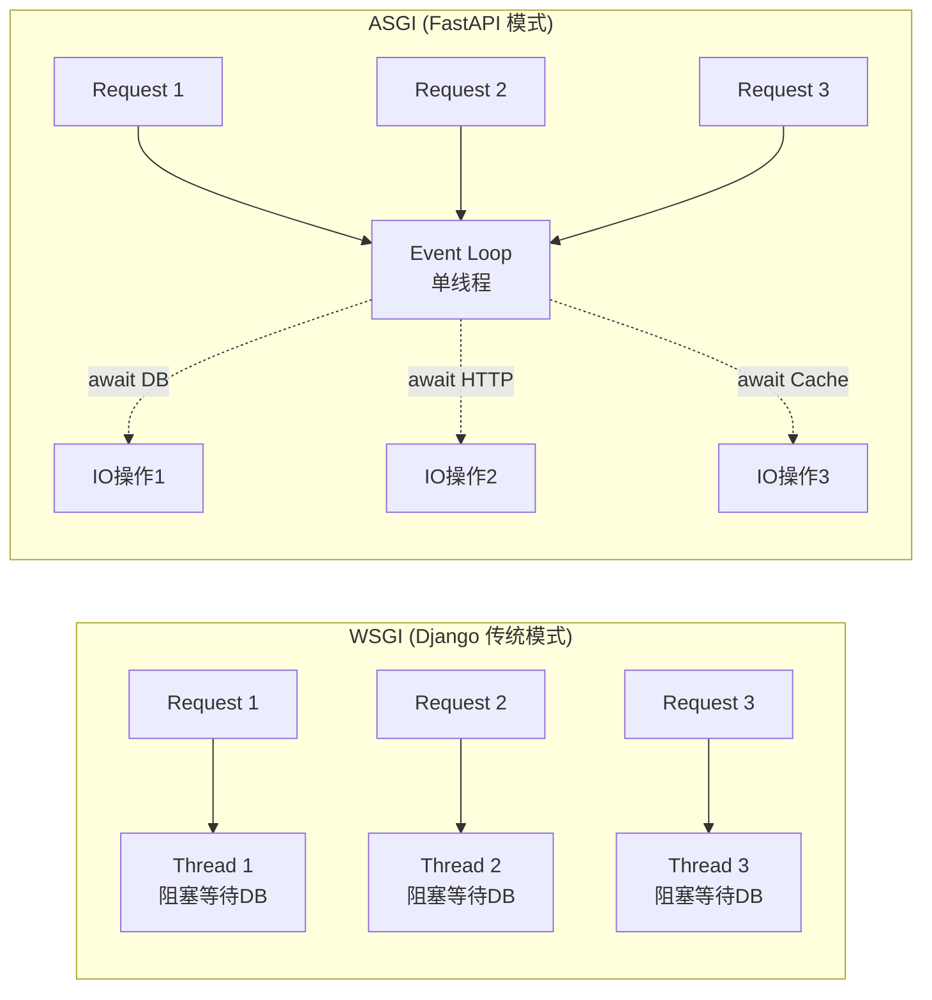
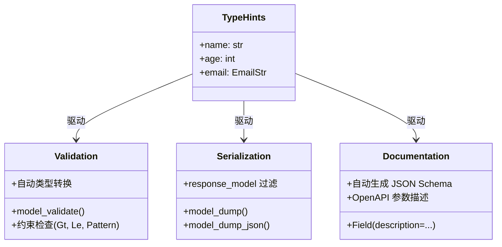
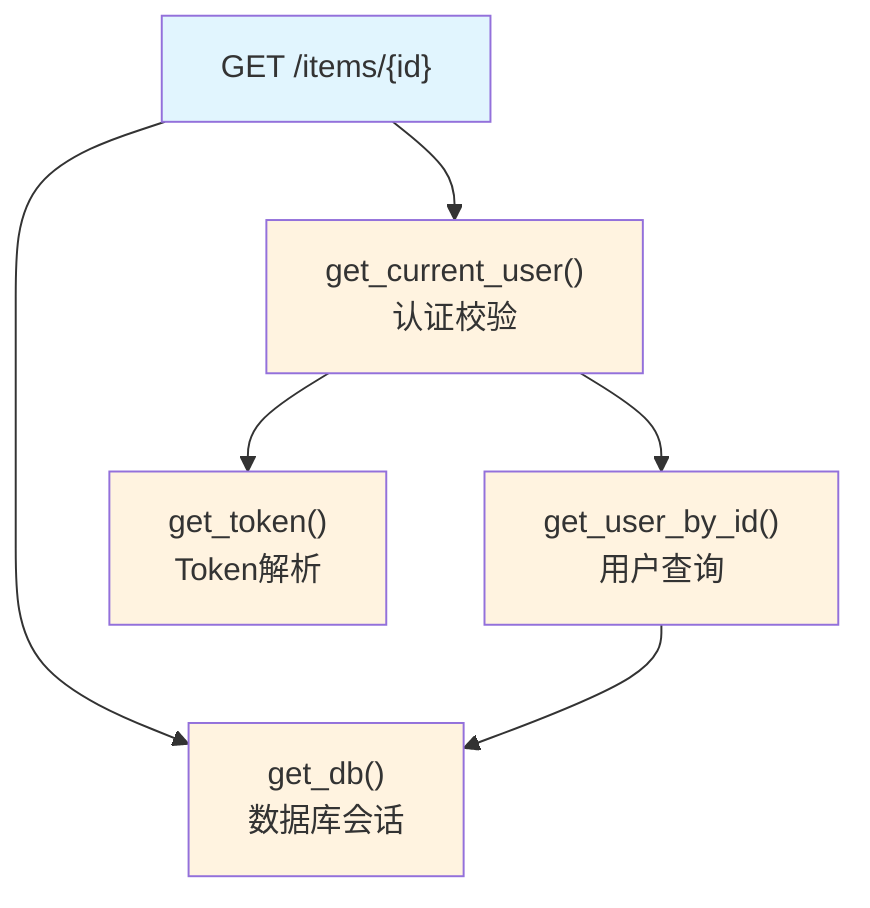
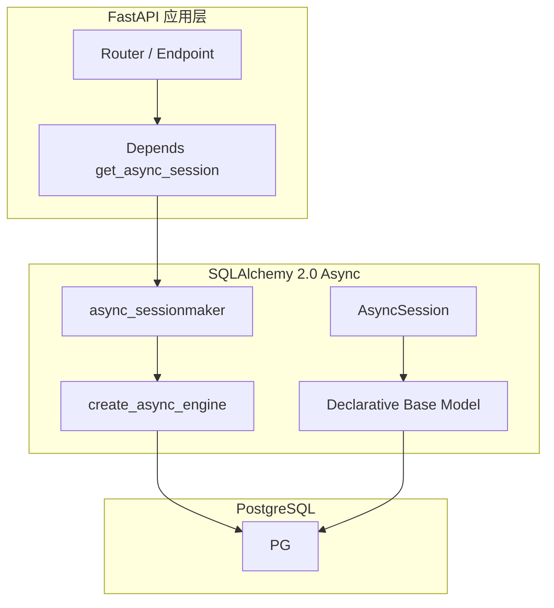
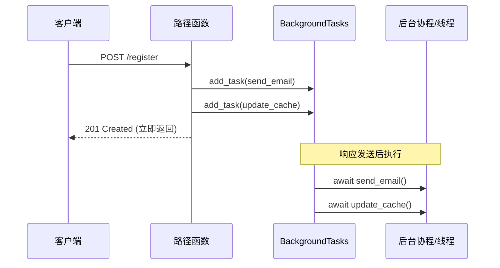
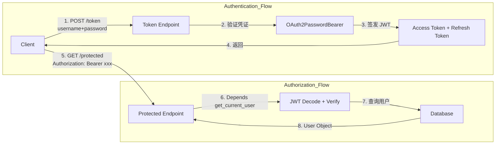
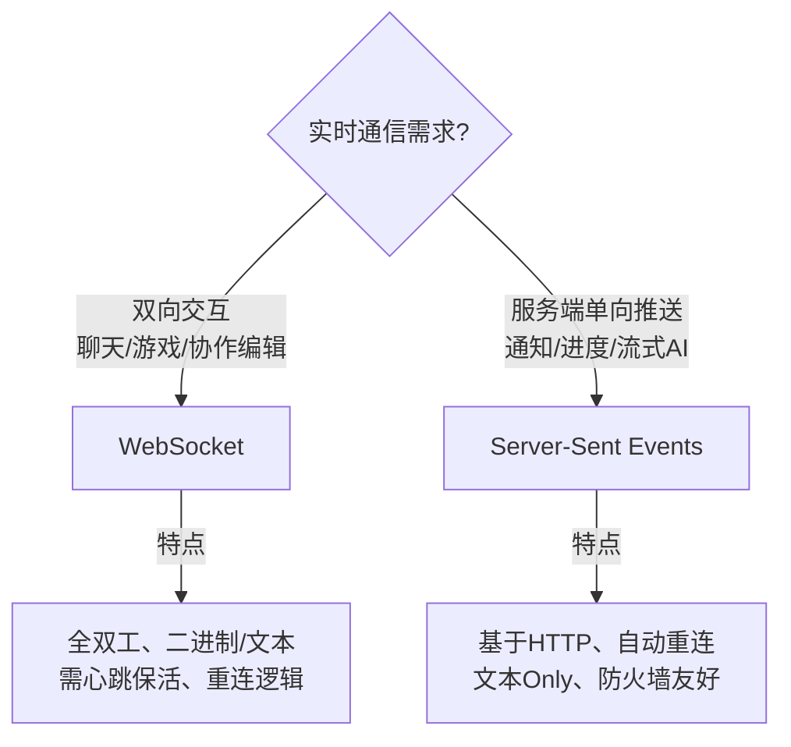
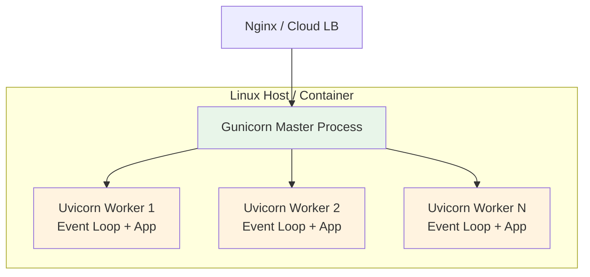
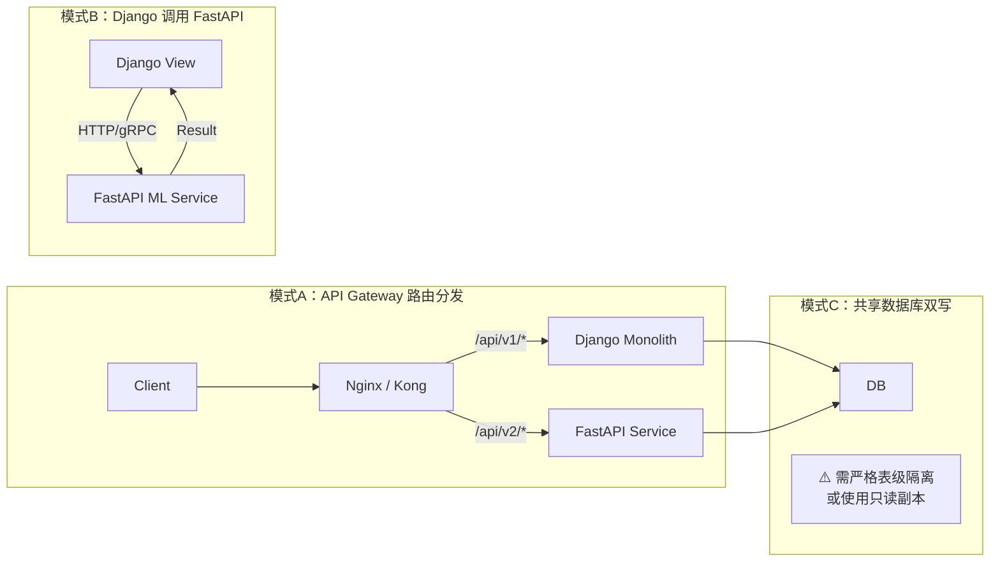

### 一、核心基础与范式转换

> 🎯 **本阶段目标**：理解 FastAPI “类型即文档、类型即校验、类型即序列化”的核心哲学，掌握其区别于 Django 的声明式开发模式，建立对 ASGI 异步模型的直观认知。

#### 1.1 为什么有 Django 还要学 FastAPI？——定位与架构差异

对于已有 Django 经验的开发者，首先要明确 FastAPI 不是 Django 的替代品，而是互补品。理解两者的架构差异是避免“用 Django 思维写 FastAPI”的关键。

|维度|Django|FastAPI|
|:--|:--|:--|
|**设计哲学**|Batteries Included（自带电池）|Microframework + 插件生态|
|**接口规范**|WSGI (同步为主)|ASGI (原生异步)|
|**数据校验**|Forms / Serializers (运行时定义)|Pydantic (类型提示驱动)|
|**路由方式**|URL Conf (正则/path 匹配)|装饰器 + 函数签名自动解析|
|**ORM 绑定**|强绑定 Django ORM|无绑定 (推荐 SQLAlchemy/Tortoise)|
|**API 文档**|需第三方 (drf-spectacular)|自动生成 OpenAPI (Swagger/ReDoc)|
|**适用场景**|全功能 Web、CMS、管理后台|高性能 API、ML Serving、微服务|

> 💡 **给 Django 开发者的提示**：FastAPI 没有 `settings.py`、没有 `manage.py`、没有内置 Admin。这些“缺失”正是其灵活性的来源。你需要自己组装所需组件，这更接近 Flask 的体验，但拥有远超 Flask 的类型安全和性能。

#### 1.2 ASGI 与异步模型：从 WSGI 的思维跃迁

Django 传统上运行在 WSGI 之上（每个请求一个线程），而 FastAPI 构建于 ASGI 之上。这是性能差异的根本原因。



**关键概念解释**：

- **Event Loop（事件循环）**：ASGI 服务器（如 Uvicorn）内部维护一个单线程事件循环。当协程遇到 `await` 时，控制权交还给事件循环，事件循环立即处理下一个就绪的协程。**这不是多线程并发，而是单线程内的协作式多任务**。
- **`async def` vs `def`**：在 FastAPI 中，这两者有本质区别：
    - `async def`：直接在事件循环中执行。**必须**确保内部所有 IO 操作都是 awaitable 的，否则会阻塞整个事件循环（比 WSGI 还糟）。
    - `def`：FastAPI 会自动将其放入**线程池**执行。适用于调用不支持 async 的库（如 pymysql、requests）。
- **⚠️ Django 开发者常见陷阱**：不要在 `async def` 路径函数中直接调用 Django ORM 或任何同步阻塞库。要么改用 `def`，要么使用对应的 async 版本。

#### 1.3 Pydantic V2：类型系统驱动的三大统一

Pydantic 是 FastAPI 的灵魂。对于熟悉 Django Serializer 的开发者，Pydantic 的核心优势在于**一次定义，三处复用**。



**与 Django Serializer 的对比理解**：

```python
# ❌ Django REST Framework 方式：校验逻辑与类型分离
class UserSerializer(serializers.Serializer):
    name = serializers.CharField(max_length=100)
    age = serializers.IntegerField(min_value=0)
    email = serializers.EmailField()

# ✅ FastAPI + Pydantic 方式：类型提示即一切
from pydantic import BaseModel, Field, EmailStr

class UserSchema(BaseModel):
    name: str = Field(max_length=100, description="用户姓名")
    age: int = Field(ge=0, description="年龄")
    email: EmailStr = Field(description="邮箱地址")
```

> 💡 **Pydantic V2 重要变化**：V2 使用 Rust 重写了核心验证引擎，性能比 V1 提升 5-50 倍。注意 API 变更：`parse_obj()` → `model_validate()`，`.dict()` → `model_dump()`，`.json()` → `model_dump_json()`。如果你之前的项目用的是 V1，务必查阅迁移指南。

**`response_model` 的安全价值**：这是 Django 开发者容易忽略的特性。它不仅用于文档生成，更重要的是**输出过滤**——即使你的路径函数返回了包含密码的完整对象，`response_model` 也会自动剔除未声明的字段，防止敏感数据泄露。这相当于 Django Serializer 的 `fields` 白名单机制，但是声明式的、类型安全的。

#### 1.4 依赖注入系统：FastAPI 最强大的抽象

如果说 Pydantic 是 FastAPI 的数据层基石，那么依赖注入（DI）就是其业务逻辑的组织骨架。这与 Django 的中间件/Mixin 思路完全不同。



**核心理解**：FastAPI 的 DI 本质上是一个**可组合的、支持异步的、带类型推导的函数调用图**。每个依赖就是一个普通函数（或 async 函数），通过 `Depends()` 声明。

```python
from fastapi import Depends, HTTPException, status
from sqlalchemy.ext.asyncio import AsyncSession

# 依赖是可复用的普通函数
async def get_db() -> AsyncGenerator[AsyncSession, None]:
    async with async_session() as session:
        yield session  # yield 之前是 setup，之后是 teardown

async def get_current_user(
    token: str = Header(),
    db: AsyncSession = Depends(get_db)  # 依赖可以嵌套依赖
) -> User:
    user = await verify_token(token, db)
    if not user:
        raise HTTPException(status_code=status.HTTP_401_UNAUTHORIZED)
    return user

# 路径函数只需声明需要什么，不需要关心如何获取
@router.get("/me")
async def read_me(current_user: User = Depends(get_current_user)):
    return current_user
```

**与 Django 模式的映射**：

|Django 模式|FastAPI DI 等价实现|优势|
|:--|:--|:--|
|Middleware|全局依赖 / 路由级依赖|更细粒度、可按需组合、有类型提示|
|Mixin|依赖函数组合|无 MRO 复杂性、显式优于隐式|
|Decorator (login_required)|`Depends(get_current_user)`|返回值可直接作为参数使用，而非仅做拦截|
|Signal|Background Tasks / 事件依赖|更可控、可测试|

> 💡 **关键洞察**：FastAPI 的 DI 是**请求级别缓存**的。同一个请求中，多个路径参数/依赖都声明了 `Depends(get_db)`，FastAPI 只会调用一次 `get_db()`，后续直接使用缓存结果。这避免了重复创建数据库连接等问题。如果需要每次都重新调用，使用 `Depends(get_db, use_cache=False)`。

#### 1.5 路由系统与请求解析：声明式的力量

Django 的路由是“URL → View”的显式映射，参数需要从 URL pattern 中提取。FastAPI 的路由是**函数签名的镜像**。

```python
# FastAPI: 路径参数、查询参数、请求体、Header 全部从签名自动推断
@router.post("/users/{user_id}/posts", response_model=PostSchema)
async def create_post(
    user_id: int,                          # 路径参数 (自动校验为int)
    title: str = Query(min_length=1),      # 查询参数
    body: PostCreateSchema,                # 请求体 (Pydantic自动解析+校验)
    x_request_id: str = Header(default=None), # Header
    db: AsyncSession = Depends(get_db),    # 依赖注入
):
    ...
```

**参数分类规则**（FastAPI 自动判断）：

- 路径参数：在路径模板 `{param}` 中出现的
- 请求体：类型为 Pydantic Model 的
- 查询参数：其他简单类型参数（str, int, bool, list 等）
- 显式声明：使用 `Path()`, `Query()`, `Body()`, `Header()`, `Cookie()` 消除歧义

> 💡 **给 Django 开发者的建议**：忘掉 `request.GET.get()`、`request.POST.get()`、`json.loads(request.body)` 这些手动解析操作。在 FastAPI 中，如果你发现自己在手动解析请求数据，那几乎一定是用了错误的方式。让框架通过类型提示替你完成这一切。

#### 1.6 本阶段学习检验清单

在进入下一阶段之前，请确认你能独立完成以下事项：

- [ ]  能用 Pydantic V2 定义嵌套模型，并使用 `model_validator` 实现跨字段校验
- [ ]  能清晰解释 `async def` 和 `def` 路径函数的执行差异及选择依据
- [ ]  能设计一个包含认证、数据库会话、权限检查的多层依赖注入链
- [ ]  能使用 `response_model` 实现输出过滤，并理解其与直接返回 dict 的安全差异
- [ ]  能独立搭建一个包含多路由、多 Schema、多依赖的 CRUD API 原型
- [ ]  能通过 `/docs` 端点验证自动生成的 OpenAPI 文档是否符合预期

### 二、数据交互与工程化实践

> 🎯 **本阶段目标**：将 FastAPI 从“原型工具”升级为“生产级框架”。重点掌握异步 ORM 集成、数据库迁移、自动化测试及项目结构化，补齐 Django 开箱即用的工程能力。

#### 2.1 异步 ORM 选型与 SQLAlchemy 2.0 集成

Django 开发者习惯了 ORM 与框架的深度绑定，而 FastAPI 的“无绑定”特性既是自由也是挑战。当前生态中，**SQLAlchemy 2.0 + asyncpg** 是事实上的标准选择。



**核心概念解释**：

- **`create_async_engine`**：异步引擎，内部维护连接池。注意 URL 必须使用 `postgresql+asyncpg://` 而非 `postgresql://`。
- **`async_sessionmaker`**：会话工厂，每次请求通过依赖注入创建独立的 `AsyncSession`。**切勿在全局创建单个 Session 实例**——AsyncSession 不是线程/协程安全的。
- **Declarative Model**：SQLAlchemy 2.0 推荐使用 `Mapped[]` + `mapped_column()` 的新式声明语法，与 Pydantic Schema 形成清晰的分层：Model 负责数据库映射，Schema 负责 API 契约。

```python
# models/user.py - SQLAlchemy 2.0 新式声明
from sqlalchemy.orm import Mapped, mapped_column, DeclarativeBase
from sqlalchemy import String, Integer

class Base(DeclarativeBase):
    pass

class User(Base):
    __tablename__ = "users"
    
    id: Mapped[int] = mapped_column(primary_key=True)
    name: Mapped[str] = mapped_column(String(100))
    email: Mapped[str] = mapped_column(String(255), unique=True)

# schemas/user.py - Pydantic Schema（与 Model 解耦）
from pydantic import BaseModel, EmailStr

class UserCreate(BaseModel):
    name: str
    email: EmailStr

class UserResponse(BaseModel):
    id: int
    name: str
    email: str
    model_config = {"from_attributes": True}  # V2 替代了 V1 的 orm_mode
```

> 💡 **`from_attributes = True` 的重要性**：这是 Pydantic V2 中替代 V1 `orm_mode = True` 的配置。它允许 Pydantic 通过属性访问（`obj.attr`）而非字典键（`obj["attr"]`）来读取数据，是将 SQLAlchemy Model 转换为 Schema 的关键桥梁。忘记配置此项是新手最常见的报错原因之一。

**为什么不推荐 Tortoise-ORM？**  
虽然 Tortoise 是纯异步 ORM 且 API 类似 Django ORM，但其生态成熟度、文档完整性、类型提示支持均落后于 SQLAlchemy 2.0。对于已有 SQL 基础的开发者，SQLAlchemy 的学习曲线并不陡峭，且长期收益更高。

#### 2.2 Alembic 数据库迁移：替代 Django Migrations

Django 的 `makemigrations/migrate` 是一体化的，而 FastAPI 生态中 **Alembic** 是独立工具。对于习惯 Django 自动化迁移的开发者，Alembic 的初始配置略显繁琐，但一旦搭建完成，体验同样流畅。

**关键配置要点**：

- **`env.py` 中的异步支持**：默认 Alembic 模板是同步的，必须手动改为 `run_async_migrations()` 并使用 `connectable = create_async_engine(...)`。这是最容易踩坑的地方。
- **自动检测模型变更**：在 `env.py` 中导入所有 Model 的 Base metadata，否则 `alembic revision --autogenerate` 无法检测到新增/修改的表。
- **迁移脚本命名规范**：建议使用 `{revision_id}_{description}.py` 格式，并在 CI 中强制检查迁移文件是否随代码一起提交。

```bash
# 常用命令速查（对标 Django）
alembic revision --autogenerate -m "add users table"  # ≈ python manage.py makemigrations
alembic upgrade head                                   # ≈ python manage.py migrate
alembic downgrade -1                                   # ≈ python manage.py migrate app zero
alembic history --verbose                              # ≈ python manage.py showmigrations
```

> 💡 **工程建议**：在项目根目录创建 `Makefile` 或 `justfile`，将 Alembic 命令封装为简短别名（如 `make db-migrate`），降低团队记忆负担，模拟 Django `manage.py` 的使用体验。

#### 2.3 项目结构设计：从 Django Monolith 到模块化分层

Django 有明确的 app 划分约定，FastAPI 没有。以下是经过生产验证的**功能模块化结构**，兼顾可维护性与可扩展性：

```
project/
├── app/
│   ├── __init__.py
│   ├── main.py              # FastAPI app 实例 + lifespan
│   ├── config.py            # Settings (pydantic-settings)
│   ├── dependencies.py      # 全局共享依赖
│   ├── database.py          # Engine + Session 工厂
│   ├── modules/             # ⭐ 按业务领域划分（对标 Django apps）
│   │   ├── users/
│   │   │   ├── router.py    # 路由定义
│   │   │   ├── schemas.py   # Pydantic 模型
│   │   │   ├── models.py    # SQLAlchemy 模型
│   │   │   ├── service.py   # 业务逻辑层
│   │   │   └── dependencies.py  # 模块专属依赖
│   │   ├── posts/
│   │   │   └── ...
│   │   └── __init__.py
│   └── common/              # 跨模块共享工具
│       ├── security.py
│       ├── pagination.py
│       └── exceptions.py
├── alembic/
├── tests/
├── pyproject.toml
└── Dockerfile
```

**设计原则解释**：

- **Module ≠ App**：Django 的 app 是高度自包含的（含 migrations、admin、apps.py）。FastAPI 的 module 更轻量，仅包含 router/schema/model/service 四件套，迁移统一由 Alembic 管理。
- **Service 层的必要性**：Django 开发者常把逻辑写在 View 或 Model 方法中。在 FastAPI 中，**强烈建议抽取 Service 层**。Router 只做参数接收和响应返回，Service 承载业务逻辑。这使得逻辑可以被多个 Endpoint 复用，也便于单元测试时绕过 HTTP 层直接测试业务。
- **Config 使用 pydantic-settings**：替代 Django 的 `settings.py`，支持环境变量自动加载、类型校验、`.env` 文件读取，且本身就是一个 Pydantic Model。

#### 2.4 异步测试：Pytest + httpx.AsyncClient

Django 的 `TestCase` + `Client` 是同步的。FastAPI 的测试需要全面拥抱异步。

```python
# tests/conftest.py
import pytest_asyncio
from httpx import AsyncClient, ASGITransport
from sqlalchemy.ext.asyncio import create_async_engine, async_sessionmaker
from app.main import app
from app.database import Base, get_async_session

# ⭐ 测试专用数据库引擎（可使用 SQLite aiosqlite 或 TestContainer）
TEST_DB_URL = "sqlite+aiosqlite:///./test.db"
test_engine = create_async_engine(TEST_DB_URL)
TestSession = async_sessionmaker(test_engine, expire_on_commit=False)

@pytest_asyncio.fixture
async def override_db():
    """每个测试函数获得独立的数据库会话"""
    async with test_engine.begin() as conn:
        await conn.run_sync(Base.metadata.create_all)
    
    async with TestSession() as session:
        app.dependency_overrides[get_async_session] = lambda: session
        yield session
    
    async with test_engine.begin() as conn:
        await conn.run_sync(Base.metadata.drop_all)
    
    app.dependency_overrides.clear()

@pytest_asyncio.fixture
async def client(override_db):
    transport = ASGITransport(app=app)
    async with AsyncClient(transport=transport, base_url="http://test") as ac:
        yield ac
```

**与 Django 测试的关键差异**：

|维度|Django TestCase|FastAPI + Pytest|
|:--|:--|:--|
|测试客户端|`self.client` (同步)|`httpx.AsyncClient` (异步)|
|数据库隔离|TransactionTestCase / 事务回滚|Fixture + dependency_overrides|
|Mock 机制|`unittest.mock.patch`|`pytest-mock` / `dependency_overrides`|
|断言风格|`self.assertEqual()`|`assert response.status_code == 200`|
|运行方式|`python manage.py test`|`pytest -v`|

> 💡 **`dependency_overrides` 是测试利器**：它允许你在测试中替换任意依赖，无需修改源码。例如替换认证依赖以跳过登录、替换外部 API 调用为 Mock 响应。这比 Django 的 `@patch` 更优雅、更安全，因为它作用于 FastAPI 的 DI 图层面，而非 Python 模块导入层面。

#### 2.5 结构化日志与异常处理

Django 有完善的 logging 配置和内置异常处理。FastAPI 需要你自行搭建，但这也意味着完全的控制权。

**异常处理最佳实践**：

```python
# app/common/exceptions.py
from fastapi import Request, status
from fastapi.responses import JSONResponse
from app.main import app

class AppException(Exception):
    """业务异常基类"""
    def __init__(self, code: str, message: str, status_code: int = 400):
        self.code = code
        self.message = message
        self.status_code = status_code

@app.exception_handler(AppException)
async def app_exception_handler(request: Request, exc: AppException):
    return JSONResponse(
        status_code=exc.status_code,
        content={"code": exc.code, "message": exc.message},
    )

# 使用时只需 raise，无需在每个 endpoint 中手动构造 Response
raise AppException("USER_NOT_FOUND", "用户不存在", status.HTTP_404_NOT_FOUND)
```

**日志建议**：

- 使用 `structlog` 或 `python-json-logger` 输出 JSON 格式日志，便于 ELK/Loki 等日志平台解析。
- 通过 Middleware 为每个请求注入 `request_id`，实现全链路追踪。
- 不要在路径函数中使用 `print()`，始终使用 logger。

#### 2.6 本阶段学习检验清单

- [ ]  能独立搭建 SQLAlchemy 2.0 Async + Alembic 完整数据层
- [ ]  能设计并实现一个包含 users/posts 两个模块的项目结构
- [ ]  能为每个模块编写完整的异步 CRUD 测试，包括数据库隔离
- [ ]  能使用 `dependency_overrides` 在测试中替换认证和外部服务
- [ ]  能实现统一的异常处理和结构化日志中间件
- [ ]  能使用 `pydantic-settings` 管理多环境配置（dev/test/prod）

### 三、高阶特性与安全体系

> 🎯 **本阶段目标**：掌握 FastAPI 在生产环境中应对复杂业务场景的核心能力。深入理解后台任务、中间件机制、安全认证体系及实时通信，填补 Django 在高并发与轻量级异步场景下的认知空白。

#### 3.1 Background Tasks：轻量级异步处理

Django 生态中，耗时任务几乎必然引入 Celery/RQ 等重型消息队列。FastAPI 内置的 `BackgroundTasks` 提供了一种**进程内、零依赖**的轻量方案，适用于“不需要保证投递、允许丢失”的场景（如发送欢迎邮件、写入审计日志、更新缓存）。



**关键概念解释**：

- **执行时机**：后台任务在**响应发送给客户端之后**才开始执行。这意味着客户端不会感知到任何延迟。
- **async vs sync 任务**：如果添加的是 `async def` 任务，它将在事件循环中直接 await；如果是 `def` 任务，则在线程池中执行。这与路径函数的规则一致。
- **⚠️ 局限性（必须清楚）**：
    - **无持久化**：进程崩溃或重启，未执行的任务永久丢失。
    - **无重试机制**：任务失败不会自动重试。
    - **无并发控制**：大量任务可能耗尽内存或阻塞事件循环。
    - **不支持分布式**：仅限单进程内执行。

> 💡 **决策指南**：当且仅当任务满足“可丢失、秒级完成、无需重试”三个条件时使用 `BackgroundTasks`。否则，请使用 Celery/ARQ/Dramatiq + Redis/RabbitMQ。对于已有 Django+Celery 经验的开发者，可以将 `BackgroundTasks` 理解为“内联的、极简的 signal handler”。

#### 3.2 Middleware 编写：请求/响应拦截的正确姿势

Django 中间件是类（`process_request/process_response`），FastAPI 中间件是 **ASGI 应用包装器**。虽然 FastAPI 提供了 `@app.middleware("http")` 装饰器语法糖，但**生产环境推荐使用纯 ASGI Middleware 类**。

```python
# ✅ 推荐：纯 ASGI Middleware（性能更好、行为更可预测）
from starlette.middleware.base import BaseHTTPMiddleware
from starlette.requests import Request
import time
import uuid

class RequestTraceMiddleware(BaseHTTPMiddleware):
    async def dispatch(self, request: Request, call_next):
        request_id = str(uuid.uuid4())
        request.state.request_id = request_id  # 注入到 request.state
        start = time.perf_counter()
        
        response = await call_next(request)
        
        duration = time.perf_counter() - start
        response.headers["X-Request-ID"] = request_id
        response.headers["X-Process-Time"] = f"{duration:.4f}"
        return response

# ⚠️ 不推荐：装饰器方式（存在 streaming response 兼容性问题）
# @app.middleware("http")
# async def trace_middleware(request, call_next): ...
```

**与 Django Middleware 的对比**：

|维度|Django Middleware|FastAPI ASGI Middleware|
|:--|:--|:--|
|执行模型|同步 WSGI 链|异步 ASGI 嵌套调用|
|异常处理|`process_exception`|try/except 包裹 `call_next`|
|状态传递|`request.META` / ThreadLocal|`request.state`|
|流式响应|天然支持|需注意 `StreamingResponse` 兼容性|
|顺序|MIDDLEWARE 列表从上到下|注册顺序的**逆序**（洋葱模型）|

> 💡 **重要警告**：`BaseHTTPMiddleware` 在处理 `StreamingResponse` 时会将整个响应体缓冲到内存中，可能导致大文件下载 OOM。如果你的中间件需要处理流式响应，应直接实现原始 ASGI 协议（`__call__(self, scope, receive, send)`），或使用 `starlette.middleware.base.BaseHTTPMiddleware` 的替代库 `asgi-correlation-id` 等。

#### 3.3 OAuth2 + JWT 安全体系：超越 Django Auth

Django 的 `django.contrib.auth` 是会话驱动的。FastAPI 的安全方案是**无状态的 Token 驱动**，更贴合现代 API 架构。



**核心组件解析**：

- **`OAuth2PasswordBearer`**：这**不是**一个完整的 OAuth2 服务器实现，而是一个**文档生成辅助工具**。它告诉 OpenAPI “这个 API 使用 Bearer Token 认证”，使 Swagger UI 能显示授权按钮。实际的 Token 验证逻辑需要你自行实现。
- **JWT 最佳实践**：
    - Access Token 短过期（15min），Refresh Token 长过期（7d）。
    - Payload 只存 `sub`（user_id）和 `exp`，**不要存敏感信息**（JWT 是 Base64 编码，不是加密）。
    - 使用 `python-jose[cryptography]` 或 `PyJWT` 签发/验证。
    - 密码哈希使用 `passlib[bcrypt]`，**绝不要用 MD5/SHA**。
- **Scope 权限控制**：OAuth2 原生支持 Scope 机制，可实现细粒度权限（如 `read:items`, `write:users`）。通过 `Security(get_current_user, scopes=["read:items"])` 声明所需权限。

> 💡 **给 Django 开发者的提示**：FastAPI 没有内置 User Model、Permission Model、Group Model。你需要自行设计这些表结构。建议参考 Django 的 AbstractUser 设计，但保持精简。如果需要社交登录（Google/GitHub），可使用 `authlib` 库集成 OAuth2 Client。

#### 3.4 WebSocket 与 SSE：实时通信双雄

Django Channels 提供了 WebSocket 支持，但配置复杂（需 Daphne + Redis Channel Layer）。FastAPI 原生支持 WebSocket 和 Server-Sent Events (SSE)，开箱即用。

**选型决策树**：



**SSE 实战示例（AI 流式输出场景）**：

```python
from fastapi.responses import StreamingResponse
import asyncio
import json

async def event_generator(query: str):
    """模拟 LLM 流式输出"""
    chunks = ["Hello", " ", "World", "!", "\n"]
    for chunk in chunks:
        data = json.dumps({"content": chunk})
        yield f"data: {data}\n\n"  # SSE 标准格式
        await asyncio.sleep(0.1)
    yield "data: [DONE]\n\n"

@router.get("/chat/stream")
async def chat_stream(q: str):
    return StreamingResponse(
        event_generator(q),
        media_type="text/event-stream",
        headers={
            "Cache-Control": "no-cache",
            "Connection": "keep-alive",
            "X-Accel-Buffering": "no",  # Nginx 反代时必须禁用缓冲
        },
    )
```

> 💡 **WebSocket 注意事项**：FastAPI 的 WebSocket 端点**不走依赖注入系统**（除了路径参数）。你不能在 WebSocket 端点中使用 `Depends(get_db)`。需要手动创建数据库会话和管理连接生命周期。这是与 HTTP 端点的重大差异。

#### 3.5 性能调优：从理论到实测

对于有 Django 经验的开发者，FastAPI 的性能优势并非自动获得，错误的使用方式甚至会比 Django 更慢。

**关键调优点**：

- **避免 `async def` 中的同步阻塞**：这是头号性能杀手。使用 `anyio.to_thread.run_sync()` 或 `run_in_executor` 包装同步调用。
- **Pydantic V2 Rust 加速**：确保安装了 `pydantic-core`（V2 默认包含），并避免在热路径中使用自定义 validator（会回退到 Python 执行）。
- **数据库连接池调优**：`pool_size` 建议设为 CPU 核数 × 2 + 磁盘数，`max_overflow` 设为 `pool_size` 的 50%。过大的连接池反而降低性能。
- **响应序列化优化**：对于高频读取接口，考虑使用 `orjson` 替代默认 JSON 编码器（`ORJSONResponse`），性能提升 3-10 倍。
- **缓存策略**：FastAPI 没有内置缓存框架。推荐使用 `fastapi-cache2` 或直接在依赖中封装 Redis 缓存逻辑。

**基准测试建议**：  
不要盲目相信网上“FastAPI 比 Django 快 X 倍”的说法。使用 `wrk` 或 `locust` 对你的**实际业务接口**进行压测，关注 P99 延迟而非 QPS 峰值。IO 密集型场景下两者差距显著，CPU 密集型场景下差距很小。

#### 3.6 本阶段学习检验清单

- [ ]  能正确区分 `BackgroundTasks` 与消息队列的适用边界
- [ ]  能编写兼容 StreamingResponse 的 ASGI Middleware
- [ ]  能实现完整的 JWT 认证流程（签发、验证、刷新、Scope 鉴权）
- [ ]  能为 AI 流式输出场景实现 SSE 端点，并正确处理 Nginx 反代配置
- [ ]  能识别并修复 `async def` 中的同步阻塞问题
- [ ]  能对实际项目进行压测，并根据结果调整连接池和序列化策略

### 四、生产部署与微服务架构

> 🎯 **本阶段目标**：完成从“开发完成”到“稳定上线”的最后一公里。掌握 FastAPI 的生产级部署范式、容器化最佳实践、OpenAPI 文档治理，以及从 Django 单体向 FastAPI 微服务演进或共存的实战策略。

#### 4.1 Uvicorn + Gunicorn：生产级 ASGI 部署

开发时使用 `uvicorn main:app --reload` 即可，但**生产环境绝不能直接使用单进程 Uvicorn**。Uvicorn 是 ASGI 服务器，负责协议处理；Gunicorn 是进程管理器，负责多 Worker 调度与容错。两者组合才是生产标准。



**关键配置解释**：

- **Worker 类型**：必须使用 `-k uvicorn.workers.UvicornWorker`（或 `UvicornH11Worker`）。默认的 sync worker 无法处理 ASGI。
- **Worker 数量**：推荐公式为 `(2 × CPU_cores) + 1`。FastAPI 是 IO 密集型，Worker 数可略高于 CPU 核数，但不宜过多，否则上下文切换开销反而降低吞吐。
- **Graceful Shutdown**：配置 `--graceful-timeout 30`，确保滚动更新时正在处理的请求能正常完成，避免 502 错误。这对 K8s 滚动部署尤为重要。
- **⚠️ 为什么不用 Uvicorn 多 Worker？** Uvicorn 自带的 `--workers` 参数使用 `multiprocessing.fork`，在某些平台和库（如 SQLAlchemy 连接池）下存在安全隐患。Gunicorn 的 pre-fork 模型更成熟可靠。

```bash
# 生产启动命令示例
gunicorn app.main:app \
  -w $(( 2 * $(nproc) + 1 )) \
  -k uvicorn.workers.UvicornWorker \
  --bind 0.0.0.0:8000 \
  --graceful-timeout 30 \
  --timeout 120 \
  --access-logfile - \
  --error-logfile -
```

> 💡 **Django 开发者对照**：这与 Django 生产部署中 `Gunicorn + WSGI Worker` 的模式完全对应，只是 Worker 类从 `sync/gthread` 换成了 `UvicornWorker`。如果你之前用过 Gunicorn 部署 Django，迁移成本几乎为零。

#### 4.2 Docker 容器化：多阶段构建与安全加固

FastAPI 应用的 Docker 镜像应遵循**最小化、安全、快速**三原则。

```dockerfile
# ✅ 推荐：多阶段构建 + slim 基础镜像
FROM python:3.12-slim AS builder
WORKDIR /build
COPY pyproject.toml poetry.lock ./
RUN pip install poetry && \
    poetry export -f requirements.txt --without-hashes -o req.txt

FROM python:3.12-slim AS runtime
# 安全：非 root 用户运行
RUN useradd -m -r appuser && \
    apt-get update && apt-get install -y --no-install-recommends curl && \
    rm -rf /var/lib/apt/lists/*

WORKDIR /app
COPY --from=builder /build/req.txt .
RUN pip install --no-cache-dir -r req.txt
COPY ./app ./app

USER appuser
EXPOSE 8000
HEALTHCHECK --interval=30s CMD curl -f http://localhost:8000/health || exit 1
CMD ["gunicorn", "app.main:app", "-k", "uvicorn.workers.UvicornWorker", "--bind", "0.0.0.0:8000"]
```

**关键实践说明**：

- **`slim` 而非 `alpine`**：Alpine 使用 musl libc，与许多 Python C 扩展（如 psycopg2、pydantic-core）不兼容，编译耗时且易出错。`slim` 基于 Debian，兼容性更好，镜像体积也足够小（~150MB）。
- **Health Check 端点**：必须提供 `/health` 端点（返回 200 + 简单 JSON），供 K8s liveness/readiness probe 或 Docker HEALTHCHECK 使用。**不要将健康检查指向业务接口**。
- **依赖锁定**：使用 `poetry export` 或 `pip-compile` 生成确定性依赖文件，**不要在 Dockerfile 中直接 `pip install poetry` 后动态解析**。
- **`.dockerignore`**：务必排除 `.git`、`__pycache__`、`.env`、`tests/`、`alembic/versions/`（除非需要在容器内迁移），避免镜像膨胀和敏感信息泄露。

#### 4.3 OpenAPI 文档定制与治理

FastAPI 自动生成的 `/docs` 是开发利器，但在生产环境中需要额外治理。

**安全与定制要点**：

- **生产环境禁用或保护文档**：通过环境变量控制，或在 Nginx 层限制 `/docs`、`/redoc`、`/openapi.json` 的访问 IP。暴露完整 API Schema 等于给攻击者提供路线图。
- **丰富文档元数据**：在 `FastAPI()` 构造函数中设置 `title`, `description`, `version`, `contact`, `license_info`。支持 Markdown 格式的描述，可嵌入架构图、认证说明等。
- **Tag 分组**：使用 `tags=["users"]` 对路由进行逻辑分组，替代 Django REST Framework 的 ViewSet 自动分组。建议 Tag 名称与模块名一致。
- **Schema 命名冲突**：当多个模块定义了同名 Pydantic Model（如 `CreateSchema`）时，OpenAPI 会自动加前缀去重，但可能导致文档混乱。建议使用 `model_config = {"title": "UserCreateSchema"}` 显式指定唯一名称。

> 💡 **进阶技巧**：使用 `fastapi.openapi.utils.get_openapi` 自定义 OpenAPI Schema 生成逻辑，例如批量添加全局 Security Scheme、修改响应格式包装、注入 x- 扩展字段供 API 网关消费。

#### 4.4 Django + FastAPI 共存架构：渐进式演进

对于已有 Django 单体的团队，**不建议一次性重写**。以下是三种经过验证的共存模式：



**各模式适用场景与注意事项**：

|模式|适用场景|优势|风险与对策|
|:--|:--|:--|:--|
|**A: Gateway 分发**|新业务模块用 FastAPI，旧模块保留 Django|零侵入、独立部署、技术栈解耦|需统一认证体系（共享 JWT Secret 或 SSO）|
|**B: Django 调用**|AI/ML 推理、高并发计算密集型子服务|Django 保持主入口，FastAPI 做加速引擎|增加一跳网络延迟，需熔断/超时保护|
|**C: 共享数据库**|读写分离、报表服务、数据导出|无需数据同步|**强耦合**，Schema 变更需双方协调；建议 FastAPI 只读或操作独立表|

**共享认证的关键**：无论哪种模式，Django 和 FastAPI 必须能互相验证 Token。推荐方案：

- Django 端使用 `djangorestframework-simplejwt` 签发 JWT。
- FastAPI 端使用相同的 SECRET_KEY 和算法验证 JWT。
- 用户信息查询可通过共享 Redis 缓存或内部 gRPC 接口，避免跨服务数据库直连。

> 💡 **务实建议**：如果 Django 单体运行良好、性能瓶颈不明显，**不要为了用 FastAPI 而拆分**。只有当出现明确的异步 IO 瓶颈、ML Serving 需求、或团队希望在新模块中采用类型驱动开发时，才考虑引入 FastAPI。技术选型服务于业务，而非反之。

#### 4.5 监控与可观测性

生产环境的 FastAPI 应用必须具备完善的可观测性，这比 Django 更需要主动建设。

**三大支柱落地方案**：

- **Metrics（指标）**：使用 `prometheus-fastapi-instrumentator` 自动采集请求数、延迟、状态码分布。暴露 `/metrics` 端点供 Prometheus 抓取。重点关注 P99 延迟和 5xx 比率。
- **Tracing（链路追踪）**：集成 `opentelemetry-instrumentation-fastapi`，自动为每个请求生成 Trace ID，并传播到下游服务、数据库查询、HTTP 调用。与 Jaeger/Zipkin 对接。
- **Logging（日志）**：如第二阶段所述，使用结构化 JSON 日志 + Request ID。确保日志中包含 trace_id，实现 Metrics → Traces → Logs 的关联查询。

> 💡 **Lifespan 事件**：使用 FastAPI 的 `lifespan` 上下文管理器（替代已废弃的 `@app.on_event`）来初始化/清理资源（如 Redis 连接池、OTel Provider）。这确保了资源生命周期与应用生命周期严格绑定，避免多 Worker 下的重复初始化问题。

#### 4.6 本阶段学习检验清单

- [ ]  能编写生产级 Dockerfile（多阶段构建、非 root、健康检查）
- [ ]  能配置 Gunicorn + UvicornWorker 并解释 Worker 数量选择依据
- [ ]  能在生产环境中安全地禁用或保护 OpenAPI 文档
- [ ]  能设计 Django + FastAPI 共存架构，并实现跨服务 JWT 认证
- [ ]  能为 FastAPI 应用接入 Prometheus 指标和 OpenTelemetry 链路追踪
- [ ]  能使用 lifespan 上下文管理器正确管理应用级资源生命周期

### 五、练习

> 🎯 **本阶段目标**：通过四个递进式实战项目，将前四个阶段的知识点从“理解”转化为“肌肉记忆”。每个练习均对标真实生产场景，要求读者独立完成从设计、编码、测试到部署的全流程。建议按顺序完成，每个练习完成后对照检验清单自评。

#### 5.1 基础巩固：类型驱动的用户认证 API

本练习聚焦第一阶段核心概念，强制脱离 Django 思维，建立 Pydantic + DI 的声明式开发习惯。

**任务描述**：  
实现一个完整的用户注册/登录/个人信息 API，不使用任何 ORM，数据存储在内存字典中（排除数据库干扰，专注框架本身）。

**具体要求**：

1. 使用 Pydantic V2 定义 `UserCreate`、`UserLogin`、`UserResponse`、`TokenResponse` 四个 Schema，包含字段校验（邮箱格式、密码强度、用户名长度）。
2. 实现 JWT 签发与验证逻辑，Access Token 15分钟过期，Payload 仅含 `sub`（user_id）和 `exp`。
3. 编写 `get_current_user` 依赖，从 Header 提取 Token 并验证，失败抛出 401。
4. 实现 `/register`、`/login`、`/me` 三个端点，`/me` 必须使用 `response_model=UserResponse` 过滤敏感字段。
5. 为所有端点编写 Pytest 异步测试，覆盖正常流程、校验失败、Token 过期、无效 Token 四种场景。

**检验清单**：

- [ ]  所有 Schema 使用 V2 语法（`model_config`、`Field` 约束）
- [ ]  `/me` 返回的数据中不包含密码哈希
- [ ]  测试用例全部通过，且无同步阻塞警告
- [ ]  能通过 `/docs` 端点完成完整的注册→登录→获取信息流程

> 💡 **Django 开发者注意**：禁止使用全局变量模拟数据库时引入线程安全问题。使用 `lifespan` 初始化存储容器，并通过依赖注入传递给端点，而非模块级全局 dict。

> [!success]- 点击展开题解
> 
> ## 🎯 题解概述：从 Django 命令式到 FastAPI 声明式的思维跃迁
> 
> 本题的核心目的**不是**实现一个生产级的认证系统，而是通过“刻意限制”（禁用 ORM、禁用全局变量），强制开发者建立 **Pydantic V2 + Dependency Injection (DI)** 的肌肉记忆。对于 Django 开发者而言，最大的挑战在于放弃 `models.Model` 和 `request.user` 这种隐式上下文，转而拥抱显式的类型约束与依赖注入。
> 
> ### 🧠 核心架构示意图
> 
> 在动手写代码前，请先理解 FastAPI 的请求处理流与 Django 的本质区别：
> 
> ```mermaid
> graph TD
>     Client[客户端请求] --> Router[Router Endpoint]
>     
>     subgraph DI_System [依赖注入系统]
>         GetStore[get_user_store] --> Store[UserStore Instance]
>         GetToken[get_current_user] --> Token[JWT Decode]
>         Token --> |依赖| GetStore
>     end
>     
>     Router --> |注入| GetStore
>     Router --> |注入| GetToken
>     
>     subgraph Pydantic_Layer [Pydantic V2 校验层]
>         ReqBody[Request Body] --> |validate| SchemaIn[UserCreate/UserLogin]
>         RespObj[Internal Dict] --> |serialize & filter| SchemaOut[UserResponse]
>     end
>     
>     Router --> Pydantic_Layer
>     Store -.-> |读写| Memory
>     
>     style DI_System fill:#e1f5fe,stroke:#01579b
>     style Pydantic_Layer fill:#fff3e0,stroke:#e65100
>     style Memory fill:#f3e5f5,stroke:#4a148c
> ```
> 
> ---
> 
> ## 💡 关键概念解析
> 
> ### 1. 为什么禁止模块级全局 Dict？
> 
> Django 是同步 WSGI 模型（传统上），而 FastAPI 基于 ASGI，支持异步并发。如果在模块顶层定义 `users = {}`：
> 
> - **测试污染**：多个测试用例共享同一内存空间，导致测试顺序敏感。
> - **生命周期失控**：无法在服务启动/关闭时执行初始化或清理逻辑。
> - **DI 断裂**：端点直接引用全局变量，导致无法在测试中轻松 Mock 或替换存储层。
> 
> **✅ 正确做法**：使用 `lifespan` 将存储挂载到 `app.state`，再通过依赖函数提取。这模拟了真实项目中数据库连接池的管理方式。
> 
> ### 2. Pydantic V2 vs V1 语法速查
> 
> |特性|V1 (旧)|V2 (新)|备注|
> |:--|:--|:--|:--|
> |配置类|`class Config:`|`model_config = ConfigDict(...)`|V2 使用字典配置，性能更好|
> |字段校验|`Field(..., regex=...)`|`Field(..., pattern=...)`|`regex` 已废弃|
> |自定义校验|`@validator`|`@field_validator`|默认 mode='after'|
> |序列化|`.dict()` / `.json()`|`.model_dump()` / `.model_dump_json()`|命名更语义化|
> |密码过滤|`exclude={"password"}`|`response_model_exclude`|推荐在路由装饰器层面控制|
> 
> ---
> 
> ## 🛠️ 完整参考实现
> 
> ### 项目结构
> 
> ```text
> auth_api/
> ├── main.py          # App入口 + Lifespan
> ├── schemas.py       # Pydantic V2 Models
> ├── security.py      # JWT 工具
> ├── dependencies.py  # DI 依赖函数
> ├── store.py         # 内存存储封装
> └── tests/
>     └── test_auth.py # Pytest 异步测试
> ```
> 
> ### Step 1: Schemas (schemas.py)
> 
> ```python
> from pydantic import BaseModel, Field, EmailStr, ConfigDict, field_validator
> import re
> 
> class UserCreate(BaseModel):
>     model_config = ConfigDict(str_strip_whitespace=True)
>     
>     username: str = Field(min_length=3, max_length=20)
>     email: EmailStr
>     password: str = Field(min_length=8)
> 
>     @field_validator("password")
>     @classmethod
>     def check_password_strength(cls, v: str) -> str:
>         if not re.search(r"[A-Z]", v) or not re.search(r"\d", v):
>             raise ValueError("密码必须包含至少一个大写字母和一个数字")
>         return v
> 
> class UserLogin(BaseModel):
>     username: str
>     password: str
> 
> class UserResponse(BaseModel):
>     """注意：不包含 password 字段，实现自动过滤"""
>     user_id: str
>     username: str
>     email: str
> 
> class TokenResponse(BaseModel):
>     access_token: str
>     token_type: str = "bearer"
> ```
> 
> ### Step 2: 安全与存储 (security.py & store.py)
> 
> ```python
> # security.py
> from datetime import datetime, timedelta, timezone
> from jose import jwt, JWTError
> 
> SECRET_KEY = "dev-secret-change-in-prod"
> ALGORITHM = "HS256"
> ACCESS_TOKEN_EXPIRE_MINUTES = 15
> 
> def create_access_token(user_id: str) -> str:
>     expire = datetime.now(timezone.utc) + timedelta(minutes=ACCESS_TOKEN_EXPIRE_MINUTES)
>     payload = {"sub": user_id, "exp": expire}
>     return jwt.encode(payload, SECRET_KEY, algorithm=ALGORITHM)
> 
> def decode_access_token(token: str) -> dict | None:
>     try:
>         return jwt.decode(token, SECRET_KEY, algorithms=[ALGORITHM])
>     except JWTError:
>         return None
> 
> # store.py
> import uuid
> from passlib.context import CryptContext
> 
> pwd_context = CryptContext(schemes=["bcrypt"], deprecated="auto")
> 
> class UserStore:
>     """线程安全的内存存储封装"""
>     def __init__(self):
>         self._users: dict[str, dict] = {}  # user_id -> user_data
>         self._username_index: dict[str, str] = {}  # username -> user_id
> 
>     async def create_user(self, username: str, email: str, password: str) -> dict:
>         if username in self._username_index:
>             raise ValueError("Username already exists")
>         user_id = str(uuid.uuid4())
>         hashed = pwd_context.hash(password)
>         user = {"user_id": user_id, "username": username, "email": email, "password_hash": hashed}
>         self._users[user_id] = user
>         self._username_index[username] = user_id
>         return user
> 
>     async def get_by_username(self, username: str) -> dict | None:
>         uid = self._username_index.get(username)
>         return self._users.get(uid) if uid else None
> 
>     async def get_by_id(self, user_id: str) -> dict | None:
>         return self._users.get(user_id)
> ```
> 
> ### Step 3: 依赖注入与路由 (dependencies.py & main.py)
> 
> ```python
> # dependencies.py
> from fastapi import Depends, HTTPException, status
> from fastapi.security import HTTPBearer, HTTPAuthorizationCredentials
> from .security import decode_access_token
> from .store import UserStore
> 
> security_scheme = HTTPBearer()
> 
> async def get_user_store(request) -> UserStore:
>     """从 app.state 获取存储实例，避免全局变量"""
>     return request.app.state.user_store
> 
> async def get_current_user(
>     credentials: HTTPAuthorizationCredentials = Depends(security_scheme),
>     store: UserStore = Depends(get_user_store),
> ) -> dict:
>     payload = decode_access_token(credentials.credentials)
>     if payload is None:
>         raise HTTPException(status_code=status.HTTP_401_UNAUTHORIZED, detail="Invalid or expired token")
>     user = await store.get_by_id(payload["sub"])
>     if user is None:
>         raise HTTPException(status_code=status.HTTP_401_UNAUTHORIZED, detail="User not found")
>     return user
> 
> # main.py
> from contextlib import asynccontextmanager
> from fastapi import FastAPI, Depends, HTTPException, status
> from .schemas import UserCreate, UserLogin, UserResponse, TokenResponse
> from .security import create_access_token, pwd_context
> from .store import UserStore
> from .dependencies import get_user_store, get_current_user
> 
> @asynccontextmanager
> async def lifespan(app: FastAPI):
>     # Startup: 初始化存储
>     app.state.user_store = UserStore()
>     yield
>     # Shutdown: 可在此清理资源
> 
> app = FastAPI(lifespan=lifespan)
> 
> @app.post("/register", response_model=UserResponse, status_code=201)
> async def register(data: UserCreate, store: UserStore = Depends(get_user_store)):
>     try:
>         user = await store.create_user(data.username, data.email, data.password)
>     except ValueError as e:
>         raise HTTPException(status_code=400, detail=str(e))
>     return user  # Pydantic 会自动过滤 password_hash
> 
> @app.post("/login", response_model=TokenResponse)
> async def login(data: UserLogin, store: UserStore = Depends(get_user_store)):
>     user = await store.get_by_username(data.username)
>     if not user or not pwd_context.verify(data.password, user["password_hash"]):
>         raise HTTPException(status_code=401, detail="Invalid credentials")
>     token = create_access_token(user["user_id"])
>     return {"access_token": token}
> 
> @app.get("/me", response_model=UserResponse)
> async def me(current_user: dict = Depends(get_current_user)):
>     return current_user
> ```
> 
> ### Step 4: 异步测试 (tests/test_auth.py)
> 
> ```python
> import pytest
> from httpx import AsyncClient, ASGITransport
> from auth_api.main import app
> 
> @pytest.fixture
> async def client():
>     transport = ASGITransport(app=app)
>     async with AsyncClient(transport=transport, base_url="http://test") as ac:
>         yield ac
> 
> @pytest.mark.anyio
> async def test_full_flow(client: AsyncClient):
>     # 1. Register
>     r = await client.post("/register", json={
>         "username": "testuser", "email": "t@example.com", "password": "Pass1234"
>     })
>     assert r.status_code == 201
>     assert "password_hash" not in r.json()  # ✅ 验证敏感字段过滤
> 
>     # 2. Login
>     r = await client.post("/login", json={"username": "testuser", "password": "Pass1234"})
>     assert r.status_code == 200
>     token = r.json()["access_token"]
> 
>     # 3. Access /me
>     r = await client.get("/me", headers={"Authorization": f"Bearer {token}"})
>     assert r.status_code == 200
>     assert r.json()["username"] == "testuser"
> 
> @pytest.mark.anyio
> async def test_invalid_token(client: AsyncClient):
>     r = await client.get("/me", headers={"Authorization": "Bearer invalid.token.here"})
>     assert r.status_code == 401
> 
> @pytest.mark.anyio
> async def test_validation_error(client: AsyncClient):
>     r = await client.post("/register", json={
>         "username": "ab",  # Too short
>         "email": "bad-email",
>         "password": "weak"
>     })
>     assert r.status_code == 422
> ```
> 
> ---
> 
> ## ✅ 检验清单自查指南
> 
> |检查项|验证方法|常见坑点|
> |:--|:--|:--|
> |Schema V2 语法|搜索 `model_config`、`field_validator`|误用 `@validator` 或 `class Config`|
> |`/me` 无密码|断言 `"password_hash" not in response.json()`|忘记设置 `response_model` 或手动返回了完整 dict|
> |无同步阻塞|运行 `pytest -W error::DeprecationWarning`|bcrypt/passlib 某些版本有同步调用，需确保 async 兼容或使用 `run_in_executor`|
> |Lifespan DI|检查 `app.state.user_store` 是否在 lifespan 中初始化|直接在模块顶层 `UserStore()` 实例化|
> |Docs 可用|访问 `/docs`，按顺序执行 register → login → authorize → me|Swagger UI 中点击 🔒 按钮输入 Bearer Token|
> 
> ## ⚠️ Django 开发者特别注意事项
> 
> 1. **没有 Middleware 自动挂 user**：FastAPI 中每个需要认证的端点都必须显式声明 `Depends(get_current_user)`，不存在 `request.user` 魔法。
> 2. **密码哈希不在 Schema 中**：`UserResponse` 根本不定义 `password` 字段，这是**类型级别的安全保障**，比运行时 exclude 更可靠。
> 3. **测试隔离**：每次测试运行都会触发 lifespan，获得全新的 `UserStore` 实例，无需手动 tearDown 清理数据。
> 4. **异步一致性**：所有涉及 I/O（包括存储操作）都应声明为 `async`。即使当前是内存操作，保持异步签名也为未来迁移到 async DB 铺平道路。
> 
> > 💡 **进阶思考**：当你能流畅完成本题后，尝试将 `UserStore` 替换为 SQLAlchemy AsyncSession + PostgreSQL，你会发现**端点代码几乎零修改**——这就是依赖注入的真正威力。

#### 5.2 工程进阶：异步博客系统 CRUD

本练习整合第二阶段工程化能力，重点训练 SQLAlchemy 2.0 Async + Alembic + 模块化结构的完整协作。

**任务描述**：  
构建一个支持文章、分类、标签的博客 API，包含完整的数据库迁移、分页查询、关联查询及结构化异常处理。

**具体要求**：

1. 采用功能模块化结构（`modules/posts`、`modules/categories`、`modules/tags`），每个模块包含 router/schema/model/service 四件套。
2. 使用 SQLAlchemy 2.0 新式声明定义模型，实现文章-分类（多对一）、文章-标签（多对多）关联。
3. 配置 Alembic 异步迁移，生成至少两个迁移脚本（初始建表 + 添加文章摘要字段）。
4. 实现通用分页依赖 `PaginationParams`，支持 `page`、`size` 参数，返回统一分页响应格式。
5. 自定义 `AppException` 体系，实现 404（资源不存在）、409（唯一约束冲突）的统一错误响应。
6. 使用 `httpx.AsyncClient` + `dependency_overrides` 编写集成测试，测试数据库使用 SQLite aiosqlite，每个测试函数独立隔离。

**检验清单**：

- [ ]  Alembic 迁移脚本可重复执行（upgrade/downgrade 无报错）
- [ ]  分页响应包含 `items`、`total`、`page`、`size`、`pages` 五个字段
- [ ]  创建重复 slug 的文章返回 409 而非 500
- [ ]  测试运行后测试数据库自动清理，无残留数据
- [ ]  Service 层不包含任何 HTTP 相关代码（无 Request/Response 引用）

> 💡 **关键提示**：多对多关联表的定义务必使用 `AssociationProxy` 或显式关联模型，避免 N+1 查询。在 Service 层使用 `selectinload` 预加载关联数据，并在测试中验证 SQL 查询数量。

> [!success]- 点击展开题解
> 
> ## 📘 异步博客系统 CRUD 工程进阶题解
> 
> 本题是一道典型的 **FastAPI + SQLAlchemy 2.0 Async 全栈工程化** 综合练习。它不再局限于“写出能跑的代码”，而是考察如何构建一个**可维护、可测试、符合生产规范**的异步后端服务。下面将从架构设计、核心难点解析、代码实现要点及测试策略四个维度进行拆解。
> 
> ---
> 
> ### 1. 整体架构与模块化设计
> 
> 题目要求采用功能模块化结构，这是区别于“按文件类型分层”（如所有 model 放一起）的关键。每个业务模块自包含四件套，降低了耦合度。
> 
> ```mermaid
> graph TD
>     A[app/main.py] --> B[modules/posts]
>     A --> C[modules/categories]
>     A --> D[modules/tags]
>     
>     subgraph "Module: posts"
>         B --> B1[router.py]
>         B --> B2[schema.py]
>         B --> B3[model.py]
>         B --> B4[service.py]
>     end
>     
>     E[core/database.py] -.-> B3
>     E -.-> C
>     E -.-> D
>     F[core/exceptions.py] -.-> B1
>     G[core/pagination.py] -.-> B1
> ```
> 
> > 💡 **为什么强调 Service 层不含 HTTP 代码？**  
> > Service 是纯业务逻辑层，只接收 Python 对象/字典，返回领域对象或 DTO。这样它既可以被 Router 调用，也可以被 CLI 脚本、Celery 任务复用，且单元测试无需模拟 Request 对象。若 Service 中出现 `HTTPException`，说明职责越界，应改为抛出自定义 `AppException`，由 Router 或全局异常处理器转换为 HTTP 响应。
> 
> ---
> 
> ### 2. SQLAlchemy 2.0 Async 模型与关联设计
> 
> #### 2.1 新式声明 + 异步兼容
> 
> SQLAlchemy 2.0 推荐使用 `Mapped` + `mapped_column` 类型注解风格，配合 `AsyncSession` 使用：
> 
> ```python
> from sqlalchemy import String, ForeignKey, Table, Column
> from sqlalchemy.orm import Mapped, mapped_column, relationship, DeclarativeBase
> 
> class Base(DeclarativeBase):
>     pass
> 
> # 多对多关联表（显式定义，便于扩展）
> post_tags = Table(
>     "post_tags",
>     Base.metadata,
>     Column("post_id", ForeignKey("posts.id"), primary_key=True),
>     Column("tag_id", ForeignKey("tags.id"), primary_key=True),
> )
> 
> class Post(Base):
>     __tablename__ = "posts"
>     id: Mapped[int] = mapped_column(primary_key=True)
>     title: Mapped[str] = mapped_column(String(200))
>     slug: Mapped[str] = mapped_column(String(200), unique=True)
>     summary: Mapped[str | None] = mapped_column(String(500), nullable=True)  # 迁移2添加
>     category_id: Mapped[int] = mapped_column(ForeignKey("categories.id"))
>     
>     category: Mapped["Category"] = relationship(back_populates="posts")
>     tags: Mapped[list["Tag"]] = relationship(
>         secondary=post_tags, back_populates="posts", lazy="selectin"
>     )
> ```
> 
> #### 2.2 避免 N+1：`selectinload` vs `joinedload`
> 
> - **`selectinload`**：对一对多/多对多生成 `IN (...)` 查询，适合集合关联，不会产生笛卡尔积。
> - **`joinedload`**：LEFT JOIN，适合一对一/多对一，但多对多会导致行数爆炸。
> 
> > ⚠️ **关键提示落地**：在 Service 的查询方法中显式使用 `options(selectinload(Post.tags))`，而非依赖 `lazy="selectin"`。因为 `lazy` 配置在异步会话中可能触发隐式 IO 报错，显式加载更安全可控。
> 
> ---
> 
> ### 3. Alembic 异步迁移实践
> 
> #### 3.1 配置要点
> 
> - `alembic.ini` 中 `sqlalchemy.url` 留空，在 `env.py` 中从应用配置动态读取异步 URL。
> - `env.py` 必须使用 `run_async_migrations()` 包装 `context.configure()`，并传入 `async_engine`。
> - 模型导入需在 `env.py` 顶部完成，确保 `Base.metadata` 包含所有表。
> 
> #### 3.2 两个迁移脚本
> 
> 1. **初始建表**：`alembic revision --autogenerate -m "create initial tables"`
> 2. **添加摘要字段**：修改模型后执行 `alembic revision --autogenerate -m "add summary to posts"`
> 
> > ✅ **可重复执行验证**：每个迁移的 `upgrade()` 和 `downgrade()` 必须幂等。例如添加字段时检查是否已存在（虽然 Alembic 默认不检查，但生产环境建议加防御逻辑）。测试时可通过 `alembic upgrade head && alembic downgrade base && alembic upgrade head` 验证。
> 
> ---
> 
> ### 4. 通用分页与异常体系
> 
> #### 4.1 PaginationParams 依赖
> 
> ```python
> from fastapi import Query
> from pydantic import BaseModel
> 
> class PaginationParams(BaseModel):
>     page: int = Query(1, ge=1)
>     size: int = Query(20, ge=1, le=100)
> 
> async def get_pagination(params: PaginationParams = Depends()) -> PaginationParams:
>     return params
> 
> # 统一响应格式
> class PaginatedResponse(BaseModel, Generic[T]):
>     items: list[T]
>     total: int
>     page: int
>     size: int
>     pages: int  # ceil(total / size)
> ```
> 
> #### 4.2 AppException 体系
> 
> ```python
> class AppException(Exception):
>     def __init__(self, status_code: int, detail: str):
>         self.status_code = status_code
>         self.detail = detail
> 
> class ResourceNotFound(AppException):
>     def __init__(self, resource: str, identifier: Any):
>         super().__init__(404, f"{resource} with id {identifier} not found")
> 
> class UniqueConstraintError(AppException):
>     def __init__(self, field: str, value: Any):
>         super().__init__(409, f"{field} '{value}' already exists")
> ```
> 
> 在 Router 或全局异常处理器中捕获 `AppException` 并返回 JSONResponse。**Service 层只抛出这些异常，绝不直接 raise HTTPException**。
> 
> ---
> 
> ### 5. 集成测试策略（httpx + aiosqlite）
> 
> #### 5.1 测试隔离核心
> 
> - 使用 `aiosqlite` 作为测试数据库，每个测试函数创建独立内存库或临时文件。
> - 通过 `dependency_overrides` 替换 `get_async_session`，注入绑定到测试库的 session。
> - 测试结束后自动清理（使用 fixture 的 `yield` + teardown）。
> 
> ```python
> @pytest.fixture
> async def async_client():
>     engine = create_async_engine("sqlite+aiosqlite:///:memory:")
>     async with engine.begin() as conn:
>         await conn.run_sync(Base.metadata.create_all)
>     
>     async def override_get_session():
>         async with AsyncSession(engine) as session:
>             yield session
>     
>     app.dependency_overrides[get_async_session] = override_get_session
>     async with httpx.AsyncClient(app=app, base_url="http://test") as client:
>         yield client
>     app.dependency_overrides.clear()
>     await engine.dispose()
> ```
> 
> #### 5.2 关键测试点
> 
> - **409 测试**：创建两篇相同 slug 的文章，断言第二次返回 409。
> - **分页字段**：创建 25 篇文章，请求 `?page=2&size=10`，验证响应包含全部五个字段且值正确。
> - **SQL 数量验证**：使用 `sqlalchemy.event.listen(engine.sync_engine, "before_cursor_execute", ...)` 计数，确保列表接口仅执行 2 条 SQL（主查询 + tags selectin）。
> 
> ---
> 
> ### 6. 检验清单自查指南
> 
> |清单项|验证方法|
> |---|---|
> |Alembic 可重复执行|CI 中运行 upgrade→downgrade→upgrade 循环|
> |分页五字段完整|Pydantic 模型强制校验 + 测试断言|
> |重复 slug 返回 409|捕获 IntegrityError 转为 UniqueConstraintError|
> |测试无残留数据|每个测试用独立 DB + fixture 自动销毁|
> |Service 无 HTTP 代码|grep 检查 service.py 不含 `Request`/`Response`/`HTTPException`|
> 
> ---
> 
> ### 📌 总结
> 
> 本题的本质是 **“异步 ORM 工程化最佳实践”**。掌握以下三点即可举一反三：
> 
> 1. **显式优于隐式**：异步环境下避免 lazy loading，所有关联加载必须显式声明；
> 2. **分层纯净性**：Service 是业务内核，与传输协议解耦；
> 3. **测试即文档**：集成测试不仅验证功能，更定义了系统的契约行为。
> 
> 建议读者在完成基础实现后，进一步尝试：为 Service 编写纯单元测试（mock repository）、添加缓存层、或将 SQLite 测试切换为 testcontainers-postgres 以贴近生产环境。

#### 5.3 高阶实战：实时通知服务与安全加固

本练习针对第三阶段高阶特性，训练后台任务、SSE、中间件及安全体系的综合应用。

**任务描述**：  
为博客系统扩展实时通知功能：用户发布文章后，异步推送通知给订阅者；管理员可通过 SSE 实时接收全站新文章事件；所有请求携带 Request ID 并记录结构化日志。

**具体要求**：

1. 实现 `NotificationService`，发布文章后通过 `BackgroundTasks` 异步发送通知（模拟耗时操作，sleep 2秒）。
2. 实现 `/events/articles` SSE 端点，使用 `asyncio.Queue` 作为事件总线，新文章发布时向所有连接的客户端推送事件。
3. 编写 `RequestTraceMiddleware`（纯 ASGI 类），注入 UUID Request ID 到 `request.state` 和响应头，记录请求耗时。
4. 集成 `structlog`，日志包含 request_id、method、path、status_code、duration 字段，JSON 格式输出。
5. 为 SSE 端点实现连接管理：限制最大并发连接数（100），超限返回 503；客户端断开时自动清理 Queue。
6. 编写 SSE 端到端测试，验证事件推送的实时性和连接断开清理逻辑。

**检验清单**：

- [ ]  发布文章的响应在 2秒内返回，通知异步执行
- [ ]  SSE 端点支持多客户端并发，断开后 Queue 被正确移除
- [ ]  所有日志均为 JSON 格式，且同一请求的日志共享 request_id
- [ ]  Middleware 兼容 StreamingResponse，SSE 流未被缓冲
- [ ]  超过 100 并发 SSE 连接时返回 503 状态码

> 💡 **避坑指南**：SSE 测试不要使用 `httpx` 的普通 GET 请求，需使用 `stream()` 上下文管理器逐行读取事件。BackgroundTasks 在测试中默认同步执行，如需验证异步行为，需手动 await 或使用 `anyio` 测试工具。

> [!success]- 点击展开题解
> 
> ## 📚 题目解析与核心概念
> 
> 本题是 FastAPI 高阶特性的综合实战，旨在将**异步任务处理**、**服务端推送（SSE）**、**ASGI 中间件**及**可观测性（结构化日志）**整合到一个完整的业务场景中。在开始编码前，我们需要理清几个关键概念及其协作关系。
> 
> ### 1. 核心架构概览
> 
> ```mermaid
> graph TD
>     Client[客户端] -->|POST /articles| MW[RequestTraceMiddleware]
>     MW -->|注入 request_id| Router[Article Router]
>     Router -->|同步返回 202| Client
>     Router -->|add_task| BG[BackgroundTasks]
>     BG -->|sleep 2s + 推送| NS[NotificationService]
>     NS -->|put event| Queue
>     
>     SSEClient[SSE 订阅者] -->|GET /events/articles| MW
>     MW -->|检查并发数| SSEEndpoint[SSE Endpoint]
>     SSEEndpoint -->|连接成功| Queue
>     Queue -->|get event| SSEEndpoint
>     SSEEndpoint -->|data: json\n\n| SSEClient
>     
>     subgraph Observability
>         MW -->|记录耗时/状态| Logger[structlog JSON]
>     end
> ```
> 
> ### 2. 关键知识点补充
> 
> - **BackgroundTasks vs Celery**: 本题使用 FastAPI 内置的 `BackgroundTasks`。它适合轻量级、无需持久化、允许丢失的任务（如通知）。**注意**：在测试环境中，TestClient 默认会等待后台任务执行完毕才返回响应，这会导致“2秒内返回”的断言失败。解决方案是在测试中直接调用路由函数或使用 `anyio` 异步测试。
> - **SSE (Server-Sent Events)**: 基于 HTTP 的单向长连接协议。与 WebSocket 不同，SSE 仅支持服务端向客户端推送文本数据，自动重连，且天然兼容 HTTP/2。格式必须严格遵循 `data: ...\n\n`。
> - **纯 ASGI 中间件**: 区别于 FastAPI 的依赖注入式中间件，纯 ASGI 中间件直接操作 `scope`, `receive`, `send` 三元组。它的优势在于能拦截所有请求（包括静态文件、WebSocket），且在 StreamingResponse 场景下不会导致响应体被缓冲。
> - **structlog**: 不同于标准 logging 的字符串拼接，structlog 将日志视为键值对事件。这使得日志易于被 ELK/Loki 等系统解析，且能在运行时动态绑定上下文（如 request_id）。
> 
> ---
> 
> ## 💻 参考实现
> 
> ### 1. 结构化日志配置 (`logging_config.py`)
> 
> ```python
> import structlog
> import logging
> 
> def setup_logging():
>     """配置 structlog 输出 JSON 格式日志"""
>     logging.basicConfig(format="%(message)s", level=logging.INFO)
>     structlog.configure(
>         processors=[
>             structlog.contextvars.merge_contextvars,  # 合并上下文变量(request_id等)
>             structlog.processors.add_log_level,
>             structlog.processors.TimeStamper(fmt="iso"),
>             structlog.processors.JSONRenderer()       # JSON 输出
>         ],
>         wrapper_class=structlog.make_filtering_bound_logger(logging.INFO),
>         context_class=dict,
>         logger_factory=structlog.PrintLoggerFactory(),
>     )
> ```
> 
> ### 2. RequestTraceMiddleware (纯 ASGI)
> 
> ```python
> import time
> import uuid
> import structlog
> from starlette.types import ASGIApp, Scope, Receive, Send
> 
> class RequestTraceMiddleware:
>     def __init__(self, app: ASGIApp):
>         self.app = app
> 
>     async def __call__(self, scope: Scope, receive: Receive, send: Send):
>         if scope["type"] != "http":
>             await self.app(scope, receive, send)
>             return
> 
>         request_id = str(uuid.uuid4())
>         start_time = time.perf_counter()
>         
>         # 注入到 scope state (FastAPI request.state 可读)
>         scope.setdefault("state", {})
>         scope["state"]["request_id"] = request_id
>         
>         # 绑定到 structlog 上下文
>         structlog.contextvars.bind_contextvars(request_id=request_id)
> 
>         status_code = None
>         async def send_wrapper(message):
>             nonlocal status_code
>             if message["type"] == "http.response.start":
>                 status_code = message["status"]
>                 headers = list(message.get("headers", []))
>                 headers.append((b"x-request-id", request_id.encode()))
>                 message["headers"] = headers
>             await send(message)
> 
>         try:
>             await self.app(scope, receive, send_wrapper)
>         finally:
>             duration = round(time.perf_counter() - start_time, 4)
>             log = structlog.get_logger()
>             log.info(
>                 "request_completed",
>                 method=scope["method"],
>                 path=scope["path"],
>                 status_code=status_code,
>                 duration=duration,
>             )
>             structlog.contextvars.clear_contextvars()
> ```
> 
> > ⚠️ **关键点**: `send_wrapper` 拦截了响应头注入，同时不干扰 body 流式传输。这是保证 SSE 不被缓冲的核心。
> 
> ### 3. SSE 事件总线与连接管理
> 
> ```python
> import asyncio
> from typing import Set
> 
> class ArticleEventBus:
>     MAX_CONNECTIONS = 100
>     
>     def __init__(self):
>         self._subscribers: Set[asyncio.Queue] = set()
>         self._lock = asyncio.Lock()
>     
>     async def subscribe(self) -> asyncio.Queue | None:
>         async with self._lock:
>             if len(self._subscribers) >= self.MAX_CONNECTIONS:
>                 return None  # 超限
>             queue: asyncio.Queue = asyncio.Queue(maxsize=256)
>             self._subscribers.add(queue)
>             return queue
>     
>     async def unsubscribe(self, queue: asyncio.Queue):
>         async with self._lock:
>             self._subscribers.discard(queue)
>     
>     async def publish(self, event_data: dict):
>         dead_queues = []
>         for q in self._subscribers:
>             try:
>                 q.put_nowait(event_data)
>             except asyncio.QueueFull:
>                 dead_queues.append(q)
>         # 清理慢消费者
>         for q in dead_queues:
>             self._subscribers.discard(q)
> 
> # 全局单例
> event_bus = ArticleEventBus()
> ```
> 
> ### 4. 通知服务与文章发布端点
> 
> ```python
> import asyncio
> from fastapi import APIRouter, BackgroundTasks, Depends
> from pydantic import BaseModel
> 
> router = APIRouter()
> 
> class ArticleCreate(BaseModel):
>     title: str
>     content: str
> 
> async def send_notification(article_id: str, title: str):
>     """模拟耗时通知操作"""
>     await asyncio.sleep(2)
>     # 实际场景: 发送邮件/推送/写入消息队列
>     print(f"[Notification] Sent for article {article_id}: {title}")
> 
> @router.post("/articles", status_code=202)
> async def create_article(
>     payload: ArticleCreate,
>     background_tasks: BackgroundTasks
> ):
>     # 模拟创建文章
>     article_id = "art_" + payload.title[:8]
>     
>     # ✅ 异步通知，不阻塞响应
>     background_tasks.add_task(send_notification, article_id, payload.title)
>     
>     # ✅ 实时推送到 SSE 订阅者
>     await event_bus.publish({
>         "event": "new_article",
>         "data": {"id": article_id, "title": payload.title}
>     })
>     
>     return {"id": article_id, "message": "Article created, notification pending"}
> ```
> 
> ### 5. SSE 端点
> 
> ```python
> import json
> from fastapi import Request
> from fastapi.responses import StreamingResponse
> 
> @router.get("/events/articles")
> async def article_events_stream(request: Request):
>     queue = await event_bus.subscribe()
>     if queue is None:
>         from fastapi.responses import JSONResponse
>         return JSONResponse(
>             status_code=503,
>             content={"error": "Too many SSE connections"}
>         )
>     
>     async def event_generator():
>         try:
>             while True:
>                 # 检查客户端是否断开
>                 if await request.is_disconnected():
>                     break
>                 try:
>                     event = await asyncio.wait_for(queue.get(), timeout=30.0)
>                     yield f"data: {json.dumps(event)}\n\n"
>                 except asyncio.TimeoutError:
>                     # 心跳保活
>                     yield ": heartbeat\n\n"
>         finally:
>             # ✅ 确保断开时清理
>             await event_bus.unsubscribe(queue)
>     
>     return StreamingResponse(
>         event_generator(),
>         media_type="text/event-stream",
>         headers={
>             "Cache-Control": "no-cache",
>             "Connection": "keep-alive",
>             "X-Accel-Buffering": "no"  # Nginx 反代时禁用缓冲
>         }
>     )
> ```
> 
> ---
> 
> ## 🧪 SSE 端到端测试要点
> 
> ```python
> import pytest
> import httpx
> import asyncio
> from anyio import sleep
> 
> @pytest.mark.anyio
> async def test_sse_realtime_and_cleanup(app_client):
>     """验证 SSE 实时推送与断开清理"""
>     
>     # ✅ 使用 stream() 而非普通 GET
>     async with app_client.stream("GET", "/events/articles") as response:
>         assert response.status_code == 200
>         
>         # 发布新文章触发事件
>         post_resp = await app_client.post("/articles", json={
>             "title": "Test SSE Article",
>             "content": "Content here"
>         })
>         assert post_resp.status_code == 202
>         
>         # 逐行读取 SSE 事件
>         async for line in response.aiter_lines():
>             if line.startswith("data:"):
>                 data = json.loads(line[5:].strip())
>                 assert data["event"] == "new_article"
>                 assert data["data"]["title"] == "Test SSE Article"
>                 break  # 收到目标事件后退出
>     
>     # ✅ 验证断开后 queue 被清理
>     await sleep(0.1)  # 等待 finally 块执行
>     assert len(event_bus._subscribers) == 0
> ```
> 
> > 💡 **测试避坑提醒**:
> > 
> > - `BackgroundTasks` 在 `TestClient` 中默认同步执行。若需验证“2秒内返回”，应直接测试路由函数或使用 `respx` mock 掉后台任务。
> > - SSE 测试**必须**用 `stream()` + `aiter_lines()`，普通 `GET` 会等待连接关闭才返回完整响应体。
> > - 并发 503 测试可通过创建 100 个 stream 连接后再发第 101 个请求来验证。
> 
> ---
> 
> ## ✅ 检验清单自查
> 
> |检验项|实现要点|
> |:--|:--|
> |发布文章 < 2s 返回|`BackgroundTasks.add_task()` 异步执行，端点立即返回 202|
> |SSE 多客户端+断开清理|`set<Queue>` 管理订阅者，`finally` 块中 `unsubscribe`|
> |JSON 日志共享 request_id|`structlog.contextvars.bind_contextvars` 绑定，中间件清除|
> |Middleware 兼容 SSE|纯 ASGI 实现，仅包装 `send`，不消费 response body|
> |超 100 连接返回 503|`subscribe()` 加锁检查计数，返回 `None` 时端点返回 503|
> 
> 通过以上实现，你将掌握构建生产级实时通知系统的完整技术栈。建议在此基础上进一步探索：SSE 断线重连机制（Last-Event-ID）、事件持久化以防丢失、以及使用 Redis Pub/Sub 替代内存 Queue 以支持多实例部署。

#### 5.4 综合部署：Django + FastAPI 混合架构上线

本练习作为终极挑战，整合第四阶段全部生产技能，模拟真实技术债场景下的渐进式重构。

**任务描述**：  
假设你有一个运行中的 Django 博客单体（提供用户管理和文章列表），现需用 FastAPI 新增“AI 文章摘要生成”微服务，并与 Django 共存部署。

**具体要求**：

1. 搭建 FastAPI 摘要服务，暴露 `POST /summarize` 端点，接收文章内容，调用模拟 AI 接口（sleep 3秒 + 返回固定摘要），使用 SSE 流式返回生成过程。
2. 实现跨服务认证：Django 签发 JWT，FastAPI 使用相同 SECRET_KEY 验证，用户信息通过 Redis 共享缓存。
3. 为 FastAPI 服务编写生产级 Dockerfile（多阶段构建、非 root、健康检查）。
4. 配置 Gunicorn + UvicornWorker，Worker 数根据 CPU 核数动态计算。
5. 集成 Prometheus 指标（请求数、延迟、SSE 连接数）和 OpenTelemetry 链路追踪。
6. 编写 Nginx 配置，实现 `/api/v1/*` 转发 Django、`/api/v2/summarize` 转发 FastAPI，并保护 `/docs` 仅内网可访问。
7. 编写 docker-compose.yml，一键启动 Django + FastAPI + Redis + Nginx + Prometheus 全套环境。

**检验清单**：

- [ ]  Django 签发的 Token 可在 FastAPI 端验证通过
- [ ]  SSE 摘要流在 Nginx 反代下无缓冲、实时输出
- [ ]  Docker 镜像体积 < 200MB，容器以非 root 用户运行
- [ ]  Prometheus 能抓取到 FastAPI 的请求指标
- [ ]  外部无法访问 `/docs`，内网可正常查看
- [ ]  docker-compose up 后所有服务健康检查通过

> 💡 **务实提醒**：本练习的重点不是 AI 摘要本身，而是**混合架构的工程落地**。如果时间有限，可省略 OpenTelemetry 集成，但必须完成跨服务认证、Nginx 路由分发和容器化部署这三项核心能力验证。完成后，请反思：这个拆分是否真的必要？如果 Django 加个 Celery 就能解决，是否过度设计了？这种批判性思考比技术实现更重要。

> [!success]- 点击展开题解
> 
> ## 🎯 题目核心解析：混合架构的工程权衡
> 
> 本题并非单纯考察 FastAPI 或 Django 的使用，而是考察**渐进式重构（Strangler Fig Pattern）**在真实生产环境中的落地能力。核心难点在于“混合”二字：既要保证新旧系统的无缝协作（认证、路由），又要满足生产级的可观测性与安全性要求。
> 
> ### 💡 关键概念速览
> 
> - **SSE (Server-Sent Events)**: 不同于 WebSocket 的双向通信，SSE 是单向的服务端推送。在 Nginx 反代下极易被缓冲，需特殊配置。
> - **Gunicorn + UvicornWorker**: Gunicorn 负责进程管理（健壮性），UvicornWorker 负责 ASGI 事件循环（异步性能）。这是 Python 异步服务上生产的标准范式。
> - **跨服务认证**: 本质是“共享信任”。Django 和 FastAPI 必须使用相同的 JWT Secret 和算法，且用户状态需通过 Redis 同步，否则会出现“Token 有效但用户不存在”的幽灵问题。
> 
> ---
> 
> ## 🏗️ 架构全景图
> 
> ```mermaid
> graph TD
>     Client[客户端] --> Nginx[Nginx 反向代理]
>     
>     subgraph "Nginx 路由分发"
>         Nginx -- "/api/v1/*" --> Django[Django Blog]
>         Nginx -- "/api/v2/summarize" --> FastAPI[FastAPI Summary]
>         Nginx -- "/docs (内网)" --> FastAPI
>     end
>     
>     subgraph "共享基础设施"
>         Redis -.-> |Session/JWT Cache| Django
>         Redis -.-> |User Info| FastAPI
>         Prometheus[Prometheus] --> |Scrape /metrics| FastAPI
>     end
>     
>     Django --> |签发 JWT| Client
>     Client --> |Bearer Token| FastAPI
>     FastAPI --> |验证 JWT + Redis| Redis
> ```
> 
> ---
> 
> ## 🛠️ 分步实现指南
> 
> ### 1. FastAPI SSE 摘要服务（含模拟 AI）
> 
> SSE 的关键在于 `StreamingResponse` 和正确的 MIME 类型。
> 
> ```python
> # app/main.py
> import asyncio
> from fastapi import FastAPI, Depends, HTTPException
> from fastapi.responses import StreamingResponse
> from pydantic import BaseModel
> 
> app = FastAPI()
> 
> class Article(BaseModel):
>     content: str
> 
> async def fake_ai_generator(content: str):
>     """模拟 AI 流式生成过程"""
>     words = ["正在", "分析", "文章", "结构...", "生成", "摘要:", "本文", "讲述了..."]
>     for word in words:
>         yield f"data: {word}\n\n"  # SSE 标准格式: data: xxx\n\n
>         await asyncio.sleep(0.5)   # 模拟耗时
>     yield "data: [DONE]\n\n"
> 
> @app.post("/summarize")
> async def summarize(article: Article, user=Depends(verify_jwt)):
>     # verify_jwt 依赖项负责校验 Token 并查 Redis
>     return StreamingResponse(
>         fake_ai_generator(article.content),
>         media_type="text/event-stream",
>         headers={
>             "Cache-Control": "no-cache",
>             "Connection": "keep-alive",
>             "X-Accel-Buffering": "no"  # 🔑 关键：告诉 Nginx 不要缓冲
>         }
>     )
> ```
> 
> ### 2. 跨服务 JWT 认证与 Redis 共享
> 
> **核心原则**：FastAPI 不直接查数据库，只信 Token + Redis。
> 
> ```python
> # auth.py
> import jwt, redis, os
> from fastapi import Header, HTTPException
> 
> SECRET_KEY = os.getenv("JWT_SECRET_KEY")
> r = redis.Redis(host='redis', port=6379, decode_responses=True)
> 
> async def verify_jwt(authorization: str = Header(...)):
>     try:
>         token = authorization.split(" ")[1]
>         payload = jwt.decode(token, SECRET_KEY, algorithms=["HS256"])
>         user_id = payload.get("user_id")
>         
>         # 🔑 关键：验证用户是否在 Redis 中活跃
>         if not r.exists(f"user:active:{user_id}"):
>             raise HTTPException(status_code=401, detail="User session invalid")
>             
>         return {"user_id": user_id}
>     except Exception:
>         raise HTTPException(status_code=401, detail="Invalid token")
> ```
> 
> > ⚠️ **注意**: Django 端登录时，除了签发 JWT，**必须**同时写入 `user:active:{id}` 到 Redis，登出时删除。
> 
> ### 3. 生产级 Dockerfile（多阶段 + 非 root）
> 
> ```dockerfile
> # Build Stage
> FROM python:3.11-slim as builder
> WORKDIR /app
> COPY requirements.txt .
> RUN pip install --user --no-cache-dir -r requirements.txt
> 
> # Runtime Stage
> FROM python:3.11-slim
> RUN useradd -m -s /bin/bash appuser
> WORKDIR /app
> 
> # 从 builder 复制安装好的包
> COPY --from=builder /root/.local /home/appuser/.local
> ENV PATH=/home/appuser/.local/bin:$PATH
> 
> COPY . .
> USER appuser
> 
> # 健康检查
> HEALTHCHECK --interval=30s --timeout=3s \
>   CMD curl -f http://localhost:8000/health || exit 1
> 
> CMD ["gunicorn", "app.main:app", "-k", "uvicorn.workers.UvicornWorker", \
>      "--workers", "$(( $(nproc) * 2 + 1 ))", "--bind", "0.0.0.0:8000"]
> ```
> 
> > 💡 **镜像瘦身技巧**: `slim` 基础镜像 + `--user` 安装 + 清理缓存，通常可将镜像控制在 150MB 以内。
> 
> ### 4. Gunicorn Worker 动态计算
> 
> 在启动脚本或 docker-compose 中使用 shell 表达式：
> 
> ```bash
> # 推荐公式: (CPU核数 * 2) + 1
> WORKERS=$(( $(nproc) * 2 + 1 ))
> gunicorn app.main:app -k uvicorn.workers.UvicornWorker -w $WORKERS
> ```
> 
> ### 5. Prometheus 指标集成
> 
> 使用 `prometheus-fastapi-instrumentator` 库，开箱即用：
> 
> ```python
> from prometheus_fastapi_instrumentator import Instrumentator
> Instrumentator().instrument(app).expose(app, endpoint="/metrics")
> ```
> 
> 自定义 SSE 连接数指标可通过中间件计数器实现。
> 
> ### 6. Nginx 配置（SSE 友好 + 安全）
> 
> ```nginx
> server {
>     listen 80;
>     
>     # Django 路由
>     location /api/v1/ {
>         proxy_pass http://django:8000;
>     }
>     
>     # FastAPI SSE 路由
>     location /api/v2/summarize {
>         proxy_pass http://fastapi:8000;
>         proxy_buffering off;           # 🔑 关闭缓冲
>         proxy_cache off;               # 🔑 禁用缓存
>         chunked_transfer_encoding on;  # 支持流式传输
>     }
>     
>     # 文档仅内网访问
>     location /docs {
>         allow 172.16.0.0/12;  # Docker 内网段
>         allow 10.0.0.0/8;
>         deny all;
>         proxy_pass http://fastapi:8000;
>     }
> }
> ```
> 
> ### 7. docker-compose.yml 核心结构
> 
> ```yaml
> services:
>   django:
>     build: ./django_blog
>     environment:
>       - JWT_SECRET_KEY=${SECRET}
>       - REDIS_URL=redis://redis:6379
>   
>   fastapi:
>     build: ./summary_service
>     environment:
>       - JWT_SECRET_KEY=${SECRET}  # 🔑 相同密钥
>       - REDIS_URL=redis://redis:6379
>     deploy:
>       resources:
>         limits: { cpus: '2' }     # 用于测试 worker 动态计算
>   
>   nginx:
>     image: nginx:alpine
>     volumes:
>       - ./nginx.conf:/etc/nginx/conf.d/default.conf
>     ports: ["80:80"]
>   
>   redis:
>     image: redis:7-alpine
>   
>   prometheus:
>     image: prom/prometheus
>     volumes:
>       - ./prometheus.yml:/etc/prometheus/prometheus.yml
> ```
> 
> ---
> 
> ## ✅ 检验清单自查表
> 
> |检查项|验证命令/方法|预期结果|
> |---|---|---|
> |JWT 跨服务验证|Django 登录获取 Token → curl FastAPI|200 OK|
> |SSE 无缓冲|`curl -N /api/v2/summarize`|逐词实时输出|
> |镜像 < 200MB|`docker images summary_service`|SIZE < 200MB|
> |非 root 运行|`docker exec -it fastapi whoami`|appuser|
> |Prometheus 抓取|访问 `http://localhost:9090/targets`|State = UP|
> |/docs 外网禁访|外网 IP 访问 `/docs`|403 Forbidden|
> |健康检查|`docker ps`|STATUS = healthy|
> 
> ---
> 
> ## 🤔 批判性反思：这个拆分真的必要吗？
> 
> 完成技术实现后，请务必思考以下问题：
> 
> ### ❌ 过度设计的信号
> 
> - AI 摘要只是博客的一个附属功能，QPS 极低
> - 团队只有 1-2 人，维护两套框架的认知负担远大于收益
> - 没有独立的扩缩容需求（摘要服务和博客流量完全正相关）
> 
> ### ✅ 合理拆分的信号
> 
> - AI 调用耗时 3s+，会阻塞 Django 同步 Worker，导致整站响应变慢
> - 摘要服务需要 GPU 资源，而博客只需 CPU
> - 未来计划将摘要能力开放给其他产品线
> - 团队有明确的微服务运维能力和监控体系
> 
> ### 💡 更务实的替代方案
> 
> 如果仅仅是为了解决“AI 调用阻塞”问题，**Django + Celery + Redis** 可能是更优解：
> 
> - 无需引入新框架、新部署流程、新认证机制
> - Celery Worker 天然异步，不影响主站响应
> - 结果存入 Redis/DB，前端轮询或 SSE 均可
> 
> > **工程箴言**：架构决策的价值不在于技术先进性，而在于**以最小复杂度解决当前及可预见未来的问题**。混合架构是手段，不是目的。当你无法清晰说出“为什么不直接用 Celery”时，大概率就是过度设计了。