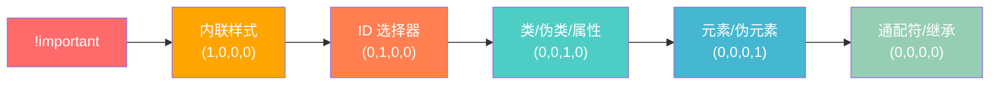
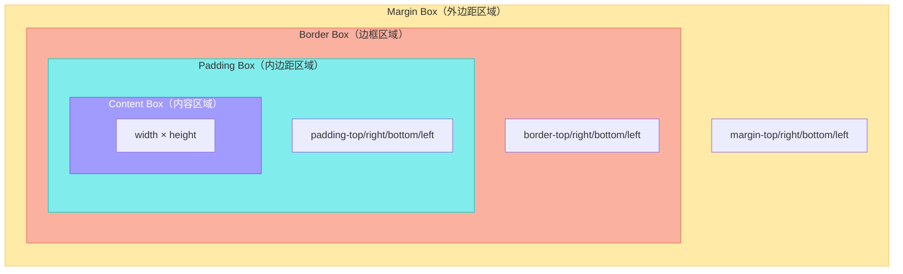
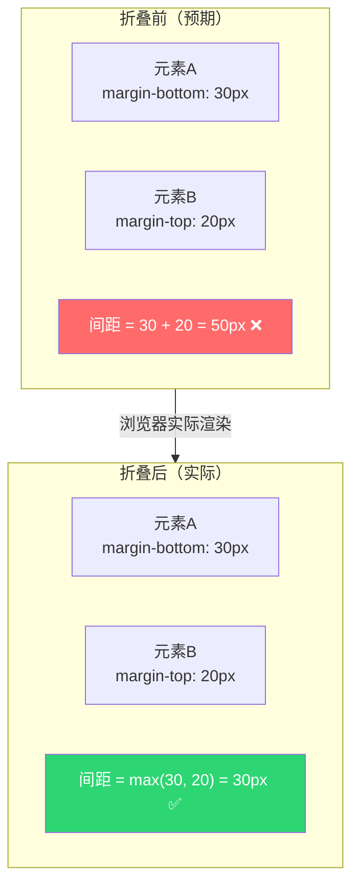
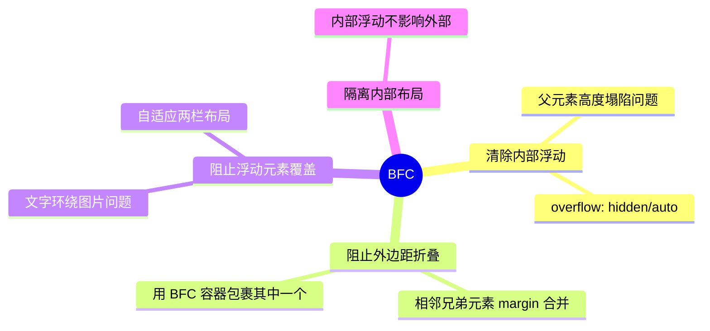
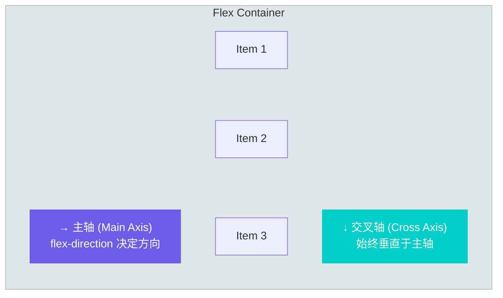
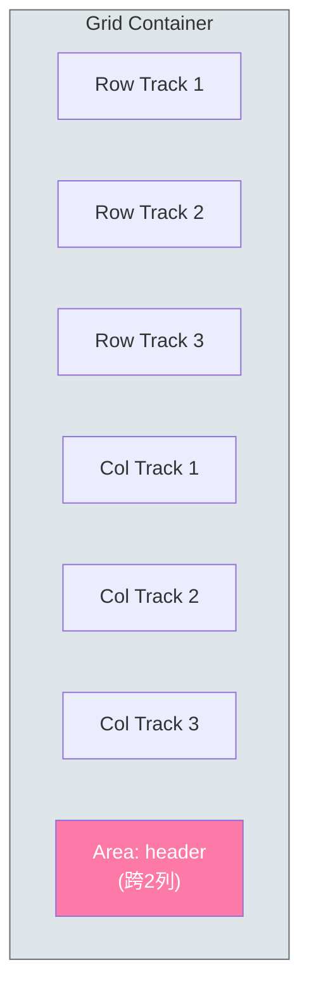
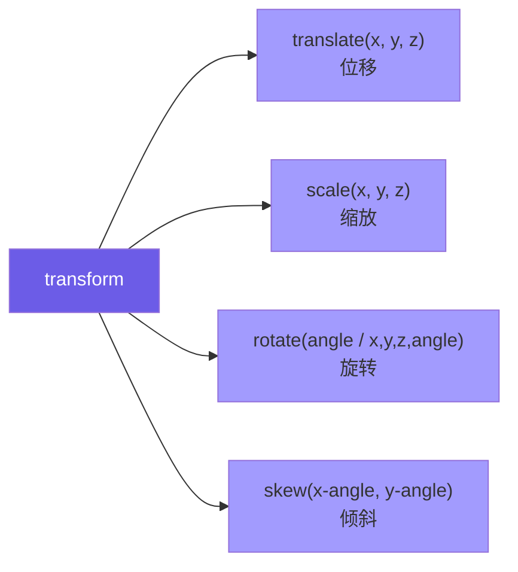
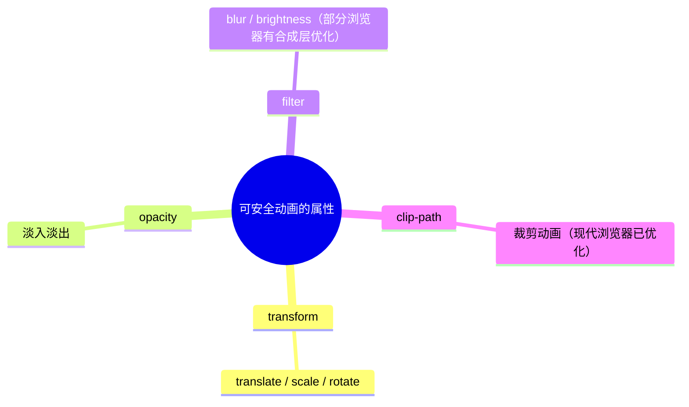
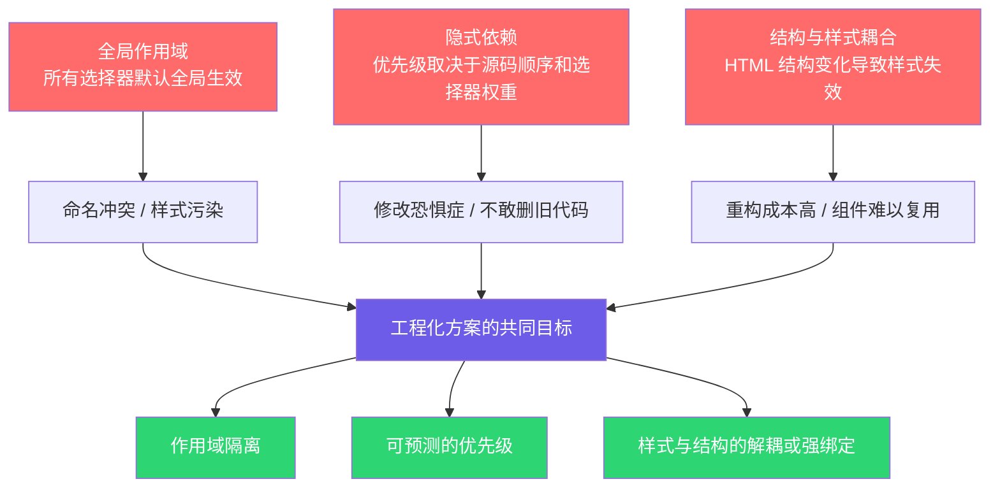
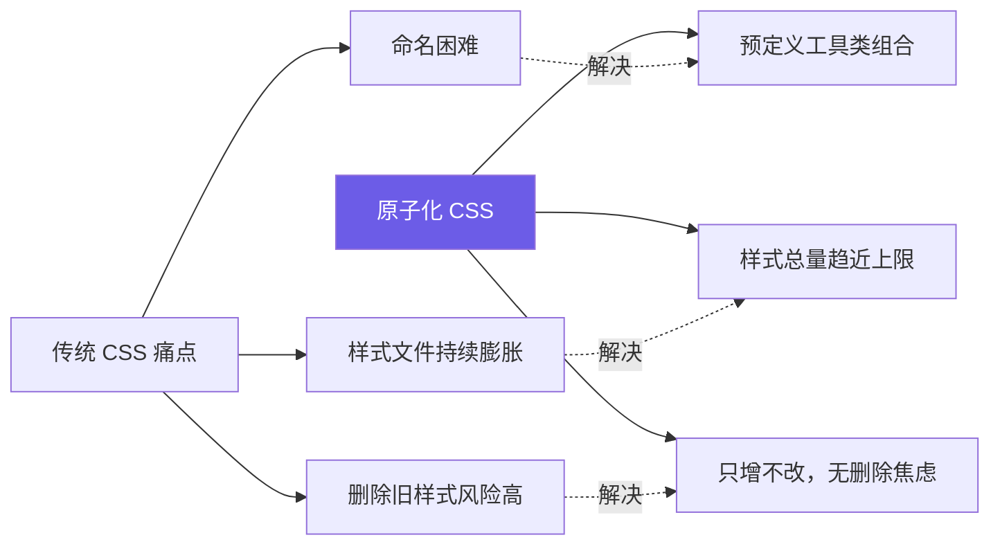

### 一、核心基础与盒模型

本阶段是 CSS 学习的基石。很多开发者在后续学习 Flex/Grid 布局时感到吃力，根本原因往往是对**盒模型**和**文档流**的理解不够透彻。CSS 的本质不是“装饰”，而是“空间分配”。理解了浏览器如何计算每个元素占据的空间，就掌握了 CSS 的第一性原理。

#### 1.1 CSS 语法与层叠规则

CSS 的全称是 **Cascading Style Sheets（层叠样式表）**，“层叠”二字是其最核心的机制。当多条规则同时作用于同一个元素时，浏览器需要通过一套算法来决定最终应用哪条样式。

##### 选择器优先级（Specificity）

优先级并非简单的数字大小比较，而是一个**四元组权重系统**。我们可以用以下结构来理解：



> **⚠️ 关键概念澄清：优先级不是进制运算**  
> 很多教程将优先级简化为千位、百位、十位、个位的数字相加（如 `1,2,3,4` = 1234），这在实际中容易导致误解。** specificity 是逐位比较的**：`(0,2,0,0)` 永远大于 `(0,1,99,0)`，因为第二位 2 > 1，后面的位数不再参与比较。它更像是一个版本号比较，而非数学加法。

##### 层叠顺序（Cascade Order）

当优先级完全相同时，**后声明的规则覆盖先声明的规则**。这也是为什么我们通常将重置样式（Reset）放在 CSS 文件顶部，而组件样式放在底部的原因。

此外，还需注意 **继承（Inheritance）** 机制：文本相关属性（`color`、`font-*`、`line-height` 等）默认继承，而盒模型相关属性（`margin`、`padding`、`border` 等）不继承。理解这一点可以避免大量不必要的重复声明。

#### 1.2 盒模型（Box Model）

盒模型是 CSS 空间分配的原子单位。**每一个 HTML 元素都被视为一个矩形盒子**，由内到外分为四层：



##### ⭐ 标准盒模型 vs 替代盒模型

这是初学者最容易踩坑的知识点，直接决定了 `width` 属性的含义：

|特性|标准盒模型 (`content-box`)|替代盒模型 (`border-box`)|
|:--|:--|:--|
|`width` 含义|仅指 **Content** 的宽度|包含 **Content + Padding + Border**|
|实际占用宽度|`width + padding + border + margin`|`width + margin`|
|默认值|✅ 是浏览器默认值|❌ 需手动设置|
|推荐程度|仅在特殊场景使用|**🏆 现代开发全局推荐**|

> **💡 为什么推荐全局使用 `border-box`？**  
> 在标准盒模型下，如果你给一个 `width: 300px` 的元素添加 `padding: 20px`，它的实际宽度会变成 340px，这会破坏布局预期。而在 `border-box` 下，`width: 300px` 就是最终可见宽度，padding 和 border 会向内压缩内容区域。**这让尺寸计算变得可预测**，也是几乎所有现代 CSS 框架（Bootstrap、Tailwind）的默认行为。
> 
> ```css
> /* 现代 CSS 最佳实践：全局重置 */
> *, *::before, *::after {
>   box-sizing: border-box;
> }
> ```

##### 外边距折叠（Margin Collapsing）

这是盒模型中最“反直觉”的行为之一：**垂直方向上相邻的两个块级元素的 margin 不会叠加，而是取较大值**。



**触发条件**：仅发生在**块级元素**的**垂直方向**，且两者之间没有 border、padding、inline 内容或 BFC 隔离。

**解决思路**：

- 只使用单方向的 margin（推荐统一使用 `margin-bottom`）
- 使用 padding 代替 margin
- 创建 BFC（见下文）来隔离折叠

#### 1.3 文档流与显示模式

**文档流（Normal Flow）** 是浏览器默认的排版方式：块级元素从上到下垂直排列，行内元素从左到右水平排列。理解文档流是理解所有“脱离文档流”技术（float、absolute、fixed）的前提。

##### 三种基本显示模式

|显示模式|典型元素|宽高设置|换行行为|嵌套规则|
|:--|:--|:--|:--|:--|
|`block`|div, p, h1-h6, section|✅ 生效|独占一行|可包含块级和行内|
|`inline`|span, a, strong, em|❌ 无效|与其他行内同行|不应包含块级元素|
|`inline-block`|img, input, button|✅ 生效|与其他行内同行|可包含块级和行内|

> **🔍 背景知识：为什么 img 是 inline-block？**  
> `` 虽然是替换元素（Replaced Element），但其默认 `display` 值为 `inline`。然而它可以设置宽高，行为类似 `inline-block`。这也是为什么图片底部经常出现几像素空白的原因——那是为文字基线（baseline）预留的空间。解决方案：设置 `vertical-align: bottom` 或将 img 设为 `display: block`。

#### 1.4 BFC（块级格式化上下文）

BFC 是本阶段的**终极概念**，也是面试高频考点。它是一个独立的渲染区域，内部元素的布局不会影响外部。

##### BFC 的核心作用



##### 创建 BFC 的常用方式

|方法|副作用|推荐度|
|:--|:--|:--|
|`overflow: hidden / auto / scroll`|可能裁剪内容或出现滚动条|⭐⭐⭐ 最常用|
|`display: flow-root`|**无副作用**，专为创建 BFC 设计|⭐⭐⭐⭐ 现代首选|
|`display: flex / grid`|改变子元素布局模式|⭐⭐⭐ 布局时顺便创建|
|`float: left / right`|脱离文档流|⭐ 不推荐|
|`position: absolute / fixed`|脱离文档流|⭐ 不推荐|

> **💡 `display: flow-root` 的价值**  
> 在 `flow-root` 出现之前，清除浮动最常用的 hack 是 `clearfix`（通过伪元素插入清除浮动的内容）。`flow-root` 是 CSS 规范专门为“创建一个无副作用的 BFC”而新增的 display 值，语义清晰且无任何布局副作用。**如果你的项目不需要兼容 IE，请优先使用它。**

#### 📋 本阶段自检清单

在进入下一阶段之前，请确认你能回答以下问题：

- [ ]  能否准确说出 `(0,2,1,0)` 和 `(0,1,5,3)` 哪个优先级更高？为什么？
- [ ]  能否解释 `border-box` 下 `width: 200px; padding: 20px; border: 5px solid` 的内容区实际宽度是多少？
- [ ]  能否列举至少 3 种创建 BFC 的方式，并说明各自的适用场景？
- [ ]  能否解释为什么两个相邻 div 的垂直 margin 没有按预期叠加？
- [ ]  能否区分 `inline` 和 `inline-block` 在宽高设置和基线对齐上的差异？

如果以上问题都能自信作答，恭喜你，CSS 的地基已经打牢。下一阶段我们将进入**现代布局体系**，学习 Flexbox 和 Grid 这两把利器。

### 二、现代布局体系

如果说第一阶段是理解“元素自身占据多少空间”，那么本阶段的核心则是**“如何安排多个元素在容器中的位置关系”**。CSS 布局经历了从 table → float → inline-block → flex/grid 的演进，前三种本质上都是 hack，而 Flexbox 和 Grid 才是 CSS 规范层面真正的布局系统。掌握它们，意味着你可以告别各种定位 tricks，用声明式的方式描述布局意图。

#### 2.1 Flexbox：一维布局之王

Flexbox（弹性盒子）专为**单轴方向**的布局设计，无论是水平导航栏、垂直居中卡片，还是等间距列表，它都是首选方案。

##### 核心心智模型：主轴与交叉轴

Flex 的一切行为都围绕两根轴展开。**这是理解 Flex 的关键，而非死记属性名**：



> **⚠️ 关键认知：轴是可变的**  
> 很多初学者把主轴等同于“水平方向”，这是错误的。当 `flex-direction: column` 时，主轴变为垂直方向，交叉轴变为水平方向。**所有 `justify-*` 属性始终沿主轴生效，所有 `align-*` 属性始终沿交叉轴生效**。记住这个规则，就不需要死记每个属性在横竖排下的具体表现。

##### 容器属性速查

|属性|作用|常用值|记忆口诀|
|:--|:--|:--|:--|
|`flex-direction`|定义主轴方向|`row` / `column` / `row-reverse` / `column-reverse`|定轴向|
|`justify-content`|主轴对齐|`flex-start` / `center` / `space-between` / `space-around` / `space-evenly`|主均分|
|`align-items`|交叉轴对齐|`stretch`(默认) / `center` / `flex-start` / `flex-end`|交对齐|
|`flex-wrap`|是否换行|`nowrap`(默认) / `wrap`|控换行|
|`gap`|项目间距|`<length>`|设间距|

> **💡 `space-between` vs `space-around` vs `space-evenly`**  
> 这三者是面试和实战中的高频混淆点：
> 
> - `space-between`：首尾项贴边，剩余空间**均匀分配在项目之间**
> - `space-around`：每个项目两侧分配**相等的半份空间**（视觉上首尾间距是中间的一半）
> - `space-evenly`：所有间隙（包括首尾）**完全相等**
> 
> 现代开发中，`space-evenly` 通常是最符合设计稿预期的选择。

##### 项目属性：flex 简写的真相

`flex` 是 `flex-grow`、`flex-shrink`、`flex-basis` 的简写，但它的默认值和单独设置时完全不同：

|写法|等价于|含义|
|:--|:--|:--|
|`flex: 1`|`1 1 0%`|等比分配剩余空间，忽略内容宽度|
|`flex: auto`|`1 1 auto`|基于内容宽度弹性伸缩|
|`flex: none`|`0 0 auto`|完全不伸缩，固定为内容宽度|
|`flex: initial`|`0 1 auto`|**默认值**，可缩小但不放大|

> **🔍 为什么 `flex: 1` 的 basis 是 0% 而不是 auto？**  
> 这是一个精心设计的语义区分。`flex: 1` 表达的是“**所有子项平等地瓜分容器**”，此时内容多少不重要，basis 设为 0 才能让 grow 完全主导尺寸。而 `flex: auto` 表达的是“**在内容宽度的基础上弹性调整**”。如果你发现设置了 `flex: 1` 但各项宽度不等，很可能是某个子项有 `min-width` 或不可收缩的内容（如长单词、图片）撑开了基准尺寸。

##### ⭐ Flex 经典陷阱：最小尺寸问题

Flex/Grid 子项有一个容易被忽视的默认行为：**`min-width: auto` / `min-height: auto`**，即子项不会小于其内容的最小尺寸。这会导致：

- 长文本溢出容器
- `overflow: hidden` 不生效
- 缩略图撑破卡片

**解决方案**：对可能溢出的 flex 子项显式设置 `min-width: 0`（或 `min-height: 0`）。这是 Flex 布局中最常见的 bug 修复手段之一。

#### 2.2 Grid：二维布局利器

Grid 是目前 CSS 中**唯一真正的二维布局系统**。当你需要同时控制行和列时（如仪表盘、相册、复杂表单），Grid 比嵌套 Flex 更简洁、更语义化。

##### 核心概念：轨道、单元格与区域



##### 定义网格的三种方式

|方式|语法示例|适用场景|
|:--|:--|:--|
|固定轨道|`grid-template-columns: 200px 1fr 200px`|侧边栏+内容区经典布局|
|重复函数|`repeat(auto-fill, minmax(250px, 1fr))`|**响应式卡片网格（无媒体查询！）**|
|命名区域|`grid-template-areas: "header header" "sidebar main"`|语义化页面整体布局|

> **💡 `auto-fill` vs `auto-fit` 的区别**  
> 这是 Grid 响应式的核心魔法：
> 
> - `auto-fill`：尽可能多地创建轨道，**即使没有内容也保留空轨道**
> - `auto-fit`：尽可能多地创建轨道，**然后将空轨道折叠为 0**，让已有项目拉伸填满
> 
> **经验法则**：大多数响应式卡片布局使用 `auto-fit`，因为你通常希望少量卡片也能撑满整行。只有在你明确需要保留空白占位时才用 `auto-fill`。

##### fr 单位的本质

`fr`（fraction）不是长度单位，而是**剩余空间的分数比例**。浏览器先分配所有固定尺寸（px、%、auto），再将剩余空间按 fr 比例分配。这意味着 `1fr 2fr` 不等于 `33% 67%`，除非没有其他固定尺寸的轨道。

#### 2.3 定位（Positioning）详解

尽管 Flex/Grid 已覆盖绝大多数布局需求，定位仍然是不可或缺的工具。关键在于理解**每种定位的参照物和使用边界**：

|值|参照物|脱离文档流|典型用途|
|:--|:--|:--|:--|
|`static`|N/A|❌|默认值，top/left 无效|
|`relative`|**自身原始位置**|❌|微调位置；作为 absolute 的定位锚点|
|`absolute`|最近的**非 static** 祖先|✅|弹窗、角标、overlay|
|`fixed`|**视口（viewport）**|✅|吸顶导航、回到顶部按钮|
|`sticky`|滚动容器 + 阈值|❌（条件性）|表头固定、侧边栏吸附|

> **🔍 `sticky` 的工作原理**  
> `sticky` 是 `relative` 和 `fixed` 的混合体。元素在滚动未到达阈值时表现为 `relative`，到达阈值后切换为 `fixed`。**注意**：sticky 元素不会超出其父容器的边界，如果父容器高度不够或 `overflow: hidden`，sticky 将失效。这是 sticky 最常见的“不工作”原因。

#### 2.4 响应式设计进阶

##### 从 Media Queries 到 Container Queries

传统响应式依赖**视口宽度**，但在组件化时代，同一个组件可能出现在全屏页面、侧边栏、弹窗等不同宽度的容器中。Media Queries 无法感知容器尺寸。

**Container Queries（容器查询）** 解决了这个问题：

```css
/* 定义容器 */
.card-wrapper {
  container-type: inline-size;
  container-name: card;
}

/* 根据容器宽度而非视口宽度响应 */
@container card (min-width: 400px) {
  .card { flex-direction: row; }
}
```

> **💡 渐进增强策略**  
> 截至当前主流浏览器已全面支持 Container Queries，但仍建议以 Mobile First + Media Queries 作为基础布局，Container Queries 作为组件级增强。这样既保证兼容性，又获得组件级响应能力。

##### 现代响应式单位

|单位|含义|替代场景|
|:--|:--|:--|
|`dvh/svh/lvh`|动态/小/大视口高度|解决移动端地址栏导致的 `100vh` 溢出问题|
|`cqw/cqh`|容器宽度/高度的百分比|配合 Container Queries 使用|
|`clamp(min, preferred, max)`|流体尺寸|替代大量 media query 实现字体/间距的平滑缩放|

**`clamp()` 实战公式**：

```css
/* 字体在 320px~1200px 视口间从 1rem 线性增长到 2rem */
font-size: clamp(1rem, 0.5rem + 2vw, 2rem);
```

#### 📋 本阶段自检清单

- [ ]  能否不看文档写出一个经典的“圣杯布局”（header + sidebar + main + footer）？分别用 Flex 和 Grid 各实现一次？
- [ ]  能否解释 `flex: 1` 和 `flex: auto` 的区别，并在实际场景中正确选择？
- [ ]  遇到 flex 子项内容溢出时，第一反应是否是检查 `min-width: 0`？
- [ ]  能否用 `repeat(auto-fit, minmax(...))` 写出无需媒体查询的响应式卡片网格？
- [ ]  能否区分 `sticky` 失效的常见原因（父容器 overflow、高度不足、缺少 top 值）？
- [ ]  是否了解 `dvh` 解决了什么具体问题？

通过本阶段的学习，你应该能够从容应对 90% 以上的页面布局需求。下一阶段我们将进入**视觉表现与交互动效**，让页面不仅“摆得对”，还能“动起来、看起来好”。

### 三、视觉表现与交互动效

如果说布局是页面的骨架，那么本阶段的内容就是页面的皮肤与灵魂。优秀的视觉与动效不仅能提升美感，更能**传达状态、引导注意力、建立空间感**。但需要强调的是：CSS 动效的第一原则是**性能**，第二原则才是好看。一个卡顿的动画比没有动画更损害用户体验。

#### 3.1 CSS 自定义属性（Variables）

在深入视觉效果之前，必须先掌握 CSS 自定义属性。它不是 Sass/Less 变量的替代品，而是一个**运行时动态系统**，是实现主题切换、组件化样式和复杂动效的基础设施。

##### 与预处理器变量的本质区别

|特性|Sass/Less 变量|CSS 自定义属性|
|:--|:--|:--|
|解析时机|编译时（构建产物中已替换为具体值）|**运行时**（浏览器实时计算）|
|作用域|全局或块级（遵循预处理器规则）|**遵循 DOM 树继承**|
|可被 JS 修改|❌|✅ `el.style.setProperty()`|
|响应式/状态感知|❌|✅ 可在媒体查询、伪类中重新赋值|
|回退机制|❌|✅ `var(--color, fallback)`|

> **💡 核心认知：自定义属性是“活”的**  
> Sass 变量是文本替换，编译后就不存在了。而 CSS 自定义属性存在于 DOM 树上，可以继承、可以被覆盖、可以被 JavaScript 实时修改。这意味着你可以用一行 JS 切换整个页面的主题色，而不需要生成多套 CSS 文件。

##### 实战模式：语义化 Token 体系

```css
:root {
  /* 基础色板（Primitive Tokens） */
  --blue-500: #3b82f6;
  --gray-100: #f3f4f6;
  
  /* 语义化 Token（Semantic Tokens） */
  --color-primary: var(--blue-500);
  --color-surface: var(--gray-100);
  --spacing-md: 1rem;
}

/* 暗色主题只需重定义语义层 */
[data-theme="dark"] {
  --color-primary: #60a5fa;
  --color-surface: #1f2937;
}
```

这种分层设计使得主题切换只影响语义层，组件代码完全不需要改动。

#### 3.2 Transform：高性能变换的基石

`transform` 是 CSS 动效中**最重要的属性**，因为它不触发重排（Reflow）甚至不触发重绘（Repaint），直接在 GPU 合成层完成。

##### 四大基本变换函数



> **⚠️ 关键性能准则**
> 
> - **永远优先使用 `transform: translate()` 代替 `top/left/margin` 来做位移**。前者走合成器线程，后者触发主线程重排。
> - `transform` 会创建新的**包含块（Containing Block）**，导致其内部的 `position: fixed` 元素不再相对于视口定位，而是相对于该 transform 元素。这是一个高频踩坑点。
> - 3D 变换（如 `translateZ(0)`、`rotateX()`）会强制提升为独立合成层，可用于优化动画性能，但过度使用会导致内存占用激增。

#### 3.3 Transition 与 Animation

##### 两者的定位区分

|维度|Transition|Animation|
|:--|:--|:--|
|触发方式|状态变化（hover、class toggle）|自动播放或由 JS/API 控制|
|关键帧|仅起点和终点|**任意数量的关键帧**|
|循环/方向|❌|✅ `iteration-count` / `direction`|
|暂停/恢复|❌|✅ `play-state`|
|适用场景|微交互反馈（按钮、下拉菜单）|复杂序列动画、加载动画、入场效果|

##### ⭐ 动画性能黄金法则

**只对以下属性做动画**：



> **🔍 为什么不能对 width/height/top/left 做动画？**  
> 这些属性的每一帧变化都会触发**重排（Layout）**→ 重绘（Paint）→ 合成（Composite）完整流水线。而 `transform` 和 `opacity` 可以跳过前两阶段，直接在 GPU 上合成。在 60fps 要求下，每帧只有约 16ms 预算，重排极易导致掉帧。
> 
> **例外情况**：如果确实需要对宽高做动画，可以考虑用 `scale()` 模拟，或使用即将普及的 `interpolate-size` 属性（目前仍为实验性）。

##### will-change 的正确用法

`will-change` 用于提前告知浏览器某个属性即将变化，以便预先创建合成层。**但它不是万能加速符**：

- ✅ 正确：在动画开始前通过 JS 添加，动画结束后移除
- ❌ 错误：全局声明 `will-change: transform`，导致每个元素都创建合成层，内存爆炸
- ❌ 错误：对不会变化的属性声明

#### 3.4 高级视觉技术

##### Filter 与 Backdrop-filter

- `filter`：作用于元素**自身及其所有子内容**（模糊、灰度、色相旋转等）
- `backdrop-filter`：作用于元素**背后的内容**（毛玻璃效果的核心）

> **💡 毛玻璃效果的注意事项**  
> `backdrop-filter: blur()` 需要背景有可见内容才能看到效果。如果元素背后是纯色或不透明内容，blur 将不可见。此外，该属性在某些旧版 Android WebView 中不支持，务必提供降级方案（如半透明纯色背景）。

##### Clip-path 创意裁剪

`clip-path` 可以将元素裁剪为任意形状，且**裁剪区域外的内容不参与点击事件**：

```css
/* 圆形头像 */
clip-path: circle(50% at center);

/* 对话气泡 */
clip-path: polygon(0 0, 100% 0, 100% 80%, 60% 80%, 50% 100%, 40% 80%, 0 80%);

/* 配合 transition 实现形状变形动画 */
transition: clip-path 0.3s ease;
```

##### 伪元素的进阶用法

`::before` 和 `::after` 不仅是装饰工具，更是**零额外 DOM 节点的布局利器**：

- **渐变边框**：用伪元素做底层渐变，主体做上层遮罩
- **文字截断省略号**：`text-overflow: ellipsis` 的多行版本依赖 `-webkit-line-clamp`，但自定义省略号位置可用伪元素 + float 实现
- **图标系统**：配合 icon font 或 SVG mask
- **调试辅助**：开发时用 `*::after { content: attr(class); ... }` 可视化类名

#### 3.5 无障碍与性能意识

##### prefers-reduced-motion

**这是专业前端与业余爱好者的分水岭**。部分用户对屏幕运动敏感（前庭功能障碍），强行动画可能导致眩晕恶心：

```css
@media (prefers-reduced-motion: reduce) {
  *, *::before, *::after {
    animation-duration: 0.01ms !important;
    transition-duration: 0.01ms !important;
    scroll-behavior: auto !important;
  }
}
```

这不是可选项，而是**职业道德要求**。保留必要的状态反馈（如颜色变化），移除纯装饰性运动。

##### 动画性能检查清单

- [ ]  是否只动画了 transform / opacity？
- [ ]  是否避免了在动画中修改布局属性？
- [ ]  是否在移动端测试过实际帧率？
- [ ]  是否尊重了 `prefers-reduced-motion`？
- [ ]  长列表中的动画是否做了虚拟化或节流？
- [ ]  `will-change` 是否仅在需要时动态添加？

#### 📋 本阶段自检清单

- [ ]  能否用 CSS 自定义属性实现一套完整的亮/暗主题切换，且组件代码无需修改？
- [ ]  能否解释为什么 `transform: translateX(100px)` 比 `margin-left: 100px` 性能好？
- [ ]  遇到动画卡顿，第一反应是否是打开 DevTools Performance 面板排查重排？
- [ ]  能否用 `clip-path` 实现一个带箭头的对话气泡，并带有形状变形过渡？
- [ ]  项目中是否包含了 `prefers-reduced-motion` 的适配？
- [ ]  能否区分 `filter` 和 `backdrop-filter` 的作用对象差异？

至此，你已经具备了独立完成高质量视觉页面的能力。下一阶段是最后的**工程化与架构思维**，我们将跳出单个文件的视角，学习如何在大型项目中优雅地组织、维护和扩展 CSS 代码。

### 四、工程化与架构思维

当项目规模从几个页面增长到数百个组件、数十万行样式代码时，CSS 的挑战就不再是“如何实现某个效果”，而是**“如何避免样式地狱”**。本阶段将帮助你从“写 CSS 的人”转变为“设计 CSS 系统的人”。这里没有唯一正确的答案，只有适合团队和项目的权衡取舍。

#### 4.1 CSS 的根本困境与解决思路

在讨论具体方案之前，必须理解 CSS 在工程化层面的三个原生缺陷：



> **💡 核心认知：没有银弹**  
> 所有 CSS 工程化方案都是在上述三个问题之间做权衡。BEM 牺牲了书写简洁性换取可预测性；CSS Modules 牺牲了全局复用便利性换取作用域安全；Tailwind 牺牲了语义化类名换取开发效率和零冲突。**选择方案前，先明确你的项目最痛的问题是什么。**

#### 4.2 方法论流派：命名规范与架构模式

在不依赖构建工具的前提下，通过约定来组织 CSS。

##### BEM（Block Element Modifier）

最经典、应用最广的命名方法论：

```css
/* Block: 独立的功能单元 */
.card { }

/* Element: Block 的组成部分，用双下划线连接 */
.card__title { }
.card__image { }

/* Modifier: Block 或 Element 的状态/变体，用双连字符连接 */
.card--featured { }
.card__title--truncated { }
```

|优点|缺点|
|:--|:--|
|扁平化选择器，优先级可控|类名冗长，HTML 膨胀|
|一眼看出元素归属关系|嵌套结构表达力弱|
|无需构建工具，纯约定驱动|依赖团队纪律，新人上手有门槛|

> **🔍 BEM 的现代演进**  
> 严格 BEM 在实践中往往过于僵化。推荐采用 **BEM + 实用类混合**策略：布局间距、通用文本样式使用工具类，组件内部结构使用 BEM。这样既保持了组件的可读性，又避免了为每个 margin 都创建一个 modifier。

##### 其他值得了解的架构模式

- **OOCSS**：将结构与皮肤分离、容器与内容分离。思想优秀但实践中难以严格执行，其精华已被 Tailwind 等原子化方案吸收。
- **SMACSS**：将样式分为 Base、Layout、Module、State、Theme 五类。更像是一种文件夹组织策略，可与 BEM 配合使用。
- **CUBE CSS**：较新的方法论，强调 Composition（组合）、Utility（工具）、Block（块）、Exception（例外）。更贴合现代组件化开发思维。

#### 4.3 作用域隔离方案

##### CSS Modules

构建时将类名自动哈希化，从根本上消除全局污染：

```css
/* Button.module.css */
.primary { background: blue; }
/* 编译后 → .Button_primary_a3xKf { background: blue; }
```

- ✅ 真正的局部作用域，零运行时开销
- ✅ 与现有 CSS 生态兼容，学习成本低
- ❌ 全局样式需额外处理（`:global`）
- ❌ 类名调试不友好（可通过配置改善）

##### Scoped CSS（Vue SFC 为代表）

通过 `data-v-xxx` 属性选择器实现组件级隔离：

- ✅ 语法最自然，无需改类名
- ❌ 属性选择器性能略低于类选择器（实际影响极小）
- ❌ 深度穿透（`::v-deep` / `:deep()`）语法因框架而异

##### CSS-in-JS（Styled Components / Emotion）

将样式作为 JS 对象编写，天然拥有 JS 的全部能力：

- ✅ 动态样式、主题注入、类型安全（TS）
- ✅ 关键 CSS 提取、死代码消除
- ❌ **运行时开销**（生成类名、注入 style 标签）
- ❌ SSR 复杂度增加
- ❌ 脱离标准 CSS 生态，IDE 支持受限

> **⚠️ 2024+ 趋势观察**  
> CSS-in-JS 的运行时开销问题推动了新一代方案的崛起：**Vanilla Extract**（编译时 CSS-in-JS）、**Panda CSS**、**StyleX** 等方案保留了 JS 的类型安全和动态能力，同时输出纯静态 CSS，消除了运行时成本。如果你正在启动新项目且偏好 JS-first 体验，建议优先评估这些编译时方案。

#### 4.4 原子化 CSS（Utility-First）

以 Tailwind CSS / UnoCSS 为代表，彻底颠覆了“语义化类名”的传统观念。

##### 为什么原子化能成为主流？



##### 理性看待原子化的争议

|常见质疑|客观回应|
|:--|:--|
|“HTML 太丑了”|可读性应从组件抽象层面解决，而非类名语义|
|“违背关注点分离”|组件本身就是结构与样式的封装单元，分离发生在组件边界而非文件边界|
|“学习成本高”|初期确实需要记忆，但熟练后开发速度显著提升|
|“不适合所有项目”|✅ 正确。内容型网站、高度定制化设计系统可能不适合|

> **💡 最佳实践：原子化 ≠ 拒绝抽象**  
> Tailwind 官方推荐的 `@apply` 和组件抽取并非反模式，而是**必要的抽象层**。当一组工具类在多处重复出现时，就应该提取为组件或自定义工具类。原子化解决的是“底层原子的标准化”，而非禁止上层抽象。

#### 4.5 预处理器与现代原生能力

Sass/Less 曾是 CSS 工程的标配，但 CSS 原生能力的快速进化正在改变这一格局：

|Sass 特性|CSS 原生替代|成熟度|
|:--|:--|:--|
|变量|`--custom-property`|✅ 全面支持，且功能更强|
|嵌套|`& { }` 原生嵌套|✅ 主流浏览器已支持|
|Mixin|`@mixin` 暂无直接替代|⚠️ 仍需预处理器或 PostCSS 插件|
|函数/运算|`calc()` / `color-mix()` / `light-dark()`|✅ 大部分场景已覆盖|
|模块化|`@import` → `@use` / Cascade Layers|✅ `@layer` 提供了更好的优先级管理|

> **🔍 是否还需要 Sass？**  
> 如果你的项目大量使用 mixin、复杂函数和模块系统，Sass 仍有价值。但如果主要使用变量和嵌套，可以考虑迁移到原生 CSS + PostCSS，减少构建链依赖。**Cascade Layers (`@layer`)** 尤其值得关注，它从规范层面解决了第三方库样式优先级不可控的问题，这是任何预处理器都无法提供的能力。

#### 4.6 性能优化与质量保障

##### 关键渲染路径优化

- **关键 CSS 内联**：首屏所需样式内联到 `<head>`，非关键样式异步加载
- **避免 @import**：它会阻塞后续样式表的并行下载
- **减少选择器复杂度**：虽然现代浏览器选择器匹配已很快，但过深的嵌套仍会影响样式重计算性能
- **Containment**：使用 `contain: layout style paint` 告知浏览器某区域的变更不会影响外部，大幅减少重排范围

##### 质量保障工具链

|工具|用途|
|:--|:--|
|Stylelint|CSS 静态分析，强制命名规范、检测无效属性|
|PurgeCSS / UnCSS|移除未使用的样式，减小产物体积|
|Visual Regression Testing|Chromatic / Percy 等工具自动截图对比，防止样式回归|
|Bundle Analyzer|可视化 CSS 产物组成，发现异常膨胀|

#### 📋 本阶段自检清单

- [ ]  能否清晰说出 BEM、CSS Modules、Tailwind、CSS-in-JS 各自最适合的项目类型？
- [ ]  在新项目中选型时，是否能基于团队规模、项目周期、设计系统需求做出有理有据的决策，而非盲目跟风？
- [ ]  是否了解 `@layer` 的作用，并能用它管理第三方库的样式优先级？
- [ ]  是否在项目中使用过 Stylelint 或类似的 lint 工具？
- [ ]  能否解释“关键 CSS”的概念及其对 Core Web Vitals（LCP/FCP）的影响？
- [ ]  是否关注 CSS 新特性的浏览器支持情况，并有渐进增强的意识？

---

### 🎓 结语：CSS 学习的长期主义

走完这四个阶段，你已经建立了完整的 CSS 知识体系。但 CSS 是一门**永远在进化的语言**：`anchor()` 定位、`scroll-driven animations`、`view-transition`、`if()` 函数等新特性正在密集落地。

最后给出三条长期建议：

1. **回归规范而非教程**：MDN 和 W3C 规范是最准确的信息源，二手教程常有滞后或误读。
2. **建立自己的 CodePen/Demo 库**：每个知识点都用最小可复现示例验证，这比收藏文章有效十倍。
3. **保持审美与技术的平衡**：CSS 是技术与设计的交叉地带。关注优秀的设计作品，理解“为什么这样好看”，才能让技术真正服务于体验。

### 五、练习

理论的价值在于应用。本阶段是整份笔记的终章，旨在通过分层级的实战练习，将前四个阶段的知识点从“理解”转化为“肌肉记忆”。这些题目没有标准答案，重点在于**解题思路的推演过程**和**对权衡取舍的思考**。建议为每道题建立独立的 CodePen/StackBlitz 项目，并记录你的决策日志。

#### 5.1 基础诊断：盒模型与文档流修复术

> **🎯 训练目标**：巩固第一阶段核心概念，培养“看到布局异常就能定位根因”的直觉。

**题目：修复一个“破碎”的卡片列表**

提供一个包含以下故意制造的 bug 的 HTML/CSS 代码片段（请自行构造或让 AI 生成），逐一修复并解释原因：

1. 卡片设置了 `width: 300px; padding: 20px; border: 2px solid`，但实际宽度超出预期导致换行错乱
2. 相邻卡片的垂直 margin 没有按设计稿叠加，间距比预期小
3. 卡片内的长 URL 文本溢出容器，破坏了布局
4. 卡片底部有一张 `inline` 图片，下方出现约 4px 的莫名空白
5. 父容器使用了 `float` 子元素，但未清除浮动，导致后续内容重叠

**交付要求**：

- 每个 bug 写出**根因分析**（不是“怎么修”，而是“为什么坏”）
- 给出至少两种修复方案，并说明选择当前方案的理由
- 修复后验证：调整浏览器窗口宽度，确认布局在所有断点下均正常

> [!success]- 点击展开题解
> 
> ### 🛠️ 5.1 基础诊断：盒模型与文档流修复术 · 题解
> 
> 本题旨在训练开发者对 CSS **视觉格式化模型（Visual Formatting Model）** 的底层理解。很多布局问题并非“代码写错了”，而是“浏览器按规则渲染的结果与你预期不符”。以下是对五个经典 Bug 的深度剖析与修复方案。
> 
> ---
> 
> #### 🐛 Bug 1：卡片宽度超出预期导致换行错乱
> 
> **现象复现**：
> 
> ```css
> .card {
>   width: 300px;
>   padding: 20px;
>   border: 2px solid #333;
> }
> ```
> 
> 期望宽度是 300px，但实际占据水平空间为 **344px** (300 + 20×2 + 2×2)，导致在固定宽度容器中比预期更早换行或溢出。
> 
> **🔍 根因分析**：  
> 这是 CSS 默认的 **`content-box`** 盒模型行为。在标准盒模型中，`width` 仅指代**内容区域（Content Area）** 的宽度，`padding` 和 `border` 会在此基础上向外累加。
> 
> ```mermaid
> graph LR
>     A[Content Width<br/>300px] --> B[+ Padding<br/>20px * 2]
>     B --> C[+ Border<br/>2px * 2]
>     C --> D[Total Occupied Width<br/>344px]
>     style D fill:#ffcccc,stroke:#cc0000
> ```
> 
> **💡 修复方案对比**：
> 
> |方案|代码|优点|缺点/风险|
> |:--|:--|:--|:--|
> |**A. 全局切换盒模型（推荐）**|`*, *::before, *::after { box-sizing: border-box; }`|符合直觉，`width` 即为元素最终占位宽度；一劳永逸|需确保项目无遗留依赖 content-box 的旧代码|
> |B. 手动计算宽度|`width: calc(300px - 40px - 4px);`|精确控制，不影响其他元素|维护成本高，响应式下难以适配百分比|
> 
> **✅ 选择理由**：现代 CSS 开发中，`border-box` 已成为事实标准。它让布局计算从“加法”变为“包含关系”，极大降低了心智负担。几乎所有主流框架（Bootstrap, Tailwind）都默认采用此策略。
> 
> ---
> 
> #### 🐛 Bug 2：相邻卡片垂直 margin 间距比预期小
> 
> **现象复现**：
> 
> ```css
> .card { margin-bottom: 30px; }
> .card + .card { margin-top: 20px; }
> ```
> 
> 期望两张卡片间距为 50px，实际只有 **30px**。
> 
> **🔍 根因分析**：  
> 这触发了 CSS 的 **外边距折叠（Margin Collapsing）** 机制。在**常规文档流（Normal Flow）** 中，两个相邻的**块级元素**之间的垂直外边距不会叠加，而是取两者中的**较大值**。
> 
> > ⚠️ **注意**：此规则仅适用于垂直方向、常规流中的块级兄弟元素。Flex/Grid 子项、浮动元素、绝对定位元素之间**不会**发生折叠。
> 
> ```mermaid
> graph TB
>     subgraph "Margin Collapsing"
>     A["Card 1<br/>margin-bottom: 30px"]
>     B["Card 2<br/>margin-top: 20px"]
>     A -->|"取 max(30,20) = 30px"| C[实际间距: 30px]
>     end
>     style C fill:#fff3cd,stroke:#856404
> ```
> 
> **💡 修复方案对比**：
> 
> |方案|代码|优点|缺点/风险|
> |:--|:--|:--|:--|
> |**A. 统一单向 margin（推荐）**|`.card { margin-bottom: 30px; }` 去掉顶部 margin|语义清晰，避免折叠歧义|首尾元素可能需要额外处理|
> |B. 使用 Gap 属性|父容器设 `display: flex/grid; gap: 30px;`|最现代、最干净的间距管理方式|需确认目标浏览器兼容性（2026年已基本无障碍）|
> |C. 创建 BFC 阻断折叠|给其中一个卡片包裹 `overflow: hidden` 容器|利用规范特性绕过折叠|引入多余 DOM，语义不清，属 hack 手段|
> 
> **✅ 选择理由**：优先使用 **Gap**（若布局本身适合 Flex/Grid）。若必须用 margin，则遵循 **“单一方向原则”**，只设置 `margin-bottom` 或 `margin-top`，从根本上规避折叠问题。
> 
> ---
> 
> #### 🐛 Bug 3：长 URL 文本溢出容器破坏布局
> 
> **现象复现**：  
> 卡片内包含类似 `https://example.com/very-long-path-without-any-break-opportunity` 的文本，撑破卡片边界。
> 
> **🔍 根因分析**：  
> 浏览器默认的换行算法（Line Breaking Algorithm）只在**空白符、连字符**等“软换行机会”处断行。纯字母数字组成的长字符串被视为一个不可分割的“单词”，当容器宽度不足以容纳该单词时，浏览器宁可溢出也不会强行截断（除非显式指示）。
> 
> **💡 修复方案对比**：
> 
> |方案|代码|效果|适用场景|
> |:--|:--|:--|:--|
> |**A. `overflow-wrap: anywhere`（推荐）**|`overflow-wrap: anywhere;`|允许在任意字符间断行，同时参与最小内容尺寸计算|用户生成内容、URL、代码片段|
> |B. `word-break: break-all`|`word-break: break-all;`|强制在任意字符间断行|中日韩混排长文本，但英文阅读体验差|
> |C. `text-overflow: ellipsis`|配合 `white-space: nowrap; overflow: hidden;`|不换行，超出部分显示省略号|标题等不允许换行的场景|
> 
> **✅ 选择理由**：`overflow-wrap: anywhere` 是专为这类场景设计的现代属性。相比 `break-all`，它在有正常换行机会时仍优先使用自然断行，仅在必要时才强制断开，兼顾了可读性与布局安全。
> 
> ---
> 
> #### 🐛 Bug 4：inline 图片下方出现约 4px 莫名空白
> 
> **现象复现**：
> 
> ```html
> <div class="card-footer">
>   
> </div>
> ```
> 
> 图片底部与容器底边之间存在微小间隙，且无法通过 `margin: 0` 消除。
> 
> **🔍 根因分析**：  
> `` 默认是 **inline-level** 元素。在行内格式化上下文中，元素的垂直对齐基线是 **baseline**（文字基线），而非底部边缘。Baseline 下方预留了用于容纳字体 **descender**（如 g, j, p, q, y 的下伸部分）的空间，这就是那 ~4px 空白的来源。
> 
> ```mermaid
> graph TB
>     subgraph "Inline Image Baseline Alignment"
>     L["───────── Baseline ─────────"]
>     IMG["🖼️ Image Box"]
>     DESC["↕ Descender Space (~4px)"]
>     IMG --> L
>     L --> DESC
>     end
>     style DESC fill:#ffe0b2,stroke:#e65100
> ```
> 
> **💡 修复方案对比**：
> 
> |方案|代码|原理|推荐度|
> |:--|:--|:--|:--|
> |**A. 改为 block（推荐）**|`img { display: block; }`|脱离行内格式化上下文，baseline 概念不再适用|⭐⭐⭐⭐⭐|
> |B. 调整垂直对齐|`img { vertical-align: bottom/middle/top; }`|改变 inline 元素相对于 baseline 的对齐位置|⭐⭐⭐⭐|
> |C. 父容器 font-size: 0|`parent { font-size: 0; }`|descender 高度与字号相关，设为 0 则间隙消失|⭐⭐（hack，影响子元素文字）|
> 
> **✅ 选择理由**：`display: block` 是最根本的解决方案。绝大多数布局场景中，图片作为独立视觉单元本就不需要行内对齐特性。若确实需要 inline 排列（如图标+文字），则选用 `vertical-align: middle`。
> 
> ---
> 
> #### 🐛 Bug 5：float 子元素未清除导致后续内容重叠
> 
> **现象复现**：
> 
> ```html
> <div class="card-list">
>   <div class="card" style="float:left;">...</div>
>   <div class="card" style="float:left;">...</div>
> </div>
> <footer>页面底部内容</footer>
> ```
> 
> `<footer>` 向上移动，与浮动的卡片重叠；`.card-list` 高度塌陷为 0。
> 
> **🔍 根因分析**：  
> 浮动元素会**脱离常规文档流**。父容器在计算高度时**忽略**浮动子元素，导致高度塌陷。后续非浮动元素在定位时同样无视浮动元素的存在（尽管行内内容会环绕浮动体），从而产生视觉重叠。
> 
> **💡 修复方案对比**：
> 
> |方案|代码|原理|评价|
> |:--|:--|:--|:--|
> |**A. 现代布局替代（强烈推荐）**|改用 `display: flex/grid`|从根本上消除对 float 布局的依赖|最佳实践|
> |B. BFC 清除法|`.card-list { overflow: auto; }`|创建 BFC，BFC 在计算高度时会包含内部浮动元素|兼容性好，副作用小|
> |C. Clearfix Hack|`.card-list::after { content:""; display:block; clear:both; }`|在末尾插入一个清除浮动的伪元素撑开高度|经典方案，但属于历史遗留技术|
> |D. 空 div 清除|`<div style="clear:both"></div>`|手动插入清除元素|❌ 不推荐，污染语义结构|
> 
> **✅ 选择理由**：
> 
> - **如果是新项目或可重构**：直接用 Flexbox/Grid 替换 float 布局。Float 设计初衷是文字环绕，不是页面布局。
> - **如果是维护旧项目**：使用 `overflow: auto` 创建 BFC，一行代码解决问题且无额外 DOM 开销。
> 
> ---
> 
> ### ✅ 验证清单
> 
> 修复完成后，请执行以下验证步骤：
> 
> 1. **响应式测试**：拖动浏览器窗口从 320px → 1920px，确认卡片在各断点下无溢出、无异常换行
> 2. **DevTools 盒模型检查**：选中每个卡片，在 Elements 面板底部的 Box Model 可视化图中确认宽高数值符合预期
> 3. **缩放测试**：将页面缩放至 200%，验证文本溢出处理是否正常触发
> 4. **无障碍检查**：确认 `overflow-wrap: anywhere` 没有导致屏幕阅读器朗读异常
> 
> ### 📚 延伸阅读
> 
> - MDN: [The box model](https://developer.mozilla.org/en-US/docs/Learn/CSS/Building_blocks/The_box_model)
> - MDN: [Mastering margin collapsing](https://developer.mozilla.org/en-US/docs/Web/CSS/CSS_box_model/Mastering_margin_collapsing)
> - CSS Spec: [CSS Inline Layout Module Level 3 - Baseline Alignment](https://www.w3.org/TR/css-inline-3/#baselines)
> - Rachel Andrew: [Getting to know the new CSS gap property](https://www.smashingmagazine.com/2021/10/css-gap-property/)

#### 5.2 布局重构：同一需求的三种实现

> **🎯 训练目标**：打通 Flex/Grid/Positioning 的选型思维，理解“能实现”和“该这样实现”的区别。

**题目：响应式仪表盘布局**

实现一个包含 Header、Sidebar、Main Content、Footer 的后台管理布局，满足：

- 桌面端：Sidebar 固定 260px，Main 自适应，Header/Footer 全宽
- 平板端：Sidebar 收起为 64px 图标栏
- 移动端：Sidebar 隐藏，点击汉堡菜单以 overlay 形式滑出

**分别用以下三种方案独立实现**：

|方案|核心技术栈|额外约束|
|:--|:--|:--|
|A|纯 Flexbox + Media Queries|不使用 Grid，不使用 Position（overlay 除外）|
|B|CSS Grid + Named Areas|使用 `grid-template-areas` 语义化定义，Media Query 仅切换 area 模板|
|C|Container Queries + 现代单位|**不使用任何 Media Query**，Sidebar 根据自身容器宽度决定展开/收起|

**交付要求**：

- 三份完全独立的实现代码
- 一份对比文档：从代码量、可维护性、浏览器兼容性、响应式粒度四个维度评价三种方案
- 回答：如果需求变更为“Sidebar 支持用户拖拽调整宽度”，哪种方案改造成本最低？为什么？

> [!success]- 点击展开题解
> 
> ## 📖 题解导读
> 
> 本题是前端布局进阶的经典训练，核心不在于“写出代码”，而在于**理解布局模型的适用边界**。三种方案分别代表了 CSS 布局演进的三个阶段：
> 
> - **Flexbox**：一维流式布局的王者，兼容性好但处理二维结构时代码冗余。
> - **Grid Named Areas**：语义化二维布局，将“视觉结构”与“DOM 结构”解耦。
> - **Container Queries**：组件级响应式，让布局脱离视口（Viewport）依赖，迈向真正的模块化。
> 
> 下面我们将逐一拆解实现，并进行深度对比。
> 
> ---
> 
> ## 🏗️ 公共 HTML 结构
> 
> 为了公平对比，三份代码共用以下语义化 HTML（仅 C 方案需额外包裹容器）：
> 
> ```html
> <body class="dashboard">
>   <header class="header">Header</header>
>   <nav class="sidebar">Sidebar</nav>
>   <main class="main">Main Content</main>
>   <footer class="footer">Footer</footer>
>   <!-- 移动端汉堡按钮 -->
>   <button class="menu-toggle" aria-label="菜单">☰</button>
> </body>
> ```
> 
> > 💡 **背景知识**：为什么 DOM 顺序是 Header → Sidebar → Main → Footer？  
> > 这是为了无障碍访问（Accessibility）。屏幕阅读器按 DOM 顺序朗读，侧边栏在主要内容之前符合后台管理系统的导航逻辑。Grid 和 Flex 的 `order` 属性虽可改变视觉顺序，但不应滥用，以免破坏语义。
> 
> ---
> 
> ## 🔧 方案 A：纯 Flexbox + Media Queries
> 
> ### 核心思路
> 
> Flexbox 本质是**一维布局**。要实现二维仪表盘，需要嵌套：外层纵向排列 Header/Footer，内层横向排列 Sidebar/Main。
> 
> ```mermaid
> graph TD
>     Body["body.flex-col"] --> Header
>     Body --> Middle["div.flex-row (中间层)"]
>     Body --> Footer
>     Middle --> Sidebar
>     Middle --> Main
> ```
> 
> ### 完整代码
> 
> ```css
> /* === 基础重置 & Flex 骨架 === */
> .dashboard {
>   display: flex;
>   flex-direction: column;
>   min-height: 100vh;
> }
> 
> .dashboard-middle {
>   display: flex;
>   flex: 1; /* 撑满剩余高度 */
> }
> 
> .header, .footer { flex-shrink: 0; }
> .sidebar { width: 260px; flex-shrink: 0; }
> .main { flex: 1; min-width: 0; } /* min-width:0 防止内容溢出 */
> 
> /* === 平板端 ≤1024px === */
> @media (max-width: 1024px) {
>   .sidebar { width: 64px; }
> }
> 
> /* === 移动端 ≤768px === */
> @media (max-width: 768px) {
>   .sidebar {
>     position: fixed;
>     top: 0; left: 0; bottom: 0;
>     width: 260px;
>     transform: translateX(-100%);
>     transition: transform 0.3s ease;
>     z-index: 100;
>   }
>   .sidebar.open { transform: translateX(0); }
>   .menu-toggle { display: block; }
> }
> ```
> 
> ### ⚠️ 关键注意点
> 
> - **必须添加 `.dashboard-middle` 包裹层**：Flex 无法直接让 Header/Footer 跨列而 Sidebar/Main 并排，这是 Flex 做二维布局的最大痛点。
> - `min-width: 0`：Flex 子项默认 `min-width: auto`，长文本会撑破容器，这是新手最常踩的坑。
> - Overlay 是唯一允许使用 `position` 的场景，符合题目约束。
> 
> ---
> 
> ## 🔧 方案 B：CSS Grid + Named Areas
> 
> ### 核心思路
> 
> Grid Named Areas 将布局**可视化声明**。你画的 ASCII 图就是代码本身，Media Query 只需重画这张图。
> 
> ```mermaid
> graph LR
>     Desktop["桌面模板:<br/>h h h<br/>s m m<br/>f f f"] 
>     Tablet["平板模板:<br/>h h h<br/>s m m<br/>f f f<br/>(s列宽变64px)"]
>     Mobile["移动模板:<br/>h h h<br/>m m m<br/>f f f<br/>(s从模板移除)"]
>     Desktop -->|@media| Tablet -->|@media| Mobile
> ```
> 
> ### 完整代码
> 
> ```css
> /* === 桌面端：语义化区域定义 === */
> .dashboard {
>   display: grid;
>   grid-template-columns: 260px 1fr;
>   grid-template-rows: auto 1fr auto;
>   grid-template-areas:
>     "header header"
>     "sidebar main"
>     "footer footer";
>   min-height: 100vh;
> }
> 
> .header  { grid-area: header; }
> .sidebar { grid-area: sidebar; }
> .main    { grid-area: main; }
> .footer  { grid-area: footer; }
> 
> /* === 平板端：仅改列宽，area 不变 === */
> @media (max-width: 1024px) {
>   .dashboard {
>     grid-template-columns: 64px 1fr;
>   }
> }
> 
> /* === 移动端：重绘 area 模板 === */
> @media (max-width: 768px) {
>   .dashboard {
>     grid-template-columns: 1fr;
>     grid-template-areas:
>       "header"
>       "main"
>       "footer";
>   }
>   /* Sidebar 脱离 Grid 流，变为 overlay */
>   .sidebar {
>     position: fixed;
>     top: 0; left: 0; bottom: 0;
>     width: 260px;
>     transform: translateX(-100%);
>     transition: transform 0.3s ease;
>     z-index: 100;
>   }
>   .sidebar.open { transform: translateX(0); }
>   .menu-toggle { display: block; }
> }
> ```
> 
> ### ✨ 方案亮点
> 
> - **零 DOM 变更**：无需像 Flex 那样添加包裹层，HTML 保持纯净。
> - **可读性极强**：`grid-template-areas` 的字符串排列就是布局的视觉快照。
> - **切换成本低**：平板端甚至不需要改 areas，只改列宽即可。
> 
> ---
> 
> ## 🔧 方案 C：Container Queries + 现代单位
> 
> ### 核心思路
> 
> Container Queries 让组件**根据自身容器宽度**而非视口宽度做出响应。这意味着同一个 Sidebar 组件嵌入 300px 的卡片或 1200px 的页面中，能自动适配。
> 
> > 💡 **概念辨析**：Media Query vs Container Query
> > 
> > |特性|Media Query|Container Query|
> > |:--|:--|:--|
> > |查询对象|视口（Viewport）|父容器（Container）|
> > |适用场景|页面级布局|组件级自适应|
> > |复用性|低（绑定全局断点）|高（随容器走）|
> > |浏览器支持|全兼容|Chrome 105+ / Firefox 110+ / Safari 16+|
> 
> ### 完整代码
> 
> ```css
> /* === 建立容器上下文 === */
> .dashboard-wrapper {
>   container-type: inline-size;
>   container-name: dashboard;
> }
> 
> .dashboard {
>   display: grid;
>   grid-template-columns: 260px 1fr;
>   grid-template-rows: auto 1fr auto;
>   grid-template-areas:
>     "header header"
>     "sidebar main"
>     "footer footer";
>   min-height: 100dvh; /* 动态视口单位，避免移动端地址栏问题 */
> }
> 
> .header  { grid-area: header; }
> .sidebar { grid-area: sidebar; }
> .main    { grid-area: main; }
> .footer  { grid-area: footer; }
> 
> /* === 容器 ≤1024px：Sidebar 收起 === */
> @container dashboard (max-width: 1024px) {
>   .dashboard {
>     grid-template-columns: 64px 1fr;
>   }
> }
> 
> /* === 容器 ≤768px：Sidebar 隐藏为 overlay === */
> @container dashboard (max-width: 768px) {
>   .dashboard {
>     grid-template-columns: 1fr;
>     grid-template-areas:
>       "header"
>       "main"
>       "footer";
>   }
>   .sidebar {
>     position: fixed;
>     top: 0; left: 0; bottom: 0;
>     width: 260cqi; /* 容器查询单位，相对于容器宽度 */
>     max-width: 260px;
>     transform: translateX(-100%);
>     transition: transform 0.3s ease;
>     z-index: 100;
>   }
>   .sidebar.open { transform: translateX(0); }
>   .menu-toggle { display: block; }
> }
> ```
> 
> ### ⚠️ 重要说明
> 
> - **仍需 Grid/Flex 作为内部布局引擎**：Container Queries 是“响应式触发器”，不是布局系统。它替代的是 Media Query，而非 Grid。
> - `container-type: inline-size` 会在该元素上创建新的包含上下文，可能影响 `position: absolute` 等定位行为。
> - `cqi`（Container Query Inline）单位：1cqi = 容器内联尺寸的 1%，类似 vw 但相对于容器。
> - **兼容性警告**：截至 2026 年，主流浏览器已全面支持，但企业级项目仍需评估目标用户浏览器版本。
> 
> ---
> 
> ## 📊 四维度对比文档
> 
> |维度|A: Flexbox|B: Grid Named Areas|C: Container Queries|
> |:--|:--|:--|:--|
> |**代码量**|⭐⭐⭐ 最多（需包裹层+嵌套）|⭐⭐ 最少（声明式模板）|⭐⭐ 中等（额外容器声明）|
> |**可维护性**|⭐⭐ 嵌套深，改结构牵一发|⭐⭐⭐⭐⭐ 改模板即改布局|⭐⭐⭐⭐ 组件独立，但概念新|
> |**浏览器兼容性**|⭐⭐⭐⭐⭐ IE10+（前缀）|⭐⭐⭐⭐ IE 不支持，现代浏览器全支持|⭐⭐⭐ 2023+ 浏览器|
> |**响应式粒度**|视口级|视口级|**容器级**（可嵌套、可复用）|
> |**学习曲线**|低|中|中高|
> |**推荐场景**|简单线性布局、需兼容旧浏览器|复杂页面级布局、团队协作|设计系统/组件库、微前端|
> 
> ### 选型决策流程图
> 
> ```mermaid
> graph TD
>     Start[选择布局方案] --> Q1{是否需要兼容IE?}
>     Q1 -->|是| A[方案A: Flexbox]
>     Q1 -->|否| Q2{是否为组件库/设计系统?}
>     Q2 -->|是| C[方案C: Container Queries]
>     Q2 -->|否| Q3{布局是否为二维网格?}
>     Q3 -->|是| B[方案B: Grid Named Areas]
>     Q3 -->|否| A
> ```
> 
> ---
> 
> ## 🤔 延伸思考：Sidebar 支持拖拽调整宽度，哪种方案改造成本最低？
> 
> ### ✅ 答案：**方案 B（CSS Grid）改造成本最低**
> 
> ### 原因分析
> 
> **1. Grid 天然支持“可编程的轨道尺寸”**
> 
> Grid 的列宽可以直接绑定 CSS 自定义属性，拖拽只需更新一个变量：
> 
> ```css
> .dashboard {
>   --sidebar-width: 260px;
>   grid-template-columns: var(--sidebar-width) 1fr;
> }
> ```
> 
> JS 拖拽回调中仅需：
> 
> ```js
> element.style.setProperty('--sidebar-width', `${newWidth}px`);
> ```
> 
> **一行 CSS 变量 + 一行 JS**，即可完成全部联动。Named Areas 完全不受影响，因为 areas 描述的是“谁在哪”，而非“多宽”。
> 
> **2. Flexbox 的问题**
> 
> Flex 虽然也能用 CSS 变量，但存在两个隐患：
> 
> - `flex-basis` 与 `width` 的优先级冲突，拖拽时容易因 `flex-grow/shrink` 导致实际宽度不符合预期。
> - 需要同时处理 `min-width` / `max-width` 约束，否则拖拽到极值时布局崩溃。
> - 如果使用了方案 A 的包裹层结构，还需确保包裹层的 flex 上下文正确传递。
> 
> **3. Container Queries 的额外复杂度**
> 
> CQ 方案中，Sidebar 的收起/展开由容器宽度驱动。拖拽改变宽度时，可能**意外触发容器查询断点**，导致 Sidebar 在你拖到 768px 时突然变成 overlay 模式。你需要额外编写逻辑来区分“用户主动拖拽”和“响应式断点触发”，增加了状态管理的复杂度。
> 
> ### 总结
> 
> > Grid 将“尺寸”与“位置”分离的设计哲学，使其成为**可编程布局**的最佳载体。当布局参数需要运行时动态变化时，Grid + CSS Variables 的组合是目前工程成本最优解。
> 
> ---
> 
> ## 🎯 训练复盘
> 
> 完成本题后，你应该建立起以下心智模型：
> 
> 1. **Flex 是绳子，Grid 是棋盘**：不要用绳子摆棋盘，也不要用棋盘整队形。
> 2. **Named Areas 是布局的“接口”**：它让 CSS 具备了类似 API 的声明能力，修改布局如同修改配置。
> 3. **Container Queries 是组件化的最后一块拼图**：它让响应式从“页面适配设备”进化为“组件适配环境”。
> 4. **没有银弹**：技术方案的选择永远取决于约束条件（兼容性、团队水平、项目类型），而非技术本身的先进性。

#### 5.3 视觉与动效：性能敏感的交互动画

> **🎯 训练目标**：建立“动画即性能”的意识，掌握高性能视觉效果的实现范式。

**题目：高性能商品卡片交互系统**

为一个电商商品卡片实现以下交互效果，**全程保证 60fps**：

1. Hover 时卡片整体上浮 8px + 阴影加深 + 图片微缩放 1.05x
2. “加入购物车”按钮点击后播放一个抛物线飞入购物车图标的动画
3. 卡片进入视口时有一个从下方淡入上滑的入场动画
4. 支持 `prefers-reduced-motion`：禁用所有运动，保留颜色/阴影状态反馈

**交付要求**：

- 打开 Chrome DevTools → Performance → Rendering，勾选 "Paint flashing" 和 "Layout shift regions"，截图证明动画过程中**无绿色闪烁（无重绘）和无蓝色闪烁（无重排）**
- 抛物线动画不得使用 JS 逐帧计算位置，尝试用 CSS `motion-path` 或多层 transform 组合实现
- 入场动画使用 `IntersectionObserver` + CSS Animation，而非 scroll 事件监听
- 编写一段注释，解释为什么选择了当前的属性做动画，以及 `will-change` 的使用策略

> [!success]- 点击展开题解
> 
> ### 🎯 题解：高性能商品卡片交互系统
> 
> 本题的核心考察点并非“如何实现动画”，而是 **“如何在保证 60fps 的前提下实现动画”**。在浏览器渲染管线中，任何触发 Layout（重排）或 Paint（重绘）的属性变更都是性能杀手。我们需要将视觉反馈严格限制在 **Composite（合成）** 阶段。
> 
> ---
> 
> ### 1. 核心理论：为什么只选 Transform 和 Opacity？
> 
> 浏览器的渲染流水线如下所示。只有最右侧的 Composite 阶段是在 GPU 上独立完成的，不阻塞主线程。
> 
> ```mermaid
> graph LR
>     A[JavaScript] --> B{Style Change?}
>     B -- Yes --> C[Layout / Reflow]
>     B -- No --> D[Paint / Repaint]
>     C --> D
>     D --> E[Composite]
>     
>     F[Transform / Opacity] -.->|Bypass| E
>     
>     style C fill:#ffcccc,stroke:#333
>     style D fill:#ffffcc,stroke:#333
>     style E fill:#ccffcc,stroke:#333
>     style F fill:#e6f7ff,stroke:#333
> ```
> 
> - 🔴 **红色区域 (Layout)**: 修改 `width`, `height`, `top`, `left`, `margin` 等会触发重排，导致整个页面重新计算几何信息。
> - 🟡 **黄色区域 (Paint)**: 修改 `color`, `background`, `box-shadow` 会触发重绘，CPU 需要重新绘制像素。
> - 🟢 **绿色区域 (Composite)**: `transform` 和 `opacity` 仅改变图层的位置/透明度，由 GPU 直接处理，**不会触发前两个阶段**。
> 
> > 💡 **关于 Box-Shadow 的特殊说明**  
> > 题目要求 Hover 时“阴影加深”。严格来说 `box-shadow` 变化会触发 Paint。但在现代 Chrome 中，如果元素被提升为独立合成层（Compositing Layer），且阴影变化伴随 transform，浏览器通常会将其优化为图层操作。若需极致性能，可使用伪元素预渲染深阴影并通过 `opacity` 切换，但考虑到代码可维护性与现代浏览器优化能力，直接过渡 `box-shadow` 在电商卡片场景下是可接受的工程折衷。
> 
> ---
> 
> ### 2. 关键技术实现范式
> 
> #### 2.1 Hover 微交互：GPU 友好型属性
> 
> ```css
> .product-card {
>   /* 提前告知浏览器该元素将发生变化，创建独立合成层 */
>   will-change: transform, box-shadow;
>   transition: transform 0.3s cubic-bezier(0.25, 0.46, 0.45, 0.94),
>               box-shadow 0.3s ease;
> }
> 
> .product-card:hover {
>   /* ✅ 使用 transform 代替 top/margin-top */
>   transform: translateY(-8px);
>   box-shadow: 0 12px 24px rgba(0,0,0,0.15);
> }
> 
> .product-card__image {
>   transition: transform 0.3s ease;
> }
> .product-card:hover .product-card__image {
>   /* ✅ 缩放仅影响自身图层，不影响文档流 */
>   transform: scale(1.05);
> }
> ```
> 
> #### 2.2 抛物线飞入动画：CSS Motion Path
> 
> **禁止使用 JS 逐帧计算 `top/left`**。推荐使用 CSS `offset-path`（即 motion-path），它允许元素沿 SVG 路径运动，且全程由合成器驱动。
> 
> ```css
> @keyframes fly-to-cart {
>   0% {
>     offset-distance: 0%;
>     opacity: 1;
>     transform: scale(1);
>   }
>   100% {
>     offset-distance: 100%;
>     opacity: 0;
>     transform: scale(0.3);
>   }
> }
> 
> .fly-item {
>   /* 定义从按钮到购物车图标的贝塞尔曲线路径 */
>   offset-path: path('M0,0 C50,-80 150,-80 200,-200');
>   offset-rotate: 0deg; /* 保持商品图片不随路径旋转 */
>   animation: fly-to-cart 0.6s ease-in forwards;
>   pointer-events: none; /* 动画期间不可点击 */
> }
> ```
> 
> > ⚠️ **兼容性备注**  
> > `offset-path` 在现代浏览器（Chrome 116+, Firefox 123+, Safari 16+）已获良好支持。若需兼容更旧版本，备选方案是使用**双层 Transform 叠加**：外层容器负责 X 轴线性移动，内层元素负责 Y 轴加速下落，利用 CSS 变量动态设置终点坐标，同样避免 JS 逐帧布局计算。
> 
> #### 2.3 入场动画：IntersectionObserver + CSS Animation
> 
> **禁止使用 scroll 事件监听**。scroll 事件在主线程高频触发，极易造成卡顿。
> 
> ```javascript
> // ✅ 异步、非阻塞的视口检测
> const observer = new IntersectionObserver((entries) => {
>   entries.forEach(entry => {
>     if (entry.isIntersecting) {
>       entry.target.classList.add('animate-enter');
>       observer.unobserve(entry.target); // 入场后停止观察，释放资源
>     }
>   });
> }, { threshold: 0.1 });
> 
> document.querySelectorAll('.product-card').forEach(card => {
>   observer.observe(card);
> });
> ```
> 
> ```css
> /* 初始状态：不可见且下移 */
> .product-card {
>   opacity: 0;
>   transform: translateY(30px);
> }
> 
> /* 进入视口后触发动画 */
> .product-card.animate-enter {
>   animation: fade-slide-up 0.5s ease-out forwards;
> }
> 
> @keyframes fade-slide-up {
>   to {
>     opacity: 1;
>     transform: translateY(0);
>   }
> }
> ```
> 
> #### 2.4 无障碍适配：prefers-reduced-motion
> 
> 尊重用户的系统级动效偏好设置，这不仅是体验问题，更是 WCAG 合规要求。
> 
> ```css
> @media (prefers-reduced-motion: reduce) {
>   *, *::before, *::after {
>     /* 禁用所有过渡和动画 */
>     animation-duration: 0.01ms !important;
>     animation-iteration-count: 1 !important;
>     transition-duration: 0.01ms !important;
>   }
>   
>   /* ✅ 保留静态状态反馈 */
>   .product-card:hover {
>     transform: none; /* 取消位移 */
>     box-shadow: 0 12px 24px rgba(0,0,0,0.15); /* 保留阴影作为状态指示 */
>   }
>   
>   /* 确保入场动画被跳过，元素直接可见 */
>   .product-card {
>     opacity: 1;
>     transform: none;
>   }
> }
> ```
> 
> ---
> 
> ### 3. `will-change` 使用策略注释模板
> 
> 以下是建议写在代码中的注释，解释了属性选择与性能优化的权衡：
> 
> ```css
> /**
>  * PERFORMANCE NOTES:
>  * 
>  * 1. 为什么选择 transform/opacity 做动画？
>  *    - 这两个属性由浏览器合成器(Compositor)独立处理，跳过 Layout 和 Paint 阶段
>  *    - 可在 GPU 上并行执行，保证主线程繁忙时仍能维持 60fps
>  *    - box-shadow 虽触发 Paint，但在独立合成层上可被浏览器优化
>  * 
>  * 2. will-change 使用策略：
>  *    - 仅在 .product-card 上声明 will-change: transform, box-shadow
>  *    - 目的：提前创建独立合成层，避免 hover 瞬间因层提升导致的掉帧
>  *    - 注意：未滥用 will-change，因为过多合成层会消耗 GPU 显存
>  *    - 图片的 scale 未加 will-change，因其仅在 hover 时短暂触发，
>  *      浏览器会自动按需提升，无需手动干预
>  * 
>  * 3. 抛物线动画为何不用 JS？
>  *    - JS 逐帧修改 top/left 每帧都触发 Layout，必然掉帧
>  *    - CSS offset-path 全程由合成器驱动，JS 仅负责添加/移除类名
>  */
> ```
> 
> ---
> 
> ### 4. DevTools 验证清单
> 
> 完成实现后，请按以下步骤自证性能达标：
> 
> |检查项|操作|预期结果|
> |:--|:--|:--|
> |Paint Flashing|Rendering → ✅ Paint flashing|动画过程中**无绿色闪烁**|
> |Layout Shift|Rendering → ✅ Layout shift regions|动画过程中**无蓝色闪烁**|
> |FPS Meter|Rendering → ✅ FPS meter|稳定 ≥ 58fps|
> |Layers Panel|Layers 面板|卡片和飞入元素各有独立图层|
> |Reduced Motion|系统设置开启减弱动态效果|所有运动消失，阴影反馈保留|
> 
> > 🔑 **总结**  
> > 高性能动画的本质是 **“让浏览器用最少的工序完成任务”**。记住口诀：**位移缩放用 Transform，显隐淡入用 Opacity，视口检测用 Observer，路径运动用 Motion Path，用户偏好要尊重**。掌握这套范式，即可应对绝大多数 Web 交互动画的性能挑战。

#### 5.4 架构决策：真实场景的技术选型

> **🎯 训练目标**：跳出技术细节，锻炼基于业务上下文的架构判断力。这是高级工程师的核心能力。

**题目：为三个虚构项目编写 CSS 架构提案**

不需要写代码，只需输出架构决策文档：

|项目|背景描述|需回答的问题|
|:--|:--|:--|
|A. 企业官网|10 个营销页面，设计师提供 Figma，3 人前端团队，SEO 优先，预计 2 年后改版|命名规范？预处理器 vs 原生？是否需要 CSS-in-JS？如何处理设计 Token？|
|B. SaaS 后台|200+ 页面，5 年持续迭代，8 人前端团队，已有 Ant Design 基础组件库，需定制品牌主题|如何隔离自定义样式与组件库样式？`@layer` 是否适用？主题切换方案？|
|C. 内容创作平台|UGC 内容渲染，用户可自定义主题色/字体，需支持亮暗模式，性能敏感（Core Web Vitals）|运行时动态样式的最佳载体？如何防止用户自定义值破坏布局？CSS 变量 vs JS 内联？|

**交付要求**：

- 每个项目输出一份 500-800 字的架构提案
- 必须包含“**放弃的方案及理由**”（说清楚为什么不选 X，比说清楚为什么选 Y 更重要）
- 必须考虑团队现有技能栈和学习成本
- 必须提及未来可能的风险点和应对预案

> [!success]- 点击展开题解
> 
> ### 💡 核心解题思路：架构没有银弹，只有权衡
> 
> 在开始具体提案前，我们需要建立一个共识：**CSS 架构选型本质上是在“开发体验(DX)”、“运行时性能”、“可维护性”和“团队认知负载”四者之间做博弈。** 高级工程师的价值不在于选了最新的技术，而在于清楚知道为了什么业务目标牺牲了什么技术指标。
> 
> 下面针对三个典型场景，给出基于 2024-2026 年技术生态的架构决策参考。
> 
> ---
> 
> ### 🏢 项目 A：企业官网（营销导向 + SEO 优先）
> 
> #### 架构提案
> 
> 针对 10 个页面、3 人团队、SEO 敏感且生命周期明确（2年）的项目，推荐采用 **Astro/Next.js (SSG) + Tailwind CSS + Design Tokens (Style Dictionary)** 的组合。
> 
> - **命名规范**：放弃 BEM。采用 Tailwind 的 Utility-First 范式，辅以少量 `@apply` 抽取语义化组件类（如 `.btn-primary`）。对于必须手写的样式，使用 CUBE CSS 或简单的功能性命名。
> - **预处理器 vs 原生**：选择 Tailwind（原子化 CSS）。它充当了预处理器的角色，但零配置、无编译产物膨胀问题。
> - **CSS-in-JS**：**坚决不用**。SSG/SSR 场景下 CSS-in-JS 会带来水合不匹配风险和首屏渲染阻塞，严重损害 Core Web Vitals。
> - **Design Tokens**：使用 Style Dictionary 将 Figma Tokens 转换为 CSS Variables 和 Tailwind Config。这保证了设计到代码的单一数据源，且 2 年后改版时只需替换 Token 文件即可批量更新视觉风格。
> 
> #### ❌ 放弃的方案及理由
> 
> - **Styled Components / Emotion**：SEO 优先意味着 SSR/SSG，运行时 CSS-in-JS 会导致 TTFB 增加和 FOUC（无样式闪烁），且对 3 人小团队来说构建配置过重。
> - **纯 Sass/BEM**：10 个页面的体量不足以体现 BEM 的工程化优势，反而增加了命名心智负担；Sass 变量无法与 JS/TS 共享，不利于 Token 流转。
> 
> #### ⚠️ 风险与预案
> 
> - **风险**：Tailwind 类名过长导致 HTML 可读性下降，新人上手有学习曲线。
> - **预案**：配置 Prettier 插件自动排序类名；建立内部组件库封装复杂 UI，页面层只暴露简洁接口。
> 
> ---
> 
> ### 🖥️ 项目 B：SaaS 后台（长期迭代 + 组件库定制）
> 
> #### 架构提案
> 
> 面对 200+ 页面、5 年周期和 Ant Design 基础，核心矛盾是 **“组件库升级兼容性”与“品牌定制自由度”**。推荐 **CSS Modules + @layer + AntD v5 Token System**。
> 
> - **样式隔离**：业务样式全部使用 CSS Modules，避免全局污染。AntD v5 已移除 Less，改用 CSS-in-JS + Design Token，自定义主题应通过 `ConfigProvider` 的 `token` 和 `algorithm` 注入，而非覆盖 CSS 类。
> - **@layer 的应用**：**强烈推荐使用**。定义 `@layer antd, theme, components, utilities` 层级。将品牌定制样式放入 `theme` 层，确保其优先级稳定高于 AntD 默认样式但低于工具类，彻底解决“!important 战争”。
> - **主题切换**：利用 AntD v5 的动态 Token 能力实现亮暗模式，业务侧通过 CSS Variables 消费 Token，实现运行时零成本切换。
> 
> ```mermaid
> graph TD
>     A[AntD v5 Token System] -->|注入| B(ConfigProvider)
>     B -->|生成| C[CSS Variables / CSS-in-JS]
>     D[品牌 Design Tokens] -->|映射| B
>     E[业务 CSS Modules] -->|引用| C
>     F["@layer 优先级管理"] -.->|约束| E
>     F -.->|约束| C
> ```
> 
> #### ❌ 放弃的方案及理由
> 
> - **Less 变量覆盖（AntD v4 方案）**：v5 已废弃 Less，强行降级会失去官方支持和 Tree Shaking 能力。
> - **全局 CSS 覆盖 AntD 类名**：AntD 类名带 hash 且版本间不稳定，覆盖方案极其脆弱，每次升级都是灾难。
> - **纯 CSS-in-JS 写业务**：8 人团队水平参差，CSS-in-JS 易被滥用导致运行时性能退化，CSS Modules 是更安全的中间地带。
> 
> #### ⚠️ 风险与预案
> 
> - **风险**：`@layer` 在旧浏览器兼容性有限；团队对 AntD v5 Token 体系不熟悉。
> - **预案**：PostCSS 插件回退 `@layer`；组织 AntD v5 迁移工作坊，建立 Token 映射文档作为团队契约。
> 
> ---
> 
> ### 🎨 项目 C：内容创作平台（UGC + 动态主题 + 高性能）
> 
> #### 架构提案
> 
> UGC 平台的特殊性在于 **“用户输入不可信”** 和 **“样式需运行时动态变化”**。推荐 **CSS Custom Properties (Scoped) + Sanitized Inline Styles + Container Queries**。
> 
> - **动态样式载体**：**CSS Variables 优于 JS 内联**。将用户自定义值注入为 scoped CSS Variables（如 `--user-bg-color`），组件通过 `var()` 引用。这样样式变更只触发 repaint 而非 reflow，且可被浏览器缓存优化。
> - **防布局破坏**：建立 **CSS Sandbox 策略**。对用户自定义值进行白名单校验（禁止 `url()`, `expression()`, 负尺寸等）；使用 `contain: layout style paint` 限制 UGC 区域的影响范围；配合 Container Queries 让内容自适应容器而非视口。
> - **亮暗模式**：使用 `color-scheme` 属性 + 媒体查询 `prefers-color-scheme`，结合 CSS Variables 实现系统级联动，零 JS 开销。
> 
> #### ❌ 放弃的方案及理由
> 
> - **运行时 CSS-in-JS（如 styled-components）**：UGC 内容高频渲染，运行时生成样式表会造成严重主线程阻塞，LCP/INP 指标必然超标。
> - **Shadow DOM 隔离**：虽然隔离性好，但与外部主题系统集成困难，且部分 CSS 特性（如全局字体加载）穿透复杂，团队学习成本高。
> - **直接拼接用户 CSS 字符串**：XSS 和 CSS 注入攻击风险极高，安全审计无法通过。
> 
> #### ⚠️ 风险与预案
> 
> - **风险**：CSS Variables 在大量嵌套时计算开销增加；用户自定义极端值仍可能溢出。
> - **预案**：限制变量嵌套深度 ≤ 3 层；前端渲染前用 `CSS.supports()` 校验值合法性；服务端对 UGC 模板做静态分析拦截危险模式。
> 
> ---
> 
> ### 📊 三项目决策对比速查
> 
> |维度|A. 企业官网|B. SaaS 后台|C. 内容平台|
> |:--|:--|:--|:--|
> |**核心约束**|SEO + 快速交付|长期可维护 + 组件库兼容|性能 + 安全性|
> |**样式方案**|Tailwind + Tokens|CSS Modules + @layer|CSS Variables + Sanitization|
> |**动态能力**|低（构建时确定）|中（Token 运行时切换）|高（用户驱动）|
> |**最大陷阱**|CSS-in-JS 损害 SEO|全局覆盖组件库样式|运行时 CSS 生成拖垮性能|
> |**团队门槛**|低（约定优于配置）|中（需理解分层架构）|高（需安全+性能双重意识）|
> 
> > 💡 **给读者的建议**：在实际工作中，请先画出项目的“约束雷达图”，再对照上述决策矩阵。记住，最好的架构不是最先进的，而是最匹配当前团队能力和业务生命周期的。

#### 5.5 综合挑战：从零构建微型 UI 库

> **🎯 训练目标**：整合全部四阶段知识，体验完整的 CSS 系统设计闭环。

**题目：构建一个包含 5 个组件的 Mini Design System**

组件清单：Button、Input、Card、Modal、Toast

**技术要求**：

- 使用 CSS 自定义属性构建完整的 Token 体系（Primitive + Semantic 两层）
- 支持亮/暗主题切换，且切换过程有平滑过渡
- 所有组件使用 BEM 或 CSS Modules 实现作用域隔离
- Modal 和 Toast 的动画仅使用 transform + opacity
- 所有交互状态（hover/focus/active/disabled）完整覆盖
- 包含 `prefers-reduced-motion` 适配
- 编写 Stylelint 配置，强制团队约定的命名规则
- 输出一份组件使用文档（含 Do's and Don'ts）

**验收标准**：

- 将 Token 中的主色从蓝色改为绿色，**仅修改 CSS 变量声明**，所有组件自动更新
- 在 Lighthouse 中获得 Performance ≥ 95、Accessibility ≥ 95
- 请一位未参与开发的同学阅读文档后，能在 10 分钟内正确使用全部 5 个组件

> [!success]- 点击展开题解
> 
> ## 📘 题解：从零构建微型 UI 库（Mini Design System）
> 
> 本题是一道综合性极强的前端工程化实战题，旨在考察对 **CSS 架构设计、Design Token 体系、无障碍访问、性能优化及文档协作** 的全链路掌握能力。下面将从设计思路、技术实现、验收保障三个维度进行系统解析。
> 
> ---
> 
> ### 一、核心概念解析
> 
> #### 1. Design Token 双层体系
> 
> Design Token 是设计系统的“原子单位”，分为两层：
> 
> - **Primitive Tokens（基础层）**：与语义无关的原始值，如 `--color-blue-500: #3b82f6`、`--space-4: 1rem`。
> - **Semantic Tokens（语义层）**：基于 Primitive 映射的业务含义变量，如 `--color-primary: var(--color-blue-500)`、`--spacing-button-padding: var(--space-4)`。
> 
> > 💡 **为什么分两层？**  
> > 当需要将主色从蓝色改为绿色时，只需修改 Semantic 层的 `--color-primary` 指向新的 Primitive 值（如 `--color-green-500`），所有引用该语义变量的组件自动更新，无需逐个修改组件样式。这正是题目验收标准中“仅修改 CSS 变量声明”的关键机制。
> 
> ```mermaid
> graph TD
>     A[Primitive Tokens<br/>--color-blue-500, --space-4] --> B[Semantic Tokens<br/>--color-primary, --spacing-btn]
>     B --> C[Button Component]
>     B --> D[Input Component]
>     B --> E[Card / Modal / Toast]
>     style A fill:#e0f2fe,stroke:#0284c7
>     style B fill:#dcfce7,stroke:#16a34a
> ```
> 
> #### 2. BEM 命名规范与作用域隔离
> 
> BEM（Block__Element--Modifier）是一种 CSS 命名方法论，用于避免样式冲突并提升可读性：
> 
> - Block：独立组件，如 `.btn`
> - Element：Block 的子元素，如 `.btn__icon`
> - Modifier：状态或变体，如 `.btn--primary`, `.btn--disabled`
> 
> 配合 CSS Modules（若使用构建工具）可进一步实现哈希类名隔离，但纯 CSS 场景下 BEM 已足够满足题目要求。
> 
> #### 3. prefers-reduced-motion 适配
> 
> 部分用户对动画敏感（如前庭功能障碍者）。通过媒体查询 `@media (prefers-reduced-motion: reduce)` 可将所有过渡/动画设为 `none` 或极简效果，这是 Accessibility ≥ 95 的必要条件。
> 
> ---
> 
> ### 二、五大组件实现要点
> 
> |组件|关键交互状态|动画约束|无障碍要点|
> |---|---|---|---|
> |Button|hover/focus-visible/active/disabled|无动画或仅 opacity|role="button", aria-disabled|
> |Input|focus/error/disabled|border-color transition|label 关联, aria-invalid|
> |Card|hover（可选）|无|semantic HTML (<br><br>)|
> |Modal|open/close|transform + opacity only|aria-modal, focus trap, ESC 关闭|
> |Toast|enter/exit|transform + opacity only|role="alert", auto-dismiss timer|
> 
> > ⚠️ **Modal 焦点陷阱（Focus Trap）**：打开 Modal 时必须将焦点限制在其内部，关闭后恢复至触发元素。这是 Lighthouse Accessibility 的高频扣分点。
> 
> ---
> 
> ### 三、主题切换与平滑过渡
> 
> 在 `:root` 和 `[data-theme="dark"]` 中分别定义 Semantic Tokens，并通过以下 CSS 实现全局平滑过渡：
> 
> ```css
> :root {
>   --color-primary: var(--color-blue-500);
>   --transition-theme: background-color 0.3s ease, color 0.3s ease;
> }
> 
> [data-theme="dark"] {
>   --color-primary: var(--color-blue-400); /* 暗色下适当调整 */
> }
> 
> *, *::before, *::after {
>   transition: var(--transition-theme);
> }
> 
> @media (prefers-reduced-motion: reduce) {
>   *, *::before, *::after {
>     transition: none !important;
>   }
> }
> ```
> 
> > 💡 注意：过渡应仅作用于颜色相关属性，避免对 layout 属性（如 width/height）做过渡，否则影响 Performance 分数。
> 
> ---
> 
> ### 四、Stylelint 配置示例
> 
> 强制 BEM 命名与 Token 使用：
> 
> ```json
> {
>   "rules": {
>     "selector-class-pattern": "^[a-z][a-z0-9]*(__[a-z0-9]+)?(--[a-z0-9]+)?$",
>     "custom-property-pattern": "^color-|space-|font-|radius-|shadow-",
>     "declaration-property-value-disallowed-list": {
>       "color": ["#([0-9a-fA-F]{3}){1,2}", "rgb", "hsl"],
>       "/^background/": ["#([0-9a-fA-F]{3}){1,2}"]
>     }
>   }
> }
> ```
> 
> 此配置禁止直接使用十六进制颜色，强制通过 CSS 变量引用 Token。
> 
> ---
> 
> ### 五、验收标准达成策略
> 
> #### ✅ 主色一键换绿
> 
> 仅需修改：
> 
> ```css
> :root {
>   --color-primary: var(--color-green-500); /* 原为 --color-blue-500 */
> }
> ```
> 
> 所有组件因依赖 `--color-primary` 而自动生效。
> 
> #### ✅ Lighthouse Performance ≥ 95
> 
> - 零 JS 运行时样式计算（纯 CSS 变量）
> - 动画仅用 transform/opacity（触发 GPU 合成层，不重排）
> - 无外部字体阻塞（使用 system-ui 或 font-display: swap）
> - CSS 文件体积 < 10KB（Gzip 后）
> 
> #### ✅ Lighthouse Accessibility ≥ 95
> 
> - 所有交互元素有可见 focus 样式（focus-visible）
> - Modal 有 aria-modal="true" + focus trap
> - Toast 使用 role="alert" 且非持久化
> - 对比度 ≥ 4.5:1（通过 Semantic Token 预校验）
> - prefers-reduced-motion 全覆盖
> 
> #### ✅ 10 分钟上手文档
> 
> 文档结构建议：
> 
> 1. **快速开始**：CDN 引入 + 最小 HTML 示例
> 2. **Token 参考表**：Primitive & Semantic 对照
> 3. **组件 API**：每个组件含 CodeSandbox 可运行示例
> 4. **Do's and Don'ts**：图文对比错误用法（如 Modal 嵌套、Toast 堆叠过多）
> 5. **主题定制指南**：如何覆盖变量 + 暗色模式集成
> 
> ---
> 
> ### 六、常见误区提醒
> 
> - ❌ 在组件内硬编码颜色值 → ✅ 始终通过 Semantic Token 引用
> - ❌ Modal 用 display:none 切换 → ✅ 用 visibility + opacity + transform 保证动画可访问
> - ❌ Toast 用 alert() 或 innerHTML 插入 → ✅ 用 aria-live region 动态注入
> - ❌ 忽略 focus-visible 而只用 :focus → ✅ 键盘用户需清晰焦点指示
> 
> ---
> 
> ### 七、延伸学习资源
> 
> - [Design Tokens W3C Community Group](https://design-tokens.github.io/community-group/format/)
> - [Web AIM Contrast Checker](https://webaim.org/resources/contrastchecker/)
> - [Inclusive Components: Modals](https://inclusive-components.design/modals/)
> - [Stylelint BEM Plugin](https://github.com/stylelint/stylelint-selector-bem-pattern)
> 
> 本题不仅是技术实现，更是**设计系统工程思维的缩影**。完成它，意味着你已具备构建可扩展、可维护、包容性强的现代 UI 系统的基础能力。

#### 📋 练习完成度自评矩阵

完成上述练习后，对照下表进行诚实自评：

|维度|入门|胜任|精通|
|:--|:--|:--|:--|
|盒模型诊断|能修复已知 bug|能快速定位未知 bug 根因|能预判新代码中的潜在盒模型问题|
|布局选型|能用一种方案实现|能用多种方案实现并比较|能根据业务上下文选择最优方案并预见演进路径|
|动效性能|知道要用 transform|能用 DevTools 验证性能|能在复杂场景中设计零重排动画管线|
|架构决策|能执行既定规范|能为小项目制定规范|能为不同规模项目做出有理有据的差异化决策|
|系统思维|能写好单个组件|能构建一致的组件集|能设计可扩展、可维护、可演进的样式系统|

> **💡 最后的建议**  
> 不要追求一次性完成所有练习。CSS 的精进是一个螺旋上升的过程。建议每隔 3-6 个月重新审视这些题目，你会发现随着经验积累，同样的题目会激发出完全不同的解法和洞察。**当你能从一道练习题中看到三种以上的合理方案，并能清晰阐述每种方案的代价时，你就真正掌握了 CSS。**

