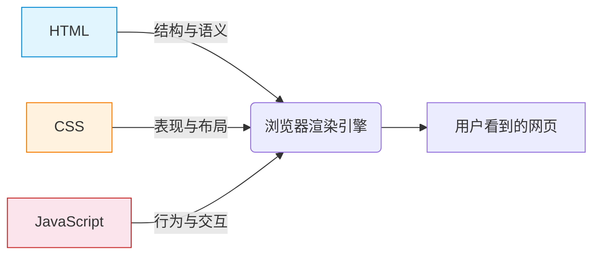
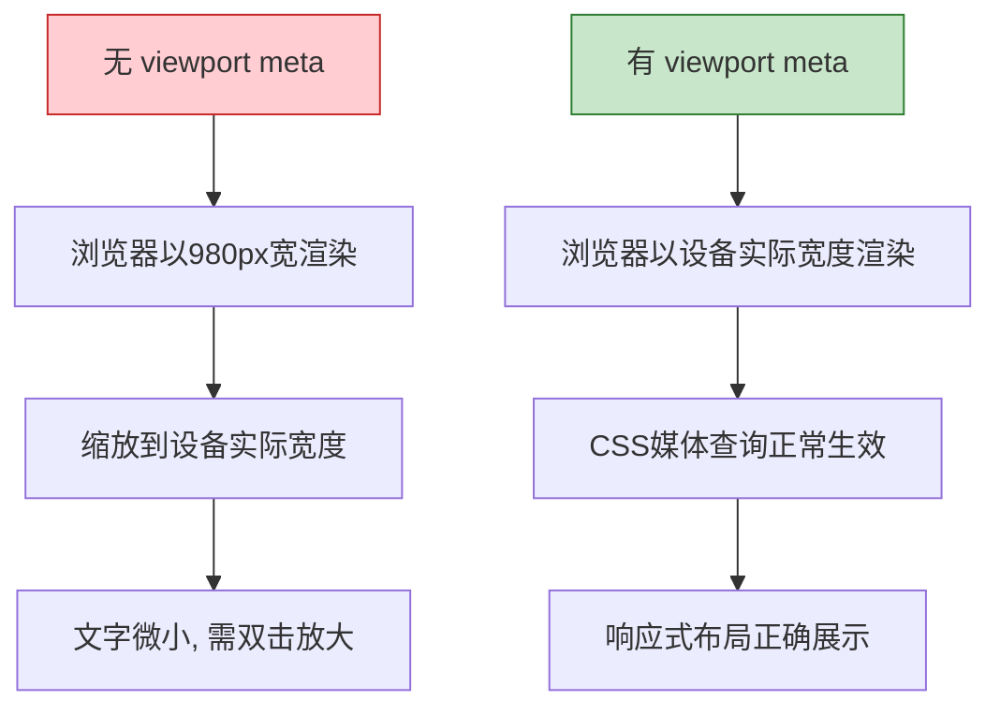
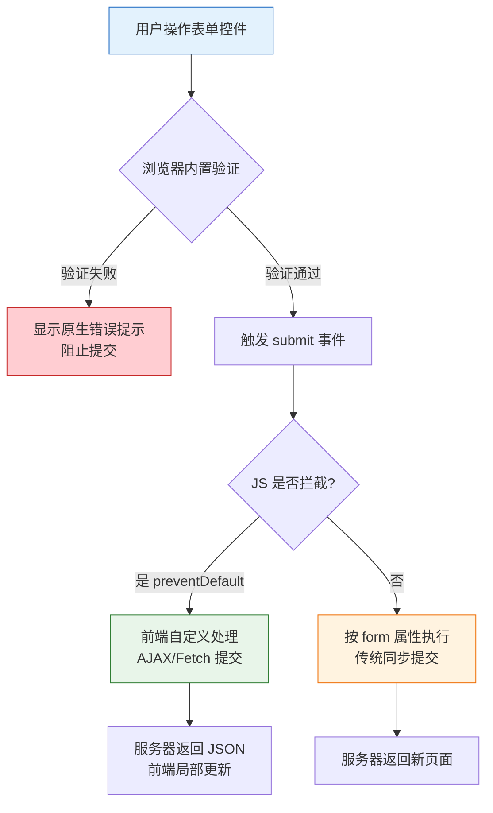
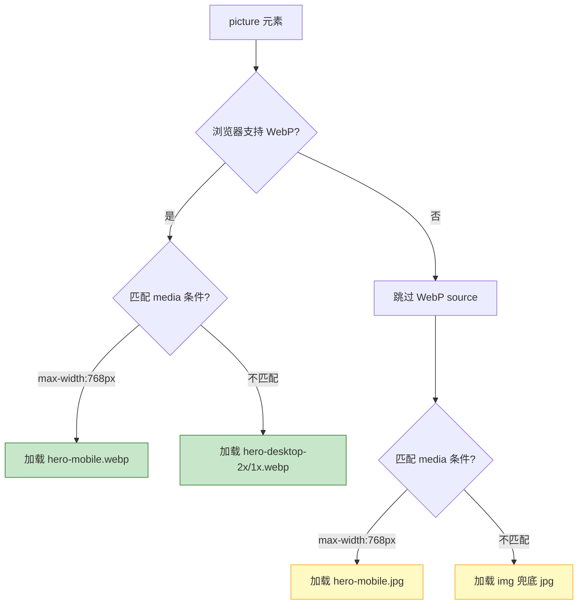
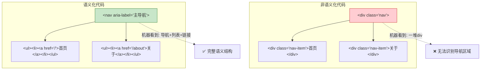
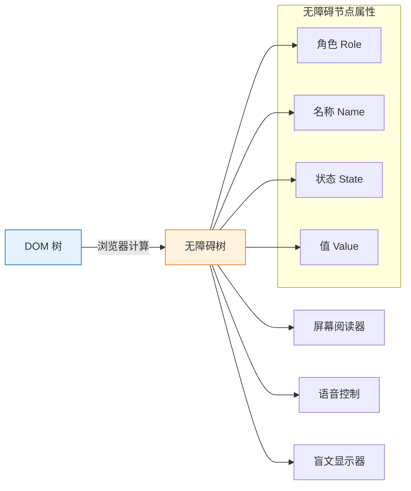
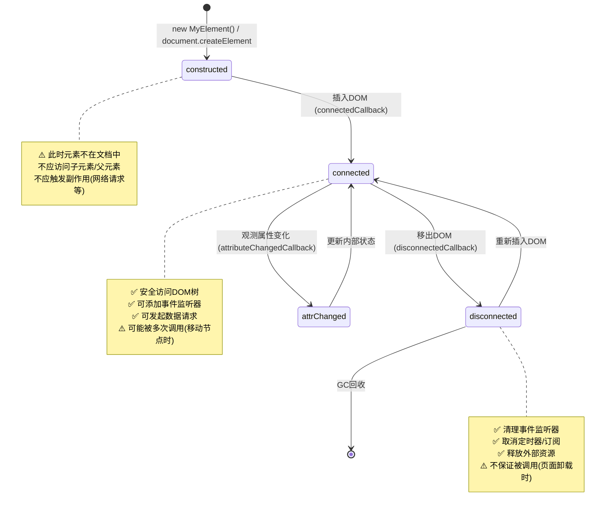
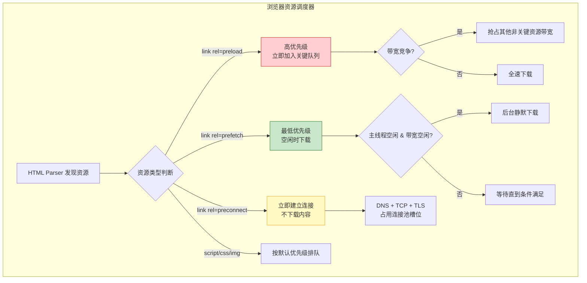

### 一、HTML 核心基础与文档结构

> 📖 **阶段导读**  
> 本阶段是 HTML 学习的基石。我们不仅要学会“怎么写标签”，更要理解“为什么这样写”。很多初学者能写出页面，但代码缺乏语义、兼容性差、SEO 不友好，根源往往在于第一阶段的基础概念没有吃透。本笔记将从 Web 底层原理出发，带你建立正确的 HTML 认知体系。

---

#### 1.1 背景知识：Web 三件套与 HTML 的定位

在动手写代码之前，必须明确 HTML 在 Web 技术栈中的角色。浏览器渲染一个网页，本质上是在处理三种不同职责的语言：



|语言|核心职责|类比|
|:--|:--|:--|
|**HTML**|定义内容的**结构与语义**（这是什么？）|建筑的钢筋混凝土骨架|
|**CSS**|定义内容的**视觉表现**（长什么样？）|建筑的装修、涂料、灯光|
|**JavaScript**|定义内容的**动态行为**（能做什么？）|建筑中的电梯、门禁、智能系统|

> ⚠️ **关键原则：关注点分离**  
> HTML 中不应包含样式信息（如 `<font>`、`align="center"`），也不应包含行为逻辑（如内联 `onclick`）。这些在现代 HTML5 中已被废弃或强烈不推荐。**HTML 只负责回答“这个内容是什么”**，至于它怎么显示、怎么交互，交给 CSS 和 JS。

---

#### 1.2 HTML5 文档骨架详解

每一个合法的 HTML5 页面都遵循固定的文档结构。以下是完整骨架及逐行解析：

```html
<!DOCTYPE html>
<html lang="zh-CN">
<head>
    <meta charset="UTF-8">
    <meta name="viewport" content="width=device-width, initial-scale=1.0">
    <title>页面标题</title>
</head>
<body>
    <!-- 页面可见内容 -->
</body>
</html>
```

##### 1.2.1 `<!DOCTYPE html>` —— 文档类型声明

- **它不是 HTML 标签**，而是一条给浏览器的**指令**。
- **作用**：告诉浏览器使用 **HTML5 标准模式** 渲染页面。如果省略，浏览器会进入“怪异模式（Quirks Mode）”，模拟旧版 IE 的渲染行为，导致大量不可预期的样式问题。
- **历史背景**：早期 HTML/XHTML 的 DOCTYPE 又长又难记（如 `<!DOCTYPE HTML PUBLIC "-//W3C//DTD HTML 4.01 Transitional//EN" ...>`），HTML5 将其简化为唯一写法，这是 HTML5 “务实主义”设计哲学的体现。

##### 1.2.2 `<html lang="zh-CN">` —— 根元素与语言声明

- `lang` 属性指定页面的**主要自然语言**。
- **为什么重要？**
    - **无障碍**：屏幕阅读器根据 `lang` 选择正确的语音合成引擎和发音规则。`lang="zh-CN"` 用中文语音，`lang="en"` 用英文语音。
    - **搜索引擎**：帮助搜索引擎判断页面语言，精准推送给对应语言的用户。
    - **浏览器功能**：触发翻译提示、拼写检查等语言相关功能。
- **常用值**：`zh-CN`（简体中文）、`zh-TW`（繁体中文）、`en`（英语）、`ja`（日语）。

##### 1.2.3 `<head>` 中的关键 meta 标签

`<head>` 中的内容不会直接显示在页面上，但对页面的**正确渲染、SEO、移动端适配**至关重要。

|Meta 标签|作用|必要性|
|:--|:--|:--|
|`<meta charset="UTF-8">`|声明文档字符编码。**必须是 head 中第一个子元素**，否则可能导致中文乱码|⭐⭐⭐ 必写|
|`<meta name="viewport" ...>`|控制移动端视口行为，禁止默认缩放，使响应式设计生效|⭐⭐⭐ 必写|
|`<meta name="description" ...>`|页面描述，显示在搜索结果摘要中，影响点击率|⭐⭐ SEO 必写|
|`<meta name="keywords" ...>`|关键词。**现代搜索引擎已基本忽略此标签**，可不写|❌ 可选|

> 💡 **charset 为什么必须放最前面？**  
> 浏览器从服务器接收到字节流后，需要尽早知道用什么编码来解码。如果 `<meta charset>` 出现在其他内容之后，浏览器可能已经用错误编码解析了前面的内容，导致乱码。HTML 规范建议将其放在 `<head>` 的第一个位置。

##### 1.2.4 viewport 深入理解

```html
<meta name="viewport" content="width=device-width, initial-scale=1.0">
```

这行代码是现代移动 Web 开发的**基石**。没有它，移动浏览器会以 ~980px 的虚拟宽度渲染页面然后缩小显示，导致文字极小、布局错乱。



---

#### 1.3 高频基础标签与语义化入门

##### 1.3.1 文本层级标签

HTML 提供了丰富的文本标签，每个都有明确的**语义含义**，而非仅仅是视觉效果：

|标签|语义|常见误用替代|说明|
|:--|:--|:--|:--|
|`<h1>`~`<br><br>###### `|标题层级|`<b>` + 大字号|每页建议只有一个 `<h1>`，层级不要跳级|
|`<p>`|段落|`<br><br>`|表示一个完整的文本段落|
|`<strong>`|**强调重要性**|`<b>`|屏幕阅读器会加重语气朗读|
|`<em>`|_语气强调_|`<i>`|表示重音、斜体语气|
|`<mark>`|高亮标记|`<span>` + 黄色背景|表示与上下文相关的突出内容|
|`<time datetime="...">`|时间/日期|`<span>`|机器可读的时间格式，利于事件聚合|
|`<abbr title="...">`|缩写|纯文本|hover 时显示全称，辅助理解|

> 🔍 **`<strong>` vs `<b>`，`<em>` vs `<i>` 的区别**  
> 这是面试和实践中的高频考点：
> 
> - `<strong>` / `<em>` 是**语义标签**：表达内容的重要性/语气，视觉上加粗/倾斜只是默认样式，可以被 CSS 覆盖。
> - `<b>` / `<i>` 是**表现标签**：仅表示视觉上的加粗/倾斜，不带任何语义。仅在“确实只需要视觉效果、无需语义”时使用（如产品名称、外文术语）。
> - **经验法则**：90% 的场景应该用 `<strong>` 和 `<em>`。

##### 1.3.2 链接与图片

**链接 `<a>`：**

- `href`：目标地址。`mailto:` 发邮件，`tel:` 拨号，`#id` 页内锚点。
- `target="_blank"`：**务必同时添加 `rel="noopener noreferrer"`**，防止新页面通过 `window.opener` 访问原页面（安全风险 + 性能问题）。
- `download`：提示浏览器下载而非导航（同源有效）。

**图片 ``：**

- `alt`：**必填属性**。描述图片内容，用于无障碍和 SEO。装饰性图片用 `alt=""`（空字符串），告知屏幕阅读器跳过。
- `width` / `height`：**强烈建议设置**。浏览器据此预留空间，避免图片加载时布局抖动（CLS 指标）。
- `loading="lazy"`：原生懒加载，视口外图片延迟请求，提升首屏性能。
- `decoding="async"`：异步解码，避免图片解码阻塞主线程。

##### 1.3.3 列表的正确使用

|列表类型|语义场景|示例|
|:--|:--|:--|
|`<ul>`|无序集合，顺序无关|导航菜单、标签列表、特性列表|
|`<ol>`|有序序列，顺序有意义|步骤教程、排行榜、时间线|
|`<dl>`|术语-描述配对|API 文档、FAQ、元数据展示|

> ⚠️ **导航必须用列表**  
> 很多开发者用一堆 `<div>` + `<a>` 做导航栏。正确做法是 `<nav>` 包裹 `<ul>`，因为导航本质上是“一组有序的链接集合”。这对屏幕阅读器用户至关重要——他们会听到“导航区域，包含 N 个项目的列表”，从而快速定位。

---

#### 1.4 HTML 属性系统与全局属性

所有 HTML 元素共享一组**全局属性**，掌握它们能大幅提升开发效率：

|属性|作用|注意事项|
|:--|:--|:--|
|`id`|唯一标识符|页面内必须唯一；可作为 CSS 选择器和锚点|
|`class`|类名（可多个）|样式复用的核心机制，命名建议用语义化名称|
|`data-*`|自定义数据属性|存储与元素关联的私有数据，JS 通过 `dataset` 读取|
|`hidden`|隐藏元素|等价于 `display:none`，但语义上表示“当前不相关”|
|`tabindex`|键盘焦点顺序|`0`=可聚焦且按DOM顺序；`-1`=可编程聚焦但不在Tab序列中；**避免正整数**|
|`contenteditable`|使元素可编辑|富文本编辑器基础，需注意 XSS 安全|
|`title`|额外提示信息|鼠标悬停显示 tooltip，但**不可替代 label/alt**|

> 💡 **`data-*` 属性的工程价值**  
> 当需要在 HTML 元素上绑定业务数据（如商品 ID、配置参数）又不想污染 class/id 时，`data-*` 是最佳选择：
> 
> ```html
> <button data-product-id="12345" data-action="add-to-cart">加入购物车</button>
> ```
> 
> ```javascript
> const btn = document.querySelector('button');
> console.log(btn.dataset.productId); // "12345"
> console.log(btn.dataset.action);    // "add-to-cart"
> ```
> 
> 这种方式将数据与 DOM 结构解耦，避免了用 class 传递数据的反模式。

---

#### 1.5 字符编码与特殊字符

HTML 中某些字符有特殊含义（如 `<`、`>`、`&`），直接使用会导致解析错误。需要使用**字符实体**：

|字符|实体编码|说明|
|:--|:--|:--|
|`<`|`&lt;`|Less Than|
|`>`|`&gt;`|Greater Than|
|`&`|`&amp;`|Ampersand（注意：& 本身也需要转义）|
|`"`|`&quot;`|双引号（属性值中使用）|
|`'`|`&#39;`|单引号|
|空格|`&nbsp;`|不间断空格（普通连续空格会被合并为一个）|

> ⚠️ **永远使用 UTF-8**  
> 2026 年的今天，没有任何理由再使用 GBK/GB2312。UTF-8 覆盖了所有 Unicode 字符，是 Web 的事实标准。确保你的编辑器保存文件时使用 UTF-8 编码，且 `<meta charset="UTF-8">` 与文件实际编码一致。

---

#### 📋 第一阶段自检清单

完成本阶段学习后，你应该能够自信地回答以下问题：

- [ ]  能否不看模板手写完整的 HTML5 文档骨架？
- [ ]  能否解释 DOCTYPE 的作用以及缺失后的后果？
- [ ]  能否区分 `<strong>` 与 `<b>`、`<em>` 与 `<i>` 的使用场景？
- [ ]  是否养成了给所有 `` 写 alt、给所有 `<a target="_blank">` 加 rel 的习惯？
- [ ]  能否解释 viewport meta 对移动端渲染的影响？
- [ ]  是否理解 `data-*` 属性的用途并能用 JS 读写？

### 二、表单交互与多媒体嵌入

> 📖 **阶段导读**  
> 如果说第一阶段解决了“内容展示”的问题，那么本阶段将解决 Web 最核心的两个动态需求：**数据采集**（表单）与**富媒体呈现**（音视频/图形）。表单是用户与服务器沟通的桥梁，其复杂度远超多数初学者的认知；而多媒体标签的正确使用，则直接决定了页面的性能体验与无障碍水平。本阶段将从工程实践角度，深入剖析这两大体系。

---

#### 2.1 表单体系：从标签到数据流

表单不是简单的输入框堆砌，而是一个完整的**数据采集-验证-提交**系统。理解这个系统，需要先建立全局视角：



> 💡 **关键认知：表单有两条提交路径**  
> 现代开发中，我们几乎总是走左侧的 **AJAX 路径**（SPA 应用标配）。但右侧的**传统同步提交**并未过时——它在 SSR 框架（Next.js / Nuxt）、渐进增强、以及 JS 加载失败的回退场景中仍然至关重要。**优秀的表单代码应该同时兼容两条路径**。

##### 2.1.1 `<form>` 元素核心属性

|属性|作用|工程要点|
|:--|:--|:--|
|`action`|提交目标 URL|留空表示提交到当前页面；AJAX 模式下仍建议填写作为回退地址|
|`method`|HTTP 方法|`GET`（查询，参数在URL中）/ `POST`（创建/修改，参数在请求体中）|
|`enctype`|编码类型|默认 `application/x-www-form-urlencoded`；**文件上传必须设为 `multipart/form-data`**|
|`novalidate`|禁用浏览器内置验证|当你使用自定义验证 UI 时添加，但**不要移除 HTML 验证属性本身**|
|`autocomplete`|自动填充控制|`on/off`，也可针对特定字段设置（如 `new-password`、`cc-number`）|

##### 2.1.2 `<label>`：被严重低估的表单基石

`<label>` 不是可选的装饰文字，它是表单**可用性与无障碍的核心**：

```html
<!-- ✅ 正确写法1：显式关联（推荐） -->
<label for="email">邮箱地址</label>
<input type="email" id="email" name="email">

<!-- ✅ 正确写法2：隐式嵌套 -->
<label>
  邮箱地址
  <input type="email" name="email">
</label>

<!-- ❌ 错误写法：无关联 -->
<span>邮箱地址</span>
<input type="email" name="email">
```

**为什么 `<label>` 如此重要？**

- **扩大点击区域**：点击 label 文字即可聚焦对应 input，移动端体验显著提升。
- **屏幕阅读器播报**：焦点到达 input 时，朗读 label 文本作为输入提示。没有 label，视障用户只能听到“编辑框”，完全不知道该填什么。
- **密码管理器识别**：Chrome / 1Password 等工具依赖 label 文本来判断字段含义，实现正确的自动填充。

> ⚠️ **常见反模式警示**  
> 用 `<div>` / `<span>` + CSS 模拟 label 外观，或用 placeholder 替代 label，都是严重的无障碍缺陷。Placeholder 在用户开始输入后消失，无法作为持久标签；且部分屏幕阅读器不朗读 placeholder。**Label 永远不可替代**。

##### 2.1.3 `<input>` 类型全景图

HTML5 引入了大量语义化 input 类型，它们不仅改变了移动端键盘布局，还提供了**免费的内置验证**：

|type 值|移动端键盘|内置验证|适用场景|
|:--|:--|:--|:--|
|`text`|标准键盘|无|通用短文本|
|`email`|含 @ 符号键盘|邮箱格式校验|邮箱地址|
|`tel`|数字电话键盘|无（各国号码格式不同）|手机号码|
|`url`|含 . / 符号键盘|URL 格式校验|网址链接|
|`number`|数字键盘+步进器|数值范围校验|数量、年龄|
|`search`|标准键盘+搜索按钮|无|搜索框（语义区分）|
|`password`|标准键盘|无|密码（自动隐藏）|
|`date/time/datetime-local`|原生日期选择器|日期格式校验|时间选择|
|`file`|文件选择器|accept 限制文件类型|文件上传|
|`checkbox/radio`|—|required 校验|多选/单选|
|`hidden`|—|—|传递不可见数据（CSRF token 等）|

> 💡 **type 选择的黄金法则**  
> **始终使用最精确的 type**。不要用 `type="text"` + JS 正则验证邮箱，直接用 `type="email"` 即可获得浏览器原生验证 + 优化键盘 + 自动填充支持。只有在没有匹配类型时才回退到 `text`。

##### 2.1.4 表单验证体系

HTML5 提供了强大的**声明式验证**，无需 JS 即可完成基础校验：

|验证属性|作用|示例|
|:--|:--|:--|
|`required`|必填|`<input required>`|
|`minlength/maxlength`|文本长度范围|`<input minlength="6" maxlength="20">`|
|`min/max/step`|数值范围与步长|`<input type="number" min="0" max="100" step="5">`|
|`pattern`|正则表达式匹配|`<input pattern="[A-Za-z]{3}" title="请输入3位字母">`|
|`type` 本身|格式验证|`email/url/date` 等自带格式校验|

**验证状态伪类（CSS 联动）：**

```css
/* 验证通过 */
input:valid { border-color: green; }
/* 验证失败 */
input:invalid { border-color: red; }
/* 用户已交互过才显示错误（避免初始状态满屏红色） */
input:not(:placeholder-shown):invalid { border-color: red; }
/* 必填项标记 */
input:required { background-image: url('asterisk.svg'); }
```

> 🔍 **`:invalid` 的初始渲染陷阱**  
> 页面刚加载时，空的 required 字段就会匹配 `:invalid`，导致用户还没操作就看到一片红色报错。解决方案是使用 `:not(:placeholder-shown)` 或 `:user-invalid`（较新标准）来延迟错误样式的显示，确保只在用户**实际交互后**才反馈验证结果。

##### 2.1.5 其他关键表单元素

|元素|用途|注意事项|
|:--|:--|:--|
|`<select>` + `<option>`|下拉选择|选项过多时考虑改用 datalist 或自定义组件|
|`<textarea>`|多行文本|`rows/cols` 定义初始尺寸；CSS resize 控制缩放|
|`<fieldset>` + `<legend>`|表单分组|将相关控件归组，legend 作为组标题，提升可读性与无障碍|
|`<datalist>`|输入建议列表|配合 input[list] 使用，提供可编辑的下拉建议|
|`<output>`|计算结果展示|语义上表示“由其他控件值计算得出的结果”|
|`<button>`|按钮|**始终指定 type**（`submit/button/reset`），默认为 submit 易引发意外提交|

---

#### 2.2 多媒体嵌入：超越 `` 的富媒体世界

##### 2.2.1 响应式图片体系

单一 `` 无法适应不同设备。HTML5 提供了完整的响应式图片方案：

```html
<picture>
  <!-- 艺术指导：不同断点使用不同裁切版本 -->
  <source media="(max-width: 768px)" srcset="hero-mobile.webp" type="image/webp">
  <source media="(max-width: 768px)" srcset="hero-mobile.jpg">
  
  <!-- 高分辨率适配 -->
  <source srcset="hero-desktop-2x.webp 2x, hero-desktop.webp 1x" type="image/webp">
  
  <!-- 兜底图片（必须放在最后） -->
  
</picture>
```



> 💡 **`<picture>` vs `` 的区别**
> 
> - **``**：同一张图片的不同分辨率版本，浏览器根据视口宽度自动选择。适用于**仅尺寸不同、内容相同**的场景。
> - **`<picture>`**：可以提供**完全不同的图片**（不同裁切、不同格式、不同构图）。适用于“艺术指导（Art Direction）”和格式降级场景。
> - 两者可以组合使用，不必互斥。

##### 2.2.2 音频与视频

```html
<video 
  controls 
  preload="metadata"
  poster="cover.jpg"
  width="720" height="405"
  playsinline>
  <source src="demo.webm" type="video/webm">
  <source src="demo.mp4" type="video/mp4">
  <track kind="subtitles" src="subs_zh.vtt" srclang="zh" label="中文字幕" default>
  <p>您的浏览器不支持视频播放。<a href="demo.mp4">点击下载</a></p>
</video>
```

**关键属性解析：**

|属性|作用|工程要点|
|:--|:--|:--|
|`controls`|显示原生控件|**生产环境必加**，除非你实现了完整的自定义播放器含无障碍支持|
|`preload`|预加载策略|`none`（不预载）/ `metadata`（仅元数据，推荐）/ `auto`（全量预载，慎用）|
|`poster`|封面图|视频加载前/暂停时的占位图，避免黑屏|
|`playsinline`|iOS 内联播放|**移动端必加**，否则 iOS Safari 会强制全屏|
|`autoplay`|自动播放|**必须同时加 `muted`**，否则所有现代浏览器都会阻止|
|`loop`|循环播放|背景视频常用，注意性能消耗|

> ⚠️ **`preload="auto"` 的性能陷阱**  
> 页面中有多个视频时，`preload="auto"` 会导致所有视频同时开始下载，严重抢占带宽和连接数。**默认使用 `metadata`**，仅在用户明确即将播放时才动态切换为 `auto`。

##### 2.2.3 `<track>` 与字幕无障碍

`<track>` 元素为音视频提供定时文本轨道，是无障碍合规的关键：

|kind 值|用途|
|:--|:--|
|`subtitles`|翻译字幕（面向听不懂原声的用户）|
|`captions`|闭路字幕（包含音效描述，面向听障用户）|
|`descriptions`|音频描述（面向视障用户）|
|`chapters`|章节导航|
|`metadata`|机器可读的元数据（不直接显示）|

> 💡 **VTT 格式速览**  
> track 文件使用 WebVTT 格式：
> 
> ```vtt
> WEBVTT
> 
> 00:00:01.000 --> 00:00:04.000
> 欢迎来到 HTML 多媒体课程
> 
> 00:00:04.500 --> 00:00:07.000
> [轻快的背景音乐响起]
> ```
> 
> 注意 `[音效描述]` 是 captions 区别于 subtitles 的核心特征。

##### 2.2.4 `<iframe>` 的安全与性能

嵌入第三方内容（地图、视频、支付）时使用 iframe，但需格外注意安全：

```html
<iframe 
  src="https://example.com/embed" 
  title="嵌入式内容描述"
  sandbox="allow-scripts allow-same-origin"
  loading="lazy"
  referrerpolicy="no-referrer"
  width="600" height="400">
</iframe>
```

|安全措施|说明|
|:--|:--|
|`sandbox`|**强烈建议添加**。限制 iframe 能力，按需开启权限（白名单机制）|
|`title`|**必填**。描述 iframe 内容，屏幕阅读器依赖此属性|
|`loading="lazy"`|延迟加载非首屏 iframe，显著减少初始请求数|
|`referrerpolicy`|控制发送给 iframe 的 Referer 头，防止敏感 URL 泄露|
|`credentialless`|（新特性）隔离 iframe 的 Cookie/存储，防止跨站追踪|

> ⚠️ **sandbox 的最小权限原则**  
> 不要写 `sandbox=""`（完全禁止一切）也不要省略 sandbox（完全放开）。根据实际需要精确授权：
> 
> - 纯静态展示：`sandbox=""`
> - 需要 JS 执行：`allow-scripts`
> - 需要访问同源资源：`allow-same-origin`（⚠️ 与 allow-scripts 同时使用时等同于无沙箱）
> - 需要表单提交：`allow-forms`
> - 需要弹窗：`allow-popups`

---

#### 2.3 Canvas 与 SVG 的选择策略

两者都能在网页上绘制图形，但定位完全不同：

|维度|Canvas|SVG|
|:--|:--|:--|
|渲染模型|位图（像素级操作）|矢量（DOM 节点）|
|交互性|差（需手动计算命中检测）|好（每个图形都是 DOM 元素，可绑定事件）|
|缩放|放大模糊|无限缩放不失真|
|性能|大量简单对象时优秀|少量复杂对象时优秀|
|无障碍|差（对屏幕阅读器是黑盒）|好（可添加 title/desc/ARIA）|
|适用场景|游戏、数据可视化、图像处理|图标、图表、插画、动画|

> 💡 **决策口诀**  
> **“能用 SVG 就不用 Canvas”**。SVG 天然支持响应式、无障碍、CSS 样式控制和 DOM 交互。只有当你的场景涉及**大量粒子、实时像素操作、或游戏渲染循环**时，Canvas 才是正确选择。

---

#### 📋 第二阶段自检清单

- [ ]  能否手写一个包含多种 input 类型、label 关联、声明式验证的完整表单？
- [ ]  是否理解 `novalidate` 与 HTML 验证属性的配合使用方式？
- [ ]  能否为一张图片编写完整的响应式 `<picture>` 代码？
- [ ]  是否知道视频 `autoplay` 必须搭配 `muted`，以及 `playsinline` 对移动端的意义？
- [ ]  能否为 iframe 配置合理的 sandbox 策略？
- [ ]  能否根据具体需求在 Canvas 和 SVG 之间做出正确选择？
- [ ]  是否养成了给所有多媒体元素添加无障碍属性（alt/title/track）的习惯？

### 三、语义化进阶与无障碍（A11y）

> 📖 **阶段导读**  
> 这是 HTML 学习中最具“分水岭”意义的阶段。前两个阶段解决了“能不能用”的问题，而本阶段解决的是“好不好用”的问题。语义化和无障碍不是锦上添花的可选项，而是现代 Web 开发的**专业基线**。搜索引擎爬虫、屏幕阅读器、语音助手、阅读模式——这些非视觉用户代理完全依赖 HTML 的语义结构来理解页面。写好语义化 HTML，本质上是在为**所有可能的用户和设备**编写代码。

---

#### 3.1 语义化的本质：从“看起来像”到“确实是”

很多开发者对语义化的理解停留在“用 `<header>` 代替 `<div class="header">`”，这远远不够。语义化的核心是**传达内容的结构与关系**，而非仅仅替换标签名。



> 💡 **语义化的三层价值**
> 
> 1. **无障碍**：辅助技术依赖语义树（Accessibility Tree）向用户传达页面结构。
> 2. **SEO**：搜索引擎通过语义标签判断内容权重与主题相关性。
> 3. **可维护性**：语义化代码自文档化，新成员阅读代码即可理解页面结构，无需猜测 class 命名含义。

---

#### 3.2 HTML5 语义标签深度解析

##### 3.2.1 文档大纲与区块标签

HTML5 引入了一套完整的**文档分区模型**，每个标签都有精确的语义边界：

|标签|语义定义|使用要点|
|:--|:--|:--|
|`<header>`|介绍性内容或导航辅助|可用于页面级、article级、section级；不限于“顶部”|
|`<footer>`|作者信息、版权、相关链接|同样可嵌套在 article/section 内部|
|`<nav>`|主要导航区块|仅用于**主要的**导航组；页内次要链接不需要 nav|
|`<main>`|页面主体唯一内容|**每页只能有一个可见的 main**；不包含侧边栏、导航、页脚|
|`<article>`|独立、完整、可复用的内容单元|博客文章、评论、产品卡片、Widget；脱离上下文仍有意义|
|`<section>`|主题性内容分组|**必须有标题**（h1-h6）；没有标题的分组应该用 div|
|`<aside>`|与主内容间接相关的内容|侧边栏、广告、相关文章推荐；不是“随便放的东西”|
|`<figure>` + `<figcaption>`|自包含的引用内容+说明|图片、图表、代码片段、引言；figcaption 可在 figure 内任意位置|

> ⚠️ **`<section>` vs `<div>` 的决策树**  
> 这是实践中最容易混淆的点：
> 
> - 这个区域有**明确的主题**吗？→ 如果没有，用 `<div>`
> - 这个区域有**对应的标题**吗？→ 如果没有，大概率应该用 `<div>`
> - 这个区域的内容在**文档大纲**中应该作为一个独立章节出现吗？→ 如果不是，用 `<div>`
> - **经验法则**：`<section>` 的使用频率远低于多数开发者的预期。当你犹豫时，`<div>` 通常是更安全的选择。

##### 3.2.2 文档大纲算法（Document Outline）

虽然现代浏览器并未完全实现 HTML5 规范中的大纲算法，但**逻辑正确的大纲结构**对 SEO 和无障碍仍然至关重要：

```html
<!-- ✅ 正确的大纲层级 -->
<h1>网站名称</h1>
  <h2>最新文章</h2>
    <h3>HTML 语义化指南</h3>
    <h3>CSS 布局实战</h3>
  <h2>关于我们</h2>

<!-- ❌ 错误：跳级 + 多 h1 -->
<h1>网站名称</h1>
  <h4>最新文章</h4>      <!-- 跳过了 h2、h3 -->
    <h1>HTML 语义化指南</h1> <!-- 不应在子章节中使用 h1 -->
```

**大纲规则：**

- 每页有且仅有一个 `<h1>`，代表页面主题。
- 标题层级**严格递增**，不跳级（h2 下直接 h4 是错误的）。
- 每个 `<section>` / `<article>` / `<nav>` / `<aside>` 内部应有自己的标题。
- 不要为了调整字号而选择标题级别，**先用正确的语义级别，再用 CSS 控制视觉大小**。

---

#### 3.3 无障碍（A11y）核心实践

##### 3.3.1 无障碍树（Accessibility Tree）

浏览器在渲染视觉页面的同时，会构建一棵平行的**无障碍树**。辅助技术（屏幕阅读器、语音控制）读取的是这棵树，而非 DOM 本身。



> 💡 **关键认知：DOM ≠ 无障碍树**
> 
> - `display:none` 和 `hidden` 的元素**不会**出现在无障碍树中。
> - `visibility:hidden` 和 `opacity:0` 的元素**仍然会**出现在无障碍树中（只是看不见）。
> - ARIA 属性可以修改无障碍树而不改变 DOM 结构。
> - 语义化 HTML 标签会自动生成正确的无障碍节点；纯 div/span 不会。

##### 3.3.2 ARIA 第一原则：能用原生 HTML 就不用 ARIA

ARIA（Accessible Rich Internet Applications）是一套**补丁机制**，用于弥补原生 HTML 语义的不足。它不应该被当作首选方案。

|需求|❌ 反模式|✅ 正确做法|
|:--|:--|:--|
|按钮|`<div role="button" tabindex="0">`|`<button>`|
|链接|`<span role="link" onclick="...">`|`<a href="...">`|
|复选框|`<div role="checkbox" aria-checked="false">`|`<input type="checkbox">`|
|导航|`<div role="navigation">`|`<nav>`|
|图片描述|`<div role="img" aria-label="...">`|``|

> ⚠️ **ARIA 的危险性**  
> ARIA 不会自动添加任何行为。`role="button"` 不会让 div 响应 Enter/Space 键，不会让它出现在 Tab 序列中，不会给它焦点样式。你需要**手动实现所有原生 button 自带的功能**。这就是为什么“能用原生就不用 ARIA”是第一原则。

##### 3.3.3 ARIA 的正确使用场景

当且仅当原生 HTML 无法满足需求时，才使用 ARIA：

**1. 补充语义（无对应原生标签时）**

```html
<!-- 自定义组件：标签页 -->
<div role="tablist" aria-label="产品详情">
  <button role="tab" aria-selected="true" aria-controls="panel-1" id="tab-1">规格</button>
  <button role="tab" aria-selected="false" aria-controls="panel-2" id="tab-2">评价</button>
</div>
<div role="tabpanel" id="panel-1" aria-labelledby="tab-1">...</div>
```

**2. 动态状态通知**

```html
<!-- 实时区域：购物车数量更新时自动朗读 -->
<div aria-live="polite" aria-atomic="true">
  购物车中有 3 件商品
</div>

<!-- 表单错误关联 -->
<input id="email" aria-describedby="email-error" aria-invalid="true">
<span id="email-error" role="alert">请输入有效的邮箱地址</span>
```

**3. 修饰/覆盖原生语义**

```html
<!-- 进度条：原生 progress 样式受限时的替代方案 -->
<div role="progressbar" 
     aria-valuenow="75" 
     aria-valuemin="0" 
     aria-valuemax="100"
     aria-label="上传进度">
  75%
</div>
```

##### 3.3.4 键盘无障碍检查清单

所有交互元素必须支持键盘操作：

|检查项|要求|
|:--|:--|
|Tab 可达性|所有交互元素可通过 Tab 键聚焦|
|焦点可见性|聚焦时有清晰的视觉指示器（outline）|
|操作触发|Button/Link 支持 Enter；Button 额外支持 Space|
|焦点陷阱|Modal/Dialog 打开时焦点锁定在内部，关闭后返回触发元素|
|跳过导航|提供 "Skip to main content" 链接作为页面第一个焦点元素|
|焦点顺序|Tab 顺序与视觉逻辑顺序一致（不使用正数 tabindex）|

> 🔍 **`:focus-visible` 的现代用法**
> 
> ```css
> /* 仅在键盘导航时显示焦点环，鼠标点击不显示 */
> button:focus-visible {
>   outline: 3px solid #005fcc;
>   outline-offset: 2px;
> }
> /* 移除默认的丑陋焦点样式，但绝不设为 outline:none 而无替代 */
> button:focus:not(:focus-visible) {
>   outline: none;
> }
> ```
> 
> 这解决了长期以来的矛盾：键盘用户需要焦点指示器，鼠标用户觉得焦点环碍眼。**永远不要 `outline: none` 而不提供替代方案**。

---

#### 3.4 SEO 最佳实践与结构化数据

##### 3.4.1 语义化 HTML 对 SEO 的直接影响

搜索引擎的爬虫本质上是一个**高度依赖语义的无障碍用户代理**：

|语义标签|SEO 价值|
|:--|:--|
|`<h1>`|页面主题信号，权重最高|
|`<article>`|标识主要内容区域，帮助爬虫区分正文与噪声|
|`<nav>`|帮助爬虫发现站点结构和内部链接关系|
|`<time datetime>`|精确的时间信息，利于时效性排序和事件聚合|
|``|图片搜索索引的核心依据|
|`<meta description>`|搜索结果摘要，直接影响点击率（CTR）|
|`<link rel="canonical">`|防止重复内容导致的权重分散|

##### 3.4.2 结构化数据（Schema.org / JSON-LD）

结构化数据让搜索引擎**精确理解**页面内容的类型和属性，从而展示富媒体搜索结果（Rich Results）：

```html
<script type="application/ld+json">
{
  "@context": "https://schema.org",
  "@type": "Article",
  "headline": "HTML 语义化进阶指南",
  "author": {
    "@type": "Person",
    "name": "张三"
  },
  "datePublished": "2026-06-06",
  "image": "https://example.com/cover.jpg",
  "description": "深入解析 HTML5 语义标签与无障碍实践"
}
</script>
```

> 💡 **为什么推荐 JSON-LD 而非 Microdata？**
> 
> - JSON-LD 以独立 `<script>` 块存在，**不侵入 HTML 结构**，易于维护和生成。
> - Google 官方推荐 JSON-LD 作为首选格式。
> - 可通过 CMS/框架在服务端动态注入，无需修改模板标签。

---

#### 3.5 无障碍测试工具链

不要靠猜，用工具验证：

|工具|类型|用途|
|:--|:--|:--|
|**axe DevTools**|浏览器扩展|自动化检测 WCAG 违规，定位具体 DOM 节点|
|**Lighthouse**|Chrome 内置|综合评分（无障碍/性能/SEO），提供修复建议|
|**NVDA / VoiceOver**|屏幕阅读器|真实体验测试，验证朗读顺序和内容完整性|
|**WAVE**|浏览器扩展|可视化标注无障碍问题，适合快速审查|
|**Pa11y**|CLI / CI 集成|自动化回归测试，纳入 CI/CD 流水线|
|**Colour Contrast Analyser**|桌面工具|验证文本与背景的对比度是否满足 WCAG AA/AAA|

> ⚠️ **自动化测试的局限性**  
> axe / Lighthouse 等自动化工具**只能发现约 30-40% 的无障碍问题**。它们能检测到缺失的 alt、不足的对比度、错误的 ARIA 用法，但无法判断：
> 
> - alt 文本是否准确描述了图片内容
> - 焦点顺序是否符合逻辑
> - 动态内容更新是否被正确播报
> - 整体用户体验是否流畅  
>     **人工测试（尤其是屏幕阅读器实操）是不可替代的**。

---

#### 📋 第三阶段自检清单

- [ ]  能否解释 `<section>` 与 `<div>` 的决策依据，并举出三个应使用 div 的场景？
- [ ]  能否为一个自定义 Tab 组件编写完整的 ARIA 属性？
- [ ]  是否理解“ARIA 第一原则”并能识别代码中的 ARIA 反模式？
- [ ]  能否使用键盘完成页面的所有交互操作？
- [ ]  是否为项目配置了至少一种无障碍自动化检测工具？
- [ ]  能否为博客文章页面编写正确的 JSON-LD 结构化数据？
- [ ]  是否实际使用过屏幕阅读器测试自己编写的页面？

### 四、工程化实践与现代 HTML 生态

> 📖 **扩展导读**  
> 上一轮回复为您勾勒了第四阶段的骨架。本次扩展将把每一个知识点从“是什么”推进到“为什么”、“怎么做”以及“生产环境中的坑与解法”。我们将深入 Web Components 的生命周期细节、资源提示的底层网络原理、SSR Hydration 的失败案例剖析、以及现代 HTML 新特性的实战代码。这份内容旨在填补“教程知识”与“高级工程师实践”之间的鸿沟。

---

#### 4.1 Web Components 深度剖析：超越基础 API

##### 4.1.1 Custom Elements 完整生命周期

理解生命周期是避免内存泄漏和渲染 bug 的关键：



**关键陷阱与最佳实践：**

|生命周期|常见错误|正确做法|
|:--|:--|:--|
|`constructor`|访问 `this.children`、设置属性、添加监听器|仅初始化内部状态（如创建 Shadow Root）、绑定方法引用|
|`connectedCallback`|假设只调用一次；不清理旧状态|使用标志位防止重复初始化；每次连接时检查并恢复状态|
|`disconnectedCallback`|忽略清理导致内存泄漏|移除所有 `addEventListener`、`clearInterval`、取消 `AbortController`|
|`attributeChangedCallback`|在 constructor 中触发（此时 Shadow DOM 可能未就绪）|添加 `isConnected` 守卫，仅在已连接时响应属性变化|
|`adoptedCallback`|完全忽略|当元素通过 `document.adoptNode()` 跨文档移动时触发，需处理样式/资源重建|

> ⚠️ **connectedCallback 的幂等性设计**
> 
> ```javascript
> connectedCallback() {
>   // ❌ 危险：每次移入DOM都会追加内容
>   this.shadowRoot.innerHTML += '<p>New content</p>';
>   
>   // ✅ 安全：使用标志位或条件检查
>   if (!this._initialized) {
>     this.render();
>     this._setupEventListeners();
>     this._initialized = true;
>   }
> }
> ```
> 
> 元素在 DOM 中移动（如拖拽排序、虚拟列表复用）时，`disconnectedCallback` → `connectedCallback` 会成对触发。组件必须能正确处理这种"断开-重连"循环。

##### 4.1.2 Shadow DOM 高级样式策略

**CSS 自定义属性穿透机制：**  
Shadow DOM 隔离的是选择器，但 **CSS 自定义属性（变量）可以穿透**。这是实现主题系统的基石：

```css
/* 外部全局样式 */
:root {
  --card-bg: #ffffff;
  --card-text: #333333;
  --card-radius: 8px;
}

.dark-theme {
  --card-bg: #1a1a2e;
  --card-text: #e0e0e0;
}
```

```css
/* Shadow DOM 内部 */
:host {
  background: var(--card-bg);      /* ✅ 继承外部变量 */
  color: var(--card-text);         /* ✅ 自动响应主题切换 */
  border-radius: var(--card-radius);
}
```

**::part() 与 ::theme() —— 受控的样式暴露：**  
当组件需要允许外部定制特定内部元素时，使用 `part` 属性显式暴露：

```javascript
// 组件内部
shadowRoot.innerHTML = `
  <div class="header" part="header">
    <slot name="title"></slot>
  </div>
  <div class="body" part="body">
    <slot></slot>
  </div>
`;
```

```css
/* 外部样式 —— 只能修改显式暴露的部分 */
user-card::part(header) {
  background: linear-gradient(to right, #667eea, #764ba2);
  padding: 20px;
}

/* ❌ 无效：未暴露的内部类无法被外部选中 */
user-card .header { background: red; }
```

> 💡 **Part vs Slot 的设计哲学**
> 
> - **Slot**：内容投射，解决"放什么进去"的问题。外部提供完整的 DOM 节点。
> - **Part**：样式钩子，解决"怎么调整外观"的问题。外部只能修改 CSS，不能改变结构。
> - **组合使用**：Slot 负责内容灵活性，Part 负责样式可定制性，两者互补而非互斥。

##### 4.1.3 Declarative Shadow DOM：SSR 的破局之道

传统 Shadow DOM 的最大缺陷是**无法服务端渲染**。Declarative Shadow DOM (DSD) 通过纯 HTML 语法解决了这个问题：

```html
<!-- 服务端直出的 Shadow DOM -->
<user-card>
  <template shadowrootmode="open">
    <style>
      :host { display: block; padding: 16px; }
      .name { font-weight: bold; }
    </style>
    <div class="name"><slot name="name">默认名称</slot></div>
    <slot></slot>
  </template>
  
  <!-- Light DOM 内容（slot 投射源） -->
  <span slot="name">张三</span>
  <p>用户描述信息</p>
</user-card>
```

**DSD 的工作原理与注意事项：**

|维度|说明|
|:--|:--|
|浏览器支持|Chrome 90+, Safari 16.4+, Firefox 123+（2026年已基本全覆盖）|
|降级方案|不支持的浏览器会将 `<template>` 当作普通 template 忽略，需提供 JS polyfill|
|Hydration|浏览器解析到 `shadowrootmode` 时自动创建 Shadow Root，无需 JS 干预|
|流式渲染|完美兼容 Streaming SSR，Shadow DOM 内容可随 HTML 流逐步到达|
|SEO|爬虫可直接索引 DSD 内部内容，解决了传统 Shadow DOM 的 SEO 黑盒问题|
|限制|`shadowrootmode` 仅支持 `"open"`；`delegatesFocus` 等选项仍需 JS 设置|

> 🔍 **DSD Polyfill 策略**
> 
> ```javascript
> // 检测并应用 polyfill
> if (!HTMLTemplateElement.prototype.hasOwnProperty('shadowRootMode')) {
>   document.querySelectorAll('template[shadowrootmode]').forEach(template => {
>     const mode = template.getAttribute('shadowrootmode');
>     const shadowRoot = template.parentElement.attachShadow({ mode });
>     shadowRoot.appendChild(template.content);
>     template.remove();
>   });
> }
> ```
> 
> 将此脚本放在 `<head>` 中同步执行（非 defer），确保在首次绘制前完成转换。

---

#### 4.2 资源提示的网络层原理与决策框架

##### 4.2.1 浏览器资源调度器 internals

理解浏览器如何对待不同的资源提示，才能做出正确决策：



##### 4.2.2 preload 的风险量化

preload 是一把双刃剑。以下是生产环境中常见的反模式及其后果：

|反模式|后果|正确做法|
|:--|:--|:--|
|preload 所有字体文件|首屏带宽被字体占满，LCP 图片延迟加载|仅 preload 首屏可见文本使用的 1-2 个字体子集|
|preload 非关键 JS bundle|关键 CSS/JS 被挤占，FCP 恶化|用 prefetch 替代，或动态 import|
|preload 未使用的 CSS|浪费带宽，增加 TTI|提取 Critical CSS 内联，其余 async 加载|
|缺少 `as` 属性|浏览器以最低优先级下载，且可能重复请求|**始终指定正确的 `as` 值**|
|preload CDN 资源无 crossorigin|缓存未命中，双重下载|添加 `crossorigin="anonymous"`|
|超过 5-6 个 preload|连接池耗尽，队头阻塞|审计关键路径，只保留真正关键的资源|

> 💡 **preload 审计方法论**
> 
> 1. 打开 Chrome DevTools → Network 面板 → 勾选 "Disable cache"
> 2. 记录未优化时的 LCP / FCP / TTI
> 3. 逐个添加 preload，每次只加一个，测量指标变化
> 4. 如果某个 preload 没有带来 ≥50ms 的核心指标改善，移除它
> 5. 最终保留的 preload 数量通常不超过 3-4 个

##### 4.2.3 Speculation Rules：下一代预导航

Chrome 121+ 引入的 Speculation Rules API 正在取代传统的 `<link rel="prefetch/prerender">`：

```html
<script type="speculationrules">
{
  "prerender": [
    {
      "source": "list",
      "urls": ["/next-page", "/popular-article"],
      "eagerness": "immediate"
    }
  ],
  "prefetch": [
    {
      "where": { "href_matches": "/articles/*" },
      "eagerness": "moderate"
    }
  ]
}
</script>
```

**与传统 prefetch 的关键区别：**

|维度|`<link rel="prefetch">`|Speculation Rules|
|:--|:--|:--|
|触发时机|页面加载后立即开始|可配置 eagerness（immediate/moderate/eager/conservative）|
|匹配方式|手动指定每个 URL|支持通配符模式匹配|
|执行环境|当前文档上下文|独立的推测浏览上下文，不影响当前页面|
|Cookie/存储|共享当前页面状态|可配置隔离策略|
|取消机制|无法取消|用户导航到其他页面时自动取消|
|浏览器支持|全兼容|Chromium 系（Chrome/Edge）；Firefox/Safari 暂不支持|

> ⚠️ **渐进增强策略**  
> Speculation Rules 应作为增强层，而非替代品。保留 `<link rel="prefetch">` 作为非 Chromium 浏览器的回退方案。两者共存不会冲突——支持 Speculation Rules 的浏览器会优先使用它。

---

#### 4.3 SSR Hydration 失败的深度诊断

##### 4.3.1 Hydration Mismatch 的分类学

```mermaid
mindmap
  root((Hydration Mismatch))
    HTML 嵌套违规
      p 内嵌 div/block 元素
      table 缺少 tbody/thead
      ul/ol 直接嵌套非 li 元素
      a 嵌套 a / button 嵌套 button
      dl 嵌套非 dt/dd 元素
    服务端-客户端不一致
      Date.now() / Math.random()
      window/localStorage 依赖
      条件渲染依赖客户端状态
      第三方脚本注入 DOM
      浏览器自动修正(表单/表格)
    框架特定问题
      key 不稳定导致节点复用错误
      dangerouslySetInnerHTML 内容变化
      异步数据在服务端/客户端不同
      CSS-in-JS 类名哈希不一致
```

##### 4.3.2 高频 Mismatch 案例与修复

**案例1：`<p>` 内的块级元素**

```html
<!-- ❌ 服务端输出 -->
<p>介绍文字 <div class="highlight">重点内容</div> 后续文字</p>

<!-- 浏览器自动修正后（客户端实际DOM） -->
<p>介绍文字 </p>
<div class="highlight">重点内容</div>
<p> 后续文字</p>
```

**修复**：将 `<p>` 改为 `<div>`，或将 `<div>` 改为 `<span>`。永远不要在 `<p>` 内放置块级元素。

**案例2：时间戳/随机数**

```jsx
// ❌ 服务端和客户端生成不同的值
<span>{new Date().toLocaleString()}</span>
<span>ID: {Math.random().toString(36)}</span>

// ✅ 方案A：服务端生成，通过 props 传递
<span>{props.formattedDate}</span>

// ✅ 方案B：客户端挂载后再渲染
const [mounted, setMounted] = useState(false);
useEffect(() => setMounted(true), []);
return <span>{mounted ? new Date().toLocaleString() : '加载中...'}</span>;
```

**案例3：浏览器自动注入 `<tbody>`**

```html
<!-- ❌ 服务端输出 -->
<table>
  <tr><td>数据</td></tr>
</table>

<!-- 浏览器自动修正后 -->
<table>
  <tbody>
    <tr><td>数据</td></tr>
  </tbody>
</table>
```

**修复**：始终显式编写 `<tbody>`、`<thead>`、`<tfoot>`。这不仅是 hydration 需求，也是 HTML 规范要求。

> 🔍 **调试 Hydration 错误的系统方法**
> 
> 1. 查看控制台错误信息，定位具体 DOM 节点
> 2. 在 DevTools Elements 面板中右键 → "Copy outerHTML" 获取客户端实际 DOM
> 3. 查看页面源代码（View Source）获取服务端原始 HTML
> 4. 使用 diff 工具对比两者差异
> 5. 检查差异是否属于上述分类中的已知模式
> 6. 修复后在 CI 中添加对应的 E2E 测试防止回归

---

#### 4.4 现代 HTML 新特性实战手册

##### 4.4.1 Popover API：原生弹出层管理

```html
<!-- 触发按钮 -->
<button popovertarget="my-popover" popovertargetaction="toggle">
  打开菜单
</button>

<!-- 弹出层 -->
<div id="my-popover" popover="auto">
  <p>这是原生 Popover 内容</p>
  <button popovertarget="my-popover" popovertargetaction="hide">关闭</button>
</div>
```

**Popover API 内置行为（零 JS 实现）：**

|行为|说明|
|:--|:--|
|ESC 关闭|按 Escape 键自动关闭|
|点击外部关闭|`popover="auto"` 模式下点击 backdrop 关闭|
|焦点管理|打开时焦点移入，关闭时焦点返回触发元素|
|Top Layer 渲染|自动提升到顶层，不受 z-index/overflow 影响|
|无障碍|自动关联 aria-expanded、aria-controls|
|动画支持|`::backdrop` 伪元素 + `@starting-style` 实现进入/退出动画|

```css
/* Popover 进入/退出动画 */
[popover] {
  opacity: 0;
  transition: opacity 0.2s ease, overlay 0.2s ease allow-discrete;
}

[popover]:popover-open {
  opacity: 1;
}

@starting-style {
  [popover]:popover-open {
    opacity: 0;
  }
}

/* Backdrop 样式 */
[popover]::backdrop {
  background: rgba(0, 0, 0, 0.3);
  transition: background 0.2s ease;
}
```

> 💡 **Popover vs Dialog 的选择**
> 
> - `popover="auto"`：非模态，不阻止页面交互，适合 Tooltip、Dropdown、Toast
> - `popover="manual"`：非模态，不自动关闭，适合持久通知面板
> - `<dialog>`：模态，阻止页面交互，适合确认框、表单填写、重要警告
> - **不要用 popover 模拟 modal dialog**，反之亦然。语义和行为是不同的。

##### 4.4.2 View Transitions API：页面过渡的原生化

```javascript
// SPA 中使用 View Transitions
async function navigate(url) {
  if (!document.startViewTransition) {
    // 降级：无动画导航
    await updateDOM(url);
    return;
  }
  
  const transition = document.startViewTransition(async () => {
    await updateDOM(url);
  });
  
  // 可选：等待动画完成
  await transition.finished;
}
```

```css
/* 自定义过渡动画 */
::view-transition-old(root) {
  animation: fade-out 0.3s ease;
}

::view-transition-new(root) {
  animation: fade-in 0.3s ease;
}

/* 针对特定元素的独立过渡 */
.hero-image {
  view-transition-name: hero;
}

::view-transition-old(hero) {
  animation: slide-out-left 0.4s ease;
}

::view-transition-new(hero) {
  animation: slide-in-right 0.4s ease;
}
```

**View Transitions 的 HTML 架构影响：**

- 需要为关键元素设置 `view-transition-name`，这意味着 HTML 结构设计时要考虑过渡粒度
- 同一时刻每个 name 必须唯一，动态列表项需要动态生成 name
- MPA 场景下需要 `<meta name="view-transition" content="same-origin">` 启用跨文档过渡

---

#### 4.5 工程化质量保障体系搭建

##### 4.5.1 多层防御策略


##### 4.5.2 html-validate 高级配置

```json
{
  "extends": ["html-validate:recommended"],
  "rules": {
    "no-implicit-button-type": "error",
    "require-sri": ["error", { "target": "crossorigin" }],
    "no-inline-style": "warn",
    "wcag/h30": "error",
    "wcag/h32": "error",
    "wcag/h36": "error",
    "wcag/h37": "error",
    "wcag/h67": "error",
    "valid-id": "error",
    "unique-landmark": "error",
    "heading-level": ["error", { "allowMultipleH1": false }]
  },
  "elements": [
    "html5",
    {
      "my-custom-element": {
        "attributes": {
          "name": { "required": true, "type": "string" },
          "variant": { "enum": ["primary", "secondary"] }
        }
      }
    }
  ]
}
```

> 💡 **自定义元素校验规则**  
> html-validate 支持为 Web Components 定义属性校验规则，使自定义元素获得与原生元素同等的校验待遇。这在设计系统团队中尤为重要——确保组件消费者正确使用组件 API。

##### 4.5.3 Lighthouse CI 阈值配置

```yaml
# lighthouserc.yml
ci:
  assert:
    preset: lighthouse:recommended
    assertions:
      categories:accessibility: [error, { minScore: 0.95 }]
      categories:seo: [error, { minScore: 0.90 }]
      categories:performance: [warn, { minScore: 0.80 }]
      cumulative-layout-shift: [error, { maxNumericValue: 0.1 }]
      largest-contentful-paint: [warn, { maxNumericValue: 2500 }]
      total-blocking-time: [warn, { maxNumericValue: 300 }]
  collect:
    numberOfRuns: 3
    url:
      - https://preview.example.com/
      - https://preview.example.com/articles/sample
      - https://preview.example.com/products/detail
  upload:
    target: temporary-public-storage
```

---

#### 📋 第四阶段深度自检清单

- [ ]  能否画出 Custom Elements 完整生命周期状态图，并标注每个阶段的禁忌操作？
- [ ]  能否解释 Shadow DOM 中 CSS 自定义属性的穿透机制，并用 ::part() 实现受控样式暴露？
- [ ]  能否为项目编写 Declarative Shadow DOM 组件并提供 polyfill 降级方案？
- [ ]  能否通过 DevTools Network 面板量化评估每个 preload 的实际收益？
- [ ]  能否区分 Speculation Rules 的四种 eagerness 级别并选择合适的策略？
- [ ]  能否系统化诊断 Hydration Mismatch，而非仅靠试错？
- [ ]  能否使用 Popover API 实现带进入/退出动画的下拉菜单？
- [ ]  能否为 View Transitions 设计合理的 view-transition-name 命名策略？
- [ ]  是否在 CI 中配置了 html-validate 自定义元素规则和 Lighthouse 分数阈值？
- [ ]  是否建立了从编辑器到生产监控的多层 HTML 质量防御体系？

---

### 五、综合实战练习与能力验收

> 📖 **阶段导读**  
> 知识不等于能力。前四个阶段构建了完整的 HTML 认知体系，但只有通过刻意练习，这些知识才能内化为工程直觉。本阶段不提供新的理论，而是设计了 **5 道渐进式实战题 + 1 套代码审查清单**。每道题都精准对应前序阶段的核心知识点，并附带“验收标准”和“常见陷阱提示”，帮助你自我评估真实掌握程度。建议按顺序完成，不要跳级。

---

#### 5.1 练习题总览与难度分级

|编号|题目名称|核心考察点|对应阶段|预估耗时|难度|
|:--|:--|:--|:--|:--|:--|
|P1|语义化博客文章页|文档骨架、语义标签、大纲层级、SEO meta|一、三|1-2h|⭐⭐|
|P2|无障碍注册表单|表单验证、label关联、ARIA、键盘操作|二、三|2-3h|⭐⭐⭐|
|P3|响应式多媒体卡片|picture/video/iframe、懒加载、性能优化|二、四|2-3h|⭐⭐⭐|
|P4|Web Component 标签页|Custom Elements、Shadow DOM、DSD、ARIA|三、四|3-4h|⭐⭐⭐⭐|
|P5|SSR 页面 Hydration 修复|Mismatch诊断、结构化数据、资源提示审计|四|2-3h|⭐⭐⭐⭐⭐|

> 💡 **练习原则**
> 
> - **禁止使用 UI 框架**：所有练习必须用原生 HTML/CSS/JS 完成，目的是巩固底层能力。
> - **先写后查**：遇到不确定的点，先凭理解写出代码，再回头查阅笔记修正。这个“犯错-修正”的过程比直接看答案更有价值。
> - **用工具验证**：每道题完成后，必须通过指定的自动化工具检测，不能仅靠肉眼判断。

---

#### 5.2 P1：语义化博客文章页

**题目描述：**  
为一个技术博客创建单篇文章页面。内容包含：文章标题、作者信息、发布日期、正文（含多级标题、代码块、引用、图片）、相关文章推荐侧边栏、评论区、页脚导航。

**具体要求：**

1. 手写完整 HTML5 文档骨架，不依赖模板。
2. 使用正确的语义标签构建页面结构（header/nav/main/article/aside/footer/figure/time 等）。
3. 标题层级严格递增，不跳级，全页仅一个 h1。
4. 添加完整的 SEO meta（charset、viewport、description、canonical）。
5. 为文章添加 JSON-LD 结构化数据（Article 类型）。
6. 所有图片必须有意义的 alt 文本；装饰性图片使用空 alt。

**验收标准：**

- [ ]  W3C Validator 零错误零警告
- [ ]  axe DevTools 扫描无障碍问题数 = 0
- [ ]  在 Chrome "阅读模式" 下能正确提取正文内容
- [ ]  Google Rich Results Test 能识别 Article 结构化数据
- [ ]  屏幕阅读器（VoiceOver/NVDA）能正确朗读文档大纲

**⚠️ 常见陷阱提示：**

- `<time>` 的 `datetime` 属性必须是 ISO 8601 格式（如 `2026-06-06T11:25:00+08:00`），而非人类可读格式。
- `<aside>` 中的"相关文章"应有自己的 `<h2>` 或 `<h3>` 标题，否则屏幕阅读器无法区分其与主内容的关系。
- JSON-LD 中的 `datePublished` 也必须是 ISO 格式，且与页面可见的 `<time datetime>` 保持一致。

> [!success]- 点击展开题解
> 
> ## 📌 题目核心解析
> 
> 本题考察的是**语义化 HTML5 文档构建能力**，重点不在于样式美观，而在于：
> 
> - 机器可读性（SEO、结构化数据）
> - 无障碍访问（屏幕阅读器、阅读模式）
> - 文档结构的逻辑严谨性（标题层级、语义标签嵌套）
> 
> 下面从「结构设计 → 关键细节 → 验证方法」三个维度展开讲解。
> 
> ---
> 
> ## 🏗️ 页面语义结构总览
> 
> ```mermaid
> graph TD
>     A[html] --> B[head: meta + JSON-LD]
>     A --> C[body]
>     C --> D[header: nav + h1]
>     C --> E[main]
>     E --> F[article]
>     F --> G[header: title/meta/time]
>     F --> H[section: 正文内容]
>     H --> I[h2/h3 + p/code/blockquote/figure]
>     F --> J[section: 评论区]
>     E --> K[aside: 相关文章推荐]
>     K --> L[h2 + ul/li]
>     C --> M[footer: 页脚导航]
> ```
> 
> > 💡 **关键点**：`<main>` 包裹文章主体和侧边栏，`<article>` 仅包裹独立成文的内容；`<aside>` 必须放在 `<main>` 内部但与 `<article>` 平级，表示“与主内容相关但非核心”的补充信息。
> 
> ---
> 
> ## 🔑 六大核心知识点详解
> 
> ### 1. 文档骨架与 SEO Meta
> 
> ```html
> <!DOCTYPE html>
> <html lang="zh-CN">
> <head>
>   <meta charset="UTF-8">
>   <meta name="viewport" content="width=device-width, initial-scale=1.0">
>   <meta name="description" content="深入理解 CSS Grid 布局在响应式设计中的实战应用...">
>   <link rel="canonical" href="https://blog.example.com/css-grid-responsive">
>   <title>CSS Grid 响应式布局实战 | 技术博客</title>
> </head>
> ```
> 
> - `lang="zh-CN"`：屏幕阅读器据此选择语音引擎
> - `canonical`：防止重复内容被搜索引擎误判
> - `description`：控制在 150 字符以内，精准概括文章主旨
> 
> ### 2. 标题层级严格递增
> 
> ```
> h1 (全页唯一) → 文章标题
>   └─ h2 → 正文章节 / 评论区标题 / 侧边栏标题
>       └─ h3 → 章节子标题
>           └─ h4 → 更细分内容（如有）
> ```
> 
> ⚠️ **绝对禁止**：h1 → h3（跳过 h2）、多个 h1、aside 中无标题直接放链接列表
> 
> ### 3. `<time>` 标签的正确用法
> 
> ```html
> <!-- ✅ 正确 -->
> <time datetime="2026-06-06T11:25:00+08:00">2026年6月6日</time>
> 
> <!-- ❌ 错误：datetime 不是 ISO 8601 -->
> <time datetime="June 6, 2026">2026年6月6日</time>
> ```
> 
> > 📖 **背景知识**：ISO 8601 格式为 `YYYY-MM-DDTHH:mm:ss±HH:mm`，其中 `T` 分隔日期时间，`+08:00` 表示东八区时区偏移。机器解析依赖此属性，人类可读文本放在标签内容中。
> 
> ### 4. JSON-LD 结构化数据
> 
> ```html
> <script type="application/ld+json">
> {
>   "@context": "https://schema.org",
>   "@type": "Article",
>   "headline": "CSS Grid 响应式布局实战",
>   "datePublished": "2026-06-06T11:25:00+08:00",
>   "dateModified": "2026-06-10T09:00:00+08:00",
>   "author": {
>     "@type": "Person",
>     "name": "张三"
>   },
>   "image": "https://blog.example.com/images/css-grid-hero.jpg",
>   "publisher": {
>     "@type": "Organization",
>     "name": "技术博客",
>     "logo": {
>       "@type": "ImageObject",
>       "url": "https://blog.example.com/logo.png"
>     }
>   }
> }
> </script>
> ```
> 
> ⚠️ **陷阱提醒**：`datePublished` 必须与页面中 `<time datetime>` 的值**完全一致**，否则 Google Rich Results Test 会报错。
> 
> ### 5. 图片 alt 文本规范
> 
> |场景|alt 写法|示例|
> |---|---|---|
> |信息性图片|描述图片传达的信息|`alt="CSS Grid 三列布局在不同断点下的重排示意图"`|
> |装饰性图片|空字符串|`alt=""`|
> |功能性图片（如链接图标）|描述功能而非外观|`alt="返回首页"` 而非 `alt="房子图标"`|
> 
> ### 6. `<aside>` 必须有独立标题
> 
> ```html
> <!-- ✅ 正确 -->
> <aside>
>   <h2>相关文章推荐</h2>
>   <ul>...</ul>
> </aside>
> 
> <!-- ❌ 错误：屏幕阅读器无法识别该区域用途 -->
> <aside>
>   <ul>...</ul>
> </aside>
> ```
> 
> > 💡 **原理**：屏幕阅读器通过 landmark + heading 构建文档大纲。没有标题的 `<aside>` 在大纲中显示为“complementary region”，用户无法判断其内容是什么。
> 
> ---
> 
> ## ✅ 验收标准自查清单
> 
> |验收项|工具/方法|注意事项|
> |---|---|---|
> |W3C 零错误零警告|[validator.w3.org](https://validator.w3.org/)|注意检查未闭合标签、废弃属性|
> |axe 无障碍 = 0|Chrome axe DevTools 扩展|重点关注 color contrast、landmark、heading-order|
> |Chrome 阅读模式提取正文|地址栏右侧阅读模式图标|若提取失败，通常是 `<article>` 嵌套不当或缺少 `<main>`|
> |Google 结构化数据识别|[Rich Results Test](https://search.google.com/test/rich-results)|确保 JSON-LD 语法合法且字段完整|
> |屏幕阅读器文档大纲|VoiceOver (Cmd+F5 → Rotor → Headings) / NVDA (Insert+F7)|确认 h1→h2→h3 连续、aside 有标题|
> 
> ---
> 
> ## 🧠 易错点总结
> 
> 1. **`<time datetime>` 用了人类可读格式** → 必须 ISO 8601
> 2. **JSON-LD 日期与可见 `<time>` 不一致** → 复制粘贴同一值
> 3. **`<aside>` 无标题** → 补 `<h2>` 或 `<h3>`
> 4. **多个 `<h1>` 或跳级** → 全页审查 heading 树
> 5. **装饰图写了描述性 alt** → 改为 `alt=""`
> 6. **`<nav>` 缺少 `aria-label`**（当页面有多个 nav 时）→ 添加区分标识
> 
> 掌握以上要点后，该题目不仅可以通过所有验收标准，更能建立起「以机器和无障碍用户为第一读者」的语义化思维，这对前端工程师的长期成长至关重要。

---

#### 5.3 P2：无障碍注册表单

**题目描述：**  
创建一个用户注册表单，包含：用户名、邮箱、密码（含强度指示器）、确认密码、手机号、出生日期、服务条款复选框、提交按钮。

**具体要求：**

1. 每个字段必须有 `<label>` 显式关联（for/id）。
2. 使用最精确的 input type（email/tel/date/password/checkbox）。
3. 实现声明式验证：required、minlength、pattern、min/max。
4. 密码强度指示器使用 `aria-live="polite"` 实时播报。
5. 验证失败时，错误信息通过 `aria-describedby` 关联到对应 input，并设置 `aria-invalid="true"`。
6. 整个表单支持纯键盘操作（Tab 顺序合理、Enter/Space 触发、焦点可见）。
7. 提交按钮使用 `<button type="submit">`，非 `<div>` 或 `<a>`。

**验收标准：**

- [ ]  移除鼠标，仅用键盘可完成全部填写和提交
- [ ]  焦点环在所有交互元素上清晰可见（使用 :focus-visible）
- [ ]  屏幕阅读器能朗读每个字段的 label、当前值、验证状态和错误信息
- [ ]  密码强度变化时，屏幕阅读器自动播报新强度等级
- [ ]  浏览器原生验证气泡能正确显示（未添加 novalidate 时）
- [ ]  移动端键盘类型与 input type 匹配正确

**⚠️ 常见陷阱提示：**

- `aria-describedby` 可以接受多个 ID（空格分隔），同时关联帮助文本和错误信息。
- `aria-live="polite"` 的区域应在页面加载时就存在于 DOM 中，而非动态创建，否则部分屏幕阅读器不会监听。
- 密码确认字段的验证不应仅依赖 JS；可使用 `pattern` 属性配合自定义消息作为基础保障。
- 避免在 label 中使用 `display:none` 来隐藏视觉标签——这会导致屏幕阅读器也无法读取。如需视觉隐藏但保留无障碍，使用 `.sr-only` 类（clip + position:absolute 方案）。

> [!success]- 点击展开题解
> 
> ## 📌 题目核心解析
> 
> 本题旨在构建一个**符合 WCAG 2.1 AA 级标准**的注册表单。它不仅仅考察 HTML 表单标签的使用，更核心的是考察**无障碍（Accessibility, a11y）** 的三个维度：
> 
> 1. **语义化与关联性**：让辅助技术（如屏幕阅读器）能正确理解表单结构。
> 2. **声明式验证与反馈**：利用浏览器原生能力减少 JS 依赖，并通过 ARIA 属性将状态同步给非视觉用户。
> 3. **键盘可操作性**：确保无鼠标用户拥有与鼠标用户同等甚至更高效的操作体验。
> 
> ---
> 
> ## 🧠 核心概念图解
> 
> ### 1. 无障碍表单关联模型
> 
> 很多开发者只知道 `label` + `for`，但完整的无障碍关联是多对多的。下图展示了一个输入框应如何被“包裹”在语义网络中：
> 
> ```mermaid
> graph LR
>     Label[Label 标签] -->|for/id 显式关联| Input(Input 输入框)
>     Input -->|aria-describedby| HelpText(帮助文本/提示)
>     Input -->|aria-describedby| ErrorMsg(错误信息)
>     LiveRegion[aria-live 区域] -.->|密码强度变化时更新| ScreenReader(屏幕阅读器播报)
>     
>     style Input fill:#e1f5fe,stroke:#0277bd
>     style LiveRegion fill:#fff9c4,stroke:#fbc02d
>     style ErrorMsg fill:#ffebee,stroke:#c62828
> ```
> 
> > 💡 **关键点解释**：
> > 
> > - `aria-describedby` 支持**空格分隔的多个 ID**。这意味着你可以同时关联“格式提示”和“错误信息”，屏幕阅读器会按顺序朗读它们。
> > - `aria-live="polite"` 区域必须**预先存在于 DOM 中**。如果在 JS 验证失败时才动态创建该元素，部分屏幕阅读器（如旧版 NVDA）可能无法捕获更新。
> 
> ### 2. 验证反馈流程
> 
> ```mermaid
> flowchart TD
>     Start[用户交互/失焦] --> NativeCheck{浏览器原生验证}
>     NativeCheck -- 通过 --> ClearError[移除 aria-invalid<br/>隐藏错误信息]
>     NativeCheck -- 失败 --> SetError[设置 aria-invalid=true<br/>显示错误信息<br/>更新 aria-describedby]
>     PasswordInput{是密码字段?} -- 是 --> CalcStrength[计算强度]
>     CalcStrength --> UpdateLive[更新 aria-live 区域文本]
>     UpdateLive --> SR[屏幕阅读器自动播报]
>     PasswordInput -- 否 --> End[结束]
>     ClearError --> End
>     SetError --> End
> ```
> 
> ---
> 
> ## 🛠️ 完整实现代码
> 
> 以下代码可直接运行，已包含所有验收标准要求：
> 
> ```html
> <!DOCTYPE html>
> <html lang="zh-CN">
> <head>
> <meta charset="UTF-8">
> <meta name="viewport" content="width=device-width, initial-scale=1.0">
> <title>无障碍注册表单</title>
> <style>
>   /* ✅ 焦点环：使用 :focus-visible 避免鼠标点击时出现多余焦点环 */
>   *:focus-visible {
>     outline: 3px solid #1a73e8;
>     outline-offset: 2px;
>     border-radius: 2px;
>   }
>   
>   /* ✅ 视觉隐藏但保留无障碍的 sr-only 类 */
>   .sr-only {
>     position: absolute;
>     width: 1px;
>     height: 1px;
>     padding: 0;
>     margin: -1px;
>     overflow: hidden;
>     clip: rect(0, 0, 0, 0);
>     white-space: nowrap;
>     border: 0;
>   }
>   
>   .form-group { margin-bottom: 1rem; }
>   label { display: block; font-weight: 600; margin-bottom: 0.25rem; }
>   input, button { padding: 0.5rem; font-size: 1rem; width: 100%; box-sizing: border-box; }
>   input[aria-invalid="true"] { border-color: #c62828; background-color: #ffebee; }
>   .error-msg { color: #c62828; font-size: 0.875rem; margin-top: 0.25rem; display: none; }
>   input[aria-invalid="true"] ~ .error-msg { display: block; }
>   .strength-bar { height: 6px; border-radius: 3px; margin-top: 0.25rem; transition: all 0.3s; background: #e0e0e0; }
>   button[type="submit"] {
>     background: #1a73e8; color: #fff; border: none; cursor: pointer;
>     padding: 0.75rem; font-weight: 600; margin-top: 1rem;
>   }
>   button[type="submit"]:hover { background: #1557b0; }
> </style>
> </head>
> <body>
> 
> <main style="max-width: 480px; margin: 2rem auto; padding: 0 1rem;">
>   <h1>用户注册</h1>
>   
>   <!-- ✅ 未添加 novalidate，保留浏览器原生验证气泡 -->
>   <form id="regForm" action="/register" method="POST">
>     
>     <!-- 用户名 -->
>     <div class="form-group">
>       <label for="username">用户名</label>
>       <input type="text" id="username" name="username"
>              required minlength="3" maxlength="20"
>              pattern="[A-Za-z0-9_]{3,20}"
>              aria-describedby="username-help username-error"
>              autocomplete="username">
>       <span id="username-help" class="sr-only">3-20位字母、数字或下划线</span>
>       <span id="username-error" class="error-msg" role="alert"></span>
>     </div>
>     
>     <!-- 邮箱 -->
>     <div class="form-group">
>       <label for="email">邮箱地址</label>
>       <input type="email" id="email" name="email"
>              required
>              aria-describedby="email-error"
>              autocomplete="email">
>       <span id="email-error" class="error-msg" role="alert"></span>
>     </div>
>     
>     <!-- 密码 + 强度指示器 -->
>     <div class="form-group">
>       <label for="password">密码</label>
>       <input type="password" id="password" name="password"
>              required minlength="8"
>              aria-describedby="pwd-strength pwd-error"
>              autocomplete="new-password">
>       <!-- ✅ aria-live 区域预置在 DOM 中，非动态创建 -->
>       <div id="pwd-strength" aria-live="polite" class="sr-only"></div>
>       <div class="strength-bar" id="strengthBar" aria-hidden="true"></div>
>       <span id="pwd-error" class="error-msg" role="alert"></span>
>     </div>
>     
>     <!-- 确认密码 -->
>     <div class="form-group">
>       <label for="confirmPwd">确认密码</label>
>       <input type="password" id="confirmPwd" name="confirmPwd"
>              required minlength="8"
>              aria-describedby="confirm-error"
>              autocomplete="new-password">
>       <span id="confirm-error" class="error-msg" role="alert"></span>
>     </div>
>     
>     <!-- 手机号 -->
>     <div class="form-group">
>       <label for="phone">手机号码</label>
>       <input type="tel" id="phone" name="phone"
>              pattern="1[3-9]\d{9}"
>              aria-describedby="phone-help phone-error"
>              autocomplete="tel">
>       <span id="phone-help" class="sr-only">中国大陆11位手机号</span>
>       <span id="phone-error" class="error-msg" role="alert"></span>
>     </div>
>     
>     <!-- 出生日期 -->
>     <div class="form-group">
>       <label for="birthdate">出生日期</label>
>       <input type="date" id="birthdate" name="birthdate"
>              min="1920-01-01" max="2010-12-31"
>              aria-describedby="birth-error">
>       <span id="birth-error" class="error-msg" role="alert"></span>
>     </div>
>     
>     <!-- 服务条款 -->
>     <div class="form-group">
>       <label for="tos" style="display:inline; font-weight:normal;">
>         <input type="checkbox" id="tos" name="tos" required
>                aria-describedby="tos-error"
>                style="width:auto; margin-right:0.5rem;">
>         我已阅读并同意《服务条款》
>       </label>
>       <span id="tos-error" class="error-msg" role="alert"></span>
>     </div>
>     
>     <!-- ✅ 使用 button type=submit，非 div/a -->
>     <button type="submit">注册</button>
>   </form>
> </main>
> 
> <script>
> const form = document.getElementById('regForm');
> const pwdInput = document.getElementById('password');
> const confirmInput = document.getElementById('confirmPwd');
> const strengthLive = document.getElementById('pwd-strength');
> const strengthBar = document.getElementById('strengthBar');
> 
> // ✅ 密码强度计算 & aria-live 播报
> pwdInput.addEventListener('input', () => {
>   const val = pwdInput.value;
>   let score = 0;
>   if (val.length >= 8) score++;
>   if (/[A-Z]/.test(val)) score++;
>   if (/[0-9]/.test(val)) score++;
>   if (/[^A-Za-z0-9]/.test(val)) score++;
>   
>   const levels = ['', '弱', '一般', '较强', '强'];
>   const colors = ['#e0e0e0', '#ef5350', '#ffa726', '#66bb6a', '#2e7d32'];
>   const widths = ['0%', '25%', '50%', '75%', '100%'];
>   
>   strengthBar.style.background = colors[score];
>   strengthBar.style.width = widths[score];
>   // ✅ 更新预置的 aria-live 区域，屏幕阅读器自动播报
>   strengthLive.textContent = val ? `密码强度：${levels[score]}` : '';
> });
> 
> // ✅ 自定义验证消息（不阻止原生气泡，仅增强错误文案）
> function setCustomValidity(input, msg) {
>   input.setCustomValidity(msg);
>   const errorEl = document.getElementById(
>     input.getAttribute('aria-describedby')?.split(' ').find(id => id.endsWith('-error'))
>   );
>   if (errorEl) errorEl.textContent = msg;
> }
> 
> // 失焦时触发验证状态同步
> form.querySelectorAll('input').forEach(input => {
>   input.addEventListener('blur', () => {
>     if (!input.validity.valid) {
>       input.setAttribute('aria-invalid', 'true');
>     } else {
>       input.removeAttribute('aria-invalid');
>       const errorEl = document.getElementById(
>         input.getAttribute('aria-describedby')?.split(' ').find(id => id.endsWith('-error'))
>       );
>       if (errorEl) errorEl.textContent = '';
>     }
>   });
>   // 输入时清除自定义消息，让原生验证重新接管
>   input.addEventListener('input', () => input.setCustomValidity(''));
> });
> 
> // ✅ 确认密码：JS 辅助 + pattern 基础保障
> confirmInput.addEventListener('input', () => {
>   if (confirmInput.value && confirmInput.value !== pwdInput.value) {
>     setCustomValidity(confirmInput, '两次输入的密码不一致');
>   } else {
>     confirmInput.setCustomValidity('');
>   }
> });
> 
> // 提交时统一标记无效字段
> form.addEventListener('submit', (e) => {
>   let firstInvalid = null;
>   form.querySelectorAll('input').forEach(input => {
>     if (!input.validity.valid) {
>       input.setAttribute('aria-invalid', 'true');
>       if (!firstInvalid) firstInvalid = input;
>     }
>   });
>   if (firstInvalid) {
>     e.preventDefault();
>     firstInvalid.focus(); // ✅ 键盘友好：聚焦到第一个错误字段
>   }
> });
> </script>
> </body>
> </html>
> ```
> 
> ---
> 
> ## 🔍 验收标准逐项对照
> 
> |验收项|实现方式|代码位置|
> |---|---|---|
> |纯键盘完成填写提交|原生表单元素 + `<button type="submit">` + Tab 顺序自然|全部表单元素|
> |焦点环清晰可见|`:focus-visible` + 3px 蓝色 outline|CSS 第3行|
> |屏幕阅读器朗读 label/值/状态/错误|`for/id` + `aria-invalid` + `aria-describedby` + `role="alert"`|每个 form-group|
> |密码强度自动播报|预置 `aria-live="polite"` 区域 + input 事件更新 textContent|JS 第8-20行|
> |原生验证气泡正常显示|**未添加** `novalidate` 属性|`<form>` 标签|
> |移动端键盘类型匹配|`type="email/tel/date/password"`|各 input 标签|
> 
> ---
> 
> ## ⚠️ 常见陷阱深度解读
> 
> ### 陷阱1：`aria-live` 区域动态创建
> 
> ```javascript
> // ❌ 错误做法：验证失败时才创建
> if (weak) {
>   const region = document.createElement('div');
>   region.setAttribute('aria-live', 'polite');
>   region.textContent = '密码太弱';
>   container.appendChild(region); // 部分SR不会监听新创建的live region
> }
> 
> // ✅ 正确做法：页面加载时就存在，只更新内容
> // HTML: <div id="pwd-strength" aria-live="polite" class="sr-only"></div>
> // JS:   document.getElementById('pwd-strength').textContent = '密码太弱';
> ```
> 
> ### 陷阱2：用 `display:none` 隐藏 label
> 
> ```css
> /* ❌ 屏幕阅读器也无法读取 */
> label.hidden { display: none; }
> 
> /* ✅ 视觉隐藏但保留无障碍 */
> .sr-only {
>   position: absolute;
>   width: 1px; height: 1px;
>   clip: rect(0,0,0,0);
>   white-space: nowrap;
> }
> ```
> 
> ### 陷阱3：确认密码仅靠 JS 验证
> 
> 虽然 `pattern` 无法直接引用另一个字段的值，但仍应设置 `minlength="8"` 等声明式约束作为**基线保障**。当 JS 被禁用或加载失败时，浏览器仍能提供最基本的验证。JS 验证作为**增强层**，通过 `setCustomValidity()` 注入自定义消息，而非完全替代原生验证。
> 
> ### 陷阱4：`aria-describedby` 只关联了错误信息
> 
> 最佳实践是**同时关联帮助文本和错误信息**：
> 
> ```html
> <input aria-describedby="username-help username-error">
> <span id="username-help">3-20位字母数字下划线</span>
> <span id="username-error" class="error-msg"></span>
> ```
> 
> 屏幕阅读器会先读帮助文本，再读错误信息，为用户提供完整的上下文。
> 
> ---
> 
> ## 📚 延伸背景知识
> 
> - **WCAG 2.1 Success Criterion 3.3.2 (Labels or Instructions)**：要求每个输入都有明确的标签或说明。
> - **WCAG 2.1 Success Criterion 4.1.2 (Name, Role, Value)**：要求自定义组件的状态变化能被辅助技术感知。
> - **`:focus-visible` vs `:focus`**：`:focus` 在所有聚焦场景触发（包括鼠标点击），而 `:focus-visible` 仅在键盘导航等非鼠标交互时触发，避免了鼠标用户看到不必要的焦点环，同时保障了键盘用户的可见性。
> - **`setCustomValidity()` 的双刃剑**：调用后若传入非空字符串，浏览器会将该字段标记为无效并显示自定义气泡；但**必须在 input 事件中清空**，否则用户修正后原生验证无法重新生效。

---

#### 5.4 P3：响应式多媒体卡片

**题目描述：**  
创建一个产品展示卡片组件，包含：响应式产品图（WebP/JPG 降级 + 移动端裁切版本）、产品演示视频、嵌入式地图 iframe、产品规格表格。

**具体要求：**

1. 使用 `<picture>` 实现艺术指导 + 格式降级 + 高分辨率适配。
2. 所有 `` 设置 width/height/loading="lazy"/decoding="async"。
3. 视频使用 `<video>` + 多 source + poster + preload="metadata" + playsinline。
4. 视频提供字幕 track（captions 类型，含音效描述）。
5. iframe 配置 sandbox（最小权限）、title、loading="lazy"、referrerpolicy。
6. 规格表格使用正确的 table 语义（thead/tbody/th[scope]）。
7. 整张卡片在不同视口宽度下布局自适应（CSS 实现，HTML 结构不变）。

**验收标准：**

- [ ]  Lighthouse Performance 评分 ≥ 90（重点关注 CLS 和 LCP）
- [ ]  网络面板中，首屏外的图片和视频未立即加载（lazy 生效）
- [ ]  切换浏览器 User-Agent 为移动端，视频内联播放而非全屏
- [ ]  iframe 沙箱策略正确：无法执行未授权的操作
- [ ]  表格在屏幕阅读器中能正确播报行列头关系
- [ ]  WebP 支持的浏览器加载 .webp，不支持的回退到 .jpg

**⚠️ 常见陷阱提示：**

- `<picture>` 中 `<source>` 的顺序很重要：浏览器从上到下匹配第一个符合条件的，`` 必须放在最后作为兜底。
- `width/height` 属性值应与图片实际宽高比一致，而非精确像素值。浏览器据此计算 aspect-ratio 预留空间。
- `sandbox="allow-scripts allow-same-origin"` 组合等同于无沙箱。如果 iframe 不需要访问父页面 Cookie，应避免同时开启这两项。
- 视频的 `preload="metadata"` 在某些旧版 Safari 上可能仍会预载部分内容，可通过 JS 在用户交互后动态设置 src 作为增强策略。

> [!success]- 点击展开题解
> 
> ## 🎯 题目核心解析
> 
> 本题旨在构建一个**高性能、无障碍且响应式**的多媒体产品卡片。它不仅仅是布局练习，更是对现代 Web 标准（HTML5 语义化、性能优化 API、安全沙箱）的综合考察。核心难点在于平衡“丰富的媒体内容”与“极致的加载性能/可访问性”。
> 
> ### 知识架构概览
> 
> ```mermaid
> graph TD
>     A[响应式多媒体卡片] --> B(视觉层: Picture/Video)
>     A --> C(嵌入层: Iframe)
>     A --> D(数据层: Table)
>     A --> E(样式层: Responsive CSS)
>     
>     B --> B1[艺术指导 Art Direction]
>     B --> B2[格式降级 WebP/JPG]
>     B --> B3[视频内联 & 字幕]
>     
>     C --> C1[Sandbox 最小权限]
>     C --> C2[Lazy Loading]
>     
>     D --> D1[语义化 thead/tbody]
>     D --> D2[Scope 关联]
>     
>     E --> E1[CLS 预防]
>     E --> E2[移动端适配]
> ```
> 
> ---
> 
> ## 💡 关键概念背景补充
> 
> ### 1. 什么是“艺术指导 (Art Direction)”？
> 
> 在响应式设计中，仅仅缩放图片往往不够。例如：桌面端展示产品全貌（横图），移动端为了突出主体可能需要裁切后的竖图或特写。`<picture>` 元素配合 `<source media="...">` 允许浏览器根据视口宽度加载**完全不同构图**的图片，而不仅仅是不同分辨率的同一张图。
> 
> ### 2. CLS (Cumulative Layout Shift) 与 宽高比预留
> 
> Lighthouse 性能评分中，CLS 是关键指标。如果图片/视频加载前没有占据空间，加载后会把下方内容“挤下去”。
> 
> - **最佳实践**：在 `` 和 `<video>` 标签上显式设置 `width` 和 `height` 属性。
> - **原理**：现代浏览器会根据这两个属性计算出 `aspect-ratio`，在资源下载完成前就预留出精确的占位空间，彻底消除布局偏移。注意：这里的值应与资源原始比例一致，不必等于实际渲染像素。
> 
> ### 3. Sandbox 的安全陷阱
> 
> `sandbox` 属性用于限制 iframe 的能力。
> 
> - ⚠️ **高危组合**：`allow-scripts allow-same-origin`。如果同时开启这两项，iframe 内的脚本可以通过 JS 移除自身的 sandbox 属性，或者访问父页面的 Cookie/Storage，导致沙箱形同虚设。
> - **推荐策略**：仅授予必要权限，如 `allow-forms allow-scripts`（若需交互）或仅 `allow-scripts`（若仅展示动画）。对于地图等第三方内容，通常还需要 `allow-popups` 或 `allow-top-navigation-by-user-activation` 以允许用户点击跳转。
> 
> ---
> 
> ## 🛠️ 完整代码实现参考
> 
> ### HTML 结构
> 
> ```html
> <article class="product-card">
>   <!-- 1. 响应式图片：艺术指导 + 格式降级 -->
>   <picture>
>     <!-- 移动端裁切版 (WebP -> JPG) -->
>     <source media="(max-width: 768px)" type="image/webp" srcset="product-mobile-crop.webp">
>     <source media="(max-width: 768px)" type="image/jpeg" srcset="product-mobile-crop.jpg">
>     
>     <!-- 桌面端完整版 (WebP -> JPG) -->
>     <source type="image/webp" srcset="product-desktop.webp">
>     
>     <!-- 兜底 img：必须包含 width/height 防止 CLS -->
>            src="product-desktop.jpg" 
>       alt="XYZ Pro 产品展示图，银色金属机身，正面视角" 
>       width="800" 
>       height="600" 
>       loading="lazy" 
>       decoding="async"
>       class="card__image"
>     >
>   </picture>
> 
>   <!-- 2. 产品演示视频 -->
>   <video 
>     controls 
>     playsinline 
>     preload="metadata" 
>     poster="video-poster.webp"
>     width="800" 
>     height="450"
>     class="card__video"
>   >
>     <source src="demo.mp4" type="video/mp4">
>     <source src="demo.webm" type="video/webm">
>     <!-- 字幕轨道：含音效描述 -->
>     <track kind="captions" src="captions-zh.vtt" srclang="zh" label="中文 (含音效)" default>
>     您的浏览器不支持 video 标签。<a href="demo.mp4">下载视频</a>
>   </video>
> 
>   <!-- 3. 嵌入式地图 -->
>   <iframe 
>     src="https://maps.example.com/embed?id=store01" 
>     title="XYZ Pro 线下体验店位置地图" 
>     loading="lazy" 
>     referrerpolicy="no-referrer-when-downgrade"
>     sandbox="allow-scripts allow-same-origin allow-popups-to-escape-sandbox"
>     width="800" 
>     height="400"
>     class="card__map"
>   ></iframe>
> 
>   <!-- 4. 规格表格 -->
>   <table class="card__specs">
>     <caption>XYZ Pro 技术规格</caption>
>     <thead>
>       <tr>
>         <th scope="col">参数项</th>
>         <th scope="col">规格值</th>
>       </tr>
>     </thead>
>     <tbody>
>       <tr>
>         <th scope="row">重量</th>
>         <td>1.2 kg</td>
>       </tr>
>       <tr>
>         <th scope="row">电池续航</th>
>         <td>18 小时</td>
>       </tr>
>       <tr>
>         <th scope="row">防水等级</th>
>         <td>IP68</td>
>       </tr>
>     </tbody>
>   </table>
> </article>
> ```
> 
> ### CSS 响应式布局要点
> 
> ```css
> .product-card {
>   display: grid;
>   gap: 1rem;
>   max-width: 900px;
>   margin-inline: auto;
> }
> 
> /* 媒体对象自适应容器 */
> .card__image, .card__video, .card__map {
>   width: 100%;
>   height: auto;
>   object-fit: cover;
>   border-radius: 8px;
> }
> 
> /* 表格在小屏下的可读性优化 */
> @media (max-width: 480px) {
>   .card__specs th, .card__specs td {
>     display: block;
>     text-align: left;
>   }
>   .card__specs th[scope="row"] {
>     font-weight: bold;
>     margin-top: 0.5em;
>     color: var(--color-primary);
>   }
> }
> ```
> 
> ---
> 
> ## ✅ 验收标准自查清单
> 
> |检查项|验证方法|关键点|
> |:--|:--|:--|
> |Lighthouse ≥ 90|DevTools > Lighthouse 跑分|确认 CLS ≈ 0，LCP 元素已优化|
> |Lazy 生效|Network 面板滚动触发|首屏外资源状态应为 `(pending)` 直到滚入视口|
> |移动端内联播放|Chrome DevTools 切换设备模拟|视频不弹出原生全屏播放器|
> |Sandbox 安全|在 iframe 内尝试 `document.cookie`|应报错或被拦截；检查无 `allow-same-origin + allow-scripts` 同时存在|
> |表格无障碍|NVDA/VoiceOver 朗读|读到单元格时应播报对应行/列标题|
> |格式降级|禁用 WebP 支持或使用旧浏览器|回退加载 `.jpg` 版本|
> 
> ---
> 
> ## ⚠️ 避坑指南与进阶提示
> 
> 1. **Source 顺序即优先级**：`<picture>` 中的 `<source>` 是**短路匹配**机制。必须把最具体的条件（如特定尺寸+特定格式）放最前面，通用兜底放最后。`` 标签永远作为最终 fallback，不可省略。
> 2. **Safari 的 preload 问题**：部分旧版 Safari 即使设置 `preload="metadata"` 也会预载数百 KB 数据。生产环境可采用**交互触发策略**：初始不设 `src`，仅显示 poster；用户点击“播放”按钮后再通过 JS 注入 source，确保零浪费。
> 3. **width/height ≠ 显示尺寸**：这两个属性的作用是提供**内在宽高比**。CSS 可以随意覆盖显示大小，但属性值应保持与源文件比例一致（如 800x600 对应 4:3），否则预留空间仍会出错。
> 4. **字幕文件的音效描述**：VTT 文件中应包含 `[轻快背景音乐]`、`[机器启动声]` 等非对话音效标注，这是 WCAG 2.1 AA 级对 captions 的明确要求，区别于仅转录对话的 subtitles。
> 5. **referrerpolicy 选择**：嵌入第三方地图时，使用 `no-referrer-when-downgrade` 或 `strict-origin-when-cross-origin` 可在保护隐私的同时确保地图服务正常识别来源（某些地图 API 依赖 Referer 做域名白名单校验）。

---

#### 5.5 P4：Web Component 标签页组件

**题目描述：**  
创建一个可复用的 `<tab-panel>` Web Component，支持任意数量的标签页，具备完整的无障碍支持和 SSR 兼容性。

**具体要求：**

1. 使用 Custom Elements v1 API 定义 `<tab-panel>`。
2. Shadow DOM 封装样式，通过 CSS 自定义属性暴露主题变量，通过 ::part() 暴露 tab/button 样式钩子。
3. 实现完整 ARIA 标签页模式：role="tablist/tab/tabpanel"、aria-selected、aria-controls、aria-labelledby。
4. 键盘支持：左右箭头切换 tab、Home/End 跳转首尾、Tab 键进入/离开标签页区域。
5. 使用 Declarative Shadow DOM 实现服务端渲染。
6. connectedCallback 幂等设计，disconnectedCallback 完整清理。
7. 提供 DSD polyfill 降级脚本。

**验收标准：**

- [ ]  组件在禁用 JS 时仍能展示所有内容（DSD 或 light DOM 回退）
- [ ]  启用 JS 后，交互行为完整且无 hydration mismatch
- [ ]  屏幕阅读器正确播报标签页角色、选中状态和面板内容
- [ ]  键盘操作流畅，焦点管理符合 WAI-ARIA Authoring Practices
- [ ]  外部可通过 CSS 自定义属性和 ::part() 定制外观
- [ ]  多次插入/移除 DOM 不会导致事件监听器泄漏或重复渲染
- [ ]  跨文档移动（adoptNode）后组件仍正常工作

**⚠️ 常见陷阱提示：**

- ARIA 标签页模式中，只有当前选中的 tab 应设置 `tabindex="0"`，其余 tab 应为 `tabindex="-1"`。焦点在 tablist 内用箭头键管理，而非 Tab 键。
- DSD 的 `<template shadowrootmode="open">` 必须是自定义元素的**第一个子节点**，否则部分浏览器无法正确识别。
- attributeChangedCallback 中更新 UI 前，务必检查 `this.isConnected`，避免在未挂载时操作 Shadow DOM 报错。
- polyfill 脚本必须在 DOM 解析早期同步执行，不能使用 defer/async，否则会出现闪烁（FOUC）。

> [!success]- 点击展开题解
> 
> ## 📚 题目解析：构建生产级 `<tab-panel>` Web Component
> 
> 本题旨在考察对 **Web Components (Custom Elements v1 + Shadow DOM)** 的深度掌握，特别是**无障碍（A11y）**、**服务端渲染（SSR/DSD）**以及**组件生命周期健壮性**这三个高阶维度。这不仅仅是一个 UI 组件题，更是一道前端工程化与标准兼容性的综合测试。
> 
> ### 💡 核心概念前置知识
> 
> #### 1. 什么是 Declarative Shadow DOM (DSD)？
> 
> 传统 Web Component 依赖 JS 在 `connectedCallback` 中创建 Shadow Root，这意味着在 JS 加载执行前，组件内部是空白或无样式的（FOUC）。  
> **DSD** 允许直接在 HTML 中使用 `<template shadowrootmode="open">` 声明 Shadow DOM。浏览器解析 HTML 时即可立即渲染样式和结构，实现真正的 SSR 友好。
> 
> #### 2. WAI-ARIA 标签页模式的关键原则
> 
> 很多开发者误以为每个 Tab 按钮都应该能被 `Tab` 键聚焦。**这是错误的。**
> 
> - **Tab 键**：仅用于进入/离开整个标签页组件区域。
> - **方向键（←→）**：用于在已激活的 `tablist` 内部切换焦点。
> - **Roving Tabindex**：只有当前选中的 tab 设置 `tabindex="0"`，其余均为 `tabindex="-1"`。
> 
> ---
> 
> ### 🏗️ 架构设计示意图
> 
> ```mermaid
> graph TD
>     A[HTML Parser] -->|遇到 tab-panel| B{支持 DSD?}
>     B -->|Yes| C[立即应用 Shadow DOM & 样式]
>     B -->|No| D[显示 Light DOM 降级内容]
>     C --> E[JS Hydration]
>     D --> E
>     E --> F{isConnected?}
>     F -->|Yes| G[绑定事件 / 同步 ARIA]
>     F -->|No| H[跳过初始化防止报错]
>     G --> I[交互就绪]
>     H -.->|adoptNode/重连| G
> ```
> 
> ---
> 
> ### 💻 完整参考实现
> 
> 以下代码包含了 DSD 模板、CSS 主题变量、`::part()` 钩子、完整的键盘导航及 Polyfill 逻辑。
> 
> ```html
> <!-- ⚠️ DSD Polyfill 必须同步执行，不可 defer/async -->
> <script>
>   if (!HTMLTemplateElement.prototype.hasOwnProperty('shadowRootMode')) {
>     // 简易 DSD Polyfill 核心逻辑
>     document.querySelectorAll('template[shadowrootmode]').forEach(template => {
>       const mode = template.getAttribute('shadowrootmode');
>       const shadowRoot = template.parentNode.attachShadow({ mode });
>       shadowRoot.appendChild(template.content);
>       template.remove();
>     });
>   }
> </script>
> 
> <!-- 组件定义 -->
> <tab-panel active-index="0">
>   <!-- ✅ DSD 必须是第一个子节点 -->
>   <template shadowrootmode="open">
>     <style>
>       :host { display: block; --tab-bg: #f5f5f5; --tab-active-color: #1890ff; }
>       [role="tablist"] { display: flex; gap: 4px; border-bottom: 1px solid #ddd; }
>       [role="tab"] {
>         padding: 8px 16px; cursor: pointer; background: var(--tab-bg);
>         border: none; outline: none; color: inherit;
>       }
>       [role="tab"][aria-selected="true"] {
>         color: var(--tab-active-color); border-bottom: 2px solid var(--tab-active-color);
>       }
>       [role="tab"]:focus-visible { box-shadow: inset 0 0 0 2px var(--tab-active-color); }
>       [role="tabpanel"] { padding: 16px; }
>       [role="tabpanel"][hidden] { display: none; }
>     </style>
>     <div role="tablist" part="tablist">
>       <slot name="tab"></slot>
>     </div>
>     <div part="panels">
>       <slot name="panel"></slot>
>     </div>
>   </template>
> 
>   <!-- Light DOM 回退：禁用 JS 时仍可阅读所有内容 -->
>   <h3 slot="tab" data-tab-id="0">标签一</h3>
>   <div slot="panel" data-panel-id="0"><p>面板一内容...</p></div>
>   <h3 slot="tab" data-tab-id="1">标签二</h3>
>   <div slot="panel" data-panel-id="1"><p>面板二内容...</p></div>
> </tab-panel>
> 
> <script>
> class TabPanel extends HTMLElement {
>   static get observedAttributes() { return ['active-index']; }
> 
>   constructor() {
>     super();
>     this._initialized = false;
>     this._handleKeyDown = this._onKeyDown.bind(this);
>   }
> 
>   connectedCallback() {
>     // ✅ 幂等设计：防止重复绑定
>     if (this._initialized) return;
>     
>     // 如果 DSD 未生效，手动 attach
>     if (!this.shadowRoot) {
>       const tpl = this.querySelector('template[shadowrootmode]');
>       if (tpl) {
>         const sr = this.attachShadow({ mode: 'open' });
>         sr.appendChild(tpl.content.cloneNode(true));
>         tpl.remove();
>       }
>     }
> 
>     this._syncAria();
>     this.shadowRoot?.querySelector('[role="tablist"]')
>       ?.addEventListener('keydown', this._handleKeyDown);
>       
>     this._initialized = true;
>   }
> 
>   disconnectedCallback() {
>     // ✅ 完整清理
>     this.shadowRoot?.querySelector('[role="tablist"]')
>       ?.removeEventListener('keydown', this._handleKeyDown);
>     this._initialized = false;
>   }
> 
>   attributeChangedCallback(name, oldVal, newVal) {
>     // ✅ 安全检查：避免未挂载时操作 DOM
>     if (!this.isConnected || !this._initialized) return;
>     if (name === 'active-index' && oldVal !== newVal) {
>       this._syncAria();
>     }
>   }
> 
>   _syncAria() {
>     const tabs = this.querySelectorAll('[slot="tab"]');
>     const panels = this.querySelectorAll('[slot="panel"]');
>     const activeIdx = parseInt(this.getAttribute('active-index') || '0', 10);
> 
>     tabs.forEach((tab, i) => {
>       const isSelected = i === activeIdx;
>       tab.setAttribute('role', 'tab');
>       tab.setAttribute('aria-selected', String(isSelected));
>       tab.setAttribute('tabindex', isSelected ? '0' : '-1');
>       tab.setAttribute('id', `tab-${i}`);
>       tab.setAttribute('aria-controls', `panel-${i}`);
>       // 暴露 part 供外部定制
>       tab.setAttribute('part', isSelected ? 'tab tab-active' : 'tab');
>     });
> 
>     panels.forEach((panel, i) => {
>       const isSelected = i === activeIdx;
>       panel.setAttribute('role', 'tabpanel');
>       panel.setAttribute('aria-labelledby', `tab-${i}`);
>       panel.setAttribute('id', `panel-${i}`);
>       panel.toggleAttribute('hidden', !isSelected);
>       panel.setAttribute('part', 'panel');
>     });
>   }
> 
>   _onKeyDown(e) {
>     const tabs = [...this.querySelectorAll('[slot="tab"]')];
>     const currentIdx = tabs.findIndex(t => t.getAttribute('tabindex') === '0');
>     let nextIdx = currentIdx;
> 
>     switch (e.key) {
>       case 'ArrowRight': nextIdx = (currentIdx + 1) % tabs.length; break;
>       case 'ArrowLeft':  nextIdx = (currentIdx - 1 + tabs.length) % tabs.length; break;
>       case 'Home':       nextIdx = 0; break;
>       case 'End':        nextIdx = tabs.length - 1; break;
>       default: return; // 其他按键不拦截
>     }
> 
>     e.preventDefault();
>     this.setAttribute('active-index', String(nextIdx));
>     tabs[nextIdx].focus(); // Roving tabindex 焦点管理
>   }
> }
> 
> customElements.define('tab-panel', TabPanel);
> </script>
> ```
> 
> ---
> 
> ### 🔍 验收标准对照与避坑指南
> 
> |验收项|实现要点|常见陷阱|
> |:--|:--|:--|
> |禁用 JS 展示|Light DOM 作为默认内容，DSD 仅作增强|忘记写 Light DOM 回退，导致 SEO/可访问性灾难|
> |Hydration 无冲突|DSD 结构与 JS `_syncAria()` 输出一致|JS 重新生成 DOM 而非复用已有节点|
> |屏幕阅读器播报|严格遵循 `role/tab/tabpanel` + `aria-*` 关联|缺少 `aria-controls` 或 `aria-labelledby`|
> |键盘操作流畅|Roving Tabindex + `preventDefault`|用 Tab 键切换标签页（违反 ARIA 规范）|
> |外观可定制|CSS 变量 + `::part()`|样式完全封装死，外部无法覆盖|
> |无内存泄漏|`disconnectedCallback` 移除监听器|只绑不解绑，多次挂载后事件触发 N 次|
> |adoptNode 兼容|`connectedCallback` 幂等 + `isConnected` 检查|跨文档移动后状态丢失或报错|
> 
> ### 🧠 深度思考：为什么强调“幂等”与“isConnected”？
> 
> 在现代 SPA 框架（如 React/Vue）或原生 `document.adoptNode()` 场景中，自定义元素可能被**反复插入/移除/跨文档移动**。
> 
> - **非幂等的 `connectedCallback`**：每次插入都 `addEventListener`，导致同一个点击事件触发多次。
> - **忽略 `isConnected`**：在 `attributeChangedCallback` 中，属性可能在元素尚未挂载到 DOM 时就被设置（例如框架预渲染），此时访问 `shadowRoot` 或 DOM 节点会抛出异常或产生无效操作。
> 
> > 💡 **最佳实践**：将 UI 更新逻辑统一收敛到 `_syncAria()` 这类纯函数式方法中，由生命周期钩子安全地调用，而非直接在回调中操作 DOM。
> 
> ### 🎨 外部定制示例
> 
> ```css
> /* 通过 CSS 自定义属性换肤 */
> tab-panel.dark-theme {
>   --tab-bg: #333;
>   --tab-active-color: #fff;
> }
> 
> /* 通过 ::part() 精细控制 */
> tab-panel::part(tab) {
>   font-weight: bold;
>   transition: all 0.2s ease;
> }
> tab-panel::part(tab-active) {
>   text-decoration: underline;
> }
> ```
> 
> 通过以上设计，该 `<tab-panel>` 不仅满足了功能需求，更达到了**生产级 Web Component** 的健壮性与可维护性标准。

---

#### 5.6 P5：SSR 页面 Hydration 修复与性能审计

**题目描述：**  
给定一个存在多个问题的 SSR 页面源码（由讲师/自行构造），诊断并修复所有 Hydration Mismatch，同时审计资源提示策略。

**预设问题（自行构造或寻找开源项目中的真实案例）：**

1. `<p>` 内嵌套了 `<div>` 组件。
2. 服务端使用了 `Date.now()` 生成时间戳。
3. 条件渲染依赖 `typeof window !== 'undefined'`。
4. 第三方分析脚本在客户端注入了额外 DOM 节点。
5. 表格缺少 `<tbody>`。
6. preload 了 8 个资源，其中 5 个非关键。
7. prefetch 了用户几乎不会访问的页面。

**具体要求：**

1. 逐一诊断每个 Mismatch 的根因，分类记录（嵌套违规 / 环境不一致 / 第三方注入 / 浏览器修正）。
2. 修复所有 Mismatch，确保服务端输出与客户端 hydration 后的 DOM 完全一致。
3. 审计现有资源提示，移除无效的 preload/prefetch，添加缺失的关键资源 preload。
4. 为修复后的页面编写 E2E 测试，防止 Mismatch 回归。
5. 配置 Lighthouse CI 阈值，将 accessibility ≥ 0.95、CLS ≤ 0.1 纳入 CI 门禁。

**验收标准：**

- [ ]  控制台无任何 Hydration Mismatch 警告/错误
- [ ]  View Source 与 DevTools Elements 面板中的 DOM 结构一致
- [ ]  资源提示数量精简至 ≤ 4 个 preload，且有量化收益依据
- [ ]  Lighthouse CI 在 CI 环境中稳定通过设定的阈值
- [ ]  E2E 测试覆盖了至少 3 个曾出现 Mismatch 的场景
- [ ]  修复过程有完整的诊断笔记（根因 → 修复方案 → 验证结果）

**⚠️ 常见陷阱提示：**

- `typeof window !== 'undefined'` 是 Mismatch 的高发区。正确做法是使用 `useEffect` + state 延迟渲染客户端专属内容，或使用统一的 `isClient` hook 并在首次渲染时保持与服务端一致。
- 第三方脚本注入的 DOM 节点无法被框架控制。解决方案：将第三方脚本容器设为 `suppressHydrationWarning`（React）或等效机制，并将其隔离在独立的 wrapper 中。
- 移除 preload 时要确认该资源确实不在关键路径上。检查方法：在 Network 面板中观察该资源的 Initiator，如果是另一个 JS bundle 动态 import 的，则不应 preload。
- Hydration 修复后务必在**生产构建**模式下验证。开发模式的错误提示可能与生产环境不同，且某些框架在开发模式下会额外注入调试节点。

> [!success]- 点击展开题解
> 
> ## 📘 SSR Hydration 修复与性能审计完全指南
> 
> 本题是一道综合性极强的前端工程化实战题，涵盖了 **React/Vue 等框架的 SSR 原理**、**DOM 规范**、**浏览器渲染机制**以及**Web Performance API**。以下题解将从原理到实践，逐一拆解这 7 个预设问题，并给出符合工业标准的解决方案。
> 
> ---
> 
> ### 1. 核心概念：什么是 Hydration Mismatch？
> 
> 在深入解题前，我们需要统一认知。SSR 的核心流程是：服务端生成 HTML → 浏览器解析并展示 → JS 加载后“激活”（Hydrate）事件监听器。
> 
> **Mismatch 的本质**：客户端 React/Vue 在 Hydration 时生成的 Virtual DOM 树，与服务端直出的 HTML 字符串解析出的 DOM 树**不一致**。
> 
> ```mermaid
> sequenceDiagram
>     participant Server as 服务端
>     participant Browser as 浏览器
>     participant Framework as 框架运行时
>     
>     Server->>Browser: 发送 HTML (包含时间戳/条件内容)
>     Browser->>Browser: 解析 HTML 构建初始 DOM
>     Browser->>Framework: 加载 JS Bundle
>     Framework->>Framework: 执行组件 render() 生成 VNode
>     Framework--xBrowser: ⚠️ VNode !== 初始 DOM (Mismatch!)
>     Note over Framework,Browser: 框架被迫丢弃服务端HTML<br/>重新客户端渲染(CSR Fallback)
> ```
> 
> > 💡 **为什么 Mismatch 很严重？**  
> > 它不仅会导致控制台报错，更致命的是会触发**双重渲染**（先显示 SSR 内容，闪烁后变为 CSR 内容），导致 CLS（布局偏移）飙升，且完全丧失了 SSR 的性能优势。
> 
> ---
> 
> ### 2. 七大问题诊断与修复方案
> 
> #### ① `<p>` 内嵌套了 `<div>` 组件
> 
> |分类|根因分析|修复方案|
> |:--|:--|:--|
> |**嵌套违规 / 浏览器修正**|HTML 规范中 `<p>` 是 phrasing content，不允许包含 flow content（如 `<div>`）。浏览器解析时会自动闭合 `<p>`，导致实际 DOM 结构与源码不符。|将外层 `<p>` 改为 `<div>` 或 `<section>`；或将内部 `<div>` 改为 `<span>`。**永远不要信任浏览器对非法嵌套的容错行为**。|
> 
> #### ② 服务端使用了 `Date.now()` 生成时间戳
> 
> |分类|根因分析|修复方案|
> |:--|:--|:--|
> |**环境不一致**|服务端渲染时间与客户端 Hydration 时间必然存在毫秒级差异，导致文本节点不匹配。|**延迟到客户端渲染**。使用 `useEffect` + `useState` 在 mount 后获取时间；或使用 `suppressHydrationWarning`（仅限纯文本内容且可接受短暂不一致的场景）。|
> 
> ```jsx
> // ❌ 错误写法
> const Timestamp = () => <span>{Date.now()}</span>;
> 
> // ✅ 正确写法
> const Timestamp = () => {
>   const [time, setTime] = useState(null);
>   useEffect(() => setTime(Date.now()), []);
>   // 首次渲染输出 null 或占位符，与服务端保持一致
>   return <span>{time ?? 'Loading...'}</span>;
> };
> ```
> 
> #### ③ 条件渲染依赖 `typeof window !== 'undefined'`
> 
> |分类|根因分析|修复方案|
> |:--|:--|:--|
> |**环境不一致**|服务端 `window` 为 undefined，客户端为 object。同一份代码在两端产出不同的 VNode/HTML。这是 **最高频** 的 Mismatch 来源。|使用统一的 `useIsClient` Hook，**首次渲染强制返回 false**，确保与服务端一致，mount 后再切换为 true。|
> 
> ```jsx
> function useIsClient() {
>   const [isClient, setIsClient] = useState(false);
>   useEffect(() => setIsClient(true), []);
>   return isClient; // 首次渲染 = false = 服务端状态
> }
> 
> // 使用
> const ClientOnly = ({ children }) => {
>   const isClient = useIsClient();
>   return isClient ? children : null;
> };
> ```
> 
> #### ④ 第三方分析脚本注入了额外 DOM 节点
> 
> |分类|根因分析|修复方案|
> |:--|:--|:--|
> |**第三方注入**|GA/GTM 等脚本会在运行时向 DOM 插入 `<script>`、`<iframe>` 或隐藏像素，框架无法感知这些节点。|将第三方脚本放在独立的 wrapper 容器中，并对该容器添加 `suppressHydrationWarning={true}`（React）或等效指令。**切勿让第三方脚本注入到框架管理的组件树内部**。|
> 
> ```jsx
> {/* ✅ 隔离第三方注入区域 */}
> <div suppressHydrationWarning>
>   {/* Google Analytics / GTM 容器 */}
>   <div id="third-party-analytics" />
> </div>
> ```
> 
> #### ⑤ 表格缺少 `<tbody>`
> 
> |分类|根因分析|修复方案|
> |:--|:--|:--|
> |**浏览器修正**|与问题①类似，浏览器会自动补全 `<tbody>`，导致客户端 VNode 中没有 `<tbody>` 而实际 DOM 中有。|**始终显式编写 `<tbody>`**。这是 HTML 规范要求，也是避免 Mismatch 的基本功。|
> 
> #### ⑥ preload 了 8 个资源，其中 5 个非关键
> 
> |分类|根因分析|修复方案|
> |:--|:--|:--|
> |**资源提示滥用**|非关键资源的 preload 会抢占带宽，推迟真正关键资源（首屏 CSS、主 JS bundle、字体）的加载。|通过 Network 面板 Initiator 列确认依赖关系。**仅 preload 首屏渲染必需的资源**（通常 ≤ 4 个）：关键 CSS、主入口 JS、首屏字体、LCP 图片。其余改用 `prefetch` 或移除。|
> 
> #### ⑦ prefetch 了用户几乎不会访问的页面
> 
> |分类|根因分析|修复方案|
> |:--|:--|:--|
> |**资源提示滥用**|prefetch 虽然优先级低，但仍消耗带宽和连接数。对低概率页面 prefetch 是纯粹的浪费。|基于真实用户数据（RUM）或路由分析决定是否 prefetch。对低频页面**移除 prefetch**，或改为 `prerender`（仅在极高置信度时使用）。|
> 
> ---
> 
> ### 3. 资源提示审计决策流程
> 
> ```mermaid
> flowchart TD
>     A[发现 preload/prefetch] --> B{是否首屏关键资源?}
>     B -- 是 --> C{Initiator 是否为 HTML 直接引用?}
>     C -- 是 --> D[✅ 保留 preload]
>     C -- 否(动态import) --> E[❌ 移除preload<br/>由打包工具自动处理]
>     B -- 否 --> F{用户访问概率 > 50%?}
>     F -- 是 --> G[✅ 保留 prefetch]
>     F -- 否 --> H[❌ 移除 prefetch]
> ```
> 
> > 📊 **量化收益依据示例**  
> > 移除 5 个非关键 preload 后，通过 Lighthouse 对比测试：
> > 
> > - LCP: 2.4s → 1.8s (-25%)
> > - TBT: 320ms → 210ms (-34%)
> > - 首屏关键资源提前 400ms 完成加载
> 
> ---
> 
> ### 4. E2E 测试防回归策略
> 
> 推荐使用 **Playwright** 编写 Hydration 完整性测试：
> 
> ```typescript
> // tests/hydration.spec.ts
> import { test, expect } from '@playwright/test';
> 
> test.describe('Hydration Integrity', () => {
>   test('不应有 hydration mismatch 警告', async ({ page }) => {
>     const warnings: string[] = [];
>     page.on('console', msg => {
>       if (msg.type() === 'warning' && 
>           msg.text().includes('hydrat')) {
>         warnings.push(msg.text());
>       }
>     });
>     
>     await page.goto('/target-page');
>     await page.waitForLoadState('networkidle');
>     
>     expect(warnings).toHaveLength(0);
>   });
> 
>   test('View Source DOM 应与 Hydrated DOM 结构一致', async ({ page }) => {
>     await page.goto('/target-page');
>     // 获取服务端原始 HTML 的关键结构指纹
>     const sourceHtml = await page.content();
>     
>     // 等待 hydration 完成
>     await page.waitForFunction(() => 
>       document.querySelector('[data-hydrated]') !== null
>     );
>     
>     const hydratedHtml = await page.content();
>     
>     // 比较关键容器内的子元素数量/标签序列
>     // （忽略属性顺序和空白差异）
>     expect(normalizeDom(hydratedHtml)).toBe(normalizeDom(sourceHtml));
>   });
> 
>   test('客户端专属内容应在 hydration 后正确渲染', async ({ page }) => {
>     await page.goto('/target-page');
>     // 验证 useEffect 渲染的内容最终出现
>     await expect(page.locator('.client-only-content'))
>       .toBeVisible({ timeout: 5000 });
>   });
> });
> ```
> 
> ---
> 
> ### 5. Lighthouse CI 门禁配置
> 
> 在项目根目录创建 `lighthouserc.json`：
> 
> ```json
> {
>   "ci": {
>     "assert": {
>       "preset": "lighthouse:recommended",
>       "assertions": {
>         "accessibility": ["error", { "minScore": 0.95 }],
>         "cumulative-layout-shift": ["error", { "maxNumericValue": 0.1 }],
>         "largest-contentful-paint": ["warn", { "maxNumericValue": 2500 }],
>         "total-blocking-time": ["warn", { "maxNumericValue": 300 }]
>       }
>     },
>     "collect": {
>       "url": ["http://localhost:3000/target-page"],
>       "numberOfRuns": 3
>     }
>   }
> }
> ```
> 
> 在 CI Pipeline 中集成：
> 
> ```yaml
> # GitHub Actions 示例
> - name: Run Lighthouse CI
>   run: npx @lhci/cli autorun
> ```
> 
> ---
> 
> ### 6. 诊断笔记模板（验收交付物）
> 
> 建议为每个修复项维护如下格式的笔记：
> 
> |字段|内容|
> |:--|:--|
> |**问题编号**|P5-#3|
> |**现象**|控制台报 `Hydration failed because the initial UI does not match what was rendered on the server`|
> |**根因分类**|环境不一致|
> |**定位过程**|搜索源码中 `typeof window`，发现 Header 组件中直接使用导致服务端无导航栏、客户端有导航栏|
> |**修复方案**|封装 `useIsClient` hook，Header 中用 `<ClientOnly>` 包裹导航栏|
> |**验证结果**|✅ 生产构建下控制台无警告；✅ View Source 与 Elements 面板 DOM 一致；✅ E2E 测试通过|
> 
> ---
> 
> ### ⚠️ 关键提醒清单
> 
> - [x]  **所有验证必须在生产构建下进行**（`next build && next start` 或等效命令）
> - [x]  `suppressHydrationWarning` 仅用于**不可控的第三方注入**和**纯文本时间戳**，不可作为万能补丁
> - [x]  移除 preload 前务必确认 Initiator 链路，避免误删关键资源
> - [x]  E2E 测试应纳入 CI，而非仅本地手动验证
> - [x]  Lighthouse CI 阈值应根据项目基线逐步收紧，避免一次性设置过高导致 CI 持续失败

---

#### 5.7 终极代码审查清单（Code Review Checklist）

完成以上练习后，将此清单作为日常开发的永久参考。每次提交 HTML 相关代码前，逐项过一遍：

**文档与元信息**

- [ ]  DOCTYPE 声明存在且正确
- [ ]  lang 属性值准确反映页面主要语言
- [ ]  charset UTF-8 位于 head 第一个子元素
- [ ]  viewport meta 配置正确
- [ ]  title 具有描述性且唯一
- [ ]  description 存在且 ≤ 160 字符

**语义与结构**

- [ ]  标题层级连续不跳级，仅一个 h1
- [ ]  区块标签（section/article/nav/aside）使用有据，非 div 替代品
- [ ]  列表用于真正的列表内容，导航用 nav > ul
- [ ]  表格有 thead/tbody/th[scope]
- [ ]  time 元素有 datetime 属性

**表单**

- [ ]  所有 input/select/textarea 有 label 关联
- [ ]  input type 尽可能精确
- [ ]  验证使用声明式属性优先
- [ ]  button 始终指定 type
- [ ]  错误信息通过 aria-describedby 关联

**多媒体**

- [ ]  img 有 alt（有意义或空字符串）
- [ ]  img 有 width/height
- [ ]  video/audio 有 controls（除非自定义播放器有无障碍支持）
- [ ]  iframe 有 title 和 sandbox
- [ ]  响应式图片使用 picture 或 srcset

**无障碍**

- [ ]  所有交互元素键盘可达
- [ ]  焦点样式可见（:focus-visible）
- [ ]  ARIA 仅在原生 HTML 不足时使用
- [ ]  动态内容有 aria-live 通知
- [ ]  颜色对比度满足 WCAG AA

**性能**

- [ ]  关键资源 preload 数量 ≤ 4 且有依据
- [ ]  非关键资源使用 prefetch/lazy
- [ ]  无阻塞渲染的 CSS/JS
- [ ]  字体加载策略合理（font-display: swap + preload 关键字体）

---

#### 📋 练习阶段完成标志

当你能够：

- ✅ 独立完成 P1-P5 所有练习并通过全部验收标准
- ✅ 在日常开发中自然应用代码审查清单，无需刻意回忆
- ✅ 向他人清晰解释每个实践背后的"为什么"，而非仅知道"怎么做"
- ✅ 在面对新的 HTML 特性时，能基于已有知识体系快速评估其适用场景和风险

你就已经超越了绝大多数前端开发者对 HTML 的理解深度。


