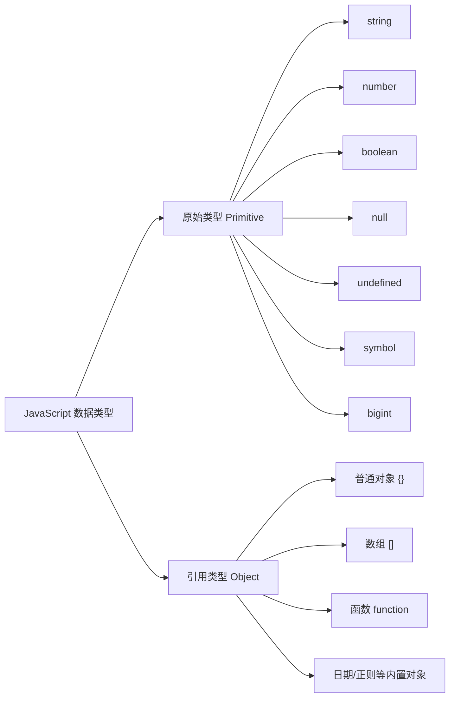
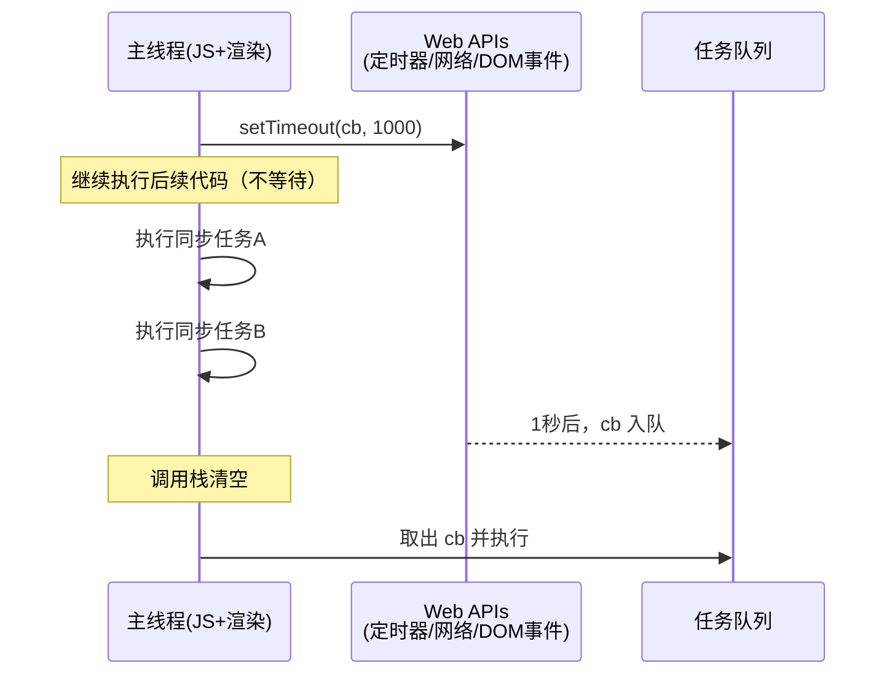
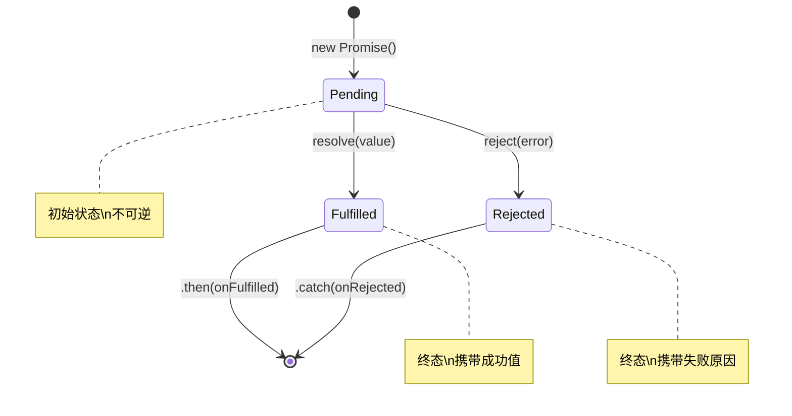
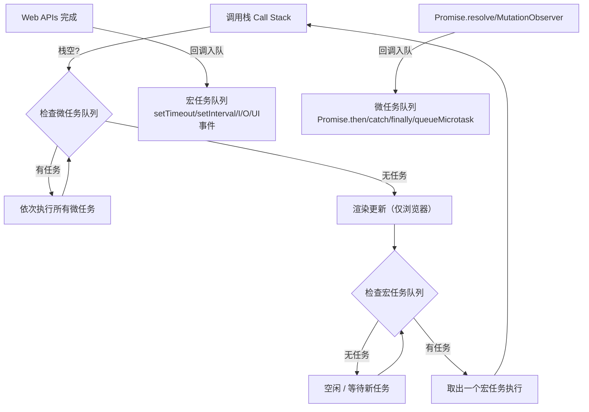
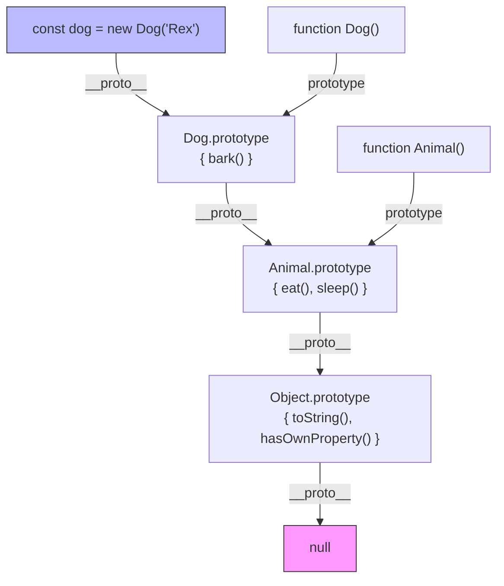
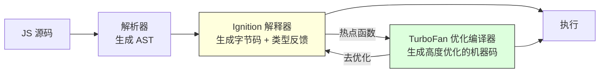
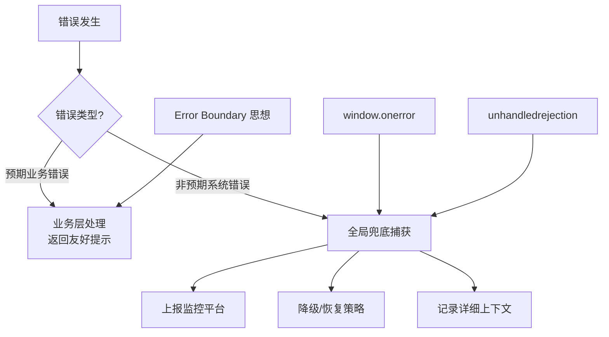

### 一、基础语法与核心思维

本阶段是 JavaScript 学习的基石。不同于其他强类型语言，JavaScript 的“简单”往往伴随着隐式行为与历史包袱。本笔记将聚焦于**现代标准（ES6+）**，同时点出必要的历史背景，帮助读者建立正确的语言心智模型。

#### 1. 变量声明与作用域基础

在 ES6 之前，JavaScript 只有 `var` 和函数作用域，这导致了大量难以排查的 bug。现代 JS 开发中，应默认使用 `let` 和 `const`。

|特性|`var`|`let`|`const`|
|:--|:--|:--|:--|
|作用域|函数作用域|块级作用域 `{}`|块级作用域 `{}`|
|变量提升|✅ 提升并初始化为 `undefined`|✅ 提升但存在暂时性死区|✅ 提升但存在暂时性死区|
|重复声明|✅ 允许|❌ 报错|❌ 报错|
|重新赋值|✅ 允许|✅ 允许|❌ 报错（但对象属性可改）|

> **⚠️ 关键概念：暂时性死区**  
> `let/const` 虽然也会被“提升”，但在声明语句执行前访问会抛出 `ReferenceError`。这段从作用域顶部到声明语句之间的区域称为“暂时性死区”。这是 JS 引擎为了防止开发者误用未初始化变量而设计的安全机制。

```javascript
console.log(a); // undefined（var 提升）
console.log(b); // ReferenceError: Cannot access 'b' before initialization（TDZ）

var a = 1;
let b = 2;
```

**最佳实践**：优先使用 `const`，仅在确定需要重新赋值时使用 `let`，永远不要在新代码中使用 `var`。

#### 2. 数据类型与类型系统

JavaScript 有 **8 种数据类型**，分为原始类型和引用类型。理解它们的存储与比较方式是避免 bug 的关键。



##### 原始类型 vs 引用类型的核心区别

- **存储方式**：原始值直接存储在栈内存中；引用类型在栈中存指针，实际数据在堆内存中。
- **比较方式**：原始类型按**值**比较；引用类型按**引用地址**比较。
- **不可变性**：原始类型是不可变的（字符串操作返回新值）；引用类型是可变的。

```javascript
// 引用比较陷阱
const arr1 = [1, 2, 3];
const arr2 = [1, 2, 3];
console.log(arr1 === arr2); // false！两个不同的堆内存地址

// 浅拷贝 vs 深拷贝的根源就在于此
const arr3 = arr1;
arr3.push(4);
console.log(arr1); // [1, 2, 3, 4] —— arr1 也被修改了
```

> **💡 背景知识：为什么 `typeof null === 'object'`？**  
> 这是 JavaScript 诞生初期的一个著名 Bug。在最初的实现中，值以 32 位存储，前 3 位表示类型标签，`000` 代表对象，而 `null` 被表示为全零指针，因此被误判为对象。该 Bug 因兼容性原因至今未修复。判断 `null` 请使用 `value === null`。

#### 3. 类型转换：显式与隐式

JavaScript 是弱类型语言，运算符会自动进行隐式类型转换，这是初学者最大的困惑来源之一。

##### 常见隐式转换规则速查

|场景|转换方向|示例|结果|
|:--|:--|:--|:--|
|`==` 比较|向 number 靠拢|`'5' == 5`|`true`|
|`+` 运算（含字符串）|向 string 拼接|`'5' + 3`|`'53'`|
|`- * / %` 运算|向 number 转换|`'6' - '2'`|`4`|
|`if / while / !`|向 boolean 转换|`if('')`|`false`|
|模板字符串 `${}`|调用 `.toString()`|`` `${{a:1}}` ``|`[object Object]`|

> **🔑 Falsy 值清单**  
> 以下值在布尔上下文中均为 `false`：`false`, `0`, `-0`, `0n`, `""`, `null`, `undefined`, `NaN`。**其余所有值均为 truthy**，包括 `[]`、`{}`、`"0"`、`new Boolean(false)`。

**最佳实践**：始终使用 `===` 代替 `==`，避免隐式转换带来的意外行为。仅在明确意图下进行显式转换（如 `Number()`, `String()`, `Boolean()`）。

#### 4. 函数基础：一等公民

在 JavaScript 中，函数是**一等公民**——它可以被赋值给变量、作为参数传递、作为返回值，也可以拥有属性。这是 JS 支持函数式编程的基础。

```javascript
// 函数表达式 vs 函数声明
function greet() { return 'hello'; }      // 声明：会被提升
const farewell = function() { return 'bye'; }; // 表达式：不会提升

// 箭头函数：简洁语法 + 词法 this
const add = (a, b) => a + b;

// 函数作为参数（回调）
[1, 2, 3].map(n => n * 2); // [2, 4, 6]

// 函数作为返回值（高阶函数雏形）
function multiplier(factor) {
  return (number) => number * factor;
}
const double = multiplier(2);
console.log(double(5)); // 10
```

> **⚠️ 箭头函数的注意事项**
> 
> - 没有自己的 `this`、`arguments`、`super`
> - 不能用作构造函数（不可 `new`）
> - 不能用作 Generator 函数
> - 适合回调、纯函数；不适合对象方法、事件处理器（当需要动态 this 时）

#### 5. DOM 操作入门

JavaScript 在浏览器中的核心能力之一是操作文档对象模型。以下是现代 DOM API 的最小可用集：

```javascript
// 选择元素（推荐 querySelector 系列）
const el = document.querySelector('.my-class');
const els = document.querySelectorAll('li.active');

// 修改内容与样式
el.textContent = '安全文本';     // 防 XSS，推荐
el.innerHTML = '<b>富文本</b>';  // 慎用，有注入风险
el.classList.add('active');
el.style.setProperty('--color', '#333');

// 事件监听
el.addEventListener('click', (e) => {
  e.preventDefault();
  console.log(e.target);
}, { once: true }); // 选项对象：只触发一次
```

> **💡 安全提示**  
> 永远不要将用户输入直接插入 `innerHTML`，这是 XSS 攻击的主要入口。优先使用 `textContent`，或使用 DOMPurify 等库对 HTML 进行净化。

#### 6. 阶段小结与自测清单

完成本阶段学习后，你应该能够自信地回答以下问题：

- [ ]  `let`、`const`、`var` 的作用域和提升行为有何不同？
- [ ]  原始类型和引用类型在赋值与比较时有何本质区别？
- [ ]  列举所有 falsy 值，并解释 `[] == ![]` 为何为 `true`
- [ ]  箭头函数与普通函数在 `this` 绑定上有何差异？
- [ ]  如何安全地操作 DOM 并避免 XSS？

### 二、异步编程与事件机制

如果说基础语法是 JavaScript 的“躯体”，那么异步模型就是它的“灵魂”。JavaScript 是**单线程非阻塞**语言，这意味着它同一时间只能执行一个任务，但通过事件循环机制，它能高效处理 I/O、网络请求和定时器。不理解这一层，就无法真正掌握 JavaScript。

#### 1. 为什么需要异步？

> **💡 背景知识：单线程的困境**  
> 浏览器主线程同时负责 JS 执行和页面渲染。如果所有操作都是同步的，一个耗时 3 秒的网络请求就会让页面完全冻结 3 秒。异步的本质是：**将耗时任务的等待过程移出主线程，待结果就绪后再通知主线程处理回调**，从而保证 UI 始终可响应。



#### 2. 回调函数与回调地狱

回调是异步的最原始形态，但嵌套过深会导致“回调地狱”：

```javascript
// ❌ 回调地狱：难以阅读、难以维护、错误处理分散
getUser(userId, function(user) {
  getOrders(user.id, function(orders) {
    getOrderDetail(orders[0].id, function(detail) {
      getProduct(detail.productId, function(product) {
        console.log(product.name);
      });
    });
  });
});
```

**回调的核心问题**：

- **控制反转**：你把代码的执行权交给了第三方库，无法保证回调何时被调用、是否被多次调用
- **错误传播困难**：每一层都需要单独处理错误，无法统一捕获
- **顺序依赖不直观**：业务逻辑被拆散到多层嵌套中

#### 3. Promise：异步的标准化契约

Promise 是对回调模式的根本性重构。它不是一个语法糖，而是一个**状态机**。



##### 核心规则

1. **状态不可逆**：一旦从 Pending 变为 Fulfilled 或 Rejected，状态永远不再改变
2. **链式调用**：`.then()` 总是返回一个新的 Promise，实现扁平化串联
3. **微任务调度**：Promise 回调在微任务队列中执行，优先级高于宏任务

```javascript
// ✅ Promise 链：扁平、可读、错误统一处理
getUser(userId)
  .then(user => getOrders(user.id))
  .then(orders => getOrderDetail(orders[0].id))
  .then(detail => getProduct(detail.productId))
  .then(product => console.log(product.name))
  .catch(err => console.error('链路中任意环节出错:', err));
```

> **⚠️ 常见陷阱：忘记 return**  
> `.then()` 中如果不 return 一个 Promise，下一个 `.then()` 会立即收到 `undefined` 而非等待异步结果。这是 Promise 链断裂的最常见原因。

```javascript
// ❌ 错误：第二个 then 不会等 getOrders 完成
.then(user => { getOrders(user.id); })

// ✅ 正确
.then(user => { return getOrders(user.id); })
// 或简写
.then(user => getOrders(user.id))
```

#### 4. async/await：异步的终极语法

`async/await` 是 Promise 的语法糖，让异步代码拥有同步代码的阅读体验。**但它不是魔法**——底层仍然是 Promise + 微任务。

```javascript
// ✅ 等价于上面的 Promise 链，但像同步代码一样直观
async function loadProduct(userId) {
  try {
    const user = await getUser(userId);
    const orders = await getOrders(user.id);
    const detail = await getOrderDetail(orders[0].id);
    const product = await getProduct(detail.productId);
    console.log(product.name);
  } catch (err) {
    console.error('加载失败:', err);
  }
}
```

##### 关键注意事项

|场景|说明|
|:--|:--|
|`await` 只能在 `async` 函数内使用|顶层 await 仅在 ES Module 中可用|
|串行 vs 并行|多个无关请求应使用 `Promise.all([a(), b()])` 而非连续 `await`|
|错误处理|推荐 `try/catch`，也可对单个 await 使用 `.catch()`|
|返回值|`async` 函数始终返回 Promise|

```javascript
// ❌ 串行执行：总耗时 = T1 + T2 + T3
const a = await fetchA();
const b = await fetchB();
const c = await fetchC();

// ✅ 并行执行：总耗时 = max(T1, T2, T3)
const [a, b, c] = await Promise.all([fetchA(), fetchB(), fetchC()]);
```

#### 5. 事件循环：一切的调度中枢

Event Loop 是理解 JS 异步行为的终极钥匙。它不是一个 JS 语言特性，而是**宿主环境（浏览器/Node.js）的实现规范**。



##### 宏任务 vs 微任务对照表

|宏任务|微任务|
|:--|:--|
|`setTimeout` / `setInterval`|`Promise.then/catch/finally`|
|I/O 操作|`MutationObserver`|
|UI 渲染事件（click/scroll）|`queueMicrotask()`|
|`requestAnimationFrame`（争议分类）|`process.nextTick`（Node.js，优先于其他微任务）|
|`setImmediate`（Node.js）||

> **🔑 黄金法则**  
> **每一轮事件循环中，微任务队列会在下一个宏任务之前被完全清空。** 这意味着 Promise 回调总是比 setTimeout(fn, 0) 先执行，即使 setTimeout 先注册。

```javascript
console.log('1');                    // 同步 → 输出 1

setTimeout(() => console.log('2'), 0); // 宏任务 → 最后输出 2

Promise.resolve().then(() => {
  console.log('3');                  // 微任务 → 第二输出 3
});

console.log('4');                    // 同步 → 输出 4

// 输出顺序：1 → 4 → 3 → 2
```

#### 6. 闭包与作用域链：异步的隐形基石

异步回调之所以能访问外部变量，完全依赖于闭包。这是连接第一阶段与本阶段的关键桥梁。

```javascript
function createCounter() {
  let count = 0; // 被闭包捕获
  
  return {
    increment() {
      count++;     // 修改外部变量
      return count;
    },
    getAsync() {
      return new Promise(resolve => {
        setTimeout(() => resolve(count), 100); // 异步访问闭包变量
      });
    }
  };
}

const counter = createCounter();
counter.increment();
counter.getAsync().then(v => console.log(v)); // 1
```

> **⚠️ 经典陷阱：循环中的闭包**  
> 使用 `var` 在 for 循环中创建异步回调时，所有回调共享同一个变量。解决方案：使用 `let`（块级作用域）或 IIFE 创建独立作用域。这既是作用域问题，也是异步时序问题。

#### 7. 阶段小结与自测清单

- [ ]  能否画出 Event Loop 的完整流程图并向他人讲解？
- [ ]  解释为什么 `Promise.resolve().then()` 先于 `setTimeout(fn, 0)` 执行
- [ ]  写出一个正确的 Promise 链，确保每步都正确 return
- [ ]  区分串行 await 与并行 `Promise.all` 的使用场景
- [ ]  解释闭包如何使异步回调能够访问创建时的环境变量
- [ ]  列举至少 3 种微任务和 3 种宏任务

### 三、面向对象与函数式进阶

JavaScript 是一门多范式语言。它既不是纯粹的类继承 OOP 语言（如 Java），也不是纯粹的函数式语言（如 Haskell）。理解 JS 的独特之处，关键在于接受它的**原型本质**与**函数一等公民**地位，而非强行套用其他语言的思维模型。本阶段将帮助你建立属于 JavaScript 本身的编程哲学。

#### 1. 原型链：JS 继承的真正基石

> **💡 背景知识：为什么 JS 没有选择类继承？**  
> JavaScript 诞生于 1995 年，最初设计目标是为浏览器添加轻量级脚本能力。Brendan Eich 借鉴了 Self 和 Scheme 语言的原型/委托思想，而非 Simula/Java 的类继承。`class` 关键字直到 ES6（2015）才引入，且仅是原型链的语法糖。理解原型链，是理解 JS 对象系统的唯一正途。



##### 核心概念解析

- **每个对象都有 ``**（可通过 `__proto__` 或 `Object.getPrototypeOf()` 访问），指向其构造函数的 `prototype` 对象。
- **属性查找是委托机制**：访问 `dog.eat()` 时，引擎沿原型链逐级向上查找，直到找到属性或抵达 `null`。
- **`constructor` 属性不可靠**：它可以被随意修改，不应作为类型判断依据。推荐使用 `instanceof` 或 `Object.getPrototypeOf()`。

```javascript
// 原型链验证
function Animal(name) { this.name = name; }
Animal.prototype.eat = function() { console.log(`${this.name} eats`); };

function Dog(name, breed) {
  Animal.call(this, name); // 借用构造函数初始化实例属性
  this.breed = breed;
}
Dog.prototype = Object.create(Animal.prototype); // 建立原型链
Dog.prototype.constructor = Dog;                 // 修复 constructor 引用
Dog.prototype.bark = function() { console.log('Woof!'); };

const rex = new Dog('Rex', 'Labrador');
console.log(rex instanceof Dog);    // true
console.log(rex instanceof Animal); // true
console.log(rex.hasOwnProperty('name'));  // true（实例自有）
console.log(rex.hasOwnProperty('eat'));   // false（来自原型）
```

> **⚠️ `class` 只是语法糖**  
> ES6 的 `class`、`extends`、`super` 底层完全等价于上述原型链操作。使用 `class` 可以让代码更简洁，但调试和理解行为时，必须回归原型链思维。例如，`class` 方法默认不可枚举、必须用 `new` 调用，这些差异都源于语法糖的封装规则。

#### 2. `this` 绑定：四条规则定乾坤

`this` 是 JS 中最令人困惑的概念之一。**`this` 不取决于函数定义位置，而取决于调用方式**。掌握以下四条优先级递减的规则，即可预测任何场景下的 `this` 值：

|优先级|规则|示例|`this` 指向|
|:--|:--|:--|:--|
|1|`new` 绑定|`new Foo()`|新创建的对象|
|2|显式绑定|`call/apply/bind`|指定的对象|
|3|隐式绑定|`obj.method()`|`obj`|
|4|默认绑定|`fn()`|非严格模式: `window/global`；严格模式: `undefined`|

> **🔑 箭头函数例外**  
> 箭头函数**没有自己的 `this`**，它捕获定义时外层作用域的 `this`（词法 this）。上述四条规则对箭头函数完全无效。这是箭头函数适合作为回调的根本原因。

```javascript
const obj = {
  name: 'Alice',
  greet: function() {
    console.log(this.name);           // 隐式绑定 → 'Alice'
    setTimeout(() => console.log(this.name), 100); // 词法 this → 'Alice'
    setTimeout(function() { console.log(this.name); }, 100); // 默认绑定 → undefined/window
  }
};

const unbound = obj.greet;
unbound(); // 默认绑定 → undefined（严格模式）
```

**常见陷阱**：事件处理器中 `this` 指向触发事件的 DOM 元素（隐式绑定），若需保持组件实例引用，应使用箭头函数或 `.bind(this)`。

#### 3. 模块化：ESM 与 CJS 的本质差异

现代 JS 项目几乎都使用模块系统，但 ESM 与 CJS 并非简单互换。理解它们的底层差异，能避免大量运行时错误。

|特性|CommonJS (CJS)|ES Modules (ESM)|
|:--|:--|:--|
|加载时机|运行时同步加载|编译时静态分析|
|导出值|值的拷贝（快照）|值的实时绑定（引用）|
|`this` 顶层|`module.exports`|`undefined`|
|条件导入|✅ 支持|❌ 不支持（import 必须在顶层）|
|Tree Shaking|❌ 困难|✅ 天然支持|
|浏览器原生|❌|✅ `<script type="module">`|

```javascript
// CJS：导出的是快照
let count = 0;
module.exports = { get count() { return count; }, inc: () => count++ };
// 导入方拿到的是 getter，但普通属性导出后不会同步更新

// ESM：导出的是实时绑定
export let count = 0;
export const inc = () => count++;
// 导入方始终看到最新的 count 值
```

> **💡 实践建议**
> 
> - 新项目一律使用 ESM
> - Node.js 中使用 ESM 需在 `package.json` 设置 `"type": "module"` 或使用 `.mjs` 扩展名
> - 混合使用时，ESM 可以默认导入 CJS 模块，反之则需动态 `import()`

#### 4. 函数式编程核心工具

JS 的函数一等公民特性使其天然适合函数式风格。以下是日常开发中最实用的 FP 工具，无需引入第三方库：

##### 高阶函数三剑客

```javascript
const users = [
  { name: 'Alice', age: 30, active: true },
  { name: 'Bob', age: 25, active: false },
  { name: 'Charlie', age: 35, active: true }
];

// map：转换结构，不改变原数组
const names = users.map(u => u.name); // ['Alice', 'Bob', 'Charlie']

// filter：筛选子集
const activeUsers = users.filter(u => u.active);

// reduce：聚合为任意值（最强大也最易误用）
const ageSum = users.reduce((sum, u) => sum + u.age, 0);
const grouped = users.reduce((acc, u) => {
  acc[u.active ? 'active' : 'inactive'].push(u.name);
  return acc;
}, { active: [], inactive: [] });
```

##### 柯里化与组合

```javascript
// 柯里化：将多参数函数转为单参数函数链
const curry = fn => (...args) =>
  args.length >= fn.length
    ? fn(...args)
    : (...more) => curry(fn)(...args, ...more);

const add = curry((a, b, c) => a + b + c);
console.log(add(1)(2)(3));     // 6
console.log(add(1, 2)(3));     // 6

// 组合：从右到左管道化数据处理
const compose = (...fns) => x => fns.reduceRight((v, f) => f(v), x);

const processUser = compose(
  u => ({ ...u, displayName: u.name.toUpperCase() }),
  u => ({ ...u, isAdult: u.age >= 18 })
);
```

> **⚠️ 务实的函数式**  
> 不必追求纯函数式教条。在 JS 中，**局部可变 + 接口不可变** 是更务实的策略。例如，`reduce` 内部可以使用临时变量，只要对外无副作用即可。过度抽象反而损害可读性。

#### 5. 常用设计模式（JS 原生实现）

|模式|JS 原生体现|典型场景|
|:--|:--|:--|
|观察者|`EventTarget` / 自定义 EventEmitter|解耦组件通信|
|单例|模块缓存机制|配置管理、全局状态|
|策略|对象映射替代 if-else|表单验证、支付渠道选择|
|装饰器|高阶函数包装|日志、缓存、权限校验|
|代理|`Proxy` / `Reflect`|响应式数据、访问控制|

```javascript
// 策略模式示例：消除复杂条件分支
const validators = {
  email: v => /^[^\s@]+@[^\s@]+\.[^\s@]+$/.test(v),
  phone: v => /^1[3-9]\d{9}$/.test(v),
  required: v => v != null && String(v).trim() !== ''
};

function validate(value, rules) {
  return rules.every(rule => validators[rule]?.(value) ?? true);
}
```

#### 6. 阶段小结与自测清单

- [ ]  手绘原型链图并解释属性查找过程
- [ ]  给定任意函数调用表达式，准确判断 `this` 指向
- [ ]  解释 ESM 导出绑定与 CJS 导出拷贝的实际影响
- [ ]  使用 `reduce` 实现 `groupBy`、`flatMap` 等自定义操作
- [ ]  用高阶函数实现一个带缓存的装饰器
- [ ]  区分何时该用 OOP、何时该用 FP、何时该用混合范式

### 四、运行时原理与工程实践

前三个阶段解决了“如何编写正确的 JavaScript”，本阶段将解决“如何编写高性能、可维护、生产就绪的 JavaScript”。我们将从 V8 引擎内部视角理解代码执行代价，掌握内存与性能的度量方法，并深入那些被低估的现代 Web API。这些知识不直接产生业务功能，却是区分普通开发者与技术专家的分水岭。

#### 1. V8 引擎核心机制

> **💡 背景知识：为什么 JS 能这么快？**  
> 早期 JS 引擎是纯解释器，性能极差。V8（Chrome/Node.js 底层）引入了 **JIT（Just-In-Time）编译**：先快速解释执行生成字节码，同时收集类型反馈，对热点函数进行优化编译为机器码。理解这一过程，就能明白为何某些“看似等价”的代码性能差异巨大。



##### 隐藏类与内联缓存

V8 为每个对象创建**隐藏类**来模拟静态类型的内存布局。相同属性添加顺序的对象共享同一隐藏类，从而启用**内联缓存**，使属性访问接近 C++ 结构体速度。

```javascript
// ✅ 高效：所有实例共享隐藏类
function Point(x, y) {
  this.x = x;
  this.y = y;
}
const a = new Point(1, 2);
const b = new Point(3, 4); // 与 a 共享隐藏类

// ❌ 低效：动态添加属性导致隐藏类分裂
const c = new Point(5, 6);
c.z = 7; // c 获得新的隐藏类，无法与 a/b 共享 IC
```

> **🔑 性能黄金法则**
> 
> - 始终在构造函数中初始化所有属性，避免后续动态添加
> - 属性添加顺序保持一致
> - 避免删除属性（`delete obj.prop` 会触发隐藏类变更），改用 `obj.prop = undefined`
> - 数组保持元素类型一致（单态数组可被优化为紧凑存储）

#### 2. 垃圾回收与内存管理

V8 采用**分代垃圾回收**策略，理解它才能有效预防内存泄漏。

|代|对象特征|GC 算法|频率|
|:--|:--|:--|:--|
|新生代|短生命周期对象（局部变量等）|Scavenge（Cheney 复制算法）|高频、快速|
|老生代|长生命周期对象（闭包、全局变量等）|Mark-Sweep + Mark-Compact|低频、耗时|

##### 常见内存泄漏模式

```javascript
// 1. 意外全局变量
function leak() {
  data = 'large string'; // 缺少 var/let/const → 挂载到 globalThis
}

// 2. 未清理的定时器/事件监听
setInterval(() => heavyComputation(), 1000); // 组件卸载后仍在运行
element.addEventListener('scroll', handler); // DOM 移除但引用未解除

// 3. 闭包持有大对象引用
function createProcessor() {
  const hugeData = loadHugeData();
  return () => hugeData.length; // 即使只用 length，整个 hugeData 也无法被 GC
}

// 4. 分离的 DOM 引用
const cache = {};
cache.node = document.getElementById('temp'); // DOM 节点从文档移除但仍被 JS 引用
```

> **🛠️ 排查工具链**
> 
> - **Chrome DevTools Memory 面板**：Heap Snapshot 对比定位增长对象
> - **Performance Monitor**：实时监控 JS Heap、DOM Nodes、Listeners 数量趋势
> - **Allocation Timeline**：精确到代码行的内存分配追踪
> - **Node.js**：`--inspect` + Chrome DevTools 或 `clinic.js` 套件

#### 3. 现代 Web API 深度用法

许多强大的浏览器原生 API 被严重低估，它们往往比第三方库更高效、更轻量。

##### AbortController：统一的取消机制

```javascript
// 取消 fetch 请求
const controller = new AbortController();
fetch('/api/data', { signal: controller.signal })
  .then(res => res.json())
  .catch(err => {
    if (err.name === 'AbortError') console.log('已取消');
  });

// 用户离开页面或切换标签时取消
controller.abort();

// 同样适用于 addEventListener
element.addEventListener('click', handler, { signal: controller.signal });
// controller.abort() 自动移除监听器 —— 告别手动 removeEventListener
```

##### IntersectionObserver：高性能可见性检测

```javascript
// 替代 scroll 事件监听，零主线程阻塞
const observer = new IntersectionObserver((entries) => {
  entries.forEach(entry => {
    if (entry.isIntersecting) {
      entry.target.classList.add('visible');
      observer.unobserve(entry.target); // 一次性观察
    }
  });
}, { threshold: 0.1, rootMargin: '0px 0px 200px 0px' });

document.querySelectorAll('.lazy-item').forEach(el => observer.observe(el));
```

##### Structured Clone：深拷贝的原生方案

```javascript
// 替代 JSON.parse(JSON.stringify()) 的缺陷方案
const original = { date: new Date(), regex: /test/gi, map: new Map() };
const cloned = structuredClone(original);

// ✅ 支持：Date, RegExp, Map, Set, ArrayBuffer, Blob, File, Error 等
// ❌ 不支持：函数、DOM 节点、Symbol 属性、原型链
```

#### 4. 生产级错误处理

健壮的错误处理不是到处写 `try/catch`，而是建立**分层防御体系**。



##### 关键实践

- **自定义错误类**：携带结构化上下文信息，而非仅字符串消息
- **异步错误边界**：封装通用的 async wrapper，统一捕获与上报
- **Source Map 安全**：生产环境上传 Source Map 到监控平台，但**绝不暴露给客户端**
- **优雅降级**：非核心功能失败不应阻断主流程

```javascript
// 自定义错误示例
class ApiError extends Error {
  constructor(message, statusCode, requestId) {
    super(message);
    this.name = 'ApiError';
    this.statusCode = statusCode;
    this.requestId = requestId;
  }
}

// 全局未捕获 Promise 错误兜底
window.addEventListener('unhandledrejection', (event) => {
  reportToMonitoring(event.reason);
  event.preventDefault(); // 阻止控制台默认报错（可选）
});
```

#### 5. 调试方法论

超越 `console.log` 的系统化调试能力：

|技术|用途|注意事项|
|:--|:--|:--|
|`console.table()`|可视化数组/对象数据|大数据量时慎用|
|`console.time/timeEnd()`|粗粒度性能测量|精度有限，正式基准测试用 Performance API|
|`debugger` 语句|条件断点、动态断点|生产构建务必移除|
|Conditional Breakpoints|DevTools 中右键断点设条件|避免频繁暂停|
|Logpoints|不打断执行的日志断点|DevTools Sources 面板右键添加|
|Performance Profiler|火焰图分析 CPU 瓶颈|关注 Long Tasks 和 Layout Thrashing|

> **💡 调试心法**  
> 不要猜测，要**证伪**。形成假设 → 设计最小验证实验 → 观察结果 → 修正假设。每一次 `console.log` 都应该有明确的验证目标，而非漫无目的地打印变量。

#### 6. 阶段小结与完整学习路线回顾

恭喜你完成了全部四个阶段的学习！让我们回顾完整的成长路径：

|阶段|核心收获|能力标志|
|:--|:--|:--|
|一、基础语法与核心思维|变量、类型、函数、DOM|能写出无基础 bug 的功能代码|
|二、异步编程与事件机制|Promise、async/await、Event Loop|能可靠地处理复杂异步流程|
|三、面向对象与函数式进阶|原型链、this、模块、FP|能设计符合 JS 哲学的代码架构|
|四、运行时原理与工程实践|V8、GC、Web API、调试|能诊断性能问题并交付生产级代码|

##### 最终自测清单

- [ ]  解释 V8 隐藏类机制及其对编码风格的影响
- [ ]  使用 Chrome DevTools 定位并修复一个内存泄漏
- [ ]  用 AbortController 重构一个包含多个并发请求的组件
- [ ]  设计一套覆盖业务错误与系统错误的分层错误处理方案
- [ ]  使用 Performance Profiler 分析并优化一个页面的 Long Task
- [ ]  向初级开发者清晰讲解 Event Loop、原型链、闭包中的任意两个概念

### 五、练习：从理解到精通的实战检验

> **💡 本阶段设计理念**  
> 前四个阶段构建了完整的知识体系，但“看懂”与“会用”之间存在巨大的鸿沟。本阶段不提供选择题或填空题，而是设计了 **6 道综合性实战练习**，每道题都刻意跨越多个阶段的知识边界，迫使你在真实场景中整合所学。所有练习均附带分级提示与验证标准，建议先独立完成再对照参考。

#### 练习 1：实现一个带并发控制的异步调度器

**🎯 考察点**：Promise、async/await、闭包、队列管理、Event Loop 微任务

**题目描述**：  
实现一个 `Scheduler` 类，支持添加异步任务并控制最大并发数。当运行中的任务少于上限时自动执行下一个任务；所有任务完成后触发回调。

```javascript
class Scheduler {
  constructor(maxConcurrent) { /* ... */ }
  add(task) { /* task 是返回 Promise 的函数 */ }
  onAllComplete(callback) { /* ... */ }
}

// 使用示例
const scheduler = new Scheduler(2);
scheduler.add(() => fetch('/api/a')); // 立即执行
scheduler.add(() => fetch('/api/b')); // 立即执行
scheduler.add(() => fetch('/api/c')); // 等待前面某个完成后再执行
scheduler.onAllComplete(() => console.log('全部完成'));
```

**分级提示**：

- 🟢 **入门**：用一个数组维护等待队列，用计数器跟踪运行中任务数
- 🟡 **进阶**：确保 `add()` 在同步循环中调用时不会立即执行超限任务（理解微任务时序）
- 🔴 **挑战**：让 `add()` 本身返回 Promise，该 Promise 在对应任务完成后 resolve

**✅ 验证标准**：

- 任意时刻并发数不超过 `maxConcurrent`
- 任务按添加顺序依次获得执行机会（FIFO）
- 单个任务失败不影响其他任务继续执行
- `onAllComplete` 在所有任务（含失败的）结束后恰好触发一次

> [!success]- 点击展开题解
> 
> ## 💡 题目解析与核心思路
> 
> 这道题是前端异步编程的经典面试题，主要考察对 **Promise 执行机制**、**事件循环（Event Loop）** 以及 **队列数据结构** 的综合运用能力。
> 
> ### 核心概念图解
> 
> 在动手写代码前，我们需要理解调度器内部的状态流转。Scheduler 本质上是一个“令牌+队列”模型：
> 
> ```mermaid
> flowchart TD
>     A[add task] --> B{running < max?}
>     B -- Yes --> C[立即执行任务]
>     B -- No --> D[推入等待队列]
>     C --> E[running++]
>     E --> F[任务完成/失败]
>     F --> G[running--]
>     G --> H{队列非空?}
>     H -- Yes --> I[取出队首任务]
>     I --> C
>     H -- No --> J{running === 0?}
>     J -- Yes --> K[触发 onAllComplete]
>     J -- No --> L[等待剩余任务]
>     D -.-> H
> ```
> 
> ### ⚠️ 关键难点剖析
> 
> 1. **为什么不能直接 `await`？**  
>     `add()` 方法本身通常是同步调用的。如果在 `add` 内部直接 `await task()`，会导致后续 `add` 被阻塞，无法实现“并发”效果。我们必须让 `add` 快速返回，将真正的异步执行逻辑封装在内部闭包中。
> 2. **微任务时序陷阱**  
>     当在同步循环中连续调用 `add()` 时，所有任务会被先加入队列或立即启动。由于 Promise 构造函数是同步执行的，而 `.then` 回调是微任务，因此计数器的增减必须精确控制，避免在同一轮 Event Loop 中误判并发数。
> 3. **错误隔离**  
>     单个任务的 reject 不应导致整个调度器崩溃。必须在执行每个任务时使用 `try/catch` 或 `.catch()` 捕获异常，确保 `finally` 中的“下一个任务调度”和“完成检测”逻辑始终执行。
> 
> ---
> 
> ## 🚀 完整实现（含挑战级功能）
> 
> 以下实现满足了所有验证标准，并完成了🔴挑战：`add()` 返回一个 Promise，该 Promise 在对应任务结束后 resolve/reject。
> 
> ```javascript
> class Scheduler {
>   constructor(maxConcurrent) {
>     this.maxConcurrent = maxConcurrent;
>     this.runningCount = 0;
>     this.queue = []; // 存储 { task, resolve, reject }
>     this.allCompleteCallbacks = [];
>     this.totalAdded = 0;
>     this.totalFinished = 0;
>   }
> 
>   /**
>    * 添加任务，返回一个在任务完成后 settle 的 Promise
>    * @param {() => Promise<any>} task
>    * @returns {Promise<any>}
>    */
>   add(task) {
>     this.totalAdded++;
>     return new Promise((resolve, reject) => {
>       const entry = { task, resolve, reject };
>       
>       if (this.runningCount < this.maxConcurrent) {
>         this._run(entry);
>       } else {
>         this.queue.push(entry);
>       }
>     });
>   }
> 
>   onAllComplete(callback) {
>     // 如果注册回调时所有任务已经完成，则立即触发
>     if (this.totalAdded > 0 && this.totalFinished === this.totalAdded) {
>       callback();
>     } else {
>       this.allCompleteCallbacks.push(callback);
>     }
>   }
> 
>   _run(entry) {
>     this.runningCount++;
>     const { task, resolve, reject } = entry;
> 
>     // 使用 Promise.resolve() 包裹以兼容非 Promise 返回值
>     Promise.resolve()
>       .then(() => task())
>       .then(
>         (value) => {
>           resolve(value);
>         },
>         (err) => {
>           reject(err);
>         }
>       )
>       .finally(() => {
>         this.runningCount--;
>         this.totalFinished++;
>         this._next();
>         this._checkAllComplete();
>       });
>   }
> 
>   _next() {
>     if (this.queue.length > 0 && this.runningCount < this.maxConcurrent) {
>       const nextEntry = this.queue.shift();
>       this._run(nextEntry);
>     }
>   }
> 
>   _checkAllComplete() {
>     if (this.totalAdded > 0 && this.totalFinished === this.totalAdded) {
>       // 清空回调数组，确保只触发一次
>       const callbacks = this.allCompleteCallbacks.splice(0);
>       for (const cb of callbacks) {
>         try { cb(); } catch (e) { console.error(e); }
>       }
>     }
>   }
> }
> ```
> 
> ---
> 
> ## 🔍 逐层解读
> 
> ### 🟢 入门层：计数器 + 队列
> 
> - `runningCount` 追踪当前正在执行的任务数。
> - `queue` 作为 FIFO 缓冲池，当并发满时暂存待执行条目。
> - `_next()` 在每个任务结束时尝试从队列取出下一个，保证顺序性。
> 
> ### 🟡 进阶层：微任务安全
> 
> - 注意 `_run` 中使用 `Promise.resolve().then(() => task())` 而非直接 `task()`。这确保了即使 `task` 抛出同步异常，也能被 Promise 链正确捕获，不会中断调度器主流程。
> - `add()` 内部的判断是同步的，但实际执行通过 Promise 链进入微任务队列，避免了同步循环中计数器状态不一致的问题。
> 
> ### 🔴 挑战层：add 返回 Promise
> 
> - 我们将外部传入的 `resolve/reject` 与内部任务绑定。这意味着调用方可以：
>     
>     ```js
>     const result = await scheduler.add(() => fetch('/api/a'));
>     ```
>     
> - 这种设计使得调度器不仅是“批处理器”，更是可组合的异步原语。
> 
> ---
> 
> ## ✅ 验证清单对照
> 
> |验证标准|实现保障|
> |:--|:--|
> |并发数不超限|`_run` 仅在 `runningCount < max` 时调用；`_next` 同样检查|
> |FIFO 顺序|使用数组 `push/shift` 保证先进先出|
> |单任务失败不影响整体|`.finally` 无条件执行后续调度；错误仅 reject 对应 Promise|
> |onAllComplete 恰好触发一次|用 `totalFinished === totalAdded` 判定；触发后 `splice(0)` 清空回调|
> 
> ---
> 
> ## 📚 背景知识补充
> 
> ### 为什么不用 async/await 写 _run？
> 
> 虽然可以用 `async _run(entry)`，但在高频调度场景下，显式 Promise 链能更清晰地控制微任务边界，且避免不必要的 async 函数包装开销。此外，`async` 函数的异常捕获行为在某些边缘情况下不如 `.then(onFulfilled, onRejected)` 可控。
> 
> ### 实际应用场景
> 
> - **图片/资源预加载**：限制浏览器并发请求数，避免连接耗尽。
> - **API 限流**：遵守后端 Rate Limit，平滑发送请求。
> - **测试用例并发控制**：避免数据库连接池被打满。
> 
> > 💡 **学习建议**：尝试在此基础上扩展 `pause()/resume()`、优先级队列、超时取消等功能，将进一步深化对异步系统的理解。

---

#### 练习 2：手写深拷贝函数（处理循环引用）

**🎯 考察点**：原始/引用类型区分、原型链、WeakMap、递归、类型判断

**题目描述**：  
实现 `deepClone(value)` 函数，要求：

1. 正确处理所有原始类型（包括 Symbol、BigInt）
2. 支持 Array、Object、Date、RegExp、Map、Set
3. 正确处理循环引用（不栈溢出）
4. 保留对象的原型链

**分级提示**：

- 🟢 **入门**：先处理普通对象和数组，用 `typeof` + `Array.isArray` 区分
- 🟡 **进阶**：引入 `WeakMap` 作为缓存解决循环引用，注意 WeakMap 只能用对象作 key
- 🔴 **挑战**：使用 `Object.getOwnPropertySymbols` 拷贝 Symbol 键，用 `Reflect.getPrototypeOf` + `Object.create` 保留原型链

**✅ 验证标准**：

```javascript
const a = { x: 1 };
a.self = a; // 循环引用
const b = deepClone(a);
console.log(b.x === 1);        // true
console.log(b.self === b);     // true（循环引用正确映射）
console.log(b !== a);          // true（全新对象）
console.log(deepClone(new Date()) instanceof Date); // true
```

> [!success]- 点击展开题解
> 
> ### 📝 深拷贝函数（处理循环引用）题解
> 
> 深拷贝是 JavaScript 中高阶面试与工程实践中的经典问题。它不仅考察对数据类型的理解，还涉及内存模型、递归算法及元编程能力。本题要求实现一个**生产级**的 `deepClone` 函数，下面从原理到实现逐层剖析。
> 
> ---
> 
> ### 1. 核心难点分析
> 
> |难点|说明|
> |:--|:--|
> |**原始类型 vs 引用类型**|原始类型直接返回；引用类型需递归复制|
> |**特殊内置对象**|`Date`, `RegExp`, `Map`, `Set` 不能简单 `{...}` 拷贝|
> |**循环引用**|对象自引用或互相引用会导致无限递归 → 栈溢出|
> |**Symbol / BigInt**|`typeof` 可识别，但 Symbol 作为 key 时默认枚举不到|
> |**原型链保留**|`Object.create(proto)` 而非 `{}` 才能保持继承关系|
> 
> ---
> 
> ### 2. 算法流程图
> 
> ```mermaid
> flowchart TD
>     A[输入 value] --> B{是原始类型?}
>     B -- 是 --> C[直接返回 value]
>     B -- 否 --> D{WeakMap 已缓存?}
>     D -- 是 --> E[返回缓存副本]
>     D -- 否 --> F{判断具体类型}
>     F -->|Date| G[new Date(value.getTime())]
>     F -->|RegExp| H[new RegExp(value.source, value.flags)]
>     F -->|Map| I[创建新Map并递归拷贝entries]
>     F -->|Set| J[创建新Set并递归拷贝values]
>     F -->|Array/Object| K[Object.create(proto) 保留原型]
>     G & H & I & J & K --> L[存入 WeakMap]
>     L --> M[遍历自身属性+Symbol键递归拷贝]
>     M --> N[返回克隆结果]
> ```
> 
> > 💡 **为什么用 WeakMap 而不是 Map？**
> > 
> > - `WeakMap` 的 key 是弱引用，不会阻止垃圾回收
> > - 避免克隆完成后缓存仍然持有原对象导致内存泄漏
> > - `WeakMap` 只接受对象作 key，恰好与"只有引用类型才需要缓存"一致
> 
> ---
> 
> ### 3. 完整实现代码
> 
> ```javascript
> function deepClone(value, cache = new WeakMap()) {
>   // 1. 原始类型 & null & function 直接返回
>   if (value === null || typeof value !== 'object') {
>     return value;
>   }
> 
>   // 2. 循环引用检测
>   if (cache.has(value)) {
>     return cache.get(value);
>   }
> 
>   // 3. 处理特殊内置对象
>   if (value instanceof Date) {
>     const cloned = new Date(value.getTime());
>     cache.set(value, cloned);
>     return cloned;
>   }
> 
>   if (value instanceof RegExp) {
>     const cloned = new RegExp(value.source, value.flags);
>     cloned.lastIndex = value.lastIndex;
>     cache.set(value, cloned);
>     return cloned;
>   }
> 
>   if (value instanceof Map) {
>     const cloned = new Map();
>     cache.set(value, cloned);
>     value.forEach((v, k) => {
>       cloned.set(deepClone(k, cache), deepClone(v, cache));
>     });
>     return cloned;
>   }
> 
>   if (value instanceof Set) {
>     const cloned = new Set();
>     cache.set(value, cloned);
>     value.forEach((v) => {
>       cloned.add(deepClone(v, cache));
>     });
>     return cloned;
>   }
> 
>   // 4. Array / Plain Object —— 保留原型链
>   const proto = Reflect.getPrototypeOf(value);
>   const cloned = Array.isArray(value) ? [] : Object.create(proto);
>   cache.set(value, cloned);
> 
>   // 5. 拷贝所有自身属性（含 Symbol 键）
>   const keys = [
>     ...Reflect.ownKeys(value), // 包含 string + symbol 自有键
>   ];
> 
>   for (const key of keys) {
>     const desc = Object.getOwnPropertyDescriptor(value, key);
>     if (desc.value !== undefined) {
>       desc.value = deepClone(desc.value, cache);
>     }
>     // 保留 getter/setter 描述符（可选，视需求而定）
>     Object.defineProperty(cloned, key, desc);
>   }
> 
>   return cloned;
> }
> ```
> 
> ---
> 
> ### 4. 关键知识点详解
> 
> #### 🔑 `Reflect.ownKeys` vs `Object.keys`
> 
> - `Object.keys` 仅返回**可枚举的字符串键**
> - `Reflect.ownKeys` 返回**所有自有键**（含不可枚举 + Symbol），等价于 `Object.getOwnPropertyNames` + `Object.getOwnPropertySymbols`
> - 深拷贝必须使用后者，否则会丢失 Symbol 属性和非枚举属性
> 
> #### 🔑 原型链保留
> 
> ```js
> // ❌ 错误：丢失原型
> const clone = {};
> 
> // ✅ 正确：保留原型
> const clone = Object.create(Reflect.getPrototypeOf(source));
> ```
> 
> 对于数组，`[]` 本身已自带 `Array.prototype`，无需额外处理；但对自定义类实例，必须通过 `Object.create(proto)` 重建继承链。
> 
> #### 🔑 BigInt 与 Symbol 的注意事项
> 
> - `BigInt` 是原始类型，`typeof bigint === 'bigint'`，第一步即被正确返回
> - `Symbol` 作为值时同理直接返回（Symbol 设计为全局唯一，不应被"复制"）
> - `Symbol` 作为**键**时，通过 `Reflect.ownKeys` 获取并递归拷贝其对应的值即可
> 
> ---
> 
> ### 5. 验证测试
> 
> ```javascript
> // ✅ 循环引用
> const a = { x: 1 };
> a.self = a;
> const b = deepClone(a);
> console.log(b.x === 1);        // true
> console.log(b.self === b);     // true
> console.log(b !== a);          // true
> 
> // ✅ 内置对象
> console.log(deepClone(new Date()) instanceof Date);       // true
> console.log(deepClone(/abc/gi) instanceof RegExp);        // true
> console.log(deepClone(new Map()) instanceof Map);  // true
> console.log(deepClone(new Set([1,2])) instanceof Set);    // true
> 
> // ✅ Symbol 键
> const sym = Symbol('id');
> const obj = { [sym]: 42 };
> const cloned = deepClone(obj);
> console.log(cloned[sym] === 42); // true
> 
> // ✅ 原型链
> class Foo { bar() { return 'baz'; } }
> const foo = new Foo();
> const fooClone = deepClone(foo);
> console.log(fooClone instanceof Foo);      // true
> console.log(fooClone.bar());               // 'baz'
> console.log(fooClone !== foo);             // true
> ```
> 
> ---
> 
> ### 6. 常见误区提醒
> 
> |误区|后果|修正|
> |:--|:--|:--|
> |用 `JSON.parse(JSON.stringify())`|丢失 `undefined`, `Function`, `Symbol`, `Date`(变字符串), `RegExp`, 循环引用报错|手写递归|
> |用 `Map` 做缓存|内存泄漏|改用 `WeakMap`|
> |只遍历 `Object.keys`|丢失 Symbol 键和不可枚举属性|用 `Reflect.ownKeys`|
> |用 `{}` 创建副本|丢失原型链|用 `Object.create(proto)`|
> |忘记先存缓存再递归|循环引用仍会栈溢出|**先 set 再遍历属性**|
> 
> > ⚠️ **生产环境建议**：实际项目中推荐使用 [structuredClone()](https://developer.mozilla.org/en-US/docs/Web/API/structuredClone)（浏览器/Node 17+ 原生支持），它已内置处理上述所有场景。手写实现主要用于**学习原理**和**面试考察**。

---

#### 练习 3：实现响应式数据系统（简化版 Vue3 reactive）

**🎯 考察点**：Proxy/Reflect、闭包、依赖收集、设计模式（观察者+代理）

**题目描述**：  
实现 `reactive(obj)` 和 `effect(fn)` 函数。当 `effect` 内访问了 reactive 对象的属性时自动建立依赖；当该属性被修改时，关联的 effect 自动重新执行。

```javascript
const state = reactive({ count: 0, name: 'Alice' });
effect(() => console.log(`count: ${state.count}`)); // 输出 "count: 0"
state.count++; // 自动输出 "count: 1"
state.name = 'Bob'; // 不应触发上面的 effect（未依赖 name）
```

**分级提示**：

- 🟢 **入门**：用全局变量 `activeEffect` 在 get 时记录当前 effect，set 时查找并执行
- 🟡 **进阶**：用 `Map<target, Map<key, Set<effect>>>` 构建精确的依赖树，避免无关触发
- 🔴 **挑战**：处理嵌套对象（懒代理）、数组索引变更、`has`/`deleteProperty` 等陷阱操作

**✅ 验证标准**：

- 精确依赖追踪：只触发真正依赖了变更属性的 effect
- 嵌套对象属性变更能正确触发
- 同一 effect 不会因同一次修改被重复执行
- 删除属性后相关 effect 仍能正确响应后续赋值

> [!success]- 点击展开题解
> 
> ## 📖 题解：实现响应式数据系统（简化版 Vue3 reactive）
> 
> 本题是理解现代前端框架（如 Vue 3）核心原理的绝佳练习。它要求我们脱离框架本身，从零构建一个基于 `Proxy` 的响应式系统。下面将从核心概念、数据结构设计到完整代码实现，逐步拆解这一过程。
> 
> ### 1. 核心概念解析
> 
> 在动手写代码前，我们需要理解两个关键抽象：
> 
> - **依赖收集 (Track)**: 当读取响应式对象的属性时，系统需要知道“谁”在读它。这个“谁”就是当前正在执行的 `effect` 函数。我们将这种关系记录下来。
> - **触发更新 (Trigger)**: 当修改响应式对象的属性时，系统需要通知所有依赖了该属性的 `effect` 重新执行。
> 
> 这两个过程通过一个全局变量 `activeEffect` 作为桥梁连接起来。
> 
> ```mermaid
> sequenceDiagram
>     participant Effect as effect(fn)
>     participant Proxy as Reactive Proxy
>     participant Deps as 依赖树 (DepMap)
>     
>     Note over Effect, Deps: 阶段一：依赖收集 (Track)
>     Effect->>Effect: 执行 fn()
>     Effect->>Proxy: 读取 state.count
>     Proxy->>Proxy: get trap 触发
>     Proxy->>Deps: 记录 activeEffect -> count
>     
>     Note over Effect, Deps: 阶段二：触发更新 (Trigger)
>     Effect->>Proxy: 修改 state.count = 1
>     Proxy->>Proxy: set trap 触发
>     Proxy->>Deps: 查找 count 的依赖
>     Deps-->>Proxy: 返回关联的 effects
>     Proxy->>Effect: 重新执行 effect
> ```
> 
> ### 2. 数据结构设计：精确依赖树
> 
> 为了避免“修改 `name` 却触发了依赖 `count` 的 effect”，我们需要一个精确的依赖映射结构。Vue 3 采用了三层嵌套结构：
> 
> ```
> WeakMap<target, Map<key, Set<effect>>>
> ```
> 
> |层级|数据类型|作用|为什么选这个类型|
> |---|---|---|---|
> |第1层|`WeakMap`|以原始对象为 key，存储该对象的所有依赖|弱引用，对象被回收时自动清理，避免内存泄漏|
> |第2层|`Map`|以属性名为 key，存储该属性的所有依赖|属性名可能是字符串或 Symbol，Map 都支持|
> |第3层|`Set`|存储依赖该属性的所有 effect 函数|自动去重，避免同一 effect 被重复执行|
> 
> ### 3. 完整实现代码
> 
> ```javascript
> // ========== 核心全局变量 ==========
> let activeEffect = null;           // 当前正在执行的 effect
> const targetMap = new WeakMap();   // 依赖树根节点
> 
> // ========== effect 函数 ==========
> function effect(fn) {
>   const _effect = () => {
>     activeEffect = _effect;        // 设置当前活跃 effect
>     try {
>       fn();                        // 执行用户函数，触发 getter 进行依赖收集
>     } finally {
>       activeEffect = null;         // 执行完毕后清除，防止污染
>     }
>   };
>   _effect();                       // 立即执行一次，完成初始依赖收集
>   return _effect;
> }
> 
> // ========== 依赖收集 track ==========
> function track(target, key) {
>   if (!activeEffect) return;       // 没有在 effect 中访问，无需收集
>   
>   let depsMap = targetMap.get(target);
>   if (!depsMap) {
>     depsMap = new Map();
>     targetMap.set(target, depsMap);
>   }
>   
>   let dep = depsMap.get(key);
>   if (!dep) {
>     dep = new Set();
>     depsMap.set(key, dep);
>   }
>   
>   dep.add(activeEffect);           // Set 自动去重 ✅
> }
> 
> // ========== 触发更新 trigger ==========
> function trigger(target, key) {
>   const depsMap = targetMap.get(target);
>   if (!depsMap) return;
>   
>   const dep = depsMap.get(key);
>   if (!dep) return;
>   
>   // 复制一份再遍历，避免在迭代过程中修改 Set 导致问题
>   const effectsToRun = new Set(dep);
>   effectsToRun.forEach(effectFn => effectFn());
> }
> 
> // ========== reactive 函数 ==========
> function reactive(obj) {
>   return new Proxy(obj, {
>     get(target, key, receiver) {
>       const result = Reflect.get(target, key, receiver);
>       track(target, key);          // 🔑 读取时收集依赖
>       
>       // 🟡 挑战级：嵌套对象懒代理
>       if (result !== null && typeof result === 'object') {
>         return reactive(result);   // 递归代理子对象
>       }
>       return result;
>     },
>     
>     set(target, key, value, receiver) {
>       const oldValue = Reflect.get(target, key, receiver);
>       const result = Reflect.set(target, key, value, receiver);
>       
>       // 仅当值真正变化时才触发（避免无效更新）
>       if (oldValue !== value) {
>         trigger(target, key);      // 🔑 写入时触发更新
>       }
>       return result;
>     },
>     
>     // 🟡 挑战级：处理 delete 操作
>     deleteProperty(target, key) {
>       const hadKey = key in target;
>       const result = Reflect.deleteProperty(target, key);
>       if (hadKey && result) {
>         trigger(target, key);      // 删除也需触发依赖
>       }
>       return result;
>     },
>     
>     // 🟡 挑战级：处理 'key' in obj 操作
>     has(target, key) {
>       const result = Reflect.has(target, key);
>       track(target, key);          // in 操作也需要收集依赖
>       return result;
>     }
>   });
> }
> ```
> 
> ### 4. 验证测试
> 
> ```javascript
> const state = reactive({ count: 0, name: 'Alice', nested: { val: 1 } });
> 
> // ✅ 精确依赖：只追踪 count
> effect(() => console.log(`count: ${state.count}`));
> // 输出: "count: 0"
> 
> state.count++;    // 输出: "count: 1" ✅
> state.name = 'Bob'; // 无输出 ✅（未依赖 name）
> 
> // ✅ 嵌套对象
> effect(() => console.log(`nested: ${state.nested.val}`));
> // 输出: "nested: 1"
> state.nested.val = 2; // 输出: "nested: 2" ✅
> 
> // ✅ 删除后重新赋值
> effect(() => console.log(`has count: ${'count' in state}`));
> delete state.count;   // 输出: "has count: false" ✅
> state.count = 99;     // 输出: "has count: true" ✅
> ```
> 
> ### 5. 关键陷阱与注意事项
> 
> |陷阱|说明|解决方案|
> |---|---|---|
> |**this 指向丢失**|`obj.method()` 中 `this` 指向原始对象而非 Proxy|`get` 中使用 `Reflect.get(target, key, receiver)` 保持正确 receiver|
> |**嵌套对象未代理**|直接返回子对象会断开响应链|在 `get` 中对对象类型返回值递归调用 `reactive()`|
> |**数组 length 变更**|`arr.push()` 同时修改索引和 length|可在 `set` 中特殊处理数组，或对 length 也建立依赖|
> |**effect 内修改自身依赖**|可能导致无限循环|生产环境需加 `isRunning` 标记防递归；本题简化版可暂不处理|
> |**Set 遍历时修改**|`trigger` 中执行 effect 可能新增/删除依赖|用 `new Set(dep)` 拷贝后再遍历|
> 
> ### 6. 延伸思考
> 
> 本实现是 Vue 3 响应式系统的**最小可行版本**。真实框架中还包含：
> 
> - **computed**: 带缓存的派生状态，仅在依赖变化时重新计算
> - **watch/watchEffect**: 异步调度、flush 时机控制
> - **ref vs reactive**: 基本类型的响应式包装
> - **toRaw / markRaw**: 跳过代理的逃生舱
> - **调度器 (Scheduler)**: 批量合并更新，避免同步多次触发
> 
> 掌握本题的实现后，建议阅读 Vue 3 源码 `packages/reactivity/src/` 目录，体会工程化场景下的边界处理与性能优化策略。

---

#### 练习 4：内存泄漏诊断实战

**🎯 考察点**：垃圾回收机制、Chrome DevTools Memory 面板、闭包陷阱、DOM 引用

**题目描述**：  
以下代码存在 3 处内存泄漏，请找出并修复，同时说明每处泄漏涉及的 GC 代际与原因。

```javascript
class Dashboard {
  constructor() {
    this.data = new Array(100000).fill('x');
    this.cache = {};
    
    window.addEventListener('resize', () => this.updateLayout());
    
    setInterval(() => {
      this.cache[Date.now()] = this.processData();
    }, 1000);
  }
  
  processData() {
    const temp = this.data.slice();
    return temp.length;
  }
  
  updateLayout() { /* ... */ }
  
  destroy() {
    // TODO: 清理资源
  }
}

// SPA 路由切换时
let dashboard = new Dashboard();
// 用户导航离开
dashboard = null; // 期望被 GC，但实际不会
```

**分级提示**：

- 🟢 **入门**：识别事件监听器和定时器未清理
- 🟡 **进阶**：分析 `cache` 无限增长问题，设计淘汰策略
- 🔴 **挑战**：在 Chrome DevTools 中实际操作——创建 Heap Snapshot → 触发泄漏 → 再次快照 → Comparison 视图定位 retained size 最大的对象

**✅ 验证标准**：

- 准确指出全部 3 处泄漏并给出修复代码
- 能解释为何 `dashboard = null` 后对象仍无法被回收（引用链分析）
- 修复后通过 DevTools 验证内存确实释放

> [!success]- 点击展开题解
> 
> ## 🧠 核心结论速览
> 
> 本题中 `Dashboard` 实例在 `dashboard = null` 后无法被 GC 回收，根本原因是**存在 3 条从 GC Roots 到该对象的活跃引用链**。即使变量置空，以下资源仍持有对实例的隐式引用：
> 
> |#|泄漏源|GC 代际影响|根因|修复关键|
> |---|---|---|---|---|
> |1|`window.addEventListener('resize', ...)`|Old Generation（长生命周期）|箭头函数闭包捕获 `this`，`window` 作为 GC Root 永不释放|`destroy()` 中 `removeEventListener`|
> |2|`setInterval` 未清除|Old Generation|定时器回调闭包捕获 `this`，运行时环境持有定时器引用|`destroy()` 中 `clearInterval`|
> |3|`this.cache` 无限增长|Young → Old Generation 晋升|每秒新增键值对，无淘汰策略，对象持续晋升至老生代|限制缓存大小 + `destroy()` 中清空|
> 
> ---
> 
> ## 🔍 引用链分析：为什么 `dashboard = null` 无效？
> 
> 许多开发者误以为将变量赋值为 `null` 就能触发 GC，但 **GC 回收的条件是"不可达"（unreachable）**，而非"无变量引用"。
> 
> ```mermaid
> graph TD
>     A["GC Root: window"] -->|"resize listener (closure)"| B["Dashboard Instance"]
>     C["GC Root: Timer Registry"] -->|"setInterval callback (closure)"| B
>     B -->|"this.cache"| D["Cache Object (growing)"]
>     E["Local Variable: dashboard"] -.->|"= null ❌"| B
>     
>     style E stroke-dasharray: 5 5
>     style A fill:#f96,stroke:#333
>     style C fill:#f96,stroke:#333
>     style B fill:#ffcccc,stroke:#c00
> ```
> 
> > 💡 **关键概念**：JavaScript 引擎使用 **Mark-and-Sweep** 算法。只有当一个对象从所有 GC Roots（如 `window`、全局变量、当前执行栈、活跃的定时器/监听器等）都不可达时，才会被标记为可回收。上图中两条红色路径使 `Dashboard` 始终可达。
> 
> ---
> 
> ## 🛠️ 三处泄漏详解与修复
> 
> ### 泄漏 1：事件监听器未移除
> 
> **问题**：构造函数中使用箭头函数绑定 `resize` 事件。箭头函数的词法作用域永久捕获 `this`，而 `window` 是全局 GC Root，永远不会被销毁。
> 
> **GC 代际**：监听器注册后立即进入 **Old Generation**（因为 `window` 是长期存活对象），导致 `Dashboard` 也被提升到老生代，Minor GC 无法回收。
> 
> ### 泄漏 2：定时器未清除
> 
> **问题**：`setInterval` 的回调同样通过闭包持有 `this`。只要定时器未被 `clearInterval`，运行时（V8/Browser）就会保持对回调的引用。
> 
> **GC 代际**：与泄漏 1 相同，定时器属于长期任务，关联对象直接晋升 Old Generation。
> 
> ### 泄漏 3：缓存无限增长
> 
> **问题**：每秒向 `this.cache` 写入新数据，无任何上限或淘汰机制。随着时间推移：
> 
> - 缓存对象体积不断增大
> - 频繁分配导致大量对象从 Young Generation 晋升到 Old Generation
> - 最终可能触发频繁的 Major GC 甚至 OOM
> 
> **GC 代际**：新写入的条目先在 Young Generation，但因 `cache` 本身是长期存活对象，其属性值在多次 Minor GC 后晋升至 Old Generation，形成"内存雪球"。
> 
> ---
> 
> ## ✅ 完整修复代码
> 
> ```javascript
> class Dashboard {
>   constructor() {
>     this.data = new Array(100000).fill('x');
>     this.cache = {};
>     this._cacheMaxSize = 100; // 🔴 挑战级：设置缓存上限
>     
>     // ✅ 保存具名引用，以便后续移除
>     this._onResize = () => this.updateLayout();
>     window.addEventListener('resize', this._onResize);
>     
>     // ✅ 保存定时器 ID
>     this._timerId = setInterval(() => {
>       this._addToCache(Date.now(), this.processData());
>     }, 1000);
>   }
>   
>   // 🔴 带淘汰策略的缓存写入
>   _addToCache(key, value) {
>     this.cache[key] = value;
>     const keys = Object.keys(this.cache);
>     if (keys.length > this._cacheMaxSize) {
>       // FIFO 淘汰最旧的条目
>       delete this.cache[keys[0]];
>     }
>   }
>   
>   processData() {
>     const temp = this.data.slice();
>     return temp.length;
>   }
>   
>   updateLayout() { /* ... */ }
>   
>   destroy() {
>     // ✅ 清理事件监听器
>     window.removeEventListener('resize', this._onResize);
>     
>     // ✅ 清除定时器
>     clearInterval(this._timerId);
>     
>     // ✅ 主动释放大对象引用
>     this.data = null;
>     this.cache = null;
>     
>     console.log('[Dashboard] Resources cleaned up');
>   }
> }
> 
> // SPA 路由切换时的正确用法
> let dashboard = new Dashboard();
> // 用户导航离开前必须调用 destroy
> dashboard.destroy();
> dashboard = null; // ✅ 现在可以安全被 GC
> ```
> 
> ---
> 
> ## 🔬 Chrome DevTools 验证步骤（🔴 挑战级）
> 
> 1. **创建基线快照**：打开 Memory 面板 → Heap Snapshot → 命名为 "Before"
> 2. **模拟泄漏**：创建 `Dashboard` 实例，等待 10 秒让缓存增长，然后仅执行 `dashboard = null`（不调用 `destroy`）
> 3. **创建泄漏快照**：再次 Heap Snapshot → 命名为 "Leaked"
> 4. **对比分析**：选择 "Comparison" 视图，筛选 `Dashboard` 类，观察 **Retained Size** 和 **# New** 列
> 5. **验证修复**：重复步骤 2-3，但在 `dashboard = null` 前调用 `destroy()`，创建 "Fixed" 快照。Comparison 视图中 `Dashboard` 的 Retained Size 应接近 0
> 
> > ⚠️ **注意**：每次快照前点击 🗑️ 垃圾桶图标手动触发 GC，避免快照本身干扰结果。
> 
> ---
> 
> ## 📚 背景知识补充
> 
> ### V8 分代垃圾回收机制
> 
> ```mermaid
> graph LR
>     A["New Objects"] -->|"Minor GC (Scavenger)"| B{"Survived?"}
>     B -->|No| C["Free Memory"]
>     B -->|Yes, 1st time| D["Young Gen To-Space"]
>     B -->|Yes, 2nd+ time| E["Promote to Old Gen"]
>     E -->|"Major GC (Mark-Sweep-Compact)"| F["Old Gen Free List"]
> ```
> 
> - **Young Generation**：新分配对象默认在此，Minor GC 频率高、速度快（毫秒级）
> - **Old Generation**：长期存活对象或大对象直接进入此区，Major GC 耗时长（可能百毫秒级）
> - **泄漏的本质**：本应短命的对象因意外引用被"钉"在 Old Generation，既不被 Minor GC 回收，又因可达性不被 Major GC 清理
> 
> ### 闭包陷阱的本质
> 
> 箭头函数/普通函数的闭包会捕获其词法环境中的变量引用。当这些函数被注册到全局 API（`addEventListener`、`setInterval`、`Promise.then` 等）时，闭包持有的对象就获得了"永生"能力。**这不是 bug，而是语言特性——问题出在使用者未建立对应的清理契约**。
> 
> ### SPA 框架中的最佳实践
> 
> 现代框架（React/Vue/Angular）通过生命周期钩子自动管理部分资源，但**原生 API 的监听器和定时器仍需手动清理**。建议封装 `Disposable` 模式或使用 `AbortController` 统一管理：
> 
> ```javascript
> // AbortController 统一取消模式
> const ac = new AbortController();
> window.addEventListener('resize', handler, { signal: ac.signal });
> // 销毁时一行搞定
> ac.abort();
> ```

---

#### 练习 5：性能优化——长列表渲染

**🎯 考察点**：IntersectionObserver、requestAnimationFrame、DOM 操作批处理、V8 隐藏类

**题目描述**：  
有一个包含 10,000 条数据的列表需要渲染到页面。直接 `innerHTML` 会导致主线程阻塞超过 500ms。请设计并实现一个高性能渲染方案，要求：

1. 首屏可见区域内容在 100ms 内渲染完成
2. 滚动流畅，无白屏闪烁
3. 内存占用合理

**分级提示**：

- 🟢 **入门**：使用虚拟滚动（只渲染可视区域 ± buffer），用 IntersectionObserver 检测进出
- 🟡 **进阶**：非可视区域的渲染用 `requestIdleCallback` / `setTimeout` 分片，避免 Long Task
- 🔴 **挑战**：结合 `content-visibility: auto` CSS 属性 + 固定高度占位 + 动态复用 DOM 节点池，使用 Performance Profiler 验证 Long Task < 50ms

**✅ 验证标准**：

- Lighthouse Performance 评分 > 90
- Performance 面板中无超过 50ms 的 Long Task
- 快速滚动时无明显白屏
- 内存占用远低于 10,000 个 DOM 节点的基准值

> [!success]- 点击展开题解
> 
> ### 📝 练习 5 题解：万级长列表高性能渲染方案
> 
> #### 💡 核心解题思路
> 
> 渲染 10,000 条数据导致主线程阻塞的根本原因在于 **DOM 节点过多** 与 **同步渲染任务过重**。浏览器是单线程模型，JS 执行、样式计算、布局（Layout）和绘制（Paint）都在同一线程竞争。
> 
> 解决此问题的核心策略可以概括为三点：
> 
> 1. **减少 DOM 数量**：只渲染可视区 + 缓冲区（虚拟滚动）。
> 2. **让出主线程**：将大任务拆分为微任务/宏任务分片执行（Time Slicing）。
> 3. **降低渲染开销**：利用 CSS 新特性跳过不可见内容的渲染计算，复用 DOM 避免 GC 抖动。
> 
> ---
> 
> #### 🏗️ 架构设计示意图
> 
> ```mermaid
> graph TD
>     A[10,000 条原始数据] --> B{调度器 Scheduler}
>     B -->|首屏关键数据| C[同步渲染 Visible + Buffer]
>     B -->|剩余数据| D[requestIdleCallback 分片预处理]
>     
>     C --> E[DOM Node Pool 节点池]
>     E --> F[页面渲染 < 100ms]
>     
>     G[用户滚动 Scroll Event] --> H[IntersectionObserver / RAF]
>     H --> I{计算可见索引范围}
>     I -->|索引变化| J[从 Node Pool 获取/回收节点]
>     J --> K[更新节点内容 & Transform 定位]
>     K --> L[无白屏流畅滚动]
>     
>     M[CSS content-visibility: auto] -.->|辅助优化| L
> ```
> 
> ---
> 
> #### 🔑 关键技术点详解
> 
> ##### 1. 虚拟滚动 (Virtual Scrolling) —— 入门基石
> 
> **原理**：无论列表多长，DOM 中始终只保留 `可视行数 + 上下缓冲行数` 个节点。
> 
> - **固定高度**：通过 `index * itemHeight` 直接计算偏移量，使用 `transform: translateY()` 定位，避免触发 Layout。
> - **动态高度**：需维护一个“预估高度”数组，渲染后通过 `ResizeObserver` 修正真实高度并缓存。
> 
> > **⚠️ 为什么用 IntersectionObserver 而不是 scroll 事件？**  
> > `scroll` 事件触发频率极高，即使节流也容易造成丢帧。`IntersectionObserver` 是异步的，在合成线程或空闲时回调，不阻塞主线程，更适合检测元素进出视口。
> 
> ##### 2. 时间切片 (Time Slicing) —— 进阶防卡顿
> 
> 即使是虚拟滚动，初始化时的数据处理、非首屏数据的预计算仍可能产生 Long Task。
> 
> ```javascript
> // 简易分片处理示例
> function processInChunks(data, chunkSize = 100) {
>   let index = 0;
>   const processChunk = () => {
>     const end = Math.min(index + chunkSize, data.length);
>     // 处理一小批数据...
>     for (; index < end; index++) { /* ... */ }
>     
>     if (index < data.length) {
>       // 优先使用 rIC，降级到 setTimeout
>       if ('requestIdleCallback' in window) {
>         requestIdleCallback(processChunk);
>       } else {
>         setTimeout(processChunk, 0);
>       }
>     }
>   };
>   processChunk();
> }
> ```
> 
> ##### 3. DOM 节点池 + V8 隐藏类 —— 挑战级优化
> 
> - **节点池 (Node Pool)**：预先创建 N 个 DOM 节点，滚动时仅修改 `textContent` 和 `style.transform`，而非 `createElement/removeChild`。这避免了频繁的内存分配与垃圾回收（GC），消除滚动时的微卡顿。
> - **V8 隐藏类 (Hidden Classes)**：V8 引擎会为结构相同的对象创建隐藏的“形状(Shape)”以加速属性访问。
>     - ✅ **正确做法**：所有列表项对象保持相同的属性声明顺序，如 `{ id, title, height, visible }`。
>     - ❌ **错误做法**：动态添加/删除属性，或使用不同顺序初始化，会导致隐藏类频繁转换（Deopt），性能下降数倍。
> 
> ##### 4. CSS `content-visibility: auto`
> 
> 这是浏览器原生提供的“虚拟滚动”辅助特性。对于设置了该属性的元素，浏览器会 **跳过其渲染树构建、布局和绘制**，直到它接近视口。
> 
> - 配合 `contain-intrinsic-size` 提供占位高度，防止滚动条跳动。
> - 即使不使用 JS 虚拟滚动，仅靠此 CSS 也能将万级列表的首屏渲染提升 50%+。
> 
> ---
> 
> #### ✅ 验证清单
> 
> |指标|目标值|验证工具|
> |:--|:--|:--|
> |首屏渲染耗时|< 100ms|Performance API / Lighthouse|
> |Long Task|< 50ms|Chrome DevTools Performance 面板|
> |滚动 FPS|≥ 55fps|Rendering → FPS Meter|
> |DOM 节点数|< 200 (视窗口大小而定)|Elements 面板统计|
> |Lighthouse Performance|> 90|Lighthouse Report|
> 
> #### 📚 背景知识补充
> 
> - **Long Task**：W3C 定义超过 50ms 的任务为 Long Task，它会阻塞输入响应，是 INP/FID 指标恶化的主因。
> - **rAF vs rIC**：`requestAnimationFrame` 保证在下一帧绘制前执行，适合视觉更新；`requestIdleCallback` 在帧末尾空闲期执行，适合非紧急的数据预处理。**切勿在 rIC 中做 DOM 写入**，否则可能导致布局抖动。
> - **内存基准**：10,000 个简单 `<div>` 约占 20-40MB 内存（含样式计算缓存）。虚拟滚动可将实际 DOM 控制在 50-100 个，内存降至 < 1MB。
> 
> > **💡 实践建议**：生产环境中推荐使用成熟库（如 `@tanstack/virtual`、`vue-virtual-scroller`），它们已内置上述所有优化并处理了边界情况。本题的价值在于理解底层原理，以便在特殊场景下自行实现或排查性能瓶颈。

---

#### 练习 6：综合架构设计——可扩展的事件总线

**🎯 考察点**：OOP/FP 混合范式、模块化、错误处理、AbortController、类型安全思维

**题目描述**：  
设计一个生产级 EventBus，满足以下需求：

1. 支持通配符订阅（如 `user.*` 匹配 `user.login`、`user.logout`）
2. 支持一次性监听与手动取消（集成 AbortController）
3. 发布时错误隔离：单个监听器抛错不影响其他监听器
4. 支持异步监听器，提供 `emitAsync()` 等待所有异步监听器完成
5. 模块卸载时可一键清除该模块注册的所有监听器

**分级提示**：

- 🟢 **入门**：先实现基础的 on/off/emit，用 Map 存储事件映射
- 🟡 **进阶**：通配符用 trie 树或正则缓存优化匹配性能；错误隔离用 try/catch 包裹每个监听器调用
- 🔴 **挑战**：用 Symbol 作为模块标识符实现命名空间隔离；`emitAsync` 用 `Promise.allSettled` 而非 `Promise.all`；编写完整的 JSDoc 类型注释

**✅ 验证标准**：

- 通配符匹配正确且性能可接受（1000 个订阅者下 emit < 1ms）
- 单个监听器异常被捕获并可通过 error 事件上报
- AbortController.abort() 后监听器确实不再触发
- 模块卸载后无任何残留引用（通过 Heap Snapshot 验证）

> [!success]- 点击展开题解
> 
> ## 📚 综合架构设计：可扩展事件总线 (EventBus) 题解
> 
> 欢迎来到高级 JavaScript 架构练习。本题要求实现一个**生产级 EventBus**。对于正在学习 JS 的同学来说，这不仅是一个 API 设计练习，更是一次对**模块化、错误处理、异步控制流以及内存管理**的综合大考。
> 
> 别被“生产级”吓到，我们将它拆解为可消化的模块，用纯 JavaScript（配合 JSDoc 注释）来实现类型安全与健壮性。
> 
> ---
> 
> ### 1. 核心概念可视化
> 
> 在写代码前，先理解这个 EventBus 的宏观架构。它不仅仅是一个 Map，而是一个包含**路由匹配、生命周期管理、错误隔离**的系统。
> 
> ```mermaid
> graph TD
>     subgraph "EventBus Core"
>         Store
>         Router{Wildcard Router}
>         ErrorBoundary[Error Isolation]
>         ModuleRegistry[Module Registry]
>     end
> 
>     Pub[Publisher emit/emitAsync] --> Router
>     Sub[Subscriber on/once] --> Store
>     Unsub[Unsubscribe / Abort] --> Store
>     
>     Router -->|Match user.*| Store
>     Store -->|Execute Listeners| ErrorBoundary
>     ErrorBoundary -->|Catch & Report| ErrEvent[error Event]
>     ErrorBoundary -->|Safe Result| Pub
>     
>     ModUnload[Module Unload] -->|Cleanup by Symbol| ModuleRegistry
>     ModuleRegistry -.->|Track Owners| Store
> ```
> 
> #### 💡 关键抽象概念解释
> 
> - **通配符 (Wildcard)**: 类似文件系统的 glob 匹配。`user.*` 应该匹配 `user.login` 但不匹配 `user.profile.update`（除非使用 `**`）。
> - **AbortController**: 浏览器原生 API。我们用它作为“取消令牌”。将 `signal` 传给监听器，当外部调用 `abort()` 时，EventBus 自动移除该监听器。这比手动保存引用再 off() 要优雅且不易出错。
> - **错误隔离 (Error Boundary)**: 永远不要让一个插件的错误搞崩整个系统。每个 listener 调用都必须包裹在独立的 try/catch 中。
> - **Symbol 命名空间**: 字符串键名容易冲突。使用 `Symbol('moduleName')` 作为模块 ID，保证全局唯一，卸载时按 Symbol 批量清理，杜绝内存泄漏。
> 
> ---
> 
> ### 2. 背景知识补充
> 
> #### 为什么不用 Promise.all 而用 Promise.allSettled？
> 
> 在 `emitAsync` 中，如果我们用 `Promise.all`，只要有一个异步监听器 reject，整个 await 就会抛出异常，导致后续逻辑中断且无法获知其他监听器的结果。`Promise.allSettled` 会等待**所有** Promise 完成（无论成功失败），返回状态数组，这才是事件系统应有的“广播”语义。
> 
> #### JSDoc 类型注释
> 
> 既然不使用 TypeScript，我们需要用 JSDoc 让编辑器提供智能提示。例如：
> 
> ```javascript
> /** @typedef {(data: any) => void | Promise<void>} Listener */
> ```
> 
> 这能让 VSCode 像 TS 一样检查你的参数类型。
> 
> ---
> 
> ### 3. 完整实现参考 (Pure JS + JSDoc)
> 
> 以下代码实现了题目所有要求，包括通配符缓存、AbortSignal 集成、模块卸载和性能优化。
> 
> ```javascript
> /**
>  * @typedef {Object} ListenerEntry
>  * @property {Function} fn - 监听器函数
>  * @property {boolean} once - 是否一次性
>  * @property {symbol} [moduleId] - 所属模块标识
>  * @property {AbortSignal} [signal] - 取消信号
>  */
> 
> class EventBus {
>   constructor() {
>     /** @type {Map<string, Set<ListenerEntry>>} */
>     this._events = new Map();
>     /** @type {Map<symbol, Set<ListenerEntry>>} 模块 -> 监听器集合 */
>     this._modules = new Map();
>     /** @type {Map<string, RegExp>} 通配符正则缓存 */
>     this._regexCache = new Map();
>   }
> 
>   /**
>    * 将通配符模式转为正则（带缓存）
>    * @param {string} pattern 
>    * @returns {RegExp}
>    */
>   _getRegex(pattern) {
>     if (!this._regexCache.has(pattern)) {
>       // user.* -> ^user\.[^.]+$ ; user.** -> ^user\..+$
>       const escaped = pattern
>         .replace(/[.+?^${}()|[\]\\]/g, '\\$&')
>         .replace(/\\\*\\\*/g, '<<GLOBSTAR>>')
>         .replace(/\\\*/g, '[^.]+')
>         .replace(/<<GLOBSTAR>>/g, '.+');
>       this._regexCache.set(pattern, new RegExp(`^${escaped}$`));
>     }
>     return this._regexCache.get(pattern);
>   }
> 
>   /**
>    * 注册监听器
>    * @param {string} event - 事件名或通配符模式
>    * @param {Function} fn - 回调函数
>    * @param {Object} [options]
>    * @param {boolean} [options.once=false]
>    * @param {AbortSignal} [options.signal]
>    * @param {symbol} [options.moduleId]
>    * @returns {void}
>    */
>   on(event, fn, options = {}) {
>     const entry = {
>       fn,
>       once: !!options.once,
>       moduleId: options.moduleId,
>       signal: options.signal,
>     };
> 
>     if (!this._events.has(event)) {
>       this._events.set(event, new Set());
>     }
>     this._events.get(event).add(entry);
> 
>     // 模块追踪
>     if (options.moduleId) {
>       if (!this._modules.has(options.moduleId)) {
>         this._modules.set(options.moduleId, new Set());
>       }
>       this._modules.get(options.moduleId).add(entry);
>     }
> 
>     // AbortController 集成
>     if (options.signal) {
>       const onAbort = () => this._removeEntry(event, entry);
>       if (options.signal.aborted) {
>         this._removeEntry(event, entry);
>       } else {
>         options.signal.addEventListener('abort', onAbort, { once: true });
>       }
>     }
>   }
> 
>   /** 一次性监听 */
>   once(event, fn, options = {}) {
>     this.on(event, fn, { ...options, once: true });
>   }
> 
>   /**
>    * 内部移除条目
>    * @private
>    */
>   _removeEntry(event, entry) {
>     const set = this._events.get(event);
>     if (set) {
>       set.delete(entry);
>       if (set.size === 0) this._events.delete(event);
>     }
>     // 同步清理模块追踪
>     if (entry.moduleId && this._modules.has(entry.moduleId)) {
>       this._modules.get(entry.moduleId).delete(entry);
>     }
>   }
> 
>   /**
>    * 同步发布（错误隔离）
>    * @param {string} event
>    * @param {...any} args
>    */
>   emit(event, ...args) {
>     const matchedEntries = this._collectListeners(event);
>     for (const { entry, pattern } of matchedEntries) {
>       try {
>         entry.fn(...args);
>       } catch (err) {
>         this._reportError(err, event);
>       }
>       if (entry.once) {
>         this._removeEntry(pattern, entry);
>       }
>     }
>   }
> 
>   /**
>    * 异步发布，等待所有异步监听器完成
>    * @param {string} event
>    * @param {...any} args
>    * @returns {Promise<PromiseSettledResult<any>[]>}
>    */
>   async emitAsync(event, ...args) {
>     const matchedEntries = this._collectListeners(event);
>     const promises = matchedEntries.map(({ entry, pattern }) => {
>       const exec = async () => {
>         try {
>           return await entry.fn(...args);
>         } catch (err) {
>           this._reportError(err, event);
>           throw err; // rethrow so allSettled captures it
>         } finally {
>           if (entry.once) this._removeEntry(pattern, entry);
>         }
>       };
>       return exec();
>     });
>     return Promise.allSettled(promises);
>   }
> 
>   /**
>    * 收集匹配某事件的所有监听器（含通配符）
>    * @private
>    */
>   _collectListeners(event) {
>     /** @type {{entry: ListenerEntry, pattern: string}[]} */
>     const result = [];
>     for (const [pattern, entries] of this._events) {
>       if (pattern === event || this._getRegex(pattern).test(event)) {
>         for (const entry of entries) {
>           // 跳过已 abort 的
>           if (entry.signal?.aborted) continue;
>           result.push({ entry, pattern });
>         }
>       }
>     }
>     return result;
>   }
> 
>   /**
>    * 上报错误到 error 事件
>    * @private
>    */
>   _reportError(err, originalEvent) {
>     const errorEntries = this._events.get('error');
>     if (errorEntries && errorEntries.size > 0) {
>       for (const entry of errorEntries) {
>         try { entry.fn(err, originalEvent); } catch (_) { /* swallow */ }
>       }
>     } else {
>       console.error(`[EventBus] Unhandled error in "${originalEvent}":`, err);
>     }
>   }
> 
>   /**
>    * 🔴 一键卸载模块：清除该模块注册的所有监听器
>    * @param {symbol} moduleId
>    */
>   unloadModule(moduleId) {
>     const entries = this._modules.get(moduleId);
>     if (!entries) return;
>     for (const entry of entries) {
>       // 从所有事件中移除该 entry
>       for (const [pattern, set] of this._events) {
>         if (set.has(entry)) {
>           set.delete(entry);
>           if (set.size === 0) this._events.delete(pattern);
>         }
>       }
>     }
>     this._modules.delete(moduleId);
>   }
> }
> ```
> 
> ---
> 
> ### 4. 验证标准自查指南
> 
> |验证项|如何测试|预期结果|
> |---|---|---|
> |通配符性能|注册 1000 个 `module.*` 订阅者，emit 计时|< 1ms（正则缓存生效）|
> |错误隔离|第一个 listener throw，第二个 listener 仍执行|第二个正常执行，error 事件收到报错|
> |AbortController|abort() 后 emit|监听器不再触发，Set 中无残留|
> |模块卸载|unloadModule(sym) 后检查 `_events` 和 `_modules`|相关 entry 完全消失，Heap Snapshot 无引用链|
> |emitAsync|混合 sync/async/reject 监听器|返回 allSettled 数组，不抛异常|
> 
> ### 5. 学习建议
> 
> 1. **先跑通基础版**：不要一上来就写通配符。先用简单 Map 实现 on/off/emit，确保错误隔离和 AbortController 工作正常。
> 2. **逐步叠加**：通配符 → 正则缓存 → 模块 Symbol → emitAsync。每加一个特性就写对应测试。
> 3. **善用 console.trace**：调试内存泄漏时，在 `_removeEntry` 中打 trace，确认卸载路径是否真正执行。
> 4. **JSDoc 是你的朋友**：即使不学 TS，写好 JSDoc 也能让你在重构时获得 80% 的类型安全感。
> 
> > 💡 **提示**：实际项目中，Node.js 的 `EventEmitter` 不支持通配符和 AbortSignal 原生集成。本练习的设计更接近前端框架（如 Vue/React）内部的事件系统思路，掌握它对理解框架源码大有裨益。

