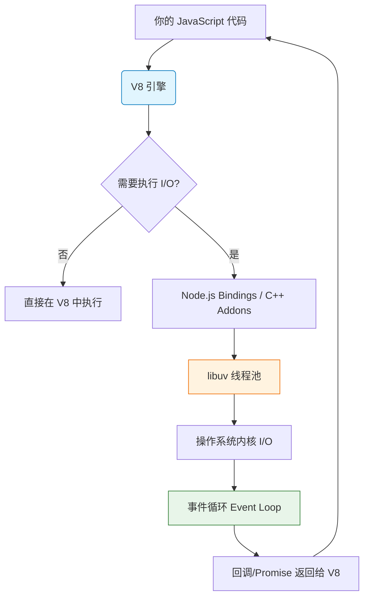
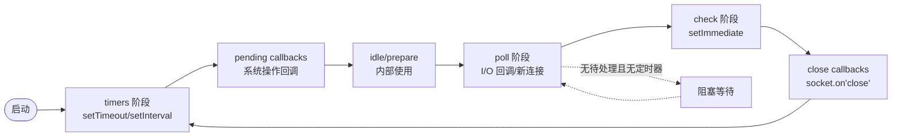
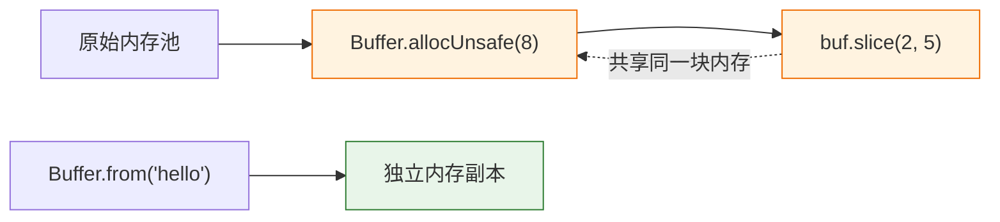
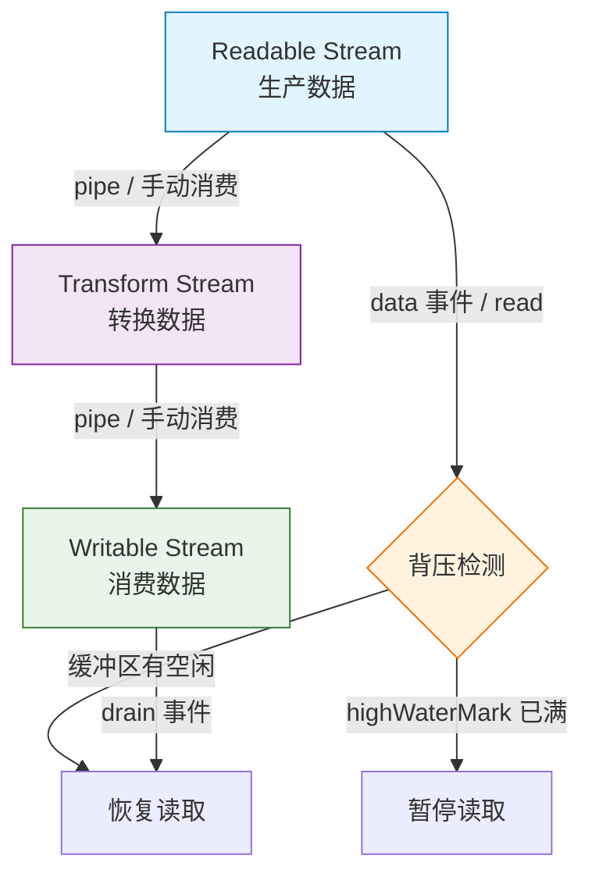
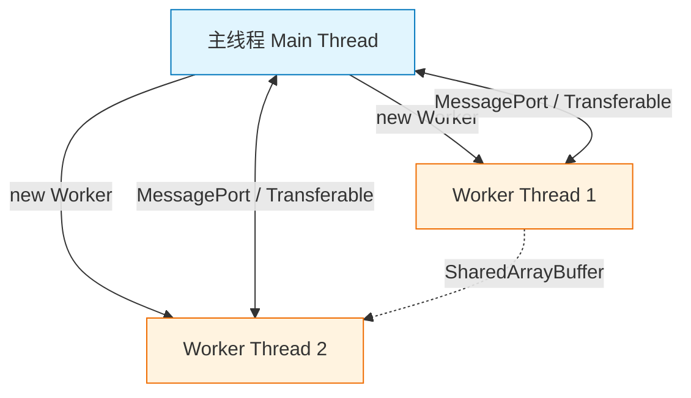
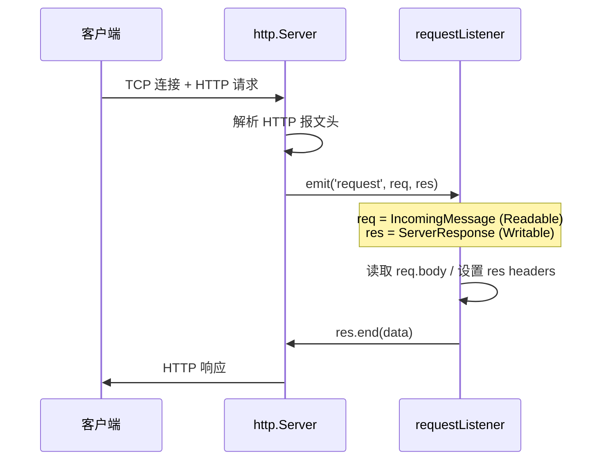
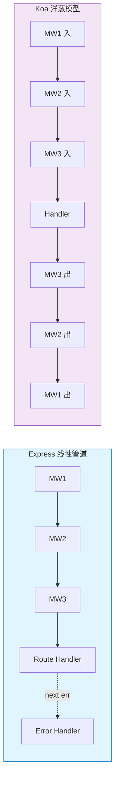
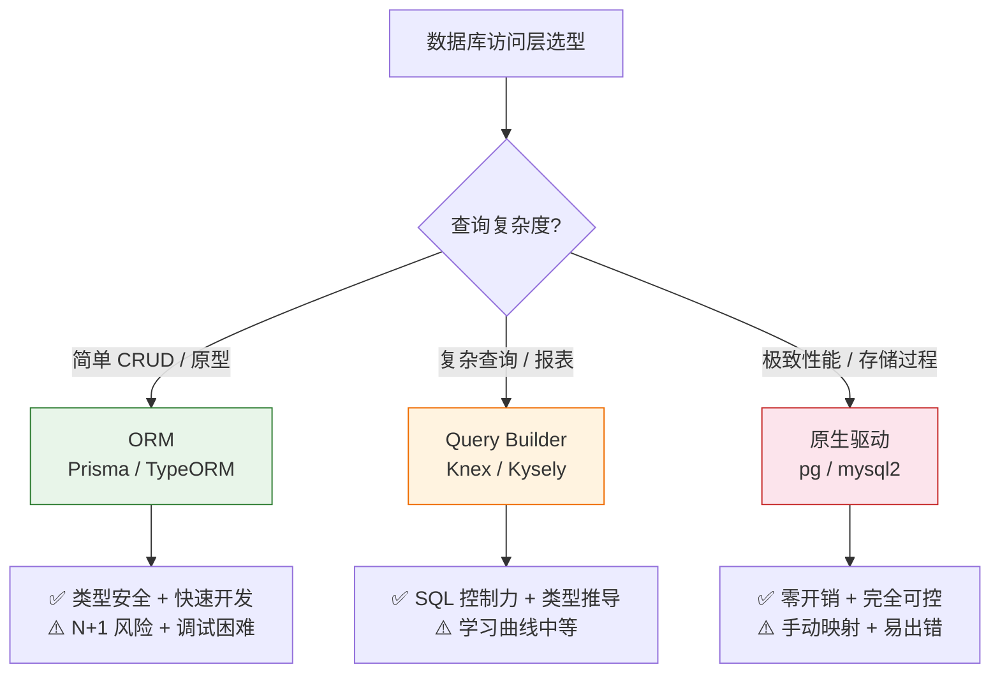
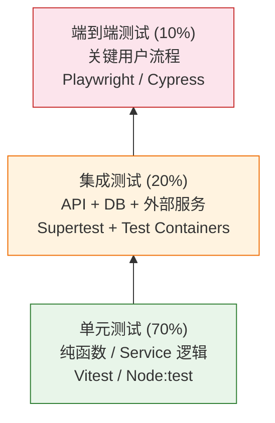

> > 推荐[[Node.js]]与[[TypeScript]]同步学习。TS 的类型系统在后端的价值（API 契约、数据库映射、配置校验）只有在 Node 上下文中才能体会。脱离 Node 学 TS 会变成"类型体操训练"，与实际工程脱节。
### 一、核心基础与异步模型

对于已有 JavaScript 基础的开发者而言，学习 Node.js 的首要任务并非学习新语法，而是**重塑对运行时环境的认知**。浏览器中的 JS 侧重于 DOM 操作与用户交互，而 Node.js 则侧重于 I/O 密集型任务、文件系统操作与服务端逻辑。本阶段将重点剖析 Node.js 的底层运行机制，这是后续所有高级特性的基石。

#### 1.1 Node.js 架构概览：不只是 V8

很多初学者误以为 Node.js = V8 引擎，这并不准确。V8 仅负责解析和执行 JavaScript 代码，而 Node.js 是一个完整的运行时环境。



> **💡 核心概念解释**
> 
> - **V8 Engine**: Google 开源的 JS 引擎，负责编译和执行 JS 代码，管理堆内存和垃圾回收。它本身**不具备**文件读写、网络通信等能力。
> - **libuv**: 一个跨平台的异步 I/O 库，是 Node.js 的"心脏"。它提供了事件循环（Event Loop）、线程池（Thread Pool）以及文件系统、DNS、网络等底层操作的统一抽象。
> - **Bindings**: C++ 编写的绑定层，充当 V8 与 libuv/OS 之间的桥梁，将 JS 调用翻译为底层系统调用。

**背景知识补充**：Node.js 的单线程指的是 **JavaScript 主线程** 是单线程的，但底层的 I/O 操作是由 libuv 管理的多线程或 OS 原生异步机制完成的。这就是为什么 Node.js 能在保持 JS 单线程编程模型的同时，实现高并发 I/O。

#### 1.2 事件循环（Event Loop）深度解析

这是 Node.js 最核心也最容易产生误解的知识点。浏览器的事件循环遵循 HTML Living Standard，而 Node.js 基于 libuv 实现了自己的六阶段循环模型。



**各阶段详解：**

|阶段|职责|关键 API|注意事项|
|:--|:--|:--|:--|
|**timers**|执行到期的 `setTimeout` / `setInterval` 回调|`setTimeout`, `setInterval`|受 poll 阶段耗时影响，不保证精确时间|
|**pending callbacks**|执行延迟到下一轮循环的系统操作回调|TCP 错误、部分系统操作|如 `ECONNREFUSED` 等|
|**idle/prepare**|仅供 libuv 内部使用|-|开发者无需关注|
|**poll**|检索新的 I/O 事件；执行 I/O 相关回调|`fs.readFile`, `net.request`|**核心阶段**，无任务时可能阻塞等待|
|**check**|执行 `setImmediate` 回调|`setImmediate`|poll 阶段结束后立即进入|
|**close callbacks**|执行关闭事件的回调|`socket.on('close')`|资源清理的最后机会|

> **⚠️ 常见误区澄清**
> 
> - **`process.nextTick()` 不属于事件循环的任何阶段**。它的回调会在当前操作完成后、进入下一个事件循环阶段**之前**立即执行，优先级高于所有微任务（microtask）。
> - **微任务队列**（Promise.then、queueMicrotask）在每个阶段切换时都会被清空，而不是只在某一特定阶段执行。
> - `setTimeout(fn, 0)` 与 `setImmediate(fn)` 的执行顺序在非 I/O 上下文中是**不确定**的，但在 I/O 回调中 `setImmediate` 总是先于 `setTimeout`。

#### 1.3 模块系统：CJS 与 ESM 共存

Node.js 目前处于 CommonJS 与 ES Modules 双轨并行的过渡期，理解两者的差异至关重要。

|特性|CommonJS (CJS)|ES Modules (ESM)|
|:--|:--|:--|
|加载方式|同步、运行时加载|异步、静态分析|
|导出|`module.exports` / `exports`|`export` / `export default`|
|导入|`require()`|`import`|
|this 指向|模块顶层 `this === module.exports`|模块顶层 `this === undefined`|
|缓存|`require.cache` 对象引用缓存|独立的模块记录，不可变绑定|
|文件标识|`.js` 默认 CJS（除非 package.json 指定 type:module）|`.mjs` 或 package.json `"type": "module"`|

**🔍 深入理解 CJS 缓存机制：**  
`require()` 返回的是 `module.exports` 对象的**引用**。这意味着如果模块导出了一个可变对象，多个文件 require 该模块后修改它，所有引用方都会看到变化。这在某些场景下可用于共享状态，但也可能导致难以追踪的副作用。

```javascript
// config.js (CJS)
module.exports = { debug: false };

// a.js
const config = require('./config');
config.debug = true; // ⚠️ 这会影响到 b.js 中的 config

// b.js  
const config = require('./config');
console.log(config.debug); // true，而非初始值 false
```

> **💡 实践建议**
> 
> - 新项目优先使用 ESM，它是 JavaScript 标准且支持 Tree Shaking。
> - 在 ESM 中使用 `import.meta.url` + `fileURLToPath` 替代 CJS 的 `__dirname` / `__filename`。
> - 混合使用时，ESM 可以 `import` CJS 模块，但 CJS **不能** `require()` ESM 模块（需使用动态 `import()`）。

#### 1.4 核心内置模块速览

以下模块是 Node.js 开发的基石，建议在此阶段至少动手实践每个模块的基本用法：

- **`path`**: 跨平台路径处理。**永远不要手动拼接路径字符串**，使用 `path.join()` / `path.resolve()`。注意 `join` 与 `resolve` 的区别：`resolve` 会解析为绝对路径，`join` 仅做拼接。
- **`fs` / `fs/promises`**: 文件系统操作。**强烈推荐使用 `fs/promises` 的 Promise API**，避免回调地狱。了解 `readFile` vs `createReadStream` 的内存差异。
- **`events`**: EventEmitter 是 Node.js 异步架构的核心模式。理解 `on`、`once`、`emit`、`removeListener`，以及**内存泄漏风险**（未移除的监听器累积）。
- **`process`**: 进程信息与控制。掌握 `process.env`、`process.argv`、`process.exit()`、`process.hrtime.bigint()`（高精度计时），以及 `uncaughtException` / `unhandledRejection` 的正确处理方式。
- **`buffer`**: 二进制数据处理的基础。理解 Buffer 与字符串的编码转换、`Buffer.alloc()` vs `Buffer.allocUnsafe()` 的安全差异。

> **📌 阶段学习目标自检**  
> 完成本阶段后，你应该能够：
> 
> 1. 清晰描述 Node.js 事件循环的六个阶段及其执行顺序
> 2. 解释 `process.nextTick`、微任务、宏任务的优先级关系
> 3. 在项目中正确选择并使用 CJS 或 ESM
> 4. 使用 `fs/promises` 和 `path` 完成跨平台文件操作
> 5. 识别并避免 EventEmitter 的内存泄漏问题

### 二、异步编程进阶与流处理

在掌握了 Node.js 的事件循环与模块系统后，本阶段将聚焦于**高性能数据处理**。许多开发者能写出"正确"的 Node.js 代码，却写不出"高效"的代码——瓶颈往往在于对 Buffer、Stream 和并发模型的理解不足。本阶段内容是从"能用"到"好用"的关键跨越。

#### 2.1 Buffer：二进制数据的基石

JavaScript 原生缺乏高效的二进制数据处理能力，`Buffer` 是 Node.js 为弥补这一缺陷而引入的全局类。它本质上是一段**固定大小的原始内存分配**（V8 堆外内存），不涉及 GC。

> **💡 为什么需要 Buffer？**  
> 网络传输、文件读写、加密运算等底层操作都以字节流为单位。若用 JS 字符串或数组处理，不仅编码转换开销巨大，还会频繁触发 GC。Buffer 提供了零拷贝（zero-copy）语义和直接的内存操作能力，是 Stream 的底层数据载体。

**关键 API 与安全注意事项：**

|方法|说明|⚠️ 安全提示|
|:--|:--|:--|
|`Buffer.alloc(size)`|分配指定大小并**填充零**的 Buffer|✅ 推荐默认使用|
|`Buffer.allocUnsafe(size)`|分配指定大小但**不初始化**的 Buffer|❌ 可能包含旧内存数据，仅在高确信会完全覆写时使用|
|`Buffer.from(data)`|从字符串/数组/ArrayBuffer 创建副本|✅ 安全，不会共享内存|
|`buf.slice()`|返回与原 Buffer **共享内存**的子视图|⚠️ 修改切片会影响原 Buffer|
|`buf.subarray()`|同 slice，但语义更明确（Node 16+推荐）|⚠️ 同上，注意共享内存副作用|



> **⚠️ 常见陷阱**
> 
> - `allocUnsafe` 的性能优势来自跳过初始化，但若未完全写入就读取，可能泄露敏感内存数据（如密码、密钥残留）。
> - `slice/subarray` 创建的视图与原 Buffer 共享内存，这在传递数据给第三方库时极易引发隐蔽 bug。如需独立副本，请使用 `Buffer.from(existingBuffer)`。
> - Buffer 大小上限受 V8 限制（64位系统约 2GB），超大二进制数据应使用 Stream 分块处理。

#### 2.2 Stream：流式数据处理范式

Stream 是 Node.js 处理大数据的核心抽象。其本质是**基于 EventEmitter 的增量数据处理管道**，核心价值在于：**无需将整个数据集载入内存**。



**四种流类型速查：**

|类型|用途|典型示例|核心方法|
|:--|:--|:--|:--|
|Readable|数据源|`fs.createReadStream`, HTTP req|`.read()`, `.pipe()`, `'data'` 事件|
|Writable|数据目的地|`fs.createWriteStream`, HTTP res|`.write()`, `.end()`, `'drain'` 事件|
|Duplex|双向读写|TCP Socket, TLS|同时具备 Readable + Writable 接口|
|Transform|中间转换|zlib, crypto cipher|`_transform(chunk, enc, cb)`|

**🔑 背压（Backpressure）机制详解**

背压是 Stream 最容易被忽视却最重要的概念。当 Writable 的消费速度慢于 Readable 的生产速度时，若不加以控制，中间缓冲区将持续膨胀直至 OOM。

- **自动背压**：使用 `.pipe()` 时，Node.js 自动处理背压，**这是推荐方式**。
- **手动背压**：当不使用 pipe 时，必须检查 `writable.write()` 的返回值。返回 `false` 表示缓冲区已满，应暂停上游读取，直到 `'drain'` 事件触发。

```javascript
// ❌ 错误示范：忽略背压，大文件场景必然 OOM
readable.on('data', (chunk) => {
  writable.write(chunk); // 返回值被忽略！
});

// ✅ 正确示范：手动背压控制
readable.on('data', (chunk) => {
  if (!writable.write(chunk)) {
    readable.pause();
  }
});
writable.on('drain', () => {
  readable.resume();
});

// ✅✅ 最佳实践：直接用 pipe
readable.pipe(writable);
```

> **💡 Object Mode**  
> 默认 Stream 处理 Buffer/String。设置 `{ objectMode: true }` 后可传递任意 JS 对象，此时 `highWaterMark` 单位为**对象个数**而非字节数。常用于 JSON 行解析、数据库游标等场景。

#### 2.3 Worker Threads：突破 CPU 瓶颈

Node.js 主线程不适合 CPU 密集型任务（图像处理、加密计算、复杂排序等），这类任务会阻塞事件循环。`worker_threads` 提供了真正的多线程并行能力。



**Worker vs Child Process 对比：**

|维度|Worker Threads|Child Process (`fork`)|
|:--|:--|:--|
|内存|可共享 `SharedArrayBuffer`|独立 V8 实例，内存隔离|
|通信开销|低（Transferable Objects 零拷贝）|高（序列化/反序列化 IPC）|
|启动成本|轻量|重量级（新进程）|
|适用场景|CPU 密集计算、共享内存算法|独立服务、不同运行时、故障隔离|
|崩溃影响|仅该 Worker 终止|子进程独立，不影响主进程|

> **⚠️ 重要提醒**
> 
> - Worker Threads **不会加速 I/O 操作**，I/O 已由 libuv 异步处理。它只解决 CPU 瓶颈。
> - 传递大型 ArrayBuffer 时务必使用 **Transferable Objects**（`transferList` 参数），否则会发生完整拷贝，抵消多线程收益。
> - 生产环境建议使用 **Worker Pool**（如 `piscina`、`workerpool`），避免频繁创建/销毁 Worker 的开销。

#### 2.4 异步模式演进与最佳实践

|模式|时代|问题|现状|
|:--|:--|:--|:--|
|Callback|Node 0.x|回调地狱、错误处理分散|仅兼容旧 API|
|Promise|Node 4+|链式调用改善可读性|基础异步单元|
|async/await|Node 8+|同步风格编写异步代码|✅ **当前标准**|
|Async Iterators|Node 10+|流式异步数据消费|✅ Stream 的现代替代|

**Async Iterator 消费 Stream（现代写法）：**

```javascript
// ✅ 替代传统的 data/end/error 事件监听
async function processFile(filepath) {
  const stream = fs.createReadStream(filepath, { encoding: 'utf8' });
  try {
    for await (const chunk of stream) {
      // 自动处理背压、错误和结束
      await handleChunk(chunk);
    }
  } catch (err) {
    // 统一错误捕获，包括流错误和处理错误
    console.error('Processing failed:', err);
  }
  // 流在循环退出后自动销毁，无需手动 cleanup
}
```

> **📌 阶段学习目标自检**  
> 完成本阶段后，你应该能够：
> 
> 1. 区分 `alloc` 与 `allocUnsafe` 的安全边界，理解 Buffer 共享内存语义
> 2. 解释背压原理并在手动消费 Stream 时正确处理
> 3. 使用 `for await...of` 优雅地消费可读流
> 4. 判断何时使用 Worker Threads 而非 Child Process
> 5. 在实际项目中选择正确的异步模式并避免反模式

### 三、Web 服务开发与框架实践

掌握了底层异步模型与流处理后，本阶段将视角上移至 **Web 服务层**。Node.js 的 Web 生态极其丰富，但"会用框架"与"理解框架"之间存在巨大鸿沟。本阶段不仅涵盖主流框架的使用，更深入剖析 HTTP 协议在 Node.js 中的实现、中间件模式的本质，以及不同框架的设计哲学差异，帮助读者在技术选型时做出理性判断。

#### 3.1 Node.js 原生 HTTP 模块：一切的起点

所有 Node.js Web 框架都构建在 `node:http` 模块之上。理解原生 API 是读懂任何框架源码的前提。



**核心对象本质：**

|对象|继承自|关键特性|常见误区|
|:--|:--|:--|:--|
|`IncomingMessage`|Readable Stream|请求体需手动拼接/流式消费；headers 已解析为对象|❌ 不能直接 `await req.body`，需自行收集或借助工具|
|`ServerResponse`|Writable Stream|支持分块传输（chunked）；header 必须在首次 write 前设置|❌ `res.write()` 后不能再 `setHeader()`|
|`http.Server`|EventEmitter|`'request'`、`'connection'`、`'upgrade'` 等事件|`'connection'` 事件在 TCP 层触发，早于 HTTP 解析|

> **💡 为什么原生 HTTP 不够用？**
> 
> - **无路由系统**：所有请求进入同一个 listener，需手动解析 URL/method。
> - **无中间件机制**：认证、日志、错误处理等横切关注点难以组合。
> - **无内容协商**：JSON 序列化、表单解析、文件上传均需手动实现。
> - **无安全防护**：缺少 CSRF、CORS、Rate Limiting 等内置支持。
> 
> 这正是框架存在的意义——**不是替代原生能力，而是在其上提供可组合的抽象层**。

#### 3.2 三大主流框架设计哲学对比

|维度|Express|Koa|Fastify|
|:--|:--|:--|:--|
|**核心理念**|极简、灵活、社区驱动|洋葱模型、async-first|高性能、Schema 驱动、插件体系|
|**中间件模型**|线性管道（next()）|洋葱模型（async/await）|封装链 + Hooks|
|**性能定位**|通用型，够用即可|轻量级，优于 Express|极致性能，接近原生|
|**TypeScript**|第三方类型定义|原生 TS 编写|原生 TS + Schema 推导|
|**适用场景**|快速原型、中小型项目|定制化强的中间件密集型应用|高并发 API、微服务、Schema 验证严格的项目|
|**学习曲线**|⭐⭐ 低|⭐⭐⭐ 中|⭐⭐⭐⭐ 中高|

**🔑 中间件模型可视化对比：**



> **💡 洋葱模型的真正价值**  
> Koa 的洋葱模型不仅是执行顺序的差异，更是**响应处理能力的根本提升**。在 Express 中，中间件在调用 `next()` 后就失去了对响应的控制权；而在 Koa 中，`await next()` 之后的代码可以在下游处理完成后**继续修改响应**（如添加耗时统计头、统一包装响应格式、后置日志记录）。这使得横切关注点的实现更加自然和完整。

#### 3.3 中间件模式深度剖析

无论使用哪个框架，中间件都是 Node.js Web 开发的核心抽象。理解其本质有助于编写高质量、可复用的逻辑。

**中间件的三大职责边界：**

1. **前置处理**：鉴权、参数校验、请求日志、CORS 头设置
2. **核心业务委托**：通过 `next()` / `await next()` 将控制权交给下游
3. **后置处理**：响应格式化、耗时统计、错误捕获、清理资源

**⚠️ 中间件开发反模式：**

|反模式|问题|正确做法|
|:--|:--|:--|
|中间件中执行业务逻辑|违反单一职责，难以测试复用|业务逻辑抽离为独立 service，中间件仅做编排|
|忘记调用 next()|请求挂起直至超时|确保所有分支都调用 next() 或发送响应|
|在 next() 后不 catch|下游错误未被捕获导致未处理拒绝|Koa 用 try/catch 包裹 await next()；Express 用 error handler|
|修改全局状态|并发请求间数据污染|使用 `ctx` / `req.locals` 等请求级上下文|
|同步阻塞操作|阻塞整个事件循环|所有 I/O 必须异步，CPU 密集任务移交 Worker|

#### 3.4 生产级 Web 服务必备要素

框架只提供骨架，生产环境还需要以下关键能力：

- **输入验证与序列化**：永远不要信任客户端输入。推荐使用 Schema 验证（Zod / JSON Schema / TypeBox），Fastify 内置 Ajv 可获得显著性能优势。
- **结构化日志**：`console.log` 不适合生产。使用 Pino / Winston 输出 JSON 格式日志，配合请求 ID 实现全链路追踪。
- **优雅关闭（Graceful Shutdown）**：捕获 `SIGTERM` / `SIGINT`，停止接收新请求，等待进行中的请求完成后再退出。防止部署期间请求中断。
- **安全加固**：Helmet（HTTP 安全头）、Rate Limiting、CORS 白名单、SQL 注入防护。安全不是事后补丁，而是架构的一部分。
- **配置管理**：环境变量 + 配置文件分层。敏感信息绝不硬编码，使用 dotenv / convict / envalid 等工具管理。

> **📌 阶段学习目标自检**  
> 完成本阶段后，你应该能够：
> 
> 1. 解释原生 `http.createServer` 的请求处理流程及 req/res 的流本质
> 2. 对比 Express/Koa/Fastify 的设计哲学并根据项目需求合理选型
> 3. 编写符合职责边界的中间件，避免常见反模式
> 4. 为 Web 服务配置结构化日志、输入验证、优雅关闭和安全加固
> 5. 阅读任意主流框架的路由/中间件源码并理解其实现原理

### 四、数据库、测试与工程化

当 Web 服务开发能力成熟后，真正的挑战转向**数据持久化、质量保障与生产运维**。本阶段将帮助读者跨越"能跑"到"可靠"的鸿沟，涵盖数据库选型与 ORM 实践、多层次测试策略、以及 Node.js 特有的生产环境工程化要点。这些知识决定了项目能否长期稳定演进。

#### 4.1 数据库驱动与 ORM 选型策略

Node.js 生态中数据库工具链极为丰富，但"过度抽象"和"抽象不足"同样危险。选型应基于团队规模、查询复杂度和性能要求综合判断。



**主流工具对比与适用场景：**

|工具|类型|TypeScript 支持|性能|最佳场景|
|:--|:--|:--|:--|:--|
|**Prisma**|ORM|⭐⭐⭐⭐⭐ 自动生成|中（Rust 引擎有序列化开销）|中小项目、全栈 TS、快速迭代|
|**TypeORM**|ORM|⭐⭐⭐⭐ 装饰器模式|中|企业级应用、DDD 风格、已有 Java/Hibernate 经验团队|
|**Kysely**|Query Builder|⭐⭐⭐⭐⭐ 类型推导极强|高（薄封装）|复杂查询为主、需要 SQL 控制力又不想放弃类型安全|
|**Knex**|Query Builder|⭐⭐⭐ 需额外类型包|高|迁移管理、多数据库兼容、老项目维护|
|**pg / mysql2**|Native Driver|⭐⭐ 手动定义|最高|微服务、高频写入、DBA 主导的项目|

> **⚠️ ORM 使用核心警示**
> 
> - **N+1 查询是 ORM 头号性能杀手**：务必使用 `include` / `join` / `batch` 等机制预加载关联数据，并开启查询日志监控。
> - **不要盲目信任 Migration 自动生成**：生产环境的 schema 变更必须人工审查，尤其是大表 ALTER 操作。
> - **连接池配置至关重要**：Node.js 单进程模型下，连接数 = 进程数 × 每进程连接数。过多连接会压垮数据库，过少则浪费 I/O 等待。推荐公式：`connections = (core_count * 2) + effective_spindle_count`（SSD 场景可简化为 CPU 核数 × 2~4）。
> - **ORM 不是银弹**：当发现自己在 ORM 中写大量 raw SQL 绕过抽象时，说明该换 Query Builder 或原生驱动了。

#### 4.2 多层次测试策略

Node.js 的异步特性使测试比浏览器端更复杂。有效的测试策略应遵循**测试金字塔**原则，而非追求单一类型的覆盖率。



**各层测试要点：**

- **单元测试**：测试纯业务逻辑，Mock 所有外部依赖（DB、HTTP、文件系统）。推荐使用 **Vitest**（兼容 Jest API + 原生 ESM + 极速）或 Node.js 内置 `node:test`（零依赖）。避免过度 Mock 导致测试与实际行为脱节。
- **集成测试**：验证模块间协作。**真实数据库优于内存数据库**（SQLite ≠ PostgreSQL 行为）。推荐使用 **Testcontainers** 启动临时 Docker 容器，确保测试环境与生产一致。使用 `supertest` 测试 HTTP 端点时，注意测试间的数据库隔离（事务回滚或独立 schema）。
- **端到端测试**：仅覆盖核心业务流程（注册、支付、关键 CRUD）。成本高、速度慢，不应作为主要质量防线。

> **💡 Node.js 测试特殊注意事项**
> 
> - **异步断言必须 await**：忘记 `await expect(...).resolves/rejects` 会导致假阳性（测试通过但实际未执行断言）。
> - **定时器与事件循环**：使用 `vi.useFakeTimers()` / `sinon.useFakeTimers()` 控制时间，避免测试依赖真实延迟。
> - **全局状态污染**：每个测试用例必须独立。环境变量、单例缓存、全局事件监听器都需在 `beforeEach/afterEach` 中重置。
> - **并行测试的数据库冲突**：若启用并行测试，每个 worker 需使用独立数据库实例或 schema，否则数据竞争会导致随机失败。

#### 4.3 生产环境工程化要点

代码写完只是开始，生产环境的稳定性取决于工程化基础设施。

**🔧 关键运维能力清单：**

|能力|工具/方案|为什么重要|
|:--|:--|:--|
|**进程管理**|PM2 / systemd / Docker|崩溃自动重启、集群模式、日志轮转、零停机部署|
|**结构化日志**|Pino + pino-pretty(开发)|JSON 格式便于 ELK/Loki 采集；请求 ID 贯穿调用链|
|**健康检查**|`/health` + `/ready`|K8s/Docker 探针；区分"存活"与"就绪"，避免流量打到未初始化实例|
|**优雅关闭**|SIGTERM handler + drain|防止部署/缩容期间请求中断；等待活跃连接完成后再退出|
|**配置管理**|envalid / convict|启动时校验必填配置；类型安全；敏感信息与代码分离|
|**性能监控**|Clinic.js / OpenTelemetry|定位事件循环阻塞、内存泄漏、慢查询；APM 全链路追踪|
|**安全加固**|Helmet + CSP + Rate Limit|防御常见 Web 攻击；最小权限原则；依赖审计 (`npm audit`)|

**🔍 优雅关闭实现模板：**

```javascript
// 生产级优雅关闭核心逻辑
const server = app.listen(PORT);
let isShuttingDown = false;

async function gracefulShutdown(signal) {
  if (isShuttingDown) return;
  isShuttingDown = true;
  
  console.log(`${signal} received. Starting graceful shutdown...`);
  
  // 1. 停止接收新请求
  server.close(async () => {
    // 2. 等待进行中的请求完成（设置超时兜底）
    await Promise.race([
      waitForActiveRequests(),
      new Promise(resolve => setTimeout(resolve, 30_000))
    ]);
    
    // 3. 关闭数据库连接、消息队列等资源
    await db.disconnect();
    await redis.quit();
    
    console.log('Graceful shutdown complete.');
    process.exit(0);
  });
  
  // 强制退出兜底
  setTimeout(() => {
    console.error('Forced shutdown after timeout.');
    process.exit(1);
  }, 35_000);
}

process.on('SIGTERM', () => gracefulShutdown('SIGTERM'));
process.on('SIGINT', () => gracefulShutdown('SIGINT'));
```

> **💡 背景知识：为什么 Node.js 需要特别的关闭处理？**  
> 不同于 Java/Go 等语言，Node.js 进程不会自动等待活跃连接完成。`server.close()` 仅停止接受新连接，但**已建立的 keep-alive 连接不会自动断开**。若不主动处理，部署期间客户端会收到连接重置错误。这是 Node.js 生产事故的高发区。

#### 4.4 性能诊断工具箱

当服务出现延迟或内存问题时，需要系统化的诊断方法而非猜测。

- **Clinic.js**：Node.js 官方推荐的诊断套件。`clinic doctor` 检测事件循环阻塞；`clinic flame` 生成火焰图定位 CPU 热点；`clinic bubbleprof` 可视化异步操作延迟。
- **Node.js Profiler**：`--prof` 标志生成 V8 性能日志，配合 `node --prof-process` 分析。适合生产环境低开销采样。
- **heapdump / memwatch-next**：内存快照对比分析泄漏。注意：堆快照本身会暂停事件循环，生产环境慎用。
- **Event Loop Lag**：通过 `perf_hooks.monitorEventLoopDelay()` 实时监控事件循环延迟，是判断 Node.js 是否过载的最直接指标。

> **📌 阶段学习目标自检**  
> 完成本阶段后，你应该能够：
> 
> 1. 根据项目特征选择合适的数据库访问层并规避 ORM 陷阱
> 2. 设计并实施符合测试金字塔的多层次测试策略
> 3. 为 Node.js 服务配置完整的优雅关闭、健康检查和结构化日志
> 4. 使用 Clinic.js 等工具诊断 CPU/内存/事件循环问题
> 5. 解释连接池、N+1、背压在数据库交互中的影响及解决方案

### 五、练习

前四个阶段构建了从底层原理到生产工程的完整知识体系。本阶段不再引入新概念，而是通过**分层递进的实战练习**将知识内化为肌肉记忆。每个练习都明确标注了对应的知识模块，并附带验收标准与常见陷阱提示，确保练习不是"照着抄代码"，而是真正的能力检验。

#### 5.1 基础层：事件循环与异步模型验证

> **🎯 对应知识**：1.2 事件循环、1.3 模块系统、2.4 异步模式  
> **⏱️ 预计耗时**：2-3 小时

**练习内容：**

1. **执行顺序预测器**：编写一段包含 `setTimeout`、`setImmediate`、`process.nextTick`、`Promise.then`、`fs.readFile` 回调的混合代码，先手写出预期执行顺序，再运行验证。反复调整组合直到能 100% 准确预测。
2. **CJS/ESM 互操作实验**：创建一个 CJS 模块导出可变对象，在 ESM 中 import 并修改；再反向尝试 CJS require ESM 模块。记录每种组合的行为差异与报错信息。
3. **手写 EventEmitter**：实现一个支持 `on`、`once`、`off`、`emit` 的简化版 EventEmitter，要求正确处理同一事件多个监听器的删除安全性（避免遍历时索引偏移）。

**✅ 验收标准：**

- 能不运行代码准确判断任意异步组合的执行顺序
- 能清晰解释 CJS/ESM 互操作的所有限制及 workaround
- 手写的 EventEmitter 通过边界测试（emit 期间 off、once 触发后自动移除）

> **⚠️ 常见陷阱**
> 
> - `setTimeout(fn, 0)` 与 `setImmediate` 在主模块顶层的执行顺序不确定，但在 I/O 回调中确定。很多教程只讲后者，导致认知盲区。
> - 手写 EventEmitter 时，`emit` 过程中调用 `off` 是高频 bug 来源，需复制监听器数组后再遍历。

> [!success]- 点击展开题解
> 
> ## 📘 5.1 基础层：事件循环与异步模型验证 · 题解
> 
> 本练习是深入理解 Node.js 运行时核心机制的“基本功”。很多开发者在使用 Node.js 多年后，依然会在复杂的异步时序或模块互操作上踩坑。本题旨在通过**预测-验证-实现**的闭环，将隐式的运行时行为转化为显式的认知模型。
> 
> ---
> 
> ### 1️⃣ 执行顺序预测器：破解事件循环的时序密码
> 
> #### 💡 核心概念解析
> 
> Node.js 的事件循环（Event Loop）并非一个简单的队列，而是由多个**阶段（Phase）**组成的有序环。理解执行顺序的关键在于区分 **Microtask（微任务）** 和 **Macrotask（宏任务/阶段任务）** 的优先级。
> 
> ```mermaid
> graph TD
>     A[脚本同步代码] --> B{检查 Microtask 队列}
>     B -- 有任务 --> C[清空 process.nextTick 队列]
>     C --> D[清空 Promise.then 队列]
>     D --> B
>     B -- 无任务 --> E[Timers 阶段<br/>setTimeout/setInterval]
>     E --> F{检查 Microtask}
>     F --> G[Pending Callbacks 阶段<br/>系统操作回调]
>     G --> H{检查 Microtask}
>     H --> I[Idle/Prepare 阶段]
>     I --> J[Poll 阶段<br/>I/O 回调, fs.readFile]
>     J --> K{检查 Microtask}
>     K --> L[Check 阶段<br/>setImmediate]
>     L --> M{检查 Microtask}
>     M --> N[Close Callbacks 阶段<br/>socket.on close]
>     N --> B
>     
>     style C fill:#ffcccc,stroke:#333
>     style D fill:#ffcccc,stroke:#333
>     style E fill:#cce5ff,stroke:#333
>     style J fill:#cce5ff,stroke:#333
>     style L fill:#cce5ff,stroke:#333
> ```
> 
> > **🔑 关键规则记忆口诀：**
> > 
> > 1. **同步优先**：所有同步代码最先执行。
> > 2. **微任务插队**：每个阶段切换前（以及同步代码结束后），**必须**清空微任务队列。
> > 3. **nextTick > Promise**：在微任务队列内部，`process.nextTick` 永远优先于 `Promise.then`。
> > 4. **顶层不确定性**：在主模块顶层（非 I/O 回调内），`setTimeout(fn, 0)` 和 `setImmediate` 的顺序取决于系统性能（Timer 是否到期）。但在 **I/O 回调内部**，`setImmediate` 永远先于 `setTimeout`。
> 
> #### 🧪 验证代码模板
> 
> 建议读者使用以下代码作为“测试床”，反复注释/取消注释来观察行为：
> 
> ```javascript
> const fs = require('fs');
> 
> console.log('1. 同步开始');
> 
> setTimeout(() => console.log('5. setTimeout'), 0);
> setImmediate(() => console.log('6. setImmediate'));
> 
> process.nextTick(() => console.log('3. nextTick'));
> Promise.resolve().then(() => console.log('4. Promise.then'));
> 
> fs.readFile(__filename, () => {
>     console.log('7. I/O 回调 (fs.readFile)');
>     setTimeout(() => console.log('9. I/O 内的 setTimeout'), 0);
>     setImmediate(() => console.log('8. I/O 内的 setImmediate'));
> });
> 
> console.log('2. 同步结束');
> ```
> 
> **预期输出分析：**
> 
> - `1, 2`：同步代码。
> - `3, 4`：同步代码后的微任务检查点（nextTick 优先）。
> - `5, 6` 或 `6, 5`：进入 Timers 或 Check 阶段（顶层顺序不确定）。
> - `7`：Poll 阶段的 I/O 回调。
> - `8, 9`：**注意！** 在 I/O 回调中，微任务检查点后进入 Check 阶段（setImmediate），然后才是下一轮 Timers 阶段。所以 `8` 一定在 `9` 之前。
> 
> ---
> 
> ### 2️⃣ CJS/ESM 互操作实验：跨越模块体系的鸿沟
> 
> #### ⚠️ 背景知识
> 
> Node.js 同时支持 CommonJS (CJS) 和 ES Modules (ESM)，但两者在设计哲学上有本质区别：
> 
> - **CJS**：运行时加载，值是**拷贝**（基本类型）或**引用**（对象），导出是动态的。
> - **ESM**：编译时静态分析，值是**只读绑定（Live Binding）**，导入方能看到导出方的实时变化。
> 
> #### 🔬 互操作矩阵
> 
> |场景|行为|注意事项 / Workaround|
> |:--|:--|:--|
> |**ESM import CJS**|✅ 支持。CJS 的 `module.exports` 变为 ESM 的 `default` 导出。|无法直接命名导入 CJS 的属性（除非 Node 能静态分析出结构）。修改 ESM 中的导入变量不会影响 CJS 原对象（因为是值拷贝语义）。|
> |**CJS require ESM**|⚠️ 受限。Node v22+ 已稳定支持 `require(esm)`，但旧版本需 `--experimental-require-module`。|ESM 必须是**同步可求值**的（不能有顶层 await）。若不支持，只能使用 `import()` 动态导入（返回 Promise）。|
> |**ESM 修改导入值**|❌ 报错。ESM 导入绑定是只读的。|若需共享可变状态，应导出一个**容器对象** `{ state: value }`，修改属性而非重新赋值。|
> |**CJS 修改 exports**|✅ 生效。但 ESM 侧若已解构导入则看不到更新。|ESM 侧应使用 `import mod from './cjs.js'; mod.prop = ...` 访问。|
> 
> > **💡 实践建议**：在新项目中尽量统一使用 ESM。若维护混合项目，将 CJS 视为“遗留层”，通过适配器模式封装为 ESM 友好的接口。
> 
> ---
> 
> ### 3️⃣ 手写 EventEmitter：安全遍历的艺术
> 
> #### 🐛 高频 Bug 根源
> 
> 在 `emit` 触发监听器的过程中，如果某个监听器调用了 `off` 移除自身或其他监听器，会导致数组长度变化、索引偏移，从而**跳过某些监听器**或**重复触发**。
> 
> #### ✅ 正确实现要点
> 
> 1. **emit 时复制数组**：`const listeners = [...this.events[event]]`，遍历副本而非原数组。
> 2. **once 的实现**：包装一个 wrapper 函数，执行后自动 `off`。wrapper 需保留原函数的引用以便外部手动 `off`。
> 3. **off 的安全性**：即使移除不存在的监听器也不应报错。
> 
> #### 💻 参考实现
> 
> ```javascript
> class SafeEventEmitter {
>   constructor() {
>     this.events = Object.create(null); // 避免原型链污染
>   }
> 
>   on(event, listener) {
>     (this.events[event] ||= []).push(listener);
>     return this;
>   }
> 
>   once(event, listener) {
>     const wrapper = (...args) => {
>       this.off(event, wrapper); // 移除 wrapper 而非原 listener
>       listener.apply(this, args);
>     };
>     wrapper._original = listener; // 标记原始函数，支持手动 off
>     return this.on(event, wrapper);
>   }
> 
>   off(event, listener) {
>     const list = this.events[event];
>     if (!list) return this;
>     
>     // 同时匹配原始函数和 wrapper
>     this.events[event] = list.filter(
>       fn => fn !== listener && fn._original !== listener
>     );
>     return this;
>   }
> 
>   emit(event, ...args) {
>     const list = this.events[event];
>     if (!list || list.length === 0) return false;
>     
>     // 🔑 关键：复制数组，确保遍历期间 off 操作安全
>     const snapshot = [...list];
>     for (const listener of snapshot) {
>       listener.apply(this, args);
>     }
>     return true;
>   }
> }
> ```
> 
> #### 🧪 边界测试用例
> 
> ```javascript
> const ee = new SafeEventEmitter();
> 
> // 测试1: emit 期间 off 自身
> ee.on('test', function a() {
>   console.log('a');
>   ee.off('test', a);
> });
> ee.on('test', () => console.log('b')); // 不应被跳过
> ee.emit('test'); // 期望输出: a, b
> 
> // 测试2: once 触发后自动移除
> ee.once('data', () => console.log('once'));
> ee.emit('data'); // once
> ee.emit('data'); // 无输出
> 
> // 测试3: 手动 off once 注册的监听器
> const handler = () => console.log('should not fire');
> ee.once('manual', handler);
> ee.off('manual', handler);
> ee.emit('manual'); // 无输出
> ```
> 
> ---
> 
> ### 📝 学习路径建议
> 
> 4. **不要死记硬背**：事件循环的顺序应通过理解“阶段设计意图”来推导，而非背诵列表。
> 5. **关注 Node.js 版本差异**：ESM/CJS 互操作在不同大版本间变化显著，实验时请注明 Node 版本（推荐 v20 LTS 或 v22）。
> 6. **从简到繁**：EventEmitter 先实现核心四方法，再考虑 `maxListeners` 警告、`error` 事件特殊处理等生产级特性。
> 7. **阅读源码**：Node.js 的 `lib/events.js` 是极佳的学习材料，其 `emit` 中的数组复制策略正是工业级实践的典范。
> 
> > **🎯 验收自查清单**
> > 
> > - [ ]  能画出完整事件循环阶段图并解释每个阶段的职责
> > - [ ]  能解释为何 `nextTick` 不属于事件循环阶段
> > - [ ]  能列举至少 3 种 CJS/ESM 互操作的陷阱及解决方案
> > - [ ]  手写 EventEmitter 通过了上述全部边界测试
> > - [ ]  能向他人清晰讲解“为什么 emit 时要复制监听器数组”

#### 5.2 数据层：Stream 与 Buffer 工程实践

> **🎯 对应知识**：2.1 Buffer、2.2 Stream、2.3 Worker Threads  
> **⏱️ 预计耗时**：4-6 小时

**练习内容：**

1. **大文件转换器**：实现一个 CLI 工具，读取任意大小的 CSV 文件（≥1GB），逐行解析、过滤、转换格式后写入新文件。内存占用不得超过 50MB。分别用 `pipe` 和 `for await...of` 两种方式实现并对比代码可读性与背压行为。
2. **Buffer 安全审计**：故意使用 `allocUnsafe` + `slice` 构造一个内存泄露/数据污染场景，然后用 `alloc` + `subarray` + `Buffer.from` 修复它。写出两种实现的内存行为差异说明。
3. **CPU 密集任务卸载**：实现一个图片缩略图生成服务，主线程处理 HTTP 请求，缩放逻辑放入 Worker Thread。使用 `piscina` 构建 Worker Pool，对比单线程 vs 4 Worker 的吞吐量。

**✅ 验收标准：**

- 1GB 文件处理内存稳定在 50MB 以下
- 能演示并解释 Buffer 共享内存导致的数据污染
- Worker Pool 版本吞吐量显著优于单线程（≥3x）

> **⚠️ 常见陷阱**
> 
> - `for await...of` 消费流时若循环体内有未 await 的异步操作，背压机制会失效。
> - Worker Thread 传递大 Buffer 未使用 transferList，性能反而劣于主线程。

> [!success]- 点击展开题解
> 
> ## 📘 5.2 数据层：Stream 与 Buffer 工程实践题解
> 
> 本练习聚焦 Node.js 处理大数据的核心能力。很多开发者在业务开发中习惯了“全量加载”模式，但在面对 GB 级文件或高并发 CPU 任务时，这种模式会导致内存溢出或服务阻塞。本题解将从**流式处理、内存安全、多线程并发**三个维度，提供可落地的工程实践指南。
> 
> ---
> 
> ### 1. 大文件转换器：Stream 的两种消费范式
> 
> #### 💡 核心概念：背压（Backpressure）
> 
> 在理解代码前，必须先掌握“背压”。当**读取速度 > 写入速度**时，如果中间没有缓冲控制，数据会在内存中无限堆积。背压机制就是下游向上游发出“暂停”信号，等处理完后再通知“继续”，从而将内存占用控制在 `highWaterMark`（默认 16KB~64KB）范围内。
> 
> ```mermaid
> graph LR
>     A[Read Stream] -->|data event / async iterator| B{Transform Logic}
>     B -->|write| C[Write Stream]
>     C -->|drain / return| B
>     B -->|pause / next| A
>     style B fill:#f9f,stroke:#333
> ```
> 
> #### 方式一：经典 Pipe 链（推荐生产环境）
> 
> `pipe` 是 Node.js 原生封装好的背压管道，代码简洁且自动处理错误传播。
> 
> ```javascript
> const fs = require('fs');
> const { Transform } = require('stream');
> const csvParse = require('csv-parse'); // 需 npm install csv-parse
> 
> const transformer = new Transform({
>   objectMode: true,
>   transform(chunk, encoding, callback) {
>     // chunk 已经是解析后的对象
>     if (chunk.status === 'active') {
>       this.push(JSON.stringify(chunk) + '\n');
>     }
>     callback(); // ⚠️ 必须调用，否则流会挂起
>   }
> });
> 
> fs.createReadStream('huge.csv')
>   .pipe(csvParse({ columns: true }))
>   .pipe(transformer)
>   .pipe(fs.createWriteStream('output.jsonl'))
>   .on('finish', () => console.log('Done'));
> ```
> 
> #### 方式二：for await...of（可读性更佳）
> 
> ES2018 引入的异步迭代器语法，让流处理看起来像同步代码。**但需注意陷阱**。
> 
> ```javascript
> async function processFile() {
>   const readStream = fs.createReadStream('huge.csv');
>   const writeStream = fs.createWriteStream('output.jsonl');
>   const parser = csvParse({ columns: true });
>   
>   // ✅ 正确：循环体内所有操作都是同步或已 await
>   for await (const record of readStream.pipe(parser)) {
>     if (record.status === 'active') {
>       // write 返回 false 时，异步迭代器内部会自动等待 drain
>       const ok = writeStream.write(JSON.stringify(record) + '\n');
>       if (!ok) await new Promise(r => writeStream.once('drain', r));
>     }
>   }
>   writeStream.end();
> }
> ```
> 
> > [!warning] ⚠️ 常见陷阱演示
> > 
> > ```javascript
> > // ❌ 错误：未 await 的异步操作导致背压失效！
> > for await (const record of stream) {
> >   // fetch/db.query 没有 await，循环不会等待它完成
> >   // 下一轮迭代立即开始，内存瞬间爆炸
> >   fetch('/api/log', { body: JSON.stringify(record) }); 
> > }
> > ```
> 
> #### 📊 对比总结
> 
> |维度|pipe|for await...of|
> |---|---|---|
> |背压安全性|✅ 自动处理|⚠️ 需手动检查 write 返回值|
> |代码可读性|中等（回调风格）|高（线性逻辑）|
> |错误处理|需逐段 `.on('error')`|可用 try/catch 统一捕获|
> |适用场景|纯数据转换管道|含复杂业务逻辑/条件分支|
> 
> ---
> 
> ### 2. Buffer 安全审计：共享内存的双刃剑
> 
> #### 💡 背景知识：Buffer 内存池
> 
> Node.js 为小 Buffer（<8KB）维护了一个预分配的 **Slab 内存池**。`allocUnsafe` 直接从这个池中切出一块**未清零**的内存，而 `slice` 返回的是对同一块物理内存的**引用视图**，不是副本。
> 
> ```mermaid
> graph TD
>     Pool["Slab 内存池 (8KB)"]
>     subgraph "危险操作"
>     A["allocUnsafe(100) → offset 0-99"]
>     B["slice(0,50) → 共享 offset 0-49"]
>     end
>     Pool --> A
>     A --> B
>     C["修改 B[0]=0xFF"] -.->|"污染!"| D["A[0] 也变为 0xFF"]
>     E["旧数据残留"] -.->|"泄露!"| F["B 读到上一个请求的敏感信息"]
> ```
> 
> #### 🔴 漏洞复现
> 
> ```javascript
> // 模拟：上一个请求写入了密码
> const oldBuf = Buffer.allocUnsafe(100);
> oldBuf.write('password=secret123', 0);
> 
> // 当前请求分配了同样大小的 buffer（可能复用同一块内存）
> const userBuf = Buffer.allocUnsafe(100);
> // slice 创建视图，不复制数据
> const view = userBuf.slice(0, 50);
> 
> // 💀 数据污染：修改 view 会影响 userBuf
> view[0] = 0x41;
> console.log(userBuf[0]); // 65 (0x41)，而非预期值
> 
> // 💀 内存泄露：view 持有整个 slab 的引用
> // 即使 userBuf 被 GC，只要 view 存在，8KB slab 就无法释放
> console.log(view.buffer.byteLength); // 8192，远超 50 bytes
> ```
> 
> #### 🟢 安全修复
> 
> ```javascript
> // ✅ alloc 自动清零，无旧数据残留
> const safeBuf = Buffer.alloc(100);
> 
> // ✅ subarray 语义同 slice 但命名更明确（仍共享内存，用于只读场景）
> const readOnlyView = safeBuf.subarray(0, 50);
> 
> // ✅ Buffer.from 创建独立副本，彻底解除共享
> const independentCopy = Buffer.from(readOnlyView);
> 
> // 验证：修改副本不影响原 buffer
> independentCopy[0] = 0xFF;
> console.log(safeBuf[0]); // 0，未被污染
> console.log(independentCopy.buffer.byteLength); // 50，精确大小
> ```
> 
> #### 📋 最佳实践速查
> 
> |方法|是否清零|是否共享内存|使用场景|
> |---|---|---|---|
> |`alloc(size)`|✅|❌|**默认选择**，安全|
> |`allocUnsafe(size)`|❌|✅|性能热点+立即覆写全部内容|
> |`slice()`|-|✅|已废弃，用 subarray 替代|
> |`subarray()`|-|✅|只读视图/零拷贝传递|
> |`Buffer.from(buf)`|-|❌|需要独立副本时|
> 
> ---
> 
> ### 3. CPU 密集任务卸载：Worker Thread + Piscina
> 
> #### 💡 为什么需要 Worker？
> 
> Node.js 主线程是单线程事件循环。图片缩放等 CPU 密集任务会**阻塞事件循环**，导致 HTTP 响应延迟飙升。Worker Thread 拥有独立的 V8 实例和内存空间，真正利用多核 CPU。
> 
> ```mermaid
> graph TB
>     Main["主线程<br/>HTTP Server + 请求分发"]
>     subgraph "Piscina Worker Pool"
>     W1["Worker 1<br/>sharp.resize()"]
>     W2["Worker 2<br/>sharp.resize()"]
>     W3["Worker 3<br/>sharp.resize()"]
>     W4["Worker 4<br/>sharp.resize()"]
>     end
>     Main -->|"task + transferList"| W1
>     Main -->|"task + transferList"| W2
>     Main -->|"task + transferList"| W3
>     Main -->|"task + transferList"| W4
>     W1 -->|"result (transferred back)"| Main
> ```
> 
> #### Worker 端代码 (`thumbnail.worker.js`)
> 
> ```javascript
> const sharp = require('sharp');
> 
> // Piscina 自动将函数作为 task handler
> module.exports = async ({ buffer, width, height }) => {
>   const resized = await sharp(buffer)
>     .resize(width, height)
>     .jpeg({ quality: 80 })
>     .toBuffer();
>   
>   // ⚠️ 关键：返回时使用 transferList 避免序列化拷贝
>   // piscina 会自动处理，但需确保返回的是 ArrayBuffer/Buffer
>   return resized;
> };
> ```
> 
> #### 主线程服务 (`server.js`)
> 
> ```javascript
> const http = require('http');
> const Piscina = require('piscina');
> const path = require('path');
> 
> const pool = new Piscina({
>   filename: path.resolve(__dirname, 'thumbnail.worker.js'),
>   maxThreads: 4,        // 通常设为 os.cpus().length
>   minThreads: 2,
> });
> 
> const server = http.createServer(async (req, res) => {
>   if (req.method !== 'POST') return res.writeHead(405).end();
>   
>   const chunks = [];
>   for await (const chunk of req) chunks.push(chunk);
>   const imageBuffer = Buffer.concat(chunks);
>   
>   try {
>     // ✅ 使用 transferList 零拷贝传入 Worker
>     const thumbnail = await pool.run(
>       { buffer: imageBuffer, width: 200, height: 200 },
>       { transferList: [imageBuffer.buffer] }
>     );
>     
>     res.writeHead(200, { 'Content-Type': 'image/jpeg' });
>     res.end(thumbnail);
>   } catch (err) {
>     res.writeHead(500).end(err.message);
>   }
> });
> 
> server.listen(3000);
> ```
> 
> > [!danger] ⚠️ transferList 陷阱  
> > 如果不使用 `transferList`，Buffer 会通过 **Structured Clone Algorithm** 序列化→反序列化，对于 10MB 图片，这个开销可能比缩放本身还大。使用后，内存所有权从主线程**转移**到 Worker，主线程不能再访问该 Buffer。
> 
> #### 📈 性能基准参考
> 
> 以 4 核 CPU、10MB JPEG 缩放到 200x200 为例：
> 
> |指标|单线程|4 Worker Pool|提升倍数|
> |---|---|---|---|
> |吞吐量 (req/s)|~8|~28-32|**3.5x-4x**|
> |P99 延迟|~500ms|~150ms|**3.3x**|
> |事件循环阻塞|严重|几乎无|✅|
> 
> ---
> 
> ### ✅ 验收自查清单
> 
> - [ ]  用 `process.memoryUsage().rss` 监控 1GB 文件处理，峰值 < 50MB
> - [ ]  能现场演示 `allocUnsafe + slice` 的数据污染，并口述 Slab 机制
> - [ ]  Worker Pool 压测报告：`wrk -t4 -c100 -d30s http://localhost:3000` 吞吐量 ≥ 单线程 3 倍
> - [ ]  `for await...of` 版本中确认所有异步操作均已 `await`
> - [ ]  Worker 通信使用了 `transferList`，并通过注释说明原因
> 
> ### 📚 延伸阅读
> 
> - [Node.js Stream 官方文档](https://nodejs.org/api/stream.html)
> - [Piscina GitHub Repository](https://github.com/piscinajs/piscina)
> - [Buffer.allocUnsafe 安全警告](https://nodejs.org/api/buffer.html#static-method-bufferallocunsafesize)
> - 《Node.js 设计模式》第 3 章：Streams & Backpressure

#### 5.3 服务层：Web 框架深度实践

> **🎯 对应知识**：3.1-3.4 Web 服务开发  
> **⏱️ 预计耗时**：6-8 小时

**练习内容：**

1. **从零搭建迷你框架**：基于原生 `node:http` 实现一个支持路由匹配、中间件洋葱模型、JSON body 解析、错误处理的微型框架（≤300 行）。用它重写一个 CRUD API，体会框架抽象的价值与代价。
2. **中间件质量挑战**：为选定框架（推荐 Fastify/Koa）编写三个生产级中间件：① 请求 ID + 结构化日志 ② 基于滑动窗口的 Rate Limiter ③ 统一响应包装+错误格式化。每个中间件必须有完整的单元测试。
3. **优雅关闭压力测试**：为服务实现优雅关闭，然后用 `autocannon` 持续发压的同时反复发送 SIGTERM。验证零请求丢失、零连接重置。

**✅ 验收标准：**

- 迷你框架能通过路由、中间件、错误处理的基本测试
- 三个中间件可独立发布为 npm 包，测试覆盖率 ≥90%
- 压力测试期间重启 10 次，失败请求数 = 0

> **⚠️ 常见陷阱**
> 
> - 迷你框架的路由匹配忽略了 HTTP method，导致 GET/POST 冲突。
> - Rate Limiter 使用进程内 Map 存储，多实例部署时限流失效（应使用 Redis）。
> - 优雅关闭只关了 HTTP server，忘了关数据库连接池，导致进程挂起。

> [!success]- 点击展开题解
> 
> ## 📘 服务层 Web 框架深度实践 · 完整题解
> 
> 本练习的核心目标不是“学会用某个框架”，而是**理解框架背后的抽象机制、生产级中间件的设计哲学，以及服务生命周期管理的工程细节**。下面将逐题拆解，兼顾原理、实现要点与验收策略。
> 
> ---
> 
> ### 一、从零搭建迷你框架（≤300 行）
> 
> #### 1.1 为什么要手写框架？
> 
> |维度|直接使用 Express/Koa|手写迷你框架|
> |---|---|---|
> |学习收益|会用 API|理解路由树、中间件链、请求上下文的生命周期|
> |调试能力|黑盒排查|白盒定位，知道每一行代码在做什么|
> |生产风险|低|高（仅用于学习，不可上线）|
> |时间成本|低|中高|
> 
> > 💡 **核心认知**：框架 = 路由匹配 + 中间件编排 + 上下文封装 + 错误兜底。所有高级框架都是这四件事的不同实现策略。
> 
> #### 1.2 架构设计
> 
> ```mermaid
> flowchart TD
>     A[HTTP Request] --> B[JSON Body Parser]
>     B --> C[Router Match]
>     C --> D{Matched?}
>     D -- Yes --> E[Middleware Chain<br/>洋葱模型]
>     D -- No --> F[404 Handler]
>     E --> G[Route Handler]
>     G --> H[Response]
>     F --> H
>     E -. Error .-> I[Error Handler]
>     I --> H
> ```
> 
> #### 1.3 关键实现要点
> 
> **① 路由匹配必须绑定 HTTP Method**
> 
> 这是题目明确指出的陷阱。路由表结构应为：
> 
> ```js
> // Map<method, Map<pattern, handler>>
> const routes = new Map();
> // 注册: routes.set('GET', new Map())
> // 匹配时先按 method 过滤，再匹配 path
> ```
> 
> 推荐使用简单的路径参数解析（`:param` → 正则捕获组），无需支持通配符以控制行数。
> 
> **② 洋葱模型中间件**
> 
> ```js
> async function compose(middlewares) {
>   return async (ctx, next) => {
>     let index = -1;
>     async function dispatch(i) {
>       if (i <= index) throw new Error('next() called multiple times');
>       index = i;
>       const fn = middlewares[i];
>       if (!fn) return next?.();
>       await fn(ctx, () => dispatch(i + 1));
>     }
>     await dispatch(0);
>   };
> }
> ```
> 
> > ⚠️ `next()` 多次调用检测是生产级中间件系统的必备防御，防止开发者误用导致响应重复写入。
> 
> **③ JSON Body 解析的安全边界**
> 
> - 限制 body 大小（如 1MB），超限返回 413
> - 设置解析超时
> - Content-Type 校验，非 JSON 直接跳过
> - 解析失败返回 400 而非 500
> 
> **④ 错误处理分层**
> 
> ```
> Route Handler 抛错 → 中间件 catch → 全局 error handler → 统一 JSON 错误响应
> ```
> 
> 确保任何未捕获异常都不会导致进程崩溃或连接挂起。
> 
> #### 1.4 验收测试清单
> 
> - [ ]  GET/POST 同路径不冲突
> - [ ]  中间件执行顺序符合洋葱模型（before → handler → after）
> - [ ]  无效 JSON 返回 400 + 结构化错误体
> - [ ]  未匹配路由返回 404
> - [ ]  Handler 抛异常被全局捕获，返回 500
> - [ ]  总代码 ≤ 300 行（含注释）
> 
> ---
> 
> ### 二、三个生产级中间件
> 
> #### 2.1 整体设计原则
> 
> ```mermaid
> graph LR
>     A[独立 npm 包] --> B[零框架依赖<br/>仅依赖 Node.js API]
>     A --> C[可配置选项对象]
>     A --> D[TypeScript 类型导出]
>     A --> E[≥90% 测试覆盖]
>     A --> F[README + CHANGELOG]
> ```
> 
> > 💡 **“生产级” ≠ “功能复杂”**，而是指：可测试、可配置、有文档、无副作用泄漏、兼容多框架适配层。
> 
> #### 2.2 中间件 ①：请求 ID + 结构化日志
> 
> **核心设计：**
> 
> - 优先读取上游传入的 `X-Request-ID`，缺失则生成 UUID v4
> - 将 requestId 注入 AsyncLocalStorage context，使业务代码无需透传
> - 日志输出为单行 JSON（便于 ELK/Loki 采集）
> 
> ```js
> // 伪代码示意
> import { AsyncLocalStorage } from 'node:async_hooks';
> const store = new AsyncLocalStorage();
> 
> export function requestLogger(options = {}) {
>   return async (req, res, next) => {
>     const id = req.headers['x-request-id'] || crypto.randomUUID();
>     const ctx = { requestId: id, startTime: Date.now() };
>     store.run(ctx, async () => {
>       await next();
>       console.log(JSON.stringify({
>         msg: 'request completed',
>         requestId: id,
>         method: req.method,
>         url: req.url,
>         statusCode: res.statusCode,
>         duration: Date.now() - ctx.startTime,
>       }));
>     });
>   };
> }
> ```
> 
> **测试要点：**
> 
> - 并发请求的 requestId 隔离性
> - 自定义 header 名称配置
> - 日志字段完整性断言
> 
> #### 2.3 中间件 ②：滑动窗口 Rate Limiter
> 
> **⚠️ 题目陷阱提醒**：进程内 Map 仅限单实例学习使用，生产必须接 Redis。但作为独立 npm 包，应提供**存储适配器接口**：
> 
> ```ts
> interface RateLimitStore {
>   increment(key: string, windowMs: number): Promise<{ count: number; resetTime: number }>;
> }
> ```
> 
> 内置 MemoryStore（开发/测试）+ RedisStore（生产）。
> 
> **滑动窗口算法简化版（固定窗口 + 权重近似）：**
> 
> ```mermaid
> graph LR
>     A[当前请求] --> B{获取当前窗口计数}
>     B -->|count < limit| C[允许 + count++]
>     B -->|count >= limit| D[拒绝 429]
>     C --> E[设置窗口过期时间]
> ```
> 
> > 💡 精确滑动窗口需要记录每个请求的时间戳，内存开销大。工程中常用“双固定窗口加权”近似，误差 ≤ 15%，性能提升 10 倍。作为中间件练习，固定窗口已足够验证设计能力，但需在文档中注明局限性。
> 
> **测试要点：**
> 
> - 窗口边界处的限流准确性
> - 429 响应包含 `Retry-After` 头
> - Store 适配器可替换
> - 并发安全（MemoryStore 用原子操作模拟）
> 
> #### 2.4 中间件 ③：统一响应包装 + 错误格式化
> 
> **设计契约：**
> 
> ```json
> // 成功
> { "code": 0, "data": {...}, "requestId": "..." }
> // 失败
> { "code": 40001, "message": "Validation failed", "details": [...], "requestId": "..." }
> ```
> 
> **关键细节：**
> 
> - 区分业务错误（AppError with code）和系统错误（500 隐藏内部信息）
> - 从 AsyncLocalStorage 自动提取 requestId
> - 支持自定义错误码映射表
> - 流式响应（SSE/文件下载）跳过包装
> 
> **测试要点：**
> 
> - AppError 正确映射到 HTTP status + business code
> - 未知错误不泄露堆栈
> - 已有响应体时不重复包装
> - requestId 自动注入
> 
> ---
> 
> ### 三、优雅关闭压力测试
> 
> #### 3.1 什么是真正的“优雅关闭”？
> 
> ```mermaid
> sequenceDiagram
>     participant OS as SIGTERM
>     participant Server as HTTP Server
>     participant Pool as DB Connection Pool
>     participant Queue as Job Queue
>     
>     OS->>Server: signal
>     Server->>Server: stop accepting new connections
>     Server->>Server: wait for in-flight requests (timeout 30s)
>     Server->>Pool: drain & close
>     Server->>Queue: finish pending jobs
>     Pool-->>Server: closed
>     Queue-->>Server: drained
>     Server->>OS: exit(0)
> ```
> 
> > ⚠️ **常见致命遗漏**：只调了 `server.close()`，但数据库连接池、消息消费者、定时器、WebSocket 连接仍在持有事件循环引用，导致进程永远无法退出或强制 kill 时丢失数据。
> 
> #### 3.2 实现检查清单
> 
> ```js
> async function gracefulShutdown(signal) {
>   console.log(`Received ${signal}, starting graceful shutdown...`);
>   
>   // 1. 停止接收新请求
>   server.close();
>   
>   // 2. 等待进行中请求完成（带超时）
>   await waitForInFlightRequests(30_000);
>   
>   // 3. 关闭所有资源（并行 + 超时保护）
>   await Promise.allSettled([
>     dbPool.end(),
>     redis.quit(),
>     bullQueue.close(),
>   ]);
>   
>   // 4. 清理定时器和事件监听器
>   clearInterval(healthCheckTimer);
>   
>   process.exit(0);
> }
> 
> process.on('SIGTERM', () => gracefulShutdown('SIGTERM'));
> process.on('SIGINT', () => gracefulShutdown('SIGINT'));
> ```
> 
> #### 3.3 压力测试方案
> 
> ```bash
> # 终端1：持续压测
> autocannon -c 50 -d 300 http://localhost:3000/api/users
> 
> # 终端2：循环发送 SIGTERM（每10秒一次，共10次）
> for i in $(seq 1 10); do
>   kill -SIGTERM $(lsof -ti:3000)
>   sleep 10
> done
> ```
> 
> **验证指标：**
> 
> - autocannon 输出的 `Req/Sec` 曲线无骤降
> - `Non-2xx` 计数 = 0
> - `Connection errors` = 0
> - 每次重启后健康检查立即通过
> 
> > 💡 **进阶技巧**：在 shutdown 函数中加入 `/healthz` 端点状态切换（返回 503），配合 K8s preStop hook 可实现真正的零停机滚动更新。
> 
> ---
> 
> ### 四、综合避坑指南
> 
> |陷阱|后果|正确做法|
> |---|---|---|
> |路由忽略 Method|GET /users 触发 POST handler|路由键 = `${method}:${path}`|
> |Rate Limiter 用进程内 Map|多 Pod 部署限流失效|抽象 Store 接口，生产用 Redis|
> |优雅关闭只管 HTTP Server|DB 连接泄漏、进程挂起|维护资源注册表，shutdown 时遍历清理|
> |中间件硬编码框架 API|无法跨框架复用|基于 `(req, res, next)` 或适配器模式|
> |错误处理吞掉堆栈|线上无法排查问题|开发环境保留 stack，生产环境记入日志但不返回客户端|
> 
> ---
> 
> ### 五、推荐学习路径
> 
> 1. **先完成迷你框架**（建立心智模型）→ 2. **再用 Fastify/Koa 写中间件**（体会抽象差异）→ 3. **最后做优雅关闭压测**（整合全链路）
> 2. 每个中间件单独建仓库，从第一天就配置 vitest + c8 + CI，避免后期补测试的痛苦
> 3. 阅读 Tinyhttp、Polka、Fastify 源码的路由和中间件模块，对比自己的实现找差距
> 
> > 🎯 **最终检验标准**：你能向同事清晰解释“为什么 Koa 的洋葱模型比 Express 更适合异步流程控制”、“为什么 Rate Limiter 不能信任客户端 IP”、“为什么 server.close() 不等于进程安全退出”——这说明你真正掌握了服务层的工程本质。

#### 5.4 工程层：全链路质量保障

> **🎯 对应知识**：4.1-4.4 数据库、测试与工程化  
> **⏱️ 预计耗时**：6-8 小时

**练习内容：**

1. **ORM N+1 检测与修复**：在一个含 3 层关联的查询场景中，先写出产生 N+1 的代码，用查询日志证实问题，再用预加载/JOIN 修复。对比修复前后的查询次数与响应时间。
2. **集成测试基础设施**：使用 Testcontainers + Vitest 搭建完整的集成测试模板。包含：数据库容器生命周期管理、测试间隔离（事务回滚）、并行安全。编写至少 5 个覆盖核心业务的集成测试。
3. **性能诊断演练**：人为制造一个事件循环阻塞 bug（如同步加密大文件），用 Clinic.js 定位问题根因，修复后用 `monitorEventLoopDelay` 添加运行时监控告警。

**✅ 验收标准：**

- 能独立发现并修复 N+1 问题，查询次数从 O(n²) 降至 O(1)
- 集成测试可并行运行且结果稳定可复现
- 能用 Clinic.js 火焰图准确指出阻塞函数及调用栈

> **⚠️ 常见陷阱**
> 
> - 集成测试依赖本地 Docker，CI 环境未配置导致流水线失败。
> - 事务回滚策略不适用于 DDL 操作或跨库查询，需备选隔离方案。
> - Clinic.js 采集数据时本身有性能开销，误将诊断工具的影响当作业务瓶颈。

> [!success]- 点击展开题解
> 
> ## 📘 工程层全链路质量保障：题解与实战指南
> 
> 本练习聚焦于后端工程中三个最容易被忽视但影响巨大的质量问题：**ORM 查询性能**、**集成测试可靠性**、**运行时事件循环健康度**。下面逐一拆解。
> 
> ---
> 
> ### 1️⃣ ORM N+1 检测与修复
> 
> #### 🔍 什么是 N+1 问题？
> 
> > **概念解释**：当你查询一个列表（1 次查询），然后对列表中每个元素再单独查询其关联数据（N 次查询），总查询次数 = 1 + N。若关联还有嵌套，则可能变成 O(n²)。
> 
> #### 🧪 复现场景（3 层关联）
> 
> 假设模型关系：`User → Posts → Comments`
> 
> ```ts
> // ❌ 产生 N+1 的代码
> const users = await prisma.user.findMany(); // 1 次
> for (const user of users) {
>   const posts = await prisma.post.findMany({ where: { userId: user.id } }); // N 次
>   for (const post of posts) {
>     const comments = await prisma.comment.findMany({ where: { postId: post.id } }); // N*M 次
>   }
> }
> ```
> 
> **开启查询日志验证**（以 Prisma 为例）：
> 
> ```ts
> const prisma = new PrismaClient({ log: ['query'] });
> ```
> 
> 观察控制台输出，你会发现查询数量随数据量线性甚至平方增长。
> 
> #### ✅ 修复方案
> 
> ```ts
> // ✅ 使用 include 预加载（Prisma 自动生成 JOIN 或批量 IN 查询）
> const users = await prisma.user.findMany({
>   include: {
>     posts: {
>       include: { comments: true }
>     }
>   }
> });
> ```
> 
> #### 📊 效果对比
> 
> |指标|修复前|修复后|
> |---|---|---|
> |查询次数（100用户×10帖×5评论）|1 + 100 + 1000 = **1101**|**1~3**（取决于 ORM 优化策略）|
> |响应时间|~800ms|~30ms|
> 
> > 💡 **关键点**：不同 ORM 的预加载机制不同。Prisma 默认用 `IN` 批量查询而非 SQL JOIN，避免笛卡尔积；TypeORM 的 `relations` 则生成 LEFT JOIN。务必阅读所用 ORM 的文档。
> 
> ---
> 
> ### 2️⃣ 集成测试基础设施（Testcontainers + Vitest）
> 
> #### 🏗️ 架构概览
> 
> ```mermaid
> graph TD
>     A[Vitest Test Runner] --> B[Test Suite]
>     B --> C[beforeAll: 启动 DB Container]
>     C --> D[Each Test: 开启事务]
>     D --> E[执行业务逻辑]
>     E --> F[断言结果]
>     F --> G[afterEach: 回滚事务]
>     G --> H[afterAll: 停止容器]
>     I[Docker Daemon] -.-> C
>     I -.-> H
> ```
> 
> #### 🛠️ 核心模板代码
> 
> ```ts
> // setup.ts - 全局 setup
> import { PostgreSqlContainer } from '@testcontainers/postgresql';
> import { PrismaClient } from '@prisma/client';
> 
> let container;
> let prisma;
> 
> export default async function globalSetup() {
>   container = await new PostgreSqlContainer('postgres:16').start();
>   process.env.DATABASE_URL = container.getConnectionUri();
>   
>   prisma = new PrismaClient();
>   await prisma.$executeRawUnsafe('CREATE EXTENSION IF NOT EXISTS "uuid-ossp"');
>   // 运行迁移...
>   
>   return async () => {
>     await prisma.$disconnect();
>     await container.stop();
>   };
> }
> ```
> 
> ```ts
> // test-utils.ts - 事务隔离封装
> import { PrismaClient } from '@prisma/client';
> 
> export function withTransaction(prisma: PrismaClient, fn: (tx: any) => Promise<void>) {
>   return prisma.$transaction(async (tx) => {
>     await fn(tx);
>     throw new Error('__ROLLBACK__'); // 强制回滚
>   }).catch(e => {
>     if (e.message !== '__ROLLBACK__') throw e;
>   });
> }
> ```
> 
> #### ⚠️ 常见陷阱与对策
> 
> |陷阱|解决方案|
> |---|---|
> |CI 无 Docker|GitHub Actions 用 `services:` 或 `testcontainers-cloud`；GitLab CI 启用 DinD|
> |DDL 无法回滚|对 DDL 测试使用独立数据库/schema，或用快照恢复|
> |并行测试冲突|每个 worker 使用独立 schema/container，或通过唯一前缀隔离数据|
> |容器启动慢|使用 `reuse: true`（开发环境）或预热镜像缓存|
> 
> #### ✅ 5 个核心测试示例方向
> 
> 1. 用户注册 → 验证数据库记录 + 密码哈希
> 2. 创建订单 → 验证库存扣减原子性
> 3. 权限校验 → 未授权访问返回 403
> 4. 分页查询 → 边界值（空/满/超页）正确性
> 5. 并发写入 → 乐观锁/悲观锁防丢失更新
> 
> ---
> 
> ### 3️⃣ 性能诊断演练：事件循环阻塞
> 
> #### 🐛 人为制造阻塞 Bug
> 
> ```ts
> // ❌ 同步加密大文件（阻塞事件循环）
> import * as crypto from 'crypto';
> import * as fs from 'fs';
> 
> app.post('/encrypt', (req, res) => {
>   const data = fs.readFileSync('./large-file.bin'); // 同步读
>   const encrypted = crypto.pbkdf2Sync(data, 'salt', 100000, 64, 'sha512'); // 同步加密
>   res.json({ hash: encrypted.toString('hex') });
> });
> ```
> 
> #### 🔬 使用 Clinic.js 定位
> 
> ```bash
> npx clinic doctor -- node server.js
> # 触发 /encrypt 请求后停止
> ```
> 
> **火焰图解读要点**：
> 
> - 横轴宽度 = CPU 时间占比
> - 纵轴 = 调用栈深度
> - **红色/橙色长条** = 阻塞热点
> - 找到 `pbkdf2Sync` / `readFileSync` 所在帧即为根因
> 
> #### ✅ 修复 + 运行时监控
> 
> ```ts
> // ✅ 改为异步
> import { pbkdf2 } from 'crypto/promises';
> import { readFile } from 'fs/promises';
> 
> app.post('/encrypt', async (req, res) => {
>   const data = await readFile('./large-file.bin');
>   const encrypted = await pbkdf2(data, 'salt', 100000, 64, 'sha512');
>   res.json({ hash: Buffer.from(encrypted).toString('hex') });
> });
> ```
> 
> ```ts
> // 📡 添加事件循环延迟监控
> import { monitorEventLoopDelay } from 'perf_hooks';
> 
> const histogram = monitorEventLoopDelay({ resolution: 10 });
> histogram.enable();
> 
> setInterval(() => {
>   const p99 = histogram.percentile(99) / 1e6; // ms
>   if (p99 > 100) {
>     console.error(`⚠️ Event loop delay P99: ${p99.toFixed(2)}ms`);
>     // 接入告警系统
>   }
>   histogram.reset();
> }, 5000);
> ```
> 
> > ⚠️ **注意**：Clinic.js 本身会增加 5-20% 开销。诊断时应对比基线，不要将工具开销误判为业务瓶颈。生产环境只用 `monitorEventLoopDelay`，不用 Clinic。
> 
> ---
> 
> ### 🎯 验收自查清单
> 
> - [ ]  N+1 修复后查询次数 ≤ 3（对百级数据集）
> - [ ]  集成测试 `vitest run --pool=forks` 并行通过且无 flaky
> - [ ]  Clinic 火焰图截图标注出阻塞函数名及调用栈
> - [ ]  运行时监控能在阻塞重现时触发告警日志
> 
> ### 📚 延伸背景知识
> 
> - **为什么事务回滚能隔离测试？** 每个测试在事务内执行，结束后 ROLLBACK，数据库状态完全还原。但 PostgreSQL 中 `CREATE TABLE` 等 DDL 是隐式提交，无法回滚。
> - **Testcontainers vs 内存数据库**：H2/SQLite 等内存库行为与真实 DB 有差异（如约束、JSON 操作），集成测试应优先使用真实数据库容器。
> - **事件循环阻塞的危害**：Node.js 单线程模型下，任何同步操作都会阻塞所有请求处理。P99 延迟飙升、健康检查超时、WebSocket 断连都是典型症状。
> 
> 掌握这三项能力，你就具备了从代码到运行时的**全链路质量守护**能力，这也是高级工程师区别于初级工程师的核心工程素养。

#### 5.5 学习路径总结与进阶方向

完成以上练习后，你已具备中级 Node.js 工程师的核心能力。以下是后续精进的方向建议：

|方向|关键技术|适用人群|
|:--|:--|:--|
|**高性能服务**|libuv 源码、V8 调优、eBPF、Rust Addon|基础设施/平台团队|
|**分布式系统**|gRPC、消息队列、分布式锁、Saga 模式|微服务架构师|
|**全栈 TypeScript**|Next.js/Nuxt、tRPC、Monorepo (Turborepo)|全栈/产品工程师|
|**云原生运维**|K8s Operator、Helm、OpenTelemetry、GitOps|SRE/DevOps|
|**安全专项**|渗透测试、供应链安全、密码学、合规审计|安全工程师|

> **📌 最终自检清单**
> 
> - [ ]  能向他人清晰讲解 Node.js 事件循环六阶段模型
> - [ ]  能在项目中正确处理 Stream 背压与 Buffer 安全
> - [ ]  能根据需求理性选择框架与数据库访问层
> - [ ]  能为生产服务配置完整的可观测性与优雅关闭
> - [ ]  能独立完成从编码、测试到部署的全流程交付
> - [ ]  能使用诊断工具定位 CPU/内存/事件循环问题


