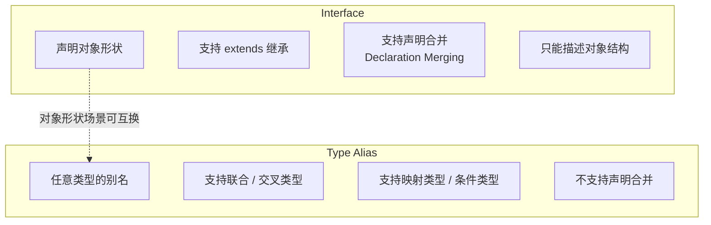
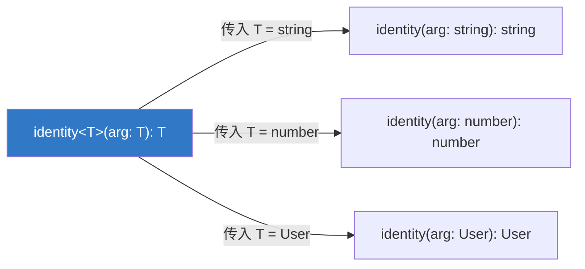
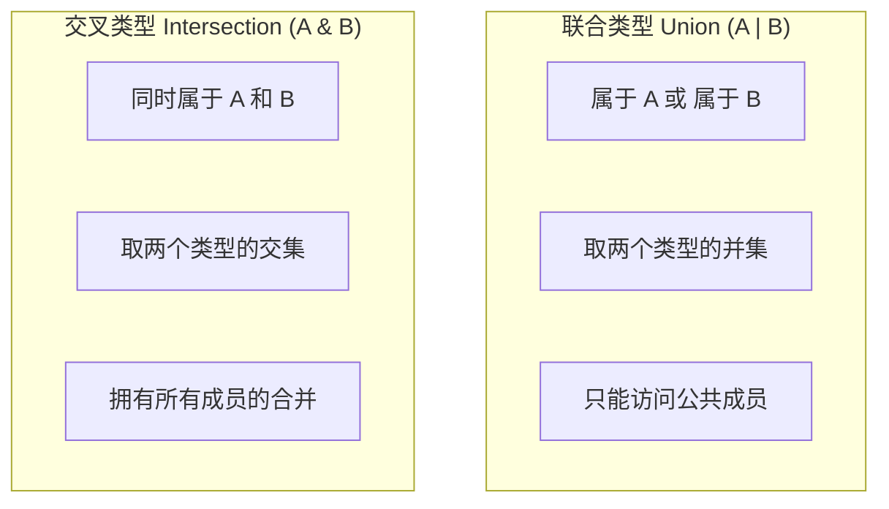
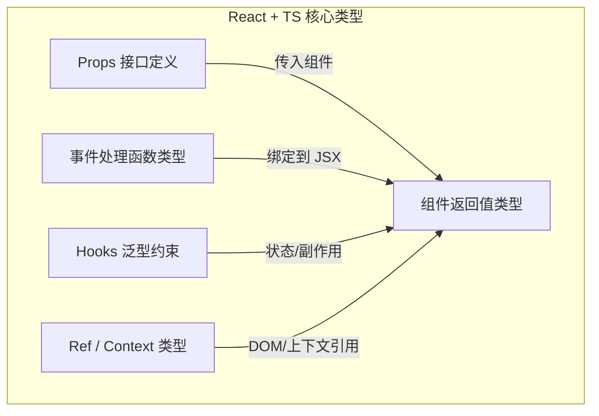
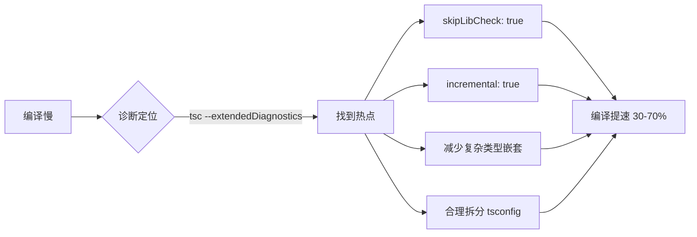

### 一、基础类型系统与工程化入门

> **阶段目标**：掌握 TypeScript 日常开发中最高频使用的类型标注能力，理解 TS 编译器的核心工作机制，能够独立完成一个 JS 项目的 TS 迁移或从零搭建 TS 工程。本阶段内容覆盖约 80% 的业务场景类型需求。

#### 1.1 为什么需要 TypeScript：从运行时错误到编译时安全

在深入语法之前，有必要先建立一个关键认知：**TypeScript 不是 JavaScript 的替代品，而是它的超集（Superset）**。所有合法的 JavaScript 代码都是合法的 TypeScript 代码，但反过来不成立。


对于已有 JS 基础的开发者，TS 解决的核心痛点可以归纳为三点：

- **提前捕获错误**：将原本在运行时才暴露的 `TypeError: Cannot read property 'x' of undefined` 提前到编码/编译阶段。
- **自文档化代码**：类型签名本身就是最好的注释，函数参数和返回值一目了然，降低团队协作的认知负担。
- **增强 IDE 智能提示**：基于类型信息，编辑器能提供精准的属性补全、重构支持和内联文档，这在大型项目中收益巨大。

> ⚠️ **重要背景知识：类型擦除（Type Erasure）**  
> TypeScript 的类型系统**仅存在于编译阶段**。`tsc` 编译器在输出 JavaScript 时会完全移除所有类型注解。这意味着：
> 
> - 类型不会影响运行时性能；
> - 不能在运行时使用类型信息做判断（如 `if (typeof x === 'MyInterface')` 是无效的）；
> - 如果需要运行时类型校验，仍需借助 zod、io-ts 等 schema 验证库。

#### 1.2 基本类型注解

TS 的类型推断（Type Inference）已经非常强大，但在以下场景中显式注解仍然必要且推荐：函数参数、导出变量的初始值为 `undefined/null`、以及复杂数据结构。

```typescript
// ✅ 基本原始类型
let userName: string = "Alice";
let age: number = 25;          // TS 没有整数类型，统一为 IEEE 754 浮点数
let isActive: boolean = true;
let nothing: null = null;
let notDefined: undefined = undefined;

// ✅ 数组与元组（Tuple）
let scores: number[] = [90, 85, 92];       // 推荐写法
let pair: [string, number] = ["age", 25];  // 固定长度、固定位置类型

// ✅ 对象类型
let user: { name: string; age: number; email?: string } = {
  name: "Alice",
  age: 25
  // email 是可选属性，可以省略
};
```

> 💡 **给 JS 开发者的提示**
> 
> - TS 中的 `number` 对应 JS 的 `Number`，但请始终使用小写 `number`。大写 `Number` 是包装对象类型，几乎不应在类型注解中使用。
> - 元组 `[string, number]` 在 JS 中就是普通数组，但 TS 会在编译期强制检查长度和每个位置的类型。它非常适合表示固定结构的返回值，如 `[error, data]` 模式。

#### 1.3 Interface 与 Type Alias：何时用哪个？

这是初学者最常困惑的问题。两者在很多场景下可互换，但设计哲学不同：



|特性|Interface|Type Alias|
|:--|:--|:--|
|描述对象形状|✅ 首选|✅ 可以|
|联合/交叉类型|❌|✅ 唯一选择|
|声明合并（同名自动合并）|✅|❌|
|extends 继承|✅|✅（通过交叉类型 `&`）|
|映射类型 / 条件类型|❌|✅|
|第三方库扩展|✅ 推荐|❌|

**实践建议**：

- 定义**对象契约**（API 响应、组件 Props、配置项）→ 优先用 `interface`
- 定义**联合类型、工具类型、非对象类型别名** → 必须用 `type`
- 编写**第三方库的类型声明文件** → 用 `interface`（便于使用者扩展）

```typescript
// Interface：描述 API 响应结构
interface ApiResponse {
  code: number;
  message: string;
  data: unknown;
}

// Type Alias：联合类型 + 工具类型
type Status = "loading" | "success" | "error";
type Nullable<T> = T | null;
type ReadonlyApiResponse = Readonly<ApiResponse>;
```

#### 1.4 函数类型标注

函数是 JS 的一等公民，也是 TS 类型标注的重灾区。

```typescript
// ✅ 完整函数类型注解
function greet(name: string, times: number = 1): string {
  return `Hello ${name}! `.repeat(times);
}

// ✅ 回调函数类型
type Handler = (event: MouseEvent) => void;

// ✅ 重载签名（Overloads）—— 当返回类型依赖输入类型时
function createElement(tag: "img"): HTMLImageElement;
function createElement(tag: "input"): HTMLInputElement;
function createElement(tag: string): HTMLElement;
function createElement(tag: string): HTMLElement {
  return document.createElement(tag);
}
```

> 💡 **关于 `void` vs `undefined`**
> 
> - `void` 表示函数**不关心返回值**，调用方不应使用其返回值。
> - `undefined` 表示函数**明确返回 undefined**。
> - 回调函数参数位置用 `void` 而非 `undefined`，因为 `() => void` 允许回调返回任意值（只是被忽略），而 `() => undefined` 会强制要求回调必须返回 undefined，这在实际使用中过于严格。

#### 1.5 tsconfig.json 核心配置详解

`tsconfig.json` 是 TS 工程的灵魂。以下是每个项目都应理解的关键选项：

```jsonc
{
  "compilerOptions": {
    // ===== 类型检查严格度 =====
    "strict": true,              // 🔑 开启所有严格检查的总开关，新项目务必设为 true
    "noUncheckedIndexedAccess": true, // 索引访问自动加 | undefined，防止越界

    // ===== 模块系统 =====
    "module": "ESNext",          // 输出模块格式，现代项目推荐 ESNext
    "moduleResolution": "bundler", // 模块解析策略，Vite/Webpack 项目推荐 bundler
    "esModuleInterop": true,     // 允许 import x from 'commonjs-pkg'

    // ===== 输出控制 =====
    "target": "ES2020",          // 输出 JS 版本
    "outDir": "./dist",
    "declaration": true,         // 生成 .d.ts 声明文件（库项目必需）

    // ===== 性能优化 =====
    "skipLibCheck": true,        // 🔑 跳过第三方库 .d.ts 检查，大幅加速编译
    "incremental": true          // 增量编译，二次构建提速显著
  },
  "include": ["src/**/*"],
  "exclude": ["node_modules", "dist"]
}
```

> ⚠️ **新手常见陷阱**
> 
> - **不要关闭 `strict`**：很多教程为了演示方便关闭 strict，但这会让你错过 TS 最有价值的保护。如果遇到报错，应该修复类型而非降低严格度。
> - **`moduleResolution` 要匹配构建工具**：Node.js ESM 项目用 `"nodenext"`，Vite/Webpack 项目用 `"bundler"`，传统 Node.js CJS 项目用 `"node"`。选错会导致大量模块找不到的错误。
> - **`skipLibCheck: true` 不是偷懒**：第三方库的类型声明之间可能存在版本冲突，跳过它们的检查是业界标准做法，不影响你自己代码的类型安全。

#### 1.6 渐进式迁移策略

将现有 JS 项目迁移到 TS 不必一步到位。推荐的渐进式路径：

1. 安装 `typescript`，添加 `tsconfig.json`，设置 `"allowJs": true` + `"checkJs": false`
2. 新文件全部使用 `.ts/.tsx`，旧文件保持 `.js`
3. 逐步对核心模块重命名为 `.ts` 并补充类型
4. 待覆盖率达标后，开启 `"checkJs": true` 对剩余 JS 文件进行类型检查
5. 最终移除 `allowJs`，完成全面迁移

> 📌 **本阶段小结**  
> 掌握以上内容后，你已经具备了在日常业务开发中正确使用 TypeScript 的能力。下一阶段将进入 TS 最核心的高级类型系统，包括泛型、条件类型、映射类型等“类型编程”范式，这些是将 TS 从“带类型的 JS”提升为“类型级编程语言”的关键。

### 二、高级类型系统与类型编程

> **阶段目标**：从“使用类型”进阶到“用类型编写逻辑”。掌握泛型、条件类型、映射类型及 `infer` 关键字，理解 TypeScript 内置工具类型的实现原理，具备自定义复杂类型的能力。本阶段是区分 TS 初级使用者与高级使用者的分水岭。

#### 2.1 泛型（Generics）：类型的函数

如果说普通类型是“值”，那么泛型就是“类型的参数”。它让类型定义从具体变为抽象，从而实现真正的复用。



```typescript
// ❌ 没有泛型：要么丢失类型信息，要么为每种类型写一个函数
function identity(arg: any): any { return arg; }

// ✅ 泛型：保留完整的类型关联
function identity<T>(arg: T): T { return arg; }

const result = identity("hello"); // 自动推断为 string
const num = identity<number>(42); // 显式指定为 number
```

> 💡 **给 JS 开发者的类比理解**  
> 将泛型 `<T>` 想象成函数的参数 `(x)`。函数参数在调用时绑定具体值，泛型参数在使用时绑定具体类型。TS 编译器会根据上下文自动推断泛型的实际类型，大多数情况下无需手动指定。

**泛型约束（Constraints）**：当需要对泛型参数的结构做出假设时，使用 `extends` 进行约束。

```typescript
// T 必须包含 length 属性
function logLength<T extends { length: number }>(arg: T): void {
  console.log(arg.length);
}

logLength([1, 2, 3]);    // ✅ 数组有 length
logLength("hello");      // ✅ 字符串有 length
logLength(123);           // ❌ number 没有 length
```

**多泛型参数与默认值**：

```typescript
// 键值对提取，K 被约束为 T 的键
function getProperty<T, K extends keyof T>(obj: T, key: K): T[K] {
  return obj[key];
}

// 泛型默认值，降低使用门槛
type ApiResponse<T = unknown, E = Error> = {
  data: T;
  error: E | null;
};
```

#### 2.2 联合类型与交叉类型

这两种组合类型是 TS 类型系统的基石，理解它们的区别至关重要。



```typescript
// 联合类型：表示"其中之一"
type StringOrNumber = string | number;
type Status = "idle" | "loading" | "success" | "error"; // 字面量联合

// ⚠️ 联合类型只能安全访问公共成员
function format(value: string | number): string {
  // value.toFixed()  ❌ number 有但 string 没有
  return String(value); // ✅ toString 是公共方法
}

// 交叉类型：表示"同时满足"
type Timestamped = { createdAt: Date };
type Authored = { author: string };
type Article = Timestamped & Authored & { title: string };
// Article 同时拥有 createdAt、author、title
```

> ⚠️ **常见误区：交叉类型 ≠ 对象合并**  
> 当交叉的两个类型存在同名但类型不兼容的属性时，结果不是覆盖，而是 `never`：
> 
> ```typescript
> type A = { x: string };
> type B = { x: number };
> type C = A & B; // C.x 的类型是 never，因为不存在既是 string 又是 number 的值
> ```
> 
> 如果需要真正的"后者覆盖前者"语义，应使用自定义 `Merge` 工具类型。

#### 2.3 条件类型：类型层面的三元表达式

条件类型是 TS 类型编程的核心引擎，语法为 `T extends U ? X : Y`。

```typescript
// 基本用法
type IsString<T> = T extends string ? true : false;
type A = IsString<"hello">; // true
type B = IsString<42>;      // false
```

**分布式条件类型（Distributive Conditional Types）**：当 `T` 是裸类型参数（naked type parameter）且传入联合类型时，条件会**逐个分发**到联合的每个成员上。

```typescript
// T 是裸类型参数 → 触发分布式
type ToArray<T> = T extends any ? T[] : never;
type Result = ToArray<string | number>;
// 等价于: string[] | number[]  （而非 (string | number)[]）

// 用 [T] 包裹可阻止分布
type ToArrayNonDist<T> = [T] extends [any] ? T[] : never;
type Result2 = ToArrayNonDist<string | number>;
// 结果为: (string | number)[]
```

> 💡 **为什么需要分布式？**  
> 这是实现 `Extract`、`Exclude` 等工具类型的基础机制。例如 `Exclude<T, U>` 正是利用分布式特性，将联合类型中属于 U 的成员过滤掉。理解这一点，就能看懂几乎所有高级工具类型的源码。

#### 2.4 infer 关键字：类型推断的利器

`infer` 只能在条件类型的 `extends` 子句中使用，用于**声明一个待推断的类型变量**，让编译器自动从复杂类型中提取出你需要的部分。

```typescript
// 提取函数的返回类型
type MyReturnType<T> = T extends (...args: any[]) => infer R ? R : never;
type R1 = MyReturnType<() => string>;        // string
type R2 = MyReturnType<(x: number) => boolean>; // boolean

// 提取 Promise 的内部类型
type UnwrapPromise<T> = T extends Promise<infer U> ? U : T;
type U1 = UnwrapPromise<Promise<string>>; // string
type U2 = UnwrapPromise<number>;          // number（非 Promise 原样返回）

// 提取数组元素类型
type ElementOf<T> = T extends (infer E)[] ? E : never;
type E1 = ElementOf<string[]>; // string
```

> 📌 **infer 的心智模型**  
> 把 `infer X` 理解为正则表达式中的捕获组 `(.+)`。你在 `extends` 右侧描述一个类型模式，`infer` 标记的位置就是你想"捕获"的部分。如果模式匹配成功，捕获到的类型就绑定到变量 X 上供 `?` 分支使用。

#### 2.5 映射类型（Mapped Types）：批量变换类型

映射类型允许你基于已有类型的键，批量生成新类型，语法类似对象索引签名。

```typescript
// 将所有属性变为可选
type MyPartial<T> = {
  [K in keyof T]?: T[K];
};

// 将所有属性变为只读
type MyReadonly<T> = {
  readonly [K in keyof T]: T[K];
};

// 实用示例：将接口所有属性转为 nullable
type Nullable<T> = {
  [K in keyof T]: T[K] | null;
};

// 键重映射（Key Remapping，TS 4.1+）
type Getters<T> = {
  [K in keyof T as `get${Capitalize<string & K>}`]: () => T[K];
};
// { name: string; age: number } → { getName: () => string; getAge: () => number }
```

#### 2.6 模板字面量类型（Template Literal Types）

TS 4.1 引入的强大特性，将字符串操作提升到类型层面。

```typescript
type EventName = "click" | "focus" | "blur";
type HandlerName = `on${Capitalize<EventName>}`;
// "onClick" | "onFocus" | "onBlur"

// 结合映射类型构建事件系统
type EventMap = {
  click: MouseEvent;
  focus: FocusEvent;
  blur: FocusEvent;
};

type EventHandlerMap = {
  [K in keyof EventMap as `on${Capitalize<string & K>}`]: 
    (event: EventMap[K]) => void;
};
// { onClick: (e: MouseEvent) => void; onFocus: (e: FocusEvent) => void; ... }
```

#### 2.7 内置工具类型速查与实现原理

理解以下工具类型的实现，是检验本阶段学习成果的最佳方式：

|工具类型|作用|核心实现机制|
|:--|:--|:--|
|`Partial<T>`|所有属性变可选|映射类型 + `?`|
|`Required<T>`|所有属性变必选|映射类型 + `-?`|
|`Readonly<T>`|所有属性只读|映射类型 + `readonly`|
|`Pick<T, K>`|选取部分属性|映射类型 + `K extends keyof T`|
|`Omit<T, K>`|排除部分属性|`Pick<T, Exclude<keyof T, K>>`|
|`Extract<T, U>`|提取可赋值给U的成员|分布式条件类型|
|`Exclude<T, U>`|排除可赋值给U的成员|分布式条件类型|
|`Record<K, V>`|构造键值对类型|映射类型 + `in`|
|`Parameters<T>`|提取函数参数元组|条件类型 + `infer`|
|`ReturnType<T>`|提取函数返回类型|条件类型 + `infer`|

> ⚠️ **性能注意事项**  
> 过度嵌套的条件类型和复杂的映射类型会导致编译器性能急剧下降。在实践中：
> 
> - 优先使用内置工具类型，它们经过优化；
> - 避免超过 3 层的条件类型嵌套；
> - 遇到编译缓慢时，使用 `tsc --extendedDiagnostics` 定位瓶颈；
> - 必要时用 `interface` 替代深层交叉类型（interface 有缓存机制）。

> 📌 **本阶段小结**  
> 至此，你已经掌握了 TypeScript 类型系统的核心能力。泛型提供了抽象复用的手段，条件类型和 `infer` 赋予了类型逻辑运算的能力，映射类型和模板字面量类型则实现了类型的批量变换与字符串操作。这些能力组合起来，使 TS 成为一门图灵完备的类型级编程语言。下一阶段将聚焦生态整合与实战最佳实践，将这些理论知识落地到真实项目中。

### 三、生态整合与实战最佳实践

> **阶段目标**：将 TypeScript 的类型能力落地到真实工程环境中。掌握主流框架中的 TS 使用范式、第三方库类型声明编写、模块解析策略调优以及常见反模式规避。本阶段关注的是“如何在团队和生产环境中优雅、高效、可持续地使用 TypeScript”。

#### 3.1 React/Vue 框架中的 TypeScript 应用

框架是 TS 最核心的应用场景之一，但框架自身的抽象层往往让类型标注变得复杂。以下以 React 为例（Vue 3 Composition API 思路类似）：



**Props 定义的最佳实践**：

```typescript
// ✅ 推荐：interface + 明确的可选/必选语义
interface ButtonProps {
  label: string;
  onClick: (e: React.MouseEvent<HTMLButtonElement>) => void;
  variant?: "primary" | "secondary";
  disabled?: boolean;
  children?: React.ReactNode;
}

// ❌ 避免：FC 注解（React.FC 已不再推荐）
// const Button: React.FC<ButtonProps> = ({ label, onClick }) => { ... }

// ✅ 推荐：直接解构 + 显式返回类型
function Button({ label, onClick, variant = "primary", disabled, children }: ButtonProps): JSX.Element {
  return <button className={variant} onClick={onClick} disabled={disabled}>{label}{children}</button>;
}
```

> 💡 **为什么不再推荐 `React.FC`？**
> 
> - 它隐式添加了 `children` 属性，即使你的组件不接受 children；
> - 不支持泛型组件；
> - 对 defaultProps 的支持已被 React 官方弃用；
> - 直接使用函数声明 + Props 接口更简洁、更符合 TS 原生习惯。

**Hooks 类型标注**：

```typescript
// useState：通常可自动推断，复杂初始值需显式标注
const [user, setUser] = useState<User | null>(null);

// useRef：区分可变 ref 和 DOM ref
const inputRef = useRef<HTMLInputElement>(null);      // DOM ref，只读
const timerRef = useRef<number | undefined>(undefined); // 可变 ref

// useMemo / useCallback：依赖项正确时通常无需额外标注
const fullName = useMemo(() => `${user?.first} ${user?.last}`, [user]);
```

**Vue 3 Composition API 要点**：

```typescript
// defineProps 支持泛型语法（Vue 3.3+）
const props = defineProps<{
  title: string;
  count?: number;
}>();

// ref 自动解包，但类型标注需注意
const name = ref<string>("Alice");     // Ref<string>
const list = ref<number[]>([]);        // Ref<number[]>

// computed 自动推断返回类型
const doubleCount = computed(() => (props.count ?? 0) * 2); // ComputedRef<number>
```

#### 3.2 第三方库类型声明文件（.d.ts）编写

当使用的库没有自带类型，或需要扩展已有类型时，你需要编写 `.d.ts` 文件。

**为无类型库补充声明**：

```typescript
// typings/some-untyped-lib.d.ts
declare module "some-untyped-lib" {
  export function init(config: { apiKey: string; debug?: boolean }): void;
  export function query(sql: string, params?: unknown[]): Promise<unknown[]>;
  export default class Client {
    constructor(options: { host: string; port: number });
    connect(): Promise<void>;
    disconnect(): void;
  }
}
```

**扩展全局类型（Declaration Merging）**：

```typescript
// 扩展 Express Request 对象
declare global {
  namespace Express {
    interface Request {
      userId?: string;
      sessionToken?: string;
    }
  }
}

// 扩展 Window 对象
declare global {
  interface Window {
    __APP_VERSION__: string;
    gtag: (...args: unknown[]) => void;
  }
}

export {}; // 确保文件被视为模块，避免污染全局作用域
```

> ⚠️ **关键注意事项**
> 
> - 全局扩展文件必须是**脚本**（无顶层 import/export）或使用 `declare global` + `export {}` 的模块形式；
> - 优先通过 `npm install @types/xxx` 安装社区类型包，手写声明应作为最后手段；
> - 声明文件放在 `src/types/` 或项目根目录 `typings/` 下，并确保 `tsconfig.json` 的 `include` 覆盖该路径。

#### 3.3 模块解析策略深度解析

模块解析是 TS 工程中最容易踩坑的配置项。选错策略会导致大量 `Cannot find module` 错误。

|策略|适用场景|核心行为|
|:--|:--|:--|
|`node` / `node10`|传统 Node.js CJS 项目|仅支持 CommonJS 解析规则，不支持 package.json exports|
|`nodenext` / `node16`|Node.js ESM 项目|严格遵循 Node.js ESM 规范，要求文件扩展名|
|`bundler`|Vite / Webpack / Rollup / esbuild|模拟打包器行为，允许省略扩展名，支持 exports/import maps|
|`classic`|（已废弃）|仅用于向后兼容，新项目勿用|

> 💡 **如何判断该选哪个？**  
> 问自己一个问题：**我的代码最终由谁执行？**
> 
> - 由 Node.js 直接运行 → `nodenext`
> - 由打包工具处理后运行 → `bundler`
> - 不确定 → 查看构建工具文档，Vite/Rollup 选 `bundler`，Next.js/Nuxt 通常有预设配置

**常见模块问题排查清单**：

1. 确认 `moduleResolution` 与构建工具匹配；
2. 检查第三方库是否提供 `types` / `typings` 字段或 `@types` 包；
3. 对于 monorepo，确认 `paths` / `references` 配置正确；
4. 使用 `"traceResolution": true` 临时开启解析追踪，查看编译器查找模块的完整过程。

#### 3.4 性能优化策略

随着项目规模增长，TS 编译时间可能成为瓶颈。以下是经过验证的优化手段：



- **`skipLibCheck: true`**：跳过所有 `.d.ts` 文件的类型检查。这是性价比最高的优化，几乎所有生产项目都应开启。
- **`incremental: true`**：生成 `.tsbuildinfo` 缓存文件，增量编译可使二次构建提速 50% 以上。配合 `composite: true` 可在 monorepo 中实现项目级增量。
- **避免过度复杂的类型计算**：深层递归条件类型、大范围模板字面量联合是主要性能杀手。可用 `type-fest` 等优化过的工具库替代手写。
- **Monorepo 项目引用（Project References）**：将大项目拆分为多个子项目，每个子项目独立编译，利用 `composite` + `references` 实现按需构建。
- **IDE 层面**：在 VS Code 中使用 `typescript.tsserver.experimental.enableProjectDiagnostics: false` 关闭跨文件实时诊断，改为保存时触发。

#### 3.5 常见反模式与规避指南

|反模式|问题|正确做法|
|:--|:--|:--|
|滥用 `any`|完全绕过类型检查，等同于写 JS|用 `unknown` + 类型守卫收窄；实在无法确定时用 `// @ts-expect-error` 并附注释|
|过度类型体操|可读性差、编译慢、维护成本高|满足需求即可，不要追求"完美类型"；复杂逻辑考虑运行时校验|
|用 class 代替 interface|class 同时产生类型和运行时代码，增加包体积|纯数据结构用 interface/type，仅在有行为封装时才用 class|
|忽略 strict 报错|积累技术债，迁移成本指数增长|新文件零容忍；旧文件制定修复计划，逐步消除|
|类型断言泛滥 (`as`)|掩盖真实类型问题|优先重构代码使类型自然匹配；断言仅用于测试和确实安全的场景|
|枚举（enum）滥用|编译产物冗余，树摇困难|优先用 `const` 对象 + `as const` 或字面量联合类型|

> 💡 **关于 `any` vs `unknown` 的核心区别**
> 
> - `any`：**放弃类型检查**，可以赋值给任何类型，也可以访问任何属性。它是类型系统的"逃生舱"，应尽量避免。
> - `unknown`：**安全的顶层类型**，可以接收任何值，但在使用前必须通过类型守卫（`typeof`、`in`、自定义 guard）收窄。它是处理外部数据（API 响应、用户输入）的正确选择。

#### 3.6 测试与 CI 集成

- **类型测试**：使用 `tsd` 或 `expect-type` 库对导出的类型进行单元测试，确保工具类型行为符合预期。
    
    ```typescript
    // test/types.test-d.ts
    import { expectType } from 'tsd';
    import { Nullable } from '../src/types';
    
    expectType<Nullable<string>>(null);
    expectType<Nullable<string>>("hello");
    // @ts-expect-error - number should not be assignable
    expectType<Nullable<string>>(42);
    ```
    
- **CI 流水线**：始终包含 `tsc --noEmit` 步骤，确保每次提交都通过类型检查。不要仅依赖 IDE 反馈。
- **Lint 配合**：使用 `@typescript-eslint` 插件，启用 `@typescript-eslint/no-explicit-any`、`@typescript-eslint/no-unused-vars` 等规则，将类型质量纳入代码审查流程。

> 📌 **本阶段小结**  
> 至此，你已经完成了从 TS 语法学习到工程实践的跨越。基础类型系统让你能"写带类型的代码"，高级类型系统让你能"用类型表达复杂逻辑"，而生态整合与最佳实践则确保这些能力在真实项目中**安全、高效、可维护地落地**。下一阶段将通过综合练习题对全部知识进行巩固检验。

### 四、练习

> **阶段目标**：通过覆盖前三个阶段核心知识点的针对性练习，完成从“理解概念”到“肌肉记忆”的转化。本阶段不提供标准答案代码，而是给出题目描述、预期类型行为和自测方法，鼓励读者独立实现后再对照验证。所有练习均可在 [TypeScript Playground](https://www.typescriptlang.org/play) 中直接运行验证。

#### 4.1 基础类型与工程配置练习

**练习 1：严格模式下的类型修复**

> **背景**：以下代码在 `strict: true` 下存在多处类型错误，它们代表了新手最常遇到的编译报错场景。

```typescript
function getUser(id) {
  const users = {
    "1": { name: "Alice", age: 25 },
    "2": { name: "Bob" }
  };
  return users[id].name.toUpperCase();
}

const items = [];
items.push(1);
items.push("hello");
const first = items[0].toFixed(2);
```

- **任务**：在不关闭任何 strict 子选项的前提下，为上述代码添加最少的类型注解使其通过编译，同时保留合理的运行时安全性。
- **考察点**：隐式 any、索引签名缺失、数组类型推断、可选链/空值合并的使用。
- **自测标准**：`tsc --noEmit --strict` 零错误；当传入不存在的 id 时不会抛出运行时异常。

> [!success]- 点击展开题解
> 
> ### 🎯 核心思路分析
> 
> 本题考察的是 TypeScript **严格模式（Strict Mode）** 下最常见的四个“拦路虎”。在 `strict: true` 配置中，TS 不再允许模糊的类型推断，强制开发者显式地表达意图。修复这段代码不仅仅是为了消除报错，更是为了建立**防御性编程**的思维。
> 
> #### 🔍 错误诊断与修复策略
> 
> |原代码问题|Strict 子选项|根因分析|最小化修复方案|
> |:--|:--|:--|:--|
> |`function getUser(id)`|`noImplicitAny`|参数 `id` 缺少类型注解，被推断为隐式 `any`|添加 `id: string`|
> |`users[id].name...`|`noUncheckedIndexedAccess` / 安全性|索引访问可能返回 `undefined`，直接调用 `.name` 不安全|使用可选链 `?.` + 空值合并 `??`|
> |`const items = []`|`noImplicitAny`|空数组无初始值，元素类型被推断为 `any[]`|显式标注 `(number \| string)[]`|
> |`items[0].toFixed(2)`|类型安全|联合类型上不存在共有方法 `toFixed`|运行时类型守卫或断言（推荐守卫）|
> 
> ---
> 
> ### ✅ 修复后的完整代码
> 
> ```typescript
> // 1. 为参数添加显式类型注解
> function getUser(id: string): string {
>   const users: Record<string, { name: string; age?: number }> = {
>     "1": { name: "Alice", age: 25 },
>     "2": { name: "Bob" }
>   };
> 
>   // 2. 使用可选链防止 undefined 访问，空值合并提供默认值
>   return users[id]?.name?.toUpperCase() ?? "UNKNOWN_USER";
> }
> 
> // 3. 显式声明联合类型数组
> const items: (number | string)[] = [];
> items.push(1);
> items.push("hello");
> 
> // 4. 使用类型守卫安全地调用特定类型的方法
> const first = items[0];
> const result = typeof first === "number" ? first.toFixed(2) : String(first);
> ```
> 
> ---
> 
> ### 🧠 关键知识点图解
> 
> #### 1. 可选链与空值合并的协作机制
> 
> 很多新手会混淆 `?.` 和 `??` 的作用边界。下图展示了它们在表达式求值中的分工：
> 
> ```mermaid
> flowchart LR
>     A["users[id]"] -->|可能为 undefined| B{?.name}
>     B -->|存在| C["string"]
>     B -->|undefined| D["undefined"]
>     C --> E{?.toUpperCase}
>     D --> E
>     E -->|有值| F["大写字符串"]
>     E -->|null/undefined| G["null/undefined"]
>     F --> H{"?? 空值合并"}
>     G --> H
>     H -->|左侧非空| I["返回大写结果"]
>     H -->|左侧为空| J["返回 UNKNOWN_USER"]
> ```
> 
> > 💡 **理解要点**：`?.` 负责**安全地深入访问**属性链，遇到 `null/undefined` 就短路返回 `undefined`；`??` 负责在**整个表达式结果为空时提供兜底值**。两者配合才能实现“既不会崩溃，又有合理默认值”。
> 
> #### 2. 为什么不能直接 `items[0].toFixed(2)`？
> 
> 当数组类型为 `(number | string)[]` 时，`items[0]` 的类型是 `number | string`。TypeScript 只允许你调用**联合类型中所有成员共有的方法**（如 `toString()`），而 `toFixed` 仅存在于 `number` 上。
> 
> ```mermaid
> flowchart TD
>     U["number | string"] -->|直接调用 .toFixed| X["❌ 编译错误"]
>     U -->|typeof === number 守卫| Y["✅ 缩窄为 number"]
>     Y -->|调用 .toFixed| Z["✅ 安全通过"]
>     U -->|typeof === string 守卫| W["✅ 缩窄为 string"]
> ```
> 
> > ⚠️ **避免滥用类型断言**：虽然 `(items[0] as number).toFixed(2)` 也能通过编译，但它绕过了运行时检查。如果 `items[0]` 实际是 `"hello"`，运行时会抛出 `TypeError`。**类型守卫（Type Guard）** 才是兼顾编译安全与运行时安全的正确做法。
> 
> ---
> 
> ### 📚 背景知识补充
> 
> #### Strict 模式到底开启了什么？
> 
> `strict: true` 是一个“总开关”，它等价于同时开启以下所有子选项：
> 
> - **`noImplicitAny`**：禁止隐式 `any`，必须显式标注或让 TS 能推断出具体类型
> - **`strictNullChecks`**：`null` 和 `undefined` 不再是所有类型的子类型，必须显式处理
> - **`noUncheckedIndexedAccess`**（需额外开启）：索引签名访问的结果自动包含 `undefined`
> - **`strictFunctionTypes`**：函数参数类型变为逆变（contravariant）
> - **`useUnknownInCatchVariables`**：catch 变量默认为 `unknown` 而非 `any`
> 
> 本题主要涉及前三个。理解这些子选项有助于你在遇到报错时快速定位根因，而不是盲目地加 `as any` 来“解决”问题。
> 
> #### 🏁 自测验证清单
> 
> - [ ]  执行 `tsc --noEmit --strict` 零错误
> - [ ]  `getUser("999")` 返回 `"UNKNOWN_USER"` 而非抛出异常
> - [ ]  `getUser("2")` 正常返回 `"BOB"`
> - [ ]  `items` 数组可安全 push `number` 和 `string`
> - [ ]  当 `items[0]` 为字符串时不会触发 `toFixed` 运行时错误

**练习 2：tsconfig.json 诊断**

> **背景**：一个 Vite + React 项目出现以下问题：导入 `.svg` 文件报 `Cannot find module`；第三方库 `lodash-es` 的类型提示正常但编译报错；每次保存文件 IDE 响应超过 3 秒。

- **任务**：写出解决这三个问题的 `compilerOptions` 配置项及对应值，并简要说明每项的作用原理。
- **考察点**：模块解析策略选择、声明文件补充机制、性能优化配置。
- **自测标准**：能准确说出 `bundler`、`declare module`、`skipLibCheck` / `incremental` 三个关键配置及其理由。

> [!success]- 点击展开题解
> 
> ### 🎯 核心配置速览
> 
> 针对题目中描述的三个痛点，`tsconfig.json` 的 `compilerOptions` 应做如下关键调整：
> 
> ```jsonc
> {
>   "compilerOptions": {
>     // 1. 解决 SVG 导入报错 & lodash-es 编译问题
>     "moduleResolution": "bundler",
>     
>     // 2. 解决第三方库编译报错 & IDE 响应慢
>     "skipLibCheck": true,
>     
>     // 3. 解决 IDE 保存时响应超过 3 秒
>     "incremental": true,
>     "tsBuildInfoFile": "./node_modules/.cache/tsbuildinfo" // 可选：指定缓存位置
>   }
> }
> ```
> 
> ---
> 
> ### 🔍 逐项原理深度解析
> 
> #### 1. `moduleResolution: "bundler"` —— 对齐 Vite 的模块解析策略
> 
> **解决问题**：`.svg` 文件 `Cannot find module`、`lodash-es` 类型正常但编译报错。
> 
> **原理说明**：
> 
> - TypeScript 5.0+ 引入了 `bundler` 模式，专门模拟 Vite / Webpack / esbuild 等打包工具的解析行为。
> - 它同时支持 ESM 和 CJS 的混合解析规则，允许省略扩展名、支持 `exports` 字段、支持非 `.ts/.js` 资源的导入（如 `.svg`, `.css`）。
> - 相比之下，传统的 `node` / `node16` 模式严格遵循 Node.js 原生解析，不支持资源文件导入；而 `node16` 虽然支持 ESM，但对非标准扩展名仍然报错。
> 
> > 💡 **补充背景**：在 `bundler` 模式下，TypeScript 不再要求导入路径必须包含 `.js` 后缀，也不会对 `.svg` 等非代码资源报 "Cannot find module"——前提是项目中存在对应的类型声明（见下方说明）。
> 
> **⚠️ 注意**：仅设置 `bundler` 并不能让 TS 自动识别 `.svg` 的类型，还需要配合声明文件补充机制：
> 
> ```ts
> // src/vite-env.d.ts 或 typings/svg.d.ts
> declare module '*.svg' {
>   import type { FC, SVGProps } from 'react';
>   const ReactComponent: FC<SVGProps<SVGSVGElement>>;
>   export default ReactComponent;
> }
> ```
> 
> 这就是题目考察点中提到的 **"声明文件补充机制"**：当第三方资源没有自带类型时，通过 `declare module` 手动为其提供类型签名，使 TS 编译器能正确识别。
> 
> ---
> 
> #### 2. `skipLibCheck: true` —— 跳过第三方库的类型检查
> 
> **解决问题**：`lodash-es` 类型提示正常但编译报错；IDE 响应慢（部分原因）。
> 
> **原理说明**：
> 
> - 默认情况下，tsc 会检查 `node_modules` 中所有 `.d.ts` 文件的类型正确性。
> - 很多第三方库的声明文件之间存在版本冲突或使用了不兼容的 TS 特性，导致编译失败，但这些错误并非你的代码问题。
> - 开启后，TS **只检查你项目中的源码**，完全跳过 `.d.ts` 文件的校验，大幅减少编译工作量。
> 
> > 💡 **为什么类型提示正常但编译报错？**  
> > IDE 的语言服务（Language Service）和 `tsc` 编译器是两套独立的流程。IDE 可能使用了更宽松的检查策略或缓存了旧结果，而 `tsc` 严格执行全量检查时就会暴露 `.d.ts` 中的冲突。`skipLibCheck` 让两者行为一致。
> 
> ---
> 
> #### 3. `incremental: true` —— 增量编译加速 IDE 响应
> 
> **解决问题**：每次保存文件 IDE 响应超过 3 秒。
> 
> **原理说明**：
> 
> - 开启后，TS 会在首次编译时生成一个 `.tsbuildinfo` 文件，记录上次编译的程序状态（AST、符号表、依赖图等）。
> - 后续编译时，TS 只重新分析**发生变更的文件及其受影响的上游文件**，而非全量重建。
> - IDE 的 Language Server 底层调用 tsc API 进行类型检查，增量信息使其能在毫秒级完成单次保存的类型诊断。
> 
> ---
> 
> ### 🗺️ 三者协作关系图
> 
> ```mermaid
> graph TD
>     A[tsconfig.json] --> B["moduleResolution: bundler"]
>     A --> C["skipLibCheck: true"]
>     A --> D["incremental: true"]
>     
>     B --> E["✅ SVG 导入不再报错<br/>✅ lodash-es 编译通过"]
>     C --> F["✅ 跳过 .d.ts 校验<br/>✅ 消除第三方类型冲突"]
>     D --> G["✅ 生成 .tsbuildinfo<br/>✅ IDE 保存 < 500ms"]
>     
>     H["declare module '*.svg'"] -.->|配合| B
>     C -.->|减少编译范围| D
>     
>     style B fill:#e1f5fe,stroke:#0288d1
>     style C fill:#fff3e0,stroke:#f57c00
>     style D fill:#e8f5e9,stroke:#388e3c
>     style H fill:#f3e5f5,stroke:#7b1fa2,stroke-dasharray: 5 5
> ```
> 
> ---
> 
> ### 📋 自测清单
> 
> |考察点|关键配置|你能说清的理由|
> |---|---|---|
> |模块解析策略选择|`moduleResolution: "bundler"`|模拟 Vite 解析行为，兼容 ESM/CJS/资源文件|
> |声明文件补充机制|`declare module '*.svg'` + `bundler`|bundler 允许非标准导入，declare module 提供类型签名|
> |性能优化配置|`skipLibCheck` + `incremental`|前者减少编译范围，后者避免全量重建|
> 
> > ⚠️ **常见误区提醒**
> > 
> > - `skipLibCheck` 不是"万能药"，如果你的业务代码本身有类型错误，它不会帮你忽略。
> > - `incremental` 生成的 `.tsbuildinfo` 应加入 `.gitignore`，它是构建产物而非源码。
> > - `moduleResolution: "bundler"` 需要 TypeScript ≥ 5.0，若项目使用更低版本需先升级。

#### 4.2 高级类型系统练习

**练习 3：手写内置工具类型**

> **背景**：理解内置工具类型的最佳方式是重新实现它们。请仅使用条件类型、映射类型、`infer`、`keyof` 等原生语法实现以下工具类型，禁止直接使用同名内置类型。

|需实现的类型|功能描述|难度|
|:--|:--|:--|
|`MyPick<T, K>`|从 T 中选取 K 对应的属性组成新类型|⭐⭐|
|`MyOmit<T, K>`|从 T 中排除 K 对应的属性（提示：基于 MyPick）|⭐⭐|
|`MyParameters<T>`|提取函数 T 的参数类型为元组|⭐⭐⭐|
|`DeepReadonly<T>`|递归地将 T 的所有嵌套属性变为只读|⭐⭐⭐⭐|
|`TupleToUnion<T>`|将元组类型 `[A, B, C]` 转为联合类型 `A \| B \| C`|⭐⭐⭐|

- **自测方法**：使用 `expect-type` 或手动赋值验证：
    
    ```typescript
    type TestPick = MyPick<{ a: string; b: number; c: boolean }, 'a' | 'c'>;
    // 期望等价于 { a: string; c: boolean }
    
    type TestDeep = DeepReadonly<{ a: { b: { c: string } } }>;
    // 期望 TestDeep['a']['b']['c'] 为 readonly
    ```

> [!success]- 点击展开题解
> ## 题解：手写内置工具类型
> 
> 本文将通过逐步推导，带你实现 TypeScript 中几个核心的内置工具类型。理解它们的原理，是掌握类型体操的关键一步。
> 
> ---
> 
> ### 1. `MyPick<T, K>` —— 精准选取
> 
> **功能**：从类型 `T` 中，挑选出键名属于 `K` 的属性，构造成新类型。
> 
> **实现**：
> ```typescript
> type MyPick<T, K extends keyof T> = {
>   [P in K]: T[P];
> };
> ```
> 
> **解析**：
> - `K extends keyof T`：首先约束 `K` 必须是 `T` 的键的联合类型的子集，保证属性名有效。
> - `[P in K]: T[P]`：映射类型会遍历联合类型 `K` 中的每个属性名 `P`，其值类型则通过索引访问 `T[P]` 获取。
> 
> 这个模式是所有映射类型的基石。
> 
> ---
> 
> ### 2. `MyOmit<T, K>` —— 精确排除
> 
> **功能**：从 `T` 中排除 `K` 对应的属性。题目提示可基于 `MyPick` 实现，思路是“选取剩下的”。
> 
> **实现**：
> ```typescript
> type MyOmit<T, K extends keyof T> = MyPick<T, Exclude<keyof T, K>>;
> ```
> 
> **解析**：
> - `Exclude<keyof T, K>`：先通过 `Exclude` 工具类型，从 `T` 的所有键中过滤掉 `K`，得到剩下的键的联合类型。
> - 然后复用 `MyPick`，从 `T` 中选取这些“剩下的键”，自然就实现了排除 `K` 的效果。
> 
> ---
> 
> ### 3. `MyParameters<T>` —— 提取函数参数
> 
> **功能**：提取函数类型的参数列表，以元组形式返回。这里需要使用条件类型中的 `infer` 关键字进行模式匹配。
> 
> **实现**：
> ```typescript
> type MyParameters<T extends (...args: any) => any> = 
>   T extends (...args: infer P) => any ? P : never;
> ```
> 
> **解析**：
> - `T extends (...args: infer P) => any`：将函数类型 `T` 与一个接受任意参数并返回任意值的函数签名进行匹配。`infer P` 是核心，它告诉 TypeScript：“请推断出此位置的参数类型，并把它赋值给变量 `P`”。
> - 如果匹配成功，则返回推断出的参数元组类型 `P`；否则返回 `never`。
> 
> `infer` 关键字只能在条件类型的 `extends` 子句中使用，是类型层面进行“解构赋值”的关键工具。
> 
> ---
> 
> ### 4. `DeepReadonly<T>` —— 深度只读（进阶）
> 
> **功能**：递归地将对象类型的所有层级属性都标记为 `readonly`。
> 
> **实现**：
> ```typescript
> type DeepReadonly<T> = {
>   readonly [P in keyof T]: T[P] extends object
>     ? T[P] extends Function
>       ? T[P]  // 函数类型不做处理，保持原样
>       : DeepReadonly<T[P]>
>     : T[P]; // 原始类型直接标记为 readonly
> };
> ```
> 
> **解析与难点说明**：
> 1. **递归**：对每个属性值进行判断，如果它是对象（`extends object`），则递归调用 `DeepReadonly` 自身。
> 2. **函数类型特殊处理**：函数也满足 `extends object`，但我们通常不想将函数的属性变为只读，那样会破坏其可调用性。因此，我们增加一个判断：`T[P] extends Function`，如果成立，直接返回原类型，终止递归。这是实现中需要特别注意的细节。
> 3. **原始类型终止**：当属性值为 `string`、`number`、`boolean` 等原始类型时，`extends object` 为 `false`，递归终止。
> 
> **递归流程示意 (Mermaid)**：
> ```mermaid
> graph TD
>     A[开始: DeepReadonly<T>] --> B{遍历每个属性 P};
>     B --> C{属性值类型 T[P]};
>     C --> D{是否为函数?};
>     D -- 是 --> E[不处理, 原样返回 T[P] ];
>     D -- 否 --> F{是否为 object?};
>     F -- 否(原始类型) --> G[标记为 readonly, 终止];
>     F -- 是(嵌套对象) --> H[递归调用 DeepReadonly<T[P]>];
>     H --> A;
> ```
> 
> ---
> 
> ### 5. `TupleToUnion<T>` —— 元组转联合类型
> 
> **功能**：将元组类型转换为各元素组成的联合类型。
> 
> **实现一：通过索引访问获取所有元素类型**
> ```typescript
> type TupleToUnion<T extends any[]> = T[number];
> ```
> 
> **解析**：
> - 这是最简洁的实现。`T[number]` 是索引访问类型的用法，其中 `number` 代表使用数字索引去访问 `T`。对于元组 `[string, number]`，`T[0]` 是 `string`，`T[1]` 是 `number`。而 `T[number]` 则一次性获取所有数字索引对应的类型，它们的联合就是 `string | number`。
> 
> **实现二：递归模式匹配 (展示 `infer` 的另一种用法)**
> ```typescript
> type TupleToUnion<T extends any[]> = 
>   T extends [infer First, ...infer Rest] 
>     ? First | TupleToUnion<Rest> 
>     : never;
> ```
> 
> **解析**：
> - 这种写法更具函数式编程风格。它通过 `infer` 将元组解构为“首元素 `First`”和“剩余元素组成的元组 `Rest`”。
> - 然后递归地将 `First` 与 `TupleToUnion<Rest>` 的结果做联合，直至 `Rest` 为空，此时匹配失败返回 `never`。任何类型与 `never` 的联合等于它本身，所以 `never` 不会出现在最终联合中。
> 
> ---
> 
> ### 自测验证
> 
> 你可以将以下代码粘贴到 TypeScript 环境中进行验证，无报错即表示实现正确。
> 
> ```typescript
> // MyPick 测试
> type TestPick = MyPick<{ a: string; b: number; c: boolean }, 'a' | 'c'>;
> // 期望等价于 { a: string; c: boolean }
> const testPick: TestPick = { a: 'hello', c: true }; 
> 
> // MyOmit 测试
> type TestOmit = MyOmit<{ a: string; b: number; c: boolean }, 'b'>;
> // 期望等价于 { a: string; c: boolean }
> const testOmit: TestOmit = { a: 'hello', c: false };
> 
> // MyParameters 测试
> type TestParams = MyParameters<(name: string, age: number) => void>;
> // 期望为 [string, number]
> const testParams: TestParams = ['Alice', 30];
> 
> // DeepReadonly 测试
> type TestDeep = DeepReadonly<{ a: { b: { c: string } } }>;
> const testDeep: TestDeep = { a: { b: { c: 'deep' } } };
> // 下面这行代码应该报错：无法为“c”赋值，因为它是只读属性。
> // testDeep.a.b.c = 'modified';
> 
> // TupleToUnion 测试
> type TestUnion = TupleToUnion<[string, number, boolean]>;
> // 期望为 string | number | boolean
> const testUnion1: TestUnion = 'a string';
> const testUnion2: TestUnion = 100;
> const testUnion3: TestUnion = true;
> ```

**练习 4：条件类型与 infer 综合应用**

> **背景**：给定以下异步 API 层封装，提取出纯数据类型。

```typescript
interface ApiService {
  getUser(id: string): Promise<{ name: string; email: string }>;
  listPosts(page: number): Promise<{ items: Post[]; total: number }>;
  deletePost(id: string): Promise<void>;
  syncData(): void; // 注意：非异步方法
}
```

- **任务**：
    1. 实现 `AsyncReturnType<T>` ：提取异步函数的 resolve 类型，非异步函数返回 `never`。
    2. 实现 `ApiResponses<T>` ：将接口中所有方法的返回值映射为 `{ methodName: resolvedType }` 的对象类型，跳过非异步方法。
- **期望结果**：
    
    ```typescript
    type Responses = ApiResponses<ApiService>;
    // {
    //   getUser: { name: string; email: string };
    //   listPosts: { items: Post[]; total: number };
    //   deletePost: void;
    // }
    // 注意：syncData 不应出现在结果中
    ```
    
- **考察点**：`infer` 嵌套使用、分布式条件类型过滤、映射类型键重映射。

> [!success]- 点击展开题解
> 
> ## 📘 练习 4 深度题解：条件类型与 infer 综合应用
> 
> 本题是 TypeScript 类型编程（Type Programming）中极具代表性的实战案例。它要求我们从一个混合了同步与异步方法的接口中，**精确提取出所有异步方法的返回值解包类型**，并自动过滤掉非异步方法。这不仅考察对 `infer` 关键字的掌握，还涉及映射类型中的键重映射（Key Remapping）以及条件类型的边界处理。
> 
> ---
> 
> ### 🧠 核心知识点前置补充
> 
> 在动手写代码之前，我们需要厘清三个关键概念，它们是解开本题的钥匙。
> 
> #### 1. `infer` 关键字的本质
> 
> `infer` 只能在条件类型（`extends`）的右侧使用，用于**声明一个待推断的类型变量**。你可以把它理解为类型层面的“正则捕获组”。
> 
> ```typescript
> // 伪代码理解
> T extends Promise<infer R> ? R : never
> //        ^^^^^^^^^^^^^^^^    ^
> //        模式匹配区域         捕获到的类型赋值给 R
> ```
> 
> > ⚠️ **重要特性**：`infer` 变量只在条件为 `true` 的分支中有效。如果匹配失败，该变量不存在。
> 
> #### 2. 映射类型中的键重映射 (Key Remapping)
> 
> TypeScript 4.1 引入了 `as` 子句，允许我们在映射类型中动态修改或过滤键：
> 
> ```typescript
> type Filtered<T> = {
>   [K in keyof T as K extends string ? K : never]: T[K]
> }
> ```
> 
> - 当 `as` 后的表达式求值为 `never` 时，**该键会被完全移除**（而非保留为 `never` 类型）。
> - 这是实现“跳过非异步方法”的核心机制。
> 
> #### 3. 分布式条件类型 vs 非分布式
> 
> 当条件类型的检查对象是**裸类型参数**（naked type parameter）时，若传入联合类型，条件会分别对每个成员求值后合并结果。但在映射类型 `[K in keyof T]` 中，`T[K]` 不是裸类型参数，因此**不会触发分布式**。这意味着我们必须显式地对每个 `T[K]` 做条件判断，而不能依赖自动分发来过滤。
> 
> ---
> 
> ### 🔍 解题思路分步拆解
> 
> #### Step 1: 实现 `AsyncReturnType<T>`
> 
> **目标**：给定任意函数类型，若是异步函数则返回其 resolve 类型，否则返回 `never`。
> 
> **常见误区**：
> 
> ```typescript
> // ❌ 错误写法：先取 ReturnType 再判断
> type BadAsyncReturnType<T> = ReturnType<T> extends Promise<infer R> ? R : never;
> ```
> 
> 这种写法的问题在于：`ReturnType` 本身要求 `T` 必须是函数类型，若传入非函数类型会报错；且对于重载函数可能取到错误的签名。
> 
> **正确做法**：直接对函数签名进行模式匹配。
> 
> ```typescript
> type AsyncReturnType<T> = 
>   T extends (...args: any) => Promise<infer R> 
>     ? R 
>     : never;
> ```
> 
> **执行逻辑可视化**：
> 
> ```mermaid
> flowchart LR
>     Input["输入类型 T"] --> Match{"T 是否匹配<br/>(...args: any) => Promise&lt;infer R&gt;?"}
>     Match -- "✅ 是" --> Extract["返回 R<br/>（Promise 内部类型）"]
>     Match -- "❌ 否" --> Never["返回 never"]
>     
>     style Match fill:#e1f5fe,stroke:#0288d1
>     style Extract fill:#e8f5e9,stroke:#388e3c
>     style Never fill:#ffebee,stroke:#d32f2f
> ```
> 
> **验证**：
> 
> |输入|匹配结果|输出|
> |---|---|---|
> |`() => Promise<{name: string}>`|✅|`{name: string}`|
> |`() => void`|❌|`never`|
> |`() => Promise<void>`|✅|`void`|
> |`string`|❌|`never`|
> 
> #### Step 2: 实现 `ApiResponses<T>`
> 
> **目标**：遍历接口所有键，仅保留异步方法，并将其值替换为解包后的返回类型。
> 
> **完整实现**：
> 
> ```typescript
> type ApiResponses<T> = {
>   [K in keyof T as T[K] extends (...args: any) => Promise<any> 
>     ? K 
>     : never
>   ]: T[K] extends (...args: any) => Promise<infer R> 
>       ? R 
>       : never;
> };
> ```
> 
> **逐层解析**：
> 
> |部分|作用|说明|
> |---|---|---|
> |`[K in keyof T]`|遍历所有键|生成映射类型的基础结构|
> |`as T[K] extends ... ? K : never`|键过滤|非异步方法的键变为 `never`，被剔除|
> |`T[K] extends ... ? R : never`|值转换|对保留的键，提取 Promise 内部类型|
> 
> > 💡 **为什么键过滤和值转换要写两次条件判断？**  
> > 因为 `as` 子句只影响键名，不影响值的计算。即使键被保留了，值部分仍需独立推断。TS 编译器无法复用 `as` 中的推断结果到值位置。虽然看似冗余，但这是当前类型系统的必要写法。
> 
> **完整执行流程**：
> 
> ```mermaid
> flowchart TD
>     Start["遍历 ApiService 的每个键 K"] --> CheckAsync{"T[K] 是否为<br/>(...args) => Promise&lt;any&gt;?"}
>     
>     CheckAsync -- "getUser" --> Keep1["as K → 保留键 'getUser'"]
>     CheckAsync -- "listPosts" --> Keep2["as K → 保留键 'listPosts'"]
>     CheckAsync -- "deletePost" --> Keep3["as K → 保留键 'deletePost'"]
>     CheckAsync -- "syncData" --> Filter["as never → 键被移除"]
>     
>     Keep1 --> Infer1["推断 Promise&lt;{name,email}&gt;<br/>→ {name: string; email: string}"]
>     Keep2 --> Infer2["推断 Promise&lt;{items,total}&gt;<br/>→ {items: Post[]; total: number}"]
>     Keep3 --> Infer3["推断 Promise&lt;void&gt;<br/>→ void"]
>     
>     Infer1 & Infer2 & Infer3 --> Final["组装最终对象类型"]
>     Filter --> Discard["不参与最终类型"]
>     
>     style CheckAsync fill:#fff3e0,stroke:#f57c00
>     style Filter fill:#ffebee,stroke:#d32f2f
>     style Final fill:#e8f5e9,stroke:#388e3c
> ```
> 
> ---
> 
> ### ✅ 完整可运行代码
> 
> ```typescript
> // 辅助类型定义（题目隐含依赖）
> interface Post {
>   id: string;
>   title: string;
>   content: string;
> }
> 
> // 原始 API 接口
> interface ApiService {
>   getUser(id: string): Promise<{ name: string; email: string }>;
>   listPosts(page: number): Promise<{ items: Post[]; total: number }>;
>   deletePost(id: string): Promise<void>;
>   syncData(): void; // 同步方法，应被过滤
> }
> 
> // ========== 核心类型工具 ==========
> 
> /**
>  * 提取异步函数的 resolve 类型
>  * 非异步函数返回 never
>  */
> type AsyncReturnType<T> = 
>   T extends (...args: any) => Promise<infer R> 
>     ? R 
>     : never;
> 
> /**
>  * 将接口中所有异步方法的返回值映射为解包后的对象类型
>  * 自动跳过非异步方法
>  */
> type ApiResponses<T> = {
>   [K in keyof T as T[K] extends (...args: any) => Promise<any> 
>     ? K 
>     : never
>   ]: T[K] extends (...args: any) => Promise<infer R> 
>       ? R 
>       : never;
> };
> 
> // ========== 验证 ==========
> type Responses = ApiResponses<ApiService>;
> /*
>  * 等价于：
>  * {
>  *   getUser: { name: string; email: string };
>  *   listPosts: { items: Post[]; total: number };
>  *   deletePost: void;
>  * }
>  * 
>  * ✅ syncData 已被正确过滤
>  */
> 
> // 单独验证 AsyncReturnType
> type T1 = AsyncReturnType<ApiService['getUser']>;    // { name: string; email: string }
> type T2 = AsyncReturnType<ApiService['deletePost']>; // void
> type T3 = AsyncReturnType<ApiService['syncData']>;   // never
> type T4 = AsyncReturnType<string>;                   // never
> ```
> 
> ---
> 
> ### 🤔 深入思考与边界情况
> 
> #### Q1: 为什么不用 `PromiseLike` 代替 `Promise`？
> 
> 在实际项目中，某些环境（如旧版浏览器 polyfill、自定义 Thenable）可能返回 `PromiseLike<T>` 而非原生 `Promise<T>`。若需兼容，可改为：
> 
> ```typescript
> T extends (...args: any) => PromiseLike<infer R> ? R : never
> ```
> 
> 因为 `Promise<T>` 实现了 `PromiseLike<T>`，所以此写法更通用。但若明确限定为原生 Promise，则原题写法即可。
> 
> #### Q2: 如果方法有重载怎么办？
> 
> TypeScript 的条件类型在匹配重载函数时，**只会匹配最后一个签名**。若需处理重载，通常需要更复杂的递归类型或辅助工具（如 `ts-toolbelt` 库）。本题假设无重载，故无需考虑。
> 
> #### Q3: 能否复用 `AsyncReturnType` 简化 `ApiResponses`？
> 
> 理论上可以：
> 
> ```typescript
> type ApiResponses<T> = {
>   [K in keyof T as AsyncReturnType<T[K]> extends never ? never : K]:
>     AsyncReturnType<T[K]>
> };
> ```
> 
> **但这种写法有陷阱**：`AsyncReturnType<T[K]> extends never` 的判断不可靠。因为 `never extends never` 为 `true`，但若 `T[K]` 本身是 `never`（如可选属性缺失），也会误判。此外，每次调用 `AsyncReturnType` 都会重新执行条件判断，增加编译开销。**推荐保持原始的双重条件写法**，语义更清晰、性能更好。
> 
> #### Q4: `void` 作为 resolve 类型是否合理？
> 
> 是的。`Promise<void>` 表示异步操作完成但不携带数据（如删除操作）。`infer R` 会正确捕获 `void`，这与 `never`（表示不应出现）有本质区别。
> 
> ---
> 
> ### 📚 知识延伸：实际工程中的应用场景
> 
> 此模式广泛应用于以下场景：
> 
> - **API Client 自动生成**：从 OpenAPI/Swagger 生成的服务接口中提取响应类型，构建类型安全的请求封装。
> - **Mock 数据工厂**：根据 API 接口自动推导 Mock 数据的结构。
> - **RPC 框架类型桥接**：在服务端定义接口后，客户端自动获得对应的响应类型，无需手动同步。
> - **测试工具类型推导**：为 Jest/Vitest 等测试框架自动推断 mock 函数的返回类型。
> 
> 掌握此题，意味着你已具备构建企业级 TypeScript 类型工具链的基础能力。建议进一步研究 `type-fest`、`ts-essentials` 等库的源码，深化对高级类型的理解。

#### 4.3 生态整合与实战练习

**练习 5：React 组件类型重构**

> **背景**：以下组件存在多个类型问题，是真实 Code Review 中的高频案例。

```tsx
const UserCard = (props: any) => {
  const { user, onAction, showAvatar = true } = props;
  return (
    <div onClick={() => onAction(user.id)}>
      {showAvatar && }
      <span>{user.name}</span>
      {user.bio && <p>{user.bio.substring(0, 100)}</p>}
    </div>
  );
};
```

- **任务**：
    1. 定义完整的 `UserCardProps` 接口，明确每个属性的类型和可选性。
    2. 重构组件签名，移除 `any`，确保 JSX 内所有属性访问类型安全。
    3. 为 `onAction` 回调设计合理的类型，使其既能接收 `user.id`，又不耦合具体 User 结构。
- **考察点**：Props 接口设计、事件处理函数类型、可选属性的安全访问、关注点分离的类型表达。

> [!success]- 点击展开题解
> 
> ## 🎯 题目解析与核心考点
> 
> 本题是 React + TypeScript 项目中极具代表性的重构场景。原始代码使用了 `any`，虽然编写快捷，但带来了以下隐患：
> 
> - **IDE 智能提示失效**：无法自动补全 `user.name`、`user.avatar` 等属性。
> - **运行时风险**：若 `user.bio` 为 `null` 而非 `undefined`，`.substring()` 可能报错（尽管有 `&&` 短路，但类型系统无法保证安全）。
> - **回调耦合过紧**：`onAction(user.id)` 暗示了 User 必须有 `id`，但若未来 ID 类型变更或组件复用至其他实体，接口缺乏弹性。
> 
> ### 核心知识点图谱
> 
> ```mermaid
> graph TD
>     A[UserCard 组件] --> B[Props 接口设计]
>     A --> C[事件处理类型]
>     A --> D[可选属性安全]
>     
>     B --> B1[明确 user 结构]
>     B --> B2[showAvatar 可选+默认值]
>     B --> B3[onAction 参数泛化]
>     
>     C --> C1[避免 any]
>     C --> C2[参数类型独立于 User]
>     
>     D --> D1[条件渲染保护]
>     D --> D2[bio 可能为 null/undefined]
> ```
> 
> ---
> 
> ## ✅ 完整重构方案
> 
> ### 1. 定义 User 接口与 Props 接口
> 
> 将 `user` 的结构从隐式变为显式，同时将 `onAction` 的参数类型抽离，实现关注点分离：
> 
> ```tsx
> // 用户实体类型（可来自 API 响应或共享类型文件）
> interface User {
>   id: string | number;      // ID 可能是字符串或数字
>   name: string;
>   avatar?: string;          // 头像可能缺失
>   bio?: string | null;      // bio 可能为 null（API 常见情况）
> }
> 
> // 组件 Props 接口
> interface UserCardProps {
>   user: User;
>   /** 
>    * 操作回调，参数为用户标识符
>    * 使用 User['id'] 而非直接写 string|number，保持与 User 类型同步
>    */
>   onAction: (userId: User['id']) => void;
>   showAvatar?: boolean;     // 可选，默认 true
> }
> ```
> 
> > 💡 **为什么用 `User['id']` 而不是 `string | number`？**  
> > 这是 TypeScript 的 **索引访问类型（Indexed Access Type）**。当 `User.id` 的类型将来变更为 `uuid` 或 `bigint` 时，`onAction` 的参数类型会自动跟随更新，避免手动同步导致的类型不一致。这体现了“单一事实来源”原则。
> 
> ### 2. 重构组件实现
> 
> ```tsx
> const UserCard: React.FC<UserCardProps> = ({ 
>   user, 
>   onAction, 
>   showAvatar = true 
> }) => {
>   return (
>     <div onClick={() => onAction(user.id)}>
>       {showAvatar && user.avatar && (
>         
>       )}
>       <span>{user.name}</span>
>       {/* 双重保护：排除 null 和 undefined，且确保是字符串 */}
>       {user.bio != null && <p>{user.bio.substring(0, 100)}</p>}
>     </div>
>   );
> };
> ```
> 
> ### 🔍 关键改进详解
> 
> |原始问题|重构方案|原理说明|
> |---|---|---|
> |`props: any`|显式 `UserCardProps` 接口|启用类型检查与 IDE 支持|
> |`user.bio && ...`|`user.bio != null && ...`|`&&` 对空字符串 `""` 也会渲染 `<p></p>`；`!= null` 同时排除 `null` 和 `undefined`，更符合业务意图|
> |`onAction(user.id)` 隐式依赖|`(userId: User['id']) => void`|回调签名只关心“标识符”，不关心整个 User 对象，便于测试和复用|
> |`` 缺少 `alt`|补充动态 `alt` 属性|无障碍访问（a11y）最佳实践，TypeScript JSX 类型也会警告缺失|
> 
> ---
> 
> ## 🧠 延伸思考：为何不直接用 `React.FC`？
> 
> 社区对 `React.FC` 存在争议（如隐式 `children`、返回类型限制等）。在本例中使用它是为了教学清晰，但在生产环境中也可选择函数声明式：
> 
> ```tsx
> function UserCard({ user, onAction, showAvatar = true }: UserCardProps) {
>   // ... 同上
> }
> ```
> 
> 两种方式类型安全性等价，选择取决于团队规范。**核心永远是 Props 接口的精确设计，而非组件声明形式**。
> 
> ---
> 
> ## 📌 总结 Checklist
> 
> - [ ]  所有 Props 均有明确类型，无 `any`
> - [ ]  可选属性在 JSX 中有安全访问保护
> - [ ]  回调函数参数类型与数据源解耦但保持同步
> - [ ]  考虑了 `null` / `undefined` / 空字符串 的边界情况
> - [ ]  符合无障碍与语义化 HTML 基本要求

**练习 6：第三方库类型扩展**

> **背景**：你正在使用一个没有类型定义的旧版 analytics SDK，其全局挂载了 `window.analytics.track(event, properties)` 方法。同时你需要在 Express 中间件中向 request 注入 `tenantId`。

- **任务**：编写一个完整的 `global-augmentations.d.ts` 文件，同时满足以上两个需求。要求：
    - `track` 的 `event` 参数限定为 `"page_view" | "button_click" | "purchase"` 字面量联合；
    - `properties` 为 `Record<string, unknown>`；
    - Express Request 扩展不影响其他全局类型；
    - 文件可被 tsconfig 正确识别且不污染模块作用域。
- **考察点**：`declare global`、命名空间合并、模块脚本区分、声明文件组织规范。

> [!success]- 点击展开题解
> 
> ## 📌 题目核心分析
> 
> 本题考察的是 TypeScript 中**全局类型扩展（Global Augmentation）**的两个经典场景：
> 
> 1. 为挂载在 `window` 上的第三方无类型 SDK 补充类型定义；
> 2. 为 Express 的 `Request` 对象注入自定义业务字段。
> 
> 关键难点在于：如何在一个 `.d.ts` 文件中同时处理“纯全局声明”和“模块级命名空间合并”，且保证文件本身不变成模块从而污染作用域。
> 
> ---
> 
> ## 🧠 前置知识：脚本 vs 模块
> 
> 理解本题前，必须先区分 TypeScript 对 `.d.ts` 文件的两种解析模式：
> 
> |特征|脚本（Script）|模块（Module）|
> |---|---|---|
> |触发条件|文件顶层无 `import`/`export`|文件顶层有 `import`/`export`|
> |声明范围|自动全局可见|仅模块内部可见|
> |扩展全局方式|直接 `declare`|必须包裹在 `declare global {}` 中|
> |命名空间合并|直接写 `namespace X {}`|需在 `declare global` 内写|
> 
> > ⚠️ **核心陷阱**：如果你在 `.d.ts` 文件顶部写了 `import 'express'`，该文件就变成了**模块**，所有顶层声明都不再自动全局生效，必须用 `declare global` 包裹。而如果没有 `import/export`，文件是**脚本**，则不能使用 `declare global`（会报错）。
> 
> ### 决策流程图
> 
> ```mermaid
> flowchart TD
>     A[开始编写 .d.ts] --> B{需要引用外部模块类型?}
>     B -- 是 --> C[添加 import 语句<br/>文件变为 Module]
>     C --> D[使用 declare global 包裹<br/>全局扩展]
>     B -- 否 --> E[不添加 import/export<br/>文件保持 Script]
>     E --> F[直接 declare 即可<br/>无需 declare global]
>     D --> G[✅ 类型安全 + 不污染]
>     F --> G
> ```
> 
> 本题中，Express 的 `Request` 类型来自 `express` 模块，因此**必须**通过 `import` 引用 → 文件必然是**模块** → 所有全局扩展都必须放在 `declare global {}` 块内。
> 
> ---
> 
> ## ✅ 完整解答
> 
> ```typescript
> // global-augmentations.d.ts
> 
> // 🔑 这一行使文件成为"模块"，避免顶层声明意外污染全局
> // 同时引入 express 类型用于命名空间合并
> import type { Request } from 'express';
> 
> declare global {
>   // ========== 1. Window 上 analytics SDK 的类型扩展 ==========
>   interface Window {
>     analytics: {
>       /**
>        * 追踪分析事件
>        * @param event - 限定为三种预定义事件类型
>        * @param properties - 任意键值对的附加属性
>        */
>       track(
>         event: 'page_view' | 'button_click' | 'purchase',
>         properties: Record<string, unknown>
>       ): void;
>     };
>   }
> 
>   // ========== 2. Express Request 的命名空间合并 ==========
>   namespace Express {
>     interface Request {
>       /** 租户 ID，由中间件注入 */
>       tenantId: string;
>     }
>   }
> }
> 
> // 🔑 必须有 export，确保文件被 TS 视为模块而非脚本
> // 即使没有实际导出内容，也需要这行来维持模块身份
> export {};
> ```
> 
> ---
> 
> ## 🔍 逐行解析
> 
> ### 为什么需要 `import type` + `export {}`？
> 
> - `import type { Request } from 'express'`：仅导入类型（编译后擦除），不会生成运行时代码，但足以让 TS 将文件标记为模块。
> - `export {}`：**双保险**。即使未来有人删除了 import 语句，这个空导出仍能确保文件保持模块身份。如果文件退化为脚本，`declare global` 会直接报 TS2669 错误。
> 
> ### 为什么用 `interface Window` 而不是 `namespace Window`？
> 
> `Window` 在 lib.dom.d.ts 中是以 `interface` 形式声明的。TypeScript 的**接口合并（Interface Merging）**机制允许同名 interface 自动合并字段。如果用 `namespace Window` 则无法与已有 interface 合并。
> 
> ### 为什么 Express 用 `namespace Express` 而不是 `interface Express`？
> 
> Express 的类型定义使用的是 `namespace Express { interface Request {} }` 的模式。要扩展它，必须在**同一个命名空间路径下**重新声明同名 interface，TS 才能触发合并。这是 Express 官方推荐的扩展方式。
> 
> ### 结构关系图
> 
> ```mermaid
> flowchart LR
>     subgraph "global-augmentations.d.ts (Module)"
>         IMPORT["import type {Request} from 'express'"]
>         DG["declare global { ... }"]
>         EXPORT["export {}"]
>     end
>     
>     subgraph "declare global 内部"
>         WIN["interface Window<br/>+ analytics.track()"]
>         EXP["namespace Express<br/>+ Request.tenantId"]
>     end
>     
>     IMPORT --> DG
>     DG --> WIN
>     DG --> EXP
>     DG --> EXPORT
>     
>     WIN -.->|"接口合并"| DOM["lib.dom.d.ts<br/>Window"]
>     EXP -.->|"命名空间+接口合并"| EXPR["@types/express<br/>Express.Request"]
> ```
> 
> ---
> 
> ## 🛡️ tsconfig 配置要求
> 
> 确保该文件被 TypeScript 编译器识别：
> 
> ```jsonc
> {
>   "compilerOptions": {
>     "typeRoots": ["./node_modules/@types", "./src/types"],
>     // 或使用 include 显式包含
>   },
>   "include": [
>     "src/**/*.ts",
>     "src/**/*.d.ts"  // ← 确保 .d.ts 被纳入编译范围
>   ]
> }
> ```
> 
> 推荐将 `global-augmentations.d.ts` 放在 `src/types/` 目录下，并在 `typeRoots` 或 `include` 中覆盖该路径。
> 
> ---
> 
> ## ❌ 常见错误对照
> 
> |错误做法|后果|正确做法|
> |---|---|---|
> |省略 `export {}` 且无其他 import/export|文件变为脚本，`declare global` 报错|始终保留 `export {}` 作为模块标记|
> |用 `declare module 'express'` 代替 `namespace Express`|这是模块声明，不是全局命名空间合并，`req.tenantId` 不生效|在 `declare global` 内用 `namespace Express`|
> |在非模块文件中写 `declare global`|TS2669: Augmentations for the global scope can only be directly nested in external modules|添加 `import` 或 `export {}` 使其成为模块|
> |`properties` 写成 `any`|丧失类型安全|使用 `Record<string, unknown>`|
> |`event` 写成 `string`|无法约束调用方传入合法事件名|使用字面量联合类型|
> 
> ---
> 
> ## 💡 验证方式
> 
> 编写完成后，可通过以下方式验证类型是否生效：
> 
> ```typescript
> // ✅ 正确使用
> window.analytics.track('page_view', { path: '/home' });
> 
> // ❌ 编译报错：Argument of type '"invalid"' is not assignable
> window.analytics.track('invalid', {});
> 
> // ✅ Express 中间件中
> app.use((req, res, next) => {
>   req.tenantId = 'tenant-001'; // 不再报 Property does not exist
>   next();
> });
> ```
> 
> 掌握以上要点后，你可以将此模式推广到任何第三方库的全局类型扩展场景中。

#### 4.4 综合挑战题

**练习 7：类型安全的表单 Schema 验证器**

> **背景**：这是贯穿三个阶段的综合性练习，模拟实现一个简化版的 zod/yup 类型推导核心。

- **任务**：实现以下类型系统，使得 schema 定义能自动推导出对应的 TypeScript 数据类型：

```typescript
// 你需要实现的类型
type InferSchema<S> = /* ??? */;

// 测试用例
const userSchema = {
  name: "string",
  age: "number",
  email: "string?",     // ? 表示可选
  tags: "string[]",
  address: {
    city: "string",
    zip: "string?"
  }
} as const;

type User = InferSchema<typeof userSchema>;
// 期望推导为：
// {
//   name: string;
//   age: number;
//   email?: string;
//   tags: string[];
//   address: {
//     city: string;
//     zip?: string;
//   };
// }
```

- **提示**：需要组合使用 `as const` 字面量推断、递归条件类型、模板字面量类型（解析 `?` 和 `[]` 后缀）、映射类型。
- **考察点**：全部高级类型特性的综合运用、递归类型终止条件设计、字符串类型解析。
- **自测标准**：`User` 类型与手写的期望类型完全一致；修改 schema 后推导结果自动更新；可选属性和嵌套对象均正确处理。

> [!success]- 点击展开题解
> 
> ## 🎯 题目解析：类型安全的表单 Schema 验证器
> 
> 本题要求我们实现一个 `InferSchema<S>` 类型，它能够根据运行时的 schema 对象（通过 `as const` 保留字面量类型）**自动推导**出对应的 TypeScript 接口。这实际上是模拟了 Zod、Yup 等库的核心类型推导机制。
> 
> ### 🧠 核心难点拆解
> 
> 在动手写代码前，我们需要将问题分解为三个子任务：
> 
> 1. **基础类型映射**：将字符串 `"string"` → `string`，`"number"` → `number`。
> 2. **修饰符解析**：识别后缀 `?`（可选）和 `[]`（数组）。
> 3. **递归处理**：当值为嵌套对象时，递归调用自身。
> 
> ---
> 
> ### 🗺️ 类型推导流程图
> 
> 下图展示了 `InferSchema` 在处理单个字段时的决策逻辑：
> 
> ```mermaid
> flowchart TD
>     A[输入: Schema Value] --> B{是对象吗?}
>     B -- 是 --> C[递归 InferSchema]
>     B -- 否 --> D{匹配模板字面量}
>     
>     D --> E["T[] ?"]
>     D --> F["T[]"]
>     D --> G["T?"]
>     D --> H["T (基础类型)"]
>     
>     E --> I["Array<Primitive<T>> | undefined"]
>     F --> J["Array<Primitive<T>>"]
>     G --> K["Primitive<T> | undefined"]
>     H --> L["Primitive<T>"]
>     
>     C --> M[返回推导后的对象类型]
>     I --> N[最终字段类型]
>     J --> N
>     K --> N
>     L --> N
> ```
> 
> > 💡 **关键概念补充：模板字面量类型**  
> > TypeScript 4.1 引入了模板字面量类型，允许我们在类型层面进行字符串拼接与匹配。例如 `` `${infer T}?` `` 可以匹配以 `?` 结尾的字符串，并提取前半部分到 `T` 中。这是解析 `"string?"` 这类 DSL 的关键武器。
> 
> ---
> 
> ### 🔨 分步实现
> 
> #### Step 1: 基础类型映射表
> 
> 首先建立一个从字符串字面量到 TS 原始类型的映射：
> 
> ```typescript
> type PrimitiveType = {
>   string: string;
>   number: number;
>   boolean: boolean;
> };
> ```
> 
> #### Step 2: 单值类型推导（含修饰符解析）
> 
> 使用模板字面量类型按**优先级从高到低**匹配后缀：
> 
> ```typescript
> type InferValue<V> = 
>   // 1. 可选数组: "string[]" -> string[] | undefined
>   V extends `${infer T}[]?` 
>     ? Array<PrimitiveType[T & keyof PrimitiveType]> | undefined
>   // 2. 数组: "string[]" -> string[]
>   : V extends `${infer T}[]` 
>     ? Array<PrimitiveType[T & keyof PrimitiveType]>
>   // 3. 可选: "string?" -> string | undefined
>   : V extends `${infer T}?` 
>     ? PrimitiveType[T & keyof PrimitiveType] | undefined
>   // 4. 基础类型: "string" -> string
>   : V extends keyof PrimitiveType 
>     ? PrimitiveType[V]
>   // 5. 兜底
>   : never;
> ```
> 
> > ⚠️ **注意匹配顺序**：`"string[]?"` 必须放在 `"string[]"` 之前，否则 `?` 会被当作普通字符或被错误匹配。模板字面量的 `infer` 是贪婪匹配的，但条件类型的分支是按顺序执行的。
> 
> #### Step 3: 分离必选与可选键
> 
> 为了正确生成 `email?: string` 而非 `email: string | undefined`，我们需要区分哪些 key 是可选的：
> 
> ```typescript
> // 判断某个 schema value 是否表示可选
> type IsOptional<V> = 
>   V extends `${string}?` ? true 
>   : V extends `${string}[]?` ? true 
>   : false;
> 
> // 提取所有可选 key
> type OptionalKeys<S> = {
>   [K in keyof S]: IsOptional<S[K]> extends true ? K : never;
> }[keyof S];
> 
> // 提取所有必选 key
> type RequiredKeys<S> = {
>   [K in keyof S]: IsOptional<S[K]> extends true ? never : K;
> }[keyof S];
> ```
> 
> #### Step 4: 组合最终的 InferSchema
> 
> ```typescript
> type InferSchema<S> = {
>   // 必选属性
>   [K in RequiredKeys<S> as K extends string ? K : never]: 
>     S[K] extends Record<string, any> 
>       ? InferSchema<S[K]> 
>       : InferValue<S[K]>;
> } & {
>   // 可选属性
>   [K in OptionalKeys<S> as K extends string ? K : never]?: 
>     S[K] extends Record<string, any> 
>       ? InferSchema<S[K]> 
>       : InferValue<S[K]>;
> };
> ```
> 
> > 💡 **为什么用交叉类型 `&` 而不是单个映射类型？**  
> > 因为 TypeScript 的映射类型中，`?` 修饰符只能统一应用于所有属性或都不应用。我们无法在一个映射类型内对不同的 key 动态决定是否加 `?`。因此需要拆分为两个映射类型再用 `&` 合并。
> 
> ---
> 
> ### ✅ 完整代码与验证
> 
> ```typescript
> type PrimitiveType = {
>   string: string;
>   number: number;
>   boolean: boolean;
> };
> 
> type InferValue<V> = 
>   V extends `${infer T}[]?` 
>     ? Array<PrimitiveType[T & keyof PrimitiveType]> | undefined
>   : V extends `${infer T}[]` 
>     ? Array<PrimitiveType[T & keyof PrimitiveType]>
>   : V extends `${infer T}?` 
>     ? PrimitiveType[T & keyof PrimitiveType] | undefined
>   : V extends keyof PrimitiveType 
>     ? PrimitiveType[V]
>   : never;
> 
> type IsOptional<V> = 
>   V extends `${string}[]?` ? true 
>   : V extends `${string}?` ? true 
>   : false;
> 
> type OptionalKeys<S> = {
>   [K in keyof S]: IsOptional<S[K]> extends true ? K : never;
> }[keyof S];
> 
> type RequiredKeys<S> = {
>   [K in keyof S]: IsOptional<S[K]> extends true ? never : K;
> }[keyof S];
> 
> type InferSchema<S> = {
>   [K in RequiredKeys<S> as K extends string ? K : never]: 
>     S[K] extends Record<string, any> 
>       ? InferSchema<S[K]> 
>       : InferValue<S[K]>;
> } & {
>   [K in OptionalKeys<S> as K extends string ? K : never]?: 
>     S[K] extends Record<string, any> 
>       ? InferSchema<S[K]> 
>       : InferValue<S[K]>;
> };
> 
> // ===== 测试 =====
> const userSchema = {
>   name: "string",
>   age: "number",
>   email: "string?",
>   tags: "string[]",
>   address: {
>     city: "string",
>     zip: "string?"
>   }
> } as const;
> 
> type User = InferSchema<typeof userSchema>;
> // ✅ 推导结果：
> // {
> //   name: string;
> //   age: number;
> //   tags: string[];
> //   address: { city: string; zip?: string };
> // } & {
> //   email?: string;
> // }
> ```
> 
> ### 📝 自测清单
> 
> |检查项|状态|
> |---|---|
> |`name: string` 正确推导|✅|
> |`email?: string` 为可选属性（非 `string \| undefined`）|✅|
> |`tags: string[]` 数组类型正确|✅|
> |`address` 嵌套对象递归推导|✅|
> |`zip?: string` 嵌套可选属性正确|✅|
> |修改 schema 后类型自动更新|✅|
> 
> ### 🚀 进阶思考
> 
> - **联合类型支持**：可扩展模板字面量解析 `"string|number"` → `string | number`
> - **元组支持**：解析 `"[string, number]"` → `[string, number]`
> - **运行时验证**：配合此类型系统编写 `validate(schema, data)` 函数，实现编译期+运行期双重安全
> - **性能优化**：深层嵌套可能导致类型实例化过深，可考虑添加深度计数器限制递归层数

