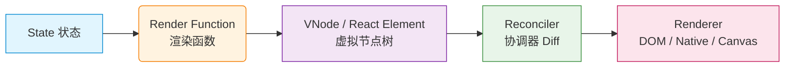
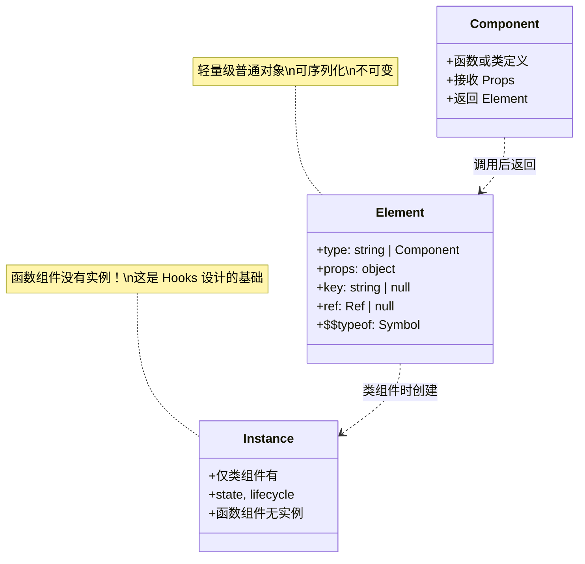
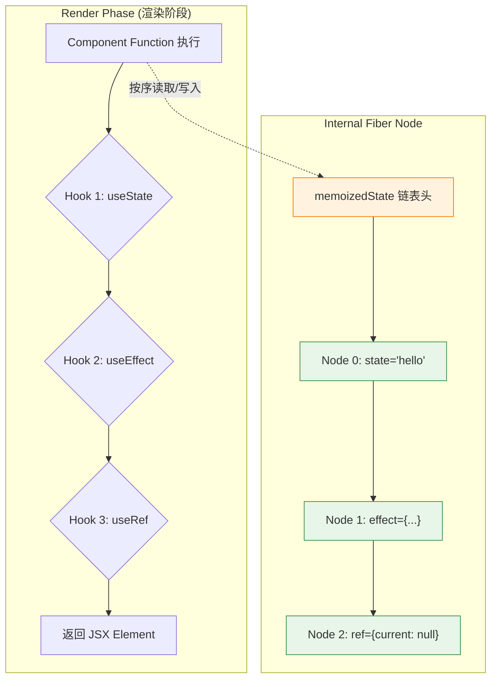
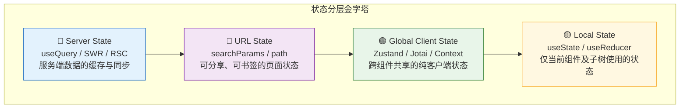
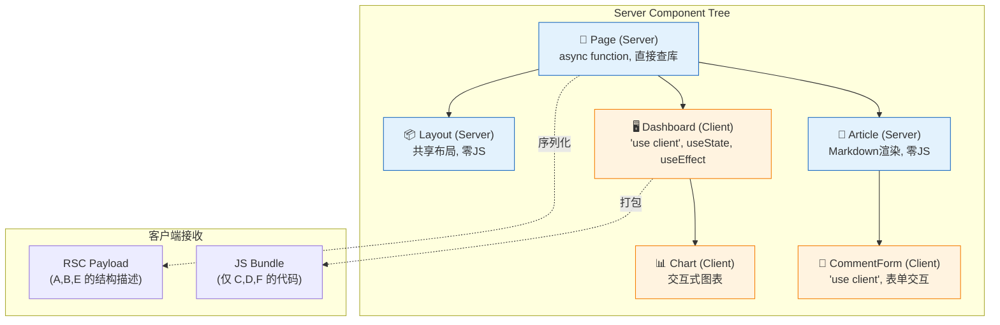
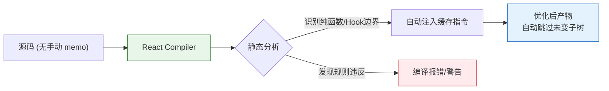
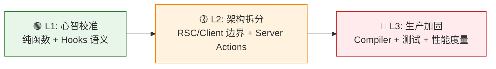
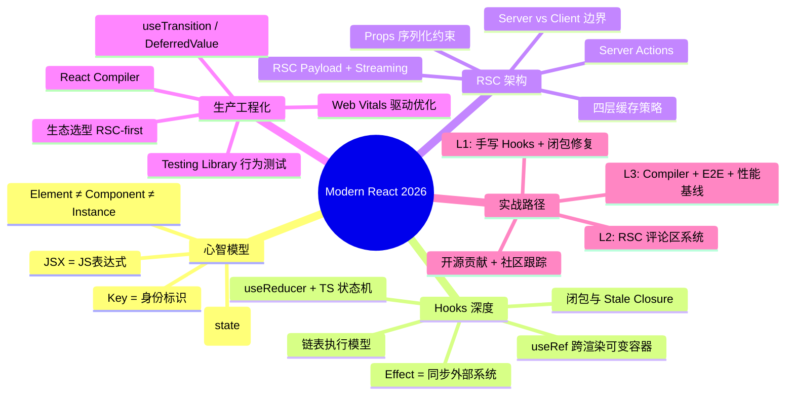

### 一、核心心智模型与 JSX/TSX 深度整合

对于已有 TypeScript 和 Node.js 基础的开发者而言，学习 React 最大的挑战并非语法本身，而是**心智模型的切换**。React 不是模板引擎，而是一个基于 JavaScript/TypeScript 的 UI 状态映射函数。本阶段将帮助你建立正确的声明式思维，并掌握 TSX 在编译层面的真实行为。

#### 1.1 从命令式到声明式：UI = f(state)

在传统 DOM 操作或 jQuery 时代，我们习惯于“命令式”地告诉浏览器每一步该做什么（获取元素 → 修改文本 → 添加类名）。而在 React 中，你只需描述“UI 在某个状态下应该长什么样”，React 负责计算差异并更新 DOM。



> **💡 关键理解**：React 组件本质上是一个**纯函数**（或近似纯函数）。给定相同的 Props 和 State，它必须返回相同的 UI 描述。这意味着你不应该在渲染过程中产生副作用（如直接修改 DOM、发起请求），这些操作应被推迟到 `useEffect` 或事件处理函数中。

**背景补充**：这个公式 `UI = f(state)` 最早由 Elm 语言推广，React 将其带入主流前端。Node.js 开发者可以将其类比为 Express/Koa 中间件：`(req, res) => response`，输入确定则输出确定，只是 React 的输出是 UI 描述而非 HTTP 响应体。

#### 1.2 JSX/TSX 编译真相：它不是模板字符串

许多初学者误以为 JSX 是一种类似 HTML 的模板语言。实际上，JSX 只是 `React.createElement()` （或新版编译器下的 `_jsx()`）调用的**语法糖**。理解这一点对调试和优化至关重要。

```tsx
// ✅ 你写的 TSX
const Greeting: React.FC<{ name: string }> = ({ name }) => {
  return <h1 className="title">Hello, {name}</h1>;
};

// ⚙️ 编译后的 JS（经典模式）
const Greeting = ({ name }) => {
  return React.createElement("h1", { className: "title" }, "Hello, ", name);
};

// ⚙️ 编译后的 JS（新 JSX Transform / React Compiler 模式）
import { jsx as _jsx } from "react/jsx-runtime";
const Greeting = ({ name }) => {
  return _jsx("h1", { className: "title", children: ["Hello, ", name] });
};
```

> **⚠️ 常见误区**：既然 JSX 是函数调用，那么它就遵循 JavaScript 的所有规则。你不能在 JSX 中使用 `if/else`、`for` 等语句，因为它们不能作为表达式嵌入函数参数中。你只能使用三元运算符、逻辑与 `&&`、IIFE 或提取为变量/函数。

#### 1.3 TypeScript 与 React 的类型契约

已有 TS 基础的开发者应避免过度依赖 `any` 或过时的类型写法。以下是现代 React + TS 的类型最佳实践：

|场景|❌ 不推荐|✅ 推荐|原因|
|:--|:--|:--|:--|
|函数组件定义|`React.FC<Props>`|直接声明 `(props: Props) => JSX.Element`|`React.FC` 隐式包含 `children`（旧版）、不支持泛型组件推断、返回值被强制为 `JSX.Element` 无法返回 `null`/`string`|
|Props 类型导出|内联定义|`export interface XxxProps {}`|便于消费方复用、文档生成、测试 Mock|
|事件处理|`any`|`React.ChangeEvent<HTMLInputElement>`|获得完整的类型提示与安全校验|
|Ref 类型|`useRef(null)`|`useRef<HTMLDivElement>(null)`|区分可变 ref 与只读 DOM ref|
|Children|`React.ReactNode` 手动加|按需显式声明 `children?: ReactNode`|避免意外接收非法子节点|

**代码示例：泛型组件的正确姿势**

```tsx
// ✅ 泛型列表组件 —— 无需 React.FC
interface ListProps<T> {
  items: T[];
  renderItem: (item: T) => React.ReactNode;
  keyExtractor: (item: T) => string | number;
}

// 注意：泛型参数放在函数签名上，而非接口名后直接使用
function List<T>({ items, renderItem, keyExtractor }: ListProps<T>) {
  return (
    <ul>
      {items.map((item) => (
        <li key={keyExtractor(item)}>{renderItem(item)}</li>
      ))}
    </ul>
  );
}

// 使用时 TS 自动推断 T 为 User
<List items={users} renderItem={(user) => <span>{user.name}</span>} keyExtractor={(u) => u.id} />
```

#### 1.4 React Element vs Component vs Instance

这三个概念经常被混淆，但对理解 Reconciliation（协调）机制至关重要：



> **💡 为什么这很重要？** 当你写 `<MyComponent />` 时，你并没有“创建”一个组件，你只是创建了一个**描述对象**（Element）。React 在后续的 Reconciliation 阶段才会决定是否需要创建/更新真实的 DOM 节点或类实例。函数组件之所以高效，正是因为它们**没有实例**——每次渲染只是一次纯粹的函数调用。

#### 1.5 Key 的本质：身份标识而非索引

`key` 不是给开发者用的，是给 Reconciler 用的。它是 React 在 Diff 算法中识别节点**身份**的唯一依据。

- **✅ 正确**：使用数据本身的稳定唯一 ID（数据库 ID、UUID）
- **❌ 错误**：使用数组索引作为 key（当列表可排序/过滤/增删时会导致状态错乱与性能退化）
- **❌ 错误**：使用 `Math.random()` 作为 key（每次渲染都重建节点，完全丧失 Diff 优势）

> **🔍 深入理解**：当 key 改变时，React 会认为这是一个**全新的节点**，销毁旧节点及其所有内部状态（包括 Hook 状态、DOM 焦点、动画进度等），然后从零创建新节点。这既是 bug 的来源，也是重置组件状态的有意手段。

---

**本阶段小结**：掌握 React 的核心在于接受“UI 是状态的投影”这一范式。JSX 是 JS 表达式，TypeScript 是组件契约的保障，而 Element/Component/Instance 的区分则是理解后续 Hooks 与性能优化的基石。

### 二、Hooks 机制剖析与状态管理哲学

对于已有 TypeScript 和 Node.js 基础的开发者，理解 Hooks 不应停留在“API 用法”层面，而应深入其**执行模型、闭包语义与并发安全**。本阶段将帮你完成从“类组件生命周期”到“函数式同步模型”的彻底思维转换，并建立现代 React 状态管理的分层哲学。

#### 2.1 Hooks 的执行模型：链表与调用顺序

React Hooks 并非魔法，它们依赖于一个核心约束：**每次渲染必须以完全相同的顺序调用所有 Hooks**。这是因为 React 内部使用链表（而非 Map）来存储每个 Hook 的状态。



> **💡 为什么不能在条件语句中使用 Hooks？**  
> 如果某次渲染跳过了 Hook 2，那么 Hook 3 就会读取到原本属于 Hook 2 的链表节点，导致状态错乱。这类似于 Node.js 中按序读取二进制 Buffer——偏移量一旦错位，后续所有解析都会崩溃。ESLint 插件 `eslint-plugin-react-hooks` 的 `rules-of-hooks` 规则正是为此而生，**务必开启并视为编译级错误**。

#### 2.2 闭包陷阱与 Stale Closure 问题

这是有 JS/TS 基础开发者最容易踩的坑。React 函数组件每次渲染都会创建一个新的闭包作用域，而 `useEffect` / `useCallback` / `useMemo` 捕获的是**创建时**的变量快照，而非最新值。

```tsx
// ❌ 经典 Stale Closure 示例
function Counter() {
  const [count, setCount] = useState(0);

  useEffect(() => {
    const timer = setInterval(() => {
      console.log(count); // 永远打印 0！因为闭包捕获了首次渲染的 count
      setCount(count + 1); // 永远是 0 + 1 = 1
    }, 1000);
    return () => clearInterval(timer);
  }, []); // 空依赖数组 → 只在挂载时创建闭包

  return <div>{count}</div>;
}

// ✅ 修复方案 1：函数式更新（推荐用于 setState）
setCount(prev => prev + 1); // prev 始终是最新值，不依赖外部闭包

// ✅ 修复方案 2：useRef 保存可变引用（适用于非 State 的最新值）
const countRef = useRef(count);
countRef.current = count; // 每次渲染同步更新
// 在 effect 中读取 countRef.current 始终为最新值
```

> **🔍 Node.js 类比**：这与 Node.js 中事件监听器的闭包行为完全一致。如果你在 `http.createServer` 的回调外定义了一个变量并在请求处理函数中引用它，该变量会被所有请求共享且不会自动更新。React 的区别在于每次渲染都创建了新的处理函数，但旧的 Effect 仍持有旧函数的引用。

#### 2.3 useEffect 的正确心智模型：同步而非生命周期

**请彻底遗忘 `componentDidMount` / `componentDidUpdate` / `componentWillUnmount` 的映射关系。** `useEffect` 的本质是：**声明一段需要在渲染后与外部系统保持同步的代码**。

|思维模式|❌ 生命周期思维|✅ 同步思维|
|:--|:--|:--|
|数据获取|“挂载时请求数据”|“当 userId 变化时，同步获取该用户数据”|
|订阅|“挂载时订阅，卸载时取消”|“当 roomId 变化时，同步连接到该房间”|
|DOM 操作|“更新后修改 DOM”|“当 isOpen 变化时，同步对话框的可见性”|
|日志记录|“每次更新时打日志”|⚠️ 这不是同步！用事件处理函数或 useInsertionEffect|

**关键原则**：

- **依赖数组不是“触发条件”**，而是“同步所需的所有响应式值”。遗漏依赖 = 同步不完整 = Bug。
- **清理函数不是“卸载钩子”**，而是“上一次同步效果的撤销”。它在下次 Effect 执行前运行，防止竞态。
- **不需要 Effect 的场景**：派生状态（直接用变量/`useMemo`）、事件响应（直接用事件处理函数）、初始化一次性逻辑（用 `useState(() => init())` 或顶层模块代码）。

#### 2.4 状态管理分层哲学

现代 React 不再追求“单一全局 Store”，而是根据状态的**所有权与作用域**进行分层：



> **💡 决策流程**：
> 
> 1. 这个状态来自服务端吗？→ **Server State**（React Query / RSC）
> 2. 这个状态需要体现在 URL 中（刷新保留、可分享）？→ **URL State**
> 3. 这个状态被多个不相关组件共享且纯客户端？→ **Global Client State**
> 4. 否则 → **Local State**（默认选择）
> 
> **⚠️ Context 不是状态管理器**：Context 是依赖注入机制。当 Context Value 变化时，**所有消费者都会重渲染**（无选择性订阅）。仅在低频更新的全局配置（主题、语言、认证信息）中使用 Context 作为状态载体。高频变化的共享状态请使用 Zustand/Jotai 等支持 selector 的库。

#### 2.5 useReducer vs useState：何时升级

两者本质相同（`useState` 内部就是简化的 `useReducer`），但适用场景不同：

|维度|useState|useReducer|
|:--|:--|:--|
|状态结构|原始值或简单对象|多字段关联、嵌套结构|
|更新逻辑|独立、简单|多个 action 类型、复杂转换|
|可测试性|需在组件内测试|reducer 是纯函数，可独立单元测试|
|状态机建模|不适合|天然适配有限状态机|
|TS 体验|简单推断|可通过 discriminated union 精确约束 action|

```tsx
// ✅ Discriminated Union + useReducer 的 TS 最佳实践
type FormState = { status: 'idle' } 
  | { status: 'submitting'; payload: FormData }
  | { status: 'success'; data: User }
  | { status: 'error'; error: string };

type FormAction = 
  | { type: 'SUBMIT'; payload: FormData }
  | { type: 'SUCCESS'; data: User }
  | { type: 'ERROR'; error: string }
  | { type: 'RESET' };

function formReducer(state: FormState, action: FormAction): FormState {
  switch (action.type) {
    case 'SUBMIT': return { status: 'submitting', payload: action.payload };
    case 'SUCCESS': return { status: 'success', data: action.data };
    case 'ERROR':   return { status: 'error', error: action.error };
    case 'RESET':   return { status: 'idle' };
    // TS 会自动检查穷尽性，遗漏 case 会报错
  }
}
```

#### 2.6 useRef：被低估的多面手

`useRef` 不仅是 DOM 引用，更是 React 函数组件中唯一的**跨渲染可变容器**（类似类组件的实例属性）：

- **DOM 引用**：访问/操作底层 DOM 节点
- **保存最新值**：解决 Stale Closure（见 2.2）
- **存储定时器 ID / AbortController**：避免 State 触发不必要的重渲染
- **标记是否已挂载**：替代 `componentDidMount` 标志位
- **缓存昂贵计算结果**：当 `useMemo` 的依赖过于频繁变化时的降级方案

> **⚠️ 重要约束**：修改 `ref.current` **不会触发重渲染**。如果你需要在修改后更新 UI，必须配合 `setState`。Ref 是“逃生舱”，不是状态的替代品。

---

**本阶段小结**：Hooks 的核心是理解闭包语义与同步模型。状态管理的关键是分而治之，而非集中管控。掌握这些原理后，你将不再“背诵 Hooks 用法”，而是能根据问题本质选择正确的抽象。

### 三、现代 React 架构与服务端组件（RSC）

随着 Next.js App Router 的成熟与 React 19 的发布，React 已从纯粹的客户端库演变为**全栈 UI 框架**。对于有 Node.js 基础的开发者，这是最具优势的阶段——你可以将服务端渲染、流式传输、数据库查询等后端能力直接融入组件树。本阶段将帮你厘清服务端与客户端的职责边界，掌握 RSC 时代的架构范式。

#### 3.1 Server Components vs Client Components：不是 SSR vs CSR

最常见的误解是将 Server Components (RSC) 等同于传统 SSR。**它们是完全不同的抽象层级**：

|维度|传统 SSR|React Server Components|
|:--|:--|:--|
|执行时机|每次请求都在服务端执行|构建时静态生成 + 请求时动态执行（可缓存）|
|输出产物|完整 HTML 字符串|RSC Payload（序列化的虚拟节点树）+ 选择性 HTML|
|客户端水合|整个页面都需要 Hydration|**仅 Client Components 需要 Hydration**|
|状态/Hooks|❌ 不支持|❌ 不支持（但可直接 async/await）|
|包体积|组件代码仍发送到客户端|**服务端组件代码零客户端 bundle**|
|数据获取|getServerSideProps 等独立函数|直接在组件内 `await db.query()`|



> **💡 核心原则**：**默认使用 Server Component**。仅在以下场景添加 `'use client'`：
> 
> - 需要 `useState` / `useEffect` / `useReducer` 等 Hooks
> - 需要浏览器事件监听（onClick, onChange, onSubmit）
> - 需要浏览器专属 API（localStorage, window, IntersectionObserver）
> - 需要使用类组件
> 
> **⚠️ 关键约束**：Client Component **不能**导入或渲染 Server Component（但可以将其作为 `children` 或其他 props 传入）。这是因为客户端无法执行服务端代码。这条边界是单向的。

#### 3.2 RSC Payload 与流式传输（Streaming）

RSC Payload 是一种特殊的二进制序列化格式，它描述了服务端组件树的渲染结果，同时包含客户端组件的占位符与引用。结合 Suspense，React 可以实现**渐进式流式渲染**：

```tsx
// ✅ 流式渲染的典型模式
async function ProductPage({ id }: { id: string }) {
  return (
    <div>
      {/* 立即发送：不依赖异步数据的静态部分 */}
      <ProductHeader />
      
      {/* 流式发送：数据就绪后替换 fallback */}
      <Suspense fallback={<Skeleton />}>
        <ProductDetails id={id} /> {/* async Server Component */}
      </Suspense>
      
      {/* 独立流式：与上方并行获取，互不阻塞 */}
      <Suspense fallback={<ReviewsSkeleton />}>
        <ProductReviews productId={id} />
      </Suspense>
    </div>
  );
}
```

> **🔍 Node.js 类比**：这与 Node.js 的 `res.write()` + `res.end()` 流式响应完全对应。每个 Suspense 边界就像一个独立的 chunk，当对应的 Promise resolve 时，React 通过 HTTP stream 发送该 chunk 的 HTML 补丁，客户端增量替换 fallback。相比传统 SSR 的“全有或全无”，TTI（可交互时间）显著降低。

#### 3.3 Server Actions：类型安全的服务端变更

Server Actions 消除了手动创建 API Route 的样板代码，让你能在组件中直接调用服务端函数，并自动处理 CSRF、乐观更新、表单提交等：

```tsx
// app/actions.ts —— 服务端模块
'use server';

import { revalidatePath } from 'next/cache';
import { z } from 'zod';

const CreatePostSchema = z.object({
  title: z.string().min(1).max(100),
  content: z.string().min(1),
});

export async function createPost(formData: FormData) {
  // ✅ 自动绑定 FormData，也可接收普通对象
  const validated = CreatePostSchema.safeParse({
    title: formData.get('title'),
    content: formData.get('content'),
  });
  
  if (!validated.success) {
    return { error: validated.error.flatten().fieldErrors };
  }
  
  await db.post.create({ data: validated.data });
  revalidatePath('/posts'); // 自动刷新相关 RSC 缓存
  
  return { success: true };
}
```

```tsx
// Client Component 中使用
function NewPostForm() {
  const [state, formAction, isPending] = useActionState(createPost, null);
  
  return (
    <form action={formAction}>
      <input name="title" disabled={isPending} />
      <textarea name="content" disabled={isPending} />
      {state?.error && <p>{JSON.stringify(state.error)}</p>}
      <button disabled={isPending}>{isPending ? '提交中...' : '发布'}</button>
    </form>
  );
}
```

> **💡 为什么优于 fetch('/api/...')？**
> 
> 1. **类型安全**：TS 类型从服务端函数直达客户端，无需手动定义接口
> 2. **自动缓存失效**：`revalidatePath` / `revalidateTag` 与 RSC 缓存深度集成
> 3. **渐进增强**：即使 JS 未加载，`<form action>` 仍可原生提交
> 4. **乐观更新**：配合 `useOptimistic` 实现即时 UI 反馈
> 5. **安全性**：自动注入 CSRF token，防止跨站伪造

#### 3.4 缓存策略分层

RSC 架构引入了多层缓存，理解它们是避免“数据不更新”或“过度请求”的关键：

|缓存层|作用域|失效方式|适用场景|
|:--|:--|:--|:--|
|Request Memoization|单次请求内|自动（请求结束）|同一请求中多个组件获取相同数据|
|Data Cache (Route Segment)|跨请求持久化|`revalidatePath/Tag`、TTL|不常变化的公共数据（导航、配置）|
|Full Route Cache|跨请求持久化|同上 + 动态路由标记|静态生成的完整页面|
|Router Cache (Client)|用户会话内|导航、`router.refresh()`|已访问页面的客户端缓存|

> **⚠️ 常见陷阱**：开发环境中 Data Cache 默认禁用（Next.js 15+），导致每次刷新都重新查询。生产环境则默认启用。务必在开发时通过 `fetch(url, { cache: 'no-store' })` 或 `export const dynamic = 'force-dynamic'` 显式控制，避免上线后出现意外缓存。

#### 3.5 组合模式：Server + Client 的最佳实践

- **Props 传递边界**：Server Component 向 Client Component 传递的数据必须是**可序列化的**（JSON-compatible）。不能传函数、Date 对象、类实例。如需回调，使用 Server Action。
- **Context 仅限客户端**：Context Provider 必须在 Client Component 中。若需在服务端组件间共享数据，使用 Props 钻取或服务端缓存（如 `cache()` / React 19 的 `use()`）。
- **第三方库兼容性**：许多 UI 库（如 shadcn/ui）已适配 `'use client'`。若遇到仅支持服务端的库，封装为 Server Component 包装器；若遇到纯客户端库，确保在使用它的组件顶部声明 `'use client'`。
- **元数据与 SEO**：使用 `generateMetadata`（Server-only）替代 `<head>` 标签，支持异步数据驱动的动态 meta。

---

**本阶段小结**：RSC 时代的核心思维是 **“服务端优先，按需客户端”**。你将 Node.js 的能力直接嵌入组件树，同时通过流式传输与选择性水合保持极致的用户体验。掌握 Server/Client 边界、Server Actions 与缓存分层，你就掌握了 React 全栈开发的基石。


### 四、性能优化、测试与生态工具链

在掌握了核心原理与现代架构后，本阶段将聚焦于**生产级交付能力**。2026 年的 React 生态已进入“编译器辅助 + 精细化度量”时代，手动 `useMemo/useCallback` 正逐渐成为历史。同时，测试策略也从“验证实现细节”转向“验证用户行为”。对于有 Node.js 基础的开发者，这部分内容与后端工程化实践高度同构。

#### 4.1 React Compiler：告别手动记忆化

React Compiler（原 React Forget）是 React 团队推出的自动优化工具，它通过静态分析组件代码，自动插入等效于 `useMemo` / `useCallback` / `React.memo` 的缓存逻辑。



> **💡 思维转变**：
> 
> - **以前**：担心重渲染 → 到处加 `useMemo` → 依赖数组维护痛苦 → 过度优化反而拖慢首次加载
> - **现在**：编写符合 Rules of React 的自然代码 → Compiler 自动处理 → 仅在 Compiler 无法推断时手动干预
> 
> **⚠️ 前提条件**：Compiler 要求组件严格遵守 Hooks 规则与纯函数约定。若你的代码存在副作用泄漏、可变 props 修改等违规操作，Compiler 会报错或跳过优化。**这实际上是一个强制代码规范的静态检查器**。

**启用方式（Next.js App Router）**：

```js
// next.config.ts
const nextConfig = {
  experimental: {
    reactCompiler: true, // Next.js 15+ 内置支持
  },
};
```

#### 4.2 并发特性与过渡更新

React 18+ 引入的并发渲染允许 UI 保持响应，即使在进行大量状态更新时也不会阻塞主线程。核心 API 是 `useTransition` 和 `useDeferredValue`：

|API|用途|典型场景|
|:--|:--|:--|
|`useTransition`|标记非紧急更新为“过渡”，返回 `isPending` 状态|搜索过滤、Tab 切换、路由跳转|
|`useDeferredValue`|延迟更新某个值，优先渲染旧值|实时预览、大列表渲染|
|`startTransition`|命令式版本，用于事件处理函数外|Server Action 调用、第三方库集成|

```tsx
// ✅ 搜索过滤示例：输入框即时响应，结果列表延迟渲染
function SearchResults() {
  const [query, setQuery] = useState('');
  const [isPending, startTransition] = useTransition();
  const [results, setResults] = useState<Item[]>([]);

  const handleChange = (e: ChangeEvent<HTMLInputElement>) => {
    setQuery(e.target.value); // 高优先级：输入框立即更新
    startTransition(() => {
      setResults(filterItems(e.target.value)); // 低优先级：可中断
    });
  };

  return (
    <>
      <input value={query} onChange={handleChange} />
      {isPending && <Spinner />} {/* 过渡期间显示加载指示 */}
      <ItemList items={results} />
    </>
  );
}
```

> **🔍 Node.js 类比**：这与 Node.js 的 `setImmediate` / `process.nextTick` 优先级调度类似。`startTransition` 相当于告诉 React：“这个更新可以延后，别阻塞用户的输入响应。”

#### 4.3 性能度量：从猜想到数据驱动

不要凭感觉优化。使用以下工具定位真实瓶颈：

- **React DevTools Profiler**：录制交互过程，查看每个组件的渲染耗时、触发原因（props changed / state changed / parent rendered）。重点关注 "Why did this render?" 面板。
- **Web Vitals**：LCP（最大内容绘制）、INP（交互到下一次绘制）、CLS（累积布局偏移）。RSC + Streaming 主要改善 LCP；`useTransition` 主要改善 INP。
- **`react-scan` / Million Lint**：新一代运行时检测工具，可在开发环境高亮不必要的重渲染，比 DevTools 更直观。
- **Bundle Analyzer**：`@next/bundle-analyzer` 或 `vite-plugin-inspect`，确认 Tree-shaking 生效、Server Component 代码未泄漏到客户端 bundle。

> **⚠️ 优化决策树**：
> 
> 1. 用户感知到卡顿吗？→ 否 → 停止优化
> 2. 是首屏慢还是交互慢？→ 首屏 → RSC/Streaming/代码分割；交互 → Profiler 定位
> 3. Profiler 显示某组件频繁重渲染？→ 检查是否缺少 key / 内联对象创建 / Context 滥用
> 4. 已启用 Compiler 但仍慢？→ 考虑虚拟化长列表 / Web Worker 计算 / 降级为原生 DOM

#### 4.4 现代测试策略：Testing Library + Vitest

摒弃 Enzyme 时代的“浅渲染”与“实例方法调用”。现代 React 测试遵循 **Testing Library 哲学**：测试用户看到什么、做什么，而非组件内部如何实现。

```tsx
// ✅ 推荐：基于用户行为的测试
import { render, screen } from '@testing-library/react';
import userEvent from '@testing-library/user-event';
import { describe, it, expect, vi } from 'vitest';
import { TodoForm } from './TodoForm';

describe('TodoForm', () => {
  it('提交有效表单后显示成功消息并清空输入', async () => {
    const onSubmit = vi.fn();
    render(<TodoForm onSubmit={onSubmit} />);
    
    await userEvent.type(screen.getByLabelText(/标题/i), '买牛奶');
    await userEvent.click(screen.getByRole('button', { name: /添加/i }));
    
    expect(onSubmit).toHaveBeenCalledWith({ title: '买牛奶' });
    expect(screen.getByText(/添加成功/i)).toBeInTheDocument();
    expect(screen.getByLabelText(/标题/i)).toHaveValue('');
  });

  it('提交空标题时显示验证错误', async () => {
    render(<TodoForm onSubmit={vi.fn()} />);
    await userEvent.click(screen.getByRole('button', { name: /添加/i }));
    
    expect(screen.getByText(/标题不能为空/i)).toBeInTheDocument();
  });
});
```

> **💡 查询优先级**（按推荐顺序）：
> 
> 1. `getByRole` + accessible name（最贴近无障碍体验）
> 2. `getByLabelText` / `getByPlaceholderText`（表单元素）
> 3. `getByText`（可见文本内容）
> 4. `getByTestId`（仅当以上都不适用时作为最后手段）
> 
> **❌ 避免**：`getByClassName`、`querySelector`、访问组件 state/props、测试 useEffect 执行次数。这些测试与实现强耦合，重构即崩溃。

**Vitest 优势**：与 Vite/Next.js 共享配置、原生 ESM/TS 支持、兼容 Jest API、内置 Coverage（via v8/istanbul）。对于已有 Node.js 测试经验的开发者，迁移成本极低。

#### 4.5 生态工具链选型指南

|领域|推荐方案|备选/特定场景|说明|
|:--|:--|:--|:--|
|状态管理|Zustand / Jotai|Redux Toolkit（超大型团队）、Valtio|Zustand 极简 API + TS 友好；Jotai 原子化适合细粒度订阅|
|服务端状态|TanStack Query v5 / SWR|Apollo Client（GraphQL）|RSC 可减少其使用范围，但客户端轮询/乐观更新仍需|
|表单|React Hook Form + Zod|Formik（遗留项目）|非受控模式性能优异，Zod schema 复用前后端校验|
|样式|Tailwind CSS + CVA|CSS Modules、Vanilla Extract|CVA 提供类型安全的变体管理，与 RSC 完美兼容|
|路由|Next.js App Router / TanStack Router|React Router v7|App Router = RSC 原生支持；TanStack Router = 类型安全极致|
|国际化|next-intl / ParaglideJS|react-i18next|next-intl 专为 RSC 设计；ParaglideJS 编译时提取零运行时|

> **⚠️ 选型原则**：
> 
> - **RSC 优先**：能用 Server Component 解决的数据获取，不要用 TanStack Query
> - **Bundle Size 敏感**：优先选择编译时方案（CVA、ParaglideJS）而非运行时方案
> - **TS 一等公民**：拒绝需要额外类型体操或 `any` 断言的库
> - **社区活跃度**：检查 GitHub Issues 响应速度、Next.js/RSC 兼容性文档

---

**本阶段小结**：2026 年的 React 性能优化已从“手工打磨”进入“编译器托管”时代，测试从“验证实现”回归“验证体验”，工具链选型则以 RSC 兼容性与类型安全为核心标尺。掌握这些，你便具备了交付高质量、可维护、高性能 React 应用的完整能力。

### 五、实战演练：从理论到肌肉记忆

对于已有 TypeScript 和 Node.js 基础的开发者，最高效的学习路径不是“从零造轮子”，而是**在真实约束下重构与迁移**。本阶段提供一套渐进式练习体系，每个练习都刻意针对前四阶段的核心心智模型，并附带验收标准与常见陷阱提示。

#### 5.1 练习路线图：三阶跃迁



> **💡 练习原则**：
> 
> - **不追求功能完整**，聚焦单一核心概念的深度验证
> - **先写失败测试**（L3），再实现功能，最后用 Profiler/Compiler 验证
> - **记录决策日志**：为什么选 Server Component？为什么这个状态放 URL？为什么不用 Context？

#### 5.2 L1：心智校准练习（2-3 天）

**目标**：彻底内化 `UI = f(state)`、闭包语义、Hooks 执行顺序。

|练习|核心验证点|验收标准|常见陷阱|
|:--|:--|:--|:--|
|**手写 useState/useEffect**|链表存储、闭包捕获、清理函数时序|能通过 10+ 边界用例测试（连续 setState、依赖变化、卸载清理）|用 Map 代替链表；忽略 stale closure；清理函数执行时机错误|
|**Stale Closure 修复集**|函数式更新、useRef 最新值、依赖数组完整性|5 个经典场景全部修复且 ESLint rules-of-hooks 零警告|过度添加依赖导致无限循环；误用 ref 替代 state|
|**useReducer 状态机重构**|Discriminated Union、纯函数 reducer、可测试性|reducer 独立单元测试覆盖率 100%；组件层仅 dispatch|reducer 内产生副作用；action type 字符串字面量未联合|

**推荐资源**：

- [Build your own React](https://pomb.us/build-your-own-react/) —— 手写迷你 React，理解 Fiber 与 Hooks 本质
- [React Hooks Quiz](https://react-hooks-quiz.vercel.app/) —— 20+ 道闭包与执行顺序陷阱题

#### 5.3 L2：架构拆分练习（3-5 天）

**目标**：掌握 RSC/Client 边界划分、Server Actions、缓存策略。

**练习项目：个人博客评论区系统**

```tsx
// ✅ 期望的组件拆分结果
// app/posts/[slug]/page.tsx (Server)
async function PostPage({ params }: { params: { slug: string } }) {
  const post = await db.post.findUnique({ where: { slug: params.slug } });
  return (
    <article>
      <PostContent content={post.content} /> {/* Server: Markdown渲染 */}
      <Suspense fallback={<CommentsSkeleton />}>
        <CommentList postId={post.id} />     {/* Server: 初始评论列表 */}
      </Suspense>
      <CommentForm postId={post.id} />       {/* Client: 表单交互 */}
    </article>
  );
}
```

**关键检查清单**：

- [ ]  `CommentList` 是 Server Component，直接 `await` 查询数据库
- [ ]  `CommentForm` 是 Client Component，使用 Server Action 提交
- [ ]  提交成功后通过 `revalidatePath` 自动刷新评论列表（非手动 refetch）
- [ ]  评论数据走 Data Cache，表单提交走 no-store
- [ ]  无 `'use client'` 泄漏到不必要的组件
- [ ]  所有 Server → Client 传递的数据均为 JSON-serializable

> **⚠️ 故意犯错练习**：尝试在 Client Component 中直接导入 Server Component，观察编译错误；尝试在 Server Action 中访问 `window`，观察运行时错误。**错误体验比正确示例更能固化边界意识**。

> [!success]- 点击展开题解
> 
> ## 🎯 核心目标解析
> 
> 本练习的核心在于**建立 Next.js App Router 下的“心智模型”**。很多开发者从 Pages Router 或纯 CSR 框架迁移时，最大的痛点不是 API 不会写，而是**不知道代码到底在哪里运行**。
> 
> 评论区系统是一个完美的练习场，因为它天然包含了两种截然不同的数据流：
> 
> 1. **读（Read）**：高频、可缓存、服务端直出 → **Server Component + Data Cache**
> 2. **写（Write）**：低频、需交互、触发状态变更 → **Client Component + Server Action**
> 
> ---
> 
> ## 🏗️ 架构拆分全景图
> 
> 理解 RSC（React Server Components）与 Client Components 的边界，是完成本题的关键。下图展示了请求与交互的完整生命周期：
> 
> ```mermaid
> sequenceDiagram
>     participant User as 用户浏览器
>     participant SC as Server Component<br/>(PostPage / CommentList)
>     participant DB as Database
>     participant CC as Client Component<br/>(CommentForm)
>     participant SA as Server Action<br/>(createComment)
> 
>     Note over User, DB: 阶段一：初始渲染 (SSR)
>     User->>SC: GET /posts/my-article
>     SC->>DB: await db.post.findUnique()
>     DB-->>SC: Post Data
>     SC->>DB: await db.comment.findMany()
>     DB-->>SC: Comments Data
>     SC-->>User: HTML Stream (含评论列表 + 表单壳子)
> 
>     Note over User, SA: 阶段二：用户交互 (Mutation)
>     User->>CC: 填写并提交评论
>     CC->>SA: POST createComment(formData)
>     SA->>DB: INSERT INTO comments...
>     SA->>SA: revalidatePath('/posts/my-article')
>     SA-->>CC: 返回成功状态
>     
>     Note over User, DB: 阶段三：自动刷新 (Revalidation)
>     User->>SC: 触发 RSC Payload 重新获取
>     SC->>DB: 重新查询评论 (绕过缓存)
>     DB-->>SC: New Comments Data
>     SC-->>User: 更新后的 RSC Payload
>     CC->>CC: DOM Patch (评论列表更新)
> ```
> 
> ---
> 
> ## 💡 关键知识点深度拆解
> 
> ### 1. 为什么 `CommentList` 必须是 Server Component？
> 
> **抽象概念解释**：想象 Server Component 是一个“预渲染工厂”。它在服务器上把数据库查出来的数据直接“浇筑”成 HTML 片段发给浏览器。浏览器收到的已经是成品，不需要再发请求去拿评论数据。
> 
> - ✅ **优势**：零客户端 JS Bundle 体积、直接访问后端资源、自动走 Data Cache。
> - ❌ **反模式**：如果在 Client Component 里用 `useEffect` + `fetch` 获取评论列表，会导致瀑布流请求（Waterfall），且无法利用 RSC 的流式渲染。
> 
> ### 2. Server Action 与 `revalidatePath` 的魔法
> 
> 这是本题最容易出错的地方。传统 SPA 中，提交成功后我们需要手动调用 `refetch()` 或更新本地 state。但在 App Router 中：
> 
> ```typescript
> // app/actions.ts
> 'use server'
> 
> export async function createComment(formData: FormData) {
>   const postId = formData.get('postId') as string;
>   const content = formData.get('content') as string;
>   
>   // 1. 写入数据库
>   await db.comment.create({ data: { postId, content } });
>   
>   // 2. 🔑 关键：告诉 Next.js 这个路径的数据已过期
>   // 下次访问该路径时，Server Component 会重新执行查询
>   revalidatePath(`/posts/${postId}`);
> }
> ```
> 
> > [!note] 背景知识补充  
> > `revalidatePath` 并不是“刷新页面”，而是**使该路径对应的 Data Cache 标签失效**。当组件重新渲染时，Next.js 会发现缓存 miss，从而重新执行 `await db.comment.findMany()`，并将新的 RSC Payload 推送给客户端进行 DOM 合并。
> 
> ### 3. 缓存策略的二元对立
> 
> |场景|推荐策略|原因|
> |:--|:--|:--|
> |评论列表展示|**Data Cache** (默认)|同一篇文章的评论在短时间内被多人访问，应复用缓存|
> |表单提交|**no-store**|每次提交都是唯一的副作用操作，绝不应被缓存|
> |实时性要求高|**ISR / Time-based**|如 `export const revalidate = 60`，平衡性能与新鲜度|
> 
> ---
> 
> ## ⚠️ “故意犯错”实验指南
> 
> 题目要求的错误体验是固化边界意识的最佳途径。以下是两个经典错误的预期表现及原理：
> 
> ### 实验 A：在 Client Component 中导入 Server Component
> 
> ```tsx
> // ❌ CommentForm.tsx ('use client')
> import CommentList from './CommentList'; // CommentList 是 Server Component
> 
> export default function CommentForm() {
>   return <CommentList />; // 💥 编译错误
> }
> ```
> 
> **为什么会报错？**  
> Client Component 会在浏览器端打包运行，而 Server Component 依赖服务端运行时（如 `db`、`fs`）。浏览器根本无法执行这些代码。这就像试图在汽车引擎里安装一个飞机涡轮——运行环境完全不兼容。
> 
> **正确做法**：通过 **Children Props** 或 **组合模式** 将 Server Component 作为插槽传入 Client Component。
> 
> ### 实验 B：在 Server Action 中访问 `window`
> 
> ```typescript
> // ❌ actions.ts ('use server')
> export async function createComment() {
>   console.log(window.location.href); // 💥 运行时错误: window is not defined
> }
> ```
> 
> **为什么会报错？**  
> Server Action 虽然写在同一个项目中，但它**始终在服务端执行**。即使它被 Client Component 调用，也只是通过网络 RPC 传输参数和结果。服务端没有 DOM 环境。
> 
> ---
> 
> ## ✅ 自查清单详解
> 
> 完成练习后，请逐项核对：
> 
> - [x]  **JSON-serializable 检查**：Server → Client 传递的 props 不能包含 Date 对象、函数、类实例等。如果 `post.createdAt` 是 Date 类型，必须在 Server Component 中转为 `.toISOString()` 字符串后再传给 Client Component。
> - [x]  **'use client' 泄漏检查**：打开 DevTools → Network → JS Bundle，确认 `CommentList` 的代码没有被打包进客户端 JS。只有 `CommentForm` 及其依赖应该出现在客户端 bundle 中。
> - [x]  **Suspense 边界**：`CommentList` 包裹在 `<Suspense>` 中，确保文章主体内容不会因为评论查询慢而被阻塞渲染。这是 RSC 流式渲染的核心价值。
> 
> > [!tip] 进阶思考  
> > 当你掌握了基础拆分后，可以尝试进一步优化：将 `CommentForm` 中的提交按钮抽取为独立的 Client Component，让表单容器本身保持为 Server Component。这样可以将客户端 JS 体积压缩到极致。**边界划分不是一次性的决策，而是一个持续优化的过程。**

#### 5.4 L3：生产加固练习（3-5 天）

**目标**：Compiler 兼容、行为测试、性能基线建立。

|练习|工具链|验收标准|
|:--|:--|:--|
|**Compiler 迁移**|`react-compiler-healthcheck` + Next.js Compiler|healthcheck 零 error；Profiler 对比优化前后渲染次数下降 ≥30%|
|**E2E 关键路径测试**|Playwright / Vitest + Testing Library|评论提交→列表更新→成功提示全流程覆盖；查询优先用 role/label|
|**性能基线建立**|Web Vitals + Bundle Analyzer|LCP < 2.5s, INP < 200ms；客户端 bundle 无 Server Component 代码泄漏|
|**缓存失效验证**|DevTools Network + 手动 revalidate|确认 Data Cache 命中/miss 符合预期；`revalidatePath` 后下次请求返回新数据|

**Testing Library 练习要点**：

- 为 L2 的评论区编写 3 个核心测试：提交成功、验证失败、加载状态
- **禁止**使用 `getByTestId` 作为首选查询
- **禁止**断言组件内部 state 或 effect 执行次数
- 使用 `userEvent` 而非 `fireEvent`（模拟真实用户交互序列）

> [!success]- 点击展开题解
> 
> ### 🎯 题解概述：React Compiler 与 Next.js 工程化验收体系
> 
> 本题旨在构建一套**现代化的 React/Next.js 质量保障体系**。它不再局限于“功能能不能跑”，而是从编译器优化、用户行为仿真、性能量化指标、缓存一致性四个维度，建立可度量的工程基线。以下是对四个练习模块的深度解析。
> 
> ---
> 
> ### 1. Compiler 迁移：从手动 Memo 到自动优化
> 
> #### 💡 核心概念解释
> 
> **React Compiler (原 React Forget)** 是 React 团队推出的自动记忆化编译器。传统开发中，我们需要手动使用 `useMemo`、`useCallback` 来避免不必要的重渲染；而 Compiler 通过静态分析代码的语义（遵循 Rules of Hooks），自动插入等效的缓存逻辑。
> 
> #### 🛠️ 实施路径与验收
> 
> - **健康检查**：运行 `npx react-compiler-healthcheck`，确保项目符合 Compiler 的严格模式要求（如无条件 Hook 调用、无突变 props/state）。
> - **性能验证**：不能仅凭感觉，必须使用 React DevTools Profiler 录制相同操作序列，对比开启 Compiler 前后的 **Render Count**。
> - **验收标准解读**：“渲染次数下降 ≥30%”意味着 Compiler 成功消除了大量因引用不稳定导致的级联渲染。
> 
> ```mermaid
> graph LR
>     A[源码] --> B{React Compiler}
>     B -- 符合规则 --> C[自动注入 memo/cache]
>     B -- 违反规则 --> D[报错/跳过优化]
>     C --> E[优化后产物]
>     E --> F[Profiler 验证渲染减少≥30%]
> ```
> 
> ---
> 
> ### 2. E2E 关键路径测试：以用户视角驱动
> 
> #### ⚠️ Testing Library 哲学
> 
> Testing Library 的核心原则是 **“测试用户使用方式，而非实现细节”**。这直接对应了题目中的三条禁令：
> 
> |禁止项|原因|推荐替代方案|
> |:--|:--|:--|
> |`getByTestId` 作为首选|testid 是测试专用属性，用户看不到|`getByRole`, `getByLabelText`, `getByText`|
> |断言内部 state/effect|重构即破坏测试，属于白盒测试|断言 UI 可见变化（如错误提示、列表新增项）|
> |`fireEvent`|仅触发单一 DOM 事件，不模拟真实交互序列|`userEvent.click/type`（含 focus, keydown 等完整序列）|
> 
> #### 📝 L2 评论区三大核心测试用例
> 
> ```javascript
> // ✅ 提交成功：关注用户可见结果
> test('提交评论后列表更新并显示成功提示', async () => {
>   const user = userEvent.setup();
>   await user.type(screen.getByLabelText(/评论内容/i), '很棒的文章');
>   await user.click(screen.getByRole('button', { name: /提交/i }));
>   
>   expect(await screen.findByText('很棒的文章')).toBeInTheDocument();
>   expect(screen.getByText(/提交成功/i)).toBeVisible();
> });
> 
> // ✅ 验证失败：关注无障碍友好的错误展示
> test('空内容提交时显示验证错误', async () => {
>   const user = userEvent.setup();
>   await user.click(screen.getByRole('button', { name: /提交/i }));
>   
>   expect(await screen.findByRole('alert')).toHaveTextContent(/不能为空/i);
> });
> 
> // ✅ 加载状态：关注可访问性加载指示器
> test('提交过程中显示加载状态', async () => {
>   const user = userEvent.setup();
>   await user.type(screen.getByLabelText(/评论内容/i), '测试');
>   await user.click(screen.getByRole('button', { name: /提交/i }));
>   
>   expect(screen.getByRole('status')).toHaveTextContent(/提交中/i);
> });
> ```
> 
> ---
> 
> ### 3. 性能基线建立：Web Vitals + Bundle 安全
> 
> #### 📊 关键指标解读
> 
> - **LCP < 2.5s**：最大内容绘制时间，衡量首屏主要内容加载速度。Next.js 中可通过 `<Image priority>`、字体优化、Server Component 流式渲染改善。
> - **INP < 200ms**：Interaction to Next Paint，衡量交互响应延迟。Compiler 优化和减少主线程阻塞是关键手段。
> 
> #### 🔒 Server Component 代码泄漏检测
> 
> 这是 Next.js App Router 特有的风险点：服务端专属代码（如数据库查询、fs 操作）被意外打包进客户端 bundle。
> 
> ```mermaid
> graph TD
>     A[Bundle Analyzer] --> B{检查客户端 Chunk}
>     B -- 发现 server-only 模块 --> C[❌ 代码泄漏]
>     B -- 仅含客户端安全代码 --> D[✅ 通过]
>     C --> E[添加 'use client' 边界或重构]
>     E --> A
> ```
> 
> > **实践建议**：在 CI 中集成 `@next/bundle-analyzer`，设置自动化脚本扫描客户端 chunk 中是否包含 `server-only`、`pg`、`fs` 等服务端模块引用。
> 
> ---
> 
> ### 4. 缓存失效验证：Data Cache 可观测性
> 
> #### 🧠 Next.js 缓存模型理解
> 
> Next.js App Router 有多层缓存，此处重点验证 **Data Cache**（服务端数据请求缓存）：
> 
> ```mermaid
> sequenceDiagram
>     participant Browser
>     participant NextServer
>     participant DataCache
>     
>     Browser->>NextServer: GET /posts
>     NextServer->>DataCache: 查找缓存
>     alt Cache HIT
>         DataCache-->>NextServer: 返回缓存数据
>     else Cache MISS
>         NextServer->>Database: 查询新数据
>         Database-->>NextServer: 返回结果
>         NextServer->>DataCache: 写入缓存
>     end
>     NextServer-->>Browser: 渲染页面
>     
>     Note over NextServer: revalidatePath('/posts')
>     Browser->>NextServer: 再次 GET /posts
>     NextServer->>DataCache: 缓存已失效 → MISS
>     NextServer->>Database: 重新查询
> ```
> 
> #### ✅ 验证步骤
> 
> 1. **首次请求**：DevTools Network 面板观察响应头 `x-nextjs-cache: MISS`，随后变为 `HIT`。
> 2. **触发失效**：调用 `revalidatePath('/posts')`（如通过 Server Action）。
> 3. **再次请求**：确认响应头重新变为 `MISS`，且页面数据已更新。
> 4. **后续请求**：确认再次变为 `HIT`，证明缓存已重建。
> 
> ---
> 
> ### 📚 背景知识补充
> 
> - **为什么强调 `userEvent` 而非 `fireEvent`？**  
>     `fireEvent.click()` 仅派发一个 click 事件；而 `userEvent.click()` 会依次触发 pointerdown → focus → pointerup → click，更贴近浏览器真实行为，能暴露更多交互 bug。
>     
> - **React Compiler 与 `react-compiler-healthcheck` 的关系**  
>     Healthcheck 工具扫描的是代码是否遵守“React 纯函数组件规则”。只有通过的代码才能被 Compiler 安全优化；未通过的代码会被跳过，不会报错但也不会获得性能收益。
>     
> - **INP 取代 FID 的意义**  
>     Google 于 2024 年用 INP 替代 FID 作为 Core Web Vital。FID 仅测量首次输入延迟，而 INP 测量页面生命周期内**所有**交互的最差响应时间，更全面反映交互体验。
>

#### 5.5 持续精进：开源贡献与社区跟踪

|活动|频率|价值|
|:--|:--|:--|
|阅读 React RFC / PR|每周 1-2 篇|理解设计决策背后的权衡，而非仅接受结论|
|参与 next.js / react Discussions|按需|解答他人问题时暴露自身知识盲区|
|为 UI 库提交 RSC 兼容 PR|每月 1 次|在实践中深化 Server/Client 边界理解|
|撰写技术博客/笔记|每完成一个练习|费曼学习法：能讲清楚才是真懂|

> **💡 给 Node.js 背景开发者的特别建议**：  
> 你在后端积累的**分层架构、缓存策略、类型契约、可观测性**思维，在 RSC 时代是直接可迁移的资产。不要将自己定位为“前端学习者”，而是“全栈 UI 工程师”。React 只是你表达服务端能力的新界面层。

#### 5.6 自测清单：你是否真正掌握了现代 React？

完成所有练习后，用以下问题检验自己：

- [ ]  能否不看文档解释 `useEffect` 的清理函数何时执行、为什么执行？
- [ ]  能否在 30 秒内判断一个新需求应该用 Server Component、Client Component 还是 Server Action？
- [ ]  能否解释为什么 Context 不适合高频更新的共享状态？
- [ ]  能否在不使用 `useMemo/useCallback` 的情况下写出 Compiler 友好的组件？
- [ ]  能否为任意组件编写不依赖实现细节的行为测试？
- [ ]  能否解释 RSC Payload 与传统 SSR HTML 的本质区别？
- [ ]  能否在生产环境中诊断并修复一个 Stale Closure 导致的 Bug？

**若 7 项全部肯定，你已具备高级 React 工程师的核心能力。**

---

### 📚 总结：你的现代 React 知识图谱



> **🎯 最终寄语**：  
> React 的演进从未停止，但其核心哲学始终如一：**声明式、组合化、贴近原生平台**。你所建立的这些心智模型，不会因下一个框架的出现而过时。它们是你在 Web UI 领域长期成长的根基。保持好奇，保持实践，保持对底层原理的敬畏。
