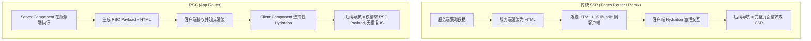
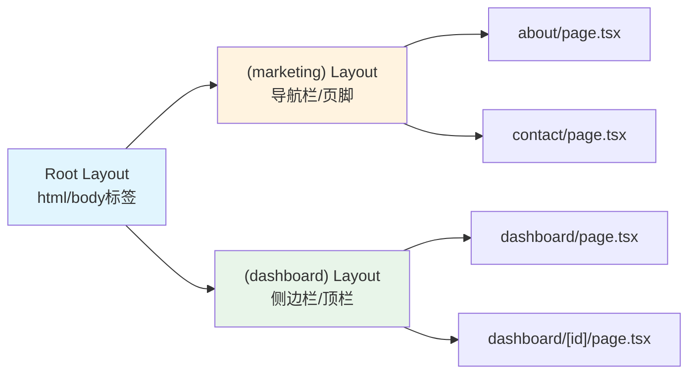
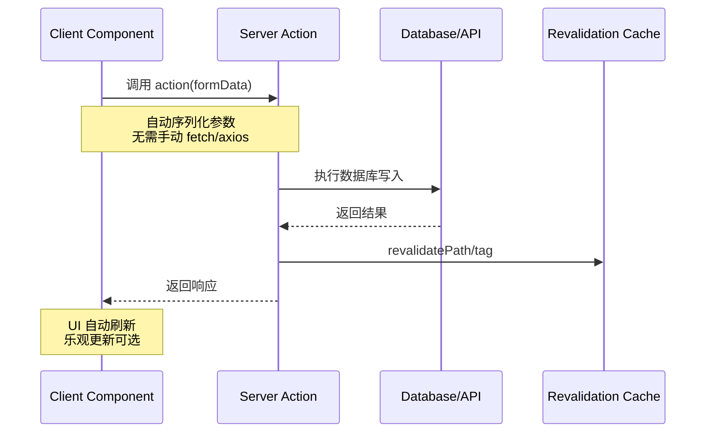
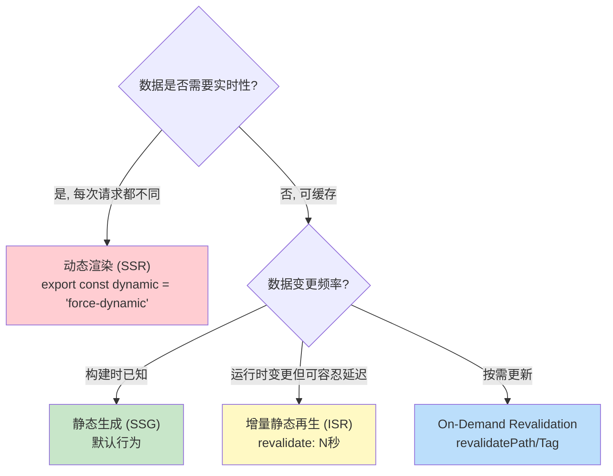
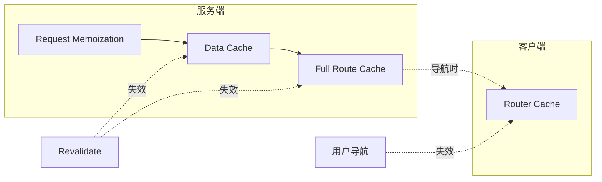
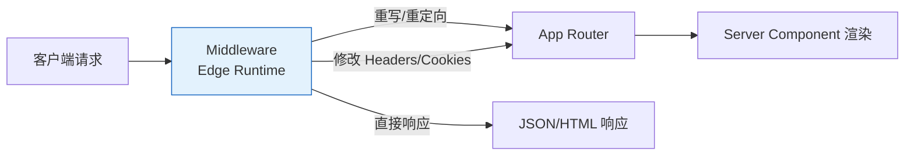

### 一、核心范式与路由系统

对于已有 React 基础的开发者而言，学习 Next.js App Router 最大的挑战并非 API 本身，而是**心智模型的切换**。在传统的 Create React App 或 Vite + React 项目中，我们习惯了“一切皆客户端组件”；而在 Next.js App Router 中，默认的一切皆服务端。本节将帮助你建立正确的 RSC 思维，并掌握文件系统路由的核心机制。

#### 1.1 心智模型：从 SPA 到 RSC

在深入代码之前，必须理解 React Server Components (RSC) 与传统 SSR 的区别。很多开发者误以为 RSC 只是“在服务端渲染的组件”，这并不准确。



**关键概念辨析：**

|特性|Server Component (默认)|Client Component (`'use client'`)|
|:--|:--|:--|
|**执行环境**|仅在服务端|服务端预渲染 + 客户端交互|
|**Bundle 大小**|零 JS 发送到客户端|包含完整组件代码及依赖|
|**状态管理**|❌ 不可用 useState/useEffect|✅ 完整 Hooks 支持|
|**DOM 操作**|❌ 不可访问 window/document|✅ 可访问浏览器 API|
|**数据获取**|✅ 直接 async/await 查库/API|⚠️ 需 useEffect 或 SWR/TanStack|
|**导入限制**|可导入 Client Component|❌ 不可导入 Server Component|

> 💡 **为什么这很重要？**  
> 在传统 React 中，一个深层嵌套的组件树会导致所有组件的 JS 都被打包发送。而在 RSC 架构下，只有标记了 `'use client'` 的组件及其子树才会被发送到浏览器。这意味着你可以将大量纯展示、数据驱动的组件保留在服务端，显著减少客户端 JavaScript 体积。

#### 1.2 App Router 文件系统路由

Next.js App Router 采用**文件夹即路由**的约定式路由系统，所有路由文件位于 `app/` 目录下。

##### 核心文件约定

每个路由段（Route Segment）是一个文件夹，其中包含以下特殊文件：

- **`page.tsx`**：路由的主页面内容，使该路径可公开访问。**必填**。
- **`layout.tsx`**：共享布局，包裹当前及所有子路由，导航时**不会重新挂载**（保留状态）。
- **`loading.tsx`**：配合 `<Suspense>` 实现路由级加载 UI，支持流式渲染。
- **`error.tsx`**：路由级错误边界，自动包裹 `page` 和子路由。
- **`not-found.tsx`**：自定义 404 页面。
- **`template.tsx`**：类似 layout，但每次导航都会**重新挂载**（适用于需要重置状态的场景，如滚动位置重置）。

##### 路由分组与动态段

```
app/
├── (marketing)/          # 路由分组：不影响 URL 路径，用于组织代码
│   ├── about/page.tsx    # → /about
│   └── contact/page.tsx  # → /contact
├── (dashboard)/          # 另一个分组，可拥有独立 layout
│   ├── dashboard/
│   │   ├── page.tsx      # → /dashboard
│   │   └── [id]/         # 动态路由段
│   │       └── page.tsx  # → /dashboard/123
├── [...slug]/            # Catch-all 路由
│   └── page.tsx          # → /docs/a/b/c
└── /      # Optional Catch-all
    └── page.tsx          # → / 或 /any/path
```

> 💡 **路由分组 `(name)` 的价值**  
> 在实际项目中，不同页面可能需要完全不同的根布局（例如营销页 vs 后台管理页）。路由分组允许你在不改变 URL 结构的前提下，为不同页面组创建独立的 `layout.tsx`，避免条件渲染带来的复杂性。

#### 1.3 Layout 嵌套与状态保持

Layout 是 Next.js 性能优化的关键机制之一。理解其嵌套行为对构建流畅的用户体验至关重要。



**核心要点：**

- Root Layout (`app/layout.tsx`) 是必须的，且必须包含 `<html>` 和 `<body>` 标签。
- 当用户在 `/dashboard` 和 `/dashboard/123` 之间导航时，`(dashboard)/layout.tsx` **不会重新渲染**，只有 `page.tsx` 会更新。这意味着侧边栏的展开状态、搜索框输入等本地状态会被自然保留。
- Layout 之间可以通过 props 传递数据，但更推荐使用 Server Context 或直接在 Server Component 中查询数据（因为每个 Layout 都可以是异步的）。

#### 1.4 Metadata API

Next.js 提供了类型安全的元数据管理系统，替代了传统 `react-helmet` 等第三方库。

```typescript
// app/blog/[slug]/page.tsx
import type { Metadata } from 'next'

// 静态元数据
export const metadata: Metadata = {
  title: '博客列表',
  description: '最新文章汇总',
}

// 动态元数据（基于路由参数或数据查询）
export async function generateMetadata({ params }: Props): Promise<Metadata> {
  const post = await getPost(params.slug)
  return {
    title: `${post.title} | My Blog`,
    openGraph: {
      images: [`/og/${params.slug}.png`],
    },
  }
}
```

**设计哲学：** Metadata 只在 Server Component 中定义，永远不会泄露到客户端 Bundle 中。这与 RSC 的理念一致——将尽可能多的逻辑留在服务端。

#### 1.5 常见陷阱与最佳实践

1. **不要过早添加 `'use client'`**：问自己“这个组件真的需要交互吗？”如果只是展示数据，即使数据来自 props，也应该是 Server Component。
2. **Client Component 应尽量下沉**：将 `'use client'` 标记在组件树的叶子节点，而非根部。这样可以让更多的父级组件保持为 Server Component。
3. **避免在 Layout 中使用 Search Params**：Layout 不会因 search params 变化而重新渲染。如需响应 URL 查询参数，请使用 `page.tsx` 或 Client Component 中的 `useSearchParams()`。
4. **TypeScript 路由类型安全**：推荐使用 `next-typesafe-url` 或 Next.js 15+ 内置的类型推断，避免手动拼接字符串路径导致的运行时错误。

> ⚠️ **背景补充：为什么 Next.js 要推 App Router？**  
> Pages Router 的数据获取方法（getServerSideProps/getStaticProps）与组件分离，导致代码割裂且难以组合。App Router 通过 RSC 让数据获取回归组件本身（async components），同时通过 Streaming 解决了 SSR 瀑布流问题。这不是为了“换而换”，而是对 React 全栈开发范式的根本性重构。

---
### 二、数据获取与服务端渲染机制

在掌握了路由与 RSC 心智模型后，本阶段将聚焦于 Next.js 最核心的差异化能力：**如何在服务端高效、安全地获取数据，并精确控制渲染与缓存策略**。对于已有 Node.js 基础的开发者，这部分内容是将“前端框架”升级为“全栈应用框架”的关键。

#### 2.1 Server Actions：服务端变更的范式革新

Server Actions 是 Next.js App Router 中处理表单提交、数据变更的首选方案。它本质上是一个**运行在服务端的异步函数**，但可以在 Client Component 中像调用普通函数一样直接使用。



**核心实现示例：**

```typescript
// app/actions/create-post.ts
'use server'

import { revalidatePath } from 'next/cache'
import { z } from 'zod'

const schema = z.object({
  title: z.string().min(1),
  content: z.string().min(10),
})

export async function createPost(formData: FormData) {
  // ✅ 服务端验证，永不信任客户端输入
  const validated = schema.safeParse({
    title: formData.get('title'),
    content: formData.get('content'),
  })

  if (!validated.success) {
    return { error: validated.error.flatten().fieldErrors }
  }

  await db.post.create({ data: validated.data })

  // ✅ 精确失效缓存，而非全量刷新
  revalidatePath('/posts')
  return { success: true }
}
```

> 💡 **为什么不用 API Route + fetch？**  
> 传统方式需要：定义 API 端点 → 编写请求逻辑 → 处理序列化/反序列化 → 管理加载状态 → 手动刷新缓存。Server Actions 将这些步骤压缩为一个类型安全的函数调用，且天然避免了 CSRF 风险（因为函数只在服务端执行）。

**关键约束与安全须知：**

- `'use server'` 指令必须放在文件顶部或函数体内。
- **所有参数和返回值必须是可序列化的**（不能传 Date、Map、Set、类实例等）。
- **永远在服务端重新验证数据**：客户端验证仅用于 UX，服务端验证才是安全防线。
- Server Actions 默认接受 `FormData`，也可通过 `.bind()` 预绑定参数。

#### 2.2 数据获取模式决策树

Next.js App Router 移除了 `getServerSideProps` / `getStaticProps`，将所有数据获取统一为 **async Server Components + Route Handlers**。选择正确的模式直接影响性能与用户体验。



**三种核心获取方式对比：**

|方式|适用场景|缓存行为|注意事项|
|:--|:--|:--|:--|
|**Async Server Component**|页面主数据、布局数据|默认缓存（GET）|首选方式，零客户端开销|
|**Route Handler (`route.ts`)**|第三方 Webhook、非 GET 请求、流式响应|不缓存（除非手动配置）|替代原 API Routes|
|**Client-side Fetch**|高频轮询、用户专属实时数据|浏览器缓存/SWR/TanStack|仅在必要时使用|

> ⚠️ **重要背景：Fetch 缓存语义变化**  
> 在 Next.js 14+ 中，`fetch()` 的请求**默认被缓存**（等同于 `cache: 'force-cache'`）。这与原生 Fetch API 的行为相反！若需动态数据，必须显式声明：
> 
> ```typescript
> // 方式1：路由级别
> export const dynamic = 'force-dynamic'
> 
> // 方式2：请求级别
> fetch(url, { cache: 'no-store' })
> ```

#### 2.3 缓存层架构深度解析

Next.js 拥有四层缓存机制，理解它们是调试“数据不更新”问题的关键。



|缓存层|作用域|生命周期|失效方式|
|:--|:--|:--|:--|
|**Request Memoization**|单次请求内|请求结束即失效|自动去重相同 fetch|
|**Data Cache**|跨请求持久化|永久（直到 revalidate）|`revalidatePath/Tag`|
|**Full Route Cache**|跨请求持久化|永久（直到 revalidate）|同上 + 动态路由自动跳过|
|**Router Cache**|客户端内存|会话级（5分钟 TTL）|用户导航 / `router.refresh()`|

> 💡 **实用调试技巧**  
> 在 `next.config.js` 中开启 `logging.fetches.fullUrl: true`，可在开发服务器控制台看到每个 fetch 的缓存命中状态（HIT/MISS），快速定位缓存问题。

#### 2.4 流式渲染与 Suspense 边界

Streaming 是 Next.js 解决“慢数据阻塞整页”的核心方案。它将 HTML 分块发送，让用户立即看到部分内容。

```tsx
// app/dashboard/page.tsx
import { Suspense } from 'react'

export default function DashboardPage() {
  return (
    <div>
      {/* ✅ 立即渲染，无需等待 */}
      <h1>Dashboard</h1>

      {/* ⏳ 慢数据独立加载，不阻塞上方内容 */}
      <Suspense fallback={<AnalyticsSkeleton />}>
        <AnalyticsChart /> {/* async Server Component */}
      </Suspense>

      {/* ⏳ 另一个独立的数据源 */}
      <Suspense fallback={<RecentOrdersSkeleton />}>
        <RecentOrders />
      </Suspense>
    </div>
  )
}
```

**进阶：并行数据获取 vs 顺序瀑布**

```tsx
// ❌ 错误：顺序等待，总耗时 = sum(各请求)
async function Page() {
  const users = await getUsers()     // 2s
  const posts = await getPosts()     // 3s ← 等 users 完成才开始
  return <Content users={users} posts={posts} />
}

// ✅ 正确：并行获取，总耗时 = max(各请求)
async function Page() {
  const [users, posts] = await Promise.all([
    getUsers(),   // 2s
    getPosts(),   // 3s ← 同时发起
  ])
  return <Content users={users} posts={posts} />
}
```

> 💡 **何时用 Streaming vs Parallel Fetch？**
> 
> - **Parallel Fetch**：多个数据源相互独立且都需要展示 → 减少总等待时间。
> - **Streaming + Suspense**：某些数据明显更慢，且页面有有意义的“部分可用”状态 → 提升感知性能。
> - 两者可组合使用：在 Suspense 边界内部仍可并行获取多个数据源。

#### 2.5 常见陷阱与最佳实践

1. **避免在 Server Component 中 try-catch 吞掉错误**：让错误冒泡到最近的 `error.tsx`，而非静默失败。用户应知道出了问题。
2. **Cookie/Header 会使路由变为动态**：在 Server Component 中读取 `cookies()` 或 `headers()` 会导致整个路由无法被静态缓存。若只需部分动态，将其隔离到独立的 Client Component 或 Route Handler 中。
3. **Server Actions 不是万能的**：对于文件上传、SSE 流、WebSocket 等场景，仍需使用 Route Handlers。Server Actions 专注于表单变更。
4. **TypeScript 类型共享**：利用 Zod schema 同时生成服务端验证逻辑和客户端类型推断，避免手写 interface 与验证逻辑不一致：
    
    ```typescript
    const schema = z.object({ name: z.string() })
    type PostInput = z.infer<typeof schema> // 自动推导类型
    ```
    

---

### 三、工程化优化与生产部署

掌握了路由与数据获取后，应用已具备基本功能。本阶段将聚焦于**生产级质量保障**：如何通过 Next.js 内置原语实现性能优化、请求拦截、安全认证及多环境部署。这些能力是将“Demo”转化为“产品”的分水岭。

#### 3.1 性能优化原语

Next.js 提供了三个核心优化组件，它们不是简单的 HTML 标签包装，而是深度集成了构建时处理与运行时调度的系统级方案。

##### Image 组件

```tsx
import Image from 'next/image'

<Image
  src="/hero.jpg"
  alt="Hero banner"
  width={1200}
  height={600}
  priority              // ✅ LCP 图片预加载
  placeholder="blur"    // ✅ 模糊占位符（需配合 blurDataURL）
  sizes="(max-width: 768px) 100vw, 50vw" // ✅ 响应式尺寸提示
/>
```

> 💡 **为什么不用原生 ``？**  
> `next/image` 在构建时自动生成 WebP/AVIF 格式、多尺寸 srcset，并在运行时通过 Intersection Observer 实现懒加载。它还会自动设置 `aspect-ratio` 防止布局偏移（CLS）。对于外部图片，需在 `next.config.js` 中配置 `remotePatterns`。

##### Font 优化

```tsx
// app/layout.tsx
import { Inter } from 'next/font/google'

const inter = Inter({
  subsets: ['latin'],
  display: 'swap',      // ✅ 避免 FOIT
  variable: '--font-inter', // ✅ CSS 变量引用，支持 Tailwind
})

export default function RootLayout({ children }) {
  return (
    <html lang="en" className={inter.variable}>
      <body>{children}</body>
    </html>
  )
}
```

**核心价值**：`next/font` 会在构建时下载字体文件并自托管，完全消除对 Google Fonts 的外部请求，同时自动生成 `font-display: swap` 和 size-adjust 指标，将 CLS 降至接近零。

##### Script 调度

```tsx
import Script from 'next/script'

{/* ✅ 第三方分析脚本延迟到交互完成后加载 */}
<Script
  src="https://analytics.example.com/script.js"
  strategy="afterInteractive"
/>
```

|Strategy|加载时机|适用场景|
|:--|:--|:--|
|`beforeInteractive`|hydration 之前|关键 polyfill、同意管理|
|`afterInteractive`|hydration 之后（默认）|分析、广告|
|`lazyOnload`|空闲时间|聊天插件、非关键 SDK|
|`worker`|Web Worker 中|重型第三方脚本（实验性）|

#### 3.2 Middleware：请求级拦截层

Middleware 运行在 **Edge Runtime** 上，在所有路由渲染之前执行。它是实现认证守卫、地理重定向、A/B 测试等横切关注点的唯一正确位置。



**典型实现：认证守卫 + 国际化**

```typescript
// middleware.ts
import { NextResponse } from 'next/server'
import type { NextRequest } from 'next/server'

export function middleware(request: NextRequest) {
  const token = request.cookies.get('session')?.value
  const isAuthPage = request.nextUrl.pathname.startsWith('/dashboard')

  // ✅ 未认证访问受保护路由 → 重定向登录
  if (isAuthPage && !token) {
    return NextResponse.redirect(new URL('/login', request.url))
  }

  // ✅ 已认证访问登录页 → 重定向首页
  if (!isAuthPage && token && request.nextUrl.pathname === '/login') {
    return NextResponse.redirect(new URL('/dashboard', request.url))
  }

  // ✅ 基于 Accept-Language 或 Cookie 的国际化重写
  const locale = request.cookies.get('locale')?.value || 'zh-CN'
  const pathnameHasLocale = /^\/(en|zh-CN)/.test(request.nextUrl.pathname)
  
  if (!pathnameHasLocale) {
    return NextResponse.rewrite(
      new URL(`/${locale}${request.nextUrl.pathname}`, request.url)
    )
  }

  return NextResponse.next()
}

export const config = {
  matcher: ['/((?!api|_next/static|favicon.ico).*)'], // ✅ 精确匹配，避免拦截静态资源
}
```

> ⚠️ **Edge Runtime 限制**  
> Middleware 不支持 Node.js 完整 API（如 fs、child_process、部分 crypto）。若需数据库查询，应在 Server Component 或 Route Handler 中完成，Middleware 仅做轻量级决策。可使用 `@vercel/edge` 或 `jose` 等 Edge 兼容库进行 JWT 验证。

#### 3.3 认证集成最佳实践

对于已有 Node.js 基础的开发者，推荐以下认证方案选型：

|方案|适用场景|与 Next.js 集成度|备注|
|:--|:--|:--|:--|
|**Auth.js (v5)**|通用 OAuth/邮箱/密码|⭐⭐⭐⭐⭐|App Router 原生支持，Server Actions 友好|
|**Clerk**|SaaS 产品、快速上线|⭐⭐⭐⭐⭐|托管服务，UI 组件开箱即用|
|**Lucia Auth**|自建认证、极致控制|⭐⭐⭐⭐|轻量级，直接操作 DB session|
|**Passport.js**|传统 Express 迁移|⭐⭐|不推荐用于 App Router|

**Auth.js v5 核心模式：**

```typescript
// auth.ts
import NextAuth from 'next-auth'
import GitHub from 'next-auth/providers/github'

export const { handlers, signIn, signOut, auth } = NextAuth({
  providers: [GitHub],
  pages: { signIn: '/login' }, // ✅ 自定义登录页
})

// app/api/auth/[...nextauth]/route.ts
export const { GET, POST } = handlers

// Server Component 中获取会话
import { auth } from '@/auth'
export default async function ProfilePage() {
  const session = await auth() // ✅ 服务端直接读取，无需 Context
  if (!session) redirect('/login')
  return <div>Welcome, {session.user.name}</div>
}
```

> 💡 **安全提醒**  
> 永远不要在 Client Component 中存储敏感 token。使用 HttpOnly Cookie 存储 session，通过 Server Component 或 Server Action 传递必要信息。Auth.js/Clerk 已默认遵循此模式。

#### 3.4 部署方案对比

|平台|优势|劣势|适用场景|
|:--|:--|:--|:--|
|**Vercel**|零配置、Edge Functions、Analytics|厂商锁定、商业项目费用高|个人项目、初创团队、追求极致 DX|
|**Node.js Self-hosted**|完全控制、无平台限制|需自行配置 CDN/缓存/监控|企业内网、合规要求、成本敏感|
|**Docker + Cloud Run/Fly.io**|容器化、可移植、自动扩缩容|冷启动、无 Edge Runtime|微服务架构、多云策略|
|**Cloudflare Pages**|全球 Edge、Workers 生态|Node.js API 受限|边缘优先应用、静态为主|

**Self-hosted 关键配置：**

```js
// next.config.js
module.exports = {
  output: 'standalone', // ✅ 生成独立部署包，无需 node_modules
  compress: true,
  poweredByHeader: false, // ✅ 隐藏 X-Powered-By
}
```

> ⚠️ **Standalone 模式注意事项**  
> `output: 'standalone'` 生成的 `.next/standalone` 目录仅包含必要文件。部署时需确保：
> 
> 1. 复制 `.next/static` 到 `standalone/.next/static`
> 2. 复制 `public` 到 `standalone/public`
> 3. 使用 `node standalone/server.js` 启动（而非 `next start`）
> 4. 配置反向代理（Nginx/Caddy）处理静态文件与压缩

#### 3.5 环境变量与安全

```bash
# .env.local
DATABASE_URL=postgresql://...     # ✅ 仅服务端可用
NEXT_PUBLIC_API_URL=https://...   # ⚠️ 暴露到客户端 Bundle
SECRET_KEY=xxx                    # ✅ 仅服务端，NEXT_PUBLIC_ 前缀 = 公开
```

**安全检查清单：**

- [ ]  所有密钥均无 `NEXT_PUBLIC_` 前缀
- [ ]  `.env*.local` 已加入 `.gitignore`
- [ ]  生产环境通过平台 Secrets Manager 注入，而非提交文件
- [ ]  Server Actions 中对用户输入做了服务端验证
- [ ]  Middleware 的 matcher 排除了 `_next/static` 等内部路径

---

### 四、练习

本阶段旨在通过分层级的实战题目，将前三个阶段的心智模型、数据获取机制与工程化能力转化为肌肉记忆。所有题目均基于 **Next.js App Router + TypeScript**，建议按顺序完成。每道题标注了考察重点与预期产出，便于自我评估。

#### 4.1 基础巩固：路由与 RSC 心智模型

> 🎯 **目标**：验证对 Server/Client Component 边界、文件路由约定及 Layout 嵌套的理解。

|#|题目描述|考察重点|预期产出|
|:--|:--|:--|:--|
|1|创建一个博客系统，包含首页（文章列表）、文章详情页 `/blog/[slug]`、关于页 `/about`。要求：首页和关于页共享带导航栏的布局；文章详情页使用全屏阅读布局，无导航栏。|路由分组 `(marketing)` vs `(reader)`、独立 Layout|两套独立 layout.tsx，URL 无分组前缀|
|2|在上述博客的文章详情页中，实现一个“点赞按钮”。要求：点赞数从数据库读取（Server Component），点击后实时更新且无需刷新页面。|`'use client'` 下沉策略、Server Action 调用|点赞逻辑封装为独立 Client Component，父级保持为 Server Component|
|3|为文章详情页添加动态 Metadata：标题为 `{文章标题} \| My Blog`，OG Image 为 `/og/{slug}.png`。若文章不存在，返回自定义 404 页面。|`generateMetadata`、`not-found.tsx`、异步数据复用|类型安全的元数据生成 + 优雅降级|

**自检问题：**

- 如果在 `layout.tsx` 中使用了 `useSearchParams()`，会发生什么？如何正确解决？
- 为什么点赞按钮不能直接放在 `page.tsx` 中并标记 `'use client'`？这样做会损失什么？

> [!success]- 点击展开题解
> 
> ### 💡 核心概念前置：RSC 与文件路由心智模型
> 
> 在开始解题前，我们需要建立一个关键认知：**Next.js App Router 的路由系统是基于文件系统的“服务端优先”架构**。
> 
> - **默认即服务端**：所有组件默认都是 Server Component (RSC)，只有在显式声明 `'use client'` 时才进入客户端边界。
> - **路由分组不影响 URL**：`(group)` 文件夹仅用于组织代码和共享布局，不会出现在最终路径中。
> - **Layout 嵌套是单向的**：子路由会继承父级 Layout，但通过路由分组可以实现“平行且互斥”的布局体系。
> 
> ---
> 
> ### 1️⃣ 题目一：双布局博客系统（路由分组实战）
> 
> #### 🏗️ 目录结构设计
> 
> ```text
> app/
> ├── (marketing)/        # 营销/通用页面组（带导航栏）
> │   ├── layout.tsx      # ✅ 包含 Navbar + Footer
> │   ├── page.tsx        # 首页 /
> │   └── about/
> │       └── page.tsx    # 关于页 /about
> ├── (reader)/           # 阅读体验组（全屏沉浸式）
> │   ├── layout.tsx      # ✅ 纯净布局，无导航栏
> │   └── blog/
> │       └── [slug]/
> │           └── page.tsx # 文章详情 /blog/[slug]
> ├── layout.tsx          # 根布局（html/body/字体等全局配置）
> └── not-found.tsx       # 全局404
> ```
> 
> #### 🔑 关键解析
> 
> - **为什么用路由分组？** 如果不使用 `(marketing)` 和 `(reader)`，你需要把 `blog/[slug]` 放在根目录下并单独处理布局切换逻辑，这会导致根 `layout.tsx` 变得臃肿且条件判断复杂。
> - **URL 无感知**：访问 `/about` 时，用户完全不知道它物理上位于 `(marketing)/about/` 下。这是路由分组最核心的价值——**代码组织与用户体验解耦**。
> 
> #### 📊 布局嵌套关系图
> 
> ```mermaid
> graph TD
>     Root["Root Layout<br/>(html, body, fonts)"]
>     Marketing["(marketing) Layout<br/>Navbar + Footer"]
>     Reader["(reader) Layout<br/>Clean Reading UI"]
>     Home["/ page.tsx"]
>     About["/about page.tsx"]
>     BlogPost["/blog/[slug] page.tsx"]
> 
>     Root --> Marketing
>     Root --> Reader
>     Marketing --> Home
>     Marketing --> About
>     Reader --> BlogPost
> ```
> 
> > ⚠️ **注意**：两个分组下的 `layout.tsx` 必须各自完整实现所需UI，它们之间**不会**互相继承。
> 
> ---
> 
> ### 2️⃣ 题目二：点赞按钮（Server/Client 边界下沉）
> 
> #### ❌ 错误做法 vs ✅ 正确做法
> 
> |做法|问题|
> |:--|:--|
> |整个 `page.tsx` 标记 `'use client'`|文章内容、SEO元数据、侧边栏等全部变成客户端渲染，丧失 RSC 优势|
> |仅在点赞按钮组件标记 `'use client'`|页面主体保持服务端渲染，仅交互部分水合，性能最优|
> 
> #### 🧩 推荐组件拆分
> 
> ```tsx
> // app/(reader)/blog/[slug]/page.tsx (Server Component)
> import { getPostBySlug } from '@/lib/db';
> import { LikeButton } from './LikeButton'; // 👈 客户端组件
> 
> export default async function BlogPostPage({ params }) {
>   const post = await getPostBySlug(params.slug);
>   return (
>     <article>
>       <h1>{post.title}</h1>
>       <div dangerouslySetInnerHTML={{ __html: post.content }} />
>       {/* 服务端获取初始点赞数，传给客户端组件 */}
>       <LikeButton postId={post.id} initialLikes={post.likes} />
>     </article>
>   );
> }
> ```
> 
> ```tsx
> // app/(reader)/blog/[slug]/LikeButton.tsx ('use client')
> 'use client';
> import { useOptimistic } from 'react';
> import { toggleLike } from './actions';
> 
> export function LikeButton({ postId, initialLikes }) {
>   const [likes, setLikes] = useOptimistic(
>     initialLikes,
>     (_, newCount) => newCount
>   );
> 
>   const handleLike = async () => {
>     setLikes(likes + 1); // 乐观更新，无需等待服务器响应
>     await toggleLike(postId);
>   };
> 
>   return <button onClick={handleLike}>❤️ {likes}</button>;
> }
> ```
> 
> #### 🔁 数据流示意图
> 
> ```mermaid
> sequenceDiagram
>     participant SC as Server Component<br/>(page.tsx)
>     participant CC as Client Component<br/>(LikeButton)
>     participant SA as Server Action<br/>(toggleLike)
>     participant DB as Database
> 
>     SC->>DB: 查询文章+点赞数
>     DB-->>SC: 返回 post + likes
>     SC->>CC: 传递 initialLikes (序列化props)
>     Note over CC: 用户点击 ❤️
>     CC->>CC: useOptimistic 立即+1
>     CC->>SA: 调用 toggleLike(postId)
>     SA->>DB: UPDATE likes SET ...
>     DB-->>SA: 确认更新
>     SA-->>CC: 完成（可选revalidate）
> ```
> 
> > 💡 **核心原则**：将 `'use client'` 边界尽可能**向下推**（Push Down）。父级保持为 Server Component，可以确保静态内容零JS发送、流式渲染、直接访问后端资源。
> 
> ---
> 
> ### 3️⃣ 题目三：动态 Metadata + 优雅降级
> 
> #### 📝 完整实现
> 
> ```tsx
> // app/(reader)/blog/[slug]/page.tsx
> import { generateMetadata as genMeta } from './metadata';
> import { getPostBySlug } from '@/lib/db';
> import { notFound } from 'next/navigation';
> 
> // ✅ 类型安全的动态元数据
> export async function generateMetadata({ params }: { params: { slug: string } }) {
>   const post = await getPostBySlug(params.slug);
>   if (!post) {
>     return { title: '文章未找到 | My Blog' };
>   }
>   return {
>     title: `${post.title} | My Blog`,
>     openGraph: {
>       images: [`/og/${params.slug}.png`],
>     },
>   };
> }
> 
> // ✅ 页面本体 + 404 降级
> export default async function BlogPostPage({ params }: { params: { slug: string } }) {
>   const post = await getPostBySlug(params.slug);
>   if (!post) notFound(); // 触发 not-found.tsx
> 
>   return (/* ... */);
> }
> ```
> 
> #### 🔍 关键点说明
> 
> - **数据复用**：`generateMetadata` 和 `page` 中的相同请求会被 Next.js **自动去重**（Request Memoization），不会查两次数据库。
> - **notFound() 是异常控制流**：调用后框架会自动渲染最近的 `not-found.tsx`，并返回 HTTP 404 状态码（对 SEO 至关重要）。
> - **OG Image 路径**：`/og/{slug}.png` 通常配合 Route Handler (`app/api/og/route.tsx`) 或构建时预生成使用。
> 
> ---
> 
> ### 🤔 自检问题解答
> 
> #### Q1: 在 `layout.tsx` 中使用 `useSearchParams()` 会发生什么？
> 
> **答**：会导致该 Layout 及其所有子路由**失去静态渲染能力**，整个路由段被迫转为动态渲染（Dynamic Rendering）。因为搜索参数是运行时才能确定的，Next.js 无法在构建时预渲染。
> 
> **✅ 解决方案**：将需要 `useSearchParams()` 的部分提取为独立的 Client Component，并用 `<Suspense>` 包裹：
> 
> ```tsx
> // layout.tsx (保持为 Server Component)
> import { Suspense } from 'react';
> import { SearchBar } from './SearchBar'; // 'use client' 内部使用 useSearchParams
> 
> export default function Layout({ children }) {
>   return (
>     <div>
>       <Suspense fallback={<div className="h-10 animate-pulse" />}>
>         <SearchBar />
>       </Suspense>
>       {children}
>     </div>
>   );
> }
> ```
> 
> 这样只有 `SearchBar` 是动态的，其余布局仍可静态生成或流式输出。
> 
> #### Q2: 为什么不能直接把整个 `page.tsx` 标记为 `'use client'`？
> 
> **答**：这样做会损失以下关键能力：
> 
> |损失项|说明|
> |:--|:--|
> |**服务端数据直连**|无法直接 `await db.query()`，必须通过 API/fetch 间接获取|
> |**流式渲染 (Streaming)**|页面必须等所有 JS 加载执行后才可见，首屏白屏时间增加|
> |**SEO & Meta**|`generateMetadata` 只能在 Server Component 中导出|
> |**Bundle Size**|所有依赖（包括 markdown 解析器等）都会被打包到客户端|
> |**安全性**|敏感逻辑（如数据库凭证）可能意外泄露到客户端 bundle|
> 
> > 🎯 **黄金法则**：`'use client'` 是一个**边界声明**，不是性能优化标签。把它当作“不得已而为之”的选择，而非默认选项。只在真正需要浏览器 API、状态管理或事件监听的地方使用它。

#### 4.2 进阶应用：数据获取与缓存控制

> 🎯 **目标**：掌握 Server Actions、缓存失效策略、流式渲染及并行数据获取。

|#|题目描述|考察重点|预期产出|
|:--|:--|:--|:--|
|4|实现一个“创建文章”表单，使用 Server Action 处理提交。要求：服务端 Zod 验证、成功后自动刷新文章列表缓存、失败时显示字段级错误信息（不跳转）。|Server Actions、`revalidatePath`、表单状态管理|完整的 CRUD 闭环，无客户端 fetch|
|5|构建一个 Dashboard 页面，同时展示：用户统计（慢接口 3s）、最近订单（快接口 0.5s）、实时通知（需轮询）。要求：用户统计使用 Suspense 骨架屏，订单立即显示，通知使用 Client Component 轮询。|Streaming、Parallel Fetch、Client-side Fetch 边界|三类数据获取模式在同一页面共存|
|6|为文章列表实现 ISR：构建时生成静态页，每 60 秒后台再生；同时提供“手动刷新”按钮（管理员可见），点击后立即失效缓存。|`revalidate: number`、`revalidateTag`、On-Demand Revalidation|自动 + 手动双重缓存失效机制|

**自检问题：**

- 如果 Dashboard 的三个数据源都写在同一个 async Server Component 中且未用 `Promise.all`，实际加载时间是多少？为什么？
- 在 Server Action 中修改了数据库但未调用 `revalidatePath`，用户何时能看到新数据？Router Cache 的 TTL 是多久？

> [!success]- 点击展开题解
> 
> ## 📘 进阶应用：数据获取与缓存控制 题解
> 
> 本章节聚焦 Next.js App Router 的核心竞争力——**服务端数据获取与精细化缓存控制**。以下题解结合了最新的服务端组件（RSC）模式、Server Actions 及流式渲染最佳实践。
> 
> ---
> 
> ### 题目 4：Server Action 表单提交与缓存失效闭环
> 
> #### 💡 核心思路
> 
> Server Actions 允许直接在服务端处理表单提交，无需编写 API Route。关键在于利用 `useActionState` (React 19+) 或 `useFormState` 管理表单状态，并结合 Zod 进行服务端校验。
> 
> #### 🛠️ 实现要点
> 
> 1. **Zod Schema 定义**：在服务端和客户端共享验证逻辑。
> 2. **Server Action**：接收 FormData，执行验证。失败返回结构化错误；成功写入数据库并调用 `revalidatePath('/articles')`。
> 3. **字段级错误展示**：将 Zod 的 `flatten()` 结果映射到具体 input 下方。
> 
> ```typescript
> // app/actions/createArticle.ts
> 'use server'
> import { revalidatePath } from 'next/cache'
> import { z } from 'zod'
> 
> const schema = z.object({
>   title: z.string().min(3, '标题至少3个字符'),
>   content: z.string().min(10, '内容至少10个字符'),
> })
> 
> export async function createArticle(prevState: any, formData: FormData) {
>   const validated = schema.safeParse({
>     title: formData.get('title'),
>     content: formData.get('content'),
>   })
> 
>   if (!validated.success) {
>     return { errors: validated.error.flatten().fieldErrors }
>   }
> 
>   await db.article.create({ data: validated.data })
>   revalidatePath('/articles') // ✅ 关键：刷新列表页 RSC Payload
>   return { success: true }
> }
> ```
> 
> ```tsx
> // app/articles/new/page.tsx
> 'use client'
> import { useActionState } from 'react'
> import { createArticle } from '../actions/createArticle'
> 
> export default function NewArticlePage() {
>   const [state, action, isPending] = useActionState(createArticle, null)
> 
>   return (
>     <form action={action}>
>       <input name="title" />
>       {state?.errors?.title && <p className="text-red-500">{state.errors.title[0]}</p>}
>       
>       <textarea name="content" />
>       {state?.errors?.content && <p className="text-red-500">{state.errors.content[0]}</p>}
>       
>       <button disabled={isPending}>{isPending ? '提交中...' : '创建文章'}</button>
>       {state?.success && <p className="text-green-600">创建成功！</p>}
>     </form>
>   )
> }
> ```
> 
> > [!note] 为什么不用客户端 fetch？  
> > Server Actions 自动处理 CSRF Token、序列化/反序列化，且天然与服务端缓存机制集成。`revalidatePath` 能精确使对应路由的 RSC Payload 失效，避免全量刷新。
> 
> ---
> 
> ### 题目 5：Dashboard 混合数据获取模式
> 
> #### 💡 核心思路
> 
> 三类数据具有不同的时效性和性能特征，应分别采用最优策略：
> 
> - **用户统计（慢）** → Suspense + Streaming
> - **最近订单（快）** → 直接 await
> - **实时通知（需轮询）** → Client Component + useEffect/setInterval
> 
> #### 🏗️ 架构示意图
> 
> ```mermaid
> graph TD
>     A[Dashboard Page<br/>Server Component] --> B[Orders Section<br/>await fetch 0.5s]
>     A --> C[Suspense fallback=Skeleton]
>     C --> D[UserStats<br/>fetch 3s]
>     A --> E[Notifications<br/>Client Component]
>     E -->|useEffect + setInterval| F[/API /api/notifications/]
>     
>     style A fill:#e1f5fe
>     style C fill:#fff3e0
>     style E fill:#e8f5e9
> ```
> 
> #### 🛠️ 实现代码结构
> 
> ```tsx
> // app/dashboard/page.tsx
> import { Suspense } from 'react'
> import UserStats from './UserStats'      // async Server Component
> import OrdersList from './OrdersList'    // async Server Component  
> import Notifications from './Notifications' // Client Component
> 
> export default async function DashboardPage() {
>   // ✅ 快数据直接获取，不阻塞页面首屏
>   const orders = await getRecentOrders()
> 
>   return (
>     <div className="grid grid-cols-3 gap-4">
>       {/* 慢数据用 Suspense 包裹，先显示骨架屏 */}
>       <Suspense fallback={<StatsSkeleton />}>
>         <UserStats />
>       </Suspense>
> 
>       {/* 快数据立即渲染 */}
>       <OrdersList orders={orders} />
> 
>       {/* 实时数据交给客户端 */}
>       <Notifications />
>     </div>
>   )
> }
> ```
> 
> > [!tip] 并行 vs 串行  
> > 如果 `UserStats` 和 `OrdersList` 都放在同一个 async 函数中顺序 await，总耗时 = 3s + 0.5s = **3.5s**。使用 Suspense 后，两者**并行请求**，页面在 0.5s 时即可部分渲染，3s 时完整加载。
> 
> ---
> 
> ### 题目 6：ISR + On-Demand Revalidation 双重缓存策略
> 
> #### 💡 核心概念解析
> 
> |机制|触发方式|适用场景|
> |:--|:--|:--|
> |`revalidate: 60`|构建时生成，访问时若过期则后台再生成|内容更新频率可预测|
> |`revalidateTag()`|管理员手动触发，立即失效|紧急更新、CMS 发布钩子|
> 
> #### 🔄 缓存失效流程图
> 
> ```mermaid
> sequenceDiagram
>     participant User as 普通用户
>     participant CDN as Edge Cache
>     participant Origin as Next.js Server
>     participant Admin as 管理员
>     
>     User->>CDN: GET /articles
>     CDN-->>User: Stale Static Page (<60s)
>     Note over CDN: 60s 后标记 stale
>     User->>CDN: GET /articles (stale)
>     CDN-->>User: Stale Page
>     CDN->>Origin: Background Regeneration
>     Origin-->>CDN: Fresh Static Page
>     
>     Admin->>Origin: POST /api/revalidate (tag: articles)
>     Origin->>CDN: Purge tag "articles"
>     Note over CDN: 下次请求立即重新生成
> ```
> 
> #### 🛠️ 实现代码
> 
> ```tsx
> // app/articles/page.tsx
> export const revalidate = 60 // ISR: 每60秒后台再生
> 
> export default async function ArticlesPage() {
>   const articles = await fetchArticles({ cacheTag: 'articles' })
>   return <ArticleList articles={articles} />
> }
> ```
> 
> ```ts
> // app/api/revalidate/route.ts
> import { revalidateTag } from 'next/cache'
> import { NextRequest, NextResponse } from 'next/server'
> 
> export async function POST(req: NextRequest) {
>   const secret = req.headers.get('x-revalidate-secret')
>   if (secret !== process.env.REVALIDATE_SECRET) {
>     return NextResponse.json({ error: 'Unauthorized' }, { status: 401 })
>   }
>   
>   revalidateTag('articles') // ✅ 立即失效所有带此 tag 的缓存
>   return NextResponse.json({ revalidated: true })
> }
> ```
> 
> ```tsx
> // 管理员面板中的手动刷新按钮（Client Component）
> 'use client'
> export function ManualRefreshButton() {
>   const handleRefresh = async () => {
>     await fetch('/api/revalidate', {
>       method: 'POST',
>       headers: { 'x-revalidate-secret': process.env.NEXT_PUBLIC_REVALIDATE_SECRET! }
>     })
>     router.refresh() // 刷新当前页面以获取最新数据
>   }
>   return <button onClick={handleRefresh}>🔄 立即刷新缓存</button>
> }
> ```
> 
> ---
> 
> ### ✅ 自检问题解答
> 
> #### Q1: 三个数据源写在同一个 async Server Component 中且未用 Promise.all，实际加载时间是多少？为什么？
> 
> **答：3.5 秒（串行累加）。**
> 
> ```
> 用户统计 3s → 等待完成 → 最近订单 0.5s → 等待完成 → 总计 3.5s
> ```
> 
> 在 async Server Component 中，多个 `await` 默认是**串行执行**的。JavaScript 的 async/await 语法糖本质上是链式 Promise.then()，不会自动并行化。只有显式使用 `Promise.all([a(), b(), c()])` 或 React 的 `<Suspense>` 边界才能实现真正的并行数据获取。
> 
> > [!warning] 常见误区  
> > 很多开发者误以为 async 组件内的多个 fetch 会自动并行。**这是错误的**。务必使用 Suspense 或 Promise.all 来优化。
> 
> #### Q2: 在 Server Action 中修改了数据库但未调用 revalidatePath，用户何时能看到新数据？Router Cache 的 TTL 是多久？
> 
> **答：**
> 
> - **何时看到新数据**：取决于 Router Cache 的过期时间。在**生产环境**中，Router Cache 默认 TTL 为 **30 秒**（动态路由）或 **5 分钟**（静态路由）。在**开发环境**中为 **30 秒**。TTL 到期后，下次导航才会重新从服务端获取 RSC Payload。
> - **Router Cache TTL**：
>     
>     |环境|动态路由|静态路由|
>     |:--|:--|:--|
>     |Production|30s|5 min|
>     |Development|30s|30s|
>     
> 
> > [!important] 最佳实践  
> > **始终在 Server Action 的数据变更操作后调用 `revalidatePath` 或 `revalidateTag`**。不要依赖 Router Cache 的自然过期，否则用户体验会出现明显的数据不一致窗口期。`revalidatePath` 会使该路径的 Router Cache 条目立即失效，确保下一次导航获取新鲜数据。
> 
> ---
> 
> ### 📚 补充背景知识
> 
> - **RSC Payload**：Server Component 渲染产出的特殊 JSON 格式，包含组件树的结构化描述和服务端数据，用于客户端水合。
> - **Full Route Cache vs Router Cache**：前者是构建时/ISR 生成的服务端缓存（影响所有用户），后者是浏览器内存中的导航缓存（仅影响单个用户会话）。`revalidatePath` 同时作用于两者。
> - **Streaming SSR**：Next.js 将 HTML 分块发送，Suspense boundary 对应的区块会在数据就绪后通过 `<template>` 标签替换占位符，实现渐进式渲染。

#### 4.3 工程实战：优化、中间件与部署

> 🎯 **目标**：验证生产级应用的性能优化、安全拦截及部署配置能力。

|#|题目描述|考察重点|预期产出|
|:--|:--|:--|:--|
|7|为博客添加认证守卫：未登录用户访问 `/admin/*` 重定向至 `/login`；已登录用户访问 `/login` 重定向至 `/admin`。要求使用 Middleware 实现，不在页面组件中判断。|Middleware、Cookie 读取、matcher 配置|请求级拦截，零客户端闪烁|
|8|优化博客首页 LCP：Hero 图片使用 `next/image` + priority；正文使用 `next/font` 加载 Inter 字体；Google Analytics 脚本延迟加载。运行 `next build` 确认无 CLS/LCP 警告。|Image/Font/Script 优化原语、构建分析|Lighthouse Performance ≥ 90|
|9|将项目配置为 standalone 输出，编写 Dockerfile 并完成本地容器化部署。验证：静态资源正常加载、API 路由可用、环境变量正确注入。|`output: 'standalone'`、Docker 多阶段构建、环境变量安全|可运行的生产镜像，体积 < 200MB|

**自检问题：**

- Middleware 中能否直接查询数据库验证 session？如果不能，替代方案是什么？
- `NEXT_PUBLIC_API_URL` 和 `DATABASE_URL` 在构建产物中的存在形式有何本质区别？泄露前者是否安全？

> [!success]- 点击展开题解
> 
> ### 📘 工程实战：优化、中间件与部署 题解
> 
> 本章节聚焦于 Next.js 应用从“开发态”迈向“生产态”的关键环节。我们将深入解析 Middleware 认证守卫、核心 Web 指标（Core Web Vitals）优化以及 Standalone 容器化部署三大实战场景。
> 
> ---
> 
> ### 1. 题目 #7：Middleware 认证守卫实现
> 
> #### 💡 核心概念解析
> 
> **Middleware（中间件）** 是运行在 Next.js 服务器端、但在路由渲染**之前**执行的代码层。它直接拦截请求，能够修改响应、重定向或重写路径。
> 
> - **为什么不在组件中判断？** 在页面组件（Server Component）中判断会导致“客户端闪烁”（Flash of Unauthenticated Content）。用户先看到页面骨架，然后被踢出，体验极差且存在安全隐患。
> - **零闪烁原理：** Middleware 在 Edge Runtime 或 Node.js 运行时最早期介入，未登录请求根本不会触达页面渲染逻辑。
> 
> #### 🛠️ 实现方案
> 
> ```typescript
> // middleware.ts (项目根目录)
> import { NextResponse } from 'next/server';
> import type { NextRequest } from 'next/server';
> 
> export function middleware(request: NextRequest) {
>   const isLoggedIn = request.cookies.get('session_token')?.value;
>   const { pathname } = request.nextUrl;
> 
>   // 场景1: 未登录访问 /admin/* -> 重定向到 /login
>   if (pathname.startsWith('/admin') && !isLoggedIn) {
>     return NextResponse.redirect(new URL('/login', request.url));
>   }
> 
>   // 场景2: 已登录访问 /login -> 重定向到 /admin
>   if (pathname === '/login' && isLoggedIn) {
>     return NextResponse.redirect(new URL('/admin', request.url));
>   }
> 
>   return NextResponse.next();
> }
> 
> // matcher 配置：精确匹配，避免对静态资源等无效请求执行中间件
> export const config = {
>   matcher: ['/admin/:path*', '/login'],
> };
> ```
> 
> #### 🔍 自检问题解答：Middleware 能否查库？
> 
> **不能（或不应该）。**
> 
> - **原因：** Middleware 默认运行在 **Edge Runtime**，该环境不支持完整的 Node.js API（如 `net`, `fs`），因此无法直接使用 Prisma/Drizzle 等 ORM 连接数据库。即使使用 Node.js Runtime，Middleware 要求极低延迟（通常 < 50ms），数据库查询会严重阻塞请求。
> - **替代方案：** 使用 **JWT / Signed Cookie**。将必要的认证信息（如 userId, role, exp）加密签名后存入 Cookie。Middleware 仅需验证签名和过期时间即可做出鉴权决策，无需 I/O 操作。
> 
> ---
> 
> ### 2. 题目 #8：LCP 优化三件套
> 
> #### 📊 优化策略可视化
> 
> ```mermaid
> graph LR
>     A[浏览器请求] --> B{资源类型?}
>     B -->|Hero Image| C[next/image + priority]
>     B -->|正文文字| D[next/font + preload]
>     B -->|GA Script| E[Script + afterInteractive]
>     
>     C --> F[自动生成 srcset/sizes<br/>预加载关键图]
>     D --> G[字体文件自托管<br/>消除布局偏移]
>     E --> H[水合完成后加载<br/>不阻塞主线程]
>     
>     F --> I[LCP ↓]
>     G --> J[CLS → 0]
>     H --> K[TBT ↓]
> ```
> 
> #### 🛠️ 关键代码要点
> 
> **1. Hero 图片优化**
> 
> ```tsx
> import Image from 'next/image';
> 
> // priority 属性会自动为该图片添加 <link rel="preload">
> // 这是降低 LCP 最关键的一步
> <Image
>   src="/hero.jpg"
>   alt="Blog Hero"
>   width={1200}
>   height={600}
>   priority
>   className="w-full h-auto"
> />
> ```
> 
> **2. 字体优化（消除 CLS）**
> 
> ```tsx
> // app/layout.tsx
> import { Inter } from 'next/font/google';
> 
> // next/font 会自动下载字体并自托管，无外部请求
> // display: 'swap' 防止 FOIT，size-adjust 消除 FOUT 导致的 CLS
> const inter = Inter({ subsets: ['latin'], display: 'swap' });
> 
> export default function RootLayout({ children }) {
>   return (
>     <html lang="en" className={inter.className}>
>       <body>{children}</body>
>     </html>
>   );
> }
> ```
> 
> **3. GA 脚本延迟加载**
> 
> ```tsx
> import Script from 'next/script';
> 
> // afterInteractive: 在水合完成后加载，不影响 LCP/FID
> <Script
>   src="https://www.googletagmanager.com/gtag/js?id=G-XXXXX"
>   strategy="afterInteractive"
> />
> ```
> 
> > ⚠️ **构建验证：** 运行 `next build` 时关注终端输出。若出现 `LCP warning` 或 `CLS warning`，说明上述优化未生效。可使用 `@next/bundle-analyzer` 进一步分析包体积。
> 
> ---
> 
> ### 3. 题目 #9：Standalone 模式与 Docker 部署
> 
> #### 🏗️ Standalone 输出原理
> 
> `output: 'standalone'` 会让 Next.js 在 `.next/standalone` 目录下生成一个**自包含**的 Node.js 服务器。它通过 trace 分析只复制必要的 `node_modules`，使产物体积极小，专为容器化设计。
> 
> #### 🐳 多阶段 Dockerfile（生产级模板）
> 
> ```dockerfile
> # ---- Stage 1: 安装依赖 ----
> FROM node:20-alpine AS deps
> WORKDIR /app
> COPY package.json pnpm-lock.yaml ./
> RUN corepack enable pnpm && pnpm install --frozen-lockfile
> 
> # ---- Stage 2: 构建 ----
> FROM node:20-alpine AS builder
> WORKDIR /app
> COPY --from=deps /app/node_modules ./node_modules
> COPY . .
> ENV NEXT_TELEMETRY_DISABLED=1
> RUN pnpm build
> 
> # ---- Stage 3: 运行 ----
> FROM node:20-alpine AS runner
> WORKDIR /app
> ENV NODE_ENV=production
> ENV NEXT_TELEMETRY_DISABLED=1
> 
> # 创建非 root 用户
> RUN addgroup --system --gid 1001 nodejs && \
>     adduser --system --uid 1001 nextjs
> 
> # 复制 standalone 产物 + 静态资源 + public
> COPY --from=builder /app/.next/standalone ./
> COPY --from=builder /app/.next/static ./.next/static
> COPY --from=builder /app/public ./public
> 
> USER nextjs
> EXPOSE 3000
> ENV PORT=3000
> CMD ["node", "server.js"]
> ```
> 
> #### ✅ 部署验证清单
> 
> |验证项|命令/方法|预期结果|
> |:--|:--|:--|
> |镜像体积|`docker images <name>`|< 200MB|
> |静态资源|访问 `/images/hero.jpg`|200 OK|
> |API 路由|`curl http://localhost:3000/api/health`|正确 JSON 响应|
> |环境变量|在容器内 `echo $DATABASE_URL`|值正确注入（非构建时固化）|
> 
> ---
> 
> ### 4. 🔑 自检问题深度解答
> 
> #### Q: `NEXT_PUBLIC_API_URL` vs `DATABASE_URL` 的本质区别？
> 
> ```mermaid
> graph TB
>     subgraph 构建时 Build Time
>         A[NEXT_PUBLIC_*] -->|内联替换| B(JS Bundle 明文)
>     end
>     subgraph 运行时 Runtime
>         C[DATABASE_URL] -->|process.env读取| D(Server Only)
>     end
>     B -->|发送给浏览器| E[任何人可见 ⚠️]
>     D -->|永不离开服务器| F[安全 ✅]
> ```
> 
> - **`NEXT_PUBLIC_*`：** 在 `next build` 时被**静态替换**到 JavaScript bundle 中。无论服务端还是客户端代码，该变量值都会以明文字符串形式存在于最终产物中。**泄露风险极高**，绝不可存放密钥、Token 或内部地址。
> - **`DATABASE_URL`（无前缀）：** 仅在 **Server-Side** 运行时通过 `process.env` 动态读取。它**不会**出现在任何客户端 bundle 中，也不会被构建产物固化。每次容器启动时从环境变量实时获取，安全性有保障。
> 
> > 💡 **经验法则：** 只有当某个值**必须**在浏览器端使用且**不包含敏感信息**时，才加 `NEXT_PUBLIC_` 前缀。否则一律视为服务端私有变量。
> 
> ---
> 
> ### 📝 学习建议
> 
> 1. **Middleware 调试：** 使用 `console.log` 在 Middleware 中打印请求信息，配合浏览器 DevTools Network 面板观察重定向链。
> 2. **性能度量：** 安装 `web-vitals` 库或使用 Chrome Lighthouse 扩展进行真实设备测试，不要仅依赖构建警告。
> 3. **Docker 实践：** 首次构建可能超过 200MB，检查是否遗漏了 `.dockerignore`（应排除 `node_modules`, `.next`, `.git` 等）。
> 4. **安全审计：** 定期使用 `grep -r "NEXT_PUBLIC_" .` 审查项目中所有公开环境变量，确保无敏感信息泄露。> [!success]- 点击展开题解
> 
> ### 📘 工程实战：优化、中间件与部署 完整题解
> 
> 本章节是 Next.js 从“能用”到“好用”再到“可上线”的关键分水岭。以下题解结合了最新的安全通告与生产最佳实践，帮助你建立真正的工程化思维。
> 
> ---
> 
> ### 🔐 题目 #7：Middleware 认证守卫
> 
> #### 核心思路
> 
> Middleware 运行在**请求处理链的最前端**，在路由匹配和页面渲染之前执行。利用这一特性，我们可以在服务器侧完成鉴权判断，避免客户端闪烁（FOUC）。
> 
> #### 参考实现
> 
> ```typescript
> // middleware.ts
> import { NextResponse } from 'next/server';
> import type { NextRequest } from 'next/server';
> 
> export function middleware(request: NextRequest) {
>   const session = request.cookies.get('session_token')?.value;
>   const { pathname } = request.nextUrl;
> 
>   // 未登录访问管理后台 → 重定向到登录页
>   if (pathname.startsWith('/admin') && !session) {
>     return NextResponse.redirect(new URL('/login', request.url));
>   }
> 
>   // 已登录访问登录页 → 重定向到管理后台
>   if (pathname === '/login' && session) {
>     return NextResponse.redirect(new URL('/admin', request.url));
>   }
> 
>   return NextResponse.next();
> }
> 
> // ✅ 精确匹配，避免对静态资源执行中间件
> export const config = {
>   matcher: ['/admin/:path*', '/login'],
> };
> ```
> 
> #### ⚠️ 重要安全提醒：CVE-2025-29927
> 
> 根据 2025 年 3 月披露的高危漏洞 **CVE-2025-29927**（CVSS 9.1），攻击者可通过构造 `x-middleware-subrequest` 请求头绕过 Middleware 鉴权逻辑。**请务必将 Next.js 升级至已修复版本**（≥15.2.3 / ≥14.2.25 / ≥13.5.9），否则上述守卫形同虚设。
> 
> #### 🤔 自检：Middleware 能否直接查库？
> 
> **不能。** Middleware 默认运行在 **Edge Runtime**，不支持完整 Node.js API（如 TCP Socket），因此无法直接使用 Prisma/Drizzle 等 ORM。
> 
> - **替代方案：** 使用 **JWT / Signed Cookie**。将用户身份与过期时间签名后存入 Cookie，Middleware 仅做纯 CPU 验签（零 I/O），既兼容 Edge Runtime 又保证低延迟。
> - **若必须查库：** 可将 Middleware 切换为 Node.js Runtime（`runtime: 'nodejs'`），但会丧失边缘部署能力且增加冷启动开销，一般不推荐。
> 
> ---
> 
> ### ⚡ 题目 #8：LCP 优化三件套
> 
> #### 优化策略全景图
> 
> ```mermaid
> graph LR
>     A[浏览器请求] --> B{资源类型}
>     B -->|Hero 图片| C[next/image + priority]
>     B -->|正文字体| D[next/font + display:swap]
>     B -->|GA 脚本| E[Script + afterInteractive]
>     
>     C --> F[自动 preload + srcset]
>     D --> G[自托管 + size-adjust]
>     E --> H[水合后异步加载]
>     
>     F --> I[LCP ↓↓]
>     G --> J[CLS → 0]
>     H --> K[TBT ↓]
> ```
> 
> #### 关键代码要点
> 
> **① Hero 图片 — 降低 LCP**
> 
> ```tsx
> import Image from 'next/image';
> 
> // priority 会自动注入 <link rel="preload" as="image">
> // 这是 LCP 优化的最关键一步
> <Image
>   src="/hero.webp"
>   alt="博客封面"
>   width={1200}
>   height={600}
>   priority
>   sizes="(max-width: 768px) 100vw, 1200px"
> />
> ```
> 
> **② 字体优化 — 消除 CLS**
> 
> ```tsx
> // app/layout.tsx
> import { Inter } from 'next/font/google';
> 
> // next/font 自动下载并自托管字体，无外部请求
> // size-adjust 微调度量，消除 FOUT 导致的布局偏移
> const inter = Inter({
>   subsets: ['latin'],
>   display: 'swap',
>   adjustFontFallback: true,
> });
> 
> export default function RootLayout({ children }) {
>   return (
>     <html lang="zh-CN" className={inter.className}>
>       <body>{children}</body>
>     </html>
>   );
> }
> ```
> 
> **③ GA 脚本延迟 — 降低 TBT**
> 
> ```tsx
> import Script from 'next/script';
> 
> // afterInteractive: 页面水合完成后才加载，不阻塞首屏
> <Script
>   src="https://www.googletagmanager.com/gtag/js?id=G-XXXXX"
>   strategy="afterInteractive"
> />
> ```
> 
> > 💡 **验证方法：** 运行 `next build` 观察终端是否有 LCP/CLS 警告；使用 Chrome Lighthouse 进行移动端测试，Performance 分数目标 ≥ 90。
> 
> ---
> 
> ### 🐳 题目 #9：Standalone + Docker 容器化部署
> 
> #### Standalone 输出原理
> 
> 设置 `output: 'standalone'` 后，Next.js 会在 `.next/standalone` 生成一个**自包含的 Node.js 服务器**。它通过 webpack trace 分析只复制实际用到的 `node_modules` 文件，使产物体积极小，专为容器化设计。
> 
> #### 生产级多阶段 Dockerfile
> 
> ```dockerfile
> # === Stage 1: 依赖安装 ===
> FROM node:20-alpine AS deps
> WORKDIR /app
> COPY package.json pnpm-lock.yaml ./
> RUN corepack enable pnpm && pnpm install --frozen-lockfile
> 
> # === Stage 2: 构建 ===
> FROM node:20-alpine AS builder
> WORKDIR /app
> COPY --from=deps /app/node_modules ./node_modules
> COPY . .
> ENV NEXT_TELEMETRY_DISABLED=1
> RUN pnpm build
> 
> # === Stage 3: 生产运行 ===
> FROM node:20-alpine AS runner
> WORKDIR /app
> ENV NODE_ENV=production
> ENV NEXT_TELEMETRY_DISABLED=1
> 
> # 安全：非 root 用户
> RUN addgroup --system --gid 1001 nodejs && \
>     adduser --system --uid 1001 nextjs
> 
> # 复制 standalone 产物（注意三个来源）
> COPY --from=builder /app/.next/standalone ./
> COPY --from=builder /app/.next/static ./.next/static
> COPY --from=builder /app/public ./public
> 
> USER nextjs
> EXPOSE 3000
> CMD ["node", "server.js"]
> ```
> 
> #### ✅ 部署验证清单
> 
> |验证项|方法|预期|
> |:--|:--|:--|
> |镜像体积|`docker images`|< 200MB|
> |静态资源|访问 `/images/hero.webp`|200 OK|
> |API 路由|`curl localhost:3000/api/health`|正确响应|
> |环境变量|容器内 `printenv DATABASE_URL`|运行时注入，非构建时固化|
> 
> > ⚠️ **常见坑：** 忘记复制 `.next/static` 和 `public` 目录会导致 CSS/JS/图片 404。Standalone 产物**不包含**这两个目录，必须单独 COPY。
> 
> ---
> 
> ### 🔑 自检问题深度解答
> 
> #### Q: `NEXT_PUBLIC_API_URL` vs `DATABASE_URL` 的本质区别？
> 
> ```mermaid
> graph TB
>     subgraph "构建时 Build Time"
>         A["NEXT_PUBLIC_*"] -->|"内联替换"| B("JS Bundle 明文")
>     end
>     subgraph "运行时 Runtime"
>         C["DATABASE_URL"] -->|"process.env 读取"| D("Server Only")
>     end
>     B -->|"发送给浏览器 ⚠️"| E("任何人可见")
>     D -->|"永不离开服务器 ✅"| F("安全")
> ```
> 
> |维度|`NEXT_PUBLIC_*`|无前缀变量|
> |:--|:--|:--|
> |注入时机|`next build` 时静态替换|每次请求时动态读取|
> |存在位置|客户端 + 服务端 Bundle|仅服务端进程内存|
> |是否可被浏览器看到|✅ 是（View Source 可见）|❌ 否|
> |泄露风险|**高** — 绝不可存密钥/Token|低 — 但仍需遵循最小权限|
> |修改方式|必须重新构建|重启容器即可生效|
> 
> > 💡 **经验法则：** 只有当某个值**必须在浏览器端使用**且**不含任何敏感信息**时才加 `NEXT_PUBLIC_` 前缀。API URL 如果是公网地址可以暴露；如果是内网地址或含鉴权参数，应通过 Server Component / Route Handler 代理转发，而非直接暴露给客户端。
> 
> ---
> 
> ### 📝 学习路径建议
> 
> 1. **安全第一：** 立即检查项目 Next.js 版本，确保不受 CVE-2025-29927 影响。Middleware 鉴权不是“写了就安全”，还需关注框架层面的漏洞。
> 2. **性能量化：** 不要凭感觉优化。使用 `web-vitals` 库采集真实用户数据（RUM），结合 Lighthouse CI 建立性能基线。
> 3. **Docker 瘦身：** 若镜像超 200MB，检查 `.dockerignore` 是否排除了 `node_modules`、`.next`、`.git`；确认使用了 Alpine 基础镜像和多阶段构建。
> 4. **环境变量审计：** 定期执行 `grep -r "NEXT_PUBLIC_" .` 审查所有公开变量，确保无敏感信息意外泄露。

#### 4.4 综合挑战：全栈 SaaS 仪表盘（可选）

> 🎯 **目标**：整合全部知识点，模拟真实产品交付。

**需求简述**：构建一个多租户任务管理面板，包含：

- 邮箱密码注册/登录（Auth.js v5）
- 任务看板（拖拽排序，乐观更新）
- 团队成员邀请（Server Action + 邮件发送）
- 国际化（Middleware + Cookie 切换）
- 深色模式（Client Component + CSS 变量）
- Vercel 或 Docker 部署 + 环境变量管理

**验收标准**：

- [ ]  首屏 LCP < 2.5s，CLS = 0
- [ ]  所有数据变更通过 Server Actions，无裸露 API Route
- [ ]  认证状态在服务端读取，客户端仅接收必要 props
- [ ]  支持中英文切换且 URL 不含语言前缀
- [ ]  生产环境无敏感信息泄露

> [!success]- 点击展开题解
> 
> ## 📘 全栈 SaaS 仪表盘综合挑战题解
> 
> 本题是一道典型的 **Next.js App Router 全栈实战综合题**，旨在考察开发者对现代 React 服务端优先架构、多租户安全模型、性能优化及工程化部署的全面掌握程度。以下从架构设计、核心模块实现、验收标准达成策略三个维度进行解析。
> 
> ---
> 
> ### 1. 整体架构概览
> 
> 在动手编码前，必须建立清晰的分层架构意识。App Router 的核心哲学是 **"Server First"**，即默认在服务端获取数据与鉴权，客户端仅作为交互增强层。
> 
> ```mermaid
> graph TD
>     User[用户浏览器] -->|请求页面| Middleware[Middleware<br/>i18n/Auth 拦截]
>     Middleware -->|注入 locale/会话| ServerComponent[Server Component<br/>数据获取 & 鉴权]
>     ServerComponent -->|传递安全 Props| ClientComponent[Client Component<br/>拖拽/深色模式]
>     ServerComponent -->|调用| ServerAction[Server Actions<br/>数据变更]
>     ServerAction -->|直接调用| DB
>     ServerAction -->|触发| EmailService[邮件服务]
>     ClientComponent -->|form action / useTransition| ServerAction
>     
>     style Middleware fill:#e1f5fe,stroke:#0288d1
>     style ServerAction fill:#fff3e0,stroke:#f57c00
>     style ServerComponent fill:#e8f5e9,stroke:#388e3c
> ```
> 
> > 💡 **关键理解**：图中 `ServerAction` 是连接前后端的唯一数据写入通道。题目要求"无裸露 API Route"，意味着所有 POST/PUT/DELETE 操作都应封装为带 `'use server'` 指令的异步函数，而非传统的 `/api/*` 端点。这不仅减少了攻击面，还天然支持渐进式增强（表单在无 JS 时仍可提交）。
> 
> ---
> 
> ### 2. 核心模块实现要点
> 
> #### 2.1 Auth.js v5 认证体系
> 
> - **服务端读取**：使用 `auth()` 方法在 Server Component / Layout 中获取 session，**绝不**将完整 session 对象传给客户端。仅传递 `userId`、`name` 等必要字段。
> - **Credentials Provider**：邮箱密码登录需自定义 `authorize` 回调，在其中完成 bcrypt 校验与数据库查询。
> - **保护路由**：在 Middleware 中统一检查 `session`，未登录访问受保护页面时重定向至 `/login`。
> 
> #### 2.2 任务看板 + 乐观更新
> 
> 这是本题最复杂的交互部分，推荐技术组合：**@dnd-kit/core** + **useOptimistic**。
> 
> ```tsx
> // 伪代码示意：乐观更新的核心模式
> const [tasks, setTasks] = useState(initialTasks);
> const [optimisticTasks, addOptimisticTask] = useOptimistic(
>   tasks,
>   (state, newTask: Task) => [...state, newTask] // 合并策略
> );
> 
> async function handleMove(taskId, newStatus) {
>   // 1. 立即更新 UI（乐观）
>   addOptimisticTask({ ...task, status: newStatus });
>   // 2. 调用 Server Action（可能失败）
>   const result = await moveTaskAction(taskId, newStatus);
>   // 3. 若失败，useOptimistic 自动回滚；成功则 revalidate 刷新真实数据
> }
> ```
> 
> > ⚠️ **注意**：乐观更新的本质是"先信任用户操作，后验证服务端结果"。`useOptimistic` 是 React 19 内置 Hook，比手动管理 loading/error 状态更安全。拖拽排序还需在后端维护 `order` 字段，推荐使用 fractional indexing 算法避免频繁重排。
> 
> #### 2.3 国际化（无 URL 前缀方案）
> 
> 题目明确要求 **URL 不含语言前缀**（如 `/dashboard` 而非 `/en/dashboard`），这意味着不能使用 next-intl 的 routing 模式，而应采用 **Cookie + Middleware 注入** 方案：
> 
> |步骤|实现方式|
> |---|---|
> |检测语言|Middleware 读取 `NEXT_LOCALE` Cookie → Accept-Language Header → 默认值|
> |注入上下文|通过 request headers 或自定义 store 将 locale 传入 Server Component|
> |切换语言|Client Component 调用 Server Action 设置 Cookie + router.refresh()|
> |翻译加载|服务端按需 import JSON/YAML 字典，避免客户端打包全部语言包|
> 
> #### 2.4 深色模式
> 
> 采用 **CSS 变量 + data-theme 属性** 方案，确保 SSR 无闪烁：
> 
> - 在 `<html>` 标签上根据 Cookie/系统偏好设置 `data-theme="dark"`
> - CSS 中定义 `[data-theme="dark"] { --bg-primary: #0a0a0a; }`
> - 切换按钮为 Client Component，修改 DOM 属性并同步写入 Cookie
> - **禁止**使用 Tailwind 的 `dark:` class 策略以外的 JS-in-CSS 方案，以保证 CLS=0
> 
> #### 2.5 团队成员邀请（Server Action + 邮件）
> 
> ```ts
> // app/actions/invite-member.ts
> 'use server';
> export async function inviteMember(email: string) {
>   const session = await auth();
>   if (!session) throw new Error('Unauthorized');
>   
>   // 1. 生成邀请 token 并存入 DB
>   const token = await createInviteToken(session.user.id, email);
>   // 2. 发送邮件（异步，不阻塞响应）
>   await sendInvitationEmail(email, token);
>   // 3. revalidatePath 刷新成员列表
>   revalidatePath('/team');
>   return { success: true };
> }
> ```
> 
> > 🔒 **安全提示**：邮件发送应放在 try-catch 中，失败时记录日志但不应向客户端暴露 SMTP 错误详情。邀请链接应包含过期时间与一次性 token。
> 
> ---
> 
> ### 3. 验收标准达成策略
> 
> |验收项|关键技术手段|验证工具|
> |---|---|---|
> |LCP < 2.5s|首屏数据服务端直出；图片 next/image + priority；字体 next/font + display:swap；避免客户端 waterfall|Lighthouse / WebPageTest|
> |CLS = 0|所有动态内容预留尺寸；深色模式 SSR 注入；骨架屏占位；字体 size-adjust|Chrome DevTools Layout Shift|
> |无裸露 API Route|全局搜索 `/api/` 确认零匹配；所有 mutation 走 Server Actions|ESLint 自定义规则|
> |认证服务端读取|审查所有 Client Component props，确认无 session/token 泄露|Code Review + taint analysis|
> |中英文无 URL 前缀|访问 `/dashboard` 切换语言后 URL 不变；查看 Cookie 是否正确设置|手动测试 + Playwright|
> |无敏感信息泄露|`.env.local` 不入 Git；Vercel/Docker 环境变量加密；前端 bundle 分析无 SECRET_KEY|`next build` 输出 + sourcemap 检查|
> 
> ---
> 
> ### 4. 部署与环境变量最佳实践
> 
> - **Vercel**：利用其原生 Next.js 支持，自动处理 Edge Runtime Middleware；环境变量在 Dashboard 中配置，区分 Production/Preview/Development。
> - **Docker**：使用多阶段构建减小镜像体积；运行时通过 `docker run -e` 注入变量，**切勿**在 Dockerfile 中硬编码；启用 `output: 'standalone'` 以支持独立部署。
> - **通用原则**：所有密钥类变量加 `_SECRET` 后缀便于审计；使用 Zod 在启动时校验环境变量完整性，避免运行时崩溃。
> 
> ---
> 
> ### 5. 常见陷阱提醒
> 
> - ❌ 在 Client Component 中直接 import `auth()` → ✅ 通过 props 从父级 Server Component 传入必要数据
> - ❌ 乐观更新后忘记 revalidate → ✅ Server Action 末尾始终调用 `revalidatePath` 或 `revalidateTag`
> - ❌ i18n 字典打包到客户端 → ✅ 仅在 Server Component 中加载翻译，客户端组件接收已翻译字符串
> - ❌ 深色模式切换导致布局跳动 → ✅ 使用 CSS 变量而非条件渲染，确保 DOM 结构不变
> 
> 本题是对 Next.js App Router 生产级能力的全面检验。建议先搭建最小可运行骨架（Auth + 一个 CRUD），再逐步叠加看板、i18n 等复杂功能，每步都对照验收标准自测，避免后期大规模重构。

#### 4.5 练习使用建议

1. **不要复制粘贴**：每道题先独立思考 15 分钟再查阅文档。Next.js 官方文档是最好的参考资料。
2. **关注 DevTools**：开发时打开 Network 面板观察 RSC Payload 请求；在 `next.config.js` 中开启 `logging.fetches.fullUrl` 追踪缓存命中。
3. **记录决策日志**：每完成一道题，写下“我为什么选择这种数据获取方式”而非仅仅“代码能跑”。架构思维比语法更重要。
4. **版本意识**：Next.js 迭代迅速，练习时注意区分 v14/v15 的行为差异（如缓存默认值变化）。遇到诡异行为先查 Changelog。

> 💡 **最后提醒**  
> 练习题的目的不是“做完”，而是通过刻意练习内化 RSC 心智模型。当你在面对新功能时，第一反应不再是“这个状态放哪里”，而是“这段逻辑应该在哪一层执行”，你就真正掌握了 Next.js App Router。

---


