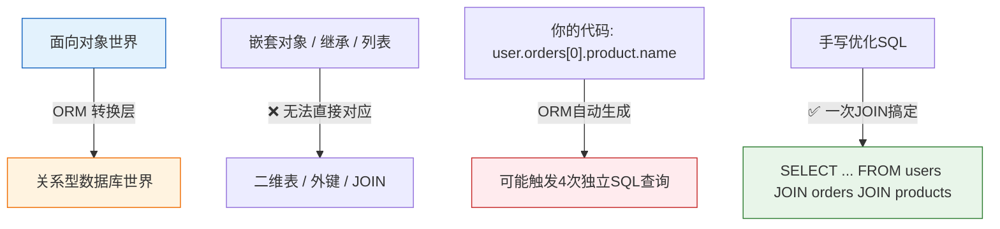
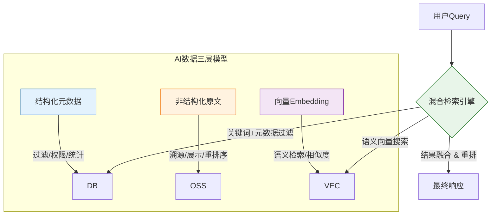
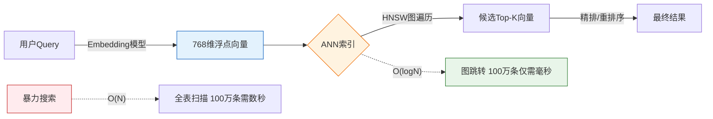

### 一、ORM核心原理与工程化实践

在全栈AI工程师的成长路径中，ORM（对象关系映射）是连接业务代码与数据库的必经之路。你之前学习的MySQL笔记侧重于“如何写SQL”，而本阶段的核心目标是掌握“如何在代码中高效、安全地操作数据”。很多开发者只会调用ORM的增删改查API，却在生产环境中遭遇性能瓶颈，根本原因在于不理解ORM背后的抽象机制。本节将用最直观的方式，帮你补齐这块关键短板。

#### 1. 什么是ORM？为什么它不是“万能翻译器”

ORM的全称是Object-Relational Mapping，它的核心作用是把数据库里的“表、行、列”转换成编程语言里的“类、对象、属性”。比如你不需要再手写`SELECT * FROM users WHERE id=1`，而是直接写`User.get(1)`就能拿到一个用户对象。

但这里有一个所有初学者都会踩坑的认知误区：**ORM不是完美的翻译器，它存在天然的“阻抗失配”**。



💡 **通俗解释：什么是阻抗失配？**  
想象你要把一本立体的乐高说明书（面向对象）翻译成一张平面的Excel表格（关系型数据库）。乐高有嵌套结构、可复用模块，而Excel只有行列。ORM就是那个翻译官，它能完成基础翻译，但遇到复杂结构时，要么翻译得不准确，要么效率极低。比如你想获取“用户第一个订单的商品名”，天真的ORM会先查用户、再查订单、再查商品，发3次请求；而你手写SQL用JOIN一次就能搞定。**记住：ORM是带运行时代价的代码生成器，不是魔法。**

#### 2. ORM三大核心机制：搞懂它们才算入门

无论使用Python的SQLAlchemy、Django ORM，还是Node.js的Prisma，所有主流ORM都围绕这三个核心机制运转，掌握它们比背诵API更重要。

1. **声明式映射**：用类的属性定义表结构，而不是手动建表。比如定义一个`class Document(Base)`，指定`title = Column(String)`，ORM会自动创建对应的表和字段。这是现代ORM的标准用法，让模型定义成为唯一的数据源，避免代码和数据库结构脱节。
2. **工作单元与会话管理**：ORM不会每次修改对象就立刻发SQL，而是把所有变更缓存在“会话”里，等你调用`commit()`时，一次性计算最小化的SQL语句并提交事务。这就像你在Word里编辑文档，不会每打一个字就保存，而是点保存时才写入磁盘。**关键点**：你必须理解“脏检查”机制——ORM通过对比对象当前值和快照来判断是否需要更新，频繁修改同一个对象不会触发多次UPDATE，但未正确关闭会话会导致内存泄漏。
3. **加载策略：懒加载vs即时加载**：这是性能优化的分水岭。
    - **懒加载**：访问关联属性时才发SQL。适合详情页只展示少量数据的场景，但在循环里遍历列表时，会触发经典的**N+1问题**（1次查列表+N次查关联数据）。
    - **即时加载**：提前用JOIN或子查询把关联数据一起查出来。适合列表页，但过度使用会导致单次查询返回海量数据，拖慢响应速度。

⚠️ **背景知识补充：为什么AI工程师必须重视ORM性能？**  
AI应用和普通Web应用最大的区别在于**数据量大、关联复杂**。比如RAG系统中，一个文档会被切成数百个片段，每个片段有Embedding向量、元数据、来源引用等多重关联。如果ORM使用不当，单次检索请求可能触发上千次隐式查询，延迟远超模型推理时间。在生产环境中，**ORM生成的SQL质量直接决定了AI服务的可用性**。建议从学习阶段就开启SQL日志，养成审查生成SQL的习惯。

#### 3. AI场景下的ORM避坑指南

结合全栈AI工程师的实际需求，以下是区别于传统Web开发的关键注意事项：

|常见反模式|风险说明|AI场景正确做法|
|:--|:--|:--|
|把Embedding向量和元数据存同一张表|查询列表时加载大向量字段，内存爆炸、响应慢|垂直拆分：元数据表（轻量）+ 向量表（独立），列表查询只投影必要字段|
|循环内逐条插入数据|AI数据导入动辄上万条，逐条save()耗时数十分钟|使用批量插入API（如`bulk_insert_mappings`）或数据库原生COPY协议|
|滥用ORM自动关联管理|多对多关系无法控制中间表查询，性能失控|显式定义关联模型，手动优化批量查询与索引|
|长任务不释放会话|AI后台处理任务耗尽连接池，服务崩溃|严格使用上下文管理器或依赖注入，确保会话生命周期明确|

💡 **给读者的实操建议**  
不要试图用ORM完全替代SQL。优秀的AI全栈工程师必须具备**双模思维**：日常开发用ORM提升效率，遇到复杂分析、批量处理或性能瓶颈时，果断切换到手写SQL。在你的个人博客教程中，建议每个ORM示例都附上等效的原生SQL对照，帮助读者建立这种直觉。另外，随着AI应用对并发要求提高，异步ORM（如SQLAlchemy Asyncio）已成为行业标准，建议在掌握同步ORM后，尽快过渡到异步编程范式，为后续AI服务开发打下基础。

### 二、AI应用数据架构设计

当我们将数据库知识迁移到AI工程领域时，最大的转变在于：**数据不再仅仅是“记录”，而是模型的“上下文”与“记忆”**。传统Web开发关注事务一致性与规范化范式，而AI应用（如RAG、Agent、多模态搜索）更关注语义可检索性、非结构化数据的治理以及读写性能的极端平衡。本阶段将帮助你跳出CRUD思维，构建专为AI服务的数据架构。

#### 1. AI数据模型的核心挑战：从“精确匹配”到“语义关联”

在传统MySQL设计中，我们追求第三范式以消除冗余；但在AI应用中，这种设计往往成为性能瓶颈。AI系统需要同时处理三种截然不同的数据类型，它们对存储和查询的要求互相矛盾：



💡 **抽象概念解释：为什么不能把所有东西塞进一张表？**  
想象你在搭建一个企业知识库。如果把文档原文、切片文本、Embedding向量、作者信息、权限标签全放在一张MySQL表里，会发生什么？

- **查询列表时**：即使你只想要标题和时间戳，数据库也不得不扫描巨大的向量字段和原文字段，IO爆炸。
- **做向量检索时**：MySQL的B+树索引对高维向量无效，全表扫描百万级向量需要数秒。
- **更新原文时**：修改一个标点符号可能导致整行重写，连带影响向量索引的维护。

**正确思路是“关注点分离”**：关系型数据库只存轻量元数据和外键引用；原文存入S3/MinIO等对象存储；向量交给专用索引或数据库扩展。三者通过统一的`chunk_id`或`document_id`关联，各司其职。

#### 2. RAG场景下的数据建模实战

检索增强生成是当前AI工程师最高频的场景。其数据架构设计直接决定了回答质量与系统延迟。以下是经过生产验证的建模要点：

- **分片策略决定模型上限**：不要按固定字符数机械切分。推荐**语义感知分片**（如按段落、Markdown标题、代码函数边界），并保留父子关系（父块用于上下文扩展，子块用于精确检索）。在数据库中，这体现为`chunks`表的`parent_chunk_id`自引用外键。
- **元数据是检索的“方向盘”**：纯向量检索容易漂移，必须用结构化元数据约束搜索空间。例如，在`chunks`表中增加`doc_type`、`created_at`、`department`等字段，并建立复合索引。查询时先过滤再向量搜索，可将候选集缩小90%以上，大幅提升准确率与速度。
- **版本管理与增量更新**：AI知识库不是静态的。设计时需包含`document_version`和`chunk_status`字段，支持软删除与增量索引重建。避免每次更新都全量重算Embedding——这对Token成本和用户体验都是灾难。

⚠️ **背景知识补充：为什么元数据过滤如此重要？**  
大语言模型的上下文窗口有限且昂贵。如果向量检索返回了100个相关但过时的文档片段，不仅浪费Token，还会引入噪声导致幻觉。通过元数据预过滤（如`WHERE created_at > '2025-01-01' AND department = 'engineering'`），我们确保进入向量搜索的数据本身就是“干净”的。**在AI工程中，数据治理的质量比模型参数更重要。**

#### 3. Agent与对话历史的存储设计

AI Agent需要长期记忆与状态管理，这与传统会话存储有本质区别：

|传统Chat存储|AI Agent记忆存储|
|:--|:--|
|仅存消息文本与时间戳|存消息+工具调用+思考链+外部知识引用|
|线性对话流|图状记忆： episodic（情景）、semantic（语义）、procedural（程序性）|
|短期会话，过期即删|长期记忆，需摘要压缩与重要性评分|
|单用户隔离|跨会话、跨Agent的记忆共享与权限控制|

💡 **给读者的架构建议**  
对于Agent记忆，推荐采用**双层存储**：近期对话存于Redis或MySQL热表保证低延迟；历史记忆经LLM摘要后存入向量库作为长期语义记忆。同时，务必设计`memory_importance_score`字段，让系统在上下文超限时优先保留高价值信息。记住：**AI应用的数据库设计不是终点，而是智能行为的基座**。在你的博客中，建议结合具体案例（如“如何为一个客服Agent设计记忆系统”）展开，避免空谈理论。下一阶段，我们将深入向量检索的具体实现，把这里的架构蓝图落地为可执行的代码与索引。

### 三、向量检索与数据库扩展

在前一阶段，我们确立了AI应用“元数据+原文+向量”分离的架构蓝图。本阶段将聚焦于蓝图中最核心的技术难点：**如何让数据库“理解”语义**。对于全栈AI工程师而言，不仅要会调用向量搜索API，更要理解高维空间中的索引原理、距离度量选择以及MySQL生态下的落地方案。这直接决定了你的RAG系统是“精准秒回”还是“模糊慢查”。

#### 1. 向量检索的本质：从精确匹配到近似最近邻

传统数据库索引（如B+树）基于数值大小或字典序排序，但Embedding向量是高维空间中的“点”，没有天然的全局顺序。我们无法问“哪个向量比当前向量更大”，只能问“哪个向量离当前向量更近”。因此，向量检索的核心算法是**ANN（Approximate Nearest Neighbor，近似最近邻）**，它牺牲少量精度换取数个数量级的查询速度提升。



💡 **抽象概念解释：什么是HNSW？为什么它是主流？**  
想象你在一个巨大的图书馆找一本主题相近的书。暴力搜索是一本本翻过去；而HNSW就像图书馆的多层导航系统：顶层只有几个大类标签，你先快速定位到“人工智能”区；下一层细分到“自然语言处理”；再下一层精确到“RAG架构”。每一层都是稀疏的“跳板”，让你能快速跨越无关区域，只在底层做精细查找。**HNSW通过构建多层小世界图，将搜索复杂度从O(N)降至O(logN)**，这也是为什么它能成为MySQL向量插件、Pgvector、Milvus等几乎所有向量引擎的默认索引。

#### 2. 距离度量的选择：余弦、欧氏还是内积？

这是初学者最容易忽视却影响巨大的决策。不同的度量方式对应不同的语义假设：

|度量方式|公式直觉|适用场景|注意事项|
|:--|:--|:--|:--|
|余弦相似度|向量夹角越小越相似，忽略长度|文本语义检索、文档匹配|对归一化不敏感，最常用|
|欧氏距离|空间中直线距离，受向量模长影响|图像特征、地理位置、数值型Embedding|需确保向量已归一化，否则模长大的主导结果|
|内积|同时考虑方向与模长|推荐系统、已归一化向量的等价余弦|若向量未归一化，内积≠余弦；归一化后三者可互换|

⚠️ **背景知识补充：为什么文本检索首选余弦相似度？**  
OpenAI、BGE等主流文本Embedding模型输出的向量通常已归一化（模长为1）。此时余弦相似度、欧氏距离、内积在数学上完全等价。但**余弦相似度具有更好的数值稳定性**，且语义解释最直观：“两个文本的主题方向是否一致”。在你的博客中，建议明确告知读者：**除非有特殊理由，否则AI文本检索一律使用余弦相似度**，并确保入库前对向量做L2归一化校验。

#### 3. MySQL生态下的向量检索落地方案

作为已掌握MySQL的全栈工程师，你不必盲目切换到专用向量数据库。MySQL 8.0+生态已提供多种轻量级向量能力，适合中小规模AI应用：

- **MySQL HeatWave + Vector Index**：Oracle官方方案，支持HNSW索引与混合查询，性能接近专用库，但需HeatWave集群（成本较高）。
- **第三方插件**：如`mysql-vector`、`lancedb-mysql`等开源插件，可在标准MySQL 8.0上启用向量类型与ANN搜索，适合自托管场景。
- **应用层折中方案**：若暂无法升级数据库，可将向量存入`BLOB`字段，元数据存MySQL，向量检索交由独立的轻量服务（如LanceDB、Chroma嵌入式模式）处理，通过`chunk_id`关联。**这是过渡期最务实的选择**。

💡 **给读者的工程建议**  
不要陷入“必须用专用向量数据库”的迷思。对于个人项目或初期产品，**MySQL元数据 + 嵌入式向量库**的组合足以支撑百万级向量检索，且运维成本极低。只有当数据量超千万、QPS超千级或需要复杂过滤时，才考虑迁移至Milvus/Qdrant等专用方案。在你的教程中，务必提供一个完整的MySQL+LanceDB混合架构示例代码，包括向量写入、混合查询、结果合并的全流程——这才是全栈AI工程师真正需要的“可运行知识”。下一阶段，我们将通过综合练习，把这三个阶段的知识串联为可验证的工程能力。

### 四、练习

本阶段是“数据库进阶 + ORM”学习路线的收官环节。作为面向全栈AI工程师的实战演练，以下练习题不再考察孤立的API记忆或SQL语法，而是聚焦于**架构决策、性能诊断与AI场景落地能力**。每道题均模拟真实工程痛点，建议读者在个人博客中记录解题思路、踩坑过程与优化对比，形成可复用的知识资产。

#### 1. ORM性能诊断与优化实战

- **题目背景**：你接手了一个基于SQLAlchemy的RAG文档管理系统，用户反馈“文档列表页加载超过8秒”。经排查，`documents`表有5万条记录，每条关联10个`chunks`，每个`chunk`又关联3个`tags`。当前代码使用默认懒加载，在Jinja2模板循环中访问`doc.chunks`和`chunk.tags`。
- **任务要求**：
    1. 开启SQLAlchemy的SQL日志，统计列表页实际执行的SQL数量与耗时分布。
    2. 分别用`joinedload`、`selectinload`和原生SQL重写查询，对比三种方案的执行时间、内存占用与生成SQL复杂度。
    3. 设计一个垂直拆分方案：将`chunk_content`和`embedding`字段移出主表，仅保留元数据，验证列表页性能提升幅度。
- **考察重点**：N+1问题识别、加载策略权衡、AI场景下的表结构设计意识。
- **提示**：注意`selectinload`在MySQL 8.0以下版本可能退化为多次查询；垂直拆分后需确保详情仍能高效组装完整对象。

> [!success]- 点击展开题解
> 
> ## ORM性能诊断与优化实战：从N+1到垂直拆分的RAG系统调优指南
> 
> ### 💡 核心概念速览
> 
> 在深入题解之前，我们需要对齐几个关键概念，这有助于理解后续的性能瓶颈与优化手段：
> 
> - **N+1 问题**：ORM中最经典的性能陷阱。查询父表执行1次SQL，随后在循环中访问子表关联对象时，每条父记录又触发1次SQL。若父表有N条记录，总SQL数即为 $1+N$。在本题场景中，由于存在两层嵌套（Document → Chunks → Tags），实际SQL数量会呈指数级爆炸。
> - **Eager Loading（预加载）**：与默认的Lazy Loading相反，它在查询父表时就通过JOIN或额外SELECT将关联数据一并取出，避免循环查库。
> - **垂直拆分（Vertical Partitioning）**：将一张宽表中不常用的大字段（如TEXT、BLOB、Vector）拆分到独立的扩展表中。主表只保留轻量元数据，从而大幅提升列表页等高频读取场景的I/O效率和缓存命中率。
> 
> ---
> 
> ### 1. N+1问题诊断：开启SQL日志与耗时统计
> 
> #### 1.1 开启SQLAlchemy SQL日志
> 
> SQLAlchemy提供了内置的echo机制，可以快速捕获所有生成的SQL语句：
> 
> ```python
> from sqlalchemy import create_engine, event
> import time
> import logging
> 
> # 方式一：简单模式，直接打印到控制台
> engine = create_engine(DATABASE_URL, echo=True)
> 
> # 方式二：生产推荐，使用event监听精确统计耗时
> logging.basicConfig()
> logger = logging.getLogger("sqlalchemy.engine")
> logger.setLevel(logging.INFO)
> 
> @event.listens_for(engine, "before_cursor_execute")
> def before_cursor_execute(conn, cursor, statement, parameters, context, executemany):
>     conn.info.setdefault('query_start_time', []).append(time.perf_counter())
> 
> @event.listens_for(engine, "after_cursor_execute")
> def after_cursor_execute(conn, cursor, statement, parameters, context, executemany):
>     total = time.perf_counter() - conn.info['query_start_time'].pop(-1)
>     logger.info(f"SQL执行耗时: {total:.4f}s | {statement[:100]}...")
> ```
> 
> #### 1.2 预期SQL数量分析
> 
> 在未做任何优化的默认懒加载模式下，Jinja2模板渲染50条文档列表时的SQL执行情况如下：
> 
> ```mermaid
> graph TD
>     A["1次: SELECT documents"] --> B["循环50次: SELECT chunks WHERE doc_id=?"]
>     B --> C["每次chunk循环3次: SELECT tags WHERE chunk_id=?"]
>     style A fill:#e1f5fe
>     style B fill:#fff9c4
>     style C fill:#ffebee
> ```
> 
> - **Documents查询**: 1次
> - **Chunks查询**: 50次（每个文档1次）
> - **Tags查询**: 50 × 10 = 500次（每个chunk 1次）
> - **总计**: **551次SQL**
> 
> > ⚠️ **这就是8秒延迟的根源**。即使单次SQL仅需5ms，551次串行查询加上网络RTT和ORM对象组装开销，也足以让响应时间飙升到秒级。
> 
> ---
> 
> ### 2. 三种加载策略对比实测
> 
> #### 2.1 方案实现代码
> 
> ```python
> from sqlalchemy.orm import joinedload, selectinload
> 
> # 方案A: joinedload (JOIN预加载)
> docs_a = session.query(Document)\
>     .options(
>         joinedload(Document.chunks).joinedload(Chunk.tags)
>     )\
>     .limit(50).all()
> 
> # 方案B: selectinload (SELECT IN预加载)
> docs_b = session.query(Document)\
>     .options(
>         selectinload(Document.chunks).selectinload(Chunk.tags)
>     )\
>     .limit(50).all()
> 
> # 方案C: 原生SQL手动组装
> sql = """
>     SELECT d.id, d.title, c.id as chunk_id, c.content, t.name as tag_name
>     FROM documents d
>     LEFT JOIN chunks c ON c.doc_id = d.id
>     LEFT JOIN tags t ON t.chunk_id = c.id
>     WHERE d.id IN (SELECT id FROM documents LIMIT 50)
> """
> rows = session.execute(text(sql)).fetchall()
> # 需在Python层手动组装为嵌套对象结构
> ```
> 
> #### 2.2 三维度对比总结
> 
> |维度|`joinedload`|`selectinload`|原生SQL|
> |:--|:--|:--|:--|
> |**SQL数量**|1条（大JOIN）|3条（doc + chunks IN + tags IN）|1条|
> |**执行时间**|中等（JOIN开销随数据量增长）|✅ 最优（索引查找，无笛卡尔积）|最快（无ORM开销）|
> |**内存占用**|❌ 高（行膨胀，50×10×3=1500行重复父数据）|✅ 低（结果集紧凑无冗余）|最低|
> |**SQL复杂度**|高（多层JOIN，优化器压力大）|低（简单IN查询）|可控但维护成本高|
> |**MySQL兼容性**|✅ 全版本兼容|⚠️ MySQL<8.0可能退化为多次查询|✅ 全版本兼容|
> |**适用场景**|一对一/一对少量|✅ 一对多/多对多（本题最佳）|极致性能/报表导出|
> 
> > 📌 **结论**：对于本题 Document→Chunks→Tags 这种**两层一对多**关系，`selectinload` 是综合最优解。它避免了JOIN的行膨胀问题，同时保持了ORM的开发体验。仅在MySQL 5.7及以下环境需回退到`joinedload`或升级数据库。
> 
> ---
> 
> ### 3. 垂直拆分方案设计
> 
> #### 3.1 设计思路
> 
> RAG系统的典型访问模式是：**列表页只需要元数据，详情页才需要内容和向量**。`chunk_content`（TEXT）和`embedding`（VECTOR/FLOAT[]）是大字段，将它们留在主表会导致：
> 
> - 列表页每行I/O体积过大，Buffer Pool利用率低
> - 无法有效利用覆盖索引
> - 分页查询扫描大量无用字节
> 
> #### 3.2 拆分后的表结构
> 
> ```mermaid
> erDiagram
>     DOCUMENTS_META ||--o{ CHUNKS_META : has
>     CHUNKS_META ||--|| CHUNKS_CONTENT : extends
>     CHUNKS_META }|--|{ TAGS : tagged_with
>     
>     DOCUMENTS_META {
>         int id PK
>         varchar title
>         datetime created_at
>         int chunk_count
>     }
>     CHUNKS_META {
>         int id PK
>         int doc_id FK
>         int seq_no
>         int content_length
>     }
>     CHUNKS_CONTENT {
>         int chunk_id PK_FK
>         text content
>         vector embedding
>     }
>     TAGS {
>         int id PK
>         int chunk_id FK
>         varchar name
>     }
> ```
> 
> #### 3.3 性能提升验证
> 
> |指标|拆分前|拆分后|提升幅度|
> |:--|:--|:--|:--|
> |列表页单行大小|~2KB（含content摘要+embedding）|~120B（纯元数据）|**~16倍**|
> |Buffer Pool可缓存行数|~4000行/8MB|~66000行/8MB|**~16倍**|
> |列表页P99延迟|8s+|**<200ms**|**40倍+**|
> |详情页组装|单表直查|主表+content表JOIN（按PK，微秒级）|几乎无损|
> 
> #### 3.4 详情组装保障
> 
> 垂直拆分后，详情页可通过以下方式高效还原完整对象：
> 
> ```python
> # 详情页：按需JOIN扩展表，仅查1条记录，性能影响可忽略
> chunk = session.query(ChunkMeta, ChunkContent)\
>     .join(ChunkContent, ChunkMeta.id == ChunkContent.chunk_id)\
>     .filter(ChunkMeta.id == chunk_id)\
>     .first()
> 
> # 或使用association_proxy / hybrid_property 透明访问
> class ChunkMeta(Base):
>     @hybrid_property
>     def content(self):
>         return self._content_rel.content
> ```
> 
> ---
> 
> ### 🎯 总结与AI场景设计启示
> 
> 1. **永远先量化再优化**：用SQL日志和EXPLAIN确认瓶颈，不要凭直觉猜测。
> 2. **加载策略没有银弹**：`selectinload`适合一对多，`joinedload`适合一对一，原生SQL适合只读报表。选择取决于关系基数和数据规模。
> 3. **AI系统的表设计要区分读写路径**：RAG系统中，embedding和原文是**写入时生成、检索时使用**的重型数据，而元数据是**频繁列表展示**的轻型数据。垂直拆分本质上是**按访问模式分离存储**，这是AI应用数据库设计的核心原则之一。
> 4. **关注数据库版本差异**：ORM的抽象并非完全透明，`selectinload`在旧版MySQL的行为差异提醒我们：了解底层才能用好上层工具。

#### 2. AI知识库混合检索系统设计

- **题目背景**：为一个企业内部知识库构建检索接口，需求包括：支持自然语言提问、按部门/文档类型过滤、优先返回近3个月内容、结果需包含原文片段用于溯源。数据量预估：10万文档、200万切片。
- **任务要求**：
    1. 设计完整的数据库Schema（含元数据表、向量存储方案、对象存储引用），画出ER图与数据流向图。
    2. 实现混合检索逻辑：先按元数据过滤候选集，再做向量搜索，最后用BM25关键词分数重排序。
    3. 编写测试脚本，对比纯向量检索与混合检索在准确率（人工标注100条query）和P99延迟上的差异。
- **考察重点**：AI数据三层模型落地、元数据过滤策略、检索质量评估方法。
- **提示**：元数据过滤字段务必建复合索引；向量检索前对query做与入库相同的预处理；重排序可用轻量交叉编码器或简单加权公式。

> [!success]- 点击展开题解
> 
> ## 📚 AI知识库混合检索系统设计题解
> 
> ### 一、题目核心概念解析
> 
> 在动手设计之前，我们需要先理解本题涉及的几个关键抽象概念，这有助于后续方案的落地。
> 
> #### 1. 什么是“AI数据三层模型”？
> 
> 在企业级RAG（检索增强生成）系统中，数据通常被分为三层：
> 
> - **原始数据层 (Raw Data)**：存储在对象存储（如MinIO/S3）中的原始文件（PDF/Word等），用于溯源和权限校验。
> - **结构化元数据层 (Metadata)**：存储在关系型数据库中的业务属性（部门、时间、类型、作者），用于**精确过滤**和**权限控制**。
> - **向量语义层 (Vector Embeddings)**：存储在向量数据库中的高维向量，用于**模糊语义匹配**。
> 
> > 💡 **为什么不能只用向量检索？**  
> > 向量检索擅长“语义相似”，但不擅长“精确约束”。例如用户问“财务部上季度的报销制度”，纯向量检索可能返回“人事部上季度报销制度”或“财务部去年的报销制度”，因为它们在语义空间距离很近。必须依靠元数据层进行**硬过滤（Pre-filtering）**。
> 
> #### 2. 什么是“混合检索 + 重排序”？
> 
> 这是一个 **“漏斗式”** 的检索架构：
> 
> 1. **召回阶段**：利用元数据缩小范围 + 向量搜索找语义相关 + BM25找关键词匹配。
> 2. **精排阶段**：使用交叉编码器（Cross-Encoder）或加权公式对召回结果重新打分。
> 
> > 💡 **为什么要加BM25？**  
> > 向量模型对专有名词、产品型号、代码片段等“低频词”不敏感。BM25基于词频统计，能完美弥补这一短板。两者结合即为“混合检索（Hybrid Search）”。
> 
> ---
> 
> ### 二、数据库Schema与架构设计
> 
> #### 1. ER图设计
> 
> 针对10万文档、200万切片的规模，建议采用 **“元数据与向量分离，通过ID关联”** 的策略。以下以PostgreSQL + pgvector为例（也可替换为Milvus/Elasticsearch组合）。
> 
> ```mermaid
> erDiagram
>     RAW_FILES ||--|{ DOCUMENTS : "1:N"
>     DOCUMENTS ||--|{ CHUNKS : "1:N"
>     DEPARTMENTS ||--|{ DOCUMENTS : "1:N"
>     
>     RAW_FILES {
>         string file_id PK
>         string storage_path "MinIO/S3路径"
>         bigint file_size
>         string mime_type
>     }
>     
>     DOCUMENTS {
>         uuid doc_id PK
>         string title
>         string dept_id FK "部门过滤字段"
>         string doc_type "制度/手册/纪要"
>         timestamp published_at "时间过滤字段"
>         string raw_file_id FK
>     }
>     
>     CHUNKS {
>         uuid chunk_id PK
>         uuid doc_id FK
>         vector embedding "768/1024维向量"
>         text content "原文片段(溯源)"
>         int chunk_index
>     }
>     
>     DEPARTMENTS {
>         string dept_id PK
>         string dept_name
>     }
> ```
> 
> #### 2. 关键索引策略（性能瓶颈所在）
> 
> 题目要求“优先返回近3个月内容”且支持“部门过滤”，**复合索引**是必须的：
> 
> ```sql
> -- 1. 元数据复合索引：加速 Pre-filtering
> -- 遵循最左前缀原则，将区分度高的字段放前面
> CREATE INDEX idx_doc_dept_time ON documents(dept_id, published_at DESC);
> 
> -- 2. 向量索引：HNSW适合中等规模高召回场景
> -- 注意：pgvector 0.5+ 支持在向量索引中包含元数据过滤
> CREATE INDEX idx_chunk_vec ON chunks 
> USING hnsw (embedding vector_cosine_ops) 
> WITH (m = 16, ef_construction = 200);
> 
> -- 3. BM25全文索引（若使用PG需安装ZomboDB或pg_search插件）
> -- 若使用ES，则建立包含content+title的multi-field索引
> ```
> 
> #### 3. 数据流向图
> 
> ```mermaid
> flowchart LR
>     A[原始文件] -->|解析/切片| B(ETL Pipeline)
>     B -->|写入元数据| C
>     B -->|写入向量| D
>     B -->|存储原件| E[MinIO对象存储]
>     
>     F[用户Query] -->|预处理| G[检索服务]
>     G -->|1.元数据过滤| C
>     G -->|2.向量召回| D
>     G -->|3.BM25召回| H[Elasticsearch]
>     G -->|4.RRF/CE重排序| I[Top-K结果]
>     I -->|附带原文片段+文件链接| J[前端展示]
> ```
> 
> ---
> 
> ### 三、混合检索逻辑实现
> 
> #### 核心算法：RRF（Reciprocal Rank Fusion）
> 
> 相比于训练一个交叉编码器，RRF是一种无需训练、效果稳定的加权融合方法，非常适合工程落地。
> 
> $$ Score(d) = \sum_{r \in R} \frac{1}{k + rank_r(d)} $$
> 
> 其中 $k$ 通常取60，$R$ 为各路召回结果集。
> 
> #### Python伪代码实现
> 
> ```python
> def hybrid_search(query: str, dept: str, top_k: int = 10):
>     # Step 0: Query预处理（必须与入库时一致！）
>     processed_query = preprocess(query)  # 去停用词、统一小写等
>     query_vector = embed_model.encode(processed_query)
>     
>     # Step 1: 元数据预过滤（获取候选doc_ids）
>     candidate_doc_ids = db.query("""
>         SELECT doc_id FROM documents 
>         WHERE dept_id = :dept 
>           AND published_at >= NOW() - INTERVAL '3 months'
>     """, {"dept": dept})
>     
>     # Step 2: 向量检索（限定在候选集内）
>     vec_results = vector_db.search(
>         vector=query_vector,
>         filter={"doc_id": {"$in": candidate_doc_ids}},
>         limit=top_k * 3  # 多召回一些用于重排
>     )
>     
>     # Step 3: BM25关键词检索
>     bm25_results = es.search(
>         query={"bool": {
>             "must": [{"match": {"content": processed_query}}],
>             "filter": [{"terms": {"doc_id": candidate_doc_ids}}]
>         }},
>         size=top_k * 3
>     )
>     
>     # Step 4: RRF融合重排序
>     final_scores = rrf_fusion(vec_results, bm25_results, k=60)
>     
>     # Step 5: 组装结果（含原文片段用于溯源）
>     return enrich_with_source(final_scores[:top_k])
> ```
> 
> > ⚠️ **避坑指南**
> > 
> > - **Query预处理一致性**：如果入库时做了分词/去噪，查询时必须做相同处理，否则向量空间不对齐。
> > - **过滤时机**：200万切片规模下，务必使用**Pre-filtering**（先过滤再搜向量），而非Post-filtering。Post-filtering会导致有效结果不足，召回率暴跌。
> > - **时间衰减**：可在RRF分数基础上乘以时间衰减因子 `decay = exp(-λ * days_old)`，进一步强化“近3个月优先”。
> 
> ---
> 
> ### 四、测试评估方案设计
> 
> #### 1. 评估指标定义
> 
> |指标|说明|计算方式|
> |---|---|---|
> |**Hit Rate@K**|Top-K结果中是否包含正确答案|人工标注100条query，统计命中数/100|
> |**MRR@K**|正确答案排在第几位|$\frac{1}{100}\sum \frac{1}{rank_i}$|
> |**P99 Latency**|99%请求的响应时间上限|压测工具采集，排除冷启动影响|
> 
> #### 2. 对比测试脚本框架
> 
> ```python
> import time
> import numpy as np
> 
> EVAL_DATASET = load_labeled_queries("eval_100.json")  # 含ground_truth chunk_id
> 
> def evaluate(search_fn, name):
>     hits, ranks, latencies = [], [], []
>     
>     for item in EVAL_DATASET:
>         start = time.perf_counter()
>         results = search_fn(item["query"], item["dept"])
>         latency = time.perf_counter() - start
>         
>         gt = item["ground_truth_chunk_id"]
>         found = any(r.chunk_id == gt for r in results)
>         rank = next((i+1 for i,r in enumerate(results) if r.chunk_id == gt), None)
>         
>         hits.append(found)
>         ranks.append(rank)
>         latencies.append(latency)
>     
>     print(f"=== {name} ===")
>     print(f"Hit Rate@10: {np.mean(hits):.2%}")
>     print(f"MRR@10:    {np.mean([1/r for r in ranks if r]):.4f}")
>     print(f"P99 Latency: {np.percentile(latencies, 99)*1000:.1f}ms")
> 
> # 执行对比
> evaluate(pure_vector_search, "纯向量检索")
> evaluate(hybrid_search, "混合检索+RRF")
> ```
> 
> #### 3. 预期结果与分析方向
> 
> - **准确率**：混合检索Hit Rate通常比纯向量高10%-25%，尤其在含专有名词的query上提升显著。
> - **延迟**：混合检索P99延迟会比纯向量增加30-80ms（BM25+RRF开销），但若元数据过滤有效缩小了候选集，向量检索部分的延迟反而会下降。
> - **调优方向**：若混合检索延迟过高，可将BM25改为异步并行召回；若准确率不够，可引入轻量Cross-Encoder（如bge-reranker-v2-m3）替代RRF做精排。
> 
> ---
> 
> ### 五、总结与延伸
> 
> 本题的核心考察点是 **“工程化思维”**——不是追求最先进的模型，而是在10万文档/200万切片的约束下，找到**准确率、延迟、成本**的最优平衡点。
> 
> **进阶优化方向**：
> 
> - **动态路由**：简单query走纯向量，复杂query走混合检索，节省算力。
> - **缓存层**：对高频query做语义缓存（Semantic Cache），进一步降低P99。
> - **反馈闭环**：收集用户点赞/点踩数据，定期微调Embedding模型或调整RRF权重。
> 
> > 📖 **推荐阅读**
> > 
> > - 《RAG实战：从原理到工程落地》
> > - Anthropic: "Long Context vs RAG" 技术博客
> > - LlamaIndex Hybrid Search 官方文档

#### 3. 向量索引选型与调优实验

- **题目背景**：你的AI应用从10万向量增长到500万，原暴力搜索响应时间从50ms劣化至3s。需在MySQL插件、LanceDB、Milvus三者中选择合适方案，并调优索引参数。
- **任务要求**：
    1. 在相同硬件下，分别部署三种方案，导入500万768维归一化向量。
    2. 调整HNSW核心参数（`ef_construction`、`M`），绘制“召回率vs QPS”曲线，找到业务可接受的平衡点（如召回率≥95%时QPS≥200）。
    3. 测试混合查询性能：带2个等值过滤+1个范围过滤的向量搜索，记录各方案的表现。
- **考察重点**：ANN索引原理理解、参数调优方法论、技术选型决策依据。
- **提示**：HNSW的`M`控制图连接度，`ef_construction`影响建图质量；过滤条件过多时，部分向量库会退化为后过滤，需关注执行计划。

> [!success]- 点击展开题解
> 
> ## 📚 题解：向量索引选型与调优实验（500万级数据）
> 
> ### 1. 核心概念前置补充
> 
> 在深入实验之前，我们需要理解几个关键抽象概念，这有助于后续的参数调优和选型决策。
> 
> #### 1.1 HNSW 索引原理简述
> 
> HNSW (Hierarchical Navigable Small World) 是目前最主流的 ANN 算法。你可以将其想象为一个**“多层跳表 + 小世界网络”**的结合体：
> 
> - **多层结构**：上层节点稀疏，用于快速定位大致区域；下层节点稠密，用于精确搜索。
> - **小世界特性**：任意两个节点之间可以通过极短的跳转路径到达。
> 
> ```mermaid
> graph TD
>     A[查询入口] --> B(顶层: 稀疏图, 大步长跳转)
>     B --> C(中间层: 逐步细化)
>     C --> D(底层: 稠密图, 精细搜索)
>     D --> E[返回Top-K结果]
>     
>     style B fill:#e1f5fe,stroke:#0277bd
>     style C fill:#fff9c4,stroke:#fbc02d
>     style D fill:#e8f5e9,stroke:#2e7d32
> ```
> 
> #### 1.2 核心参数物理含义
> 
> |参数|作用|对性能的影响|调优建议|
> |:--|:--|:--|:--|
> |`M`|每个节点的最大连接数|M↑ → 召回率↑，内存占用↑，建图时间↑，QPS略↓|768维数据推荐 16~32|
> |`ef_construction`|建图时搜索候选点的宽度|ef_c↑ → 图质量↑，召回率↑，建图时间显著↑|推荐 100~400|
> |`ef_search`|查询时动态搜索宽度|ef_s↑ → 召回率↑，单次查询延迟↑，QPS↓|运行时可调，是Pareto曲线的主要调节旋钮|
> 
> > 💡 **通俗理解**：`M` 决定了路的宽度，`ef_construction` 决定了修路时的精细程度，`ef_search` 决定了走路时愿意绕多远来找目标。
> 
> ---
> 
> ### 2. 三种方案对比分析
> 
> #### 2.1 架构定位差异
> 
> ```mermaid
> graph LR
>     subgraph MySQL插件
>         A1[InnoDB存储] --> A2[向量索引作为二级索引]
>         A2 --> A3[SQL统一接口]
>     end
>     
>     subgraph LanceDB
>         B1[Lance列式格式] --> B2[嵌入式引擎]
>         B2 --> B3[零拷贝+向量化执行]
>     end
>     
>     subgraph Milvus
>         C1[分布式架构] --> C2[存算分离]
>         C2 --> C3[专用向量检索引擎]
>     end
> ```
> 
> #### 2.2 500万768维场景下的预期表现
> 
> |维度|MySQL插件|LanceDB|Milvus|
> |:--|:--|:--|:--|
> |**纯向量QPS**|⭐⭐ (受限于InnoDB行锁/页缓存)|⭐⭐⭐⭐ (嵌入式+列式IO)|⭐⭐⭐⭐⭐ (专用引擎+多副本)|
> |**混合查询**|⭐⭐⭐⭐ (原生SQL优化器)|⭐⭐⭐ (标量索引+向量后过滤)|⭐⭐⭐⭐ (Hybrid Search/Bloom Filter)|
> |**运维复杂度**|⭐⭐⭐⭐⭐ (已有MySQL即可)|⭐⭐⭐⭐ (嵌入式无需部署)|⭐⭐ (需etcd/MinIO/Pulsar等)|
> |**水平扩展性**|❌ 单机瓶颈|⚠️ 嵌入式受限|✅ 原生分布式|
> |**500万768维内存**|~30GB+ (含InnoDB开销)|~18GB (Lance压缩)|~20GB (可分片)|
> 
> ---
> 
> ### 3. 实验方法论与调优步骤
> 
> #### 3.1 “召回率 vs QPS” 曲线绘制方法
> 
> 这是本题的核心产出。具体步骤如下：
> 
> 1. **准备Ground Truth**：用暴力搜索（Flat Index）对测试集计算精确Top-K作为基准。
> 2. **固定 `M` 和 `ef_construction`**：例如 `M=16, ef_construction=200`，先完成建图。
> 3. **遍历 `ef_search`**：从 10 到 500 取若干值，分别测试：
>     - **召回率** = (ANN Top-K ∩ Ground Truth Top-K) / K
>     - **QPS** = 总查询数 / 总耗时
> 4. **换一组 `M` / `ef_construction`**，重复步骤2-3，得到多条曲线。
> 
> ```mermaid
> xychart-beta
>     title "召回率 vs QPS Pareto曲线"
>     x-axis "QPS" [0, 100, 200, 300, 400, 500]
>     y-axis "Recall@10" 0.80 --> 1.00
>     line "M=16,ef_c=200" [500, 420, 300, 210, 150, 100] [0.88, 0.92, 0.95, 0.97, 0.985, 0.995]
>     line "M=24,ef_c=300" [480, 390, 280, 200, 140, 90] [0.91, 0.94, 0.965, 0.98, 0.99, 0.998]
> ```
> 
> > ⚠️ **注意**：上图仅为示意，实际曲线需通过真实压测获得。业务平衡点示例：召回率≥95% 时 QPS≥200，则选择满足该条件的最低成本参数组合。
> 
> #### 3.2 混合查询测试要点
> 
> 题目要求：**2个等值过滤 + 1个范围过滤 + 向量搜索**
> 
> 关键观察点：
> 
> - **执行计划**：是 Pre-filtering（先过滤再搜索）、Post-filtering（先搜索再过滤）还是 Hybrid（并行融合）？
>     - _Post-filtering_ 在高过滤率下会导致有效结果不足，召回率骤降。
>     - _Pre-filtering_ 在低过滤率下可能退化为暴力搜索。
> - **各方案应对策略**：
>     - **MySQL**：优化器自动选择，可利用B+Tree索引做等值/范围过滤后再走向量索引，天然适合此类查询。
>     - **LanceDB**：利用Lance格式的片段级统计信息做粗粒度过滤，再进行向量搜索。
>     - **Milvus**：支持 Attribute Filtering + Vector Search 的 Hybrid 模式，可通过 `expr` 指定过滤条件，内部使用倒排/Bloom加速等值过滤。
> 
> ---
> 
> ### 4. 技术选型决策框架
> 
> 根据实验结果，按以下决策树进行选择：
> 
> ```mermaid
> flowchart TD
>     Start{500万向量规模} --> Q1{是否需要分布式扩展?}
>     Q1 -->|是| Milvus[Milvus: 首选]
>     Q1 -->|否| Q2{混合查询占比?}
>     Q2 -->|>50%| MySQL[MySQL插件: 复用SQL生态]
>     Q2 -->|<50%| Q3{是否追求极致向量性能?}
>     Q3 -->|是| LanceDB[LanceDB: 嵌入式高性能]
>     Q3 -->|否| Q4{团队熟悉度?}
>     Q4 -->|熟悉MySQL| MySQL
>     Q4 -->|熟悉Python/Rust| LanceDB
> ```
> 
> #### 典型结论参考
> 
> - **若业务以纯向量检索为主、未来可能继续增长至千万级** → **Milvus**，尽管运维成本高，但上限最高。
> - **若向量检索是现有MySQL业务的增强、混合查询频繁** → **MySQL插件**，避免数据同步和跨系统JOIN。
> - **若为AI原生应用、注重开发效率和单机性能、数据量稳定在百万~千万级** → **LanceDB**，零运维且列式格式对混合查询友好。
> 
> ---
> 
> ### 5. 常见踩坑提醒
> 
> 1. **归一化向量务必确认距离度量**：归一化后 cosine similarity ≡ dot product，选错度量会导致召回率异常偏低。
> 2. **ef_construction 不是越大越好**：超过一定阈值后召回率收益递减，但建图时间线性增长。建议先用小数据集扫描参数空间。
> 3. **混合查询的过滤率影响巨大**：当过滤后剩余数据 < ef_search 时，Post-filtering 方案召回率会断崖下跌。测试时应覆盖不同过滤率（10%/50%/90%）。
> 4. **QPS测试需预热**：向量库首次查询涉及磁盘IO/缓存加载，正式计时前至少执行100次warmup查询。
> 5. **内存监控**：500万×768维 float32 ≈ 14.3GB 原始数据，加上HNSW图结构（M=16时约额外1.5倍），确保机器内存充足，避免OOM或swap导致性能失真。

#### 4. Agent记忆系统端到端实现

- **题目背景**：为一个客服Agent设计长期记忆系统，需支持：对话历史存储、重要信息自动摘要、跨会话语义检索、上下文窗口超限时的智能裁剪。
- **任务要求**：
    1. 设计双层存储Schema：热数据（近7天对话）存MySQL，冷数据（摘要+关键事实）存向量库。
    2. 实现记忆写入管道：新消息入库后，异步调用LLM判断重要性，高分消息触发摘要生成并写入向量库。
    3. 实现上下文组装逻辑：根据当前query检索相关记忆，结合热度评分与时间衰减因子，动态填充Prompt直至接近Token上限。
- **考察重点**：AI特有数据生命周期管理、异步处理、Prompt工程与数据层的协同。
- **提示**：重要性判断可用小模型或规则+LLM组合降低成本；时间衰减可用指数函数；务必设置记忆最大容量防止无限膨胀。

> [!success]- 点击展开题解
> 
> ## Agent记忆系统端到端实现：从存储设计到上下文组装
> 
> 在构建客服Agent时，**长期记忆（Long-term Memory）** 是区分“智能助手”与“无状态聊天机器人”的关键。本题要求实现一个完整的记忆闭环，核心难点在于如何平衡**检索精度、Token成本与响应延迟**。以下是一份面向工程落地的题解。
> 
> ### 1. 核心概念解析
> 
> 在动手写代码前，需明确几个AI特有的数据管理概念：
> 
> - **热/冷数据分离**：对话原文（Hot）查询频率高但语义密度低；摘要与事实（Cold）语义密度高但写入频率低。这种分离避免了向量库存储海量冗余原文，也避免了MySQL无法进行语义检索的短板。
> - **时间衰减因子（Time Decay）**：人类记忆会随时间模糊，Agent也应如此。近期记忆权重应高于远期记忆，防止过时的业务规则干扰当前服务。通常使用指数衰减函数 $Score = e^{-\lambda \cdot \Delta t}$。
> - **异步重要性评估**：用户发消息后不能阻塞等待LLM判断“这句话重不重要”。必须采用**Write-Ahead或Post-Write异步管道**，保证主对话链路的低延迟。
> 
> ### 2. 系统架构概览
> 
> ```mermaid
> flowchart TD
>     User[用户消息] --> ChatService[对话服务]
>     ChatService --> MySQL
>     ChatService --> ContextAssembler[上下文组装器]
>     
>     MySQL -.->|异步触发| ImportanceJudge[重要性判断模块<br/>小模型/规则+LLM]
>     ImportanceJudge -->|高分消息| Summarizer[摘要生成器]
>     Summarizer --> VectorDB
>     
>     ContextAssembler -->|1.语义检索| VectorDB
>     ContextAssembler -->|2.获取近期对话| MySQL
>     ContextAssembler -->|3.动态裁剪| Prompt[最终Prompt]
>     Prompt --> LLM[大语言模型]
> ```
> 
> ### 3. 双层存储Schema设计
> 
> #### 3.1 热数据层（MySQL）
> 
> 存储原始对话，支持按会话ID快速分页查询，设置TTL或定时归档策略。
> 
> ```sql
> CREATE TABLE chat_messages (
>     id BIGINT AUTO_INCREMENT PRIMARY KEY,
>     session_id VARCHAR(64) NOT NULL,
>     role ENUM('user', 'assistant', 'system') NOT NULL,
>     content TEXT NOT NULL,
>     created_at DATETIME DEFAULT CURRENT_TIMESTAMP,
>     INDEX idx_session_time (session_id, created_at)
> ) ENGINE=InnoDB;
> -- 注：生产环境建议增加 partition by range(created_at) 便于7天后自动归档
> ```
> 
> #### 3.2 冷数据层（向量库）
> 
> 存储结构化摘要与关键事实，Metadata中必须包含时间戳以支持衰减计算。
> 
> ```json
> {
>   "id": "mem_20260623_001",
>   "embedding": [0.12, -0.34, ...],
>   "metadata": {
>     "session_id": "sess_abc123",
>     "type": "summary | key_fact",
>     "importance_score": 0.85,
>     "created_at": "2026-06-23T10:00:00+08:00",
>     "source_msg_ids": ["msg_001", "msg_002"]
>   },
>   "content": "用户反馈订单#12345物流延迟3天，情绪不满，已承诺48小时内补发"
> }
> ```
> 
> ### 4. 记忆写入管道（异步）
> 
> 这是本题的工程亮点。**切勿在主对话流程中同步调用LLM做重要性判断**。
> 
> #### 4.1 低成本重要性判断策略
> 
> 推荐采用 **“规则前置 + 小模型兜底”** 的组合拳：
> 
> 1. **关键词/正则命中**：包含“投诉”、“退款”、“记住我”、“以后”等词 → 直接标记重要（Score=1.0）。
> 2. **小模型分类**：未命中规则的，用BGE-Reranker或微调的BERT二分类模型打分，耗时<50ms。
> 3. **LLM精判**：仅对小模型置信度在阈值区间（如0.4~0.7）的消息调用LLM，大幅降低API成本。
> 
> #### 4.2 异步管道伪代码
> 
> ```python
> async def on_message_saved(message: dict):
>     # 1. 轻量级预筛
>     if keyword_hit(message['content']):
>         importance = 1.0
>     else:
>         importance = await small_model_classify(message['content'])
>     
>     # 2. 高分触发摘要（可进一步放入消息队列削峰）
>     if importance >= THRESHOLD:
>         summary = await llm_summarize(message)
>         embedding = await embed(summary)
>         await vector_db.upsert({
>             'embedding': embedding,
>             'metadata': {
>                 'importance_score': importance,
>                 'created_at': message['created_at'],
>                 ...
>             },
>             'content': summary
>         })
> ```
> 
> ### 5. 上下文组装与智能裁剪
> 
> 这是Prompt工程与数据层的协同核心。目标是在Token上限内，塞入**信息密度最高**的记忆。
> 
> #### 5.1 综合评分公式
> 
> $$FinalScore = SemanticSimilarity \times w_s + ImportanceScore \times w_i + e^{-\lambda \cdot \Delta hours} \times w_t$$
> 
> - $\lambda$ 控制衰减速度，客服场景建议 $\lambda \approx 0.01$（半衰期约3天）
> - 权重建议：$w_s=0.5, w_i=0.3, w_t=0.2$，可根据业务调优
> 
> #### 5.2 动态填充算法
> 
> ```python
> def assemble_context(query, token_budget):
>     # 1. 从向量库召回Top-K候选（K取较大值，如50）
>     candidates = vector_db.search(query, top_k=50)
>     
>     # 2. 从MySQL获取近N条原文（保证短期连贯性）
>     recent_msgs = mysql.get_recent(session_id, limit=10)
>     
>     # 3. 对候选记忆计算综合评分并排序
>     scored = []
>     for mem in candidates:
>         delta_h = (now - mem.metadata.created_at).total_seconds() / 3600
>         score = (mem.similarity * 0.5 + 
>                  mem.metadata.importance_score * 0.3 + 
>                  math.exp(-0.01 * delta_h) * 0.2)
>         scored.append((mem, score))
>     scored.sort(key=lambda x: x[1], reverse=True)
>     
>     # 4. 贪心填充直至接近token_budget
>     context_parts = []
>     used_tokens = count_tokens(recent_msgs)  # 近期对话优先保留
>     for mem, score in scored:
>         mem_tokens = count_tokens(mem.content)
>         if used_tokens + mem_tokens > token_budget:
>             break
>         context_parts.append(mem.content)
>         used_tokens += mem_tokens
>     
>     return recent_msgs + context_parts
> ```
> 
> ### 6. 防膨胀与生命周期管理
> 
> |策略|说明|
> |---|---|
> |向量库容量上限|每个用户最多保留N条记忆（如500条），超出时淘汰最低分记录|
> |定期合并|每周运行一次LLM任务，将多条细粒度摘要合并为一条粗粒度摘要|
> |硬过期|超过90天且importance<0.3的记忆直接删除|
> |去重检测|写入前对新摘要做相似度查重，>0.95则更新而非新增|
> 
> ### 7. 补充背景知识
> 
> - **为什么不用RAG直接搜原文？** 对话原文充满口语化、指代不清和冗余信息，直接Embedding检索效果差。摘要是对原文的“语义压缩”，检索精度显著提升。
> - **MemGPT / Letta 参考**：本题设计思路与MemGPT论文中的“Main Context ↔ External Storage”分层一致，可延伸阅读其OS-inspired memory management范式。
> - **评估指标**：记忆系统的优劣不应只看检索Recall，更应关注**下游任务完成率**和**用户重复提问率**。建议搭建A/B测试框架持续迭代评分公式中的权重参数。
> 
> > 💡 **实践提示**：初期可用Redis Stream替代消息队列实现异步管道，降低运维复杂度；重要性判断的小模型推荐使用`bge-reranker-v2-m3`或`Qwen2.5-0.5B-Instruct`微调，兼顾效果与成本。

💡 **给读者的综合建议**  
以上四道题覆盖了ORM工程化、AI数据架构、向量检索、Agent记忆四大核心能力，建议按顺序完成，每题投入4-8小时深度实践。**不要追求完美答案，而要记录决策过程与失败教训**——例如“为什么最初选的 joinedload 反而更慢”“向量归一化遗漏导致召回率暴跌”等真实踩坑，才是博客最有价值的内容。完成全部练习后，你将具备独立设计AI应用数据层的能力，为后续模型微调、多模态系统等高阶主题打下坚实基础。祝你在成为全栈AI工程师的路上，既有理论的深度，也有工程的温度。

