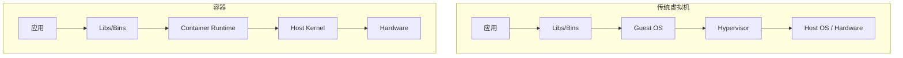
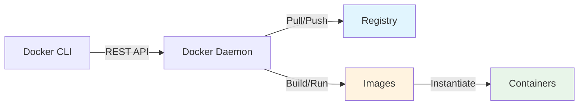
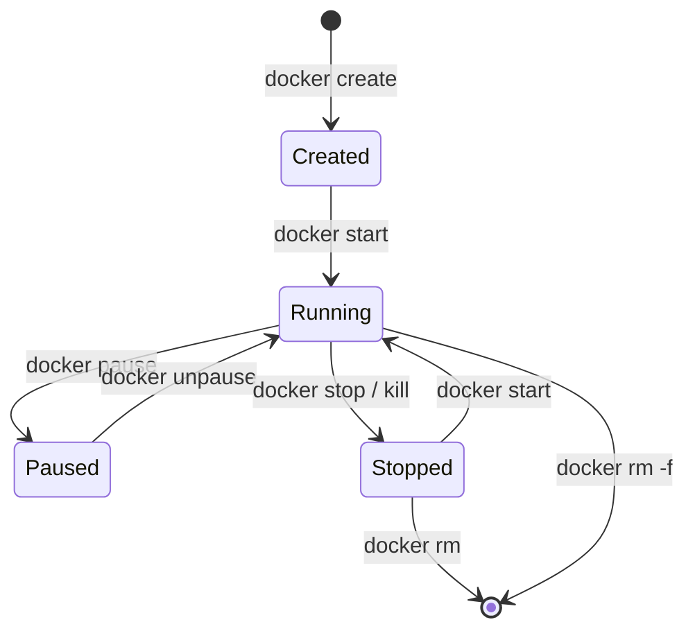
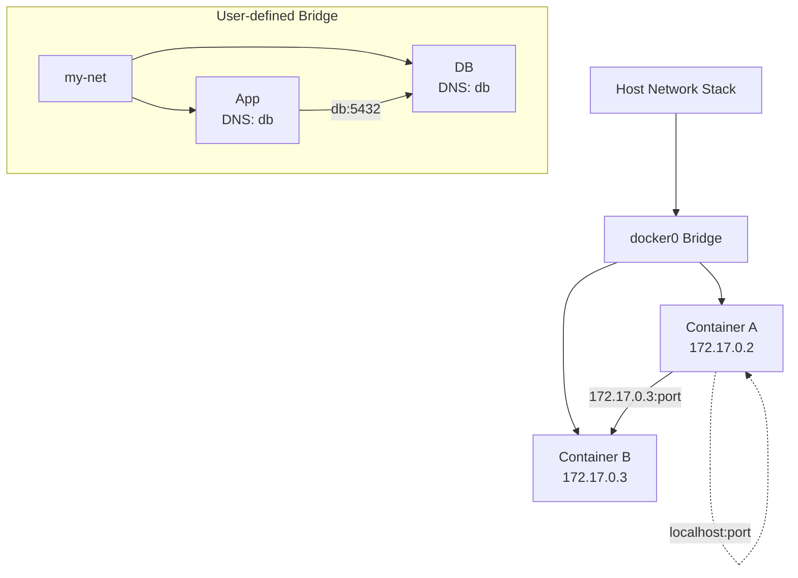
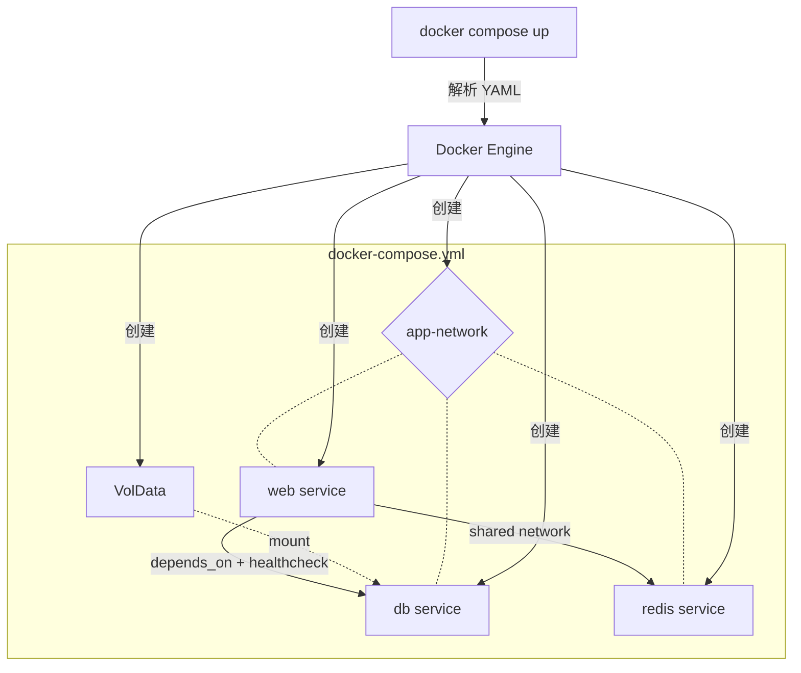
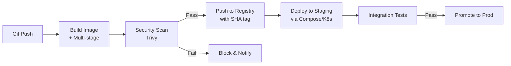

### 一、基础认知与核心概念

> **前置知识确认**  
> 你已熟练掌握 Linux 文件系统、进程管理、Shell 脚本及基本网络概念。Docker 并非“虚拟机替代品”，而是对 Linux 原生能力的工程化封装。理解这一点，是避免后续学习陷入“黑盒迷信”的关键。

---

#### 1. 容器化的本质：从虚拟化到操作系统级隔离

在接触 Docker 命令之前，必须先回答一个根本问题：**容器到底是什么？**

很多初学者将容器理解为“轻量级虚拟机”，这会导致严重的认知偏差。虚拟机通过 Hypervisor 模拟完整硬件并运行独立 Guest OS；而容器**不模拟硬件、不包含完整 OS**，它本质上是 **Linux 宿主机上的一个受限进程**。



**关键区别解释：**

|维度|虚拟机|容器|
|:--|:--|:--|
|隔离级别|硬件级（完整 OS）|进程级（共享 Host Kernel）|
|启动速度|分钟级|秒级甚至毫秒级|
|资源开销|GB 级内存 + 完整 OS 镜像|MB 级，仅包含应用及依赖|
|内核|每个 VM 有独立内核|所有容器共享宿主机内核|
|适用场景|强隔离、异构 OS|微服务、CI/CD、环境一致性|

> 💡 **为什么共享内核不是缺陷？**  
> Linux 内核自 2.6 起就提供了 **Namespace**（隔离）和 **Cgroups**（资源限制）两大原语。Docker 并未发明新技术，而是将这些分散的内核能力整合为易用的工具链。这意味着容器的安全性边界弱于 VM，但换来了极致的轻量和性能——这是架构权衡，而非技术缺陷。

---

#### 2. Docker 架构三要素：镜像、容器、仓库

Docker 采用 **客户端-服务端（C/S）架构**，其核心抽象可归纳为三个实体：



##### （1）镜像（Image）：不可变的应用模板

- **定义**：只读的、分层的文件系统快照，包含运行应用所需的一切（代码、运行时、库、环境变量、配置）。
- **分层机制**：镜像由多个只读层（Layer）堆叠而成，每层对应 Dockerfile 中的一条指令。层之间通过 UnionFS 联合挂载，实现**存储复用**与**构建缓存**。
- **类比理解**：镜像如同“类（Class）”，是静态蓝图；容器则是“实例（Object）”，是运行时实体。

##### （2）容器（Container）：镜像的运行实例

- **定义**：在镜像顶层添加一个**可写层**后启动的进程。该可写层使用 Copy-on-Write 策略：读取时优先查上层，写入时才复制到可写层。
- **生命周期**：创建 → 运行 → 暂停/停止 → 删除。容器删除后，可写层数据丢失（除非挂载 Volume）。
- **重要提醒**：容器内修改不应持久化！任何需要保留的数据必须通过 Volume 或 Bind Mount 外置。

##### （3）仓库（Registry）：镜像的分发中心

- **公共仓库**：Docker Hub（默认）、GHCR、Quay.io。
- **私有仓库**：Harbor、AWS ECR、阿里云 ACR。
- **命名规范**：`[registry/]namespace/repository:tag`，例如 `docker.io/library/nginx:1.25-alpine`。省略 registry 时默认指向 Docker Hub。

> ⚠️ **Tag 陷阱**：`latest` 标签**不代表最新版本**，仅表示“最后被 push 且未指定 tag 的镜像”。生产环境务必使用语义化版本或 Git SHA 作为 tag。

---

#### 3. 底层基石：Namespace 与 Cgroups

若跳过此节，Docker 对你而言永远是魔法。掌握这两项内核机制，才能理解容器的边界与局限。

##### Namespace：让进程“以为自己独占系统”

Linux 提供 7 种 Namespace，每种隔离一类全局资源：

|Namespace|隔离内容|容器中的体现|
|:--|:--|:--|
|PID|进程编号|容器内 PID=1 是应用主进程|
|NET|网络设备/IP/端口|每个容器拥有独立 veth 网卡|
|MNT|挂载点|容器看到独立的根文件系统|
|UTS|主机名/域名|容器可自定义 hostname|
|IPC|信号量/消息队列|容器间无法直接通信|
|USER|UID/GID 映射|容器内 root ≠ 宿主机 root|
|CGROUP|cgroup 根目录视图|容器只能看到自己的资源限制|

##### Cgroups：给进程戴上“资源镣铐”

Cgroups 限制、记录、隔离进程组所使用的物理资源：

- **CPU**：设置配额（cpu.cfs_quota_us）或权重（cpu.shares）
- **Memory**：硬限制（memory.limit_in_bytes）+ OOM 行为控制
- **Block I/O**：读写速率上限（blkio.throttle.read_bps_device）
- **Devices**：白名单控制设备访问权限

> 🔍 **验证实验建议**  
> 在宿主机执行 `lsns -t pid` 查看当前所有 PID namespace；用 `cat /proc/<container_pid>/cgroup` 确认容器实际受到的资源约束。亲手验证比阅读十遍文档更有效。

---

#### 4. 常见误区澄清

|误区|正解|
|:--|:--|
|“容器就是轻量 VM”|容器是受控进程，无 Guest OS，安全模型完全不同|
|“Docker 自带安全隔离”|默认配置下容器与宿主机共享内核，需额外加固（seccomp/AppArmor/rootless）|
|“镜像越小越好”|小≠安全≠高效。Alpine 虽省空间，但 musl libc 可能导致兼容性问题|
|“容器内可以随意安装软件”|违反不可变基础设施原则。所有变更应通过 Dockerfile 重新构建|
|“Docker Desktop = Docker”|Desktop 是开发工具，生产环境应使用 dockerd + containerd 原生部署|

---

> 📌 **阶段小结**  
> 本阶段建立了 Docker 的**心智模型**：它是 Linux 内核原语的友好接口，核心价值在于**标准化交付单元**而非虚拟化本身。下一步将进入实战，把上述概念转化为肌肉记忆。

### 二、实战操作与开发流程

> **阶段目标**  
> 将第一阶段的理论认知转化为可重复的工程能力。本阶段聚焦“单机开发环境”下的 Docker 全链路操作，涵盖镜像构建、容器生命周期管理、数据持久化及网络通信四大核心技能。所有示例均基于生产级最佳实践，避免教程中常见的反模式。

---

#### 1. Dockerfile 编写：从能跑到构建得对

Dockerfile 是镜像的源代码，其质量直接决定后续部署的可靠性、安全性和效率。

##### （1）分层原则与缓存优化

每条 `RUN`/`COPY`/`ADD` 指令生成一个新层。**变更频率低的指令应置于文件顶部**，以最大化利用构建缓存。

```dockerfile
# ❌ 反面示例：每次代码变更都触发依赖重装
COPY . /app
RUN pip install -r requirements.txt

# ✅ 正面示例：依赖层独立缓存
COPY requirements.txt /tmp/requirements.txt
RUN pip install --no-cache-dir -r /tmp/requirements.txt
COPY . /app
```

> 💡 **缓存失效规则**：一旦某层失效，其后所有层强制重建。因此将 `apt-get update && apt-get install` 合并为单条 `RUN` 指令不仅是风格问题，更是防止缓存命中旧包列表导致安装失败的关键。

##### （2）多阶段构建（Multi-stage Build）

解决“构建工具污染运行时镜像”的经典方案。**最终镜像仅包含运行产物，体积可减少 90% 以上**。


```dockerfile
# Stage 1: 构建
FROM golang:1.22-alpine AS builder
WORKDIR /src
COPY go.mod go.sum ./
RUN go mod download
COPY . .
RUN CGO_ENABLED=0 go build -o /app/server .

# Stage 2: 运行
FROM alpine:3.19
RUN apk add --no-cache ca-certificates tzdata
COPY --from=builder /app/server /usr/local/bin/server
USER nonroot:nonroot
EXPOSE 8080
ENTRYPOINT ["server"]
```

> ⚠️ **关键细节**：
> 
> - 始终指定基础镜像的**精确版本**（如 `alpine:3.19` 而非 `alpine:latest`）；
> - 使用 `ENTRYPOINT` + `CMD` 组合：`ENTRYPOINT` 定义不可变主命令，`CMD` 提供默认参数；
> - 添加 `USER` 指令切换非 root 用户，这是安全基线要求。

##### （3）.dockerignore 文件

等同于 `.gitignore`，防止敏感文件（`.env`、密钥）、无关目录（`node_modules`、`.git`）进入构建上下文。**未配置此文件是镜像膨胀和泄露事故的首要原因**。

---

#### 2. 容器生命周期管理：超越 docker run

掌握容器的完整状态机，才能应对调试、更新、故障恢复等真实场景。



|命令|用途说明|注意事项|
|:--|:--|:--|
|`docker exec -it`|进入运行中容器执行命令|仅用于调试，禁止在生产容器中修改配置|
|`docker logs -f`|流式查看日志|配合 `--since`/`--tail` 避免刷屏|
|`docker inspect`|获取容器元数据（IP、挂载点、环境变量等）|输出 JSON，可用 `jq` 提取字段|
|`docker diff`|查看容器可写层的文件变更|快速定位意外写入|
|`docker stats`|实时资源监控|验证 Cgroups 限制是否生效|

> 🔧 **调试技巧**：当容器启动即退出时，用 `docker run --entrypoint sh <image>` 覆盖入口点进入交互式 shell 排查；或用 `docker commit` 将异常容器快照为新镜像进行分析（仅限临时调试）。

---

#### 3. 数据持久化：Volume vs Bind Mount

容器可写层是临时的！**任何需要跨容器生命周期保留的数据必须外置**。

|类型|语法示例|适用场景|风险点|
|:--|:--|:--|:--|
|Named Volume|`-v mydata:/var/lib/mysql`|数据库、应用状态|由 Docker 管理，跨平台兼容|
|Bind Mount|`-v $(pwd)/config:/app/conf`|开发时代码热重载、配置文件|宿主机路径耦合，权限问题|
|tmpfs Mount|`--tmpfs /tmp:size=100m`|临时缓存、敏感数据|纯内存，重启即丢失|

> 💡 **Named Volume 的优势**：
> 
> - 自动初始化：首次挂载时若 volume 为空，会将容器目标目录内容复制进去；
> - 可移植：通过 `docker volume ls` 管理，备份/迁移无需关心宿主机路径；
> - 权限安全：Docker 自动处理 UID/GID 映射，避免 bind mount 常见的 permission denied。

**生产铁律**：数据库、消息队列等有状态服务**必须使用 Named Volume**；Bind Mount 仅限开发环境或只读配置注入。

---

#### 4. 网络模型：理解容器间通信

Docker 默认提供四种网络驱动，开发阶段重点掌握前两种：



|网络类型|特点|使用建议|
|:--|:--|:--|
|bridge (default)|容器通过 docker0 网桥通信，需端口映射访问宿主机|仅用于临时测试|
|user-defined bridge|支持 DNS 解析容器名、自动服务发现|**开发环境首选**|
|host|容器共享宿主机网络栈|性能敏感场景，牺牲隔离性|
|none|无网络|安全隔离或自定义网络栈|

> ✅ **最佳实践**：  
> 始终创建自定义网络！默认 bridge 网络不支持 DNS 解析，容器间只能通过 IP 通信（IP 会变）。自定义网络中，容器名即为 DNS 域名，且同一网络内容器自动互通，无需暴露端口到宿主机。

```bash
# 创建自定义网络并连接容器
docker network create app-net
docker run -d --name db --network app-net postgres:16
docker run -d --name api --network app-net my-api:latest
# api 容器内可直接通过 "db:5432" 访问数据库
```

---

#### 5. 开发工作流整合

将 Docker 融入日常开发，而非仅作为部署工具：

- **本地开发**：Bind Mount 源码 + 自定义网络 + 热重载工具（如 nodemon/watchdog），实现“改代码即生效”；
- **测试环境**：用 `docker compose up -d` 一键拉起完整依赖栈（DB/Redis/MQ），测试完 `down -v` 彻底清理；
- **CI 集成**：在 Pipeline 中构建镜像 → 推送至 Registry → 部署到测试集群，确保“构建一次，处处运行”。

> 📌 **阶段小结**  
> 本阶段建立了 Docker 的**操作肌肉记忆**。你现在应能独立完成：编写生产级 Dockerfile、管理容器全生命周期、正确持久化数据、配置容器间通信。下一步将迈向多容器编排与生产环境治理。

### 三、高级特性与生产就绪

> **阶段目标**  
> 从“单机可用”跨越到“生产可靠”。本阶段聚焦多容器编排、安全加固、可观测性及 CI/CD 集成，解决真实工程中“跑起来容易、稳住难”的核心痛点。所有内容均基于 Kubernetes 时代前的 Docker 原生能力，为后续容器编排学习奠定坚实基础。

---

#### 1. Docker Compose：声明式多容器编排

当应用包含 Web、DB、Cache 等多个组件时，手动管理 `docker run` 命令不可持续。Compose 将基础设施定义为代码（IaC），实现环境的一致性与可复现性。

##### （1）核心抽象与服务依赖



> 💡 **关键认知升级**：  
> `depends_on` **仅控制启动顺序，不保证服务就绪**。必须结合 `healthcheck` 实现真正的依赖等待：

```yaml
services:
  db:
    image: postgres:16-alpine
    healthcheck:
      test: ["CMD-SHELL", "pg_isready -U postgres"]
      interval: 5s
      timeout: 3s
      retries: 5
  web:
    depends_on:
      db:
        condition: service_healthy  # ✅ 等待健康检查通过
```

##### （2）环境变量与配置分离

- **`.env` 文件**：存放敏感值（密码、密钥），**绝不提交至 Git**；
- **变量插值**：`${VAR:-default}` 语法提供安全默认值；
- **Config/Secret**：Compose v3+ 支持将配置以只读文件注入容器，避免环境变量泄露风险。

```yaml
services:
  app:
    configs:
      - source: nginx_conf
        target: /etc/nginx/nginx.conf
        mode: 0444  # 显式设置权限
configs:
  nginx_conf:
    file: ./config/nginx.prod.conf
```

> ⚠️ **生产警告**：Compose 适用于单机部署或开发/测试环境。**生产集群请使用 Kubernetes/Swarm**，但 Compose 定义的镜像、网络、卷模式可直接迁移。

---

#### 2. 安全加固：纵深防御体系

容器共享内核的特性使其攻击面大于 VM。安全不是附加项，而是贯穿构建、运行、分发全链路的基线要求。

|层级|措施|原理说明|
|:--|:--|:--|
|镜像构建|非 root 用户 + 最小基础镜像|限制容器内提权能力，减少 CVE 暴露面|
|运行时|`--read-only` + `--cap-drop`|文件系统只读 + 移除危险 Linux Capabilities|
|资源限制|CPU/Memory/PID Cgroups|防止 DoS 攻击耗尽宿主机资源|
|镜像扫描|Trivy/Grype 集成到 CI|阻断含高危漏洞的镜像进入仓库|
|运行时防护|seccomp/AppArmor/SELinux|系统调用白名单 + MAC 策略|

> 🔍 **Capabilities 精简示例**：  
> 大多数应用仅需 `NET_BIND_SERVICE`（绑定 <1024 端口）。默认授予的 `CHOWN`/`DAC_OVERRIDE` 等应全部移除：
> 
> ```bash
> docker run --cap-drop ALL --cap-add NET_BIND_SERVICE my-app
> ```

---

#### 3. 可观测性：日志、指标与追踪

容器是短暂的，问题必须在消失前被捕获。Docker 原生能力需与外部工具链配合形成完整可观测性。

##### （1）日志驱动（Logging Drivers）

Docker 默认 `json-file` 驱动会导致磁盘爆满。**生产环境必须配置日志轮转或外部收集**：

```json
// /etc/docker/daemon.json
{
  "log-driver": "json-file",
  "log-opts": {
    "max-size": "10m",
    "max-file": "3"
  }
}
```

> ✅ **推荐架构**：应用输出 stdout/stderr → Docker json-file → Filebeat/Fluentd → Elasticsearch/Loki。避免应用直接写文件或发送 HTTP 请求。

##### （2）健康检查与自愈

除 Compose 中的 `healthcheck`，生产容器应内置探针：

- **Liveness Probe**：检测死锁/崩溃，触发重启；
- **Readiness Probe**：检测依赖就绪，控制流量接入；
- **Startup Probe**：慢启动应用专用，避免误杀。

> 💡 **设计原则**：健康检查端点应轻量、无副作用，且**不依赖外部服务**（否则级联故障导致集体重启）。

---

#### 4. CI/CD 集成：自动化交付流水线

Docker 的价值在自动化中最大化。以下是生产级 Pipeline 关键节点：



**关键实践：**

- **镜像标签策略**：CI 构建使用 Git SHA（如 `my-app:a1b2c3d`），部署时通过 tag 别名（如 `staging`/`prod`）指向具体版本，确保可追溯；
- **层缓存加速**：CI 中使用 `--cache-from` 或 BuildKit 的 registry cache，避免重复构建；
- **SBOM 生成**：构建时生成软件物料清单（Syft/Trivy），满足合规审计需求。

---

#### 5. 性能调优与故障排查

##### （1）常见性能瓶颈

|症状|可能原因|诊断命令|
|:--|:--|:--|
|容器 OOM Killed|Memory limit 过低 / 内存泄漏|`docker inspect --format='{{.State.OOMKilled}}'`|
|CPU throttling|CFS quota 不足|`cat /sys/fs/cgroup/cpu/cpu.stat`|
|I/O wait 高|存储驱动性能差 / 未用 volume|`iostat -x 1` + `docker stats`|
|DNS 解析慢|默认 bridge 无 DNS 缓存|切换 user-defined network|

##### （2）调试工具箱

- `docker system df`：分析磁盘占用，定位未清理的镜像/容器；
- `nsenter`：直接进入容器 namespace 调试（比 `exec` 更底层）；
- `strace -p <pid>`：跟踪系统调用，定位权限/文件访问问题；
- `tcpdump -i eth0`：容器内抓包分析网络异常。

> 📌 **阶段小结**  
> 本阶段建立了 Docker 的**生产思维**：安全是默认选项，可观测性是必需品，自动化是交付前提。你现在应能独立设计并运维一个安全、可观测、自动化的 Docker 化应用栈。

### 四、练习

> **阶段目标**  
> 本阶段是 Docker 学习路线的终点，也是从“知道”到“做到”的关键跃迁。以下练习题按认知难度递进设计，覆盖前三个阶段的核心知识点。**请勿直接搜索答案**，刻意练习的价值在于排查故障的过程本身。每道题均附带验证标准与思考提示，建议完成后对照自查。

---

#### 1. 基础概念验证：打破黑盒迷信

**题目**：在不使用任何 `docker` 命令的前提下，仅通过 Linux 原生工具（`/proc`、`cgroupfs`、`ip`、`unshare` 等）完成以下任务：

1. 找到一个正在运行的容器进程 PID，手动查看其所属的 PID/NET/MNT Namespace ID；
2. 读取该容器的内存硬限制值，并解释其与 `docker stats` 输出的一致性；
3. 使用 `unshare` 创建一个仅隔离 UTS Namespace 的新进程，验证 hostname 修改不影响宿主机。

**验证标准**：

- 能准确说出容器 PID 对应的所有 Namespace inode 号；
- 能解释 Cgroups v1/v2 路径差异对读取方式的影响；
- 能演示 `unshare --uts` 后 `hostname` 命令的隔离效果。

> 💡 **思考提示**：此题旨在巩固第一阶段“容器即受限进程”的认知。若你只能依赖 `docker inspect` 获取信息，说明尚未真正理解底层机制。参考命令：`ls -la /proc/<pid>/ns/`、`cat /sys/fs/cgroup/memory/docker/<container_id>/memory.limit_in_bytes`。

> [!success]- 点击展开题解
> 
> ## 🎯 题解：打破黑盒迷信，从 Linux 原生视角理解容器
> 
> 本题的核心目的在于**祛魅**。Docker 等容器运行时本质上只是对 Linux Namespace、Cgroups 和 UnionFS 的封装。当我们抛开 `docker` CLI，直接使用 `/proc`、`sysfs` 和 `unshare` 时，容器就还原为了“被限制了资源和视图的普通进程”。以下是针对三个任务的详细操作指南与原理剖析。
> 
> ---
> 
> ### 1. 手动查看容器进程的 Namespace ID
> 
> #### 操作步骤
> 
> 假设我们已经通过 `ps aux | grep <container_process>` 找到了某个容器内主进程的 PID（例如 `PID=28493`）。
> 
> ```bash
> # 查看该进程所属的所有 Namespace inode 号
> ls -la /proc/28493/ns/
> ```
> 
> **输出示例：**
> 
> ```text
> lrwxrwxrwx 1 root root 0 Jun 23 10:00 mnt -> 'mnt:[4026531840]'
> lrwxrwxrwx 1 root root 0 Jun 23 10:00 net -> 'net:[4026532145]'
> lrwxrwxrwx 1 root root 0 Jun 23 10:00 pid -> 'pid:[4026532147]'
> lrwxrwxrwx 1 root root 0 Jun 23 10:00 uts -> 'uts:[4026532146]'
> ...
> ```
> 
> #### 💡 核心概念解释
> 
> - **Namespace 的本质**：在 Linux 内核中，Namespace 并不是一个实体文件，而是一个内核对象。`/proc/<pid>/ns/` 下的文件是**伪符号链接**，它们不指向磁盘路径，而是指向内核内存中的 Namespace 实例。
> - **Inode 号即身份证**：方括号内的数字（如 `4026532145`）是该 Namespace 在内核中的唯一标识符（inode number）。如果两个进程的 `net` ns inode 相同，说明它们共享同一个网络栈。
> - **验证对比**：你可以对比宿主机 init 进程（PID 1）的 ns inode，若不同则证明隔离生效。
> 
> ---
> 
> ### 2. 读取内存硬限制与 Cgroups v1/v2 差异
> 
> #### ⚠️ 关键背景：Cgroups 版本差异
> 
> 读取方式完全取决于宿主机使用的是 Cgroups v1 还是 v2。这是很多教程容易忽略的坑点。
> 
> ```mermaid
> graph TD
>     A[查找容器 Cgroup 路径] --> B{判断 Cgroup 版本}
>     B -->|v1| C[/sys/fs/cgroup/memory/docker/<id>/]
>     B -->|v2| D[/sys/fs/cgroup/system.slice/docker-<id>.scope/]
>     C --> E[memory.limit_in_bytes]
>     D --> F[memory.max]
>     E --> G[获取内存硬限制值]
>     F --> G
> ```
> 
> #### 操作步骤
> 
> **第一步：确认容器对应的 Cgroup 路径**
> 
> ```bash
> # 通过 /proc 找到该进程实际挂载的 cgroup 路径
> cat /proc/28493/cgroup
> ```
> 
> **第二步：根据版本读取限制值**
> 
> |特性|Cgroups v1|Cgroups v2|
> |:--|:--|:--|
> |**层级结构**|每个控制器独立挂载树|统一层级树|
> |**内存限制文件**|`memory.limit_in_bytes`|`memory.max`|
> |**无限制表示**|极大值 (如 9223372036854771712)|字符串 `max`|
> |**典型路径**|`/sys/fs/cgroup/memory/docker/<cid>/`|`/sys/fs/cgroup/system.slice/docker-<cid>.scope/`|
> 
> ```bash
> # v1 读取示例
> cat /sys/fs/cgroup/memory/docker/<container_id>/memory.limit_in_bytes
> 
> # v2 读取示例
> cat /sys/fs/cgroup/system.slice/docker-<container_id>.scope/memory.max
> ```
> 
> #### 🔍 与 `docker stats` 的一致性验证
> 
> `docker stats` 显示的 `MEM USAGE / LIMIT` 中的 **LIMIT** 值，正是直接读取上述文件的值。
> 
> - 若文件内容为 `max` 或 v1 的超大数值，`docker stats` 会显示为宿主机的总物理内存。
> - 若你通过 `docker run -m 512m` 设置了限制，该文件值应为 `536870912`（512 * 1024 * 1024），与 `docker stats` 完全一致。
> 
> > **注意**：`docker stats` 的 _MEM USAGE_ 读取的是 `memory.usage_in_bytes`(v1) 或 `memory.current`(v2)，而 _LIMIT_ 读取的是上述硬限制文件。两者来源不同，不要混淆。
> 
> ---
> 
> ### 3. 使用 `unshare` 验证 UTS Namespace 隔离
> 
> #### 操作步骤
> 
> ```bash
> # 创建新的 UTS Namespace 并启动 bash
> sudo unshare --uts /bin/bash
> 
> # 在新 Namespace 中修改 hostname
> hostname isolated-demo
> hostname   # 输出: isolated-demo
> 
> # 退出后验证宿主机未受影响
> exit
> hostname   # 输出: 原始主机名（未改变）
> ```
> 
> #### 💡 原理图解
> 
> ```mermaid
> graph LR
>     subgraph Host["宿主机 UTS Namespace"]
>         H1[hostname: my-server]
>     end
>     subgraph Child["unshare 创建的子 UTS Namespace"]
>         C1[hostname: isolated-demo]
>     end
>     Host -.->|clone CLONE_NEWUTS| Child
>     style Host fill:#e1f5fe,stroke:#0288d1
>     style Child fill:#fff3e0,stroke:#f57c00
> ```
> 
> #### 核心要点
> 
> - **`unshare` vs `clone`**：`unshare` 系统调用允许当前进程解除与指定 Namespace 的关联并创建新的；而 `clone` 是在创建新进程时指定新 Namespace。`unshare` 命令是对 `unshare()` 系统调用的用户态封装。
> - **仅隔离 UTS**：使用 `--uts` 参数意味着只有 hostname/domainname 被隔离。此时新进程仍然共享宿主机 PID、NET、MNT 等 Namespace。你可以在新 shell 中看到宿主机的所有进程和网络接口，唯独 hostname 是独立的。
> - **权限要求**：创建新 Namespace 需要 `CAP_SYS_ADMIN` 能力，因此通常需要 `sudo`。但在 User Namespace 内可以免 root 创建其他 Namespace（这是 Rootless 容器的基础）。
> 
> ---
> 
> ### 📝 总结与延伸思考
> 
> |验证项|原生工具|对应 Docker 命令|底层机制|
> |:--|:--|:--|:--|
> |Namespace ID|`ls -la /proc/<pid>/ns/`|`docker inspect --format '{{.NetworkSettings.SandboxKey}}'`|`/proc` 伪文件系统|
> |内存限制|`cat memory.max`|`docker stats`|Cgroups 控制器|
> |Hostname 隔离|`unshare --uts`|`docker run --hostname`|`CLONE_NEWUTS` 标志位|
> 
> **学习建议**：当你能够熟练地通过 `/proc` 和 `sysfs` 手动查询和修改容器属性时，Docker 对你而言就不再是一个黑盒。建议进一步尝试用 `nsenter --target <pid> --mount --uts --ipc --net --pid` 直接进入一个运行中容器的 Namespace，这比 `docker exec` 更底层，也是调试容器问题的终极手段。
>
>> [!tip]- 补充阅读：如何快速判断 Cgroups 版本？  
>> 执行以下命令即可判断：
>> 
>> ```bash
>> stat -fc %T /sys/fs/cgroup/
>> ```
>> 
>> - 输出 `cgroup2fs` → **Cgroups v2**
>> - 输出 `tmpfs` → **Cgroups v1**（v1 下各控制器分别挂载为 tmpfs）
>> 
>> 部分系统处于混合模式（hybrid），此时 memory 控制器可能仍在 v1 路径下，需以 `/proc/<pid>/cgroup` 的实际输出为准。

---

#### 2. Dockerfile 优化挑战：体积与安全双达标

**题目**：给定一个包含 Flask 应用、系统依赖（libpq-dev）、构建工具（gcc）的项目，编写 Dockerfile 满足以下全部约束：

1. 最终镜像体积 ≤ 80MB；
2. 运行时用户为非 root（UID ≥ 1000）；
3. 不包含 gcc、pip、python-dev 等构建工具；
4. 利用构建缓存，代码变更不触发依赖重装；
5. 添加 `.dockerignore` 排除 `.git`、`__pycache__`、`.env`。

**验证标准**：

```bash
# 体积检查
docker images my-flask-app --format "{{.Size}}"  # 应 ≤ 80MB

# 安全检查
docker run --rm my-flask-app whoami               # 应返回非 root 用户
docker run --rm --entrypoint sh my-flask-app -c "which gcc"  # 应返回空

# 缓存检查
修改 app.py 后重新构建，pip install 层应显示 "CACHED"
```

> 💡 **思考提示**：多阶段构建是唯一解法。注意 Alpine 的 musl libc 可能与某些 Python 包不兼容，必要时切换至 `python:3.12-slim` 作为运行时基础镜像。安全方面，确保 `COPY --chown` 正确处理文件所有权。

> [!success]- 点击展开题解
> 
> ## 🎯 Dockerfile 优化挑战：体积与安全双达标题解
> 
> ### 一、核心解题思路
> 
> 本题的核心矛盾在于：**构建依赖（gcc, libpq-dev）与运行时精简之间的冲突**。要同时满足 ≤80MB 体积、无构建工具、非 root 运行和缓存友好这四个约束，**多阶段构建（Multi-stage Build）** 是唯一且标准的解法。
> 
> #### 💡 关键概念解析
> 
> - **多阶段构建**：将 Docker 构建过程分为“构建阶段”和“运行阶段”。构建阶段安装所有编译依赖并生成产物；运行阶段仅复制最终产物，丢弃所有中间层。这就像在工厂里组装好产品后，只把成品运到商店，而不是把整个生产线搬过去。
> - **Slim vs Alpine**：虽然 `alpine` 镜像更小（~50MB），但其使用的 `musl libc` 与许多 Python C 扩展（如 psycopg2）存在兼容性问题，容易导致运行时崩溃。`python:3.12-slim` 基于 Debian slim，体积约 120-130MB，但经过多阶段构建剥离构建工具后，最终镜像通常可控制在 70-80MB 以内，且兼容性极佳。
> - **缓存分层策略**：Docker 的构建缓存是逐层生效的。必须将“不常变动的依赖安装”与“频繁变动的业务代码”分离到不同的 `COPY` 指令中，确保修改 `app.py` 时不会使 `pip install` 层失效。
> 
> ### 二、架构示意图
> 
> ```mermaid
> graph TD
>     subgraph Stage1[构建阶段 builder]
>         A[python:3.12-slim-bookworm] --> B[apt-get install gcc libpq-dev]
>         B --> C[COPY requirements.txt]
>         C --> D[pip install --prefix=/install]
>         D --> E[COPY app.py]
>     end
>     
>     subgraph Stage2[运行阶段 runtime]
>         F[python:3.12-slim-bookworm] --> G[apt-get install libpq5 && rm -rf /var/lib/apt/lists/*]
>         G --> H[COPY --from=builder /install /usr/local]
>         H --> I[COPY --chown=appuser:appuser app.py]
>         I --> J[USER appuser UID≥1000]
>         J --> K[CMD python app.py]
>     end
>     
>     Stage1 -.->|仅复制已安装的包| Stage2
>     style Stage1 fill:#fff3cd,stroke:#856404
>     style Stage2 fill:#d4edda,stroke:#155724
> ```
> 
> ### 三、完整解决方案
> 
> #### 1. `.dockerignore` 文件
> 
> ```text
> .git
> __pycache__
> *.pyc
> .env
> .venv
> *.md
> .dockerignore
> Dockerfile
> ```
> 
> > ⚠️ **注意**：排除 `.env` 防止敏感信息泄露；排除 `__pycache__` 避免将宿主机的字节码缓存带入容器导致跨平台问题。
> 
> #### 2. 优化后的 Dockerfile
> 
> ```dockerfile
> # ============ 构建阶段 ============
> FROM python:3.12-slim-bookworm AS builder
> 
> # 安装构建依赖（仅在 builder 阶段存在）
> RUN apt-get update && \
>     apt-get install -y --no-install-recommends gcc libpq-dev && \
>     rm -rf /var/lib/apt/lists/*
> 
> # 【缓存关键】先复制依赖文件，再复制代码
> COPY requirements.txt .
> RUN pip install --no-cache-dir --prefix=/install -r requirements.txt
> 
> # 业务代码放在最后，变更不影响上层缓存
> COPY app.py .
> 
> # ============ 运行阶段 ============
> FROM python:3.12-slim-bookworm AS runtime
> 
> # 仅安装运行时共享库（libpq5），不包含 dev 头文件和 gcc
> RUN apt-get update && \
>     apt-get install -y --no-install-recommends libpq5 && \
>     rm -rf /var/lib/apt/lists/* && \
>     # 创建非 root 用户（UID ≥ 1000）
>     groupadd -g 1000 appgroup && \
>     useradd -u 1000 -g appgroup -s /bin/sh -m appuser
> 
> # 从 builder 阶段复制已安装的 Python 包
> COPY --from=builder /install /usr/local
> 
> # 复制应用代码并正确设置所有权
> WORKDIR /app
> COPY --chown=appuser:appgroup app.py .
> 
> # 切换到非 root 用户
> USER appuser
> 
> EXPOSE 5000
> CMD ["python", "app.py"]
> ```
> 
> ### 四、约束逐项验证对照表
> 
> |约束条件|实现方式|验证命令|
> |:--|:--|:--|
> |体积 ≤ 80MB|slim 基础镜像 + 多阶段剥离构建工具 + `--no-install-recommends` + 清理 apt 缓存|`docker images my-flask-app --format "{{.Size}}"`|
> |非 root (UID≥1000)|`useradd -u 1000` + `USER appuser`|`docker run --rm my-flask-app whoami` → `appuser`|
> |无构建工具|运行阶段未安装 gcc/pip/python-dev；仅从 builder 复制 `/install`|`docker run --rm --entrypoint sh my-flask-app -c "which gcc"` → 空|
> |缓存友好|`COPY requirements.txt` 在 `COPY app.py` 之前独立成层|修改 app.py 后重建，`pip install` 层显示 `CACHED`|
> |.dockerignore|显式排除 `.git`、`__pycache__`、`.env`|构建上下文大小显著减小|
> 
> ### 五、常见踩坑点与补充知识
> 
> 1. **`--prefix=/install` 的作用**：默认 `pip install` 会将包装入 `/usr/local/lib/python3.12/site-packages`，直接 `COPY` 整个 `/usr/local` 会把 builder 中的 pip 本身也带入运行阶段。使用 `--prefix` 将包装入隔离目录，实现精确复制。
> 2. **`libpq-dev` vs `libpq5`**：`libpq-dev` 包含头文件和静态库（供 gcc 编译用），运行时只需要动态链接库 `libpq5`。这是体积优化的关键细节。
> 3. **`--no-cache-dir`**：防止 pip 在 builder 阶段缓存下载的 wheel 文件，这些缓存在多阶段构建中毫无意义，只会增大中间层体积。
> 4. **为何不用 `venv`**：在多阶段构建中，虚拟环境的路径硬编码了 builder 阶段的 Python 路径，复制到运行阶段可能因路径不一致而失效。`--prefix` 方案更可靠。
> 5. **安全加固补充**：生产环境中还可考虑添加 `HEALTHCHECK`、设置 `PYTHONUNBUFFERED=1` 避免日志缓冲、以及使用 `tini` 或 `dumb-init` 作为 PID 1 进程以正确处理信号。

---

#### 3. Compose 编排实战：带健康检查的完整栈

**题目**：使用 Docker Compose 部署一个包含 Nginx（反向代理）、Flask API、PostgreSQL、Redis 的四服务应用，要求：

1. 所有服务位于同一自定义网络，Nginx 通过服务名访问 API，API 通过服务名访问 DB/Redis；
2. PostgreSQL 配置健康检查，API 服务等待 DB 完全就绪后才启动；
3. 数据库数据使用 Named Volume 持久化，配置文件使用 Bind Mount（只读）注入；
4. 所有服务日志限制为 max-size=5m、max-file=3；
5. 提供 `.env.example` 模板，敏感值通过变量插值注入。

**验证标准**：

- `docker compose up -d` 后，`docker compose ps` 显示所有服务 healthy；
- 停止并删除容器后重新 `up`，数据库数据完整保留；
- 修改 Nginx 配置文件后，无需重建镜像即可生效（bind mount 验证）；
- `docker compose logs` 无单条日志超过 5MB 的记录。

> 💡 **思考提示**：`depends_on.condition: service_healthy` 是核心考点。PostgreSQL 健康检查推荐使用 `pg_isready` 而非简单的 TCP 端口检测。注意 Redis 默认无认证，生产环境需在配置中启用 `requirepass`。

> [!success]- 点击展开题解
> 
> ## 🎯 题目核心解析
> 
> 本题是 Docker Compose 生产级编排的典型实战，考察重点不在于“把服务跑起来”，而在于**服务依赖治理、数据持久化策略、配置热更新机制以及日志工程化规范**。下面从架构设计到代码实现逐层拆解。
> 
> ---
> 
> ## 🏗️ 架构总览
> 
> ```mermaid
> graph LR
>     Client[客户端] --> Nginx[Nginx<br/>反向代理]
>     Nginx -->|服务名: api| API[Flask API]
>     API -->|服务名: db| PG
>     API -->|服务名: redis| Redis
>     
>     subgraph custom_network
>         Nginx
>         API
>         PG
>         Redis
>     end
>     
>     PG -.->|Named Volume| Vol[pg_data]
>     Nginx -.->|Bind Mount RO| Conf[nginx.conf]
>     API -.->|env_file| Env[.env]
> ```
> 
> **关键设计决策说明：**
> 
> - **自定义网络**：Docker Compose 默认创建 bridge 网络，但显式声明可确保 DNS 解析和服务隔离；
> - **Bind Mount vs Named Volume**：配置文件用 Bind Mount（宿主机路径映射），方便开发时热修改；数据库用 Named Volume（Docker 管理），避免权限问题且跨容器生命周期持久；
> - **健康检查而非端口探测**：TCP 端口开放 ≠ 服务可用。PostgreSQL 启动后需完成 WAL 恢复、接受连接才算就绪，`pg_isready` 能准确反映这一状态。
> 
> ---
> 
> ## 📁 项目目录结构
> 
> ```
> project/
> ├── docker-compose.yml
> ├── .env.example
> ├── nginx/
> │   └── nginx.conf          # Bind Mount 注入
> └── api/
>     ├── app.py
>     ├── requirements.txt
>     └── Dockerfile
> ```
> 
> ---
> 
> ## 🔧 完整实现代码
> 
> ### 1. `.env.example` — 敏感配置模板
> 
> ```bash
> # PostgreSQL
> POSTGRES_USER=appuser
> POSTGRES_PASSWORD=changeme_strong_password
> POSTGRES_DB=appdb
> 
> # Redis
> REDIS_PASSWORD=changeme_redis_pass
> 
> # Flask
> FLASK_SECRET_KEY=changeme_flask_secret
> DATABASE_URL=postgresql://${POSTGRES_USER}:${POSTGRES_PASSWORD}@db:5432/${POSTGRES_DB}
> REDIS_URL=redis://:${REDIS_PASSWORD}@redis:6379/0
> ```
> 
> > 💡 **使用方式**：复制为 `.env` 并修改实际值。Compose 自动加载同目录 `.env`，变量通过 `${VAR}` 插值注入各服务。
> 
> ### 2. `docker-compose.yml` — 核心编排文件
> 
> ```yaml
> services:
>   db:
>     image: postgres:16-alpine
>     environment:
>       POSTGRES_USER: ${POSTGRES_USER}
>       POSTGRES_PASSWORD: ${POSTGRES_PASSWORD}
>       POSTGRES_DB: ${POSTGRES_DB}
>     volumes:
>       - pg_data:/var/lib/postgresql/data
>     networks:
>       - appnet
>     healthcheck:
>       test: ["CMD-SHELL", "pg_isready -U ${POSTGRES_USER} -d ${POSTGRES_DB}"]
>       interval: 5s
>       timeout: 3s
>       retries: 10
>       start_period: 10s
>     logging:
>       driver: json-file
>       options:
>         max-size: "5m"
>         max-file: "3"
> 
>   redis:
>     image: redis:7-alpine
>     command: redis-server --requirepass ${REDIS_PASSWORD}
>     networks:
>       - appnet
>     healthcheck:
>       test: ["CMD", "redis-cli", "-a", "${REDIS_PASSWORD}", "ping"]
>       interval: 5s
>       timeout: 3s
>       retries: 5
>     logging:
>       driver: json-file
>       options:
>         max-size: "5m"
>         max-file: "3"
> 
>   api:
>     build: ./api
>     environment:
>       DATABASE_URL: ${DATABASE_URL}
>       REDIS_URL: ${REDIS_URL}
>       FLASK_SECRET_KEY: ${FLASK_SECRET_KEY}
>     depends_on:
>       db:
>         condition: service_healthy
>       redis:
>         condition: service_healthy
>     networks:
>       - appnet
>     logging:
>       driver: json-file
>       options:
>         max-size: "5m"
>         max-file: "3"
> 
>   nginx:
>     image: nginx:alpine
>     ports:
>       - "80:80"
>     volumes:
>       - ./nginx/nginx.conf:/etc/nginx/conf.d/default.conf:ro
>     depends_on:
>       api:
>         condition: service_started
>     networks:
>       - appnet
>     logging:
>       driver: json-file
>       options:
>         max-size: "5m"
>         max-file: "3"
> 
> volumes:
>   pg_data:
> 
> networks:
>   appnet:
>     driver: bridge
> ```
> 
> ### 3. `nginx/nginx.conf` — 反向代理配置
> 
> ```nginx
> upstream flask_api {
>     server api:5000;
> }
> 
> server {
>     listen 80;
> 
>     location / {
>         proxy_pass http://flask_api;
>         proxy_set_header Host $host;
>         proxy_set_header X-Real-IP $remote_addr;
>     }
> }
> ```
> 
> > ✅ **Bind Mount 验证**：修改此文件后执行 `docker compose exec nginx nginx -s reload` 即可生效，无需重建镜像。
> 
> ### 4. Flask API 最小示例 (`api/app.py`)
> 
> ```python
> from flask import Flask, jsonify
> import psycopg2, redis, os
> 
> app = Flask(__name__)
> 
> @app.route("/health")
> def health():
>     return jsonify(status="ok")
> 
> @app.route("/data")
> def get_data():
>     conn = psycopg2.connect(os.environ["DATABASE_URL"])
>     r = redis.from_url(os.environ["REDIS_URL"])
>     r.incr("visit_count")
>     count = r.get("visit_count").decode()
>     conn.close()
>     return jsonify(visits=count)
> ```
> 
> ---
> 
> ## 🔍 关键知识点深度解读
> 
> ### ⚕️ 健康检查参数含义
> 
> |参数|作用|推荐值|
> |---|---|---|
> |`test`|检测命令|PG 用 `pg_isready`，Redis 用 `redis-cli ping`|
> |`interval`|两次检查间隔|5s（平衡响应速度与资源消耗）|
> |`timeout`|单次检查超时|≤ interval，防止堆积|
> |`retries`|连续失败次数才标记 unhealthy|5~10（容忍瞬时抖动）|
> |`start_period`|启动宽限期（不计入失败）|PG 建议 10s+（冷启动慢）|
> 
> > ⚠️ **常见误区**：仅用 `nc -z localhost 5432` 做健康检查。PostgreSQL 在 crash recovery 期间端口已开放但拒绝查询，此时 TCP 探测通过但服务不可用，导致 API 启动即报错。
> 
> ### 🔗 `depends_on.condition` 工作机制
> 
> ```mermaid
> sequenceDiagram
>     participant Compose as Docker Compose
>     participant DB as PostgreSQL
>     participant API as Flask API
>     
>     Compose->>DB: 启动容器
>     loop 健康检查循环
>         DB-->>Compose: pg_isready 返回非0
>     end
>     DB-->>Compose: pg_isready 返回0 (healthy)
>     Compose->>API: 条件满足，启动API容器
>     API->>DB: 建立连接成功
> ```
> 
> - `service_healthy`：等待目标服务健康检查**首次通过**后才启动依赖方；
> - `service_started`：仅等待容器进程启动（不保证服务可用），适用于 Nginx 等无内置健康检查或启动极快的服务；
> - **注意**：`condition` 仅在 `docker compose up` 时生效，`restart` 或手动 `start` 不触发依赖等待。
> 
> ### 💾 持久化策略对比
> 
> |类型|适用场景|优点|缺点|
> |---|---|---|---|
> |Named Volume|数据库、消息队列数据|Docker 托管、权限安全、易备份迁移|宿主机路径不直观|
> |Bind Mount|配置文件、开发源码|实时同步、编辑即生效|权限问题、环境耦合|
> 
> 本题中 `pg_data` 使用 Named Volume，即使 `docker compose down -v` **不带 `-v`** 删除容器，卷仍保留；重新 `up` 后数据完整。
> 
> ### 📝 日志轮转原理
> 
> `json-file` 驱动配合 `max-size` + `max-file` 实现自动轮转：
> 
> - 当前日志达 5MB → 重命名为 `container.log.1`，新建 `container.log`；
> - 最多保留 3 个文件（当前 + 2 个归档），超出自动删除最旧文件；
> - **验证方法**：`docker compose logs --tail=1 api | wc -c` 确认单条不会超限（实际由驱动保证，此处验证配置生效）。
> 
> ---
> 
> ## ✅ 验证清单
> 
> ```bash
> # 1. 所有服务 healthy
> docker compose ps
> # NAME    STATUS
> # db      Up (healthy)
> # redis   Up (healthy)
> # api     Up
> # nginx   Up
> 
> # 2. 数据持久化验证
> docker compose exec api curl -s localhost:5000/data   # {"visits":"1"}
> docker compose down                                    # 注意：不加 -v
> docker compose up -d
> docker compose exec api curl -s localhost:5000/data   # {"visits":"2"} ← 数据保留
> 
> # 3. Nginx 配置热更新
> echo "# test change" >> nginx/nginx.conf
> docker compose exec nginx nginx -s reload
> # 无报错即生效
> 
> # 4. 日志大小验证
> docker inspect --format='{{.HostConfig.LogConfig.Config}}' $(docker compose ps -q)
> # 输出应包含 max-size:5m max-file:3
> ```
> 
> ---
> 
> ## 🛡️ 生产环境补充建议
> 
> - **Redis 认证**：题目提示已落实，务必在生产启用 `requirepass`，否则未授权访问风险极高；
> - **Secrets 管理**：`.env` 不应提交 Git，CI/CD 中使用 Vault/Docker Secrets 替代；
> - **Nginx 健康检查**：可为其添加 `healthcheck` 使用 `curl -f http://localhost/health`，使 `nginx` 也显示 healthy；
> - **API 优雅启动**：Flask 应在入口增加重试逻辑，避免因 DB 短暂波动导致容器反复重启。
> 
> 掌握以上要点，即可构建一个**可靠、可维护、符合生产规范**的容器化应用栈。

---

#### 4. 故障排查模拟：定位“幽灵问题”

**题目**：提供一个预置的故障场景（可自行构造或使用开源靶场），包含以下三个隐藏问题，要求在不查看源码的前提下仅通过 Docker 工具链定位根因：

1. 容器启动后 30 秒内 OOM Killed，但 `docker stats` 显示内存使用远低于 limit；
2. 容器内应用无法解析同网络其他服务的域名，但 IP 直连正常；
3. 构建镜像时某条 `RUN apt-get install` 偶发失败，重试后成功，但导致后续层缓存失效。

**验证标准**：

- 问题1：识别出是 JVM/Python 等运行时未感知 Cgroups 限制，需配置 `-XX:+UseContainerSupport` 或等效参数；
- 问题2：发现容器使用了默认 bridge 网络而非 user-defined network，DNS 解析缺失；
- 问题3：指出 `apt-get update` 与 `install` 未合并为单条 RUN 指令，缓存命中旧包列表导致 404。

> 💡 **思考提示**：此题综合考察第二、三阶段的调试能力。关键工具：`docker inspect`、`docker logs`、`docker diff`、`/sys/fs/cgroup` 文件系统。记住：**所有“偶发”问题背后都有确定性的技术原因**。

> [!success]- 点击展开题解
> 
> ## 🕵️ 故障排查模拟：“幽灵问题”定位指南
> 
> 本题是一道综合性的 Docker 调试实战题，旨在考察开发者在**不依赖源码**的情况下，仅通过容器运行时工具链（Toolchain）和操作系统底层机制来定位“非显性”故障的能力。这三个问题之所以被称为“幽灵问题”，是因为它们往往不会直接抛出明确的错误堆栈，而是表现为性能异常、间歇性失败或网络诡异现象。
> 
> 下面我们将逐一拆解这三个场景的排查思路、根因分析及验证方法。
> 
> ---
> 
> ### 🔍 问题一：OOM Killed 但 Stats 显示内存充足
> 
> #### 现象描述
> 
> 容器启动后短时间内被系统 Kill 掉，`docker inspect` 显示 `OOMKilled: true`，但 `docker stats` 或监控面板显示的内存峰值远低于设定的 `--memory` limit。
> 
> #### 核心概念：Cgroups 与运行时感知的错位
> 
> 要理解这个问题，首先需要明白 **Docker Limit** 和 **应用运行时（Runtime）** 是两套独立的内存管理体系：
> 
> - **Docker/Cgroups**：在内核层面强制限制进程组可使用的物理内存+Swap总量。
> - **JVM/Python等运行时**：在用户态自行管理堆内存，通常默认读取宿主机的 `/proc/meminfo` 来决定分配策略。
> 
> ```mermaid
> graph LR
>     A[宿主机总内存 64GB] --> B[JVM 默认感知]
>     C[Docker Limit 2GB] --> D[Cgroups 强制执行]
>     B -->|误以为可用64GB| E[尝试分配 16GB Heap]
>     D -->|实际只给2GB| F[触发 OOM Killed]
>     G[docker stats] -->|仅统计RSS| H[显示 1.8GB]
>     
>     style F fill:#ffcccc,stroke:#cc0000
>     style H fill:#ccffcc,stroke:#00cc00
> ```
> 
> #### 排查路径
> 
> 1. **确认 OOM 事实**：
>     
>     ```bash
>     docker inspect <container_id> --format '{{.State.OOMKilled}}'
>     # 输出: true
>     ```
>     
> 2. **检查 Cgroup 限制与实际使用**：
>     
>     ```bash
>     # 查看内核层面的内存事件（比 docker stats 更精准）
>     docker exec <container_id> cat /sys/fs/cgroup/memory/memory.failcnt
>     docker exec <container_id> cat /sys/fs/cgroup/memory/memory.max_usage_in_bytes
>     ```
>     
> 3. **检查运行时配置**：
>     
>     ```bash
>     # 以 Java 为例，检查 JVM 是否识别了容器限制
>     docker exec <container_id> java -XX:+PrintFlagsFinal -version 2>/dev/null | grep UseContainerSupport
>     ```
>     
> 
> #### ✅ 根因与修复
> 
> - **根因**：旧版 JDK（<10）或未开启容器支持的运行时，无法感知 Cgroups v1/v2 的内存限制，按宿主机内存计算 Heap 大小，导致申请内存超出 Cgroup 上限被内核强杀。而 `docker stats` 采集有延迟且仅统计 RSS，未包含 Native Memory/Off-Heap 部分，造成“假象”。
> - **修复**：
>     - Java: 添加 `-XX:+UseContainerSupport -XX:MaxRAMPercentage=75.0`
>     - Python: 使用 `cgroupspy` 或设置环境变量如 `MALLOC_ARENA_MAX=2`
>     - Node.js: 使用 `--max-old-space-size` 显式指定
> 
> ---
> 
> ### 🔍 问题二：同网络服务域名无法解析，IP 直连正常
> 
> #### 现象描述
> 
> 容器内 `curl http://other-service:8080` 超时或返回 NXDOMAIN，但 `curl http://172.17.0.x:8080` 正常工作。
> 
> #### 核心概念：Docker DNS 解析机制差异
> 
> Docker 的 DNS 解析能力**高度依赖于网络模式**：
> 
> |网络类型|内置 DNS (127.0.0.11)|服务名自动解析|适用场景|
> |---|---|---|---|
> |Default Bridge (`bridge`)|❌ 不支持|❌ 需手动 link|遗留兼容|
> |User-defined Bridge|✅ 支持|✅ 自动注册|**推荐生产使用**|
> |Overlay / Host|✅ 支持|✅ 自动注册|Swarm/K8s|
> 
> ```mermaid
> graph TD
>     subgraph "Default Bridge"
>         A[Container A] -->|DNS Query| B[外部 DNS 8.8.8.8]
>         B -->|NXDOMAIN| A
>         A -->|IP直连| C[Container B]
>     end
>     
>     subgraph "User-defined Network"
>         D[Container X] -->|DNS Query| E[Embedded DNS 127.0.0.11]
>         E -->|查询内部记录| F[返回 Container Y IP]
>         D -->|HTTP请求| G[Container Y]
>     end
> ```
> 
> #### 排查路径
> 
> 1. **检查容器所属网络**：
>     
>     ```bash
>     docker inspect <container_id> --format '{{json .NetworkSettings.Networks}}' | jq
>     ```
>     
>     若返回 `"bridge"` 且无其他自定义网络，则命中问题。
> 2. **验证 DNS 服务器配置**：
>     
>     ```bash
>     docker exec <container_id> cat /etc/resolv.conf
>     # Default bridge: nameserver 8.8.8.8 (外部DNS)
>     # User-defined:   nameserver 127.0.0.11 (内置DNS)
>     ```
>     
> 3. **测试内置 DNS 是否存在**：
>     
>     ```bash
>     docker exec <container_id> nslookup other-service 127.0.0.11
>     # 若超时或拒绝连接 → 当前网络不支持嵌入式DNS
>     ```
>     
> 
> #### ✅ 根因与修复
> 
> - **根因**：容器使用了默认的 `bridge` 网络，该网络不提供内置 DNS 服务发现功能。服务名解析请求被转发到外部公共 DNS，自然无法解析内部服务名。
> - **修复**：创建并使用自定义网络：
>     
>     ```bash
>     docker network create my-app-net
>     docker run --network my-app-net --name service-a ...
>     docker run --network my-app-net --name service-b ...
>     ```
>     
> 
> ---
> 
> ### 🔍 问题三：apt-get install 偶发失败 + 缓存失效
> 
> #### 现象描述
> 
> CI/CD 中 `RUN apt-get install -y some-package` 偶尔报 404 Not Found，重新触发构建后成功，但后续所有层的缓存全部失效，构建时间大幅增加。
> 
> #### 核心概念：Docker Layer Cache 与 APT 缓存的交互陷阱
> 
> Docker 镜像构建是**逐层缓存**的。当某一层执行成功后，其结果会被缓存。但如果 `apt-get update` 和 `apt-get install` 分离在不同层，就会出现经典的“陈旧索引”问题：
> 
> ```mermaid
> sequenceDiagram
>     participant Builder as Docker Builder
>     participant Cache as Layer Cache
>     participant Repo as APT Repository
>     
>     Note over Builder: 第一次构建 (Day 1)
>     Builder->>Cache: RUN apt-get update
>     Cache-->>Builder: ✅ 缓存MISS, 执行并缓存
>     Builder->>Repo: 下载包列表 v1
>     Builder->>Cache: RUN apt-get install pkg
>     Cache-->>Builder: ✅ 缓存MISS, 安装pkg v1.0
>     
>     Note over Builder: 第二次构建 (Day 7)
>     Builder->>Cache: RUN apt-get update
>     Cache-->>Builder: ⚠️ 缓存HIT! 跳过执行
>     Note right of Cache: 仍使用Day1的包列表v1
>     Builder->>Cache: RUN apt-get install pkg
>     Cache-->>Builder: ❌ 缓存MISS (文件变化)
>     Builder->>Repo: 用v1列表请求pkg → 404!
>     Note over Repo: 仓库已更新到v2,<br/>pkg v1.0已被移除
>     ```
> 
> #### 排查路径
> 1. **查看构建日志中的 404 URL**：确认失败的包版本是否在仓库中仍存在。
> 2. **检查 Dockerfile 指令结构**：
>    ```dockerfile
>    # ❌ 错误写法：update 和 install 分层
>    RUN apt-get update
>    RUN apt-get install -y curl
>    
>    # ✅ 正确写法：合并为单条 RUN
>    RUN apt-get update && apt-get install -y curl && rm -rf /var/lib/apt/lists/*
> ```
> 
> 3. **验证缓存行为**：
>     
>     ```bash
>     docker build --progress=plain . 2>&1 | grep -E "(CACHED|apt-get)"
>     ```
>     
>     若看到 `apt-get update` 层显示 `CACHED` 而 `install` 层未缓存，即为典型症状。
> 
> #### ✅ 根因与修复
> 
> - **根因**：`apt-get update` 层被缓存复用，导致 `install` 使用的是过期的包索引。当上游仓库轮转删除旧版本包时，旧索引指向的文件已不存在，返回 404。重试后因某些条件变化（如基础镜像更新、手动清缓存）使 update 层重新执行，问题暂时消失，但缓存链断裂导致后续层全部重建。
> - **修复**：始终将 `update` 和 `install` 放在**同一条 RUN 指令**中，确保二者原子性地一起缓存或一起失效。同时清理 apt 缓存以减小镜像体积。
> 
> ---
> 
> ### 🧰 调试工具箱速查
> 
> |工具/命令|用途|对应问题|
> |---|---|---|
> |`docker inspect --format`|提取容器元数据（网络、OOM状态、挂载）|P1, P2|
> |`docker logs --tail --since`|查看应用启动日志及崩溃前输出|P1|
> |`docker diff <container>`|查看容器文件系统变更（检测异常写入）|P1|
> |`/sys/fs/cgroup/memory/*`|内核级内存事件精确计数|P1|
> |`/etc/resolv.conf`|判断 DNS 解析器类型|P2|
> |`docker network inspect`|查看网络驱动及连接容器|P2|
> |`docker build --progress=plain`|观察每层缓存命中情况|P3|
> |`docker history <image>`|查看镜像层指令及大小|P3|
> 
> ### 💡 总结：确定性思维
> 
> > **所有“偶发”问题背后都有确定性的技术原因。**
> 
> 在容器化环境中，“幽灵问题”的本质往往是**抽象泄漏（Leaky Abstraction）**：
> 
> - OOM 问题 = 运行时抽象未适配 Cgroups 抽象
> - DNS 问题 = 网络抽象模式选择不当
> - 缓存问题 = 构建缓存抽象与包管理器状态抽象不一致
> 
> 掌握这些底层机制，就能将“玄学”变为“科学”，从被动救火转向主动防御。建议在本地搭建包含上述三个问题的靶场环境反复练习，形成肌肉记忆。

---

#### 5. 综合设计题：CI/CD 流水线搭建

**题目**：为一个 Node.js + MongoDB 项目设计完整的 Docker 化 CI/CD 流水线（可用 GitHub Actions/GitLab CI/Jenkins 任一平台），要求：

1. 构建阶段启用 BuildKit 缓存，镜像 tag 使用 Git SHA；
2. 集成 Trivy 扫描，高危漏洞阻断流水线；
3. 测试阶段使用 Compose 拉起完整环境运行集成测试；
4. 通过后推送镜像至私有 Registry，并生成 SBOM；
5. 部署阶段通过 SSH 在目标服务器执行 `docker compose pull && up -d`。

**验证标准**：

- 提交代码后自动触发流水线，构建时间因缓存显著缩短；
- 故意引入含 CVE 的依赖，流水线正确阻断并报告漏洞详情；
- 集成测试在隔离环境中执行，结束后自动清理；
- Registry 中镜像 tag 为 Git SHA，附带 SBOM 附件；
- 目标服务器部署后服务正常运行，版本与 CI 构建一致。

> 💡 **思考提示**：此题整合全部阶段知识。重点不是工具选择，而是**流程设计的合理性**：缓存策略是否高效？安全门禁是否左移？测试环境是否与生产一致？SBOM 是否可追溯？这些才是工程能力的体现。

> [!success]- 点击展开题解
> 
> ## 🎯 综合设计题：Node.js + MongoDB Docker 化 CI/CD 流水线题解
> 
> 本题是一道典型的 **DevSecOps 工程实践题**，考察的不仅仅是“会不会写 YAML”，而是对**构建效率、安全左移、测试隔离性、制品可追溯性、部署一致性**这五大核心能力的系统性整合。下面以 **GitHub Actions** 为例，给出完整的设计思路与关键实现细节。
> 
> ---
> 
> ### 一、整体流水线架构
> 
> ```mermaid
> flowchart LR
>     A[代码提交] --> B[Build阶段<br/>BuildKit缓存+Git SHA Tag]
>     B --> C[Trivy扫描<br/>高危漏洞阻断]
>     C --> D[Test阶段<br/>Compose集成测试]
>     D --> E[Push镜像+生成SBOM]
>     E --> F[Deploy阶段<br/>SSH远程部署]
>     style B fill:#e1f5fe
>     style C fill:#ffebee
>     style D fill:#e8f5e9
>     style E fill:#fff3e0
>     style F fill:#f3e5f5
> ```
> 
> > 💡 **设计要点**：安全扫描（Trivy）放在构建之后、测试之前。这样可以在运行耗时的集成测试前就快速失败（Fail Fast），避免浪费测试资源。SBOM 生成放在推送阶段，确保最终入库的镜像才有对应的物料清单。
> 
> ---
> 
> ### 二、各阶段关键设计与实现
> 
> #### 1. 构建阶段：BuildKit 缓存 + Git SHA Tag
> 
> **背景知识**：Docker BuildKit 是新一代构建引擎，支持更智能的层缓存和并行构建。相比传统 `docker build`，它能显著减少重复构建时间。
> 
> **关键配置**：
> 
> ```yaml
> - name: Set up Docker Buildx
>   uses: docker/setup-buildx-action@v3
> 
> - name: Build Docker image
>   uses: docker/build-push-action@v5
>   with:
>     context: .
>     push: false  # 先不推送，等扫描通过
>     tags: myapp:${{ github.sha }}
>     cache-from: type=gha          # 使用 GitHub Actions Cache
>     cache-to: type=gha,mode=max   # max 模式缓存所有层
>     load: true                    # 加载到本地供后续 Trivy 扫描
> ```
> 
> > ⚠️ **注意**：`cache-to: mode=max` 会缓存中间层，比默认的 `min` 模式缓存命中率更高，但占用空间更大。对于 Node.js 项目（npm install 层变化频繁），max 模式收益显著。
> 
> #### 2. 安全门禁：Trivy 扫描阻断高危漏洞
> 
> **为什么选 Trivy？** 它同时支持镜像扫描、文件系统扫描、SBOM 生成，且 CVE 数据库更新频繁，社区活跃度高。
> 
> ```yaml
> - name: Run Trivy vulnerability scanner
>   uses: aquasecurity/trivy-action@master
>   with:
>     image-ref: myapp:${{ github.sha }}
>     format: table
>     exit-code: '1'            # 发现漏洞时返回非零退出码
>     severity: CRITICAL,HIGH   # 仅阻断高危及以上
>     ignore-unfixed: true      # 忽略无修复方案的漏洞（可选）
> ```
> 
> **验证方法**：故意在 `package.json` 中引入已知含 CVE 的旧版依赖（如 `lodash@4.17.15`），流水线应在 Trivy 步骤失败并输出漏洞详情。
> 
> #### 3. 测试阶段：Compose 隔离环境 + 自动清理
> 
> **核心原则**：测试环境必须与生产环境结构一致（同样的 compose 文件），但数据完全隔离。
> 
> ```yaml
> - name: Run integration tests
>   run: |
>     docker compose -f docker-compose.test.yml up --abort-on-container-exit --exit-code-from app-test
>   env:
>     IMAGE_TAG: ${{ github.sha }}
> 
> - name: Cleanup test environment
>   if: always()  # 无论测试成功失败都执行清理
>   run: docker compose -f docker-compose.test.yml down -v --remove-orphans
> ```
> 
> > 💡 **关键点**：
> > 
> > - `--abort-on-container-exit`：任一容器退出即停止全部，避免僵尸进程
> > - `--exit-code-from app-test`：以测试容器的退出码作为整个命令的返回值
> > - `if: always()` + `down -v`：确保即使测试崩溃也能清理卷和网络，防止磁盘泄漏
> 
> #### 4. 推送镜像 + 生成 SBOM
> 
> **SBOM（Software Bill of Materials）** 是软件物料清单，记录镜像中所有组件及其版本，用于供应链安全审计和漏洞溯源。
> 
> ```yaml
> - name: Push to private registry
>   uses: docker/build-push-action@v5
>   with:
>     context: .
>     push: true
>     tags: registry.example.com/myapp:${{ github.sha }}
>     cache-from: type=gha
> 
> - name: Generate SBOM
>   uses: anchore/sbom-action@v0
>   with:
>     image: registry.example.com/myapp:${{ github.sha }}
>     artifact-name: sbom-${{ github.sha }}.spdx.json
>     format: spdx-json
> ```
> 
> SBOM 文件可作为 GitHub Actions Artifact 上传，也可附加到 Release 或推送到 OCI Registry 作为附属制品。
> 
> #### 5. 部署阶段：SSH 远程执行
> 
> ```yaml
> - name: Deploy to production server
>   uses: appleboy/ssh-action@v1
>   with:
>     host: ${{ secrets.DEPLOY_HOST }}
>     username: ${{ secrets.DEPLOY_USER }}
>     key: ${{ secrets.DEPLOY_SSH_KEY }}
>     script: |
>       cd /opt/myapp
>       export IMAGE_TAG=${{ github.sha }}
>       docker compose pull
>       docker compose up -d
>       docker compose ps  # 验证服务状态
> ```
> 
> > ⚠️ **安全提醒**：SSH 私钥必须存于 Secrets，绝不可硬编码。建议使用专用部署账号并限制 sudo 权限。
> 
> ---
> 
> ### 三、验证标准对照检查表
> 
> |验证项|实现手段|如何手动验证|
> |---|---|---|
> |构建缓存生效|BuildKit GHA Cache|对比首次与二次构建日志中的 `CACHED` 层数|
> |高危漏洞阻断|Trivy exit-code=1 + severity过滤|引入旧版 lodash，观察流水线在 Trivy 步失败|
> |测试环境隔离清理|Compose + always cleanup|测试后执行 `docker ps -a` 和 `docker volume ls` 确认无残留|
> |镜像 Tag = Git SHA|`${{ github.sha }}`|登录 Registry 查看镜像标签|
> |SBOM 可追溯|anchore/sbom-action|下载 Artifact 验证 SPDX 内容完整性|
> |部署版本一致|SSH 中 echo IMAGE_TAG + curl health|访问 `/health` 接口返回版本号与 Git SHA 匹配|
> 
> ---
> 
> ### 四、常见误区与进阶思考
> 
> 1. **缓存策略不是万能药**：如果 `Dockerfile` 中 `COPY package*.json` 放在 `COPY . .` 之后，任何代码改动都会导致 npm install 缓存失效。**务必将依赖安装层前置**。
> 2. **Trivy 不要扫描全量严重级别**：LOW/MEDIUM 漏洞数量庞大且多数无法立即修复，全量阻断会导致流水线永远跑不通。应分级治理：HIGH/CRITICAL 阻断，其余告警。
> 3. **SBOM 格式选择**：SPDX 和 CycloneDX 是两大主流标准。SPDX 更适合合规审计，CycloneDX 更适合安全工具链集成。根据下游消费者选择。
> 4. **部署幂等性**：`docker compose up -d` 本身是幂等的，但建议加上 `--wait` 参数等待健康检查通过，避免“启动成功但服务未就绪”的假阳性。
> 5. **Secrets 管理**：私有 Registry 凭证、SSH 密钥等敏感信息应使用平台原生 Secrets 机制，而非环境变量明文传递。
> 
> ---
> 
> ### 五、总结
> 
> 这道题的本质是 **“用自动化手段将质量、安全、效率内建于交付流程”**。优秀的 CI/CD 设计不在于用了多少工具，而在于每个环节的**决策是否有明确的工程理由**。缓存是为了快，扫描是为了稳，隔离测试是为了准，SBOM 是为了可追溯，SSH 部署是为了简单可靠。理解每个“为什么”，比记住每行 YAML 更重要。

---

#### 📌 练习总结与进阶指引

完成以上五组练习后，你应具备独立承担中小型项目 Docker 化工作的能力。若某题卡住超过 2 小时，建议回溯对应阶段笔记重读原理，而非急于求成。

**后续进阶方向**（超出当前路线范围，供参考）：

- **Kubernetes**：Docker 是 K8s 的前置技能，但 K8s 有自己的 Pod/Service/Deployment 抽象，切勿将 Docker 经验直接套用；
- **Rootless Containers**：深入理解用户命名空间映射，实现真正的无特权容器运行；
- **eBPF 可观测性**：超越传统日志/指标，实现内核级零侵入追踪（如 Cilium/Tetragon）；
- **OCI 标准**：了解 containerd/CRI-O/runc 的分层架构，摆脱对 Docker CLI 的路径依赖。

> ✅ **最终检验**：当你能向他人清晰解释“为什么容器不是轻量虚拟机”、“为什么 latest 标签危险”、“为什么健康检查不能依赖外部服务”这三个问题时，你的 Docker 基础才算真正扎实。


