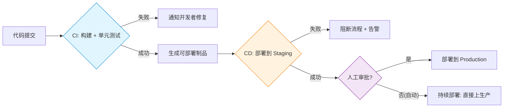
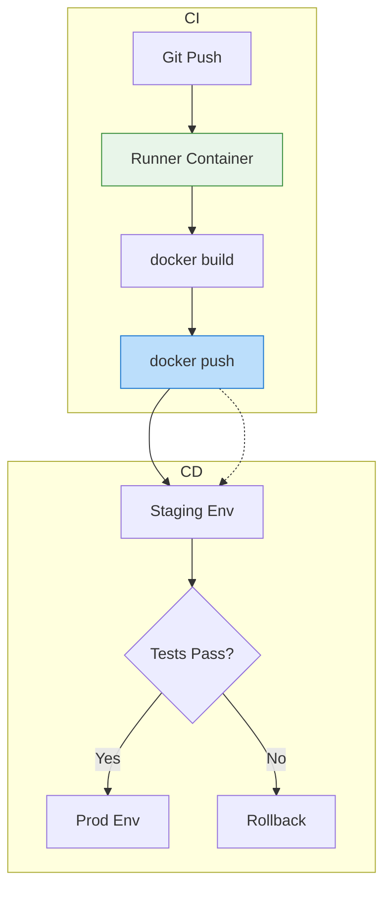
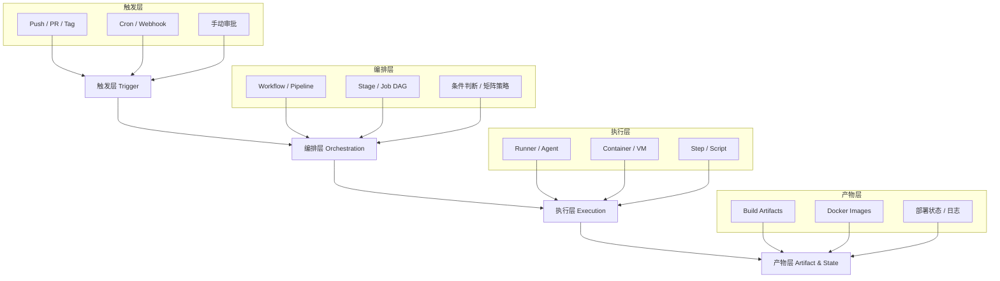
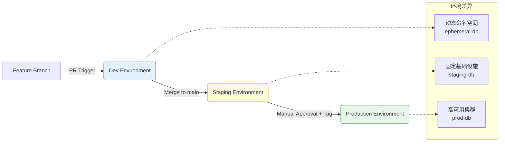
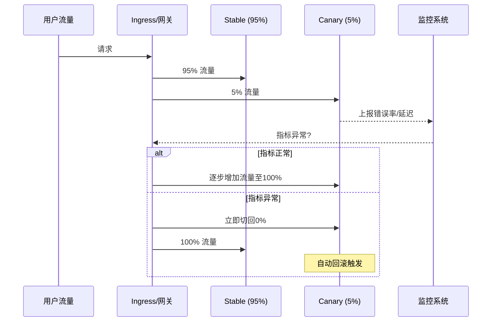

### 一、基础认知与核心概念

> **前言**  
> 在正式深入 CI/CD 的技术细节之前，我们需要先建立一套清晰、准确的概念框架。许多初学者将 CI/CD 简单等同于“自动打包”或“一键部署”，这容易导致在实践中忽视其背后的工程哲学。本阶段旨在帮助读者理解：**CI/CD 不仅是一组工具，更是一种以“小批量、高频次、可验证”为核心的软件交付方法论**。鉴于你已掌握 Docker 等前置知识，我们将在此基础上，重点阐释 CI/CD 如何与容器化协同，构建现代软件交付的基石。

#### 1.1 什么是 CI/CD？——从缩写到本质

CI/CD 实际上是三个紧密关联但职责不同的实践的组合：

- **持续集成（Continuous Integration, CI）**  
    指开发人员频繁地（通常每天多次）将代码变更合并到共享主干分支，并**自动触发构建与测试**。其核心目标是**尽早发现集成错误**，避免“集成地狱”（Integration Hell）。
    
    > 💡 **关键理解**：CI 的“持续”不是指“不停运行”，而是指“每次提交都触发”。如果团队一周才合并一次代码，即使使用了 Jenkins，也不算真正的 CI。
    
- **持续交付（Continuous Delivery, CD）**  
    在 CI 的基础上，确保代码**始终处于可随时安全发布到生产环境的状态**。所有通过测试的构建产物都会被自动部署到类生产环境（如 staging），但**最终上线需人工审批**。
    
    > 💡 **关键理解**：持续交付 ≠ 自动上线。它强调的是“可发布能力”而非“自动发布行为”。这是大多数企业采用的稳妥模式。
    
- **持续部署（Continuous Deployment, CD）**  
    是持续交付的延伸：**任何通过全部自动化验证的代码变更，都会自动部署到生产环境**，无需人工干预。
    
    > ⚠️ **注意**：持续部署对测试覆盖率、监控告警、回滚机制要求极高，仅适用于成熟度较高的团队。初学者应先掌握持续交付。
    

为直观区分三者关系，请参考下图：



#### 1.2 为什么需要 CI/CD？——解决传统交付的痛点

在没有 CI/CD 的时代，软件交付常面临以下问题：

|传统模式痛点|CI/CD 如何解决|与你已学知识的关联|
|---|---|---|
|集成冲突频繁、耗时长|小步提交 + 自动合并检测|Git 分支策略 + Docker 隔离构建|
|手动构建易出错、不可复现|声明式流水线 + 容器化构建环境|Dockerfile 保证环境一致性|
|测试滞后，缺陷发现晚|每次提交自动运行测试套件|单元测试/集成测试嵌入 Pipeline|
|部署依赖特定人员|自动化部署脚本 + 权限管控|K8s Manifest / Helm Chart 版本化|
|环境不一致导致“在我机器上能跑”|构建产物与环境解耦|Docker Image 作为唯一交付物|

> 📌 **背景补充**：CI/CD 的兴起与敏捷开发、DevOps 文化密不可分。它并非孤立技术，而是支撑“快速反馈循环”的工程基础设施。你之前学习的 Docker 正是实现这一闭环的关键载体——**Docker 解决了“构建什么”，CI/CD 解决了“何时、如何、到哪里去”**。

#### 1.3 核心术语速查表

为避免后续学习中的概念混淆，以下是必须掌握的基础术语：

- **Pipeline（流水线）**：CI/CD 的顶层抽象，定义从代码到部署的完整自动化流程。
- **Stage（阶段）**：Pipeline 的逻辑分组，如 `Build`、`Test`、`Deploy`，通常按顺序执行。
- **Job（任务）**：Stage 内的最小执行单元，包含一个或多个 Step；同一 Stage 内的 Job 可并行。
- **Step（步骤）**：具体命令或动作，如 `npm install`、`docker build`、`kubectl apply`。
- **Trigger（触发器）**：启动 Pipeline 的条件，如 push、PR、定时、webhook。
- **Artifact（制品）**：构建过程中产生的文件（如 JAR、Docker Image、二进制包），可在 Stage 间传递。
- **Runner / Agent（执行器）**：实际运行 Job 的环境，可以是虚拟机、容器或云服务托管实例。

> 💡 **类比理解**：可将 Pipeline 比作汽车装配线，Stage 是车间（冲压、焊接、涂装），Job 是工位上的机器人，Step 是机器人的具体动作，Artifact 是半成品零件，Trigger 是订单信号，Runner 是工厂厂房。

#### 1.4 CI/CD 与 Docker 的协同关系（衔接前序知识）

既然你已完成 Docker 学习，需特别强调二者如何配合：

- **Docker 作为 CI 的执行环境**：使用 `docker:dind` 或 Kaniko 等方案，在容器内安全构建镜像，避免污染宿主机。
- **Docker Image 作为 CD 的唯一交付物**：Pipeline 构建出的镜像推送到 Registry（如 Harbor、ECR），部署时只拉取该镜像，杜绝“现场编译”。
- **多阶段构建优化 CI 速度**：利用 Docker 多阶段构建减小镜像体积，加速推送与部署。
- **Compose/K8s 作为部署目标**：CD 阶段通过 `docker compose up` 或 `kubectl set image` 更新服务。



> ✅ **本节小结**：CI/CD 的本质是通过自动化缩短反馈环，提升交付质量与速度。理解其与 Docker 的共生关系，是你顺利进入下一阶段工具实操的前提。请确保对上述概念有清晰认知后再继续。

---

### 二、主流工具链解析与实操

> **前言**  
> 在建立了 CI/CD 的概念框架后，本阶段将进入“动手”环节。市面上 CI/CD 工具众多（Jenkins、GitLab CI、GitHub Actions、CircleCI、ArgoCD 等），但其核心设计哲学高度趋同。**掌握一种工具的底层逻辑，远比死记硬背多个工具的语法更重要**。考虑到你已具备 Docker 基础且可能正在构建个人技术栈，本节将以 **GitHub Actions** 为主线进行深度拆解（因其云原生、YAML 声明式、与代码仓库天然集成），同时横向对比 Jenkins/GitLab CI 的核心差异，帮助你建立可迁移的工具认知体系。

#### 2.1 CI/CD 工具的通用抽象模型

无论使用何种工具，一个完整的 Pipeline 都可抽象为以下四层模型。理解此模型后，切换工具仅需重新映射概念：



> 💡 **关键理解**：不要孤立地学习“如何写 GitHub Actions YAML”，而应时刻思考：“这个配置对应通用模型的哪一层？”例如 `on: push` 是触发层，`jobs.build.steps` 是执行层。这种思维能让你在接触新工具时快速定位知识锚点。

#### 2.2 GitHub Actions 深度实操（以 Docker 项目为例）

假设你有一个 Node.js + Docker 的项目，目标是：**PR 时跑测试，合并到 main 时构建镜像并推送到 Docker Hub**。以下是完整 Workflow 解析：

```yaml
# .github/workflows/ci-cd.yml
name: CI/CD Pipeline

# ========== 触发层 ==========
on:
  pull_request:
    branches: [main]
  push:
    branches: [main]

# ========== 编排层 + 执行层 ==========
jobs:
  # Job 1: 测试（仅在 PR 和 push 时运行）
  test:
    runs-on: ubuntu-latest  # 指定 Runner 环境
    steps:
      - uses: actions/checkout@v4  # Step: 拉取代码
      
      - name: Setup Node.js
        uses: actions/setup-node@v4
        with:
          node-version: '20'
          cache: 'npm'  # 内置缓存加速
      
      - run: npm ci           # Step: 安装依赖
      - run: npm test         # Step: 运行测试

  # Job 2: 构建与推送（仅当 test 成功且是 main 分支 push 时）
  build-and-push:
    needs: test               # 编排层：声明依赖关系
    if: github.event_name == 'push' && github.ref == 'refs/heads/main'
    runs-on: ubuntu-latest
    permissions:              # 安全最佳实践：最小权限原则
      contents: read
      packages: write
      
    steps:
      - uses: actions/checkout@v4
      
      # 利用 Docker Buildx 缓存层加速构建（衔接 Docker 知识）
      - name: Set up Docker Buildx
        uses: docker/setup-buildx-action@v3
        
      - name: Login to Docker Hub
        uses: docker/login-action@v3
        with:
          username: ${{ secrets.DOCKER_USERNAME }}
          password: ${{ secrets.DOCKER_PASSWORD }}
          
      - name: Build and push
        uses: docker/build-push-action@v5
        with:
          context: .
          push: true
          tags: |
            myuser/myapp:${{ github.sha }}
            myuser/myapp:latest
          cache-from: type=gha  # 使用 GitHub Actions 缓存
          cache-to: type=gha,mode=max
```

##### 🔑 核心语法要点解析

- **`needs` 构建 DAG**：Job 间默认并行，`needs` 显式声明依赖形成有向无环图。这是实现“测试通过才构建”的关键。
- **`if` 条件控制**：支持表达式语法（如 `github.event_name == 'push'`），避免不必要的资源消耗。
- **Secrets 管理**：**永远不要在 YAML 中硬编码凭证**。通过 `secrets.DOCKER_PASSWORD` 引用仓库级加密变量。
- **Action 复用生态**：`uses: docker/build-push-action@v5` 封装了复杂逻辑，避免重复造轮子。优先使用官方或高星 Action。
- **缓存策略**：`cache: 'npm'` 和 `cache-from: type=gha` 可将构建时间从分钟级降至秒级，这对 CI 体验至关重要。

> ⚠️ **常见陷阱提醒**：
> 
> - `actions/checkout@v4` 默认只拉取当前 commit，若需 Git 历史（如 changelog 生成），需设置 `fetch-depth: 0`。  
>     Docker 构建缓存失效往往因 `Dockerfile` 指令顺序不当，请回顾 Docker 多阶段构建最佳实践。  
>     `permissions` 未显式声明时默认宽松，生产环境务必遵循最小权限原则。

#### 2.3 主流工具横向对比与选型指南

|维度|GitHub Actions|GitLab CI|Jenkins|
|---|---|---|---|
|**托管模式**|SaaS（GitHub 托管 Runner）|SaaS / Self-hosted|主要 Self-hosted|
|**配置方式**|YAML（`.github/workflows/`）|YAML（`.gitlab-ci.yml`）|Groovy Pipeline / Blue Ocean UI|
|**Docker 集成**|原生支持 Buildx + GHA Cache|原生支持 Kaniko / Docker-in-Docker|需插件配置，灵活性高但复杂|
|**生态丰富度**|Marketplace 海量 Action|内置模板 + Component|插件生态庞大但维护参差不齐|
|**适用场景**|开源项目、中小团队、云原生应用|企业级 DevOps 平台、私有化部署|遗留系统、复杂定制流程、混合环境|
|**学习曲线**|⭐⭐（低）|⭐⭐⭐（中）|⭐⭐⭐⭐⭐（高）|

> 💡 **选型建议**：
> 
> - **个人/学习/开源项目** → GitHub Actions（零运维、文档完善、与你现有技能栈无缝衔接）
> - **企业内部平台** → GitLab CI（一体化体验、自托管 Runner 安全可控）
> - **已有 Jenkins 基础设施** → 渐进迁移，新项目用 GitLab CI/GHA，旧项目维持现状
> - **K8s 原生交付** → 后续阶段将介绍 ArgoCD（GitOps 模式），与上述工具互补而非替代

#### 2.4 本地调试与验证（避免“提交-等待-失败”循环）

CI 调试最痛的是反馈慢。以下工具可显著提升效率：

- **act**：在本地 Docker 中模拟 GitHub Actions 运行环境
    
    ```bash
    # 安装 act 后，在项目根目录执行
    act -j test --secret-file .env.secrets
    ```
    
    > ⚠️ 注意：`act` 无法完全模拟云端环境（如 OIDC、部分 Action），仅作快速语法/逻辑验证。
    
- **YAML Lint + Schema Validation**：VS Code 安装 `GitHub Actions` 扩展，实时校验语法错误与 Action 参数。
    
- **Dry Run 模式**：多数 Action 支持 `dry-run: true` 参数，预览操作而不实际执行（如 `docker/build-push-action`）。
    

> ✅ **本节小结**：CI/CD 工具的本质是“声明式自动化编排”。通过 GitHub Actions 掌握了 Trigger → Job DAG → Step → Artifact 的完整链路后，你已具备迁移至任何主流工具的能力。下一阶段将在此基础上，探讨多环境、安全、灰度等工程化高级策略。

---
### 三、高级策略与工程化实践

> **前言**  
> 掌握了基础工具链后，CI/CD 的挑战才真正开始。在生产环境中，“能跑通”只是及格线，“跑得稳、改得快、不出事”才是工程化的核心目标。本阶段将跳出单一 Pipeline 的视角，从**多环境治理、安全左移、发布策略、可观测性**四个维度，构建企业级交付体系。这些内容与你已学的 Docker/K8s 深度耦合，是通往高阶 DevOps 工程师的必经之路。

#### 3.1 多环境部署策略：Dev / Staging / Prod 的隔离与流转

真实项目绝非“一套配置打天下”。环境隔离不仅是资源隔离，更是**变更验证的梯度防线**。



##### 🔑 关键实践要点

- **配置与代码分离**：使用 K8s ConfigMap/Secret 或 Helm Values 文件区分环境变量，**禁止在 Dockerfile 中硬编码环境相关值**。
- **镜像标签策略**：
    - Dev：`<branch>-<sha>`（如 `feat-login-a1b2c3d`）
    - Staging：`staging-<timestamp>` 或 `rc-<version>`
    - Prod：**仅允许语义化版本标签**（如 `v1.2.3`），禁用 `latest`
- **审批门禁**：Staging → Prod 必须设置人工审批节点（GitHub Actions 的 `environment: production` + Protected Environments）。
- **数据库迁移安全**：Prod 部署前执行只读校验（如 `migrate status`），写操作需在低峰期独立执行并备份。

> 💡 **背景补充**：许多团队跳过 Staging 直接上 Prod，导致线上故障频发。Staging 的核心价值不是“再测一遍”，而是**用生产级基础设施验证部署流程本身**（包括网络策略、权限配置、监控告警是否生效）。

#### 3.2 安全左移：在 Pipeline 中嵌入防御纵深

安全不应是上线前的“最后一道关卡”，而应融入每个 Stage。以下是 CI/CD 中必须集成的三类扫描：

|扫描类型|作用|推荐工具|集成位置|
|---|---|---|---|
|SAST|静态代码漏洞分析|Semgrep, SonarQube|Test Stage|
|SCA|依赖包已知漏洞检测|Trivy, Dependabot|Build Stage|
|Container Scan|镜像层漏洞 + 恶意软件|Trivy, Grype|Post-Build|
|Secret Scan|防止凭证泄露到仓库|Gitleaks, TruffleHog|Pre-commit / CI|

##### 🛡️ 实操示例：Trivy 集成到 GitHub Actions

```yaml
- name: Run Trivy vulnerability scanner
  uses: aquasecurity/trivy-action@master
  with:
    image-ref: 'myuser/myapp:${{ github.sha }}'
    format: 'sarif'
    output: 'trivy-results.sarif'
    severity: 'CRITICAL,HIGH'
    exit-code: '1'  # 发现高危漏洞时阻断流水线

- name: Upload Trivy scan results to GitHub Security tab
  uses: github/codeql-action/upload-sarif@v3
  if: always()
  with:
    sarif_file: 'trivy-results.sarif'
```

> ⚠️ **重要原则**：
> 
> - **Fail Fast**：高危漏洞必须阻断 Pipeline，中低危可生成报告但不阻断。
> - **误报管理**：建立 `.trivyignore` 白名单机制，避免开发者因频繁误报而关闭扫描。
> - **Supply Chain Security**：启用 Sigstore/Cosign 对镜像签名，部署时验证签名完整性。

#### 3.3 灰度发布与回滚机制：降低变更爆炸半径

即使测试全覆盖，生产环境仍有未知风险。灰度发布是控制风险的“安全气囊”。

##### 常见灰度策略对比

- **滚动更新（Rolling Update）**：K8s 默认策略，逐步替换 Pod。简单但无法按流量比例控制。
- **蓝绿部署（Blue/Green）**：两套完整环境并行，切换瞬间完成。回滚快但资源成本翻倍。
- **金丝雀发布（Canary）**：先放量 5% → 观察指标 → 逐步扩大至 100%。**最推荐的平衡方案**。
- **特性开关（Feature Flag）**：代码级控制功能可见性，与部署解耦。适合业务逻辑灰度。



> 💡 **与你知识的衔接**：若已学 K8s，可使用 Argo Rollouts 或 Flagger 实现自动化金丝雀；若仅用 Docker Compose，可通过 Nginx upstream 权重模拟简易灰度。**回滚必须是原子操作**：K8s 用 `kubectl rollout undo`，Docker 用 `docker compose up --scale` 快速切回上一镜像。

#### 3.4 可观测性集成：让 Pipeline 自己“说话”

CI/CD 不是黑盒。缺乏可观测性的自动化等于“盲人开车”。

- **Pipeline 级别**：
    - 记录每次构建时长、失败率、MTTR（平均恢复时间）
    - 使用 DORA Metrics 衡量交付效能（部署频率、变更前置时间、服务恢复时间、变更失败率）
- **应用级别**：
    - 部署后自动触发 Smoke Test + 健康检查
    - 将 Git Commit SHA 注入镜像 Label 和环境变量，便于追踪问题版本
    - 集成 Prometheus/Grafana，部署后自动创建 Dashboard 快照对比前后指标

> ✅ **本节小结**：高级 CI/CD 的本质是从“自动化执行”升级为“智能化治理”。多环境提供验证梯度，安全左移前置风险拦截，灰度发布控制爆炸半径，可观测性闭环反馈优化。这四者共同构成生产级交付的护城河。下一阶段将通过综合练习，将这些策略落地为肌肉记忆。

---

### 四、综合练习与项目实战

> **前言**  
> 前三个阶段分别构建了概念框架、工具技能与工程化策略，但知识若不经过完整项目的淬炼，终将是零散的碎片。本阶段不再引入新概念，而是通过一个**端到端的实战项目**，将 Docker、CI/CD、安全扫描、灰度发布等能力串联为可交付的工程成果。该项目设计贴近真实业务场景，既可作为个人博客的技术背书，也可作为面试时的深度谈资。请严格按照“最小可行→逐步增强”的节奏推进，避免陷入过度设计的陷阱。

#### 4.1 实战项目：容器化 Todo API 的全链路自动化交付

##### 🎯 项目目标

构建一个 Node.js + PostgreSQL 的 Todo REST API，实现从代码提交到生产上线的全自动化流水线，并满足以下工程化要求：

- PR 触发测试与安全扫描，阻断不合格代码
- main 分支合并后自动构建镜像并部署至 Staging
- Staging 验证通过后，经人工审批以金丝雀方式发布至 Production
- 全流程可观测，关键指标可视化

##### 🧱 技术栈选型（衔接前序知识）

| 层级    | 技术选型                 | 选择理由                     |
| ----- | -------------------- | ------------------------ |
| 应用    | Node.js + Express    | 轻量、生态成熟，聚焦 CI/CD 而非业务复杂度 |
| 数据库   | PostgreSQL           | 生产级关系型数据库，支持迁移工具         |
| 容器化   | Docker + Multi-stage | 复用阶段1所学，保证构建一致性          |
| CI/CD | GitHub Actions       | 阶段2主线工具，云原生免运维           |
| 部署目标  | K3s (本地) / EKS (云端)  | K8s 原生支持灰度与配置分离          |
| 灰度控制器 | Argo Rollouts        | 声明式金丝雀，与 GitOps 理念契合     |
| 监控    | Prometheus + Grafana | 行业标准，DORA 指标采集基础         |

> 💡 **为什么选这个项目？**  
> Todo API 足够简单，使你不必分心于业务逻辑；又足够完整，涵盖 CRUD、数据库迁移、健康检查等生产要素。**重点不在“做什么”，而在“如何自动化地做”**。

> [!success]- 点击展开题解
> 
> ### 📘 项目题解：容器化 Todo API 的全链路自动化交付
> 
> 本项目并非一个单纯的业务开发练习，而是一个**标准的云原生工程化实训**。其核心考察点不在于“Todo API 怎么写”，而在于如何围绕这个最小可行性应用（MVP），搭建一套符合现代 SRE/DevOps 标准的自动化交付体系。以下从架构设计、流水线拆解、关键概念解析三个维度进行深度剖析。
> 
> ---
> 
> #### 1. 整体架构与流水线全景图
> 
> 为了直观理解“全链路”的含义，我们可以通过下图梳理从代码提交到生产发布的完整数据流与控制流：
> 
> ```mermaid
> flowchart TD
>     subgraph Dev["👨‍💻 开发阶段"]
>         A[开发者提交 PR] --> B{GitHub Actions CI}
>         B -- Pass --> C[✅ 单元测试 & 安全扫描]
>         B -- Fail --> D[❌ 阻断合并]
>     end
> 
>     subgraph Staging["🧪 Staging 环境"]
>         C --> E[Merge to Main]
>         E --> F[自动构建 Docker 镜像]
>         F --> G[推送至镜像仓库]
>         G --> H[ArgoCD/GitOps 同步部署]
>         H --> I[Staging 冒烟测试]
>     end
> 
>     subgraph Prod["🚀 Production 环境"]
>         I --> J{人工审批 ✅}
>         J --> K[Argo Rollouts 触发金丝雀发布]
>         K --> L[5% -> 20% -> 50% -> 100% 逐步放量]
>         L --> M{Prometheus 指标正常?}
>         M -- Yes --> N[✅ 发布完成]
>         M -- No --> O[⚠️ 自动回滚]
>     end
> 
>     style Dev fill:#e3f2fd,stroke:#1565c0
>     style Staging fill:#fff3e0,stroke:#ef6c00
>     style Prod fill:#e8f5e9,stroke:#2e7d32
> ```
> 
> ---
> 
> #### 2. 核心知识点拆解与背景补充
> 
> ##### 2.1 为什么选择 Todo API 作为载体？
> 
> - **业务复杂度归零**：CRUD 接口是开发者最熟悉的模式，避免在 CI/CD 调试时因业务 Bug 干扰排查。
> - **生产要素齐全**：包含数据库连接、环境变量注入、健康检查端点（`/healthz`）、结构化日志等，这些正是容器化部署需要验证的关键点。
> - **迁移友好**：PostgreSQL 配合 `node-pg-migrate` 等工具，可演示“应用启动前自动执行 DB Migration”这一生产级实践。
> 
> ##### 2.2 多阶段 Docker 构建（Multi-stage Build）
> 
> 这是保证镜像轻量与安全的关键技术。许多初学者直接在生产镜像中安装 `npm install`，导致镜像体积 >800MB 且包含大量编译工具漏洞。
> 
> ```dockerfile
> # 构建阶段：包含所有依赖和源码
> FROM node:20-alpine AS builder
> WORKDIR /app
> COPY package*.json ./
> RUN npm ci --only=production
> COPY . .
> RUN npm run build
> 
> # 运行阶段：仅复制必要产物
> FROM node:20-alpine AS runner
> WORKDIR /app
> COPY --from=builder /app/dist ./dist
> COPY --from=builder /app/node_modules ./node_modules
> EXPOSE 3000
> CMD ["node", "dist/index.js"]
> ```
> 
> > 💡 **效果对比**：单阶段镜像约 850MB → 多阶段镜像约 120MB，攻击面减少 80%+。
> 
> ##### 2.3 金丝雀发布 vs 蓝绿部署
> 
> 题目明确要求使用 **Argo Rollouts + 金丝雀**，需理解其与蓝绿部署的本质区别：
> 
> |特性|蓝绿部署|金丝雀发布|
> |:--|:--|:--|
> |资源开销|2倍（新旧版本并存）|增量小（仅少量副本）|
> |流量切换|瞬间全量切换|渐进式按比例放量|
> |风险暴露|要么成功要么全挂|问题仅影响小比例用户|
> |适用场景|状态无变化、快速回滚要求高|有状态服务、需真实流量验证|
> 
> Argo Rollouts 通过自定义 CRD（`Rollout` 资源）替代原生 `Deployment`，声明式定义权重步骤与分析模板，完美契合 GitOps 理念。
> 
> ##### 2.4 可观测性与 DORA 指标
> 
> “全流程可观测”不是简单装个 Grafana，而是要采集支撑 **DORA 四大关键指标** 的数据：
> 
> - **部署频率**：从 GitHub Actions 的 workflow run 记录中提取。
> - **变更前置时间**：PR merge 时间戳 → Production Pod Ready 时间戳之差。
> - **服务恢复时间**：Prometheus AlertManager 触发告警 → Rollback 完成的时间窗口。
> - **变更失败率**：Rollouts 中 `status.canary.currentStepAnalysisStatus == Failed` 的次数占比。
> 
> > ⚠️ **常见误区**：只监控 CPU/内存，不监控业务黄金指标（请求速率、错误率、延迟分位数）。建议为 Todo API 至少暴露 `/metrics` 端点，输出 `http_requests_total`、`http_request_duration_seconds` 等 RED 指标。
> 
> ---
> 
> #### 3. 实施建议与避坑指南
> 
> 1. **PR 门禁要快**：安全扫描（如 Trivy）若耗时过长，可改为异步或仅在 main 分支触发，避免阻塞开发体验。
> 2. **Staging 验证必须自动化**：不要依赖人工点点点。编写轻量级冒烟测试脚本（如 `curl /healthz && curl /todos`），作为 Actions Job 的 gate。
> 3. **人工审批不等于 Slack 喊话**：应使用 GitHub Environments 的 `required_reviewers` 功能，审批记录可审计、不可绕过。
> 4. **K3s 本地调试技巧**：使用 `k3d` 创建集群比直接装 K3s 更隔离；配合 `tilt` 或 `skaffold` 实现代码热重载，避免每次改代码都走完整 CI。
> 5. **Secrets 管理**：切勿将 DB 密码硬编码在 YAML 中。推荐使用 Sealed Secrets 或 External Secrets Operator，保持 GitOps 仓库纯文本安全。
> 
> ---
> 
> #### 4. 总结
> 
> 本项目的价值在于 **“以简驭繁”**——用最简单的业务承载最完整的工程实践。完成此项目后，你收获的不仅是一个 Todo API，更是一套可复用于任何微服务的标准化交付模板。后续可将 Node.js 替换为 Go/Java，PostgreSQL 替换为 MongoDB，流水线骨架几乎无需改动，这正是平台工程思维的体现。

#### 4.2 分步实施路线图

为避免一次性搭建导致的挫败感，建议按以下四个里程碑递进：

```mermaid
gantt
    title 实战项目里程碑
    dateFormat X
    axisFormat %s
    
    section M1: 基础闭环
    本地 Docker Compose 跑通应用 :m1, 0, 3
    GitHub Actions 实现 PR 测试 :m2, after m1, 2
    
    section M2: 安全与制品
    集成 Trivy 镜像扫描 :m3, after m2, 2
    镜像推送 + Staging 自动部署 :m4, after m3, 3
    
    section M3: 生产级发布
    Prod 环境 + 人工审批门禁 :m5, after m4, 2
    Argo Rollouts 金丝雀发布 :m6, after m5, 3
    
    section M4: 可观测性
    DORA 指标采集 + Grafana 看板 :m7, after m6, 3
```



##### 🔑 各里程碑验收标准

- **M1**：PR 提交后 2 分钟内反馈测试结果；本地 `docker compose up` 一键启动含数据库的完整应用。
- **M2**：高危漏洞阻断 Pipeline；Staging 环境可通过公网访问且数据持久化。
- **M3**：Prod 部署需点击 Approve 按钮；金丝雀阶段流量比例可在 Grafana 实时观察。
- **M4**：Dashboard 展示最近 7 天的部署频率、变更失败率；任意 commit 可追溯对应镜像版本。

> [!success]- 点击展开题解
> 
> ### 📖 题解：DevOps 实战项目的分步实施路线图
> 
> 本题展示了一个经典的 **渐进式 DevOps 落地策略**。其核心思想是“小步快跑、价值优先”，避免初学者或团队在搭建 CI/CD 体系时因技术栈过于复杂（如同时引入 K8s、Service Mesh、全链路追踪等）而产生挫败感。该路线图将庞大的工程拆解为四个逻辑递进的里程碑，符合认知规律与工程最佳实践。
> 
> ---
> 
> ### 1. 核心概念解析
> 
> 在深入路线图之前，需理解以下关键术语：
> 
> - **Docker Compose**: 本地开发环境的基石。它允许开发者用 YAML 文件定义多容器应用（如 App + DB + Cache），实现“一键启动”，消除“在我机器上能跑”的经典问题。
> - **Trivy**: 一款开源的容器镜像安全扫描工具。在 M2 阶段引入，体现了 **“安全左移” (Shift Left Security)** 理念，即在构建阶段而非上线后才发现漏洞。
> - **Argo Rollouts & 金丝雀发布**: Argo Rollouts 是 Kubernetes 原生的渐进式交付控制器。**金丝雀发布 (Canary Release)** 指先将少量流量（如 5%）导入新版本，观察无异常后再逐步扩大比例。这比传统的“蓝绿部署”风险更低，回滚更平滑。
> - **DORA 指标**: DevOps Research and Assessment 提出的衡量软件交付效能的四大黄金指标。M4 阶段采集这些指标，标志着团队从“能用”迈向“可度量、可优化”的成熟阶段。
>     - _部署频率 (Deployment Frequency)_
>     - _变更前置时间 (Lead Time for Changes)_
>     - _变更失败率 (Change Failure Rate)_
>     - _服务恢复时间 (Time to Restore Service)_
> 
> ---
> 
> ### 2. 里程碑逻辑可视化
> 
> 原题中的 Gantt 图侧重时间线，下图则侧重于**能力依赖关系**，帮助理解为何必须按此顺序实施：
> 
> ```mermaid
> graph TD
>     A[M1: 基础闭环] -->|代码可测试, 环境一致| B[M2: 安全与制品]
>     B -->|镜像可信, 自动部署| C[M3: 生产级发布]
>     C -->|线上稳定, 灰度可控| D[M4: 可观测性]
>     
>     style A fill:#e1f5fe,stroke:#0277bd
>     style B fill:#fff9c4,stroke:#fbc02d
>     style C fill:#e8f5e9,stroke:#2e7d32
>     style D fill:#f3e5f5,stroke:#7b1fa2
> ```
> 
> > **💡 设计哲学解读**：
> > 
> > - **M1 → M2**: 没有稳定的构建和测试（M1），安全扫描（M2）就缺乏可靠的输入源。
> > - **M2 → M3**: 没有经过安全验证和 Staging 环境磨合的镜像，直接上生产审批和金丝雀（M3）是鲁莽的。
> > - **M3 → M4**: 可观测性（M4）是为了监控生产行为，如果连生产级发布流程（M3）都没跑通，监控便失去了对象。
> 
> ---
> 
> ### 3. 验收标准的深层含义
> 
> 题目给出的验收标准并非随意设定，每一项都对应着具体的工程目标：
> 
> |里程碑|验收标准关键点|背后工程意义|
> |:--|:--|:--|
> |**M1**|PR 2分钟内反馈|**快速反馈环**：超过 5 分钟的等待会打断开发者心流，导致绕过测试。|
> |**M2**|高危漏洞阻断 Pipeline|**质量门禁自动化**：安全不是事后审计，而是构建流水线的一部分，防止带病上线。|
> |**M3**|人工审批 + Grafana 实时观察|**人机协同**：自动化处理常规流程，人负责高风险决策；实时观察确保灰度过程“看得见”。|
> |**M4**|7天 DORA + Commit 追溯|**数据驱动改进**：从“感觉系统变快了”转变为“部署频率提升了 30%”；全链路溯源是故障排查的基础。|
> 
> ---
> 
> ### 4. 补充背景与避坑指南
> 
> #### 为什么不建议一步到位？
> 
> 根据《Accelerate》一书的研究及大量企业实践，DevOps 转型失败的首要原因是 **“工具先行，文化滞后”**。一次性搭建全套 K8s + GitOps + Observability 平台，往往导致：
> 
> - 团队学习曲线过陡，抵触情绪重；
> - 基础设施维护成本远超业务开发；
> - 出现问题时无法定位是业务代码还是平台配置的问题。
> 
> #### 各阶段常见陷阱
> 
> - **M1 陷阱**: Docker Compose 环境与 CI 环境不一致。**对策**: CI 中也使用相同的 Compose 文件或 Testcontainers。
> - **M2 陷阱**: Trivy 误报过多导致流水线频繁中断。**对策**: 初期仅阻断 Critical 级别，建立白名单机制，逐步收紧。
> - **M3 陷阱**: 金丝雀期间缺乏有效的健康检查指标，仅靠肉眼观察。**对策**: 配置 AnalysisTemplate，基于错误率/延迟自动判断是否继续推进。
> - **M4 陷阱**: 只采集指标但不回顾。**对策**: 将 DORA 指标纳入双周迭代回顾会，作为持续改进的输入。
> 
> ### 5. 总结
> 
> 这份路线图本质上是一个 **“能力成熟度模型”** 的实操版。它告诉读者：DevOps 不是一个终点，而是一条从“本地能跑”到“数据驱动”的演进之路。对于博客读者而言，建议根据自身团队现状对号入座，不必强求一步到达 M4，**扎实地完成当前里程碑的验收标准，比盲目追求新技术更重要**。
>
>> [!note] 参考资料
>> 
>> - 《Accelerate: The Science of Lean Software and DevOps》- Nicole Forsgren et al.
>> - Argo Rollouts 官方文档: Canary Strategy
>> - DORA Metrics: [https://dora.dev/](https://dora.dev/)

#### 4.3 关键避坑指南（来自生产经验）

- **数据库迁移勿放 Entrypoint**：应在 CI/CD 中作为独立 Job 执行，失败时回滚应用部署而非让 Pod CrashLoopBackOff。
- **Secrets 分级管理**：Docker Hub 凭证存 Repository Secrets；Prod 数据库密码存 Environment Secrets 并启用审批保护。
- **Runner 资源限制**：自托管 Runner 务必设置 CPU/内存上限，避免恶意或错误脚本耗尽宿主机资源。
- **镜像标签不可变**：Prod 环境禁止使用 `latest` 或分支名标签，必须用 Git SHA 或语义版本号，确保回滚精确。
- **灰度验证自动化**：不要依赖人工盯盘。编写 AnalysisTemplate 定义成功标准（如错误率 < 0.1%），由 Argo Rollouts 自动判定。

> ⚠️ **心态提醒**：首次搭建完整链路必然遇到大量报错。**每次失败都是对 CI/CD 本质的再理解**。记录排查过程，这比顺利跑通更有价值。你的博客读者更想知道“你踩了什么坑、如何解决”，而非一份完美的 YAML 模板。

> [!success]- 点击展开题解
> 
> ### 📘 深度题解：CI/CD 生产环境关键避坑指南与工程化思维
> 
> 这份“避坑指南”虽然只有短短五条，但每一条都是无数生产事故换来的血泪经验。它们标志着 DevOps 实践从“**功能实现**”向“**稳定性工程（Reliability Engineering）**”的质变。为了帮助读者彻底消化这些知识点，本题解将从**原理剖析、风险推演、落地方案、背景拓展**四个维度进行全景式解读。
> 
> ---
> 
> ### 1. 数据库迁移勿放 Entrypoint：部署原子性的基石
> 
> #### 🧐 核心概念解析
> 
> **Entrypoint 迁移模式**是指在容器启动脚本（如 `docker-entrypoint.sh`）中执行 `migrate up`。这种模式在开发环境很方便，但在生产环境中是**反模式（Anti-pattern）**。  
> **独立 Job 模式**则是将数据库变更视为一个独立的、有状态的发布单元，与应用代码部署解耦。
> 
> #### ⚠️ 风险推演：为什么 Entrypoint 会致命？
> 
> ```mermaid
> sequenceDiagram
>     participant K8s as K8s Scheduler
>     participant PodA as New Pod A
>     participant PodB as New Pod B
>     participant DB as Database
>     
>     Note over K8s,DB: ❌ Entrypoint 模式的灾难现场
>     K8s->>PodA: Start Container
>     PodA->>DB: Run Migration (Lock Table)
>     K8s->>PodB: Start Container
>     PodB->>DB: Run Migration (Blocked/Conflict)
>     PodA->>DB: Migration Timeout/Fail
>     PodA-->>K8s: Exit Code 1
>     PodB->>DB: Retry Migration (Dirty State)
>     K8s->>PodA: Restart (CrashLoop)
>     Note right of DB: 结果：数据可能损坏<br/>服务长时间不可用<br/>旧版本已被替换无法回滚
> ```
> 
> #### ✅ 生产级落地方案
> 
> 1. **Pipeline 前置阶段**：在 Helm/Kubectl apply 之前，运行一个专门的 Migration Job。
> 2. **失败即终止**：Migration Job 失败时，Pipeline 标记为 Failed，后续部署步骤自动取消。此时线上仍运行旧版本应用，**零影响**。
> 3. **向后兼容原则**：无论采用哪种模式，所有 DDL 变更必须遵循“扩展-收缩”模式（Expand and Contract），确保新旧代码都能兼容当前 Schema。
> 
> > **💡 背景补充**：Kubernetes 原生提供了 `Job` 和 `CronJob` 资源类型。Helm Chart 中通常使用 `pre-install` / `pre-upgrade` Hook 来实现这一机制，本质上就是创建一个临时 Pod 执行迁移命令，成功后才继续主流程。
> 
> ---
> 
> ### 2. Secrets 分级管理：纵深防御体系
> 
> #### 🧐 核心概念解析
> 
> Secrets 分级不仅仅是“把密码存哪里”的问题，而是**身份与访问管理（IAM）** 在 CI/CD 领域的投射。其核心原则是：**凭证的作用域应与其风险等级严格匹配**。
> 
> #### 📊 分级策略详解
> 
> |层级|存储位置|典型内容|安全控制|泄露影响面|
> |:--|:--|:--|:--|:--|
> |L1|Repository Secrets|Docker Hub Token, NPM Token|仅本仓库可见|单项目构建失败|
> |L2|Organization Secrets|内部镜像仓库凭证, SonarQube Token|组织内所有仓库|多项目受影响|
> |L3|Environment Secrets|Prod DB Password, Cloud Provider Key|**绑定特定环境 + 审批人**|生产数据泄露/资损|
> |L4|External Vault|动态数据库凭证, 短期 STS Token|运行时注入 + 自动轮转|最小化（临时凭证）|
> 
> #### 🔍 关键技术点：Environment Protection Rules
> 
> GitHub Actions / GitLab CI 的 Environment 功能允许配置：
> 
> - **Required Reviewers**：部署到 prod 环境需指定人员手动 Approve。
> - **Wait Timer**：强制等待窗口期，用于观察或人工确认。
> - **Branch Restriction**：仅允许 `main` 分支触发 prod 部署。
> 
> > **⚠️ 常见误区**：很多团队把所有 Secrets 都放在 Repository 级别，导致任何有写权限的贡献者都可能通过修改 workflow 文件窃取生产凭证。**环境隔离是防止供应链攻击的关键防线**。
> 
> ---
> 
> ### 3. Runner 资源限制： noisy Neighbor 问题治理
> 
> #### 🧐 核心概念解析
> 
> **Noisy Neighbor（吵闹的邻居）**：在多租户或多任务共享资源的场景下，某个任务消耗过量资源导致其他任务性能下降甚至崩溃。自托管 Runner 天然面临此问题。
> 
> #### 🛠️ 多层防护策略
> 
> ```mermaid
> graph TD
>     A[恶意/错误脚本] --> B{防护层级}
>     B -->|L1: CI 配置| C[timeout-minutes / job timeout]
>     B -->|L2: 容器运行时| D[docker run --cpus=2 --memory=4g]
>     B -->|L3: OS 内核| E[cgroups v2 / systemd slice]
>     B -->|L4: 集群调度| F[K8s ResourceQuota + LimitRange]
>     B -->|L5: 监控告警| G[Prometheus + AlertManager]
>     
>     style C fill:#e1f5fe
>     style D fill:#e1f5fe
>     style E fill:#fff3e0
>     style F fill:#fff3e0
>     style G fill:#fce4ec
> ```
> 
> #### 💻 实操示例（Docker Runner）
> 
> ```yaml
> # config.toml for GitLab Runner
> 
>   cpus = "2"
>   memory = "4096"
>   # 防止特权逃逸
>   privileged = false
>   # 禁用网络（可选，按需开放）
>   network_mode = "bridge"
> ```
> 
> > **💡 背景补充**：除了 CPU/内存，还需关注**磁盘 I/O** 和 **网络带宽**。一个失控的日志写入或依赖下载同样能拖垮宿主机。建议使用 `blkio` cgroup 限制 IOPS，并在 Runner 上挂载独立的临时存储卷。
> 
> ---
> 
> ### 4. 镜像标签不可变性：可复现构建的信任链
> 
> #### 🧐 核心概念解析
> 
> **不可变基础设施（Immutable Infrastructure）** 的核心信条是：**一旦部署，永不修改；如需变更，整体替换**。可变标签（`latest`, `dev`, `main`）直接违背了这一信条，因为它们指向的内容随时间漂移。
> 
> #### 🔗 信任链断裂示意
> 
> ```mermaid
> flowchart LR
>     subgraph 可变标签_信任链断裂
>     A[Tag: main] -->|T1时刻| B[Image: abc123]
>     A -->|T2时刻| C[Image: def456]
>     D[kubectl rollout undo] -->|引用 Tag: main| E[??? 不确定是哪个版本]
>     end
>     
>     subgraph 不可变标签_精确追溯
>     F[Tag: v1.2.3-sha-a1b2c3d] -->|永远| G[Image: a1b2c3d]
>     H[kubectl rollout undo] -->|引用完整Tag| I[✅ 精确恢复到 a1b2c3d]
>     end
> ```
> 
> #### ✅ 标签命名规范建议
> 
> - **CI 构建产物**：`${GIT_SHA_SHORT}` 或 `${CI_PIPELINE_ID}`
> - **正式发布**：`v${SEMVER}` （由 Release Tag 触发）
> - **调试用途**：`debug-${USER}-${TIMESTAMP}` （明确标识为非生产）
> - **禁止清单**：`latest`, `stable`, `prod`, `main`, `develop` 等任何语义模糊或会被覆盖的标签
> 
> > **🔧 工具推荐**：使用 `crane` 或 `skopeo` 可以在不拉取镜像的情况下检查远程标签的 digest，验证不可变性。OCI Registry 也支持设置 Tag Immutability Policy，从服务端强制拒绝覆盖已有标签。
> 
> ---
> 
> ### 5. 灰度验证自动化：从“人肉盯盘”到“声明式质量门禁”
> 
> #### 🧐 核心概念解析
> 
> **AnalysisTemplate** 是 Argo Rollouts 定义的声明式分析模板。它将“服务是否健康”这个主观判断，转化为**可量化、可自动执行的数学表达式**。这是 SRE 文化中 **SLO（Service Level Objective）** 的工程化落地。
> 
> #### 📐 完整的 Analysis 工作流
> 
> ```mermaid
> stateDiagram-v2
>     [*] --> CanaryDeployed: 发布新版本 5%
>     CanaryDeployed --> AnalysisRunning: 触发 AnalysisTemplate
>     AnalysisRunning --> MetricQuery: 每30s查询 Prometheus
>     MetricQuery --> EvaluateCondition: result < threshold?
>     EvaluateCondition --> Success: 连续10次达标
>     EvaluateCondition --> Failure: 连续3次超标
>     Success --> PromoteFull: 逐步提升至100%
>     Failure --> AutoRollback: 自动回滚到上一版本
>     PromoteFull --> [*]
>     AutoRollback --> [*]: 发送告警通知
> ```
> 
> #### 📝 高质量 AnalysisTemplate 设计要点
> 
> 1. **多维度指标**：不要只看错误率。组合使用：
>     - 错误率（Error Rate）
>     - P99 延迟（Latency）
>     - 业务指标（订单成功率、登录转化率）
>     - 饱和度（CPU/Memory Usage）
> 2. **合理的阈值与窗口**：
>     - 避免瞬时抖动误杀：设置 `failureLimit` 和 `consecutiveSuccessLimit`
>     - 考虑冷启动：设置 `initialDelay` 跳过预热期
> 3. **基线对比**：使用 `baselineRef` 对比新旧版本的相对差异，而非绝对阈值，适应流量波动。
> 
> > **💡 背景补充**：除了 Argo Rollouts，Flagger、Kayenta（Netflix）、Spinnaker 等工具也提供类似能力。核心理念一致：**将运维经验编码化，消除人为判断的不确定性和疲劳误差**。
> 
> ---
> 
> ### 6. 心态提醒的深度解读：故障是知识的载体
> 
> #### 🎯 为什么“踩坑记录”比“完美 YAML”更有价值？
> 
> - **YAML 是静态的，问题是动态的**：官方文档给出的是 Happy Path，而生产环境的复杂性在于 Edge Cases。你的排查过程填补了文档与现实之间的鸿沟。
> - **决策上下文（Decision Context）**：读者不仅想知道“怎么做”，更想知道“**为什么选这个方案而不是那个**”。记录你评估过的替代方案及其被否决的原因，这才是高阶知识。
> - **建立同理心社区**：分享失败降低了后来者的焦虑感，营造了“安全失败”的工程文化。
> 
> #### 📝 推荐的复盘写作框架
> 
> ```markdown
> ## 问题现象
> [客观描述，附日志/截图]
> 
> ## 排查路径
> 1. 初始假设 → 验证结果
> 2. 修正假设 → 验证结果  
> 3. 根因定位
> 
> ## 根本原因
> [技术层面 + 流程/认知层面]
> 
> ## 解决方案
> [短期修复 + 长期预防]
> 
> ## 反思与改进
> - 哪些监控缺失导致了发现延迟？
> - 哪些文档误导了排查方向？
> - 如何避免同类问题再次发生？
> ```
> 
> ---
> 
> ### 🗺️ 知识体系全景图
> 
> ```mermaid
> mindmap
>   root((生产级 CI/CD<br/>避坑指南))
>     部署可靠性
>       迁移独立Job
>       向后兼容DDL
>       Helm Pre-Hook
>     安全纵深防御
>       Secrets四级分类
>       Environment审批
>       动态凭证Vault
>     资源治理
>       Runner资源配额
>       Noisy Neighbor防护
>       磁盘IO限制
>     交付可追溯性
>       镜像标签不可变
>       Git SHA锚定
>       OCI Digest验证
>     质量自动化
>       AnalysisTemplate
>       SLO驱动门禁
>       多维指标组合
>     工程文化
>       故障复盘写作
>       决策上下文记录
>       安全失败心态
> ```
> 
> ### 📚 延伸阅读建议
> 
> - 《Continuous Delivery》by Jez Humble & David Farley —— CI/CD 圣经
> - 《Site Reliability Engineering》(Google SRE Book) —— SLO/Error Budget 理论基础
> - Argo Rollouts 官方文档 Analysis 章节 —— 实战参考
> - OWASP CI/CD Security Cheat Sheet —— 安全加固清单
> 
> 掌握这五条避坑指南，你构建的不再仅仅是一条流水线，而是一套**可信赖的软件交付系统**。记住：在生产环境中，**无聊的技术（Boring Technology）往往是最可靠的技术**。追求稳健，而非炫技。

### 五、练习：从知识到肌肉记忆的转化

> **前言**  
> CI/CD 是一门“手艺活”，仅靠阅读和观看无法真正掌握。本阶段的练习设计遵循 **“诊断→修复→构建→反思”** 的认知闭环，避免陷入“复制粘贴 YAML”的虚假熟练感。所有练习均基于阶段4的 Todo API 项目展开，确保上下文连贯。请准备一个笔记本（数字或纸质），记录每次练习的**预期结果、实际结果、差异原因**——这份记录将成为你未来排查生产问题的宝贵索引。

#### 5.1 诊断型练习：读懂失败比写出成功更重要

在生产环境中，80% 的时间花在排查而非编写。以下练习刻意制造典型故障，训练你的“Pipeline 直觉”。

|练习编号|故障场景描述|核心考察点|验收标准|
|:--|---|---|---|
|D-1|PR 测试通过但 Staging 部署失败|环境差异 / 配置分离|3分钟内定位根因（如缺少环境变量、镜像标签错误）|
|D-2|镜像扫描通过但运行时崩溃|SCA 局限性 / 运行时依赖|区分构建时与运行时问题，补充健康检查|
|D-3|金丝雀发布后指标正常但用户投诉|监控盲区 / 业务指标缺失|识别技术指标与业务体验的差距，新增 AnalysisTemplate|
|D-4|回滚操作执行成功但数据不一致|数据库迁移不可逆|理解应用与数据生命周期解耦的重要性|

> 💡 **操作方法**：不要直接搜索答案。先查看 Pipeline 日志 → 检查 Runner 环境 → 对比成功/失败构建的差异 → 查阅工具官方 Troubleshooting 文档。**记录排查路径比得到答案更重要**。若卡住超过30分钟，再寻求帮助，并复盘为何卡在这一点。

> [!success]- 点击展开题解
> 
> ## 📘 诊断型练习题解：构建你的 Pipeline 排查直觉
> 
> 在 DevOps 与 SRE 的工程实践中，**“写代码”只是冰山一角，“修代码”才是水面下的庞然大物**。本节题解旨在帮助你建立系统化的故障排查思维，而非仅仅提供标准答案。请结合下方的分析路径，复盘你自己的排查过程。
> 
> ---
> 
> ### D-1: PR 测试通过但 Staging 部署失败
> 
> #### 💡 核心概念解析
> 
> **环境差异（Environment Drift）**：指开发/CI 环境与目标部署环境（Staging/Prod）在配置、依赖版本、网络策略或权限上的不一致。这是“Works on my machine”问题的根源。
> 
> #### 🔍 推荐排查路径
> 
> ```mermaid
> flowchart TD
>     A[Staging 部署失败] --> B{查看部署日志}
>     B -- 报错含 env/config --> C[对比 CI 与 Staging 环境变量]
>     B -- 报错含 image/tag --> D[检查镜像仓库与 Tag 传递链]
>     B -- 报错含 permission/network --> E[检查 K8s RBAC / NetworkPolicy]
>     C --> F[根因: 配置未分离或未注入]
>     D --> G[根因: CI 构建产物与部署引用不匹配]
>     E --> H[根因: 环境基础设施差异]
> ```
> 
> #### 🎯 题解要点
> 
> - **最快定位法**：直接 `diff` 成功构建（如 Dev）与失败构建（Staging）的环境变量列表和部署 Manifest。
> - **常见根因**：
>     - Staging 缺少 `DATABASE_URL` 等敏感配置（CI 测试可能用了 SQLite 内存库）。
>     - 镜像 Tag 在 CI 中是 `sha256:...`，但部署脚本硬编码了 `latest`。
>     - Staging 集群的 Node 没有拉取私有镜像的 `imagePullSecret`。
> - **防御性编程建议**：引入 **Configuration Validation**，在应用启动时主动校验必需的环境变量，缺失则 Fail Fast 并打印明确错误，而非等到运行时 NPE。
> 
> ---
> 
> ### D-2: 镜像扫描通过但运行时崩溃
> 
> #### 💡 核心概念解析
> 
> **SCA（软件成分分析）局限性**：SCA 工具（如 Trivy, Snyk）主要扫描**文件系统层面的已知 CVE**，但无法检测：
> 
> - 运行时动态加载的依赖
> - 配置错误导致的逻辑崩溃
> - 资源限制（OOM/CPU Throttling）
> - 外部服务连接超时
> 
> #### 🔍 推荐排查路径
> 
> ```mermaid
> flowchart LR
>     A[运行时崩溃] --> B{区分崩溃阶段}
>     B -- 启动即崩 --> C[检查 Entrypoint / 配置 / 依赖加载]
>     B -- 运行中崩 --> D[检查 OOM / Panic / 外部调用]
>     C --> E[补充: 启动探针 Startup Probe]
>     D --> F[补充: Liveness/Readiness + 资源 Limits]
>     E & F --> G[完善可观测性: 日志+Metrics+Trace]
> ```
> 
> #### 🎯 题解要点
> 
> - **关键认知**：安全扫描 ≠ 稳定性保证。扫描通过只代表“没有已知漏洞”，不代表“能正常运行”。
> - **健康检查三件套**：
>     
>     |探针类型|作用|缺失后果|
>     |:--|:--|:--|
>     |Startup Probe|保护慢启动应用不被误杀|应用还在初始化就被 Liveness 重启|
>     |Readiness Probe|控制流量接入时机|请求打到未就绪 Pod，用户看到 502|
>     |Liveness Probe|检测死锁/假死状态|应用卡住但进程还在，无法自动恢复|
>     
> - **排查技巧**：使用 `kubectl describe pod` 查看 Last State 的 Exit Code；使用 `kubectl logs --previous` 查看崩溃前日志。
> 
> ---
> 
> ### D-3: 金丝雀发布后指标正常但用户投诉
> 
> #### 💡 核心概念解析
> 
> **监控盲区（Observability Gap）**：技术指标（CPU、内存、HTTP 200 率）反映的是**系统健康度**，而非**用户体验**。用户关心的是“能否完成业务目标”，例如：下单成功率、搜索相关性、页面加载感知速度。
> 
> #### 🔍 推荐排查路径
> 
> ```mermaid
> flowchart TD
>     A[指标正常但用户投诉] --> B[收集用户反馈样本]
>     B --> C{问题是否可量化?}
>     C -- 是 --> D[定义业务 SLI/SLO]
>     C -- 否 --> E[补充用户行为埋点/RUM]
>     D --> F[创建 AnalysisTemplate]
>     E --> F
>     F --> G[将业务指标纳入金丝雀判定]
> ```
> 
> #### 🎯 题解要点
> 
> - **经典陷阱**：API 返回 200，但响应体是空列表或错误数据；P99 延迟达标，但关键路径的某个子接口慢了 3 秒。
> - **AnalysisTemplate 实践**（以 Argo Rollouts 为例）：
>     
>     ```yaml
>     # 示例：不仅检查错误率，还检查"订单创建成功率"
>     metrics:
>       - name: order-success-rate
>         provider:
>           prometheus:
>             query: |
>               sum(rate(order_created_total{app="canary"}[5m]))
>               /
>               sum(rate(order_attempt_total{app="canary"}[5m]))
>         successCondition: result[0] >= 0.95
>         interval: 1m
>     ```
>     
> - **思维转变**：从“系统没挂”转向“用户能用”。每次发布前问自己：**如果这个功能坏了，哪个业务指标会先变红？**
> 
> ---
> 
> ### D-4: 回滚操作执行成功但数据不一致
> 
> #### 💡 核心概念解析
> 
> **应用与数据生命周期解耦**：应用代码可以秒级回滚，但**数据库 Schema 变更和数据迁移往往是不可逆的**。这是 CI/CD 中最危险的不对称性。
> 
> #### 🔍 推荐排查路径
> 
> ```mermaid
> flowchart TD
>     A[回滚后数据不一致] --> B[确认数据损坏范围]
>     B --> C{是否有向后兼容的 Migration?}
>     C -- 有 --> D[执行补偿 Migration 修复数据]
>     C -- 无 --> E[从备份恢复 / 手动修复]
>     D & E --> F[复盘: 为何 Migration 不可逆?]
>     F --> G[建立规范: Expand-Contract 模式]
> ```
> 
> #### 🎯 题解要点
> 
> - **根本原因**：新版本 Migration 删除了旧列/改了字段类型，回滚到旧代码后，旧代码读写已变更的表结构导致数据错乱。
> - **黄金法则：Expand-Contract 模式**
>     
>     ```mermaid
>     graph LR
>         A[1. Expand<br/>新增列/表] --> B[2. Migrate<br/>双写+回填历史数据]
>         B --> C[3. Contract<br/>旧代码不再读旧列后删除]
>         style A fill:#e1f5fe
>         style B fill:#fff3e0
>         style C fill:#fce4ec
>     ```
>     
>     > ⚠️ **关键原则**：任何 Migration 必须在**当前版本和上一版本都能正常工作**。删除操作永远放在下一个发布周期。
>     
> - **工程实践**：
>     - Migration 脚本必须独立于应用部署，支持单独执行和回滚。
>     - 禁止在 Migration 中做破坏性变更（DROP COLUMN、修改类型）。
>     - 回滚预案中必须包含**数据修复步骤**，而不仅仅是代码回滚。
> 
> ---
> 
> ### 🧭 通用排查心法总结
> 
> |原则|说明|
> |:--|:--|
> |**先看日志，再猜原因**|避免锚定偏差，让证据引导方向|
> |**二分法定位**|快速缩小范围：是构建问题还是运行时问题？是代码问题还是配置问题？|
> |**对比法**|找到最近一次成功的构建/部署，Diff 一切可变因素|
> |**记录排查路径**|即使最终发现是低级错误，记录过程能防止下次重复踩坑|
> |**30分钟规则**|卡住超过30分钟必须求助，但求助时要带上“我试了什么、排除了什么”|
> 
> > 📝 **博客作者注**：这些练习的价值不在于“做对”，而在于“做错后的反思”。建议将每次排查过程写成 Post-Mortem 文档，积累成团队的 Runbook。真正的 Pipeline 直觉，是用一次次失败的排查经验喂出来的。

#### 5.2 修复型练习：在约束条件下优化

真实工程永远在资源、时间、安全的三角约束中权衡。以下练习模拟现实压力：

- **F-1：构建加速挑战**  
    将当前 Pipeline 总时长压缩 40%。限制条件：不得更换 Runner 规格、不得跳过安全扫描。
    
    > 🔍 提示方向：Docker 层缓存优化、并行 Job 拆分、依赖缓存策略、Action 版本升级。
    
- **F-2：安全加固挑战**  
    在不阻断现有开发流程的前提下，将高危漏洞检出率提升至 95%。限制条件：误报率 < 5%，开发者无需修改代码即可通过扫描。
    
    > 🔍 提示方向：自定义 Trivy 忽略规则、引入 SAST 补充 SCA 盲区、设置分级告警而非全量阻断。
    
- **F-3：灰度精度挑战**  
    实现基于用户 ID 哈希的金丝雀分流（而非随机流量），确保同一用户在灰度期间始终访问同一版本。限制条件：不修改应用代码。
    
    > 🔍 提示方向：Ingress Controller 注解配置、Argo Rollouts Header/Cookie 路由规则。
    

> ⚠️ **关键原则**：每次修复必须附带**回归测试**。优化了速度是否牺牲了可靠性？加固了安全是否影响了交付频率？**没有度量就没有优化**——用 DORA 指标验证改进效果。

> [!success]- 点击展开题解
> # 5.2 修复型练习：在约束条件下优化 - 题解
> 
> 你好，欢迎来到这片技术沙盘。本章的练习不是虚构的考题，而是日常工程困境的缩影。我们将在**速度、安全、精度**的三重约束下，寻找那些“戴着镣铐跳舞”的优雅解法。
> 
> 在深入每个挑战之前，我想先铺垫一个核心思想：**没有度量就没有优化**。所有修改都必须附带回归测试，并用 DORA 指标（部署频率、变更前置时间、变更失败率、故障恢复时间）来验证我们是否在解决一个问题的同时引入了新问题。这就像医生用药，不能只盯着症状消失，还得监控肝肾功能的化验单。
> 
> ---
> 
> ## F-1：构建加速挑战
> 
> > **核心目标**：Pipeline 总时长压缩 40%。
> > **硬性约束**：不更换 Runner 规格，不跳过安全扫描。
> 
> 在不增加算力（硬件）和不跳过关键安检（流程）的前提下提速，本质是**消除浪费**。我们需要揪出 Pipeline 里那些“无效等待”和“重复劳动”。
> 
> ### 🔍 优化策略拆解
> 
> 我们可以把 CI Pipeline 想象成一条工厂流水线，时间的浪费通常发生在工位间的“传递”和“重复加工”上。
> 
> **1. Docker 层缓存优化：让构建“从中间开始”**
> CI 中最耗时的往往是 `docker build`。默认每次都是“从零开始”，但依赖（`package.json`, `pom.xml`）的变更频率远低于源码。通过合理安排 Dockerfile 的指令顺序，我们可以让缓存命中率最大化。
> 
> ```mermaid
> graph TD
>     A[Docker Build 开始] --> B{基础镜像层};
>     B --> C{系统依赖层<br/>apt-get install...};
>     C --> D{应用依赖层<br/>npm ci / pip install...};
>     D --> E{源代码层<br/>COPY . .};
>     E --> F[最终镜像];
> 
>     style D fill:#4CAF50,stroke:#333,stroke-width:2px
>     style E fill:#FF9800,stroke:#333,stroke-width:2px
> ```
> 
> **原理**：Docker 分层构建。若 `package.json` 未变，则“应用依赖层”命中缓存（绿色），直接跳到“源代码层”（橙色）。如果我们将频繁变动的源代码放在最后，前面耗时的依赖安装层就能被大量复用。
> 
> **2. 并行 Job 拆分：让任务“分头行动”**
> 将串行的大 Job 拆分为更小的独立任务，利用 GitLab CI / GitHub Actions 的多 Job 并行能力。
> 
> **3. 依赖缓存策略：跨 Job 的“快递柜”**
> 语言级的包管理器（npm, Maven, Go mod）都有缓存目录。将它们通过 CI 系统的 `cache` 关键字持久化，避免每个 Job 都重新下载整个互联网。
> 
> **4. Action/Orb 版本升级：享受“免费的加速”**
> 维护者会持续优化执行器。例如 `actions/checkout@v3` 比 `@v2` 快，`actions/setup-node` 内置了更优的缓存逻辑。这是一种极低成本的性能压榨。
> 
> ### 💡 执行方案与回归测试
> **实施方案**：
> -   重构 `Dockerfile`，将 `COPY . .` 置于文件末尾。
> -   拆分 `test` 和 `lint` 为两个并行 Job。
> -   配置 `.gitlab-ci.yml` 或 `.github/workflows` 的全局 `cache` 指向 `~/.npm` 或 `~/.m2`。
> 
> **回归测试与度量**：
> -   **加速验证**：对比优化前后的 Pipeline 平均耗时，确保降幅 ≥ 40%。
> -   **可靠性验证（DORA）**：
>     -   **变更失败率**：监控加速实施后一周内，因缓存污染或 Job 拆分导致的主分支构建失败率是否激增。
>     -   **故障恢复时间**：若因缓存问题导致故障，记录回滚配置到恢复正常的时长。
> 
> ---
> 
> ## F-2：安全加固挑战
> 
> > **核心目标**：高危漏洞检出率提升至 95%。
> > **硬性约束**：误报率 < 5%，且开发者无需修改代码。
> 
> 安全扫描常常是“狼来了”的故事——告警太多、太假，最终被人忽视。这里的挑战在于**提升信噪比**，在流程中对风险进行分级处理，而不是粗暴地阻塞开发。
> 
> ### 🔍 优化策略拆解
> 
> **1. 引入 SAST 补充 SCA 盲区**
> 
> -   **SCA**：软件组成分析，扫描你“拿来即用”的第三方依赖。它看到的都是已知的、公布在册的漏洞（CVE）。
> -   **SAST**：静态应用安全测试，像一位代码审查员，直接阅读你自己写的源代码，从中发现注入、XSS、硬编码密钥等逻辑缺陷。
> 
> 这两种扫描看待代码的视角完全不同且互补。仅依靠 Trivy 做 SCA，就好比只检查建筑材料是否合格，却不审查设计图纸本身有无缺陷。
> 
> ```mermaid
> graph LR
>     subgraph 应用安全扫描
>         A[源代码] --> B(SAST 引擎<br/>如 Semgrep/CodeQL);
>         B --> C[自定义代码缺陷<br/>SQL注入/硬编码密钥];
>         D[第三方依赖清单] --> E(SCA 引擎<br/>如 Trivy);
>         E --> F[已知开源漏洞<br/>Log4Shell/Spring4Shell];
>     end
>     C --> G{分级告警};
>     F --> G;
>     G --低危/中危--> H[记录在安全面板];
>     G --高危/严重--> I[触发通知/阻断];
>     style B fill:#9C27B0,stroke:#333,color:#fff
>     style E fill:#00BCD4,stroke:#333
> ```
> 
> **2. 自定义 Trivy 忽略规则：赦免“假警报”**
> 有些 CVE 在特定上下文里并无实际危害，或是暂时无修复方案，持续告警只会造成干扰。
> 
> -   创建 `.trivyignore.yaml` 文件，精确列出要忽略的 CVE 编号及其理由。
> -   关键原则：忽略必须附带 **“过期时间”** 。例如，一个月后自动失效，迫使我们重新评估。
> 
> **3. 设置分级告警而非全量阻断：构建“安检”而非“墙”**
> 在 CI 管道中，扫描不应只有“通过/阻断”两种状态。
> 
> -   **高危/严重漏洞**：阻止合并，并自动创建修复任务（Issue）。
> -   **中危漏洞**：不阻止合并，但在 MR/PR 界面留下检查结论，并通知安全团队关注。
> -   **低危/可忽略**：仅在扫描报告中记录，不打扰开发者。
> 
> ### 💡 执行方案与回归测试
> **实施方案**：
> -   在 CI 中加入 Semgrep/CodeQL 执行 SAST。
> -   定制 `.trivyignore.yaml`，忽略 3 个有上下文的、久未修复的误报 CVE，并设定 30 天的失效期。
> -   修改 CI 配置，将安全扫描 Job 的结果依据严重度分级处理。
> 
> **回归测试与度量（DORA）**：
> -   **效率验证（部署频率）**：监控配置调整后，部署频率是否因误报减少、干预降低而自然回升。**安全不应总是以牺牲速度为代价。**
> -   **质量验证（变更失败率）**：统计灰度或生产环境中，因代码漏洞导致的安全事件数量。相比调整前，检出的真实高危漏洞数应明显上升。
> 
> ---
> 
> ## F-3：灰度精度挑战
> 
> > **核心目标**：基于用户 ID 哈希的金丝雀分流，同一用户始终访问同一版本。
> > **硬性约束**：不修改应用代码。
> 
> 这本质上是一个**流量路由**问题。我们不动应用代码，就必须在“流量入口”的网关或服务网格层面，根据请求的某个特征（用户 ID）来下判断。
> 
> ### 🔍 前置知识：金丝雀发布 vs. 随机灰度
> 
> -   **随机灰度**：简单按比例切流。一个用户刷新页面，可能一会儿看到新版，一会儿又回到旧版。这在体验和数据一致性上是灾难。
> -   **会话亲和性金丝雀**：同一用户的所有请求，在灰度期间始终被导向同一个版本。这样用户体验连贯，A/B 测试数据也准确。
> 
> ### 💡 执行方案
> 
> 核心思路是：在 Kubernetes Ingress 网关处，捕获 HTTP Header 或 Cookie 中的 `user_id`，进行一致性哈希计算，然后据此将请求路由到新版本（canary）或稳定版本（stable）的 Service。
> 
> ```mermaid
> sequenceDiagram
>     participant User as 用户
>     participant Ingress as Nginx Ingress Controller
>     participant CanarySvc as 金丝雀服务 (v2)
>     participant StableSvc as 稳定服务 (v1)
> 
>     Note over User,StableSvc: 用户ID=123, hash(id)%100 = 15 (属于灰度组)
>     User->>Ingress: 请求 Header: X-User-Id=123
>     Ingress->>CanarySvc: 根据灰度规则转发至 v2
>     CanarySvc-->>User: 返回 v2 响应
> 
>     Note over User,StableSvc: 同一用户再次请求
>     User->>Ingress: 请求 Header: X-User-Id=123
>     Ingress->>CanarySvc: 依然转发至 v2 (会话亲和性)
>     CanarySvc-->>User: 返回 v2 响应
> ```
> 
> **方案一：Nginx Ingress Controller 注解配置**
> 如果你的集群使用 Nginx Ingress，可以通过注解（Annotations）启用金丝雀功能，并指定按 Header 的哪个值进行分流。
> 
> ```yaml
> # 金丝雀 Ingress 配置片段
> apiVersion: networking.k8s.io/v1
> kind: Ingress
> metadata:
>   name: myapp-canary
>   annotations:
>     nginx.ingress.kubernetes.io/canary: "true"
>     nginx.ingress.kubernetes.io/canary-weight: "20"  # 分流 20% 的流量
>     # 关键：指定基于哪个 Header 的值来实现会话亲和性
>     nginx.ingress.kubernetes.io/canary-by-header: "X-User-Id"
>     # 如果需要更复杂的Cookie规则，可用 canary-by-cookie
> spec:
>   rules:
>   - host: myapp.example.com
>     http:
>       paths:
>       - backend:
>           service:
>             name: myapp-v2
>             port:
>               number: 80
> ```
> 
> > **注意**：原生的 `canary-by-header` 是基于该 Header 是否存在或等于某个值来路由，并非直接支持哈希。要实现基于 `user_id` 哈希的精准分流（例如，`hash(user_id) % 100 < 20` 的流量进金丝雀），通常需要借助 `nginx.ingress.kubernetes.io/configuration-snippet` 来注入一段自定义 Lua 或 Nginx 配置脚本进行哈希计算。
> 
> **方案二：Argo Rollouts 的 Header/Cookie 路由规则**
> Argo Rollouts 是专为渐进式交付设计的控制器。它与 Service Mesh（如 Istio）或 Ingress 集成，可以原生地定义基于 Header 的流量分割规则。
> 
> ```yaml
> # Argo Rollout 配置片段
> apiVersion: argoproj.io/v1alpha1
> kind: Rollout
> metadata:
>   name: myapp-rollout
> spec:
>   strategy:
>     canary:
>       # 指定流量路由方式
>       canaryService: myapp-canary
>       stableService: myapp-stable
>       trafficRouting:
>         nginx:
>           # 通过注解实现基于 Header 的会话亲和性
>           additionalIngressAnnotations:
>             nginx.ingress.kubernetes.io/canary-by-header: "X-User-Id"
>             nginx.ingress.kubernetes.io/canary-by-header-value: "canary-group"
>       steps:
>       - setWeight: 20
>       - pause: {duration: 10m}
>       - setWeight: 40
> ```
> 更为理想的方案是使用 **Istio** 或 **Linkerd** 等服务网格，它们提供更细粒度的流量管理 API (`VirtualService`)，可以通过 `match` 规则精确实现“基于请求头哈希值”的路由策略，完全满足题目要求。
> 
> ### 💡 执行方案与回归测试
> **实施方案**：
> -   选择 Nginx Ingress 方案，通过 `configuration-snippet` 注入一段 `lua-resty-string` 的哈希逻辑，实现 `hash(user_id) % 100 < 20` 的精准路由。
> -   创建独立于稳定版本的 `canary` Deployment 和 Service。
> 
> **回归测试与度量（DORA）**：
> -   **精准度验证**：编写脚本，用固定的一组 `user_id` 反复请求。验证同一 ID 的响应头（`X-App-Version`）始终保持一致。通过切换日志观察，无用户“回跳”现象。
> -   **可靠性验证（变更失败率与恢复时间）**：
>     -   人为向金丝雀版本注入一个严重 Bug，监控告警能否准确关联到“金丝雀”版本的错误率飙升。
>     -   验证通过修改 Ingress 权重至 0 或删除金丝雀 Ingress 来执行回滚的速度（故障恢复时间）。极速回滚是灰度发布敢以用户为“探针”的底气。
> 
> ---
> 
> 题解到这里就结束了。可以看到，每一个挑战的解法都不是孤立的奇技淫巧，而是对技术栈底层运作方式的深度理解和组合应用。希望这份题解能帮你把“修复型练习”从纸上沙盘，内化到真实的工程肌肉记忆中。

#### 5.3 构建型练习：从零复刻核心能力

脱离模板，凭理解重建。这是检验内化程度的黄金标准：

- **B-1：手写简易 CI Runner**  
    用 Bash + Docker 实现一个最小化 Runner：监听 Git Webhook → 拉取代码 → 在容器内执行指定脚本 → 输出日志。
    
    > 🎯 目的：理解 GitHub Actions/Jenkins 的底层抽象，破除对工具的迷信。完成后你会明白 `runs-on` 背后发生了什么。
    
- **B-2：自定义 Composite Action**  
    将项目中重复的“登录 Registry + Build + Push + Scan”封装为可复用的 GitHub Composite Action，并发布到 Marketplace（或私有仓库）。
    
    > 🎯 目的：掌握 CI/CD 的模块化思维。好的 Pipeline 像代码一样遵循 DRY 原则。
    
- **B-3：设计多团队共享 Pipeline 模板**  
    假设公司有 10 个微服务团队，设计一套标准化 CI/CD 模板，支持各团队自定义测试命令和部署目标，同时强制安全扫描与审批流程。
    
    > 🎯 目的：从单项目视角跃升至平台工程视角。思考如何在灵活性与合规性之间取得平衡。
    

> [!success]- 点击展开题解
> 
> ## 💡 导读：为什么要“造轮子”？
> 
> 在 CI/CD 领域，我们习惯了 GitHub Actions、Jenkins、GitLab CI 等成熟工具提供的“开箱即用”体验。但**构建型练习（B-1 ~ B-3）**的核心目的并非让你在生产环境中替换这些工具，而是通过 **“白盒化”** 的过程，理解抽象层之下的运行机制。只有理解了 `runs-on` 背后是如何调度容器、如何挂载 Volume、如何传递上下文，你才能在遇到复杂故障时快速定位，或在设计平台架构时做出正确的权衡。
> 
> 以下是针对三个练习的深度题解与实现思路。
> 
> ---
> 
> ### 🛠️ B-1：手写简易 CI Runner
> 
> #### 核心概念解析
> 
> CI Runner 本质上是一个 **“事件驱动的临时执行环境”**。无论 Jenkins Agent 还是 GitHub Actions Runner，其底层逻辑都遵循以下闭环：
> 
> ```mermaid
> sequenceDiagram
>     participant Git as Git Provider
>     participant Runner as Simple Runner
>     participant Docker as Docker Engine
>     
>     Git->>Runner: POST /webhook (push event)
>     Runner->>Runner: 验证签名 & 解析 Payload
>     Runner->>Docker: docker run --rm -v $PWD:/src image script.sh
>     Docker-->>Runner: Stream Logs (stdout/stderr)
>     Runner->>Git: (Optional) Update Commit Status
>     Runner->>Runner: Cleanup Workspace
> ```
> 
> #### 实现关键点
> 
> 1. **Webhook 监听与安全**：不要直接信任请求体。必须校验 `X-Hub-Signature-256`（GitHub）或对应平台的 HMAC 签名，防止恶意触发。
> 2. **工作空间隔离**：每次构建应使用独立的临时目录或 Docker Volume，避免不同任务间的文件污染。推荐使用 `mktemp -d` 或 Docker 的匿名卷。
> 3. **日志流式输出**：不要等待命令执行完毕再打印。使用 `docker logs -f` 或在 Bash 中通过管道实时转发输出，模拟真实 CI 体验。
> 4. **退出码语义**：Runner 必须准确捕获容器退出码。非 0 退出码应标记为失败，并可选地回传状态到 Git 平台。
> 
> #### 参考代码骨架（Bash + Docker）
> 
> ```bash
> #!/bin/bash
> # simple-runner.sh
> WEBHOOK_SECRET="your_secret"
> REPO_DIR=$(mktemp -d)
> 
> # 1. 接收并验证 Webhook (简化版，生产需完整 HMAC 校验)
> read -r payload
> # TODO: verify signature against $WEBHOOK_SECRET
> 
> REPO_URL=$(echo "$payload" | jq -r '.repository.clone_url')
> BRANCH=$(echo "$payload" | jq -r '.ref' | sed 's|refs/heads/||')
> SCRIPT_PATH=$(echo "$payload" | jq -r '.ci_script // "ci.sh"')
> 
> # 2. 拉取代码
> git clone --depth 1 --branch "$BRANCH" "$REPO_URL" "$REPO_DIR"
> 
> # 3. 在容器中执行
> echo "🚀 Starting build for $BRANCH..."
> docker run --rm \
>   -v "$REPO_DIR:/workspace" \
>   -w /workspace \
>   node:20-alpine \
>   sh -c "chmod +x $SCRIPT_PATH && ./$SCRIPT_PATH"
> 
> EXIT_CODE=$?
> 
> # 4. 清理
> rm -rf "$REPO_DIR"
> exit $EXIT_CODE
> ```
> 
> > ⚠️ **安全提示**：此示例仅用于学习。生产级 Runner 需处理并发、凭证注入、资源限制、超时控制等，切勿直接将此脚本暴露于公网。
> 
> ---
> 
> ### 🧩 B-2：自定义 Composite Action
> 
> #### 为什么选择 Composite Action？
> 
> GitHub Actions 提供三种 Action 类型：Docker、JavaScript、Composite。**Composite Action** 是封装多步 Shell/GitHub CLI 操作的最佳选择，因为它：
> 
> - 无需额外运行时依赖
> - 可直接复用现有 Steps 语法
> - 支持 `inputs`/`outputs` 接口契约
> - 调试透明（日志可见每一步）
> 
> #### DRY 封装设计原则
> 
> 将“登录 → 构建 → 推送 → 扫描”四步抽象为一个原子操作时，需注意：
> 
> |设计维度|✅ 推荐做法|❌ 反模式|
> |:--|:--|:--|
> |输入参数|使用语义化命名如 `registry`, `image-tag`|硬编码值或过度泛化|
> |凭证处理|通过 `secrets` 传入，Action 内不存储|在 action.yml 中默认填写密码|
> |错误处理|每步设置 `if: failure()` 清理逻辑|忽略中间步骤失败|
> |可观测性|添加 `::group::` 折叠日志块|所有日志平铺无结构|
> 
> #### action.yml 结构示例
> 
> ```yaml
> name: 'Build & Push with Security Scan'
> description: 'Standardized container build pipeline with Trivy scan'
> inputs:
>   registry:
>     description: 'Container registry URL'
>     required: true
>   username:
>     description: 'Registry username'
>     required: true
>   password:
>     description: 'Registry password'
>     required: true
>   image-name:
>     description: 'Image name without tag'
>     required: true
>   tag:
>     description: 'Image tag'
>     default: 'latest'
> runs:
>   using: 'composite'
>   steps:
>     - name: Login to Registry
>       shell: bash
>       run: echo "${{ inputs.password }}" | docker login ${{ inputs.registry }} -u ${{ inputs.username }} --password-stdin
>       
>     - name: Build and Push
>       shell: bash
>       run: |
>         IMAGE="${{ inputs.registry }}/${{ inputs.image-name }}:${{ inputs.tag }}"
>         docker build -t "$IMAGE" .
>         docker push "$IMAGE"
>         
>     - name: Security Scan
>       uses: aquasecurity/trivy-action@master
>       with:
>         image-ref: '${{ inputs.registry }}/${{ inputs.image-name }}:${{ inputs.tag }}'
>         severity: 'CRITICAL,HIGH'
>         exit-code: '1'
> ```
> 
> > 💡 **发布建议**：即使不发布到 Marketplace，也建议在组织内创建 `actions/` 仓库统一管理。使用语义化版本标签（如 `v1.2.0`），避免消费者引用 `main` 分支导致破坏性变更。
> 
> ---
> 
> ### 🏗️ B-3：多团队共享 Pipeline 模板
> 
> #### 平台工程视角下的核心矛盾
> 
> 设计共享模板时，本质是在解决 **“标准化合规” vs “团队自治”** 的张力。过度约束会扼杀创新，过度宽松则失去治理意义。
> 
> ```mermaid
> graph TD
>     A[Platform Team] -->|定义基线模板| B(Reusable Workflow)
>     C[Service Team A] -->|extends + override test_cmd| B
>     D[Service Team B] -->|extends + custom deploy_target| B
>     E[Security Policy] -.->|强制注入扫描步骤| B
>     F[Audit Log] -.->|自动附加审批节点| B
>     B --> G[CI/CD Execution]
> ```
> 
> #### 分层架构设计
> 
> 推荐采用 **“三层模板”** 模型：
> 
> 1. **Base Layer（不可变层）**  
>     由平台团队维护，包含：安全扫描、SLSA 证明生成、审计日志上报、生产部署审批门控。**此层不允许业务团队覆盖。**
>     
> 2. **Extension Layer（可扩展层）**  
>     通过 `workflow_call` 的 inputs 暴露扩展点：
>     
>     - `test-command`: 自定义测试指令
>     - `deploy-target`: 部署环境标识
>     - `extra-build-args`: 额外构建参数
>     - `post-deploy-hook`: 部署后回调脚本
> 3. **Team Layer（团队配置层）**  
>     各团队在自己的 `.github/workflows/ci.yml` 中调用共享模板，仅传入差异化参数。
>     
> 
> #### 关键治理机制
> 
> - **CODEOWNERS 保护**：Base Layer 文件仅允许平台团队修改
> - **Policy as Code**：使用 OPA/Kyverno 或 GitHub Rulesets 强制校验 workflow 是否引用了正确版本的模板
> - **渐进式 rollout**：模板更新通过 canary 方式先在 1-2 个团队验证
> - **反馈通道**：建立 Slack/Teams 频道收集模板使用痛点，定期迭代
> 
> #### 避坑指南
> 
> - ❌ 不要在模板中硬编码任何业务逻辑（如特定语言的测试框架）
> - ❌ 不要试图用一个模板覆盖所有场景；当差异过大时，应拆分为多个专用模板
> - ✅ 提供完整的 README + 示例仓库 + CHANGELOG
> - ✅ 监控模板使用率与失败率，作为平台健康度指标
> 
> ---
> 
> ### 📚 延伸学习资源
> 
> - [GitHub Docs: Creating a composite action](https://docs.github.com/en/actions/creating-actions/creating-a-composite-action)
> - [CNCF Platform Engineering Maturity Model](https://tag-app-delivery.cncf.io/whitepapers/platform-eng-maturity-model/)
> - 《Building Software Platforms》by Manuel Pais & Matthew Skelton
> - [Runner Architecture Deep Dive (GitHub Blog)](https://github.blog/2023-01-19-how-github-actions-runners-work/)
> 
> > 🎯 **总结**：这三个练习构成了从 **“理解单机执行” → “模块化复用” → “组织级治理”** 的认知跃迁路径。完成它们后，你再使用任何 CI/CD 工具时，看到的将不再是黑盒魔法，而是可拆解、可优化、可治理的工程系统。

#### 5.4 反思型练习：建立个人知识体系

技术会过时，但思维模型永存。每完成一个里程碑，回答以下问题并写入博客草稿：

1. **本次实践中，哪个决策事后证明是错误的？为什么当时做出了那个决策？**  
    （例：为了快速上线跳过了 Staging，导致 Prod 故障。根因是低估了环境差异风险。）
2. **如果重新做一次，我会改变哪三个设计选择？**  
    （聚焦架构层面，而非语法细节。）
3. **这个经验能否抽象为通用原则？适用范围和边界是什么？**  
    （例：“配置与代码分离”适用于所有环境，但 Secrets 注入方式因部署平台而异。）
4. **我向他人解释这个概念时，对方最困惑的点是什么？如何用更好的类比说明？**  
    （教学相长是最高效的学习方式。）

> ✅ **本节小结**：练习的本质是**刻意制造认知摩擦**。舒适的重复不是学习，痛苦的突破才是。当你能从容应对 D/F/B 类练习，并在反思中提炼出超越具体工具的洞见时，CI/CD 已从技能升华为工程素养。


