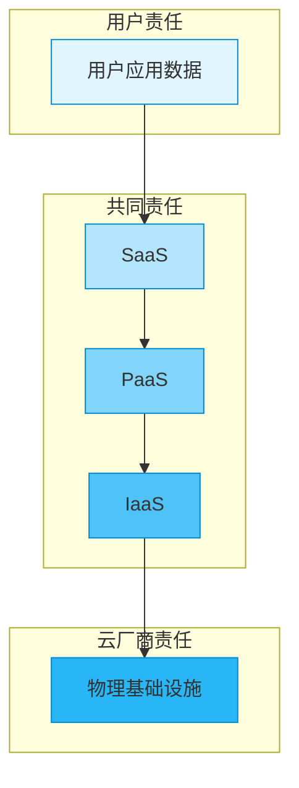
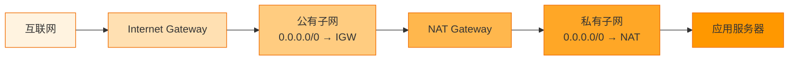
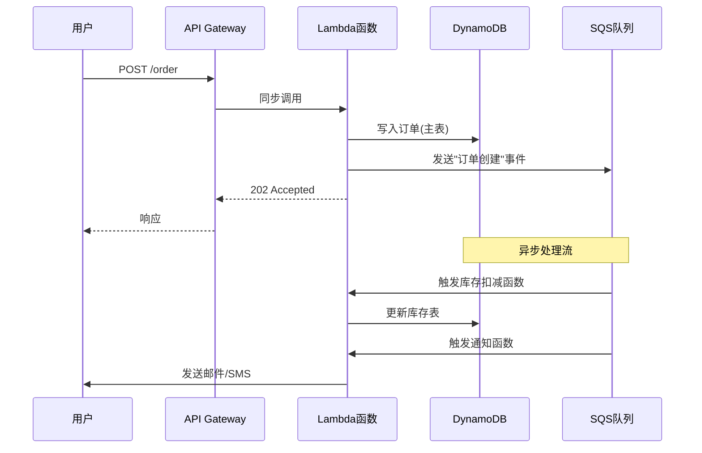
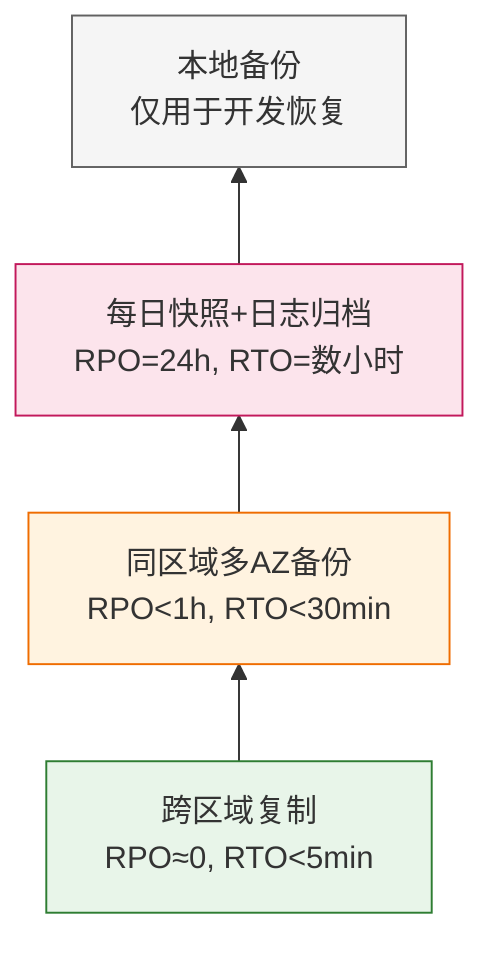

### 一、基础认知与核心模型

> **前置衔接说明**  
> 读者已掌握环境配置、Git、Docker、CI/CD、数据库及后端开发等技能。这意味着你已具备“在单机或简单集群中构建并交付应用”的能力。本阶段将帮助你完成从 **“本地/自建基础设施思维”** 到 **“云原生服务化思维”** 的关键跃迁——不再关心“服务器在哪里”，而是关注“服务如何被抽象、组合与弹性供给”。

---

#### 1. 云计算的本质：从“资源拥有”到“能力订阅”

在传统部署中，开发者需预先采购硬件、安装系统、配置网络，整个过程以 **“资产”** 为中心；而在云环境中，计算、存储、网络等能力被封装为可按需调用的 **“服务”**，以 **“效用（Utility）”** 形式交付，如同水电煤一般按量计费。

这种转变背后有三大技术支柱：

- **虚拟化（Virtualization）**：通过 Hypervisor 将物理资源切分为多个隔离的虚拟机（VM），实现资源池化；
- **软件定义一切（SDx）**：网络（SDN）、存储（SDS）、安全等均由软件控制，脱离硬件绑定；
- **自动化编排（Orchestration）**：通过 API + IaC（如 Terraform）实现资源的声明式管理，支撑弹性与可重复性。

> 💡 **理解提示**：  
> 不要将“云”等同于“别人的服务器”。云的核心价值不是“托管”，而是 **“抽象层”** ——它把底层复杂性（硬件故障、容量规划、网络拓扑）屏蔽掉，向上暴露标准化接口。这正是你能用 `docker run` 启动容器、用 `kubectl apply` 部署服务的前提：这些工具本身也是云抽象思想的延伸。

---

#### 2. 服务模式分层：IaaS / PaaS / SaaS 的责任边界

云服务按抽象程度分为三层，其核心区别在于 **“谁负责什么”**。下图清晰展示了责任共担模型：



|层级|典型服务|用户职责|云厂商职责|适用场景|
|---|---|---|---|---|
|**IaaS**|EC2, ECS, VPC, OSS/S3|OS、运行时、中间件、应用、数据|物理硬件、虚拟化、网络底座|需深度定制OS/内核；迁移传统应用|
|**PaaS**|App Service, Cloud Run, RDS, Lambda|应用代码、数据、部分配置|OS、运行时、中间件、自动扩缩容|专注业务逻辑；快速迭代微服务|
|**SaaS**|Gmail, Salesforce, Notion|仅使用与数据输入|全部基础设施与应用维护|通用办公/协作；无需定制|

> ⚠️ **常见误区澄清**：
> 
> - **容器 ≠ PaaS**：Kubernetes 本身是 IaaS 之上的编排平台，但若使用托管 K8s（如 EKS、ACK），则控制面由云厂商维护，此时更接近 PaaS；
> - **Serverless 是 PaaS 的极致形态**：如 AWS Lambda，连“服务器”概念都消失，仅按执行次数+时长计费，但冷启动、供应商锁定等问题需权衡；
> - **数据库服务（RDS）属于 PaaS**：虽然你仍需设计表结构，但备份、主从切换、补丁升级由云厂商处理，显著降低运维负担。

---

#### 3. 部署模型：公有云、私有云、混合云与多云策略

|模型|定义|优势|挑战|典型用户|
|---|---|---|---|---|
|**公有云**|资源共享、按需付费|弹性强、成本低、服务丰富|数据安全顾虑、长期成本可能上升|初创公司、互联网业务|
|**私有云**|专属基础设施（自建或托管）|合规性强、性能可控|初始投入高、运维复杂|金融、政务、大型企业|
|**混合云**|公有+私有互联|敏感数据留私有，弹性负载上公有|网络延迟、统一治理难|传统企业数字化转型|
|**多云**|同时使用 ≥2 家公有云|避免锁定、灾备冗余、选最优服务|复杂度剧增、技能分散|全球化企业、强合规要求|

> 🌐 **背景补充：为什么“多云”成为趋势？**  
> 早期企业倾向于“All in One Cloud”以简化架构，但随着云厂商服务差异化加剧（如 AWS AI 服务领先、Azure Office 集成好、阿里云国内合规强），以及监管要求（如数据本地化），越来越多组织采用多云策略。但需注意：**多云不等于高可用**——若缺乏统一抽象层（如 Crossplane、Terraform），反而会增加故障面。

---

#### 4. 关键抽象概念速览（为后续实操铺垫）

以下概念将在第二阶段实操中反复出现，此处先建立直觉：

- **Region / Availability Zone (AZ)**：  
    Region 是地理区域（如 `cn-hangzhou`），AZ 是 Region 内独立数据中心。**跨 AZ 部署是高可用基石**，但跨 Region 通信延迟高、费用贵。
    
- **VPC（Virtual Private Cloud）**：  
    用户在云上划定的逻辑隔离网络空间，包含子网、路由表、网关等。**所有云资源必须置于 VPC 中**，它是安全与网络的边界。
    
- **IAM（Identity and Access Management）**：  
    统一管理用户、角色、权限的系统。**永远不要用根账号操作！** 应遵循最小权限原则，使用临时凭证（如 STS）。
    
- **ARN / Resource ID**：  
    云资源的唯一标识符（如 `arn:aws:s3:::my-bucket`）。API 调用、权限策略、日志追踪均依赖它。
    

> 🔍 **学习建议**：  
> 本阶段无需记忆细节，但务必理解“抽象层”的存在意义。当你后续在控制台点击“创建实例”时，请自问：这个操作背后对应哪一层抽象？我的责任边界在哪里？这将帮助你从“点按钮的人”成长为“架构设计者”。

---

✅ **第一阶段小结**  
你现在应能回答：

- 云计算与传统IDC的根本区别是什么？
- 如何根据团队能力与业务需求选择 IaaS/PaaS/SaaS？
- 为什么 VPC 和 IAM 是云安全的两大基石？

### 二、主流云平台实操入门

> **阶段目标**  
> 将第一阶段的抽象模型映射到真实云环境。本阶段不追求“精通所有服务”，而是建立 **“最小可行操作闭环”**：能通过 CLI/API 完成计算、存储、网络、身份四大核心资源的创建、查询与销毁，并理解其背后的计费与安全逻辑。
> 
> **平台选择说明**  
> 本文以 **AWS** 为主线示例（因其概念体系最完整、文档最权威），但所有核心概念均对标阿里云/腾讯云/Azure。文末提供跨平台对照表，确保知识可迁移。

---

#### 1. 账号安全基线：IAM 与最小权限实践

在触碰任何资源前，**必须先配置 IAM**。这是云操作的“安全带”，跳过此步等于裸奔。

##### 核心原则

- **禁用根账号日常操作**：仅用于账单与账号级设置；
- **用户 ≠ 角色**：人类用户用 IAM User（配 MFA），程序/服务用 IAM Role（临时凭证）；
- **权限策略 = JSON 文档**：显式拒绝 > 显式允许 > 隐式拒绝。

##### 最小权限示例（S3 只读访问）

```json
{
  "Version": "2012-10-17",
  "Statement": [
    {
      "Effect": "Allow",
      "Action": ["s3:GetObject", "s3:ListBucket"],
      "Resource": [
        "arn:aws:s3:::my-app-bucket",
        "arn:aws:s3:::my-app-bucket/*"
      ]
    }
  ]
}
```

> 💡 **理解提示**：  
> `Resource` 字段必须精确到桶和对象路径。若写成 `"arn:aws:s3:::*"`，则授予全账号 S3 读权限——这是新手最常见安全事故。
> 
> **实操检查点**：
> 
> - [ ]  创建管理员用户并启用 MFA
> - [ ]  创建测试角色，附加上述 S3 只读策略
> - [ ]  使用 `aws sts assume-role` 获取临时凭证验证权限边界

---

#### 2. 网络基石：VPC 四件套

所有云资源都运行在 VPC 内。掌握以下四个组件，即可构建安全隔离的网络环境：



|组件|作用|关键配置|常见错误|
|---|---|---|---|
|**VPC**|逻辑隔离网络空间|CIDR 规划（建议 /16 起步）|CIDR 与本地网络冲突|
|**Subnet**|AZ 级网络分区|公有子网关联路由表含 IGW|私有子网误绑 IGW|
|**IGW**|VPC ↔ 互联网双向通信|每个 VPC 仅一个|未绑定到 VPC|
|**NAT Gateway**|私有子网出站上网|部署在公有子网|忘记配置路由指向 NAT|

> ⚠️ **背景补充：为什么私有子网需要 NAT？**  
> 数据库、缓存等敏感服务应置于私有子网（无公网 IP）。但当它们需下载补丁或调用外部 API 时，必须通过 NAT Gateway 实现 **“出站可达、入站不可达”**。若直接使用 IGW，则暴露端口，违背安全原则。

---

#### 3. 计算与存储：EC2 + S3 最小实践

##### EC2 实例启动三要素

1. **AMI**：操作系统镜像（Amazon Linux 2023 推荐用于学习）；
2. **Instance Type**：t3.micro 免费套餐足够实验；
3. **Security Group**：虚拟防火墙，**默认拒绝所有入站**，仅开放必要端口（如 SSH 22、HTTP 80）。

> 🔒 **安全加固必做**：
> 
> - SSH 密钥对替代密码登录
> - Security Group 源地址限制为你的 IP（非 0.0.0.0/0）
> - 使用 Session Manager 替代 SSH（免开 22 端口）

##### S3 存储核心认知

- **对象存储 ≠ 文件系统**：无目录树，`folder/file.txt` 仅是 key 的前缀模拟；
- **访问控制三层叠加**：Bucket Policy + Object ACL + IAM Policy（优先级复杂，建议统一用 Bucket Policy）；
- **生命周期规则**：自动转储低频/归档存储，避免遗忘清理产生意外费用。

---

#### 4. 基础设施即代码（IaC）入门：Terraform 最小示例

手动控制台操作无法复现、易出错。**从第一个云资源起就应使用 IaC**。

```hcl
# main.tf - 创建一个 S3 桶
terraform {
  required_providers {
    aws = { source = "hashicorp/aws", version = "~> 5.0" }
  }
}

resource "aws_s3_bucket" "app_data" {
  bucket = "my-app-data-${random_id.suffix.hex}"
  tags   = { Environment = "dev" }
}

resource "random_id" "suffix" {
  byte_length = 4
}
```

> 💡 **为什么不用 CloudFormation/ARM？**  
> Terraform 多云支持、状态管理、模块化生态更成熟。即使只用单云，其声明式语法也更贴近开发者思维。
> 
> **实操检查点**：
> 
> - [ ]  `terraform init && plan && apply` 创建资源
> - [ ]  修改 tag 后重新 apply 观察变更
> - [ ]  `terraform destroy` 彻底清理（避免持续计费！）

---

#### 5. 跨平台概念对照表

|AWS|阿里云|腾讯云|Azure|说明|
|---|---|---|---|---|
|EC2|ECS|CVM|Virtual Machine|虚拟机|
|S3|OSS|COS|Blob Storage|对象存储|
|VPC|VPC|VPC|VNet|虚拟网络|
|IAM|RAM|CAM|Entra ID|身份权限|
|Lambda|FC|SCF|Functions|Serverless|
|RDS|RDS|TencentDB|SQL Database|托管数据库|
|EKS|ACK|TKE|AKS|托管 K8s|

> 🌐 **迁移提示**：  
> 概念相同，但细节差异显著。例如：
> 
> - 阿里云 VSwitch = AWS Subnet
> - Azure NSG 规则优先级数字越小越优先（AWS SG 无优先级）
> - 腾讯云安全组默认拒绝所有流量（AWS 默认拒绝入站、允许出站）
> 
> **建议**：初学专注一家平台建立心智模型，熟练后再横向对比。

---

✅ **第二阶段小结**  
你现在应能：

- 独立配置 IAM 用户/角色并验证权限边界；
- 画出包含公私子网、IGW、NAT 的 VPC 架构图；
- 用 Terraform 创建并销毁 S3/EC2 资源；
- 在不同云平台间识别等价服务。

> ⏭️ **下一阶段预告**：第三阶段将深入云原生架构，涵盖 Serverless、弹性伸缩、可观测性等高阶能力，并结合你已有的 Docker/K8s 背景，构建真正“为云而生”的系统。

### 三、云原生架构与高可用设计

> **阶段目标**  
> 从“把应用搬到云上”进阶到“为云设计应用”。本阶段将结合你已掌握的 Docker/K8s/CI/CD 知识，深入云原生核心能力：Serverless、弹性伸缩、容灾备份与可观测性。重点不是工具使用，而是 **“如何在不确定性中构建确定性”**——这正是云架构师与运维工程师的本质区别。

---

#### 1. Serverless：事件驱动与极致抽象

Serverless 并非“无服务器”，而是 **“服务器管理完全托管化”**。其核心价值是将开发者从容量规划、OS 维护中彻底解放，聚焦业务逻辑。

##### 两种形态对比

|维度|FaaS（函数计算）|BaaS（后端服务）|
|:--|:--|:--|
|典型服务|AWS Lambda / 阿里云 FC|DynamoDB / SQS / EventBridge|
|触发方式|事件驱动（HTTP、消息队列、定时任务）|API 调用或事件订阅|
|执行模型|短时运行（≤15分钟）、按调用计费|持久化状态、按存储/吞吐计费|
|适用场景|轻量 API、数据处理管道、Webhook|用户会话、订单队列、配置中心|



> 💡 **关键认知纠偏**：
> 
> - **冷启动 ≠ 性能瓶颈**：通过 Provisioned Concurrency、轻量运行时（如 Rust/Go）、依赖精简可缓解；
> - **供应商锁定是权衡而非缺陷**：若业务高度依赖云特有服务（如 Step Functions），迁移成本必然存在。决策时应评估“锁定带来的开发效率提升是否远超未来迁移成本”；
> - **不适合长连接/有状态服务**：WebSocket、视频转码等应选用容器或专用服务。

---

#### 2. 弹性伸缩：从手动扩容到自适应调节

云的核心优势是 **“按需供给”**，但需正确配置才能避免资源浪费或服务雪崩。

##### 三种伸缩策略

|策略|原理|适用场景|风险点|
|:--|:--|:--|:--|
|**预测式**|基于历史流量模式预扩缩容|电商大促、固定时段高峰|突发流量超出预测|
|**响应式**|监控指标（CPU/内存/QPS）触发扩缩|通用 Web 服务|指标滞后导致短暂过载|
|**调度式**|固定时间点执行扩缩容|批处理任务、测试环境|无法应对意外负载|

> ⚠️ **高可用陷阱警示**：
> 
> - **单 AZ 伸缩 = 伪高可用**：Auto Scaling Group 必须跨 ≥2 个 AZ 部署；
> - **数据库成为瓶颈**：计算层弹性伸缩时，需同步考虑 RDS 读写分离、连接池代理（如 RDS Proxy）；
> - **冷却时间设置过短**：频繁扩缩容导致实例震荡，建议初始值设为 300 秒并观察调整。

---

#### 3. 容灾备份：RTO/RPO 驱动的分级保护

数据丢失与服务中断是云的“常态假设”。容灾设计必须围绕两个核心指标：

- **RPO（Recovery Point Objective）**：可容忍的最大数据丢失量（时间窗口）；
- **RTO（Recovery Time Objective）**：可容忍的最大服务中断时长。

##### 备份策略金字塔



> 🌐 **背景补充：为什么“备份≠容灾”？**  
> 备份解决数据恢复问题，但无法保证服务连续性。例如：S3 开启版本控制可防误删（备份），但若整个 Region 故障，仍需跨区域复制（容灾）。
> 
> **实操检查点**：
> 
> - [ ]  为生产数据库启用自动备份 + 事务日志保留 ≥7天
> - [ ]  验证一次完整恢复流程（记录实际 RTO）
> - [ ]  对关键对象存储桶配置跨区域复制规则

---

#### 4. 可观测性三支柱：日志、指标、追踪

在分布式云环境中，“黑盒调试”已失效。可观测性是系统的“神经系统”。

|支柱|作用|云原生工具链|关键实践|
|:--|:--|:--|:--|
|**Logs**|离散事件记录|CloudWatch Logs / SLS|结构化 JSON + 统一字段（trace_id）|
|**Metrics**|聚合时序数据|CloudWatch Metrics / Prometheus|黄金四信号：延迟、流量、错误率、饱和度|
|**Traces**|请求全链路视图|X-Ray / Jaeger|自动注入 + 采样率控制（生产环境 ≤1%）|

> 💡 **理解提示**：  
> 三者不是独立系统，而是**关联分析的基础**。例如：
> 
> 1. Metrics 发现错误率突增 →
> 2. Traces 定位到某微服务耗时异常 →
> 3. Logs 查询该 trace_id 获取具体报错堆栈
> 
> **避免常见误区**：不要采集所有日志！未过滤的日志成本可能超过计算费用。务必配置采样、保留策略与敏感信息脱敏。

---

#### 5. 架构决策框架：CAP/BASE 与云适配

传统 ACID 事务在分布式云中代价高昂。云原生系统普遍采用 BASE 模型：

- **Basically Available**：允许部分节点故障时降级响应；
- **Soft state**：接受中间状态不一致（如缓存延迟）；
- **Eventually consistent**：最终一致性代替强一致。

> 🔍 **实战映射**：
> 
> - 购物车用 Redis（AP 系统）+ 异步持久化；
> - 支付核心用 RDS 多 AZ（CP 系统）+ 严格事务；
> - 用户行为分析用 Kinesis + S3（BASE 模型）。
> 
> **关键原则**：**没有银弹，只有权衡**。每个服务应根据业务特性独立选择一致性模型，而非全局统一。

---

✅ **第三阶段小结**  
你现在应能：

- 设计一个包含同步/异步处理的 Serverless 订单系统；
- 为 Web 服务配置跨 AZ 弹性伸缩并规避常见陷阱；
- 根据 RTO/RPO 制定分级备份容灾方案；
- 搭建日志-指标-追踪联动的可观测体系；
- 在不同业务场景中合理选择 CAP/BASE 模型。

### 四、练习与综合实战

> **阶段目标**  
> 本阶段是“云服务”学习笔记的收官环节。通过分层练习题与端到端项目，将前三个阶段（基础模型、平台实操、云原生架构）的知识点串联为工程能力。所有题目均基于真实生产场景设计，避免“玩具式”练习。建议读者在个人云账号中完成实操类题目，并记录踩坑笔记——**云技能的本质是“故障经验密度”**。

---

#### 1. 基础认知验证题（选择/判断）

检验对核心概念的理解深度，而非死记硬背。

1. **【责任共担】** 在使用托管 Kubernetes 服务（如 EKS/ACK）时，以下哪项属于**用户**的责任？  
    A. Master 节点高可用部署  
    B. etcd 数据备份与恢复  
    C. Worker 节点 OS 安全补丁更新  
    D. API Server 证书轮转
    
    > ✅ **答案：C**  
    > 💡 **解析**：托管 K8s 中，控制面（Master/etcd/API Server）由云厂商维护；Worker 节点虽由平台管理生命周期，但 OS 层安全加固、运行时配置仍属用户职责。若使用 Fargate/Eci 等 Serverless 容器，则 C 也转移给厂商。
    
2. **【网络抽象】** 某 VPC 内私有子网的 EC2 实例无法访问公网下载依赖包，但同子网其他实例正常。最可能的原因是？  
    A. NAT Gateway 未绑定弹性 IP  
    B. 该实例安全组未放行 HTTPS 出站  
    C. 路由表缺少指向 NAT Gateway 的规则  
    D. Internet Gateway 未关联到私有子网
    
    > ✅ **答案：B**  
    > 💡 **解析**：安全组默认允许所有出站流量，但若被显式修改为拒绝 HTTPS (443)，则导致下载失败。A/C 会影响整个子网；D 本身错误（私有子网不应关联 IGW）。此题考察“逐层排查”思维：先确认是个例还是全局问题。
    
3. **【架构权衡】** 以下哪种场景**不适合**直接使用 Serverless FaaS？  
    A. 每日凌晨执行的报表生成任务（耗时 8 分钟）  
    B. 实时音视频转码服务（平均耗时 25 分钟）  
    C. Webhook 接收与消息队列转发  
    D. 用户上传图片后的缩略图生成
    
    > ✅ **答案：B**  
    > 💡 **解析**：主流 FaaS 执行时长上限为 15 分钟（AWS Lambda/Azure Functions），超时即终止。长时任务应选用容器、Batch 服务或分段处理。A 虽接近上限但可行；C/D 是典型事件驱动轻量场景。
    

---

#### 2. 实操技能强化题（动手实验）

要求在真实云环境中完成，重点训练 IaC 与安全基线。

4. **【IAM 最小权限】**
    
    - **任务**：创建一个 IAM 角色，仅允许向指定 S3 桶 `my-app-logs-*` 写入日志文件，禁止读取、删除及列举桶内容。
    - **验证**：使用该角色临时凭证尝试 `aws s3 ls`、`aws s3 cp local.txt s3://my-app-logs-test/`、`aws s3 rm s3://my-app-logs-test/file.txt`，确认仅写入成功。
    - **交付物**：Terraform 代码 + 验证截图。

> [!success]- 点击展开题解
> 
> ### 🎯 题目解析：IAM 最小权限原则实战
> 
> 本题的核心在于实践 AWS 安全最佳实践中的**最小权限原则（Principle of Least Privilege）**。我们需要创建一个 IAM 角色，该角色仅拥有向特定 S3 桶写入对象的权限，而显式拒绝或默认不包含读取、删除和列举权限。
> 
> #### 💡 核心概念补充
> 
> - **最小权限原则**：只授予完成任务所需的最小权限集合。在 AWS 中，IAM 策略默认是“隐式拒绝”的，即未明确 Allow 的操作都会被拒绝。因此，我们只需精确 Allow `s3:PutObject`，无需显式 Deny 其他操作（除非需要覆盖其他宽泛的 Allow 策略）。
> - **S3 通配符匹配**：`my-app-logs-*` 是一个资源前缀模式。在 IAM 策略中，我们可以使用 ARN 通配符 `arn:aws:s3:::my-app-logs-*/*` 来匹配所有以该前缀开头的桶及其对象。
> - **为什么不需要 ListBucket？** `aws s3 cp` 上传单个文件到指定 Key 时，底层调用的是 `PutObject` API，并不需要先列举桶内容。只有当目标路径不明确或使用同步命令时才需要 `ListBucket`。
> 
> ---
> 
> ### 🏗️ 权限模型示意图
> 
> ```mermaid
> graph LR
>     A[IAM Role] -->|AssumeRole| B[Temporary Credentials]
>     B -->|Allow: s3:PutObject| C[S3 Bucket: my-app-logs-*]
>     B -.->|Implicit Deny| D[s3:GetObject / DeleteObject / ListBucket]
>     
>     style A fill:#4CAF50,color:#fff
>     style C fill:#2196F3,color:#fff
>     style D fill:#f44336,color:#fff,stroke-dasharray: 5 5
> ```
> 
> > **图解说明**：绿色表示显式允许的写入路径，红色虚线表示被隐式拒绝的操作。临时凭证通过 STS AssumeRole 获取，生命周期可控，进一步降低泄露风险。
> 
> ---
> 
> ### 📝 Terraform 实现代码
> 
> ```hcl
> # main.tf
> 
> # 1. 定义 IAM 角色（信任策略允许当前账户或指定服务代入）
> resource "aws_iam_role" "log_writer" {
>   name = "my-app-log-writer-role"
> 
>   assume_role_policy = jsonencode({
>     Version = "2012-10-17"
>     Statement = [
>       {
>         Action = "sts:AssumeRole"
>         Effect = "Allow"
>         Principal = {
>           AWS = "arn:aws:iam::${data.aws_caller_identity.current.account_id}:root"
>         }
>       }
>     ]
>   })
> }
> 
> data "aws_caller_identity" "current" {}
> 
> # 2. 定义最小权限内联策略
> resource "aws_iam_role_policy" "log_writer_policy" {
>   name = "s3-write-only-policy"
>   role = aws_iam_role.log_writer.id
> 
>   policy = jsonencode({
>     Version = "2012-10-17"
>     Statement = [
>       {
>         Sid      = "AllowPutObjectToLogBuckets"
>         Effect   = "Allow"
>         Action   = ["s3:PutObject"]
>         Resource = "arn:aws:s3:::my-app-logs-*/*"
>       }
>     ]
>   })
> }
> 
> # 3. 输出角色 ARN 供验证使用
> output "role_arn" {
>   value = aws_iam_role.log_writer.arn
> }
> ```
> 
> #### ⚠️ 关键注意事项
> 
> - **Resource 必须包含 `/*`**：`s3:PutObject` 是对象级操作，ARN 必须以 `/*` 结尾。若写成 `arn:aws:s3:::my-app-logs-*`（无尾部斜杠），策略将不生效。
> - **不要附加任何 AWS 托管策略**：如 `AmazonS3FullAccess` 等会破坏最小权限约束。
> - **通配符范围控制**：`my-app-logs-*` 会匹配所有以此开头的桶，确保生产环境中命名规范统一，避免误匹配。
> 
> ---
> 
> ### ✅ 验证步骤与预期结果
> 
> 部署后，使用以下命令获取临时凭证并逐项验证：
> 
> ```bash
> # 获取临时凭证
> CREDS=$(aws sts assume-role \
>   --role-arn $(terraform output -raw role_arn) \
>   --role-session-name test-session \
>   --query 'Credentials' \
>   --output json)
> 
> export AWS_ACCESS_KEY_ID=$(echo $CREDS | jq -r .AccessKeyId)
> export AWS_SECRET_ACCESS_KEY=$(echo $CREDS | jq -r .SecretAccessKey)
> export AWS_SESSION_TOKEN=$(echo $CREDS | jq -r .SessionToken)
> 
> # 测试1: 列举桶内容 → 应失败 (AccessDenied)
> aws s3 ls s3://my-app-logs-test/
> 
> # 测试2: 上传文件 → 应成功
> echo "test log" > local.txt
> aws s3 cp local.txt s3://my-app-logs-test/test.log
> 
> # 测试3: 删除文件 → 应失败 (AccessDenied)
> aws s3 rm s3://my-app-logs-test/test.log
> ```
> 
> |命令|预期结果|原因|
> |---|---|---|
> |`aws s3 ls`|❌ AccessDenied|缺少 `s3:ListBucket` 权限|
> |`aws s3 cp`|✅ 成功|拥有 `s3:PutObject` 权限|
> |`aws s3 rm`|❌ AccessDenied|缺少 `s3:DeleteObject` 权限|
> 
> > **截图提示**：验证截图应清晰展示三条命令的输出，特别是两个 AccessDenied 错误和一个成功的上传响应。建议在截图中保留时间戳以证明时效性。
> 
> ---
> 
> ### 🔍 常见误区提醒
> 
> 1. **误加 `s3:ListBucket`**：很多开发者习惯性地添加列举权限以便调试，但这违反了题目“禁止列举”的要求。
> 2. **Resource 写错层级**：桶级操作（如 ListBucket）用 `arn:aws:s3:::bucket-name`，对象级操作（如 PutObject）必须用 `arn:aws:s3:::bucket-name/*`。
> 3. **忽略 Session Token**：使用临时凭证时，必须同时设置 `AWS_SESSION_TOKEN`，否则认证失败。
> 4. **通配符过于宽泛**：若写成 `arn:aws:s3:::*/*` 则变成全量写入权限，务必限定前缀。

5. **【VPC 网络排障】**
    
    - **任务**：故意构建一个“错误 VPC”：私有子网路由指向 IGW、公有子网无 NAT、安全组 SSH 开放 0.0.0.0/0。然后逐步修复使其满足：① 私有子网可出站上网；② 公有子网可被 SSH 访问（仅限你的 IP）；③ 私有子网完全隔离入站。
    - **交付物**：修复前后架构图对比 + Terraform state diff。

> [!success]- 点击展开题解
> 
> ## 📖 题目背景与核心概念解析
> 
> 在 AWS VPC 网络排障中，理解**公有子网（Public Subnet）**与**私有子网（Private Subnet）**的本质区别是解题关键。很多初学者容易混淆“路由表”与“安全组”的职责边界。
> 
> ### 💡 核心概念速览
> 
> - **IGW (Internet Gateway)**：VPC 通往互联网的“大门”。只有路由表中显式指向 IGW (`0.0.0.0/0 -> igw-xxx`) 的子网才是公有子网。
> - **NAT Gateway**：私有子网的“代理人”。私有子网实例没有公网 IP，必须通过 NAT GW 才能访问互联网（出站），但外部无法主动发起连接（入站隔离）。
> - **安全组 (Security Group)**：有状态的虚拟防火墙。即使路由可达，若安全组未放行，流量依然会被丢弃。
> 
> > ⚠️ **常见误区提示**  
> > 将私有子网的路由直接指向 IGW 并不会让它变成真正的“公有子网”。如果该子网内的 EC2 没有绑定弹性公网 IP (EIP)，即便路由指向 IGW，回包也无法正确路由，导致网络不通。这是本题故意设置的第一个陷阱。
> 
> ---
> 
> ## 🏗️ 修复前后架构对比
> 
> ### ❌ 错误架构（修复前）
> 
> ```mermaid
> graph LR
>     Internet((Internet)) --> IGW[IGW]
>     IGW -->|0.0.0.0/0| PublicRT[公有子网路由表]
>     IGW -->|0.0.0.0/0 错误!| PrivateRT[私有子网路由表]
>     PublicRT --> PubEC2[公有子网 EC2<br/>SSH: 0.0.0.0/0]
>     PrivateRT --> PrivEC2[私有子网 EC2<br/>无NAT/无EIP]
>     
>     style PrivateRT fill:#ffcccc,stroke:#cc0000
>     style PubEC2 fill:#fff3cd,stroke:#856404
>     note1["❌ 私有子网直连IGW<br/>❌ 公有子网缺NAT<br/>❌ SSH对全网开放"]
> ```
> 
> ### ✅ 正确架构（修复后）
> 
> ```mermaid
> graph LR
>     Internet((Internet)) --> IGW[IGW]
>     IGW -->|0.0.0.0/0| PublicRT[公有子网路由表]
>     PublicRT --> NAT[NAT Gateway]
>     NAT -->|0.0.0.0/0| PrivateRT[私有子网路由表]
>     PublicRT --> PubEC2[公有子网 EC2<br/>SSH: MyIP/32]
>     PrivateRT --> PrivEC2[私有子网 EC2<br/>入站全拒绝]
>     
>     style PrivateRT fill:#d4edda,stroke:#155724
>     style PubEC2 fill:#d4edda,stroke:#155724
>     note2["✅ 私有子网经NAT出站<br/>✅ SSH仅限指定IP<br/>✅ 私有子网入站隔离"]
> ```
> 
> ---
> 
> ## 🔧 Terraform 修复步骤详解
> 
> ### Step 1: 修复私有子网路由（移除 IGW，添加 NAT）
> 
> **问题分析**：私有子网不应直接关联 IGW。需要创建 NAT Gateway（部署在公有子网），并将私有子网默认路由指向 NAT。
> 
> ```hcl
> # ❌ 删除错误的私有路由
> # resource "aws_route" "private_to_igw" {
> #   route_table_id         = aws_route_table.private.id
> #   destination_cidr_block = "0.0.0.0/0"
> #   gateway_id             = aws_internet_gateway.main.id  # 错误！
> # }
> 
> # ✅ 新增 NAT Gateway
> resource "aws_eip" "nat" {
>   domain = "vpc"
> }
> 
> resource "aws_nat_gateway" "main" {
>   allocation_id = aws_eip.nat.id
>   subnet_id     = aws_subnet.public.id  # NAT 必须在公有子网
>   depends_on    = [aws_internet_gateway.main]
> }
> 
> # ✅ 私有子网路由指向 NAT
> resource "aws_route" "private_to_nat" {
>   route_table_id         = aws_route_table.private.id
>   destination_cidr_block = "0.0.0.0/0"
>   nat_gateway_id         = aws_nat_gateway.main.id
> }
> ```
> 
> ### Step 2: 收紧公有子网 SSH 安全组
> 
> **问题分析**：`0.0.0.0/0` 暴露 SSH 是严重安全隐患。应替换为操作者真实公网 IP。
> 
> ```hcl
> # ❌ 删除过于宽泛的规则
> # ingress {
> #   from_port   = 22
> #   to_port     = 22
> #   protocol    = "tcp"
> #   cidr_blocks = ["0.0.0.0/0"]  # 危险！
> # }
> 
> # ✅ 限制为指定 IP
> variable "my_ip" {
>   description = "管理员公网IP，格式如 203.0.113.50/32"
>   type        = string
> }
> 
> resource "aws_security_group_rule" "ssh_restricted" {
>   type              = "ingress"
>   from_port         = 22
>   to_port           = 22
>   protocol          = "tcp"
>   cidr_blocks       = [var.my_ip]
>   security_group_id = aws_security_group.public_sg.id
> }
> ```
> 
> ### Step 3: 确保私有子网入站完全隔离
> 
> ```hcl
> resource "aws_security_group" "private_sg" {
>   vpc_id = aws_vpc.main.id
> 
>   # ✅ 不定义任何 ingress 规则 = 默认拒绝所有入站
>   # 仅保留必要的 egress（或通过 NAT 隐式允许）
>   egress {
>     from_port   = 0
>     to_port     = 0
>     protocol    = "-1"
>     cidr_blocks = ["0.0.0.0/0"]
>   }
> 
>   tags = { Name = "private-isolated-sg" }
> }
> ```
> 
> ---
> 
> ## 📋 Terraform State Diff 解读
> 
> 执行 `terraform plan` 后，你将看到类似以下的关键变更摘要：
> 
> ```text
> Terraform will perform the following actions:
> 
>   # aws_route.private_to_igw will be destroyed
>   - resource "aws_route" "private_to_igw" {
>       - destination_cidr_block = "0.0.0.0/0"
>       - gateway_id             = "igw-0abc123" -> null
>       - route_table_id         = "rtb-priv001"
>     }
> 
>   # aws_nat_gateway.main will be created
>   + resource "aws_nat_gateway" "main" {
>       + allocation_id = (known after apply)
>       + subnet_id     = "subnet-pub001"
>     }
> 
>   # aws_route.private_to_nat will be created
>   + resource "aws_route" "private_to_nat" {
>       + destination_cidr_block = "0.0.0.0/0"
>       + nat_gateway_id         = (known after apply)
>       + route_table_id         = "rtb-priv001"
>     }
> 
>   # aws_security_group_rule.ssh_open will be destroyed
>   - resource "aws_security_group_rule" "ssh_open" {
>       - cidr_blocks = ["0.0.0.0/0"] -> null
>     }
> 
>   # aws_security_group_rule.ssh_restricted will be created
>   + resource "aws_security_group_rule" "ssh_restricted" {
>       + cidr_blocks = ["203.0.113.50/32"]
>     }
> 
> Plan: 3 to add, 0 to change, 2 to destroy.
> ```
> 
> ### 🔍 Diff 关键点说明
> 
> |变更类型|资源|含义|
> |---|---|---|
> |`- destroy`|`aws_route.private_to_igw`|移除私有子网到 IGW 的错误路由|
> |`+ create`|`aws_nat_gateway.main`|在公有子网新建 NAT 网关|
> |`+ create`|`aws_route.private_to_nat`|私有子网出站流量改走 NAT|
> |`- destroy`|`sg_rule.ssh_open`|删除全网开放的 SSH 规则|
> |`+ create`|`sg_rule.ssh_restricted`|新增限定 IP 的 SSH 规则|
> 
> ---
> 
> ## ✅ 验证清单
> 
> 修复完成后，建议按以下步骤验证：
> 
> 1. **私有子网出站**：在私有子网 EC2 上执行 `curl -s https://ifconfig.me`，应返回 NAT Gateway 的 EIP 地址。
> 2. **公有子网 SSH**：从你的 IP 可正常 SSH；从其他 IP 尝试 SSH 应超时或被拒绝。
> 3. **私有子网入站隔离**：从公有子网 EC2 尝试 `telnet <私有IP> 22`，应连接失败；检查安全组确认无任何 ingress 规则。
> 4. **Terraform 状态一致**：运行 `terraform plan` 应显示 `No changes. Your infrastructure matches the configuration.`
> 
> > 💡 **最佳实践提醒**  
> > 在实际生产环境中，建议使用 `terraform validate` + `checkov/tfsec` 等工具在 CI/CD 阶段自动检测此类安全配置问题，避免“先犯错再修复”的人工排障模式。安全组规则应遵循最小权限原则，并使用变量管理 IP 白名单而非硬编码。

6. **【可观测性联动】**
    
    - **任务**：部署一个简单 HTTP 服务（返回随机 500 错误），配置 CloudWatch/SLS 告警：当 5 分钟内错误率 >10% 时触发 SNS 通知，并在告警消息中包含最近一条错误日志的 trace_id。
    - **交付物**：告警触发邮件截图 + 日志查询链接。

> [!success]- 点击展开题解
> 
> ## 📝 题目解析：可观测性联动实战
> 
> 本题考察的是**云原生可观测性（Observability）的闭环能力**。核心不仅仅是“监控”，而是将 **Metrics（指标）**、**Logs（日志）** 和 **Traces（链路追踪）** 三者打通，实现从“发现异常”到“定位根因”的自动化联动。
> 
> ### 💡 核心概念补充
> 
> - **错误率告警**：属于 Metrics 层面，用于快速感知系统健康度下降。
> - **Trace ID**：分布式追踪的唯一标识符。在告警中携带 Trace ID，相当于在火灾报警器响时，直接告诉你“起火点在3楼302室”，而非仅仅告诉你“大楼着火了”。
> - **SNS (Simple Notification Service)**：AWS 的消息通知服务，解耦了“告警触发”与“告警接收（邮件/短信/Webhook）”。
> - **SLS (Simple Log Service)**：阿里云日志服务，国内对标 CloudWatch Logs + Insights 的一站式方案。
> 
> ---
> 
> ### 🏗️ 架构示意图
> 
> ```mermaid
> flowchart LR
>     A[HTTP Service<br/>随机返回500] -->|写入日志+TraceID| B
>     A -->|暴露Metrics| C[CloudWatch Metrics / SLS MetricStore]
>     C -->|5min错误率>10%| D[Alarm 告警规则]
>     B -->|Metric Filter提取| C
>     D -->|触发| E[SNS Topic]
>     E -->|订阅| F[📧 Email 通知]
>     F -.->|包含TraceID+查询链接| G[运维人员]
>     G -->|点击链接| B
> ```
> 
> ---
> 
> ### 🔧 解题步骤详解
> 
> #### Step 1: 部署带 Trace ID 的 HTTP 服务
> 
> 关键点：**每次请求必须生成并记录 Trace ID**，且 500 错误日志中必须包含该 ID。
> 
> ```python
> # app.py (Flask 示例)
> import random, uuid, logging
> from flask import Flask, g
> 
> app = Flask(__name__)
> logging.basicConfig(level=logging.INFO, format='%(message)s')
> 
> @app.before_request
> def before():
>     g.trace_id = str(uuid.uuid4())
> 
> @app.route('/health')
> def health():
>     trace_id = g.trace_id
>     if random.random() < 0.15:  # ~15% 错误率，确保能触发 >10% 的阈值
>         logging.error(f'{{"level":"ERROR","msg":"internal error","trace_id":"{trace_id}"}}')
>         return 'Internal Server Error', 500
>     logging.info(f'{{"level":"INFO","msg":"ok","trace_id":"{trace_id}"}}')
>     return 'OK', 200
> ```
> 
> #### Step 2: 配置日志 → 指标的转化
> 
> |云平台|操作|说明|
> |---|---|---|
> |AWS|Metric Filter|匹配 `ERROR` 关键字，创建自定义 Metric `Http5xxCount`|
> |阿里云 SLS|告警查询语句|直接使用 SQL: `* and level: ERROR \| SELECT count(*) as err_count`|
> 
> #### Step 3: 创建告警规则
> 
> - **周期**：5 分钟
> - **条件**：`5xx_count / total_count > 0.1`
> - **⚠️ 关键难点**：如何在告警消息中嵌入「最近一条错误日志的 trace_id」？
> 
> > **解法对比：**
> > 
> > - **AWS**: CloudWatch Alarm 本身不支持动态查日志。需通过 **EventBridge → Lambda → SNS** 链路，在 Lambda 中调用 `filter_log_events` 获取最新错误日志的 trace_id，再拼接消息发送到 SNS。
> > - **阿里云 SLS**: 告警模板原生支持 `${results[0].raw_results[0].trace_id}` 变量引用，可在告警查询中同时查出错误率和最新 trace_id，零代码实现。
> 
> #### Step 4: 告警消息模板设计
> 
> ```text
> 🚨 [P1] HTTP服务错误率超标告警
> ━━━━━━━━━━━━━━━━━━━━━━
> • 当前错误率: ${error_rate}% (阈值: 10%)
> • 统计窗口: 最近5分钟
> • 最新错误 Trace ID: ${trace_id}
> • 日志查询链接: ${log_query_url}
> ━━━━━━━━━━━━━━━━━━━━━━
> 请及时排查！
> ```
> 
> #### Step 5: 验证与交付
> 
> 1. 使用 `ab -n 1000 -c 10 http://service/health` 压测制造足够样本
> 2. 等待告警触发，截图邮件内容（确认含 trace_id）
> 3. 复制日志查询链接，验证可直接跳转到对应日志上下文
> 
> ---
> 
> ### ⚠️ 常见踩坑点
> 
> 4. **采样偏差**：流量太低时，5分钟内请求数不足会导致错误率计算失真。建议设置最小样本量条件（如 `total >= 20`）。
> 5. **Trace ID 格式不一致**：日志中的 trace_id 字段名必须与 Metric Filter / 告警查询中的字段名严格一致。
> 6. **SNS 未确认订阅**：AWS SNS 邮件订阅需要收件人点击确认链接，否则永远收不到告警。
> 7. **时区问题**：SLS 告警默认 UTC+8，CloudWatch 默认 UTC，配置时间窗口时注意换算。
> 
> ### 🎯 评分要点自查
> 
> - [ ]  服务确实会随机返回 500
> - [ ]  告警在错误率 >10% 时准确触发
> - [ ]  邮件中包含有效的 trace_id
> - [ ]  日志查询链接可正常访问且定位到正确日志
> - [ ]  整个链路有完整的截图证据链

---

#### 3. 综合实战项目：云原生待办事项 API

整合全部知识点的端到端项目，模拟真实业务交付流程。

##### 项目需求

- 用户可通过 REST API 增删改查待办事项；
- 支持图片附件上传（存对象存储）；
- 高可用：跨 ≥2 AZ 部署，RTO < 5min，RPO ≈ 0；
- 成本优化：空闲时自动缩容至零，高峰弹性扩展；
- 安全：API 需认证，数据库不暴露公网，敏感配置加密存储；
- 可观测：全链路追踪，关键指标仪表盘。

##### 技术栈约束

- 计算：Serverless 容器（如 AWS App Runner / 阿里云 SAE）或 FaaS + API Gateway；
- 存储：托管数据库（RDS/DynamoDB）+ 对象存储；
- IaC：Terraform 管理全部资源；
- CI/CD：GitHub Actions 实现代码提交自动部署。

##### 验收标准

|维度|要求|验证方式|
|:--|:--|:--|
|功能|CRUD + 图片上传正常|Postman 测试集|
|高可用|手动终止一个 AZ 所有实例，服务 <30s 恢复|Chaos Engineering 工具|
|弹性|压测 QPS 从 10→200，响应时间 P99 <500ms|k6/wrk + CloudWatch|
|安全|无公开数据库端口，IAM 策略无 `*` 通配符|tfsec/prowler 扫描|
|成本|空闲 24h 费用 <$0.5|账单明细核查|

> 💡 **项目提示**：
> 
> - 不要追求完美架构，优先跑通最小闭环再迭代；
> - 记录每次故障的根因与修复过程，这比代码更有价值；
> - 完成后撰写复盘文档：哪些设计过度？哪些隐患未解决？

> [!success]- 点击展开题解
> 
> ## 云原生待办事项 API 实战题解
> 
> 本项目是一道典型的**云原生端到端交付**综合题。它不再考察单一的编码能力，而是检验你作为“全栈云工程师”在架构设计、基础设施即代码（IaC）、安全合规及成本意识上的综合素养。以下题解以 **AWS + Terraform + GitHub Actions** 为例进行拆解（阿里云/腾讯云同理），旨在提供一套可落地的最小闭环方案。
> 
> ### 1. 核心概念速览与背景补充
> 
> 在动手之前，需对齐几个关键概念，避免架构设计偏离验收标准：
> 
> - **RPO ≈ 0 (Recovery Point Objective)**: 指数据丢失量趋近于零。**注意**：这不代表数据库永不宕机，而是指通过**同步多AZ复制**或**WAL日志实时传输**，确保主库故障时备库拥有完整数据。对于Serverless场景，通常依赖托管数据库（如RDS Multi-AZ或Aurora）的底层机制实现。
> - **缩容至零 (Scale-to-Zero)**: 这是成本控制的核心。传统K8s HPA最小副本数为1，而App Runner/Lambda/SAE等Serverless计算服务支持在无请求时完全释放计算资源。**代价是冷启动延迟**，需在代码中优化初始化逻辑或使用Provisioned Concurrency（预留并发）来平衡体验与成本。
> - **IAM 最小权限原则**: 验收标准要求“无 `*` 通配符”。这意味着你不能使用 `AdministratorAccess` 或 `S3FullAccess`。必须精确到 `s3:PutObject` 且限定 Resource ARN。这是企业级安全合规的底线。
> 
> ### 2. 目标架构设计
> 
> 下图展示了满足所有验收标准的最小高可用架构。请注意**网络隔离**与**托管服务**的选择是解题关键。
> 
> ```mermaid
> flowchart TD
>     User((用户/Postman)) -->|HTTPS| AG[API Gateway / ALB]
>     
>     subgraph PublicSubnet ["公有子网 (Multi-AZ)"]
>         AG
>     end
>     
>     subgraph PrivateSubnet ["私有子网 (Multi-AZ)"]
>         Compute[Serverless 容器<br/>App Runner / SAE]
>         DB
>     end
>     
>     subgraph StorageZone ["存储层"]
>         S3[对象存储 S3/OSS]
>     end
>     
>     AG -->|VPC Link / 内网| Compute
>     Compute -->|TCP 5432| DB
>     Compute -->|HTTPS| S3
>     
>     style PublicSubnet fill:#e1f5fe,stroke:#01579b
>     style PrivateSubnet fill:#fff3e0,stroke:#ff6f00
>     style StorageZone fill:#e8f5e9,stroke:#2e7d32
>     style Compute fill:#fff,stroke:#333
>     style DB fill:#fff,stroke:#333
> ```
> 
> **架构决策说明：**
> 
> - **计算层选 Serverless 容器而非纯 FaaS**：虽然 Lambda 也能做，但待办事项涉及图片上传流式处理和多步事务，Serverless 容器（App Runner/SAE）保留了 Dockerfile 的灵活性，且更容易实现连接池复用，避免 FaaS 频繁创建数据库连接的开销。
> - **数据库不暴露公网**：DB 部署在私有子网，仅允许来自 Compute 安全组/Service Connect 的入站流量。API Gateway 通过 VPC Link 或内网端点访问 Compute，全程流量不出公网。
> - **跨 AZ 部署**：App Runner/SAE 默认跨区域调度；RDS 开启 Multi-AZ；S3 天然区域冗余。无需手动配置复杂的集群拓扑。
> 
> ### 3. 分模块实施要点
> 
> #### 3.1 功能实现：CRUD + 图片上传
> 
> - **接口设计**：采用 RESTful 风格，`POST /todos` 支持 `multipart/form-data`。
> - **图片处理策略**：**不要将图片Base64存入数据库**。正确做法是：
>     1. API 接收文件流，生成唯一 Key（如 UUID）。
>     2. 流式上传至 S3（使用 Multipart Upload 应对大文件）。
>     3. 将 S3 Key 和元数据写入数据库。
>     4. 返回预签名 URL 或拼接 CDN 域名供前端展示。
> - **SDK 权限**：为 Compute 绑定专属 IAM Role，仅授予 `s3:PutObject`, `s3:GetObject` 及特定 Bucket ARN 权限。
> 
> #### 3.2 IaC：Terraform 模块化
> 
> 不要写一个巨大的 `main.tf`。建议按职责拆分模块，便于复用和安全审计：
> 
> ```hcl
> # 目录结构示例
> ├── modules/
> │   ├── network/      # VPC, Subnets, NAT Gateway
> │   ├── database/     # RDS, Security Groups, Secrets Manager
> │   ├── storage/      # S3 Bucket, Lifecycle Policy
> │   └── app/          # App Runner Service, IAM Role, API Gateway
> ├── environments/
> │   └── prod/
> │       └── main.tf   # 调用上述模块，传入变量
> └── .github/workflows/deploy.yml
> ```
> 
> **安全加固关键点（tfsec/prowler 必查项）：**
> 
> - S3 Bucket 开启 `block_public_access = true`。
> - RDS 设置 `publicly_accessible = false`，`storage_encrypted = true`。
> - IAM Policy 使用 `data.aws_iam_policy_document` 动态构建，**严禁硬编码 `"Resource": "*"`**。
> - 敏感配置（DB密码）存入 Secrets Manager，Terraform 仅传递 Secret ARN，不传递明文值。
> 
> #### 3.3 CI/CD：GitHub Actions 自动部署
> 
> 流水线应包含三个阶段，对应验收标准中的安全与功能验证：
> 
> 1. **Lint & Scan**: `terraform fmt -check`, `tfsec ./modules`, 单元测试。
> 2. **Build & Push**: 构建 Docker 镜像，推送至 ECR/ACR（带 Git SHA Tag）。
> 3. **Deploy & Verify**: `terraform apply -auto-approve`，随后运行 Postman/Newman 集合测试。若测试失败，自动回滚或告警。
> 
> > 💡 **提示**：CI/CD 使用的 OIDC 角色也应遵循最小权限。不要给 GitHub Actions 长期 Access Key，使用 AWS IAM Identity Provider 关联 GitHub Repo。
> 
> ### 4. 验收标准自查清单
> 
> |维度|实施检查点|验证工具/命令|
> |:--|:--|:--|
> |**功能**|图片上传后能否通过返回URL下载？删除Todo是否联动清理S3对象？|Newman + S3 Console|
> |**高可用**|RDS Multi-AZ 已启用；Compute 服务未绑定单一AZ；健康检查路径正确|AWS FIS / Chaos Monkey|
> |**弹性**|App Runner 配置 Min=0, Max=10；压测期间观察 CloudWatch `ActiveInstances` 指标|k6 + CloudWatch Dashboard|
> |**安全**|SG 入站规则无 0.0.0.0/0（除ALB外）；IAM Policy 无星号；Secrets 加密|prowler aws --profile ci|
> |**成本**|空闲时 Compute 实例数=0；RDS 选用 db.t4g.micro 或 Serverless v2 最低ACU；S3 设生命周期转IA|Cost Explorer + Pricing Calculator|
> 
> ### 5. 复盘文档撰写指南（项目灵魂）
> 
> 题目强调“记录故障根因比代码更有价值”。你的复盘文档应包含：
> 
> - **过度设计反思**：例如“初期引入了 Redis 缓存，但 QPS<50 且数据量小，直接查库 P99 仅 80ms，Redis 反而增加了运维复杂度和成本，后期移除。”
> - **未解决隐患**：例如“图片上传未做病毒扫描；缺少速率限制（Rate Limiting），存在被刷爆账单风险；Terraform State 未加密存储。”——**诚实面对缺陷比假装完美更重要**。
> - **故障时间线**：格式为 `[HH:MM] 现象 → [HH:MM] 排查过程 → [HH:MM] 根因定位 → [HH:MM] 修复验证`。附上监控截图和日志片段。
> - **成本实测对比**：列出预估 vs 实际账单，分析偏差原因（如 NAT Gateway 数据处理费被低估）。
> 
> ### 6. 常见踩坑预警
> 
> - **冷启动导致压测 P99 超标**：首次请求触发容器启动+DB连接建立可能耗时 3-5s。**解法**：在 k6 压测前加 warm-up 阶段；或在 App Runner 中设置 `min_instances=1`（牺牲部分成本换取稳定性，需在复盘中权衡说明）。
> - **Terraform 状态锁冲突**：多人协作或 CI 重试时易发。**解法**：务必配置 DynamoDB/S3 Backend 并开启 State Locking。
> - **图片上传超时**：API Gateway 默认 29s 超时。**解法**：大文件改用预签名 URL 直传 S3，API 仅负责签发和记录元数据。
> - **RPO ≠ 0 的误区**：即使 Multi-AZ，极端情况下仍可能丢最后几秒事务。若业务真要求绝对零丢失，需评估 Aurora Global Database 或应用层双写，但这会显著增加成本和复杂度。**在复盘中明确标注当前 RPO 的实际值（如 <1s）及其技术依据，比盲目声称 RPO=0 更专业**。
> 
> ---
> 
> **最后提醒**：本题的终极目标不是造一个完美的 Todo App，而是**跑通一套可重复、可审计、可扩展的云原生交付范式**。当你下次面对真实业务需求时，这套肌肉记忆才是真正的收获。祝实战顺利！

---

#### 4. 自测清单与进阶方向

完成以上练习后，用以下清单评估掌握程度：

- [ ]  能独立解释 Region/AZ/VPC/IAM 的关系及安全边界
- [ ]  能用 Terraform 从零搭建符合安全基线的云环境
- [ ]  能为不同业务选择合适的服务模式（IaaS/PaaS/Serverless）
- [ ]  能设计 RTO/RPO 驱动的备份容灾方案
- [ ]  能通过日志-指标-追踪定位分布式系统故障
- [ ]  能完成端到端云原生项目并验证非功能性需求

##### 进阶学习路径推荐

- **安全深化**：CSPM（云安全态势管理）、Zero Trust 网络、合规自动化；
- **成本治理**：FinOps 实践、预留实例/Spot 策略、资源右 sizing；
- **多云抽象**：Crossplane、Kubernetes Federation、服务网格跨集群；
- **AI on Cloud**：GPU 实例调度、模型 serving 优化、MLOps 平台构建。

---


