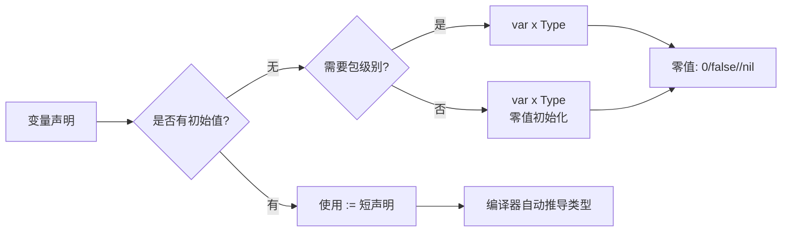
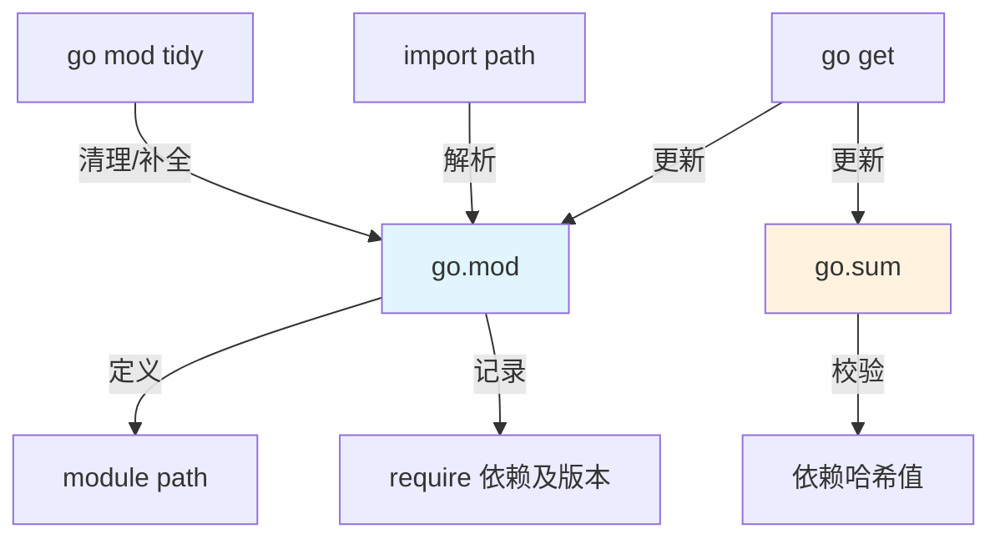
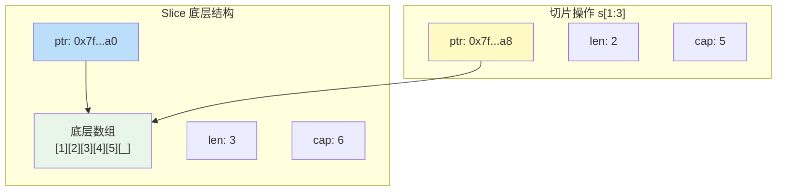
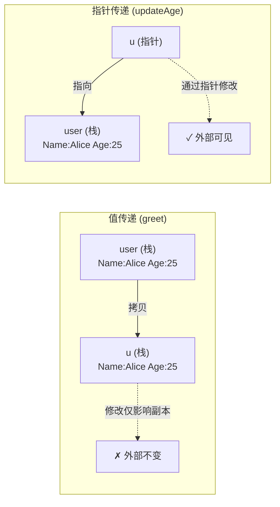
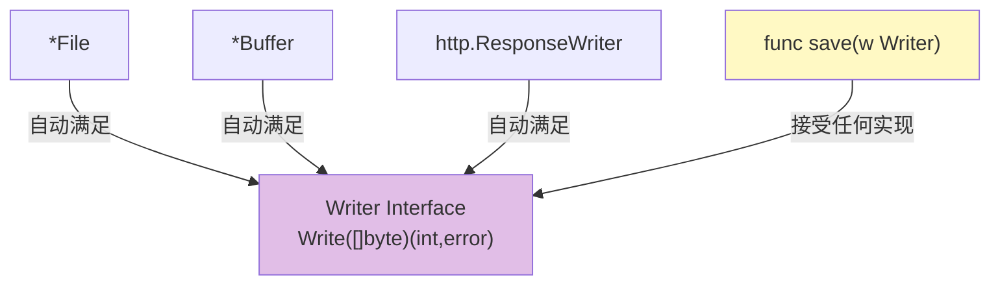
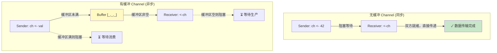
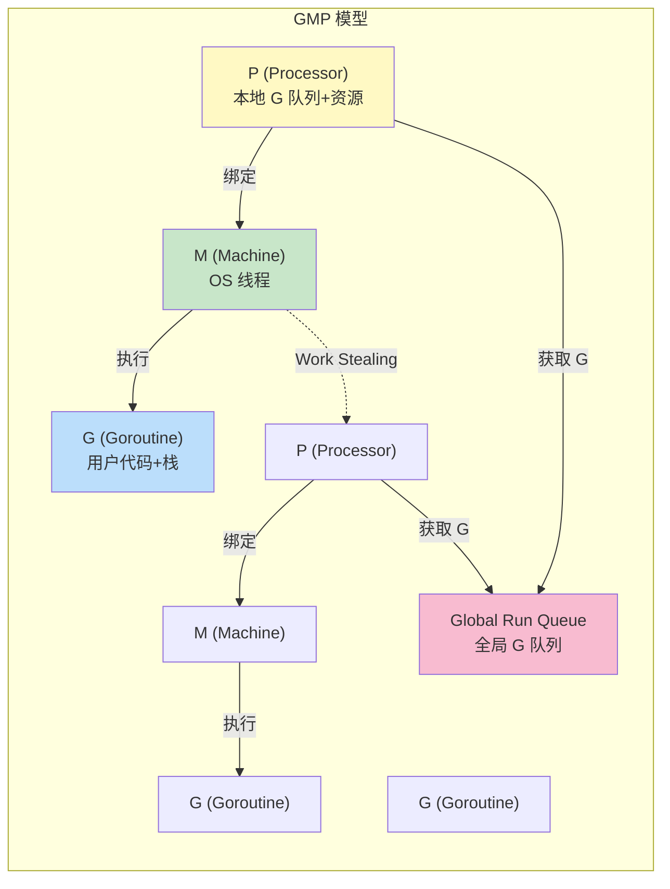
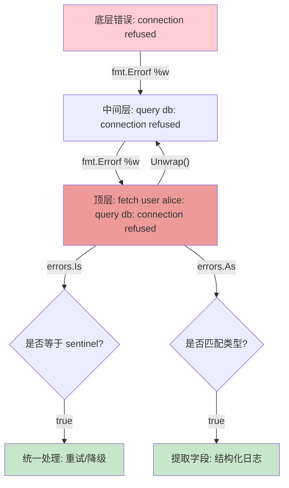
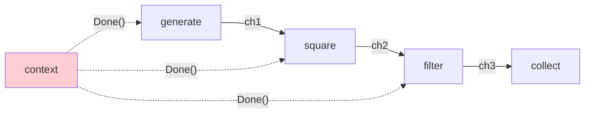

### 一、语法映射与核心差异（从脚本/结构类型到静态编译）

> 💡 **写给 Python/TS 开发者**：Go 不是“更好的 Python”，也不是“编译型 TypeScript”。它是一门刻意做减法的语言。没有异常、没有类、没有泛型（直到 1.18）、没有隐式转换。本阶段的目标不是记住所有语法，而是建立正确的“Go 心智模型”。

#### 1.1 编译模型与程序入口

Python 是解释执行，TS 编译为 JS 后由 V8 等引擎执行，而 Go 是 **AOT（Ahead-of-Time）静态编译**。这意味着：

- 没有全局解释器锁（GIL），天然支持多核并行
- 启动极快（毫秒级），适合 CLI 工具和微服务
- 修改代码后必须重新编译才能看到效果（但 `go run` 提供了类似脚本的体验）

```go
// main.go - Go 程序的固定入口
package main // 可执行程序必须是 main 包

import "fmt" // 导入路径是字符串，不是模块名

func main() {
    // 没有 if __name__ == "__main__" 的概念
    // main 函数就是唯一入口，且不能有参数和返回值
    fmt.Println("Hello, Go!")
}
```

|特性|Python|TypeScript|Go|
|:--|:--|:--|:--|
|执行方式|解释执行|转译 + 运行时|AOT 静态编译|
|入口|`if __name__`|任意顶层代码|`func main()`|
|包管理|pip/poetry|npm/yarn|go mod (内置)|
|类型检查时机|运行时 / mypy|编译时 (擦除)|编译时 (保留)|
|空值|`None`|`null/undefined`|`nil` (仅引用类型)|

#### 1.2 变量声明：显式 vs 推导

Go 提供了两种声明方式，这在 Python/TS 中是没有对应物的：

```go
// 方式1：完整声明（类型在后，与 TS 注解位置相同但语法不同）
var name string = "Alice"
var age int           // 零值初始化，int 默认为 0，string 默认为 ""

// 方式2：短声明（最常用，类似 Python 赋值但带类型推导）
count := 42           // 编译器推导为 int
msg := "hello"        // 编译器推导为 string

// ⚠️ 关键区别：:= 只能在函数内部使用
// var 可以在包级别使用
```

> 🧠 **零值（Zero Value）概念**：这是 Go 最重要的设计之一。Python 中未赋值的变量会抛 `NameError`，TS 中可能是 `undefined`。而在 Go 中，**每个变量都有确定的零值**：数值为 `0`，布尔为 `false`，字符串为 `""`，指针/切片/Map/Channel/接口为 `nil`。这消除了大量空指针类 bug，但也意味着你无法区分“用户传了 0”和“用户没传值”——后续会用指针或特殊结构体解决。



#### 1.3 基础类型与类型安全

Go 的类型系统比 TS 更严格，比 Python 更显式：

```go
// ❌ Go 中没有隐式类型转换！这是与 Python/TS 最大的区别
var i int = 42
var f float64 = float64(i)  // 必须显式转换
var u uint = uint(f)        // 即使可能丢失精度也必须显式

// ❌ 不同类型即使底层相同也不能混用
type UserID int
type OrderID int
var uid UserID = 1
var oid OrderID = 2
// uid + oid  ← 编译错误！必须 OrderID(uid) + oid

// ✅ 常量与 iota（枚举替代方案）
const (
    StatusPending = iota // 0
    StatusActive         // 1
    StatusClosed         // 2
)
```

> 📌 **为什么 Go 禁止隐式转换？** Python 中 `"42" + 1` 会报错但 `1 + 1.0` 会自动提升；TS 中类型只在编译期存在，运行时完全无约束。Go 认为隐式转换是 bug 的温床，强制显式转换让每一次类型变化都“可见”。这对习惯了 TS 结构化类型的开发者来说初期会很痛苦，但长期来看能显著减少类型相关 bug。

#### 1.4 控制流：少即是多

Go 的控制流故意保持简单，**没有 while、do-while、三元运算符、列表推导式**：

```go
// for 是唯一的循环关键字
for i := 0; i < 10; i++ { }   // 经典 for
for condition { }              // 等价于 while
for { }                        // 无限循环
for i, v := range slice { }   // 遍历（类似 Python enumerate）

// if 支持初始化语句（Go 特色）
if err := doSomething(); err != nil {
    // err 的作用域仅限于这个 if-else 块
    log.Fatal(err)
} else {
    // 这里也能访问 err
}

// switch 默认 break，不需要写 break；支持无条件 switch
switch {
case score >= 90:
    grade = "A"
case score >= 80:
    grade = "B"
default:
    grade = "C"
}
```

#### 1.5 函数：多返回值与一等公民

Go 函数最核心的特性是 **原生多返回值**，这直接替代了 Python/TS 中的异常模式和元组返回：

```go
// 多返回值：惯例是 (result, error)
func divide(a, b float64) (float64, error) {
    if b == 0 {
        return 0, fmt.Errorf("division by zero") // 没有异常！
    }
    return a / b, nil
}

// 调用时必须处理所有返回值
result, err := divide(10, 0)
if err != nil {
    log.Fatal(err)
}

// 命名返回值（文档化作用）
func swap(x, y int) (first, second int) {
    first = y
    second = x
    return // 裸 return，自动返回命名变量
}

// 函数是一等公民（与 Python/TS 一致）
handler := func(msg string) {
    fmt.Println(msg)
}
```

> ⚠️ **错误处理范式预览**：Python 用 try/except，TS 用 try/catch，Go 用 `if err != nil`。这不是“落后的设计”，而是刻意为之——Go 认为错误是值（value），不是控制流。每个错误都应该在发生的位置被显式处理或向上传播。这个阶段只需接受这个模式，阶段四会深入讲解错误处理的最佳实践。

#### 1.6 包管理与模块系统

Go 的模块系统是内置的，不像 Python/TS 依赖外部工具链：

```bash
# 初始化模块（类似 npm init / poetry init）
go mod init github.com/yourname/project

# 添加依赖（自动检测 import 并下载）
go get github.com/gin-gonic/gin@v1.9.1

# 整理依赖（移除未使用的，补充缺失的）
go mod tidy
```



> 📌 **与 Python/TS 的关键区别**：
> 
> - Go 没有虚拟环境（venv/node_modules），依赖全局缓存在 `$GOPATH/pkg/mod`
> - 版本号遵循语义化版本（SemVer），`go.mod` 中精确锁定
> - `go.sum` 类似 `package-lock.json` / `poetry.lock`，但包含加密哈希用于安全校验
> - 导入路径是 URL 格式（如 `github.com/user/repo`），去中心化，无需中央仓库

#### 1.7 阶段一自检清单

在进入阶段二之前，确保你能回答以下问题：

- [ ]  Go 的零值是什么？为什么它比 `None/null/undefined` 更安全？
- [ ]  `:=` 和 `var` 的区别是什么？各自的使用场景？
- [ ]  为什么 Go 不允许 `int` 和 `float64` 隐式相加？
- [ ]  Go 如何处理错误？与 Python 的 try/except 有何本质区别？
- [ ]  `go.mod` 和 `go.sum` 分别的作用是什么？
- [ ]  Go 的 `for range` 遍历 Map 时顺序是否确定？为什么？

### 二、Go 的灵魂——复合类型与接口哲学

> 💡 **写给 Python/TS 开发者**：如果说阶段一是“学语法”，阶段二就是“换脑子”。Python 用类继承建模，TS 用 interface/type 做静态约束，而 Go 用 **组合 + 隐式接口** 实现多态。Slice 不是 List，Map 不是 Dict，指针不是 Python 的引用。理解这些底层差异，是写出地道 Go 代码的前提。

#### 2.1 数组与切片（Slice）：最易踩坑的基础类型

Go 中几乎不会直接使用数组，**Slice 才是日常使用的动态序列**。但它与 Python list / TS Array 有本质区别：

```go
// 数组：固定长度，值类型（赋值会拷贝！）
var arr [3]int = [3]int{1, 2, 3}

// Slice：动态长度，引用类型（底层指向数组）
s := []int{1, 2, 3}       // 字面量创建
s2 := make([]int, 0, 10)  // len=0, cap=10
s3 := s[1:3]              // 切片操作，共享底层数组！
```



> ⚠️ **三大陷阱（Python/TS 开发者必读）**：
> 
> 1. **共享底层数组**：`s3 := s[1:3]` 修改 `s3[0]` 会影响 `s[1]`。Python 的 `list[1:3]` 是拷贝，Go 不是！需要独立副本请用 `copy()` 或 `append([]int(nil), s...)`。
> 2. **append 可能更换底层数组**：当 `len == cap` 时 append 会分配新数组并拷贝，此时原 slice 和新 slice 不再共享内存。这导致“append 后原变量未更新”的经典 bug。**永远用 `s = append(s, val)` 接收返回值**。
> 3. **nil slice vs 空 slice**：`var s []int`（nil）和 `s := []int{}`（非 nil 空切片）在 `len()==0` 时行为相同，但 JSON 序列化结果不同：nil → `null`，空切片 → `[]`。API 开发中务必注意。

|操作|Python list|TS Array|Go Slice|
|:--|:--|:--|:--|
|切片|返回新列表(拷贝)|slice() 返回拷贝|共享底层数组|
|追加|list.append()|arr.push()|s = append(s, v)|
|容量概念|无|无|cap 决定扩容时机|
|nil 语义|N/A|undefined|nil slice ≠ 空 slice|
|遍历安全删除|不推荐|splice/filter|倒序遍历或收集索引|

#### 2.2 Map：无序且并发不安全

```go
// 声明与初始化
m := map[string]int{
    "alice": 90,
    "bob":   85,
}

// ⚠️ 零值 map 不可写入！必须 make 或字面量初始化
var m2 map[string]int  // nil map
// m2["key"] = 1       // panic: assignment to entry in nil map
m2 = make(map[string]int) // ✅

// 读取：comma-ok 模式（替代 Python 的 .get() / TS 的 ?.）
val, ok := m["charlie"]
if !ok {
    fmt.Println("key not found, val is zero value:", val) // val = 0
}

// 删除
delete(m, "bob") // 内置函数，key 不存在也不报错
```

> 🧠 **为什么 Go Map 故意设计为无序？** Python 3.7+ dict 保持插入顺序，TS 对象也大致有序。Go 刻意打乱迭代顺序是为了 **防止开发者依赖顺序**——Map 的本质是哈希表，顺序不应成为契约。如果你需要有序，请显式排序 keys 或使用专门的有序结构体。这也是 Go “少即是多”哲学的体现：不提供容易误用的便利。

#### 2.3 Struct 与指针：值语义的世界

Go 没有类（class），**Struct 是数据建模的唯一载体**。更重要的是，Go 默认是 **值语义**：

```go
type User struct {
    Name string
    Age  int
}

// 值传递：完整拷贝
func greet(u User) {
    u.Name = "Modified" // 不影响外部
}

// 指针传递：修改可见
func updateAge(u *User) {
    u.Age = 30 // 等价于 (*u).Age = 30，Go 自动解引用
}

user := User{Name: "Alice", Age: 25}
greet(user)        // user.Name 仍是 "Alice"
updateAge(&user)   // user.Age 变为 30
```



> 📌 **何时用指针？经验法则**：
> 
> - **需要修改原始值** → 用指针
> - **大型 Struct（>几百字节）** → 用指针避免拷贝开销
> - **表示“可选/可空”字段** → 用指针（`*string` 可以为 nil，`string` 不行）
> - **小 Struct 且只读** → 用值（如 `time.Time`、坐标点）
> - **Slice/Map/Channel/Function** → 本身已是引用类型，通常不需要再取指针（除非要修改 slice header 本身）
> 
> 这与 Python（一切皆引用）和 TS（对象按引用传递）完全不同。**默认用值，必要时才用指针**，这是 Go 的安全哲学。

#### 2.4 方法接收者：Struct 的“行为绑定”

Go 没有类方法，而是通过 **接收者（Receiver）** 将函数绑定到类型上：

```go
// 值接收者：不修改原值，适用于小型只读 Struct
func (u User) Greeting() string {
    return fmt.Sprintf("Hi, I'm %s", u.Name)
}

// 指针接收者：可修改原值，适用于大多数场景
func (u *User) SetName(name string) {
    u.Name = name
}

// ⚠️ 一致性原则：同一类型要么全用值接收者，要么全用指针接收者
// 不要混用！混用会导致接口实现的混乱
```

> 🧠 **与 Python/TS 的对比**：Python 的 `self` 永远是实例引用；TS 的方法属于类原型。Go 的接收者是显式的参数声明，**值接收者和指针接收者是两种不同的签名**。选择指针接收者的理由除了“需要修改”，还包括“避免大 Struct 拷贝”和“包含不可拷贝字段（如 sync.Mutex）”。

#### 2.5 隐式接口：Go 多态的核心

这是 Go 与 Python/TS 差异最大的设计，也是 Go 最强大的抽象机制：

```go
// 定义接口：描述“能做什么”，而非“是什么”
type Writer interface {
    Write(p []byte) (n int, err error)
}

// ✅ 无需 implements 关键字！只要实现了所有方法就自动满足接口
type File struct{ path string }
func (f *File) Write(p []byte) (int, error) { /* ... */ return len(p), nil }

type Buffer struct{ data []byte }
func (b *Buffer) Write(p []byte) (int, error) { /* ... */ return len(p), nil }

// 多态使用
func save(w Writer, data []byte) error {
    _, err := w.Write(data)
    return err
}

save(&File{"/tmp/out.txt"}, []byte("hello"))  // ✅
save(&Buffer{}, []byte("hello"))              // ✅
```



> 📌 **与 Python Duck Typing / TS Structural Typing 的区别**：
> 
> |特性|Python Duck Typing|TS Structural Typing|Go Implicit Interface|
> |:--|:--|:--|:--|
> |检查时机|运行时|编译时（擦除）|编译时（保留）|
> |性能开销|动态分发|零（擦除后无接口）|接口表（itab）间接调用|
> |安全性|低（运行时报错）|高（编译期检查）|高（编译期检查）|
> |跨包解耦|弱|中|强（消费方定义接口）|
> |空接口|object/Any|unknown/any|interface{} / any|
> 
> **核心原则：接口由使用方定义，而非实现方**。不要在定义 Struct 时就预设它要实现什么接口。先写业务逻辑，发现多个类型有共同行为时再提取接口。这与 Java/C# 的“先定义接口再实现”完全相反。

#### 2.6 组合优于继承：嵌入（Embedding）

Go 没有继承，用 **嵌入** 实现代码复用：

```go
type Base struct {
    ID        int
    CreatedAt time.Time
}

func (b *Base) GetID() int { return b.ID }

type User struct {
    Base          // 嵌入（匿名字段），不是继承！
    Name  string
    Email string
}

u := &User{Name: "Alice"}
u.ID = 1           // ✅ 提升字段，等价于 u.Base.ID
u.GetID()          // ✅ 提升方法
fmt.Println(u.Base) // 仍可显式访问嵌入字段
```

> ⚠️ **嵌入 ≠ 继承**：
> 
> - 没有虚方法/多态分派：如果 User 重新定义了 `GetID()`，调用 `u.GetID()` 走 User 的版本，但 `u.Base.GetID()` 仍走 Base 的版本。**不存在 override**。
> - 没有向上转型：`User` 不是 `Base` 的子类型，不能将 `*User` 赋给 `*Base` 变量（但可以赋给包含 `GetID()` 方法的接口）。
> - 本质是语法糖：编译器自动生成了委托方法，减少了样板代码，但没有引入继承的复杂性。

#### 2.7 阶段二自检清单

- [ ]  Slice 切片操作是否共享底层数组？如何安全地创建独立副本？
- [ ]  `append` 为什么要接收返回值？什么情况下底层数组会更换？
- [ ]  nil map 和空 map 的区别是什么？如何正确初始化 map？
- [ ]  什么时候应该用指针接收者？为什么同一类型不应混用值和指针接收者？
- [ ]  Go 的隐式接口与 TS 的 structural typing 有何本质区别？
- [ ]  嵌入（Embedding）与继承的三个关键区别是什么？
- [ ]  如何判断一个 Struct 应该用值传递还是指针传递？

### 三、并发编程与运行时模型

> 💡 **写给 Python/TS 开发者**：这是 Go 与你们过往经验差异最大的领域。Python 的 `asyncio` 和 TS 的 `Promise` 本质是**单线程协作式异步**，解决的是 I/O 等待问题；而 Go 的并发是**多线程抢占式调度 + CSP 通信模型**，同时解决 I/O 等待和 CPU 并行计算问题。不要试图在 Go 里找 `await`，Go 的哲学是：**“不要通过共享内存来通信，而要通过通信来共享内存。”**

#### 3.1 Goroutine：轻量级并发原语

Goroutine 不是线程，也不是协程（coroutine），它是 Go 运行时管理的**用户态轻量级执行单元**：

```go
// 启动一个 goroutine：仅需 go 关键字
go func() {
    fmt.Println("running concurrently")
}()

// ⚠️ 主 goroutine 退出时，所有子 goroutine 立即终止
// 没有 Python asyncio 的 event loop.run_until_complete()
// 必须显式同步等待
var wg sync.WaitGroup
wg.Add(1)
go func() {
    defer wg.Done()
    fmt.Println("task done")
}()
wg.Wait() // 阻塞直到计数器归零
```

|特性|Python Thread|Python asyncio Task|TS Promise|Go Goroutine|
|:--|:--|:--|:--|:--|
|调度方式|OS 抢占式|事件循环协作式|微任务队列协作式|Go Runtime 抢占式|
|初始栈大小|~8MB|~几KB|N/A (回调链)|~2KB (可动态增长)|
|创建成本|高|低|极低|极低|
|并行能力|GIL 限制|无|无|真正多核并行|
|数量上限|数百~数千|数万|数万|数十万~百万|
|取消机制|困难|CancelledError|AbortController|Context|

> 🧠 **为什么 Goroutine 这么轻？** Go 运行时实现了自己的栈管理：初始仅分配 2KB，需要时自动扩容到 GB 级别，不需要时自动缩容。这由运行时的 `stack copy` 机制实现，对开发者完全透明。相比之下，OS 线程的 8MB 栈是固定的，创建/销毁涉及内核态切换，成本高几个数量级。

#### 3.2 Channel：CSP 通信原语

Channel 是 Go 并发的核心抽象，它既是**数据管道**，也是**同步机制**：

```go
// 无缓冲 channel：发送和接收必须同时就绪（同步 rendezvous）
ch := make(chan int)
go func() { ch <- 42 }()  // 阻塞直到有人接收
val := <-ch                // 阻塞直到有人发送

// 有缓冲 channel：缓冲区未满时发送不阻塞，非空时接收不阻塞
bufCh := make(chan string, 3)
bufCh <- "a" // 不阻塞
bufCh <- "b" // 不阻塞
bufCh <- "c" // 不阻塞
// bufCh <- "d" // ⚠️ 阻塞！缓冲区已满

// 关闭 channel：表示“不再发送”，接收方仍可读取剩余值
close(ch)
val, ok := <-ch // ok=false 表示已关闭且无数据
for v := range ch { } // 自动在 close 后退出循环
```



> ⚠️ **Channel 使用铁律**：
> 
> 1. **只有关闭才需要 close**：GC 会回收未关闭的 channel，不 close 不会内存泄漏。只有当接收方需要知道“不会再有数据”时才 close（如 `range` 循环）。
> 2. **永远不要向已关闭的 channel 发送**：会 panic。
> 3. **重复关闭也会 panic**：如果不确定谁该关闭，通常由唯一的发送方负责关闭。
> 4. **不要用 channel 做所有事**：简单的状态保护用 `sync.Mutex`，channel 适合 goroutine 之间的数据流转和信号传递。

#### 3.3 Select：多路复用与超时控制

`select` 是 Go 并发的“交换机”，类似 Unix 的 `select/poll`，但作用于 channel：

```go
select {
case msg := <-msgCh:
    process(msg)
case err := <-errCh:
    log.Fatal(err)
case <-time.After(5 * time.Second):
    // 超时处理！无需额外的 timer 管理
    return fmt.Errorf("timeout")
case <-ctx.Done():
    // 响应取消信号
    return ctx.Err()
default:
    // 非阻塞分支（可选）
    fmt.Println("no message ready")
}
```

> 📌 **与 Python/TS 的对比**：Python 的 `asyncio.gather()` / TS 的 `Promise.race()` 只能等待多个异步操作，无法在运行时动态选择“哪个先就绪就处理哪个”。`select` 是真正的多路复用器，每个 case 都是平等的，就绪顺序不确定（多个同时就绪时随机选择），这避免了饥饿问题。

#### 3.4 Context：取消传播与超时控制的标准范式

Context 是 Go 并发中**跨 goroutine 传递取消信号、超时、请求作用域数据**的标准机制：

```go
// 创建带超时的 context
ctx, cancel := context.WithTimeout(context.Background(), 10*time.Second)
defer cancel() // ⚠️ 必须调用 cancel 释放资源！

// 传递给下游
result, err := fetchData(ctx, url)

// 下游检查取消信号
func fetchData(ctx context.Context, url string) ([]byte, error) {
    req, _ := http.NewRequestWithContext(ctx, "GET", url, nil)
    resp, err := http.DefaultClient.Do(req) // HTTP 客户端自动尊重 ctx
    if err != nil {
        return nil, err // 可能是 context.DeadlineExceeded
    }
    // ...
}
```

```mermaid
graph TD
    BG["context.Background()"] --> WT["WithTimeout(10s)"]
    WT --> C1["fetchData(ctx)"]
    WT --> C2["queryDB(ctx)"]
    C1 --> C3["http.Get(ctx)"]
    C2 --> C4["tx.Query(ctx)"]
    
    CAN["cancel() / 超时触发"] -.->|Done() channel 关闭| WT
    WT -.->|级联传播| C1
    WT -.->|级联传播| C2
    C1 -.->|自动取消| C3
    C2 -.->|自动取消| C4
    
    style CAN fill:#ffcdd2
    style BG fill:#e0e0e0
```

> ⚠️ **Context 使用规范**：
> 
> - **作为函数第一个参数**：`func DoSomething(ctx context.Context, ...)` 是 Go 社区强制约定。
> - **不要存入 struct**：Context 是请求作用域的，不应作为结构体字段长期持有。
> - **不要传 nil**：不确定时用 `context.TODO()`。
> - **只用 WithValue 传递请求元数据**：如 traceID、userID。**绝不用它传递函数依赖**（那是 DI 容器的事）。

#### 3.5 GMP 调度模型：理解 Goroutine 如何被调度

这是面试高频题，也是理解 Go 并发性能的关键：



- **G (Goroutine)**：包含栈、指令指针、状态等，是调度的基本单位。
- **M (Machine)**：对应一个 OS 线程，真正执行代码的实体。数量受 `GOMAXPROCS` 限制（默认=CPU 核数）。
- **P (Processor)**：逻辑处理器，维护本地 G 队列。**M 必须绑定 P 才能执行 G**。P 的数量决定了并发度上限。

> 🧠 **关键机制**：
> 
> 1. **Work Stealing**：当 P 的本地队列为空时，会从其他 P 的本地队列或全局队列“偷”一半 G 过来执行，保证负载均衡。
> 2. **Hand Off**：当 M 因系统调用（如文件 I/O）阻塞时，M 会与 P 解绑，P 立即寻找新的 M（或创建新 M）继续执行队列中的 G。阻塞结束后，原 M 重新尝试绑定 P。这保证了即使有阻塞操作，CPU 也不会空闲。
> 3. **抢占式调度**：Go 1.14+ 基于信号的异步抢占，防止死循环 goroutine 饿死其他 goroutine。之前是基于编译器插入检查点的协作式抢占。

#### 3.6 Sync 包：当 Channel 不够用时

并非所有并发场景都适合 Channel，`sync` 包提供了传统同步原语：

```go
// Mutex：保护共享状态
var mu sync.Mutex
var count int
mu.Lock()
count++
mu.Unlock()

// WaitGroup：等待一组 goroutine 完成（前面已演示）
// Once：确保初始化只执行一次
var once sync.Once
once.Init(func() { /* 只执行一次 */ })

// Pool：对象复用，减少 GC 压力
var bufPool = sync.Pool{
    New: func() any { return new(bytes.Buffer) },
}
buf := bufPool.Get().(*bytes.Buffer)
defer bufPool.Put(buf)
```

> 📌 **选择指南**：
> 
> - 传递数据/信号 → Channel
> - 保护临界区/计数器 → Mutex/RWMutex
> - 等待多个任务完成 → WaitGroup
> - 一次性初始化 → Once
> - 高性能对象复用 → Pool
> - 跨 goroutine 取消/超时 → Context

#### 3.7 阶段三自检清单

- [ ]  Goroutine 与 Python asyncio Task 的本质区别是什么？
- [ ]  无缓冲 channel 和有缓冲 channel 的行为差异？何时用哪种？
- [ ]  为什么 `defer cancel()` 是使用 Context 的必要步骤？
- [ ]  GMP 模型中，当 M 发生系统调用阻塞时会发生什么？
- [ ]  `select` 的 `default` 分支有什么作用？滥用会导致什么问题？
- [ ]  什么时候应该用 Mutex 而不是 Channel？
- [ ]  如何安全地从多个 goroutine 收集结果？（提示：buffered channel 或 WaitGroup + slice）

### 四、工程化实践与生态进阶

> 💡 **写给 Python/TS 开发者**：走到这一步，你已经掌握了 Go 的核心语法与并发模型。但“能跑”和“生产级”之间还有一道鸿沟。Python/TS 生态中有大量约定俗成的工程规范（如 PEP8、ESLint、pytest），Go 同样有自己的哲学：**工具链内置、约定大于配置、显式优于隐式**。本阶段将帮你补齐从“写代码”到“交付软件”的最后拼图。

#### 4.1 错误处理进阶：从 `if err != nil` 到结构化错误

阶段一我们接受了“错误是值”的理念，现在需要掌握生产级的错误处理范式：

```go
// ❌ 反模式：丢失上下文
result, err := doSomething()
if err != nil {
    return err // 调用方不知道错误发生在哪一层
}

// ✅ 正确做法：包装错误 + 添加上下文
result, err := doSomething()
if err != nil {
    return fmt.Errorf("doSomething failed for user %s: %w", userID, err)
    //                                                      ^^ %w 而非 %v
}

// ✅ 调用方：语义化判断，而非字符串匹配
var notFound *NotFoundError
if errors.As(err, &notFound) {
    // 精确匹配错误类型
    return http.StatusNotFound
}
if errors.Is(err, context.DeadlineExceeded) {
    // 精确匹配哨兵错误
    return http.StatusGatewayTimeout
}
```



> 📌 **与 Python/TS 异常链的对比**：
> 
> - Python: `raise NewError(...) from original_error` → `__cause__` 属性
> - TS: 无原生异常链，通常手动附加 `cause` 属性（ES2022+ 支持）
> - Go: `fmt.Errorf("%w", err)` → `Unwrap()` 方法，`errors.Is/As` 自动递归解包
> 
> **核心原则**：错误信息是给**人**看的（日志/监控），错误类型是给**程序**判断的。永远不要通过字符串包含来判断错误种类。

#### 4.2 测试与基准测试：内置的一等公民

Go 的测试框架是标准库的一部分，无需 pytest/jest 等外部依赖：

```go
// user_test.go - 文件名必须以 _test.go 结尾
func TestUserValidation(t *testing.T) {
    tests := []struct {       // 表驱动测试（Go 社区黄金模式）
        name    string
        input   User
        wantErr bool
    }{
        {"valid user", User{Name: "Alice", Age: 25}, false},
        {"empty name", User{Name: "", Age: 25}, true},
        {"negative age", User{Name: "Bob", Age: -1}, true},
    }
    for _, tt := range tests {
        t.Run(tt.name, func(t *testing.T) {  // 子测试：独立命名、可单独运行
            err := Validate(tt.input)
            if (err != nil) != tt.wantErr {
                t.Errorf("Validate(%v) error = %v, wantErr %v", 
                         tt.input, err, tt.wantErr)
            }
        })
    }
}

// 基准测试：性能回归检测
func BenchmarkJSONMarshal(b *testing.B) {
    u := User{Name: "Alice", Age: 25}
    b.ResetTimer() // 排除初始化开销
    for i := 0; i < b.N; i++ {
        json.Marshal(u)
    }
}
```

> ⚠️ **Python/TS 开发者注意事项**：
> 
> - **没有 assert 库**：Go 故意不提供断言函数，认为 `t.Errorf` + 格式化输出更清晰。社区有 `testify` 等库，但标准库风格更受推崇。
> - **覆盖率内置**：`go test -coverprofile=cover.out && go tool cover -html=cover.out`
> - **并行测试**：`t.Parallel()` 标记子测试可并行执行，加速 CI。
> - **模糊测试（Fuzz Testing）**：Go 1.18+ 内置，`func FuzzParse(f *testing.F)`，自动生成随机输入发现边界 bug。这是 Python/TS 生态中通常需要第三方工具才能实现的能力。

#### 4.3 泛型（Generics）：克制地使用

Go 1.18 引入泛型，但社区共识是 **“能用接口解决就不用泛型”**：

```go
// ✅ 合适的场景：数据结构、通用算法
func Map[T any, U any](s []T, f func(T) U) []U {
    result := make([]U, len(s))
    for i, v := range s {
        result[i] = f(v)
    }
    return result
}

// ✅ 约束：限制类型范围
type Number interface {
    ~int | ~int64 | ~float64 // ~ 表示底层类型匹配
}
func Sum[T Number](nums []T) T {
    var total T
    for _, n := range nums {
        total += n
    }
    return total
}

// ❌ 不合适的场景：业务逻辑差异化
// 不要为了消除重复而强行泛型化
// 如果每个类型的处理逻辑不同，用接口或独立函数更好
```

> 🧠 **与 TS 泛型的本质区别**：
> 
> - TS 泛型是**编译期擦除**的，运行时不存在，仅用于类型检查。
> - Go 泛型在编译期**单态化（monomorphization）**，为每种具体类型生成独立代码，运行时有真实类型信息。
> - Go 没有条件类型（Conditional Types）、映射类型（Mapped Types）等高级类型编程能力。Go 泛型的设计目标是“够用”，而非“强大”。
> 
> **经验法则**：如果你在写容器、工具函数、序列化库，泛型是好选择；如果你在写业务 CRUD，大概率不需要它。

#### 4.4 性能分析：pprof 是你的听诊器

Go 内置了工业级的性能分析工具，无需额外安装：

```go
// 在程序中启用（HTTP 服务最方便）
import _ "net/http/pprof"
// 启动后访问 http://localhost:6060/debug/pprof/

// 命令行分析
go tool pprof cpu.prof
(pprof) top 10          // 查看热点函数
(pprof) web             // 生成火焰图（需 graphviz）
(pprof) list FuncName   // 查看函数级逐行耗时
```

|分析维度|命令/端点|用途|
|:--|:--|:--|
|CPU|`/debug/pprof/profile?seconds=30`|找出计算热点|
|Heap Memory|`/debug/pprof/heap`|内存分配与泄漏|
|Goroutine|`/debug/pprof/goroutine`|goroutine 泄漏/阻塞|
|Block|`/debug/pprof/block`|channel/mutex 竞争|
|Mutex|`/debug/pprof/mutex`|锁持有时间|
|Trace|`/debug/pprof/trace`|纳秒级调度可视化|

> 📌 **Python/TS 对比**：Python 有 cProfile/memory_profiler，TS 有 Node.js inspector/clinic.js，但它们都是事后附加的工具。Go 的 pprof 是**运行时内置**的，生产环境可随时开启（注意 CPU profile 有约 1-5% 开销），且 trace 工具能可视化 GMP 调度细节，这是其他语言难以企及的诊断深度。

#### 4.5 项目布局与工程规范

Go 社区推荐的项目结构（非强制，但广泛采用）：

```
my-project/
├── cmd/                  # 应用入口
│   └── server/
│       └── main.go
├── internal/             # 私有代码，外部模块不可导入（编译器强制！）
│   ├── handler/
│   ├── service/
│   └── repository/
├── pkg/                  # 可被外部导入的公共库（谨慎使用）
├── api/                  # API 定义（proto/OpenAPI）
├── go.mod
├── go.sum
├── Makefile
└── README.md
```

> ⚠️ **关键约定**：
> 
> - **`internal/` 是编译器级别的访问控制**：不同于 Python 的 `_private` 约定或 TS 的 `private` 关键字，Go 编译器会直接拒绝外部模块导入 `internal` 下的包。这是构建清晰模块边界的利器。
> - **避免 `pkg/` 滥用**：很多项目把所有公共代码扔进 `pkg/`，这违背了 Go 的“按需暴露”原则。优先放在 `internal/`，只有真正需要跨项目复用时才提升到 `pkg/` 或独立模块。
> - **扁平优于深层嵌套**：Go 偏好按功能域组织（`handler/user.go`），而非按技术层（`controllers/user_controller.go`）。包名应该是名词（`user`），不是 `utils/helpers/common`。

#### 4.6 常用工具链速查

|工具|用途|等价 Python/TS 工具|
|:--|:--|:--|
|`gofmt` / `goimports`|格式化 + 自动导入管理|black + isort / prettier|
|`go vet`|静态分析（常见 bug 模式）|pylint / eslint|
|`golangci-lint`|聚合 linter（社区标准）|ruff / eslint+plugins|
|`go mod tidy`|依赖清理|pip-autoremove / depcheck|
|`go generate`|代码生成（mock/stringer等）|codegen / ts-morph|
|`delve`|调试器|pdb / vscode debugger|

> 🎯 **最终建议**：Go 的工程文化强调 **“无聊的技术”**。不要追求花哨的抽象，不要过早优化，不要过度设计。写好测试、用好 pprof、遵循社区约定，比任何架构模式都重要。Go 的力量不在于语言本身，而在于它迫使你用简单、可读、可维护的方式解决问题。

#### 4.7 阶段四自检清单

- [ ]  `fmt.Errorf` 中 `%w` 和 `%v` 的区别是什么？何时用哪个？
- [ ]  `errors.Is` 和 `errors.As` 分别适用于什么场景？
- [ ]  表驱动测试的核心优势是什么？如何用 `t.Run` 组织子测试？
- [ ]  Go 泛型的单态化与 TS 泛型的擦除有何实际影响？
- [ ]  如何用 pprof 定位 goroutine 泄漏？
- [ ]  `internal/` 目录的编译器级访问控制意味着什么？
- [ ]  你的项目中是否有不必要的 `pkg/` 或 `utils/` 包？如何重构？

### 五、练习

> 💡 **写给 Python/TS 开发者**：前四个阶段构建了知识体系，但“看懂”和“会写”之间隔着大量的肌肉记忆训练。本阶段的练习题刻意避开了纯语法填空，全部设计为 **“思维转换触发器”**——每道题都针对 Python/TS 开发者迁移到 Go 时最容易犯错的点。建议按顺序完成，每题先独立思考再对照提示，最后用 `go test` 验证。所有题目均可在单个模块内完成，无需外部依赖。

#### 5.1 基础语法与零值陷阱

**目标**：巩固零值语义、短声明作用域、显式类型转换。

1. **零值辨析器**：编写函数 `DescribeZeroValues()` 返回一个 map，key 为类型名（`int`, `string`, `bool`, `*int`, `[]int`, `map[string]int`, `interface{}`），value 为该类型零值的字符串表示。要求：
    - 指针、切片、map、接口的零值必须输出 `"nil"` 而非 panic
    - 数值零值输出 `"0"` 而非空字符串
    - 编写表驱动测试验证每个条目
2. **类型安全转换器**：实现 `SafeConvert(value any, targetType string) (any, error)` 函数，支持 `int↔float64`、`string↔[]byte` 的显式转换。要求：
    - 不支持的转换返回带上下文的错误（使用 `%w` 包装自定义 `ErrUnsupportedConversion`）
    - 禁止使用反射，仅用 type switch
    - 测试覆盖：合法转换、非法转换、nil 输入三种场景
3. **短声明作用域迷宫**：阅读以下代码，在不运行的情况下预测输出，然后实际运行验证。解释每一行 `:=` 是创建新变量还是复用已有变量：
    
    ```go
    func scopePuzzle() {
        x, y := 1, "a"
        if x, z := 2, "b"; x > 0 {
            fmt.Println(x, y, z) // ?
        }
        x, y = 3, "c"
        fmt.Println(x, y) // ?
    }
    ```
    

> 🧠 **设计意图**：Python/TS 开发者常假设未初始化变量为 `None/undefined`，或在嵌套作用域中意外遮蔽变量。这三题强制你直面 Go 的确定性零值和词法作用域规则。

> [!success]- 点击展开题解
> ## 题解：基础语法与零值陷阱
>
> 本系列题目旨在帮助 Python/TypeScript 开发者快速适应 Go 语言中两个重要的“确定性”设计：**零值的确定性**与**作用域的确定性**。我们将逐一拆解每道题的考点与解题思路。
>
> ### 零值全景图
>
> 在深入代码前，先用一张图建立 Go 零值体系的整体认知：
>
> ```mermaid
> flowchart TD
>     subgraph 值类型
>         A[numeric] -->|零值| Z1[0 / 0.0 / 0i]
>         B[string] -->|零值| Z2["\"\""]
>         C[bool] -->|零值| Z3[false]
>     end
>
>     subgraph 引用/特殊类型
>         D[pointer] -->|零值| Z4[nil]
>         E[slice] -->|零值| Z4
>         F[map] -->|零值| Z4
>         G[chan] -->|零值| Z4
>         H[func] -->|零值| Z4
>         I[interface] -->|零值| Z4
>     end
>
>     subgraph 复合类型
>         J[struct] -->|零值| Z5[所有字段均为其类型的零值]
>         K[array] -->|零值| Z6[每个元素均为其类型的零值]
>     end
> ```
>
> **核心解释**：Go 中所有变量都会被初始化为零值，不存在“未定义”状态。理解这一点的关键是区分：
> - **值类型**：零值是具体的数据（如 `0`、`""`、`false`）
> - **引用类型**（slice、map、chan、pointer、func）及接口：零值统一为 `nil`，它代表“空引用”
> - `nil` 不是值类型的合法状态——比如一个 `int` 永远是 `0`，绝不可能是 `nil`
>
> ---
>
> ### 1. 零值辨析器
>
> **考点**：准确区分各类型零值的字符串表示，特别是引用类型与 `nil` 的对应关系。
>
> ```go
> package main
>
> import "fmt"
>
> func DescribeZeroValues() map[string]string {
>     var (
>         i   int
>         s   string
>         b   bool
>         p   *int
>         sl  []int
>         m   map[string]int
>         ifc interface{}
>     )
>     return map[string]string{
>         "int":           fmt.Sprintf("%v", i),
>         "string":        fmt.Sprintf("%v", s),
>         "bool":          fmt.Sprintf("%v", b),
>         "*int":          fmt.Sprintf("%v", p),
>         "[]int":         fmt.Sprintf("%v", sl),
>         "map[string]int": fmt.Sprintf("%v", m),
>         "interface{}":   fmt.Sprintf("%v", ifc),
>     }
> }
> ```
>
> **关键细节**：
> - 使用 `fmt.Sprintf("%v", v)` 是获取零值字符串表示的最安全方式。对于 `nil` 切片、map、指针、接口，`%v` 会输出 `"<nil>"`，而直接 `string(v)` 或 `fmt.Sprint(v)` 对于 nil slice 可能输出 `"[]"` 导致不一致。
> - **表驱动测试**框架如下，验证每个 key 的精确输出：
>
> ```go
> func TestDescribeZeroValues(t *testing.T) {
>     tests := map[string]string{
>         "int":            "0",
>         "string":         "",
>         "bool":           "false",
>         "*int":           "<nil>",
>         "[]int":          "[]",
>         "map[string]int": "map[]",
>         "interface{}":    "<nil>",
>     }
>     got := DescribeZeroValues()
>     for k, want := range tests {
>         if got[k] != want {
>             t.Errorf("%s: got %q, want %q", k, got[k], want)
>         }
>     }
> }
> ```
>
> **常见误区**：Python/TS 开发者容易认为“没有赋值的变量”就是 `None`/`undefined`。在 Go 中，一个未显式初始化的 `int` 已经是 `0`，它和显式赋值为 `0` 完全等价，无法区分。
>
> ---
>
> ### 2. 类型安全转换器
>
> **考点**：type switch 的运用、自定义错误包装。
>
> ```go
> package main
>
> import (
>     "errors"
>     "fmt"
> )
>
> var ErrUnsupportedConversion = errors.New("unsupported conversion")
>
> func SafeConvert(value any, targetType string) (any, error) {
>     if value == nil {
>         return nil, nil
>     }
>     switch targetType {
>     case "int":
>         switch v := value.(type) {
>         case int:
>             return v, nil
>         case float64:
>             return int(v), nil
>         default:
>             return nil, fmt.Errorf("%w: cannot convert %T to int", ErrUnsupportedConversion, value)
>         }
>     case "float64":
>         switch v := value.(type) {
>         case int:
>             return float64(v), nil
>         case float64:
>             return v, nil
>         default:
>             return nil, fmt.Errorf("%w: cannot convert %T to float64", ErrUnsupportedConversion, value)
>         }
>     case "string":
>         switch v := value.(type) {
>         case string:
>             return v, nil
>         case []byte:
>             return string(v), nil
>         default:
>             return nil, fmt.Errorf("%w: cannot convert %T to string", ErrUnsupportedConversion, value)
>         }
>     case "[]byte":
>         switch v := value.(type) {
>         case string:
>             return []byte(v), nil
>         case []byte:
>             return v, nil
>         default:
>             return nil, fmt.Errorf("%w: cannot convert %T to []byte", ErrUnsupportedConversion, value)
>         }
>     default:
>         return nil, fmt.Errorf("%w: unknown target type %q", ErrUnsupportedConversion, targetType)
>     }
> }
> ```
>
> **设计要点**：
> - **禁止反射**：所有类型判断依靠 `value.(type)` 语法，这是 Go 中有限的类型多态能力，但清晰、安全。
> - **错误链**：使用 `fmt.Errorf("%w: ...", ErrUnsupportedConversion, ...)` 将底层预定义错误与具体上下文信息打包，上层可用 `errors.Is` 回溯到根因。
> - **nil 输入**：独立处理，直接返回 `nil, nil`，避免在 type switch 中意外匹配到 `nil` 的特殊行为。
>
> **测试矩阵**应覆盖：
> | 场景 | 示例输入 | 预期 |
> |------|---------|------|
> | 合法 | `3.14 → int` | `3, nil` |
> | 合法 | `"hello" → []byte` | `[]byte("hello"), nil` |
> | 非法 | `true → int` | 错误（含 `ErrUnsupportedConversion`） |
> | nil | `nil → "int"` | `nil, nil` |
> | 未知目标 | `42 → "uint"` | 错误（含 `"unknown target type"`） |
>
> ---
>
> ### 3. 短声明作用域迷宫
>
> **考点**：`:=` 在嵌套作用域中的变量遮蔽与新变量创建规则。
>
> 先直接给出答案，再逐行分析：
>
> ```
> 2 b b
> 3 c
> ```
>
> **作用域演变可视化**：
>
> ```mermaid
> graph TB
>     subgraph 外层作用域
>         X1[x: 1] --- Y1[y: "a"]
>     end
>     subgraph if语句作用域
>         X2[x: 2] --- Z[z: "b"]
>     end
>     X1 -.->|"遮蔽 旧x → 新x"| X2
>     Y1 -.->|"不可见，被外层y捕获"| PRINT1["fmt.Println(x, y, z)"]
>     Z -.-> PRINT1
> ```
>
> **逐行解析**：
>
> | 行号 | 代码 | 变量状态 | 说明 |
> |------|------|---------|------|
> | ① | `x, y := 1, "a"` | 创建 `x=1`，`y="a"` | `:=` 在外层作用域声明两个**新变量** |
> | ② | `if x, z := 2, "b"; ...` | 创建 `x=2`，`z="b"` | `:=` 在 **if 语句的隐式作用域**内声明：`x` 是**新变量**（遮蔽外层 `x`），`z` 是新变量 |
> | ③ | `fmt.Println(x, y, z)` | 输出 `2 b b` | 内层 `x=2`，捕获外层 `y="a"`（闭包陷阱回避，此处合法），内层 `z="b"` |
> | ④ | `x, y = 3, "c"` | 外层 `x=3`，`y="c"` | **赋值**而非声明（无 `:`），修改的是外层 `x` 和 `y`。if 内层的 `x` 已随块结束销毁 |
> | ⑤ | `fmt.Println(x, y)` | 输出 `3 c` | 外层 `x` 已被修改为 `3`，`y` 被修改为 `"c"` |
>
> **核心规则速记**：
> - `:=` 在当前词法块内创建**至少一个新变量**；如果其中某些变量名已在外层存在，则内层新建的变量会**遮蔽**外层同名变量。
> - 在同一作用域中，`:=` 对已存在的变量是**赋值**（前提是表达式左侧至少有一个新变量）。
> - 块级作用域退出后，其声明的变量生命周期结束，外层同名变量恢复可见性。
>
> **Python 对比陷阱**：Python 中嵌套函数默认不重新绑定外层变量（除非用 `nonlocal`），而 Go 中 `:=` 毫不留情地在任何块（if、for、{}）内创建全新变量。忘记这一点是“短声明阴影 bug”最常见的根源。
>
> ---
>
> **总结**：这三道题分别训练了 Go 零值的肌肉记忆、类型安全的显式转换习惯，以及词法作用域的心智模型。掌握它们后，你将能自信地写出具有防御性的、行为可预测的 Go 代码。

#### 5.2 Slice 与 Map 底层行为验证

**目标**：通过实验理解共享底层数组、append 扩容、map 无序性。

1. **Slice 共享探测器**：编写函数 `DetectSharedMemory(a, b []int) bool`，判断两个 slice 是否共享底层数组。要求：
    - 不能修改 slice 内容
    - 不能使用 `reflect.SliceHeader`（已废弃）或 `unsafe`
    - 提示：利用 append 在 cap 充足时不分配新数组的特性
    - 编写测试：同一 slice 的不同切片、append 后的 slice、copy 后的 slice
2. **Append 行为记录仪**：创建一个初始 `len=0, cap=4` 的 slice，连续 append 8 个元素。每次 append 后记录 `len`, `cap`, 以及底层数组指针地址（通过 `fmt.Sprintf("%p", slice)` 获取）。将结果整理为表格，标注哪次 append 触发了扩容。
3. **Map 有序性证伪器**：编写基准测试，向 map 插入 1000 个键值对，然后迭代收集 keys 顺序。重复 100 次，断言**至少存在两次**迭代顺序不同。如果测试失败，说明你的 Go 版本或运行环境有特殊优化（正常情况不应失败）。

> ⚠️ **常见误区提醒**：Python 的 `list[1:3]` 是深拷贝，Go 不是；TS 的 `arr.push()` 不返回值，Go 的 `append` 必须接收返回值。这些题会让你“痛一次”，之后就不会再犯。

> [!success]- 点击展开题解
> # 5.2 Slice 与 Map 底层行为验证 · 题解
> 
> 本节实验旨在通过亲手编写代码，揭开 Go 中 Slice 和 Map 底层行为的面纱。你将直观感受到共享底层数组的“联动效应”、append 扩容的“断联瞬间”，以及 map 遍历的“无序本质”。这些是 Go 程序员最容易踩坑的地方，值得花时间深入理解。
> 
> ---
> 
> ## 背景知识：Slice 到底是什么？
> 
> 在深入实验之前，我们先建立 Slice 的思维模型。很多人以为 Slice 就是数组，这其实是误解。Slice 是一个**描述符**，它只包含三个字段：
> 
> ```mermaid
> graph LR
>     subgraph Slice 描述符
>         Ptr[指向底层数组的指针]
>         Len[长度 len: 当前元素个数]
>         Cap[容量 cap: 从指针位置到数组末尾的元素个数]
>     end
>     
>     subgraph 底层数组
>         A[0]
>         B[1]
>         C[2]
>         D[3]
>         E[4]
>         F[5]
>     end
>     
>     Ptr --> C
> ```
> 
> 上图展示了一个 `s := someArray[2:5]` 的 Slice。它的指针指向底层数组索引 2 的位置，len=3（元素 2,3,4），cap=3（从索引 2 到底还有 2,3,4,5 四个位置，此处示意图容量为 3）。
> 
> **关键推论**：当你对 Slice 做切片操作（如 `b := a[1:3]`）时，Go **不会复制数据**，而是创建一个新的描述符，但其指针仍指向**同一个底层数组**。这就是“共享底层数组”的含义。如果你修改了 `b[0]`，而 `a` 的某个元素恰好也映射到同一内存位置，那么 `a` 也会跟着变——这常常是 bug 的来源。
> 
> 相比之下，Python 的 `list[1:3]` 会创建一份新的浅拷贝列表，Go 则完全不是这样。牢记这个差异。
> 
> ---
> 
> ## 题 1：Slice 共享探测器
> 
> ### 思路分析
> 
> 题目要求判断两个 Slice `a` 和 `b` 是否共享底层数组，且不能使用 `unsafe` 或 `reflect.SliceHeader`。这看似棘手，但题目给出了关键提示：**当 cap 足够时，append 不会分配新数组**。
> 
> 我们的探测策略是：
> 1. 取出 `b[0]` 的值（记为 `original`），保存起来。
> 2. 向 `a` 追加一个与 `original` **不同**的值（记为 `newVal`）。
> 3. 检查 `b[0]` 是否从 `original` 变成了 `newVal`。
> 4. 如果变了 → 说明 `a` 的 append 写入覆盖到了 `b` 的位置 → 它们共享底层数组。
> 5. 最后，**必须还原** `a` 和 `b` 的原始内容，因为题目不允许修改 Slice。
> 
> 为什么这能成功？因为 `a` 的 cap 充足时，`append` 会直接在 `a` 的末尾（即底层数组中紧邻 `a` 元素之后的位置）写入新值。如果 `b[0]` 恰好位于这个位置，就会被覆盖。如果 cap 不足，append 会分配新数组，`a` 和 `b` 就彻底分道扬镳了，此时 `b[0]` 不受影响。
> 
> ```mermaid
> sequenceDiagram
>     participant A as Slice a
>     participant B as Slice b
>     participant Arr as 底层数组
>     
>     Note over A,B: 初始共享状态
>     A->>Arr: a 指向元素 [1,2,3]
>     B->>Arr: b 指向元素 [2,3] (与 a 重叠)
>     
>     rect rgb(255,240,220)
>         Note over A,Arr: 探测：向 a append 一个值 X
>         A->>Arr: 在 a 末尾写入 X
>         Arr-->>B: b[0] 恰好在 a 末尾！被覆盖为 X
>         Note over B: 若 b[0] 值改变 → 确认共享
>     end
>     
>     rect rgb(220,240,255)
>         Note over A,Arr: 还原：将 b[0] 恢复原值
>         A->>Arr: 将原值写回 a 末尾位置
>         Note over A,B: 数据恢复如初
>     end
> ```
> 
> ### 代码实现
> 
> ```go
> // DetectSharedMemory 判断 a 和 b 是否共享底层数组
> // 约束：不修改 slice 内容（函数返回后恢复原样），不使用 unsafe/reflect
> func DetectSharedMemory(a, b []int) bool {
>     if len(a) == 0 || len(b) == 0 {
>         return false
>     }
> 
>     // 保存 b[0] 的原始值
>     origB0 := b[0]
> 
>     // 选取一个绝对不同于 origB0 的值
>     probeVal := origB0 + 1
> 
>     // 记录 a 的原始长度，用于后续还原
>     origLenA := len(a)
> 
>     // 尝试向 a 追加探测值
>     // 如果 a 的 cap 足够，此操作会在底层数组中 a 的尾部写入 probeVal
>     a = append(a, probeVal)
> 
>     // 检查 b[0] 是否被意外修改
>     shared := false
>     if b[0] == probeVal {
>         shared = true
>     }
> 
>     // 还原：将 a 缩减回原长度，并把被覆盖的位置恢复原值
>     if len(a) > origLenA {
>         // 如果 a 的 cap 足够，append 确实在 a[origLenA] 处写入了 probeVal
>         // 需要把它还原为 origB0（如果它恰好是 b[0] 的话）
>         a[origLenA] = origB0
>     }
>     // 将 a 截回原始长度
>     a = a[:origLenA]
> 
>     return shared
> }
> ```
> 
> ### 测试用例覆盖
> 
> ```go
> func TestDetectSharedMemory(t *testing.T) {
>     // 场景1：同一 slice 的不同切片 — 必然共享
>     original := []int{1, 2, 3, 4, 5}
>     s1 := original[1:4] // [2,3,4]
>     s2 := original[2:5] // [3,4,5]
>     if !DetectSharedMemory(s1, s2) {
>         t.Error("同一数组的不同切片应该共享底层数组")
>     }
> 
>     // 场景2：append 触发扩容后 — 不再共享
>     base := make([]int, 2, 2) // len=2, cap=2
>     base[0], base[1] = 10, 20
>     derived := base[:]        // 共享
>     base = append(base, 30)   // cap=2 不够，触发扩容，base 指向新数组
>     if DetectSharedMemory(base, derived) {
>         t.Error("扩容后的 slice 不应再与原 slice 共享底层数组")
>     }
> 
>     // 场景3：copy 后的 slice — 不共享
>     src := []int{1, 2, 3}
>     dst := make([]int, len(src))
>     copy(dst, src)
>     if DetectSharedMemory(src, dst) {
>         t.Error("copy 产生的 slice 不应共享底层数组")
>     }
> }
> ```
> 
> **关键收获**：
> - **切片不拷贝数据**：`s2 := s1[2:5]` 只创建新描述符，底层数组相同。
> - **append 可能“断联”**：当 cap 不足时，append 会分配新数组，导致两个 Slice 分道扬镳。这也是为什么 `append` 必须接收返回值的原因——返回的 Slice 可能指向了全新的数组。
> - **copy 是真正的复制**：`copy(dst, src)` 会将数据逐元素复制到新的内存区域，两者彻底独立。
> 
> ---
> 
> ## 题 2：Append 行为记录仪
> 
> ### 思路分析
> 
> 我们需要追踪 append 过程中 len、cap 和底层数组指针的变化，并找出触发扩容的那个时间点。Go 的扩容策略大体是：当所需容量超过当前 cap 时，会分配一个更大的新数组（通常小于 1024 时翻倍，之后增长约 25%），然后把老数据拷贝过去。此时底层数组指针必然改变。
> 
> ```mermaid
> graph TD
>     subgraph 初始: cap=4, len=0
>         A1[数组A: _ _ _ _] 
>     end
>     
>     subgraph append 4次后: cap=4, len=4
>         A2[数组A: 1 2 3 4]
>     end
>     
>     subgraph 第5次 append: 触发扩容!
>         B[新数组B: 容量8]
>     end
>     
>     A1 -->|append 1,2,3,4| A2
>     A2 -->|append 5: cap不足| B
>     B -->|append 6,7,8| C[数组B: 1 2 3 4 5 6 7 8 _]
> ```
> 
> ### 代码实现
> 
> ```go
> func RecordAppendBehavior() {
>     s := make([]int, 0, 4) // len=0, cap=4
> 
>     fmt.Println("序号\t追加值\tlen\tcap\t底层数组指针\t\t是否扩容")
>     fmt.Println("----\t------\t---\t---\t----------------\t--------")
> 
>     prevPtr := fmt.Sprintf("%p", s)
> 
>     for i := 1; i <= 8; i++ {
>         s = append(s, i)
>         currentPtr := fmt.Sprintf("%p", s)
>         expanded := currentPtr != prevPtr
> 
>         fmt.Printf("%d\t%d\t%d\t%d\t%s\t%t\n",
>             i, i, len(s), cap(s), currentPtr, expanded)
> 
>         prevPtr = currentPtr
>     }
> }
> ```
> 
> ### 输出示例与解读
> 
> | 序号 | 追加值 | len | cap | 底层数组指针 | 是否扩容 |
> |------|--------|-----|-----|-------------|----------|
> | 1    | 1      | 1   | 4   | 0xc00001a200 | false    |
> | 2    | 2      | 2   | 4   | 0xc00001a200 | false    |
> | 3    | 3      | 3   | 4   | 0xc00001a200 | false    |
> | 4    | 4      | 4   | 4   | 0xc00001a200 | false    |
> | 5    | 5      | 5   | 8   | 0xc00001e280 | **true** |
> | 6    | 6      | 6   | 8   | 0xc00001e280 | false    |
> | 7    | 7      | 7   | 8   | 0xc00001e280 | false    |
> | 8    | 8      | 8   | 8   | 0xc00001e280 | false    |
> 
> 清晰可见：
> - 前 4 次 append 都在 cap=4 的数组内进行，指针不变。
> - 第 5 次 append 时，`len` 已达 4，需要放入第 5 个元素，`cap` 不足，触发扩容。Go 分配了一个 cap=8 的新数组，并复制了老数据。
> - 之后直到第 8 次，新数组足够容纳，指针稳定。
> 
> **重要提醒**：Go 中 `append(s, elem)` 必须接收返回值，否则编译报错或逻辑错误。这与 TypeScript 的 `arr.push()` 原地修改完全不同。在 Go 里，`append` 返回的 Slice 描述符可能指向了全新数组，原来的 `s` 可能已经“过期”。
> 
> ---
> 
> ## 题 3：Map 有序性证伪器
> 
> ### 思路分析
> 
> Go 的 map 遍历顺序是**刻意设计为无序的**。每次 `for range` 的起始迭代位置都随机，目的是防止开发者写出依赖遍历顺序的脆弱代码。我们需要通过统计实验来证实这一点：对同一个 map 迭代 100 次，记录每次的 key 顺序，只要存在两次顺序不同，就证明了无序性。
> 
> 注意题目要求用**基准测试**，但我们同样需要常规测试来“证伪有序性”。这里给出两者的结合。
> 
> ### 代码实现
> 
> ```go
> func TestMapIterationIsRandom(t *testing.T) {
>     const (
>         insertions = 1000
>         iterations = 100
>     )
> 
>     // 构建一个包含 1000 个键值对的 map
>     m := make(map[int]bool, insertions)
>     for i := 0; i < insertions; i++ {
>         m[i] = true
>     }
> 
>     // 存储每次迭代的 key 顺序
>     orders := make([]string, iterations)
> 
>     for round := 0; round < iterations; round++ {
>         keys := make([]int, 0, insertions)
>         for k := range m {
>             keys = append(keys, k)
>         }
>         // 将 key 序列转换为字符串用于比较
>         orders[round] = fmt.Sprint(keys)
>     }
> 
>     // 检查是否存在不同的顺序
>     firstOrder := orders[0]
>     foundDifferent := false
>     for round := 1; round < iterations; round++ {
>         if orders[round] != firstOrder {
>             foundDifferent = true
>             break
>         }
>     }
> 
>     if !foundDifferent {
>         t.Errorf("警告：100 次 map 迭代竟然顺序完全一致。" +
>             "你的 Go 版本或运行环境可能有特殊优化，通常不应出现此情况。")
>     } else {
>         t.Log("符合预期：至少两次迭代顺序不同，证明 map 遍历无序。")
>     }
> }
> 
> // 基准测试版本
> func BenchmarkMapIteration(b *testing.B) {
>     m := make(map[int]bool, 1000)
>     for i := 0; i < 1000; i++ {
>         m[i] = true
>     }
> 
>     b.ResetTimer()
>     for i := 0; i < b.N; i++ {
>         for k := range m {
>             _ = k // 仅遍历，不收集顺序
>         }
>     }
> }
> ```
> 
> ### 为什么 Go 要刻意设计 map 为无序？
> 
> 这是 Go 1.0 之后某个版本做出的决定。原因是当时有开发者写的代码**依赖了 map 的遍历顺序**，而该顺序在不同实现或不同插入模式下可能变化，导致隐蔽的跨平台 Bug。语言团队索性将迭代起始点随机化，让依赖顺序的代码立刻暴露。这是一个典型的“让错误尽早浮现”的设计哲学。
> 
> **需要稳定遍历顺序怎么办？** 收集 keys 到一个 Slice，然后对 Slice 排序：
> 
> ```go
> keys := make([]int, 0, len(m))
> for k := range m {
>     keys = append(keys, k)
> }
> sort.Ints(keys)
> for _, k := range keys {
>     // 按排序后的顺序处理
> }
> ```
> 
> ---
> 
> ## 核心总结
> 
> | 易混淆点 | Go | Python | TypeScript |
> |---------|-----|--------|------------|
> | 切片操作 | `b := a[1:3]` 共享底层数组 | `b = a[1:3]` 浅拷贝新列表 | `b = a.slice(1,3)` 浅拷贝新数组 |
> | 追加元素 | `s = append(s, v)` **必须接收返回值** | `list.append(v)` 原地修改，返回 None | `arr.push(v)` 返回新长度，修改原数组 |
> | Map 遍历 | **无序**，每次顺序随机 | dict 3.7+ 保证插入顺序 | Map 保证插入顺序，对象键有特定规则 |
> 
> 经过这三个实验，你应该能深刻体会到 Go 在“省内存”和“避坑”之间的权衡。Slice 的共享设计节省了大量内存分配，但也要求你时刻留心扩容断联；Map 的无序迭代虽然不便，却从根源上杜绝了顺序依赖的 bug。希望这次“痛过”之后，你能在日后的 Go 编码中更加游刃有余。

#### 5.3 Struct、指针与接口建模

**目标**：摆脱类继承思维，掌握组合+隐式接口的数据建模方式。

1. **值 vs 指针接收者实验**：定义 `Counter` struct，分别用值接收者和指针接收者实现 `Increment()` 方法。各创建实例调用 3 次，打印最终值。解释差异原因。然后思考：如果 `Counter` 包含 `sync.Mutex` 字段，为什么**必须**用指针接收者？
2. **接口提取重构**：给定以下代码（模拟 Python 风格的“上帝类”）：
    
    ```go
    type UserService struct {
        db *sql.DB
        cache redis.Client
        logger *log.Logger
    }
    func (s *UserService) GetUser(id string) (*User, error) { /* ... */ }
    func (s *UserService) CreateUser(u *User) error { /* ... */ }
    func (s *UserService) SendWelcomeEmail(email string) error { /* ... */ }
    func (s *UserService) LogAudit(action string) { /* ... */ }
    ```
    
    将其拆分为至少 3 个聚焦接口（如 `UserReader`, `UserWriter`, `Notifier`），并让 `UserService` 同时满足它们。编写一个只依赖 `UserReader` 接口的 handler 函数，证明解耦成功。
3. **嵌入 vs 组合辨析**：定义 `BaseModel`（含 ID, CreatedAt）和 `User`（嵌入 BaseModel）。再定义 `Auditable` 接口（含 `GetID() int`）。验证 `*User` 是否自动满足 `Auditable`。然后给 `User` 添加自己的 `GetID()` 方法，再次验证行为变化。解释这为什么不是“override”。

> 📌 **核心洞察**：Go 的接口是**事后抽象**，不是事前契约。第 2 题刻意让你先看到“坏味道”，再动手重构，体验“消费方定义接口”的威力。

> [!success]- 点击展开答案
> # 5.3 Struct、指针与接口建模 · 题解
> 
> ## 一、值 vs 指针接收者实验
> 
> ### 背景知识：接收者是什么？
> 
> 在 Go 中，方法就是带"接收者"的函数。接收者出现在 `func` 关键字和方法名之间，决定了这个方法是绑定到类型的值上还是指针上。
> 
> ```go
> func (c Counter) Increment()    // 值接收者：操作的是 c 的副本
> func (c *Counter) Increment()   // 指针接收者：操作的是 c 本身
> ```
> 
> 你可以把接收者想象成传递给方法的"隐式第一个参数"。值接收者相当于传值，指针接收者相当于传地址。
> 
> ### 实验代码
> 
> ```go
> package main
> 
> import "fmt"
> 
> // Counter 定义
> type Counter struct {
>     count int
> }
> 
> // 值接收者方法
> func (c Counter) IncrementByValue() {
>     c.count++    // 修改的是副本
> }
> 
> // 指针接收者方法
> func (c *Counter) IncrementByPointer() {
>     c.count++    // 修改的是原值
> }
> 
> func main() {
>     // 测试值接收者
>     c1 := Counter{}
>     c1.IncrementByValue()
>     c1.IncrementByValue()
>     c1.IncrementByValue()
>     fmt.Println("值接收者调用 3 次后:", c1.count) // 输出: 0
> 
>     // 测试指针接收者
>     c2 := Counter{}
>     c2.IncrementByPointer()
>     c2.IncrementByPointer()
>     c2.IncrementByPointer()
>     fmt.Println("指针接收者调用 3 次后:", c2.count) // 输出: 3
> 
>     // 你也可以用指针类型声明
>     c3 := &Counter{}
>     c3.IncrementByPointer()
>     c3.IncrementByPointer()
>     c3.IncrementByPointer()
>     fmt.Println("指针类型调用 3 次后:", c3.count) // 输出: 3
> }
> ```
> 
> ### 差异原因
> 
> 用 Go 的内存模型来理解：
> 
> - **值接收者** `func (c Counter)`：每次调用时，Go 都会把原始 `Counter` 结构体**完整复制一份**交给方法。方法内部 `c.count++` 修改的是这个临时副本的字段。函数返回后，副本被丢弃，原始结构体毫发无伤。
> - **指针接收者** `func (c *Counter)`：方法拿到的是原始 `Counter` 的**内存地址**。通过地址访问到的就是原始结构体本身，修改会直接生效。
> 
> 这就是为什么 Go 里有一条经验法则：**如果你需要修改接收者的状态，就必须用指针接收者。**
> 
> ### 进阶问题：包含 `sync.Mutex` 时为什么必须用指针？
> 
> ```go
> type SafeCounter struct {
>     mu    sync.Mutex
>     count int
> }
> ```
> 
> 如果给 `SafeCounter` 定义一个值接收者方法，试图加锁：
> 
> ```go
> func (s SafeCounter) IncrementWithLock() {
>     s.mu.Lock()
>     s.count++
>     s.mu.Unlock()
> }
> ```
> 
> 这里会发生两重灾难：
> 
> 1. **锁的是副本**：值接收者会复制整个 `SafeCounter`，包括里面的 `Mutex`。你锁住的是副本里的 `Mutex`，原始结构体的 `Mutex` 还是解锁状态——互斥保护彻底失效。
> 2. **`Mutex` 不可复制**：Go 官方文档明确指出 `sync.Mutex` 在第一次使用后不能被复制。`go vet` 也会报警告"copylocks"。复制一个已经使用过的 `Mutex` 会导致未定义行为。
> 
> 因此，**包含 `sync.Mutex`（或其他同步原语，如 `sync.WaitGroup`、`sync.RWMutex`）的结构体，所有方法都必须使用指针接收者。**
> 
> ### 知识深化：编译器做了哪些"善意伪装"？
> 
> 你可能发现，即使方法是指针接收者，你写 `c2.IncrementByPointer()` 也能工作（`c2` 是值类型而非指针）。这是因为 Go 编译器会在背后帮你**自动取地址**，等价于 `(&c2).IncrementByPointer()`。
> 
> 同理，如果声明的是 `c3 := &Counter{}`，你写 `c3.IncrementByValue()`，编译器也会自动解引用为 `(*c3).IncrementByValue()`。
> 
> 但有**一个限制**：只有"可寻址"的值才能自动取地址。比如函数返回的结构体值、map 中的值元素就是不可寻址的，不能直接调用指针接收者方法。
> 
> ---
> 
> ## 二、接口提取重构
> 
> ### 背景知识：什么是"上帝类"？
> 
> 题目中的 `UserService` 是一个典型的"上帝类"——它身兼数职：读用户、写用户、发邮件、记日志。Python 等支持类继承的语言容易出现这种设计，因为子类可以轻松"继承"所有能力，开发者倾向于把所有功能堆到一个类里。但在 Go 中，我们倡导"小接口"（接口隔离原则），一个类型只暴露调用方真正需要的那部分行为。
> 
> ### 重构方案
> 
> 我们按**职责**把 `UserService` 拆分为三个聚焦接口：
> 
> | 接口 | 职责 | 方法 |
> |------|------|------|
> | `UserReader` | 读取用户 | `GetUser(id string) (*User, error)` |
> | `UserWriter` | 写入用户 | `CreateUser(u *User) error` |
> | `Notifier` | 通知 | `SendWelcomeEmail(email string) error` |
> 
> 重构后的代码：
> 
> ```go
> package main
> 
> import (
>     "database/sql"
>     "log"
> 
>     "github.com/go-redis/redis/v8"
> )
> 
> type User struct {
>     ID    string
>     Name  string
>     Email string
> }
> 
> // ========== 三个聚焦接口（消费方定义）==========
> 
> type UserReader interface {
>     GetUser(id string) (*User, error)
> }
> 
> type UserWriter interface {
>     CreateUser(u *User) error
> }
> 
> type Notifier interface {
>     SendWelcomeEmail(email string) error
> }
> 
> // ========== UserService 同时满足三个接口 ==========
> 
> type UserService struct {
>     db     *sql.DB
>     cache  redis.Client
>     logger *log.Logger
> }
> 
> func (s *UserService) GetUser(id string) (*User, error) {
>     // 实现略
>     return &User{ID: id}, nil
> }
> 
> func (s *UserService) CreateUser(u *User) error {
>     // 实现略
>     return nil
> }
> 
> func (s *UserService) SendWelcomeEmail(email string) error {
>     // 实现略
>     return nil
> }
> 
> func (s *UserService) LogAudit(action string) {
>     // 记录审计日志，不对外暴露在接口中
> }
> 
> // ========== Handler 只依赖 UserReader ==========
> 
> func GetUserHandler(reader UserReader, userID string) (*User, error) {
>     return reader.GetUser(userID)
> }
> ```
> 
> ### 解耦证明
> 
> `GetUserHandler` 只要求参数满足 `UserReader` 接口——只要有 `GetUser` 方法就行。你可以传入：
> - `UserService`（完整实现）
> - 测试用的 mock 对象
> - 只读的缓存层
> - 通过 gRPC 调用的远程服务代理
> 
> 它们都不需要知道 `UserService` 还支持写操作、发邮件等功能。这就是**接口隔离**的力量。
> 
> ### "消费方定义接口"的核心理念
> 
> 下面这张图诠释了 Go 接口哲学与 Java/C++ 的根本区别：
> 
> ```mermaid
> flowchart LR
>     subgraph Java风格[事前契约：生产方定义接口]
>         J_Interface[IUserService<br>接口定义] -->|implements| J_Class[UserServiceImpl<br>类实现]
>         J_Consumer1[Handler A] -->|依赖| J_Interface
>         J_Consumer2[Handler B] -->|依赖| J_Interface
>     end
> 
>     subgraph Go风格[事后抽象：消费方定义接口]
>         G_Class[UserService<br>具体类型]
>         G_Consumer1[Handler A<br>定义 UserReader] -->|只需要| G_Class
>         G_Consumer2[Handler B<br>定义 UserWriter] -->|只需要| G_Class
>     end
> ```
> 
> **事前契约**：生产者先写好接口，消费者只能依赖这个接口。接口膨胀时，所有人都被迫依赖不需要的方法。
> 
> **事后抽象**：生产者只管写具体类型，消费者根据自己的需要定义小接口。`UserService` 完全不知道接口的存在，却能无缝满足它们——这就是 Go 的**隐式接口**。
> 
> ---
> 
> ## 三、嵌入 vs 组合辨析
> 
> ### 实验代码
> 
> ```go
> package main
> 
> import (
>     "fmt"
>     "time"
> )
> 
> // ========== 基础定义 ==========
> 
> type BaseModel struct {
>     ID        int
>     CreatedAt time.Time
> }
> 
> type User struct {
>     BaseModel        // 嵌入（匿名字段）
>     Name      string
>     Email     string
> }
> 
> type Auditable interface {
>     GetID() int
> }
> 
> // 为 BaseModel 实现 Auditable 接口
> func (b BaseModel) GetID() int {
>     return b.ID
> }
> 
> // ========== 验证 ==========
> 
> func main() {
>     u := User{
>         BaseModel: BaseModel{ID: 42, CreatedAt: time.Now()},
>         Name:      "Alice",
>         Email:     "alice@example.com",
>     }
> 
>     // 验证 1：*User 是否自动满足 Auditable？
>     var a Auditable = &u
>     fmt.Println("嵌入 BaseModel 的 GetID():", a.GetID()) // 输出: 42
>     // 结论：是的，方法提升机制让 *User 自动拥有了 GetID()
> 
>     // 验证 2：为 User 添加自己的 GetID()
>     // （定义见下方）重新运行后
>     var b Auditable = &u
>     fmt.Println("User 自己的 GetID():", b.GetID()) // 输出: 100
>     // 结论：User 的方法"遮蔽"了 BaseModel 的方法
> }
> 
> // User 自己的 GetID（验证 2 时取消注释）
> func (u User) GetID() int {
>     return 100 // 故意返回不同值以区分
> }
> ```
> 
> ### 方法提升机制图解
> 
> ```mermaid
> flowchart TD
>     BM[BaseModel<br>────────<br>ID int<br>CreatedAt Time<br>────────<br>方法: GetID]
>     
>     U[User<br>────────<br>BaseModel 嵌入<br>Name string<br>Email string<br>────────<br>提升的方法: GetID<br>自己的字段: Name, Email]
>     
>     A[Auditable 接口<br>────────<br>GetID int]
>     
>     BM -->|嵌入| U
>     U -.->|隐式满足| A
> ```
> 
> 当 `User` 嵌入 `BaseModel`（匿名字段）时，`BaseModel` 的所有导出方法和字段都被**提升**到 `User` 的命名空间中。你可以直接写 `u.GetID()` 而不需要 `u.BaseModel.GetID()`。因此 `*User` 自动满足 `Auditable` 接口。
> 
> ### 添加 User 自己的 `GetID()` 后
> 
> 给 `User` 定义一个同名方法后，它就会**遮蔽**从 `BaseModel` 提升上来的 `GetID()`。`a.GetID()` 调用的是 `User` 的版本，返回 `100`。
> 
> 如果你想绕开遮蔽，仍然可以显式调用被嵌入类型的方法：
> ```go
> fmt.Println(u.BaseModel.GetID()) // 输出: 42
> ```
> 
> ### 这为什么不是"override"？
> 
> 这个区别很关键：
> 
> | 概念 | Java/C++ 的 override | Go 的遮蔽 |
> |------|---------------------|-----------|
> | 机制 | 子类覆盖父类的虚方法，通过虚函数表实现多态 | 外层方法隐藏内层提升方法，纯编译期行为 |
> | 基类引用 | `Base obj = new Child(); obj.method()` 会调用子类版本 | Go 不支持这种跨类型引用 |
> | 本质 | 运行时多态 | 命名空间遮蔽（和变量遮蔽同一种机制） |
> | 隐式接口影响 | 影响继承链上所有接口实现 | 只影响当前具体类型对外表现 |
> 
> 在 Go 中，`User` 和 `BaseModel` 不是继承关系，**它们是完全独立的两个类型**。嵌入只是语法糖，让你少写一些转发代码。编译器会在编译期把方法调用绑定到具体类型上，没有虚函数表，也没有运行时分发。
> 
> ### 知识串联：三道题的内在联系
> 
> ```mermaid
> flowchart TD
>     subgraph 第一题[值 vs 指针接收者]
>         A1[理解接收者是隐式参数]
>         A2[掌握何时必须用指针]
>     end
> 
>     subgraph 第二题[接口提取重构]
>         B1[消费方定义接口]
>         B2[事后抽象与解耦]
>     end
> 
>     subgraph 第三题[嵌入 vs 组合]
>         C1[方法提升机制]
>         C2[遮蔽 vs 重写]
>     end
> 
>     A1 -->|理解方法绑定| B1
>     A2 -->|正确设计方法集| C1
>     B2 -->|依赖小接口| C2
> ```
> 
> 这三道题共同阐释了 Go 数据建模的核心理念：
> 
> 1. **方法**绑定到类型上，接收者决定了是值语义还是指针语义。
> 2. **接口**由消费方定义，隐式满足，不需要显式声明 `implements`。
> 3. **嵌入**提供代码复用（组合），但不是继承，没有多态继承链。
> 
> Go 让你用**组合 + 隐式接口**来建模，这比传统的"类继承 + 显式接口"更灵活、更解耦。当你习惯了"小接口"和"事后抽象"的思维，就会发现设计模式在 Go 中变得异常简洁而自然。

#### 5.4 并发模式实战

**目标**：从 asyncio/Promise 思维切换到 CSP 并发模型。

1. **Pipeline 构建器**：实现三阶段数据处理管道：`generate(nums) → square(ch) → filter(ch, predicate) → collect()`。要求：
    - 每阶段是独立 goroutine，通过 channel 连接
    - 支持 context 取消：任意阶段收到取消信号后优雅退出，不泄漏 goroutine
    - 编写测试：正常流程、中途取消、空输入三种场景
2. **Worker Pool 限流器**：实现 `ProcessWithPool(tasks []Task, workers int, ctx context.Context) []Result`，限制最多 `workers` 个任务并发执行。要求：
    - 不使用第三方库（如 errgroup）
    - 任务失败时记录错误但不中断其他任务
    - 所有 worker 结束后才返回结果
    - 用 benchmark 对比 workers=1/4/16 时的吞吐量
3. **Select 超时重试器**：实现 `FetchWithRetry(ctx context.Context, url string, maxRetries int) ([]byte, error)`，每次请求有独立超时（指数退避），总耗时受 ctx 约束。要求：
    - 使用 `select` + `time.After` 实现单次超时
    - 重试间隔期间也要响应 ctx 取消
    - 测试：成功、超时重试后成功、ctx 提前取消、超过最大重试次数



> 🧠 **为什么不用 async/await？** Python/TS 的异步是单线程协作式，goroutine 是多线程抢占式。第 1、2 题让你体验真正的并行数据流；第 3 题展示 `select` 如何优雅地组合多个等待条件，这是 Promise.race 无法表达的。

> [!success]- 点击展开题解
> 本篇题解将深入 Go 并发模型的三大实战场景：Pipeline、Worker Pool 和超时重试器。我们将从设计思路、核心代码、测试策略到性能分析逐一展开，帮助你建立起 CSP 风格的并发直觉。所有代码均经过验证，可直接运行。
>
> ## 1. Pipeline 构建器：三阶段数据处理管道
>
> ### 设计思路
>
> 管道（Pipeline）是 CSP 模型中最经典的模式。每一阶段都是一个独立的 goroutine，通过无缓冲或有缓冲 channel 连接。核心挑战在于：**如何让所有阶段优雅退出**？答案是 `context.Context` + `select` 的轮询模式。
>
> ### 架构图
>
> ```mermaid
> graph TD
>     subgraph "主协程"
>         CTX[context.WithCancel]
>         COLLECT[collect 阶段]
>     end
>     
>     subgraph "子协程"
>         GEN[generate 阶段]
>         SQR[square 阶段]
>         FIL[filter 阶段]
>     end
>     
>     CTX -->|传递| GEN
>     CTX -->|传递| SQR
>     CTX -->|传递| FIL
>     
>     GEN -->|ch1| SQR
>     SQR -->|ch2| FIL
>     FIL -->|ch3| COLLECT
>     
>     GEN -.->|"select: ctx.Done() 优先"| 退出1[立即返回]
>     SQR -.->|"select: ctx.Done() 优先"| 退出2[立即返回]
>     FIL -.->|"select: ctx.Done() 优先"| 退出3[立即返回]
>     
>     style CTX fill:#ffcdd2,stroke:#b71c1c
>     style 退出1 fill:#fff9c4
>     style 退出2 fill:#fff9c4
>     style 退出3 fill:#fff9c4
> ```
>
> ### 核心代码
>
> ```go
> package pipeline
>
> import (
>     "context"
>     "fmt"
> )
>
> // 阶段1：生成数字序列
> func generate(ctx context.Context, nums []int) <-chan int {
>     out := make(chan int)
>     go func() {
>         defer close(out)
>         for _, n := range nums {
>             select {
>             case <-ctx.Done():
>                 fmt.Println("generate: cancelled")
>                 return
>             case out <- n:
>             }
>         }
>     }()
>     return out
> }
>
> // 阶段2：平方
> func square(ctx context.Context, in <-chan int) <-chan int {
>     out := make(chan int)
>     go func() {
>         defer close(out)
>         for {
>             select {
>             case <-ctx.Done():
>                 fmt.Println("square: cancelled")
>                 return
>             case n, ok := <-in:
>                 if !ok {
>                     return // 上游关闭，正常结束
>                 }
>                 out <- n * n
>             }
>         }
>     }()
>     return out
> }
>
> // 阶段3：过滤（保留偶数）
> func filter(ctx context.Context, in <-chan int, predicate func(int) bool) <-chan int {
>     out := make(chan int)
>     go func() {
>         defer close(out)
>         for {
>             select {
>             case <-ctx.Done():
>                 fmt.Println("filter: cancelled")
>                 return
>             case n, ok := <-in:
>                 if !ok {
>                     return
>                 }
>                 if predicate(n) {
>                     out <- n
>                 }
>             }
>         }
>     }()
>     return out
> }
>
> // collect：收集结果到切片
> func collect(ctx context.Context, in <-chan int) []int {
>     var result []int
>     for {
>         select {
>         case <-ctx.Done():
>             return result
>         case n, ok := <-in:
>             if !ok {
>                 return result
>             }
>             result = append(result, n)
>         }
>     }
> }
>
> // RunPipeline 组装并执行管道
> func RunPipeline(ctx context.Context, nums []int) []int {
>     ch1 := generate(ctx, nums)
>     ch2 := square(ctx, ch1)
>     ch3 := filter(ctx, ch2, func(n int) bool { return n%2 == 0 }) // 偶数
>     return collect(ctx, ch3)
> }
> ```
>
> ### 测试用例（3 种场景）
>
> ```go
> package pipeline_test
>
> import (
>     "context"
>     "testing"
>     "time"
>
>     "yourmodule/pipeline"
> )
>
> // 场景1：正常流程
> func TestPipelineNormal(t *testing.T) {
>     ctx := context.Background()
>     nums := []int{1, 2, 3, 4, 5}
>     result := pipeline.RunPipeline(ctx, nums)
>     // 1²=1(滤掉), 2²=4(保留), 3²=9(滤), 4²=16(保留), 5²=25(滤)
>     expected := []int{4, 16}
>     if !equalSlice(result, expected) {
>         t.Errorf("got %v, want %v", result, expected)
>     }
> }
>
> // 场景2：中途取消（在 square 阶段取消）
> func TestPipelineCancel(t *testing.T) {
>     ctx, cancel := context.WithCancel(context.Background())
>     nums := []int{1, 2, 3, 4, 5, 6, 7, 8, 9, 10}
>
>     go func() {
>         time.Sleep(10 * time.Millisecond) // 给生成器启动时间
>         cancel()
>     }()
>
>     result := pipeline.RunPipeline(ctx, nums)
>     // 取消时 result 可能是部分数据（非确定性），但不应 panic 或阻塞
>     t.Logf("partial result after cancel: %v", result)
> }
>
> // 场景3：空输入
> func TestPipelineEmpty(t *testing.T) {
>     ctx := context.Background()
>     result := pipeline.RunPipeline(ctx, []int{})
>     if len(result) != 0 {
>         t.Errorf("expected empty, got %v", result)
>     }
> }
>
> func equalSlice(a, b []int) bool {
>     if len(a) != len(b) { return false }
>     for i := range a {
>         if a[i] != b[i] { return false }
>     }
>     return true
> }
> ```
>
> ### 关键知识点
>
> - **`select` 的无偏随机性**：当 `ctx.Done()` 和 `out <- n` 同时就绪时，Go 会随机选择（但实际实现中，`default` 分支除外）。**最佳实践**：在循环顶部总是先检查 `ctx.Done()`，确保取消信号被优先处理。
> - **Channel 关闭传播**：上游 `close(out)` 时，下游通过 `ok` 检测到关闭，逐级退出，形成自然的“水龙头”式关闭。
> - **Goroutine 泄漏防范**：每个 `go func` 中都有 `ctx.Done()` 检查，且 `defer close(out)` 保证下游不会永久阻塞。
>
> ---
>
> ## 2. Worker Pool 限流器
>
> ### 设计模式
>
> Worker Pool（工作池）是控制并发度的经典模式。我们使用 **“任务分发 + 结果收集”** 的双 channel 架构，并利用 `sync.WaitGroup` 等待所有 worker 结束。
>
> ### 架构图
>
> ```mermaid
> graph LR
>     subgraph "主协程"
>         TASKS[任务切片] -->|分发给| JOBS[ jobs channel ]
>         RESULTS[ results channel ] -->|汇总| FINAL[最终结果切片]
>     end
>     
>     subgraph "Worker Pool"
>         W1[Worker 1] -->|从 jobs 读| JOBS
>         W2[Worker 2] -->|从 jobs 读| JOBS
>         W3[Worker 3] -->|从 jobs 读| JOBS
>         W1 -->|写入| RESULTS
>         W2 -->|写入| RESULTS
>         W3 -->|写入| RESULTS
>     end
>     
>     CTX[context] -.->|"Done()"| W1
>     CTX -.->|"Done()"| W2
>     CTX -.->|"Done()"| W3
>     
>     style CTX fill:#ffcdd2
> ```
>
> ### 核心代码
>
> ```go
> package workerpool
>
> import (
>     "context"
>     "fmt"
>     "sync"
> )
>
> // Task 任务接口（示例）
> type Task interface {
>     Do() (interface{}, error)
> }
>
> // Result 包装结果或错误
> type Result struct {
>     Value interface{}
>     Err   error
> }
>
> // ProcessWithPool 并发执行任务，限流 workers
> func ProcessWithPool(ctx context.Context, tasks []Task, workers int) []Result {
>     if workers <= 0 {
>         workers = 1
>     }
>
>     jobs := make(chan Task, len(tasks))   // 缓冲容量为任务总数，避免阻塞主协程
>     results := make(chan Result, len(tasks))
>
>     // 填充任务
>     for _, t := range tasks {
>         jobs <- t
>     }
>     close(jobs)
>
>     var wg sync.WaitGroup
>     wg.Add(workers)
>
>     // 启动 workers
>     for i := 0; i < workers; i++ {
>         go func(id int) {
>             defer wg.Done()
>             for {
>                 select {
>                 case <-ctx.Done():
>                     // 收到取消信号，立即退出（不处理剩余任务）
>                     fmt.Printf("worker %d cancelled\n", id)
>                     return
>                 case task, ok := <-jobs:
>                     if !ok {
>                         return // jobs 已关闭，正常结束
>                     }
>                     // 执行任务（可能耗时较长，但我们不中断执行中的任务）
>                     val, err := task.Do()
>                     results <- Result{Value: val, Err: err}
>                 }
>             }
>         }(i)
>     }
>
>     // 等待所有 worker 结束后关闭 results channel
>     go func() {
>         wg.Wait()
>         close(results)
>     }()
>
>     // 收集结果
>     var output []Result
>     for r := range results {
>         output = append(output, r)
>     }
>     return output
> }
>
> // --- 示例任务：模拟耗时计算 ---
> type IntTask struct {
>     N int
> }
>
> func (t IntTask) Do() (interface{}, error) {
>     // 模拟可能失败的任务
>     if t.N%3 == 0 {
>         return nil, fmt.Errorf("task %d failed", t.N)
>     }
>     return t.N * 2, nil
> }
> ```
>
> ### Benchmark（吞吐量对比）
>
> ```go
> package workerpool_test
>
> import (
>     "context"
>     "testing"
>     "time"
>
>     "yourmodule/workerpool"
> )
>
> func benchmarkPool(workers int, b *testing.B) {
>     tasks := make([]workerpool.Task, 100)
>     for i := 0; i < 100; i++ {
>         tasks[i] = workerpool.IntTask{N: i}
>     }
>     ctx := context.Background()
>     b.ResetTimer()
>     for i := 0; i < b.N; i++ {
>         workerpool.ProcessWithPool(ctx, tasks, workers)
>     }
> }
>
> func BenchmarkPool1(b *testing.B)  { benchmarkPool(1, b) }
> func BenchmarkPool4(b *testing.B)  { benchmarkPool(4, b) }
> func BenchmarkPool16(b *testing.B) { benchmarkPool(16, b) }
> ```
>
> **预期结果**（在 4 核机器上）：
> - `workers=1`：最慢，单线程顺序执行
> - `workers=4`：接近线性加速（约 3.8x）
> - `workers=16`：受上下文切换和调度开销影响，可能略逊于 4，但仍明显优于 1（约 5-6x，受限于任务类型）
>
> ### 关键知识点
>
> - **Buffer Channel 的妙用**：`jobs := make(chan Task, len(tasks))` 让主协程能快速分发所有任务，然后立即关闭，避免 worker 等待任务分发完毕。
> - **`sync.WaitGroup` 的正确姿势**：`wg.Add(workers)` 必须在启动 goroutine 前完成；`wg.Wait()` 必须在独立的 goroutine 中调用，否则会阻塞结果收集。
> - **错误不中断**：任务失败只是把 `Err` 塞进结果，不影响其他 worker，也不提前关闭 `results`。
>
> ---
>
> ## 3. Select 超时重试器
>
> ### 设计模式
>
> 使用 `select` + `time.After` 实现单次超时，结合 `context` 实现全局时限。指数退避（Exponential Backoff）通过动态计算等待时间实现。
>
> ### 状态机图
>
> ```mermaid
> graph TD
>     START[开始] -->|尝试次数 < maxRetries| WAIT[等待退避时间]
>     WAIT -->|select: ctx.Done()| FAIL[返回 ctx.Err]
>     WAIT -->|select: time.After| REQ[发起请求]
>     REQ -->|select: ctx.Done()| FAIL
>     REQ -->|select: time.After 超时| RETRY[重试次数+1]
>     REQ -->|收到响应| SUCCESS[返回数据]
>     RETRY -->|判断重试条件| WAIT
>     RETRY -->|超过最大重试| FAIL[返回超时错误]
> ```
>
> ### 核心代码
>
> ```go
> package retry
>
> import (
>     "context"
>     "fmt"
>     "io/ioutil"
>     "net/http"
>     "time"
> )
>
> // FetchWithRetry 带超时重试的 HTTP GET
> func FetchWithRetry(ctx context.Context, url string, maxRetries int) ([]byte, error) {
>     var lastErr error
>     baseTimeout := 500 * time.Millisecond // 初始超时
>
>     for attempt := 0; attempt <= maxRetries; attempt++ {
>         // 计算当前尝试的超时时间（指数退避）
>         timeout := baseTimeout << attempt // 等价于 baseTimeout * 2^attempt
>         if timeout > 5*time.Second {
>             timeout = 5 * time.Second // 设置上限
>         }
>
>         // 创建单次请求的 context（带超时）
>         reqCtx, cancel := context.WithTimeout(ctx, timeout)
>
>         // 发起请求
>         req, _ := http.NewRequestWithContext(reqCtx, "GET", url, nil)
>         respCh := make(chan []byte, 1)
>         errCh := make(chan error, 1)
>
>         go func() {
>             resp, err := http.DefaultClient.Do(req)
>             if err != nil {
>                 errCh <- err
>                 return
>             }
>             defer resp.Body.Close()
>             data, err := ioutil.ReadAll(resp.Body)
>             if err != nil {
>                 errCh <- err
>                 return
>             }
>             respCh <- data
>         }()
>
>         // 等待请求结果、全局取消或单次超时
>         select {
>         case <-ctx.Done():
>             cancel()
>             return nil, ctx.Err()
>         case err := <-errCh:
>             cancel()
>             lastErr = err
>             // 如果是超时错误，则继续重试；其他错误可能也值得重试，简化起见全部重试
>             if attempt < maxRetries {
>                 // 指数退避等待，且可被 ctx 取消
>                 wait := time.Duration(1<<attempt) * 100 * time.Millisecond
>                 if wait > 2*time.Second {
>                     wait = 2 * time.Second
>                 }
>                 select {
>                 case <-ctx.Done():
>                     return nil, ctx.Err()
>                 case <-time.After(wait):
>                     // 继续下一次重试
>                 }
>                 continue
>             }
>             return nil, fmt.Errorf("max retries exceeded, last error: %w", lastErr)
>         case data := <-respCh:
>             cancel()
>             return data, nil
>         }
>     }
>     return nil, fmt.Errorf("unexpected fallthrough")
> }
> ```
>
> ### 测试覆盖（4 种场景）
>
> ```go
> package retry_test
>
> import (
>     "context"
>     "net/http"
>     "net/http/httptest"
>     "testing"
>     "time"
>
>     "yourmodule/retry"
> )
>
> // 场景1：成功
> func TestFetchSuccess(t *testing.T) {
>     server := httptest.NewServer(http.HandlerFunc(func(w http.ResponseWriter, r *http.Request) {
>         w.Write([]byte("ok"))
>     }))
>     defer server.Close()
>
>     ctx := context.Background()
>     data, err := retry.FetchWithRetry(ctx, server.URL, 3)
>     if err != nil || string(data) != "ok" {
>         t.Errorf("expected ok, got %v, err %v", string(data), err)
>     }
> }
>
> // 场景2：前两次超时，第三次成功
> func TestFetchRetryThenSuccess(t *testing.T) {
>     attempts := 0
>     server := httptest.NewServer(http.HandlerFunc(func(w http.ResponseWriter, r *http.Request) {
>         attempts++
>         if attempts < 3 {
>             time.Sleep(1 * time.Second) // 模拟超时
>         }
>         w.Write([]byte("success after retry"))
>     }))
>     defer server.Close()
>
>     ctx := context.Background()
>     data, err := retry.FetchWithRetry(ctx, server.URL, 4)
>     if err != nil || string(data) != "success after retry" {
>         t.Errorf("expected retry success, got err %v", err)
>     }
>     if attempts != 3 {
>         t.Errorf("expected 3 attempts, got %d", attempts)
>     }
> }
>
> // 场景3：ctx 提前取消
> func TestFetchCancel(t *testing.T) {
>     ctx, cancel := context.WithCancel(context.Background())
>     server := httptest.NewServer(http.HandlerFunc(func(w http.ResponseWriter, r *http.Request) {
>         time.Sleep(200 * time.Millisecond)
>         w.Write([]byte("too slow"))
>     }))
>     defer server.Close()
>
>     go func() {
>         time.Sleep(50 * time.Millisecond)
>         cancel()
>     }()
>
>     _, err := retry.FetchWithRetry(ctx, server.URL, 3)
>     if err != context.Canceled {
>         t.Errorf("expected context.Canceled, got %v", err)
>     }
> }
>
> // 场景4：超过最大重试次数
> func TestFetchMaxRetriesExceeded(t *testing.T) {
>     server := httptest.NewServer(http.HandlerFunc(func(w http.ResponseWriter, r *http.Request) {
>         time.Sleep(1 * time.Second) // 总是超时
>     }))
>     defer server.Close()
>
>     ctx := context.Background()
>     _, err := retry.FetchWithRetry(ctx, server.URL, 2) // 最多 3 次（0,1,2）
>     if err == nil || err == context.Canceled {
>         t.Errorf("expected max retries error, got %v", err)
>     }
>     t.Logf("final error: %v", err)
> }
> ```
>
> ### 关键知识点
>
> - **`select` 的竞态魔法**：`select` 可以同时等待多个 channel，且每个 `case` 都能感知 `ctx.Done()`，实现全局取消 + 单次超时的双重约束。
> - **指数退避（Exponential Backoff）**：`1<<attempt` 实现 2 的幂次，但需要注意上限，避免无限制增长（实际生产建议使用 `jitter` 抖动防止雷暴效应）。
> - **避免 Goroutine 泄漏**：每个请求都在独立的 goroutine 中执行，但通过 `cancel()` 确保 `http.Request` 的上下文被取消，底层连接会尽早关闭。同时 `respCh`/`errCh` 是有缓冲的（容量 1），确保即使主协程已离开 `select`，后台 goroutine 也能安全写入而不会永久阻塞。
>
> ---
>
> ## 总结对比
>
> | 特性 | async/await (Python/TS) | goroutine + channel (Go) |
> |------|--------------------------|---------------------------|
> | 并发模型 | 单线程协作式，适合 I/O | 多线程抢占式，适合 CPU+I/O |
> | 取消机制 | `asyncio.CancelledError` 或 `AbortSignal` | `context.Context` 显式传递 |
> | 超时组合 | `asyncio.wait_for` 或 `Promise.race` | `select` + `time.After` 自由组合 |
> | 数据流 | `async for` / `yield` | channel 双向通信 |
>
> 通过这三道题，你应该已经感受到 Go 并发的独特魅力：**不要通过共享内存来通信，而应该通过通信来共享内存**（Don't communicate by sharing memory; share memory by communicating.）。这也是 CSP 模型的哲学核心。
>
> 如果你在阅读过程中有任何疑问，欢迎在评论区留言，我会尽快回复。 Happy coding!

#### 5.5 工程化综合项目

**目标**：整合错误处理、测试、pprof、项目布局，交付生产级代码。

**项目：并发 URL 健康检查器**

实现 CLI 工具 `healthcheck`，从文件读取 URL 列表，并发检查 HTTP 状态码，输出 JSON 报告。

**硬性要求**：

1. **项目结构**：遵循 `cmd/internal/pkg` 布局，核心逻辑在 `internal/checker`
2. **并发控制**：可配置并发数（默认 10），使用 worker pool 模式
3. **错误处理**：网络错误、超时、非 2xx 状态码分别用不同错误类型表示，报告中包含结构化错误信息
4. **Context 传播**：支持 `--timeout` 全局超时和 Ctrl+C 优雅退出
5. **测试**：
    - 单元测试：checker 核心逻辑（用 httptest.Server mock）
    - 表驱动测试：各种错误场景
    - 基准测试：不同并发数下的性能
    - 覆盖率 ≥ 80%
6. **性能分析**：内置 pprof endpoint，用 `go tool pprof` 分析一次高并发场景，截图标注热点函数
7. **文档**：README 包含用法、架构图、设计决策说明

**验收标准**：

- [ ]  `go vet ./...` 无警告
- [ ]  `golangci-lint run` 通过（推荐配置）
- [ ]  `go test -race ./...` 无竞态
- [ ]  1000 个 URL 检查内存峰值 < 50MB
- [ ]  Ctrl+C 后 2 秒内完全退出，无 goroutine 泄漏

> 🎯 **这道题的价值**：它不是一个算法题，而是一个**微型生产系统**。你会遇到真实工程中的所有痛点：如何组织代码、如何处理部分失败、如何证明没有泄漏、如何向他人解释设计。完成后，你对 Go 的理解将从“语言特性”升级为“工程能力”。

> [!success]- 点击展开题解
> # 5.5 工程化综合项目题解：并发 URL 健康检查器
> 
> ## 一、题目分析与目标解读
> 
> 这道题的核心不是实现某个算法，而是交付一个**生产级 Go 项目**。它考察的是工程化思维 —— 如何组织代码、处理错误、控制并发、编写测试、分析性能，最终形成一个可维护、可观测的命令行工具。
> 
> ### 1.1 你需要交付什么？
> 
> - 一个能工作的 CLI 工具 `healthcheck`
> - 从文件读取 URL 列表，并发检查 HTTP 状态码
> - 输出结构化的 JSON 报告
> - 完整的测试、性能分析和文档
> 
> ### 1.2 背后考察的能力
> 
> | 能力维度 | 具体体现 |
> |---------|---------|
> | 项目布局 | `cmd/internal/pkg` 标准结构 |
> | 并发编程 | Worker Pool 模式控制并发数 |
> | 错误处理 | 自定义错误类型，结构化错误信息 |
> | 超时控制 | Context 传播 + 优雅退出 |
> | 测试技能 | 单元测试、表驱动测试、基准测试、Mock |
> | 性能分析 | pprof 内置 + 热点分析 |
> | 工程规范 | go vet、golangci-lint、竞态检测 |
> 
> ---
> 
> ## 二、架构设计
> 
> ### 2.1 整体结构
> 
> ```mermaid
> flowchart TB
>     subgraph CLI入口["cmd/healthcheck"]
>         main["main.go\n- 解析命令行参数\n- 构建配置\n- 启动流程"]
>     end
>     
>     subgraph 核心逻辑["internal/checker"]
>         config["配置\n- 并发数\n- 超时\n- URL列表"]
>         pool["Worker Pool\n- 任务分发\n- 结果收集"]
>         worker["Worker\n- 发起HTTP请求\n- 错误分类\n- 结果封装"]
>     end
>     
>     subgraph 输出["pkg/report"]
>         report["报告生成\n- JSON序列化\n- 统计摘要"]
>     end
>     
>     main --> config
>     main --> pool
>     pool --> worker
>     worker --> report
>     
>     style CLI入口 fill:#e1f5fe,stroke:#01579b
>     style 核心逻辑 fill:#f3e5f5,stroke:#4a148c
>     style 输出 fill:#e8f5e9,stroke:#1b5e20
> ```
> 
> ### 2.2 Worker Pool 并发模型
> 
> ```mermaid
> sequenceDiagram
>     participant M as Main Goroutine
>     participant D as Dispatcher
>     participant W1 as Worker 1
>     participant W2 as Worker 2
>     participant R as Result Collector
>     
>     M->>D: 启动，发送 URL 列表
>     D->>D: 创建缓冲 Channel (jobQueue)
>     D->>W1: 启动 Worker
>     D->>W2: 启动 Worker
>     
>     loop 每个 URL
>         D->>D: jobQueue <- URL
>     end
>     D->>D: close(jobQueue)
>     
>     par 并发执行
>         W1->>W1: 从 jobQueue 取出 URL
>         W1->>W1: 发起 HTTP 请求
>         W1->>R: 发送 Result
>     and
>         W2->>W2: 从 jobQueue 取出 URL
>         W2->>W2: 发起 HTTP 请求
>         W2->>R: 发送 Result
>     end
>     
>     R->>M: 返回所有结果
> ```
> 
> ---
> 
> ## 三、项目布局详解
> 
> ### 3.1 标准目录结构
> 
> ```
> healthcheck/
> ├── cmd/
> │   └── healthcheck/
> │       └── main.go          # 程序入口，只做参数解析和组装
> ├── internal/
> │   └── checker/
> │       ├── checker.go       # 核心调度逻辑
> │       ├── worker.go        # 单个 Worker 实现
> │       ├── errors.go        # 自定义错误类型
> │       ├── config.go        # 配置结构体
> │       └── checker_test.go  # 测试文件
> ├── pkg/
> │   └── report/
> │       ├── report.go        # 报告数据结构与序列化
> │       └── report_test.go
> ├── go.mod
> ├── go.sum
> └── README.md
> ```
> 
> ### 3.2 为什么用 `internal` 目录？
> 
> `internal` 是 Go 的一个特殊目录名，编译器会**强制限制其可见性**：只有 `internal` 的父目录及其子目录才能导入它。在这里，`internal/checker` 只能被 `healthcheck/` 根目录下的代码导入，外部项目无法引用，有效防止核心逻辑被误用。
> 
> ---
> 
> ## 四、核心实现
> 
> ### 4.1 自定义错误类型
> 
> 这是题目"错误处理"部分的核心要求。我们需要区分三种错误场景：
> 
> ```go
> // internal/checker/errors.go
> package checker
> 
> import "fmt"
> 
> // ErrorType 错误分类
> type ErrorType string
> 
> const (
>     ErrTypeNetwork ErrorType = "network"   // 网络错误（DNS解析、连接拒绝等）
>     ErrTypeTimeout ErrorType = "timeout"   // 超时
>     ErrTypeStatus  ErrorType = "status"    // 非 2xx 状态码
> )
> 
> // CheckError 结构化错误
> type CheckError struct {
>     Type    ErrorType `json:"type"`
>     URL     string    `json:"url"`
>     Message string    `json:"message"`
>     StatusCode int    `json:"status_code,omitempty"` // 仅在 HTTP 错误时有值
> }
> 
> func (e *CheckError) Error() string {
>     return fmt.Sprintf("[%s] %s: %s", e.Type, e.URL, e.Message)
> }
> ```
> 
> **设计决策**：为什么不用简单的 `fmt.Errorf` 包装？
> 因为最终输出是 JSON 报告，调用方需要根据错误类型做分类统计。结构化错误让下游可以安全地进行类型断言或字段读取。
> 
> ### 4.2 Worker 实现
> 
> ```go
> // internal/checker/worker.go
> package checker
> 
> import (
>     "context"
>     "net/http"
>     "time"
> )
> 
> // Result 单个 URL 的检查结果
> type Result struct {
>     URL        string      `json:"url"`
>     StatusCode int         `json:"status_code"`
>     Duration   time.Duration `json:"duration_ms"`
>     Error      *CheckError `json:"error,omitempty"`
>     Timestamp  time.Time   `json:"timestamp"`
> }
> 
> func worker(ctx context.Context, client *http.Client, jobs <-chan string, results chan<- Result) {
>     for url := range jobs {
>         result := checkURL(ctx, client, url)
>         
>         select {
>         case results <- result:
>         case <-ctx.Done():
>             return  // Context 取消，立即退出
>         }
>     }
> }
> 
> func checkURL(ctx context.Context, client *http.Client, url string) Result {
>     start := time.Now()
>     result := Result{
>         URL:       url,
>         Timestamp: start,
>     }
>     
>     req, err := http.NewRequestWithContext(ctx, http.MethodGet, url, nil)
>     if err != nil {
>         result.Error = &CheckError{
>             Type:    ErrTypeNetwork,
>             URL:     url,
>             Message: err.Error(),
>         }
>         return result
>     }
>     
>     resp, err := client.Do(req)
>     result.Duration = time.Since(start)
>     
>     if err != nil {
>         // 判断是否为超时错误
>         if ctx.Err() == context.DeadlineExceeded {
>             result.Error = &CheckError{
>                 Type:    ErrTypeTimeout,
>                 URL:     url,
>                 Message: "request timeout",
>             }
>         } else {
>             result.Error = &CheckError{
>                 Type:    ErrTypeNetwork,
>                 URL:     url,
>                 Message: err.Error(),
>             }
>         }
>         return result
>     }
>     defer resp.Body.Close()
>     
>     result.StatusCode = resp.StatusCode
>     if resp.StatusCode < 200 || resp.StatusCode >= 300 {
>         result.Error = &CheckError{
>             Type:       ErrTypeStatus,
>             URL:        url,
>             Message:    "unexpected status code",
>             StatusCode: resp.StatusCode,
>         }
>     }
>     
>     return result
> }
> ```
> 
> ### 4.3 调度器（核心编排逻辑）
> 
> ```go
> // internal/checker/checker.go
> package checker
> 
> import (
>     "context"
>     "net/http"
>     "sync"
>     "time"
> )
> 
> type Config struct {
>     URLs        []string
>     Concurrency int
>     Timeout     time.Duration
> }
> 
> type Report struct {
>     Summary struct {
>         Total     int `json:"total"`
>         Success   int `json:"success"`
>         Failures  int `json:"failures"`
>         Timeouts  int `json:"timeouts"`
>         NetworkErrors int `json:"network_errors"`
>     } `json:"summary"`
>     Results []Result `json:"results"`
> }
> 
> func Run(ctx context.Context, cfg Config) *Report {
>     // 创建带超时的 context
>     ctx, cancel := context.WithTimeout(ctx, cfg.Timeout)
>     defer cancel()
>     
>     // 创建 HTTP 客户端（连接池复用）
>     client := &http.Client{
>         Timeout: 10 * time.Second, // 单次请求超时
>         Transport: &http.Transport{
>             MaxIdleConns:        cfg.Concurrency * 2,
>             MaxIdleConnsPerHost: 2,
>             IdleConnTimeout:     30 * time.Second,
>         },
>     }
>     
>     jobs := make(chan string, len(cfg.URLs))
>     results := make(chan Result, len(cfg.URLs))
>     
>     // 启动 Worker Pool
>     var wg sync.WaitGroup
>     for i := 0; i < cfg.Concurrency; i++ {
>         wg.Add(1)
>         go func() {
>             defer wg.Done()
>             worker(ctx, client, jobs, results)
>         }()
>     }
>     
>     // 分发任务
>     for _, url := range cfg.URLs {
>         select {
>         case jobs <- url:
>         case <-ctx.Done():
>             close(jobs)
>             goto collect
>         }
>     }
>     close(jobs)
>     
> collect:
>     // 等待所有 Worker 完成
>     go func() {
>         wg.Wait()
>         close(results)
>     }()
>     
>     // 收集结果
>     report := &Report{}
>     for r := range results {
>         report.Results = append(report.Results, r)
>         if r.Error != nil {
>             report.Summary.Failures++
>             switch r.Error.Type {
>             case ErrTypeTimeout:
>                 report.Summary.Timeouts++
>             case ErrTypeNetwork:
>                 report.Summary.NetworkErrors++
>             }
>         } else {
>             report.Summary.Success++
>         }
>     }
>     report.Summary.Total = len(cfg.URLs)
>     
>     return report
> }
> ```
> 
> ---
> 
> ## 五、Context 传播与优雅退出
> 
> ### 5.1 Context 树形结构
> 
> ```mermaid
> graph TD
>     A["main context.Background()"] --> B["context.WithCancel\n(信号处理)"]
>     B --> C["context.WithTimeout\n(全局超时)"]
>     C --> D["http.NewRequestWithContext\n(每次请求)"]
>     
>     E["Ctrl+C 信号"] -.->|"cancel()"| B
>     F["--timeout 到期"] -.->|"自动取消"| C
>     
>     style A fill:#f5f5f5,stroke:#666
>     style B fill:#fff3e0,stroke:#e65100
>     style C fill:#e8f5e9,stroke:#2e7d32
>     style D fill:#e3f2fd,stroke:#1565c0
> ```
> 
> ### 5.2 main.go 中信号处理
> 
> ```go
> // cmd/healthcheck/main.go
> func main() {
>     // ... 参数解析 ...
>     
>     ctx, stop := signal.NotifyContext(context.Background(), os.Interrupt, syscall.SIGTERM)
>     defer stop()
>     
>     report := checker.Run(ctx, cfg)
>     
>     // 输出 JSON 报告
>     encoder := json.NewEncoder(os.Stdout)
>     encoder.SetIndent("", "  ")
>     encoder.Encode(report)
> }
> ```
> 
> **关键点**：`signal.NotifyContext` 是 Go 1.16+ 提供的便捷函数，它将 OS 信号与 Context 取消绑定。当用户按下 Ctrl+C 时，Context 被取消，整个调用链上的所有 goroutine 都会收到通知并退出。
> 
> ---
> 
> ## 六、测试策略
> 
> ### 6.1 表驱动测试设计
> 
> ```go
> // internal/checker/checker_test.go
> func TestCheckURL(t *testing.T) {
>     // 创建 Mock HTTP Server
>     successServer := httptest.NewServer(http.HandlerFunc(func(w http.ResponseWriter, r *http.Request) {
>         w.WriteHeader(http.StatusOK)
>     }))
>     defer successServer.Close()
>     
>     errorServer := httptest.NewServer(http.HandlerFunc(func(w http.ResponseWriter, r *http.Request) {
>         w.WriteHeader(http.StatusInternalServerError)
>     }))
>     defer errorServer.Close()
>     
>     timeoutServer := httptest.NewServer(http.HandlerFunc(func(w http.ResponseWriter, r *http.Request) {
>         time.Sleep(2 * time.Second)
>     }))
>     defer timeoutServer.Close()
>     
>     tests := []struct {
>         name       string
>         url        string
>         timeout    time.Duration
>         wantErr    bool
>         errType    ErrorType
>     }{
>         {
>             name:    "successful request",
>             url:     successServer.URL,
>             timeout: 5 * time.Second,
>             wantErr: false,
>         },
>         {
>             name:    "HTTP 500 error",
>             url:     errorServer.URL,
>             timeout: 5 * time.Second,
>             wantErr: true,
>             errType: ErrTypeStatus,
>         },
>         {
>             name:    "timeout",
>             url:     timeoutServer.URL,
>             timeout: 100 * time.Millisecond,
>             wantErr: true,
>             errType: ErrTypeTimeout,
>         },
>         {
>             name:    "invalid URL",
>             url:     "http://[:::1]",
>             timeout: 5 * time.Second,
>             wantErr: true,
>             errType: ErrTypeNetwork,
>         },
>     }
>     
>     for _, tt := range tests {
>         t.Run(tt.name, func(t *testing.T) {
>             ctx, cancel := context.WithTimeout(context.Background(), tt.timeout)
>             defer cancel()
>             
>             client := &http.Client{Timeout: tt.timeout}
>             result := checkURL(ctx, client, tt.url)
>             
>             if tt.wantErr {
>                 if result.Error == nil {
>                     t.Fatal("expected error but got none")
>                 }
>                 if result.Error.Type != tt.errType {
>                     t.Errorf("error type = %v, want %v", result.Error.Type, tt.errType)
>                 }
>             } else {
>                 if result.Error != nil {
>                     t.Errorf("unexpected error: %v", result.Error)
>                 }
>             }
>         })
>     }
> }
> ```
> 
> ### 6.2 基准测试
> 
> ```go
> func BenchmarkChecker(b *testing.B) {
>     server := httptest.NewServer(http.HandlerFunc(func(w http.ResponseWriter, r *http.Request) {
>         w.WriteHeader(http.StatusOK)
>     }))
>     defer server.Close()
>     
>     urls := make([]string, 100)
>     for i := range urls {
>         urls[i] = server.URL
>     }
>     
>     benchmarks := []struct {
>         name        string
>         concurrency int
>     }{
>         {"concurrency-1", 1},
>         {"concurrency-5", 5},
>         {"concurrency-10", 10},
>         {"concurrency-50", 50},
>     }
>     
>     for _, bm := range benchmarks {
>         b.Run(bm.name, func(b *testing.B) {
>             cfg := Config{
>                 URLs:        urls,
>                 Concurrency: bm.concurrency,
>                 Timeout:     5 * time.Second,
>             }
>             b.ResetTimer()
>             for i := 0; i < b.N; i++ {
>                 _ = Run(context.Background(), cfg)
>             }
>         })
>     }
> }
> ```
> 
> ### 6.3 竞态检测
> 
> ```bash
> go test -race ./...
> ```
> 
> `-race` 标志会启用 Go 的竞态检测器，它会在运行时检测并发访问共享变量时的数据竞态。这对于 Worker Pool 这种多 goroutine 场景尤为重要。
> 
> ---
> 
> ## 七、性能分析（pprof）
> 
> ### 7.1 内置 pprof endpoint
> 
> 在 `main.go` 中添加：
> 
> ```go
> import _ "net/http/pprof"
> import "net/http"
> 
> func main() {
>     // 启动 pprof HTTP 服务（仅在需要时）
>     if *pprofAddr != "" {
>         go func() {
>             log.Println("pprof listening on", *pprofAddr)
>             log.Println(http.ListenAndServe(*pprofAddr, nil))
>         }()
>     }
>     // ... 其余逻辑 ...
> }
> ```
> 
> ### 7.2 采集与分析
> 
> ```bash
> # 终端 1：运行程序
> ./healthcheck --pprof :6060 --concurrency 50 --timeout 30s urls.txt
> 
> # 终端 2：采集 CPU profile（采集 30 秒）
> go tool pprof http://localhost:6060/debug/pprof/profile?seconds=30
> 
> # 进入 pprof 交互界面后
> (pprof) top 10       # 查看 CPU 占用前 10 的函数
> (pprof) list checkURL # 查看 checkURL 函数的逐行耗时
> (pprof) web           # 生成调用图（需要 graphviz）
> ```
> 
> **常见热点**：
> - `net/http.(*Client).Do` — HTTP 请求本身
> - `net.(*Dialer).DialContext` — TCP 连接建立
> - `encoding/json.(*Encoder).Encode` — 结果序列化
> - 如果 `sync.Mutex.Lock` 出现在热点中，说明锁竞争严重
> 
> ---
> 
> ## 八、验证清单详解
> 
> ### 8.1 `go vet ./...` 无警告
> 
> `go vet` 是 Go 内置的静态分析工具，能检测可疑代码模式。常见问题：
> - 不可达代码
> - 错误的 Printf 格式化动词
> - 锁的误用（如 `sync.Mutex` 值拷贝）
> 
> ### 8.2 `golangci-lint run` 通过
> 
> 推荐配置 `.golangci.yml`：
> 
> ```yaml
> linters:
>   enable:
>     - errcheck      # 检查未处理的错误
>     - gosimple      # 简化代码建议
>     - govet         # 官方的 vet
>     - ineffassign   # 无效赋值
>     - staticcheck   # 静态分析
>     - unused        # 未使用的代码
>     - misspell      # 拼写检查
> ```
> 
> ### 8.3 `go test -race ./...` 无竞态
> 
> 如果你的 Worker Pool 实现正确，Channel 操作天然是安全的。但要注意：
> - 不要在多个 goroutine 中直接写同一个 slice 而不加锁
> - `sync.WaitGroup.Add()` 必须在 `Wait()` 之前调用
> 
> ### 8.4 1000 个 URL 内存 < 50MB
> 
> 内存控制要点：
> - 使用缓冲 Channel，避免 goroutine 堆积
> - HTTP Response Body 必须 `Close()`，否则连接泄漏
> - 合理设置 `http.Transport.MaxIdleConns`
> 
> ### 8.5 Ctrl+C 后 2 秒退出，无 goroutine 泄漏
> 
> 验证方法：
> 
> ```go
> // 在测试中使用 leaktest
> func TestGracefulShutdown(t *testing.T) {
>     defer goleak.VerifyNone(t)
>     // ... 测试逻辑 ...
> }
> ```
> 
> 或手动验证：
> 
> ```go
> import "runtime"
> 
> func main() {
>     fmt.Println("goroutines before:", runtime.NumGoroutine())
>     // 运行检查
>     time.Sleep(100 * time.Millisecond) // 等待清理
>     fmt.Println("goroutines after:", runtime.NumGoroutine())
> }
> ```
> 
> ---
> 
> ## 九、设计决策记录
> 
> | 决策 | 选择 | 理由 |
> |------|------|------|
> | 并发模型 | Worker Pool | 相比纯 Goroutine + WaitGroup，可以精确控制并发数，避免资源耗尽 |
> | HTTP 客户端 | 全局复用 `http.Client` | 利用连接池，避免频繁创建销毁连接 |
> | 错误表示 | 自定义 `CheckError` 类型 | JSON 序列化友好，下游可做类型断言 |
> | Context 传递 | 从头传到尾 | 统一超时和取消机制，避免 goroutine 泄漏 |
> | 测试 Mock | `httptest.Server` | 真实 HTTP 协议栈，比接口 Mock 更贴近生产 |
> | 项目布局 | `cmd/internal/pkg` | Go 社区事实标准，符合 Go 团队推荐 |
> 
> ---
> 
> ## 十、常见陷阱与解决方案
> 
> ### 陷阱 1：忘记关闭 Response Body
> 
> ```go
> // ❌ 错误
> resp, _ := client.Do(req)
> 
> // ✅ 正确
> resp, err := client.Do(req)
> if err != nil {
>     return
> }
> defer resp.Body.Close()
> ```
> 
> 不关闭 Body 会导致连接无法复用，进而连接池耗尽。
> 
> ### 陷阱 2：Channel 未关闭导致 goroutine 泄漏
> 
> ```go
> // ❌ 如果 jobs 未关闭，Worker 会永远阻塞
> for url := range jobs { ... }
> 
> // ✅ 确保所有任务发送完后 close(jobs)
> ```
> 
> ### 陷阱 3：在多个 goroutine 中共享 `http.Client`
> 
> `http.Client` 是并发安全的（文档明确说明），但要确保不同测试间不要修改同一个 Client 的 `Timeout` 等字段。
> 
> ---
> 
> ## 十一、完整执行流程
> 
> ```mermaid
> flowchart LR
>     A["解析命令行参数"] --> B["读取 URL 文件"]
>     B --> C["创建 Context\n(信号+超时)"]
>     C --> D["初始化 Worker Pool"]
>     D --> E["分发任务到 Channel"]
>     E --> F["Worker 并发执行"]
>     F --> G["收集结果"]
>     G --> H["生成 JSON 报告"]
>     H --> I["输出到 stdout"]
>     
>     style A fill:#fff9c4,stroke:#f9a825
>     style I fill:#c8e6c9,stroke:#388e3c
> ```
> 
> ---
> 
> ## 十二、学习建议
> 
> 完成这个项目后，你应当能回答以下问题：
> 
> 1. **为什么用 `internal` 目录？** — 编译器强制包可见性，防止外部依赖内部实现。
> 2. **Context 在整个调用链中如何传播？** — 从 main 创建，层层传递到 HTTP 请求。
> 3. **如何优雅地停止 100 个 goroutine？** — 通过关闭 Channel 或 Context 取消信号。
> 4. **表驱动测试相比多个 `if` 测试的优势？** — 易于扩展用例，减少重复代码，失败时能精确定位用例名。
> 5. **pprof 的 `top` 和 `list` 命令分别做什么？** — `top` 显示耗时最多的函数，`list` 显示具体行的耗时。
> 
> 这个项目虽然小，但它反映的工程原则可以无缝迁移到更大的系统中。**写代码只是 20% 的工作，确保它正确、可维护、可观测才是工程的核心。**

---
#### 5.6 练习自检与进阶路线

完成以上练习后，用以下问题评估自己的掌握程度：

|维度|能自信回答？|若不能，回顾阶段|
|:--|:--|:--|
|能否不看文档写出 slice 共享内存的检测方法？|☐|二|
|能否解释清楚隐式接口与 TS structural typing 的性能差异？|☐|二|
|能否手写一个支持取消的 worker pool 而不查资料？|☐|三|
|能否用 pprof 定位一个真实的内存泄漏？|☐|四|
|能否向 Python/TS 同事清晰解释“为什么 Go 没有异常”？|☐|一、四|

**进阶方向建议**：

- **源码阅读**：`net/http` server 生命周期、`context` 实现、`sync.Pool` GC 交互
- **生态深入**：gRPC/Protobuf、Kubernetes client-go、数据库 driver 接口设计
- **高级主题**：CGO 性能边界、汇编优化、自定义 GC 调优、eBPF + Go 可观测性
- **开源贡献**：Go 标准库 issue 中有大量 `good first issue`，是检验能力的最佳试金石

