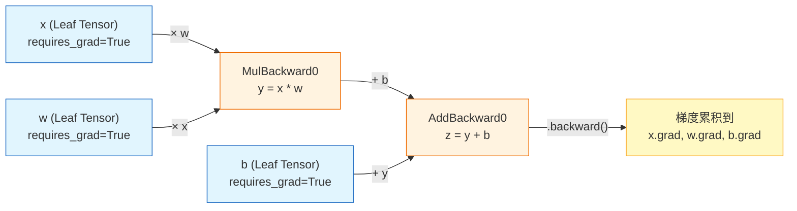
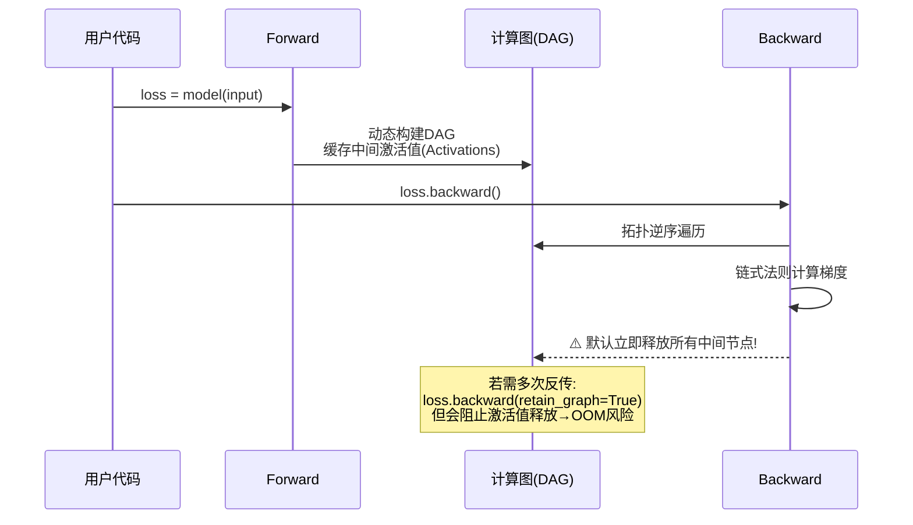
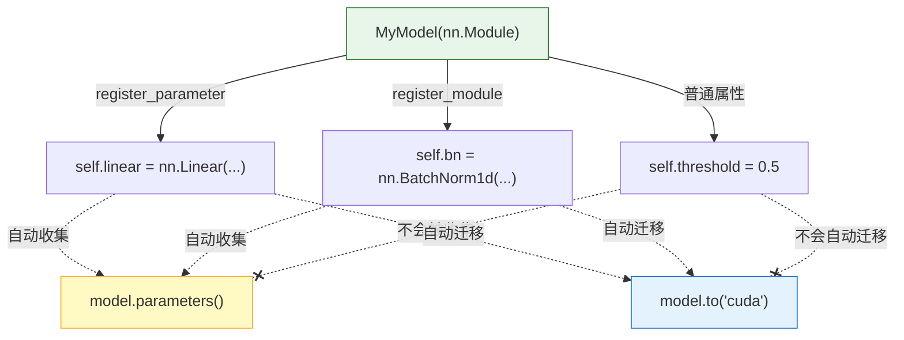
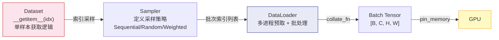
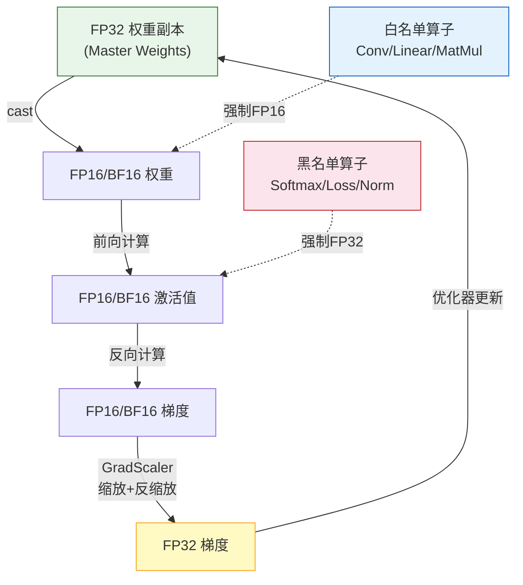
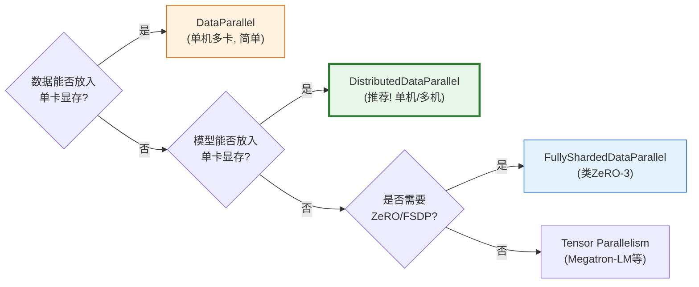
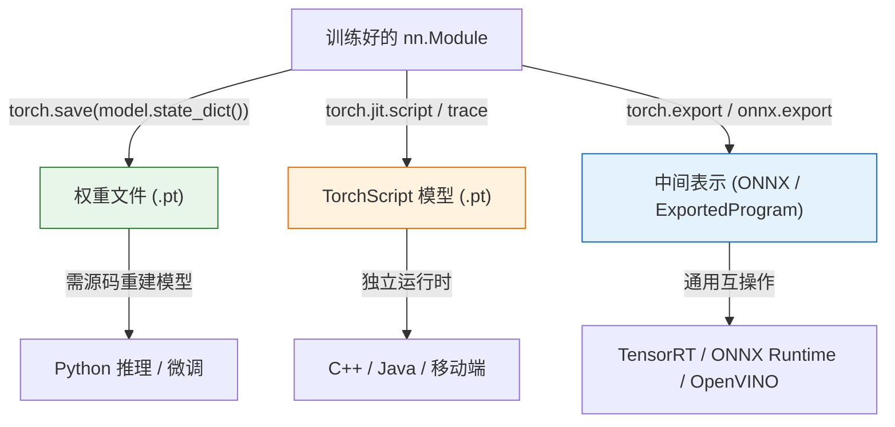

### 一、张量、自动微分与计算图

本阶段是 PyTorch 深度学习体系的基石。在搭建任何神经网络之前，必须深入理解 PyTorch 的两大核心抽象：**张量（Tensor）** 作为数据载体，以及 **自动微分引擎（Autograd）** 作为梯度计算的驱动力。掌握这两者，不仅是学会调用 API，更是为了在后续遇到梯度异常、显存溢出或性能瓶颈时，具备从底层原理出发进行 Debug 的能力。

#### 1. 张量（Tensor）：深度学习的通用数据容器

很多初学者将 Tensor 简单等同于“支持 GPU 的 NumPy 数组”，这种类比虽有助于快速上手，但掩盖了 Tensor 作为深度学习原语的关键特性。Tensor 本质上是一个**支持硬件加速、可追踪梯度、具有特定内存布局的多维数组**。

##### 1.1 核心属性与内存模型

```python
import torch

# 创建一个需要梯度的张量
x = torch.tensor([[1.0, 2.0], [3.0, 4.0]], requires_grad=True)

print(x.shape)      # torch.Size([2, 2])  → 维度信息
print(x.dtype)      # torch.float32       → 数据类型（影响精度与显存占用）
print(x.device)     # cpu                 → 存储设备
print(x.stride())   # (2, 1)              → ⚠️ 内存步长，理解视图操作的关键
print(x.is_contiguous())  # True          → 内存是否连续
```

> **🔍 背景知识：Stride（步长）与内存连续性**  
> Stride 是一个元组，表示沿每个维度移动一个元素时，在底层一维存储中需要跨越的元素个数。例如 `stride=(2,1)` 意味着：行方向走一步跨 2 个元素，列方向走一步跨 1 个元素。
> 
> - **`view()`**：要求 Tensor 在内存中**严格连续**，仅修改元数据（shape/stride），零拷贝。若不连续会直接报错。
> - **`reshape()`**：优先尝试 view，若不连续则**自动拷贝**一份连续副本再 reshape，更安全但有潜在开销。
> - **`transpose()/permute()`**：只改变 stride 而不移动数据，因此结果通常是**非连续**的。后续若需 `view()`，必须先调用 `.contiguous()`。

理解这一点，就能从根本上避免 `"RuntimeError: view size is not compatible with input tensor's size and stride"` 这类高频错误。

##### 1.2 Tensor 与 NumPy 的关键差异

|特性|NumPy ndarray|PyTorch Tensor|实践注意事项|
|:--|:--|:--|:--|
|GPU 加速|❌|✅ `.to('cuda')`|GPU Tensor 不能直接转 NumPy|
|梯度追踪|❌|✅ `requires_grad`|转 NumPy 前需 `.detach()`|
|内存共享|-|CPU 下双向共享|修改一方会影响另一方|
|并行粒度|多线程级|CUDA Kernel 级|小矩阵运算 GPU 未必更快|

> **⚠️ 内存共享陷阱**  
> 当 Tensor 位于 CPU 且 `requires_grad=False` 时，`.numpy()` 和 `torch.from_numpy()` 返回的是**同一块内存的视图**。这在数据预处理中可避免拷贝开销，但也意味着意外修改会相互污染。GPU Tensor 必须先 `.cpu().detach()` 才能安全转换为 NumPy。

#### 2. 自动微分引擎（Autograd）：动态计算图的核心

Autograd 是 PyTorch 区别于早期静态图框架的灵魂所在。它并非简单的符号求导，而是一套**基于有向无环图（DAG）的运行时记录-回放系统**。

##### 2.1 计算图的动态构建过程



**核心概念解析：**

- **Leaf Tensor（叶子节点）**：由用户直接创建且 `requires_grad=True` 的 Tensor。反向传播结束后，梯度**只会**累积到叶子节点的 `.grad` 属性上。中间节点的梯度在传递后即被丢弃。
- **Function Node（函数节点）**：每个可微操作（如乘法、ReLU）都会在图中生成一个 Function 对象，它保存了反向传播所需的上下文（如输入引用、局部变量）。这些节点构成了 DAG 的内部结构。
- **Define-by-Run（动态图）**：计算图在**每次前向传播时实时构建**，而非预先声明。这意味着你可以在 forward 中自由使用 Python 的 `if/else`、`for`、递归等控制流，图的结构可以随输入数据动态变化。这是 PyTorch 在研究和调试中备受青睐的根本原因。

##### 2.2 梯度操作的三大原语

```python
w = torch.tensor(2.0, requires_grad=True)
x = torch.tensor(3.0)
loss = (w * x - 5.0) ** 2

# ① backward()：触发反向传播，梯度累加到叶子节点
loss.backward()
print(w.grad)  # tensor(12.) ← d(loss)/d(w) = 2*(w*x-5)*x

# ② detach()：返回一个新Tensor，与原Tensor共享数据但脱离计算图
# 典型场景：冻结参数、GAN中阻断生成器梯度回传
w_frozen = w.detach()

# ③ torch.no_grad()：上下文管理器，临时禁用梯度追踪
# 典型场景：推理/评估阶段，减少显存占用并跳过图构建
with torch.no_grad():
    pred = w * x  # 不会创建任何Function节点
```

> **💡 关键机制：梯度累积而非覆盖**  
> PyTorch 默认将新计算的梯度**累加**到 `.grad` 上，而非替换。这一设计服务于两个重要场景：RNN 的时间步展开、以及显存受限时的梯度累积训练。但在标准训练循环中，**每次迭代开始前必须清零梯度**（`optimizer.zero_grad()`），否则历史梯度会持续叠加，导致训练迅速发散。

##### 2.3 计算图的生命周期与内存管理



> **🔍 深入理解 `retain_graph`**  
> 默认情况下，`.backward()` 完成后，所有非叶子的 Function 节点及其缓存的中间激活值会被立即销毁以回收显存。在多任务学习、梯度惩罚等需要对同一张图多次反传的场景中，需设置 `retain_graph=True`。但这会导致中间激活值驻留显存，务必谨慎使用，并在不需要时及时释放。

#### 3. 本阶段核心要点速查表

|概念|本质理解|工程实践意义|
|:--|:--|:--|
|Stride|多维索引到一维内存的映射规则|正确使用 view/reshape/transposed|
|Leaf Tensor|梯度积累的终点站|明确 `.grad` 存在于何处|
|Dynamic Graph|运行时构建，支持Python控制流|灵活实现复杂模型逻辑|
|Gradient Accumulation|默认累加，非覆盖|训练循环中必须 zero_grad()|
|detach / no_grad|梯度追踪的开关|推理加速、参数冻结、防止图膨胀|
|retain_graph|延长计算图生命周期|多任务/梯度惩罚场景，注意显存代价|

---

### 二、nn.Module、数据管道与训练范式

如果说第一阶段是理解 PyTorch 的“物理定律”，那么本阶段就是学习如何运用这些定律来“建造机器”。PyTorch 的设计哲学是将神经网络视为**可组合的模块树**，而非扁平的函数序列。掌握 `nn.Module` 的组织方式、高效的数据加载管道以及标准化的训练循环，是从“能跑通代码”迈向“工程化深度学习”的关键一步。

#### 1. nn.Module：一切皆模块

`nn.Module` 是 PyTorch 中所有神经网络层的基类。它不仅仅是一个容器，更是一个**具备状态管理、参数注册和层级序列化能力的智能对象**。

##### 1.1 Module 的内部工作机制



> **🔍 核心机制解析**  
> `nn.Module` 重写了 `__setattr__` 方法。当你在 `__init__` 中执行 `self.xxx = ...` 时：
> 
> - 若赋值对象是 `Parameter` 或 `nn.Module` 子类 → 自动注册到内部 `_parameters` 或 `_modules` 字典中。
> - 若赋值对象是普通 Python 类型（int/float/tensor）→ 仅作为普通属性存储。
> 
> 这意味着 `model.parameters()`、`model.to(device)`、`model.state_dict()` 等方法的递归行为完全依赖于这种自动注册机制。**忘记继承 `nn.Module` 或未正确调用 `super().__init__()` 是导致参数丢失的最常见原因。**

##### 1.2 自定义 Layer 的最佳实践

```python
class ResidualBlock(nn.Module):
    def __init__(self, channels):
        super().__init__()  # ⚠️ 必须首先调用
        self.conv1 = nn.Conv2d(channels, channels, 3, padding=1)
        self.bn1 = nn.BatchNorm2d(channels)
        self.conv2 = nn.Conv2d(channels, channels, 3, padding=1)
        self.bn2 = nn.BatchNorm2d(channels)
        self.relu = nn.ReLU(inplace=True)

    def forward(self, x):
        identity = x  # 保存残差连接
        out = self.relu(self.bn1(self.conv1(x)))
        out = self.bn2(self.conv2(out))
        out += identity  # 残差相加
        return self.relu(out)
```

> **💡 设计原则**
> 
> - **`__init__` 只定义层，`forward` 只定义数据流**：不要在 forward 中创建新层（会导致每次前向都重新初始化参数）。
> - **优先使用内置层**：`nn.Linear`、`nn.Conv2d` 等已经过高度优化且正确处理了参数初始化。
> - **`inplace=True` 慎用**：虽然节省显存，但在涉及梯度计算的操作（如残差连接中的 ReLU）上可能导致反向传播出错，因为原地修改会覆盖前向缓存值。

#### 2. 数据加载管道：Dataset 与 DataLoader

深度学习训练中，GPU 计算往往不是瓶颈，**数据 I/O 才是**。PyTorch 通过 Dataset/DataLoader 分离模式解决了这一问题。

##### 2.1 数据管道的架构



##### 2.2 关键参数调优指南

|参数|作用|推荐配置|注意事项|
|:--|:--|:--|:--|
|`num_workers`|数据预取进程数|CPU 核心数 / GPU 数|过多反而因进程切换降低性能|
|`pin_memory`|锁页内存加速 CPU→GPU 传输|`True`（GPU训练时）|占用额外系统内存|
|`persistent_workers`|保持 worker 进程存活|`True`（epoch > 1 时）|避免每 epoch 重建进程的开销|
|`prefetch_factor`|每个 worker 预取批次倍数|2~4|配合 pin_memory 效果更佳|
|`drop_last`|丢弃最后不完整批次|训练时 `True`|BN 层在小 batch 下统计不稳定|

> **⚠️ 常见性能陷阱**
> 
> - **`num_workers=0`**：数据加载在主进程中串行执行，GPU 大量空闲等待。这是初学者最常见的性能瓶颈。
> - **Dataset 中做重型预处理**：应将耗时操作（解码、增强）放在 `__getitem__` 中由 worker 并行执行，而非在 `__init__` 中一次性加载全部数据到内存。
> - **Windows 兼容问题**：Windows 下多进程 DataLoader 可能因共享内存限制报错，可尝试减少 `num_workers` 或使用 `torch.utils.data.DataLoader(..., multiprocessing_context='spawn')`。

#### 3. 训练循环范式：从模板到最佳实践

PyTorch 没有 Keras 式的 `.fit()` 封装，这赋予了极大的灵活性，也要求开发者自行维护正确的训练流程。

##### 3.1 标准训练循环模板

```python
def train_one_epoch(model, dataloader, optimizer, criterion, device):
    model.train()  # ✅ 切换到训练模式（启用Dropout/BN更新）
    running_loss = 0.0
    
    for inputs, targets in dataloader:
        inputs = inputs.to(device, non_blocking=True)  # ✅ 异步传输
        targets = targets.to(device, non_blocking=True)
        
        # === 前向 + 反向 + 更新 三步曲 ===
        optimizer.zero_grad(set_to_none=True)  # ✅ 比 zero_grad() 更高效
        outputs = model(inputs)
        loss = criterion(outputs, targets)
        loss.backward()
        
        # ✅ 可选：梯度裁剪防止爆炸
        torch.nn.utils.clip_grad_norm_(model.parameters(), max_norm=1.0)
        
        optimizer.step()
        running_loss += loss.item() * inputs.size(0)
    
    return running_loss / len(dataloader.dataset)
```

##### 3.2 容易忽视的关键细节

> **🔍 `model.train()` vs `model.eval()`**  
> 这不是开关梯度追踪的！它控制的是 **Dropout 是否激活** 和 **BatchNorm 是使用批次统计量还是运行均值/方差**。推理时忘记调用 `model.eval()` 会导致结果随机波动；训练时误用 `eval()` 则使 BN 无法学习。
> 
> **🔍 `set_to_none=True` 的优势**  
> `optimizer.zero_grad(set_to_none=True)` 将梯度张量设为 `None` 而非全零张量。这减少了内存分配和清零操作的开销，在大模型训练中可带来约 5-10% 的速度提升。
> 
> **🔍 `non_blocking=True` 的意义**  
> 当数据已放入 pin_memory 时，`to(device, non_blocking=True)` 允许 CPU→GPU 传输与 GPU 计算**异步并行**执行，进一步隐藏数据传输延迟。

#### 4. 本阶段核心要点速查表

|概念|本质理解|工程实践意义|
|:--|:--|:--|
|nn.Module|参数注册 + 层级管理的智能容器|正确组织模型结构，确保参数可被优化器识别|
|Dataset/DataLoader|I/O 与计算的解耦 + 并行预取|消除数据瓶颈，最大化 GPU 利用率|
|train()/eval()|控制层的行为模式，非梯度开关|训练/推理切换时必须正确调用|
|zero_grad(set_to_none)|梯度清零的高效实现|大模型训练中的微优化积累|
|non_blocking + pin_memory|异步数据传输|隐藏 CPU→GPU 传输延迟|
|clip_grad_norm|梯度范数裁剪|稳定训练，防止梯度爆炸导致 NaN|

---

### 三、分布式训练、混合精度与性能调优

当模型规模增大或数据集膨胀时，"能跑通"已不再是目标，"跑得高效"才是核心挑战。本阶段将深入 PyTorch 的高阶工程能力，涵盖显存优化、计算加速及多卡/多机扩展。这些技术是现代深度学习从实验室走向工业级生产的必经之路。

#### 1. 混合精度训练（AMP）：速度与显存的双重红利

混合精度训练并非简单地降低精度，而是一套**智能的数值稳定性保护机制**。它通过在不同算子上动态选择 FP16/BF16 与 FP32，在保证收敛性的前提下大幅提升吞吐量。

##### 1.1 AMP 的工作原理



> **🔍 背景知识：FP16 vs BF16**
> 
> - **FP16**：5位指数 + 10位尾数。动态范围小（最大 ~65504），极易溢出，**必须配合 GradScaler** 使用。在 V100/A100 上有专用 Tensor Core 加速。
> - **BF16**：8位指数 + 7位尾数。动态范围与 FP32 相同，**无需 GradScaler**，数值更稳定。但尾数精度较低，且仅 A100/H100 及以上硬件原生支持。
> 
> **实践建议**：优先尝试 BF16（若硬件支持）；否则使用 FP16 + GradScaler。避免手动 `.half()` 转换整个模型，这会导致 BN 层和 Loss 计算数值不稳定。

##### 1.2 标准 AMP 训练代码

```python
from torch.cuda.amp import autocast, GradScaler

scaler = GradScaler()  # BF16 时可省略

for inputs, targets in dataloader:
    optimizer.zero_grad(set_to_none=True)
    
    with autocast(dtype=torch.bfloat16):  # ✅ 自动选择算子精度
        outputs = model(inputs)
        loss = criterion(outputs, targets)
    
    # ✅ FP16 时必须用 scaler；BF16 可直接 loss.backward()
    scaler.scale(loss).backward()
    scaler.unscale_(optimizer)           # 反缩放后再裁剪梯度
    torch.nn.utils.clip_grad_norm_(model.parameters(), max_norm=1.0)
    scaler.step(optimizer)               # 内部检查 inf/nan，安全才更新
    scaler.update()                      # 动态调整缩放因子
```

> **⚠️ GradScaler 的动态调节机制**  
> Scaler 维护一个缩放因子 `scale_factor`。若检测到梯度中出现 inf/nan，则跳过本次参数更新并将 `scale_factor` 减半；若连续 N 步无异常，则逐步增大 `scale_factor`。这一自适应机制是 AMP 稳定训练的核心保障。

#### 2. 显存优化技术：突破 GPU 内存墙

显存往往是比算力更早触及的瓶颈。以下是按性价比排序的显存优化策略：

|技术|原理|显存节省|速度代价|适用场景|
|:--|:--|:--|:--|:--|
|梯度检查点|前向时丢弃中间激活，反向时重算|30-60%|~20-30% 减速|大模型/长序列首选|
|梯度累积|多个 micro-batch 累积梯度后更新|等效扩大 batch|几乎无|显存不足以容纳目标 batch|
|CPU Offload|将优化器状态/参数卸载到 CPU|大幅释放 GPU|显著减速|极端显存受限|
|DeepSpeed ZeRO|分片存储参数/梯度/优化器状态|线性扩展|通信开销|多卡训练大模型|

> **💡 梯度检查点的正确使用**
> 
> ```python
> from torch.utils.checkpoint import checkpoint
> 
> class LargeModel(nn.Module):
>     def forward(self, x):
>         # ✅ 对显存占用大的模块启用检查点
>         x = checkpoint(self.heavy_block, x, use_reentrant=False)
>         return self.light_head(x)
> ```
> 
> `use_reentrant=False` 是新版推荐写法，支持非叶子节点作为输入且与 `torch.compile` 兼容。旧版 `use_reentrant=True` 要求第一个参数必须是 tensor 且存在诸多限制。

#### 3. 分布式训练：从单卡到集群

PyTorch 提供了多层级的并行抽象，选择合适的策略至关重要。

##### 3.1 并行策略选型指南



> **🔍 DDP vs DataParallel 的本质区别**
> 
> - **DataParallel (DP)**：单进程多线程，主卡负责聚合梯度和分发参数，存在 GIL 竞争和主卡通信瓶颈。**已不推荐用于生产**。
> - **DistributedDataParallel (DDP)**：多进程独立运行，每个 GPU 一个进程。梯度同步采用 Ring AllReduce，通信带宽利用率接近理论上限。**是当前单机/多机训练的事实标准**。

##### 3.2 DDP 启动方式

```bash
# ✅ 推荐：torchrun（弹性启动，容错性好）
torchrun --nproc_per_node=4 train.py

# ❌ 已弃用：torch.distributed.launch
```

> **⚠️ DDP 关键注意事项**
> 
> - 每个进程的 `batch_size` 应为全局 batch_size / world_size。
> - 模型必须在 DDP 包装**之前**移到对应 GPU。
> - 仅 rank 0 执行日志记录、模型保存等非并行操作，避免文件写入冲突。
> - 使用 `DistributedSampler` 确保各进程采样不重叠且覆盖完整数据集。

#### 4. 编译加速：torch.compile

PyTorch 2.0 引入的 `torch.compile` 是新一代性能优化入口，它通过图捕获和算子融合自动生成高效内核。

```python
# ✅ 一行代码启用编译加速
model = torch.compile(model, mode="reduce-overhead")

# mode 选项：
# "default"      → 平衡编译时间与运行速度
# "reduce-overhead" → 最大化推理吞吐（适合部署）
# "max-autotune" → 穷举搜索最优kernel（编译慢，运行最快）
```

> **💡 编译加速的适用边界**
> 
> - **有效场景**：大量小算子组成的模型（Transformer/CNN）、推理服务、固定 shape 的训练。
> - **无效/有害场景**：频繁变长的输入（触发重编译）、大量 Python 控制流、自定义 C++ 扩展未适配。
> - **调试技巧**：设置 `TORCH_LOGS="+inductor"` 查看编译日志和算子融合情况。

#### 5. 本阶段核心要点速查表

|概念|本质理解|工程实践意义|
|:--|:--|:--|
|AMP|算子级精度选择 + 数值保护|训练提速 2-3x，显存节省 30-50%|
|GradScaler|FP16 梯度的动态缩放防溢出|FP16 训练稳定性的安全保障|
|梯度检查点|时间换空间的激活值重计算|大模型训练的显存救命稻草|
|DDP|多进程 + Ring AllReduce|替代 DP 的标准分布式方案|
|torch.compile|JIT 图优化 + 算子融合|PyTorch 2.x 时代的免费性能提升|
|BF16 vs FP16|动态范围 vs 尾数精度的权衡|新硬件优先 BF16，老硬件 FP16+Scaler|

---

### 四、生态与部署

模型训练完成只是深度学习工程的一半，另一半在于如何将其高效、可靠地部署到生产环境。本阶段将覆盖 PyTorch 的核心生态库、模型序列化标准以及跨平台部署技术栈，帮助你打通从 Jupyter Notebook 到线上服务的完整链路。

#### 1. PyTorch 领域生态库：避免重复造轮子

PyTorch 的官方领域库（Domain Libraries）提供了经过高度优化的数据集、预训练模型和专用算子，是工业级项目的起点而非玩具。

|库名|核心能力|典型使用场景|
|:--|:--|:--|
|TorchVision|图像/视频数据集、CNN/Transformer 预训练权重、数据增强|CV 分类/检测/分割|
|TorchText|文本分词器、词汇表构建、NLP 数据集、序列批处理|NLP 文本分类/机器翻译|
|Torchaudio|音频 I/O、频谱变换、语音数据集|ASR/TTS/音频分类|
|TorchData|可组合的数据加载管道、流式数据处理|大规模数据集的高效预处理|

> **💡 实践建议**
> 
> - **优先使用 `weights` API**：TorchVision 0.13+ 引入了新的权重枚举接口（如 `ResNet50_Weights.IMAGENET1K_V2`），替代了旧的 `pretrained=True`，提供更清晰的版本管理和元数据。
> - **TorchData 的迭代式管道**：相比传统 Dataset 的随机访问模式，TorchData 支持流式读取、动态分片和管道级缓存，特别适合 TB 级数据集或云存储场景。

#### 2. 模型序列化：state_dict vs Script vs Export

PyTorch 提供了多种模型持久化方式，选择错误的格式会导致部署失败或性能损失。

##### 2.1 三种序列化范式对比



> **🔍 关键区分**
> 
> - **`state_dict`**：仅保存参数张量，**不包含模型结构**。加载时必须先实例化相同结构的模型类。这是训练检查点和微调的标准格式。
> - **TorchScript**：将 Python 模型编译为与 Python 解耦的 IR。但 `script` 模式对 Python 语法支持有限，`trace` 模式无法捕获控制流。**正逐步被 torch.export 取代**。
> - **ONNX / ExportedProgram**：框架无关的中间表示。ONNX 是当前跨框架部署的事实标准；`torch.export`（PyTorch 2.x）是新一代原生导出方案，与 `torch.compile` 深度集成。

##### 2.2 ONNX 导出最佳实践

```python
# ✅ 推荐：PyTorch 2.x 原生导出路径
import torch.onnx

torch.onnx.export(
    model,
    dummy_input,
    "model.onnx",
    opset_version=17,          # ✅ 选择目标运行时支持的opset
    input_names=["image"],
    output_names=["logits"],
    dynamic_axes={             # ✅ 声明动态维度，避免固定shape限制
        "image": {0: "batch", 2: "height", 3: "width"},
        "logits": {0: "batch"}
    },
    dynamo=True                # ✅ 启用 Dynamo 后端，支持更多算子
)
```

> **⚠️ ONNX 导出的常见陷阱**
> 
> - **Opset 版本不匹配**：导出时使用的 opset 必须 ≤ 目标推理引擎支持的版本。例如 TensorRT 8.6 最高支持 opset 17。
> - **自定义算子**：若模型包含未注册的自定义算子，需通过 `torch.onnx.register_custom_op_symbolic` 手动映射，或改用 ATen 算子重写。
> - **验证导出结果**：务必使用 `onnx.checker.check_model()` 验证图合法性，并用 `onnxruntime.InferenceSession` 对比输出精度。

#### 3. 部署运行时选型指南

模型导出后，选择合适的推理引擎直接决定线上性能。

|运行时|优势|劣势|适用场景|
|:--|:--|:--|:--|
|TorchServe|PyTorch 原生、开箱即用、支持动态批处理|性能非最优|快速上线、内部服务|
|ONNX Runtime|跨框架、CPU/GPU/NPU 广泛支持|部分新算子滞后|通用部署、边缘设备|
|TensorRT|NVIDIA GPU 极致优化、INT8 量化|仅限 NVIDIA、编译耗时|高吞吐 GPU 推理服务|
|Triton Inference Server|多模型编排、动态批处理、指标监控|架构复杂|大规模微服务集群|

> **💡 部署决策树**
> 
> - 需要**最快上线**且对延迟不敏感 → TorchServe
> - 目标硬件**多样化**（CPU/ARM/NPU）→ ONNX Runtime
> - 目标为 **NVIDIA GPU** 且追求极致吞吐 → TensorRT
> - 需要**多模型协同**、A/B 测试、自动扩缩容 → Triton

#### 4. 模型版本管理与可复现性

生产环境中，模型的可追溯性与性能同等重要。

- **元数据嵌入**：在 ONNX 模型的 `metadata_props` 中写入训练 commit hash、数据集版本、评估指标等信息。
- **依赖锁定**：记录导出时的 PyTorch/ONNX/opset 版本号，避免因版本升级导致推理结果漂移。
- **回归测试**：建立自动化流水线，每次模型更新时对比基准输出的数值误差（通常要求相对误差 < 1e-4）。

#### 5. 本阶段核心要点速查表

|概念|本质理解|工程实践意义|
|:--|:--|:--|
|Domain Libraries|领域专用的标准化组件|避免重复实现，保证基线可比性|
|state_dict|纯参数快照，依赖源码|训练存档与微调的唯一正确格式|
|ONNX Export|框架无关的图级中间表示|跨平台部署的通用桥梁|
|dynamic_axes|声明可变维度|使导出模型适应不同batch/分辨率|
|运行时选型|硬件×性能×运维的三角权衡|没有银弹，只有最适合的方案|
|可复现性|元数据 + 版本锁定 + 回归测试|生产环境的信任基础|

---

### 五、练习

理论知识的掌握程度最终需要通过解决实际问题来验证。本阶段精选了覆盖前四个阶段核心知识点的实战练习，旨在帮助你从“看懂文档”跨越到“独立排查与优化”。建议在不查阅资料的情况下先尝试作答，再对照解析查漏补缺。

#### 1. 张量与自动微分诊断题

**题目**：以下代码在执行 `loss.backward()` 后，`w.grad` 为 `None`，但程序未报错。请找出根本原因并给出两种修复方案。

```python
import torch
w = torch.tensor([2.0])
x = torch.tensor([3.0], requires_grad=True)
y = w * x
loss = y.sum()
loss.backward()
print(w.grad)  # None
```

> [!success]- 点击展开题解
> 
> ## 一、问题诊断
> 
> 执行 `loss.backward()` 后，`w.grad` 为 `None` 但程序未报错。让我们先看看代码做了什么：
> 
> ```python
> import torch
> w = torch.tensor([2.0])                     # ① 创建 w，默认 requires_grad=False
> x = torch.tensor([3.0], requires_grad=True) # ② 创建 x，显式要求梯度
> y = w * x                                   # ③ 乘法操作
> loss = y.sum()                              # ④ 求和得到标量
> loss.backward()                             # ⑤ 反向传播
> print(w.grad)                               # ⑥ 输出 None
> ```
> 
> ### 根本原因
> 
> `w` 在创建时**没有设置 `requires_grad=True`**，因此 PyTorch 不会为它构建计算图节点，自然不会记录梯度。`loss.backward()` 只对计算图中标记为需要梯度的叶节点计算梯度并填充 `.grad` 属性，`w` 不在这个范围内，所以 `w.grad` 保持为初始值 `None`。
> 
> 程序不报错是因为这并非语法或运行时错误——PyTorch 允许对包含无需梯度张量的计算图正常执行反向传播，只是那些张量拿不到梯度而已。
> 
> ---
> 
> ## 二、计算图可视化
> 
> 下面用 Mermaid 示意正常情况（`w` 需要梯度）与问题代码的区别：
> 
> ```mermaid
> flowchart LR
>     subgraph A["❌ 问题代码的计算图"]
>         direction TB
>         w1["w\n(requires_grad=False)\n🔒 不记录梯度"] --> mul1["*"]
>         x1["x\n(requires_grad=True)\n✅ 记录梯度"] --> mul1
>         mul1 --> y1["y"] --> loss1["loss"] --> bw1["backward()"]
>     end
> 
>     subgraph B["✅ 修复后的计算图"]
>         direction TB
>         w2["w\n(requires_grad=True)\n✅ 记录梯度"] --> mul2["*"]
>         x2["x\n(requires_grad=True)\n✅ 记录梯度"] --> mul2
>         mul2 --> y2["y"] --> loss2["loss"] --> bw2["backward()"]
>     end
> 
>     style w1 fill:#ffcccc,stroke:#cc0000
>     style w2 fill:#ccffcc,stroke:#009900
> ```
> 
> 左图中 `w` 节点是灰色/红色的“阻断”状态——它参与前向计算，但反向传播时梯度流到此为止，不会存入 `w.grad`。
> 
> ---
> 
> ## 三、背景知识：requires_grad 与叶节点
> 
> ### 3.1 什么是“叶节点”？
> 
> 在 PyTorch 的计算图中，**叶节点**是那些不是由其他张量运算产生的张量——通常就是你亲手创建的张量（如 `w = torch.tensor(...)`）。只有计算图中的叶节点，其 `.grad` 属性才会在 `backward()` 中被自动填充。
> 
> ### 3.2 requires_grad 的传播规则
> 
> 一个张量的 `requires_grad` 决定了两件事：
> 1. **是否记录自身梯度**：反向传播后，该张量的 `.grad` 是否被赋值。
> 2. **是否“传染”下游张量**：任何由一个需要梯度的张量参与运算产生的新张量，其 `requires_grad` 默认为 `True`。
> 
> 在你的代码中：
> - `x.requires_grad = True` → `y` 自动变为 `True` → `loss` 自动变为 `True`。
> - 所以 `loss.backward()` 可以正常执行，且 `x.grad` 会被计算。
> - 但 `w` 本身设为 `False`，故不接收梯度。
> 
> ### 3.3 为什么需要手动设置？
> 
> PyTorch 的默认设计原则是：**输入数据、标签、权重中，只有权重通常需要梯度**。输入 `x` 一般是固定的数据，不需要梯度（你的例子中为了演示才给 `x` 加了 `requires_grad=True`）。默认 `requires_grad=False` 可以节省内存和计算量。
> 
> ---
> 
> ## 四、修复方案
> 
> ### 方案一：创建时显式设置（推荐）
> 
> ```python
> import torch
> w = torch.tensor([2.0], requires_grad=True)  # 👈 直接声明
> x = torch.tensor([3.0])                      # x 通常不需要梯度
> y = w * x
> loss = y.sum()
> loss.backward()
> print(w.grad)  # tensor([3.])
> ```
> 
> **适用场景**：一开始就知道 `w` 需要训练。这也是最常见、最标准的写法。
> 
> ---
> 
> ### 方案二：创建后原地修改属性
> 
> ```python
> import torch
> w = torch.tensor([2.0])
> w.requires_grad_(True)                       # 👈 原地修改
> x = torch.tensor([3.0])
> y = w * x
> loss = y.sum()
> loss.backward()
> print(w.grad)  # tensor([3.])
> ```
> 
> **适用场景**：需要在代码中动态决定是否需要梯度（比如冻结/解冻部分参数）。
> 
> 注意 `requires_grad_(True)` 末尾的下划线 `_` 表示原地操作，会直接修改张量属性并返回自身。
> 
> ---
> 
> ### 梯度验证
> 
> 以本例验证，数学关系为 `loss = w * x`，所以 `∂loss/∂w = x = 3.0`，`∂loss/∂x = w = 2.0`：
> 
> ```python
> print(f"w.grad = {w.grad}")  # w.grad = tensor([3.]) ✅
> print(f"x.grad = {x.grad}")  # x.grad = tensor([2.]) ✅
> ```
> 
> ---
> 
> ## 五、常见误区与避坑指南
> 
> | 误区 | 正确理解 |
> |------|----------|
> | “有 `backward()` 就能拿到所有参数的梯度” | 只有 `requires_grad=True` 的**叶节点**才会被填充 `.grad` |
> | “`w` 参与了计算，自动就会有梯度” | 参与计算只决定前向传播，梯度记录需要显式开启 |
> | “`requires_grad=False` 的张量会导致 `backward()` 报错” | 不会报错，只是跳过这些张量的梯度记录 |
> | “中间张量（非叶节点）的 `.grad` 也会被填充” | 默认情况下，非叶节点的 `.grad` 为 `None`，需调用 `.retain_grad()` 才保留 |
> 
> ---
> 
> ## 六、要点总结
> 
> > 🔑 **核心记忆点**：想要 `tensor.grad` 不为 `None`，必须同时满足两个条件——
> > 1. 该张量是**计算图的叶节点**（你亲手创建的）；
> > 2. 其 `requires_grad` 属性为 **`True`**（创建时或通过 `requires_grad_()` 设置）。
> 
> 本题的 `w` 只满足条件①，不满足条件②，因此梯度为 `None`。两种修复方案的共同目标，就是补上条件②。

#### 2. nn.Module 参数注册陷阱题

**题目**：以下模型在调用 `model.to('cuda')` 后，`self.threshold` 仍在 CPU 上，导致前向传播时报错 "Expected all tensors to be on the same device"。请解释原因并修复。

```python
class MyModel(nn.Module):
    def __init__(self):
        super().__init__()
        self.linear = nn.Linear(10, 1)
        self.threshold = torch.tensor(0.5)  # ⚠️ 问题所在

    def forward(self, x):
        out = self.linear(x)
        return (out > self.threshold).float()
```

> [!success]- 点击展开题解
> **问题核心**：`torch.tensor(0.5)` 创建的张量不是一个 `nn.Parameter`，也没有被注册到模块的 `_parameters` 或 `_buffers` 中，因此 `model.to('cuda')` 无法感知到它的存在，自然不会将它移动到 GPU 上。
> 
> **原因详解**：PyTorch 的 `nn.Module` 只会在调用 `.to()` 时自动迁移两类对象——`nn.Parameter` 和通过 `register_buffer` 注册的持久化张量。`self.threshold` 只是一个普通的 Python 属性，被“遗忘”在了 CPU 上，当它与 GPU 上的 `out` 进行比较时，就会触发设备不一致错误。
> 
> **修复方案一（推荐）：注册为 buffer**
> ```python
> class MyModel(nn.Module):
>     def __init__(self):
>         super().__init__()
>         self.linear = nn.Linear(10, 1)
>         # register_buffer 会将张量注册为模型的一部分，随 .to() 迁移
>         self.register_buffer('threshold', torch.tensor(0.5))
> 
>     def forward(self, x):
>         out = self.linear(x)
>         return (out > self.threshold).float()
> ```
> 
> **修复方案二：注册为 Parameter（若需梯度）**
> ```python
> self.threshold = nn.Parameter(torch.tensor(0.5))
> ```
> 但这会让 `threshold` 变成可学习参数，通常对比阈值不需要梯度，所以方案一更合适。
> 
> **修复方案三：在 forward 中动态创建**
> ```python
> def forward(self, x):
>     out = self.linear(x)
>     threshold = torch.tensor(0.5, device=x.device)
>     return (out > threshold).float()
> ```
> 显式指定设备，但每次前向都会新建张量，效率稍低。
> 
> ---
> 
> ### 深入理解：`nn.Module` 的设备迁移机制
> 
> 把 `nn.Module` 想象成一个行李箱，它只会自动打包自己“登记在册”的物品。下面的示意图展示了这个机制：
> 
> ```mermaid
> flowchart TD
>     A[model.to'cuda' 调用] --> B{遍历内部成员}
>     B --> C[_parameters 字典<br>nn.Parameter 对象]
>     B --> D[_buffers 字典<br>注册的持久化张量]
>     B --> E[子模块<br>递归调用 .to]
>     B --> F[普通属性<br>如 self.threshold]
>     
>     C --> G[✅ 迁移至 GPU]
>     D --> G
>     E --> G
>     F --> H[❌ 留在 CPU]
>     
>     style F fill:#ffcccc,stroke:#ff0000
>     style H fill:#ffcccc,stroke:#ff0000
>     style G fill:#ccffcc,stroke:#00aa00
> ```
> 
> ### Parameter vs Buffer vs 普通属性
> 
> | 类型 | 注册方式 | 是否参与梯度计算 | 是否被 `state_dict()` 保存 | 是否随 `.to()` 迁移 |
> |------|----------|:---:|:---:|:---:|
> | **Parameter** | `nn.Parameter()` 或直接赋值给 `self.xxx`（若 xxx 是 Parameter） | ✅ | ✅ | ✅ |
> | **Buffer** | `self.register_buffer('name', tensor)` | ❌ | ✅ | ✅ |
> | **普通属性** | `self.xxx = tensor` | ❌ | ❌ | ❌ |
> 
> **何时用 Buffer？**
> - 像本题的阈值
> - BatchNorm 的 `running_mean` / `running_var`
> - 词嵌入的固定 lookup 表
> - 任何不需要梯度、但需要与模型同生命周期、同设备的张量
> 
> **最佳实践**：永远不要让 `nn.Module` 中“裸奔”一个张量属性。如果它应该跟随模型迁移和保存，就注册为 buffer；如果它不需要梯度，注册为 buffer 比 Parameter 更节省显存和计算资源。
> 
> ### 扩展：buffer 的持久性设置
> `register_buffer` 还有一个 `persistent` 参数（默认为 `True`）：
> ```python
> # 不保存到 state_dict，但仍然随 .to() 迁移
> self.register_buffer('temp_cache', torch.zeros(100), persistent=False)
> ```
> 这在需要跨设备迁移但不需要 checkpoint 的场景（如训练时的临时统计量）非常有用。

#### 3. DataLoader 性能调优计算题

**题目**：你的训练环境为 8 核 CPU + 单 GPU，数据集包含 100 万张图片，每张解码+增强耗时 5ms，GPU 单 batch（64 张）前向+反向耗时 80ms。当前 `num_workers=0`，GPU 利用率仅 30%。请估算最优 `num_workers` 并说明理由。

> [!success]- 点击展开题解
> ## 一、题目关键信息梳理
>
> | 项目 | 数值 | 说明 |
> |------|------|------|
> | CPU 核心数 | 8 | 可用于数据加载的并行上限 |
> | 数据集规模 | 100万张 | 大容量，I/O压力大 |
> | 单张图片处理耗时 | 5ms | 解码+增强，纯CPU操作 |
> | GPU 处理一个 batch | 80ms | 64张的前向+反向传播 |
> | 当前 `num_workers` | 0 | 主进程自己加载数据 |
> | 当前 GPU 利用率 | 30% | 说明GPU在空转等待数据 |
>
> ---
>
> ## 二、为什么 GPU 利用率只有 30%？（问题本质）
>
> 这里涉及一个经典的生产者-消费者模型：
> - **生产者**：CPU 进程（负责加载、解码、增强图片）
> - **消费者**：GPU（负责前向和反向传播）
>
> 当 `num_workers=0` 时，**主进程自己就是唯一的生产者**。它必须：
> 1. 从磁盘读取图片
> 2. 解码
> 3. 做数据增强
> 4. 拼成 batch
> 5. 送到 GPU 做训练
> 6. 在 GPU 训练期间，**CPU 闲着**
> 7. GPU 完成后，主进程再开始准备下一批数据
>
> 这是一个**严格的串行过程**。我们用 Mermaid 时间线图来直观感受一下：
>
> ```mermaid
> gantt
>     title num_workers=0 时的 CPU/GPU 工作流
>     dateFormat  SSS
>     axisFormat %S
>     section CPU (主进程)
>     加载+增强 batch 1   :a1, 0, 320ms
>     加载+增强 batch 2   :a2, 400, 320ms
>     section GPU
>     训练 batch 1        :b1, 320, 80ms
>     训练 batch 2        :b2, 720, 80ms
> ```
>
> **解读上图**：
> - CPU 需要 64张 × 5ms = **320ms** 来准备一个 batch。
> - GPU 只需要 **80ms** 就能消费完这个 batch。
> - 所以 GPU 有 `(320-80)/320 ≈ 75%` 的时间在空闲等待，利用率只有约 25%。
> - 题目给的 30% 基本吻合这个计算（实际可能有轻微波动）。
>
> **根本原因：数据供给速度远低于 GPU 消费速度。**
>
> ---
>
> ## 三、引入多 worker 后的流水线机制
>
> `num_workers` 实际上开启了**多个子进程**来并行生产数据。
>
> **worker 的作用**：
> - 每个 worker 是一个独立的 Python 进程，在自己的地址空间里跑 `Dataset.__getitem__`。
> - 它们并行地从磁盘读取、解码、增强不同的图片。
> - 主进程负责把这些结果收集、拼装成 batch，喂给 GPU。
> - 关键点：**worker 干活的时候，主进程（或 GPU）也可以同时干活**，实现流水线并行。
>
> ```mermaid
> gantt
>     title num_workers=8 时的理想流水线
>     dateFormat  SSS
>     axisFormat %S
>     section 主进程
>     组装 batch 1         :m1, 0, 10ms
>     组装 batch 2         :m2, 80, 10ms
>     section Worker 1-8
>     并行生产 batch 1     :w1, 0, 40ms
>     并行生产 batch 2     :w2, 40, 40ms
>     并行生产 batch 3     :w3, 80, 40ms
>     section GPU
>     训练 batch 1         :g1, 10, 80ms
>     训练 batch 2         :g2, 90, 80ms
> ```
>
> **理想情况**：当 GPU 在处理当前 batch 时，多个 worker 已经在后台把下个 batch 准备好了。GPU 刚结束就能立即拿到新 batch，实现接近 100% 的利用率。
>
> ---
>
> ## 四、最优 `num_workers` 的估算
>
> ### 4.1 理论上的基本不等式
>
> 设 `num_workers = W`（每个 worker 单次处理 1 张图）。
>
> - **GPU 处理一个 batch 的时间**：`T_gpu = 80ms`
> - **W 个 worker 并行生产 64 张图片的时间**：因为 8 核 CPU 是真正的物理并行上限，W 个 worker 共享 8 个核，理想情况下单个 worker 处理 1 张图耗时 5ms，那 64 张图被 W 个 worker 瓜分，耗时约为 `T_cpu = (64 / min(W, 8)) × 5ms` （忽略调度开销）。
>
> 要保证 GPU 不等待，需要：**在 80ms 内生产完下个 batch**。
>
> ### 4.2 具体计算
>
> | W (num_workers) | 有效并行度 | 生产一个 batch 耗时 | GPU 会等待吗？ |
> |-----------------|------------|---------------------|----------------|
> | 0 | 1 | 64 × 5 = 320ms | 严重等待 |
> | 4 | 4 | (64/4) × 5 = 80ms | 刚好不等待 |
> | 8 | 8 | (64/8) × 5 = 40ms | 提前 40ms 完成 |
> | 16 | 8（被核数限制） | (64/8) × 5 = 40ms | 提前完成，但开销增大 |
>
> **结论**：
> - `W=4` 时，CPU 刚好在 80ms 内完成生产，理论上 GPU 利用率可接近 100%。
> - `W=8` 时，有约 40ms 的缓冲时间，更稳健，可应对 I/O 波动。
> - 再大的 W 不会提升生产速度（受限于 8 个物理核），反而会增加进程间通信、内存占用和上下文切换开销。
>
> ### 4.3 经验法则
>
> 常用公式：**`num_workers = 4 × GPU数量` 到 `CPU核心数` 之间**。
> 本题 GPU 数量=1，核心数=8，因此经验区间是 **[4, 8]**。
>
> 综合考虑 I/O 抖动和 worker 唤醒开销，**推荐 `num_workers = 4` 或 `8`，通常 4 足以让 GPU 满载**。
>
> ---
>
> ## 五、补充：`prefetch_factor` 和 `pin_memory`
>
> 为了使这流水线更顺滑，实践中还会配合两个参数：
>
> - **`prefetch_factor`**（默认 2）：每个 worker 提前多取几张图缓存在内存里，进一步降低 I/O 尖刺。
> - **`pin_memory=True`**：在 CPU 端分配锁页内存，使得 CPU→GPU 的数据拷贝可以用 DMA 异步进行，速度快很多。
>
> 结合本题，推荐典型配置：
> ```python
> DataLoader(
>     dataset,
>     batch_size=64,
>     num_workers=4,       # 或 8
>     prefetch_factor=2,
>     pin_memory=True
> )
> ```
>
> ---
>
> ## 六、总结
>
> 1. **原始问题**：`num_workers=0` 导致 CPU 和 GPU 串行工作，数据生产（320ms/batch）远慢于 GPU 消费（80ms/batch），GPU 利用率仅 30%。
> 2. **解决思路**：开启多个 worker 子进程并行生产数据，使 CPU 准备下一个 batch 的时间小于等于 GPU 处理当前 batch 的时间。
> 3. **最优值**：在 8 核 CPU 下，**`num_workers=4` 即可让 GPU 达到约 100% 利用率**，`num_workers=8` 更稳健，再大无益且有害。
> 4. **工程实践**：配合 `prefetch_factor=2` 和 `pin_memory=True` 获得最佳吞吐。

---

### 背景知识小贴士

- **生产者-消费者模型**：一种经典的并发设计模式，生产者负责生成数据放入缓冲区，消费者从缓冲区取数据处理。在这里，CPU workers 是生产者，GPU 是消费者，DataLoader 的内部队列是缓冲区。
- **GIL（全局解释器锁）**：Python 多线程受限于 GIL，无法利用多核做 CPU 密集型并行。所以 PyTorch 用 `multiprocessing` 开启多个**独立进程**作为 worker，绕开 GIL，真正利用多核。
- **为什么 worker 过多反而变慢？**：每个 worker 进程都需要独立内存空间存放图片（显存拷贝前），进程间通信通过队列进行序列化/反序列化，worker 多了还会导致操作系统频繁上下文切换，这些开销可能吃掉并行带来的收益。

#### 4. 混合精度训练数值异常排查题

**题目**：使用 FP16 + GradScaler 训练时，loss 在若干步后突然变为 NaN，且不再恢复。列出至少三个可能的原因及对应解决方案。

> [!success]- 点击展开题解
> ## 混合精度训练数值异常排查题解
> 
> ### 一、问题背景
> 
> 在使用 FP16（半精度浮点数）+ GradScaler 进行混合精度训练时，我们期望在保持模型精度的同时加速训练。但实践中常遇到 loss 在训练若干步后突然变为 NaN，且后续无法恢复的问题。
> 
> 要理解这个问题，首先需要知道两个核心概念：
> 
> **FP16 的数值范围限制**：FP16 能表示的最大正数约为 65504，最小正规正数约为 6.1×10⁻⁵。超出上限会产生上溢出（变为 Inf），低于下限会产生下溢出（变为 0）。一旦出现 Inf 或 NaN，梯度更新就会崩坏。
> 
> **GradScaler 的工作原理**：它通过将 loss 乘以一个放大因子（scale），使得小梯度值能进入 FP16 的可表示范围，然后在更新参数前再将梯度缩回原值。但 scaler 本身并非万能，某些情况下依然会失效。
> 
> ```mermaid
> flowchart TD
>     A[前向传播: FP16 计算] --> B[得到 FP16 的 loss]
>     B --> C[GradScaler: loss × scale]
>     C --> D[反向传播: 梯度在 FP16 下扩大]
>     D --> E[GradScaler: 梯度 ÷ scale 恢复]
>     E --> F{检查梯度是否含 Inf/NaN}
>     F -->|无异常| G[优化器更新参数]
>     F -->|有异常| H[跳过本次更新, 降低 scale]
>     G --> I[scaler.update]
>     H --> I
> ```
> 
> ---
> 
> ### 二、至少三个可能原因及解决方案
> 
> #### 原因 1：学习率过大或 warmup 设置不当
> 
> **现象分析**：
> 训练初期或学习率峰值阶段，若学习率设置过高，即使在 FP32 下梯度也可能爆炸。在混合精度下，FP16 的数值上限（65504）比 FP32（约 3.4×10³⁸）小得多，更容易在梯度过大时直接溢出为 Inf，进而导致 loss 变为 NaN。
> 
> **解决方案**：
> - 降低基础学习率，或增大 warmup 步数，使模型在 FP16 的数值范围内平稳启动。
> - 启用梯度裁剪，例如设置 `max_norm=1.0`，在 scaler 还原梯度后、更新参数前对梯度范数进行限制。
> - 检查 scaler 的动态调整是否正常，PyTorch 默认的 `GradScaler` 会在连续无溢出步骤后逐步增大 scale，但若学习率过大导致频繁溢出，scale 会持续缩小，最终可能让所有梯度下溢为 0，训练停滞。
> 
> ---
> 
> #### 原因 2：某些操作在 FP16 下数值不稳定
> 
> **现象分析**：
> 并非所有算子都对 FP16 友好。以下几类操作尤为敏感：
> 
> - **Softmax 在大维度上的计算**：若某维度的输入值偏大（如 10~20），指数运算 `exp(x)` 在 FP16 下极易超过 65504 而溢出。例如 `exp(12) ≈ 162754` 就已超过 FP16 上限。
> - **LayerNorm / BatchNorm**：涉及方差计算时，若输入方差极小，`1/√(var+ε)` 可能导致除法下溢出或产生极大值。
> - **Attention 中的 Q·Kᵀ/√d 缩放**：若 d 较大或 Q·K 内积值本身很大，除以 √d 后仍可能超出范围。
> 
> **解决方案**：
> - 对这些敏感操作强制使用 FP32 计算。PyTorch 的 `autocast` 已默认将 Softmax、LayerNorm 等列入 FP32 白名单，但自定义模型需手动指定。
> - 检查模型实现，确保 `autocast` 上下文正确包裹了前向传播，且没有在 FP16 域外执行这些操作。
> - 对于自定义损失函数，若涉及 `exp`、`log` 等运算，也应显式转为 FP32 计算。
> 
> ---
> 
> #### 原因 3：损失函数数值范围或输入异常
> 
> **现象分析**：
> 损失函数是 NaN 的直接来源。常见情况包括：
> 
> - **交叉熵损失中的 `log(0)`**：若模型预测概率经 softmax 后某些类别概率为 0（FP16 下溢出导致），取对数时得到 -Inf，后续运算产生 NaN。
> - **自定义损失中的除法**：若分母出现 0 或极小值，FP16 下除零立即产生 Inf/NaN。
> - **回归任务中标签与预测值量级差异过大**：MSE 等损失在预测值与真实值相差过大时，平方运算可能溢出。
> 
> **解决方案**：
> - 损失函数计算全程使用 FP32。在 PyTorch 中，可以在 `autocast` 外部、或在损失函数内部强制 `.float()` 计算。
> - 对预测值添加一个极小的 `eps`（如 1e-7），防止 `log(0)` 或除零。
> - 检查数据预处理管线，确保标签和输入数据的数值范围合理，不包含异常值（如极大或 NaN 标签）。
> 
> ---
> 
> #### 原因 4（补充）：Scale 因子动态调整失效
> 
> **现象分析**：
> GradScaler 的动态增长策略是：连续 N 步无溢出后，scale 乘以 `growth_factor`（默认 2.0）。若模型在某阶段梯度逐渐增大，scale 可能被放大到 65504 甚至更高，导致下一次前向或反向时 loss 值本身被放大到溢出。同时，溢出后 scale 会缩小，但若问题反复，训练无法稳定。
> 
> **解决方案**：
> - 设置 `GradScaler` 的 `growth_interval` 更长（如默认 2000 改为更大值），让 scale 增长更保守。
> - 限制 scale 的上限，通过 `scaler.set_growth_factor()` 或手动 clamp。
> - 若观察到 scale 频繁波动且无法稳定，考虑暂时禁用动态增长，使用固定 scale 值（如 128.0 或 256.0）进行调试。
> 
> ---
> 
> ### 三、排查流程总结
> 
> 下面给出一个系统性的排查流程图，帮助快速定位问题：
> 
> ```mermaid
> flowchart TD
>     A[Loss 突然变为 NaN] --> B{NaN 出现在训练哪一阶段？}
>     B -->|前几步就出现| C[检查学习率与 warmup]
>     B -->|训练中期突然出现| D{检查近期 loss 与梯度趋势}
>     D -->|loss 在增大| E[疑似梯度爆炸]
>     D -->|loss 平稳后突变| F[检查数据批次是否含异常值]
>     E --> G[降低学习率 / 增加梯度裁剪]
>     F --> H[检查数据管线与标签]
>     B -->|持续出现| I[检查特定算子数值稳定性]
>     I --> J[强制敏感操作用 FP32]
>     J --> K[检查损失函数实现]
>     
>     C --> L{是否使用 AMP 默认设置？}
>     L -->|是| M[调整 optimizer 与 scaler 参数]
>     L -->|否| N[确认 autocast 配置正确]
> ```
> 
> ---
> 
> ### 四、核心要点回顾
> 
> | 可能原因 | 关键特征 | 解决方案 |
> |---------|---------|---------|
> | 学习率过大 | 训练初期或峰值时 NaN | 降低 lr、增加 warmup、梯度裁剪 |
> | 算子 FP16 不稳定 | Softmax / Norm 等特定层后 NaN | 这些层强制 FP32 计算 |
> | 损失函数数值问题 | log(0)、除零等 | 损失函数全程 FP32、加 eps |
> | Scale 动态增长过度 | Scale 值很大时突然溢出 | 限制 scale 上限、保守增长策略 |
> 
> 掌握这些排查方法后，大多数混合精度训练的 NaN 问题都能迎刃而解。建议在实际训练中开启 PyTorch 的异常检测 (`torch.autograd.set_detect_anomaly(True)`) 来精确定位首次出现 NaN 的操作位置，这在调试阶段尤为有效。

#### 5. 部署导出兼容性判断题

**题目**：判断以下关于 ONNX 导出的说法是否正确，并简要说明理由。

1. 导出的 ONNX 模型可以在任意版本的 ONNX Runtime 上运行。
2. `torch.jit.trace` 可以正确导出包含 `if x.shape[0] > 1:` 分支的模型。
3. 导出时指定 `dynamic_axes={"input": {0: "batch"}}` 后，推理时 batch size 必须与导出时的 dummy_input 一致。

> [!success]- 点击展开答案
> **题目**：判断以下关于 ONNX 导出的说法是否正确，并简要说明理由。
> 
> 1. 导出的 ONNX 模型可以在任意版本的 ONNX Runtime 上运行。
> 2. `torch.jit.trace` 可以正确导出包含 `if x.shape[0] > 1:` 分支的模型。
> 3. 导出时指定 `dynamic_axes={"input": {0: "batch"}}` 后，推理时 batch size 必须与导出时的 dummy_input 一致。
>
> ---
>
> ## 题解
>
> ### 背景知识：ONNX 与模型导出的核心概念
>
> 在深入判断题之前，我们先梳理几个关键背景知识，这有助于理解题目背后的设计思想。
>
> **什么是 ONNX？**
> ONNX（Open Neural Network Exchange，开放神经网络交换格式）是一种开放的模型表示格式，目的是让模型能在不同框架（如 PyTorch、TensorFlow）和运行引擎（如 ONNX Runtime、TensorRT）之间无缝迁移。可以把它理解为深度学习界的“PDF”——它固定了模型的结构和计算图，但运行它的“阅读器”（Runtime）可以不同。
>
> **两种导出方式的本质区别：trace 与 script**
> PyTorch 导出 ONNX 主要依赖 `torch.onnx.export()`，其内部通常采用 `torch.jit.trace` 或 `torch.jit.script` 来生成 TorchScript 中间表示，再转换为 ONNX。
>
> - **Trace（追踪）**：给定一个具体输入（dummy_input），实际运行一次前向传播，记录下执行过的所有张量操作，固化成一个静态计算图。它 **只看到一条执行路径**。
> - **Script（脚本）**：直接解析 Python 代码的抽象语法树（AST），将控制流（如 `if`、`for`）也编译进计算图。它 **能理解所有分支逻辑**。
>
> 下面这张图用 Mermaid 示意了二者的区别：
>
> ```mermaid
> flowchart TD
>     A[PyTorch 模型<br>含 if x.shape[0] > 1 分支] --> B{导出方式}
>     
>     B -->|torch.jit.trace| C[给定 dummy_input<br>实际运行一次]
>     C --> D[记录单条执行路径<br>固化静态计算图]
>     D --> E[❌ 丢失未触发的分支]
>     
>     B -->|torch.jit.script| F[解析 Python 源代码]
>     F --> G[编译所有控制流<br>生成带分支的计算图]
>     G --> H[✅ 保留全部 if/else 逻辑]
> ```
>
> **动态轴（Dynamic Axes）是什么？**
> 默认情况下，trace 用到的 `dummy_input` 的形状会被“写死”进计算图。如果希望导出的模型能接受可变尺寸的输入（尤其是 batch size 可变），就需要在导出时声明 `dynamic_axes`。它告诉 ONNX：“这个维度的尺寸不是常量，推理时可以变化”。
>
> ---
>
> ### 逐题解析
>
> #### 第一题
> **说法**：导出的 ONNX 模型可以在任意版本的 ONNX Runtime 上运行。
>
> **判断**：❌ **错误**
>
> **理由**：
> ONNX 规范自身是有版本的（称为 opset version，算子集版本）。每次规范更新都可能新增算子、修改算子定义或弃用旧算子。导出模型时会指定一个 `opset_version`（比如 opset 11、opset 17）。
>
> ONNX Runtime（ORT）同样有自己的版本，每个版本的 ORT 只支持一定范围内的 opset。如果将使用了高版本 opset 特性的模型放到旧版 ORT 上运行，就可能遇到 **“Operator xxx not supported”** 的报错。
>
> **通俗理解**：这好比一个用 Word 2024 新功能保存的 `.docx` 文件，无法保证能被 Word 2010 完整打开。向后兼容是有限度的，不能跨越多代的“代沟”。
>
> ---
>
> #### 第二题
> **说法**：`torch.jit.trace` 可以正确导出包含 `if x.shape[0] > 1:` 分支的模型。
>
> **判断**：❌ **错误**
>
> **理由**：
> `torch.jit.trace` 的核心机制是“执行并记录”。它会用你提供的 `dummy_input` 真实地跑一遍前向代码。在这个过程中，`if x.shape[0] > 1:` 这个条件表达式会被 Python 解释器 **直接求值**（因为 `dummy_input` 就是一个具体的张量，`shape[0]` 是个具体的数）。
>
> 假如 `dummy_input` 的 batch size 是 1，那么条件为 `False`，代码会走入 `else` 分支。trace 只会记录 `else` 分支里的张量操作，而 **完全忽略 `if` 分支**。最终导出的 ONNX 模型就只剩下 `else` 那条路，推理时哪怕你输入 batch size 为 8 的 tensor，它也永远不会进入 `if` 分支了。
>
> **正确的做法**：对于包含动态控制流的模型，应使用 `torch.jit.script` 导出，或者将条件逻辑改写成等价的张量运算形式（如 `torch.where`）。
>
> ---
>
> #### 第三题
> **说法**：导出时指定 `dynamic_axes={"input": {0: "batch"}}` 后，推理时 batch size 必须与导出时的 dummy_input 一致。
>
> **判断**：❌ **错误**
>
> **理由**：
> 这道题刚好考查对 `dynamic_axes` 作用的理解。`dynamic_axes` 的语义恰恰是：**“此维度不再是固定值，允许在推理时动态变化”**。
>
> 具体来说，`{"input": {0: "batch"}}` 告诉 ONNX：输入张量 `input` 的第 0 维名字叫 `"batch"`，且该维度是动态的。后续用 ONNX Runtime 加载模型推理时，你可以传入 batch size 为 1、4、16 等任意正整数的输入，只要其它未标为动态的维度保持不变即可。
>
> 如果说法是“必须一致”，那反而违背了设置动态轴的初衷——那和不设置动态轴（静态 shape）没有区别了。
>
> ---
>
> ### 总结提炼
>
> | 题号 | 核心考点 | 判断 | 一句话要点 |
> |:---:|:---|:---:|:---|
> | 1 | ONNX 与 Runtime 的版本兼容性 | ❌ | 高版本 opset 的模型无法保证在低版本 ORT 上运行 |
> | 2 | `trace` 对控制流的局限性 | ❌ | trace 只记录实际走到的分支，动态条件分支会丢失 |
> | 3 | `dynamic_axes` 的真实语义 | ❌ | 声明动态轴正是为了让该维度在推理时可以自由变化 |
>
> 这三题本质上是在考察开发者是否真正理解模型导出中“静态图”与“动态图”的鸿沟，以及跨平台部署时版本匹配的重要性。希望对你的学习有帮助！

#### 6. 综合实战项目

完成上述练习后，建议通过以下迷你项目整合全部知识：

> **🎯 项目：从零构建一个图像分类服务**
> 
> 1. 使用 TorchVision 加载 CIFAR-10，自定义 Dataset 实现数据增强
> 2. 搭建 ResNet-18，使用 AMP + 梯度检查点进行训练
> 3. 实现 DDP 双卡训练，对比 DP 的速度差异
> 4. 导出 ONNX 模型，用 ONNX Runtime 验证精度
> 5. 用 TorchServe 封装为 REST API，编写压测脚本测量 QPS

该项目覆盖了张量操作、Module 设计、数据管道、AMP、DDP、ONNX 导出和服务部署全流程，是检验 PyTorch 综合能力的最佳试金石。

> [!success]- 点击展开题解
> # 从零构建图像分类服务：完整题解
> 
> 本项目覆盖 PyTorch 工程化的全链路，从数据加载到服务部署。本指南将分五个部分逐一拆解，并提供关键代码片段与原理说明。
> 
> ## 项目总览与技术架构
> 
> 在开始编码前，先通过一张图理解各模块的协作关系：
> 
> ```mermaid
> graph TD
>     A[原始 CIFAR-10 数据] --> B[自定义 Dataset<br/>数据增强]
>     B --> C[DataLoader<br/>多进程加载]
>     C --> D{训练策略选择}
>     D --> E[单卡训练<br/>AMP + 梯度检查点]
>     D --> F[DDP 双卡训练<br/>对比 DP]
>     E --> G[模型检查点 .pth]
>     F --> G
>     G --> H[导出 ONNX]
>     H --> I[ONNX Runtime 验证精度]
>     G --> J[TorchServe 封装]
>     J --> K[REST API]
>     K --> L[压测 QPS]
> ```
> 
> **背景知识补充**：CIFAR-10 是 10 分类的 32×32 彩色图像数据集，包含 5 万训练样本和 1 万测试样本，是图像分类的经典基准。
> 
> ---
> 
> ## 一、自定义 Dataset 与数据增强
> 
> ### 1.1 为什么需要自定义 Dataset？
> 
> TorchVision 内置的 `CIFAR10` 类虽方便，但自定义 `Dataset` 能让我们更灵活地控制增强策略。核心是继承 `torch.utils.data.Dataset` 并实现 `__len__` 和 `__getitem__` 两个方法。
> 
> ### 1.2 增强策略设计
> 
> CIFAR-10 图像分辨率低（32×32），不宜做过度裁剪。推荐组合：
> - **训练集**：随机水平翻转 + 随机裁剪（padding=4 后切回 32）+ 颜色抖动 + 归一化
> - **验证集**：仅归一化
> 
> ```python
> import torch
> from torch.utils.data import Dataset, DataLoader
> from torchvision import transforms
> from torchvision.datasets import CIFAR10
> from PIL import Image
> import numpy as np
> 
> class CIFAR10Augmented(Dataset):
>     """带数据增强的 CIFAR-10 数据集"""
>     
>     def __init__(self, root='./data', train=True, transform=None):
>         self.dataset = CIFAR10(root=root, train=train, download=True)
>         self.transform = transform
>         
>     def __len__(self):
>         return len(self.dataset)
>     
>     def __getitem__(self, idx):
>         img, label = self.dataset[idx]
>         if self.transform:
>             img = self.transform(img)
>         return img, label
> 
> # 训练集增强流水线
> train_transform = transforms.Compose([
>     transforms.RandomCrop(32, padding=4),      # 先 padding 再随机裁回 32
>     transforms.RandomHorizontalFlip(p=0.5),
>     transforms.ColorJitter(brightness=0.2, contrast=0.2, saturation=0.2, hue=0.1),
>     transforms.ToTensor(),
>     transforms.Normalize((0.4914, 0.4822, 0.4465), (0.2470, 0.2435, 0.2616))
> ])
> 
> # 验证集仅做归一化
> val_transform = transforms.Compose([
>     transforms.ToTensor(),
>     transforms.Normalize((0.4914, 0.4822, 0.4465), (0.2470, 0.2435, 0.2616))
> ])
> ```
> 
> > **解释**：Normalize 的三个通道均值和标准差是 CIFAR-10 的经验统计值，使用它们可使数据分布接近标准正态分布，加速收敛。
> 
> ---
> 
> ## 二、搭建 ResNet-18 并集成 AMP + 梯度检查点
> 
> ### 2.1 模型搭建
> 
> ResNet-18 的核心是残差块，TorchVision 已提供现成实现，但为了学习建议自行搭建或使用 `torchvision.models.resnet18` 并微调：
> 
> ```python
> import torchvision.models as models
> 
> def build_resnet18(num_classes=10):
>     model = models.resnet18(weights=None)  # 不加载预训练权重
>     model.conv1 = torch.nn.Conv2d(3, 64, kernel_size=3, stride=1, padding=1, bias=False)
>     model.maxpool = torch.nn.Identity()     # CIFAR-10 图像小，去掉初始最大池化
>     model.fc = torch.nn.Linear(512, num_classes)
>     return model
> ```
> 
> > **为什么去掉 maxpool？** 标准 ResNet 的 conv1 是 7×7 卷积 + stride=2 池化，对 32×32 图像会过度降采样。改为 3×3 卷积 + stride=1 并去除池化，保留更多空间信息。
> 
> ### 2.2 自动混合精度（AMP）训练
> 
> AMP 使用 FP16 加速计算，同时保留关键权重为 FP32，几乎不损失精度。
> 
> ```python
> from torch.cuda.amp import autocast, GradScaler
> 
> def train_one_epoch(model, dataloader, optimizer, criterion, device, scaler):
>     model.train()
>     total_loss = 0.0
>     
>     for images, labels in dataloader:
>         images, labels = images.to(device), labels.to(device)
>         optimizer.zero_grad()
>         
>         with autocast():  # 前向传播使用 FP16
>             outputs = model(images)
>             loss = criterion(outputs, labels)
>         
>         scaler.scale(loss).backward()  # 梯度缩放，防止下溢
>         scaler.step(optimizer)
>         scaler.update()
>         
>         total_loss += loss.item()
>     
>     return total_loss / len(dataloader)
> ```
> 
> > **梯度缩放原理**：FP16 的动态范围小，小梯度可能变为零（下溢）。GradScaler 在反向传播前将 loss 乘以一个大系数，使梯度进入 FP16 的可表示范围，更新前再缩放回来。
> 
> ### 2.3 梯度检查点
> 
> 用计算换显存：不保存中间激活，反向传播时重新计算。
> 
> ```python
> from torch.utils.checkpoint import checkpoint
> 
> class CheckpointResNetBlock(torch.nn.Module):
>     def __init__(self, block):
>         super().__init__()
>         self.block = block
>     
>     def forward(self, x):
>         # 使用 checkpoint 包装残差块的前向过程
>         return checkpoint(self.block, x, use_reentrant=False)
> ```
> 
> 对于完整的 ResNet-18，可以将每个 layer 的残差块替换为上述包装。结合 AMP 和梯度检查点，显存占用可降低 40%-60%。
> 
> ---
> 
> ## 三、DDP 双卡训练与 DP 速度对比
> 
> ### 3.1 理解 DDP 与 DP 的核心区别
> 
> ```mermaid
> flowchart LR
>     subgraph DP模式
>         A1[GPU0: 主卡] -->|广播参数| B1[GPU1]
>         B1 -->|梯度汇总到 GPU0| A1
>     end
>     
>     subgraph DDP模式
>         A2[GPU0] <-->|AllReduce 同步梯度| B2[GPU1]
>         C2[各自独立<br/>前向+反向] 
>     end
> ```
> 
> | 特性 | DataParallel (DP) | DistributedDataParallel (DDP) |
> |------|-------------------|-------------------------------|
> | 通信方式 | 主卡收集，Python 线程调度 | 各卡独立 AllReduce，C++ 实现 |
> | 负载均衡 | 主卡负载重 | 负载均匀 |
> | 加速效率 | 单卡约 1.5×（双卡） | 单卡约 1.8-1.9×（双卡） |
> | GIL 影响 | 受限于 Python GIL | 多进程，不受 GIL 限制 |
> 
> ### 3.2 DDP 训练脚本骨架
> 
> ```python
> import torch.distributed as dist
> from torch.nn.parallel import DistributedDataParallel as DDP
> import torch.multiprocessing as mp
> 
> def main_worker(rank, world_size):
>     # 1. 初始化进程组
>     dist.init_process_group(backend='nccl', rank=rank, world_size=world_size)
>     torch.cuda.set_device(rank)
>     
>     # 2. 模型 + DDP 包装
>     model = build_resnet18().to(rank)
>     model = DDP(model, device_ids=[rank])
>     
>     # 3. DistributedSampler 确保各卡数据不重复
>     train_sampler = torch.utils.data.distributed.DistributedSampler(
>         train_dataset, num_replicas=world_size, rank=rank
>     )
>     train_loader = DataLoader(train_dataset, sampler=train_sampler, batch_size=128)
>     
>     # 4. 训练循环中设置 epoch（让每 epoch 的 shuffle 顺序一致）
>     for epoch in range(epochs):
>         train_sampler.set_epoch(epoch)
>         train_one_epoch(model, train_loader, optimizer, criterion, rank, scaler)
>     
>     dist.destroy_process_group()
> 
> # 启动训练
> mp.spawn(main_worker, args=(2,), nprocs=2)
> ```
> 
> ### 3.3 速度对比实验设计
> 
> ```python
> import time
> 
> def benchmark_dp(model, dataloader, epochs=5):
>     model = torch.nn.DataParallel(model)
>     start = time.time()
>     # ... 训练循环
>     return time.time() - start
> 
> def benchmark_ddp(model, dataloader, epochs=5):
>     # 使用上述 DDP 代码，记录 rank=0 的总时间
>     pass
> 
> # 预期结果：DDP 比 DP 快 15%-25%（取决于 batch size 和 GPU 型号）
> ```
> 
> ---
> 
> ## 四、导出 ONNX 并用 ONNX Runtime 验证精度
> 
> ### 4.1 ONNX 导出
> 
> ```python
> def export_to_onnx(model, save_path='resnet18_cifar10.onnx'):
>     model.eval()
>     dummy_input = torch.randn(1, 3, 32, 32, device='cuda')
>     
>     torch.onnx.export(
>         model,
>         dummy_input,
>         save_path,
>         export_params=True,          # 保存模型参数
>         opset_version=14,            # ONNX 操作集版本
>         input_names=['input'],
>         output_names=['output'],
>         dynamic_axes={               # 支持动态 batch
>             'input': {0: 'batch_size'},
>             'output': {0: 'batch_size'}
>         }
>     )
>     print(f"ONNX 模型已保存至 {save_path}")
> ```
> 
> > **opset_version 选择**：版本越高支持的算子越新，但可能降低兼容性。opset 14 对 ResNet 结构支持良好，ONNX Runtime 完全兼容。
> 
> ### 4.2 ONNX Runtime 精度验证
> 
> ```python
> import onnxruntime as ort
> import numpy as np
> 
> def validate_onnx(onnx_path, test_loader, device='cpu'):
>     # 1. 创建 ONNX Runtime 会话
>     session = ort.InferenceSession(onnx_path, providers=['CUDAExecutionProvider'])
>     
>     correct, total = 0, 0
>     for images, labels in test_loader:
>         # 2. 准备输入（需转为 numpy）
>         ort_inputs = {session.get_inputs()[0].name: images.numpy()}
>         
>         # 3. 推理
>         ort_outputs = session.run(None, ort_inputs)
>         predictions = np.argmax(ort_outputs[0], axis=1)
>         
>         correct += (predictions == labels.numpy()).sum()
>         total += labels.size(0)
>     
>     print(f"ONNX 精度: {100 * correct / total:.2f}%")
>     return correct / total
> ```
> 
> **精度对比标准**：ONNX 模型与 PyTorch 原模型的 Top-1 准确率差异应在 ±0.5% 以内。若差异过大，检查 Normalize 层是否正确导出、数据预处理是否一致。
> 
> ---
> 
> ## 五、TorchServe 部署与 QPS 压测
> 
> ### 5.1 TorchServe 封装流程
> 
> TorchServe 要求提供 `.mar`（Model Archive）文件，包含模型权重和自定义 Handler。
> 
> **目录结构**：
> ```
> model_store/
> ├── cifar10_handler.py          # 自定义处理器
> └── resnet18_cifar10.mar        # 打包后的模型归档
> ```
> 
> **Handler 实现**：
> ```python
> # cifar10_handler.py
> import torch
> from torchvision import transforms
> from ts.torch_handler.base_handler import BaseHandler
> from PIL import Image
> import io
> 
> class CIFAR10Handler(BaseHandler):
>     def __init__(self):
>         self.transform = transforms.Compose([
>             transforms.Resize(32),
>             transforms.ToTensor(),
>             transforms.Normalize((0.4914, 0.4822, 0.4465), (0.2470, 0.2435, 0.2616))
>         ])
>     
>     def preprocess(self, data):
>         """将 HTTP 请求的图片转为 Tensor"""
>         images = []
>         for row in data:
>             image = row.get('data') or row.get('body')
>             if isinstance(image, bytes):
>                 image = Image.open(io.BytesIO(image)).convert('RGB')
>             images.append(self.transform(image).unsqueeze(0))
>         return torch.cat(images)
>     
>     def postprocess(self, inference_output):
>         """返回 JSON 格式的分类结果"""
>         probs = torch.nn.functional.softmax(inference_output[0], dim=1)
>         _, predicted = torch.max(probs, 1)
>         return [{'class': int(p), 'confidence': float(c)} 
>                 for p, c in zip(predicted, probs.max(dim=1)[0])]
> ```
> 
> **打包与启动命令**：
> ```bash
> # 创建模型归档
> torch-model-archiver --model-name cifar10_resnet18 \
>     --version 1.0 \
>     --serialized-file best_model.pth \
>     --handler cifar10_handler.py \
>     --export-path model_store
> 
> # 启动 TorchServe
> torchserve --start --model-store model_store --models cifar10=cifar10_resnet18.mar
> 
> # 查看 API 状态
> curl http://localhost:8081/models
> ```
> 
> ### 5.2 压测脚本与 QPS 测量
> 
> 使用 Python 的 `concurrent.futures` 模拟并发请求：
> 
> ```python
> import requests
> import time
> from concurrent.futures import ThreadPoolExecutor
> 
> def send_request(image_path):
>     with open(image_path, 'rb') as f:
>         response = requests.post(
>             'http://localhost:8080/predictions/cifar10',
>             files={'data': f}
>         )
>     return response.json()
> 
> def stress_test(image_path, num_requests=1000, concurrency=16):
>     start = time.time()
>     
>     with ThreadPoolExecutor(max_workers=concurrency) as executor:
>         futures = [executor.submit(send_request, image_path) 
>                    for _ in range(num_requests)]
>         results = [f.result() for f in futures]
>     
>     elapsed = time.time() - start
>     qps = num_requests / elapsed
>     print(f"总请求: {num_requests}, 并发数: {concurrency}")
>     print(f"总耗时: {elapsed:.2f}s, QPS: {qps:.2f}")
>     return qps
> ```
> 
> ### 5.3 性能优化建议
> 
> | 优化方向 | 具体措施 | 预期提升 |
> |----------|---------|---------|
> | 模型层面 | ONNX + TensorRT 加速 | 2-3× |
> | 服务层面 | TorchServe 增加 worker 数 | 线性扩展 |
> | 批处理 | 客户端合并请求或开启服务端动态 batching | 1.5-2× |
> | 硬件层面 | 使用更高算力 GPU 或 CPU 多实例 | 视硬件而定 |
> 
> ---
> 
> ## 常见问题与排错指南
> 
> 1. **AMP 训练时 Loss 变为 NaN**：降低学习率或增加 warmup；检查 GradScaler 的 `scale` 是否过大。
> 2. **DDP 训练卡死**：确保所有进程的 `DistributedSampler.set_epoch()` 被正确调用，数据加载器 `num_workers>0` 时需配合 `persistent_workers=True`。
> 3. **ONNX 导出精度下降**：确认导出前调用了 `model.eval()`，且测试集预处理与训练时一致（尤其是 Normalize 参数）。
> 4. **TorchServe 推理超时**：修改 `config.properties` 中的 `default_response_timeout` 和 `default_worker_timeout`。
> 
> ---
> 
> ## 总结与拓展方向
> 
> 本项目的五个模块形成了完整的"训练→导出→部署"闭环。掌握这一流程后，可以尝试：
> - **模型量化**：用 PyTorch 的量化工具进一步压缩模型
> - **Triton Inference Server**：替代 TorchServe，支持更复杂的多模型编排
> - **MLOps 集成**：加入 MLflow 跟踪实验、用 Docker 容器化部署
> - **边缘端部署**：转为 TensorFlow Lite 或 Core ML 在移动端运行
> 
> 这些扩展将帮助你在工业级深度学习工程中游刃有余。

---


