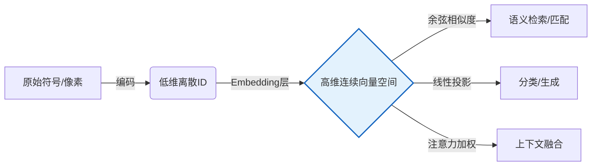
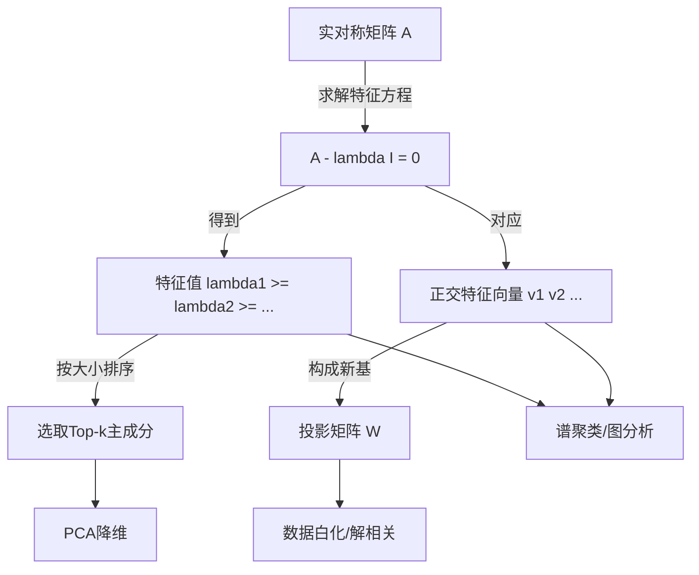
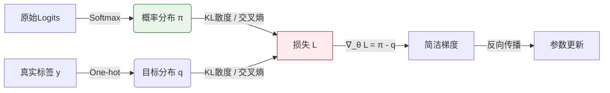
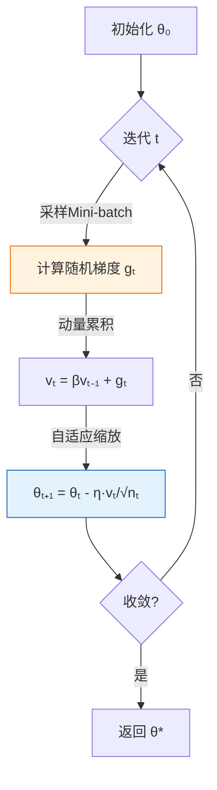
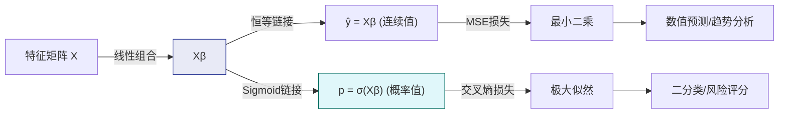
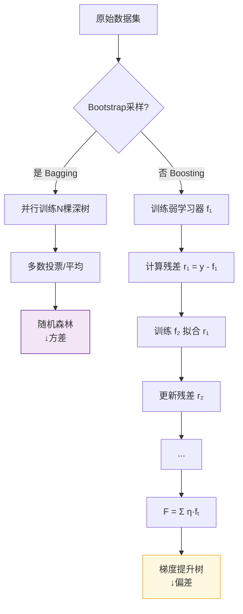
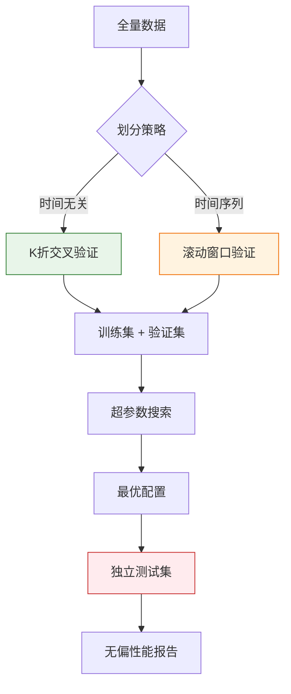
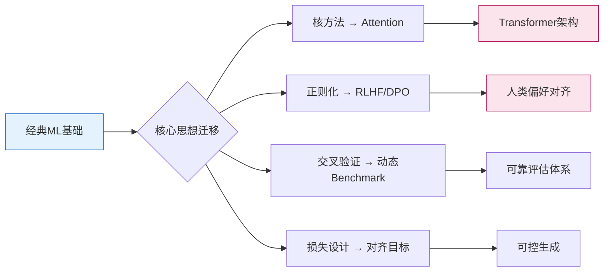
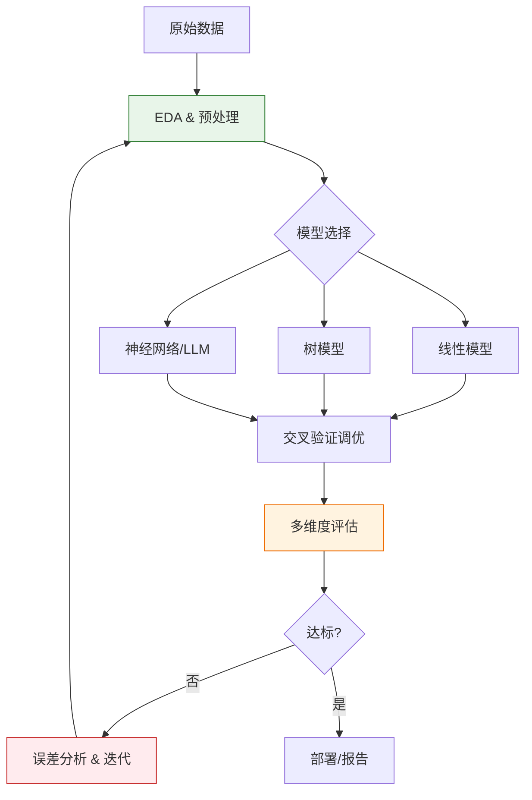

### 一、数学基石与线性代数核心

#### 1.1 向量：高维空间中的数据原子

在机器学习与大模型技术中，一切信息——无论是文本、图像还是语音——最终都被编码为**向量**。向量不仅是存储数据的容器，更是定义语义与关系的几何实体。

- **代数与几何的统一：** 从代数角度看，向量是有序数的集合；从几何角度看，它是多维空间中具有方向和大小的箭头。在AI语境下，我们更强调几何视角：两个向量的夹角余弦值衡量了语义相似度，向量间的欧氏距离反映了特征差异。这种几何直觉是理解Embedding、注意力机制等核心技术的前提。
- **高维空间的反直觉特性：** 人类习惯于三维空间，但AI处理的数据往往成千上万维。在高维空间中，体积集中在表面，随机向量几乎总是正交的，距离度量也会发生退化。这些特性意味着我们不能简单套用低维经验，而必须依赖严格的线性代数工具进行推理。

> **💡 概念解析：为什么需要高维表示？**  
> 低维空间容量有限，不同概念容易重叠混淆。将数据映射到高维空间，相当于增加了“分辨维度”，使得原本纠缠在一起的特征变得线性可分。这就像把一团乱麻铺展在巨大的桌面上，每根线都能找到自己的位置。大模型动辄使用数千维的隐藏层，正是为了获得足够丰富的语义表达空间。

#### 1.2 矩阵运算：并行化的空间变换引擎

如果说向量是数据的基本单元，那么**矩阵**就是驱动数据流转与变换的核心算子。神经网络的每一层前向传播，本质上都是一次矩阵乘法。

- **变换的几何解释：** 矩阵乘法不应仅被记忆为“行点乘列”的计算规则。从线性变换的角度看，一个矩阵定义了输入空间到输出空间的映射：它可能对空间进行旋转、缩放、剪切或投影。权重矩阵的学习过程，就是寻找最优空间变换的过程，使得变换后的数据更利于下游任务。
- **批量计算与硬件亲和性：** 单个样本的处理效率极低。通过将多个样本堆叠成矩阵（Batch），可以将串行计算转化为高度并行的矩阵运算。现代GPU的Tensor Core专为大规模矩阵乘法设计，其吞吐量远超标量运算。因此，“向量化”不仅是数学技巧，更是释放硬件性能的工程铁律。

> **📚 背景补充：BLAS生态与计算瓶颈**  
> 矩阵乘法的性能直接决定了训练速度。底层依赖BLAS库（如cuBLAS、MKL）针对特定硬件进行了指令级优化。理解这一点有助于明白为何在代码中应极力避免Python原生循环，而优先使用NumPy/PyTorch等封装好的张量操作——后者会自动调度最优的底层内核。

#### 1.3 特征值分解：揭示变换的内在主轴

要深入理解一个线性变换，不能只看它对任意向量的作用，而要找到那些“不变”的方向。**特征值分解**提供了透视矩阵内部结构的X光片。

- **谱分析与信息能量：** 特征值的大小代表了对应主轴上的“能量”或“方差贡献率”。在主成分分析中，我们保留最大特征值对应的特征向量，实质上是在保留数据中最显著的结构信息，同时丢弃噪声主导的次要分量。这既是压缩手段，也是去噪机制。

> **💡 概念解析：协方差矩阵的特殊地位**  
> 在机器学习中，最常分解的是协方差矩阵。由于它天然对称半正定，其特征值必为非负实数，特征向量彼此正交。这意味着数据的主成分是统计独立的。这种优良性质使得PCA成为最稳健的线性降维方法，也为理解自编码器、因子分析等非线性扩展奠定了基础。

#### 1.4 范数与正则化：控制复杂度的数学缰绳

模型训练不仅需要拟合数据，更需要控制自身的复杂度以避免过拟合。**范数**提供了量化“大小”与“平滑度”的标准化工具，是正则化理论的基石。

- **Lp范数的行为差异：**
    - **L1范数**（曼哈顿范数）：产生稀疏解，自动执行特征选择。其几何形状（菱形顶点）使优化路径更容易落在坐标轴上，导致部分权重精确为零。
    - **L2范数**（欧几里得范数）：产生小而分散的权重，防止任何单一特征主导预测。其光滑的球体边界保证了处处可导，便于梯度优化。
    - **L∞范数**：关注最大分量，适用于对最坏情况敏感的鲁棒优化场景。
- **正则化的贝叶斯解读：** 在损失函数中添加范数惩罚项，等价于对模型参数施加先验分布约束。L1对应拉普拉斯先验（尖峰厚尾），鼓励稀疏；L2对应高斯先验（集中衰减），鼓励小权重。这一视角将工程技巧统一到了概率推断框架下，揭示了正则化不仅是防过拟合手段，更是融入领域知识的通道。

> **📚 背景补充：再生核希尔伯特空间**  
> 范数通常由内积诱导，而内积定义了空间的几何结构。在核方法中，我们通过定义内积而非显式坐标，在无穷维空间中隐式地进行运算。这种抽象使得SVM等算法能在不增加计算负担的前提下获得极强的非线性表达能力。理解范数与内积的关系，是通往高级机器学习理论的必经之路。

### 二、概率统计与优化理论

#### 2.1 概率分布：不确定性建模的语言

机器学习本质上是在不确定环境中进行决策。概率论提供了描述、量化和推理不确定性的严格数学框架，是所有生成模型、贝叶斯方法及评估指标的根基。

- **从频率到信念：** 经典统计学将概率视为长期频率，而贝叶斯学派将其视为对命题的信任程度。在大模型时代，这两种视角深度融合：预训练阶段通过海量数据学习语言的经验分布（频率），微调与对齐阶段则融入人类偏好作为先验信念（主观概率）。理解这一双重性，有助于把握现代AI系统“数据驱动+知识引导”的混合范式。
- **关键分布族及其角色：**
    - **高斯分布：** 因其最大熵性质和中心极限定理，成为默认噪声模型与参数先验。其良好的解析性质使许多推断问题可闭式求解。
    - **伯努利/多项式分布：** 分类任务的天然输出空间。Softmax函数正是将实数向量映射为多项式分布参数的标准工具。
    - **指数族分布：** 统一了上述分布的数学结构，保证了充分统计量的存在与共轭先验的可用性。掌握指数族形式，能快速推导新模型的MLE与变分下界。

> **💡 概念解析：为什么Softmax是分类标配？**  
> Softmax不仅保证输出非负且归一化，更重要的是它是多项式分布的**规范链接函数**。这意味着在交叉熵损失下，梯度形式极其简洁（预测值减真实标签），避免了Sigmoid在饱和区梯度消失的问题。这种计算上的优雅并非巧合，而是信息几何中自然梯度的体现。

#### 2.2 极大似然估计：连接数据与模型的桥梁

给定观测数据，如何确定模型参数？**极大似然估计**提供了最基础、最通用的点估计准则，其思想深刻影响了整个机器学习的方法论。

- **对数似然的计算优势：** 连乘易导致数值下溢，取对数将乘积转为求和，同时保持单调性。更重要的是，对数似然的期望即为负交叉熵，这直接建立了统计估计与信息论的联系。在实践中，“最小化交叉熵损失”与“最大化对数似然”完全等价，前者已成为深度学习的事实标准术语。

> **📚 背景补充：MLE的渐近最优性**  
> 在正则条件下，MLE具有一致性、渐近正态性和有效性（达到Cramér-Rao下界）。这意味着当数据量足够大时，MLE是最优的无偏估计。然而在小样本或高维场景中，MLE可能过拟合或不存在，此时需引入正则化或转向贝叶斯估计。理解MLE的理论边界，才能合理选择替代方案。

#### 2.3 梯度下降法：高维非凸优化的实用引擎

有了目标函数，如何高效求解？**梯度下降**及其变体构成了现代机器学习优化的核心算法族，其成功依赖于对损失景观的深刻理解与工程适配。

- **梯度的几何意义：** 梯度指向函数增长最快的方向，负梯度则是局部最速下降方向。但在高维非凸空间中，最速下降未必通向全局最优。鞍点、平坦区域、尖锐极小值的存在，使得单纯依赖一阶信息充满陷阱。动量、自适应学习率等改进，本质上是对损失曲率的隐式利用。
- **随机性与泛化的共生：** 全批量梯度下降收敛稳定但计算昂贵；小批量SGD引入噪声，虽震荡却常能逃离尖锐极小值，找到更平坦的解。研究表明，平坦极小值对应更好的泛化性能。因此，SGD的“不精确”反而成为一种隐式正则化。Batch Size的选择不仅是算力权衡，更是泛化策略的一部分。

> **💡 概念解析：Adam为何成为默认选择？**  
> Adam结合了动量（加速穿越平坦区）与RMSProp（按参数历史梯度幅度自适应缩放）。它对超参数相对鲁棒，在训练初期快速进展。但其自适应机制可能导致后期收敛到次优解或泛化稍差。因此，精细调优时常采用Warmup + AdamW（解耦权重衰减）或切换至SGD收尾。没有万能优化器，只有与问题和阶段匹配的策略。

#### 2.4 损失函数设计：优化目标的精确刻画

损失函数是模型学习的指挥棒。选择不当，即使优化完美，结果也南辕北辙。设计损失函数需兼顾统计合理性、计算可行性与任务对齐性。

- **回归损失的鲁棒性谱系：**
    - **MSE：** 对应高斯噪声假设，对异常值敏感。
    - **MAE：** 对应拉普拉斯噪声，梯度恒定，抗噪但不可导于零点。
    - **Huber / Smooth L1：** 在小误差区用MSE保证光滑，在大误差区用MAE抑制离群点影响。这是理论与实践妥协的典范。
- **分类损失的校准需求：** 交叉熵优化判别准确性，但未必保证预测概率反映真实置信度。若需可靠不确定性估计（如医疗诊断），应额外引入Brier Score或温度缩放。对于类别不平衡问题，Focal Loss通过动态降低易分类样本权重，迫使模型聚焦难例，显著提升长尾性能。

> **📚 背景补充：损失函数的凸性与非凸性**  
> 在线性模型中，交叉熵关于参数是凸的，保证全局最优。但在深度网络中，复合非线性使损失高度非凸。此时，损失函数的设计不仅要考虑统计性质，还需关注优化友好性：避免梯度爆炸/消失、提供有效信号直至收敛。例如，ReLU激活配合交叉熵比Sigmoid更易训练，正是因为梯度流更畅通。

### 三、经典机器学习算法范式

#### 3.1 线性回归与逻辑回归：从拟合到决策的基石

作为监督学习的入门算法，线性回归与逻辑回归不仅是工程实践的基准线（Baseline），更是理解模型复杂度、损失函数设计与概率解释之间关系的最佳载体。

- **逻辑回归的概率重构：** 尽管名为“回归”，它实为分类器。其核心创新在于通过Sigmoid链接函数将线性输出映射为概率，使模型输出具备可解释的置信度。交叉熵损失在此场景下是凸的，保证了全局最优解的存在。更重要的是，逻辑回归是广义线性模型的特例，这种“线性组合+非线性链接”的范式直接启发了神经网络中激活函数的设计哲学。

> **💡 概念解析：为什么逻辑回归不是真正的回归？**  
> “回归”一词源于高尔顿的身高遗传研究，原指“向均值回归”。在统计建模中，“回归”泛指建立因变量与自变量关系的方法。逻辑回归虽用于分类，但其参数估计仍基于回归框架（MLE），且输出是连续概率值而非离散标签。命名上的混淆提醒我们：算法名称往往承载历史惯性，理解其数学结构比记住标签更重要。

#### 3.2 支持向量机：间隔最大化与核技巧的优雅统一

SVM代表了经典机器学习中理论完备性的巅峰。它将分类问题转化为几何间隔最大化，并通过核方法无缝扩展至非线性领域，展现了数学抽象的强大威力。

- **最大间隔的泛化意义：** SVM不追求训练误差为零，而是寻找能将两类数据分开且距离边界最远的超平面。统计学习理论证明，泛化误差界由VC维控制，而间隔越大，有效VC维越低。因此，最大化间隔是一种结构化风险最小化策略，天然抑制过拟合。软间隔引入松弛变量，允许少量误分类以换取更大整体间隔，实现了鲁棒性与灵活性的平衡。

> **📚 背景补充：SVM与大模型的对比启示**  
> SVM强调小样本下的理论保证与精确解，大模型则依赖海量数据与近似优化。两者看似对立，实则互补：SVM的间隔思想启发了对比学习中的Margin Loss；核方法的隐式映射理念在Transformer的注意力机制中以不同形式重现。理解SVM有助于避免“唯规模论”，认识到归纳偏置与数据效率的价值。

#### 3.3 决策树与集成学习：从规则提取到群体智慧

决策树以其可解释性和对混合数据类型的适应性，在表格数据领域长期占据主导地位。集成学习则通过组合弱学习器构建强模型，成为Kaggle竞赛与工业落地的事实标准。

- **分裂准则的信息论基础：** ID3使用信息增益（互信息），C4.5改用增益率以惩罚多值属性，CART采用基尼指数简化计算。这些准则本质都在衡量“分裂后不确定性的减少量”。信息增益偏向选择取值多的特征，可能导致过拟合；基尼指数计算高效且对类别分布更敏感。理解决策树的贪心本质，才能明白为何单棵树易过拟合，以及剪枝、早停等正则化手段的必要性。
- **Boosting与Bagging的哲学分野：**
    - **Bagging（如随机森林）：** 并行训练独立模型，通过投票/平均降低方差。适用于高方差低偏差模型（如深树）。
    - **Boosting（如GBDT/XGBoost）：** 串行训练，每轮聚焦前一轮的残差，逐步修正偏差。适用于低方差高偏差模型（如浅树）。
    - 二者并非优劣之分，而是针对不同误差来源的策略。XGBoost/LightGBM的成功，不仅在于算法改进，更在于系统工程优化（缓存感知、分布式计算），体现了算法与硬件协同设计的重要性。

> **💡 概念解析：为什么GBDT用负梯度而非残差？**  
> 在平方损失下，负梯度恰好等于残差。但在其他损失（如绝对值、Huber）下，残差无定义或非最优。Freidman提出用损失函数的负梯度作为伪残差，使Boosting框架泛化至任意可微损失。这一抽象将Boosting从特定算法升华为通用优化范式，是其广泛应用的理论基石。

#### 3.4 聚类算法：无监督结构发现的多元路径

当标签缺失时，聚类试图从数据内在结构中挖掘模式。不同算法基于不同的相似性假设，没有普适最优解，只有与数据结构匹配的合理选择。

- **K-Means的隐含假设：** 该算法默认簇为凸形、大小相近、密度均匀。其目标函数（组内平方和最小化）等价于假设数据由高斯混合模型生成且协方差为单位阵。若数据呈流形、带状或密度差异大，K-Means必然失效。理解其局限性，才能避免盲目套用。
- **密度与层次聚类的互补性：** DBSCAN基于局部密度连通性，能发现任意形状簇并识别噪声，但对密度变化敏感。层次聚类构建树状图，提供多粒度视图，适合探索性分析。谱聚类利用图拉普拉斯矩阵的特征向量，将非凸聚类转化为低维空间的K-Means问题，是连接几何与代数的典范。

> **📚 背景补充：聚类评估的困境**  
> 无监督学习缺乏客观标签，内部指标（轮廓系数、Calinski-Harabasz）仅反映紧凑性与分离度，未必对应真实语义。外部指标需参考标签，违背无监督初衷。实践中，聚类结果必须结合领域知识验证。这提醒我们：算法输出只是假设，人类判断才是最终仲裁者。在大模型时代，聚类常用于数据清洗、Prompt模板发现等预处理环节，其价值更多体现在下游任务的性能提升上。

### 四、模型评估、调优与大模型衔接

#### 4.1 科学评估体系：超越单一指标的决策框架

模型评估绝非简单地报告测试集准确率，而是对模型在真实场景中可靠性、鲁棒性与泛化能力的系统性审计。建立科学的评估体系，是防止“实验室高分、线上翻车”的关键防线。

- **交叉验证的统计意义：** 单次划分受随机性影响大，K折交叉验证通过多次采样平均，提供更稳定的性能估计与方差度量。分层K折保证每折中类别比例一致，避免小类别被遗漏。对于时间序列数据，必须采用滚动窗口验证以防止未来信息泄露。理解不同验证策略的适用边界，比记住公式更重要。
- **多维指标的组合解读：**
    - **分类任务：** Accuracy在类别不平衡时极具欺骗性。Precision/Recall/F1需根据业务代价权衡（如医疗诊断重Recall，垃圾邮件过滤重Precision）。ROC-AUC衡量排序能力，PR-AUC更适合正样本稀缺场景。
    - **回归任务：** MSE对异常值敏感，MAE更鲁棒但不可导，R²提供相对于基线模型的解释力。
    - **校准度：** ECE或可靠性图检验预测概率是否反映真实置信度，这对风险敏感应用至关重要。

> **💡 概念解析：为什么测试集只能使用一次？**  
> 每次根据测试集结果调整模型或超参数，测试集就隐式参与了训练，导致乐观偏差。正确流程是：训练集拟合参数，验证集选择超参数，测试集仅作最终无偏评估。若需多次迭代评估，应保留独立验证集或使用嵌套交叉验证。这一纪律是科研诚信与工程严谨的共同要求。

#### 4.2 正则化与防过拟合：控制复杂度的系统工程

过拟合是模型记住了噪声而非规律。对抗过拟合不能依赖单一技巧，而需构建从数据、模型到优化的多层次防御体系。

- **数据层增强：** 更多高质量数据是最根本的正则化。当数据有限时，数据增强（旋转、裁剪、Mixup、CutMix）通过引入合理变换扩展有效样本空间。标签平滑防止模型过度自信，提升校准度。合成数据需谨慎验证分布一致性，避免引入系统性偏差。
- **模型与优化层约束：**
    - **结构正则化：** Dropout随机失活神经元，迫使网络学习冗余表示；BatchNorm稳定中间层分布，允许更高学习率并具轻微正则效果。
    - **参数惩罚：** L1/L2权重衰减直接限制参数规模；Early Stopping以验证集性能为哨兵，在过拟合前终止训练。
    - **集成策略：** Bagging降低方差，Boosting降低偏差，Stacking融合异构模型优势。集成不仅是性能提升手段，更是风险分散机制。

> **📚 背景补充：双重下降现象**  
> 传统观点认为模型复杂度增加必然导致过拟合。但深度学习中观察到“双重下降”：在插值阈值附近测试误差先升后降。这挑战了经典偏差-方差权衡，表明过参数化模型可通过隐式正则化（如SGD偏好平坦解）实现良好泛化。理解这一现象，有助于摆脱“越小越好”的思维定式，合理利用大模型的容量。

#### 4.3 超参数优化：从手工调参到自动化搜索

超参数决定了模型的学习行为与容量上限。高效搜索策略能在有限计算预算下找到更优配置，将人力从重复试验中解放。

- **搜索策略的演进：**
    - **网格搜索：** 全面但维度灾难严重，仅适用于低维空间。
    - **随机搜索：** 在高维空间中效率远高于网格，因多数超参数重要性不均等。
    - **贝叶斯优化：** 用代理模型（高斯过程/TPE）建模“超参数→性能”映射，智能选择下一试验点，显著减少评估次数。
    - **多保真度方法：** Hyperband/BOHB结合早停与资源分配，快速淘汰劣质配置，将算力集中于有希望的区域。
- **搜索空间的精心设计：** 学习率宜用对数尺度，正则化系数常取对数均匀分布。范围设定应基于理论或预实验，避免无效探索。记录所有试验元数据，便于事后分析与知识积累。

> **💡 概念解析：为什么随机搜索优于网格搜索？**  
> Bergstra & Bengio (2012) 证明：当只有少数超参数真正重要时，随机搜索以相同试验次数覆盖更多有效区域。例如10个参数中仅2个关键，网格在90%维度上浪费资源，而随机搜索每次试验都探索关键参数的新组合。这一洞见揭示了高维优化的稀疏性本质。

#### 4.4 通往大模型：从经典ML到Transformer的桥梁

经典机器学习并非过时遗产，而是理解大模型的必要前置。二者在思想、工具与局限上深刻关联，掌握衔接点方能融会贯通。

- **注意力机制的线性代数根源：** Self-Attention本质是加权求和，权重由Query-Key相似度决定。这与核方法中的Nadaraya-Watson估计器形式相同，只是核函数从固定变为可学习。理解这一点，就能明白为何注意力能捕获长程依赖——它是在动态构建输入相关的自适应核。
- **Scaling Law的经典ML启示：** 大模型的涌现能力看似神奇，实则遵循幂律关系。这与经典ML中“性能随数据/模型规模单调提升”的经验一脉相承，只是阈值更高、非线性更强。偏差-方差权衡在大模型中以新形式存在：过小欠拟合，过大虽不过拟合但计算不可承受，最优规模由资源与收益曲线交点决定。
- **评估范式的迁移：** 大模型评估从固定测试集转向动态基准、人工对齐与任务泛化测试。但核心原则未变：防止数据污染、区分记忆与推理、多维度指标组合。经典ML培养的评估素养，正是应对大模型评估复杂性的基础。

> **📚 背景补充：从Feature Engineering到Prompt Engineering**  
> 经典ML依赖人工特征提取，大模型通过预训练自动学习表征。但“注入领域知识”的需求并未消失，只是形式从特征工程转为Prompt设计、RAG检索增强与微调数据构造。理解经典ML中特征选择、变换与交互的原理，能显著提升Prompt设计的系统性与有效性。技术栈变了，但对数据与问题本质的洞察力始终稀缺。

### 五、练习

本阶段旨在通过分层级的实战题目，帮助读者将前四个阶段的理论知识转化为解决实际问题的能力。练习题设计遵循“概念辨析→推导计算→工程实践→开放探究”的认知路径，覆盖数学基础、优化理论、经典算法及大模型衔接核心知识点。建议读者先独立完成，再对照解析反思知识盲区。

#### 5.1 概念辨析题：检验直觉与理解深度

此类题目无需复杂计算，重点考察对核心概念的几何/物理意义、适用边界及常见误区的把握。

1. **高维空间特性：** 在1000维空间中随机生成两个单位向量，它们的余弦相似度大概率接近多少？这一现象对文本Embedding的检索策略有何启示？
2. **正则化行为差异：** 若特征中存在大量冗余共线变量，L1与L2正则化分别会产生怎样的权重分布？从优化几何角度解释原因。
3. **损失函数选择：** 在类别极度不平衡（正样本占比0.1%）的欺诈检测任务中，为何Accuracy失效？应优先选用哪些指标组合？若需输出可靠风险评分，还需额外做什么？
4. **SVM核技巧本质：** 使用RBF核的SVM是否等价于将数据映射到无穷维空间后做线性分类？核函数的选择如何影响模型的归纳偏置？
5. **大模型评估陷阱：** 某团队用公开benchmark测试自研大模型，得分超越GPT-4，但实际业务效果远逊。请列举至少三种可能导致该结果的评估偏差，并提出改进方案。

> **💡 答题指引**  
> 概念题无唯一标准答案，重在逻辑自洽与联系实际。例如第1题，除回答“接近0”外，应进一步指出高维稀疏性使余弦相似度区分度下降，需结合量化、重排序或混合检索提升精度。避免仅复述定义，要体现“为什么重要”。

#### 5.2 推导与证明题：夯实数学根基

通过手推关键公式，强化对算法内在机制的理解，避免将工具当作黑盒。

1. **Softmax梯度推导：** 设 $p_i = \frac{e^{z_i}}{\sum_j e^{z_j}}$，交叉熵损失 $L = -\sum_k y_k \log p_k$，证明 $\frac{\partial L}{\partial z_i} = p_i - y_i$。并说明该形式为何优于Sigmoid+MSE的组合。

2. **AdamW解耦权重衰减：** 对比标准Adam与AdamW的参数更新公式，说明为何将L2惩罚从梯度计算中分离能改善泛化。从优化轨迹角度分析两者在收敛行为上的差异。

> **📚 背景补充：推导的意义**  
> 推导不是为了记忆公式，而是为了建立“条件→结论”的因果链。例如Softmax梯度简洁性源于指数族自然参数性质；PCA-SVD等价性揭示了协方差矩阵计算的数值不稳定性。当未来遇到变体问题时，这种因果链比具体公式更有迁移价值。

#### 5.3 工程实践题：连接理论与代码

在真实或模拟场景中应用所学，培养数据处理、模型调优与结果分析的完整能力。

1. **线性回归诊断：** 使用波士顿房价数据集（或类似表格数据），实现带L1/L2正则化的线性回归。绘制正则化强度vs验证集MSE曲线，分析最优λ的选择依据。检查残差分布，判断是否存在异方差性或非线性关系，并提出改进方案。
2. **分类器对比实验：** 在同一数据集上训练逻辑回归、SVM（线性/RBF核）、随机森林、XGBoost。记录训练时间、测试性能、特征重要性排序。分析各模型优劣与数据特性的关联（如维度、样本量、噪声水平）。
3. **聚类探索分析：** 对MNIST手写数字特征（可用PCA降至50维）分别运行K-Means、DBSCAN、谱聚类。可视化聚类结果（t-SNE/UMAP），定量评估（轮廓系数）与定性观察结合，讨论哪种算法最符合数字数据的流形结构。
4. **大模型微调前置准备：** 选取一个小型语言模型（如Qwen2.5-1.5B），在自定义指令数据集上进行LoRA微调。监控训练loss与验证perplexity，尝试不同rank/alpha配置。评估微调前后在目标任务上的表现变化，分析过拟合迹象与缓解策略。

> **💡 实践提示**  
> 工程题重在过程而非结果。即使模型性能不佳，只要能系统分析失败原因（如数据泄露、特征无效、超参不当），收获远超盲目刷高分。建议使用MLflow/W&B记录实验元数据，养成可复现的研究习惯。

#### 5.4 开放探究题：拓展思维边界

鼓励跨领域联想与批判性思考，为后续深入研究或创新应用埋下种子。

1. **经典ML与大模型的融合点：** 除了RAG和Prompt Engineering，还有哪些经典ML思想可迁移至大模型时代？例如：主动学习能否用于高效对齐数据采集？贝叶斯优化能否加速RLHF超参搜索？请提出一个具体设想并论证可行性。
2. **评估伦理与局限性：** 当前大模型评估高度依赖英文基准与人类标注者偏好。这对非英语文化、边缘群体可能造成何种系统性偏差？如何设计更公平、包容的评估框架？
3. **小样本学习的复兴：** 在大模型主导的背景下，经典ML的小样本方法（如元学习、数据增强、半监督学习）是否仍有价值？在哪些场景下它们比微调大模型更具优势？请结合成本、延迟、隐私等维度分析。
4. **数学基础的演进需求：** Transformer之后的新一代架构（如State Space Models、RWKV）对数学基础提出了哪些新要求？线性代数、概率论、优化理论中哪些部分需要加强或重构？

> **📚 探究建议**  
> 开放题无标准答案，重在展现思考深度与广度。可查阅最新论文、技术博客或社区讨论，但务必形成自己的观点。写作时注意区分事实陈述与个人推测，引用来源保持透明。这类练习最适合写入博客引发讨论，也是构建个人技术影响力的优质素材。

