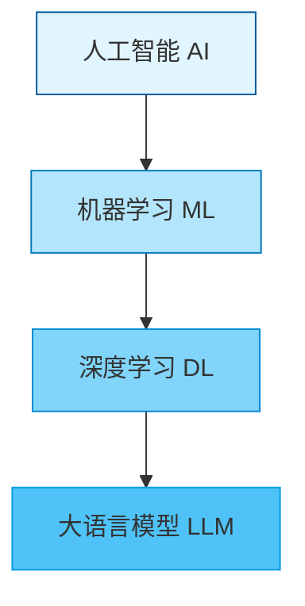
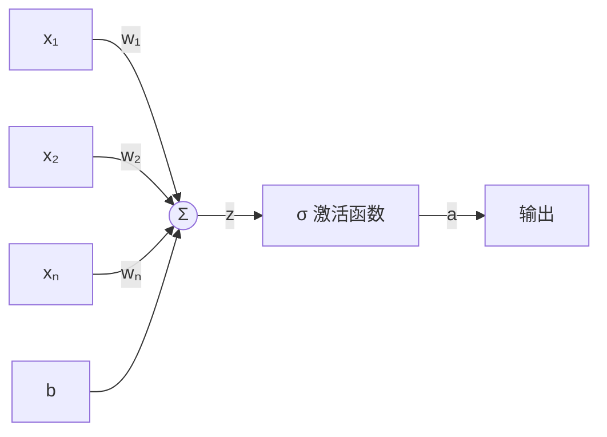
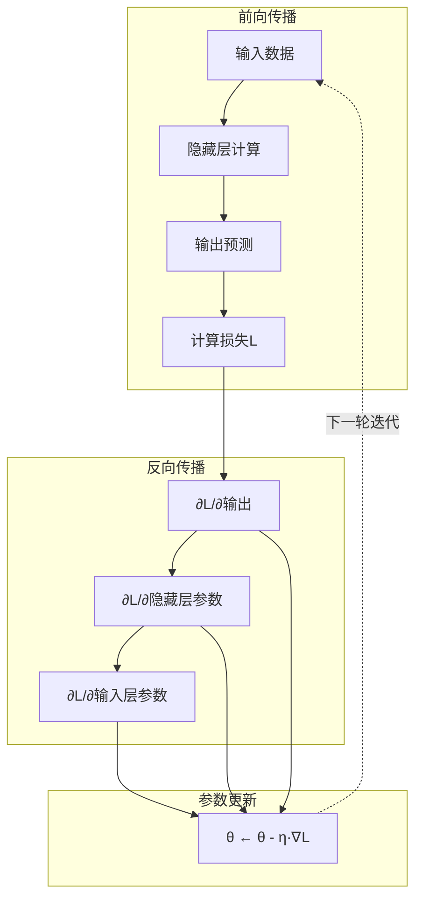
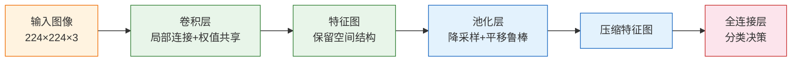
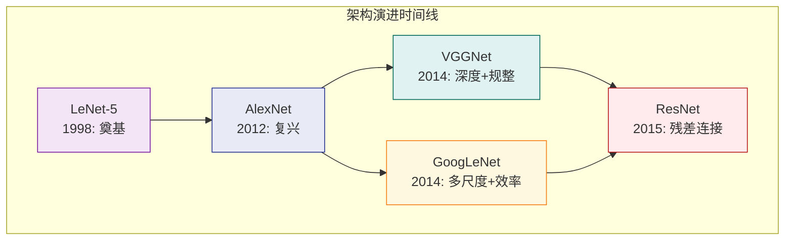
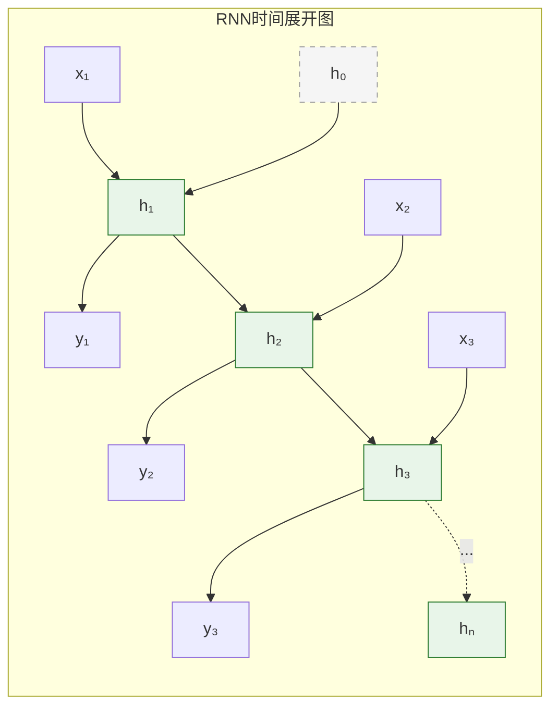
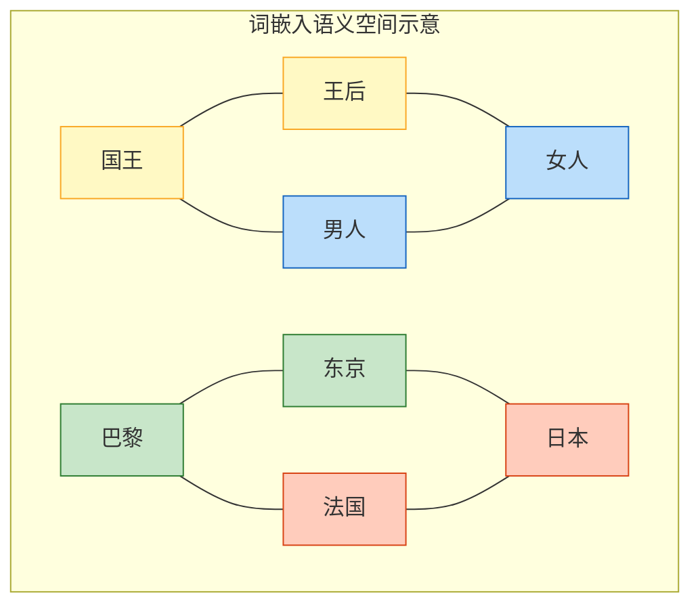
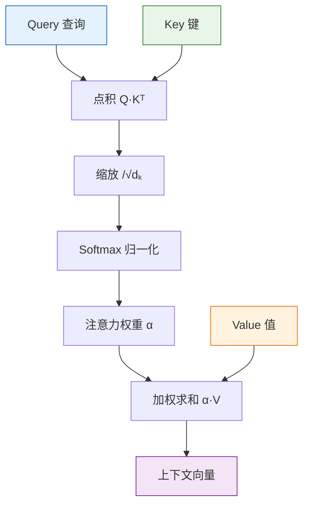
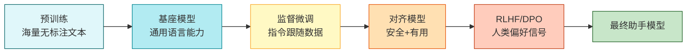

### 一、深度学习基石与神经网络原理

#### 1. 人工智能与机器学习的演进脉络

在深入代码与公式之前，理清技术发展的宏观图景至关重要。人工智能（AI）并非单一技术，而是一个层层嵌套的概念集合。

- **人工智能 (AI)：** 最广泛的范畴，指任何模拟人类智能行为的系统，包括基于规则的专家系统和现代的数据驱动模型。
- **机器学习 (ML)：** AI的子集，强调“从数据中自动学习规律”而非显式编程。其核心假设是：数据中存在某种潜在的映射关系 $y = f(x)$，我们可以通过算法逼近这个函数 $f$。
- **深度学习 (DL)：** ML的子集，特指使用多层非线性变换（即深度神经网络）来自动学习数据的层次化表示。与传统机器学习相比，深度学习最大的突破在于**端到端学习**——无需人工设计特征，模型能从原始输入直接映射到输出。

> **💡 概念辨析：为什么叫“深度”？**  
> “深度”并非指思想的深邃，而是指网络结构中**隐藏层的数量**。传统神经网络可能只有1-2个隐藏层，而现代深度学习模型往往拥有数十甚至上百层。这种纵深结构使得模型能够逐层抽象特征：底层识别边缘纹理，中层组合成部件，高层形成语义概念。

#### 2. 神经元模型：从生物启发到数学抽象

神经网络的原子单元是**人工神经元**，它是对生物神经元的极度简化与数学抽象。

一个标准神经元的计算过程可分解为三步：

> **💡 关键洞察：为什么必须引入非线性激活？**  
> 若没有激活函数（或仅使用线性激活），无论网络堆叠多少层，整个系统等价于一个单层线性模型。因为多个线性变换的复合仍然是线性变换。**非线性激活函数赋予了神经网络拟合任意复杂函数的能力**，这是万能近似定理成立的前提。

#### 3. 激活函数全景解析

不同的激活函数决定了网络的表达能力与训练稳定性。以下是几种核心激活函数的特性对比：

|激活函数|公式|优点|缺点|适用场景|
|:--|:--|:--|:--|:--|
|Sigmoid||输出范围(0,1)，适合概率解释|梯度消失、非零中心、指数运算慢|二分类输出层|
|Tanh||零中心化，收敛快于Sigmoid|仍存在梯度消失问题|RNN隐藏层|
|ReLU||计算高效、缓解梯度消失、稀疏激活|Dead ReLU问题（负区间梯度为0）|CNN/MLP隐藏层（默认首选）|
|Leaky ReLU||解决Dead ReLU，负区间有微小梯度|超参数$\alpha$需调优|ReLU失效时的替代方案|
|Softmax||多类别概率归一化|对异常值敏感|多分类输出层|

> **💡 背景补充：ReLU为何成为默认选择？**  
> ReLU的崛起是深度学习复兴的关键因素之一。从生物学角度看，大脑神经元在同一时刻仅有约1%-4%处于激活状态，ReLU的稀疏性恰好模拟了这一特性。从优化角度看，ReLU在正区间的梯度恒为1，使得梯度在深层网络中能够有效回传，极大缓解了困扰学界多年的梯度消失难题。

#### 4. 损失函数：衡量模型好坏的标尺

- - 回归任务的标准选择。假设误差服从高斯分布时，最小化MSE等价于最大似然估计。
- - 分类任务的标准选择。源自信息论，衡量两个概率分布的差异。相比MSE，交叉熵在分类任务上梯度更稳定，不会出现因激活函数饱和导致的梯度消失。

> **💡 深层理解：损失函数与概率的关系**  
> 许多损失函数并非凭空设计，而是从**最大似然估计（MLE）** 推导而来。例如，当假设目标变量服从伯努利分布时，最大化似然函数自然导出二元交叉熵；假设服从高斯分布时，则导出MSE。理解这一联系，能帮助我们在面对新问题时合理选择或设计损失函数。

#### 5. 梯度下降与反向传播：模型学习的引擎

神经网络的学习本质是一个**优化问题**：在高维参数空间中寻找使损失函数最小的参数配置。

**梯度下降的核心思想：** 沿着损失函数梯度的反方向更新参数，因为梯度指向函数增长最快的方向，反方向则是下降最快的方向。

**三种梯度下降变体：**

- **批量梯度下降 (BGD)：** 每次用全部数据计算梯度。方向准确但计算昂贵，难以在线更新。
- **随机梯度下降 (SGD)：** 每次用一个样本计算梯度。速度快但噪声大，收敛震荡剧烈。
- **小批量梯度下降 (Mini-batch SGD)：** 折中方案，每次用一小批样本（如32/64/128）。兼顾计算效率与梯度稳定性，是实际训练中的标准做法。

**反向传播算法 (Backpropagation)：** 高效计算梯度的核心算法。利用链式法则，从输出层向输入层逐层传递误差信号，避免了对每个参数单独求导的巨大计算开销。

> **💡 常见误区澄清：反向传播 ≠ 梯度下降**  
> 反向传播仅仅是**计算梯度**的方法，而梯度下降是利用梯度**更新参数**的策略。两者配合工作：反向传播提供“方向”，梯度下降执行“移动”。此外，现代优化器（Adam、RMSprop等）在基础梯度下降之上引入了动量、自适应学习率等机制，进一步加速收敛并提升泛化能力。

#### 6. 过拟合与正则化：泛化能力的守护

模型在训练集上表现优异但在测试集上性能骤降，即为**过拟合**。这意味着模型“记住”了训练数据的噪声，而非学到了通用规律。

**核心正则化策略：**

- **L1/L2正则化：** 在损失函数中加入参数的范数惩罚项。L2倾向于让权重变小且均匀分布；L1倾向于产生稀疏权重（部分权重精确为0），具有隐式特征选择效果。
- **Dropout：** 训练时随机“关闭”一部分神经元，迫使网络不依赖特定节点，学习到更鲁棒的冗余表示。推理时恢复所有节点并缩放权重。
- **数据增强：** 通过对训练数据进行旋转、裁剪、加噪等变换，人为扩大有效数据集规模，是最有效的正则化手段之一。
- **早停 (Early Stopping)：** 监控验证集性能，当验证损失不再下降时终止训练，防止模型过度适应训练集。

> **💡 思维框架：偏差-方差权衡**  
> 理解过拟合需要把握**偏差-方差权衡**。高偏差（欠拟合）意味着模型过于简单，无法捕捉数据模式；高方差（过拟合）意味着模型过于复杂，对训练数据的微小波动过度敏感。正则化的本质是在两者之间寻找最优平衡点，使模型既有足够的表达力，又保持良好的泛化边界。

### 二、卷积神经网络（CNN）与计算机视觉

#### 1. 从全连接到卷积：为何需要专门的视觉架构

在处理图像数据时，传统的全连接网络（MLP）面临两个根本性障碍：

- **忽略空间结构：** MLP将图像展平为一维向量，完全破坏了像素间的二维邻域关系。相邻像素所携带的边缘、纹理等局部模式信息在展平过程中丢失，模型必须从零学习这些本应作为先验知识的空间规律。

卷积神经网络（CNN）通过引入三个核心归纳偏置来解决上述问题：

- **局部连接：** 每个神经元仅关注输入的一个局部区域（感受野），而非整张图像。这直接反映了视觉系统的生物学事实——初级视皮层细胞只对特定位置的局部刺激响应。
- **权值共享：** 同一个卷积核在整张图上滑动扫描，所有位置共用同一组参数。这意味着“边缘检测器”在图像左上角和右下角是相同的，大幅减少参数量。
- **平移等变性：** 由于权值共享，若输入图像发生平移，特征图也会相应平移。这使得模型对目标位置变化具有天然的鲁棒性。

> **💡 概念深化：归纳偏置的价值**  
> 深度学习并非“万能黑箱”，其成功很大程度上依赖于合理的归纳偏置。CNN的局部性与平移不变性是对自然图像统计特性的精确编码。这种先验知识使CNN在有限数据下就能高效学习，而无需像MLP那样从海量样本中“重新发现”空间规律。在大模型时代，Transformer虽减少了显式偏置，但仍需大量数据补偿；CNN则在中小规模视觉任务上保持显著的数据效率优势。

#### 2. 卷积运算的本质：特征提取的数学表达

卷积操作在深度学习中实际执行的是**互相关运算**（严格数学意义上的卷积需翻转核，但深度学习惯例省略此步）。其计算过程可描述为：

**关键超参数及其影响：**

|超参数|作用|设计考量|
|:--|:--|:--|
|核大小|决定感受野范围|3×3为主流，堆叠多个小核优于单个大核（更少参数+更多非线性）|
|步幅|控制输出分辨率|步幅>1可实现下采样，替代部分池化功能|
|填充|维持空间尺寸|Same填充使输出尺寸等于输入，避免边界信息丢失|
|通道数|输出特征图数量|每个卷积核产生一个特征图，多核并行提取多种特征|

> **💡 直觉理解：卷积核即模板匹配器**  
> 可将卷积核视为一个“模板”或“探测器”。当它在图像上滑动时，输出值高的位置表示该处内容与模板高度相似。训练过程就是自动学习一组最优模板：浅层学到边缘、角点等基础图案，深层组合出眼睛、车轮等语义部件。这种层级化特征构建是CNN强大的根源。

#### 3. 池化层：信息压缩与不变性增强

池化层对特征图的局部区域进行聚合，实现空间降维。常见类型包括：

- **最大池化：** 取区域内最大值。保留最显著的激活信号，抑制背景噪声，提供一定程度的平移、旋转、尺度不变性。
- **平均池化：** 取区域均值。保留整体趋势信息，常用于网络末端替代全局平均池化以减少参数。

> **💡 现代实践演变**  
> 早期CNN依赖池化层进行下采样，但现代架构（如ResNet、EfficientNet）更倾向于使用**步幅为2的卷积**代替池化。原因在于：卷积在下采样的同时仍可学习参数，保留了更多信息；而池化是无参数操作，可能造成不可逆的信息损失。全局平均池化（GAP）则成为分类头部的标准配置，取代了传统庞大的全连接层，显著降低过拟合风险。

#### 4. 经典CNN架构演进：从手工设计到自动化探索

CNN的发展史是一部不断突破性能瓶颈的创新史。以下里程碑架构揭示了关键设计思想的迭代：

- **LeNet-5 (1998)：** CNN的开山之作。首次验证卷积+池化+全连接的三段式范式在手写数字识别上的有效性。受限于算力与数据，未能推广至复杂任务。
- **AlexNet (2012)：** 深度学习复兴的标志。引入ReLU激活、Dropout正则化、GPU并行训练及数据增强，在ImageNet竞赛中以压倒性优势获胜，证明深度CNN在大规模视觉任务上的可行性。
- **VGGNet (2014)：** 提出“小而深”的设计理念。统一使用3×3卷积核堆叠，证明网络深度比宽度更重要。结构规整易于迁移，至今仍是许多任务的基线模型。
- **GoogLeNet/Inception (2014)：** 解决深度与效率的矛盾。引入Inception模块，在同一层并行使用多种尺度卷积核，自适应捕获多粒度特征。辅以1×1卷积降维，实现更深网络的同时控制计算量。
- **ResNet (2015)：** 突破深度限制的革命性工作。提出残差连接，允许梯度无损穿越多层，使训练数百甚至上千层网络成为可能。残差块已成为几乎所有后续视觉模型的标配组件。

> **💡 架构设计的核心启示**  
> 观察上述演进可提炼出三条普适原则：① **深度优先**：在合理正则化下，更深网络通常更强；② **模块化设计**：重复堆叠精心设计的单元（如残差块、Inception模块）比逐层手工调整更高效；③ **信息通路保障**：确保梯度与特征能顺畅流动（残差连接、密集连接等均服务于此目标）。这些原则超越了具体架构，指导着新模型的设计。

#### 5. 图像分类实战要点：从理论到工程落地

掌握CNN不仅需要理解原理，还需熟悉工程实践中的关键决策点：

- **迁移学习优先：** 除非拥有百万级标注数据，否则几乎总是应从预训练模型（如ImageNet权重）出发微调。底层特征（边缘、纹理）具有高度通用性，冻结前若干层仅训练头部即可快速获得优异性能。
- **数据增强系统化：** 除基础几何变换外，应考虑Mixup、CutMix等高级策略。它们通过混合样本创造虚拟训练实例，有效平滑决策边界，提升泛化能力。注意增强强度应与数据集规模匹配，过小数据集过度增强反而有害。
- **学习率调度：** 采用Warmup+余弦退火或阶梯衰减策略。初始阶段用小学习率稳定训练，中期逐步提升以加速收敛，后期精细调优避免震荡。OneCycleLR等现代调度器常能获得更好效果。
- **评估指标选择：** 准确率并非万能。类别不平衡时应关注F1-score、AUC-ROC；细粒度分类需结合混淆矩阵分析易错类别；部署场景还需权衡推理延迟与精度。

> **💡 避坑指南：常见训练陷阱**
> 
> - **过早判断欠拟合：** 训练初期损失下降缓慢未必是模型容量不足，可能是学习率过低或BatchNorm未充分预热。应先排查优化设置再考虑加宽加深网络。
> - **验证集泄露：** 数据增强的统计量（如均值方差）若基于含验证集的全体数据计算，会导致评估虚高。务必仅用训练集统计量做归一化。
> - **忽视预处理一致性：** 训练与推理时的resize、crop、归一化方式必须严格一致。微小差异即可导致数个百分点的性能落差。

### 三、循环神经网络（RNN）与自然语言处理基础

#### 1. 序列数据的独特挑战：为何CNN与MLP失效

自然语言、语音信号、时间序列等数据具有一个核心特性：**时序依赖性**。当前时刻的含义往往取决于历史上下文，且输入输出长度可变。这种特性使得前馈网络面临根本性障碍：

- **固定维度假设：** MLP和标准CNN要求输入输出维度固定，无法原生处理变长序列。
- **顺序信息丢失：** 将句子视为无序词袋或固定窗口切片，破坏了词语间的先后逻辑。“猫追狗”与“狗追猫”在词袋模型中完全等价，但语义截然相反。
- **长程依赖困难：** 即使使用滑动窗口CNN，其感受野仍受限于核大小。要捕获跨越数十词的语法关系（如主谓一致），需要指数级堆叠层数，这在实践中不可行。

> **💡 概念辨析：递归 vs 循环**  
> 中文语境下常将Recurrent Neural Network译为“循环神经网络”，但需注意其与Recursive Neural Network（递归神经网络）的区别。前者沿时间轴展开，处理线性序列；后者沿树状结构展开，处理句法解析等层次化数据。本阶段聚焦于时间维度的循环架构，这是理解后续Transformer时序建模的基础。

#### 2. 基础RNN的数学形式与梯度困境

基础RNN的更新规则极为简洁：

然而，这一简洁形式在实践中遭遇了致命的**梯度消失/爆炸问题**。反向传播通过时间（BPTT）算法需将梯度连乘回传：

> **💡 深层理解：梯度消失的本质**  
> 梯度消失并非RNN独有，但在RNN中尤为严重，因为同一个权重矩阵被反复相乘。这相当于对初始扰动施加了一个线性动力系统：若系统处于收缩区域，信息随时间快速遗忘；若处于扩张区域，则数值不稳定。LSTM和GRU的设计精髓，正是通过门控机制构造一条**梯度高速公路**，使关键信息能在不经过非线性压缩的情况下长距离传递。

#### 3. LSTM与GRU：门控机制破解长程依赖

为解决梯度困境，研究者设计了带有自适应门控的高级RNN变体。

**长短期记忆网络（LSTM）** 引入三个门和一个独立的细胞状态 $c_t$：

- 决定写入多少新信息
- **输出门 $o_t$：** 决定从细胞状态中读取多少作为隐藏状态输出

细胞状态的更新为加法形式：$c_t = f_t \odot c_{t-1} + i_t \odot \tilde{c}_t$。**加法操作是LSTM的核心创新**——它提供了一条梯度可以无损流动的通路，只要遗忘门接近1，信息就能跨越数百个时间步而不衰减。

**门控循环单元（GRU）** 是LSTM的精简版本，将遗忘门与输入门合并为更新门，并省去独立细胞状态。参数更少、计算更快，在多数任务上性能与LSTM相当，已成为许多场景的首选。

|特性|基础RNN|LSTM|GRU|
|:--|:--|:--|:--|
|记忆机制|单一隐藏状态|细胞状态+隐藏状态|单一隐藏状态（带门控）|
|门数量|0|3|2|
|长程依赖|极差|优秀|良好|
|参数量|最少|最多|中等|
|训练稳定性|低|高|高|

> **💡 工程选型建议**  
> 除非有明确证据表明LSTM优于GRU（如某些机器翻译任务），否则优先尝试GRU。更少的参数意味着更快的实验迭代和更低过拟合风险。若任务对超长序列敏感（如文档级理解、基因组分析），可考虑LSTM或后续的Transformer架构。值得注意的是，现代实践中双向LSTM/GRU比单向版本更常用，因为许多NLP任务（如命名实体识别、情感分析）同时依赖左右上下文。

#### 4. 词嵌入：从离散符号到连续语义空间

神经网络无法直接处理文本符号，必须将其映射为稠密向量。**词嵌入**是这一映射的核心技术，其革命性在于：向量的几何关系编码了语义关系。

- **One-Hot编码的缺陷：** 维度等于词汇表大小（数万至数十万），极度稀疏；任意两词正交，无法表达任何语义相似性。
- **分布式表示的优势：** 每个词用低维稠密向量（通常128-300维）表示。语义相近的词在向量空间中距离近，“国王-男人+女人≈女王”等类比关系可通过向量运算体现。

**Word2Vec** 是词嵌入的奠基工作，包含两种训练范式：

- **Skip-gram：** 给定中心词预测上下文词。适合小数据集，对低频词效果较好。
- **CBOW：** 给定上下文预测中心词。训练更快，适合大数据集。

两者均通过负采样或层次Softmax避免全词汇表归一化的计算瓶颈，使大规模语料上的高效训练成为可能。

> **💡 背景补充：从静态到动态嵌入**  
> Word2Vec生成的词向量是**上下文无关**的：“bank”在“河岸”和“银行”中拥有相同向量。这一局限催生了ELMo和BERT等上下文化嵌入模型，它们根据完整句子动态生成词表示。但静态嵌入并未过时：在资源受限场景、冷启动问题或作为大模型的辅助特征时，预训练词向量仍是极具性价比的选择。理解Word2Vec有助于把握“分布假说”这一NLP核心思想：词的意义由其使用环境决定。

#### 5. NLP基础任务范式与RNN应用模式

RNN在不同NLP任务中呈现出四种经典应用模式，理解这些模式有助于快速适配新任务：

- **一对一：** 固定输入→固定输出。如图像分类（虽非NLP，但属此范式）。
- **一对多：** 固定输入→序列输出。如图像描述生成、音乐创作。
- **多对一：** 序列输入→固定输出。如文本分类、情感分析、垃圾邮件检测。通常取最后一个时间步的隐藏状态或全局池化作为句子表示。
- **多对多（等长）：** 序列输入→等长序列输出。如词性标注、命名实体识别。每个时间步独立输出标签。
- **多对多（不等长）：** 序列输入→变长序列输出。如机器翻译、摘要生成。需引入编码器-解码器架构，编码器压缩源序列为上下文向量，解码器逐步生成目标序列。

> **💡 实践要点：序列填充与掩码**  
> 批量训练要求张量形状统一，变长序列必须填充至相同长度。但填充位置不应参与损失计算或状态更新，否则引入噪声。**掩码机制**是处理此问题的标准方案：创建布尔掩码标记有效位置，在前向传播中屏蔽填充位的梯度贡献。现代框架（PyTorch/TensorFlow）均提供内置支持，但初学者常忽略此细节导致性能异常。此外，打包序列技术可在不改变逻辑的前提下跳过填充位计算，显著提升训练效率。

#### 6. RNN时代的遗产与局限：通往Transformer的桥梁

尽管Transformer已主导当代NLP，RNN的历史贡献与残余价值不容忽视：

- **编码器-解码器范式的奠定：** Seq2Seq架构首次实现了端到端的序列转换，其思想直接被Transformer继承。注意力机制最初正是作为RNN编解码器的补充而提出，用于缓解上下文向量的信息瓶颈。
- **归纳偏置的辩证思考：** RNN的时序偏置使其在小数据上优于无偏置模型，但也限制了并行化与长程建模。Transformer以牺牲归纳偏置为代价换取可扩展性，再用海量数据弥补偏置缺失。理解这一权衡，有助于在资源受限场景中理性选择架构。
- **流式处理的不可替代性：** RNN天然支持逐token增量推理，内存占用恒定，适用于实时语音识别、在线对话等低延迟场景。Transformer的自注意力机制随序列长度二次增长，在超长流式任务中仍需RNN或其变体（如RWKV、Mamba）补位。

> **💡 前瞻提示**  
> 本阶段掌握的序列建模直觉——隐藏状态作为记忆、门控作为信息过滤器、嵌入作为语义载体——将在下一阶段以更精致的形式重现。Transformer中的位置编码替代了RNN的顺序归纳偏置，多头注意力替代了循环连接的局部记忆聚合，但“如何有效建模序列”这一核心命题始终如一。带着RNN的局限性进入Transformer的学习，将更深刻理解每一项设计创新的动机与代价。

### 四、注意力机制、Transformer与大模型预训练

#### 1. 注意力机制：从信息瓶颈到动态对齐

在RNN编码器-解码器架构中，整个源序列被压缩为一个固定长度的上下文向量。当源序列较长时，这个向量成为严重的信息瓶颈，导致翻译质量随句子长度增加而急剧下降。**注意力机制**的提出，正是为了打破这一限制。

其核心思想是：**解码器在生成每个目标词时，不再依赖单一的上下文向量，而是动态地“关注”源序列的不同部分**。具体而言，对于解码器的每个时间步，注意力机制计算源序列所有隐藏状态的加权和作为当前上下文，权重由查询（Query）与键（Key）的相关性决定。

#### 2. Transformer架构：彻底抛弃循环的并行革命

Transformer并非对RNN的渐进式改良，而是一次彻底的范式重构。它完全摒弃了循环连接，仅依靠自注意力机制和前馈网络构建深层模型。

**编码器-解码器结构解析：**

- **多头自注意力：** 将输入投影到多个子空间并行计算注意力，再拼接结果。不同头可分别学习语法关系、语义相似性、位置邻近性等多样化模式，避免了单头注意力的表达局限。
- **位置编码：** 自注意力本身是排列不变的（即不感知顺序），必须显式注入位置信息。原始论文使用正弦/余弦函数，现代实现多采用可学习的位置嵌入或旋转位置编码（RoPE）。
- **残差连接 + 层归一化：** 每个子层（注意力、前馈）均包裹在残差连接与LayerNorm中。这不仅是训练稳定性的保障，更是信息跨层流动的“高速公路”，使数十层甚至上百层的深度网络得以有效优化。
- **前馈网络（FFN）：** 两层全连接加激活函数，独立作用于每个位置。研究表明，FFN承担了主要的知识存储功能，而注意力层负责信息的动态路由与整合。

> **💡 关键洞察：为何Transformer能取代RNN？**  
> RNN的顺序计算特性使其无法并行化，训练效率随序列长度线性下降。Transformer的自注意力对所有位置同时计算，实现了完全的并行化，使GPU算力得到充分利用。更重要的是，自注意力建立了任意两个位置之间的直接连接，路径长度为 $O(1)$，从根本上解决了RNN的长程依赖难题。代价是自注意力的时间和空间复杂度为 $O(n^2)$，这催生了后续大量高效注意力变体的研究。

#### 3. 预训练范式：从监督学习到自监督规模定律

Transformer提供了强大的架构基础，但真正引爆大模型时代的是**预训练-微调范式**的确立。其核心洞见是：海量无标注文本中蕴含着丰富的语言知识与世界知识，可通过精心设计的自监督任务将其“蒸馏”进模型参数。

**三大预训练路线：**

|路线|代表模型|预训练任务|特点|适用场景|
|:--|:--|:--|:--|:--|
|掩码语言模型|BERT|预测被遮蔽的词|双向上下文，强理解能力|分类、抽取、匹配等理解类任务|
|自回归语言模型|GPT系列|预测下一个词|单向生成，强生成能力|文本生成、对话、代码补全|
|序列到序列|T5/BART|去噪/翻译等生成任务|统一框架，灵活迁移|摘要、翻译、问答等生成类任务|

**规模定律的发现**是大模型时代的理论基石：模型性能（以交叉熵损失衡量）与参数量、数据量、计算量之间呈现幂律关系。这意味着只要持续扩大三者规模，性能就能可预测地提升，直至触及数据或算力的物理边界。

> **💡 背景补充：为什么“下一个词预测”如此强大？**  
> 表面上看，预测下一个词只是简单的统计任务。但要准确预测“量子力学中的______”，模型必须理解物理学概念；要续写法律条文，必须掌握法理逻辑。**下一个词预测是一个足够难的代理任务**，它迫使模型学习语法、语义、事实、推理等多层次知识以最小化损失。这种“通过预测学习理解”的机制，是自监督预训练成功的根本原因。

#### 4. 微调与对齐：让通用模型服务于人类意图

预训练模型是博学但“野性”的通才，需经过微调才能成为可靠的专业助手。这一过程通常分为两个阶段：

- **监督微调：** 使用人工标注的指令-回复对进行训练，教会模型遵循指令格式、适应特定任务。数据质量远比数量重要，数千条高质量样本的效果常优于数万条噪声数据。
- **人类反馈强化学习 / 直接偏好优化：** SFT后的模型可能产生看似流畅实则错误或有害的内容。RLHF/DPO通过人类偏好排序信号，进一步对齐模型的输出与人类价值观。DPO作为RLHF的简化替代，直接从偏好数据优化策略，避免了奖励模型训练的复杂性。

> **💡 实践警示：微调不是万能药**  
> 微调主要改变模型的**行为模式**（如何回答），而非大幅扩展其**知识边界**（知道什么）。若模型在预训练阶段从未接触过某领域知识，微调很难凭空注入。此时应优先考虑检索增强生成（RAG）或继续预训练。此外，过度微调会导致灾难性遗忘，丧失通用能力。保持一定比例的通用数据混合训练、使用LoRA等参数高效微调方法，是缓解此问题的有效手段。

#### 5. 大模型技术栈全景：从理论到工程的闭环

掌握大模型不仅需要理解算法原理，还需建立完整的工程认知。以下是当前主流技术栈的关键组件：

- **分布式训练：** 单卡无法容纳百亿级参数。数据并行、张量并行、流水线并行及其组合（如3D并行）是大规模训练的必备基础设施。ZeRO等内存优化技术可将显存占用降低数倍，使有限硬件训练更大模型成为可能。
- **高效推理：** KV缓存避免重复计算历史注意力；量化（INT8/INT4）在精度损失极小的前提下大幅降低显存与延迟；投机采样利用小模型草稿加速大模型验证，实现2-3倍无损提速。
- **评估体系：** 传统NLP指标（BLEU、F1）已不足以衡量大模型能力。MMLU、HumanEval、MT-Bench等综合基准覆盖了知识、推理、编程、对话等多维度。但基准分数不等于实际效用，真实场景下的A/B测试与人工评估仍是金标准。
- **安全与伦理：** 红队测试、内容过滤、水印技术等是部署前的必要环节。安全性不是事后补丁，而应贯穿预训练数据清洗、对齐训练、推理监控的全生命周期。

> **💡 学习路径建议**  
> 至此，我们完成了从神经网络基础到大模型前沿的完整知识链条。建议后续实践按以下顺序展开：① 用PyTorch从零实现一个小型Transformer，巩固架构细节；② 在开源数据集上完成一次完整的预训练→SFT→DPO流程，体验全链路工程挑战；③ 选择一个垂直领域，结合RAG与微调构建实际应用，在实践中深化对理论边界的理解。大模型技术仍在高速演进，唯有保持“原理驱动+动手验证”的学习习惯，方能在浪潮中站稳脚跟。

### 五、练习

#### 1. 基础概念与原理检验

本部分旨在验证对深度学习核心机制的理解深度，而非简单的记忆复述。建议先独立作答，再对照解析反思知识盲区。

**题目：**

1. 解释为何在深层网络中ReLU通常优于Sigmoid作为隐藏层激活函数？若训练中出现大量神经元输出恒为0的现象，应如何诊断与解决？
2. 推导交叉熵损失函数相对于Softmax输出的梯度表达式，并说明该梯度形式为何比均方误差更适合分类任务的优化。
3. 对比L2正则化与Dropout的作用机制差异。在何种场景下你会优先选择L1正则化而非L2？请给出理论依据。
4. 残差连接（Residual Connection）除了缓解梯度消失外，还对网络的优化景观产生了哪些影响？请从信息流与梯度流两个角度分析。

> **💡 学习提示**  
> 以上问题没有标准“背诵答案”。例如第1题，除梯度消失外，还应考虑计算效率、稀疏激活的生物学合理性、以及Dead ReLU的多种解决方案（Leaky ReLU、参数初始化、BatchNorm等）。若只能答出“梯度消失”一点，说明对激活函数的理解仍停留在表面。建议重新回顾第一阶段中关于优化动力学与归纳偏置的讨论。

#### 2. 架构设计与选型决策

本部分模拟真实工程场景中的技术决策，考察将理论知识转化为实践判断的能力。

**题目：**

1. 你需要为一个医疗影像分类系统选择骨干网络。数据集仅有5000张标注图像，但可获取大量无标签同类影像。请设计一个完整的训练策略，包括预训练、微调、数据增强及正则化方案的选择与理由。
2. 某实时语音转写系统要求端到端延迟低于200ms，且需在移动端部署。对比RNN、Transformer与线性注意力模型（如RWKV/Mamba）在此场景下的优劣，并给出你的最终选型及工程优化建议。
3. 在构建一个法律文档问答系统时，发现微调后的大模型在专业术语上频繁产生幻觉，但在通用对话能力上表现良好。请分析可能原因，并提出至少三种互补的改进方案，按实施优先级排序。
4. 设计一个实验来验证“FFN层存储知识，注意力层负责信息路由”这一假说。描述你的干预方法、观测指标及预期结果。

> **💡 学习提示**  
> 架构选型题没有绝对正确答案，关键在于论证的逻辑自洽性。例如第2题，若选择Transformer但忽略了其$O(n^2)$复杂度在移动端的致命缺陷，即使列举再多优点也是不合格的。优秀的回答应体现对约束条件（延迟、算力、数据规模）的敏感度，以及对不同架构权衡关系的系统性把握。建议结合第二、三、四阶段的架构演进脉络进行综合思考。

#### 3. 代码实现与调试能力

本部分要求动手实践，将数学公式与架构图转化为可运行的代码，并在调试中深化理解。

**题目：**

1. **从零实现：** 仅使用NumPy实现一个包含两层隐藏层、ReLU激活、Softmax输出、交叉熵损失的全连接网络，并完成MNIST手写数字分类。要求手动实现前向传播、反向传播及SGD更新，不调用任何自动微分框架。
2. **Transformer组件实现：** 使用PyTorch实现多头自注意力模块，要求支持因果掩码（causal mask）与填充掩码（padding mask）的组合。编写单元测试验证：① 掩码位置注意力权重为零；② 输出形状正确；③ 梯度可正常回传。
3. **故障诊断：** 给定一段训练Loss震荡不收敛的代码（含数据加载、模型定义、优化器配置），找出其中至少三个潜在bug或不良实践，并解释每个问题为何导致训练异常及修复方案。
4. **性能剖析：** 对一个已有的文本分类Pipeline进行性能分析，识别数据预处理、模型前向/反向传播、GPU-CPU数据传输等环节的瓶颈，并提出针对性优化措施。记录优化前后的吞吐量与显存占用变化。

> **💡 学习提示**  
> 代码题的价值不在于“跑通”，而在于“理解每一行”。例如第1题，手动实现反向传播是理解链式法则与梯度流动的最佳途径。若在实现过程中感到困惑，恰恰暴露了对第一阶段数学基础的掌握不足。第3题的故障诊断能力是区分“调包侠”与“工程师”的关键，建议平时刻意收集训练失败的案例并归档分析，建立自己的“踩坑知识库”。

#### 4. 前沿探索与批判性思维

本部分鼓励超越教程内容，培养独立思考与持续学习的能力。

**题目：**

1. 阅读一篇近一年内发表的关于高效注意力或状态空间模型的顶会论文（如Mamba-2、Gated Linear Attention等）。用不超过500字总结其核心创新点，并批判性地分析：它解决了Transformer的什么痛点？又引入了哪些新的局限或假设？
2. “大模型的涌现能力是规模定律的自然结果，还是特定训练技巧的产物？”围绕这一争议，搜集正反两方证据，形成自己的立场并撰写一篇800字左右的短评。
3. 设计一个评估大模型“真实世界推理能力”的新基准。要求：① 避免数据污染风险；② 覆盖至少三个非文本模态或跨模态推理场景；③ 包含自动化与人工评估的结合方案。阐述设计哲学与具体实施方案。
4. 反思本教程的知识体系：有哪些当前工业界重要但本教程未涵盖的主题？（提示：多模态对齐、Agent框架、合成数据生成、模型压缩与蒸馏等）选择一个主题，制定一份为期两周的自学计划，包括核心论文、开源项目与实践目标。

> **💡 学习提示**  
> 前沿探索题没有参考答案，其目的是培养“元学习能力”。第1题训练快速抓取论文精髓与批判性阅读的能力；第2题锻炼在信息不完备下形成独立判断的思维习惯；第4题则是对整个学习路径的自我审视。建议将此类练习作为长期习惯，定期更新自己的知识地图。深度学习领域变化极快，教程提供的只是起点，真正的成长发生在对未知的主动探索中。完成本阶段所有练习后，不妨回到第一阶段的笔记，你会发现当初觉得抽象的概念如今已有了具体的工程锚点——这正是知识内化的标志。