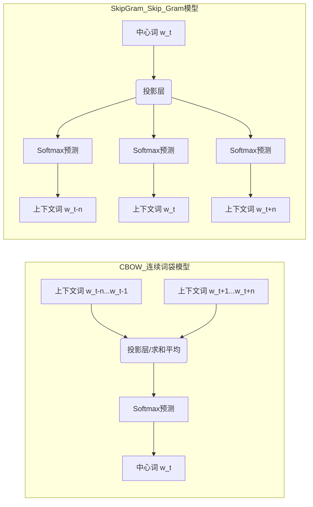
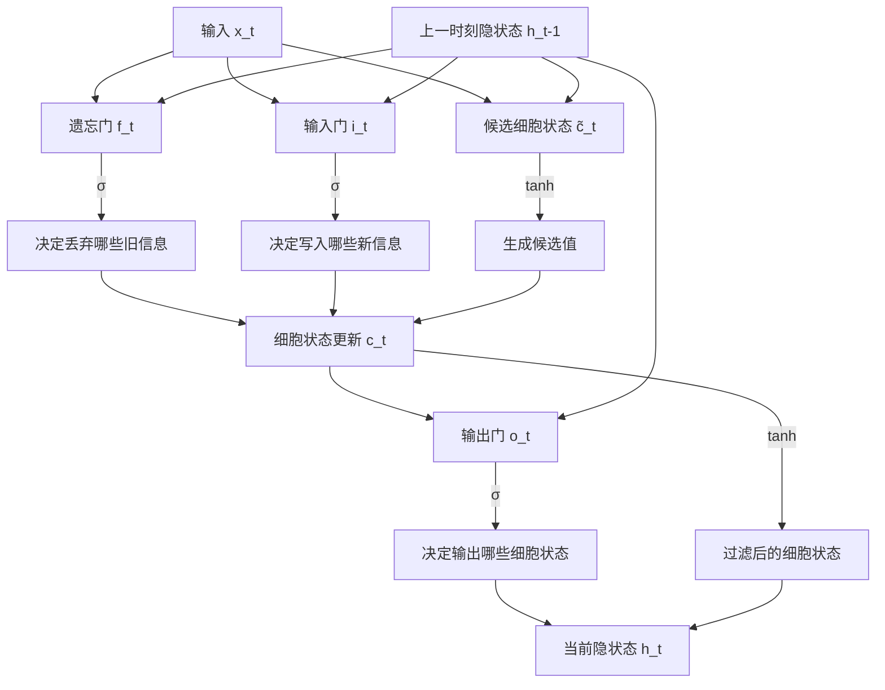
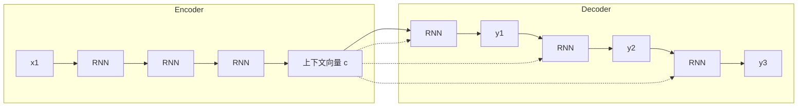
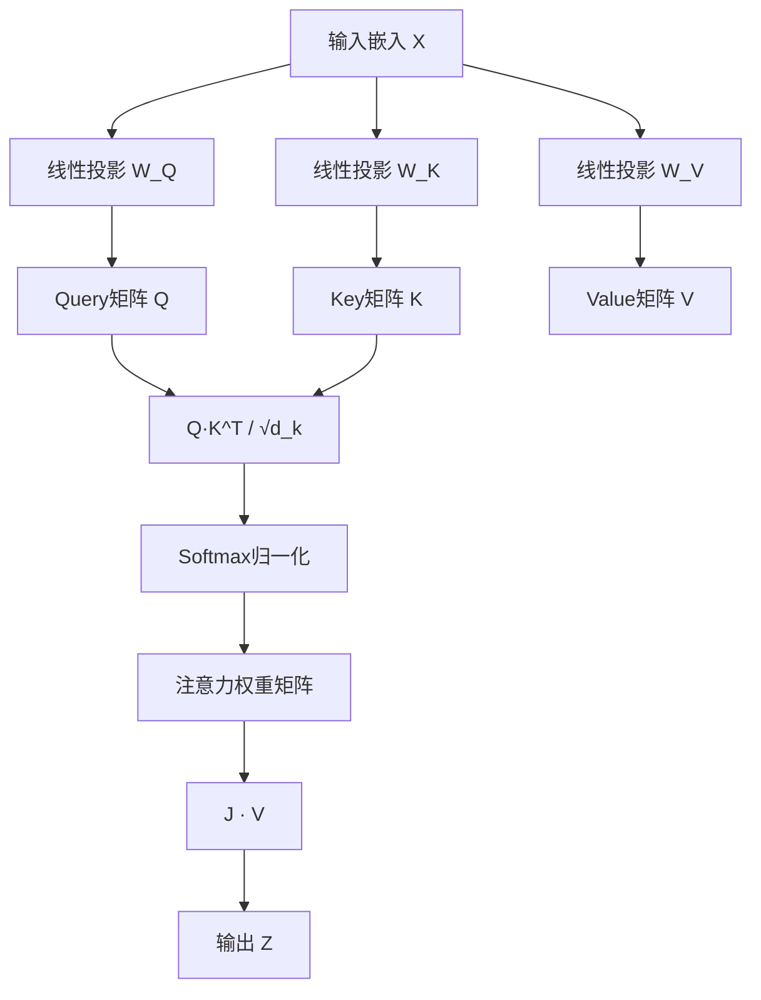
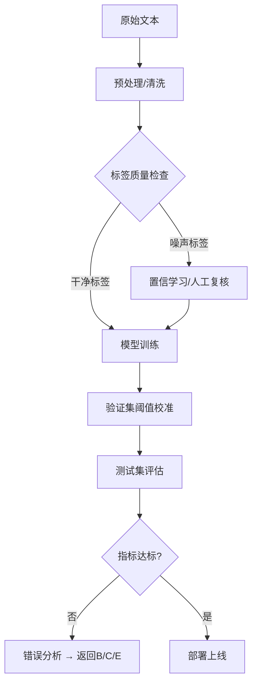
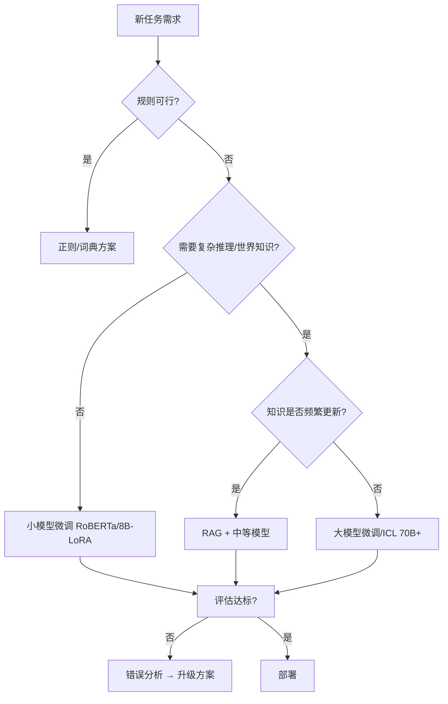

### 一、NLP数学基石与文本表示

#### 1. 为什么需要数学化的语言表示

自然语言处理的核心挑战在于“语义鸿沟”：人类语言是离散、符号化且充满歧义的，而机器学习模型依赖连续、稠密的数值运算。因此，NLP的第一步永远是**文本表示**。这一过程并非简单的编码转换，而是试图在向量空间中重构语言的拓扑结构，使得语义相似的词在几何距离上也彼此靠近。

在深入具体算法之前，需要补充一个关键背景知识：**分布假说**。这是现代NLP的理论基石，由语言学家J.R. Firth提出：“You shall know a word by the company it keeps.”（通过一个词的上下文即可知晓其含义）。这意味着词义不是孤立存在的属性，而是由其与其他词的共现关系定义的。后续所有的词向量模型，本质上都是在用不同的数学手段去拟合这种共现统计规律。

#### 2. 传统文本表示方法的局限性

在深度学习爆发之前，业界主要依赖基于统计的稀疏表示方法。理解这些方法的缺陷，是理解为何需要Word2Vec等稠密向量的前提。

*   **独热编码：** 将词汇表大小为 $V$ 的每个词表示为 $V$ 维向量，仅对应位置为1，其余为0。
    *   *致命缺陷：* 维度灾难（词汇量通常十万级）、完全正交（任意两词内积为0，无法表达“猫”和“狗”的相似性）、极度稀疏导致计算存储效率低下。
*   **词袋模型与TF-IDF：** 忽略词序，仅统计词频或加权词频。
    *   *致命缺陷：* 丢失了语序信息，“我打他”和“他打我”在BoW中是完全相同的向量；TF-IDF虽然引入了逆文档频率来衡量词的重要性，但依然是离散计数，无法捕捉语义层面的类比关系。

> **概念辨析：稀疏 vs 稠密**
> 传统方法是“稀疏”的，意味着大部分维度都是无意义的零；现代词向量是“稠密”的，每一个维度都承载了某种潜在的语义特征（如性别、时态、情感倾向等），尽管这些特征通常是隐式学到的，不可直接解释，但信息密度极高。

#### 3. Word2Vec：神经概率语言模型的里程碑

Word2Vec由Mikolov等人于2013年提出，它不是一个单一算法，而是一个包含两种网络结构的框架。其核心贡献在于证明了**浅层神经网络可以在大规模语料上高效地学习到高质量的词向量**，且这些向量具备线性代数性质（如 $\vec{King} - \vec{Man} + \vec{Woman} \approx \vec{Queen}$）。

##### 3.1 CBOW与Skip-gram架构对比

这两种模型互为镜像，优化目标不同，适用场景也不同：

*   **CBOW：** 利用周围词预测中心词。相当于对上下文做了平滑处理，对语法信息的捕捉更稳健，训练速度快，适合小数据集。
*   **Skip-gram：** 利用中心词预测周围词。保留了更多原始上下文的细节，对低频词和罕见搭配的表征更好，适合大规模语料。

> **关键优化技巧：负采样**
> 原始的Softmax需要对整个词汇表归一化，计算复杂度为 $O(V)$，这在 $V=10^5+$ 时是不可接受的。Negative Sampling将多分类问题转化为多个二分类问题：对于每个正样本，随机抽取 $K$ 个负样本（通常5-20个），只更新这 $K+1$ 个词的梯度。这不仅将复杂度降至 $O(K)$，还意外地起到了正则化效果，提升了向量质量。

##### 3.2 词向量的本质理解

不要将Word2Vec的输出视为“词语的定义”，而应视为**语境压缩后的几何坐标**。每个维度并不对应明确的语义标签，而是多个语义特征的纠缠叠加。这也是为什么Word2Vec被称为“静态”词向量：无论“bank”出现在“river bank”还是“investment bank”中，它的向量表示都是同一个。这种一词一向的特性是其最大瓶颈，直接催生了后续的ELMo和BERT等动态上下文表示模型。

#### 4. GloVe：全局统计与局部窗口的统一

Word2Vec纯粹基于局部窗口内的预测任务，忽略了语料库整体的共现统计信息；而传统的共现矩阵分解虽利用了全局信息，却难以扩展且向量性能不佳。GloVe的设计哲学正是融合二者优势。

其核心思想是构建一个全局共现矩阵 $X$，其中 $X_{ij}$ 表示词 $j$ 出现在词 $i$ 上下文中的次数。然后通过加权最小二乘法拟合如下关系：

$$
\sum_{i,j} f(X_{ij}) (\vec{w}_i^T \tilde{\vec{w}}_j + b_i + \tilde{b}_j - \log X_{ij})^2
$$

其中权重函数 $f(x)$ 的设计至关重要：当共现次数过低时赋予较小权重以减少噪声干扰；当共现次数过高时限制权重增长以避免被高频词主导。这使得GloVe既保留了Word2Vec的训练效率，又吸收了LSA等方法的全局统计优势，在很多基准测试中与Word2Vec表现相当甚至更优，尤其在语义类比任务上更为稳定。

#### 5. 本阶段学习要点总结

| 知识点 | 核心价值 | 常见误区 |
| :--- | :--- | :--- |
| 分布假说 | NLP所有表示学习的理论根基 | 误以为词义是词典定义的，而非上下文决定的 |
| One-Hot/BoW | 理解“为什么要改进”的反面教材 | 认为这些方法已过时无需了解 |
| Word2Vec | 开启深度学习NLP时代的钥匙 | 过度神话，忽视其静态表示的根本局限 |
| Negative Sampling | 工程落地的关键优化 | 误以为是近似误差，实则是有效的训练策略 |
| GloVe | 连接统计方法与神经方法的桥梁 | 误以为只是另一种Word2Vec变体 |

掌握以上内容后，便具备了理解后续RNN、Attention乃至Transformer所需的向量空间直觉。下一阶段将在此基础上，探讨如何让模型不仅记住“词是什么”，更能记住“词在序列中的位置与依赖关系”。

### 二、序列建模与神经网络演进

#### 1. 从静态表示到动态序列建模

上一阶段解决了“词如何表示”的问题，但自然语言本质上是**时序信号**。同一个词在不同位置、不同上下文中承载的信息截然不同。RNN及其变体的出现，标志着NLP从“词袋时代”正式迈入“序列建模时代”。这一阶段的核心命题是：**如何在有限参数的神经网络中，有效捕获任意长度的上下文依赖关系**。

需要补充的背景知识是：**马尔可夫假设的局限**。传统n-gram语言模型假设当前词只依赖前n-1个词，这在n较小时丢失长程信息，n较大时又面临数据稀疏灾难。RNN通过引入隐状态作为“记忆载体”，理论上可以捕获无限长的历史依赖，从而摆脱了固定窗口的束缚。

#### 2. RNN的梯度困境与LSTM/GRU的破局

基础RNN的公式看似简洁：$h_t = \tanh(W_{hh} h_{t-1} + W_{xh} x_t + b)$，但在实际训练中几乎无法使用。其根本原因在于**梯度消失与梯度爆炸**：反向传播时，梯度需要经过多个时间步的连乘，若权重矩阵的特征值小于1，梯度指数级衰减；大于1则指数级膨胀。这使得模型要么学不到长距离依赖，要么训练不稳定。

##### 2.1 LSTM：门控机制的精巧设计

LSTM通过引入**细胞状态**和三个门控单元，将“记忆”与“输出”解耦，从根本上缓解了梯度消失问题：

- **遗忘门：** 控制历史信息的保留比例，使模型能主动“忘记”无关上下文。
- **输入门：** 控制新信息的写入强度，避免噪声干扰。
- **输出门：** 控制细胞状态向隐状态的暴露程度，实现读写分离。

> **概念辨析：细胞状态 vs 隐状态**  
> 这是理解LSTM的关键。细胞状态是一条贯穿所有时间步的“传送带”，信息可以近乎无损地流动（梯度通路畅通）；而隐状态是经过输出门筛选后的“摘要”，用于传递给下一层或作为预测依据。正是这种分离，使得LSTM既能记住长远信息，又能灵活控制当前输出。

##### 2.2 GRU：工程实践的折中之选

GRU将遗忘门和输入门合并为**更新门**，并引入**重置门**，参数比LSTM少约25%。大量实证研究表明，在多数NLP任务上GRU与LSTM性能相当，但训练更快、调参更简单。对于初学者或资源受限场景，GRU往往是更务实的选择。

#### 3. Seq2Seq架构：编码器-解码器范式

Seq2Seq是机器翻译、文本摘要等序列到序列任务的通用框架，其核心思想是将变长输入编码为固定长度的**上下文向量**，再由此解码出变长输出。

> **瓶颈问题：信息压缩损失**  
> 无论输入序列多长，都被压缩为一个固定维度的向量c。当句子较长时，早期信息必然被后期信息覆盖或稀释。这就像要求一个人读完一整篇文章后，仅凭一句话复述全部内容——信息丢失不可避免。这一问题直接催生了Attention机制。

#### 4. Attention机制：选择性聚焦的革命

Attention的本质不是“注意力”，而是**可微分的软检索**。它允许解码器在每一步生成时，动态地从编码器所有隐状态中加权聚合相关信息，而非依赖单一的上下文向量。

##### 4.1 Bahdanau Attention详解

2. 通过Softmax归一化得到注意力权重 $\alpha_{tj}$，表示源语言第j个词对当前目标词的重要性；
3. 加权求和得到上下文向量 $c_t = \sum_j \alpha_{tj} h_j$；

> **关键洞察：Attention是对齐，更是解释性**  
> 注意力权重矩阵天然提供了源语言与目标语言之间的对齐关系。例如翻译“The cat sat on the mat”为法语时，“chat”对应的注意力峰值会落在“cat”上。这不仅提升了性能，还赋予了模型一定程度的可解释性——这在深度学习黑箱时代尤为珍贵。

##### 4.2 Beam Search：解码策略的工程考量

贪心解码每步选概率最高的词，容易陷入局部最优。Beam Search维护k个候选序列，每步扩展并保留top-k，最终选择整体得分最高的序列。k通常取3-10，过大反而因搜索空间噪声导致性能下降。需注意：Beam Search优化的是序列级目标，而非词级交叉熵，因此评估指标应与训练目标一致。

#### 5. 本阶段学习要点总结

|知识点|核心价值|实践建议|
|:--|:--|:--|
|梯度消失/爆炸|理解为何基础RNN不可用|永远不要在生产中使用vanilla RNN|
|LSTM/GRU门控|解决长程依赖的标准方案|优先尝试GRU，性能不足再换LSTM|
|Seq2Seq瓶颈|理解Attention出现的必然性|固定长度编码是信息损失的根源|
|Attention机制|动态上下文聚合+可解释性|可视化注意力矩阵辅助调试|
|Beam Search|序列生成的质量保障|k值需根据任务特性调优，非越大越好|

掌握以上内容后，便具备了理解Transformer的前置知识。值得注意的是，Attention虽解决了Seq2Seq的信息瓶颈，但其计算仍依赖于RNN的顺序处理，无法并行化。下一阶段将探讨如何通过Self-Attention彻底抛弃循环结构，实现真正的并行序列建模，并为预训练语言模型奠定架构基础。

### 三、Transformer架构与预训练语言模型

#### 1. 范式转移：从循环到自注意力

如果说RNN/LSTM解决了“序列建模”的问题，那么Transformer则解决了“序列建模的效率与上限”问题。2017年《Attention Is All You Need》的发表，标志着NLP彻底告别了循环归纳偏置。这一变革的核心动力并非仅仅是理论创新，更是**硬件适配性**：GPU擅长并行矩阵运算，而RNN的顺序依赖特性使其无法充分利用算力。Transformer通过Self-Attention将序列中任意两个位置的计算路径缩短为 $O(1)$，不仅实现了完全并行化，还从根本上消除了长程依赖的梯度衰减问题。

> **背景补充：归纳偏置的取舍**  
> RNN内置了“局部性”和“顺序性”的强归纳偏置，这在小数据时代是优势，但在大数据时代反而成为瓶颈。Transformer几乎不带任何序列相关的先验假设，将所有关系学习都交给数据和注意力机制。这种“弱偏置+大数据+大算力”的组合，正是后来大模型涌现能力的基础前提。理解这一点，比记住公式更重要。

#### 2. Self-Attention机制全解

Self-Attention是Transformer的灵魂。与Seq2Seq中Decoder对Encoder的交叉注意力不同，Self-Attention是序列内部每个位置对所有其他位置的直接交互。

##### 2.1 Q/K/V的物理直觉

许多教程将Query、Key、Value类比为数据库检索，但这容易让人忽略其在神经网络中的实际作用。更准确的理解是：

- **Query：** “我在寻找什么信息？”——由当前位置的输入线性变换得到，代表当前的语义需求。
- **Key：** “我有什么信息可供匹配？”——同样由输入变换得到，代表该位置可被检索的特征标签。
- **Value：** “如果被选中，我提供什么内容？”——承载实际的语义载荷。

##### 2.2 多头注意力的必要性

单头注意力只能学到一种关注模式。而自然语言中，同一个词可能需要同时关注语法主语、语义修饰语、指代对象等多种关系。多头机制将Q/K/V分别投影到h个不同的子空间，各自独立计算注意力后再拼接。这等价于让模型拥有h组“观察视角”，每组专注于不同类型的依赖关系。实证表明，不同头确实会自发分化出句法、语义、位置等专门功能。

#### 3. 位置编码：弥补排列不变性缺陷

Self-Attention本身是**排列不变的**：打乱输入顺序，输出仅相应重排，模型无法区分“猫追狗”和“狗追猫”。因此必须显式注入位置信息。

原始论文采用正弦/余弦函数生成固定位置编码，其设计精妙之处在于：相对位置可以通过线性变换从绝对位置中提取，理论上支持外推到未见过的序列长度。然而后续研究发现，这种固定编码在实际训练中表现不如**可学习的位置嵌入**。而在更长序列场景下，RoPE（旋转位置编码）和ALiBi等相对位置编码方案已成为主流，它们通过将位置信息编码进注意力分数本身，而非加到输入上，获得了更好的长度外推能力。

> **概念辨析：绝对位置 vs 相对位置**  
> 绝对位置编码告诉模型“这是第5个词”，相对位置编码告诉模型“这两个词相距3个位置”。对于大多数NLP任务，相对距离比绝对索引更有意义。这也是为什么现代大模型普遍转向相对位置编码的根本原因。

#### 4. 预训练语言模型：BERT与GPT的分野

Transformer提供了架构基础，而“预训练+微调”范式则释放了其真正的威力。核心思想是：在海量无标注文本上通过自监督任务学习通用语言表示，再在少量标注数据上微调适配下游任务。

|维度|BERT|GPT系列|
|:--|:--|:--|
|架构|Transformer Encoder（双向）|Transformer Decoder（单向）|
|预训练目标|Masked LM + Next Sentence Prediction|Next Token Prediction（自回归）|
|上下文感知|双向：同时利用左右文|单向：仅利用左文|
|微调方式|添加任务特定头，全量/部分微调|Prompt/In-Context Learning或指令微调|
|适用任务|理解类（分类、NER、QA抽取）|生成类（翻译、摘要、对话、创作）|

> **关键洞察：NSP任务的争议与启示**  
> BERT原始论文认为Next Sentence Prediction对句子级任务至关重要，但后续研究（如RoBERTa、ALBERT）证明NSP不仅无效甚至有害。真正起作用的是Masked LM本身以及更大的batch size和更长的训练步数。这一教训提醒我们：预训练目标的设计应聚焦于语言建模本身，而非人为构造的辅助任务。

#### 5. 微调策略的演进

从全量微调到参数高效微调，反映了实践者对“预训练知识如何迁移”认知的深化：

- **全量微调：** 所有参数参与更新，性能上限高，但资源消耗大，易过拟合小数据集。
- **Adapter：** 在Transformer层间插入小型瓶颈模块，仅训练新增参数。开创了参数高效微调的先河。
- **LoRA：** 冻结原始权重，在旁路添加低秩分解矩阵 $\Delta W = BA$。数学上等价于在低维子空间中搜索最优权重偏移，参数量仅为全量的0.1%-1%，且推理时无额外延迟（可合并回原权重）。
- **Prompt Tuning / P-Tuning：** 将任务描述转化为可学习的连续向量，冻结整个语言模型。适用于极端低资源场景，但性能通常弱于LoRA。

> **实践建议：LoRA是当前性价比最优解**  
> 除非有充分理由，否则默认使用LoRA进行微调。rank的选择通常在8-64之间，过高收益递减；alpha一般设为rank的1-2倍。配合QLoRA（4bit量化基座+LoRA），单张消费级显卡即可微调7B-13B模型，极大降低了实验门槛。

#### 6. 本阶段学习要点总结

|知识点|核心价值|常见误区|
|:--|:--|:--|
|Self-Attention|并行化+全局依赖捕获|误以为只是“更好的Attention”，忽视其架构革命性|
|多头机制|多视角语义建模|误以为头数越多越好，需权衡计算成本|
|位置编码|恢复序列顺序信息|忽视相对位置编码在现代模型中的主导地位|
|BERT vs GPT|理解双向与单向的适用边界|用BERT做生成或用GPT做抽取式QA|
|LoRA|参数高效微调的工程标准|盲目追求全量微调，忽视资源约束|

掌握以上内容后，便具备了理解大模型底层运作机制的完整知识链。下一阶段将把这些理论落地到具体任务中，探讨如何构建数据处理流水线、选择合适的评估指标，以及在实际业务场景中做出合理的模型选型决策。

### 四、NLP下游任务实战与评估

#### 1. 从通用能力到业务价值落地

前三个阶段构建了从词向量到大模型的技术栈，但技术本身并不直接产生业务价值。本阶段的核心命题是：**如何将预训练模型的通用语言能力，可靠、可量化地映射到具体应用场景中**。这需要跨越三道鸿沟：数据格式的适配、任务范式的选择、以及评估体系的建立。

> **背景补充：下游任务的范式迁移**  
> 传统NLP时代，每个任务都需要独立的模型架构和数据标注；BERT时代统一了“理解类”任务的微调范式；而大模型时代进一步将多数任务统一为“文本生成”或“指令跟随”。这种范式收敛意味着工程重心从“设计模型”转向了“设计Prompt/指令”和“构建高质量数据集”。理解这一趋势，比掌握某个具体任务的trick更具长期价值。

#### 2. 核心下游任务拆解

##### 2.1 文本分类：最基础也最易被低估的任务

文本分类看似简单，却是检验数据质量和模型基线的最佳试金石。实践中需注意：

- **类别不平衡处理：** 真实业务数据几乎总是不平衡的。除过采样/欠采样外，更推荐在损失函数层面使用Focal Loss或Class-Balanced Loss，避免模型被多数类主导。
- **层级标签体系：** 当标签存在父子关系时（如“体育-足球-欧冠”），应采用层级分类或条件概率建模，而非扁平多分类，否则子类别预测会违反父类别约束。
- **阈值校准：** Softmax输出的概率并非真实置信度。对于高风险场景（如内容审核），必须通过验证集进行阈值搜索或使用Platt Scaling校准，而非默认取argmax。

> **关键洞察：分类任务的瓶颈往往不在模型**  
> 大量实践表明，当BERT/RoBERTa等模型在分类任务上达到一定性能后，继续换更大模型收益甚微。真正的提升来自数据清洗、标签一致性校验和难例挖掘。建议将80%精力投入数据侧，而非反复调参。

##### 2.2 命名实体识别：序列标注的工程复杂性

NER是信息抽取的基础，其难点不在于模型，而在于**标注规范的一致性**和**边界歧义的处理**。

- **标注体系选择：** BIO、BIOES、BMES各有优劣。BIOES/BMES因显式标记单字词和结束位置，通常比BIO提升0.5-1个百分点，但标注成本略高。对于中文NER，BMES往往是更优选择。
- **嵌套实体问题：** “北京大学计算机学院”同时包含“北京大学”和“北京大学计算机学院”两个实体。传统序列标注无法处理此类嵌套。解决方案包括：指针网络、Global Pointer、或将NER转化为生成式任务（如UIE）。
- **领域迁移：** 通用NER模型在垂直领域（医疗、法律）性能骤降。优先尝试少样本Prompt + 大模型自动标注扩充数据，再微调小模型，性价比远高于从头标注。

##### 2.3 机器翻译与文本摘要：生成任务的评估陷阱

生成类任务的最大挑战不是生成质量本身，而是**如何可靠地衡量生成质量**。

- **BLEU的局限：** BLEU仅衡量n-gram精确率，对同义替换、语序调整极度敏感，且与人类判断相关性随句子变长而急剧下降。它适合快速迭代筛选，绝不应作为最终验收指标。
- **ROUGE的定位：** ROUGE衡量召回率，更适合摘要任务（关注关键信息是否覆盖），但同样无法判断流畅度和事实准确性。
- **新一代评估方案：** BERTScore利用语义相似度替代精确匹配，与人类判断相关性显著更高；对于事实性要求高的任务（如医疗摘要），必须引入基于知识图谱或LLM-as-Judge的事实核查模块。

> **概念辨析：参考依赖 vs 无参考评估**  
> BLEU/ROUGE/BERTScore都依赖人工撰写的参考答案，但同一输入可能有多个合理输出。无参考评估（如Perplexity、自洽性检测、LLM打分）正逐渐成为补充手段，尤其在开放域生成任务中。但需警惕LLM评估器的偏好偏差——它们倾向于选择更长、更详细的输出。

#### 3. 评估指标体系构建原则

|任务类型|主指标|辅助指标|人类评估要点|
|:--|:--|:--|:--|
|文本分类|Macro-F1 / Weighted-F1|AUC-ROC, Confusion Matrix|标注一致性Kappa系数|
|NER|Span-Level F1|Entity-Type F1, Boundary Accuracy|嵌套实体覆盖率|
|机器翻译|chrF++ / COMET|BLEU (仅趋势参考)|充分性+流畅性双维评分|
|文本摘要|ROUGE-L + BERTScore|FactCC / QAGS (事实性)|信息完整性+忠实度|
|问答系统|EM / F1 (抽取式)|LLM-as-Judge (生成式)|答案正确性+引用可靠性|

> **实践铁律：指标必须与业务目标对齐**  
> 客服场景中，回复的“安全性”和“问题解决率”远比BLEU重要；法律文书生成中，“条款准确性”压倒一切。切勿为了刷榜而优化与业务无关的指标。建议在项目启动时即定义“业务成功指标”，并将其分解为可自动计算的代理指标。

#### 4. 模型选型决策框架

面对具体任务时，应按以下优先级决策：

1. **规则/词典能否解决？** 对于格式固定、逻辑明确的任务（如身份证号提取），正则表达式永远是最优解。
2. **小模型+微调是否足够？** RoBERTa-base/Llama-3-8B-LoRA在多数结构化任务上已接近大模型上限，且推理成本低1-2个数量级。
3. **何时需要70B+大模型？** 仅当任务涉及复杂推理、跨文档综合、或需要广泛世界知识时。且务必先验证小模型确实无法满足需求。
4. **RAG还是微调？** 知识密集型任务优先RAG；风格/格式适配优先微调；两者不互斥，可组合使用。

#### 5. 本阶段学习要点总结

|知识点|核心价值|避坑指南|
|:--|:--|:--|
|数据质量 > 模型大小|分类/NER性能天花板由数据决定|不要盲目堆模型，先做错误分析和数据审计|
|评估指标业务对齐|避免“高分低能”的虚假繁荣|拒绝单一指标崇拜，建立多维评估矩阵|
|生成任务评估革新|BLEU/ROUGE仅作趋势参考|引入BERTScore/LLM-Judge+人工抽检三重验证|
|模型选型最小够用原则|控制成本与复杂度|从规则→小模型→RAG→大模型逐级验证|
|嵌套实体/层级标签|真实场景的常态而非特例|提前规划标注规范，避免后期重构|

至此，四个阶段的学习路径形成完整闭环：从数学表示到序列建模，从Transformer架构到下游落地。建议在实际项目中循环回溯各阶段内容——当遇到生成幻觉时重温Attention机制，当微调效果不佳时反思数据表示，当评估指标失真时回归业务本质。NLP的学习不是线性通关，而是在理论与实践的反复碰撞中螺旋上升。

### 五、练习

本阶段旨在通过分层级的实战训练，将前四个阶段的理论知识转化为可迁移的工程能力。练习题设计遵循“概念辨析→原理推导→工程实现→系统设计”的认知梯度，每道题均标注对应知识模块，便于定位薄弱环节。建议读者先独立完成再对照解析，重点关注解题思路而非标准答案。

#### 1. 基础概念与理论辨析题

此类题目检验对核心概念的精确理解，避免模糊记忆导致的工程误判。

1. **【词向量】Word2Vec的负采样为何能提升训练效率且不影响最终向量质量？请从优化目标和梯度更新两个角度解释，并说明负样本数量K的选择对高频词和低频词的影响差异。**
    
    - _对应模块：_ 一、3.2 Word2Vec优化技巧
    - _考查要点：_ 理解Negative Sampling将Softmax多分类转化为二分类的数学本质；掌握权重函数对词频的校正机制；明确K值并非越大越好，需平衡计算成本与梯度信号强度。
2. **【序列模型】LSTM的细胞状态c_t和隐状态h_t在信息流中扮演什么不同角色？如果移除输出门，仅保留遗忘门和输入门，模型会出现什么问题？请结合梯度传播路径分析。**
    
    - _对应模块：_ 二、2.1 LSTM门控机制
    - _考查要点：_ 区分“记忆存储”与“受控输出”的功能分离；理解输出门对梯度通路的保护作用；认识到无输出门时细胞状态直接暴露会导致梯度不稳定及语义泄露。
3. **【Transformer】Self-Attention中的缩放因子√d_k为什么是必需的？如果不加缩放，当d_k较大时Softmax的输出分布会呈现什么特征？这对反向传播有何具体影响？**
    
    - _对应模块：_ 三、2.1 Q/K/V物理直觉
    - _考查要点：_ 掌握点积方差随维度增长的数学推导；理解Softmax饱和区导致梯度消失的数值问题；明确缩放是数值稳定性手段，而非可选超参数。
4. **【预训练】BERT的Next Sentence Prediction任务被后续研究证明无效甚至有害，其根本原因是什么？RoBERTa等模型取消NSP后性能反而提升，这揭示了预训练目标设计的什么原则？**
    
    - _对应模块：_ 三、4 BERT与GPT分野
    - _考查要点：_ 识别NSP任务过于简单且与语言建模目标不一致；理解“数据规模+训练充分性”比“复杂辅助任务”更重要；掌握自监督目标应聚焦于语言内在规律的原则。

#### 2. 原理推导与代码实现题

此类题目要求动手验证理论，强化对算法细节的掌控力。

5. **【注意力可视化】使用PyTorch实现一个单头Self-Attention层，输入为形状(batch_size, seq_len, d_model)的张量。要求：**
    
    - 手动实现Q/K/V投影、缩放点积、Softmax及加权求和；
    - 保存注意力权重矩阵，并对一个示例句子绘制热力图；
    - 对比添加/移除缩放因子时注意力权重的分布差异，用直方图展示。
    - _对应模块：_ 三、2 Self-Attention全解
    - _验收标准：_ 代码可运行；热力图显示合理的token间关联；直方图清晰展示缩放前后的分布变化。
6. **【LoRA微调】给定一个冻结的线性层W∈R^{d×d}，实现LoRA旁路模块。要求：**
    
    - 初始化低秩矩阵A∈R^{d×r}和B∈R^{r×d}，其中r<<d；
    - 实现前向传播：y = xW + α·x·B·A；
    - 验证合并推理的正确性：训练后将ΔW=αBA合并回W，确认输出一致；
    - 统计参数量，计算相对于全量微调的参数节省比例。
    - _对应模块：_ 三、5 微调策略演进
    - _验收标准：_ 合并前后输出误差<1e-6；参数量计算准确；理解α的作用及rank选择的影响。
7. **【NER标注转换】编写函数将BIO标注序列转换为BMES格式，并处理以下边界情况：**
    
    - 单字词实体（如“京”）；
    - 相邻同类型实体（如“北京上海”）；
    - 非法BIO序列（如I标签前无B标签）。
    - _对应模块：_ 四、2.2 命名实体识别
    - _验收标准：_ 覆盖所有边界case；非法输入有明确错误提示；转换结果可通过逆向验证。

#### 3. 工程实践与问题分析题

此类题目模拟真实项目场景，培养系统性思维和问题诊断能力。

8. **【分类任务错误分析】你训练的文本分类模型在测试集上Macro-F1为0.85，但业务方反馈“关键类别漏检严重”。请设计一套完整的错误分析流程，包括：**
    
    - 如何定位是数据问题、模型问题还是评估问题；
    - 针对“关键类别漏检”可能的三种根因及对应解决方案；
    - 如何调整评估指标以更好反映业务需求。
    - _对应模块：_ 四、2.1 文本分类 / 四、3 评估体系
    - _答题框架：_ 混淆矩阵分析→难例抽样→标签审计→阈值校准→指标重构。
9. **【生成任务评估困境】你用LLM-as-Judge评估摘要生成质量，发现评分普遍偏高且与人工判断相关性仅0.4。请分析可能原因并提出改进方案。**
    
    - _对应模块：_ 四、2.3 生成任务评估陷阱
    - _考查要点：_ 识别LLM评估器的长度偏好、自我偏好、指令遵循偏差；提出多维度分解评估、参考样例锚定、人工校准子集等缓解策略。
10. **【模型选型决策】某法律科技公司需构建合同条款风险识别系统，要求：**
    
    - 支持50+种风险类型，部分类型定义模糊；
    - 日均处理1万份合同，响应时间<2秒；
    - 法规每月更新，需快速适配新条款。  
        请给出技术方案选型及理由，包括基座模型选择、微调/RAG策略、部署架构及持续迭代机制。
    - _对应模块：_ 四、4 模型选型决策框架
    - _答题要点：_ 小模型微调处理已知风险类型+RAG应对法规更新；量化部署满足延迟要求；建立自动化评测流水线监控漂移；预留大模型兜底通道处理长尾case。

#### 4. 综合设计与开放思考题

此类题目无标准答案，重在培养技术判断力和前瞻性思维。

11. **【架构演进反思】Transformer完全抛弃了循环归纳偏置，但在某些任务（如超长文档理解、实时语音流处理）上仍显不足。请结合近年来的State Space Models（如Mamba）、Linear Attention等研究方向，讨论：**
    
    - Transformer的哪些特性在这些场景中成为瓶颈；
    - 新架构如何尝试兼顾并行训练与高效推理；
    - 你认为未来NLP架构会更趋统一还是进一步分化？为什么？
    - _对应模块：_ 三、1 范式转移 / 三、6 学习总结
    - _评价维度：_ 对Transformer局限性的准确认知；对新方向的理解深度；论证的逻辑自洽性。
12. **【评估伦理与业务对齐】某医疗问答系统BLEU和BERTScore均达SOTA，但临床医生拒绝使用，理由是“回答看似流畅但关键用药剂量错误”。请重新设计该系统的评估体系，要求：**
    
    - 定义与临床安全直接挂钩的可自动计算代理指标；
    - 设计人机协同的评估流程，平衡效率与可靠性；
    - 说明如何将评估结果反馈至数据/模型迭代闭环。
    - _对应模块：_ 四、3 评估体系 / 四、5 学习总结
    - _核心价值：_ 超越技术指标崇拜，建立以领域安全和业务价值为中心的评估哲学。

