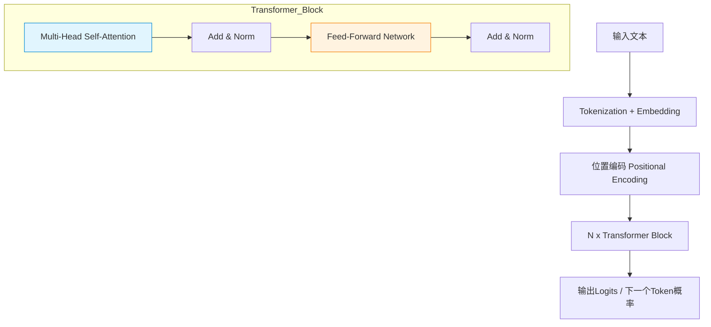
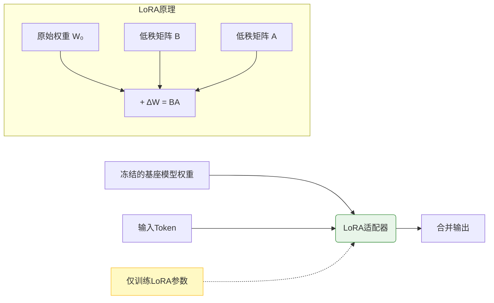
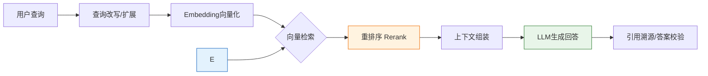
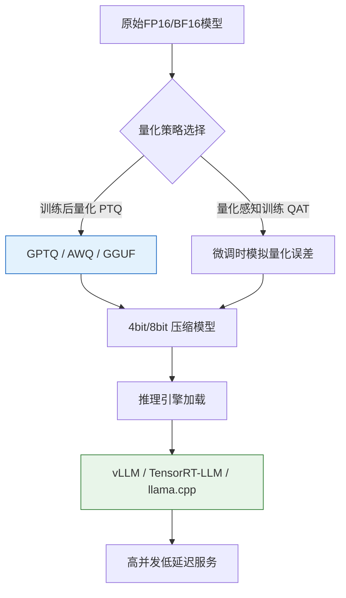

### 一、大模型基础理论与核心架构

#### 1.1 大语言模型发展脉络与技术范式转移

大语言模型（Large Language Model, LLM）并非凭空出现，而是自然语言处理（NLP）技术长期演进的产物。理解其发展脉络，有助于把握当前技术栈的设计哲学。

- **统计机器学习时代**：早期NLP依赖人工特征工程（如TF-IDF、n-gram）和传统分类器（SVM、CRF）。这一阶段的瓶颈在于语义理解能力弱，泛化性差，且严重依赖领域专家知识。
- **深度学习与表示学习时代**：Word2Vec、GloVe等词嵌入技术的出现，让计算机首次能以稠密向量表示语义。随后RNN/LSTM引入了序列建模能力，但受限于梯度消失和无法并行计算，难以处理长文本。
- **预训练-微调（Pre-train & Fine-tune）范式**：BERT的出现标志着NLP进入新时代。通过在大规模无标注语料上进行自监督预训练，模型习得了通用的语言表示能力，下游任务只需少量标注数据微调即可。
- **大模型与涌现能力（Emergent Abilities）**：当模型参数量突破临界值（通常认为在10B-100B级别），模型展现出小模型不具备的推理、代码生成、少样本学习等能力。这标志着从“专用模型”向“通用基座模型”的质变。

> **💡 概念解析：涌现能力**  
> “涌现”是指复杂系统中，当规模达到一定程度时，突然出现的、无法通过简单叠加小规模行为预测的新特性。在大模型语境下，这意味着模型能力的提升不是线性的。例如，一个7B参数的模型可能完全无法进行多步数学推理，而将参数扩展到70B后，无需专门训练该能力，模型便自然具备了推理链（Chain-of-Thought）能力。这提示我们在选型时，不能仅凭小模型的表现线性外推大模型的效果。

#### 1.2 Transformer架构深度解析

Transformer是当前几乎所有主流大模型的基石。其核心创新在于彻底抛弃了循环结构，完全基于注意力机制实现序列建模。

**核心组件详解：**

1. - **Q (Query)**: 当前token想要查找的信息。
    - **K (Key)**: 其他token提供的索引信息。
    - **V (Value)**: 其他token的实际内容信息。
    - : 缩放因子，防止点积结果过大导致softmax梯度消失。
2. **多头注意力（Multi-Head Attention）**：  
    将Q、K、V投影到多个不同的子空间并行计算注意力，最后拼接结果。这使模型能同时关注语法、语义、指代等不同层面的信息，增强了表达能力。
    
3. **前馈神经网络（FFN）**：  
    每个Transformer块包含一个两层MLP。研究表明，FFN层实际上充当了“知识存储器”，大量事实性知识被压缩存储在这些权重中，而注意力层则负责“知识检索与整合”。
    
4. **位置编码（Positional Encoding）**：  
    由于自注意力机制本身是排列不变的（即不感知顺序），必须显式注入位置信息。原始Transformer使用正弦余弦函数，现代大模型普遍采用**旋转位置编码（RoPE）**，它能更好地支持长度外推，即在推理时处理比训练时更长的序列。
    

> **💡 背景补充：为什么RNN被淘汰？**  
> RNN按时间步串行计算，第t步必须等待第t-1步完成，这导致两个致命问题：一是训练无法并行化，GPU利用率极低；二是长程依赖传递路径过长，即使有LSTM门控，信息仍会衰减。Transformer通过自注意力实现了$O(1)$的路径长度和完全的并行计算，使得在海量数据上训练超大模型成为可能。这也是大模型时代到来的硬件前提。

#### 1.3 大模型的训练三阶段

现代大模型的构建通常遵循严格的三阶段流程，每个阶段的目标和数据截然不同。

|阶段|目标|数据规模|数据类型|关键技术|
|:--|:--|:--|:--|:--|
|**预训练 (Pre-training)**|学习通用语言表示与世界知识|TB级tokens|网页、书籍、代码、论文等无标注文本|Next Token Prediction, 分布式训练|
|**监督微调 (SFT)**|学会遵循指令，对齐人类意图|万~百万条|高质量指令-回复对|LoRA/全量微调, 对话模板|
|**人类反馈强化学习 (RLHF/DPO)**|提升安全性、有用性，减少幻觉|万~十万条偏好数据|排序/选择数据|PPO算法, DPO直接偏好优化|

**关键认知：**

- **预训练决定了模型的能力上限**：如果预训练数据质量差或规模不足，后续微调无法弥补根本性的知识缺失。这就是所谓的“Garbage In, Garbage Out”。
- **SFT是能力激活器**：预训练模型本质上是一个“文本续写器”，SFT通过对话格式的数据，将其转化为“问答助手”。SFT数据的质量远比数量重要，少量高质数据往往优于大量低质数据。
- **对齐（Alignment）是安全阀**：未经对齐的模型可能输出有害、偏见或不符合人类价值观的内容。DPO（Direct Preference Optimization）作为RLHF的简化替代方案，因训练稳定、超参数少，已成为当前社区的主流选择。

> **💡 概念解析：Next Token Prediction 的深层含义**  
> 表面上看，预训练只是在做“猜下一个词”的填空题。但为了准确预测下一个词，模型被迫学习语法规则、逻辑推理、事实关联甚至世界模型。例如，要预测“The capital of France is ___”的下一个词，模型必须“知道”巴黎是法国首都。因此，这个看似简单的目标函数，实质上是一个强大的自监督学习信号，驱动模型压缩并内化了人类语言的底层规律。

### 二、大模型微调技术与实战

#### 2.1 微调的核心价值与适用边界

在深入技术细节之前，必须明确微调（Fine-tuning）在大模型应用生态中的定位。微调并非万能钥匙，其核心价值在于**行为对齐**与**领域适配**，而非单纯的知识注入。

- **行为对齐**：让基座模型学会特定的输出格式（如JSON、SQL）、遵循复杂的业务指令流程，或适应特定的语言风格（如法律文书、医疗问诊）。这是提示词工程（Prompt Engineering）难以稳定实现的。
- **领域术语适配**：让模型理解并正确使用垂直领域的专业词汇和缩写，减少因术语陌生导致的幻觉。
- **知识注入的局限性**：若目标是让模型“记住”大量新事实（如企业内部规章、最新产品参数），微调效率远低于检索增强生成（RAG）。微调更适合学习“如何运用知识”，而非“存储知识”。

> **💡 概念辨析：微调 vs RAG**  
> 一个常见的误区是试图用微调替代RAG。实际上，两者是互补关系：
> 
> - **微调**改变的是模型的“认知模式”和“表达方式”，类似于教一个人新的思维框架或写作规范。
> - **RAG**提供的是“外部记忆”和“实时信息”，类似于给这个人配备了一个可随时查阅的资料库。  
>     最佳实践通常是：**用微调让模型学会正确地调用RAG返回的内容，并用RAG为微调后的模型提供准确的事实依据**。

#### 2.2 参数高效微调（PEFT）技术体系

全量微调（Full Fine-tuning）对显存和算力的要求极高，对于7B以上模型往往不切实际。参数高效微调通过在冻结预训练权重的基础上，仅训练极少量新增参数，实现了接近全量微调的效果。

**主流PEFT方法对比：**

|方法|核心思想|参数量|优势|劣势|
|:--|:--|:--|:--|:--|
|**LoRA**|在注意力层旁路添加低秩分解矩阵ΔW=BA|0.1%~1%|训练快、显存省、可插拔、社区支持最好|对秩r敏感，极端任务可能欠拟合|
|**QLoRA**|LoRA + 4bit量化基座 + 双量化 + 分页优化器|<0.1%|单卡可微调70B模型，效果接近全量|训练速度略慢于LoRA，量化可能损失精度|
|**P-Tuning v2**|在每层Transformer输入添加可训练连续提示向量|~0.1%|不修改模型结构，适合NLU任务|生成任务表现通常弱于LoRA|
|**Adapter**|在FFN后插入小型瓶颈层|1%~3%|模块化设计，可组合多个适配器|引入额外推理延迟，LoRA普及后使用减少|

> **💡 背景补充：LoRA为何有效？**  
> LoRA的理论基础是“低秩假设”：大模型在适应下游任务时，权重的变化量ΔW具有极低的内在秩（intrinsic rank）。这意味着虽然ΔW的维度很大，但其有效信息可以被压缩到两个小矩阵的乘积中。实践中，秩r=8或16往往足以胜任大多数SFT任务，过高的r反而可能导致过拟合。QLoRA进一步通过将基座模型量化至4bit NF4格式，并将梯度检查点与分页优化器结合，使得在消费级显卡上微调大模型成为现实，极大降低了技术门槛。

#### 2.3 指令数据集构建与质量控制

数据质量是微调成败的决定性因素。一个高质量的指令数据集应包含多样化的任务类型、清晰的指令描述和准确的回复。

**数据集构建关键原则：**

1. **多样性覆盖**：确保涵盖目标场景下的各类任务（问答、摘要、分类、生成、推理等），避免模型过度拟合单一模式。
2. **指令清晰无歧义**：指令应明确指定输入格式、输出要求和约束条件。模糊的指令会导致模型输出不稳定。
3. **回复准确且一致**：回复必须由领域专家审核或经可靠来源验证。错误的回复会被模型内化为“正确知识”，导致严重幻觉。
4. **格式标准化**：统一使用对话模板（如ChatML、Alpaca格式），确保训练与推理时的tokenization一致。

**数据清洗与增强策略：**

- **去重**：使用MinHash或SimHash去除高度相似样本，防止模型记忆特定样本而非学习泛化模式。
- **难度分级**：混合简单、中等、复杂样本，帮助模型建立稳健的能力梯度。
- **负样本构造**：适当加入“拒绝回答”或“澄清追问”的样本，提升模型的安全性和交互合理性。
- **合成数据**：利用强模型（如GPT-4）生成初始数据，再经人工校验，可大幅提升数据生产效率。但需注意合成数据的分布偏差问题。

> **💡 实践警示：数据污染的后果**  
> 若微调数据中混入了测试集内容或互联网上广泛流传的基准测试题目，模型会在评测中表现出虚假的高分，但在真实场景中性能骤降。务必在数据准备阶段就严格划分训练/验证/测试集，并对数据进行溯源检查。此外，过度清洗导致数据分布过于“完美”，也可能削弱模型的鲁棒性——真实世界的用户输入往往是 noisy 的，模型需要具备一定的容错能力。

#### 2.4 微调训练流程与关键超参数

一个完整的微调流程包括环境配置、数据加载、训练监控和模型合并四个环节。以下是影响训练效果的核心超参数及其调优建议：

|超参数|推荐范围|作用与调优建议|
|:--|:--|:--|
|**Learning Rate**|1e-5 ~ 3e-4|LoRA通常比全量微调高一个数量级。建议使用cosine调度器配合warmup。过高导致loss震荡，过低收敛缓慢。|
|**Epochs**|2 ~ 5|SFT数据量小时可适当增加epoch，但需密切监控验证集loss以防过拟合。大数据集通常1-2 epoch即可。|
|**Batch Size**|尽可能大|受显存限制，可通过梯度累积（Gradient Accumulation）模拟大batch。大batch有助于训练稳定性。|
|**LoRA Rank (r)**|8, 16, 32|从r=8开始尝试，若验证集loss持续下降但训练集loss已很低，说明欠拟合，可提高r。|
|**LoRA Alpha**|通常为r的1-2倍|控制LoRA更新的缩放比例。alpha/r的比值决定了LoRA的实际学习率。|
|**Max Sequence Length**|根据任务设定|截断过长样本会丢失关键信息，padding过短浪费算力。建议分析数据长度分布后设定合理值。|

**训练监控要点：**

- **训练Loss**：应平稳下降。若出现剧烈波动，优先检查学习率和数据质量。
- **验证Loss**：若训练Loss下降而验证Loss上升，表明过拟合，应提前停止或增加正则化。
- **生成样例评估**：定期在验证集上生成文本进行人工评估，Loss不能完全反映生成质量。有时Loss略高但生成更符合预期。

> **💡 背景补充：为什么SFT的学习率比预训练高？**  
> 预训练是在海量数据上从零学习语言表示，需要非常小的学习率以保证训练稳定。而SFT是在已有强大语言能力的基础上进行“行为调整”，数据量小且目标明确，需要更大的学习率才能有效更新权重以适应新任务。LoRA由于只更新少量参数，其有效梯度信号较弱，因此通常需要更高的名义学习率来达到与全量微调相当的更新幅度。

### 三、检索增强生成（RAG）与Agent开发

#### 3.1 RAG架构原理与核心价值

检索增强生成（Retrieval-Augmented Generation, RAG）是当前解决大模型幻觉、知识时效性不足及私有数据接入问题的工业级标准方案。其核心思想是将“参数化记忆”（模型权重）与“非参数化记忆”（外部知识库）解耦，通过检索机制为生成过程提供实时、准确的事实锚点。

**RAG相比纯微调的优势：**

- **知识可更新**：无需重新训练模型，只需更新知识库即可同步最新信息。
- **可追溯性**：每个回答均可关联到具体文档片段，支持事实核查与审计。
- **成本可控**：避免了频繁微调带来的算力消耗，且推理时仅加载相关上下文。
- **权限控制**：可在检索层实现细粒度的数据访问控制，满足企业合规需求。

> **💡 概念解析：参数化记忆 vs 非参数化记忆**  
> 大模型的权重是“参数化记忆”，知识被压缩编码在数十亿参数中，难以精确提取、更新或验证。而向量数据库中的文档块是“非参数化记忆”，以原始或半结构化形式存储，支持精确检索和动态增删。RAG的本质是让模型从“凭印象回答”转变为“查资料后回答”，这与人类专家的工作方式高度一致。理解这一区分，有助于避免试图用微调解决所有知识问题的误区。

#### 3.2 高级RAG优化策略

基础RAG（Naive RAG）在实际应用中常面临检索不准、上下文冗余、多跳推理失败等问题。以下是经过验证的进阶优化技术：

1. **查询预处理**
    
    - **查询改写（Query Rewriting）**：将模糊、口语化的用户问题转化为更适合检索的结构化查询。例如，将“这东西怎么用？”结合对话历史改写为“XX产品V2.0安装步骤”。
    - **HyDE（Hypothetical Document Embeddings）**：先让LLM生成一个假设性的答案，再用该答案的向量去检索真实文档。这解决了查询与文档在语义空间不对齐的问题。
    - **子问题分解**：对复杂多跳问题自动拆解为多个原子问题，分别检索后再综合回答。
2. **检索增强**
    
    - **混合检索（Hybrid Search）**：结合向量检索（语义匹配）与BM25（关键词匹配），兼顾语义理解和精确术语匹配。
    - **重排序（Reranking）**：使用Cross-Encoder等精排模型对初检结果重新打分，显著提升Top-K相关性。这是性价比最高的优化手段之一。
    - **元数据过滤**：利用时间、来源、类别等元数据进行硬过滤，缩小检索范围，提高精度。
3. **上下文优化**
    
    - **压缩与摘要**：对检索到的长文档块进行摘要或关键句提取，减少无关token占用。
    - **Lost in the Middle缓解**：研究表明LLM对上下文中间位置的信息关注度较低。可将高相关性内容置于开头和结尾，或采用递归摘要策略。

> **💡 实践警示：RAG不是银弹**  
> RAG的效果高度依赖知识库质量。若原始文档本身混乱、过时或相互矛盾，再先进的检索算法也无法产出可靠答案。**“垃圾进，垃圾出”在RAG中体现得尤为明显**。建议在投入RAG优化前，优先建立知识库治理流程：包括文档清洗、分块策略验证、定期更新机制和质量抽检。此外，RAG增加了系统复杂度，需权衡性能增益与延迟、成本之间的关系。

#### 3.3 智能体（Agent）设计模式与工具调用

当任务超出单一问答范畴，需要规划、决策、执行多步操作时，Agent架构成为必然选择。Agent = LLM + 规划能力 + 工具使用 + 记忆系统。

**主流Agent设计范式：**

|范式|代表框架|特点|适用场景|
|:--|:--|:--|:--|
|**ReAct**|LangChain, AutoGPT|思考-行动循环交替，显式推理轨迹|通用任务、调试友好|
|**Plan-and-Solve**|LlamaIndex Agents|先生成完整计划再逐步执行|复杂多步任务、减少试错|
|**Multi-Agent**|CrewAI, AutoGen|多个角色协作，分工明确|模拟团队工作流、代码生成+审查|
|**Workflow-Based**|Dify, Coze|可视化编排，确定性流程+LLM节点|生产环境、需强可控性|

**工具调用（Function Calling）关键要素：**

- **工具描述质量**：LLM依赖工具的name、description和parameters schema来决定何时调用及如何传参。描述必须精确、无歧义，包含使用示例和边界条件。
- **错误处理机制**：工具执行可能失败。Agent应具备重试、降级或请求用户澄清的能力，而非直接崩溃。
- **安全沙箱**：代码执行、文件操作等高风险工具必须在隔离环境中运行，防止恶意注入或意外破坏。

> **💡 背景补充：从Chain到Agent的演进**  
> 早期的LangChain Chain是静态的DAG，执行路径在编译时确定，无法根据中间结果动态调整。Agent引入了LLM作为“控制器”，使执行路径成为运行时决策。这带来了灵活性，但也引入了不确定性。在生产环境中，纯开放式Agent风险较高，推荐采用“受控Agent”模式：即在外层用确定性逻辑约束Agent的行为边界，仅在关键环节允许LLM自主决策。这种混合架构兼顾了灵活性与可靠性，是当前工程落地的最佳实践。

#### 3.4 RAG与Agent的融合架构

RAG与Agent并非互斥，而是深度融合的关系。现代智能系统往往将RAG作为Agent的核心工具之一，同时Agent赋予RAG动态适应能力。

**典型融合模式：**

- **Adaptive RAG**：Agent根据问题类型动态选择检索策略（如简单问题直接回答，复杂问题触发多轮检索，事实性问题走SQL查询）。
- **Self-RAG**：模型在生成过程中自我评估是否需要检索、检索结果是否相关、生成内容是否忠实于检索结果，并据此调整行为。
- **RAG as a Tool**：将检索封装为标准工具，Agent可与其他工具（计算器、API、代码解释器）协同使用，实现跨模态任务求解。

这种融合标志着大模型应用从“被动问答”迈向“主动问题解决”的新阶段，也是构建真正智能助手的必经之路。

### 四、模型部署、评估与工程化落地

#### 4.1 模型量化与推理加速技术

大模型从实验环境走向生产环境，首要挑战是推理成本与延迟。量化（Quantization）和推理优化是解决这一问题的核心技术手段，其目标是在可接受的精度损失下，大幅降低显存占用并提升吞吐量。

**主流量化方法对比：**

|方法|比特数|特点|适用场景|
|:--|:--|:--|:--|
|**GPTQ**|4bit/8bit|基于二阶信息校准，GPU推理快，需少量校准数据|GPU服务端部署，追求极致吞吐|
|**AWQ**|4bit|激活感知量化，保护显著权重，精度优于GPTQ|对精度敏感的GPU推理场景|
|**GGUF**|2-8bit|CPU/GPU混合推理，支持纯CPU运行，生态完善|边缘设备、个人电脑、资源受限环境|
|**SmoothQuant**|W8A8|将激活量化难度迁移至权重，实现INT8全链路加速|支持INT8指令集的NVIDIA GPU|

> **💡 概念解析：为什么4bit量化可行？**  
> 传统观点认为神经网络对精度敏感，但研究发现大模型权重呈现显著的“离群值”（Outliers）分布：极少数通道承载了大部分信息量。AWQ等方法通过识别并保留这些关键通道的精度，对其余通道进行激进量化，从而在4bit下仍能保持接近无损的性能。这打破了“量化必然导致严重退化”的认知，使得消费级硬件运行70B+模型成为可能。

**推理引擎选型建议：**

- **vLLM**：采用PagedAttention技术，显存利用率极高，连续批处理（Continuous Batching）能力强，是当前通用GPU推理的首选。
- **TensorRT-LLM**：NVIDIA官方优化库，针对特定GPU架构深度定制，峰值性能最高，但编译复杂、版本耦合度高。
- **llama.cpp**：纯C/C++实现，零依赖，支持Apple Silicon、Android等异构平台，是端侧部署的事实标准。

#### 4.2 大模型评估体系构建

“如何判断模型好不好”是工程落地中最易被忽视却最关键的环节。主观感受不可靠，必须建立系统化、多维度的评估体系。

**评估维度与方法：**

|维度|评估方法|工具/基准|注意事项|
|:--|:--|:--|:--|
|**通用能力**|标准化Benchmark|MMLU, HumanEval, GSM8K|仅反映基础能力，不代表业务效果|
|**任务专项**|领域测试集 + 人工评分|自建Golden Test Set|需覆盖边界case，评分标准需对齐|
|**安全性**|红队测试 + 自动检测|Garak, LLM Guard|需持续更新攻击样本库|
|**RAG效果**|检索/生成分离评估|RAGAS, TruLens|分别衡量召回准确率、答案忠实度|
|**用户体验**|A/B测试 + 隐式反馈|点击率、停留时长、负反馈率|线上真实指标才是最终裁判|

> **💡 实践警示：Benchmark陷阱**  
> 公开基准测试存在严重的数据污染风险，且无法反映特定业务需求。一个在MMLU上得分80的模型，可能在你的客服场景中表现不如得分70的模型。**务必构建与业务强相关的私有评估集**，并将其纳入CI/CD流程：每次模型迭代或RAG配置变更，都必须通过自动化回归测试才能上线。此外，评估集本身也需要定期维护，避免过拟合。

**LLM-as-a-Judge的合理使用：**  
利用强模型（如GPT-4o）作为自动评估器可大幅提升效率，但需注意：

- 提供清晰的评分Rubric和示例，减少评判主观性。
- 对位置偏差、冗长偏好等已知缺陷进行校准。
- 始终保留一定比例的人工复核，监控自动评估器的漂移。

#### 4.3 服务化部署与生产架构

将模型封装为稳定、可扩展的服务，需要考虑高可用、弹性伸缩、可观测性及成本控制。

**生产级部署关键组件：**

- **API网关**：统一鉴权、限流、路由，支持多模型版本灰度发布。
- **负载均衡**：基于队列长度或GPU利用率的智能调度，避免单点过载。
- **缓存层**：对相同或语义相似的请求复用结果（Semantic Cache），显著降低重复计算成本。
- **可观测性**：记录Token用量、延迟分布、错误率及生成内容日志，支持问题追溯与成本分析。
- **安全防护**：输入输出过滤、PII脱敏、Prompt注入检测，确保合规与安全。

**成本优化策略：**

- **模型路由**：简单问题用小模型，复杂问题用大模型，按需分配算力。
- **投机解码（Speculative Decoding）**：用小模型草稿+大模型验证，在不损失精度的前提下提升2-3倍生成速度。
- **Spot实例/预留实例组合**：根据负载波动灵活使用云资源，降低基础设施成本。
- **KV Cache复用**：对系统提示词等固定前缀缓存KV状态，避免重复计算。

> **💡 背景补充：从单机到集群的工程思维转变**  
> 实验阶段关注“能不能跑起来”，生产阶段关注“能不能稳定跑下去”。这意味着需要从确定性思维转向概率性思维：模型输出天然不确定，系统必须设计兜底机制；硬件会故障，服务必须具备自愈能力；流量会波动，架构必须支持弹性伸缩。建议采用“防御性编程”原则：假设一切外部依赖都可能失败，为每个环节设计超时、重试、降级和熔断策略。这种工程素养，往往比模型选型更能决定项目的最终成败。

#### 4.4 持续迭代与闭环优化

大模型应用不是“部署即完成”的项目，而是需要持续运营的产品。建立数据飞轮是实现长期竞争力的关键。

**闭环优化流程：**

1. **收集反馈**：通过显式评价（点赞/点踩）、隐式行为（复制、追问、放弃）及人工抽检获取信号。
2. **问题分析**：归类失败案例（检索错误、生成幻觉、指令遵循差、知识过时等）。
3. **针对性改进**：
    - 检索问题 → 优化分块/Embedding/Rerank
    - 知识缺失 → 更新知识库或触发增量预训练
    - 行为偏差 → 补充SFT数据或调整System Prompt
    - 安全漏洞 → 增加防护规则或红队测试
4. **验证上线**：经评估集回归测试后灰度发布，监控核心指标变化。
5. **数据沉淀**：将高质量的用户交互转化为新的训练/评估数据，反哺下一轮迭代。

> **💡 核心理念：以终为始的工程观**  
> 所有技术选型都应服务于业务目标。不要为了用新技术而用新技术：如果Prompt Engineering能解决问题，就不要微调；如果微调足够，就不要引入复杂的Agent架构；如果单机能扛住流量，就不要过早分布式。**最简单的有效方案，往往是最好的方案**。同时，保持对技术演进的敏感度：今天的最优解可能明天就被新范式取代。建立快速验证、小步迭代的敏捷文化，比押注某个具体技术更重要。这才是大模型时代工程师应有的核心素养。

### 五、练习

本阶段旨在通过多层次、多维度的实战练习，帮助读者将前四个阶段的理论知识转化为解决实际问题的能力。练习题设计遵循“概念辨析→方案设计→工程实操→综合评估”的递进逻辑，覆盖大模型技术全链路核心知识点。建议读者结合自身业务场景或开源数据集完成以下练习，并记录思考过程与实验结果。

#### 5.1 基础理论与架构理解练习

1. **Transformer机制推演**
    - 手动计算一个简化版自注意力层的输出：给定3个token的Q、K、V矩阵（维度为3×4），写出完整的Attention计算步骤，包括缩放点积、softmax归一化及加权求和。
    - 解释为何旋转位置编码（RoPE）比正弦位置编码更适合长文本外推？从数学形式和相对位置建模角度给出分析。
2. **涌现能力验证实验**
    - 选取同一任务（如三位数乘法或代码补全），分别测试1B、7B、13B、70B参数量的开源模型（如Qwen2.5系列）。
    - 记录各模型准确率，绘制“参数量-性能”曲线，观察是否存在性能跃升的临界点，并结合训练数据规模分析原因。
3. **训练三阶段对比分析**
    - 列出预训练、SFT、RLHF/DPO三个阶段在目标函数、数据要求、优化器选择上的关键差异。
    - 思考题：若仅对基座模型做SFT而不做对齐，可能产生哪些具体风险？请举出两个实际案例。

#### 5.2 微调技术与数据工程练习

1. **LoRA超参数敏感性测试**
    - 使用同一份指令数据集（如Alpaca-GPT4中文版子集），固定其他参数，分别设置LoRA rank=4/8/16/32进行微调。
    - 对比验证集Loss、生成质量及训练时长，总结rank选择与任务复杂度的关系。
2. **指令数据集构建实战**
    - 针对一个垂直领域（如法律咨询或设备维修），人工构建50条高质量指令-回复对。
    - 要求包含：多轮对话、拒绝回答样本、格式化输出（JSON/表格）样本。
    - 使用SimHash对自建数据集去重，并与未去重版本微调效果对比。
3. **QLoRA显存优化验证**
    - 在单张24GB显存GPU上，分别用FP16全量微调、LoRA、QLoRA微调7B模型。
    - 记录峰值显存占用、训练速度（tokens/s）及最终模型BLEU分数，量化QLoRA的性价比。

#### 5.3 RAG与Agent开发练习

1. **RAG链路分模块评估**
    - 搭建基础RAG系统，使用RAGAS框架分别评估检索召回率（Recall@5）、答案忠实度（Faithfulness）及答案相关性（Answer Relevancy）。
    - 针对得分最低的环节，实施一项优化（如添加Rerank或HyDE），重新评估并分析改进效果。
2. **查询改写策略对比**
    - 对同一组模糊用户问题（如“这个怎么弄？”“上次说的那个”），分别实现原始查询、LLM改写、HyDE三种检索方式。
    - 人工标注Top-3检索结果的相关性，计算NDCG@3指标，说明哪种策略最适合你的业务场景。
3. **受控Agent工作流设计**
    - 设计一个“会议纪要生成Agent”，要求：自动提取待办事项、分配责任人、发送邮件提醒。
    - 画出状态机流程图，明确哪些步骤由确定性代码执行，哪些步骤允许LLM自主决策，并为每个LLM节点设置超时和降级方案。

#### 5.4 部署、评估与工程化练习

1. **量化精度-性能权衡测试**
    - 将同一7B模型分别转换为GPTQ-4bit、AWQ-4bit、GGUF-Q4_K_M格式。
    - 在相同硬件上测试推理延迟（首token+生成速度）、显存占用及MMLU分数，制作选型决策表。
2. **私有评估集构建与自动化**
    - 基于真实业务日志，筛选100条典型query构建Golden Test Set，包含预期答案要点和评分Rubric。
    - 编写Python脚本调用LLM-as-a-Judge自动评分，并与3位人工评分者的一致性（Cohen's Kappa）进行校验。
3. **生产级服务压测与优化**
    - 使用Locust对vLLM服务进行压力测试，记录不同并发下的P99延迟、吞吐量及错误率。
    - 开启Semantic Cache后重复测试，计算缓存命中率及成本节省比例。
    - 配置Prometheus+Grafana监控面板，展示关键指标实时看板。

#### 5.5 综合项目挑战（可选高阶练习）

选择一个完整业务场景（如智能客服、知识库问答、代码助手），独立完成以下闭环：

1. **需求分析**：明确核心功能、性能指标及安全合规要求。
2. **技术选型**：论证基座模型、微调策略、RAG架构、部署方案的合理性。
3. **数据准备**：构建训练集、评估集及知识库，完成清洗与质检。
4. **系统实现**：完成微调/RAG/Agent开发，部署为API服务。
5. **效果验证**：通过私有评估集+小范围用户测试验证效果，输出优化报告。
6. **文档沉淀**：撰写技术文档，包含架构图、关键决策依据、踩坑记录及后续迭代计划。

