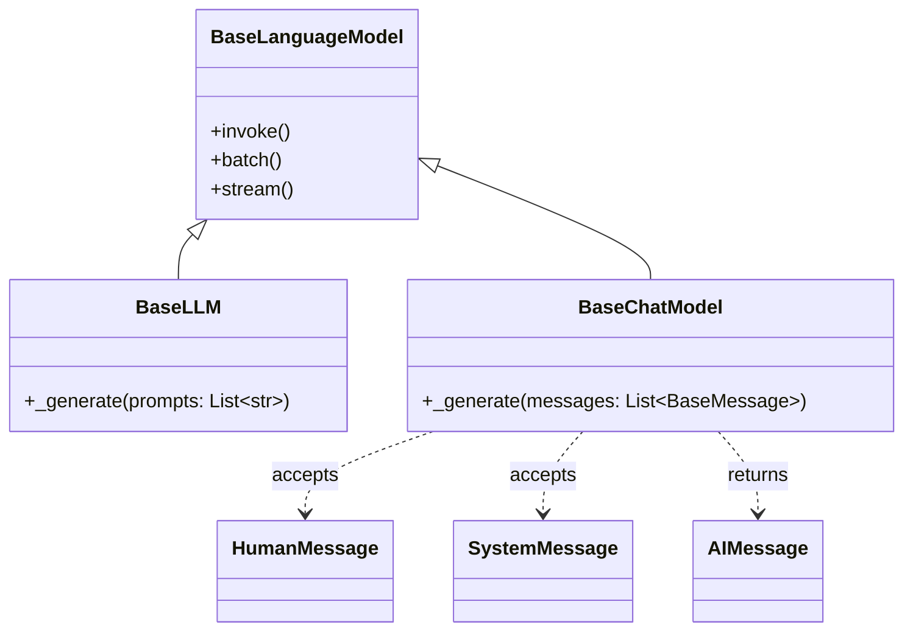
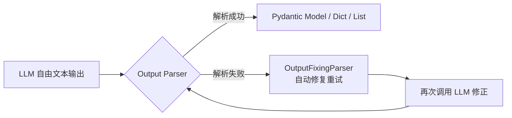
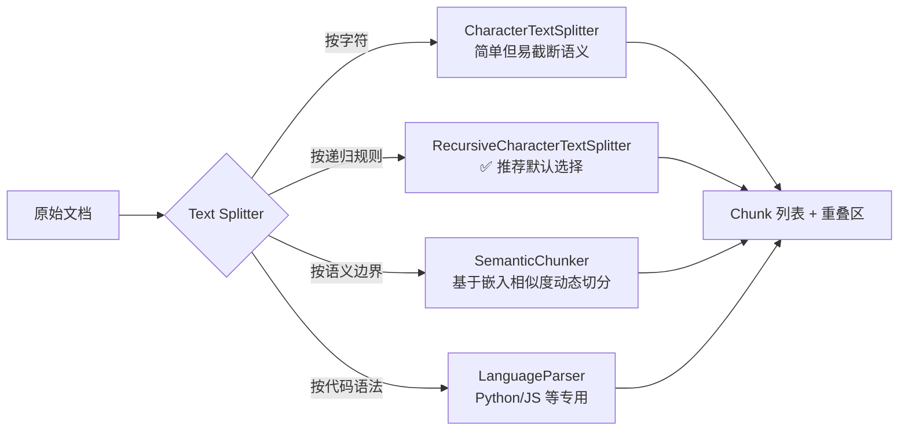
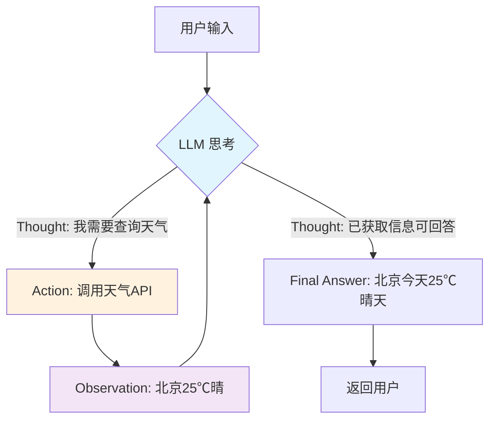
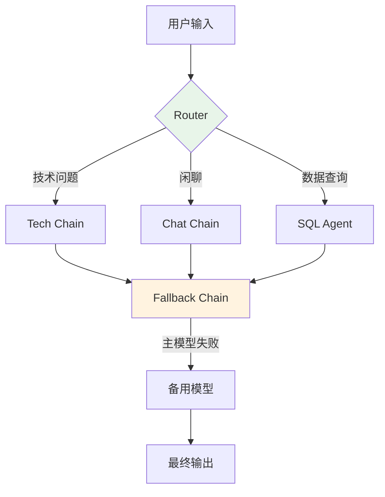
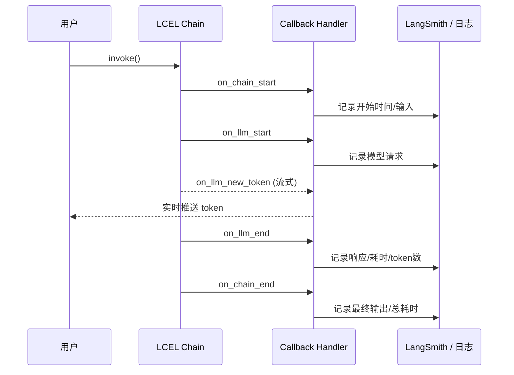
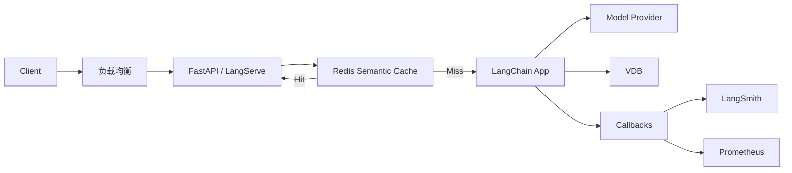

### 一、LangChain 核心基石与模型交互

本阶段是构建大语言模型应用的起点，重点在于掌握 LangChain 如何标准化对接各类大模型，并建立从输入构建到结构化输出的完整单链路闭环。建议将本阶段细分为以下四个核心模块进行学习：

#### 1. 架构认知与环境工程化准备

在编写第一行代码之前，必须建立对 LangChain 生态的宏观认知。LangChain 并非大模型本身，而是一个用于开发大语言模型应用的**编排框架**。其核心价值在于解决了大模型落地过程中的三大工程痛点：

- **标准化接口抽象：** 屏蔽了 OpenAI、Anthropic、本地 Ollama 等不同模型提供商的 API 差异，开发者只需编写一套代码即可无缝切换底层模型，避免供应商锁定。
- **组件化模块设计：** 将提示词管理、数据连接、记忆存储等通用能力封装为独立模块，支持像搭积木一样快速组装应用，提升开发效率与可维护性。
- **声明式链路编排：** 提供了将多个离散步骤串联成复杂工作流的原语，使构建检索增强生成（RAG）、智能体（Agent）等高级应用成为可能。

> **💡 概念解析：什么是“编排”？** 可以将大模型比作一个极其聪明但缺乏手脚的“大脑”。LangChain 的作用就是为这个大脑接上“神经系统”和“四肢”。它负责把用户的原始问题翻译成大脑能听懂的指令（Prompt），把外部知识喂给大脑（RAG），并把大脑的思考结果转化为具体的动作（Tool Calling）。没有编排框架，开发者就需要手动处理所有繁琐的数据转换和状态管理逻辑。

**环境配置最佳实践**

```python
# 推荐的项目初始化结构
langchain-app/
├── .env                # ⚠️ 敏感配置，切勿提交至版本控制
├── requirements.txt    # 依赖锁定
├── main.py             # 入口文件
└── chains/             # 业务链路模块

# .env 文件示例
OPENAI_API_KEY=sk-xxx
OPENAI_BASE_URL=https://api.openai.com/v1  # 支持自定义代理地址
LANGCHAIN_TRACING_V2=true                  # 开启链路追踪（生产环境强烈建议）
```

> **⚠️ 安全提示** 永远不要在代码中硬编码 API Key。在生产环境中，建议使用环境变量或密钥管理服务（如 AWS Secrets Manager、HashiCorp Vault）来注入凭证。LangChain 原生支持通过 `python-dotenv` 自动加载 `.env` 文件中的配置，这是保障应用安全的第一道防线。

#### 2. 模型接口层：LLM 与 ChatModel 的范式演进

LangChain 将模型交互抽象为两个核心接口，理解它们的区别与演进关系是正确使用框架的前提：

|特性|LLM 接口|ChatModel 接口|
|:--|:--|:--|
|**设计定位**|传统的文本补全模型|面向对话优化的聊天模型|
|**输入格式**|纯字符串|消息列表|
|**输出格式**|纯字符串|AIMessage 对象|
|**典型代表**|GPT-3.5-Instruct, Llama-2-base|GPT-4o, Claude-3, Qwen-Max|
|**推荐程度**|⭐⭐ (仅兼容旧模型时使用)|⭐⭐⭐⭐⭐ (现代应用首选)|



> **💡 背景补充：为什么 ChatModel 成为主流？** 早期的大模型（如 GPT-3）本质上是“下一个 token 预测器”，没有对话角色的概念。随着人类反馈强化学习技术的成熟，现代模型在训练阶段就引入了 System/User/Assistant 的角色区分。ChatModel 接口正是对这一范式的代码级映射。使用 ChatModel 不仅能获得更好的指令遵循能力，还能利用系统消息设定人设、约束输出格式，这是纯文本补全接口无法实现的。

#### 3. 提示词模板工程：从字符串拼接到结构化表达

直接将用户输入拼接进 Prompt 是脆弱且不可维护的。提示词模板（Prompt Template）将**结构**与**变量**分离，是实现 Prompt 工程化的关键基础设施。

```python
from langchain_core.prompts import ChatPromptTemplate

# ✅ 推荐：使用结构化消息模板
prompt = ChatPromptTemplate.from_messages([
    ("system", "你是一位资深的{domain}技术专家，回答风格严谨简洁。"),
    ("human", "请解释以下概念：{concept}")
])

# 模板渲染
formatted = prompt.invoke({
    "domain": "分布式系统",
    "concept": "CAP定理"
})
```

**高级模板技巧**

- **FewShotPromptTemplate：** 当需要模型遵循特定输出格式或风格时，动态注入示例比冗长的文字描述更有效。LangChain 支持根据输入长度动态选择示例数量，避免超出上下文窗口。
- **MessagesPlaceholder：** 在构建多轮对话链时，使用占位符预留历史消息插入位置，实现记忆的灵活注入。
- **条件分支：** 结合 LangChain Expression Language 的条件表达式，可根据用户意图动态切换不同的 System Prompt，实现单入口多角色路由。

> **💡 概念解析：Prompt 即代码** 在传统软件开发中，业务逻辑写在代码里；在 LLM 应用中，**Prompt 就是业务逻辑**。应当像对待源代码一样对待 Prompt：版本化管理、单元测试、Code Review。LangChain 的模板机制使得 Prompt 可以脱离 Python 代码独立维护，甚至可以从 YAML/JSON 文件中加载，这为 Prompt 的持续迭代提供了工程基础。

#### 4. 输出解析器与 LCEL 声明式编排

##### 4.1 输出解析器：从自由文本到结构化数据

大模型的原始输出是非结构化文本，而下游系统（数据库、API、前端）需要结构化数据。输出解析器（Output Parser）承担了“翻译官”的角色。



**常用解析器选型指南**

|解析器类型|适用场景|优势|注意事项|
|:--|:--|:--|:--|
|PydanticOutputParser|复杂结构化数据提取|自动生成 Schema 注入 Prompt，类型安全|需定义 Pydantic 模型|
|JsonOutputParser|API 对接、配置生成|通用性强，大多数模型支持良好|建议在 System Prompt 中强调 JSON 格式|
|StrOutputParser|简单文本问答、摘要|零开销，直接返回字符串|无校验能力|
|CommaSeparatedListOutputParser|标签提取、关键词列表|轻量级列表解析|分隔符可能被模型忽略|

> **💡 工程经验：防御性解析** 永远不要假设 LLM 的输出 100% 符合预期格式。在生产环境中，务必配合 `OutputFixingParser` 或 `RetryOutputParser` 使用。它们会在首次解析失败时，自动将错误信息和原始输出反馈给 LLM 进行自我修正，显著提升系统的鲁棒性。这种“解析-修复”循环是将 LLM 从玩具变为可靠服务的关键模式。

##### 4.2 LCEL 声明式编排：现代 LangChain 的核心范式

`LLMChain` 是 LangChain 早期的核心编排原语，它将 Prompt + LLM + OutputParser 封装为一个可调用单元。虽然在新版本中已被标记为遗留，但理解其设计思想有助于把握框架演进脉络。现代开发应全面采用 LangChain Expression Language。

```python
# ❌ 旧式写法（仅作理解参考）
chain = LLMChain(llm=model, prompt=prompt, output_parser=parser)
result = chain.run({"concept": "CAP定理"})

# ✅ 现代 LCEL 写法
chain = prompt | model | parser
result = chain.invoke({"concept": "CAP定理"})
```

**LCEL 的核心优势**

- **流式原生支持：** 管道中的每个组件天然支持 `.stream()`，无需额外适配即可实现打字机效果。
- **异步与批量：** 同一链路自动获得 `.ainvoke()` 和 `.batch()` 能力，充分利用并发提升吞吐。
- **可观测性集成：** 每个管道节点自动生成 Trace Span，与 LangSmith 等追踪平台无缝对接。
- **运行时配置：** 通过 `.configurable_alternatives()` 可在不修改链路定义的情况下动态替换组件（如切换模型、更换解析器）。

> **💡 概念解析：声明式 vs 命令式** 命令式编程关注“怎么做”——你需要手动管理每一步的输入输出传递、异常处理、流式转发。LCEL 是声明式的，你只需描述“做什么”——用 `|` 符号声明数据流向，框架自动处理中间的所有胶水逻辑。这不仅减少了样板代码，更重要的是**消除了人为引入 bug 的空间**。当你发现自己在写大量 `try-except` 和 `async for` 来串联组件时，说明应该回归 LCEL 的表达方式。

**阶段验证清单**

完成本阶段学习后，应能够独立完成以下验证任务：

- [ ]  使用 ChatModel 接口对接至少两种不同的模型提供商
- [ ]  构建包含 System/Human/AI 消息的结构化 Prompt 模板
- [ ]  使用 PydanticOutputParser 将 LLM 输出解析为强类型对象
- [ ]  用 LCEL 管道语法替代 LLMChain 实现相同功能
- [ ]  实现带自动修复能力的输出解析链路

### 二、数据增强与检索生成（RAG）

本阶段是 LangChain 应用从“通用对话”迈向“专业领域知识问答”的关键跨越。检索增强生成（RAG）通过外挂知识库，有效解决了大模型的知识截止、幻觉问题及私有数据接入难题。建议将本阶段细分为以下四个核心模块进行学习：

#### 1. 文档加载与数据源接入

RAG 的起点是将非结构化数据转化为可处理的文本流。LangChain 提供了超过 100 种文档加载器（Document Loaders），覆盖本地文件、数据库、API 及网页等数据源。

```python
from langchain_community.document_loaders import PyPDFLoader, WebBaseLoader

# 加载本地 PDF
pdf_loader = PyPDFLoader("technical_manual.pdf")
docs = pdf_loader.load()

# 加载网页内容
web_loader = WebBaseLoader("https://example.com/docs")
web_docs = web_loader.load()
```

> **💡 概念解析：Document 对象** LangChain 中所有加载器的输出都是统一的 `Document` 对象，包含两个核心字段：`page_content`（文本内容）和 `metadata`（元数据）。元数据是后续检索过滤、来源溯源的关键依据。在加载阶段就应尽可能丰富元数据（如文件名、页码、创建时间、章节标题），这比后期补全要高效得多。

**加载器选型原则**

|数据类型|推荐加载器|注意事项|
|:--|:--|:--|
|PDF|PyMuPDFLoader / UnstructuredPDFLoader|PyMuPDF 速度快但丢失布局；Unstructured 保留表格/图片结构但较慢|
|Word/Excel|UnstructuredWordDocumentLoader|避免使用 python-docx，对复杂格式支持差|
|网页|WebBaseLoader / SitemapLoader|SitemapLoader 适合批量抓取站点，支持并发|
|数据库|SQLDatabaseLoader|建议配合 Schema 描述使用，避免全表扫描|

> **⚠️ 工程提示：惰性加载与内存管理** 处理大规模文档时，务必使用 `.lazy_load()` 而非 `.load()`。前者返回迭代器，按需读取单个文档，避免一次性将整个语料库载入内存导致 OOM。在生产环境中，还应配合异步加载器（`.aload()`）提升 I/O 吞吐。

#### 2. 文本分割策略：语义完整性与检索精度的平衡

原始文档通常过长，既超出嵌入模型的上下文窗口，也稀释了检索时的语义密度。文本分割器（Text Splitter）负责将文档切分为语义连贯的块（Chunk）。



**关键参数调优指南**

- **chunk_size：** 通常设为 500–1000 tokens。过小丢失上下文，过大引入噪声。建议根据嵌入模型的最佳性能区间调整（如 OpenAI text-embedding-3-small 在 800 tokens 左右表现最优）。
- **chunk_overlap：** 通常设为 chunk_size 的 10%–20%。重叠区确保跨块信息不丢失，但过大会增加存储成本和检索冗余。
- **separators：** RecursiveCharacterTextSplitter 默认使用 `["\n\n", "\n", " ", ""]` 层级分隔符，优先在段落边界切分。对于特定格式文档（如 Markdown、代码），应自定义分隔符以尊重原始结构。

> **💡 背景补充：为什么不能简单按固定长度切分？** 自然语言的语义单元是句子和段落，而非字符。固定长度切分可能在单词中间、句子中途甚至代码块内部断开，导致生成的嵌入向量语义模糊，检索时无法准确匹配用户意图。递归字符分割通过多级分隔符回退机制，尽可能在自然边界处切分，是目前性价比最高的通用方案。

#### 3. 向量存储与嵌入模型

文本块需要转化为数值向量才能进行语义检索。这一过程涉及两个核心组件：嵌入模型（Embeddings）和向量数据库（Vector Store）。

```python
from langchain_openai import OpenAIEmbeddings
from langchain_chroma import Chroma

embeddings = OpenAIEmbeddings(model="text-embedding-3-small")
vectorstore = Chroma.from_documents(
    documents=chunks,
    embedding=embeddings,
    collection_name="tech_docs",
    persist_directory="./chroma_db"
)
```

**嵌入模型选型对比**

|模型|维度|多语言|成本|适用场景|
|:--|:--|:--|:--|:--|
|text-embedding-3-small|1536|✅|低|通用英文/中文，性价比首选|
|text-embedding-3-large|3072|✅|中|高精度需求，支持维度裁剪|
|bge-m3|1024|✅✅|免费|开源首选，中英混合效果优异|
|jina-embeddings-v3|1024|✅✅|低|长文本支持好（8K tokens）|

> **💡 概念解析：向量相似度搜索的本质** 向量检索并非精确匹配，而是计算高维空间中的距离（余弦相似度、欧氏距离等）。这意味着检索结果天然带有“模糊性”——它找到的是语义最相近的内容，而非关键词完全一致的内容。这种特性既是 RAG 的优势（理解同义词、 paraphrase），也是挑战（可能召回表面相关但实质无关的内容）。因此，纯向量检索往往不够，需要结合元数据过滤或混合检索来提升精度。

**向量数据库选型建议**

- **开发/原型阶段：** Chroma（纯 Python，零配置）、FAISS（内存级速度）
- **中小规模生产：** Qdrant、Weaviate（原生支持元数据过滤、混合检索）
- **大规模企业级：** Milvus、Pinecone（分布式架构、托管服务）

#### 4. 检索链路与高级检索策略

将上述组件串联即构成基础 RAG 链路，但生产级应用往往需要更精细的检索策略。

```python
from langchain_core.prompts import ChatPromptTemplate
from langchain_core.output_parsers import StrOutputParser
from langchain_core.runnables import RunnablePassthrough

prompt = ChatPromptTemplate.from_template("""
基于以下参考资料回答问题。若资料不足以回答，请明确说明。

参考资料：
{context}

问题：{question}
""")

rag_chain = (
    {"context": vectorstore.as_retriever(search_kwargs={"k": 4}), 
     "question": RunnablePassthrough()}
    | prompt
    | llm
    | StrOutputParser()
)
```

**高级检索策略**

|策略|原理|适用场景|实现方式|
|:--|:--|:--|:--|
|混合检索|向量检索 + BM25 关键词检索融合|专有名词、编号、代码等精确匹配需求|EnsembleRetriever|
|查询改写|用 LLM 重写/扩展用户查询|用户提问模糊、口语化|MultiQueryRetriever|
|父文档检索|小块检索，返回其所属的大块上下文|需要局部精确匹配 + 全局上下文|ParentDocumentRetriever|
|自查询|LLM 自动生成元数据过滤条件|结构化属性过滤（时间、作者、类别）|SelfQueryRetriever|
|重排序|粗排后用小模型精排 Top-K|对检索精度要求极高|ContextualCompressionRetriever|

> **💡 工程经验：检索质量决定 RAG 上限** RAG 系统的瓶颈几乎总是在检索环节，而非生成环节。如果检索到的内容不相关，再强的模型也无法给出正确答案。建议在投入 Prompt 优化之前，先建立检索评估体系：准备 50–100 条标注好的“问题-相关文档”测试集，量化 Recall@K、MRR 等指标。只有当检索质量达标后，生成端的优化才有意义。

**阶段验证清单**

完成本阶段学习后，应能够独立完成以下验证任务：

- [ ]  使用合适的加载器处理至少三种不同格式的文档
- [ ]  根据文档特点选择并配置文本分割策略
- [ ]  搭建完整的向量存储与检索链路
- [ ]  实现至少一种高级检索策略（如混合检索或查询改写）
- [ ]  构建端到端 RAG Chain 并能正确引用来源

### 三、智能体（Agents）与工具调用

本阶段标志着 LangChain 应用从“被动问答”向“主动执行”的质变。智能体（Agent）赋予大模型自主规划、决策和调用外部工具的能力，使其能够处理多步骤、动态变化的复杂任务。建议将本阶段细分为以下四个核心模块进行学习：

#### 1. Agent 核心原理与 ReAct 范式

理解 Agent 不能仅停留在 API 调用层面，必须掌握其背后的认知架构。目前 LangChain 及业界最主流的 Agent 范式是 **ReAct（Reasoning + Acting）**。



> **💡 概念解析：ReAct vs Chain-of-Thought** 传统的思维链（CoT）仅让模型“想”，但无法验证想法是否正确；纯动作执行（Act）则缺乏规划能力。ReAct 将两者交替进行：模型先输出思考过程（Thought），再决定执行什么动作（Action），观察环境反馈（Observation）后继续思考。这种“思考-行动-观察”的循环使 Agent 具备了自我纠错和动态调整路径的能力，是当前构建可靠 Agent 的理论基石。

**LangChain 中的 Agent 类型演进**

|Agent 类型|状态|特点|适用场景|
|:--|:--|:--|:--|
|ZeroShotReAct|⚠️ 遗留|基于 prompt 的原始 ReAct 实现|仅用于学习原理|
|ConversationalAgent|⚠️ 遗留|带记忆的单轮 ReAct|简单对话工具调用|
|ToolCallingAgent|✅ 推荐|利用模型原生 function calling 能力|现代生产环境首选|
|LangGraph Agent|✅ 前沿|基于图结构的有状态 Agent|复杂多步工作流、人机协同|

> **⚠️ 重要提示：优先使用 ToolCallingAgent** 早期 LangChain 教程大量使用 `create_react_agent` 配合自定义 Prompt，这种方式依赖模型的文本解析能力，稳定性差。现代主流模型（GPT-4o、Claude-3、Qwen-Max）均原生支持 Function Calling / Tool Use 协议。`ToolCallingAgent` 直接利用这一能力，由模型以结构化 JSON 输出工具调用参数，彻底避免了解析失败问题。**除非使用不支持 function calling 的老旧模型，否则不应再使用基于 prompt 解析的 Agent。**

#### 2. 工具（Tools）定义与注册

工具是 Agent 与外部世界交互的唯一接口。一个设计良好的工具应包含清晰的名称、准确的描述和严格的参数 Schema。

```python
from langchain_core.tools import tool
from pydantic import BaseModel, Field

class SearchInput(BaseModel):
    query: str = Field(description="搜索关键词，应为简洁的名词短语")
    max_results: int = Field(default=5, description="返回结果数量，1-10之间")

@tool(args_schema=SearchInput)
def search_knowledge_base(query: str, max_results: int = 5) -> str:
    """在企业内部知识库中搜索技术文档。
    当用户询问公司内部规范、历史项目经验或私有技术细节时使用此工具。
    不要用于查询公开互联网信息。"""
    # 实际检索逻辑
    results = vectorstore.similarity_search(query, k=max_results)
    return "\n---\n".join([doc.page_content for doc in results])
```

> **💡 工程经验：工具描述即指令** LLM 选择工具和填写参数完全依赖工具的 `name`、`description` 和 `args_schema` 中的 `Field(description=...)`。**描述的质量直接决定 Agent 的准确率**。编写工具描述时应遵循以下原则：
> 
> - 明确说明“何时使用”和“何时不使用”
> - 参数描述要具体，避免模糊表述如“相关信息”
> - 若工具返回格式特殊，在描述中说明预期输出结构
> - 保持工具粒度适中：过粗导致参数复杂，过细增加选择负担

**工具集组织策略**

- **Toolkit 封装：** 将功能相关的工具打包为 Toolkit（如 SQLDatabaseToolkit、FileManagementToolkit），便于整体加载和管理。
- **动态工具选择：** 当可用工具超过 10 个时，LLM 的选择准确率显著下降。可采用两阶段策略：先用轻量级模型或向量检索筛选出 3-5 个候选工具，再交给 Agent 精确选择。
- **工具返回值控制：** 工具返回内容应尽量精简。过长的返回值会占用上下文窗口并干扰后续推理。建议在工具内部做摘要或截断，必要时提供“获取详情”的二级工具。

#### 3. 对话记忆（Memory）机制

Agent 的价值很大程度上体现在多轮交互中。LangChain 提供了多种记忆机制，但需注意新旧版本的重大差异。

```mermaid
flowchart LR
    subgraph 旧版 Memory（已弃用）
        M1[ConversationBufferMemory]
        M2[ConversationSummaryMemory]
        M3[ConversationTokenBufferMemory]
    end
    
    subgraph 新版推荐方案
        N1[ChatMessageHistory<br/>消息存储]
        N2[RunnableWithMessageHistory<br/>链路包装器]
        N3[LangGraph Checkpointer<br/>持久化状态]
    end
    
    M1 -.->|迁移至| N1
    M2 -.->|迁移至| N1 + 手动摘要
    M3 -.->|迁移至| N2 + trim_messages
```

> **⚠️ 关键变更：Memory 模块已重构** LangChain V0.2+ 已将 `langchain.memory` 标记为遗留。新架构将“消息存储”与“记忆管理逻辑”解耦：
> 
> - **消息存储：** 使用 `ChatMessageHistory` 及其后端实现（Redis、Postgres、MongoDB 等）负责持久化
> - **记忆注入：** 使用 `RunnableWithMessageHistory` 包装 Chain/Agent，自动在每次调用前后读写历史
> - **上下文窗口管理：** 使用 `trim_messages` 函数按 token 数裁剪历史，替代旧的 TokenBufferMemory
> 
> **请勿在新项目中使用 `ConversationBufferMemory` 等旧类。**

**记忆策略选型**

|策略|实现方式|适用场景|注意事项|
|:--|:--|:--|:--|
|全量历史|ChatMessageHistory + trim_messages|短对话、高精度要求|需设置合理的 max_tokens 防止溢出|
|滑动窗口|trim_messages(strategy="last")|长对话、近期上下文优先|可能丢失早期重要信息|
|摘要记忆|LLM 定期总结历史|超长对话、保留要点|增加延迟和成本，摘要可能失真|
|实体记忆|提取关键实体存入结构化存储|用户画像、偏好追踪|需额外维护实体存储|

#### 4. LangGraph：下一代有状态 Agent 编排

对于超出简单 ReAct 循环的复杂场景，LangGraph 提供了基于图结构的 Agent 编排能力，是 LangChain 生态的前沿方向。

```python
from langgraph.graph import StateGraph, END
from typing import TypedDict, Annotated
import operator

class AgentState(TypedDict):
    messages: Annotated[list, operator.add]
    next_step: str

workflow = StateGraph(AgentState)
workflow.add_node("agent", call_model)
workflow.add_node("tools", execute_tools)
workflow.add_edge("tools", "agent")
workflow.add_conditional_edges(
    "agent",
    should_continue,
    {"continue": "tools", "end": END}
)
workflow.set_entry_point("agent")
app = workflow.compile(checkpointer=memory)
```

> **💡 概念解析：为什么需要 LangGraph？** 传统 Agent 是线性循环：思考→行动→观察→思考... 但真实世界的复杂任务往往需要：
> 
> - **并行执行：** 同时调用多个独立工具
> - **条件分支：** 根据中间结果走不同处理路径
> - **人机协同：** 在关键节点暂停等待人类审批
> - **子图嵌套：** 将复杂流程分解为可复用的子工作流
> - **持久化检查点：** 支持长时间运行任务的断点续传
> 
> LangGraph 将 Agent 建模为有向图，节点是计算单元，边是控制流，状态在图中显式传递。这种表达方式比隐式的 ReAct 循环更可控、更可调试、更适合生产环境。

**LangGraph 核心概念速览**

- **State：** 图中所有节点共享的状态对象，通过 `Annotated` 定义合并策略（如消息列表用 `operator.add` 追加）
- **Node：** 任意 Python 函数或 Runnable，接收 State 并返回部分更新
- **Edge：** 无条件边（固定跳转）或条件边（根据 State 动态路由）
- **Checkpointer：** 自动在每个节点执行后保存状态快照，支持 `.invoke(config)` 恢复执行

**阶段验证清单**

完成本阶段学习后，应能够独立完成以下验证任务：

- [ ]  使用 ToolCallingAgent 构建一个至少包含 3 个工具的智能体
- [ ]  为每个工具编写高质量的描述和 Pydantic 参数 Schema
- [ ]  使用新版 Memory 机制实现多轮对话并保持上下文
- [ ]  用 LangGraph 实现一个带条件分支的 Agent 工作流
- [ ]  对 Agent 的工具调用准确率进行量化测试并优化描述

---

> 📌 **下一阶段预告** 第四阶段「高级编排、评估与生产化部署」将聚焦 LCEL 深度用法、回调与链路追踪、自动化评估体系及性能优化，帮助你从 Demo 开发者成长为 LLM 应用工程师。准备好后请指示继续。

### 四、高级编排、评估与生产化部署

本阶段是 LangChain 学习路径的终点，也是从“原型验证”迈向“生产交付”的分水岭。重点在于掌握声明式编排的深度用法、构建可观测性与评估体系，以及应对真实流量下的性能与稳定性挑战。建议将本阶段细分为以下四个核心模块进行学习：

#### 1. LCEL 深度编排模式

LangChain Expression Language 不仅是简单的管道连接符，更是一套完整的函数式编排语言。掌握其高级模式，能够优雅地处理复杂业务逻辑，避免退化为命令式的胶水代码。



**核心编排原语**

|原语|作用|典型场景|
|:--|:--|:--|
|`RunnableParallel`|并行执行多个子链，合并结果|同时检索多个知识库、并行生成摘要与翻译|
|`RunnableBranch`|条件路由，根据输入动态选择子链|意图分类、多角色分发|
|`RunnableWithFallbacks`|故障自动切换|主模型限流时降级到备用模型、解析失败时重试|
|`RunnablePassthrough.assign`|在传递原始输入的同时注入新字段|为 Prompt 补充检索上下文、计算中间变量|
|`RunnableLambda`|将普通 Python 函数包装为 Runnable|自定义预处理/后处理逻辑，无缝嵌入管道|

> **💡 工程经验：组合优于继承** LCEL 的设计哲学是函数式组合。当发现自己在编写自定义 Chain 类或大量 `if-else` 逻辑时，应优先思考能否用上述原语表达。组合式编排不仅代码更简洁，还天然继承了流式、异步、追踪等能力。例如，`RunnableWithFallbacks` 一行代码即可实现生产级的容错机制，而命令式写法需要数十行异常处理代码。

**运行时配置与动态替换**

LCEL 支持在不修改链路定义的前提下，通过 `config` 参数动态调整行为：

```python
# 定义时标记可配置点
chain = prompt | model.configurable_alternatives(
    ConfigurableField(id="llm"),
    default_llm=gpt4o,
    claude=claude3_sonnet,
    qwen=qwen_max
) | parser

# 调用时动态指定
result = chain.invoke(
    {"question": "解释量子纠缠"},
    config={"configurable": {"llm": "claude"}}
)
```

这一机制使得同一套链路可以服务于不同租户、不同场景，是实现多模型 A/B 测试和灰度发布的基础设施。

#### 2. 回调系统与全链路可观测性

在生产环境中，LLM 应用是一个黑盒。回调系统（Callbacks）是打开这个黑盒的唯一窗口，它允许你在链路执行的每个生命周期节点注入自定义逻辑。



**内置回调处理器**

- **StreamingStdOutCallbackHandler：** 开发调试时的流式输出
- **AsyncIteratorCallbackHandler：** FastAPI/SSE 流式响应的标准适配
- **LangSmithCallbackHandler：** 自动上报至 LangSmith 平台，提供可视化追踪、成本统计和延迟分析
- **自定义 BaseCallbackHandler：** 接入 Prometheus/Grafana、写入审计日志、触发告警

> **⚠️ 关键原则：回调必须轻量且容错** 回调执行在主链路的同步/异步上下文中。**任何耗时操作（如数据库写入、HTTP 请求）都必须异步化或放入后台队列**。回调中的异常默认会中断主链路，务必用 `try-except` 包裹所有回调逻辑。生产环境中，建议使用 `await_callbacks` 或消息队列解耦，确保监控不影响核心业务可用性。

#### 3. 自动化评估体系

没有评估就没有优化。LLM 应用的评估比传统软件更复杂，因为输出具有概率性和主观性。LangChain 提供了 `langsmith` SDK 和 `ragas` 等第三方集成，构建了分层评估框架。

**评估金字塔**

|层级|评估对象|指标|工具|
|:--|:--|:--|:--|
|组件级|检索器、解析器|Recall@K, MRR, Parse Success Rate|单元测试 + 标注数据集|
|链路级|端到端 RAG/Agent|Faithfulness, Answer Relevancy, Context Precision|RAGAS / DeepEval|
|业务级|用户体验、任务完成率|CSAT, Task Completion Rate, 人工抽检|LangSmith Feedback + 埋点|

```python
# 使用 RAGAS 评估 RAG 链路示例
from ragas.metrics import faithfulness, answer_relevancy
from ragas import evaluate

results = evaluate(
    dataset=eval_dataset,
    metrics=[faithfulness, answer_relevancy],
    llm=eval_llm
)
print(results)  # {'faithfulness': 0.87, 'answer_relevancy': 0.92}
```

> **💡 概念解析：LLM-as-Judge 的局限与最佳实践** 使用大模型作为评估器（LLM-as-Judge）是当前主流方案，但需注意：
> 
> - **评估模型应强于被测模型：** 用 GPT-4o 评估 GPT-3.5 是合理的，反之则不可靠
> - **提供明确的评分 Rubric：** 模糊的“判断回答质量”远不如“从准确性、完整性、简洁性三个维度各打 1-5 分并给出理由”
> - **与人类评估对齐校准：** 定期抽样对比 LLM 评分与专家评分，计算 Cohen's Kappa 一致性系数。若一致性低于 0.7，需调整 Rubric 或更换评估模型
> - **不要过度依赖单一指标：** Faithfulness 高不代表有用，Relevancy 高不代表准确。多维度交叉验证才能反映真实质量

#### 4. 生产化部署与性能优化

Demo 跑通只是起点，生产环境需要应对并发、延迟、成本和可靠性等多重约束。

**性能优化清单**

|优化方向|具体措施|预期收益|
|:--|:--|:--|
|延迟|启用流式输出；缓存重复查询（Semantic Cache）；并行检索|首字延迟降低 60%+|
|吞吐|使用 `.batch()` / `.abatch()`；异步 I/O；连接池复用|QPS 提升 3-5x|
|成本|小模型路由简单请求；Prompt 压缩；缓存命中免调用|月度 API 费用降低 30-50%|
|可靠性|速率限制 + 指数退避重试；Fallback 链；超时控制|错误率降至 <0.1%|
|安全|输入/输出内容过滤；PII 脱敏；工具权限最小化|合规风险可控|

**部署架构建议**



> **💡 背景补充：LangServe vs 自研 API** LangServe 是 LangChain 官方提供的部署工具，可将任意 LCEL 链路一键暴露为 REST API，自带 Playground、流式支持和 OpenAPI 文档。对于内部工具或快速验证，LangServe 能节省大量后端开发时间。但对于面向外部用户的生产服务，建议基于 FastAPI 自研 API 层，以获得更精细的认证、限流、日志和业务逻辑控制。LangChain 应作为业务逻辑层嵌入，而非直接作为 HTTP 服务暴露。

**生产上线前检查清单**

- [ ]  所有 API Key 通过环境变量或密钥管理服务注入
- [ ]  链路已接入 LangSmith 或等效追踪系统
- [ ]  建立了包含 50+ 条样本的自动化评估集，并在 CI 中运行
- [ ]  实现了 Fallback 机制和超时控制
- [ ]  对检索器和 LLM 调用配置了语义缓存
- [ ]  完成了压力测试，明确了 QPS 上限和 P99 延迟基线
- [ ]  输入输出内容安全过滤已启用
- [ ]  文档化了工具描述、Prompt 模板和评估 Rubric

---

### 五、综合实战练习与能力验收

本阶段是前四个理论阶段的“熔炉”。单纯的阅读和代码片段复制无法形成肌肉记忆，只有通过解决真实场景中的模糊问题，才能真正掌握 LangChain 的工程化能力。以下练习题按难度分级，覆盖核心基石、RAG、Agent 及生产化部署四大模块，建议读者在本地搭建完整项目逐一攻克。

#### 1. 基础巩固：模型交互与结构化输出

> **🎯 训练目标** 彻底摆脱字符串拼接思维，建立“Prompt 即代码、输出即数据”的工程习惯，熟练掌握 LCEL 声明式编排。

- **练习 1.1：多角色 Prompt 模板工厂** 构建一个 Prompt 管理系统，支持从 YAML 文件加载模板。要求实现一个 `PromptFactory` 类，能够根据传入的 `role`（如 "translator", "summarizer", "code_reviewer"）动态加载对应的 System Message，并支持 Few-Shot 示例的动态注入（根据输入文本长度自动选择 1-3 个示例）。
- **练习 1.2：防御性 JSON 解析链路** 使用 LCEL 构建一个信息提取链路，要求 LLM 从非结构化简历文本中提取姓名、学历、技能列表等字段。**强制约束**：必须使用 `PydanticOutputParser` 定义 Schema，并包裹 `OutputFixingParser`。故意在测试集中混入格式错误的 LLM 模拟输出，验证修复机制的成功率。
- **练习 1.3：LCEL 并行聚合器** 实现一个“文章多维度分析器”：对用户输入的文章，**并行**执行摘要生成、情感分析、关键词提取三个子链，最后将三个结果聚合成一个结构化字典返回。要求全程使用 `RunnableParallel` 和 `RunnablePassthrough.assign`，禁止使用命令式 `asyncio.gather` 或串行调用。

#### 2. 进阶挑战：生产级 RAG 系统构建

> **🎯 训练目标** 跨越“Demo RAG”到“可用 RAG”的鸿沟，重点攻克检索精度、上下文完整性和评估体系三大难题。

- **练习 2.1：混合检索 + 重排序 Pipeline** 针对一份包含大量专有名词和技术编号的 PDF 手册，构建 RAG 系统。要求：
    1. 同时配置向量检索（Semantic）和 BM25 关键词检索；
    2. 使用 `EnsembleRetriever` 融合两路结果；
    3. 接入 Cross-Encoder 重排序模型对 Top-20 粗排结果精排，最终取 Top-5 送入 LLM。
    4. 对比纯向量检索与混合检索在 20 条标注测试集上的 Recall@5 差异。
- **练习 2.2：父文档检索策略实现** 针对长篇法律合同或技术白皮书，解决“小块检索丢失上下文”的问题。使用 `ParentDocumentRetriever`，设置子块大小为 200 tokens，父块大小为 2000 tokens。验证当用户提问涉及跨段落逻辑时，返回的上下文是否比纯小块检索更完整。
- **练习 2.3：RAG 自动化评估流水线** 使用 RAGAS 或 DeepEval 构建评估脚本。准备至少 30 条“问题-标准答案-相关文档片段”测试集，自动计算 Faithfulness、Answer Relevancy、Context Precision 三个指标。要求评估脚本可集成到 CI/CD 中，当任一指标低于阈值时阻断部署。

#### 3. 高阶实战：复杂 Agent 与有状态工作流

> **🎯 训练目标** 突破简单 ReAct 循环的限制，掌握工具设计哲学、新版 Memory 机制及 LangGraph 有状态编排。

- **练习 3.1：高质量工具集设计与压测** 为一个“企业内部 IT 运维助手”设计至少 5 个工具（如查询工单、重置密码、搜索知识库、创建审批、查询服务器状态）。要求：
    1. 每个工具必须有 Pydantic Schema 和详尽的 description（含使用时机与禁忌）；
    2. 工具返回值做精简处理，不超过 1000 tokens；
    3. 编写 20 条测试用例，量化 Agent 的工具选择准确率和参数填充正确率，通过迭代优化描述使准确率 ≥ 90%。
- **练习 3.2：新版 Memory 多轮对话系统** 构建一个带长期记忆的客服 Agent。使用 `ChatMessageHistory`（Redis 或 SQLite 后端）+ `RunnableWithMessageHistory` 包装链路。实现滑动窗口策略（保留最近 10 轮）+ 关键实体提取（用户姓名、订单号持久化存储）。验证在超过 20 轮对话后，Agent 仍能准确回忆早期关键信息且不超出上下文窗口。
- **练习 3.3：LangGraph 人机协同审批流** 使用 LangGraph 构建一个“费用报销审批 Agent”。要求包含以下节点：
    1. `extract_info`：提取报销金额、事由；
    2. `policy_check`：自动校验是否符合公司制度；
    3. `human_approval`：**中断执行**，等待人类审批（模拟通过 webhook 或 CLI 输入）；
    4. `execute_reimbursement`：审批通过后调用打款工具。 必须使用 Checkpointer 实现状态持久化，验证服务重启后能从断点恢复执行。

#### 4. 生产化验收：性能、可观测性与安全

> **🎯 训练目标** 建立工程化交付意识，确保应用在高并发、故障和安全威胁下依然稳健。

- **练习 4.1：全链路追踪与告警** 将任意上述练习的链路接入 LangSmith 或自建 OpenTelemetry 追踪。实现自定义 Callback Handler，当单次 LLM 调用延迟 > 5s 或 Token 消耗 > 2000 时，自动发送告警（邮件/钉钉/Webhook）。在 LangSmith 中完成一次完整的 Trace 分析，定位瓶颈节点。
- **练习 4.2：语义缓存与 Fallback 容错** 为 RAG 链路接入 Redis 语义缓存（相似度阈值 0.95），验证相同语义问题的缓存命中率和延迟降低效果。同时配置 `RunnableWithFallbacks`，当主模型 API 返回 429/500 时自动切换至备用模型，并记录降级事件日志。
- **练习 4.3：安全护栏集成** 在 Agent 的输入和输出端各加一层内容安全过滤。输入端拦截 Prompt Injection 攻击（如“忽略之前指令”）；输出端过滤 PII 信息（手机号、身份证）和敏感词。使用 10 条恶意测试用例验证拦截成功率。

#### 📝 练习执行建议与自检标准

|维度|合格标准|优秀标准|
|:--|:--|:--|
|**代码规范**|无硬编码 Key，类型注解完整|模块化拆分，单元测试覆盖率 > 70%|
|**检索质量**|Recall@5 ≥ 0.7|Recall@5 ≥ 0.85，有量化对比报告|
|**Agent 准确率**|工具选择准确率 ≥ 80%|准确率 ≥ 95%，有失败案例分析与描述迭代记录|
|**生产就绪**|有追踪、有 Fallback、有缓存|完成压测报告，P99 延迟达标，安全护栏通过红队测试|
|**文档沉淀**|README 说明运行方式|包含架构图、评估 Rubric、Prompt 版本变更记录|

> **💡 终极建议：构建个人作品集** 不要将练习停留在本地文件夹。选择 1-2 个完成度最高的练习，完善文档、补充测试、部署为可访问的 Demo（如 Streamlit Cloud / Hugging Face Spaces），并发布到 GitHub。一个有评估数据、有追踪截图、有失败复盘的 LangChain 项目，远比简历上“熟悉 LangChain”更有说服力。在完成所有练习后，你将不再是一个框架的使用者，而是一个具备独立交付能力的 LLM 应用工程师。